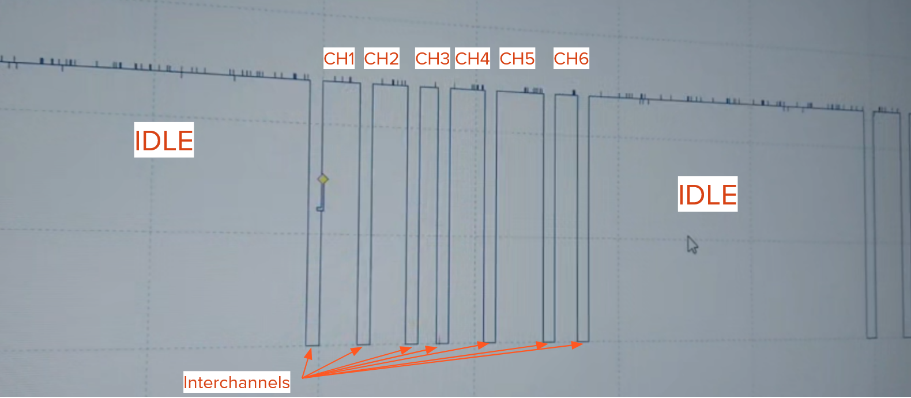
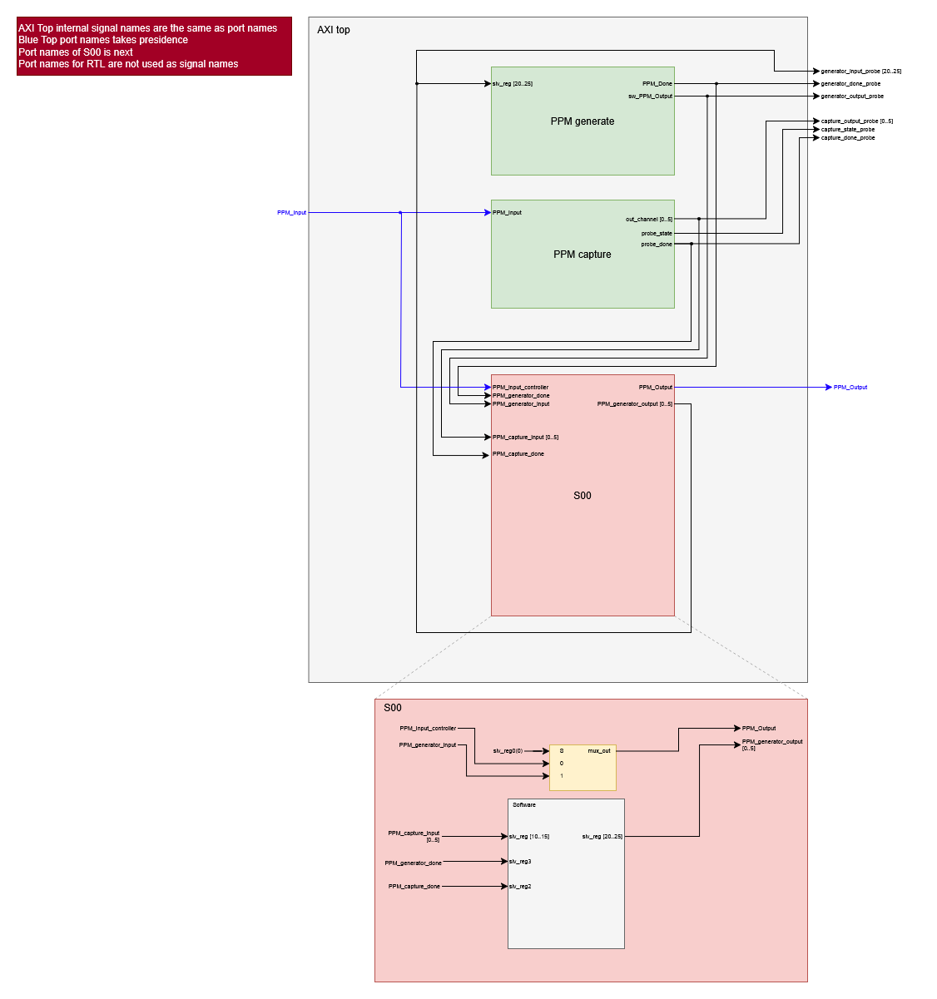
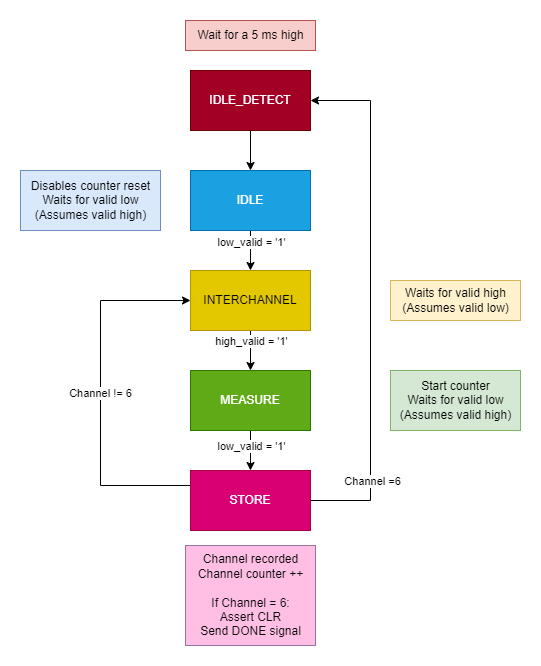

<h1 style="text-align:center">SB3 MP1 Report</h1>

## In your writeup, describe your experiences in practicing controlling the quad.

We found that flying the drone wasn't too hard, but rather, the hardware was the most problematic part of controlling the quadcopter. Trying to learn how to fly the drone with multiple quadcopters that had broken motors or battery problems turned out to be quite a task. Even at max throttle, most batteries we used couldn't lift the drone off the ground. It also took us too long of a time to realize that the trim of our right joystick was too high, preventing us from moving backward or keeping the drone stable.

## In your writeup, describe the PPM signals. What do each of the channels correspond to, and what are their minimum and maximum ranges? What is the total length of the individual PPM frames, and what is the minimum length of the idle pulse?

We were able to probe the HK-T6A controller with the Picoscope. Analysing the PPM wave form generated by the controller, we inferred the following;



From this observation, we measured the channels, interchannels, and overall frame. In general, we found that the interchannels were consistantly around 400 us, the overall frame was roughly 20 ms, and each channel had a maximum pulse width of about 1.1 ms and a minumum pulse width of about 600 us. With all channels set to their maximum width, we would see an minumum idle pulse of 11 ms. 

## Based on the ZedBoard documentation and your oscilloscope measurement of the trainer port, what concerns do you have about making this connection?

TODO: Were there any other major issues?

The only real issue was VCC mismatch between the two systems - the HA-T6A controller had a 5V VCC but the Zedboard had a 3.3V VCC. To avoid frying the Zedboard, we were provided a Sparkfun Logic Level Converter which down stepped from 5V to 3.3V and upstepped from 3.3V to 5V. 

## In your write up, provide a structural diagram of the axi_ppm design, from the top-level AMBA AXI interface down to where you user logic will reside. 

Attached below is a figure that represents the structure of our custom AMBA AXI4-Lite IP for the axi_ppm design for subsection A. At the highest level, we instantiated our RTL for our PPM capture and generate FSMs. We also created probes that were accessible by ILAs on the main design. However, it should be noted that the probes were removed once the AXI was functioning as expected. Additional signals were used to connect the FSM outputs and inputs to the AXI slave instatiation. In the slave, FSM inputs are relayed to their respective slave registers, which in turn are configured to be accessed by software. An additional mux was described to switch between software and hardware relay modes. 

It should be noted that subsection B deviated in this design by instantiating their PPM capture and generate FSMs in the slave instatiation instead of at the top level. In hindsight, we believe this was the better approach as it eliminated the need for excess signals at the top level. 



## How does an address on the AMBA bus generate a read or write enable signal for the slave registers in your design, and how will your PPM state machine get access to the IP core’s Memory Mapped registers?

### Address decoding 

The design uses address bits [ADDR_LSB+OPT_MEM_ADDR_BITS:ADDR_LSB] to select which register to access:

- `ADDR_LSB` is set to (`C_S_AXI_DATA_WIDTH`/32) + 1, which is typically 2 for 32-bit buses (addressing by words)
- `OPT_MEM_ADDR_BITS` is set to 3, allowing for 16 registers ($2^4 = 16$)

The AMBA AXI IP is connected to the Zynq processor on the main design through an AXI interconnect. This connection allows for a base address to be mapped for the IP which enables software access to the 16 slave registers (slv_reg) instantiated in the slave AXI. In order to access the individual slave registers, we had to introduce an appropriate offset to the address. In our case, it was + 0x4 per register. We believed this to be the case as the slave register sizes were set to 32 bits, or 4 bytes. So, for our design, since the base address for the AXI IP was 0x43C00000, our subsequent registers were mapped as such;

 slv_reg0 = 0x43C00000 \
 slv_reg1 = 0x43C00004 \
 slv_reg2 = 0x43C00008 \
 ... \
 slv_regX = 0x43C00000 + (4 * X)

For example, with a 32-bit data bus, the design decodes address bits `[5:2]` to select among the 16 registers. The decoded value creates a 4-bit index (b"0000" to b"1111") that selects registers slv_reg0 through slv_reg15.

- [x] How does the PPM state machine get access to the IP core's Memory Mapped registers:

### Write Enable Process

In AXI, a write transaction requires both address and data channels to be valid. The design generates a write enable signal (`slv_reg_wren`) when all the following conditions are met:

1. The slave is ready to accept a write address (`axi_awready = '1'`)
2. The master is presenting a valid write address (`S_AXI_AWVALID = '1'`)
3. The slave is ready to accept write data (`axi_wready = '1'`)
4. The master is presenting valid write data (`S_AXI_WVALID = '1'`)

This is implemented in the code with:
```vhdl
slv_reg_wren <= axi_wready AND S_AXI_WVALID AND axi_awready AND S_AXI_AWVALID;
```

When this signal is asserted, the design decodes the address to determine which register to write to:

1. The address comes from `axi_awaddr`, which latches the AXI address `S_AXI_AWADDR` when a valid address is presented
2. The address is decoded by extracting the relevant bits:
   ```vhdl
   loc_addr := axi_awaddr(ADDR_LSB + OPT_MEM_ADDR_BITS DOWNTO ADDR_LSB);
   ```
3. A CASE statement selects the appropriate register based on the decoded address
4. Write strobes (`S_AXI_WSTRB`) enable byte-level granularity for writes

### Read Enable Process

The read enable signal (`slv_reg_rden`) is generated when:

1. The slave is ready to accept a read address (`axi_arready = '1'`)
2. The master is presenting a valid read address (`S_AXI_ARVALID = '1'`)
3. The read data channel is not already valid (`NOT axi_rvalid`)

This is implemented with:
```vhdl
slv_reg_rden <= axi_arready AND S_AXI_ARVALID AND (NOT axi_rvalid);
```

When a read is enabled:

1. The address comes from `axi_araddr`, which latches `S_AXI_ARADDR` when presented
2. The address is decoded similar to writes:
```vhdl
loc_addr := axi_araddr(ADDR_LSB + OPT_MEM_ADDR_BITS DOWNTO ADDR_LSB);
```
1. A CASE statement selects the appropriate register to output based on the decoded address
2. The selected register value is placed in `reg_data_out`
3. When `slv_reg_rden` is asserted, `reg_data_out` is loaded into `axi_rdata` to be sent to the master


## Starting from the generic FSMs in your HW-1 write-up, update the User Logic module such that the design can appropriately capture and generate PPM values for the Hobby King 6ch transmitter as described above.

Sicne both subsections worked individually on this lab, our approaches to finite state machines for PPM detection and generation design were relatively different. For that reason, we've decided to include both groups' work in this report. 

### Subsection A:
#### PPM Capture State Machine 

The PPM detect state machine (`Capture_PPM_simp.vhd`) is instantiated in the AXI interface model and relayed into the AXI slave and the respective registers.

```vhdl
Capture_PPM_simp_inst : Capture_PPM_simp
    port map (
        PPM_Input => PPM_Input,
        CLK => s00_axi_aclk,
        CLR => s00_axi_aresetn,
        out_channel_1 => PPM_capture_input_0,
        out_channel_2 => PPM_capture_input_1,
        out_channel_3 => PPM_capture_input_2,
        out_channel_4 => PPM_capture_input_3,
        out_channel_5 => PPM_capture_input_4,
        out_channel_6 => PPM_capture_input_5,

        probe_state => capture_state_probe,
        probe_done => PPM_capture_done,
        channel_counter_out => PPM_capture_channel_counter
    );
```

This detector FSM recieves a PPM signal from the controller inputs sent in from PPM_Input. The state machine will then parse the PPM signal assuming the idle segment of the signal is greater than 5 ms. In order to avoid debouncing errors, a shift register is used to ensure the PPM input has been high or low for 20 cycles. A 32-bit internal counter is used to measure channel widths. Individual channels are latched to individual output registers which are then relayed to their respective slave registers in the AMBA AXI slave (slv_reg10 through slv_reg15). Additionally, a done signal is produced when a frame is completed. This output is fed into slv_reg2 in the AMBA AXI slave. A probe for the current state and channel counter was implemented as well for real-time troubleshooting. 

Below is a diagram which illustrates the detector FSM. 



#### PPM Generator State Machine

TODO: Generator State Machine stuffs

### Subsection B:

#### PPM Detector State Machine Access

The PPM detector state machine (`detect_fsm`) is instantiated in the AXI interface module and connected directly to certain signals and registers:

```vhdl
detect_fsm : ENTITY ppm.detect_fsm PORT MAP
(
    i_clk => S_AXI_ACLK,
    i_rst_n => S_AXI_ARESETN,
    i_ppm => i_ppm,
    i_start => slv_reg0(1),
    o_channel_read => s_channel_read,
    o_state => s_detect_state,
    o_count => s_ppm_count,
    o_reg_sel => s_detect_reg_sel
);
```

The detector FSM:
- Receives a start signal from slv_reg0 bit 1 (`i_start => slv_reg0(1)`)
- Outputs the pulse counts via `s_ppm_count`
- Indicates which register to update via `s_detect_reg_sel`
- Signals when a channel has been read via `s_channel_read`

The results from the detector are then written to the appropriate registers (`slv_reg2` through `slv_reg7`) in a dedicated process:

```vhdl
DETECT_PPM_UPDATE : PROCESS (S_AXI_ACLK) IS
BEGIN
    IF (rising_edge(S_AXI_ACLK)) THEN
        IF (S_AXI_ARESETN = '0') THEN
            slv_reg2 <= (OTHERS => '0');
            slv_reg3 <= (OTHERS => '0');
            -- ...
        ELSE
            IF (s_channel_read = '1') THEN
                CASE(s_detect_reg_sel) IS
                    WHEN B"000" =>
                    slv_reg2 <= s_ppm_count;
                    WHEN B"001" =>
                    slv_reg3 <= s_ppm_count;
                    -- ...
                END CASE;
            END IF;
        END IF;
    END IF;
END PROCESS DETECT_PPM_UPDATE;
```

#### PPM Generator State Machine Access

The PPM generator state machine is similarly instantiated and connected:

```vhdl
generate_fsm : ENTITY ppm.generate_fsm
    GENERIC MAP(
        N => C_S_AXI_DATA_WIDTH
    )
    PORT MAP(
        i_clk => S_AXI_ACLK,
        i_rst => S_AXI_ARESETN,
        i_slv_reg20 => s_gen_reg20,
        i_slv_reg21 => s_gen_reg21,
        -- ...
        o_done => s_gen_done,
        o_ppm => o_ppm
    );
```

The generator FSM receives its configuration values through intermediate signals (`s_gen_reg20` through `s_gen_reg25`). These signals are updated in a separate process that determines whether to source the values from:

1. Software mode (slv_reg8 through slv_reg13) when slv_reg0(0) = '1'
2. Hardware relay mode (slv_reg2 through slv_reg7) when slv_reg0(0) = '0'

```vhdl
GENERATE_PPM_UPDATE : PROCESS (S_AXI_ACLK) IS
BEGIN
    IF rising_edge(S_AXI_ACLK) THEN
        IF slv_reg0(0) = '1' THEN
            -- software relay mode
            s_gen_reg20 <= slv_reg8;
            s_gen_reg21 <= slv_reg9;
            -- ...
        ELSE
            -- hardware relay mode
            s_gen_reg20 <= slv_reg2;
            s_gen_reg21 <= slv_reg3;
            -- ...
        END IF;
    END IF;
END PROCESS GENERATE_PPM_UPDATE;
```

#### Key Architecture Points

1. **No Direct Register Access**: The FSMs don't directly read from or write to the AXI interface. Instead, they interface through signals and dedicated processes.

2. **Intermediary Signals**: All communication between the AXI interface and the state machines occurs through intermediary signals (e.g., `s_ppm_count`, `s_detect_reg_sel`, etc.)

3. **Dedicated Update Processes**: Separate processes handle the transfer of data between the state machines and registers, acting as a bridge between the AXI domain and the functional logic.

4. **Synchronous Updates**: All updates happen synchronously with the AXI clock, ensuring consistent timing between the bus interface and the internal state machines.

- [x] Generator Implementation:


TODO: Maybe point towards the file within the repo instead of having the code in the report?

<!-- After breaking apart some generic types and constants in user_defines, we defined our `generate_fsm` module as follows:

```vhdl
LIBRARY IEEE;
USE IEEE.numeric_std.ALL;
USE IEEE.STD_LOGIC_1164.ALL;
USE IEEE.STD_LOGIC_ARITH.ALL;
USE IEEE.STD_LOGIC_UNSIGNED.ALL;
USE work.user_defines.ALL;

ENTITY generate_fsm IS

    GENERIC (
        N : INTEGER := REG_SIZE
    );
    PORT (
        i_clk : IN STD_LOGIC;
        i_rst : IN STD_LOGIC;
        i_slv_reg20, i_slv_reg21, i_slv_reg22 : IN STD_LOGIC_VECTOR(N - 1 DOWNTO 0);
        i_slv_reg23, i_slv_reg24, i_slv_reg25 : IN STD_LOGIC_VECTOR(N - 1 DOWNTO 0);
        o_done : OUT STD_LOGIC;
        o_ppm : OUT STD_LOGIC
    );

END generate_fsm;

ARCHITECTURE Behavioral OF generate_fsm IS

    SIGNAL s_prev_state, s_next_state : state_type;
    SIGNAL s_cycle_counter : STD_LOGIC_VECTOR(31 DOWNTO 0);
    SIGNAL s_cycle_counter_total : STD_LOGIC_VECTOR(31 DOWNTO 0);
    SIGNAL s_channel_index : INTEGER RANGE 0 TO 5;
    SIGNAL s_pulse_widths : pulse_width_array;

BEGIN

    PROCESS (i_clk)
    BEGIN
        IF rising_edge(i_clk) THEN
            IF i_rst = '0' THEN
                s_prev_state <= IDLE;
            ELSE
                s_prev_state <= s_next_state;
            END IF;
        END IF;
    END PROCESS;

    PROCESS (s_prev_state, i_rst)
    BEGIN
        CASE s_prev_state IS
            WHEN IDLE_PULSE =>
                IF s_cycle_counter_total < FRAME_COUNT THEN
                    s_next_state <= IDLE_PULSE;
                ELSE
                    s_next_state <= IDLE;
                END IF;

            WHEN IDLE =>
                IF i_rst = '0' THEN
                    s_next_state <= IDLE;
                ELSE
                    s_next_state <= GAP_LOW;
                END IF;

            WHEN IDLE_LOW_PULSE =>
                IF s_cycle_counter >= GAP_COUNT THEN
                    s_next_state <= IDLE_PULSE;
                ELSE
                    s_next_state <= IDLE_LOW_PULSE;
                END IF;

            WHEN GAP_LOW =>
                IF s_cycle_counter >= GAP_COUNT THEN
                    s_next_state <= PULSE_HIGH;
                ELSE
                    s_next_state <= GAP_LOW;
                END IF;

            WHEN PULSE_HIGH =>
                IF (s_cycle_counter - GAP_COUNT) >= s_pulse_widths(s_channel_index)(31 DOWNTO 0) THEN
                    IF s_channel_index = 5 THEN
                        s_next_state <= FRAME_COMPLETE;
                    ELSE
                        s_next_state <= NEXT_CHANNEL;
                    END IF;
                ELSE
                    s_next_state <= PULSE_HIGH;
                END IF;

            WHEN NEXT_CHANNEL =>
                s_next_state <= GAP_LOW;

            WHEN FRAME_COMPLETE =>
                s_next_state <= IDLE_LOW_PULSE;

            WHEN OTHERS =>
                s_next_state <= IDLE;
        END CASE;
    END PROCESS;

    PROCESS (i_clk)
    BEGIN
        IF rising_edge(i_clk) THEN
            IF i_rst = '0' THEN
                s_cycle_counter <= (OTHERS => '0');
                s_cycle_counter_total <= (OTHERS => '0');
                s_channel_index <= 0;
                o_ppm <= '1';
                o_done <= '0';
            ELSE
                CASE s_prev_state IS
                    WHEN IDLE_PULSE =>
                        o_ppm <= '1';
                        o_done <= '1';
                        s_channel_index <= 0;
                        s_cycle_counter <= (OTHERS => '0');
                        s_cycle_counter_total <= s_cycle_counter_total + 1;
                    WHEN PULSE_HIGH =>
                        o_ppm <= '1';
                        o_done <= '0';
                        s_cycle_counter <= s_cycle_counter + 1;
                        s_cycle_counter_total <= s_cycle_counter_total + 1;
                    WHEN IDLE =>
                        o_ppm <= '1';
                        o_done <= '0';
                        s_channel_index <= 0;
                        s_cycle_counter <= (OTHERS => '0');
                        s_cycle_counter_total <= (OTHERS => '0');
                    WHEN IDLE_LOW_PULSE =>
                        o_ppm <= '0';
                        o_done <= '0';
                        s_cycle_counter <= s_cycle_counter + 1;
                        s_cycle_counter_total <= s_cycle_counter_total + 1;
                    WHEN GAP_LOW =>
                        o_ppm <= '0';
                        o_done <= '0';
                        s_cycle_counter <= s_cycle_counter + 1;
                        s_cycle_counter_total <= s_cycle_counter_total + 1;
                    WHEN NEXT_CHANNEL =>
                        s_channel_index <= s_channel_index + 1;
                        s_cycle_counter <= (OTHERS => '0');
                        o_done <= '0';
                    WHEN FRAME_COMPLETE =>
                        s_cycle_counter <= (OTHERS => '0');
                        s_channel_index <= 0;
                        o_done <= '0';
                    WHEN OTHERS =>
                        s_cycle_counter <= (OTHERS => '0');
                END CASE;
            END IF;
        END IF;
    END PROCESS;

    PROCESS (i_clk)
    BEGIN
        IF rising_edge(i_clk) THEN
            IF i_rst = '0' THEN
                s_pulse_widths <= (OTHERS => (OTHERS => '0'));
            ELSE
                s_pulse_widths(0) <= i_slv_reg20;
                s_pulse_widths(1) <= i_slv_reg21;
                s_pulse_widths(2) <= i_slv_reg22;
                s_pulse_widths(3) <= i_slv_reg23;
                s_pulse_widths(4) <= i_slv_reg24;
                s_pulse_widths(5) <= i_slv_reg25;
            END IF;
        END IF;
    END PROCESS;

END Behavioral;
```

Our testbench implementation further proved our functionality:


- [ ] Detection implementation

 -->
