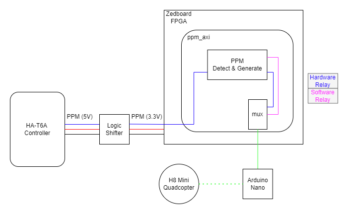
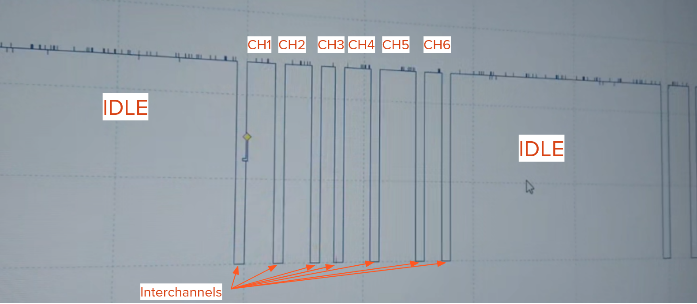
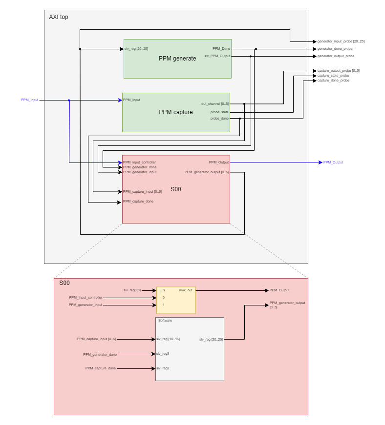
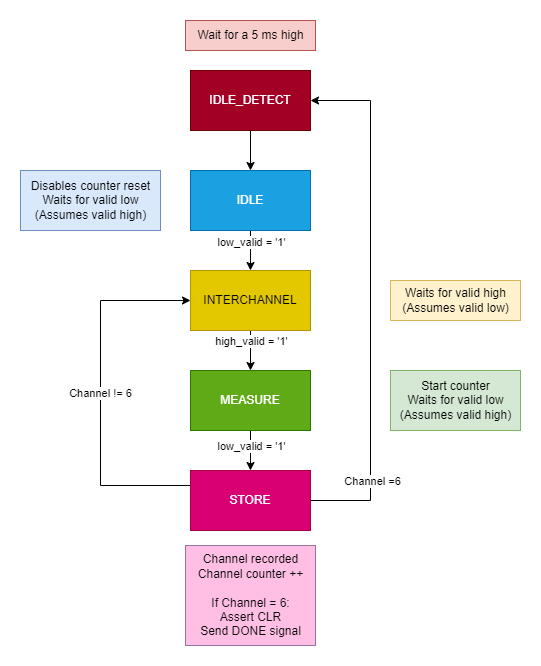
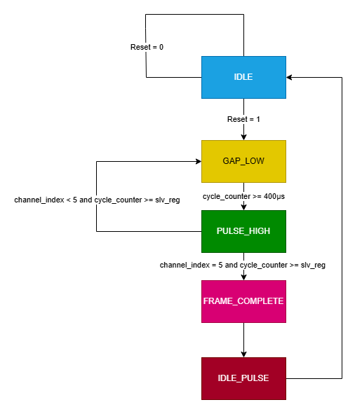
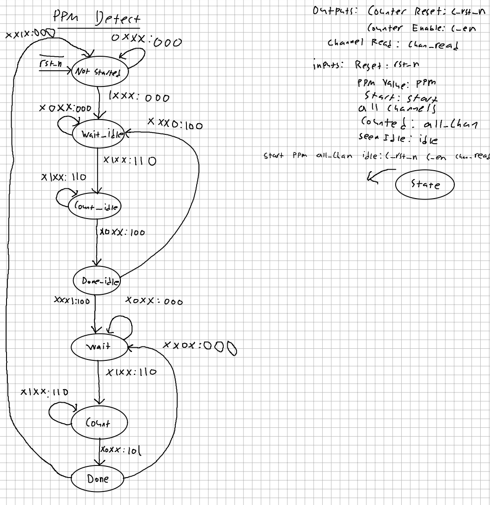

<h1 style="text-align:center">SB3 MP1 Report</h1>

Machine Project 1 is an embedded systems design lab with the goal of implementing and deploying a Positional Pulse Modulation (PPM) detection and generate circuit on a Zedboard FPGA using VHDL. This custom circuit had to be able to detect an incoming PPM signal from an HA-T6A RC controller and generate an identical signal. The final project features a C program that allows users to switch between a hardware relay mode, which relays the HA-T6A raw input, and a software relay mode, which relays the generated PPM output. This C program also allows users to debug the PPM detection circuit, record and play controller inputs for UAV flight, and ease flight controls through a filter mode. 
This report covers the work of section B3 of CPRE 488 and highlights the differences between subsections



## In your writeup, describe your experiences in practicing controlling the quad.

We found that flying the drone wasn't too hard, but rather, the hardware was the most problematic part of controlling the quadcopter. Trying to learn how to fly the drone with multiple quadcopters that had broken motors or battery problems turned out to be quite a task. Even at max throttle, most batteries we used couldn't lift the drone off the ground. It also took us too long of a time to realize that the trim of our right joystick was too high, preventing us from moving backward or keeping the drone stable.

We also noticed that the trim values needed to be adjusted on almost every drone to make them hover properly. Though it took some time to fine-tune the trim, it allowed us to control the drones much easier.

## In your writeup, describe the PPM signals. What do each of the channels correspond to, and what are their minimum and maximum ranges? What is the total length of the individual PPM frames, and what is the minimum length of the idle pulse?

We were able to probe the HK-T6A controller with the Picoscope. Analysing the PPM wave form generated by the controller, we inferred the following;



From this observation, we measured the channels, interchannels, and overall frame. In general, we found that the interchannels were consistently around 400 us, the overall frame was roughly 20 ms, and each channel had a maximum pulse width of about 1.1 ms and a minimum pulse width of about 600 us. With all channels set to their maximum width, we would see an minimum idle pulse of 11 ms. 

Testing the controls, we found that each of the channels corresponded to the following controls:
- CH1: Right joystick (Horizontal)
- CH2: Right joystick (Vertical)
- CH3: Left joystick (Vertical)
- CH4: Left joystick (Horizontal)
- CH5: Pit Trim
- CH6: HOV Pit

## Based on the ZedBoard documentation and your oscilloscope measurement of the trainer port, what concerns do you have about making this connection?

The only real issue was VCC mismatch between the two systems - the HA-T6A controller had a 5V VCC but the Zedboard had a 3.3V VCC. To avoid frying the Zedboard, we were provided a Sparkfun Logic Level Converter which down stepped from 5V to 3.3V and upstepped from 3.3V to 5V. 

## In your write up, provide a structural diagram of the axi_ppm design, from the top-level AMBA AXI interface down to where you user logic will reside. 

Attached below is a figure that represents the structure of our custom AMBA AXI4-Lite IP for the axi_ppm design for subsection A. At the highest level, we instantiated our RTL for our PPM capture and generate FSMs. We also created probes that were accessible by ILAs on the main design. However, it should be noted that the probes were removed once the AXI was functioning as expected. Additional signals were used to connect the FSM outputs and inputs to the AXI slave instantiation. In the slave, FSM inputs are relayed to their respective slave registers, which in turn are configured to be accessed by software. An additional mux was described to switch between software and hardware relay modes. 

It should be noted that subsection B deviated in this design by instantiating their PPM capture and generate FSMs in the slave instantiation instead of at the top level. In hindsight, we believe this was the better approach as it eliminated the need for excess signals at the top level. 



## How does an address on the AMBA bus generate a read or write enable signal for the slave registers in your design, and how will your PPM state machine get access to the IP core’s Memory Mapped registers?

### Address decoding 

The design uses address bits [ADDR_LSB+OPT_MEM_ADDR_BITS:ADDR_LSB] to select which register to access:

- `ADDR_LSB` is set to (`C_S_AXI_DATA_WIDTH`/32) + 1, which is typically 2 for 32-bit buses (addressing by words)
- `OPT_MEM_ADDR_BITS` is set to 3, allowing for 16 registers ($2^4 = 16$)

The AMBA AXI IP is connected to the Zynq processor on the main design through an AXI interconnect. This connection allows for a base address to be mapped for the IP which enables software access to the 16 slave registers (slv_reg) instantiated in the slave AXI. In order to access the individual slave registers, we had to introduce an appropriate offset to the address. In our case, it was + 0x4 per register. We believed this to be the case as the slave register sizes were set to 32 bits, or 4 bytes. So, for our design, since the base address for the AXI IP was 0x43C00000, our subsequent registers were mapped as such;

 slv_reg0 = 0x43C00000 \
 slv_reg1 = 0x43C00004 \
 slv_reg2 = 0x43C00008 \
 ... \
 slv_regX = 0x43C00000 + (4 * X)

For example, with a 32-bit data bus, the design decodes address bits `[5:2]` to select among the 16 registers. The decoded value creates a 4-bit index (b"0000" to b"1111") that selects registers slv_reg0 through slv_reg15.

## How does the PPM state machine get access to the IP core's Memory Mapped registers:

### Write Enable Process

In AXI, a write transaction requires both address and data channels to be valid. The design generates a write enable signal (`slv_reg_wren`) when all the following conditions are met:

1. The slave is ready to accept a write address (`axi_awready = '1'`)
2. The master is presenting a valid write address (`S_AXI_AWVALID = '1'`)
3. The slave is ready to accept write data (`axi_wready = '1'`)
4. The master is presenting valid write data (`S_AXI_WVALID = '1'`)

This is implemented in the code with:
```vhdl
slv_reg_wren <= axi_wready AND S_AXI_WVALID AND axi_awready AND S_AXI_AWVALID;
```

When this signal is asserted, the design decodes the address to determine which register to write to:

1. The address comes from `axi_awaddr`, which latches the AXI address `S_AXI_AWADDR` when a valid address is presented
2. The address is decoded by extracting the relevant bits:
   ```vhdl
   loc_addr := axi_awaddr(ADDR_LSB + OPT_MEM_ADDR_BITS DOWNTO ADDR_LSB);
   ```
3. A CASE statement selects the appropriate register based on the decoded address
4. Write strobes (`S_AXI_WSTRB`) enable byte-level granularity for writes

### Read Enable Process

The read enable signal (`slv_reg_rden`) is generated when:

1. The slave is ready to accept a read address (`axi_arready = '1'`)
2. The master is presenting a valid read address (`S_AXI_ARVALID = '1'`)
3. The read data channel is not already valid (`NOT axi_rvalid`)

This is implemented with:
```vhdl
slv_reg_rden <= axi_arready AND S_AXI_ARVALID AND (NOT axi_rvalid);
```

When a read is enabled:

1. The address comes from `axi_araddr`, which latches `S_AXI_ARADDR` when presented
2. The address is decoded similar to writes:
```vhdl
loc_addr := axi_araddr(ADDR_LSB + OPT_MEM_ADDR_BITS DOWNTO ADDR_LSB);
```
1. A CASE statement selects the appropriate register to output based on the decoded address
2. The selected register value is placed in `reg_data_out`
3. When `slv_reg_rden` is asserted, `reg_data_out` is loaded into `axi_rdata` to be sent to the master


## Starting from the generic FSMs in your HW-1 write-up, update the User Logic module such that the design can appropriately capture and generate PPM values for the Hobby King 6ch transmitter as described above.

Since both subsections worked individually on this lab, our approaches to finite state machines for PPM detection and generation design were relatively different. For that reason, we've decided to include both groups' work in this report. 

### Subsection A:
#### PPM Capture State Machine 

The PPM detect state machine (`Capture_PPM_simp.vhd`) is instantiated in the AXI interface model and relayed into the AXI slave and the respective registers.

```vhdl
Capture_PPM_simp_inst : Capture_PPM_simp
    port map (
        PPM_Input => PPM_Input,
        CLK => s00_axi_aclk,
        CLR => s00_axi_aresetn,
        out_channel_1 => PPM_capture_input_0,
        out_channel_2 => PPM_capture_input_1,
        out_channel_3 => PPM_capture_input_2,
        out_channel_4 => PPM_capture_input_3,
        out_channel_5 => PPM_capture_input_4,
        out_channel_6 => PPM_capture_input_5,

        probe_state => capture_state_probe,
        probe_done => PPM_capture_done,
        channel_counter_out => PPM_capture_channel_counter
    );
```

This detector FSM receives a PPM signal from the controller inputs sent in from PPM_Input. The state machine will then parse the PPM signal assuming the idle segment of the signal is greater than 5 ms. In order to avoid debouncing errors, a shift register is used to ensure the PPM input has been high or low for 20 cycles. A 32-bit internal counter is used to measure channel widths. Individual channels are latched to individual output registers which are then relayed to their respective slave registers in the AMBA AXI slave (slv_reg10 through slv_reg15). Additionally, a done signal is produced when a frame is completed. This output is fed into slv_reg2 in the AMBA AXI slave. A probe for the current state and channel counter was implemented as well for real-time troubleshooting. 

Below is a diagram which illustrates the detector FSM. 



#### PPM Generator State Machine




The Generate PPM works by running four different processes. The first one is the standard present state to new state logic. This state is used to move between states. The next process was the logic to determine that next state. This process ensured that the low pulses were 400μs, the high pulse output the duration of the intended register, and an idle pulse for the remainder of the duration of the 20ms frame. This was all done in a non-clocked process, which used a data set in the next clocked process. This was where the main logic of the FSM was done. This clocked process incremented counters, reset values, and determined the output, all based on the current state. With the final process setting the register values of the output. This FSM received the output of the capture, the recorded values in play mode, and the filtered values in filter mode and outputted the 6-channel response over the PMOD. 

### Subsection B:

#### PPM Detector State Machine

##### State Diagram
Below is the state diagram for the PPM Detector FSM:



**Output Descriptions**
The outputs `c_rst_n, c_en` are the reset and enable signals respectively for the pulse counter. The pulse counter determines how long a PPM pulse lasts for in units of clock counts. The counter value is an output from the FSM that is provided to the registers that contain the PPM pulse widths. The `chan_read` output acts as the write enable for the registers that will store the PPM values.

**Input Descriptions**
The input `start` determines when the FSM should leave the `NOT_STARTED` state. This allows the C program to control when the FSM runs. The input `ppm` is the current PPM value read from the RC controller. This is used to determine when a PPM pulse starts or ends. In the final design, the `PPM` input is driven by a counter that counts how many clock cycles the real `PPM` input has been high or low for. Then, the counter only outputs the `PPM` signal when the real `PPM` signal has been high or low for a certain amount of clock cycles. This helps combat noisy signals and makes sure the FSM doesn't transition when it should not. The input `all_chan` indicates when all 6 of the channels (or pulses) have been counted. Once we have counted all 6, the FSM can return to its `NOT_STARTED` state since it has finished. Finally the `idle` input indicates when the idle pulse has been seen. To synchronize the channel reads, the circuit must identify where the idle pulse is. Once the idle pulse is identified it is know that the next seen pulse will be channel 1. To detect the idle pulse, the pulse counter is used, but there exists a special condition. The FSM input `idle` is only asserted when a pulse 5 ms or longer has been detected by the pulse counter.

**State Descriptions**
There are seven states in this FSM: `NOT_STARTED, WAIT_IDLE, COUNT_IDLE, DONE_IDLE, WAIT, COUNT, DONE`.

**NOT_STARTED**
This is the initial state that the FSM goes to upon a reset. All counters and registers are disabled in this state and the FSM will remain in this state until the `start` input is asserted.

**WAIT_IDLE**
This state indicates that the FSM is waiting for a possible idle pulse to start. Once a PPM signal that has been high for a certain number of clock cycles is detected, the FSM leaves `WAIT_IDLE`

**COUNT_IDLE**
This state indicates that the FSM is counting a possible idle pulse. The FSM will remain in this state until a low PPM signal has been detected for a certain number of clock cycles. While in this state, the pulse counter is counting the pulse width.

**DONE_IDLE**
This state indicates that the FSM has finished reading a possible idle pulse. If the read pulse has a width greater than or equal to 5 ms, the FSM starts to count the channels. Otherwise, the idle pulse was not detected and the idle pulse detection process restarts.

**WAIT**
This state is identical to `WAIT_IDLE` as it indicates that the FSM is waiting for a pulse to start. However, begin in this state implies that the idle pulse has been detected, so the current channel number is known.

**COUNT**
This state is identical to `COUNT_IDLE` as it indicates that the FSM is counting a pulse. The pulse being counted is not an idle pulse however, the counted value will be saved to the channel width registers.

**DONE**
This state is similar to `DONE_IDLE` as it indicates that the FSM is done counting a pulse. Upon transitioning to this state, the pulse width has been saved to an external register. A counter separate from the pulse counter is counting how many channels have been read. Once all the channels have been read, the FSM will go back to the `NOT_STARTED` state. If more channels need to be read, the entire channel reading process (minus detecting the idle pulse) will repeat.

##### Brief VHDL Description
The PPM detector state machine (`detect_fsm`) is instantiated in the AXI slave interface module and has its ports connected to signals/ports defined in the slave interface.

```vhdl
detect_fsm : ENTITY ppm.detect_fsm PORT MAP
(
    i_clk => S_AXI_ACLK,
    i_rst_n => S_AXI_ARESETN,
    i_ppm => i_ppm,
    i_start => slv_reg0(1),
    o_channel_read => s_channel_read,
    o_state => s_detect_state,
    o_count => s_ppm_count,
    o_reg_sel => s_detect_reg_sel
);
```

The detector FSM:
- Receives a start signal from slv_reg0 bit 1 (`i_start => slv_reg0(1)`)
- Outputs the pulse counts via `s_ppm_count`
- Indicates which register to update via `s_detect_reg_sel`
- Signals when a channel has been read via `s_channel_read`, which acts as the write enable for slave registers 2 through 7.

The results from the detector are then written to the appropriate registers (`slv_reg2` through `slv_reg7`) in a dedicated process:

```vhdl
DETECT_PPM_UPDATE : PROCESS (S_AXI_ACLK) IS
BEGIN
    IF (rising_edge(S_AXI_ACLK)) THEN
        IF (S_AXI_ARESETN = '0') THEN
            slv_reg2 <= (OTHERS => '0');
            slv_reg3 <= (OTHERS => '0');
            -- ...
        ELSE
            IF (s_channel_read = '1') THEN
                CASE(s_detect_reg_sel) IS
                    WHEN B"000" =>
                    slv_reg2 <= s_ppm_count;
                    WHEN B"001" =>
                    slv_reg3 <= s_ppm_count;
                    -- ...
                END CASE;
            END IF;
        END IF;
    END IF;
END PROCESS DETECT_PPM_UPDATE;
```

Inside the `detect_fsm` module exists the FSM itself, the pulse counter, the channel counter, the PPM pulse start counter, and the PPM pulse end counter. As previously mentioned, the pulse counter is in charge of counting the pulse widths of the idle pulse and channel pulses. Then the channel counter is in charge of keeping track of which channel is being counted, which determines the `s_detect_reg_sel` value. Then the PPM pulse start counter is in charge of determining when a PPM pulse has started. Since the raw PPM signal is a bit messy, it is needed to see if the PPM signal is high for a certain number of clock cycles. Once this condition is true, we can confidently say that we have detected the start of a PPM pulse. Similar to the PPM pulse start counter, the PPM pulse end counter is in charge of determining when a PPM pulse has ended. This is achieved the same way as the PPM pulse start counter, but it looks for PPM being low instead of high.

The VHDL for the pulse width counter and the channel counter is shown below:
```vhdl
  -- Pulse Width Counter
  PULSE_WIDTH_COUNTER : process(s_pulse_counter_rst_n, i_clk) is
  begin
    -- Async reset
    if(s_pulse_counter_rst_n = '0') then
      s_count <= (others => '0');
    elsif(rising_edge(i_clk)) then
    
      -- Only count when enabled.
      if(s_pulse_counter_en = '1') then
        s_count <= STD_LOGIC_VECTOR(UNSIGNED(s_count) + 1);
      end if;
    end if;
  end process PULSE_WIDTH_COUNTER;
```

```vhdl
  -- Channel counter
  CHANNEL_COUNTER : process(i_rst_n, i_clk) is
  begin
    -- Async reset
    if(i_rst_n = '0') then
      s_chan <= (others => '0');
    elsif(rising_edge(i_clk)) then
    
      -- If last channel has been counted, reset
      if(s_chan = LAST_CHANNEL_CONDITION) then
        s_chan <= (others => '0');
      elsif(s_channel_read = '1') then
        s_chan <= STD_LOGIC_VECTOR(UNSIGNED(s_chan) + 1);
      end if;
    end if;
  end process CHANNEL_COUNTER;
```

The rest of the VHDL can be found in our submission. Many sections were left out here since they are quite large and would bloat this document.
#### PPM Generator State Machine

The PPM generator state machine is similarly instantiated and connected:

```vhdl
generate_fsm : ENTITY ppm.generate_fsm
    GENERIC MAP(
        N => C_S_AXI_DATA_WIDTH
    )
    PORT MAP(
        i_clk => S_AXI_ACLK,
        i_rst => S_AXI_ARESETN,
        i_slv_reg20 => s_gen_reg20,
        i_slv_reg21 => s_gen_reg21,
        -- ...
        o_done => s_gen_done,
        o_ppm => o_ppm
    );
```

The generator FSM receives its configuration values through intermediate signals (`s_gen_reg20` through `s_gen_reg25`). These signals are updated in a separate process that determines whether to source the values from:

1. Software mode (slv_reg8 through slv_reg13) when slv_reg0(0) = '1'
2. Hardware relay mode (slv_reg2 through slv_reg7) when slv_reg0(0) = '0'

```vhdl
GENERATE_PPM_UPDATE : PROCESS (S_AXI_ACLK) IS
BEGIN
    IF rising_edge(S_AXI_ACLK) THEN
        IF slv_reg0(0) = '1' THEN
            -- software relay mode
            s_gen_reg20 <= slv_reg8;
            s_gen_reg21 <= slv_reg9;
            -- ...
        ELSE
            -- hardware relay mode
            s_gen_reg20 <= slv_reg2;
            s_gen_reg21 <= slv_reg3;
            -- ...
        END IF;
    END IF;
END PROCESS GENERATE_PPM_UPDATE;
```

#### Key Architecture Points

1. **No Direct Register Access**: The FSMs don't directly read from or write to the AXI interface. Instead, they interface through signals and dedicated processes.

2. **Intermediary Signals**: All communication between the AXI interface and the state machines occurs through intermediary signals (e.g., `s_ppm_count`, `s_detect_reg_sel`, etc.)

3. **Dedicated Update Processes**: Separate processes handle the transfer of data between the state machines and registers, acting as a bridge between the AXI domain and the functional logic.

4. **Synchronous Updates**: All updates happen synchronously with the AXI clock, ensuring consistent timing between the bus interface and the internal state machines.


## Bonus Credit
We did not attempt any bonus credit for this lab. 
