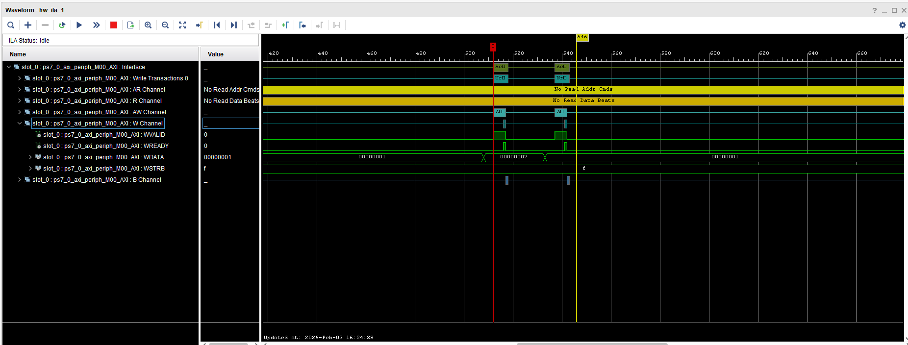
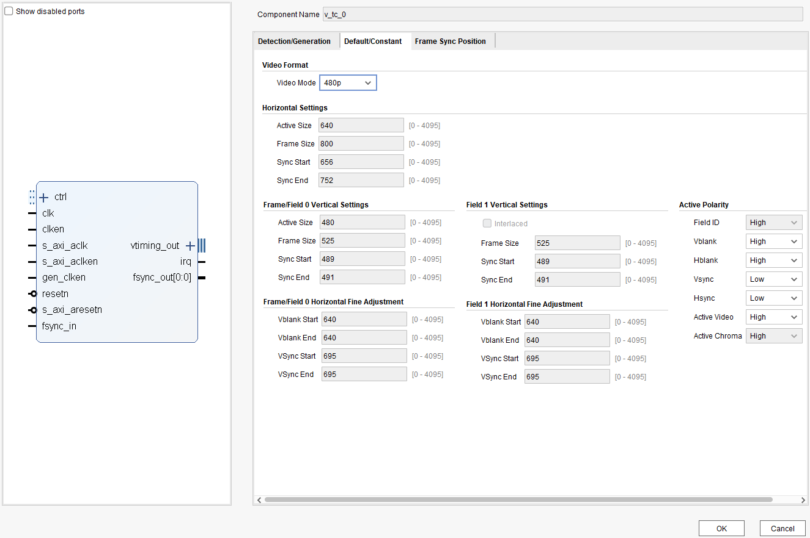
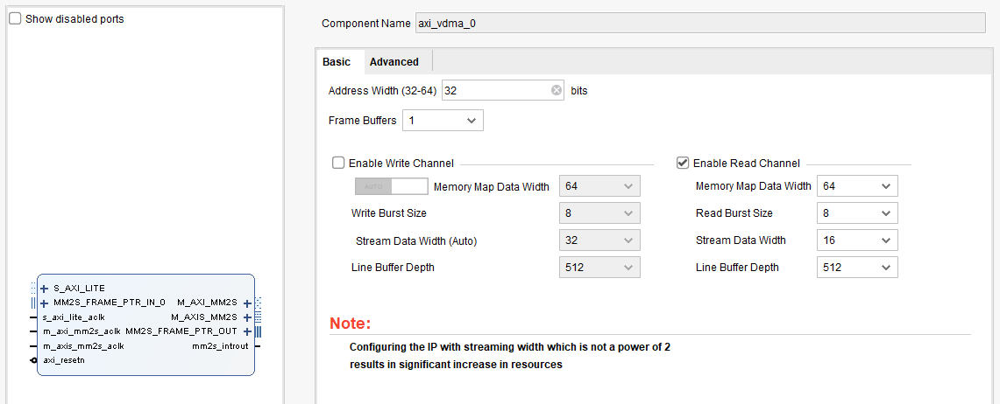
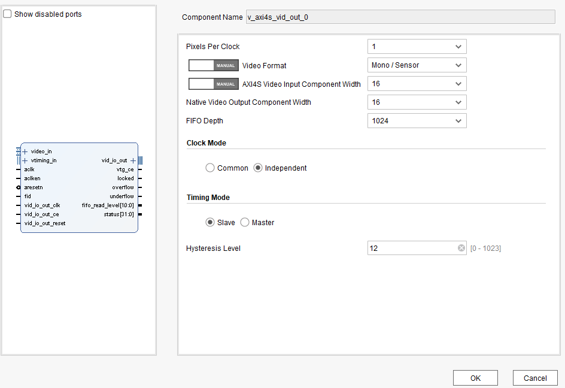
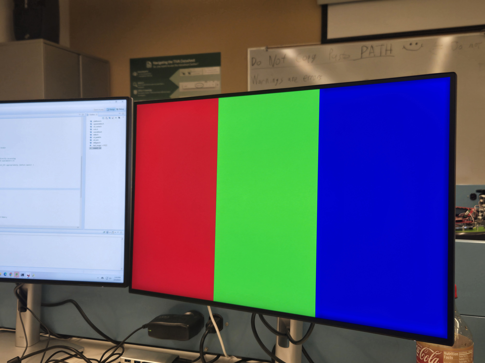
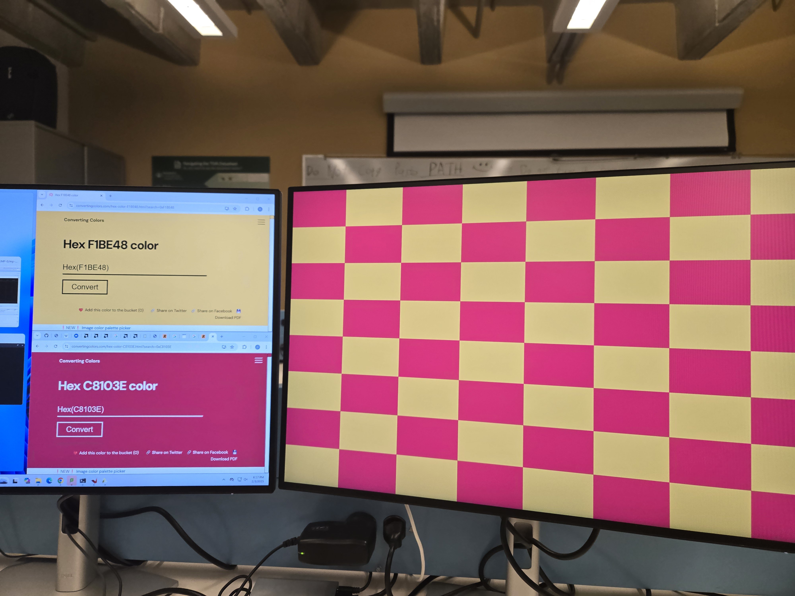

# Report

## [TASK] Describe how nes_bootloader.c currently works. Using a similar approach as what is presented in Chapter 1 of the Wolf textbook, draw a high-level structural diagram.

### **Main Components**

1. **Initialization** (`xil_init()`):
   - **Hardware Setup**: Configures Xilinx peripherals:
     - **VTC (Video Timing Controller)**: Generates video timing signals.
     - **VDMA (Video DMA)**: Transfers framebuffer data to the display (configuration incomplete in initially given code).
     - **Framebuffers**: Initializes front/back buffers in DDR memory for double-buffering.
   - **Memory Initialization**: Clears framebuffers with `INIT_COLOR` (gray) and sets up boot state (debug level, active buffer).

2. **NES Emulation Loop** (`nes_load()`):
   - **ROM Loading**:
     - Hardcodes loading `zelda.nes` from SD card (via `NESCore_LoadROM`).
     - Disables cache temporarily for SD card I/O compatibility.
   - **Emulation Start**:
     - Resets the NES core (`NESCore_Reset`).
     - Enters an infinite loop running `NESCore_Cycle()` to emulate NES CPU/PPU cycles.

3. **Video Output** (`NESCore_Callback_OutputFrame` in `NESCore_Callback.c`):
   - **Pixel Conversion**: Maps NES color indices to 16-bit RGB using `NesPalette3`.
   - **Framebuffer Update**: Intended to write pixels to `FBUFFER_BASEADDR`, but the current implementation is incomplete (pixels aren't written to the buffer).
   - **Cache Flush**: Ensures VDMA sees updated framebuffer data.

4. **Input Handling** (`NESCore_Callback_InputPadState`):
   - **Hardcoded Input**: Player 1’s controller is set to press A/B buttons (no real input handling yet).

5. **Audio** (Stubs):
   - Sound functions are placeholders; audio isn’t implemented.

### **Key Code Structures**

The following describes some of the key code structures in the initially given `nes_bootloader.c` file.

- **Main Loop**:
  Loads and runs NES ROM indefinitely through the `nes_load()` hardcoded internal input to call of `nes_strncpy()`.
  ```c
  while (1) {
    nes_load();
  }
  ```
- **Emulation Cycle**:
  Emulates NES hardware cycles
  ```c
  do {
    for (i = 0; i < RESET_TIME; i++) {
      NESCore_Cycle(); 
    }
  } while (1); // No exit condition
  ```
  
### **Framebuffer & Video Pipeline**

In the code (nes_bootloader.c), the VDMA is responsible for the following essential functions:

#### Streaming the Framebuffer:

- The NES emulator draws frames into the front buffer (`FBUFFER_BASEADDR`).
- The VDMA continuously streams this buffer to the display controller (e.g., HDMI/VGA module).

#### Double-Buffering:

- While the VDMA streams the front buffer, the emulator can render the next frame to the back buffer (i.e. `BBUFFER_BASEADDR`).
- Buffers are swapped to avoid visual artifacts.

`nes_pixelcpy` coming from `utils.c` which copies from `src` to `dest` pointers and converts the RGBA `.bmp` to rbg pixel values

Depends on the `xilinx-sdk` implementation.

### **Flow Summary**

1. **Boot**:
   - Initialize hardware (VTC, VDMA, framebuffers).
   - Load hardcoded NES ROM (`zelda.nes`).
2. **Emulation**:
   - Run NES CPU/PPU cycles indefinitely.
   - Attempt to render frames to the framebuffer (broken in initially given code).
3. **Display**:
   - VDMA **should** stream the framebuffer to the display.

![[diagram-export-2-6-2025-3_17_20-PM.png]]

## [TASK] How does NESCore_Callback_OutputFrame() get called?

Inside **NESCore.c**, there is a main loop in **`NESCore_Cycle()`** that continually advances the emulation by stepping through each scanline.

At the end of each scanline, it calls **`NESCore_HSync()`**. Within **`NESCore_HSync()`**, once it reaches scanline 240 (the constant `SCAN_UNKNOWN_START`), there is a check:

```c
  847    case SCAN_UNKNOWN_START:
     1     if (S.FrameCnt == 0) {
     2       /* Calback function for rendering */
     3       NESCore_Callback_OutputFrame(S.WorkFrame);
     4
     5       /* Wait callback (for timing) */
     6       NESCore_Callback_Wait();
     7       break;
```

That snippet shows exactly where (appox. line 847) **`NESCore_Callback_OutputFrame(S.WorkFrame)`** is invoked. Essentially:

1. **`NESCore_Cycle()`** calls **`NESCore_HSync()`** at each scanline boundary.
2. **`NESCore_HSync()`** recognizes when it’s at scanline 240 (end of the visible area).
3. If this is not a skipped frame (`S.FrameCnt == 0`), it calls **`NESCore_Callback_OutputFrame()`**, which hands off the final rendered 256×240 image (`S.WorkFrame`) to your platform code (e.g. copying pixels out, displaying them, etc.).

Thus, **`NESCore_Callback_OutputFrame()`** is triggered once per frame near the bottom of each video frame cycle.

## [TASK] Step 2: Describe what configuration options are available and how they may be potentially useful in an embedded system?

The configuration options are run, debug, and hardware (single application debugger).

We analyzed the following three green boxes;

Generic Interrupt Controller (GIC )
- Interrupts for programmable logic (PL) and processing systems (PS)
- PL-PS Interrupt Ports
  - Can enable fast or not fast interrupt signals from PL to PS (CPU 0 or CPU 1)
  - Enable 16-bit shared interrupt port from PL
- PS-PL Interrupt Ports
  - Enable interrupts from DMAC, SMC, QSPI, CTI, GPIO, USB, SDIO, ETHERNET, I2C, SPI, UART, CAN to PL

System Watch Dog Timer (SWDT)
  - Can enable Watch dog timer in APU
  - Change IO (EMIO or MIO)

Direct Memory Access Controller (DMA8 Controller)
- Enable peripheral request interfaces that supports the connection of DMA-capable peripherals resident in the PL

## [TASK] Step 5: Are these buttons, LEDs, and switches connected via the PS subsystem or the PL subsystem? Briefly defend your answer. Note also that all three peripherals appear to be the same exact IP type (axi_gpio) – how can this be possible?
 
The LEDS, buttons and switches are connected to the PS subsystem as they are connected/controlled through gpio pins. The peripherals appear to be at the same exact IP type because an IP core such as `axi_gpio` is a general-purpose GPIO controller that can be instantiated multiple times within the design. Each instantiation can be configured independently to handle different sets of GPIOs.

The reason why buttons, LEDs, and switches can all use the same axi_gpio IP is that the axi_gpio module is highly configurable, allowing different instances to be set up for input or output operations. For example:

    One instance of axi_gpio can be configured as an input interface for buttons.
    Another instance can be configured as an output interface for LEDs.
    A third instance can be configured to handle switches as inputs.

Each instance is mapped to a different memory address and connected to separate GPIO pins, making it possible to use the same IP type multiple times within the system.

## [TASK] Step 5: Based on the datasheet and the address map shown in the “Address Editor” (mentioned in instruction 7 of Step 2: Use Designer Assistance), how would you (in software) read the current state of the switches? Be specific

%%TODO

The processing system can read the register of the axi_gpio which communicates with the switches. For example, 
    
    On our system, the GPIO connected to the switches has a base register 0x4122. 
    0x4122_XXXX where 0x0001-0x0100 would be used to count which switches are on.

## [TASK] Step 7: modifications: Create a Software Application A nice feature is the ability to right-click on any function to view its declaration – do this for the print() function. In your writeup, use this feature and describe what print() does, and how. Why do you believe this function is used by Xilinx for their Hello World application, as opposed to the more conventional printf() function?

Right-clicking on the print() function opens a dialog for going to a specific declaration of the function from the available declarations. Clicking on the declartions. %% TODO

If certain Xilinx preprocessor macros are defined, the print function output is console. 
You give the print function a `*char` and it sends the "string" to the UART on stdout base address.

We think that Xilinx has this feature because methods/functions can be declared the same name in different files across larger projects. We also believe that the print function is a more efficient function that allows for reduced memory and processing overhead by not having format specifiers. Printf requires additional processing to parse and handle a multitude of arguments.

This is used in the Hello World example to print the "Hello World" string to the console while operating correctly in the xilinx emulator and on the actual fpga hardware.

## [TASK] Step 9: Connect to the Vivado Logic Analyzer: Take a screen capture of an LED wire turning on? Can you turn the LED on and off fast enough to get a screen capture of the Logic Analyzer displaying this pulse? If so, then provide this screen capture as well. For how long does the pulse stay high?

The LED outputs were connected to an Axi interconnect at slot_0. Because the LED is sending data, we can read the respective GPIO responses in the W Channel. The image below illustrates that the first and seventh switches were toggled in succession per the signals in WDATA. 

 

25 ns pulse duration is shown in the image above.

## [TASK] Modify the hello_world application to also interface with the switches, buttons, and LEDs that are configured in the programmable logic. For example, have the application print out the state of the switches when a button is pressed, or light up certain LEDs given an input integer.

The following code uses switches to toggle a respective LED and print to PuTTY if button 1 is active.

```
int main()
{
    init_platform();
    UINTPTR SWIn = 0x41220000;
    UINTPTR LEDIn = 0x41200000;
    UINTPTR ButtonIn = 0x41210000;
    int32_t LEDOut = 0x00000000;
    while (1) {
    	if ((Xil_In32(SWIn) & 0x00000001) == 0x00000001) {
    		LEDOut = LEDOut + 0x00000001;
    	}
    	if ((Xil_In32(SWIn) & 0x00000002) == 0x00000002) {
			LEDOut = LEDOut + 0x00000002;
		}
    	if ((Xil_In32(SWIn) & 0x00000004) == 0x00000004) {
			LEDOut = LEDOut + 0x00000004;
		}
    	if ((Xil_In32(SWIn) & 0x00000008) == 0x00000008) {
    		LEDOut = LEDOut + 0x00000008;
    	}
    	if ((Xil_In32(SWIn) & 0x000000010) == 0x00000010) {
			LEDOut = LEDOut + 0x00000010;
		}
    	if ((Xil_In32(SWIn) & 0x000000020) == 0x00000020) {
			LEDOut = LEDOut + 0x00000020;
		}
    	if ((Xil_In32(SWIn) & 0x00000040) == 0x00000040) {
    		LEDOut = LEDOut + 0x00000040;
    	}
    	if ((Xil_In32(SWIn) & 0x00000080) == 0x00000080) {
			LEDOut = LEDOut + 0x00000080;
		}
    	if((Xil_In32(ButtonIn) & 0x00000001) == 0x00000001){
    		print("Button 1 is on\n\r");
    		LEDOut = LEDOut + 0x00000001;
    	}
    	Xil_Out32(LEDIn, LEDOut);
    	LEDOut = 0x00000000;
    }
    cleanup_platform();
    return 0;
}
```

An example of the code working: 


## [TASK] In VIVADO, add these peripherals to your project , connect and then configure them to generate a 640x480 output signal.

The Video Timing Control IP was set to the given timing values for 640x480 video. However, we had to change the active polarity of the Hsync and Vsync as the VTC defualt values did not align with the standard VGA protocol.


The Video Direct Memory Access IP was set such that it had a data width of 16 bits to correspond to our Video Output IP.


The AXI4-Stream to Video Out IP was setup such that it could read 16 bits and output 16 bits. Because the VGA protocol did need any additional signals from this IP, we could use the Mono/Sensor video format to ensure our data stream widths were the desired sizes. 


Some other important considerations were that the input clock had to be as close to 25.125 MHz, the VTC enable on the AXI4-Stream to Video Out IP had to be connected to the generation clock enable output on the Video Timing, and ensuring the AXI4-Stream to Video Out IP had an independent clock for video if we had a faster clock for the AXI stream. 

## [TASK] Modify the configuration registers for correct VDMA operation, and in your writeup, provide a justification based on the VDMA documentation for how you set these values.



Our VDMA register configurations were as follows:

```// Simple function abstraction by Vendor for writing VDMA registers
    XAxiVdma_WriteReg(XPAR_AXI_VDMA_0_BASEADDR, XAXIVDMA_CR_OFFSET,  0x00000003);  // Read Channel: VDMA MM2S Circular Mode and Start bits set, VDMA MM2S Control
    XAxiVdma_WriteReg(XPAR_AXI_VDMA_0_BASEADDR, XAXIVDMA_HI_FRMBUF_OFFSET, 0x00000001);  // Read Channel: VDMA MM2S Reg_Index
    XAxiVdma_WriteReg(XPAR_AXI_VDMA_0_BASEADDR, XAXIVDMA_MM2S_ADDR_OFFSET + XAXIVDMA_START_ADDR_OFFSET, (UINTPTR)test_image);  // Read Channel: VDMA MM2S Frame buffer Start Addr 1
    XAxiVdma_WriteReg(XPAR_AXI_VDMA_0_BASEADDR, XAXIVDMA_MM2S_ADDR_OFFSET + XAXIVDMA_STRD_FRMDLY_OFFSET, 0x00000500);  // Read Channel: VDMA MM2S FRM_Delay, and Stride
    XAxiVdma_WriteReg(XPAR_AXI_VDMA_0_BASEADDR, XAXIVDMA_MM2S_ADDR_OFFSET + XAXIVDMA_HSIZE_OFFSET, 0x00000500);  // Read Channel: VDMA MM2S HSIZE
    XAxiVdma_WriteReg(XPAR_AXI_VDMA_0_BASEADDR, XAXIVDMA_MM2S_ADDR_OFFSET + XAXIVDMA_VSIZE_OFFSET, 0x000001E0);  // Read Channel: VDMA MM2S VSIZE  (Note: Also Starts VDMA transaction)
```
- To enable the VDMA MM2S circular Mode and start bits, we referenced the MM2S_VDMACR Register and enabled the first and second bit which enabled circular mode and started VDMA operations

- Since our VDMA we wanted any read access between 0x5C and 0x98 to access the start address 1 to 16 so we set this register to 0x0

- We set the MM2S start Address enabled by the previously discussed register to the image we wanted to display

- The stride was set to the size of our horizontal offset and there was no frame delay

- The horizontal offset was set to 2x our desired horizontal size since the horizontal line was 2 bytes

- The vertical offset was set to our desired vertical size

## [TASK] In your writeup, explain how you converted these color values valid values for the 16-bit framebuffer.



We worked through calculating the RGB values manually using python and then implemented the necessary conversion functions in the nes_bootloader.c file.

First, we shift the given color value to the right by 2 bytes to get the red value.
Second, we shift the given color value to the right by 1 byte to get the green value.
Third, we shift the given color value to the right by 4 bits to get the blue value.

Here is our function:
```c
// Example: 0xC8103E
// 0xC8 -> Red | 0x10 -> Green | 0x3E -> Blue
u16 convert_color_24_16(u32 color)
{
	u16 r, g, b = 0;

	// Red: 0xFF0000 -> 0xF
	// Shift right 2 bytes (16 bits) to get the two bytes in the LSB position.
	// Then to get the left byte, shift 4 more.
	r = color >> 20;

	// Green: 0xFF00 -> 0xF0
	//Shift right one byte (8 bits) to get the two bytes in the LSB position.
	// Then mask with 0xF0 to only take the left byte. It is already positioned
	// where it needs to be.
	g = (color >> 8) & 0xF0;

	// Blue:  0xFF -> 0xF00
	// Shift left 4 bits to get the left-most byte in the correct position.
	// Then mask with 0xF00 to only use the left-most byte.
	b = (color << 4) & 0xF00;

	return r | g | b;
}

void insert_black_ref_bars(int num_bars, int image_height, int image_width, u16 image[image_height][image_width])
{
  // Black bars to define black reference in blanking period
  for(int i = 0; i < image_height; i++)
  {
	  for(int j = 0; j < num_bars; j++)
	  {
		  (image[i])[j] = 0x0;
	  }
  }

  for(int i = 0; i < image_height; i++)
  {
	  for(int j = image_width - 1 - num_bars; j < image_width; j++)
	  {
		  (image[i])[j] = 0x0;
	  }
  }
}

```

## [TASK] Modify the nes_bootloader code such that the NES games are reasonably playable. In your report, describe your general approach to implementing both of the NESCore_Callback functions.

For the “NESCore_Callback_OutputFrame,” our task was to expand the 256x240 image to a 640x480 resolution. For this, we first started by finding the scalar needed to enlarge the image. This scalar was then used to repeat the WorkFrame multiple times for every pixel read. Once implemented, we realized that we needed to add borders to our image since we couldn’t have scalars that weren’t whole numbers. We just found the missing pixels and added them as black borders before reading the WorkFrame.

For “NESCore_Callback_InputPadState,” this was much easier since we already figured out how to read the buttons and switches in part 5. Once a button was clicked, we just set the player1 data to our desired button press.

## [TASK] **BONUS credit.** 

MP-0's bonus point criteria is *creativity*. The current nes_bootloader design is very limited in terms of functionality. Bonus points will be provided for groups that successfully implement the following features:

- Interactive menu for selecting NES games, either a nice text-based menu (5 bonus points) or a graphical menu (20 bonus points).

- A method for exiting a current game and returning back to the menu (5 bonus points).

- Interfacing with an original NES controller (15 bonus points)


