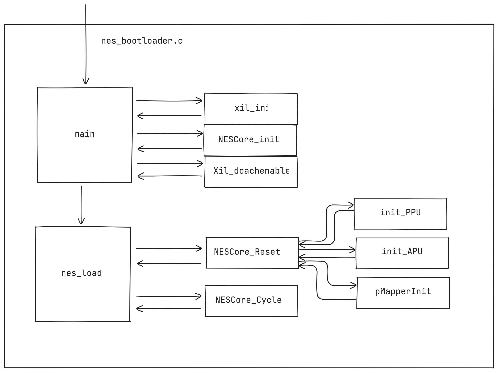
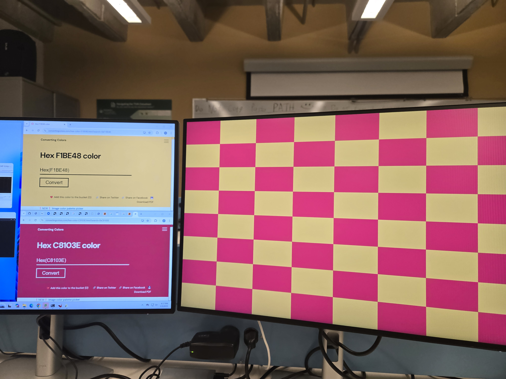

<h1 style="text-align:center">SB3 MP0 Report</h1>

## Describe how nes_bootloader.c currently works. Using a similar approach as what is presented in Chapter 1 of the Wolf textbook, draw a high-level structural diagram.

### **Main Components**

1. **Initialization** (`xil_init()`):
   - **Hardware Setup**: Configures Xilinx peripherals:
     - **VTC (Video Timing Controller)**: Generates video timing signals.
     - **VDMA (Video DMA)**: Transfers framebuffer data to the display (configuration incomplete in initially given code).
     - **Framebuffers**: Initializes front/back buffers in DDR memory for double-buffering.
   - **Memory Initialization**: Clears framebuffers with `INIT_COLOR` (gray) and sets up boot state (debug level, active buffer).

2. **NES Emulation Loop** (`nes_load()`):
   - **ROM Loading**:
     - Hardcodes loading `zelda.nes` from SD card (via `NESCore_LoadROM`).
     - Disables cache temporarily for SD card I/O compatibility.
   - **Emulation Start**:
     - Resets the NES core (`NESCore_Reset`).
     - Enters an infinite loop running `NESCore_Cycle()` to emulate NES CPU/PPU cycles.

3. **Video Output** (`NESCore_Callback_OutputFrame` in `NESCore_Callback.c`):
   - **Pixel Conversion**: Maps NES color indices to 16-bit RGB using `NesPalette3`.
   - **Framebuffer Update**: Intended to write pixels to `FBUFFER_BASEADDR`, but the current implementation is incomplete (pixels aren't written to the buffer).
   - **Cache Flush**: Ensures VDMA sees updated framebuffer data.

4. **Input Handling** (`NESCore_Callback_InputPadState`):
   - **Hardcoded Input**: Player 1’s controller is set to press A/B buttons (no real input handling yet).

5. **Audio** (Stubs):
   - Sound functions are placeholders; audio isn’t implemented.

### **Key Code Structures**

The following describes some of the key code structures in the initially given `nes_bootloader.c` file.

- **Main Loop**:
  Loads and runs NES ROM indefinitely through the `nes_load()` hardcoded internal input to call of `nes_strncpy()`.
  ```c
  while (1) {
    nes_load();
  }
  ```
- **Emulation Cycle**:
  Emulates NES hardware cycles
  ```c
  do {
    for (i = 0; i < RESET_TIME; i++) {
      NESCore_Cycle(); 
    }
  } while (1); // No exit condition
  ```
  
### **Framebuffer & Video Pipeline**

In the code (nes_bootloader.c), the VDMA is responsible for the following essential functions:

#### Streaming the Framebuffer:

- The NES emulator draws frames into the front buffer (`FBUFFER_BASEADDR`).
- The VDMA continuously streams this buffer to the display controller (e.g., HDMI/VGA module).

#### Double-Buffering:

- While the VDMA streams the front buffer, the emulator can render the next frame to the back buffer (i.e. `BBUFFER_BASEADDR`).
- Buffers are swapped to avoid visual artifacts.

`nes_pixelcpy` coming from `utils.c` which copies from `src` to `dest` pointers and converts the RGBA `.bmp` to rbg pixel values

Depends on the `xilinx-sdk` implementation.

### **Flow Summary**

1. **Boot**:
   - Initialize hardware (VTC, VDMA, framebuffers).
   - Load hardcoded NES ROM (`zelda.nes`).
2. **Emulation**:
   - Run NES CPU/PPU cycles indefinitely.
   - Attempt to render frames to the framebuffer (broken in initially given code).
3. **Display**:
   - VDMA **should** stream the framebuffer to the display.



## How does NESCore_Callback_OutputFrame() get called?

Inside **NESCore.c**, there is a main loop in **`NESCore_Cycle()`** that continually advances the emulation by stepping through each scanline.

At the end of each scanline, it calls **`NESCore_HSync()`**. Within **`NESCore_HSync()`**, once it reaches scanline 240 (the constant `SCAN_UNKNOWN_START`), there is a check:

```c
         case SCAN_UNKNOWN_START:
          if (S.FrameCnt == 0) {
            /* Calback function for rendering */
            NESCore_Callback_OutputFrame(S.WorkFrame);
     
            /* Wait callback (for timing) */
            NESCore_Callback_Wait();
            break;
```

That snippet shows exactly where (appox. line 847) **`NESCore_Callback_OutputFrame(S.WorkFrame)`** is invoked. Essentially:

1. **`NESCore_Cycle()`** calls **`NESCore_HSync()`** at each scanline boundary.
2. **`NESCore_HSync()`** recognizes when it’s at scanline 240 (end of the visible area).
3. If this is not a skipped frame (`S.FrameCnt == 0`), it calls **`NESCore_Callback_OutputFrame()`**, which hands off the final rendered 256×240 image (`S.WorkFrame`) to your platform code (e.g. copying pixels out, displaying them, etc.).

Thus, **`NESCore_Callback_OutputFrame()`** is triggered once per frame near the bottom of each video frame cycle.

## Step 2: Describe what configuration options are available and how they may be potentially useful in an embedded system?

The configuration options are run, debug, and hardware (single application debugger).

We analyzed the following three green boxes;

**Generic Interrupt Controller (GIC)**
- Interrupts for programmable logic (PL) and processing systems (PS)
- PL-PS Interrupt Ports
  - Can enable fast or not fast interrupt signals from PL to PS (CPU 0 or CPU 1)
  - Enable 16-bit shared interrupt port from PL
- **PS-PL Interrupt Ports**
  - Enable interrupts from DMAC, SMC, QSPI, CTI, GPIO, USB, SDIO, ETHERNET, I2C, SPI, UART, CAN to PL
	
	**Usefulness Description:**
	Having interrupt functionality is extremely important when working with embedded systems since they enable the CPU to respond to stimuli almost immediately. This removes the need to poll the status of a component or peripheral, which wastes CPU time. For example, let's say the embedded system has a UART module that is receiving data. Instead of polling the FIFO status register to know when data can be read out, an interrupt can be setup that will interrupt the CPU when a new character is ready to be read from the FIFO. Then the CPU will execute the interrupt handler, which reads the character. After the character is read, the CPU restores its previous state. No polling of status registers was needed to read out of the FIFO, which saved a lot of CPU time.

**System Watch Dog Timer (SWDT)**
  - Can enable Watch dog timer in APU
  - Change IO (EMIO or MIO)

	**Usefulness Description:**
	Watchdog timers are useful in embedded systems to make sure that some process is not taking control of the CPU permanently and to handle hardware exceptions. Specifically, the watchdog timers can be used to make sure a set of asynchronous processes or threads are not taking up too much CPU time.

**Direct Memory Access Controller (DMA Controller)**
- Enable peripheral request interfaces that supports the connection of DMA-capable peripherals resident in the PL

	**Usefulness Description:**
	DMA is extremely useful in embedded systems when many memory operations or required. Instead of using up CPU time to facilitate memory operations, the CPU just has to tell the DMA what memory operations should be done and it executes them. This saves tons of CPU time, which is always desired when developing an embedded system. However, synchronization between the CPU and DMA must be established. This is usually done using interrupts, which were previously discussed.

## Step 5: Are these buttons, LEDs, and switches connected via the PS subsystem or the PL subsystem? Briefly defend your answer. Note also that all three peripherals appear to be the same exact IP type (axi_gpio) – how can this be possible?
 
The LEDS, buttons and switches are connected to the PL subsystem as they are connected/controlled through GPIO subsystem, which belongs to the PL subsystem. The peripherals appear to be at the same exact IP type because an IP core such as `axi_gpio` is a general-purpose GPIO controller that can be instantiated multiple times within the design. Each instantiation can be configured independently to handle different sets of GPIOs.

The reason why buttons, LEDs, and switches can all use the same axi_gpio IP is that the axi_gpio module is highly configurable, allowing different instances to be set up for input or output operations. For example:

    One instance of axi_gpio can be configured as an input interface for buttons.
    Another instance can be configured as an output interface for LEDs.
    A third instance can be configured to handle switches as inputs.

Each instance is mapped to a different memory address and connected to separate GPIO pins, making it possible to use the same IP type multiple times within the system.

## Step 5: Based on the datasheet and the address map shown in the “Address Editor” (mentioned in instruction 7 of Step 2: Use Designer Assistance), how would you (in software) read the current state of the switches? Be specific


The processing system can read the register of the axi_gpio which communicates with the switches. For example:
	On our system, the GPIO AXI interface connected to the switches has a base address of 0x4122_0000 (this will most likely be different than the current one since other AXI interfaces have been added). According to the datasheet, an address offset of 0x4 from the base address points to the tri-state buffer register, which allows us to configure the GPIO interface to be read or write. According to the datasheet, if this register has a value of 0x0, the GPIO interface is configured for writes and if the register has a value of 0x1, it is configured for reads. So, to read from the switches we need to set the 32-bit register stored at 0x4122_0004 to 0x1. Then, according to the GPIO datasheet, the base address of the GPIO interface points to a 32-bit register where the GPIO data can be read from. So to read the switch states, we simply need to access the value stored at 0x4122_0000. That is it!*
## Step 7: modifications: Create a Software Application A nice feature is the ability to right-click on any function to view its declaration – do this for the print() function. In your writeup, use this feature and describe what print() does, and how. Why do you believe this function is used by Xilinx for their Hello World application, as opposed to the more conventional printf() function?

Right-clicking on the print() function opens a dialog for going to a specific declaration of the function from the available declarations. Clicking on the declarations. 

If certain Xilinx preprocessor macros are defined, the print function output is console. 
You give the print function a `*char` and it sends the "string" to the UART on stdout base address.

The stdio printf() function outputs the formatted input to the STDOUT stream. We believe that this stream is not hooked up to the UART since when we tried using the stdio printf(), we saw no output on the UART. So, it makes sense that the default "Hello World" example uses the Xilinx print() function instead since it manually sends the input using the UART, no streams invovled!

This is used in the Hello World example to print the "Hello World" string to the console while operating correctly in the xilinx emulator and on the actual fpga hardware.

## Step 9: Connect to the Vivado Logic Analyzer: Take a screen capture of an LED wire turning on? Can you turn the LED on and off fast enough to get a screen capture of the Logic Analyzer displaying this pulse? If so, then provide this screen capture as well. For how long does the pulse stay high?

The LED outputs were connected to an Axi interconnect at slot_0. Because the LED is sending data, we can read the respective GPIO responses in the W Channel. The image below illustrates that the first and seventh switches were toggled in succession per the signals in WDATA. 

 

25 ns pulse duration is shown in the image above.

## Modify the hello_world application to also interface with the switches, buttons, and LEDs that are configured in the programmable logic. For example, have the application print out the state of the switches when a button is pressed, or light up certain LEDs given an input integer.

The following code uses switches to toggle a respective LED and print to PuTTY if button 1 is active.

```c
int main()
{
    init_platform();
    UINTPTR SWIn = 0x41220000;
    UINTPTR LEDIn = 0x41200000;
    UINTPTR ButtonIn = 0x41210000;
    int32_t LEDOut = 0x00000000;
    while (1) {
    	if ((Xil_In32(SWIn) & 0x00000001) == 0x00000001) {
    		LEDOut = LEDOut + 0x00000001;
    	}
    	if ((Xil_In32(SWIn) & 0x00000002) == 0x00000002) {
			LEDOut = LEDOut + 0x00000002;
		}
    	if ((Xil_In32(SWIn) & 0x00000004) == 0x00000004) {
			LEDOut = LEDOut + 0x00000004;
		}
    	if ((Xil_In32(SWIn) & 0x00000008) == 0x00000008) {
    		LEDOut = LEDOut + 0x00000008;
    	}
    	if ((Xil_In32(SWIn) & 0x000000010) == 0x00000010) {
			LEDOut = LEDOut + 0x00000010;
		}
    	if ((Xil_In32(SWIn) & 0x000000020) == 0x00000020) {
			LEDOut = LEDOut + 0x00000020;
		}
    	if ((Xil_In32(SWIn) & 0x00000040) == 0x00000040) {
    		LEDOut = LEDOut + 0x00000040;
    	}
    	if ((Xil_In32(SWIn) & 0x00000080) == 0x00000080) {
			LEDOut = LEDOut + 0x00000080;
		}
    	if((Xil_In32(ButtonIn) & 0x00000001) == 0x00000001){
    		print("Button 1 is on\n\r");
    		LEDOut = LEDOut + 0x00000001;
    	}
    	Xil_Out32(LEDIn, LEDOut);
    	LEDOut = 0x00000000;
    }
    cleanup_platform();
    return 0;
}
```


## In VIVADO, add these peripherals to your project , connect and then configure them to generate a 640x480 output signal.

The Video Timing Control IP was set to the given timing values for 640x480 video. However, we had to change the active polarity of the Hsync and Vsync as the VTC defualt values did not align with the standard VGA protocol.


The Video Direct Memory Access IP was set such that it had a data width of 16 bits to correspond to our Video Output IP.


The AXI4-Stream to Video Out IP was setup such that it could read 16 bits and output 16 bits. Because the VGA protocol did need any additional signals from this IP, we could use the Mono/Sensor video format to ensure our data stream widths were the desired sizes (12-bits also works for the output as long as it is properly mapped to the VGA pins). 


Some other important considerations were that the input clock had to be as close to 25.125 MHz, the VTC enable on the AXI4-Stream to Video Out IP had to be connected to the generation clock enable output on the Video Timing, and ensuring the AXI4-Stream to Video Out IP had an independent clock for video if we had a faster clock for the AXI stream. 

## Modify the configuration registers for correct VDMA operation, and in your writeup, provide a justification based on the VDMA documentation for how you set these values.


Our VDMA register configurations were as follows:

```c
// Simple function abstraction by Vendor for writing VDMA registers
    XAxiVdma_WriteReg(XPAR_AXI_VDMA_0_BASEADDR, XAXIVDMA_CR_OFFSET,  0x00000003);  // Read Channel: VDMA MM2S Circular Mode and Start bits set, VDMA MM2S Control
    XAxiVdma_WriteReg(XPAR_AXI_VDMA_0_BASEADDR, XAXIVDMA_HI_FRMBUF_OFFSET, 0x00000001);  // Read Channel: VDMA MM2S Reg_Index
    XAxiVdma_WriteReg(XPAR_AXI_VDMA_0_BASEADDR, XAXIVDMA_MM2S_ADDR_OFFSET + XAXIVDMA_START_ADDR_OFFSET, (UINTPTR)test_image);  // Read Channel: VDMA MM2S Frame buffer Start Addr 1
    XAxiVdma_WriteReg(XPAR_AXI_VDMA_0_BASEADDR, XAXIVDMA_MM2S_ADDR_OFFSET + XAXIVDMA_STRD_FRMDLY_OFFSET, 0x00000500);  // Read Channel: VDMA MM2S FRM_Delay, and Stride
    XAxiVdma_WriteReg(XPAR_AXI_VDMA_0_BASEADDR, XAXIVDMA_MM2S_ADDR_OFFSET + XAXIVDMA_HSIZE_OFFSET, 0x00000500);  // Read Channel: VDMA MM2S HSIZE
    XAxiVdma_WriteReg(XPAR_AXI_VDMA_0_BASEADDR, XAXIVDMA_MM2S_ADDR_OFFSET + XAXIVDMA_VSIZE_OFFSET, 0x000001E0);  // Read Channel: VDMA MM2S VSIZE  (Note: Also Starts VDMA transaction)
```
- To enable the VDMA MM2S circular Mode and start bits, we referenced the MM2S_VDMACR Register and enabled the first and second bit which enabled circular mode and started VDMA operations. Since the start bit was at bit position 0 and the circular mode enable was on bit position 1, we wrote 0x3 to the register to make both the bits '1'.

- Since our VDMA we wanted any read access between 0x5C and 0x98 to access the start address 1 to 16 so we set this register to 0x0.

- We set the MM2S start Address enabled by the previously discussed register to the address of the first byte of the image we wanted to display.

- The stride was set to the size of our horizontal offset and there was no frame delay. Since all the pixel data is aligned to 16-bits, our stride equaled the horizontal offset in bytes. See next bullet for horizontal offset size justification.

- The horizontal offset was set to 2x our desired horizontal size since the horizontal line was 2 bytes. So since we are drawing 640 pixels horizontally, the offset is 640 * 2 = 1280, which is 0x500.

- The vertical offset was set to our desired vertical size of 480 lines, which is 0x1E0 in hex.

## In your writeup, explain how you converted these color values valid values for the 16-bit framebuffer.



We worked through calculating the RGB values manually using python and then implemented the necessary conversion functions in the nes_bootloader.c file.

**Conversion Description**

In 24-bit color, 8 bits are used for each color (RGB). Since we are using 12-bit color with 4-bits of padding, we need 4 bits per color. This means that we need to map the 8-bit colors to 4-bit colors using a linear relationship. This was done by only using the most significant byte of each of the colors in the 12-bit color. This makes it so 0x0 in 24-bit maps to 0x0 in 12-bit and 0xFFFFFF in 24-bit maps to 0xFFFF in 12-bit color, which is what we want. However the endianness of the colors in the two formats differ. Red is on the MSB in 24-bit color while red is on the LSB in 12-bit color, so some shifting needs to be done.

To derive the shift values, it is best to isolate the 3 different colors in the 24-bit format.

**24-Bit Color**
0xABCDEF:
Red: 0xAB | Green: 0xCD | Blue: EF

**12-Bit Color
0xABC

Red: 0xC | Green: 0xB | Blue: 0xA

Now that we have an example 24-bit color separated into the three colors, we can look at the conversion for each.

**Red**
For red, we need the upper 4 bits to be moved to bit positions 0-3 for the 12-bit color. This is achieved by shifting the value right 20 bits. No masking is needed since the lower 4 bits are shifted off.

**Green**
For green, we need the upper 4 bits to be in bit positions 4-7. To achieve this, we can shift it to the right 8 bits and then mask off the lower 4 bits via & 0xF0.

**Blue**
For blue, we need to get the upper 4 bits in bit positions 8-11. To achieve this, we can shift it to the left 4 bits and then mask off the lower 4 bits via & 0xF00.

All of these color values are stored in their own 16-bit unsigned-integer variables so they can be bitwise OR'd together to give the final 12-Bit RGB value.


The function that performs this conversion is given below:


```c
// Example: 0xC8103E
// 0xC8 -> Red | 0x10 -> Green | 0x3E -> Blue
u16 convert_color_24_16(u32 color)
{
	u16 r, g, b = 0;

	// Red: 0xFF0000 -> 0xF
	// Shift right 2 bytes (16 bits) to get the two bytes in the LSB position.
	// Then to get the left byte, shift 4 more.
	r = color >> 20;

	// Green: 0xFF00 -> 0xF0
	//Shift right one byte (8 bits) to get the two bytes in the LSB position.
	// Then mask with 0xF0 to only take the left byte. It is already positioned
	// where it needs to be.
	g = (color >> 8) & 0xF0;

	// Blue:  0xFF -> 0xF00
	// Shift left 4 bits to get the left-most byte in the correct position.
	// Then mask with 0xF00 to only use the left-most byte.
	b = (color << 4) & 0xF00;

	return r | g | b;
}
```
## Modify the nes_bootloader code such that the NES games are reasonably playable. In your report, describe your general approach to implementing both of the NESCore_Callback functions.

For the “NESCore_Callback_OutputFrame,” our task was to expand the 256x240 image to a 640x480 resolution. For this, we first started by finding the scalar needed to enlarge the image. This scalar was then used to repeat the WorkFrame multiple times for every pixel read. Once implemented, we realized that we needed to add borders to our image to ensure that the VGA HW had a reference for black. This is because the VGA timing was slightly off, which caused data from the blanking period to be drawn in the drawing window. The black reference bars were implemented by updating the left and right columns of the WorkFrame to have a value of 0x0, which is black.

For “NESCore_Callback_InputPadState,” we were able to use our GPIO code from step 5. However, we also created a simple interface (controls.h) to make the usage easier. Using this interface, we just had to call the configure function to configure the GPIO interfaces and then run the data collection function. We provided a pointer to a struct that stores all the data to this function to be populated. After the function ran, we had an array of enumeration values, where each value represented a pressed button. We decided to represent the button presses this way for simplicity. All one has to do to determine what buttons are being pressed down are look at each of the enumeration values in the array, no bit-parsing needed. However, this does require more CPU time and can make the mapping to how the NESCore has the inputs defined more tedious.

## **BONUS credit.** 

We implemented the following extra credit items:

- SNES Controller Implementation
- Graphical Menu
- Return to Menu Functionality

Brief descriptions of each of these items are given below:

### SNES Controller Implementation

To implement a reader for the SNES controller, we first did some research on the protocol that the controller used. The website https://gamesx.com/controldata/snesdat.htm provided a sufficient writeup of the protocol. However, to verify that we understood the protocol, we took the SNES controller and went out to one of the circuit labs. In the lab, we hooked up the function generator to generate the `clock` and `latch` signals. We then were able to read the response from the SNES controller using an oscilloscope. Am image of such a reading is shown below:


After we verified we understood the protocol, we devised a block diagram of an implementation. This block diagram is shown below:


This block diagram is made up of three major components: the pulse generator, a 4-bit counter, and a 16-bit shift register. The pulse generator creates the `latch` signal for the SNES controller upon receiving the `start` signal. After the pulse is sent, the pulse generator will not sent another pulse until it is reset and `start` is sent again. Then once the pulse has finished, the `counter_enable` signal is sent out to the 4-bit counter. The 4-bit counter will count 16 clock cycles, which will be aligned to the 16 data bits that the SNES controller sends. Once 16 clock cycles have been read, the `done` signal is sent out and the 16-bit shift register is disabled so we don't shift the read data off. Like the pulse generator, the 4-bit counter cannot be activated again until it is reset. This is to avoid restarting the 4-bit counter by accidently holding the enable signal high for too long.

Finally, this system was hooked up to an AXI-Lite interface which allowed us to send the `start`  and `rest_n` signals, read the `done` signal, and read the controller from C code via memory-mapped registers.

Once all of this was implemented, we ran many tests, fixed many issues and got a result that mostly worked. The design will always read the first data bit as a '1', which corresponds to the B button not being pressed. To work around this, we simply re-bound X to B since we could read all the other buttons just fine. We believe this is due to some timing issue not caught in our simulated testbenches or due to running the `snes_clk` too fast. We originally had the AXI but clock and the `snes_clk` at different frequencies, but this introduced negative slack so we made them the same frequency. We found that when two SNES controller reader modules (for two player support) were instantiated, the AXI clock needed to be at least 1MHz to function properly. Finally, the VHDL was not written the best. I had FSMs baked into many of my blocks where the next state logic was handled in a sequential process. We now understand this not to be the best practice since it is a bit unclear how it will synthesize, but this was a good learning experience overall.

There was another attempt to interface with a SNES controller through a Verilog defined IP. This particular method sought to follow the SNES protocol as defined in this website (https://gamesx.com/controldata/snesdat.htm). A state machine was implemented such that the RTL would act like the SNES CPU; The latch and clock would hold high for 12 us to signal for the SNES controller to begin latching data, the latch would then go low for 6 us to signal for the SNES controller to begin sending data, and then the clock would then propagate on a 12 us period for 15 cycles such that the SNES data was completely transmitted. In order to implement a delay of 6 us and 12 us clock, a delay timer was created by using a counter. This counter counts to a parameter set to the quotient of the input clock and the desired period. Since the input clock to this RTL IP was 25 MHz 6 us achieved by counting up to 150 cycles. This RTL IP was successfully imported into the Vivado project, but there was issue when attempting to connect its output data to the processing system block. There was an attempt to create a custom AXI4-lite peripherial IP which wrapped the user project, but there wasn't enough time to trouble shoot the issues. 


Below is an example of the SNES controller correctly communicating with the FPGA.


### Graphical Menu

##### Design

###### Navigation

In designing the graphical window for our system, our goal was to enable smooth and intuitive scrolling through a rendered list of game options. This list not only displayed the names of available games but also included additional information about each game or ROM, providing a more informative and user-friendly interface.

To ensure seamless navigation, we implemented an offset-based scrolling mechanism that allows users to freely scroll through the game list without restrictions. This feature dynamically adjusts the menu offset based on the selected index, ensuring that the currently highlighted game remains visible at all times. If the selected index moves beyond the visible portion of the menu, the offset is updated accordingly to bring the relevant content into view. This allows users to navigate effortlessly through large game lists without losing track of their current selection.

###### Visuals

To enhance the visual experience, we incorporated image rendering using the PPM (Portable Pixmap) format. This allowed us to include visual previews of games alongside their textual descriptions, enriching the browsing experience for users. The PPM format was chosen due to its simplicity and ease of implementation in our system. While this solution worked seamlessly on our development machines, we encountered issues when attempting to read PPM files from the Xilinx SD card. The format did not function as expected in this environment, leading to difficulties in rendering the images correctly.


Furthermore, we implemented a feature that allows users to return to the game menu after launching a game. To achieve this, we designed a specific input recognition system that detects when both the Start and Select buttons are pressed simultaneously. This shortcut provides a convenient and intuitive method for users to exit a game and navigate back to the menu without needing to reset the system.

#### Implementation

Implementation of the menu was the easy part, combing the working functionality with the existing NES emulator proved to be more of a problem to be solved...

##### Navigation

The implementation of the game menu navigation relies on a structured control loop that governs menu behavior and game launching. By designing the render_game_menu function to accept both the selected index and menu offset, we created a system that seamlessly integrates with the NES emulation. This approach ensures clarity and modularity in our implementation.

First, by making our, `render_game_menu` function take the selected index and the menu offset, we allowed for our integration of the menu into the nes emulation implementation to be as clear as possible:
```c
void render_game_menu(int selected_index, int menu_offset)
{
  // draws the actual game menu to the draw buffer
  draw_game_menu(*draw_buffer, selected_index, menu_offset);

  Xil_DCacheFlush();

  XAxiVdma_WriteReg(
      XPAR_AXI_VDMA_0_BASEADDR,
      XAXIVDMA_MM2S_ADDR_OFFSET + XAXIVDMA_START_ADDR_OFFSET,
      (u32)*draw_buffer); // Read Channel: VDMA MM2S Frame buffer Start Addr 1

  draw_buffer = (draw_buffer == &front_buffer ? &back_buffer : &front_buffer);

  XAxiVdma_WriteReg(
      XPAR_AXI_VDMA_0_BASEADDR,
      XAXIVDMA_MM2S_ADDR_OFFSET + XAXIVDMA_VSIZE_OFFSET,
      480); // Read Channel: VDMA MM2S VSIZE and start transaction.
}
```

A dedicated game menu loop runs prior to ROM execution, maintaining functionality for game selection and ensuring smooth returns to the menu upon exiting a game. Within this loop, control inputs are continuously read, updating the selected game index accordingly. The menu offset dynamically adjusts to keep the selected game within view. Once a selection is confirmed, the game loads, and control is passed to the emulator.

```c
char *game_menu()
{
  int selected_index = 0;
  int menu_offset = 0;
  // the number of games to select from. (gotten from menu.c)
  int num_games = get_games_length();
  // actual name of the name
  char *rom_name;
  // currectly selected game (0, 0)
  char *selected_game = get_selected_game_rom_name(selected_index, menu_offset);

  // Allocate space for the dpad data.
  dpad_state_p1.active_buttons = malloc(sizeof(t_dpad_buttons) * DPAD_BUTTON_COUNT);
  dpad_state_p1.len = 0;
  dpad_state_p2.active_buttons = malloc(sizeof(t_dpad_buttons) * DPAD_BUTTON_COUNT);
  dpad_state_p2.len = 0;

  // Allocate space for the general button data.
  general_button_states_p1.active_buttons = malloc(sizeof(t_general_button_states) * GENERAL_BUTTON_COUNT);
  general_button_states_p1.len = 0;
  general_button_states_p2.active_buttons = malloc(sizeof(t_general_button_states) * GENERAL_BUTTON_COUNT);
  general_button_states_p2.len = 0;

  render_game_menu(selected_index, menu_offset);

  while (1)
  {
    if (selected_index < menu_offset)
    {
      menu_offset = selected_index;
    }
    else if (selected_index >= menu_offset + ROWS_GAME_MENU)
    {
      menu_offset = selected_index - ROWS_GAME_MENU + 1;
    }

    get_dpad_state(&dpad_state_p1, 0);

    get_general_buttons_state(&general_button_states_p1, 0);

    switch (dpad_state_p1.active_buttons[0])
    {
    case UP:
      if (selected_index < 1)
      {
        continue;
      }
      selected_index--;

      selected_game = get_selected_game_rom_name(selected_index, menu_offset);
      render_game_menu(selected_index, menu_offset);
      break;
    case DOWN:
      if (selected_index > num_games)
      {
        continue;
      }
      selected_index++;

      selected_game = get_selected_game_rom_name(selected_index, menu_offset);
      render_game_menu(selected_index, menu_offset);
      break;
    default:
      break;
    }

    switch (general_button_states_p1.active_buttons[0])
    {
    	case A:
    	case START:
    		return selected_game;
    	default:
    		break;
    }

    usleep(50);
  }

  rom_name = get_selected_game_rom_name(selected_index, menu_offset);

  return rom_name;
}
```

To handle game selection and navigation, we allocate memory for button state tracking, ensuring responsiveness and accuracy in user interactions. Input signals such as directional pad presses update the menu selection, while button confirmations trigger game execution. Additionally, the `main` program loop continuously resets the system environment when exiting a game, allowing users to navigate back to the menu without requiring a system restart.

```c
int main()
{
  init_platform();

  // Initialize all memory space
  xil_init();

  // Initialize the NESCore
  NESCore_Init();

  // Enable the cache
  Xil_DCacheEnable();

  while (1)
  {
	// return the selected game
    char *selected_game = game_menu();
    xil_init();
    NESCore_Init();
    nes_load(selected_game); // shown below
  }
  cleanup_platform();

  return 0;
}
```

Finally, when we actually load the `.nes` rom, by a call to `nes_load()`, the internal game loop of the emulator allows us to listen for the controller state to potentially exit from the game if the user presses both start and select at the same time, and return from`nes_load` as mentioned:

```c
void nes_load( char *rom_name) {
  int32_t result = 0, i;

  usleep(100000);

  // Disable the cache so it will play nice with xilsd (needed here)
  Xil_DCacheDisable();
  result = NESCore_LoadROM(rom_name);
  if (result != 0) {
    xil_printf("nes_load(): invalid ROM load. Returning\r\n"); return;
  }

  // Enable the cache for performance reasons
  Xil_DCacheEnable();

  result = NESCore_Reset();
  if (result != 0) {
    xil_printf("nes_load(): invalid reset. Returning\r\n"); return;
  }

  // set the boot state that we are playing a game
  bootstate.nes_playing = 1;
  usleep(100000);
  ptv = 0;

  int cyRes;

  do {

    for (i = 0; i < RESET_TIME; i++) {

	// Got START and SELECT at the same time from user, go back to menu.
	extern t_general_button_states general_button_states_p1;

	get_general_buttons_state(&general_button_states_p1, 0);

	// Or all together.
	u16 state = 0x0;

	for(int i = 0; i < general_button_states_p1.len; ++i)
	{
		state |= (u16) general_button_states_p1.active_buttons[i];
	}

	if(state == (u16)(((u16)START | (u16)SELECT)))
	{
		xil_printf("Returning to main menu!\n\r");

		// Give user time to release buttons.
		sleep(1);
		return;
	}

     NESCore_Cycle();
    }

  } while (1);

  bootstate.nes_playing = 0;

  return;
}
```