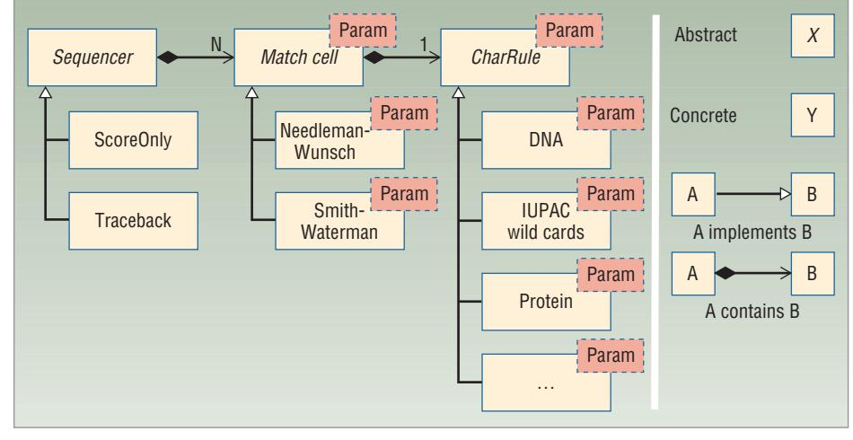
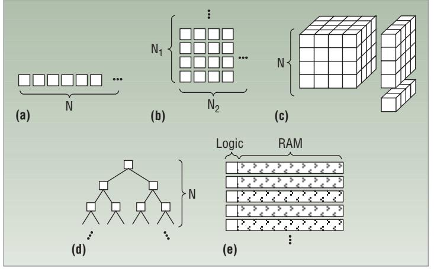

# **Achieving High Performance with FPGA-Based Computing**

*Martin C. Herbordt, Tom VanCourt, Yongfeng Gu, Bharat Sukhwani, Al Conti, Josh Model, and Doug DiSabello* Boston University

**Numerous application areas, including bioinformatics and computational biology, demand increasing amounts of processing capability. In many cases, the computation cores and data types are suited to field-programmable gate arrays.The challenge is identifying the design techniques that can extract high performance potential from the FPGA fabric.**

A ccelerating high-performance computing (HPC) applications with field-programmable gate arrays (FPGAs) can potentially deliver enormous performance. A thousand-fold parallelism is possible, especially for low-precision computations. Moreover, since control is configured into the logic itself, overhead instructions—such as array indexing and loop computations—need not be emulated, and every operation can deliver payload.

COVER FEA TURE

r3herb.qxp 23/2/07 12:12 PM Page 50

At the same time, using FPGAs presents significant challenges1 including low operating frequency—an FPGA clocks at one-tenth that of a high-end microprocessor. Another is simply Amdahl's law: To achieve the speedup factors required for user acceptance of a new technology (preferably 50 times),2 at least 98 percent of the target application must lend itself to substantial acceleration. As a result, HPC/FPGA application performance is unusually sensitive to the implementation's quality.

The problem of achieving significant speedups on a new architecture without expending exorbitant development effort, and while retaining flexibility, portability, and maintainability, is a classic one. In this case, accelerating HPC applications with FPGAs is similar to that of porting uniprocessor applications to massively parallel processors, with two key distinctions:

- FPGAs are far more different from uniprocessors than MPPs are from uniprocessors, and
- the process of parallelizing code for MPPs, while challenging, is still better understood and supported than porting codes to FPGAs.

Lawrence Snyder stated the three basic parameters for the MPP portability problem.3 First, a parallel solution using *P* processors can improve the best sequential solution by a factor of *P*, at most. Second, HPC problems tend to have third- or fourth-order complexity, and so parallel computation, while essential, offers only modest benefits. Third, "the whole force of parallelism must be transferred to the problem, not converted to 'heat' of implementational overhead."

Researchers have addressed the portability problem periodically over the past 30 years, with well-known approaches involving language design, optimizing compilers, emulation, software engineering tools and methods, and function and application libraries. It is generally agreed that compromises are required: Either restrict the variety of architectures or scope of application, or bound expectations of performance or ease of implementation.

### **AVOIDING IMPLEMENTATIONAL HEAT**

At Boston University's Computer Architecture and Automated Design Lab (www.bu.edu/caadlab), we have

#### **Table 1. HPC/FPGA application design techniques.**

r3herb.qxp 23/2/07 12:12 PM Page 51

| Type of support required                              | Methods supported                                    |
|-------------------------------------------------------|------------------------------------------------------|
| Electronic design automation: languages and synthesis | Use rate-matching to remove bottlenecks              |
|                                                       | Take advantage of FPGA-specific hardware             |
|                                                       | Use appropriate arithmetic precision                 |
|                                                       | Create families of applications, not point solutions |
|                                                       | Scale application for maximal use of FPGA hardware   |
| Function/arithmetic libraries                         | Use appropriate FPGA structures                      |
|                                                       | Use appropriate arithmetic mode                      |
| Programmer/designer FPGA awareness                    | Use an algorithm optimal for FPGAs                   |
|                                                       | Use a computing mode appropriate for FPGAs           |
|                                                       | Hide latency of independent functions                |
|                                                       | Minimize use of high-cost arithmetic operations      |
| None                                                  | Living with Amdahl's law                             |

designed 12 methods to avoid generating *implementational heat* while using FPGAs to accelerate several bioinformatics and computational biology (BCB) applications. Table 1 categorizes the methods according to the type of support required, such as programming tools, libraries, or programmer awareness of the target architecture.

We chose a standard PC with an FPGA coprocessor on a high-speed bus; to motivate using a nonstandard architecture, we sought to achieve a 50 times speedup factor.

We selected widely used applications with high potential parallelism, and preferably, low precision. In terms of programming effort, we considered a few months to a year or two (depending on potential impact) as being realistic. Our methods followed standard FPGA design procedures, and were implemented primarily using the VHSIC Hardware Description Language (VHDL) supported by our LAMP tool suite.4

We selected these methods for their ease of visualization; they are neither exhaustive nor disjoint. In addition, we avoided low-level issues related to logic design and synthesis in electronic design automation, as well as high-level issues such as partitioning and scheduling in parallel processing. Although we focused on our own BCB work, the methods apply largely to other domains in which FPGAs are popular, such as signal and image processing.

#### **APPLICATION RESTRUCTURING**

The first four methods address the restructuring HPC applications generally require to enable substantial FPGA acceleration.

#### **Method 1: Use an algorithm optimal for FPGAs**

Having multiple plausible algorithms is common for a given task—application and target hardware determine the final selection. Frequently, the optimal algorithm for an FPGA differs from that for a serial computer or MPP when creating HPC/FPGA applications.

**Application example.** Modeling molecular interactions, or *docking,* is a key computational method used for *in silico* drug screening. A common technique digitizes each molecule onto a 3D voxel grid, then correlates a candidate drug molecule's physical shape and chemical affinities to pockets within a protein or other biomolecule of medical interest. Fast Fourier transforms are used to compute the 3D correlations.5

**Sample HPC/FPGA solution.** The preferred FPGA algorithm is based on direct summation, which, despite having higher asymptotic complexity, offers several advantages. First, small data type sizes, such as 1-bit values for representing interior versus exterior information, offer little advantage on a microprocessor. On an FPGA, however, smaller processing elements allow for more PEs in a given amount of computing fabric, and implementing products of 1-bit values is trivial.

In addition, systolic arrays for correlation are efficient. The form we chose requires one input value and generates one output value per cycle, while holding hundreds of partial sums in on-chip registers. Hundreds of dualported, on-chip block RAMs (BRAMs) hold intermediate results, eliminating a potential bottleneck.

Finally, our implementation, after a brief setup phase, delivers one multiply-accumulate operation per clock cycle per PE, times hundreds to thousands of PEs in the computing array. Indexing, loop control, load/store operations, and memory stalls require no additional memory cycles.

#### **Method 2: Use a computing mode appropriate for FPGAs**

While FPGA configurations resemble high-level language programs, they specify hardware, not software. Because good computing modes for software are not necessarily good computing modes for hardware, restructuring an application can often substantially improve its performance. For example, while randomaccess and pointer-based data structures are staples of serial computing, they may yield poor performance on FPGAs. Streaming, systolic, and associative computing structures, and arrays of fine-grained automata, are preferable.6

r3herb.qxp 23/2/07 12:12 PM Page 52

**Application example.** Finding information about a newly discovered gene or protein by searching biomedical databases for similar sequences is a fundamental bioinformatics task. The most commonly used applications are based on the basic local alignment search tool, which operates in multiple phases. BLAST first determines seeds, or good matches of short subsequences, then extends these seeds to find promising candidates, and finally processes the candidates in detail, often using dynamic programming (DP) methods.

**Sample HPC/FPGA solution.** The preferred method

avoids random accesses into a large database; rather, it streams the database through a two-dimensional systolic array. The first dimension generates, on every cycle, the character-character match scores for a particular alignment of the sequence of interest versus the database. The second dimension processes the score sequence to find the maximal local alignment. The tree structure

keeps the hardware cost low; pipelining assures generation of maximal local alignments at the streaming rate.

#### **Method 3: Use appropriate FPGA structures**

Certain data structures such as stacks, trees, and priority queues are ubiquitous in application programs, as are basic operations such as search, reduction, and parallel prefix, and using suffix trees. Equally ubiquitous in digital logic, the analogous structures and operations usually differ from what is obtained by directly translating software structures into hardware.

**Application example.** Another important bioinformatics task is analyzing DNA or protein sequences for patterns indicative of disease or other functions fundamental to cell processes. These patterns are often repetitive structures, such as tandem arrays and palindromes under various mismatch models.7 The asymptotically optimal algorithms are often based on suffix trees; practical algorithms often include heuristics.

**Sample HPC/FPGA solution.** A straightforward systolic array, a palindrome finder's hardware implementation can test many possible palindrome lengths in one cycle.

#### **Method 4: Living with Amdahl's law**

Amdahl's law states that speeding up an application significantly through an enhancement requires most of the application to be enhanced. This is sometimes difficult to achieve with existing HPC code—for example, profiling often points to kernels that comprise just 60 to 80 percent of execution time. The problem is especially severe with legacy codes and may require a substantial rewrite.

Not all is lost, however. The nonkernel code may lend itself to substantial improvement; as its relative execution time increases, expending effort on its optimization may become worthwhile. Also, combining computations not equally amenable to FPGA acceleration may have optimized the original code; separating them can increase the acceleratable kernel.

**Application example.** Central to computational biochemistry, molecular dynamics applications predict molecular structure and interactions. The MD computation itself is an iterative application of Newtonian mechanics on particle ensembles and alternates between two phases: force computation and motion update. The force com-

> putation comprises several terms, some of which involve bonds. The motion update and bonded force computations are *O*(*N*) in the number of particles being simulated, while the nonbonded are *O*(*N* log *N*) or (*N*2). The latter comprises the acceleratable kernel.

**Sample HPC/FPGA solution.** Because MD codes tend to be highly complex, it is sometimes necessary to

start from scratch to achieve high performance. An example of an MD system, NAMD was also successfully accelerated with FPGAs.8 Another example is the ProtoMol framework, which was designed especially for computational experimentation and so has well-defined partitions among computations.9 We have found that the acceleratable kernel not only comprises more than 90 percent of execution time with ProtoMol, but the modularity enables straightforward integration of an FPGA accelerator.10

#### **DESIGN AND IMPLEMENTATION**

Methods 5-7 address logic- or FPGA-specific design issues.

#### **Method 5: Hide latency of independent functions**

Latency hiding is a basic technique for achieving high performance in parallel applications. Overlap between computation and communication is especially desirable. In FPGA implementations, further opportunities arise: Rather than allocating tasks to processors that must communicate with one another, latency hiding simply lays out functions on the same chip to operate in parallel.

**Application example.** Returning to the example of modeling molecular interactions, the docking algorithm must repeat the correlations at three-axis rotations—more than 104 for typical 10-degree sampling intervals. Implementations on sequential processors typically rotate the molecule in a step separate from the correlation.

**Latency hiding is a basic technique for achieving high performance in parallel applications.**

**Sample HPC/FPGA solution.**Rather than performing an explicit rotation, an FPGA solution retrieves the pixels in "rotated order." The (*i,j,k*) of each voxel in index space can be expressed as a linear transformation of the original (*x,y,z*) coordinates and the rotation. The preferred technique is based on runtime index calculation and has two distinctive features. First, index computation can be pipelined to generate indices at operating frequency due to the predictable order of access to voxels. Second, because of the highly regular order of access, the indexing hardware can be optimized to take up just a few percent of a contemporary high-end FPGA's area.

#### **Method 6: Use rate-matching to remove bottlenecks**

r3herb.qxp 23/2/07 12:12 PM Page 53

Computations often consist of independent function

sequences, such as a signal passing through a series of filters and transformations. Multiprocessor implementations offer some flexibility in partitioning by function or data, but on an FPGA, functions are necessarily laid out on the chip and so function-level parallelism is built in (although functions can also be replicated for data parallelism). This implies pipelining not only within, but also across, functions.

**Application example.** DNA microarrays simultaneously measure the expression of tens of thousands of genes, and are used to investigate numerous questions in biology. One approach is to analyze on the order of a hundred samples, each with tens of thousands of gene expressions, to find correlations between expression patterns and disease phenomena. The kernel operation is a series of dot-product and sum (DPS) calculations feeding covariance, matrix inversion, and regression (CIR) logic.

**Sample HPC/FPGA solution.** The FPGA's power comes from the parallel hardware it uses to handle a problem. Usually the solution involves a very deep pipeline hundreds or even thousands of stages long. Difficulty arises, however, when successive functions have different rates of sourcing and sinking data. The solution is to rate-match sequential functions by replicating the slower functions and then using them in rotation for the desired throughput. In the microarray kernel, the DPS units take about 10 times as long to sum over vectors as the CIR units take to consume DPS results—so DPS calculations are replicated that many times per CIR.

#### **Method 7: Take advantage of FPGA-specific hardware**

FPGAs are often viewed as homogeneous substrates that can be configured into arbitrary logic. In the past five years, however, an ever larger fraction of their chip

**The FPGA's power comes from the parallel hardware it uses to handle a problem.**

area has been devoted to hard-wired components, such as integer multipliers and independently accessible BRAMs. For example, the Xilinx VP100 has 400 independently addressable, 32-bit, quad-ported BRAMs; it achieves a sustained bandwidth of 20 terabytes per second at capacity. Using this bandwidth greatly facilitates high performance and is an outstanding asset of currentgeneration FPGAs.

**Application example.**In molecular dynamics, efficient algorithms for computing the electrostatic interaction often involve mapping charges onto a 3D grid. The first phase of each iteration computes the 3D charge distribution, while the second phase locates each atom in that field and applies a force to it according to its charges and that region of the force field. Because atoms almost never align to the grid points on which the field is computed,

> trilinear interpolation uses the eight grid points nearest to the atom to determine field strength. A variation of this computation uses tricubic interpolation, which requires a 4 - 4 - 4 grid neighborhood, and thus 64 memory reads.

> **Sample HPC/FPGA solution.** The FPGA solution's goal is to create a structure that computes forces at a rate of one per cycle, accounting for

unpredictable sequences of atom positions. Key to such a structure is simultaneous access to all grid points surrounding the atom. This in turn requires appropriate partitioning of the 3D grid among the BRAMs to enable collisionless access, and also efficient logic to convert atom positions into BRAM addresses. We have prototyped a memory-access configuration that supports tricubic interpolation by fetching 64 neighboring grid-point values per cycle. We have also generalized this technique into a tool that creates custom interleaved memories for access kernels of various sizes, shapes, and dimensionality.

#### **ARITHMETIC OPERATIONS**

The next three methods deal with arithmetic operations on FPGAs.

#### **Method 8: Use appropriate arithmetic precision**

With high-end microprocessors having 64-bit data paths, often overlooked is that many BCB applications require only a few bits of precision. In fact, even the canonical floating point of MD is often implemented with substantially reduced precision, although this remains controversial. In contrast with microprocessors, FPGAs enable configuration of data paths into arbitrary sizes, allowing a tradeoff between precision and parallelism. An additional benefit of minimizing precision comes from shorter propagation delays through narrower arithmetic units.

**Application example.** All BCB applications described here benefit substantially from the selection of nonstandard data type sizes. For example, microarray values and biological sequences require only two to five bits, and shape characterization of a rigid molecule requires only two to seven bits. While most MD applications require more than the 24 bits provided by a single-precision floating point, they might not need double precision (53 bits).10

r3herb.qxp 23/2/07 12:12 PM Page 54

**Sample HPC/FPGA solution.** We return to the modeling molecular interactions case study to illustrate the tradeoff between PE complexity and degree of parallelism. That study examined six different models describing intermolecular forces. Molecule descriptions range from two to seven bits per voxel, and scoring functions varied with the application. The number of PEs that fit the various maximum-sized cubical computing arrays into a Xilinx XC2VP70 ranged from 512 (83) to 2,744 (143), according to the resources each PE needed. Since clock speeds also differed for each application-specific accelerator, they covered a 7:1 performance range. If we had been restricted to, for example, 8-bit arithmetic, the performance differential would have been even greater.

#### **Method 9: Use appropriate arithmetic mode**

Microprocessors provide support for integers and floating point, and, depending on multimedia features, 8-bit saturated values. In digital signal processing systems, however, cost concerns often require DSPs to have only integers. Software can emulate floating point when required; also common is use of block floating point. FPGA's analogous situation is that, although plausible, single-precision floating points remain costly and should be avoided if possible, with well-tuned libraries available. Alternatives include the block floating point, log representations, and the semi-floating point.

**Application example.** The MD computation's inner kernel operation requires computing *r*-14 and *r*-8 (the radius *r* between atoms), over a wide range, usually with a table lookup. We would generally use doubleprecision floating points for further computations.

**Sample HPC/FPGA solution.** Careful analysis shows that the number of distinct alignments that must be computed is quite small even though the range of exponents is large. This enables the use of a stripped-down floatingpoint mode, particularly one that does not require a variable shift. The resulting force pipelines (with 35-bit precision) are 25 percent smaller than ones built with a commercial single-precision (24-bit) floating-point library.

#### **Method 10: Minimize use of high-cost arithmetic operations**

The relative costs of arithmetic functions are different on FPGAs than on microprocessors. For example, FPGA integer multiplication is efficient compared to addition, while division is orders-of-magnitude slower. Even if the division logic is fully pipelined to hide its

latency, the cost remains high in chip area, especially if the logic must be replicated. On an FPGA, implementing unused functions isn't necessary; recovered area can be used to increase parallelism. Thus, restructuring arithmetic with respect to an FPGA cost function can substantially increase performance.

**Application example.** The microarray data analysis kernel as originally formulated requires division.

**Sample HPC/FPGA solution.** We represent numbers as rationals, with a separate numerator and denominator, replacing division operations with multiplication. This doubles the required number of bits, but rational values are needed only at a short, late segment of the data path. Consequently, the additional logic required for the wider data path is far lower than the logic for division would have been.

#### **SYSTEM AND INTEGRATION ISSUES**

The final two methods deal with two familiar HPC issues: flexibility and scalability. These methods differ from the others in that they require design tools not widely in use, either because they are currently proprietary11 or exist only as prototypes.4

#### **Method 11: Create families of applications, not point solutions**

HPC applications are often complex and highly parameterized, resulting in variations in applied algorithms as well as data format. Contemporary object-oriented technology can easily support these variations, including function parameterization. This level of parameterization is far more difficult to implement in current hardware description languages, but it enables higher reuse of the design, amortizes development cost over a larger number of uses, and relies less on skilled hardware developers for each application variation.

**Application example.** Other essential methods for searching biological databases are based on dynamic programming. Although generally referred to by the name of one particular variation, Smith-Waterman, DPbased approximate string matching actually consists of a large number of related algorithms that vary significantly in purpose and complexity.

**Sample HPC/FPGA solution.** Achieving high performance in HPC/FPGA applications requires careful tuning to application specifics, which limits component reusability. Generally, programmable PEs rarely approach tuned applications' speed or resource efficiency. Reusable HPC/FPGA applications must resolve the conflicting requirements of generality and customization.

In traditional hardware design systems, components comprise black boxes with limited internal parameterization. Reuse largely entails creating communication and synchronization structures and connecting these to the memory subsystems. Moreover, in HPC/FPGA systems, the innermost components—the leaf data types and arithmetic expressions—change between applications. System performance thus depends on memory, synchronization, and communication, which are the aspects most unfamiliar to traditional programmers. As with the standard C library's qsort(), control and communication are the reusable parts; inner function blocks and data types are the customizations—the opposite of what typical design tools would support.

r3herb.qxp 23/2/07 12:12 PM Page 55

*Figure 1. Logical structure of application family for DP-based approximate string matching. Each level of design hierarchy has fixed interfaces to the components above and below that hierarchy. Within a hierarchical level, each component type has several possible implementations, which the fixed interface hides from other design layers.*

The term *application family* describes a computation

that matches this description, and DP-based approximate string matching offers an example. Figure 1 illustrates the application family's hierarchical structure. Each level of design hierarchy has fixed interfaces to the components above and below in that hierarchy. The fixed interface includes data types defined and used in that level, but possibly also passed through communication channels at other levels. Within a hierarchical level, each component type has several possible implementations, including definitions of its data elements. The fixed interface, however, hides that variability from other design layers.

Our initial implementation allowed more than 200 combinations of the three component types, with many more variations possible through parameter settings. This structure was quite natural in the object-oriented algorithms we used but required more configurability than VHDL features provide.

#### **Method 12: Scale application for maximal use of FPGA hardware**

As the degree of parallelism typically dominates performance, part of accelerator design consists of instantiating as many PEs as the FPGA's computing fabric will support. The number of PEs depends, often nonlinearly, on the attributes of both the application and FPGA. Given the frequency at which larger FPGAs become available, automated sizing of complex arrays will become increasingly important for porting applications among FPGA platforms.

**Application example.** All the case studies can be scaled to use additional hardware resources.

**Sample HPC/FPGA solution.**The desired number of PEs in an application is always "as many as possible." Three factors that define any FPGA platform and application are the:

- FPGA, which is characterized by quantities of each type of computing resource;
- application family, which defines the structure of the computing array; and
- member of the application family, which specifies the PEs' sizes.12

FPGA capacity has terms for each of the available hardware resources, including hard multipliers and BRAMs as well as general-purpose logic elements. Depending on the application, any of the resources can become the limiting one.

The application family defines the computation array's geometry. As shown in Figure 2a, arrays can be simple linear structures. Figure 2b illustrates an array with two different architectural parameters—*N*1 represents the rectangle's height and *N*2 its width. In this case, the array can grow only in increments of whole rows or columns; architectural parameters are not literal numbers of PEs. Computing arrays like those in Figure 2c have multiple subsystems of related sizes and different algebraic growth laws. Figure 2d represents a tree-structured array, showing how arrays can grow according to exponential or other nonlinear laws. One subsystem can consume multiple types of FPGA resources, as shown in Figure 2e, so any of the resources can limit the computing array's growth. Of course, a computing array can include multiple architectural parameters, nonlinear growth patterns, coupled subsystems growing according to different algebraic laws, and multiple resource types.

Although the application family defines the computing array's form, sizes of PEs in the array depend on the specific family member. In string matching, for example, PE size depends on the number of bits in the string

r3herb.qxp 23/2/07 12:12 PM Page 56

*Figure 2. Growth laws for computing arrays specified in terms of architectural parameters. (a) Linear array—one structural parameter. (b) Rectangular array—N1* - *N2 PEs. (c) Coupled structures—related sizes N, N2, N3. (d) Tree of depth N—2 N-1 PEs. (e) Multiple FPGA resources, with dependencies between allocation amounts.*

element—for example, 2 bits for DNA or 5 bits for proteins—and on the type of comparison performed.

A computing array's size is an outcome of other design features rather than a design input. Array dimensions naturally grow when larger FPGAs offer more resources, and they decrease when complex applications consume more resources per PE. Sizing the array means choosing architectural parameters to maximize a configuration's desirability, which a function represents. The "best" architectural parameter values define the most desirable array, as long as the array's structure is valid for that application family and the FPGA's resource budget. Automated sizing is possible within the experimental LAMP design system4 but cannot be expressed in mainstream design tools or methodologies.

H igh-performance computing programmers are a highly sophisticated but scarce resource. Such programmers are expected to readily use new technology but lack the time to learn a completely new skill such as logic design. As a result, developers have expended much effort to develop design tools that translate highlevel language programs to FPGA configurations, but with modest expectations of results.

A subset of the 12 design methods we have described must generally be applied for an HPC/FPGA application to obtain more than a fraction of its potential performance. The critical question is whether the methods' goals are compatible. In other words, what support would enable an HPC programmer to use these methods? We are encouraged that all of the methods we have described appear to be within reach of the HPC/FPGA community.

While there is potential for enormous speedup in FPGA-based acceleration of HPC applications, achieving it demands both selecting appropriate applications and specific design methods that ensure such applications are flexible, scalable, and at least somewhat portable. Such methods are firmly entrenched in HPC tools and practices.

HPC/FPGA hardware is only now emerging from the prototype and early commercial stages, so tools and techniques have not yet caught up. Manual techniques or prototype tools are addressing problems caused by current HPC/FPGA infrastructure. For applications similar to what we've described here, the most important issues involve educating novice HPC/FPGA developers in new programming models and idioms, creating arithmetic and function libraries, and moving critical design capabilities from prototypes into mainstream design tools. ■

#### **Acknowledgments**

This work was supported in part by the NIH through award #RR020209-01, the US Naval Research Laboratory, and MIT Lincoln Labs, and was facilitated by donations from Xilinx. We thank the anonymous reviewers for their many helpful suggestions.

#### **References**

- 1. M.B. Gokhale et al., "Promises and Pitfalls of Reconfigurable Supercomputing," *Proc. 2006 Conf. Eng. of Reconfigurable Systems and Algorithms*, CSREA Press, 2006, pp. 11-20; http://nis-www.lanl.gov/~maya/papers/ersa06_gokhale_paper. pdf.
- 2. D. Buell, "Programming Reconfigurable Computers: Language Lessons Learned," keynote address, Reconfigurable Systems Summer Institute 2006, 12 July 2006; http://gladiator. ncsa.uiuc.edu/PDFs/rssi06/presentations/00_Duncan_Buell.pdf.
- 3. L. Snyder, "Type Architectures, Shared Memory, and the Corollary of Modest Potential," *Ann. Rev. Computer Science, Vol. 1, 1986,* Ann. Reviews, 1986, pp. 289-317.
- 4. T. VanCourt and M.C. Herbordt, "LAMP: A Tool Suite for Families of FPGA-Based Application Accelerators," *Proc. Int'l Conf. Field Programmable Logic and Applications*, IEEE Press, 2005, pp. 612-617.
- 5. E. Katchalski-Katzir et al., "Molecular Surface Recognition: Determination of Geometric Fit between Proteins and Their Ligands by Correlation Techniques," *Proc. Nat'l Academy of Sciences*, vol. 89, no. 6, 1992, pp. 2195-2199; www.pnas.org/ cgi/reprint/89/6/2195.
- 6. A. DeHon et al., "Design Patterns for Reconfigurable Computing," *Proc. 12th Ann. IEEE Symp. Field-Programmable Custom Computing Machines*, IEEE CS Press, 2004, pp. 13-23.
- 7. D. Gusfield, *Algorithms on Strings, Trees, and Sequences: Computer Science and Computational Biology*, Cambridge Univ. Press, 1997.

- 8. V. Kindratenko and D. Pointer, "A Case Study in Porting a Production Scientific Supercomputing Application to a Reconfigurable Computer," *Proc. 14th Ann. IEEE Symp. Field-Programmable Custom Computing Machines*, IEEE CS Press, 2006, pp. 13-22.
r3herb.qxp 23/2/07 12:13 PM Page 57

- 9. T. Matthey et al., "ProtoMol, an Object-Oriented Framework for Prototyping Novel Algorithms for Molecular Dynamics," *ACM Trans. Mathematical Software*, Sept. 2004, pp. 237- 265.
- 10. Y. Gu, T. VanCourt, and M.C. Herbordt, "Accelerating Molecular Dynamics Simulations with Configurable Circuits," *IEE Proc. Computers and Digital Technology*, May 2006, pp. 189-195.
- 11. O. Mencer, "A Stream Compiler for Computing with FPGAs," *IEEE Trans. Computer-Aided Design of Integrated Circuits and Systems*, Sept. 2006, pp. 1603-1617.
- 12. T. VanCourt and M.C. Herbordt, "Sizing of Processing Arrays for FPGA-Based Computation," *Proc. 16th Int'l Conf. Field Programmable Logic and Applications*, IEEE Press, 2006, pp. 755-760**.**

*Martin C. Herbordt is an associate professor in the Department of Electrical and Computer Engineering at Boston University, where he directs the Computer Architecture and Automated Design Laboratory. His research interests include computer architecture, applying configurable logic to highperformance computing, and design automation. Herbordt received a PhD in computer science from the University of Massachusetts. He is a member of the IEEE, the IEEE Com-*

*puter Society, and the ACM. Contact him at herbordt@bu.edu.*

*Tom VanCourt is a senior member of the technical staff, software engineering, at Altera Corp. His research interests include applications and tools for reconfigurable computing. VanCourt received a PhD in computer systems engineering from Boston University. He is a member of the IEEE, the IEEE Computer Society, and the ACM. Contact him at tvancour@altera. com.*

*Yongfeng Gu is a PhD candidate in the Department of Electrical and Computer Engineering at Boston University. His research interests include reconfigurable computing, computer architecture, and hardware/software codesign. Gu received an MS in computer science from Fudan University. Contact him at maplegu@bu.edu.* 

## Get access

### **to individual IEEE Computer Society documents online.**

More than 100,000 articles and conference papers available!

$9US per article for members 

$19US for nonmembers

**www.computer.org/publications/dlib**

*Bharat Sukhwani is a PhD candidate in the Department of Electrical and Computer Engineering at Boston University. His research interests include FPGA acceleration of scientific applications, high-level design environments for FPGAbased systems, and VLSI CAD tools for nanotechnology devices. Sukhwani received an MS in electrical and computer engineering from the University of Arizona. He is a student member of the IEEE. Contact him at bharats@ bu.edu.* 

*Al Conti is a digital design engineer at MITRE Corp. His research interests include using FPGAs and other hybrid architectures in high-performance image and signal processing applications. Conti received an MS in electrical and computer engineering from Northeastern University and a BS in computer systems engineering from Boston University. He is a member of the IEEE. Contact him at aconti@ mitre.org.*

*Josh Model is a master's candidate in the Department of Electrical and Computer Engineering at Boston University and an associate technical staff member at MIT Lincoln Laboratory. His research interests include the use of FPGAs in scientific computing and hyperspectral image processing. Model received a BSE in electrical engineering from Princeton University. Contact him at jtmodel@bu.edu.*

*Doug DiSabello received an MS in computer systems engineering from Boston University. Contact him at douglasd@ bu.edu.*