# **Zynq-7000 All Programmable SoC: Concepts, Tools, and Techniques (CTT)**

# *A Hands-On Guide to Effective Embedded System Design*

**UG873 (v14.5) March 20, 2013**


#### **Notice of Disclaimer**

The information disclosed to you hereunder (the "Materials") is provided solely for the selection and use of Xilinx products. To the maximum extent permitted by applicable law: (1) Materials are made available "AS IS" and with all faults, Xilinx hereby DISCLAIMS ALL WARRANTIES AND CONDITIONS, EXPRESS, IMPLIED, OR STATUTORY, INCLUDING BUT NOT LIMITED TO WARRANTIES OF MERCHANTABILITY, NON-INFRINGEMENT, OR FITNESS FOR ANY PARTICULAR PURPOSE; and (2) Xilinx shall not be liable (whether in contract or tort, including negligence, or under any other theory of liability) for any loss or damage of any kind or nature related to, arising under, or in connection with, the Materials (including your use of the Materials), including for any direct, indirect, special, incidental, or consequential loss or damage (including loss of data, profits, goodwill, or any type of loss or damage suffered as a result of any action brought by a third party) even if such damage or loss was reasonably foreseeable or Xilinx had been advised of the possibility of the same. Xilinx assumes no obligation to correct any errors contained in the Materials or to notify you of updates to the Materials or to product specifications. You may not reproduce, modify, distribute, or publicly display the Materials without prior written consent. Certain products are subject to the terms and conditions of the Limited Warranties which can be viewed at <http://www.xilinx.com/warranty.htm>; IP cores may be subject to warranty and support terms contained in a license issued to you by Xilinx. Xilinx products are not designed or intended to be fail-safe or for use in any application requiring fail-safe performance; you assume sole risk and liability for use of Xilinx products in Critical Applications: <http://www.xilinx.com/warranty.htm#critapps>.

© Copyright 2007 - 2013 Xilinx, Inc. Xilinx, the Xilinx logo, Artix, ISE, Kintex, Spartan, Virtex, Vivado, Zynq, and other designated brands included herein are trademarks of Xilinx in the United States and other countries. All other trademarks are the property of their respective owners.

### **Revision History**

| Date       | Version | Revision                                                                                                                                                                                                                                                                                                                 |
|------------|---------|--------------------------------------------------------------------------------------------------------------------------------------------------------------------------------------------------------------------------------------------------------------------------------------------------------------------------|
| 04/24/2012 | 14.1    | 14.1 Release of Zynq™-7000 AP SoC device support.                                                                                                                                                                                                                                                                        |
| 05/28/2012 | 14.1    | Updated 14.1 version.                                                                                                                                                                                                                                                                                                    |
| 05/31/2012 | 14.1    | Corrected LED "D23" to "DS23" on page 23 and page 47.                                                                                                                                                                                                                                                                    |
| 07/25/2012 | 14.2    | Book update for ISE Design Suite 14.2.                                                                                                                                                                                                                                                                                   |
| 07/27/2012 | 14.2    | Removed information specific to Zynq Silicon 1.0.                                                                                                                                                                                                                                                                        |
| 10/16/2012 | 14.3    | Book update for ISE Design Suite 14.3. Major updates include:<br>•<br>Updated title to match new Zynq taxonomy.<br>•<br>Updated figures.<br>•<br>Updated procedures to match GUI changes.<br>•<br>Added Chapter 9.                                                                                                       |
| 12/18/2012 | 14.4    | Book update for ISE Design Suite 14.4.<br>•<br>Updated information about training labs in Chapter 2, Chapter 3, Chapter 4, and Chapter 5.<br>•<br>Validated tutorials throughout guide.<br>•<br>Updated figures for the 14.4 software release, where applicable.<br>•<br>Updated design files for 14.4 software release. |
| 03/20/2013 | 14.5    | Book update for ISE Design Suite 14.5.<br>•<br>Validated tutorials throughout guide.<br>•<br>Updated figures for the 14.5 software release, where applicable.<br>•<br>Updated design files for 14.5 software release.                                                                                                    |

The following table shows the revision history for this document.

# Table of Contents

#### **[Chapter](#page-5-0) [1:](#page-5-0) [Introduction](#page-5-0)**

| 1.1 About this Guide 6                                           |  |
|------------------------------------------------------------------|--|
| 1.1.1 Take a Test Drive!7                                        |  |
| 1.1.2 Additional Documentation7                                  |  |
| 1.1.3 Training Labs7                                             |  |
| 1.2 How Zynq AP SoC and EDK Simplify Embedded Processor Design 7 |  |
| 1.2.1 The ISE Design Suite, Embedded Edition8                    |  |
| 1.2.2 The Embedded Development Kit8                              |  |
| 1.3 How the ISE Tools Expedite the Design Process 9              |  |
| 1.4 What You Need to Set Up Before Starting 9                    |  |
| 1.4.1 Installation Requirements: What You Need to Run EDK Tools9 |  |
| 1.4.2 Hardware Requirements for this Guide10                     |  |

#### **[Chapter](#page-10-1) [2:](#page-10-1) [Embedded System Design Using the Zynq Processing System](#page-10-1)**

|  | 2.1 Embedded System Construction 11                                                      |  |
|--|------------------------------------------------------------------------------------------|--|
|  | 2.1.1 Take a Test Drive! Creating a New Embedded Project With a Zynq Processing System11 |  |
|  | 2.1.2 Take a Test Drive! Exporting to SDK17                                              |  |
|  | 2.1.3 Take a Test Drive! Running the "Hello World" Application19                         |  |
|  | 2.1.4 Additional Information22                                                           |  |

#### **[Chapter](#page-22-2) [3:](#page-22-2) [Embedded System Design Using the Zynq Processing System and](#page-22-2)  Programmable Logic**

| 3.1 Adding IPs in Fabric to Zynq PS 23                                                      |  |
|---------------------------------------------------------------------------------------------|--|
| 3.1.1 Take a Test Drive! Checking the Functionality of the IPs Instantiated in the Fabric25 |  |
| 3.1.2 Take a Test Drive! Working with SDK31                                                 |  |
| 3.2 Standalone Application Software for the Design 32                                       |  |
| 3.2.1 Application Software Steps32                                                          |  |
| 3.2.2 Application Software Code33                                                           |  |

#### **[Chapter](#page-33-1) [4:](#page-33-1) [Debugging with SDK and ChipScope](#page-33-1)**

|  | 4.1 Take a Test Drive! Debugging with Software Using SDK 34           |  |
|--|-----------------------------------------------------------------------|--|
|  | 4.2 Take a Test Drive! Debugging Hardware Using ChipScope Software 36 |  |

#### **[Chapter](#page-38-1) [5:](#page-38-1) [Linux Booting and Application Debugging Using SDK](#page-38-1)**

| 5.1 Requirements 39                  |  |
|--------------------------------------|--|
| 5.2 Booting Linux on a Zynq Board 40 |  |
| 5.2.1 Boot Methods40                 |  |

| 5.2.2 Booting Linux from JTAG41                                                       |  |
|---------------------------------------------------------------------------------------|--|
| 5.2.3 Take a Test Drive! Linux Booting Using JTAG Mode42                              |  |
| 5.2.4 Take a Test Drive! Debugging the Linux Application Using SDK Remote Debugging45 |  |
| 5.2.5 Take a Test Drive! Booting Linux from QSPI Flash46                              |  |
| 5.2.6 Take a Test Drive! Booting Linux From the SD Card.51                            |  |

#### **[Chapter](#page-52-0) [6:](#page-52-0) [System Design Using Processing System High Performance Slave Port](#page-52-0)**

| 6.1 Integrating AXI CDMA with Zynq PS HP Slave Port 53<br>6.1.1 Take a Test Drive! Integrating AXI CDMA with the PS HP Slave Port55                                                             |  |
|-------------------------------------------------------------------------------------------------------------------------------------------------------------------------------------------------|--|
| 6.2 Standalone Application Software for the Design 62<br>6.2.1 Application Software Flow63<br>6.2.2 Take a Test Drive! Running the Standalone CDMA Application Using SDK63                      |  |
| 6.3 Linux OS based Application Software for the CDMA system. 65<br>6.3.1 Application Software Steps65                                                                                           |  |
| 6.4 Take a Test Drive! Running Linux CDMA Application using SDK 66<br>6.4.1 Booting Linux on the Target Board66<br>6.4.2 Building an Application and Running it on the Target Board Using SDK66 |  |

#### **[Chapter](#page-68-0) [7:](#page-68-0) [Software Profiling using SDK](#page-68-0)**

|  | 7.1 Profiling an Application using SDK. 69                                    |  |
|--|-------------------------------------------------------------------------------|--|
|  | 7.1.1 Take a Test Drive! Application Software Profiling using SDK69           |  |
|  | 7.1.2 Take a Test Drive! Running the Application with the Profiling Option.71 |  |

#### **[Chapter](#page-73-0) [8:](#page-73-0) [](ACP)%20Port](#page-73-0|Chapter) Port]]**

| 8.1 Introduction 74                     |  |
|-----------------------------------------|--|
| 8.2 ACP Requests 75                     |  |
| 8.2.1 ACP Coherent Read Requests75      |  |
| 8.2.2 ACP Non-Coherent Read Requests75  |  |
| 8.2.3 ACP Coherent Write Requests76     |  |
| 8.2.4 ACP non-coherent write requests76 |  |
| 8.3 ACP Limitations. 76                 |  |

#### **[Chapter](#page-76-1) [9:](#page-76-1) [Creating Your own Intellectual Property and Device Driver for Linux](#page-76-1)  OS**

|  | 9.1 Requirements 77                                                                                                                                                                                                                        |  |
|--|--------------------------------------------------------------------------------------------------------------------------------------------------------------------------------------------------------------------------------------------|--|
|  | 9.2 Creating Peripheral IP. 78<br>9.2.1 Take a Test Drive! Creating Peripheral IP79                                                                                                                                                        |  |
|  | 9.3 Integrating Peripheral IP with PS GP Master Port 80<br>9.3.1 Take a Test Drive! Integrating Peripheral IP with the PS GP Master Port80                                                                                                 |  |
|  | 9.4 Linux Based Device Driver Development for the Peripheral IP 83<br>9.4.1 Take a Test Drive! Device Driver development84                                                                                                                 |  |
|  | 9.5 Loading Module into Running Kernel and Application Execution. 84<br>9.5.1 Loading Module into Kernel Memory85<br>9.5.2 Application Software85<br>9.5.3 Take a Test Drive! Loading a Module into Kernel and Executing the Application85 |  |

#### **[Appendix](#page-88-0) [A:](#page-88-0) [Additional Resources](#page-88-0)**

|  | A.1 Resources for This Document 89 |  |
|--|------------------------------------|--|
|  | A.2 Training Labs. 89              |  |
|  | A.3 Xilinx Resources 89            |  |
|  | A.4 EDK Documentation 90           |  |
|  | A.5 EDK Additional Resources 90    |  |


# <span id="page-5-0"/>Introduction

### <span id="page-5-1"/>**1.1 About this Guide**

This document provides an introduction to using the Xilinx® ISE® Design Suite flow for using the Zynq™-7000 All Programmable SoC. The examples are targeted for the Xilinx ZC702 Rev 1.0 evaluation board and the tool version used in 14.5.

*Note:* The Test Drives in this document were created using Windows 7 64-bit operating system. Other versions of Windows might provide varied results.

*Note:* The sequence mentioned for booting Linux on the hardware in the test drives for chapters 5, 6, and 9 is specific to the Linux kernel released for 14.4.

This guide contains the following chapters:

- Chapter 1 (this chapter) provides a general overview.
- [Chapter](#page-10-4) [2, Embedded System Design Using the Zynq Processing System,](#page-10-4) describes creation of a system with the Zynq Processing System (PS) and running a simple "Hello World" application.
- [Chapter](#page-22-4) [3, Embedded System Design Using the Zynq Processing System and Programmable](#page-22-4)  [Logic,](#page-22-4) describes how to create a system using the Zynq Processing System (PS) and the Programmable Logic (PL, or "fabric") and how to use a simple application to exercise both the PS and PL.
- [Chapter](#page-33-3) [4, Debugging with SDK and ChipScope](#page-33-3) provides debugging information from two perspectives: Software (using SDK Debug) and Hardware (using the ChipScope™ software).
- [Chapter](#page-38-3) [5, Linux Booting and Application Debugging Using SDK](#page-38-3) provides information about booting the Linux OS on the Zynq™-7000 AP SoC board and application debugging.
- [Chapter](#page-52-2) [6, System Design Using Processing System High Performance Slave Port](#page-52-2) provides information about instantiating AXI CDMA IP in Fabric and integrate it with processing system High performance (HP) 64 bit slave port.
- [Chapter](#page-68-3) [7, Software Profiling using SDK](#page-68-3) describes the profiling feature for the Standalone BSP and the Application related to AXI CDMA, which you created in [Chapter](#page-52-2) [6](#page-52-2).
- [Chapter](#page-73-2) [](ACP)%20Port](#page-73-2|Chapter) Port]], provides information about ACP coherent and non-coherent read and write requests.
- [Chapter](#page-76-0) [9, Creating Your own Intellectual Property and Device Driver for Linux OS](#page-76-0) guides you through creating an Intellectual Property (IP) using the Create and Import Peripheral (CIP) wizard. You will also design a system using your created IP for the Xilinx® Zynq™-7000 AP SoC device.
- [Appendix](#page-88-4) [A, Additional Resources](#page-88-4) provides links to additional resources related to this guide.

### <span id="page-6-0"/>**1.1.1 Take a Test Drive!**

The best way to learn a software tool is to use it, so this guide provides opportunities for you to work with the tools under discussion. Specifications for a sample project are given in the Test Drive sections, along with an explanation of what is happening behind the scenes.

Test Drives are indicated by the car icon, as shown beside the heading above.

### <span id="page-6-1"/>**1.1.2 Additional Documentation**

Additional documentation is listed in [Appendix](#page-88-4) [A, Additional Resources.](#page-88-4)

### <span id="page-6-2"/>**1.1.3 Training Labs**

Some Test Drives have associated training labs that you can use for further practice with the associated tasks. When applicable, a description of the associated lab is given at the end of the Test Drive.

A link to training labs is available in [Appendix](#page-88-4) [A, Additional Resources.](#page-88-4)

### <span id="page-6-3"/>**1.2 How Zynq AP SoC and EDK Simplify Embedded Processor Design**

Embedded systems are complex. Hardware and software portions of an embedded design are projects in themselves. Merging the two design components so that they function as one system creates additional challenges. Add an FPGA design project to the mix, and the situation has the potential to become very complicated.

The Zynq All Programmable SoC solution reduces this complexity by offering an ARM Cortex A9 dual core as Hard IP and programmable logic along with it on a single SoC.

To simplify the design process, Xilinx offers several sets of tools. It is a good idea to get to know the basic tool names, project file names, and acronyms for these tools. You can find EDK-specific terms in the Xilinx Glossary: [http://www.xilinx.com/support/documentation/sw_manuals/glossary.pdf.](http://www.xilinx.com/support/documentation/sw_manuals/glossary.pdf)

The Embedded Development Kit (EDK) is combination of Xilinx Platform Studio (XPS) and the Software Development Kit (SDK). It offers hardware and software application design, debug, and execution, and helps to take the design onto actual boards for verification and validation.

### <span id="page-7-0"/>**1.2.1 The ISE Design Suite, Embedded Edition**

Xilinx offers a broad range of development system tools, collectively called the ISE Design Suite. For embedded system development, Xilinx offers the Embedded Edition of the ISE Design Suite. The Embedded Edition comprises:

- Integrated Software Environment (ISE)
- PlanAhead™ design analysis tool
- ChipScope Pro, which is useful for on-chip debugging of FPGA designs
- Embedded Development Kit (EDK).

EDK is also available with the ISE Design Suite: System Edition, which includes tools for DSP design.

For information on how to use the ISE tools for FPGA design, refer to the documentation available in [Appendix](#page-88-4) [A, Additional Resources.](#page-88-4)

### <span id="page-7-1"/>**1.2.2 The Embedded Development Kit**

EDK is a suite of tools and IP that you can use to design a complete embedded processor system for implementation in a Xilinx FPGA device.

#### **Xilinx Platform Studio**

Xilinx Platform Studio (XPS) is the development environment used for designing the hardware portion of your embedded processor system. You can run XPS in batch mode or using the GUI, which is demonstrated in this guide.

#### **Software Development Kit**

The Software Development Kit (SDK) is an integrated development environment, complementary to XPS, that is used for C/C++ embedded software application creation and verification. SDK is built on the Eclipse open-source framework and might appear familiar to you or members of your design team. For more information about the Eclipse development environment, refer to <http://www.eclipse.org>.

### **Other EDK Components**

Other EDK components include:

- Embedded/Soft IP for the Xilinx embedded processors
- Drivers and libraries for the embedded software development
- GNU compiler and debugger for C/C++ software development targeting the ARM Cortex-A9MP processors in the Zynq Processing System
- Documentation
- Sample projects

### <span id="page-8-0"/>**1.3 How the ISE Tools Expedite the Design Process**

The PlanAhead design and analysis tool is used to add design sources to your hardware. You can create this hardware system using XPS. XPS makes it very easy to add desired IPs to your existing design source and create connections for ports (such as clock and reset).

- You use XPS primarily for embedded processor hardware system development. Specification of the microprocessor, peripherals, and the interconnection of these components, along with their respective detailed configuration, takes place in XPS.
- You use SDK for software development. SDK is also available as a standalone application. It can be purchased and used without any other Xilinx tools installed on the machine on which it is loaded. SDK can be used to debug software applications.

The Zynq Processing System (PS) can be booted and made to run without anything being programmed inside FPGA programmable logic (PL). However, in order to use any soft IP in the fabric, or to bond out PS peripherals using EMIO, programming of the PL is required. You can do this step from within SDK.

For more information on the embedded design process as it relates to XPS, see the "Design Process Overview" in the *Embedded System Tools Reference Manual*. A link to this document is provided in [Appendix](#page-88-4) [A, Additional Resources](#page-88-4).

*Note:* For this early version of the Zynq development tools, direct simulation of the Processing System is not available.

### <span id="page-8-1"/>**1.4 What You Need to Set Up Before Starting**

Before discussing the tools in depth, let's make sure they are installed properly and that the environments you set up match those required for the "Test Drive" sections of this guide.

#### <span id="page-8-2"/>**1.4.1 Installation Requirements: What You Need to Run EDK Tools**

#### **The PlanAhead Tool and EDK**

The PlanAhead design tool and EDK are both included in the ISE Design Suite, Embedded Edition software. Be sure that the software, along with the latest update, is installed. Visit <http://support.xilinx.com> to confirm that you have the latest software versions.

#### **Software Licensing**

Xilinx software uses FLEXnet licensing. When the software is first run, it performs a license verification process. If it does not find a valid license, the license wizard guides you through the process of obtaining a license and ensuring that the Xilinx tools can use the license. If you are only evaluating the software, you can obtain an evaluation license.

For more information about licensing Xilinx software, refer to the *ISE Design Suite 14: Release Notes, Installation, and Licensing*. A link to this document is provided in [Appendix](#page-88-4) [A, Additional Resources.](#page-88-4)

#### **What You Need to Set Up Before Starting**

### <span id="page-9-0"/>**1.4.2 Hardware Requirements for this Guide**

This tutorial targets the Zynq ZC702 Rev C evaluation board. To use this guide, you need the following hardware items, which are included with the evaluation board:

- The ZC702 evaluation board
- AC power adapter (12 VDC)
- USB Type-A to USB Mini-B cable (for UART communications)
- Digilent cable for programming and debugging via JTAG
- SD-MMC flash card for Linux booting
- Ethernet cable to connect target board with host machine


## <span id="page-10-0"/>*Chapter 2*

# <span id="page-10-4"/><span id="page-10-1"/>Embedded System Design Using the Zynq Processing System

Now that you've been introduced to the Xilinx® Embedded Development Kit (EDK), you'll begin looking at how to use it to develop an embedded system using the Zynq™-7000 AP SoC Processing System.

The Zynq AP SoC consists of ARM Cortex A9 hard IP and programmable logic. This offering can be used in two ways:

- 1. The Zynq PS can be used in a standalone mode, without attaching an additional IP to it from fabric.
- 2. IPs can be instantiated in fabric and attached to the Zynq PS. You can use this PS + PL combination to achieve complex and efficient design of a single SOC.

### <span id="page-10-2"/>**2.1 Embedded System Construction**

<span id="page-10-5"/>Creation of a Zynq system design involves configuring the PS to select appropriate boot devices and peripherals. As long as the PS peripherals and available MIO connections meet the design requirements, no bitstream is required. This chapter guides you through creating one such design.

### <span id="page-10-3"/>**2.1.1 Take a Test Drive! Creating a New Embedded Project With a Zynq Processing System**

For this test drive, you start the ISE® PlanAhead™ design and analysis tool and create a project with an embedded processor system as the top level.

#### **Starting Your Design in the PlanAhead Design Tool**

- 1. Start the PlanAhead tool.
- 2. Select **Create New Project** to open the New Project wizard.

| Wizard Screen          | System Property                                                                                 | Setting or Command to Use                                                   |  |
|------------------------|-------------------------------------------------------------------------------------------------|-----------------------------------------------------------------------------|--|
| Project Name           | Project name                                                                                    | Specify the project name.                                                   |  |
|                        | Project location                                                                                | Specify the directory in which to store<br>the project files.               |  |
|                        | Create Project Subdirectory                                                                     | Leave this checked.                                                         |  |
| Project Type           | Specify the type of sources for<br>your design. You can start with<br>RTL or a synthesized EDIF | Use the default selection, RTL Project.                                     |  |
| Add Sources            | Do not make any changes on this screen.                                                         |                                                                             |  |
| Add Existing IP        | Do not make any changes on this screen.                                                         |                                                                             |  |
| Add Constraints        | Do not make any changes on this screen.                                                         |                                                                             |  |
| Default Part           | Specify                                                                                         | Select Boards.                                                              |  |
|                        | Board                                                                                           | Select Zynq-7 ZC702 Evaluation<br>Board.                                    |  |
| New Project<br>Summary | Project summary                                                                                 | Review the project summary before<br>clicking Finish to create the project. |  |

- 3. Use the information in the table below to make your selections in the wizard screens.
When you click **Finish**, the New Project wizard closes and the project you just created opens in the PlanAhead design tool.

You'll now use the Add Sources wizard to create an embedded processor project.

- 1. Click **Add Sources** in the Project Manager.
The Add Sources wizard opens.

- 2. Select the **Add or Create Embedded Sources** option and click **Next**.
- 3. In the Add or Create Embedded Source window, click **Create Sub-Design**.
- 4. Type a name for the module and click **OK**. For this example, use the name **system**.

The module you created displays in the sources list.

- 5. Click **Finish**.
The PlanAhead design tool creates your embedded design source project. It recognizes that you have an embedded processor system and starts XPS.

### **Continuing Your Design in XPS**

You can design a new embedded system in XPS using two methods:

- Using the Base System Builder (BSB) wizard
In the BSB wizard, you can select and configure the processing system I/O interface and add default peripherals to the fabric. Xilinx recommends using the BSB wizard to create the foundation for any new embedded design project.

- Creating a Blank Project
With this option, you must manually add Processing system to your design and do the configuration for I/O interface.

#### **Designing a New Embedded System Using the BSB Wizard**

- 1. In the dialog box opens to ask if you want to create a Base System using the BSB wizard, click Yes.
The first window of the BSB asks you to elect whether to create an AXI-based or PLB-based system.

- 2. Select AXI system and click OK.
- 3. In the Base System Builder wizard, create a project using the settings described in the following table. If no setting or command is indicated in the table, accept the default values.

| Wizard Screens                | System<br>Property                     | Setting or Command to Use                                                                       |
|-------------------------------|----------------------------------------|-------------------------------------------------------------------------------------------------|
| Board and System<br>Selection | Board                                  | Use the default option to create a system for the Zynq<br>ZC702 Evaluation Platform Revision C. |
|                               |                                        | Note:<br>This is pre-populated because you selected<br>this board in the PlanAhead tool.        |
|                               | Board<br>Configuration                 | This information is pre-populated based on your board<br>selection.                             |
|                               | Select a System                        | Zynq Processing System 7                                                                        |
| Peripheral<br>Configuration   | Select and<br>Configure<br>Peripherals | Remove the following from the Included Peripherals list:<br>•<br>GPIO_SW<br>•<br>LEDs_4Bits     |

- 4. To generate your design, click **Finish**.
- 5. Close the XPS window. The active PlanAhead tool session updates with the project settings.

For Exporting System information to SDK for software development, refer to [2.1.2](#page-16-0) [Take a Test](#page-16-0)  [Drive! Exporting to SDK](#page-16-0).

#### **Designing a New Embedded System Using a Blank Project**

If you already created a default embedded system using the BSB wizard, skip this section and move on to [2.1.2](#page-16-0) [Take a Test Drive! Exporting to SDK.](#page-16-0)

- 1. In the dialog box that opens to ask if you want to create a Base System using the BSB wizard, click **No**.
For this example, you will manually add a processor to your system

- 2. In the IP Catalog, select **Processor > Processing System** to add it to the system.
A dialog box opens, asking if you want to add one processing_system7 4.02.a instance to your design.

- 3. Click **Yes** to add the processor instance.
- 4. Click the **Bus Interfaces** tab. Notice that processing_system7 was added.

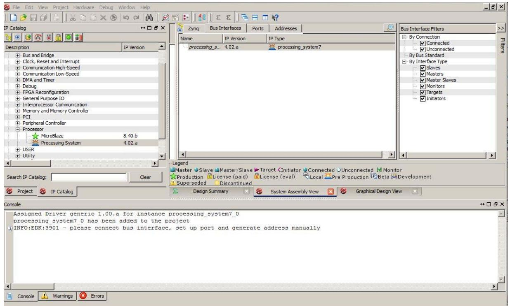

*Figure 2-1:* **XPS System Assembly View**

- 5. Click the **Zynq** tab in the System Assembly View to open the Zynq Processing System block diagram.
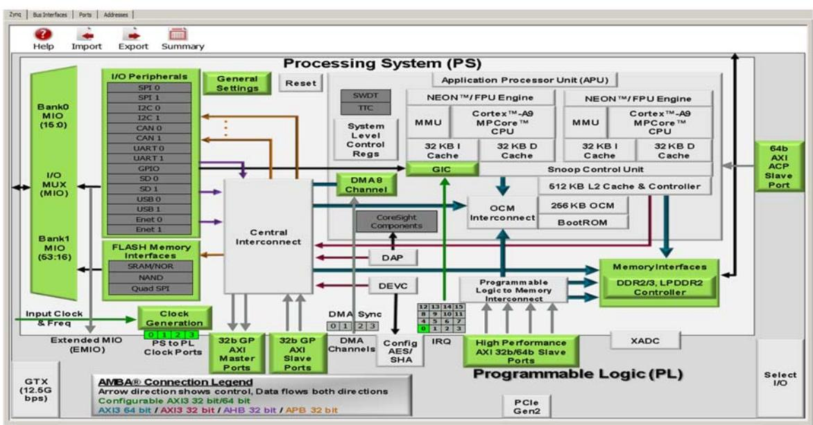

*Figure 2-2:* **Zynq Processing System**

Review the contents of the block diagram. The green colored blocks in the Zynq Processing System diagram are items that are configurable. You can click a green block to open the coordinating configuration window.

- 6. Click the **Import Zynq Configurations** button .
The Import Zynq Configurations dialog box opens.

- 7. Select a configuration template file for the ZC702 board. The template selected by default is the one in the installation path on your local machine that corresponds to the ZC702 board.

*Figure 2-3:* **Import Zynq Configurations Dialog Box**

- 8. Click **OK**.
- 9. In the confirmation window that opens to verify that the Zynq MIO Configuration and Design will be updated, click **Yes**.

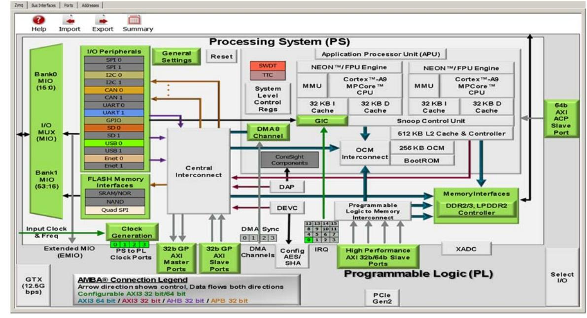

- 10. Note the change to the Zynq block diagram. The I/O Peripherals become active.


- 11. In the block diagram, click the green **I/O Peripherals** box.
Many peripherals are now enabled in the Processing System with some MIO pins assigned to them as per the board layout of the ZC702 board. For example, UART1 is enabled and UART0 is disabled. This is because UART1 is connected to the USB - UART connector through UART to the USB converter chip on the ZC702 board.

- 12. Close the Zynq PS MIO Configurations window.
- 13. Close the XPS window. The active PlanAhead tool session updates with the project settings.

For Exporting System information to SDK for software development, refer to [2.1.2](#page-16-0) [Take a Test](#page-16-0)  [Drive! Exporting to SDK.](#page-16-0)

### <span id="page-16-0"/>**2.1.2 Take a Test Drive! Exporting to SDK**

In this test drive, you will launch SDK from the PlanAhead tool.

- 1. Under **Design Sources** in the Sources pane, right-click **system(system.xmp)** and select **Create Top HDL**.
PlanAhead generates the system_stub.v top-level module for the design.

- 2. In the PlanAhead tool, Select **File > Export > Export Hardware for SDK**.
The Export Hardware dialog box opens. By default, the Export Hardware check box is checked.

- 3. Check the **Launch SDK** check box.
- 4. Click **OK**; SDK opens.
Notice that when SDK launches, the hardware description file is automatically read in. The system.xml tab shows the address map for the entire Processing System.

*Figure 2-5:* **Address Map in SDK system.xml Tab**

- 5. Close SDK.
### **What Just Happened?**

The PlanAhead design tool exported the Hardware Platform Specification for your design (system.xml in this example) to SDK. In addition to system.xml, there are four more files exported to SDK. They are ps7_init.c, ps7_init.h, ps7_init.tcl, and ps7_init.html.

The system.xml file opens by default when SDK launches. The address map of your system read from this file is shown by default in the SDK window.

The ps7_init.c and ps7_init.h files contain the initialization code for the Zynq Processing System and initialization settings for DDR, clocks, plls, and MIOs. SDK uses these settings when initializing the processing system so that applications can be run on top of the processing system. There are some settings in the processing system that are fixed for the ZC702 evaluation board.

### **What's Next?**

Now you can start developing the software for your project using SDK. The next sections help you create a software application for your hardware platform.

### <span id="page-18-0"/>**2.1.3 Take a Test Drive! Running the "Hello World" Application**

- <span id="page-18-2"/>1. Connect the power cable to the board.
- 2. Connect a Digilent cable between the Windows Host machine and the Target board with the following SW10 switch settings:
	- ° Bit 1 is 0
	- ° Bit 2 is 1

*Note:* 0 = switch is open. 1 = switch is closed.

- 3. Connect a USB cable to connector J17 on the target board with the Windows Host machine. This is used for USB to serial transfer.
- 4. Power on the ZC702 board using the switch indicated in [Figure](#page-18-1) [2-6](#page-18-1).

X-Ref Target - Figure 2-6

**IMPORTANT:** *Ensure that jumpers J27 and J28 are placed on the side farther from the SD card slot and change the SW16 switch setting as shown in [Figure](#page-18-1) [2-6](#page-18-1).*

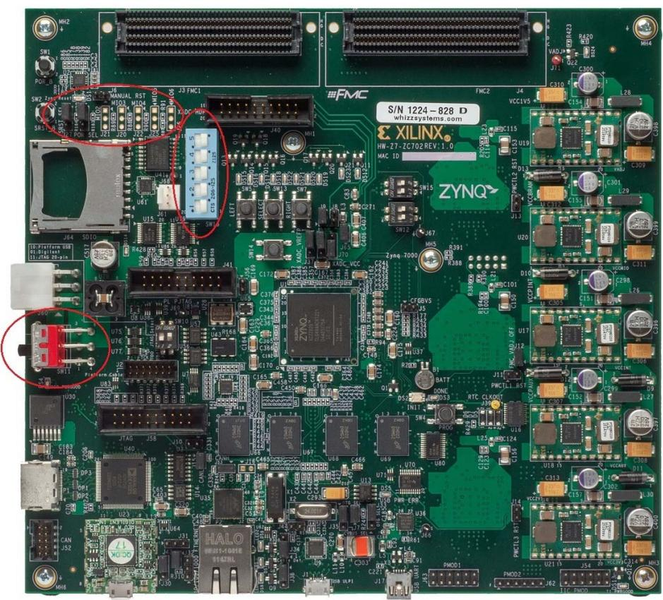

*Figure 2-6:* **ZC702 Board Power Switch**

- <span id="page-18-1"/>5. Open SDK and Set workspace path to <*project dir*>/project_1/project_1.sdk/SDK/ SDK_Export.
- 6. For SDK, you must run the Target Communication Frame (TCF) agent on the host machine. Select **Xilinx Tool > Launch Hardware Server**.

#### 7. Select **Xilinx Tools > Configure JTAG Setting**.

The Configure JTAG Settings wizard opens.

- 8. In the wizard, under the **JTAG Cable > Type** drop-down menu, ensure **Type** is set to **Xilinx TCF Cable**.
- 9. Click **OK**.
- 10. Open a serial communication utility for the COM port assigned on your system. SDK provides a serial terminal utility; select **Window > Show View > Terminal** to open it.

*Note:* The standard configuration for Zynq Processing System is: Baud rate 115200; 8 bit; Parity: none; Stop: 1 bit; Flow control: none.

#### 11. Select **File > New > Application Project**.

The New Project Wizard opens.

- 12. Use the information in the table below to make your selections in the wizard screens.

| Wizard Screen       | System Property          | Setting or Command to Use                                     |  |  |
|---------------------|--------------------------|---------------------------------------------------------------|--|--|
|                     | Project Name             | hello_world                                                   |  |  |
|                     | Use Default Location     | Select this option                                            |  |  |
|                     | Hardware Platform        | system_hw_platform                                            |  |  |
| Application Project | Processor                | PS7_cortexa9_0                                                |  |  |
|                     | OS Platform              | standalone                                                    |  |  |
|                     | Language                 | C                                                             |  |  |
|                     | Board Support<br>Package | Select Create New and provide the name of<br>hello_world_bsp. |  |  |
| Templates           | Available Templates      | Hello World                                                   |  |  |

SDK creates the **hello_world** application project and **hello world_bsp** BSP project under the project explorer. It automatically compiles both and creates the ELF file.

*Note:* If SDK returns the error "arm-xilinx-eabi-gcc: command not found," refer to [Answer](http://www.xilinx.com/support/answers/53306.htm)  [Record 53306](http://www.xilinx.com/support/answers/53306.htm).

- 13. Right-click **hello_world** and select **Run as > Run Configurations**.
- 14. Right-click **Xilinx C/C++ ELF** and click **New**.

SDK creates the new run configuration, named hello_world Debug.

The configurations associated with the application are pre-populated in the Main tab of the launch configurations.

- 15. Click the **Device Initialization** tab in the launch configurations and check the settings here.
Notice that there is a configuration path to the initialization TCL file. The path of ps7_init.tcl is mentioned here. This file was exported when you exported your design to SDK; it contains the initialization information for the processing system.

- 16. The STDIO Connection tab is available in the launch configurations settings. You can use this to have your STDIO connected to the console. We will not use this now because we have already launched a serial communication utility. There are more options in launch configurations but we will focus on them later.
#### 17. Click **Run**.

- 18. "Hello World" appears on the serial communication utility.
*Note:* There was no bitstream download required for the above software application to be executed on the Zynq evaluation board. The ARM Cortex A9 dual core is already present on the board. Basic initialization of this system to run a simple application is done by the Device initialization TCL script.

#### **What Just Happened?**

The application software sent the "Hello World" string to the UART1 peripheral of the PS section.

From UART1, the "Hello world" string goes, byte by byte, to the serial terminal application running on the host machine, which displays it as a string.

#### **Associated Training Lab**

The corresponding lab course for this Test Drive is *Zynq-7000 All Programmable SoC Design Workshop Bare Metal Software Development*.

This lab course demonstrates:

- Importing a hardware description into SDK
- Creating and customizing a BSP
- Downloading, debugging, and running software using SDK.
- Profiling a simple application to determine where the software is spending its time.
- Performing on chip debug to observe AXI transactions using ChipScope Pro Analyzer.

A link to training labs is available in [Appendix](#page-88-4) [A, Additional Resources.](#page-88-4)

### <span id="page-21-0"/>**2.1.4 Additional Information**

#### **Board Support Package**

The board support package (BSP) is the support code for a given hardware platform or board that helps in basic initialization at power up and helps software applications to be run on top of it. It can be specific to some operating systems with bootloader and device drivers.

#### **Standalone OS**

Standalone is a simple, low-level software layer. It provides access to basic processor features such as caches, interrupts, and exceptions, as well as the basic processor features of a hosted environment. These basic features include standard input/output, profiling, abort, and exit. It is a single threaded semi-hosted environment.

The application you ran in this chapter was created on top of the Standalone OS.


# <span id="page-22-4"/><span id="page-22-2"/>Embedded System Design Using the Zynq Processing System and Programmable Logic

<span id="page-22-1"/>One of the unique features of using the Xilinx® Zynq™-7000 AP SoC processor All Programmable SoC as an embedded design platform is in using the Zynq Processing System (PS) for its ARM Cortex A9 dual core processing system as well as Programmable Logic (PL) available on it.

In this chapter we will be creating a design with:

- AXI GPIO and AXI Timer with interrupt from fabric to PS section
- ChipScope™ IP instantiated in the PL
- Zynq PS GPIO pin connected to the PL side pin via the EMIO interface

The flow of this chapter is similar to that in [Chapter](#page-10-4) [2](#page-10-4). If you have skipped that chapter, you might want to look at it because we will keep referring to the material in it many times in this chapter.

### <span id="page-22-3"/><span id="page-22-0"/>**3.1 Adding IPs in Fabric to Zynq PS**

There is no restriction on the complexity of an IP that can be added in fabric to be tightly coupled with the Zynq PS. This section covers a simple example with AXI GPIO, AXI Timer with interrupt, PS section GPIO pin connected to PL side pin via EMIO interface, and ChipScope instantiation for the proof of concept.

In this section, you'll create a design to check the functionality of the AXI GPIO, AXI Timer with interrupt instantiated in fabric, and PS section GPIO with EMIO interface. The block diagram for the system is as shown in [Figure](#page-23-0) [3-1](#page-23-0).

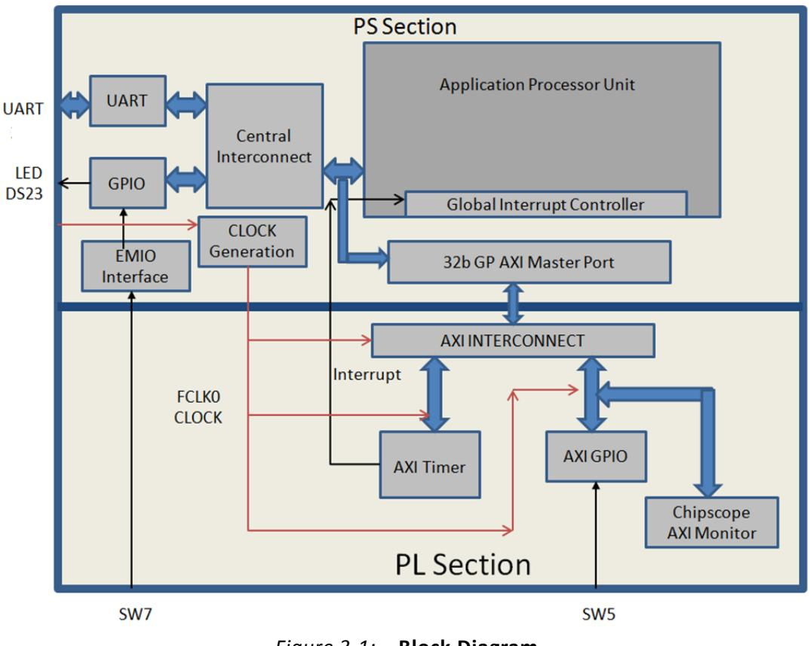

*Figure 3-1:* **Block Diagram**

<span id="page-23-0"/>This system covers the following connections:

- Fabric-side AXI GPIO has only 1 bit channel width and it is connected to the push-button switch 'SW5' on the ZC702 board.
- PS section GPIO also has 1 bit interface routed to fabric pin via EMIO interface and connected to the push-button switch 'SW7' on the board.
- In the PS section another 1 bit GPIO is connected to the LED 'DS23' on board which is on MIO port.
- AXI timer interrupt is connected from fabric to the PS section interrupt controller. The timer starts when you press any of the selected push buttons on the board. After the timer expires, the timer interrupt is triggered.

You will write the application software code. When you run the code, a message appears in the serial terminal and asks you to select the push button switch to use on the board (either SW7 or SW5). When the button is pressed, the timer starts automatically, switches OFF LED DS23, and waits for the timer interrupt to happen. After the Timer Interrupt, LED DS23 switches ON and execution starts again and waits for you to again select the push button switch in the serial terminal.

You will add the ChipScope Integrated Controller (ICON) and AXI Monitor IPs to the design so that in a later section you can learn how to debug hardware using the AXI monitor.

The sections of [Chapter](#page-10-0) [2](#page-10-0) are valid for this design flow also. You'll use the system created in that chapter and pick up the procedure following [2.1.1](#page-10-5) [Take a Test Drive! Creating a New Embedded](#page-10-5)  [Project With a Zynq Processing System](#page-10-5).

### <span id="page-24-1"/><span id="page-24-0"/>**3.1.1 Take a Test Drive! Checking the Functionality of the IPs Instantiated in the Fabric**

In this test drive, you'll check the functionality of the AXI GPIO, AXI Timer with interrupt instantiated in fabric and EMIO interface.

- 1. In the PlanAhead™ tool Sources pane, invoke XPS by double-clicking system_i-system(system.xmp). This is the embedded source you created in [Take a Test](#page-10-5)  [Drive! Creating a New Embedded Project With a Zynq Processing System, page](#page-10-5) [11](#page-10-5).
- 2. In the XPS System Assembly View, click the **Bus Interfaces** tab.
- 3. From the IP catalog, expand **General Purpose IO** and double-click **AXI General Purpose IO** to add it.

A message appears asking if you want to add the axi_gpio 1.01.b IP instance to your design.

- 4. Click **Yes**.
The configuration window for GPIO opens.

- 5. Expand Channel 1 to view configuration parameters for channel 1.
- 6. Notice GPIO Data Channel Width with value 32. Change it to 1 as your design needs only one bit of input to work. Leave all other parameters as they are.
- 7. Click **OK**.

A message window opens with the message "axi_gpio IP with version number 1.01.b is instantiated with name axi_gpio_0". It will ask you to determine to which processor to connect. Remember you are designing with a dual core ARM processor. The message also says XPS will make the Bus Interface Connection, assign the address, and make IO ports external.

The default choice of processor is "processing_system7_0". Do not change this.

- 8. Click **OK**.
There are a few connections that are not done automatically and must be done manually.

*Note:* The AXI interconnect automatically gets instantiated between the Fabric IPs and the PS Section Interconnect. In this example, AXI GPIO is connected to PS through AXI interconnect.

- 9. In the IP Catalog, expand **DMA and Timer** and double-click the **AXI Timer/Counter** IP to add it.
A dialog box appears asking if you want to add the axi_timer_1.03.a IP instance to your design.

- 10. Click **Yes**.
The configuration window for TIMER opens. Leave all other parameters as they are.

- 11. Click **OK**.
A message window opens with the message "axi_timer IP with version number 1.03.a is instantiated with name axi_timer_0." It will ask you to determine to which processor to connect. Remember you are designing with a dual core ARM processor. The message also says XPS will make the Bus Interface Connection, assign the address, and make IO ports external.

The default choice of processor is "processing_system7_0". Do not change this.

#### 12. Click **OK**.

You'll connect the AXI timer Interrupt to the PS section interrupt manually later in this section.

- 13. In the IP Catalog, expand **Debug** and add two IPs to the design: **ChipScope AXI Monitor** and **ChipScope Integrated Controller**. Do not make changes to the configuration of either IP.
- 14. Click the **Ports** tab, which lists the IPs and their ports. Expand axi_interconnect_1, axi_gpio_0, axi_timer_0, chipscope_axi_monitor_0, and chipscope_icon_0.
- 15. Review the following IP connections. If any of these aren't already connected, connect them now

| IP                      | Port                               | Connection                                         |
|-------------------------|------------------------------------|----------------------------------------------------|
| axi_interconnect_1      | INTERCONNECT_ACLK                  | processing_system7_0 : FCLK_CLK0                   |
|                         | INTERCONNECT_ARESETN               | processing_system7_0::FCLK_RESET0_N                |
| axi_gpio_0              | (BUS_IF) S_AXI::S_AXI_ACLK         | processing_system7_0: FCLK_CLK0                    |
|                         | (IO_IF) gpio_0::GPIO_IO            | External Port ::axi_gpio_0_GPIO_IO_pin             |
| axi_timer_0             | (BUS_IF) S_AXI_::S_AXI_ACLK        | processing_system7_0 : FCLK_CLK0                   |
| Chipscope_axi_monitor_0 | CHIPSCOPE_ICON_CONTROL             | Chipscope_icon_0 ::control0                        |
|                         | (BUS_IF) MON_AXI::<br>MON_AXI_ACLK | processing_system7_0 : FCLK_CLK0                   |
| Chipscope_icon_0        | Control0                           | Chipscope_axi_monitor0::CHIPSCOPE_ICON_C<br>ONTROL |

#### *Table 3-1:* **IP Connections**

Your Ports tab should be similar to [Figure](#page-25-0) [3-2](#page-25-0).

<span id="page-25-0"/>*Figure 3-2:* **Completed Port Connections**

X-Ref Target - Figure 3-2

- 16. Collapse all IPs and expand processing_system7_0. If the following port connection is not made, do it now. It should look like [Figure](#page-26-0) [3-3](#page-26-0).

| IP                   | Port                                   | Connection                        |
|----------------------|----------------------------------------|-----------------------------------|
| Processing_system7_0 | (BUS_IF) M_AXI_GP0::<br>M_AXI_GPO_ACLK | processing_system7_0 :: FCLK_CLK0 |

#### *Figure 3-3:* **Processing_system7_0 Expanded and M_AXI_GP0_ACLK Connected**

- <span id="page-26-0"/>17. Connect the Timer interrupt on the fabric side to the PS side interrupt controller by doing the following:
	- a. In the Connected Port column of Processing_System7_0, click **L to H: No Connection**.

The Interrupt Connection dialog box opens.

*Figure 3-4:* **Interrupt Connection Dialog Box**

X-Ref Target - Figure 3-4

- b. In the Unconnected Interrupts list, select axi_timer_0 and click the right arrow button to move it to the Connected Interrupts list.
[Figure](#page-27-0) [3-5](#page-27-0) displays the axi_timer_0 interrupt instance connected with Interrupt ID 91.

<span id="page-27-0"/>

#### c. Click **OK**.

X-Ref Target - Figure 3-6

X-Ref Target - Figure 3-7

XPS connects the timer interrupt on the Fabric side to the PS section interrupt controller.

*Figure 3-6:* **Timer Interrupt Connected on the Fabric Side**

- 18. Click the **Bus Interfaces** tab and expand chipscope_axi_monitor_0.
- 19. In the **Bus Name** column, click **No Connection**. Using the drop-down list that appears, connect chipscope_axi_monitor to axi_gpio_0.S_AXI.

By making this connection, you can monitor any type of AXI-related transactions on the axi_gpio_0 slave AXI bus using ChipScope Analyzer.

*Figure 3-7:* **Connected chipscope_axi_monitor**

- 20. Route the PS section GPIO to the PL side pad using the EMIO interface by doing the following:
	- a. In the XPS System Assembly View, click the **Zynq** tab.
	- b. Click the **I/O Peripherals** button to open the Zynq PS Configuration dialog box.
	- c. In the **Zynq PS Configuration** tab, expand the **GPIO** item.

X-Ref Target - Figure 3-9

- d. Click to select the **EMIO GPIO (Width)** check box.
The **Width of EMIO GPIO** setting is enabled on the next column. The default setting is 64.

- e. Change the EMIO GPIO width to **1** and click **Close**.
- f. In the System Assembly View, click the Ports tab and expand processing_system7_0. You can see that the GPIO port is not connected to an external port.

*Figure 3-8:* **GPIO Port Not Connected to External Ports**

- 21. Expand (IO_IF)GPIO_0 and select **GPIO**.
- 22. Click the drop-down arrow in the **Connected Port** column and select **External Ports**.

Making this connection allows you to assign the PL section pin location to PS GPIO in the user constraint file (UCF) later in this chapter.

- 23. Run Design Rule Check. Ensure there are no errors in the console.
*Note:* If there are errors, double-check the steps you followed.

*Figure 3-9:* **Design Rule Check Warnings**

- 24. Close XPS. The PlanAhead™ design tool window becomes active again.
- 25. In Design Sources, click on your embedded source and then right-click it and select **Create Top HDL**. The PlanAhead tool generates the system_stub.v file.
- 26. In the Project Manager list of the Flow Navigator, click **Add Sources**.
- 27. In the dialog box that opens, select **Add or Create Constraints**, then click **Next**.
- 28. Click **Create File**. In the Create Constraints File dialog box that opens, name the file **system** and click **OK**.
- 29. Click **Finish**.

- 30. Expand the **Constraints** folder in the Sources window. Notice that the blank file system.ucf was added inside constrs_1.
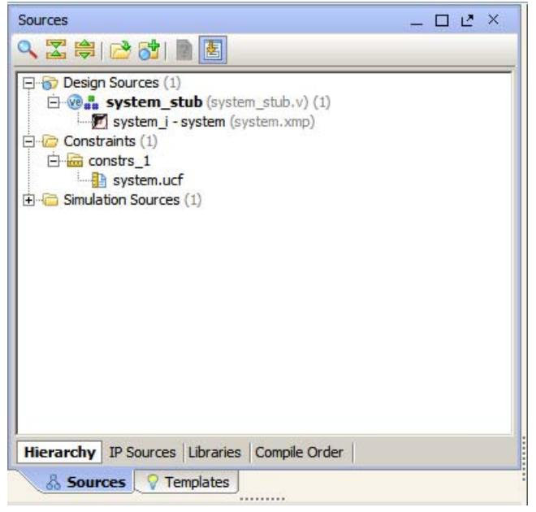

*Figure 3-10:* **system.ucf File Added**

- 31. Type the following text in the UCF file:

```
# Connect to Push Button "SW5"
NET axi_gpio_0_GPIO_IO_pin IOSTANDARD=LVCMOS25 | LOC=G19;
# Connect to Push Button "SW7"
NET processing_system7_0_GPIO_pin IOSTANDARD=LVCMOS25 | LOC=F19;
```
The following settings are made:

- ° The LOC constraint for NET "axi_gpio_0_IO_pin" connects the AXI GPIO pin to the G19 pin of the PL section and physically connects it to the SW5 push button on the board.
- ° The LOC constraint for NET "processing_system7_0 GPIO pin" connects the PS section GPIO to the F19 pin of the PL section and physically connects it to the SW7 push button on the board.
- ° The IOSTANDARD=LVCMOS25 constraint sets both pins to LVCMOS 2.5V I/O standard.
- 32. Save all modified files.
- 33. In the Program and Debug list in the Flow Navigator, click **Generate Bitstream**. Ignore any critical warnings that appear.
- 34. After the Bitstream generation completes, export the hardware and Launch SDK as described in [Chapter](#page-10-0) [2](#page-10-0). For this design, since there is a bitstream generated for the PL Fabric, this will also be exported to SDK.

### **Associated Training Lab**

The corresponding lab course for this Test Drive is *Zynq-7000 All Programmable SoC Hardware Development*.

This lab demonstrates the recommended embedded design flow for creating an embedded Zynq™ All Programmable SoC system and utilizing peripherals in both the processing system (PS) and programmable logic (PL).

<span id="page-30-2"/>A link to training labs is available in [Appendix](#page-88-4) [A, Additional Resources.](#page-88-4)

### <span id="page-30-0"/>**3.1.2 Take a Test Drive! Working with SDK**

- 1. SDK launches with the "Hello World" project you created with the Standalone PS in [Chapter](#page-10-0) [2.](#page-10-0)
- 2. Select **Project > Clean** to clean and build the project again.
- 3. Open the helloworld.c file and modify the application software code as described in [Standalone Application Software for the Design, page](#page-31-0) [32](#page-31-0).

*Note:* While building the application software, if SDK returns the error "arm-xilinx-eabi-gcc: command not found," refer to [Answer Record 53306](http://www.xilinx.com/support/answers/53306.htm).

- 4. Open the serial communication utility with baud rate set to **115200**.
- 5. Connect the board.
- 6. Because you have a bitstream for the PL Fabric, you must download the bitstream. To do this, select **Xilinx Tools > Program FPGA**. The Program FPGA dialog box, shown in [Figure](#page-30-1) [3-11](#page-30-1), opens. It displays the bitstream exported from PlanAhead.

*Figure 3-11:* **Program FPGA Dialog Box**

- <span id="page-30-1"/>7. Click **Program** to download the bitstream and program the PL Fabric.
- 8. Run the project similar to the steps in [Take a Test Drive! Running the "Hello World" Application,](#page-18-2)  [page](#page-18-2) [19](#page-18-2).
- 9. In the system, the AXI GPIO pin is connected to push button SW5 on the board, and the PS section GPIO pin is connected to push button SW7 on the board via an EMIO interface.
- 10. Follow the instructions printed on the serial terminal to run the application.

### <span id="page-31-0"/>**3.2 Standalone Application Software for the Design**

The system you designed in this chapter requires application software for the execution on the board. This section describes the details about the application software.

The main() function in the application software is the entry point for the execution. This function includes initialization and the required settings for all peripherals connected in the system. It also has a selection procedure for the execution of the different use cases, such as AXI GPIO and PS GPIO using EMIO interface. You can select different use cases by following the instruction on the serial terminal.

### <span id="page-31-1"/>**3.2.1 Application Software Steps**

Application Software comprises the following steps:

- 1. Initialize the AXI GPIO module.
- 2. Set a direction control for the AXI GPIO pin as an input pin, which is connected with SW5 push button on the board. The location is fixed via LOC constraint in the user constraint file (UCF) during system creation.
- 3. Initialize the AXI TIMER module with device ID 0.
- 4. Associate a timer callback function with AXI timer ISR.

This function is called every time the timer interrupt happens. This callback switches on the LED 'DS23' on the board and sets the interrupt flag.

The main() function uses the interrupt flag to halt execution, wait for timer interrupt to happen, and then restarts the execution.

- 5. Set the reset value of the timer, which is loaded to the timer during reset and timer starts.
- 6. Set timer options such as Interrupt mode and Auto Reload mode.
- 7. Initialize the PS section GPIO.
- 8. Set the PS section GPIO, channel 0, pin number 10 to the output pin, which is mapped to the MIO pin and physically connected to the LED 'DS23' on the board.
- 9. Set PS Section GPIO channel number 2 pin number 0 to input pin, which is mapped to PL side pin via the EMIO interface and physically connected to the SW7 push button switch.
- 10. Initialize Snoop control unit Global Interrupt controller. Also, register Timer interrupt routine to interrupt ID '91', register the exceptional handler, and enable the interrupt.
- 11. Execute a sequence in the loop to select between AXI GPIO or PS GPIO use case via serial terminal.

The software accepts your selection from the serial terminal and executes the procedure accordingly.

After the selection of the use case via the serial terminal, you must press a push button on the board as per the instruction on terminal. This action switches off the LED 'DS23', starts the timer, and tells the function to wait infinitely for the Timer interrupt to happen. After the Timer interrupt happens, LED 'DS23'' switches ON and restarts execution.

For more details about API related to device drivers, refer to the *Zynq-7000 Software Developers Guide (UG821). A link to this document is available in [Appendix](#page-88-4) [A, Additional Resources](#page-88-4).*

### <span id="page-32-0"/>**3.2.2 Application Software Code**

The Application software for the system is included in helloworld.c, which is available in the ug873-design-files.zip file, which accompanies this guide. A link to this ZIP file is located in [Appendix](#page-88-4) [A, Additional Resources.](#page-88-4)


# <span id="page-33-3"/><span id="page-33-1"/>Debugging with SDK and ChipScope

<span id="page-33-0"/>This chapter describes two types of debug possibilities with the design flow you've already been working with. The first option is debugging with software using SDK. The second option is hardware debug supported by the ChipScope™ software.

### <span id="page-33-4"/><span id="page-33-2"/>**4.1 Take a Test Drive! Debugging with Software Using SDK**

First you will try debugging with software using SDK.

- 1. In the C/C++ Perspective, right-click on the Hello_world Project and select **Debug As > Launch on Hardware (TCF)**.
The Debug Perspective opens.

*Note:* If the Debug Perspective window does not automatically open, select **Window > Open Perspective > Other**, then select **Debug** in the Open Perspective wizard.

*Figure 4-1:* **Debug Perspective Suspended**

*Note:* The addresses shown on this page may slightly differ from the addresses shown on your system.

The processor is currently sitting at the beginning of main() with program execution suspended at line 0x00100674. You can confirm this information with the Disassembly view, which shows the assembly-level program execution also suspended at 0x00100674.

*Note:* If the disassembly view is not visible, select **Window > Show view > Disassembly**.

X-Ref Target - Figure 4-1

The helloworld.c window also shows execution suspended at the first executable line of C code. Select the Registers view to confirm that the program counter, pc register, contains 0x00100674.

*Note:* If the Registers window is not visible, select **Window > Show View > Registers**.

- 2. Double-click in the margin of the helloworld.c window next to the line of code that reads init_platform (). This sets a breakpoint at init_platform (). To confirm the breakpoint, review the Breakpoints window.
*Note:* If the Breakpoints window is not visible, select **Window > Show View > Breakpoints**.

- 3. Select **Run > Resume** to resume running the program to the breakpoint.
Program execution stops at the line of code that includes init_platform (). The Disassembly and Debug windows both show program execution stopped at 0x001006a8.

- 4. Select **Run > Step Into** to step into the init_platform () routine.
Program execution suspends at location 0x00100cbc. The call stack is now two level deep.

- 5. Select **Run > Resume** again to run the program to conclusion.
When the program completes running the Debug window shows that the program is suspended in a routine called exit. This happens when you are running under control of the debugger.

- 6. Re-run your code several times. Experiment with single-stepping, examining memory, breakpoints, modifying code, and adding print statements. Try adding and moving views.
- 7. Close SDK.

#### **Associated Training Lab**

The corresponding lab course for this Test Drive is *Zynq-7000 All Programmable SoC Design Workshop Bare Metal Software Development.*

This lab demonstrates:

- Importing a hardware description into SDK
- Creating and customizing a BSP
- Downloading, debugging, and running software using SDK
- Profiling a simple application to determine where the software is spending its time
- Performing on chip debug to observe AXI transactions using ChipScope Pro Analyzer

A link to training labs is available in [Appendix](#page-88-4) [A, Additional Resources.](#page-88-4)

### <span id="page-35-0"/>**4.2 Take a Test Drive! Debugging Hardware Using ChipScope Software**

Next you will try debugging hardware using the ChipScope software using the same application you created in [3.1.2](#page-30-2) [Take a Test Drive! Working with SDK](#page-30-2).

- 1. Check that the Target Communication Frame (TCF) (hw_server.exe) agent is running on your Windows machine. If it is not running, follow step 1 of [Take a Test Drive! Running the "Hello](#page-18-2)  [World" Application](#page-18-2) to run the TCF agent.
- 2. Re-download the bitstream and application to the ZC702 as described in [3.1.2](#page-30-2) [Take a Test](#page-30-2)  [Drive! Working with SDK.](#page-30-2)
- 3. Run the Application and Close SDK.
- 4. Open ChipScope Pro™ Analyzer.
- 5. Make sure the hardware is connected to the USB port of your computer with a Digilent cable. You must also have the cable device driver installed.
- 6. Select **JTAG Chain > Open Plug-in**.

The Open Plug-in wizards opens.

- 7. Type *xilinx_tcf url=tcp:* in Plug-in parameters.
- 8. Click **OK**.
- 9. Import a *.cdc file in ChipScope and do the following:
	- a. Select **Dev 1 Mydevice1(XC7020)**.
	- b. Select **File > Import**.
	- c. Click **Select New File** and select the chipscope_axi_monitor_0.cdc file from <project_path>\<project_name>.srcs\sources_1\edk\system\implementat ion\chipscope_axi_monitor_0_wrapper.
	- d. Click **OK**.
- 10. Set a trigger at the "ARVALID" signal by doing the following.
	- a. Expand the Trigger Setup window.
	- b. For the M1:MON_AXI_ARADDRCONTROL unit, change the value of axi_gpio_0_S_AXI/MON_AXI_AVALID from the default of **X** to **1**. With this setting, any positive transaction on this signal triggers the waveform.

X-Ref Target - Figure 4-3

*Figure 4-2:* **Trigger Setup Window, MON_AXI_AVALID Setting**

- c. In the Trig section of the Trigger Setup window, click **M0** in the **Trigger Condition Equation** column.
The Trigger Condition dialog box opens.

- d. In the **Enable** column, Unselect **M0** and select **M1**.
The trigger channel changes from M0 to M1; the ARVALID signal is on the M1 channel.

*Figure 4-3:* **Trigger Condition Dialog Box**

- 11. Click **OK**.
- 12. In the Capture section of the Trigger Setup window, change the **Position** setting from **0** to **512**.
The Trigger Point moves to the middle of the waveform as the sample depth changes to 1024.

- 13. Click the **Run** button .
X-Ref Target - Figure 4-4

ChipScope Analyzer waits for the trigger event.

- 14. Follow the instructions on the serial terminal to select the AXI GPIO use case. This triggers the waveform.

*Figure 4-4:* **Waveforms**

#### **Associated Training Lab**

The corresponding lab course for this Test Drive is *Zynq-7000 All Programmable SoC Design Workshop Bare Metal Software Development.*

This lab demonstrates:

- Importing a hardware description into SDK
- Creating and customizing a BSP
- Downloading, debugging, and running software using SDK
- Profiling a simple application to determine where the software is spending its time
- Performing on chip debug to observe AXI transactions using ChipScope Pro Analyzer

A link to training labs is available in [Appendix](#page-88-4) [A, Additional Resources.](#page-88-4)


## <span id="page-38-0"/>*Chapter 5*

# <span id="page-38-3"/><span id="page-38-1"/>Linux Booting and Application Debugging Using SDK

This chapter describes the steps to boot the Linux OS on the Zynq™-7000 AP SoC board. It also provides information about downloading images precompiled by Linux on the target memory using a JTAG interface. The later part of this chapter covers programming of the following non-volatile memory with the Linux precompiled images, which are used for automatic Linux booting after switching on the board:

- On-board QSPI Flash
- SD card

This chapter also describes using the SDK remote debugging feature to debug Linux applications running on the target board. The SDK tool software runs on the Windows host machine. For application debugging, SDK establishes an Ethernet connection to the target board that is already running the Linux OS.

### <span id="page-38-2"/>**5.1 Requirements**

In this chapter, the target platform points to a Zynq board. The host platform points a Windows machine that is running the ISE® Design Suite tools.

*Note:* The Das U-Boot universal bootloader is required for the tutorials in this chapter. It is included in the precompiled images that you will download next.

From the Xilinx documentation website, download the ug873-design-files.zip file. A link to this document is available in [Appendix](#page-88-4) [A, Additional Resources.](#page-88-4) It includes the following files:

- BOOT.bin: Binary image containing the FSBL and U-Boot images produced by bootgen.
- cdma_app: Standalone Application software for the system you will create in [Chapter](#page-52-2) [6.](#page-52-2)
- devicetree.dtb: Device tree binary large object (blob) used by Linux, loaded into memory by U-Boot.
- helloworld.c: Standalone Application software for the system you created in [Chapter](#page-22-1) [3.](#page-22-1)
- linux_cdma_app: Linux OS based Application software for the system you will create in [Chapter](#page-52-2) [6.](#page-52-2)
- uramdisk.image.gz: Ramdisk image used by Linux, loaded into memory by U-Boot.
- README.txt: Description of the release.
- u-boot.elf: U-Boot file used to create the BOOT.BIN image.
- uImage: Linux kernel image, loaded into memory by U-Boot
- zync_fsbl_0.elf: FSBL image used to create BOOT.BIN image
- stub.tcl: Script file used for steps in [5.2.3](#page-41-0) [Take a Test Drive! Linux Booting Using JTAG](#page-41-0)  [Mode.](#page-41-0)

### <span id="page-39-3"/><span id="page-39-0"/>**5.2 Booting Linux on a Zynq Board**

This section covers the flow for booting Linux on the target board using the precompiled images that you downloaded in [5.1](#page-38-2) [Requirements](#page-38-2).

*Note:* The compilations of the different images like Kernel image, U-Boot, Device tree, and root file system is beyond the scope of this guide.

### <span id="page-39-1"/>**5.2.1 Boot Methods**

The following boot methods are available:

- [Master Boot Method](#page-39-2)
- [Slave Boot Method](#page-40-1)

#### <span id="page-39-2"/>**Master Boot Method**

In the master boot method, different kinds of non-volatile memories like QSPI, NAND, NOR flash, and SD cards are used to store boot images. In this method, the CPU loads and executes the external boot images from non-volatile memory into the Processor System (PS). The master boot method is further divided into *Secure* and *Non Secure* modes. Refer to the *Zynq-7000 Extensible Processing Platform Technical Reference Manual* (UG585) for more detail. A link to this document is available in [Appendix](#page-88-4) [A, Additional Resources](#page-88-4).

The boot process is initiated by one of the ARM Cortex-A9 CPUs in the processing system (PS) and it executes on-chip ROM code. The on-chip ROM code is responsible for loading the first stage boot loader (FSBL). The FSBL does the following:

- Configures the FPGA with the hardware bitstream (if it exists)
- Configures the MIO interface
- Initializes the DDR controller
- Initializes the clock PLL
- Loads and executes the Linux U-Boot image from non-volatile memory to DDR

The U-Boot loads and starts the execution of the Kernel image, the root file system, and the device tree from non-volatile RAM to DDR. It finishes booting Linux on the target platform.

#### <span id="page-40-1"/>**Slave Boot Method**

JTAG can only be used in slave boot mode. An external host computer acts as the master to load the boot image into the OCM using a JTAG connection.

*Note:* The PS CPU remains in idle mode while the boot image loads. The slave boot method is always a non-secure mode of booting.

In JTAG boot mode, the CPU enters halt mode immediately after it disables access to all security related items and enables the JTAG port. You must download the boot images into the DDR memory before restarting the CPU for execution.

### <span id="page-40-0"/>**5.2.2 Booting Linux from JTAG**

The following flow chart describes the process used to boot Linux on the target platform.

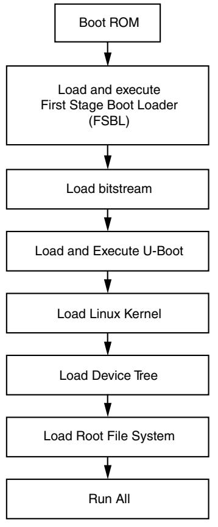

*Figure 5-1:* **Linux Boot Process on the Target Platform**

8

### <span id="page-41-0"/>**5.2.3 Take a Test Drive! Linux Booting Using JTAG Mode**

- <span id="page-41-2"/>1. Check the following Board Connection and Setting for Linux booting using JTAG mode:
	- ° Ensure that the settings of Jumpers J27 and J28 are as described in [Take a Test Drive!](#page-18-2)  [Running the "Hello World" Application, page](#page-18-2) [19](#page-18-2).
	- ° Ensure the SW16 switch setting as shown in [Figure](#page-41-1) [5-2.](#page-41-1)
	- ° Connect an Ethernet cable from the Zynq board to your network.
	- ° Connect the Windows Host machine to your network.
	- ° Connect the power cable to the board.

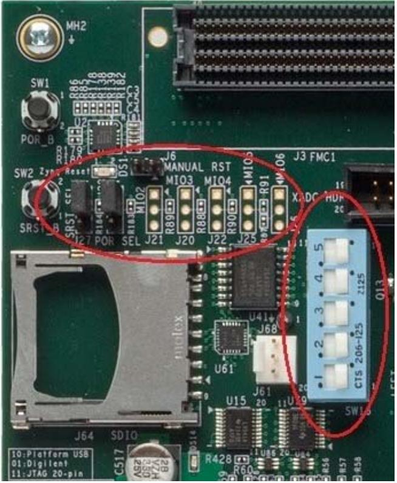

*Figure 5-2:* **Ensure the SW16 Switch Setting**

- <span id="page-41-1"/>2. Connect a Digilent cable between the Windows host machine and the target board with the following SW10 switch settings:
	- ° Bit 1 is 0
	- ° Bit 2 is 1

*Note:* 0 = switch is open. 1 = switch is closed.

- 3. Connect a USB cable to connector J17 on the target board with the Windows Host machine. This is used for USB to serial transfer.
- 4. Change Ethernet Jumper J30 and J43 as shown in [Figure](#page-42-0) [5-3.](#page-42-0)

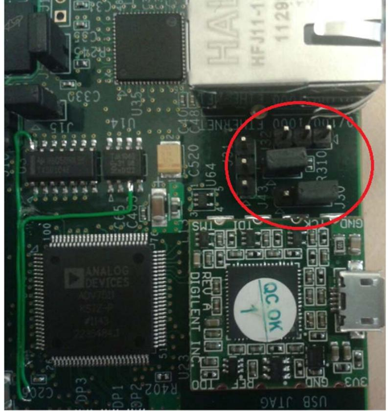

*Figure 5-3:* **Change Jumpers J30 and J43**

- <span id="page-42-0"/>5. Power on the target board.
- 6. Launch SDK and open same workspace you used in [Chapter](#page-10-0) [2](#page-10-0) and [Chapter](#page-22-1) [3](#page-22-1).
- 7. For SDK, you must run the Target Communication Frame (TCF) agent on the host machine. Select **Xilinx Tool > Launch Hardware Server.**
- 8. If the serial terminal is not open, connect the serial communication utility with the baud rate set to 115200.
- 9. Download the bitstream by selecting **Xilinx Tools > Program FPGA**, then clicking **Program**.
- 10. Open the XMD tool by selecting **Xilinx Tools > XMD console**.
- 11. At the XMD prompt, do the following:
	- a. Type **connect arm hw -cable type xilinx_tcf** to connect with the PS section CPU1.
	- b. Type **source <Project Dir>/project_1/project_1.sdk/SDK/SDK_Export/ system_hw_platform/ps7_init.tcl** and then type **ps7_init** to initialize the PS section (such as Clock PLL, MIO, and DDR initialization).
	- c. Type **init_user** to enable level shifters between PS to PL and clear fabric port resets.
	- d. Type **source stub.tcl**.

CPU2 continuously waits for the event from CPU1.

*Note:* The stub.tcl file is available in ug873-design-files.zip, which accompanies this guide. A link to this ZIP file is located in [Appendix](#page-88-4) [A, Additional Resources.](#page-88-4)

- e. Type **target 64** to provide execution control to CPU1.
- f. Type **dow <path>/u-boot.elf** to download Linux U-Boot.
- g. Type **con** to start execution of U-Boot.

On the serial terminal, the autoboot countdown message appears:

Hit any key to stop autoboot: 3

- h. Press **Enter**.
Automatic booting from U-Boot stops and a command prompt appears on the serial terminal.

- i. At the XMD Prompt, type **stop**.
The U-Boot execution is stopped.

- j. Type **dow -data uImage 0x3000000** to download the Linux Kernel image at location 0x3000000.
- k. Type **dow -data uramdisk.image.gz 0x2000000** to download the Linux root file system image at location 0x2000000.
- l. Type **dow -data devicetree.dtb 0x2A00000** to download the Linux device tree at location 0x2A00000.
- m. Type **con** to start executing U-Boot.
- 12. At the command prompt of the serial terminal, type **bootm 0x3000000 0x2000000 0x2A00000**.

<span id="page-43-0"/>The Linux OS boots. After booting completes, the Zynq> prompt appears on the serial terminal.

- 13. At the Zynq> prompt, do the following:
	- a. Check the IP address of the board by typing the following command at the Zynq> prompt: **ifconfig eth0**

This command displays all the details of the currently active interface. In the message that displays, the inet addr value denotes the IP address that is assigned to the Zynq board.

- b. Check the connection with the board by typing **ping** followed by the board IP address on the Windows machine command prompt. The ping response displays in a loop.
This response means that the connection between the Windows host machine and the target board is established.

- c. Press **Ctrl+C** to stop displaying the ping response.
Linux booting completes on the target board and the connection between the host machine and the target board is done. The next Test Drive describes using SDK to debug the Linux application.

### **Associated Training Lab**

The corresponding lab course for this Test Drive is *Running and Debugging a Linux Application on the Zynq Platform*.

This lab demonstrates:

- Importing a hardware description into SDK
- Creating and building a Linux software application
- Downloading, debugging, and running software using SDK.

<span id="page-44-2"/>A link to training labs is available in [Appendix](#page-88-4) [A, Additional Resources.](#page-88-4)

### <span id="page-44-0"/>**5.2.4 Take a Test Drive! Debugging the Linux Application Using SDK Remote Debugging**

In this section, you will create an SDK default Linux hello world application and practice the steps for debugging the Linux application from the Windows host machine.

- 1. Open SDK.
- <span id="page-44-1"/>2. For SDK, you must run the TCF agent on the host machine. Select **Xilinx Tool > Launch Hardware Server**.
- 3. Select **File > New > Application Project**.

The New Project Wizard opens.

- 4. Use the information in the table below to make your selections in the wizard screens.

| Wizard Screen       | System Property      | Setting or Command to Use |
|---------------------|----------------------|---------------------------|
|                     | Project Name         | linux_hello_world         |
|                     | Use Default Location | Select this option        |
|                     | Hardware Platform    | system_hw_platform        |
| Application Project | Processor            | PS7_cortexa9_0            |
|                     | OS Platform          | Linux                     |
|                     | Language             | C                         |
| Templates           | Available Templates  | Linux Hello World         |

#### 5. Click **Finish**.

The New Project Wizard closes and SDK creates the linux_hello_world project under the project explorer. SDK also automatically compiles the project and generates the file linux_hello_world.elf.

*Note:* If SDK returns the error "arm-xilinx-eabi-gcc: command not found," refer to [Answer](http://www.xilinx.com/support/answers/53306.htm)  [Record 53306](http://www.xilinx.com/support/answers/53306.htm).

- 6. Right-click linux_hello_world and select **Debug as > Debug Configurations**.
The Debug Configuration wizard opens.

- 7. In the Debug Configuration wizard, right-click **Remote ARM Linux Application** and click **New**.In the Connection drop-down list, click **New**.
The New Connection wizard opens.

- 8. Click the **SSH Only** tab and click **Next**.
- 9. In the **Host Name** tab, type the target board IP.

*Note:* To determine the target IP, type **ipconfig eth0** at the Zynq> prompt in the serial terminal. The terminal displays the target IP that is assigned to the board.

- 10. Set the connection name and description in the respective tabs.
- 11. Click **Finish** to create the connection.
- 12. In the Debug Configuration wizard, under "Remote Absolute File Path for C/C++ Application," click the **Browse** button. The Select Remote C/C++ Application File wizard opens.
- 13. In the wizard, do the following:
	- a. Expand the root directory to open the Enter Password wizard.
	- b. Provide the user ID and Password (**root**/**root**); select the **Save ID** and **Save Password** options.
	- c. Click **OK**.

*Note:* If a warning message appears, you can safely close it by clicking **YES**.

The window displays the root directory contents, because you previously established the connection between the Windows host machine and the target board.

- d. Right-click on the "/" in the path name and create a new folder; name it Apps.
- e. Under "Remote Absolute File Path for C/C++ Application," Enter the path as /Apps/linux_hello_world.elf.
- 14. Click **Apply**.
- 15. Click **Debug**.

The Debug Perspective opens.

- 16. Follow the debugging procedure outlined in [Take a Test Drive! Debugging with Software Using](#page-33-4)  [SDK, page](#page-33-4) [34.](#page-33-4)
*Note:* The Linux application output displays in the SDK console, not the Terminal window used for running Linux.

- 17. After you finish debugging the Linux application, close SDK.
### <span id="page-45-0"/>**5.2.5 Take a Test Drive! Booting Linux from QSPI Flash**

This Test Drive covers the following steps:

- 1. [Create the First Stage Boot Loader Executable File](#page-46-0)
- 2. [Make a Linux Bootable Image for QSPI Flash](#page-46-1)
- 3. [Program QSPI Flash With the Boot Image Using JTAG and U-Boot Command](#page-48-0)

#### 4. [Booting Linux from QSPI Flash](#page-49-0)

#### <span id="page-46-0"/>**Create the First Stage Boot Loader Executable File**

- 1. Open SDK.
- 2. For SDK, you must run the TCF agent on the host machine. Select **Xilinx Tool > Launch Hardware Server**.
- 3. In SDK, select **File > New > Application Project**.

The New Project wizard opens.

- 4. Use the information in the table below to make your selections in the wizard screens.

| Wizard Screen       | System Property       | Setting or Command to Use                                     |
|---------------------|-----------------------|---------------------------------------------------------------|
|                     | Project Name          | zynq_fsbl_0                                                   |
|                     | Use Default Location  | Select this option                                            |
|                     | Hardware Platform     | system_hw_platform                                            |
| Application Project | Processor             | PS7_cortexa9_0                                                |
|                     | OS Platform           | Standalone                                                    |
|                     | Language              | C                                                             |
|                     | Board Support Package | Select Create New and provide the name of<br>zynq_fsbl_0_bsp. |
| Templates           | Available Templates   | Zynq FSBL                                                     |

- 5. Click **Finish**.
The New Project Wizard closes. SDK creates the zynq_fsbl_0 application project and the zynq_fsbl_0_bsp BSP project under the project explorer. SDK also automatically compiles the project and generates the zynq_fsbl_0.elf file.

*Note:* If SDK returns the error "arm-xilinx-eabi-gcc: command not found," refer to [Answer](http://www.xilinx.com/support/answers/53306.htm)  [Record 53306](http://www.xilinx.com/support/answers/53306.htm).

#### <span id="page-46-1"/>**Make a Linux Bootable Image for QSPI Flash**

- 1. In SDK, select **Xilinx Tools > Create Zynq Boot Image**.
The Create Zynq Boot Image wizard opens.

- 2. Provide the zynq_fsbl_0.elf path in the FSBL ELF tab.

```
Note: You can find zynq_fsbl_0.elf in 
<project dir>/project_1/project_1.sdk/SDK/SDK_Export/zynq_fsbl_0/Debug.
```
Alternately, you can use zynq_fsbl_0.elf from the file you downloaded in [5.1](#page-38-2) [Requirements.](#page-38-2)

*Note:* Files - u-boot.elf, uImage.bin, devicetree.dtb, and uramdisk.image.gz are available in ug873-design-files.zip, which accompanies this guide. A link to this ZIP file is located in [Appendix](#page-88-4) [A, Additional Resources.](#page-88-4)

- 3. Add the U-Boot image, u-boot.elf.
- 4. Add the Linux Kernel image, such as uImage.bin, and provide the offset **0x100000**.

**IMPORTANT:** *There is a Known Issue with the Bootgen command: it does not accept a file without a file extension. To work around this issue, change the uImage downloaded file to uImage.bin.*

- 5. Add the device tree image (devicetree.dtb) and provide offset **0x600000**.
- 6. Add the root file system image (uramdisk.image.gz) and provide offset **0x620000**.

The provided offsets are predefined in the U-Boot. U-Boot expects those addresses when booting from QSPI flash. If you want to change the offset, you must modify and rebuild the U-Boot.

- 7. Provide the output folder name in the **Output Folder** tab.

*Figure 5-4:* **Creating a Zynq Boot Image**

#### 8. Click **Create Image**.

The Create Zynq Boot Image window creates following files in the specified output folder:

- ° bootimage.bif
- ° u-boot.bin
- ° u-boot.mcs

#### <span id="page-48-0"/>**Program QSPI Flash With the Boot Image Using JTAG and U-Boot Command**

You can program QSPI Flash with the boot image using JTAG and the U-Boot command.

- 1. Power on the ZC702 Board.
- 2. If a serial terminal is not open, connect the serial terminal with the baud rate set to 115200.
- 3. Select **Xilinx Tools > XMD Console** to open the XMD tool.
- 4. From the XMD prompt, do the following:
	- a. Type **connect arm hw -cable type xilinx_tcf** to connect with the PS section CPU.
	- b. Type **source <Project Dir>/project_1/project_1.sdk/SDK/SDK_Export/ system_hw_platform/ps7_init.tcl** and then type **ps7_init** to initialize the PS section.
	- c. Type **init_user** to enable level shifters between PS to PL and clear fabric port resets.
	- d. Type **dow u-boot.elf** to download the Linux U-Boot to the QSPI Flash.
	- e. Type **dow -data u-boot.bin 0x08000000** to download the Linux bootable image to the target memory at location 0x08000000.

*Note:* You just downloaded the binary executable to DDR memory. You can download the binary executable to any address in DDR memory.

- f. Type **con** to start execution of U-Boot.
On the serial terminal, the autoboot countdown message appears:

Hit any key to stop autoboot: 3

- 5. Press **Enter**.
Automatic booting from U-Boot stops and the U-Boot command prompt appears on the serial terminal.

- 6. Do the following steps to program U-Boot with the bootable image:
	- a. At the prompt, type **sf probe 0 0 0** to select the QSPI Flash.
	- b. Type **sf erase 0 0x01000000** to erase the Flash data.

This command completely erases 16 MB of on-board QSPI Flash memory.

- c. Type **sf write 0x08000000 0 0xFFFFFF** to write the boot image on the QSPI Flash.
Note that you already copied the bootable image at DDR location 0x08000000. This command copied the data, of the size equivalent to the bootable image size, from DDR to QSPI location 0x0.

For this example, because you have 16 MB of Flash memory, you copied 16 MB of data. You can change the argument to adjust the bootable image size.

- 7. Power off the board.
### <span id="page-49-0"/>**Booting Linux from QSPI Flash**

- 1. After you program the QSPI Flash, set the SW16 switch on your board as shown in [Figure](#page-49-1) [5-5.](#page-49-1)
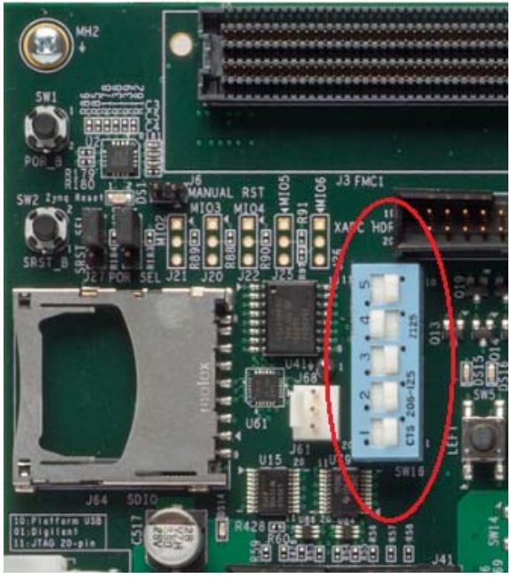

*Figure 5-5:* **Jumper Settings for Booting Linux from QSPI Flash**

- <span id="page-49-1"/>2. Connect the Serial terminal with a 115200 baud rate setting.
- 3. Switch on the board power.

A Linux booting message appears on the serial terminal. After booting finishes, the Zynq> prompt appears.

- 4. Check the Board IP address connectivity as discussed in [Take a Test Drive! Linux Booting Using](#page-41-0)  [JTAG Mode, page](#page-41-0) [42.](#page-41-0)
For Linux Application creation and debugging, refer to [Take a Test Drive! Debugging the Linux](#page-44-0)  [Application Using SDK Remote Debugging, page](#page-44-0) [45.](#page-44-0)

### <span id="page-50-0"/>**5.2.6 Take a Test Drive! Booting Linux From the SD Card**

- 1. Change the SW16 switch setting as shown in [Figure](#page-50-1) [5-6.](#page-50-1)
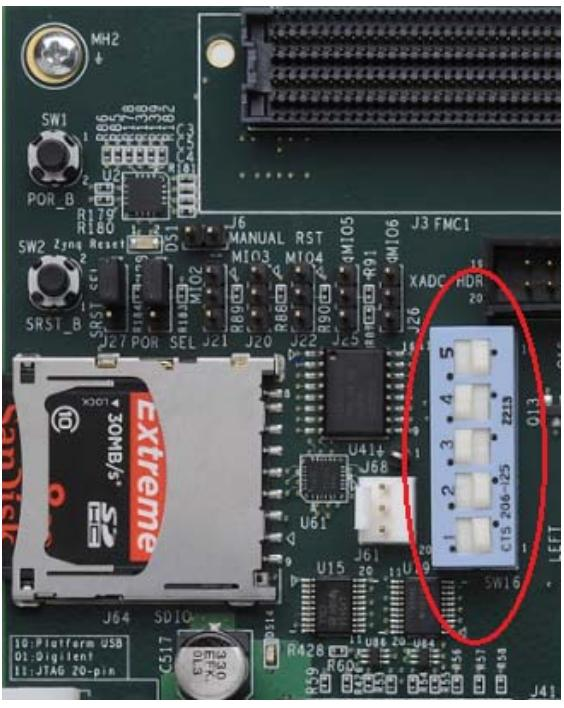

*Figure 5-6:* **Jumper Settings for Booting Linux from SD Card**

- <span id="page-50-1"/>2. Make the board settings as described in [Take a Test Drive! Linux Booting Using JTAG Mode,](#page-41-0)  [page](#page-41-0) [42.](#page-41-0)
- 3. Create an FSBL for your design as described in [Create the First Stage Boot Loader Executable](#page-46-0)  [File, page](#page-46-0) [47.](#page-46-0)

*Note:* If you do not need to change the default FSBL image, you can use the zynq_fsbl_.elf file that you downloaded as part of the .zip file for this guide.

- 4. In SDK, select **Xilinx Tools > Create Boot Image** to open the Create Zynq Boot Image wizard.


**TIP:** *If there is no change in the zynq_fsbl_0.elf and u-boot.bin downloaded files, you can use the downloaded BOOT.bin file as a bootable image and skip steps [5](#page-50-2), [6](#page-51-0), and [7.](#page-51-1)*

- <span id="page-50-2"/>5. Add zynq_fsbl_0.elf and u-boot.elf.
- <span id="page-51-0"/>6. Provide the output folder path in the **Output folder** field.

*Figure 5-7:* **Creating the Zynq Boot Image**

- <span id="page-51-1"/>7. Click **Create Image**. SDK generates the u-boot.bin file in the specified folder.
- 8. Rename u-boot.bin to BOOT.bin.
- 9. Copy BOOT.bin devicetree.dtb and uramdisk.image.gz to the SD card.


**IMPORTANT:** *Do not change the file names. U-Boot searches for these file names in the SD card while booting the system.*

- 10. Turn on the power to the board and check the messages on the Serial terminal. The Zynq> prompt appears after Linux booting is complete on the target board.
- 11. Set the board IP address and check the connectivity as described in [Take a Test Drive! Linux](#page-41-0)  [Booting Using JTAG Mode, page](#page-41-0) [42](#page-41-0).

For Linux application creation and debugging, see [Take a Test Drive! Debugging the Linux](#page-44-0)  [Application Using SDK Remote Debugging, page](#page-44-0) [45](#page-44-0).


# <span id="page-52-2"/><span id="page-52-0"/>System Design Using Processing System High Performance Slave Port

In this chapter, you will instantiate AXI CDMA IP in Fabric and integrate it with the processing system high performance (HP) 64 bit slave port. In this system, AXI CDMA acts as master device to copy an array of the data from the source buffer location to the destination buffer location in DDR system memory. AXI CDMA uses processing system HP slave port to get read/write access of DDR system memory.

You will also write Standalone application software and Linux OS based application software using mmap() for the data transfer using AXI CDMA block. You will also execute both standalone and Linux based application software separately on the ZC702 board.

### <span id="page-52-1"/>**6.1 Integrating AXI CDMA with Zynq PS HP Slave Port**

Xilinx® Zynq™-7000 AP SoC devices internally provide four high performance (HP) AXI slave interfaces. These are used to connect programmable logic (PL) bus masters with the high-bandwidth datapaths to the double data rate (DDR) and on-chip memory.

There are four high performance (HP) slave AXI interface connects programmable logic (PL) to Asynchronous FIFO Interface (AFI) blocks in the processing system (PS). The goal of the high performance AXI interface module is to enable a high throughput data path between AXI masters in programmable logic and the processing system's memory system (DDR and On-chip memory). HP slave ports are configurable to 64 bit or 32 bit interfaces.

In this section, you'll create a design using AXI CDMA IP as master in fabric and integrate it with the PS HP 64 bit slave port. The block diagram for the system is as shown in [Figure](#page-53-0) [6-1](#page-53-0).

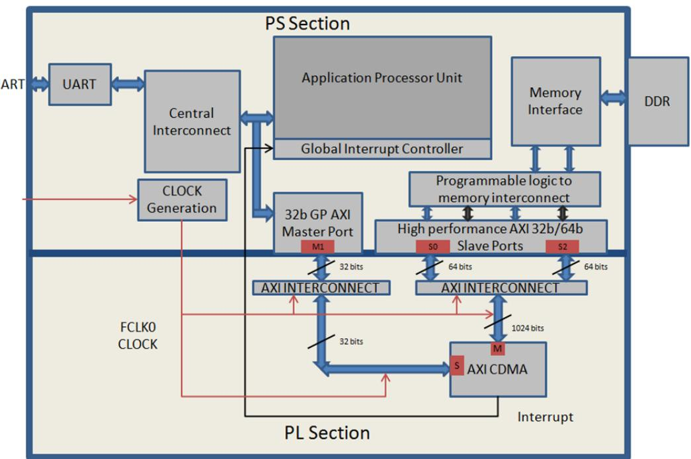

*Figure 6-1:* **Block Diagram**

<span id="page-53-0"/>This system covers the following connections:

- 1. AXI CDMA Slave Port is connected to the PS General Purpose master port 1 (M_AXI_GP1). It is used by the PS CPU to configure the AXI CDMA register set for the data transfer and also to check the status.
- 2. AXI CDMA Master Port is connected to the PS High performance Slave Port 0 (S_AXI_HP0). It is used by the AXI CDMA to reads from the DDR system memory. It acts as the source buffer location for the CDMA during data transfer.
- 3. AXI CDMA Master Port is connected to the PS High performance Slave Port 2 (S_AXI_HP2). It is used by the AXI CDMA to write the data to the DDR system memory. It acts as a destination buffer location for the CDMA during the Data transfer.
- 4. AXI CDMA interrupt is connected from fabric to the PS section interrupt controller. After Data Transfer or Error during Data transaction, the AXI CDMA interrupt gets triggered.

In this system, you will configure HP slave port 0 to access DDR memory location range from 0x20000000 to 0x2FFFFFFF. This DDR system memory location acts as the source buffer location to CDMA for reading the data.

You will also configure HP slave Port 2 to access DDR memory Location range from 0x30000000 to 0x3FFFFFFF. This DDR system memory location acts as a destination location to CDMA for writing the data.

You will also configure AXI CDMA IP data width of the Data Transfer channel to 1024 bits with Maximum Burst length set to 256. With this setting, CDMA Maximum transfer size is set to 1024x256 bits in one transaction.

You will write the application software code for the above system. When you execute the code, it first initializes the source buffer memory with the specified data pattern and also clears the destination buffer memory by writing all zeros in it. Than it starts configuring the CDMA register for the DMA transfer. It writes the source buffer location, destination buffer location, and number of bytes to be transferred to the CDMA registers and waits for the CDMA interrupt. When the interrupt occurs, it checks the status of the DMA transfers.

If Data transfer status is successful, it compares the source buffer data with the destination buffer data and displays the comparison result on the serial terminal.

If Data transfer status is an error, it displays the error status on the serial terminal and stops execution.

### <span id="page-54-0"/>**6.1.1 Take a Test Drive! Integrating AXI CDMA with the PS HP Slave Port**

- 1. Start with one of the following:
	- ° Use the system you created in [Take a Test Drive! Checking the Functionality of the IPs](#page-24-1)  [Instantiated in the Fabric, page](#page-24-1) [25](#page-24-1).
	- ° Create a new project as described in [Take a Test Drive! Creating a New Embedded Project](#page-10-5)  [With a Zynq Processing System, page](#page-10-5) [11](#page-10-5).
- 2. In the PlanAhead tool Sources pane, double-click **system_i-system(system.xmp)** to invoke XPS.
- 3. In the XPS System Assembly View, click the **Bus Interfaces** tab.
- 4. From the IP catalog, expand **DMA and Timer** and double-click **AXI Central DMA** to add it.

A message appears asking if you want to add the axi_cdma 3.04.a IP instance to your design.

- 5. Click **Yes**.
The configuration window for CDMA opens.

- 6. In CDMA Configuration window, click the User tab. Change the data width of the data transfer channel option to **1024** and maximum Burst Length to use option to **256**.
- 7. Click **OK**.

A message window opens with the message "axi_cdma IP with version number 3.03.a is instantiated with name axi_cdma_0." XPS asks you to determine to which processor to connect.

#### 8. Select **User will make necessary connections and settings**.

*Note:* This setting requires that you manually make the AXI CDMA connection.

- 9. Click **OK**.
An unconnected axi_cdma_0 IP gets instantiated in the design. To cross check, click the **Bus Interfaces** tab in the XPS System Assembly View. You can find the unconnected axi_cdma_0 in the list.

- 10. In the IP Catalog, expand **Bus and Bridge** and double-click **AXI Interconnect IP** to add it.
A dialog box opens to verify that you want to add the axi_interconnect 1.06.a IP instance to your design.

- 11. Click **Yes**.
The configuration window for AXI interconnects opens. Type **axi_interconnect_gp1** as the component instance name.

- 12. Click **OK**.
XPS adds the unconnected AXI interconnect IP, axi_interconnect_gp1, to the system. To cross verify, click the **Bus Interface** tab in the XPS System Assembly view.

*Note:* Later in this chapter, you will connect the AXI CDMA slave port and PS GP master port 1 with this interconnect. This interface is used to configure CDMA registers set from the PS CPU.

- 13. Repeat the previous three steps to add one more AXI interconnect IP with the Instance name axi_interconnect_hp.
*Note:* Later in this chapter, you will connect the AXI CDMA Master Port and PS HP Slave port 0 and Port 2 with this Interconnect. It is used for data copying from source to destination DDR memory locations.

- 14. Click the **Zynq** tab in the XPS System Assembly View to open the Zynq Processing System block diagram.
- 15. Click the green **32b GP AXI Master Port** block to open the processing_system7_0 Configuration wizard.
- 16. In the User tab, expand **General Purpose Master AXI Interface** and select the **Enable M_AXI_GP1 Interface** option.
- 17. Click **OK** to enable the GP Master port 1 interface between the PS and fabric.
- 18. In the Zynq Processing System block diagram, click on the green **high performance AXI 32/64b Slave Ports** block to open the processing_system7_0 Configuration wizard.
- 19. In the User tab, expand **High Performance Slave AXI Interface** and make the following settings:
	- a. Select the **Enable S_AXI_HP0 interface** check box to enable HP Slave port 0 interface between PS section and fabric.
	- b. Change the HP0 base address to 0x20000000 and HP0 High Address to 0x2FFFFFFF.

This sets the HP Slave Port 0 to access DDR system memory from location 0x20000000 to 0x2FFFFFFF. It acts as the source buffer location from which the CDMA reads data.

- c. Select the **Enable S_AXI_HP2 interface** check box to enable HP Slave port 2 interface between PS section and fabric.
- d. Change the HP2 base address to 0x30000000 and HP2 High Address to 0x3FFFFFFF,
This sets the HP Slave Port 2 to access DDR system memory from location 0x30000000 to 0x3FFFFFFF. It acts as the destination location to which the CDMA writes data.

*Figure 6-2:* **XPS Core Config Window Settings**

*Note:* By default, the HP slave port is configured to 64 bit interface.

- e. Click **OK**.
- 20. Click the **Bus Interfaces** tab and make the following connections:
	- a. Under processing_system7_0, click **M_AXI_GP1** and select **No Connection** in the Bus Name column. Using the drop-down list that appears, connect M_AXI_GP1 to axi_interconnect_gp1.
	- b. Collapse processing_system7_0.
	- c. Under axi_cdma_0, click **S_AXI_LITE**, and in the Bus Name column, click **No Connection** to open the Connection dialog box.

- d. In the Select AXI Interconnect list, click axi_interconnect_gp1.
Notice that processing_system7_0.M_AXI_GP1 appears in the Select Master(s) list. Click the processing_system7_0.M_AXI_GP1 check box to select it.

*Figure 6-3:* **AXI Connection Dialog Box**

- e. Click **OK**.
XPS connects the axi_cdma_0 Slave port interface with the processing_system7_0 GP master Port 1 interface via axi_interconnect_gp1.

- f. Select **M_AXI** in axi_cdma_0 and in the Bus Name column, and select **No Connection**. Using the drop-down list that appears, connect M_AXI to axi_interconnect_hp.
- g. Expand processing_system7_0 and select **S_AXI_HP0**. In the Bus Name column, click **No Connection** to open the Connection dialog box.
- h. In the **Select AXI Interconnect** list, click axi_interconnect_hp.

Notice that axi_cdma_0.M_AXI appears in the Select Master(s) list. Click the axi_cdma_0.M_AXI check box to select it.

- i. Click **OK**.
XPS connects axi_cdma_0 Master port to processing_system7_0 HP Slave Port 0 via axi_interconnect_hp.

- j. Repeat the previous 3 steps to connect axi_cdma_0 master port with processing_system7_0 HP slave port 2 via axi_interconnect_hp.

*Figure 6-4:* **Ports Tab**

- 21. Click the Ports tab, which lists the IPs and their ports. Expand axi_interconnect_gp1, axi_interconnect_hp, and axi_cdma_0.
- 22. Review the following IP connections. If any of these aren't connected, connect them now.

#### *Table 6-1:* **IP Connections**

| IP                   | Port                                 | Connection                              |
|----------------------|--------------------------------------|-----------------------------------------|
| axi_interconnect_gp1 | INTERCONNECT_ACLK                    | processing_system7_0 : FCLK_CLK0        |
|                      | INTERCONNECT_ARESETN                 | processing_system7_0::FCLK_RESET0<br>_N |
| axi_interconnect_hp  | INTERCONNECT_ACLK                    | processing_system7_0 : FCLK_CLK0        |
|                      | INTERCONNECT_ARESETN                 | processing_system7_0::FCLK_RESET0<br>_N |
| axi_cdma_0           | (BUS_IF) S_AXI_LITE::s_axi_lite_aclk | processing_system7_0 : FCLK_CLK0        |
|                      | (BUS_IF) M_AXI:: m_axi_aclk          | processing_system7_0 : FCLK_CLK0        |

Your Ports tab should look similar to [Figure](#page-59-0) [6-5.](#page-59-0)


- <span id="page-59-0"/>23. Collapse all IPs and expand processing_system7_0. If the following port connection is not made, do it now. It should look like [Figure](#page-60-0) [6-6.](#page-60-0)
*Table 6-2:* **Processing_system7_0 Port Connections**

| IP                   | Port                               | Connection                           |
|----------------------|------------------------------------|--------------------------------------|
| Processing_system7_0 | (BUS_IF) M_AXI_GP1::M_AXI_GP1_ACLK | processing_system7_0 :<br>FCLK_CLK0  |
|                      | (BUS_IF) S_AXI_HP0::S_AXI_HP0_ACLK | processing_system7_0 ::<br>FCLK_CLK0 |
|                      | (BUS_IF) S_AXI_HP2::S_AXI_HP2_ACLK | processing_system7_0 ::<br>FCLK_CLK0 |

*Figure 6-6:* **Processing_system7_0 Connections**

- <span id="page-60-0"/>24. Connect the CDMA interrupt on the fabric side to the PS side interrupt controller by doing the following:
	- a. In the Connected Port column of Processing_System7_0, click **L to H: No Connection**.

*Note:* If you are modifying the system you created in chapter 3, select **L to H : axi_timer_0_interrupt** in the Connected Port tab.

The Interrupt Connection dialog box opens.

- b. In the Unconnected Interrupts list, select **axi_cdma_0** and click the right arrow button to move it to the Connected Interrupts list.
- c. Click **OK**.

XPS connects the CDMA interrupt on the Fabric side to the PS section interrupt controller.

- 25. Click the **Addresses** tab and click the **Generate Addresses** button to generate addresses for unmapped devices.
Notice that axi_cdma_0 is assigned an address range inside the processing_system7_0 address range.

- 26. In the address map for processing_system7_0, change the axi_cdma_0 base address to 0x80200000 and High address to 0x8020FFFF.
This ensures that the address range for axi_cdma_0 is fixed at 0x80200000 to 0x8020FFFF, which is within the processing_system7_0 address space.

- 27. Run Design Rule Check. Ensure there are no errors in the console.
- 28. Close XPS. The PlanAhead™ design tool window becomes active again.
- 29. In Design Sources, click on your embedded source and then right-click it and select **Create Top HDL.** The PlanAhead tool generates the system_stub.v file.
- 30. Save all modified files.
- 31. In the Program and Debug list in the Flow Navigator, click **Generate Bitstream**. Ignore any warnings that PlanAhead generates.
- 32. After the Bitstream generation completes, export the hardware and Launch SDK as described in [Chapter](#page-10-0) [2](#page-10-0). For this design, since there is a bitstream generated for the PL Fabric, this will also be exported to SDK.

### <span id="page-61-0"/>**6.2 Standalone Application Software for the Design**

The CDMA-based system that you designed in this chapter requires application software to execute on the board. This section describes the details about the CDMA based Standalone application software.

The main() function in the application software is the entry point for the execution. It initializes the source memory buffer with the specified test pattern and clears the destination memory buffer by writing all zeroes.

The application software then configures the CDMA registers sets by providing information such as source buffer and destination buffer starting locations. To initiate DMA transfer, it writes the number of bytes to be transferred in the CDMA register and waits for the CDMA interrupt to happen. After the interrupt, it checks the status of the DMA transfer and compares the source buffer with the destination buffer. Finally, it prints the comparison result in the serial terminal and stops running.

### <span id="page-62-0"/>**6.2.1 Application Software Flow**

The application software does the following:

- 1. Initializes the source buffer with the specified test pattern. The source buffer location ranges from 0x20000000 to 0x2FFFFFFF.
Clears the destination buffer by writing all zeros. The destination buffer location ranges from 0x30000000 to 0x3FFFFFFF.

- 2. Initializes AXI CDMA IP and do the following:
	- a. Associates a CDMA callback function with AXI CDMA ISR and Enable the Interrupt.

This Callback function executes during the CDMA interrupt. It sets the interrupt Done and/or Error flags depending on the DMA transfer status.

Application software waits for the Callback function to populate these flags and executes the software according to the status flag.

- b. Configures the CDMA in Simple mode.
- c. Checks the Status register of the CDMA IP to verify the CDMA idle status.
- d. Sets the source buffer starting location, 0x20000000, to the CDMA register.
- e. Sets the destination buffer starting location, 0x30000000, to the CDMA register.
- f. Sets the number of bytes to transfer to the CDMA register. The application software starts the DMA transfer.
- 3. After the CDMA interrupt is triggered, checks the DMA transfer status.

If the transfer status is successful, the application software compares the source buffer location with the destination buffer location and display the comparison result on the serial terminal, then exits from the execution.

If the transfer status displays an error, the software prints the error status in the serial terminal and stops running.

### <span id="page-62-1"/>**6.2.2 Take a Test Drive! Running the Standalone CDMA Application Using SDK**

- 1. Open SDK.
- 2. Check that the Target Communication Frame (TCF) (hw_server.exe) agent is running on your Windows machine. If it is not running, in SDK select **Xilinx Tool > Launch Hardware Server**.
- 3. In SDK, select **File > New > Application Project**.

The New Project wizard opens.

| Wizard Screen<br>System Property |                          | Setting or Command to Use                                  |  |
|----------------------------------|--------------------------|------------------------------------------------------------|--|
|                                  | Project Name             | cdma_app                                                   |  |
|                                  | Use Default Location     | Select this option                                         |  |
|                                  | Hardware Platform        | system_hw_platform                                         |  |
| Application Project              | Processor                | PS7_cortexa9_0                                             |  |
|                                  | OS Platform              | Standalone                                                 |  |
|                                  | Language                 | C                                                          |  |
|                                  | Board Support<br>Package | Select Create New and provide the name of<br>cdma_app_bsp. |  |
| Templates                        | Available Templates      | Empty Application                                          |  |

- 4. Use the information in the table below to make your selections in the wizard screens.
#### 5. Click **Finish**.

The New Project Wizard closes and SDK creates the cdma_app application project and the cdma_app_bsp BSP project under the project explorer. SDK also automatically compiles the project and generates the BSP.

*Note:* If SDK returns the error "arm-xilinx-eabi-gcc: command not found," refer to [Answer](http://www.xilinx.com/support/answers/53306.htm)  [Record 53306](http://www.xilinx.com/support/answers/53306.htm).

- 6. In the Project Explorer tab, expand the cdma_app project, right-click the src directory, and select **Import** to open the Import dialog box.
- 7. Expand **General** in the Import dialog box and select **File System**.
- 8. Click **Next**.
- 9. Add the cdma_app.c file and click **Finish**.

SDK automatically builds the application and displays the status in the console window.

*Note:* The Application software file name for the system is cdma_app.c. It is available in ug873-design-files.zip, which accompanies this guide. A link to this ZIP file is located in [Appendix](#page-88-4) [A, Additional Resources.](#page-88-4)

- 10. Open the serial communication utility with baud rate set to 115200.
- 11. Make sure that the hardware board is set up and turned on.

*Note:* Refer to section [2.1.3](#page-18-2) [Take a Test Drive! Running the "Hello World" Application](#page-18-2) for information about setting up the board.

- 12. In SDK, select **Xilinx Tools > Program FPGA** to open the Program FPGA dialog box. The dialog box shows the bitstream path.
- 13. Click **Program** to download the bitstream and program the PL Fabric.
- 14. Run the project similar to the steps in [2.1.3](#page-18-2) [Take a Test Drive! Running the "Hello World"](#page-18-2)  [Application](#page-18-2).
- 15. Check the Status of the CDMA transfer in the Serial terminal. If the transfer is successful, the message "DMA Transfer is Successful" displays. Otherwise, the serial terminal displays an error message.

### <span id="page-64-0"/>**6.3 Linux OS based Application Software for the CDMA system**

In this section, you will create a Linux-based application software for CDMA using the mmap() system call provided by Linux and run it on the hardware to check the functionality of the CDMA IP.

The mmap() system call is used to map specified kernel memory area to the User layer, so that you can read or write on it depending on the attribute provided during the memory mapping. Detail about mmap() system call is beyond the scope of this guide.


**CAUTION!** *Use of the mmap() call is not the recommended way to write a Linux application. It might crash the kernel if it accesses, by mistake, some restricted area or shared resources of the Kernel.*

The main() function in the application software is the entry point for the execution. It initializes the source array with the specified test pattern and clears the destination array. Then it copies the source array contents to the DDR memory starting at location 0x20000000 and makes the DMA register setting to initiate DMA transfer to the destination. After the DMA transfer, the application reads the status of the transfer and displays the result on the serial terminal.

### <span id="page-64-1"/>**6.3.1 Application Software Steps**

Application Software comprises the following steps:

- 1. Initialize the whole source array, which is in the User layer with value 0xA5A5A5A5.
Clear the whole destination buffer, which is in the User layer, by writing all zeros.

- 2. Map the kernel memory location starting from 0x20000000 to the User layer with writing permission using mmap() system calls.
By doing so, you can write to the specified kernel memory.

- 3. Copy the source array contents to the mapped kernel memory.
- 4. Un-map the kernel memory from the User layer.
- 5. Map the AXI CDMA register memory location to the User layer with reading and writing permission using the mmap() system call. Make the following CDMA register settings from the User layer:
	- a. Reset DMA to stop any pervious communication.
	- b. Enable interrupt to get the status of the DMA transfer.
	- c. Set the CDMA in simple mode.
	- d. Verify that the CDMA is idle.
	- e. Set the source buffer starting location, 0x20000000, to the CDMA register.
	- f. Set the destination buffer starting location, 0x30000000, to the CDMA register.
	- g. Set the number of bytes to be transferred in the CDMA register. Writing to this register starts the DMA transfer.
- 6. Continuously read the DMA transfer status until the transfer finishes.
- 7. After CDMA transfer finishes, un-map the CDMA register memory for editing from the User layer using the mumap() system call.
- 8. Map the kernel memory location starting from 0x30000000 to the User layer with reading and writing attributes.
- 9. Copy the kernel memory contents starting from 0x30000000 to the User layer destination array.
- 10. Un-map the kernel memory from the User layer.
- 11. Compare the source array with the destination array.
- 12. Display the comparison result in the serial terminal. If the comparison is successful, the message "DATA Transfer is Successful" displays. Otherwise, the serial terminal displays an error message.

### <span id="page-65-0"/>**6.4 Take a Test Drive! Running Linux CDMA Application using SDK**

Running a Linux OS based application comprises the following steps:

- 1. [Booting Linux on the Target Board](#page-65-1)
- 2. [Building an Application and Running it on the Target Board Using SDK](#page-65-2)

#### <span id="page-65-1"/>**6.4.1 Booting Linux on the Target Board**

Boot Linux on the Zynq ZC702 target board, as described in [Chapter](#page-38-3) [5, Linux Booting and](#page-38-3)  [Application Debugging Using SDK.](#page-38-3)

After booting completes, the zynq> prompt displays on the serial terminal. Set the IP address of the board as mentioned in step [13](#page-43-0) of [5.2.3](#page-41-2) [Take a Test Drive! Linux Booting Using JTAG Mode](#page-41-2).

#### <span id="page-65-2"/>**6.4.2 Building an Application and Running it on the Target Board Using SDK**

- 1. Set up your Windows machine as host, as described in step [2](#page-44-1) of [5.2.4](#page-44-2) [Take a Test Drive!](#page-44-2)  [Debugging the Linux Application Using SDK Remote Debugging.](#page-44-2)
- 2. In SDK, select **Xilinx Tools > Program FPGA** to open the Program FPGA dialog box, which shows the bitstream path.
- 3. Click **Program** to download the bitstream and program the PL fabric.

*Note:* Zync PS is in suspended position now, with no response on Zync Linux terminal. Refer to [Answer Record 55150](http://xkb/pages/55150.aspx) to resume Zync.

- 4. Select **File > New > Application Project**.
- **Wizard Screen System Property Setting or Command to Use** Application Project Project Name Linux_cdma_app Hardware Platform system_hw_platform Processor PS7_cortexa9_0 OS Platform Linux Language C Templates Available Templates Linux Empty Application
- 5. Use the information in the table below to make your selections in the wizard screens.

#### 6. Click **Finish**.

The New Project Wizard closes and SDK creates the Linux_blinkled_app project under the project explorer.

- 7. In the Project Explorer tab, expand linux_cdma_app project, right-click the src directory, and select **Import** to open the Import dialog box.
- 8. Expand **General** in the Import dialog box and select **File System**.
- 9. Click **Next**.
- 10. Add the linux_cdma_app.c file and click **Finish**.

SDK automatically builds the application and generates the linux_cdma_app.elf file. Check the console window for the status.

*Note:* The Application software file name for the system is linux_cdma_app.c. This file is available in ug873-design-files.zip file, which accompanies this guide. A link to this ZIP file is located in [Appendix](#page-88-4) [A, Additional Resources](#page-88-4).

- 11. Right-click linux_cdma_app and select **Run As > Run Configurations** to open the Run Configuration wizard.
- 12. In the Run Configuration wizard, right-click **Remote ARM Linux Application** and click **New**.
- 13. In the **Connection** drop-down list, click **New** to open the New Connection wizard.
- 14. Click the **SSH Only** tab and click **Next**.
- 15. In the Host Name tab, type the target board IP.

*Note:* To determine the target IP, type **ipconfig eth0** at the Zynq> prompt in the serial terminal. The terminal displays the target IP that is assigned to the board.

- 16. Set the connection name and description in the respective tabs.
- 17. Click **Finish** to create the connection.
- 18. In the Run Configuration wizard, under **Remote Absolute File Path for C/C++ Application**, click the **Browse** button. The Select Remote C/C++ Application File wizard opens.
- 19. Do the Following:
	- a. Expand the root directory. The Enter Password wizard opens.
	- b. Provide the User ID and Password (**root**/**root**); select the **Save ID** and **Save Password** options.
	- c. Click **OK**.

The window displays the root directory contents, because you already established the connection between the Windows host machine and the target board.

- d. Right-click on the "/" in the path name and create a new folder; name it **Apps**.
- e. Provide an application absolute path, such as /Apps/linux_cdma_app.elf.
- 20. Click **Apply**.
- 21. Click **Run** to begin execution of the application.
- 22. Check the status of the CDMA transfer on the Serial terminal. If the transfer is successful, the message "DMA Transfer is Successful" displays. Otherwise, the serial terminal displays an error message.
- 23. After you finish debugging the Linux application, close SDK.


## *Chapter 7*

# <span id="page-68-3"/><span id="page-68-0"/>Software Profiling using SDK

In this chapter, you will enable profiling features for the Standalone BSP and the Application related to AXI CDMA, which you created in [Chapter](#page-52-2) [6](#page-52-2).

### <span id="page-68-1"/>**7.1 Profiling an Application using SDK**

Profiling is a method by which the software execution time of each routine is determined. You can use this information to determine critical pieces of code and optimal code placement in a design. Routines that are frequently called are best suited for placement in fast memories, such as cache memory. You can also use profiling information to determine whether a piece of code can be placed in hardware, thereby improving overall performance.

### <span id="page-68-2"/>**7.1.1 Take a Test Drive! Application Software Profiling using SDK**

- 1. Launch Xilinx® SDK and open the same workspace you used in [Chapter](#page-10-4) [2](#page-10-4) and [Chapter](#page-22-4) [3](#page-22-4).
- 2. If the serial terminal is not open, connect the serial communication utility with the baud rate set to 115200.
- 3. In SDK, select **File > New > Application Project**.

The New Project wizard opens.

- 4. Use the information in the table below to make your selections in the wizard screens.

| Wizard Screen       | System Property          | Setting or Command to Use                                          |  |
|---------------------|--------------------------|--------------------------------------------------------------------|--|
| Application Project | Project Name             | cdma_app_profile                                                   |  |
|                     | Use Default Location     | Select this option                                                 |  |
|                     | Hardware Platform        | system_hw_platform                                                 |  |
|                     | Processor                | PS7_cortexa9_0                                                     |  |
|                     | OS Platform              | Standalone                                                         |  |
|                     | Language                 | C                                                                  |  |
|                     | Board Support<br>Package | Select Create New and provide the name of<br>cdma_app_profile_bsp. |  |
| Templates           | Available Templates      | Empty Application                                                  |  |

- 5. Click **Finish**.
The New Project Wizard closes and SDK creates the cdma_app application project and the cdma_app_bsp BSP project under the project explorer. SDK also automatically generates the BSP.

- 6. In the Project Explorer tab, expand cdma_app_profile project, right-click the src directory, and select **Import** to open the Import dialog box.
- 7. Expand **General** in the Import dialog box and select **File System**.
- 8. Click **Next**.

X-Ref Target - Figure 7-1

- 9. Add cdma_app.c file and click **Finish**.
SDK automatically builds the application and displays the status in the console window.

*Note:* The Application software file name for the system is cdma_app.c. This file is available in the ug873-design-files.zip file, which accompanies this guide. A link to this ZIP file is located in [Appendix](#page-88-4) [A, Additional Resources](#page-88-4).

- 10. In the Project Explorer tab, right-click cdma_app_profile_bsp and select **Board Support Package Settings** top open the Board Support Package Settings dialog box.
- 11. In the Board Support Package Settings dialog box, select **standalone** in the left navigation pane. Select the **enable_sw_intrusive_profiling** option in the list and set its value to **true**.

*Figure 7-1:* **BSP Settings standalone Configuration**

This enables software intrusive profiling. It is considered intrusive because extra code is added to your code to make it work.

- 12. In the left navigation pane of the Board Support Package Settings dialog box, under **drivers**, select **cpu_cortexa9**. In the extra_compiler_flags setting, type the value **-pg** as shown below.

*Figure 7-2:* **BSP Settings cup_cortexa9 Settings**

- 13. Click **OK**.
SDK starts building BSP again with the new profiling options.

- 14. In the Project Explorer tab, right-click **cdma_app_profile** and select the **C/C++ Build** setting to open the Properties dialog box.
- 15. In the Properties dialog box, click the **Tool Settings** tab. Expand **ARM gcc compiler**, select **Profiling**, and select the **Enable Profiling (-pg)** option.
- 16. Select **Optimization** in the properties list and set the optimization level to **None (-O0)**.
- 17. Select **Debugging** in the properties list and set the debug level to **Default (-g)**.
- 18. Click **OK**.

SDK rebuilds the application again and generates the cdma_app_profile.elf file. Check the console window for the status.

### <span id="page-70-0"/>**7.1.2 Take a Test Drive! Running the Application with the Profiling Option**

- 1. Make sure that the hardware board is set up and turned on, as described in [2.1.3](#page-18-2) [Take a Test](#page-18-2)  [Drive! Running the "Hello World" Application.](#page-18-2)
- 2. In SDK, select **Xilinx Tools > Program FPGA** to open the Program FPGA dialog box, which shows the bitstream path.
- 3. Click **Program** to download the bitstream and program the PL Fabric.
- 4. In the Project Explorer tab, right-click the **cdma_app_profile** project and select **Run As > Run Configurations** to open the Run Configuration dialog box.
- 5. In the Run Configuration dialog box, double-click **Xilinx C/C++ ELF** to create a new configuration.
- 6. Select the **Profile Options** tab and set the following parameters, as shown in [Figure](#page-71-0) [7-3:](#page-71-0)
	- a. Click to select the **Enable Profiling** check box.
	- b. Set the Sampling Frequency (Hz) to **10000**.

The sampling frequency is the interrupt interval that the profiling routine uses to periodically check which function is currently being executed. The routine performs the sampling by examining the program counter at each interrupt.

- c. Set the Histogram Bin Size (Words) to **4**.
The histogram bin size is the resolution for examining the program counter location used to determine the function that is currently being executed.

- d. Set the scratch memory address to **0x00300000**.
The scratch memory address is the location in DDR3 memory that the BSP profiling services use for data collection. The application program should never touch this space.

*Figure 7-3:* **Enabling Profiling**

- <span id="page-71-0"/>7. Click **Run** to create the configuration and run it.
- 8. Click **OK** on the Reset Status dialog box.

When profiling completes, a dialog box opens to indicate the location of the results file.

- 9. Click **OK**.
X-Ref Target - Figure 7-3

X-Ref Target - Figure 7-5

- 10. In the Project Explorer tab, expand the **Debug** folder under the cdma_app_profile project and double-click **gmon.out** to open the Gmon File Viewer dialog box.

*Figure 7-4:* **Gmon File Viewer Dialog Box**

- 11. Click **OK** to open the profiling results (gmon.out) in a gprof tab in the right window area. It will look similar to [Figure](#page-72-0) [7-5.](#page-72-0)

<span id="page-72-0"/>*Figure 7-5:* **Viewing the gmon.out File**


# <span id="page-73-2"/><span id="page-73-0"/>Accelerator Coherency (ACP) Port

The processing system ACP port is an AXI-compliant 64-bit slave port interface on the Snoop Control Unit (SCU) that provides an asynchronous cache-coherent access point directly from the processor logic (PL) to the processing system (PS) Cortex-A9 MP-Core processor subsystem. Transactions on the ACP port can be marked as coherent or non-coherent. The AXI master on the fabric side indicates coherent read transactions by ARUSERS[0] and ARCACHES[1], and write transactions by AWUSERS[0] and AWCACHES[1] AXI bus related signals. Device or strongly ordered transactions are always treated as non-coherent.

*Note:* Device or strongly ordered transactions are types of transfers generated by the AXI master interface. They refer to non-cacheable and non-bufferable transactions. They always generate a fixed size and number of the transaction.

### <span id="page-73-1"/>**8.1 Introduction**

Non-coherent transactions pass through the SCU and are presented unchanged on the AXI master interface. Coherent AXI transactions on the ACP slave are changed into more or fewer transactions on the AXI master interface with some of their attributes changed appropriately.

When a coherent write request is received on the ACP from the external master, the SCU checks the L1 data caches of the cores for the address. If present, the coherency protocol cleans and invalidates the appropriate lines in the Cache and merges the cleaned data with the write request.

Read requests from the external master to a coherent region of memory interact with the SCU to test whether the required data is already stored within the processor L1 caches. If the data is present in L1 cache, the SCU returns the data directly to the requesting component. If the data is not present in the L1 cache, the SCU checks the L2 cache before sending the request to the main memory.

[Figure](#page-74-3) [8-1](#page-74-3) shows the possible connection between an AXI-4 compliant master and an ACP 64 bit port with the help of the AXI interconnect.

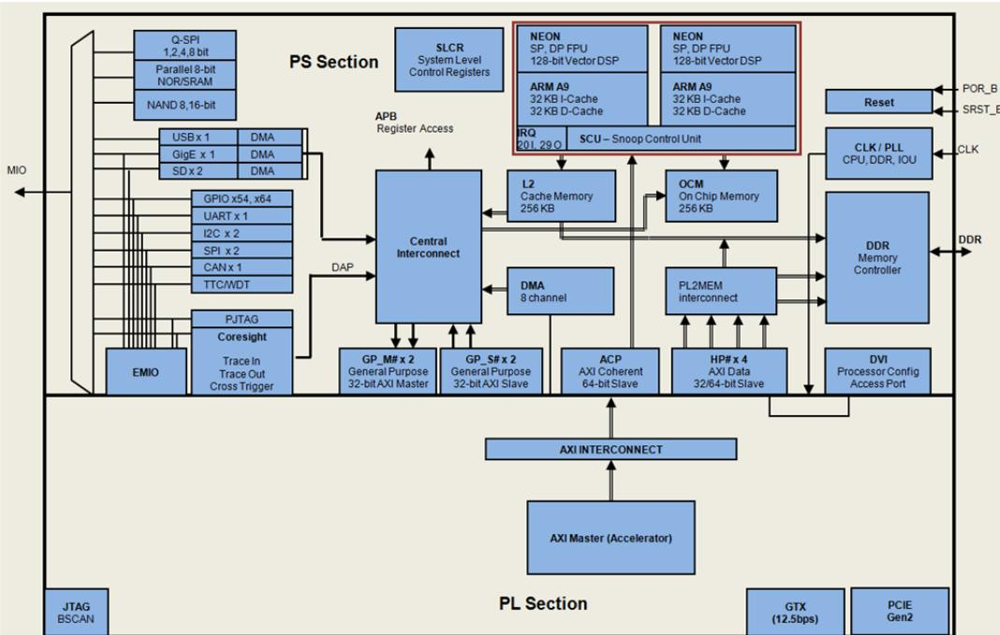

<span id="page-74-3"/>*Figure 8-1:* **Possible Connection Between AXI-4 Compliant Master and ACP 64-bit Port**

### <span id="page-74-0"/>**8.2 ACP Requests**

The read and write requests performed on the ACP behave differently with coherent requests than with non-coherent requests.

### <span id="page-74-1"/>**8.2.1 ACP Coherent Read Requests**

An ACP read request is coherent when both ARUSER[0] = 1 and ARCACHE[1] = 1 are alongside ARVALID. In this case, the SCU enforces coherency. When the data is present in the caches of one of the Cortex-A9 processors, the PS core reads the data directly from the relevant processor and returned to the ACP port. When the data is not present in the cache of either of the Cortex-A9 processors, the read request is issued to either L2-cache or the main memory on one of the Cortex-A9 processors AXI master ports, along with all its AXI parameters, with the exception of the locked attribute.

### <span id="page-74-2"/>**8.2.2 ACP Non-Coherent Read Requests**

An ACP read request is non-coherent when either ARUSER[0] = 0 or ARCACHE[1] =0 is alongside ARVALID. In this case, the SCU does not enforce coherency, and the read request is directly forwarded to one of the available SCU AXI master ports to the L2 cache controller or OCM.

### <span id="page-75-0"/>**8.2.3 ACP Coherent Write Requests**

An ACP write request is coherent when both AWUSER[0] = 1 and AWCACHE[1] =1 are alongside AWVALID. In this case, the SCU enforces coherency. When the data is present in the L1-Cache of one of the Cortex-A9 processors, the PS section logic first cleans and invalidates the data from the relevant CPU. When the data is not present in any of the Cortex-A9 processors, or once it has been cleaned and invalidated, the write request is issued to either L2-Cache or the main memory on one of the Cortex-A9 processor AXI master ports. The write request is also issued to all corresponding AXI parameters, with the exception of the locked attribute.

*Note:* The transaction may optionally allocate into the L2 cache if the write parameters are set accordingly.

### <span id="page-75-1"/>**8.2.4 ACP non-coherent write requests**

An ACP write request is non-coherent when either AWUSER[0] = 1 or AWCACHE[1] = 0 is alongside AWVALID. In this case, the SCU does not enforce coherency, and the write request is forwarded directly to one of the available SCU AXI master ports.

### <span id="page-75-2"/>**8.3 ACP Limitations**

The accelerator coherency port (ACP) has the following limitations:

- Exclusive access is not allowed for coherent memory access.
- Locked access is not allowed for coherent memory access.
- Write transactions with length = 3, size = 3, and write strobe ‡ 11111111 can cause the cache line in the CPU to become corrupted.
- Continuous accesses to the OCM over the ACP can starve access from other AXI masters.

To allow access from other masters, the ACP bandwidth to OCM should be moderated to less than the peak OCM bandwidth. This can be accomplished by regulating burst sizes to fewer than eight 64-bit words.

*Note:* The PS processor cores can be used to flag the third limitation (cache lines being corrupted).

If enabled, the Xilinx® ACP adapter watches for transactions that could potentially corrupt the cache and generates an error response to the master that requested the write request. The PS section allows the write transaction from master to proceed to the ACP interface, so the possibility of cache corruption is NOT eliminated. The PS section notifies the master of the possible problem in order to take the appropriate action. The ACP adapter can also generate an interrupt signal to the CPUs, which the software can use to detect such a situation.

Refer to following for more information regarding the ACP port. Links to these documents are available in [Appendix](#page-88-4) [A, Additional Resources](#page-88-4).

- *Zynq™-7000 AP SoC Technical Reference Manual* (UG585)
- *The Effect and Technique of System Coherence in ARM Multicore Technology* by John Goodacre, Senior Program Manager, ARM Processor Division
- *ARM Cortex-A9 MPCore Technical Reference Manual*, section 2.4, Accelerator Coherency Port


## *Chapter 9*

# <span id="page-76-1"/><span id="page-76-0"/>Creating Your own Intellectual Property and Device Driver for Linux OS

In this chapter, you will create an Intellectual Property (IP) using the Create and Import Peripheral (CIP) wizard. You will also design a system using created IP for the Xilinx® Zynq™-7000 AP SoC device.

For the IP, you will also develop a Linux-based device driver as a module that can be dynamically loaded onto the running kernel.

You will also develop Linux-based application software for the system to execute on the Zynq-7000 ZC702 board.

### <span id="page-76-2"/>**9.1 Requirements**

In this chapter, the target platform points to a ZC702 board. The host platform points a Windows machine that is running the ISE® Design Suite tools.

The requirements for Linux-based device driver development and kernel compilation are as follows:

- Linux-based Workstation. The workstation is used to build the kernel and the Device driver for the IP.
- CodeSourcery toolchain. An Eclipse-based Integrated Development Environment (IDE) that incorporates the GNU Toolchain for cross development for target architectures. For Tool related information and installation, refer to <http://wiki.xilinx.com/zynq-tools>.
- Kernel Source Code and build environment. Refer to [http://wiki.xilinx.com/zynq-linux,](http://wiki.xilinx.com/zynq-linux) which provides details about the Linux kernel specific to Zynq FPGAs. You can download the Kernel Source files and also get the information for building a Linux kernel for the Zynq FPGA.

*Note:* You can download kernel source files and u-boot source files with the tag "xilinx-14.4-build" from <http://git.xilinx.com>.

- Device driver software file (blink.c) and the corresponding header file (blink.h). These files are available in the ug873-design-files.zip file, which accompanies this guide.
- Application software (linux_blinkled_apps.c) and corresponding header file (blink.h). These files are available in the ug873-design-files.zip file, which accompanies this guide.
- If you want to skip the Kernel and device driver compilation, use the already complied images that are required for this section. These images are available in the ug873-design-files.zip file.

*Note:* A link to the ug873-design-files.zip file is located in [Appendix](#page-88-4) [A, Additional](#page-88-4)  [Resources](#page-88-4).

**CAUTION!** *You must build Peripheral IP loadable kernel module (LKM) as part of the same kernel build process that generates the base kernel image. If you want to skip kernel or LKM Build process, use the precompiled images for both kernel and LKM module for this section provided in ug873-design-files.zip.*

### <span id="page-77-0"/>**9.2 Creating Peripheral IP**

In this section you will create an AXI4-Lite compliant slave peripheral IP framework using the CIP wizard. You will also add functionality and port assignment to peripheral IP framework.

The Peripheral IP you'll create is AXI4-Lite compliant Slave IP. It includes a 28 bit counter. 4 MSB bits of the counter is driving the 4 output ports of the peripheral IP. The Block Diagram is shown in [Figure](#page-77-1) [9-1.](#page-77-1)

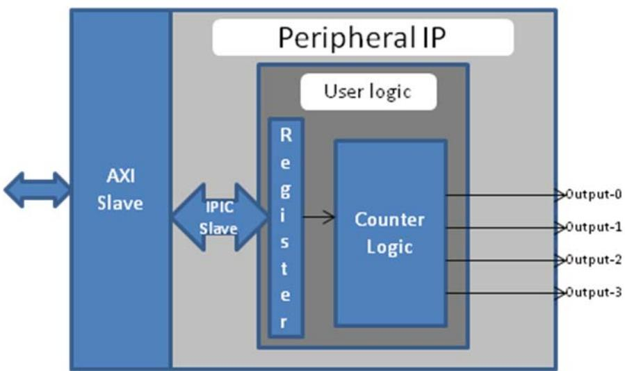

<span id="page-77-1"/>*Figure 9-1:* **Block Diagram for Peripheral IP**

X-Ref Target - Figure 9-1

The block diagram has following configuration register:

| Register Name    | Control Register       |
|------------------|------------------------|
| Relative Address | 0x0000_0000            |
| Width            | 1 bit                  |
| Access Type      | Read/Write             |
| Description      | Start/Stop the Counter |

| Table 9-1: | Block Diagram Configuration Register Details |  |  |  |
|------------|----------------------------------------------|--|--|--|
|            |                                              |  |  |  |

| Field Name  | Bits | Type | Reset Value | Description       |
|-------------|------|------|-------------|-------------------|
| Control Bit | 0    | R/W  | 0x0         | 1 : Start Counter |
|             |      |      |             | 0 : Stop Counter  |

### <span id="page-78-0"/>**9.2.1 Take a Test Drive! Creating Peripheral IP**

In this section, you will create an AXI4-lite compliant slave peripheral IP.

- 1. Create a new project as described in [2.1.1](#page-10-5) [Take a Test Drive! Creating a New Embedded Project](#page-10-5)  [With a Zynq Processing System](#page-10-5).
- 2. To Create Peripheral IP, refer following sections of *UG683: EDK Concept Tools and Techniques Guide*:
	- ° [](http://www.xilinx.com/support/documentation/sw_manuals/xilinx14_4/edk_ctt.pdf#G7.468811)
	- ° [](http://www.xilinx.com/support/documentation/sw_manuals/xilinx14_4/edk_ctt.pdf#G7.478670)

*Note:* A link to *UG683: EDK Concept Tools and Techniques Guide* is provided in [Appendix](#page-88-4) [A,](#page-88-4)  [Additional Resources](#page-88-4).

### <span id="page-79-0"/>**9.3 Integrating Peripheral IP with PS GP Master Port**

You will create a system for the ZC702 board by instantiating the peripheral IP as a slave in the Zynq processing logic (PL) section and connect it with the PS processor through the processing system (PS) general purpose (GP) master port. The block diagram for the system is shown in [Figure](#page-79-2) [9-2](#page-79-2).

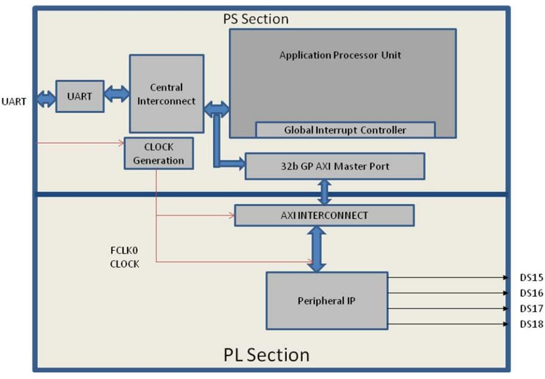

*Figure 9-2:* **Block Diagram**

<span id="page-79-2"/>This system covers the following connections:

- Peripheral IP connected to PS General Purpose master port 0 (M_AXI_GP0). This connection is used by the PS CPU to configure Peripheral IP register configurations.
- Four output ports of Peripheral IP connected to DS15, DS16, DS17, and DS18 on-board LEDs.

In this system, when you run application code, a message appears on the serial terminal and asks you to choose the option to make the LEDs start or stop blinking.

- If you select the start option on the serial terminal, all four LEDs start blinking.
- If select the stop option, all four LEDs stop blinking and retain the previous state.

### <span id="page-79-1"/>**9.3.1 Take a Test Drive! Integrating Peripheral IP with the PS GP Master Port**

- 1. In the PlanAhead™ tool Sources pane, invoke XPS by double-clicking **system_i-system (system.xmp)**.
- 2. In XPS, select **File > Open**.
- 3. Open the MPD file for the blink pcore from the <project dir>\project_1\ project_1.srcs\sources_1\edk\system\pcores\blink_v1_00_a\data directory.

- 4. Under the Comment ##Ports, add the following line:
**PORT LEDs = "", DIR = O, VEC = [3:0]**

- 5. Save the file.
- 6. In XPS, select **Project > Rescan User Repositories** to force XPS to recognize the changes made to the blink pcore.
- 7. From the IP catalog, expand **USER** under Project Local PCores and double-click **BLINK** to add it.

A message appears asking if you want to add the blink 1.00.a IP instance to your design.

- 8. Click **Yes**.
The configuration window for Blink opens.

- 9. In the BLINK Configuration Window, leave the default settings as is and click **OK**.
A message window opens with the message "blink IP with version number 1.00.a is instantiated with name blink_0". It asks you to determine to which processor to connect. Remember that you are designing with a dual core ARM processor. The message also says XPS will make the Bus Interface Connection, assign the address, and make IO ports external.

The default choice of processor is processing_system7_0. Do not change this.

- 10. Click **OK**.
- 11. Click the Ports tab, which lists the IPs and their ports. Expand axi_interconnect_1 and blink_0.
- 12. Review the following IP connections. If any of these aren't already connected, connect them now.

| IP                 | Port                 | Connection                          |
|--------------------|----------------------|-------------------------------------|
| axi_interconnect_1 | INTERCONNECT_ACLK    | processing_system7_0::FCLK_CLK0     |
|                    | INTERCONNECT_ARESETN | processing_system7_0::FCLK_RESET0_N |
| blink_0            | LEDs                 | External Ports::blink_0_LEDs_pin    |

- 13. Collapse all IP and expand processing_system7_0. If the following port connection is not made, do it now.

| IP                   | Port                               | Connection                        |
|----------------------|------------------------------------|-----------------------------------|
| Processing_system7_0 | (BUS_IF) M_AXI_GP0::M_AXI_GPO_ACLK | processing_system7_0 :: FCLK_CLK0 |

- 14. Click the Addresses tab and click the **Generate Addresses** button to generate addresses for unmapped devices.
Notice that blink_0 is assigned an address range inside the processing_system7_0 address range.

*Note:* In case of error, double-check the previous step.

- 15. In the address map for processing_system7_0, do the following:
	- a. Change the blink_0 Base address to **0x7C600000**.
	- b. Change the blink_0 High Address to **0x7C60FFFF**.
- 16. Run Design Rule Check (DRC). Ensure that there are no errors in the console.
- 17. Close XPS.

The PlanAhead™ design tool window becomes active again.

- 18. In Design Sources, click on your embedded source and then right-click it and select **Create Top HDL**. The PlanAhead tool generates the system_stub.v file.
- 19. In the Project Manager list of the Flow Navigator, click **Add Sources**.
- 20. In the dialog box that opens, select **Add or Create Constraints**.
- 21. Click **Next**.
- 22. Click **Create File**.
- 23. In the Create Constraints File dialog box that opens, name the file system and click **OK**.
- 24. Click **Finish**.

X-Ref Target - Figure 9-3

- 25. Expand the Constraints folder in the Sources window. Notice that the blank file system.ucf was added inside constrs_1.
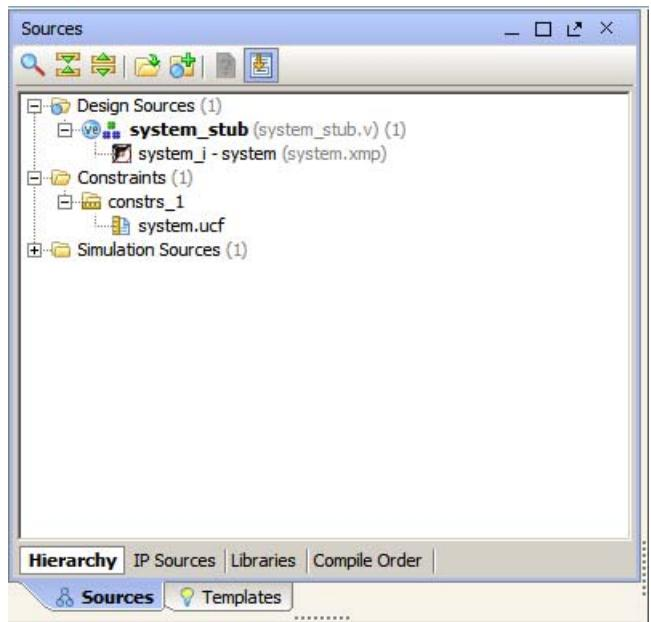

*Figure 9-3:* **Sources Window**

- 26. Type the following text in the UCF file:

```
# Connect to LED DS17
NET blink_0_LEDs_pin<0> IOSTANDARD=LVCMOS18 | LOC=V7;
# Connect to LED DS16
NET blink_0_LEDs_pin<1> IOSTANDARD=LVCMOS18 | LOC=W10;
# Connect to LED DS15
NET blink_0_LEDs_pin<2> IOSTANDARD=LVCMOS18 | LOC=P18;
# Connect to LED DS14
NET blink_0_LEDs_pin<3> IOSTANDARD=LVCMOS18 | LOC=P17;
```
This information connects Blink IP 4 output ports with the four LEDs on the board.

- 27. In the Program and Debug list in the Flow Navigator, click Generate Bitstream.
*Note:* If any critical warnings appear, you can safely ignore them.

- 28. After the Bitstream generation completes, export the hardware and launch SDK as described in [Chapter](#page-10-4) [2, Embedded System Design Using the Zynq Processing System](#page-10-4).
### <span id="page-82-0"/>**9.4 Linux Based Device Driver Development for the Peripheral IP**

Modules in Linux are pieces of code that can be loaded and unloaded into the kernel on demand. A piece of code that you add in this way is called a loadable kernel module (LKM). These modules extend the functionality of the kernel without the need to reboot the system. Without modules, you would have to build monolithic kernels and add new functionality directly into the kernel image. Besides having larger kernels, this has the disadvantage of requiring you to rebuild and reboot the kernel every time you want new functionality.

LKMs typically are one of following things:

- Device drivers. A device driver is designed for a specific piece of hardware. The kernel uses it to communicate with that piece of hardware without having to know any details of how the hardware works.
- Filesystem drivers. A filesystem driver interprets the contents of a file system as files and directories.
- System calls. User space programs use system calls to get services from the kernel.

On Linux, each piece of hardware is represented by a file named as a device file, which provides the means to communicate with the hardware. Most hardware devices are used for output as well as input, so device files provide input/output control (ioctl) to send and receive data to and from hardware. Each device can have its own ioctl commands, which can be of the following types:

- **read ioctl**. These send information from a process to the kernel.
- **write ioctl**. These return information to a process.
- Both read and write ioctl.
- Neither read nor write ioctl.

For more details about LKM, refer to <http://tldp.org/LDP/lkmpg/2.6/html/index.html>.

In this section you are going to develop a Peripheral IP Device driver as a LKM, which is dynamically loadable onto the running Kernel. You must build Peripheral IP LKM as part of the same kernel build process that generates the base kernel image.

*Note:* If you don't want to compile the device driver, you can skip the test drive of this section and jump to [9.5](#page-83-1) [Loading Module into Running Kernel and Application Execution.](#page-83-1) In that section, you'll use a compiled kernel object image for the Peripheral IP, such as blink.ko, which is available in the LKM folder of the ug873-design-files.zip file, which accompanies this guide. A link to this ZIP file is provided in Appendix A, Additional Resources.

For kernel compilation and device driver development, you must use the Linux workstation.

Before you start developing the device driver, the following steps are required:

- 1. Set the CodeSourcery toolchain path in your Linux Workstation.
- 2. Download kernel source code and compile it. For downloading and compilation, refer to the steps mentioned in <http://wiki.xilinx.com/zynq-linux>.

### <span id="page-83-0"/>**9.4.1 Take a Test Drive! Device Driver development**

You will use a Linux workstation for this test drive. The device driver software and the make file are provided in the LKM folder of the ug873-design-files.zip file. A link to this zip file is located in Appendix A, Additional Resources.

- 1. Copy the LKM folder to your Linux workstation.
- 2. In the LKM folder, open the makefile and specify the KER_DIR parameter with the path of the downloaded Linux kernel directory.

*Note:* For more information regarding the module compilation, see file linux/Documentation/kbuild/modules.txt.

- 3. In the LKM folder, type **make clean** on the command prompt to clean any object files that exist.
- 4. At the command prompt, type **make** to build the device driver. Check for the Compilation messages.

After Completion, the device driver generates the blink.ko kernel object. Later, you will load *.ko into the running kernel.

### <span id="page-83-1"/>**9.5 Loading Module into Running Kernel and Application Execution.**

In this section you will boot Linux onto the Zynq Board and load the peripheral IP as a LKM onto it. You will develop the application for the system and execute it onto the hardware.

### <span id="page-84-0"/>**9.5.1 Loading Module into Kernel Memory**

The basic programs for inserting LKMs are **insmod**. insmod makes an init_module system call to load the LKM into kernel memory. The init_module system call invokes the LKM's initialization routine immediately after it loads the LKM. As part of its initialization routine, insmod passes to the address of the subroutine to init_module.

In the peripheral IP device driver, you already set up init_module to call a kernel function that registers the subroutines. It calls the kernel's register_chrdev subroutine, passing the major and minor number of the devices it intends to drive and the address of its own "open" routine among the arguments. The subroutine register_chrdev specifies in base kernel tables that when the kernel wants to open that particular device, it should call the open routine in your LKM.

### <span id="page-84-1"/>**9.5.2 Application Software**

The main() function in the application software is the entry point for the execution. It opens the device file for the peripheral IP and then waits for the user selection on the serial terminal.

If you select the start option on the serial terminal, all four LEDs start blinking. If you select the stop option, all four LEDs stop blinking and retain the previous state.

### <span id="page-84-2"/>**9.5.3 Take a Test Drive! Loading a Module into Kernel and Executing the Application**

#### **Booting Linux on the Target Board**

Boot Linux on the Zynq ZC702 target board, as described in [5.2](#page-39-3) [Booting Linux on a Zynq Board](#page-39-3).

#### **Loading Modules and Executing Applications**

*Note:* In this section, you'll use the SDK tool that is installed on the Windows machine.

- 1. Open SDK.
- 2. For SDK, you must run the Target Communication Frame (TCF) agent on the host machine. **Select Xilinx Tool > Launch Hardware Server**.
- 3. In SDK, select **File > New > Application Project**.

The New Project wizard opens.

| Wizard Screen       | System Property      | Setting or Command to Use |
|---------------------|----------------------|---------------------------|
| Application Project | Project Name         | linux_blinkled_app        |
|                     | Use Default Location | Select this option        |
|                     | Hardware Platform    | system_hw_platform        |
|                     | Processor            | PS7_cortexa9_0            |
|                     | OS Platform          | Linux                     |
|                     | Language             | C                         |
| Templates           | Available Templates  | Linux Empty Application   |

- 4. Use the information in the table below to make your selections in the wizard screens.
#### 5. Click **Finish**.

The New Project wizard closes and SDK creates the linux_blinkled_app project under the project explorer.

- 6. In the Project Explorer tab, expand the **linux_blinkled_app** project, right-click the **src** directory, and select **Import**.
The Import dialog box opens.

- 7. Expand **General** in the Import dialog box and select **File System**.
- 8. Click **Next**.
- 9. Add the linux_blinkled_app.c and blink.h files.

*Note:* The Application software file name for the system is linux_blinkled_app.c and the header file name is blink.h. These files are available in the LKM folder of the ug873-design-files.zip file, which accompanies this guide. A link to this ZIP file is located in [Appendix](#page-88-4) [A, Additional Resources.](#page-88-4)

- 10. Click **Finish**.
SDK automatically builds the application and generates the linux_blinkled_app.elf file. Check the console window for the status of this action.

- 11. Connect the board.
- 12. Because you have a bitstream for the PL Fabric, you must download the bitstream. Select **Xilinx Tools > Program FPGA**. The Program FPGA dialog box opens. It displays the bitstream exported from PlanAhead.
- 13. Click **Program** to download the bitstream and program the PL Fabric.
- 14. Copy blink.ko, which you created in [9.4.1](#page-83-0) [Take a Test Drive! Device Driver development](#page-83-0), from your Linux Workstation to your windows machine.

*Note:* Later in this section, you are going to establish a connection between the Windows machine and the board to copy the blink.ko and application elf files into the board memory for the execution.

*Note:* Zync PS is in suspended position now, with no response on Zync Linux terminal. Refer to [Answer Record 55150](http://xkb/pages/55150.aspx) to resume Zync.

- 15. Select **Windows > Open Perspective > Other**.
The Open Perspective windows appear.

#### 16. Select **Remote System Explorer** and click **OK**.

SDK opens the Remote Systems Perspective explorer.

- 17. In the Remote Systems Perspective, do the following:
	- a. Right-click and select **New > Connection**.

The New Connection wizard opens.

- b. Click the SSH only tab and click **Next**.
- c. In the Host Name tab, type the target board IP.

*Note:* To determine the target IP, type **ifconfig eth0** at the zynq> prompt in the serial terminal. The target IP assigned to the board displays.

- d. Set the connection name as **blink** and type a description.
- e. Click **Finish** to create the connection.
- f. Expand **blink > sftp Files > Root**. The Enter Password wizard opens.
- g. Provide the user ID and Password (**root**/**root**); select the **Save ID** and **Save Password** options.
- h. Click **OK**.

The window displays the root directory contents, because you previously established the connection between the Windows host machine and the target board.

- i. Right-click the "/" in the path name and create a new directory; name it **Apps**.
- j. Using the Remote Systems Perspective explorer, copy the linux_blinkled_app.elf file from the <project-dir>/project_1/project_1.sdk/SDK/SDK_Export/ linux_blinkleds_apps/Debug folder and paste it into the /Apps directory under blink connection.
- k. Copy the blink.ko file, which you already moved from the Linux workstation to the windows machine, and paste it in the /Apps folder under blink connection.
- 18. In the Serial terminal, type **cd Apps** at the zynq> prompt to open the Apps directory.
- 19. Type **insmod blink.ko** at the zynq> prompt to insert the module into the kernel memory.

*Note:* The message "Registration is a success" displays along with the major number assigned to the module. This message verifies that your module is correctly inserted inside kernel memory.

Now you must create a device file to use it. Check the print messages on the serial terminal. The message that displays is regarding the mknod command with arguments.

- 20. Type the printed mknod command message from the previous step at the zynq> prompt, exactly as it appears.
The application creates a device file with the name and major number that was displayed in the mknod command message.

- 21. At the zynq> prompt, Type **chmod 777 Linux_blinkled_app.elf** to change the linux_blinkled_app.elf file mode to executable mode.
- 22. At the zynq> prompt, type **./Linux_blinkled_app.elf** to execute the application.
- 23. Follow the instruction printed on the serial terminal to run the application.
- 24. After you finish debugging the Linux application, close SDK.


## *Appendix A*

# <span id="page-88-4"/><span id="page-88-0"/>Additional Resources

### <span id="page-88-1"/>**A.1 Resources for This Document**

- The .zip file associated with this document contains the design files for the tutorials in [Chapter](#page-38-3) [5.](#page-38-3) You can download this file, ug873-design-files.zip, from: <http://www.xilinx.com/support/documentation/zynq-7000_user_guides.htm>
- *EDK Concepts, Tools, and Techniques Guide*, Chapter 6, "Creating Your Own Intellectual Property [http://www.xilinx.com/support/documentation/sw_manuals/xilinx14_5/edk_ctt.pdf](http://www.xilinx.com/cgi-bin/docs/rdoc?l=en;v=14.5;d=edk_ctt.pdf)
- *The Effect and Technique of System Coherence in ARM Multicore Technology* by John Goodacre, Senior Program Manager, ARM Processor Division (<www.mpsoc-forum.org/previous/2008/slides/8-6%20Goodacre.pdf>*)*
- *ARM Cortex-A9 MPCore Technical Reference Manual*, section 2.4, Accelerator Coherency Port ([http://infocenter.arm.com/help/index.jsp?topic=/com.arm.doc.ddi0407e/CACGGBCF.html)](http://infocenter.arm.com/help/index.jsp?topic=/com.arm.doc.ddi0407e/CACGGBCF.html)

### <span id="page-88-2"/>**A.2 Training Labs**

Training labs relating to Test Drives in this guide are located at [http://www.xilinx.com/training/embedded/embedded-design-tutorials.htm](www.xilinx.com/training/embedded/embedded-design-tutorials.htm).

### <span id="page-88-3"/>**A.3 Xilinx Resources**

- *ISE Design Suite 14: Release Notes, Installation, and Licensing Guide (UG631)*: [http://www.xilinx.com/support/documentation/sw_manuals/xilinx14_5/irn.pdf](http://www.xilinx.com/cgi-bin/docs/rdoc?v=14.5;t=release+notes)
- Xilinx® Documentation: <http://www.xilinx.com/support/documentation>
- Xilinx Glossary: <http://www.xilinx.com/support/documentation/sw_manuals/glossary.pdf>
- Xilinx Support:<http://www.xilinx.com/support/>

### <span id="page-89-0"/>**A.4 EDK Documentation**

You can also access the entire documentation set online at: http://www.xilinx.com/support/documentation/dt_edk_edk14-5.htm

- *EDK Concepts, Tools, and Techniques (UG683)*: [http://www.xilinx.com/support/documentation/sw_manuals/xilinx14_5/edk_ctt.pdf](http://www.xilinx.com/cgi-bin/docs/rdoc?l=en;v=14.5;d=edk_ctt.pdf)
- *Embedded System Tools Reference Manual (UG111)*: [http://www.xilinx.com/support/documentation/xilinx14_5/est_rm.pdf](http://www.xilinx.com/cgi-bin/docs/rdoc?l=en;v=14.5;d=est_rm.pdf)
- **MicroBlaze™ Processor User Guide** (UG081): <http://www.xilinx.com/support/documentation/sw_manuals/xilinx14_5/mb_ref_guide.pdf>
- *Platform Specification Format Reference Manual (UG642)*: [http://www.xilinx.com/support/documentation/xilinx14_5/psf_rm.pdf](http://www.xilinx.com/cgi-bin/docs/rdoc?l=en;v=14.5;d=psf_rm.pdf)
- *Zynq-7000 AP SoC Software Developers Guide (UG821)*: <http://www.xilinx.com/support/documentation/user_guides/ug821-zynq-7000-swdev.pdf>
- *Zynq-7000 AP SoC Technical Reference Manual (UG585):* <http://www.xilinx.com/support/documentation/user_guides/ug585-Zynq-7000-TRM.pdf>
- All Zynq™-7000 AP SoC Documentation: <http://www.xilinx.com/support/documentation/zynq-7000.htm>

### <span id="page-89-1"/>**A.5 EDK Additional Resources**

- Xilinx Platform Studio and EDK website: <http://www.xilinx.com/ise/embedded_design_prod/platform_studio.htm>
- Xilinx Platform Studio and EDK Document website: <http://www.xilinx.com/ise/embedded/edk_docs.htm>
- Xilinx XPS/EDK Supported IP website: <http://www.xilinx.com/ise/embedded/edk_ip.htm>
- Xilinx Tutorial website: [http://www.xilinx.com/support/documentation/dt_edk_edk14-5_tutorials.htm](http://www.xilinx.com/cgi-bin/SW_Docs_Redirect/sw_docs_redirect?locale=en&ver=14.5&topic=edk+tutorials)
- Xilinx Data Sheets: <http://www.xilinx.com/support/documentation/data_sheets.htm>
- Xilinx Problem Solvers: <http://www.xilinx.com/support/troubleshoot/psolvers.htm>
- Xilinx ISE® Design Suite Manuals: <http://www.xilinx.com/support/software_manuals.htm>
- GNU Manuals: <http://www.gnu.org/manual>