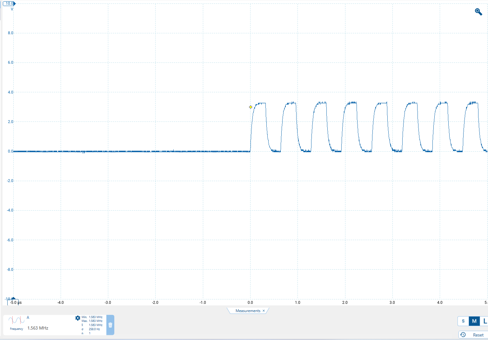
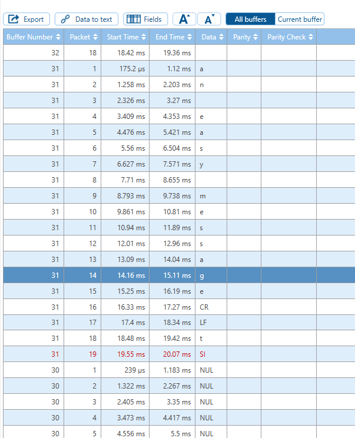
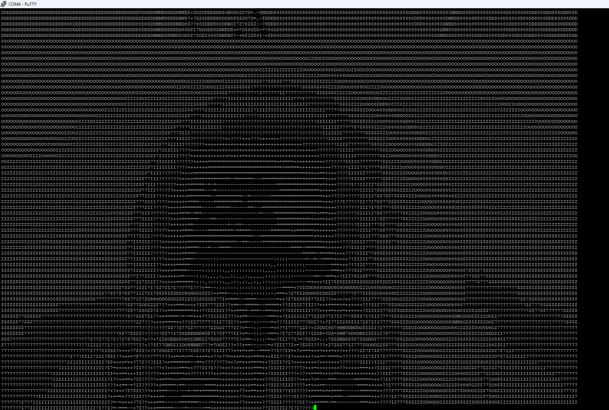

<h1 style="text-align: center">Orientation Lab Report</h1>

Nolan Eastburn & Connor Ohnesorge
CPR E 488
1/26/2025
***
# Introduction

The primary purpose for this lab was to explore the I/O of the ZedBoard platform and get some practice with the tools available in lab. By reading the I/O description, visual observations, and by probing PMOD connector pins with the oscilloscope, we were able to find all 12 modes of operation. The twelve modes are listed below:

# Modes of Operation

1. **Party-pooper Mode**
   When switch 2  (SW2) is in the "on" position, the joke displayed on the OLED screen is disabled.
2. **8-Bit Binary Counter**
   The left button (BTNL) triggers an 8-bit binary counter using LED 0 through LED 7. LED 7 acts as the most significant bit (MSB) and LED 0 acts as the least significant bit (LSB).
3. **4-Bit Circular Shift Register**
   The center button (BTNC) triggers an 8-bit circular shift register where 4 bits out of the 8 are set. The shifting is done from LED 7 to LED 0.
4. **1-Bit Circular Shift Register**
   The right button (BTNR) triggers an 8-bit circular shift register where only 1 bit out of the 8 is set. The shifting is done from LED 7 to LED 0.
5. **All LEDs On**
   The up button (BTNU) illuminates LED 0 to LED 7, which are all the LEDs in the main LED line.
6. **Switch-Activated LEDs**
   The down button (BTND) triggers a mode where LEDs 0 through 7 illuminate only when their corresponding switches (0 through 7) are in the on position. So if switch 3 (SW3) is in the on position, LED 3 will illuminate.
7. **VGA Enable**
   Switch 0 (SW0) enables a VGA output where a banner with Dr. Zambrano on it bounces around the screen on a background with many colorful vertical lines.
8. **Dr. Jones VGA Mode**
   Switch 1 (SW1) changes the VGA output such that Dr. Jones is on the bouncing banner instead of Dr. Zambrano.
9. **AM Morse Code**
   On the PMOD A connector, all pins except the VDD and GND pins had a sinusoidal voltage applied to them on certain intervals. A capture of this behavior is shown below:
   
   
   
<i>Figure 1: PMOD A Output</i>

   
   In the bottom left corner of the image (zoom in to see), a frequency measurement is displayed. We measured the frequency to be 1.563 MHz. Then, we got an AM radio passed to us that happened to be tuned to 1560KHz AM, which allowed us to hear some beeps. By probing the PMOD with the oscilloscope, we enabled the radio to pick up the voltage and produce an audible noise via amplitude modulation. We heard many beeps that sounded like Morse Code. However, it was quite difficult to tell what pauses indicated the end of a character and end of a word from the pauses between dots and dashes. Due to this issue, we were not able to decode the message. We were later notified that this is an issue with the design that is on the FPGA.
10. **UART Message**
    On the PMOD B connector, all pins except the VDD and GND pins had a square waveform applied to them, which was read using the oscilloscope. We quickly identified this waveform to be some sort of data transmission. We forgot to capture a picture of the waveform, but we did capture some useful output from one of the oscilloscope tools. Once we figured out that this waveform was using the UART protocol, we were able to run a serial decode operation using the oscilloscope software. We assumed that default options for the parity, stop bit count, and data bit counts were used in this particular message. However, trying a few standard BAUD rates did not give us reliable information. So we determined the BAUD rate by isolating a single bit on the waveform and seeing its width. Taking the reciprocal of the bit's width gives us the BAUD rate, which we determined to be around  $\large{9530\frac{\text{bits}}{\text{s}}}$. This gave us the following output (this is only a small snippet of the full output):
    
    
    
<i>Figure 2: UART Decode Output</i>

    
    We determined that a part of the message is "not an easy message to read" and another part was "congratulations". We found that even after measuring the BAUD rate and trying slightly different BAUD rate values, we could never get the message to fully display without any misreads. This shows why it is important to make sure that both the transmitter and receiver clients in a UART connection both agree on the exact parameters for the waveform.
11. **Dr. Jones COM4 Surprise**
    We noticed that the ZedBoard had a serial connection the PC, so we looked in the Device Manager to see what all serial ports were opened. By trying the COM4 port, we got some output from the ZedBoard that read "TESTING BEFORE FSBL STUFF  XIlinx First Stage Boot Loader Release 14.6/2013.2..." followed by "garbage". We were confused on what this "garbage" was until we saw another team make their terminal fullscreen and saw an image. We also made our terminal fullscreen, but we couldn't see an image. After adjusting the BAUD rate to 115200, we saw ASCII art of Dr. Jones, part of which is shown below:
    
    
    
<i>Figure 3: Dr. Jones COM4 Output</i>

12. **Joke Change**
    For the last mode, we noticed that Switch 3 (SW3) changes the punchline of the joke on the OLED display.

# Conclusion
Overall, we found this lab to be quite fun and a good introduction to all the different I/O elements of the ZedBoard and the lab tools at our disposal.