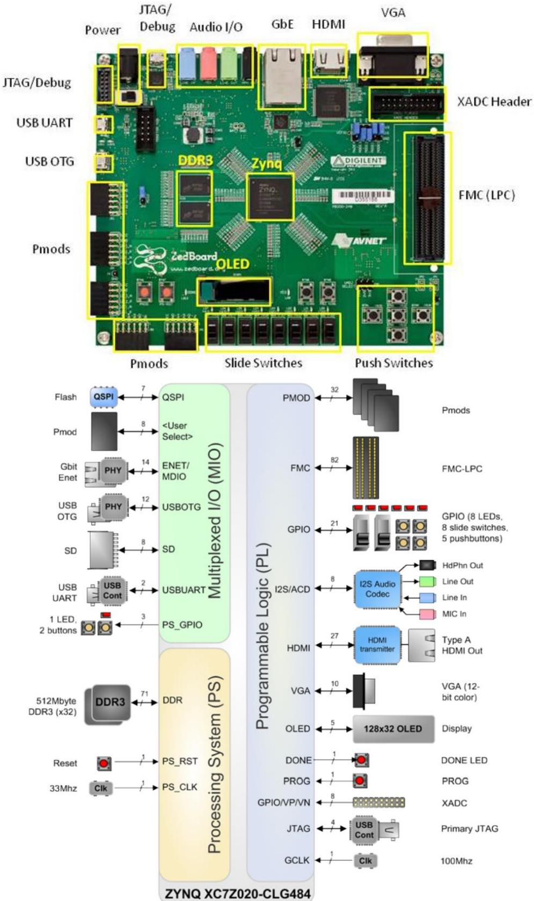

## **CprE 488 – Embedded Systems Design**

## **Lab Orientation**

**Assigned:** Monday of Week 1 **Due:** Monday of Week 2 **Points:** 10

*[Note: The goal of this Lab Orientation is to introduce you to the equipment in the 2041 Coover lab, and to stresstest some of our infrastructure for CprE 488. The intention is that you will submit (via Blackboard) whatever you have accomplished by the end of the lab period.]*

**Before you start.** Please complete and submit the "Lab Policies and Procedures" agreement.

**1) ZedBoard Test.** Our lab platform this semester is based on the Digilent ZedBoard [(www.zedboard.org)](www.zedboard.org)), which couples a Xilinx Zynq XC7Z020 FPGA with various memories and peripherals in order to enable rapid embedded system prototyping. While you will have the opportunity to discover more about the ZedBoard and Zynq chip as the semester progresses, for now, your job is to discover a design's functionality through black-box testing.

In the attached Orientation.zip file, we have provided some basic documentation for the ZedBoard as well as a BOOT.BIN file that when stored on the sdcard connected to the ZedBoard, will automatically load a design onto the Zynq FPGA. Before proceeding, confirm the following:

- Ensure that BOOT.BIN is stored on the sdcard.
    If not, please copy the file directly to the top-level directory on the card.
    Removing the card from the ZedBoard and plugging it into a card reader (a on Windows or Linux machine) 
    should work - there should be no need to format.
    
- Ensure that the jumpers labelled "MIO4" and "MIO5" on the ZedBoard are connected to 3V3, and that the other 
    jumpers in that bank are connected to ground.

We have configured the BOOT.BIN design to exhibit 12 discrete modes of operation. Some of these will be obvious, others will appear obvious (but require further investigation to discover the true behavior), and others are intentionally obfuscated. Turn on the ZedBoard, and attempt to discover all 12 modes of operation. In your writeup, provide a brief description of each mode's operation, and how you discovered it. Submit your writeup on Blackboard by the end of the lab session. Some considerations:

- 1. An oscilloscope is going to be a more useful tool than a PC for most of these modes of operation. There are numerous exposed ports on the ZedBoard (see the figures on the following page) that can be used to display information. As is appropriate for a senior-level embedded systems course, do not expect to be able to plug things into a PC and expect everything to work without additional effort.
- 2. Some modes are always present; others are enabled through the switches and/or buttons.
- 3. All modes of operation are easily discoverable through non-destructive evaluation. In other words, please do not damage the board.
- 4. Do not stress about finding all 12 modes. Do your best, ask questions, and confer with your lab partner and with the other students in the lab. This assignment is intentionally worth very few points.

