# **Getting** Started Guide

**Version 6.0**

# **Revision History**

| DATE       | VERSION | REVISION                                                                                                                                        |
|------------|---------|-------------------------------------------------------------------------------------------------------------------------------------------------|
| 08/06/2012 | 1.0     | Initial Release                                                                                                                                 |
| 08/08/2012 | 2.0     | Further clarified un-mounting of media                                                                                                          |
| 08/10/2012 | 3.0     | Further clarified Processing System and Programmable Logic in diagrams. Provided other needed edits identified by ZedBoard.org forum users. |
| 08/11/2012 | 4.0     | Further clarified host PC requirements. Added Appendix for showing how to connect with Linux host PC.                                       |
| 08/14/2012 | 5.0     | Updated Hardware Block Diagram.                                                                                                                 |
| 09/04/2012 | 6.0     | Updated Hardware Block Diagram.                                                                                                                 |

# **AVNET DESIGN KIT TECHNICAL SUPPORT FILES AND DOWNLOADS WEB ACCESS INSTRUCTIONS**

Thank you for purchasing an Avnet design kit. The technical support documents associated with this kit, including the User Guide, Bill of Materials, Schematics, Source Code and Application Notes, are available online. You, the Customer, can access these documents at any time by visiting the ZedBoard Community Web Site at[: www.zedboard.org](http://www.zedboard.org/)

# **LICENSE AGREEMENT**

THE AVNET DESIGN KIT ("DESIGN KIT" OR "PRODUCT") AND ANY SUPPORTING DOCUMENTATION ("DOCUMENTATION" OR "PRODUCT DOCUMENTATION") IS SUBJECT TO THIS LICENSE AGREEMENT ("LICENSE"). USE OF THE PRODUCT OR DOCUMENTATION SIGNIFIES ACCEPTANCE OF THE TERMS AND CONDITIONS OF THIS LICENSE. THE TERMS OF THIS LICENSE AGREEMENT ARE IN ADDITION TO THE AVNET CUSTOMER TERMS AND CONDITIONS, WHICH CAN BE VIEWED A[T www.em.avnet.com.](http://www.em.avnet.com/) THE TERMS OF THIS LICENSE AGREEMENT WILL CONTROL IN THE EVENT OF A CONFLICT.

- 1. Limited License. Avnet grants You, the Customer, ("You" "Your" or "Customer") a limited, non-exclusive, non-transferable, license to: (a) use the Product for Your own internal testing, evaluation and design efforts at a single Customer site; (b) create a single derivative work based on the Product using the same semiconductor supplier product or product family as used in the Product; and (c) make, use and sell the Product in a single production unit. No other rights are granted and Avnet and any other Product licensor reserves all rights not specifically granted in this License Agreement. Except as expressly permitted in this License, neither the Design Kit, Documentation, nor any portion may be reverse engineered, disassembled, decompiled, sold, donated, shared, leased, assigned, sublicensed or otherwise transferred by Customer. The term of this License is in effect until terminated. Customer may terminate this license at any time by destroying the Product and all copies of the Product Documentation.
- 2. Changes. Avnet may make changes to the Product or Product Documentation at any time without notice. Avnet makes no commitment to update or upgrade the Product or Product Documentation and Avnet reserves the right to discontinue the Product or Product Documentation at any time without notice.
- 3. Limited Warranty. ALL PRODUCTS AND DOCUMENTATION ARE PROVIDED "AS IS" WITHOUT WARRANTY OF ANY KIND. AVNET MAKES NO WARRANTIES, EITHER EXPRESS OR IMPLIED, WITH RESPECT TO THE PRODUCTS AND DOCUMENTATION PROVIDED HEREUNDER. AVNET SPECIFICALLY DISCLAIMS THE IMPLIED WARRANTIES OF MERCHANTABILITY AND FITNESS FOR A PARTICULAR PURPOSE AND ANY WARRANTY AGAINST INFRINGEMENT OF ANY INTELLECTUAL PROPERTY RIGHT OF ANY THIRD PARTY WITH REGARD TO THE PRODUCTS AND DOCUMENTATION.
- 4. **LIMITATIONS OF LIABILITY. CUSTOMER SHALL NOT BE ENTITLED TO AND AVNET WILL NOT LIABLE FOR ANY INDIRECT, SPECIAL, INCIDENTAL OR CONSEQUENTIAL DAMAGES OF ANY KIND OR NATURE, INCLUDING, WITHOUT LIMITATION, BUSINESS INTERRUPTION COSTS, LOSS OF PROFIT OR REVENUE, LOSS OF DATA, PROMOTIONAL OR MANUFACTURING EXPENSES, OVERHEAD, COSTS OR EXPENSES ASSOCIATED WITH WARRANTY OR INTELLECTUAL PROPERTY INFRINGEMENT CLAIMS, INJURY TO REPUTATION OR LOSS OF CUSTOMERS, EVEN IF AVNET HAS BEEN ADVISED OF THE POSSIBILITY OF SUCH DAMAGES. THE PRODUCTS AND DOCUMENTATION ARE NOT DESIGNED, AUTHORIZED OR WARRANTED TO BE SUITABLE FOR USE IN MEDICAL, MILITARY, AIR CRAFT, SPACE OR LIFE SUPPORT EQUIPMENT NOR IN APPLICATIONS WHERE FAILURE OR MALFUNCTION OF THE PRODUCTS CAN REASONABLY BE EXPECTED TO RESULT IN A PERSONAL INJURY, DEATH OR SEVERE PROPERTY OR ENVIRONMENTAL DAMAGE. INCLUSION OR USE OF PRODUCTS IN SUCH EQUIPMENT OR APPLICATIONS, WITHOUT PRIOR AUTHORIZATION IN WRITING OF AVNET, IS NOT PERMITTED AND IS AT CUSTOMER'S OWN RISK. CUSTOMER AGREES TO FULLY INDEMNIFY AVNET FOR ANY DAMAGES RESULTING FROM SUCH INCLUSION OR USE.**
- 5. **LIMITATION OF DAMAGES. CUSTOMER'S RECOVERY FROM AVNET FOR ANY CLAIM SHALL NOT EXCEED CUSTOMER'S PURCHASE PRICE FOR THE PRODUCT GIVING RISE TO SUCH CLAIM IRRESPECTIVE OF THE NATURE OF THE CLAIM, WHETHER IN CONTRACT, TORT, WARRANTY, OR OTHERWISE.**
- 6. **INDEMNIFICATION. AVNET SHALL NOT BE LIABLE FOR AND CUSTOMER SHALL INDEMNIFY, DEFEND AND HOLD AVNET HARMLESS FROM ANY CLAIMS BASED ON AVNET'S COMPLIANCE WITH CUSTOMER'S DESIGNS, SPECIFICATIONS OR INSTRUCTIONS, OR MODIFICATION OF ANY PRODUCT BY PARTIES OTHER THAN AVNET, OR USE IN COMBINATION WITH OTHER PRODUCTS.**
- 7. U.S. Government Restricted Rights. The Product and Product Documentation are provided with "RESTRICTED RIGHTS." If the Product and Product Documentation and related technology or documentation are provided to or made available to the United States Government, any use, duplication, or disclosure by the United States Government is subject to restrictions applicable to proprietary commercial computer software as set forth in FAR 52.227-14 and DFAR 252.227-7013, et seq., its successor and other applicable laws and regulations. Use of the Product by the United States Government constitutes acknowledgment of the proprietary rights of Avnet and any third parties. No other governments are authorized to use the Product without written agreement of Avnet and applicable third parties.
- 8. Ownership. Licensee acknowledges and agrees that Avnet or Avnet's licensors are the sole and exclusive owner of all Intellectual Property Rights in the Licensed Materials, and Licensee shall acquire no right, title, or interest in the Licensed Materials, other than any rights expressly granted in this Agreement.
- 9. Intellectual Property. All trademarks, service marks, logos, slogans, domain names and trade names (collectively "Marks") are the properties of their respective owners. Avnet disclaims any proprietary interest in Marks other than its own. Avnet and AV design logos are registered trademarks and service marks of Avnet, Inc. Avnet's Marks may be used only with the prior written permission of Avnet, Inc.
- 10. General. The terms and conditions set forth in the License Agreement or at [www.em.avnet.com](http://www.em.avnet.com/) will apply notwithstanding any conflicting, contrary or additional terms and conditions in any purchase order, sales acknowledgement confirmation or other document. If there is any conflict, the terms of this License Agreement will control. This License may not be assigned by Customer, by operation of law, merger or otherwise, without the prior written consent of Avnet and any attempted or purported assignment shall be void. Licensee understands that portions of the Licensed Materials may have been licensed to Avnet from third parties and that such third parties are intended beneficiaries of the provisions of this Agreement. In the event any of the provisions of this Agreement are for any reason determined to be void or unenforceable, the remaining provisions will remain in full effect. This constitutes the entire agreement between the parties with respect to the use of this Product, and supersedes all prior or contemporaneous understandings or agreements, written or oral, regarding such subject matter. No waiver or modification is effective unless agreed to in writing and signed by authorized representatives of both parties. The obligations, rights, terms and conditions shall be binding on the parties and their respective successors and assigns. The License Agreement is governed by and construed in accordance with the laws of the State of Arizona excluding any law or principle, which would apply the law of any other jurisdiction. The United Nations Convention for the International Sale of Goods shall not apply.

| Getting Started with ZedBoard                         | 7  |
|-----------------------------------------------------------|----|
| Introduction 7                                            |    |
| What's Inside the Box?  8                                 |    |
| What's on the Web? 8                                      |    |
| Key Features                                          | 9  |
| ZedBoard Hardware Block Diagram  10                       |    |
| ZedBoard Basic Setup and Operation                    | 11 |
| Hardware Setup  11                                        |    |
| Linux Startup and Shutdown  13                            |    |
| Example Design Description                            | 14 |
| ZedBoard Example Design System Block Diagram 14           |    |
| Demo 1 – Interacting with GPIO Switches and LEDs      | 15 |
| Purpose 15                                                |    |
| Running the Demo on ZedBoard Hardware  15                 |    |
| Demo 2 – OLED Display                         | 17 |
| Purpose 17                                                |    |
| Running the Demo on ZedBoard Hardware  17                 |    |
| Demo 3 – VGA Display                          | 19 |
| Purpose 19                                                |    |
| Running the Demo on ZedBoard Hardware  19                 |    |
| Demo 4 – HDMI Display                             | 21 |
| Purpose 21                                                |    |
| Running the Demo on ZedBoard Hardware  21                 |    |
| Demo 5 – Ethernet                                 | 23 |
| Purpose 23                                                |    |
| Host PC Networking Configuration  23                      |    |
| Running the Demo on ZedBoard Hardware  24                 |    |
| Demo 6 – USB-OTG                                  | 28 |
| Purpose 28                                                |    |
| Running the Demo on ZedBoard Hardware  28                 |    |
| Demo 7 – SD Card                                      | 30 |
| Purpose 30                                                |    |
| Running the Demo on ZedBoard Hardware  30                 |    |
| What's Next                                               | 32 |
| Where To Get More Information                         | 32 |
| Xilinx Website  32                                        |    |
| Cypress Website 32                                        |    |
| Getting Additional Help and Support                       | 33 |
| Avnet Support 33                                          |    |
| Xilinx Support  33                                        |    |
| Appendix I: Installing and Licensing Xilinx Software  | 34 |
| Install ISE WebPACK or Design Suite  34                   |    |
| Appendix II: QSPI Flash Example Application           | 35 |
| Boot ZedBoard from QSPI 35                                |    |
|                                                           |    |
| Appendix III: Using Linux Host PC                         | 36 |
| Connect Terminal to ZedBoard USB-UART  36                 |    |
| Connect Networking to ZedBoard  37                        |    |

| Figure 1 – ZedBoard Hardware Block Diagram  10                        |  |
|-----------------------------------------------------------------------|--|
| Figure 2 – Device Manager Showing Enumerated USB-UART as COM13 11     |  |
| Figure 3 – Tera Term Serial Port Setup Settings  12                   |  |
| Figure 4 – Linux Command Prompt Following Boot  13                    |  |
| Figure 5 – Linux Command Prompt Following Shutdown  13                |  |
| Figure 6 – ZedBoard Example Design Block Diagram  14                  |  |
| Figure 7 – ZedBoard Example Switch Input 15                           |  |
| Figure 8 – ZedBoard Example LED Output  16                            |  |
| Figure 9 – Turning the OLED Display Off 17                            |  |
| Figure 10 – Turning the OLED Display On  18                           |  |
| Figure 11 – VGA Output Test Pattern  19                               |  |
| Figure 12 – HDMI Output Pattern 21                                    |  |
| Figure 13 – Network and Sharing Center  23                            |  |
| Figure 14 – Network Connections  23                                   |  |
| Figure 15 – Local Area Connection Properties 24                       |  |
| Figure 16 – Internet Protocol Version 4 (TCP/IPv4) Properties 24      |  |
| Figure 17 – ZedBoard IP Address Revealed with ifconfig Command 25     |  |
| Figure 18 – ZedBoard Webpage Shown In PC Host Browser  25             |  |
| Figure 19 – PuTTY SSH Configuration  26                               |  |
| Figure 20 – Remote ZedBoard Terminal via SSH Session  26              |  |
| Figure 21 – ZedBoard FTP Session 27                                   |  |
| Figure 22 – USB Drive Enumeration After Device Insertion 28           |  |
| Figure 23 – USB Drive Mounted to /mnt 29                              |  |
| Figure 24 – Directory Listing of USB Drive  29                        |  |
| Figure 25 – SD Card Block Device Enumeration  30                      |  |
| Figure 26 – SD Card Mounted to /mnt  31                               |  |
| Figure 27 – Directory Listing of SD Card  31                          |  |
| Figure 28 – QSPI Application Example Output  35                       |  |
| Figure 29 – Determining the Host tty Device and Launching minicom  36 |  |
| Figure 30 – Using minicom to Interact with ZedBoard Console  37       |  |
| Figure 31 – Assigning Static IP Address to Linux Host Machine  37     |  |
| Figure 32 – Restarting the Networking Interface  38                   |  |
| Figure 33 – ZedBoard Webpage Shown In Host Browser 38                 |  |

# **GETTING STARTED WITH ZEDBOARD**

The ZedBoard enables hardware and software developers to create or evaluate Zynq™-7000 All Programmable SoC designs.

The expandability features of this evaluation and development platform make it ideal for rapid prototyping and proof-of-concept development. The ZedBoard includes Xilinx XADC, FMC (FPGA Mezzanine Card), and Digilent Pmod™ compatible expansion headers as well as many common features used in system design. ZedBoard enables embedded computing capability by using DDR3 memory, Flash memory, gigabit Ethernet, general purpose I/O, and UART technologies.

This Getting Started Guide will outline the steps to setup the ZedBoard hardware. It documents the procedure to run a simple Linux design to show a Linux application running on the ARM® dual-core Cortex™-A9 MPCore™ Processing System (PS) and interacting with the tightly coupled 7 series 85K Programmable Logic (PL) cells. Xilinx Embedded Development tools are also introduced where the design can be built from scratch and customization options can be discovered. If Xilinx ISE WebPACK or Design Suite software is not already installed, further resources to install the software, get updated and generate a license are provided in Appendix I.

# **WHAT'S INSIDE THE BOX?**

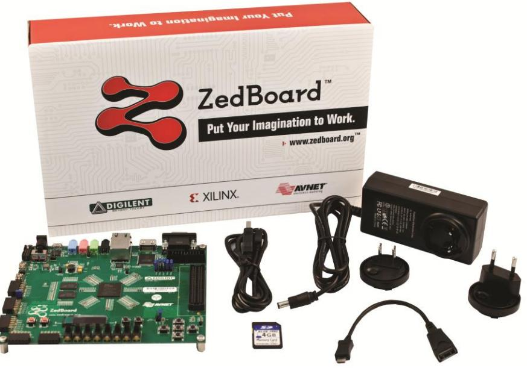

# **ZedBoard Kit contents:**

- ZedBoard
- 12 volt / 5 ampere power supply with US, European AC adapter
- USB-A to Micro-USB-B cable
- Micro-USB-B to Type A Female adapter cable
- 4GB SD card
- Software
- o Xilinx ISE WebPACK Edition DVD
- o Xilinx ChipScope™ Pro License Voucher for ZedBoard designs
- Documentation
- o •Getting Started Card

# **WHAT'S ON THE WEB?**

ZedBoard is a community-oriented kit, with all materials being made available through th[e ZedBoard.org](http://www.zedboard.org/) community website.

# **Official Documentation:**

- Schematics
- Layout
- Hardware manual

# **Tutorials and Reference Designs:**

- Introductory material for beginners
- Design examples

# **ZEDBOARD KEY FEATURES**

- Processor
- o Zynq™-7000 AP SoC XC7Z020-CLG484-1
- Memory
- o 512 MB DDR3
- o 256 Mb Quad-SPI Flash
- o 4 GB SD card
- Communication
- o Onboard USB-JTAG Programming
- o 10/100/1000 Ethernet
- o USB OTG 2.0 and USB-UART
- Expansion connectors
- o FMC-LPC connector (68 single-ended or 34 differential I/Os)
- o 5 Pmod™ compatible headers (2x6)
- o Agile Mixed Signaling (AMS) header
- Clocking
- o 33.33333 MHz clock source for PS
- o 100 MHz oscillator for PL
- Display
- o HDMI output supporting 1080p60 with 16-bit, YCbCr, 4:2:2 mode color
- o VGA output (12-bit resolution color)
- o 128x32 OLED display
- Configuration and Debug
- o Onboard USB-JTAG interface
- o Xilinx Platform Cable JTAG connector
- General Purpose I/O
- o 8 user LEDs
- o 7 push buttons
- o 8 DIP switches

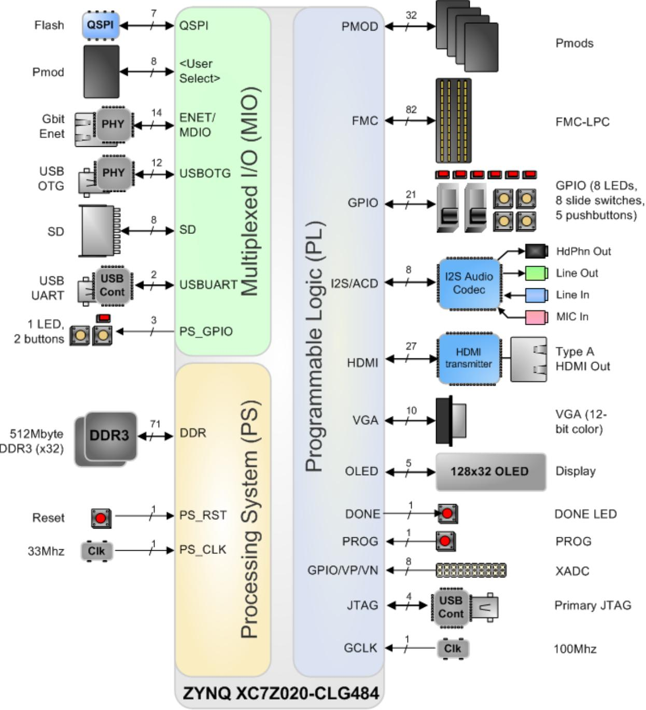

**Figure 1 – ZedBoard Hardware Block Diagram** 

# **ZEDBOARD BASIC SETUP AND OPERATION**

The ZedBoard SD card is preloaded with an example open source Linux build with a RAMdisk file system. This document was created using a host PC running Windows 7 and the instructions contained would apply directly to a Windows 7 host PC. See Appendix III for an example of how to connect a Linux host PC to ZedBoard. It is also recommended that the host PC also have a wired (RJ-45 connector) Network Interface Card (NIC) that can operate at 100 Mbps or 1000 Mbps.

# **Hardware Setup**

- 1. Connect 12 V power supply to barrel jack (J20).
- 2. Connect the USB-UART port of ZedBoard (J14) which is labeled **UART** to a PC using the MicroUSB cable.
- 3. Insert the 4GB SD card included with ZedBoard into the SD card slot (J12) located on the underside of ZedBoard PCB. This SD card comes preloaded with demo software and contains a basic Linux configuration used to implement the demos listed in the later sections.
- 4. Verify the ZedBoard boot mode (JP7-JP11) and MIO0 (JP6) jumpers are set to SD card mode as described in the Hardware Users Guide.

[www.zedboard.org/sites/default/files/ZedBoard_HW_UG_v1_6.pdf](http://www.zedboard.org/sites/default/files/ZedBoard_HW_UG_v1_6.pdf)

- 5. Turn power switch (SW8) to the ON position. ZedBoard will power on and the Green Power Good LED (LD13) should illuminate.
- 6. The PC may pop-up a dialog box asking for driver installation.

ZedBoard has a USB-UART bridge based on the Cypress CY7C64225 chipset. Use of this feature requires that a USB driver be installed on your Host PC.

If Windows recognizes the USB-UART and loads the software driver, then amber LED D6 will light. Please skip ahead to the next section. However, if the host PC does not recognize the USB-UART and enumerate it as a COM port device refer to the "ZedBoard_USB-UART_Setup_Guide.pdf" document in the link below for instructions on installing this driver. When driver installation is complete, continue to the next step.

<http://www.zedboard.org/sites/default/files/CY7C64225_Setup_Guide_1_1.pdf>

- 7. Wait approximately 15 seconds. The blue Done LED (LD12) should illuminate, and a default image will be displayed on the OLED (DISP1).
- 8. Use Device Manager to determine the COM Port.

Note: Each unique USB-UART device attached will enumerate under the next available COM port. Here in this example, the Cypress CY7C64225 USB-UART device is enumerated as COM13.

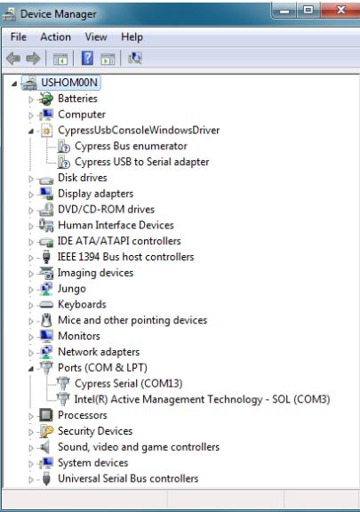

**Figure 2 – Device Manager Showing Enumerated USB-UART as COM13**

- 9. On your PC, open a serial terminal program. For this demo, Windows 7 was used which does not come with a built in terminal application. Tera Term was used in this example which can be downloaded from the Tera Term project on the SourceForge Japan page: [ttssh2.sourceforge.jp](http://ttssh2.sourceforge.jp/)
- 10. Once Tera Term is installed, Tera Term can be accessed from the desktop or start menu shortcuts.

- 11. To configure baud rate settings, open the Serial Port Setup window from the **SetupSerial port** menu selection. Select the USB-UART COM port enumeration that matches the listing found in Device Manager. Also set the Baud rate option to 115200, the Data width option to 8-bit, the Parity option to none, the Stop bit option to 1 bit, and the flow control to none. Finally, assign the transmit delay parameters to 10 msec/char and 100 msec/line, and then click OK.

**Figure 3 – Tera Term Serial Port Setup Settings**

- 12. Optionally, at this point, the terminal settings can be saved for later use. To do this, use the **SetupSave setup** menu selection and overwrite the existing TERATERM.INI file.
- 13. If the amber USB-Link Status (LD11) does not flicker to indicate activity, check the driver installation to determine if the device driver is recognized and enumerated successfully and that there are no errors reported by Windows.

#### **Linux Startup and Shutdown**

- 1. Cycle power once by turning the power switch (SW8) from ON to OFF and then back ON.
- 2. In the Terminal Window, a simple Linux image should boot with functionality that demonstrates the basic capabilities of ZedBoard.

**Figure 4 – Linux Command Prompt Following Boot**

- 3. When you are done using Linux, run the command poweroff and then switch off ZedBoard by positioning the power switch (SW8) from ON to OFF.

**Figure 5 – Linux Command Prompt Following Shutdown**

# **Example Design Description**

#### ZedBoard System Block Diagram

The following figure illustrates the system design that serves to demonstrate the subsequent interface demos.

This example design platform is what is included (Programmable Logic provided in Bitstream form) on the ZedBoard SD card and can be used as one of the starting points from which custom designs can be built.

# **Demo 1 – Interacting with GPIO Switches and LEDs**

#### Purpose

This demo shows how software running on the Processing System (PS) of Zynq-7000 AP SoC can interact with the Programmable Logic (PL) hardware to process inputs and outputs through the GPIO implemented in the programmable fabric. This section will also help demonstrate some of the Linux infrastructure that is operational right out of the box.

- 1. Setup the basic hardware and boot into Linux as described in the previous section ZedBoard Basic Setup and Operation.
- 2. A set of scripts are included in the /usr/bin directory for interacting with the hardware. To read the state of the user switches (SW0-SW7), first set the position of the switches as desired and then run the read_sw script. The state of the switches will be returned as an output in both hexadecimal and decimal formats.

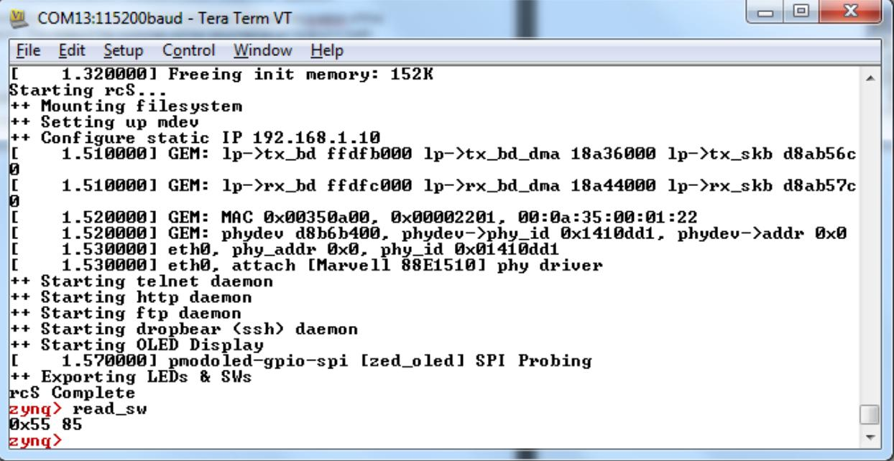

**Figure 7 - ZedBoard Example Switch Input**

- 3. The read_sw script handles the details of reading the GPIO states from the /sys/class/gpio/gpio$sw/value sysfs nodes. The position of the switches can be modified and the updated GPIO values read again by running the read_sw script.
- 4. A script for changing the state of the LEDs is also included. To set the state of the user LEDs (LD0-LD7), use the script write_led and specify the byte value to be written to the LEDs. For example, running the script write_led 0xFF or even the command write_led 255 will result in each of the user LEDs LD0-LD7 illuminating as seen in Figure 8.
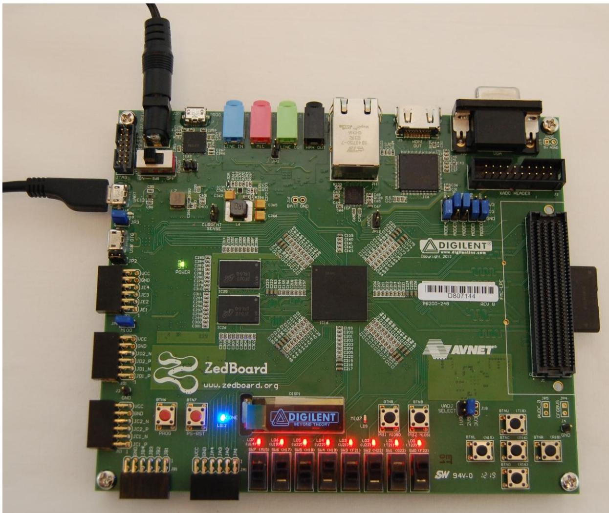

**Figure 8 - ZedBoard Example LED Output**

- 5. The write_led script handles the details of writing the specified values to the /sys/class/gpio/gpio$led/value sysfs nodes. The state of the LEDs can be modified again by running the write_led script with another output value.
- 6. This concludes Demo 1. Continue to experiment with this demo, proceed to another demo, or run the Linux command poweroff and then switch off ZedBoard.

# **Demo 2 – OLED Display**

#### Purpose

This demo shows how software running on the Processing System (PS) of Zynq-7000 AP SoC can interact with the Programmable Logic (PL) hardware via a device driver.

A default Digilent Logo image is displayed on the OLED display (DISP1) after Linux has finished booting. In order to prolong the life of the OLED display, the manufacturer suggests that a specific powerdown sequence be used. Running the poweroff command before switching the ZED board off will ensure that this procedure is correctly followed. This section will help demonstrate some of the Linux infrastructure that is used to facilitate the OLED feature.

#### Running the Demo on ZedBoard Hardware

- 1. Setup the basic hardware and boot into Linux as described in the previous section ZedBoard Basic Setup and Operation.
- 2. A set of scripts are included in the /usr/bin directory for interacting with the hardware. To power off the OLED display, run the unload_oled script. By running this script, the OLED device driver module *pmodoled-gpio.ko* will be dynamically removed from the kernel during which the OLED is powered off using the recommended sequence and will no longer display the Digilent logo.

**Figure 9 – Turning the OLED Display Off**

- 3. To power on the OLED display again, run the load_oled script. By running this script, the OLED device driver module pmodoled-gpio.ko will be dynamically inserted into the kernel during which it will power on the OLED display using the recommended sequence. Next, the source logo image file /root/logo.bin is transferred to the OLED display device node /dev/zed_oled and the driver configures the OLED in order to display the Digilent logo.

**Figure 10 – Turning the OLED Display On**

- 4. This concludes Demo 2. Continue to experiment with this demo, proceed to another demo, or run the Linux command poweroff and then switch off ZedBoard.
# **Demo 3 – VGA Display**

#### Purpose

This demo shows how Programmable Logic (PL) can drive hardware independently of the software running on the Processing System (PS) of Zynq-7000 AP SoC once the PL Bitstream is loaded. During this demo a test pattern generated by the PL can be observed on a display connected to the video output on the VGA connector.

- 1. Setup the basic hardware described in the previous section ZedBoard Basic Setup and Operation.
- 2. Using a15-pin D-subminiature VGA cable, attach a VGA display capable of displaying a resolution of at least 640x480 to the ZedBoard video output connector J10 which is labeled **VGA**.
- 3. Turn power switch (SW8) to the ON position. ZedBoard will power on and the Green Power Good LED (LD13) should illuminate.
- 4. Wait approximately 15 seconds. The blue Done LED (LD12) should illuminate, and a default image will be displayed on the OLED (DISP1). The VGA test pattern will also show on the display as seen in Figure 11.

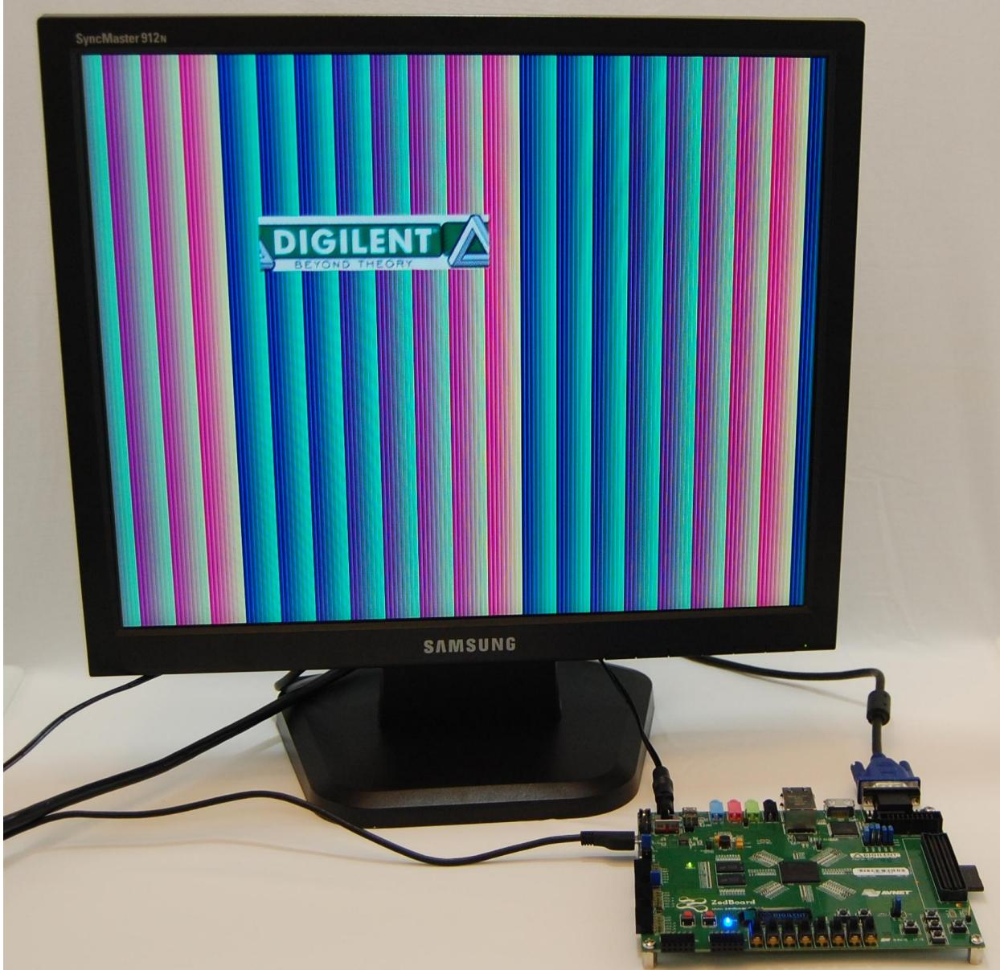

**Figure 11 – VGA Output Test Pattern**

- 5. This concludes Demo 3. Continue to experiment with this demo, proceed to another demo, or run the Linux command poweroff and then switch off ZedBoard.
# **Demo 4 – HDMI Display**

#### Purpose

This demo shows how software running on the Processing System (PS) of Zynq-7000 AP SoC can interact with the Programmable Logic (PL) hardware via a device driver. During this demo, a default "Tux" Linux logo image is displayed to the HDMI display port after Linux begins booting.

- 1. Setup the basic hardware as described in the previous section ZedBoard Basic Setup and Operation.
- 2. Using an HDMI-to-HDMI cable, attach an HDMI display capable of displaying a resolution of at least 1080p60 to the ZedBoard HD video output connector J9 which is labeled **HDMI OUT**.
- 3. Turn power switch (SW8) to the ON position. ZedBoard will power on and the Green Power Good LED (LD13) should illuminate.
- 4. Wait approximately 15 seconds. The blue Done LED (LD12) should illuminate, and a default image will be displayed on the OLED (DISP1). The HDMI output pattern will also show on the display as seen in Figure 12.

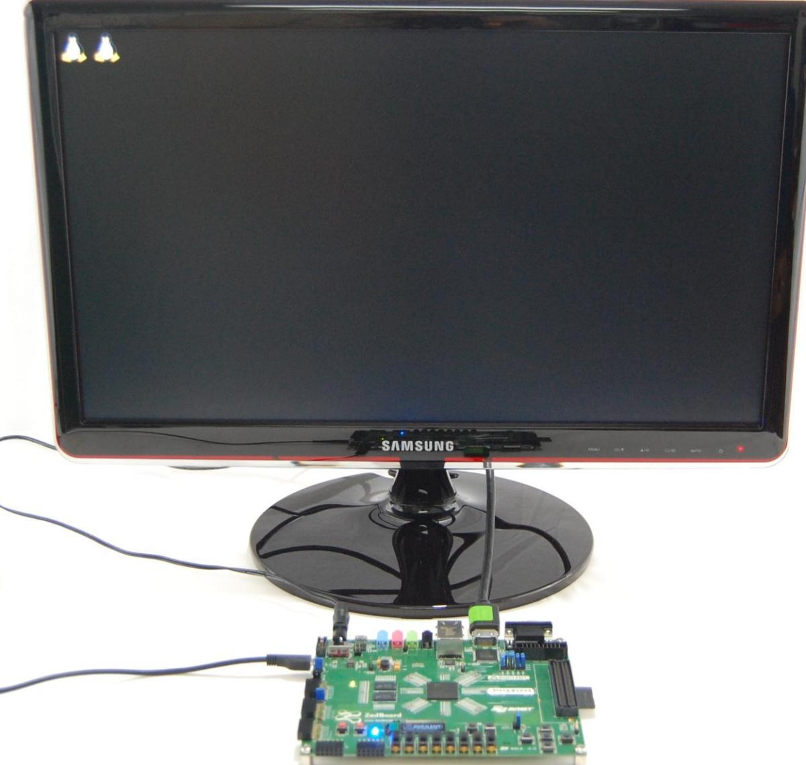

**Figure 12 – HDMI Output Pattern**

- 5. This concludes Demo 4. Continue to experiment with this demo, proceed to another demo, or run the Linux command poweroff and then switch off ZedBoard.
### **Demo 5 – Ethernet**

#### Purpose

ZedBoard example Linux system found on the included SD card implements a Dropbear SSH server, ftpd FTP server, and Busybox httpd HTTP server at startup. Refer to the documentation on each of these server implementations if you are interested in using them beyond the scope of this document.

#### Host PC Networking Configuration

This demo shows the Gigabit Ethernet hardware and networking capability of ZedBoard. To run this demo, you may have to configure the network properties on your PC. The following steps will guide you through this process for a Windows 7 host PC.

- 1. Attach a standard Ethernet Cable between ZedBoard Gigabit Ethernet Port (J11) and the host PC network interface adapter.
- 2. Open the **Change adapter settings** from the **StartControl PanelNetwork and Sharing Center**.

**Figure 13 – Network and Sharing Center**

- 3. In the **Network Connections** window, right-click on the Local Area Connection adapter entry corresponding to the network interface that is connected to ZedBoard and select **Properties**.

**Figure 14 – Network Connections**

- 4. In **Local Area Connection Properties**, select **Internet Protocol Version 4 (TCP/IPv4)**, then click the **Properties** button.

**Figure 15 – Local Area Connection Properties**

- 5. Set the IP address to 192.168.1.1 and the Subnet mask to 255.255.255.0 in the **Internet Protocol Version 4 (TCP/IPv4) Properties** window and then click the OK button.

**Figure 16 – Internet Protocol Version 4 (TCP/IPv4) Properties**

- 6. The host PC networking is now configured and ready to proceed with the networking hardware demo.
- 1. Setup the basic hardware and boot into Linux as described in the previous section ZedBoard Basic Setup and Operation.
- 2. Verify that a standard Ethernet Cable is connected between ZedBoard Gigabit Ethernet Port (J11) and the host PC network interface adapter.

- 3. The default IP address of ZedBoard Ethernet is set to 192.168.1.10 and this can be verified with the output returned by the ifconfig command.
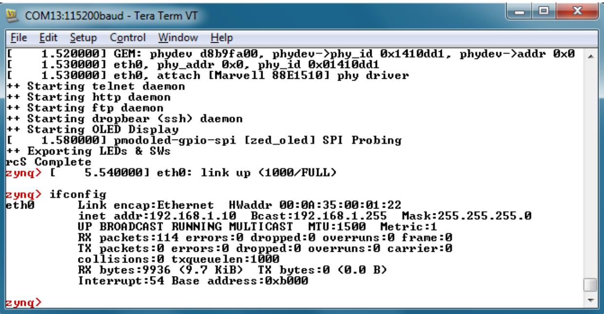

**Figure 17 – ZedBoard IP Address Revealed with ifconfig Command**

- 4. To view the ZedBoard embedded webpage, open a web browser (such as Firefox) and browse to the ZedBoard IP address <http://192.168.1.10/> as the URL. The ZedBoard webpage should open in the browser to display as seen in Figure 18.
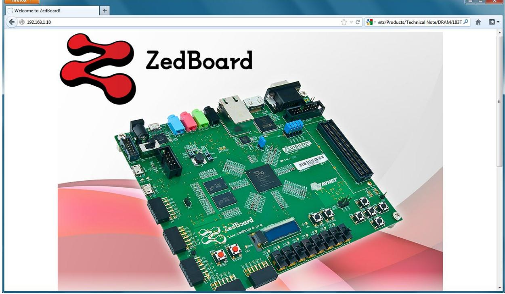

**Figure 18 – ZedBoard Webpage Shown In PC Host Browser**

- 5. Using an SSH client, such as PuTTY SSH, open a secure terminal connection to the target ZedBoard using the 192.168.1.10 IP address.

**Figure 19 – ZedBoard Webpage Shown In PC Host Browser**

- 6. Once the terminal connects, the remote system will prompt for a login. Use the user login **root** and the password **root** to complete the connection.
- 7. The session acts as a remote terminal and commands can be entered as you would on the local serial console.

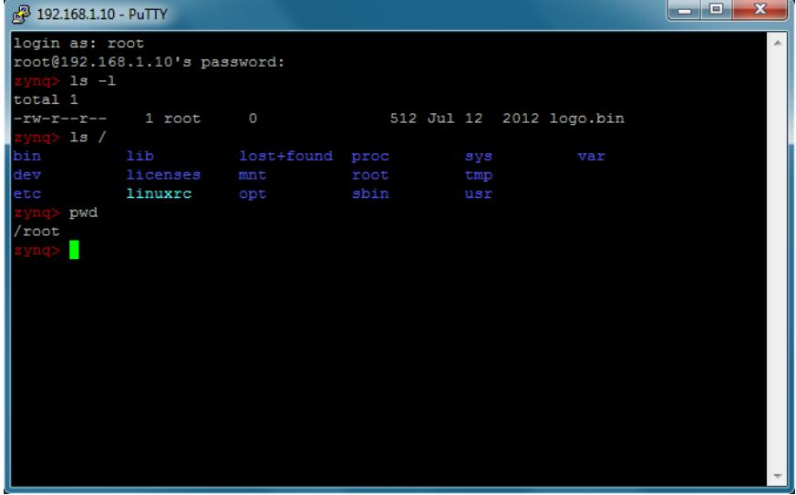

**Figure 20 – Remote ZedBoard Terminal via SSH Session**

- 8. Logout and close the remote session with the exit command.
- 9. Open a Windows Command Prompt.
- 10. Connect an FTP session to the remote host with the command ftp 192.168.1.10 and use the login **root**.

- 11. You can use the ftp session to transfer files back and forth across the network to ZedBoard.
**Figure 21 – ZedBoard FTP Session**

- 12. Close the ftp session using the bye command.
- 13. This concludes Demo 5. Continue to experiment with this demo, proceed to another demo, or run the command poweroff and then switch off ZedBoard.

### **Demo 6 – USB-OTG**

#### Purpose

This demo shows how a high speed communications peripheral connected to the Processing System (PS) of Zynq-7000 AP SoC can be used to extend the functionality of ZedBoard.

To connect additional USB devices with the ZED board, connect a powered hub to the USB-OTG port. USB devices attached to this hub can then also be accessed in Linux.

- 1. Set jumpers JP2 and JP3 to the 1-2 position. This will enable the OTG device for host mode and connect the ZedBoard USB 5V supply to the USB OTG (J13) VBUS line.
- 2. Setup the basic hardware and boot into Linux as described in the previous section ZedBoard Basic Setup and Operation.
- 3. Connect a USB thumb drive to the female end of the microUSB-to-Type A adapter cable included with ZedBoard.
- 4. Connect the microUSB end of the microUSB-to-Type A adapter cable to J13.
- 5. The USB thumb drive should enumerate and the device indication should display on the serial console. In this example, the primary partition of this USB thumb drive has been enumerated as device /dev/sda1 as seen in Figure 22.

**Figure 22 – USB Drive Enumeration After Device Insertion**

- 6. Mount the enumerated device to the /mnt mount point using the mount /dev/sda1 /mnt command.

**Figure 23 – USB Drive Mounted to /mnt**

- 7. The USB drive is now mounted into the root file system at the mount point /mnt which enables read and write file operations to the devices file system. In this example, the thumb drive used has an NTFS file system format.

**Figure 24 – Directory Listing of USB Drive**

- 14. The device should be cleanly un-mounted from the system using the command umount /mnt before it is removed or the board powered off.
Note: If the device cannot be un-mounted or if a "Device or resource busy" message is shown, make sure that no files or folders of the mounted file system are currently open or that the current working directory is not part of the mounted file system.

- 15. This concludes Demo 6. Continue to experiment with this demo, proceed to another demo, or run the command poweroff and then switch off ZedBoard.
# **Demo 7 – SD Card**

#### Purpose

This demo shows how a storage device connected to the Processing System (PS) of Zynq-7000 AP SoC can be used to extend the functionality of ZedBoard.

The root file system for the example design comes from a RAMdisk image stored on the SD card. This RAMdisk image is copied into a fixed location in DDR3 memory by u-boot prior to Linux boot. Once Linux begins booting, it mounts the RAM file system from the fixed location in DDR3. Any subsequent changes to this file system while ZedBoard is running will not persist through a power cycle or reset.

- 1. Setup the basic hardware and boot into Linux as described in the previous section ZedBoard Basic Setup and Operation.
- 2. The SD card is enumerate as MMC block device /dev/mmcblk0 and the primary partition on the device is enumerated as device /dev/mmcblk0p1 as seen in Figure 25.

**Figure 25 – SD Card Block Device Enumeration**

- 3. Mount the enumerated SD card primary partition block device to the /mnt mount point using the mount /dev/mmcblk0p1 /mnt command.

**Figure 26 – SD Card Mounted to /mnt**

- 4. The primary partition of the SD card is now mounted into the root file system at the mount point /mnt which enables read and write operations to files to the SD card file system. In this example, the SD card partition used has a FAT32 file system format.
Note: User LED LD9 is used to indicate read/write activity on the SD card.

#### **Figure 27 – Directory Listing of SD Card**

- 5. The SD card device should be cleanly un-mounted from the system using the command umount /mnt before it is removed or the board powered off.
Note: If the device cannot be un-mounted or if a "Device or resource busy" message is shown, make sure that no files or folders of the mounted file system are currently open or that the current working directory is not part of the mounted file system.

- 6. This concludes Demo 7. Continue to experiment with this demo, proceed to another demo, or run the command poweroff and then switch off ZedBoard.
### **What's Next**

Now that the pre-built ZedBoard example design has been explored, it is time to take a deeper dive into the ZedBoard and see how to modify this design or create a custom design.

To install the Xilinx ISE WebPACK Edition tools, please see the installation instructions in Appendix I: Installing and Licensing Xilinx Software.

### **Where To Get More Information**

- Overview and Features of ZedBoard
- o [www.zedboard.org/content/overview](http://www.zedboard.org/content/overview)
- ZedBoard Hardware User Guide
- o [www.zedboard.org/content/documentation](http://www.zedboard.org/content/documentation)

## Xilinx Website

- Zynq-7000 AP SoC Product Information
- o [www.xilinx.com/zynq](http://www.xilinx.com/zynq)
- ISE WebPACK Design Software
- o [www.xilinx.com/products/design-tools/ise-design-suite/ise-webpack.htm](http://www.xilinx.com/products/design-tools/ise-design-suite/ise-webpack.htm)

# Cypress Website

- CY7C64225 USB-to-UART Driver Download
- o [www.cypress.com/?rID=63794](http://www.cypress.com/?rID=63794)
- CY7C64225 USB-to-UART Device Data Sheet
- o [www.cypress.com/?docID=36208](http://www.cypress.com/?docID=36208)

# **Getting Additional Help and Support**

#### Avnet Support

ZedBoard is a community-oriented kit, with all technical support being offered through th[e ZedBoard.org](http://www.zedboard.org/) community website support forums. ZedBoard users are encouraged to participate in the forums and offer help to others when possible.

For questions regarding the ZedBoard community website, please direct any questions to:

- ZedBoard.org Web Master [webmaster@zedboard.org](mailto:webmaster@zedboard.org)
To access the most current collateral for ZedBoard please visit the community support page at:

- [www.zedboard.org/content/support](http://www.zedboard.org/content/support)
Once on th[e ZedBoard.org](http://www.zedboard.org/) support page:

To access the latest ZedBoard documentation, click on the Documentation link:

To access the latest reference designs for ZedBoard, click on the following link:

To access the ZedBoard technical forums, click on the following link:

#### Xilinx Support

For questions regarding products within the Product Entitlement Account, send an e-mail message to the Customer Service Representative in your region:

- Canada, USA and South America isscs_cases@xilinx.com
- Europe, Middle East, and Africa eucases@xilinx.com
- Asia Pacific including Japan apaccase@xilinx.com

For technical support including the installation and use of the product license file, contact Xilinx Online Technical Support at [www.xilinx.com/support.](http://www.xilinx.com/support) The following assistance resources are also available on the website:

- Software, IP and documentation updates
- Access to technical support web tools
- Searchable answer database with over 4,000 solutions
- User forums

# **Appendix I: Installing and Licensing Xilinx Software**

# Install ISE WebPACK or Design Suite

The ZedBoard XC7Z020-CLG484-1 Zynq-7000 AP SoC device development is supported by ISE WebPACK licensing. ZedBoard also comes with entitlement voucher to a seat of ChipScope™ Pro that is device locked to a XC7Z020-CLG484-1 Zynq-7000 AP SoC device. This software can be installed from the included DVD or the latest version can be downloaded online at:

- [www.xilinx.com/support/download/index.htm](http://www.xilinx.com/support/download/index.htm)
If a full seat of ISE Embedded or System Edition has already been installed, then no further software will be needed. Please check online for any updates at:

- [www.xilinx.com/support/download/index.htm](http://www.xilinx.com/support/download/index.htm)
For detailed instructions on installing and licensing the Xilinx tools, please refer to the **Xilinx Design Tools: Installation and Licensing Guide** available on the Xilinx website:

- [www.xilinx.com/support/documentation/sw_manuals/xilinx14_1/iil.pdf](http://www.xilinx.com/support/documentation/sw_manuals/xilinx14_1/iil.pdf)
Note: If the 14.1 or 14.2 ISE tools are being installed, a full install of ISE Logic, Embedded, or System Edition is recommended even when using WebPACK licensing. See this Xilinx Answer Record for further details:

- [www.xilinx.com/support/answers/47839.htm](http://www.xilinx.com/support/answers/47839.htm)
# **Appendix II: QSPI Flash Example Application**

### Boot ZedBoard from QSPI

The ZedBoard comes from the factory with a very simple example application loaded into the Spansion QSPI Flash (IC14/IC15). If the contents of the QSPI flash are unaltered, it should be possible to boot the Zynq-7000 AP SoC device into the very simple application loaded from the QSPI Flash memory as described below.

Verify the ZedBoard boot mode jumpers (JP7-JP11) are set to QSPI flash mode as described in the Hardware Users Guide.

[www.zedboard.org/sites/default/files/ZedBoard_HW_UG_v1_1.pdf](http://www.zedboard.org/sites/default/files/ZedBoard_HW_UG_v1_1.pdf)

The example application will boot the Processing System using QSPI flash as the boot source and configure the Programmable Logic using a simple Bitstream file which displays a test pattern on User LEDs LD0-LD7 as seen in figure 28.

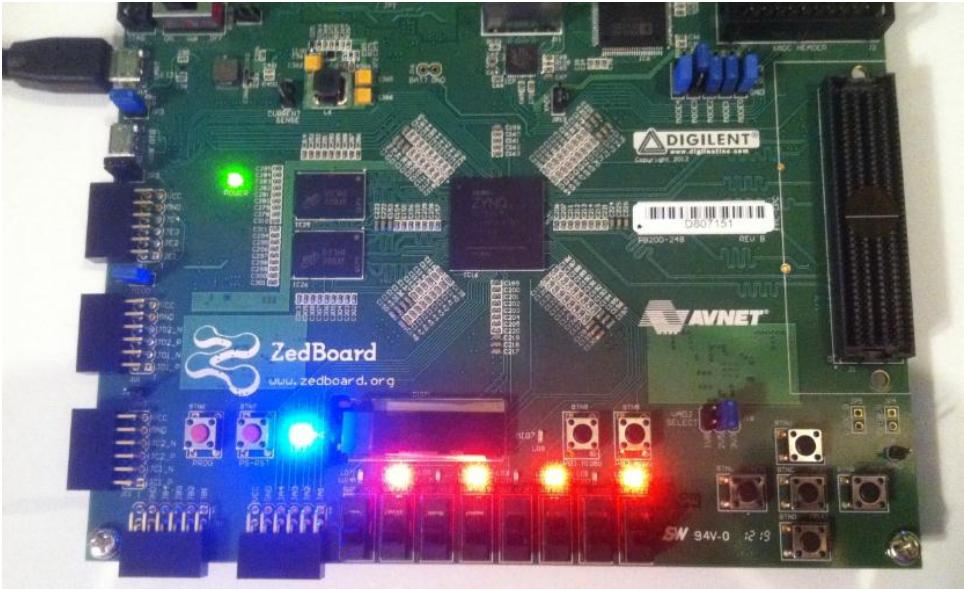

**Figure 28 – QSPI Application Example Output**

# **Appendix III: Using Linux Host PC**

The instructions in this section were completed using an Ubuntu 10.04 LTS install running on an Intel MacBook Pro but results may vary for different host machine hardware and Linux distributions.

#### Connect Terminal to ZedBoard USB-UART

The ZedBoard Cypress CY7C64225 USB-UART device is capable of enumerating as a USB tty device on most Linux hosts.

After powering on and connecting ZedBoard to the host Linux machine, search the kernel messaging with the command dmesg | grep tty and look for indication that the USB-UART is enumerated as a device. In this example, the Linux host has enumerated the ZedBoard USB-UART as the /dev/ttyACM0 device.

Using the attached USB-UART tty device, connect to the device with the minicom application. In this example, minicom is launched with the minicom –D /dev/ttyACM0 –b 115200 -8 -o command as seen in Figure 29.

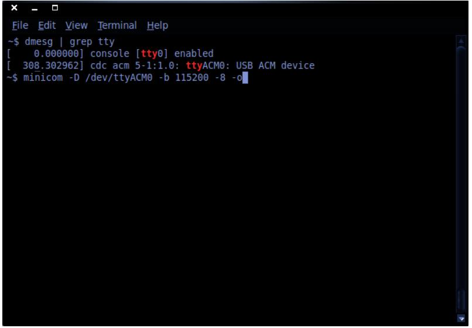

**Figure 29 – Determining the Host tty Device and Launching minicom**

The minicom terminal will connect and allow the ZedBoard terminal output to be interacted with as seen in Figure 30.

**Figure 30 – Using minicom to Interact with ZedBoard Console**

#### Connect Networking to ZedBoard USB-UART

The ZedBoard Ethernet networking is capable of interacting with most Linux hosts. To run this demo, you may have to configure the network properties on your Linux machine and assign a static IP address of 192.168.1.1 to connect to ZedBoard.

**Figure 31 – Assigning Static IP Address to Linux Host Machine**

The networking interface may need to be restarted for the IP address assignment changes to take effect. This can be done by running the ifconfig eth0 down and ifconfig eth0 up command sequences as seen in Figure 32.

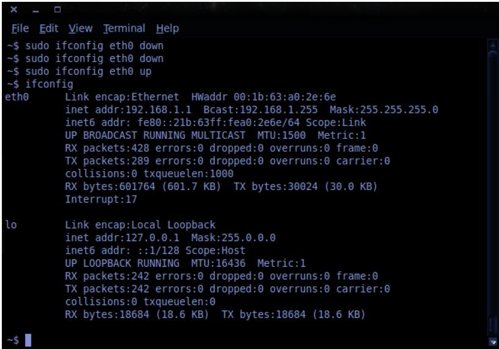

**Figure 32 – Restarting the Networking Interface**

To view the ZedBoard embedded webpage, open a web browser (such as Firefox) and browse to the ZedBoard IP address <http://192.168.1.10/> as the URL. The ZedBoard webpage should open in the browser to display as seen in Figure 33.

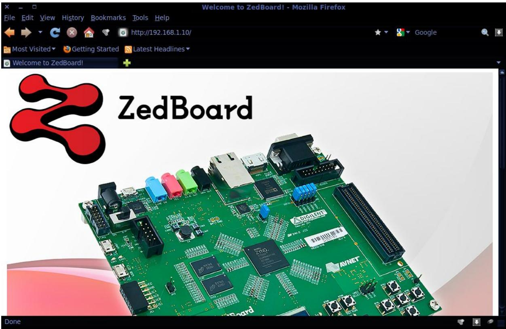

**Figure 33 – ZedBoard Webpage Shown In Host Browser**

Copyright © 2012, Avnet, Inc. All rights reserved. Published by Avnet Electronics Marketing, a group of Avnet, Inc. Avnet, Inc. disclaims any proprietary interest or right in any trademarks, service marks, logos, domain names, company names, brands, product names, or other form of intellectual property other than its own. AVNET and the AV logo are registered trademarks of Avnet, Inc.

**P/N: GS-AES-Z7EV-7Z020-G-14.1-V6**