# **ZedBoard (Zynq™Evaluation and Development) Hardware User's Guide**

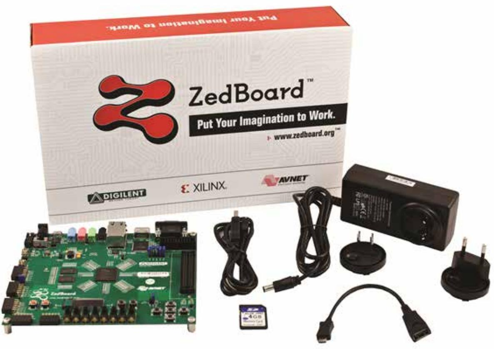

**Version 1.9 January 29th, 2013**

| 1 |        | INTRODUCTION 2                              |  |
|---|--------|---------------------------------------------|--|
|   | 1.1    | ZYNQ BANK PIN ASSIGNMENTS  4                |  |
| 2 |        | FUNCTIONAL DESCRIPTION 5                    |  |
|   | 2.1    | ALL PROGRAMMABLE SOC  5                     |  |
|   | 2.2    | MEMORY 5                                    |  |
|   | 2.2.1  | DDR3 5                                      |  |
|   | 2.2.2  | SPI Flash  8                                |  |
|   | 2.2.3  | SD Card Interface10                         |  |
|   | 2.3    | USB 11                                      |  |
|   | 2.3.1  | USB OTG11                                   |  |
|   | 2.3.2  | USB-to-UART Bridge 11                       |  |
|   | 2.3.3  | USB-JTAG 12                                 |  |
|   | 2.3.4  | USB circuit protection 13                   |  |
|   | 2.4    | DISPLAY AND AUDIO13                         |  |
|   | 2.4.1  | HDMI Output13                               |  |
|   | 2.4.2  | VGA Connector16                             |  |
|   | 2.4.3  | I2S Audio Codec 17                          |  |
|   | 2.4.4  | OLED18                                      |  |
|   | 2.5    | CLOCK SOURCES18                             |  |
|   | 2.6    | RESET SOURCES 18                            |  |
|   | 2.6.1  | Power on Reset (PS_POR_B)18 -       |  |
|   | 2.6.2  | Program Push Button Switch19                |  |
|   | 2.6.3  | Processor Subsystem Reset19                 |  |
|   | 2.7    | USER I/O 19                                 |  |
|   | 2.7.1  | User Push Buttons19                         |  |
|   | 2.7.2  | User DIP Switches19                         |  |
|   |        |                                             |  |
|   | 2.7.3  | User LEDs20                                 |  |
|   | 2.8    | 10/100/1000 ETHERNET PHY 20                 |  |
|   | 2.9    | EXPANSION HEADERS 21                        |  |
|   | 2.9.1  | LPC FMC Connector21                         |  |
|   | 2.9.2  | Digilent Pmod™ Compatible Headers (2x6)22   |  |
|   | 2.9.3  | Agile Mixed Signaling (AMS) Connector, J223 |  |
|   | 2.10   | CONFIGURATION MODES26                       |  |
|   | 2.10.1 | JTAG27                                      |  |
|   | 2.11   | POWER 28                                    |  |
|   | 2.11.1 | Primary Power Input28                       |  |
|   | 2.11.2 | On/Off Switch 28                            |  |
|   | 2.11.3 | Regulators28                                |  |
|   | 2.11.4 | Sequencing29                                |  |
|   | 2.11.5 | Power Good LED 30                           |  |
|   | 2.11.6 | Power Estimation 30                         |  |
|   | 2.11.7 | Testing 31                                  |  |
|   | 2.11.8 | Probes31                                    |  |
| 3 |        | ZYNQ-7000 AP SOC BANKS 32                   |  |
|   | 3.1    | ZYNQ-7000 AP SOC BANK VOLTAGES 33           |  |
| 4 |        | JUMPER SETTINGS34                           |  |
| 5 |        | MECHANICAL 36                               |  |

## **1 Introduction**

The ZedBoard is an evaluation and development board based on the Xilinx ZynqTM-7000 All Programmable SoC (AP SoC). Combining a dual Corex-A9 Processing System (PS) with 85,000 Series-7 Programmable Logic (PL) cells, the Zynq-7000 AP SoC can be targeted for broad use in many applications. The ZedBoard's robust mix of on-board peripherals and expansion capabilities make it an ideal platform for both novice and experienced designers. The features provided by the ZedBoard consist of:

- Xilinx® XC7Z020-1CLG484CES Zynq-7000 AP SoC
	- o Primary configuration = QSPI Flash
	- o Auxiliary configuration options
		- § Cascaded JTAG
		- § SD Card
- Memory
	- o 512 MB DDR3 (128M x 32)
	- o 256 Mb QSPI Flash
- Interfaces
	- o USB-JTAG Programming using Digilent SMT1-equivalent circuit
		- § Accesses PL JTAG
		- § PS JTAG pins connected through PS Pmod
	- o 10/100/1G Ethernet
	- o USB OTG 2.0
	- o SD Card
	- o USB 2.0 FS USB-UART bridge
	- o Five Digilent Pmod™ compatible headers (2x6) (1 PS, 4 PL)
	- o One LPC FMC
	- o One AMS Header
	- o Two Reset Buttons (1 PS, 1 PL)
	- o Seven Push Buttons (2 PS, 5 PL)
	- o Eight dip/slide switches (PL)
	- o Nine User LEDs (1 PS, 8 PL)
	- o DONE LED (PL)
- On-board Oscillators
	- o 33.333 MHz (PS)
	- o 100 MHz (PL)
- Display/Audio
	- o HDMI Output
	- o VGA (12-bit Color)
	- o 128x32 OLED Display
	- o Audio Line-in, Line-out, headphone, microphone
- Power
	- o On/Off Switch
	- o 12V @ 5A AC/DC regulator
- Software
	- o ISE® WebPACK Design Software
	- o License voucher for ChipScope™ Pro locked to XC7Z020

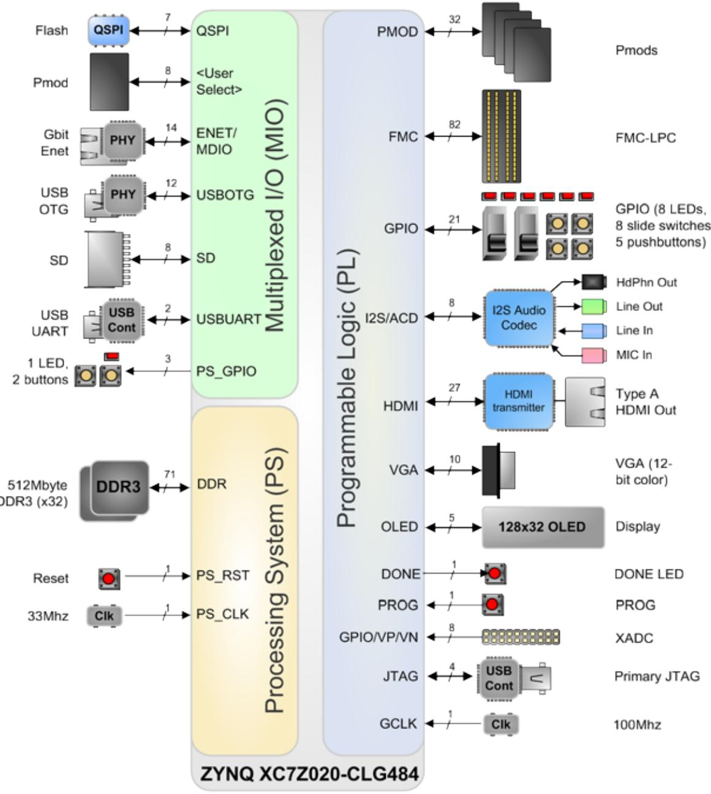

**Figure 1 – ZedBoard Block Diagram**

#### **1.1 Zynq Bank Pin Assignments**

The following figure shows the Zynq bank pin assignments on the ZedBoard followed by a table that shows the detailed I/O connections.

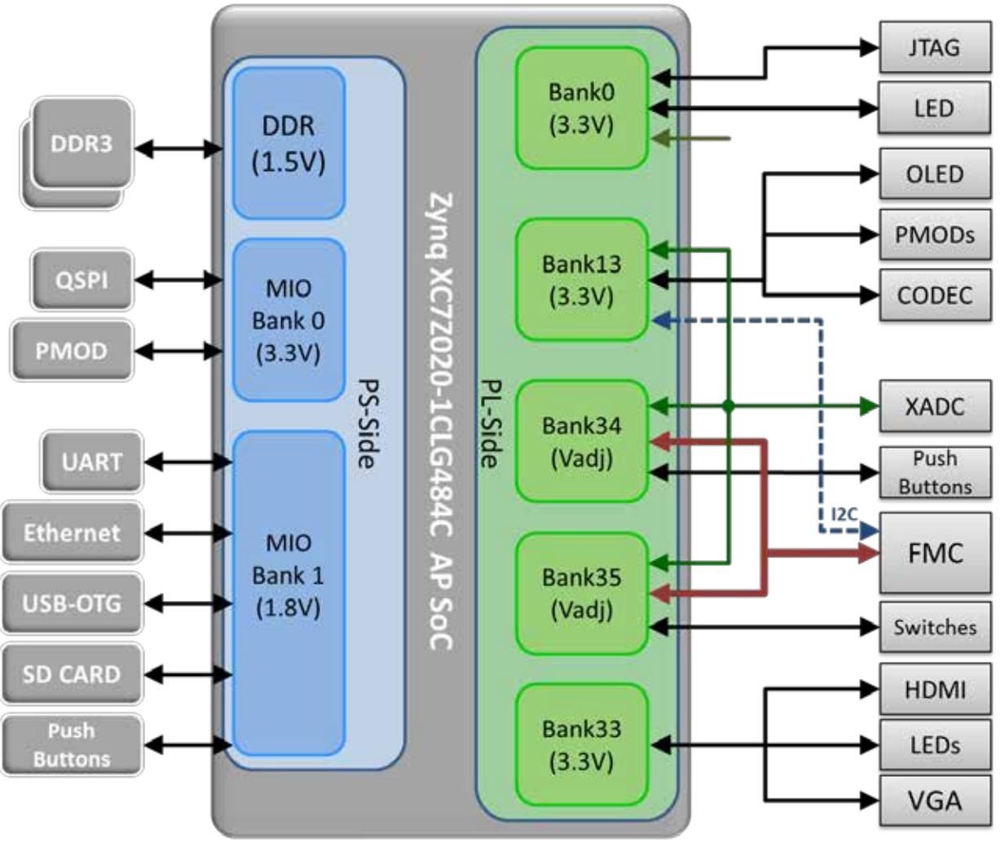

**Figure 2 - Zynq Z7020 CLG484 Bank Assignments**

# **2 Functional Description**

#### **2.1 All Programmable SoC**

The ZedBoard features a Xilinx Zynq XC7Z020-1CLG484 All Programmable SoC (AP SoC). Initial ZedBoards ship with Engineering Sample "CES" grade silicon. Later shipments will eventually switch to production "C" grade silicon once they become available. The Zynq-7000 AP SoC part markings indicate the silicon grade.

#### **2.2 Memory**

Zynq contains a hardened PS memory interface unit. The memory interface unit includes a dynamic memory controller and static memory interface modules.

#### **2.2.1 DDR3**

The ZedBoard includes two Micron MT41J128M16HA-15E:D DDR3 memory components creating a 32-bit interface. As of August 2012, this device has been marked by Micron for end-oflife. There are several options that Micron offers for a replacement. ZedBoard will likely migrate to the MT41K128M16JT-125 device, although this is pending validation. The DDR3 is connected to the hard memory controller in the Processor Subsystem (PS) as outlined in the Zynq datasheet.

The multi-protocol DDR memory controller is configured for 32-bit wide accesses to a 512 MB address space. The PS incorporates both the DDR controller and the associated PHY, including its own set of dedicated I/Os. DDR3 memory interface speeds up to 533MHz (1066Mbs) are supported.

The DDR3 uses 1.5V SSTL-compatible inputs. DDR3 Termination is utilized on the ZedBoard. The Zynq-7000 AP SoC and DDR3 have been placed close together keeping traces short and matched.

DDR3 on the PS was routed with 40 ohm trace impedance for single-ended signals, and DCI resistors (VRP/VRN) as well as differential clocks set to 80 ohms. Each DDR3 chip needs its own 240-ohm pull-down on ZQ.

DDR-VDDQ is set to 1.5V to support the DDR3 devices selected. DDR-VTT is the termination voltage which is ½ DDR-VDDQ. DDR-VREF is a separate buffered output that is equal to ½ nominal DDR-VDDQ. The DDR-VREF is isolated to provide a cleaner reference for the DDR level transitions.

The PCB design guidelines outlined in Zynq datasheet must be followed for trace matching, etc.

| Signal Name    | Description                                 | Zynq pin          | DDR3 pin     |  |
|----------------|---------------------------------------------|-------------------|--------------|--|
| DDR_CK_P       | Differential clock output               | N4                | J7           |  |
| DDR_CK_N       | Differential clock output               | N5                | K7           |  |
| DDR_CKE        | Clock enable                                | V3                | K9           |  |
| DDR_CS_B       | Chip select                                 | P6                | L2           |  |
| DDR_RAS_B      | RAS row address select                  | R5                | J3           |  |
| DDR_CAS_B      | RAS column address select               | P3                | K3           |  |
| DDR_WE_B       | Write enable                                | R4                | L3           |  |
| DDR_BA[2:0]    | Bank address                                | PS_DDR_BA[2:0]    | BA[2:0]      |  |
| DDR_A[14:0]    | Address                                     | PS_DDR_A[14:0]    | A[14:0]      |  |
| DDR_ODT        | Output dynamic termination              | P5                | K1           |  |
| DDR_RESET_B    | Reset                                       | F3                | T2           |  |
| DDR_DQ[31:0]   | I/O Data                                    | PS_DDR_[31:0]     | DDR3_DQ pins |  |
| DDR_DM[3:0]    | Data mask                                   |                   | LDM/UDM x2   |  |
| DDR_DQS_P[3:0] | I/O Differential data strobe            | PS_DDR_DQS_P[3:0] | UDQS/LDQS    |  |
| DDR_DQS_N[3:0] | I/O Differential data strobe            | PS_DDR_DQS_N[3:0] | UDQS#/LDQS#  |  |
| DDR_VRP        | I/O Used to calibrate input termination | N7                | N/A          |  |
| DDR_VRN        | I/O Used to calibrate input termination | M7                | N/A          |  |
| DDR_VREF[1:0]  | I/O Reference voltage                   | H7, P7            | H1           |  |

For best DDR3 performance, DRAM training is enabled for write leveling, read gate, and read data eye options in the PS Configuration Tool in Xilinx Platform Studio (XPS). The PS Configuration tools' Memory Configuration Wizard contains two entries to allow for DQS to Clock Delay and Board Delay information to be specified for each of the four byte lanes. These parameters are specific to every PCB design. [Xilinx Answer Record 46778](http://www.xilinx.com/support/answers/46778.htm) provides a tool for calculating these parameters by a printed circuit board design engineers. The Excel worksheet file **ar46778_board_delay_calc.xlsx** included in the answer record provides instructions in the worksheet for calculating these board training details based upon specific trace lengths for certain DDR3 signals. Using the information from the trace length reports pertaining to the DDR3 interface for ZedBoard these delay values can be recreated by following the directions found in the Excel worksheet.

The PCB lengths are contained in the ZedBoard PCB trace length reports. The DQS to CLK Delay and Board Delay values are calculated specific to the ZedBoard memory interface PCB design. The AR46778 worksheet allows for up to 4 memory devices to be configured for DDR3 4x8 flyby topology. Note that ZedBoard is configured for DDR3 2x16 flyby routing topology. The first two clock trace midpoint values (CLK0 and CLK1) are used to represent the Micron device electrically nearest to 7Z020 (IC26) and the second two clock trace midpoint values (CLK2 and

CLK3) are used to represent the Micron device electrically furthest from 7Z020 (IC25). The worksheet calculation results are shown in the following table.

| Pin Group | Length (mm) | Length (mils) | Package Length (mils) | Total Length (mils) | Propagation Delay (ps/inch) | Total Delay (ns) | DQS to CLK Delay (ns) | Board Delay (ns) |
|-----------|-----------------|-------------------|-------------------------------|-----------------------------|-------------------------------------|--------------------------|-----------------------------------|--------------------------|
| CLK0      | 55.77           | 2195.9            | 470                           | 2665.9                      | 160                                 | 0.427                    |                                   |                          |
| CLK1      | 55.77           | 2195.9            | 470                           | 2665.9                      | 160                                 | 0.427                    |                                   |                          |
| CLK2      | 41.43           | 1631.1            | 470                           | 2101.1                      | 160                                 | 0.336                    |                                   |                          |
| CLK3      | 41.43           | 1631.1            | 470                           | 2101.1                      | 160                                 | 0.336                    |                                   |                          |
| DQS0      | 51.00           | 2008.0            | 504                           | 2512.0                      | 160                                 | 0.402                    | 0.025                             |                          |
| DQS1      | 50.77           | 1998.8            | 495                           | 2493.8                      | 160                                 | 0.399                    | 0.028                             |                          |
| DQS2      | 41.59           | 1637.6            | 520                           | 2157.6                      | 160                                 | 0.345                    | -0.009                            |                          |
| DQS3      | 41.90           | 1649.4            | 835                           | 2484.4                      | 160                                 | 0.398                    | -0.061                            |                          |
| DQ[7:0]   | 50.63           | 1993.3            | 465                           | 2458.3                      | 160                                 | 0.393                    |                                   | 0.410                    |
| DQ[15:8]  | 50.71           | 1996.4            | 480                           | 2476.4                      | 160                                 | 0.396                    |                                   | 0.411                    |
| DQ[23:16] | 40.89           | 1609.9            | 550                           | 2159.9                      | 160                                 | 0.346                    |                                   | 0.341                    |
| DQ[31:24] | 40.58           | 1597.8            | 780                           | 2377.8                      | 160                                 | 0.380                    |                                   | 0.358                    |

**Table 2 - DDR3 Worksheet Calculations**

The DQS to CLK Delay fields in the PS7 DDR Configuration window should be populated using the corresponding values from the previous table.

The configuration fields of the tool may not allow you to input a negative delay value, this is a known problem with the 14.1 tools and scheduled for correction in the 14.2 tools release. In the case of DQS2 and DQS3 fields for DQS to CLK Delay, simply enter a value of zero rather than the negative delay values. This is an acceptable workaround since the calculated values are relatively close to zero and the values provided in these fields are used as initial values for the read/write training for DDR3. Keep in mind for LPDDR2 there is no write leveling, and for DDR2 there is no training whatsoever. In these memory use cases, the accuracy of the trace length info is more important. This is covered in further detail in section 10.6.8 of the [Xilinx Zynq TRM,](http://www.xilinx.com/support/documentation/user_guides/ug585-Zynq-7000-TRM.pdf)  [UG585.](http://www.xilinx.com/support/documentation/user_guides/ug585-Zynq-7000-TRM.pdf)

**Figure 3 - DQS to Clock Delay Settings**

The Board Delay fields in the PS7 DDR Configuration window should be populated using the corresponding values from the table above.

**Figure 4 - DDR3 Board Delay Settings**

#### **2.2.2 SPI Flash**

The ZedBoard features a 4-bit SPI (quad-SPI) serial NOR flash. The Spansion S25FL256S is used on this board. The Multi-I/O SPI Flash memory is used to provide non-volatile code, and data storage. It can be used to initialize the PS subsystem as well as configure the PL subsystem (bitstream). Spansion provides Spansion Flash File System (FFS) for use after booting the Zynq-7000 AP SoC.

The relevant device attributes are:

- 256Mbit
- x1, x2, and x4 support
- Speeds up to 104 MHz, supporting Zynq configuration rates @ 100 MHz o In Quad-SPI mode, this translates to 400Mbs
- Powered from 3.3V

The SPI Flash connects to the Zynq-7000 AP SoC supporting up to Quad-I/O SPI interface. This requires connection to specific pins in MIO Bank 0/500, specifically MIO[1:6,8] as outlined in the Zynq datasheet. Quad-SPI feedback mode is used, thus qspi_sclk_fb_out/MIO[8] is connected to a 20K pull-up resistor to 3.3V. This allows a QSPI clock frequency greater than FQSPICLK2.

Note: Zynq only supports 24-bit addressing, however the full capacity of the 256Mb Flash can be accessed via internal bank switching. As of now the S25FL256S is not supported in iMPACT. Note: 14.x is required for in-direct QSPI Flash Programming.

| Signal Name | Description       | Zynq Pin            | MIO | QSPI Pin |
|-------------|-------------------|---------------------|-----|----------|
| DQ0         | Data0             | A2 (Bank MIO0/500)  |     | 5        |
| DQ1         | Data1             | F6 (MIO Bank 0/500) |     | 2        |
| DQ2         | Data2             | E4 (MIO Bank 0/500) |     | 3        |
| DQ3         | Data3             | A3 (MIO Bank 0/500) | 1:6 | 7        |
| SCK         | Serial Data Clock | A4 (MIO Bank 0/500) |     | 6        |
| CS          | Chip Select       | A1 (MIO Bank 0/500) |     | 1        |
| FB Clock    | QSPI Feedback     | E5 (MIO Bank 0/500) | 8   | N/C      |

#### **Table 3 – QSPI Flash Pin Assignment and Definitions**

**Note:** The QSPI data and clock pins are shared with the Boot Mode jumpers.

Two packages can be used on the ZedBoard; SO-16 and WSON. For the WSON package, there is a heat sink slug under the package that is not connected to any signal on the PCB.

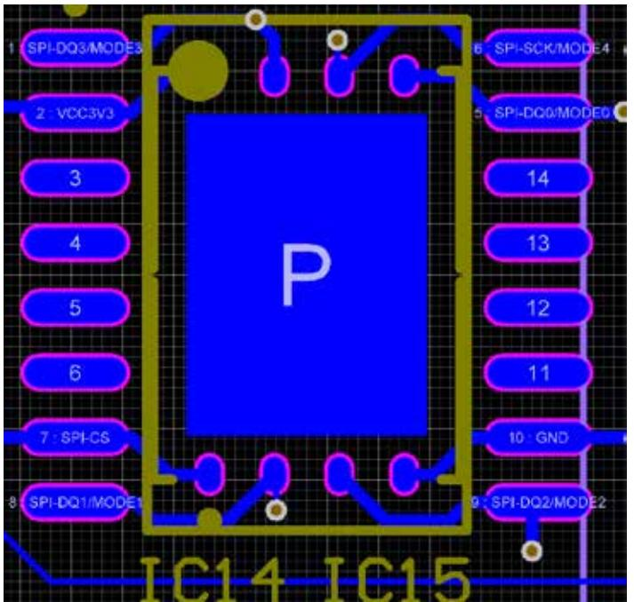

**Figure 5 - Overlying Packages for SPI Flash**

#### **2.2.3 SD Card Interface**

The Zynq PS SD/SDIO peripheral controls communication with the ZedBoard SD Card (A 4GB Class 4 card is included in the ZedBoard kit.) The SD card can be used for non-volatile external memory storage as well as booting the Zynq-7000 AP SoC. PS peripheral sd0 is connected through Bank 1/501 MIO[40-47], including, Card Detect and Write Protect.

The SD Card is a 3.3V interface but is connected through MIO Bank 1/501 (1.8V). Therefore, a TI TXS02612 level shifter performs this translation. The TXS02612 is a 2-port SDIO port expander with level translation. ZedBoard only makes use of one of these parts. TI offered an alternative TXS0206 device, but the 0.4mm pitch of that device's packaging was too fine for our manufacturer.

Based on the Zynq TRM, host mode is the only mode supported.

The ZedBoard SD Card is connected through a 9-pin standard SD card connector, J12, TE [2041021-1.](http://www.te.com/catalog/bin/TE.Connect?C=16596&M=PROP&P=&BML=&LG=1&IDS=480004,484324,484325,484336&N=1) A Class 4 card or better is recommended.

**Note:** To use the SD Card, JP6 must be shorted.

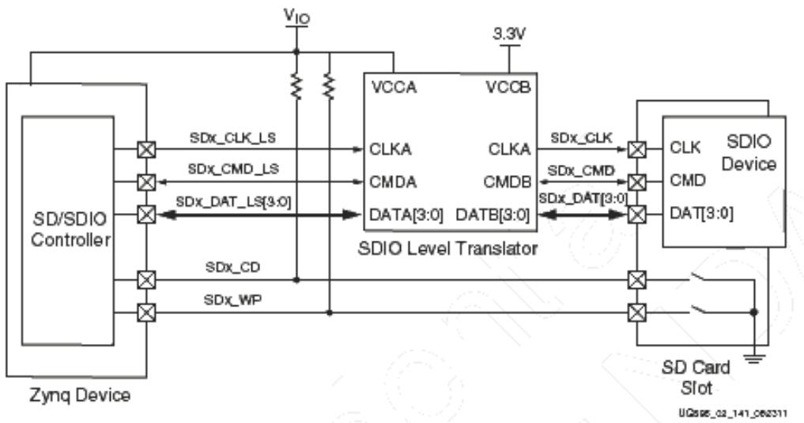

**Figure 6 - SD Card Interface**

| Signal Name | Description   | Zynq Pin                                                     | MIO   | Level Shift Pin | SD Card Pin                   |
|-----------------|---------------|--------------------------------------------------------------|-------|---------------------|-----------------------------------|
| CLK             | Clock         | E14 (MIO Bank 1/501)                                     | 40    | Pass-Thru           | 5                                 |
| CMD             | Command       | C8 ((MIO Bank 1/501)                                         | 41    | Pass-Thru           | 2                                 |
| Data[3:0]       | Data          | MIO Bank 1/501 D0: D8 D1: B11 D2: E13 D3: B9 | 42:45 | Pass-Thru           | Data Pins 7 8 9 1 |
| CD              | Card Detect   | B10 (MIO Bank 1/501)                                     | 47    | Pass-Thru           | CD                                |
| WP              | Write Protect | D12 ((MIO Bank 1/501)                                    | 46    | Pass-Thru           | WP                                |

|  |  |  |  | Table 4 – SD Card Pin Assignment and Definitions |
|--|--|--|--|--------------------------------------------------|
|--|--|--|--|--------------------------------------------------|

#### **2.3 USB**

**2.3.1 USB OTG**

*Warning: After the design of the ZedBoard was complete, a timing incompatibility between the TUSB1210 PHY and Zynq was discovered. The TUSB1210 is not recommended for new designs with Xilinx Zynq. Please refer to the ZedBoard Errata for more details.*

ZedBoard implements one of the two available PS USB OTG interfaces. An external PHY with an 8-bit ULPI interface is required. A TI TUSB1210 Standalone USB Transceiver Chip is used as the PHY. The PHY features a complete HS-USB Physical Front-End supporting speeds of up to 480Mbs. This part is available in a 32-pin QFN package. VCCio for this device is 1.8V and cannot be connected through level shifters. The PHY is connected to MIO Bank 1/501, which is powered at 1.8V. Additionally the USB chip must clock the ULPI interface which requires an oscillator. A Fox XPRESSO oscillator (767-26-31) is used on ZedBoard.

The external USB interface connects through a TE [1981584-1.](http://www.te.com/catalog/pn/en/1981584-1?RQPN=1981584-1)

The usb0 peripheral is used on the PS, connected through MIO[28-39] in MIO Bank 1/501.

This USB port will not power the board. However, ZedBoard provides 5V when in Host or OTG modes. REFCLK pin of TUSB1210 is tied to ground as the Zynq-7000 AP SoC will drive the CLOCK input of this part.

| Signal Name   | Description                                 | Zynq Pin       | MIO   | TUSB1210 Pin | USB Conn Pin |
|---------------|---------------------------------------------|----------------|-------|------------------|------------------|
| OTG_Data[8:0] | USB Data lines                              | MIO Bank 1/501 |       | Data[7:0]        | N/C              |
| OTG_CLOCK     | USB Clock                                   | MIO Bank 1/501 |       | 26               | N/C              |
| OTG_DIR       | ULPI DIR output signal                      | MIO Bank 1/501 |       | 31               | N/C              |
| OTG_STP       | ULPI STP input signal                       | MIO Bank 1/501 |       | 29               | N/C              |
| OTG_NXT       | ULPI NXT output signal                      | MIO Bank 1/501 |       | 2                | N/C              |
| OTG_CS        | USB Chip Select                             |                |       | 11               | N/C              |
| DP            | DP pin of USB Connector                     | N/C            | 28:39 | 18               | 2                |
| DM            | DM pin of USB Connector                     | N/C            |       | 19               | 3                |
| ID            | Identification pin of the USB connector | N/C            |       | 23               | 4                |
| OTG_RESET_B   | Reset                                       | MIO Bank 1/501 |       | 27               | N/C              |
| OTG_VBUS_OC   | VBus Output Control                         | Bank 34        |       | L16              | TPS2051          |

**Table 5 - USB OTG Pin Assignment and Definitions**

See the Jumper Settings section for configuring the USB interface for Host, Device and OTG mode. The jumpers control the Vbus supply as well.

#### **2.3.2 USB-to-UART Bridge**

The ZedBoard implements a USB-to-UART bridge connected to a PS UART peripheral. A Cypress CY7C64225 USB-to-UART Bridge device allows connection to a host computer. The USB/UART device connects to the USB Micro B connector, J14, (TE 1981584-1) on the board. Only basic TXD/RXD connection is implemented. If flow control is required this can be added through Extended MIO on a PL-Pmod™.

Cypress provides royalty-free Virtual COM Port (VCP) drivers which permit the CY7C64225 USBto-UART bridge to appear as a COM port to host computer communications application software

(for example, HyperTerm or Tera Term). Please refer to the CY7C64225 Setup Guide posted on zedboard.org for detailed instructions for installing the driver.

The UART 1 Zynq PS peripheral is accessed through MIO[48:49] in MIO Bank 1/501 (1.8V). Since the CY7C64225 device requires either 3.3V or 5V signaling, a TI TXS0102 level shifter is used to level shift between 3.3V and 1.8V.

This USB port will not power the board. Therefore, Vbus needs to be connected to 3.3V though a 1KΩ series resistor. The Wake pin, pin 22, connects to GND. A 24Ω series resistor was placed on each of the data lines, D+ and D-.

| UART Function in Zynq | Zynq Pin                 | MIO   | Schematic Net Name | CY7C6 Pin | UART Function in CY7C64225 |
|-------------------------------|--------------------------|-------|------------------------|-----------|--------------------------------|
| TX, data out                  | D11 (MIO Bank 1/501) |       | USB_1_RXD              | 23        | RXD, data in                   |
| RX, data in                   | C14 (MIO Bank 1/501) | 48:49 | USB_1_TXD              | 4         | TXD, data out                  |

**Table 6 – CY7C6 Connections**

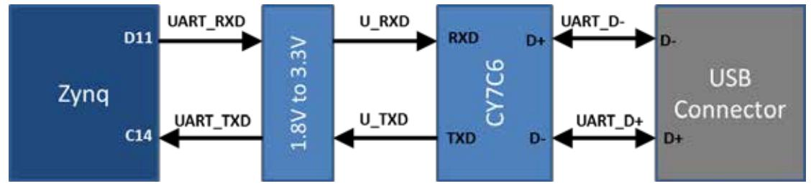

**Figure 7 – USB-UART Bridge Interface**

#### **2.3.3 USB-JTAG**

The ZedBoard provides JTAG functionality based on the Digilent USB High Speed JTAG Module, SMT1 device. This USB-JTAG circuitry is fully supported and integrated into Xilinx ISE tools, including iMPACT, ChipScope, and SDK Debugger. Designers who want to re-use this circuit on their board can do so by acquiring these modules from Avnet.

[http://www.em.avnet.com/en-us/design/drc/Pages/Digilent-JTAG-SMT1-Surface-Mount-](http://www.em.avnet.com/en-us/design/drc/Pages/Digilent-JTAG-SMT1-Surface-Mount-Programming-Module.aspx)[Programming-Module.aspx](http://www.em.avnet.com/en-us/design/drc/Pages/Digilent-JTAG-SMT1-Surface-Mount-Programming-Module.aspx)

The JTAG is available through a Micro B USB connector, J17, TE 1981568-1. TCK has a series termination resistor, 20-30Ω, to prevent signal integrity issues.

For the JTAG Chain setup, please refer to the Configuration section.

#### **2.3.4 USB circuit protection**

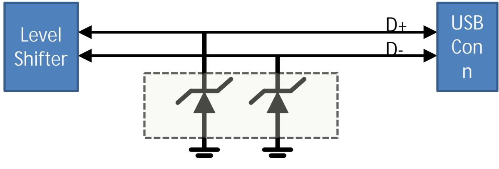

All USB data lines, D+/-, are protected with a TE SESD0402Q2UG-0020-090**.**

**Figure 8 – ESD Protection**

#### **2.4 Display and Audio**

#### **2.4.1 HDMI Output**

An Analog Devices ADV7511 HDMI Transmitter provides a digital video interface to the ZedBoard. This 225MHz transmitter is HDMI 1.4- and DVI 1.0-compatible supporting 1080p60 with 16-bit, YCbCr, 4:2:2 mode color.

The ADV7511 supports both S/PDIF and 8-channel I2S audio. The S/PDIF can carry compressed audio including Dolby® Digital, DTS®, and THX®. There is an independent DPDIF input and output. The I2S interface is not connected on ZedBoard. Analog Devices offers Linux drivers and reference designs illustrating how to interface to this device.

The HMDI Transmitter has 25 connections to Bank 35 (3.3V) of the Zynq-7000 AP SoC:

| Signal Name | Description                                                                               | Zynq pin                                                                                                                                                                                                             | ADV7511 pin                                                                                                 |
|-------------|-------------------------------------------------------------------------------------------|----------------------------------------------------------------------------------------------------------------------------------------------------------------------------------------------------------------------|-------------------------------------------------------------------------------------------------------------|
| HDP         | Hot Plug Detect signal input                                                              | N/C                                                                                                                                                                                                                  | 30                                                                                                          |
| HD-INT      | Interrupt signal output                                                                   | W16                                                                                                                                                                                                                  | 45                                                                                                          |
| HD-SCL      | I2C Interface. Supports CMOS                                                              | AA18                                                                                                                                                                                                                 | 55                                                                                                          |
| HD-SDA      | logic levels from 1.8V to 3.3V                                                            | Y16                                                                                                                                                                                                                  | 56                                                                                                          |
| HD-CLK      | Video Clock Input. Supports typical CMOS logic levels from 1.8V up to 3.3V        | W18                                                                                                                                                                                                                  | 79                                                                                                          |
| HD-VSYNC    | Vertical Sync Input (Not required if using embedded syncs)                            | W17                                                                                                                                                                                                                  | 2                                                                                                           |
| HD-HSYNC    | Horizontal Sync Input (Not required if using embedded syncs)                      | V17                                                                                                                                                                                                                  | 98                                                                                                          |
| HD-DE       | Data Enable signal input for Digital Video (Not required if using embedded syncs) | U16                                                                                                                                                                                                                  | 97                                                                                                          |
| HD_D[15:0]  | Video Data Input                                                                          | Bank 35 D0: Y13 D1: AA12 D2: AA14 D3: Y14 D4: AB15 D5: AB16 D6: AA16 D7: AB17 D8: AA17 D9: Y15 D10: W13 D11: W15 D12: V15 D13: U17 D14: V14 D15: V13 | 88 87 86 85 84 83 82 81 80 78 74 73 72 71 70 69 |
| HD-SPDIF    | Sony/Philips Digital Interface Audio Input                                            | U15                                                                                                                                                                                                                  | 10                                                                                                          |
| HD-SPDIFO   | Sony/Philips Digital Interface Audio Output                                           | Y18                                                                                                                                                                                                                  | 46                                                                                                          |

#### **Table 7 - HDMI Interface Connections**

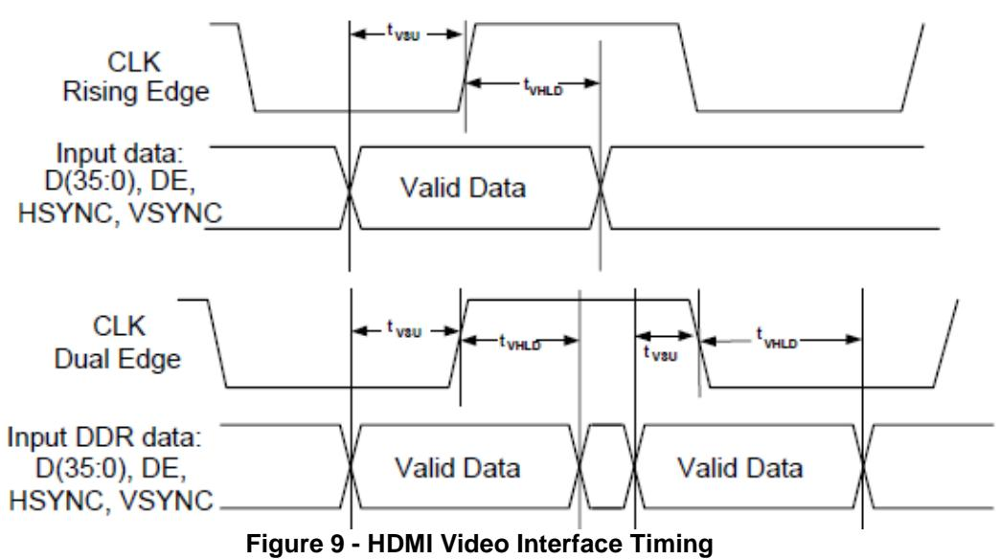

The HDMI transmitter connects externally via a HDMI Type A connector, J9, TE [1903015-1.](http://www.te.com/catalog/pn/en/1903015-1?RQPN=1903015-1)

Circuit protection for the HDMI interface is provided by a Tyco Electronics SESD0802Q4UG.

#### **2.4.2 VGA Connector**

The ZedBoard also allows 12-bit color video output through a through-hole VGA connector, TE [4-](http://www.te.com/catalog/pn/en/4-1734682-2?RQPN=4-1734682-2) [1734682-2.](http://www.te.com/catalog/pn/en/4-1734682-2?RQPN=4-1734682-2) Each color is created from resistor-ladder from four PL pins.

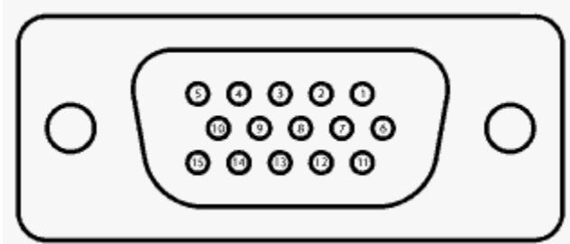

**Figure 10 - DB15**

| VGA Pin | Signal    | Description               | Zynq Pin               |
|---------|-----------|---------------------------|------------------------|
| 1       | RED       | Red video                 | V20, U20, V19, V18     |
| 2       | GREEN     | Green video               | AB22, AA22, AB21, AA21 |
| 3       | BLUE      | Blue video                | Y21, Y20, AB20, AB19   |
| 4       | ID2/RES   | formerly Monitor ID bit 2 | NC                     |
| 5       | GND       | Ground (HSync)            | NC                     |
| 6       | RED_RTN   | Red return                | NC                     |
| 7       | GREEN_RTN | Green return              | NC                     |
| 8       | BLUE_RTN  | Blue return               | NC                     |
| 9       | KEY/PWR   | formerly key              | NC                     |
| 10      | GND       | Ground (VSync)            | NC                     |
| 11      | ID0/RES   | formerly Monitor ID bit 0 | NC                     |
| 12      | ID1/SDA   | formerly Monitor ID bit 1 | NC                     |
| 13      | HSync     | Horizontal sync           | AA19                   |
| 14      | VSync     | Vertical sync             | Y19                    |
| 15      | ID3/SCL   | formerly Monitor ID bit 3 | NC                     |
|         |           |                           |                        |

|  | Table 8 - VGA Connections |
|--|---------------------------|
|--|---------------------------|

#### **2.4.3 I2S Audio Codec**

An Analog Devices ADAU1761 Audio Codec provides integrated digital audio processing to the Zynq-7000 AP SoC. It allows for stereo 48KHz record and playback. Sample rates from 8KHz to 96KHz are supported. Additionally, the ADAU1761 provides digital volume control. The Codec can be configured using Analog Devices SigmaStudio™ for optimizing audio for specific acoustics, numerous filters, algorithms and enhancements. Analog Devices provides Linux drivers for this device.

<http://www.analog.com/en/content/cu_over_sigmastudio_graphical_dev_tool_overview/fca.html>

The Codec interface to the Zynq-7000 AP SoC consists of the following connections:

| Signal Name | Description                                     | Zynq pin | ADAU1761 pin |
|-------------|-------------------------------------------------|----------|--------------|
| AC-ADR0     | I2C Address Bit 0/SPI Latch Signal          | AB1      | 3            |
| AC-ADR1     | I2C Address Bit 1/SPI Data Input            | Y5       | 30           |
| AC-MCLK     | Master Clock Input                              | AB2      | 2            |
| AC-GPIO2    | Digital Audio Bit Clock Input/Output        | AA6      | 28           |
| AC-GPIO3    | Digital Audio Left-Right Clock Input/Output | Y6       | 29           |
| AC-GPIO0    | Digital Audio Serial-Data DAC Input         | Y8       | 27           |
| AC-GPIO1    | Digital Audio Serial Data ADC Output        | AA7      | 26           |
| AC-SDA      | I2C Serial Data interface                       | AB5      | 31           |
| AC-SCK      | I2C Serial Data interface                       | AB4      | 32           |

|  |  | Table 9 - CODEC Connections |
|--|--|-----------------------------|
|--|--|-----------------------------|

The Codec connects to the following connectors:

#### **Table 10 - External Codec Connections**

| 3.5mm Audio (Mic In) Pink        | TE | 1734152-5 |
|----------------------------------|----|-----------|
| 3.5mm Audio (Line In) Light Blue | TE | 1734152-6 |
| 3.5mm Audio (Line Out) Lime      | TE | 1734152-4 |
| 3.5mm Audio (Headphone) Black    | TE | 1734152-7 |

#### **2.4.4 OLED**

An Inteltronic/Wisechip UG-2832HSWEG04 OLED Display is used on the ZedBoard. This provides a 128x32 pixel, passive-matrix, monochrome display. The display size is 30mm x 11.5mm x 1.45mm.

| Pin Number      | Symbol    | Zynq Pin | Function                                            |
|-----------------|-----------|----------|-----------------------------------------------------|
| Power Supply    |           |          |                                                     |
| 7               | VDD       | U12      | Power Supply for Logic                              |
| 6               | VSS       | N/C      | Ground of OEL System                                |
| 15              | VCC       | N/C      | Power Supply for OEL Panel                          |
| Driver          |           |          |                                                     |
| 13              | IREF      | N/C      | Current Reference for Brightness Adjustment         |
| 14              | VCOMH     | N/C      | Voltage Output High Level for COM Signal            |
| DC/DC Converter |           |          |                                                     |
| 5               | VBAT      | U11      | Power Supply for DC/DC Converter Circuit            |
| 3 / 4           | C1P / C1N | N/C      | Positive Terminal of the Flying Inverting Capacitor |
| 1 / 2           | C2P / C2N |          | Negative Terminal of the Flying Boost Capacitor     |
| Interface       |           |          |                                                     |
| 9               | RES#      | U9       | Power Reset for Controller and Driver               |
| 8               | CS#       | N/C      | Chip Select – Pulled Down on Board                  |
| 10              | D/C#      | U10      | Data/Command Control                                |
| 11              | SCLK      | AB12     | Serial Clock Input Signal                           |
| 12              | SDIN      | AA12     | Serial Data Input Signal                            |

#### **2.5 Clock sources**

The Zynq-7000 AP SoC's PS subsystem uses a dedicated 33.3333 MHz clock source, IC18, Fox 767-33.333333-12, with series termination. The PS infrastructure can generate up to four PLLbased clocks for the PL system. An on-board 100 MHz oscillator, IC17, Fox 767-100-136, supplies the PL subsystem clock input on bank 13, pin Y9.

#### **2.6 Reset Sources**

#### **2.6.1 Power**-**on Reset (PS_POR_B)**

The Zynq PS supports external power-on reset signals. The power-on reset is the master reset of the entire chip. This signal resets every register in the device capable of being reset. ZedBoard drives this signal from a comparator that holds the system in reset until all power supplies are valid. Several other IC's on ZedBoard are reset by this signal as well.

#### **2.6.2 Program Push Button Switch**

A PROG push switch, BTN6, toggles Zynq PROG_B. This initiates reconfiguring the PLsubsection by the processor.

#### **2.6.3 Processor Subsystem Reset**

Power-on reset, labeled PS_RST/BTN7, erases all debug configurations. The external system reset allows the user to reset all of the functional logic within the device without disturbing the debug environment. For example, the previous break points set by the user remain valid after system reset. Due to security concerns, system reset erases all memory content within the PS, including the OCM. The PL is also reset in system reset. System reset does not re-sample the boot mode strapping pins.

#### **2.7 User I/O**

#### **2.7.1 User Push Buttons**

The ZedBoard provides 7 user GPIO push buttons to the Zynq-7000 AP SoC; five on the PL-side and two on the PS-side.

Pull-downs provide a known default state, pushing each button connects to Vcco.

| Subsection | Zynq pin     |  |  |  |  |
|------------|--------------|--|--|--|--|
| PL         | T18          |  |  |  |  |
| PL         | R18          |  |  |  |  |
| PL         | R16          |  |  |  |  |
|            | P16          |  |  |  |  |
|            | N15          |  |  |  |  |
| PS         | D13 (MIO 50) |  |  |  |  |
| PS         | C10 (MIO 51) |  |  |  |  |
|            | PL PL    |  |  |  |  |

#### **Table 12 - Push Button Connections**

#### **2.7.2 User DIP Switches**

The ZedBoard has eight user dip switches, SW0-SW7, providing user input. SPDT switches connect the I/O through a 10kΩ resistor to the VADJ voltage supply or GND.

| Signal Name | Zynq pin |  |  |  |
|-------------|----------|--|--|--|
| SW0         | F22      |  |  |  |
| SW1         | G22      |  |  |  |
| SW2         | H22      |  |  |  |
| SW3         | F21      |  |  |  |
| SW4         | H19      |  |  |  |
| SW5         | H18      |  |  |  |
| SW6         | H17      |  |  |  |
| SW7         | M15      |  |  |  |

#### **Table 13 - DIP Switch Connections**

#### **2.7.3 User LEDs**

The ZedBoard has eight user LEDs, LD0 – LD7. A logic high from the Zynq-7000 AP SoC I/O causes the LED to turn on. LED's are sourced from 3.3V banks through 390Ω resistors.

| Signal Name | Subsection | Zynq pin  |  |  |
|-------------|------------|-----------|--|--|
| LD0         | PL         | T22       |  |  |
| LD1         | PL         | T21       |  |  |
| LD2         | PL         | U22       |  |  |
| LD3         | PL         | U21       |  |  |
| LD4         | PL         | V22       |  |  |
| LD5         | PL         | W22       |  |  |
| LD6         | PL         | U19       |  |  |
| LD7         | PL         | U14       |  |  |
| LD9         | PS         | D5 (MIO7) |  |  |

| Table 14 - LED Connections |  |
|----------------------------|--|
|----------------------------|--|

#### **2.8 10/100/1000 Ethernet PHY**

The ZedBoard implements a 10/100/1000 Ethernet port for network connection using a Marvell 88E1518 PHY. This part operates at 1.8V. The PHY connects to MIO Bank 1/501 (1.8V) and interfaces to the Zynq-7000 AP SoC via RGMII. The RJ-45 connector is a TE Connectivity 1840750-7 featuring integrated magnetics. The RJ-45 has two status indicator LEDs that indicate traffic and valid link state.

A high-level block diagram of one 10/100/1000 Ethernet interface is shown in the following figure.

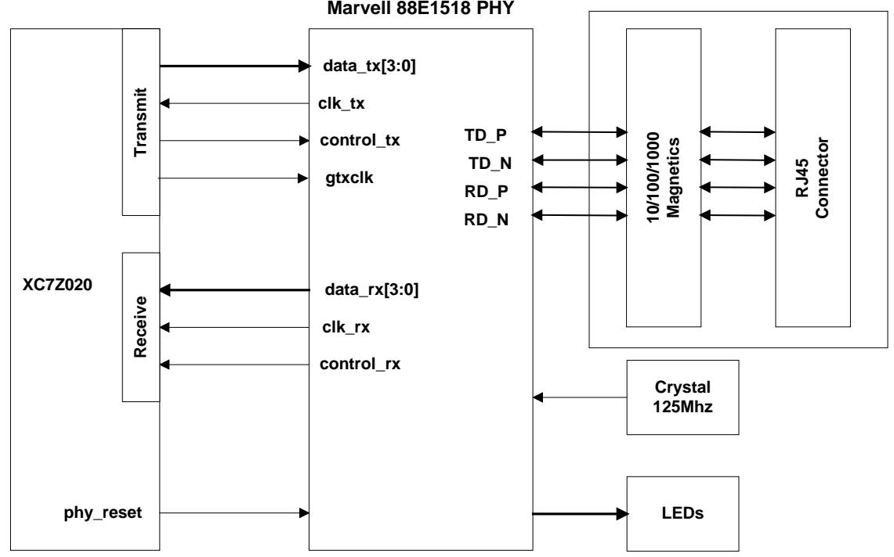

Zynq requires a voltage reference for RGMII interfaces. Thus PS_MIO_VREF, F8, is tied to 0.9V, half the bank voltage of MIO Bank 1/501.

| Signal Name | Description      | Zynq pin  | MIO   | 88E1510 pin |
|-------------|------------------|-----------|-------|-------------|
| RX_CLK      | Receive Clock    | A14       |       | 40          |
| RX_CTRL     | Receive Control  | D7        |       | 37          |
| RXD[3:0]    | Receive Data     | RXD0: E11 |       | 38          |
|             |                  | RXD1: B7  |       | 39          |
|             |                  | RXD2: F12 |       | 41          |
|             |                  | RXD3: A13 |       | 42          |
| TX_CLK      | Transmit Clock   | D6        | 16:27 | 47          |
| TX_CTRL     | Transmit Control | F11       |       | 2           |
| TXD[3:0]    | Transmit Data    | TXD0: E9  |       | 44          |
|             |                  | TXD1: A7  |       | 45          |
|             |                  | TXD2: E10 |       | 48          |
|             |                  | TXD3: A8  |       | 1           |
| MDIO        | Management Data  | C12       | 52:53 | 5           |
| MDC         | Management Clock | D10       |       | 4           |

**Table 15 – Ethernet PHY Pin Assignment and Definitions**

The datasheet for the Marvell 88E1518 is not available publicly. An NDA is required for this information. Please contact your local Avnet or Marvell representative for assistance.

### **2.9 Expansion Headers**

#### **2.9.1 LPC FMC Connector**

A single low-pin count (LPC) FMC slot is provided on the ZedBoard to support a large ecosystem of plug-in modules. The LPC FMC exposes 68 single-ended I/O, which can be configured as 34 differential pairs. The FMC interface spans over two PL I/O banks, banks 34 and 35. To meet the FMC spec, these banks are powered from an adjustable voltage set by jumper, J18. Selectable voltages include 1.8V, default, and 2.5V. It is also possible to set Vadj to 3.3V. Since 3.3V could potentially be the most damaging voltage setting for Vadj, this is not available with the default board hardware. To set Vadj to 3.3V, solder a short across the 3V3 pads at J18 or solder in an additional 1x2 header. The FMC pin out can be copied from the Master UCF, see ZedBoard.org.

**WARNING:** Before attaching a FMC Card, ensure the correct voltage is selected on jumper, J18. Failure to do so may result in damage to the FMC card and/or the ZedBoard.

Note, the following LPC FMC connections guidelines were followed:

- § **CLK_#_M2C**
	- 50 ohm single-ended impedance
	- Less than 10mil skew in P/N pair
	- Connected to GC (Global Clock) preferential or MRCC (Multi-Region) if not available
	- No length matching to any other feature
- § **LA bus**
	- 50 ohm single-ended impedance
	- Less than 10mil skew in P/N pair
	- Less than 100mil length skew across all bits in a bus
	- No restriction between LA, HA or HB
	- LA Bus 0:16 to be located in one bank
	- LA Bus 17:33 to be located in one bank
	- CC Pairs 0, 17 to be placed on MRCC pins
	- CC Pairs 1, 18 to be placed on SRCC pins
		- HB_06_CC optional placed on clock pin if available
- § To conserve Zynq pins, GA[1:0] were removed and connected to GND.

#### **2.9.2 Digilent Pmod™ Compatible Headers (2x6)**

The ZedBoard has five Digilent Pmod™ compatible headers (2x6). These are right-angle, 0.1" female headers that include eight user I/O plus 3.3V and ground signals as show in the figure below.

Four Pmod connectors interface to the PL-side of the Zynq-7000 AP SoC. These will connect to Bank 13 (3.3V). One Pmod, JE1, connects to the PS-side on MIO pins [7,9-15] in MIO Bank 0/500 (3.3V). Uses for this Pmod include PJTAG access (MIO[10-13]) as well as nine other hardened MIO peripherals (SPI, GPIO, CAN, I2C, UART, SD, QSPI, Trace, Watchdog).

The four PL Pmod connectors are placed in adjacent pairs on the board edge such that the clearance between Pin 6 of header #1 and Pin 1 of header #2 is 10mm.

Two of the Pmods, JC1 and JD1, are aligned in a dual configuration and have their I/O routed differentially to support LVDS running at 525Mbs.

All Pmod data lines, 8 per connector, are protected with two 4-channel TE SESD1004Q4UG-0020-090.

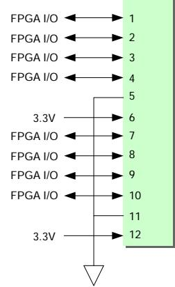

**Figure 12 - Pmod Connections**

A couple links to Pmod examples are provided:

- [http://www.em.avnet.com/en-us/design/drc/Pages/Digilent-PmodWiFi-802-11bgn-](http://www.em.avnet.com/en-us/design/drc/Pages/Digilent-PmodWiFi-802-11bgn-WiFi-Interface.aspx)[WiFi-Interface.aspx](http://www.em.avnet.com/en-us/design/drc/Pages/Digilent-PmodWiFi-802-11bgn-WiFi-Interface.aspx)
- [http://www.em.avnet.com/en-us/design/drc/Pages/Digilent-Pmod-RS232-Serial-](http://www.em.avnet.com/en-us/design/drc/Pages/Digilent-Pmod-RS232-Serial-Converter-and-Interface.aspx)[Converter-and-Interface.aspx](http://www.em.avnet.com/en-us/design/drc/Pages/Digilent-Pmod-RS232-Serial-Converter-and-Interface.aspx)

| Pmod | Signal Name | Zynq pin | Pmod | Signal Name | Zynq pin |
|------|-----------------|----------|------|-------------|----------|
| JA1  | JA1             | Y11      | JB1  | JB1         | W12      |
|      | JA2             | AA11     |      | JB2         | W11      |
|      | JA3             | Y10      |      | JB3         | V10      |
|      | JA4             | AA9      |      | JB4         | W8       |
|      | JA7             | AB11     |      | JB7         | V12      |
|      | JA8             | AB10     |      | JB8         | W10      |
|      | JA9             | AB9      |      | JB9         | V9       |
|      | JA10            | AA8      |      | JB10        | V8       |

**Table 16 - Pmod Connections**

| Pmod                 | Signal Name | Zynq pin | Pmod                 | Signal Name | Zynq pin |
|----------------------|-------------|----------|----------------------|-------------|----------|
| JC1 Differential | JC1_N       | AB6      | JD1 Differential | JD1_N       | W7       |
|                      | JC1_P       | AB7      |                      | JD1_P       | V7       |
|                      | JC2_N       | AA4      |                      | JD2_N       | V4       |
|                      | JC2_P       | Y4       |                      | JD2_P       | V5       |
|                      | JC3_N       | T6       |                      | JD3_N       | W5       |
|                      | JC3_P       | R6       |                      | JD3_P       | W6       |
|                      | JC4_N       | U4       |                      | JD4_N       | U5       |
|                      | JC4_P       | T4       |                      | JD4_P       | U6       |

| Pmod     | Signal Name | Zynq pin |
|----------|-------------|----------|
|          | JE1         | A6       |
|          | JE2         | G7       |
|          | JE3         | B4       |
| JE1      | JE4         | C5       |
| MIO Pmod | JE7         | G6       |
|          | JE8         | C4       |
|          | JE9         | B6       |
|          | JE10        | E6       |

#### **2.9.3 Agile Mixed Signaling (AMS) Connector, J2**

The XADC header provides analog connectivity for analog reference designs, including AMS daughter cards like Xilinx's AMS Evaluation Card.

The analog header is placed close to the LPC FMC header as shown. Both analog and digital IO can be easily supported for a plug in card. This allows the analog header to be easily connected to the FMC card using a short ribbon cable as shown. The analog header can also be used "stand alone" to support the connection of external analog signals.

The pin out has been chosen to provide tightly coupled differential analog pairs on the ribbon cable and to also provide AGND isolation between channels. The plug in cards which will facilitate a number of reference designs have not yet been designed so this pin out must provide a reasonable degree of freedom while also keeping resource requirements as minimal as possible.

The ZedBoard AMS header is comparable with similar connectors on the Xilinx KC705 and ZC702 boards. Any AMS plug-in cards built for those boards should be compatible with ZedBoard as well.

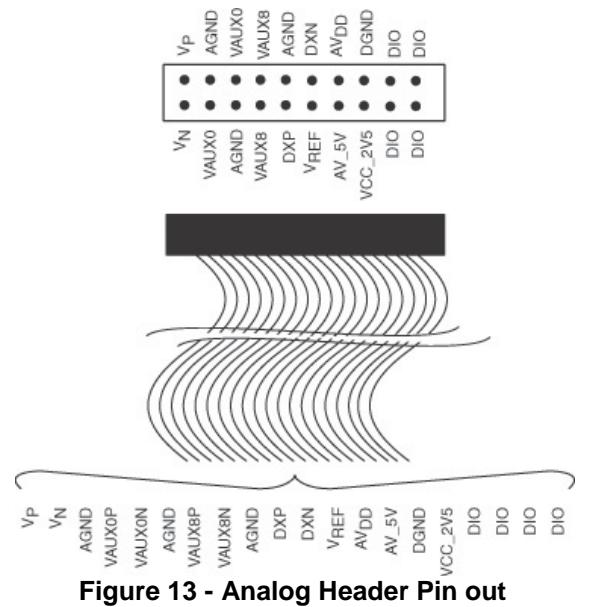

The following anti-aliasing filters were used for the XADC inputs:

- VP/VN
- VAUX0P/VAUX0N
- VAUX8P/VAUX8N

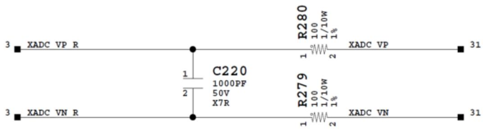

| Name          | Description                                                    | Requirement                           | XADC Header | Zynq Pin          |
|---------------|----------------------------------------------------------------|---------------------------------------|-----------------|-------------------|
| VP/VN         | Two pins required. Dedicated pins on the 7 series package. | 1V peak-to peak input             | 1               | XADC-VN-R : M12   |
|               | This is the dedicated analog                                   | maximum                               | 2               | XADC-VP-R : L11   |
|               | input channel for the ADC(s).                                  |                                       |                 |                   |
|               | Two pins required. Auxiliary analog input channel 0. Two   | 1V peak-to peak input             |                 |                   |
|               | dedicated channels needed for                                  | maximum                               |                 |                   |
| VAUX0P/VAUX0N | simultaneous sampling                                          |                                       | 6               | XADC-AD0N-R : E16 |
|               | applications. Should also                                      |                                       | 3               | XADC-AD0P-R : F16 |
|               | support use as IO inputs by                                    |                                       |                 |                   |
|               | disconnection of anti-alias cap                                |                                       |                 |                   |
|               | see                                                            |                                       |                 |                   |
|               | Two pins required. Auxiliary                                   | 1V peak-to                            |                 |                   |
|               | analog input channel 8. Two                                    | peak input                            |                 |                   |
|               | dedicated channels needed for                                  | maximum                               |                 |                   |
|               | simultaneous sampling                                          |                                       | 7               | XADC-AD8N-R : D17 |
| VAUX8P/VAUX8N | applications. Should also                                      |                                       | 8               | XADC-AD8P-R : D16 |
|               | support use as IO inputs by                                    |                                       |                 |                   |
|               | disconnection of anti-alias cap                                |                                       |                 |                   |
|               | see                                                            |                                       |                 |                   |
|               | Two pins required. Access to                                   |                                       | 12              | XADC-DXN : N12    |
| DXP/DXN       | thermal Diode                                                  |                                       | 9               | XADC-DXP : N11    |
|               | Three pins required. Analog                                    |                                       | 4               |                   |
| AGND          | ground reference GNDADC.                                       |                                       | 5               |                   |
|               | Analog channel isolation                                       |                                       | 10              |                   |
| VCCADC        | One pin. This is the analog 1.8V supply for XADC.          | 1.8V ±5% @150mA max               | 14              |                   |
| VREF          | One pin. This is the 1.25V reference from the board.       | 1.25V ±0.2% 50ppm/ºC @5mA max | 11              |                   |
| AV_5V         | Filtered 5V supply from board.                                 | 5V ±5% @150mA max                 | 13              |                   |
| GPIO          |                                                                | Voltage set by                        | G0: 18          | H15               |
|               |                                                                | Vadj                                  | G1: 17          | R15               |
|               | General Purpose I/O                                            |                                       | G2: 20          | K15               |
|               |                                                                |                                       | G3: 19          | J15               |
|               |                                                                | 1.8V, 2.5V,                           |                 |                   |
| Vadj          | Adjustable Voltage, set by J18                                 | 3.3V                                  |                 |                   |

#### **Table 17 - Analog Header Pin Out**

#### **2.10 Configuration Modes**

Zynq-7000 AP SoC devices use a multi-stage boot process that supports both non-secure and secure boot (note that secure boot is not supported for CES silicon.) The PS is the master of the boot and configuration process. The following table shows the Zynq configuration modes. Upon reset, the device mode pins are read to determine the primary boot device to be used: NOR, NAND, Quad-SPI, SD Card or JTAG.

By default, the ZedBoard uses the SD Card configuration mode. The boot mode pins are MIO[8:2] and are used as follows:

- MIO[2]/Boot_Mode[3] sets the JTAG mode
- MIO[5:3]/Boot_Mode[2:0] select the boot mode
- MIO[6]/Boot_Mode[4] enables the internal PLL
- MIO[8:7]/Vmode[1:0] are used to configure the I/O bank voltages, however these are fixed on ZedBoard and not configurable

The ZedBoard provides jumpers for MIO[6:2]. These are 1x3 jumpers connected as shown below. All mode pins can be pulled high or low through a 20 KΩ resistor.

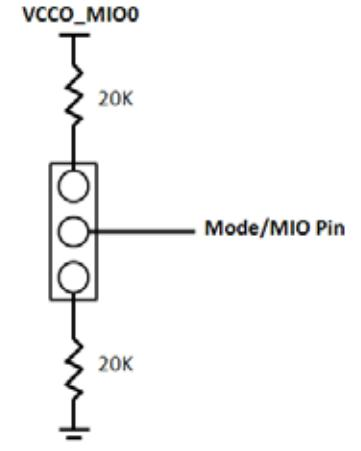

**Figure 15 - Configuration Mode Jumpers**

These jumpers allow users to change the mode options, including using cascaded JTAG configuration as well as using the internal PLL.

As noted above, the VMODE pins are strapped permanently to set Bank 500 and 501 voltages to 3.3V and 1.8V. These are not jumper selectable.

The PS boot mode selections are shown in the table below, default setting highlighted in yellow:

|               | MIO[6]       | MIO[5]       | MIO[4]       | MIO[3]       | MIO[2]       |  |
|---------------|--------------|--------------|--------------|--------------|--------------|--|
| Xilinx TRMà   | Boot_Mode[4] | Boot_Mode[0] | Boot_Mode[2] | Boot_Mode[1] | Boot_Mode[3] |  |
|               | JTAG Mode    |              |              |              |              |  |
| Cascaded      |              |              |              |              | 0            |  |
| JTAG          |              |              |              |              |              |  |
| Independent   |              |              |              |              |              |  |
| JTAG          |              |              |              |              | 1            |  |
|               | Boot Devices |              |              |              |              |  |
| JTAG          |              | 0            | 0            | 0            |              |  |
| Quad-SPI      |              | 1            | 0            | 0            |              |  |
| SD Card       |              | 1            | 1            | 0            |              |  |
| PLL Mode      |              |              |              |              |              |  |
| PLL Used      | 0            |              |              |              |              |  |
| PLL           |              |              |              |              |              |  |
| Bypassed      | 1            |              |              |              |              |  |
| Bank Voltages |              |              |              |              |              |  |
| MIO Bank 500  |              |              | 3.3V         |              |              |  |
|               | MIO Bank 501 |              | 1.8V         |              |              |  |

Expected configuration time using a 50MB/s QSPI flash is 250ms.

PUDC_B is pulled high on ZedBoard but can be pulled low via JP5. This active-low input enables internal pull-ups during configuration on all SelectIO pins

A push button labeled "PROG" is connected to the Zynq PROG pin, T11, and pulled up. Pushing the button connects PROG to ground. Pushing this button will clear the PL configuration memory, effectively resetting the entire PL subsection. The PS is responsible for reconfiguring the PL. Zynq will not automatically reconfigure the PL as in standard FPGAs. The user software application must reprogram the PL. An interrupt will indicate a change in the devcfg.INT_STS register and the configuration pin status can be read from the devcfg.STATUS register. When configuration is complete, a blue LED, LD12, labeled DONE, will light.

#### **2.10.1 JTAG**

As an alternative to using the onboard USB-JTAG interface, the ZedBoard provides traditional Platform Cable JTAG connector, J15, for use with Xilinx Platform Cables and Digilent JTAG HS1 Programming Cables. The JTAG Chain is constructed as follows:

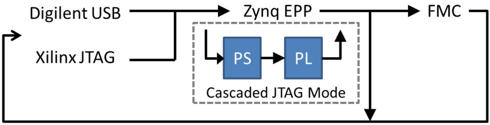

**Figure 16 - ZedBoard JTAG Chain**

ZedBoard automatically adds the FMC into the JTAG chain when an FMC card is plugged into the board via the FMC-PRSNT signal.

#### **2.11 Power**

#### **2.11.1 Primary Power Input**

The board's primary input is through a 12V barrel jack. A compatible AC/DC converter will have a 2.5mm inner diameter, 5.5mm outer diameter, center positive connection.

The total power budget is based on 4A from an AC/DC wall wart supply. This rail is protected with a TE [0603SFF600F/24-2.](http://www.te.com/catalog/pn/en/F97778-000?RQPN=0603SFF600F%2F24-2)

A 10mΩ, 1W current sense resistor exists in series with the 12V input power supply. Header J21 straddles this resistor to measure the voltage across this resistor for calculating ZedBoard power. Power is the measured voltage squared divided by the 10mΩ resistance.

#### **2.11.2 On/Off Switch**

ZedBoard includes an On/Off switch, SW8, to gate 12V. . When SW8 is in the OFF position, 12V is disconnected from the board.

#### **2.11.3 Regulators**

The following Maxim power solution provides the power rails of the ZedBoard.

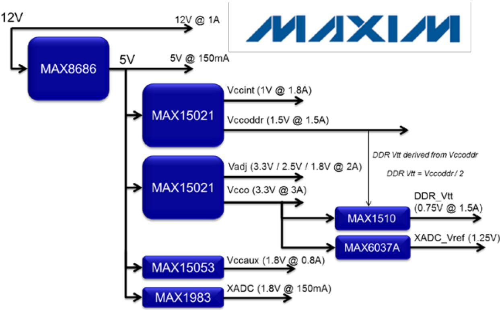

**Figure 17 - Maxim Power Solution**

The table below shows the minimum required voltage rails, currents, and tolerances.

| Voltage (V)                                                    | Current (A) | Tolerance      |
|----------------------------------------------------------------|-------------|----------------|
| 1.0 (Vccint)                                                   | 1.3         | 5.00%          |
| 1.5 (Vccoddr)                                                  | 1.5         | 5.00%          |
| 1.8 (Vccaux)                                                   | 0.8         | 5.00%          |
| 1.8, 2.5, 3.3 (jumper adjustable, 2.5V default) (Vadj) | 2           | 5.00%          |
| 3.3 (Vcco/FMC/Pmod)                                            | 3           | 5.00%          |
| 1.8 (analog) (Vccadc)                                          | 0.15        | 5.00%          |
| 1.25 reference (Vrefp)                                         | 0.005       | 0.2%, 50ppm/ºC |
| 0.75 (DDR3 Vtt)                                                | 1.5         | 5.00%          |
| 5.0 (Filtered for XADC)                                        | 0.15        | 5.00%          |

**Table 19 - TPS65708 Connections**

#### **2.11.4 Sequencing**

Sequencing for the power supplies follows the recommendations for the Zynq device. PS and PL INT and AUX supplies are tied together on the ZedBoard platform to create a low cost design. The following diagram illustrates the supply sequencing:

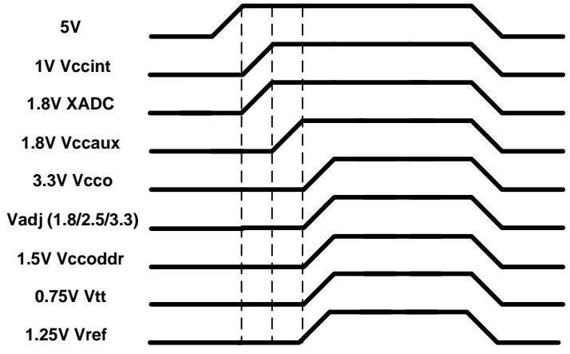

**Figure 18 - Power Sequencing**

In addition to the sequencing, a power on reset circuit is used to hold the board in reset until all power supplies have reached their regulation point.

#### **2.11.5 Power Good LED**

A green status LED, LD13, indicates when power is good on the board. Power Good is wired with the Resets and PROG to prevent operation of the board when power is not good.

#### **2.11.6 Power Estimation**

The Power estimation chart is shown below.

| Feature                       | Part Number             | MFG       | Bank      | 1.0V | 1.5V | 1.8V | Vadj | 3.3V |
|-------------------------------|-------------------------|-----------|-----------|------|------|------|------|------|
| Zynq-7000 AP SoC PS           | Z7020-CLG484            | Xilinx    |           | 600  | 250  | 150  |      | 150  |
| Zynq-7000 AP SoC PL           | Z7020-CLG484            | Xilinx    |           | 1200 |      | 300  |      | 50   |
| DDR3                          | MT41K128M16HA 15E:D | Micron    | VCCO_DDR  |      | 425  |      |      |      |
| DDR3 Termination              |                         |           |           |      | 360  |      |      |      |
| QSPI Flash                    | S25FL256S Vcc           | Spansion  |           |      |      |      |      | 100  |
| QSPI Flash                    | S25FL256S Vio           | Spansion  | VCCO_MIO0 |      |      |      |      | 2    |
| 10/100/1000 PHY               | 88E1518 internal        | Marvell   |           | 72   |      | 63   |      | 50   |
| 10/100/1000 PHY               | 88E1518 Vddo            | Marvell   | VCCO_MIO1 |      |      | 27   |      |      |
| USB 2.0 OTG PHY               | TUSB1210                | TI        | VCCO_MIO1 |      |      | 30   |      | 30   |
| HDMI Transmitter              | ADV7511                 | ADI       |           |      |      | 181  |      | 0    |
| Audio Codec                   | ADAU1761                | ADI       |           |      |      |      |      | 58   |
| OLED                          | UG-2832HSWEG04          | Univision |           |      |      |      |      | 28   |
| Clock                         | F4100                   | Fox       |           |      |      |      |      | 40   |
| USB JTAG                      | SMT1                    | Digilent  |           |      |      |      |      | 110  |
| UART to USB                   | CY7C64225               | Cypress   | VCCO_MIO1 |      |      |      |      | 26   |
| SD Card                       |                         |           | VCCO_MIO1 |      |      |      |      | 100  |
| PS User LED (green)           |                         |           | VCCO_MIO0 |      |      |      |      | 5    |
| PL User LEDs (green) x8   |                         |           |           |      |      |      |      | 40   |
| PS User PB x2                 |                         |           | VCCO_MIO0 |      |      |      |      | 0    |
| PL User PBs x5                |                         |           |           |      |      |      |      | 0    |
| PL User Slide Switches x8 |                         |           |           |      |      |      |      | 0    |
| Status LEDs (amber) x4?   |                         |           |           |      |      |      |      | 20   |
| DONE LED (blue)               |                         |           |           |      |      |      |      | 5    |
| PS Pmod                       | TE 5-534206-6           | TE        | VCCO_MIO0 |      |      |      |      |      |
| PL Pmod #1                    | TE 5-534206-6           | TE        |           |      |      |      |      |      |
| PL Pmod #2                    | TE 5-534206-6           | TE        |           |      |      |      |      |      |
| PL Pmod #3                    | TE 5-534206-6           | TE        |           |      |      |      |      | 3000 |
| PL Pmod #4                    | TE 5-534206-6           | TE        |           |      |      |      |      |      |
| FMC-LPC                       |                         |           |           |      |      |      | 2000 |      |
| Total                         |                         |           |           | 1872 | 1035 | 751  | 2000 | 3814 |
|                               |                         |           |           | 1.0  | 1.5  | 1.8  | 2.5  | 3.3  |

#### **Table 20 – Current Usage Estimations, in mA**

#### **2.11.7 Testing**

The power circuitry has been tested to verify compliance with the Zynq power requirements, such as:

- Tolerance
	- o 1.0V Vccint à 0.95 to 1.05V
	- o Vccaux à +/- 5%
	- o Vcco à +/-5%
- Ramp time
	- o 0.20 to 50ms
	- o In-rush current must be controlled so the power circuitry is not overloaded at start-up
- Monotonicity
- o No negative dips in Vccint or Vccaux power-up ramps
- Sequencing
- o Verify sequencing responds as expected based on design
- Refer to Zynq Datasheet for the latest requirements

#### **2.11.8 Probes**

Two ground test point are available on the board, J3 and J4. This allows easy access to attach ground leads of two scope probes to the board without having to locate GND pins on a header.

# **3 Zynq-7000 AP SoC Banks**

The following figure and table show Zynq CLG484 I/O bank assignments on the Zynq board.

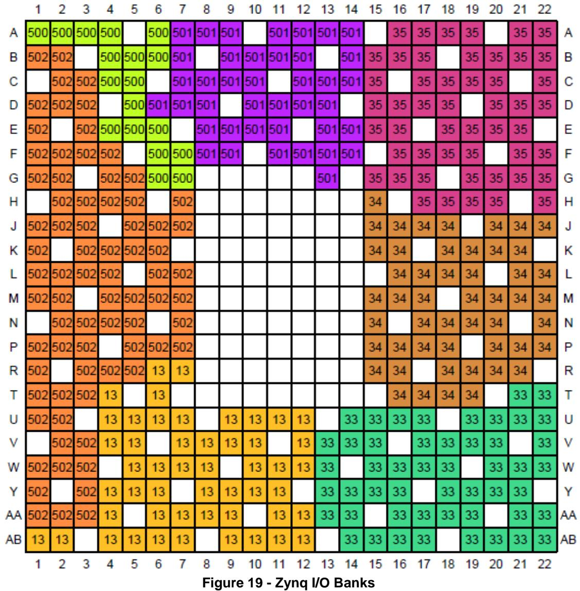

#### **3.1 Zynq-7000 AP SoC Bank Voltages**

| PS-Side        |                   |  |  |  |
|----------------|-------------------|--|--|--|
| Bank           | Voltage (default) |  |  |  |
| MIO Bank 0/500 | 3.3V              |  |  |  |
| MIO Bank 1/501 | 1.8V              |  |  |  |
| DDR            | 1.5V              |  |  |  |
| PL-Side        |                   |  |  |  |
| Bank0          | 3.3V              |  |  |  |
| Bank 13        | 3.3V              |  |  |  |
| Bank 33        | 3.3V              |  |  |  |
| Bank 34        | Vadj (2.5V)       |  |  |  |
| Bank 35        | Vadj (2.5V)       |  |  |  |

**Note:** Banks 34 and 35 are powered from an adjustable voltage rail. Jumper, J18, selects this voltage. Selectable voltages include 1.8V, 2.5V and 3.3V. The 3.3V jumper was intentionally unpopulated on ZedBoard as these banks primarily connect to the FMC interface and many FMC cards are only 1.8V and 2.5V compatible. Connecting 3.3V to these cards can damage them, so leaving this jumper unpopulated reduces the risk of damaging FMC cards.

# **4 Jumper Settings**

| Ref Designator | Description                    | Default Setting                   | Function                                                                                                                                                                                                                  |  |
|----------------|--------------------------------|-----------------------------------|---------------------------------------------------------------------------------------------------------------------------------------------------------------------------------------------------------------------------|--|
| JP1            | Microphone Input Bias          | Open – No Electret Microphone | Short to enable Bias Voltage for Electret Microphone. Right Channel only.                                                                                                                                     |  |
| JP2            | Vbus 5V Enable                 | Open – 5V Disconnected        | Short to enable 5V output to USB OTG Connector, J13, for either Host or OTG modes.                                                                                                                        |  |
| JP3            | USB Vbus Capacitor Setting | Open – Device Mode            | Short for Host mode (>120uF). Open for Device or OTG modes (4.7uF).                                                                                                                                           |  |
| JP4            | CFGBVS Select                  | Not Populated                     | Pre-configuration I/O standard type for the dedicated configuration bank 0. Vcco_0 is 3.3V, Connected to 3.3V through a 10K resistor. This jumper connects to GND and should NOT be used. |  |
| JP5            | PUDC Select                    | Not Populated                     | Active Low input enables internal pull-ups during configuration on all SelectIO pins. Connected to Vadj through 10K resistor.                                                                         |  |
| JP6            | PS_MIO0 Pull-Down              | Short                             | Install for SD Card boot on CES silicon.                                                                                                                                                                              |  |
| JP7            | Boot_Mode[3]/MIO[2]            | GND – Cascaded JTAG           | JTAG Mode. GND cascades PS and PL JTAG chains. VCC makes JTAG chains independent.                                                                                                                         |  |
| JP8            | Boot_Mode[0]/MIO[3]            | 110 – SD Card                     | Boot Device Select                                                                                                                                                                                                        |  |
| JP9            | Boot_Mode[1]/MIO[4]            |                                   | See Zynq Configuration                                                                                                                                                                                                    |  |
| JP10           | Boot_Mode[2]/MIO[5]            |                                   | Modes                                                                                                                                                                                                                     |  |
| JP11           | Boot_Mode[4]/MIO[6]            | GND – PLL Used                    | PLL Select. GND uses PS PLLs. VCC bypasses internal PS PLLs                                                                                                                                                   |  |
| JP12           | XADC Ferrite Bead Disable  | Open                              | Short bypasses XADC GND ferrite bead connection to board GND.                                                                                                                                                 |  |
| JP13           | JTAG PS-RST                    | Open                              | Short connects JTAG PROG-RST to PS Reset.                                                                                                                                                                         |  |
| J18            | Vadj Select                    | 1.8V                              | Selects Vadj (1.8V, 2.5V, or 3.3V)                                                                                                                                                                                    |  |

**Table 22 - Jumper Settings**

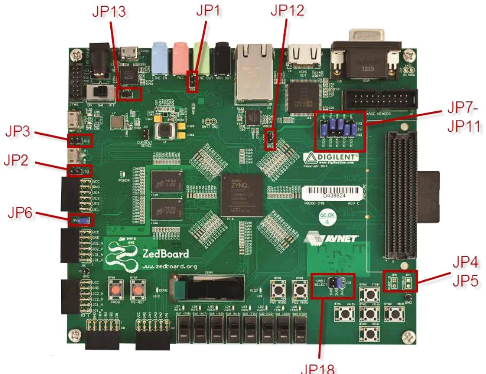

**Figure 20 - ZedBoard Jumper Map**

# **5 Mechanical**

The ZedBoard measures 6.3"x6.3".

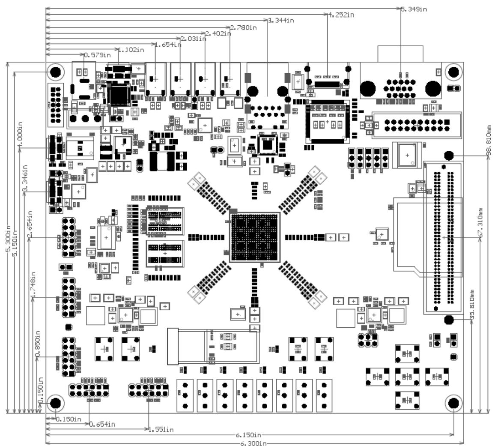

**Figure 21 - ZedBoard Mechanical**

# **Revision History**

| Rev date | Rev # | Reason for change                                                                                                    |
|----------|-------|----------------------------------------------------------------------------------------------------------------------|
| 8/1/12   | 1.0   | Initial ZedBoard User's Guide                                                                                        |
| 8/2/12   | 1.1   | Mapped Configuration Mode Table to match ZedBoard layout                                                             |
| 8/14/12  | 1.2   | Added MIO Pins and Peripheral Tables; Updated Reset Section; Updated Block Diagram                               |
| 8/15/12  | 1.3   | Updated Part Package numbering; Matched Xilinx Trademarks                                                            |
| 8/30/12  | 1.4   | Updated Board Images to Rev. C.1; Updated DDR3 section                                                               |
| 9/4/12   | 1.5   | Corrected package information in ZedBoard Block Diagram (fig. 1); Added note regarding connecting multiple Pmods |
| 9/5/12   | 1.6   | Fixed error in Pmod Pinout Table                                                                                     |
| 1/17/13  | 1.7   | Added TI USB OTG PHY design advisory notice                                                                          |
| 1/18/13  | 1.8   | Added LD9 to docs; Updated Default Jumper Table; Updated Configuration Modes Table                               |
| 1/29/13  | 1.9   | Replaced RJ-45 184808-7 (obsolete) with 1840750-7                                                                    |

