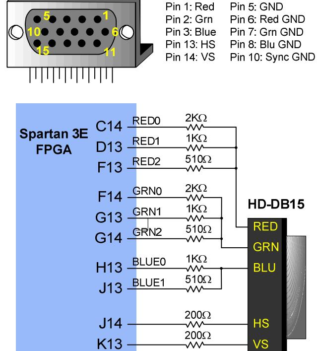
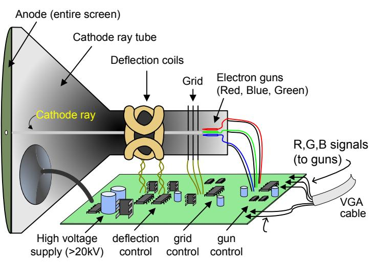
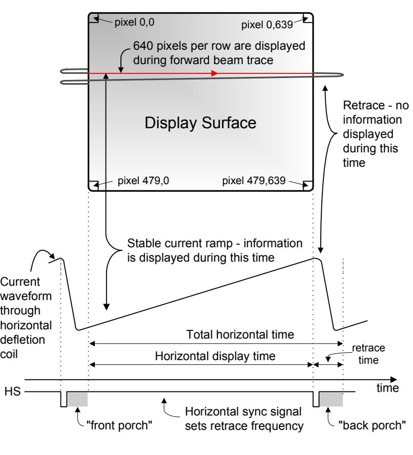
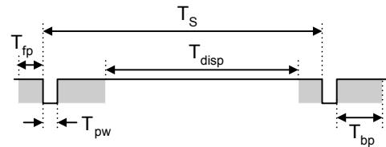
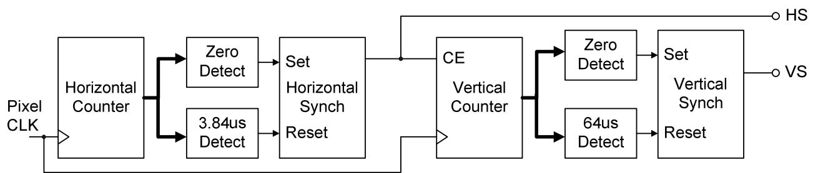

www.digilentinc.com

## **VGA Port**

The Basys2 board uses 10 FPGA signals to create a VGA port with 8-bit color and the two standard sync signals (HS – Horizontal Sync, and VS – Vertical Sync). The color signals use resistor-divider circuits that work in conjunction with the 75-ohm termination resistance of the VGA display to create eight signal levels on the red and green VGA signals, and four on blue (the human eye is less sensitive to blue levels). This circuit, shown in figure 13, produces video color signals that proceed in equal increments between 0V (fully off) and 0.7V (fully on). A video controller circuit must be created in the FPGA to drive the sync and color signals with the correct timing in order to produce a working display system.

## VGA System Timing

VGA signal timings are specified, published, copyrighted and sold by the VESA organization (www.vesa.org). The following VGA system timing information is provided as an example of how a VGA monitor might be driven in 640 by 480 mode. For more precise information, or for

**Figure 13. VGA pin definitions and Basys2 circuit** 

information on other VGA frequencies, refer to documentation available at the VESA website.

CRT-based VGA displays use amplitude-modulated moving electron beams (or cathode rays) to display information on a phosphor-coated screen. LCD displays use an array of switches that can impose a voltage across a small amount of liquid crystal, thereby changing light permittivity through the crystal on a pixel-by-pixel basis. Although the following description is limited to CRT displays, LCD

displays have evolved to use the same signal timings as CRT displays (so the "signals" discussion below pertains to both CRTs and LCDs). Color CRT displays use three electron beams (one for red, one for blue, and one for green) to energize the phosphor that coats the inner side of the display end of a cathode ray tube (see illustration). Electron beams emanate from "electron guns" which are finely-pointed heated cathodes placed in close proximity to a positively charged annular plate called a "grid". The electrostatic force imposed by the grid pulls rays of energized electrons from the cathodes, and those rays are fed by the current that flows into the cathodes. These particle rays are initially accelerated towards the grid, but they soon fall under the influence of the much larger electrostatic force that results from the

**Figure 14. CRT deflection system** 

entire phosphor-coated display surface of the CRT being charged to 20kV (or more). The rays are focused to a fine beam as they pass through the center of the grids, and then they accelerate to impact on the phosphor-coated display surface. The phosphor surface glows brightly at the impact point, and it continues to glow for several hundred microseconds after the beam is removed. The larger the current fed into the cathode, the brighter the phosphor will glow.

Between the grid and the display surface, the beam passes through the neck of the CRT where two coils of wire produce orthogonal electromagnetic fields. Because cathode rays are composed of charged particles (electrons), they can be deflected by these magnetic fields. Current waveforms are passed through the coils to produce magnetic fields that interact with the cathode rays and cause them to transverse the display surface in a "raster" pattern, horizontally from left to right and vertically from top to bottom. As the cathode ray moves over the surface of the display, the current sent to the electron guns can be increased or decreased to change the brightness of the display at the cathode ray impact point.

Information is only displayed when the beam is moving in the "forward" direction (left to right and top to bottom), and not during the time the beam is reset back to the left or top edge of the display. Much of the potential display time is therefore lost in "blanking" periods when the beam is reset and stabilized to begin a new horizontal or vertical display pass. The size of the beams, the frequency at which the beam can be traced across the display, and the frequency at which the electron beam can be modulated determine the display resolution. Modern VGA displays can accommodate different

resolutions, and a VGA controller circuit dictates the resolution by producing timing signals to control the raster patterns. The controller must produce synchronizing pulses at 3.3V (or 5V) to set the frequency at which current flows through the deflection coils, and it must ensure that video data is applied to the electron guns at the correct time. Raster video displays define a number of "rows" that corresponds to the number of horizontal passes the cathode makes over the display area, and a number of "columns" that corresponds to an area on each row that is assigned to one "picture element" or pixel. Typical displays use from 240 to 1200 rows and from 320 to 1600 columns. The overall size of a display and the number of rows and columns determines the size of each pixel.

Video data typically comes from a video refresh memory, with one or more bytes assigned to each pixel location (the Basys2 uses three bits per pixel). The controller must index into video memory as the beams move

**Figure 15. VGA system signals** 

across the display, and retrieve and apply video data to the display at precisely the time the electron beam is moving across a given pixel.

A VGA controller circuit must generate the HS and VS timings signals and coordinate the delivery of video data based on the pixel clock. The pixel clock defines the time available to display one pixel of information. The VS signal defines the "refresh" frequency of the display, or the frequency at which all information on the display is redrawn. The minimum refresh frequency is a function of the display's phosphor and electron beam intensity, with practical refresh frequencies falling in the 50Hz to 120Hz range. The number of lines to be displayed at a given refresh frequency defines the horizontal "retrace" frequency. For a 640-pixel by 480-row display using a 25MHz pixel clock and 60 +/-1Hz refresh, the signal timings shown in the table at right

| Symbol    | Parameter    | Vertical Sync |              |     | Horiz. Sync |      |
|-----------|--------------|---------------|--------------|-----|-------------|------|
|           |              | Time          | Clocks Lines |     | Time        | Clks |
| TS        | Sync pulse   | 16.7ms        | 416,800      | 521 | 32 us       | 800  |
| T disp | Display time | 15.36ms       | 384,000      | 480 | 25.6 us     | 640  |
| T pw   | Pulse width  | 64 us         | 1,600        | 2   | 3.84 us     | 96   |
| T fp   | Front porch  | 320 us        | 8,000        | 10  | 640 ns      | 16   |
| T bp   | Back porch   | 928 us        | 23,200       | 29  | 1.92 us     | 48   |

| Figure 16. VGA system timings for 640x480 display |  |
|---------------------------------------------------|--|
|---------------------------------------------------|--|

can be derived. Timings for sync pulse width and front and back porch intervals (porch intervals are the pre- and post-sync pulse times during which information cannot be displayed) are based on observations taken from actual VGA displays.

A VGA controller circuit decodes the output of a horizontal-sync counter driven by the pixel clock to generate HS signal timings. This counter can be used to locate any pixel location on a given row. Likewise, the output of a vertical-sync counter that increments with each HS pulse can be used to generate VS signal timings, and this counter can be used to locate any given row. These two continually running counters can be used to form an address into video RAM. No time relationship between the onset of the HS pulse and the onset of the VS pulse is specified, so the designer can arrange the counters to easily form video RAM addresses, or to minimize decoding logic for sync pulse generation.

**Figure 17. Schematic for a VGA controller circuit**