# **Video Timing Controller v6.1**

# *LogiCORE IP Product Guide*

**PG016 October 4, 2017**


# Table of Contents

#### **[IP Facts](#page-3-0)**

#### **[Chapter](#page-4-0) [1:](#page-4-0) [Overview](#page-4-0)**

| Feature Summary. 7       |  |
|--------------------------|--|
| Applications 7           |  |
| Licensing and Ordering 8 |  |

### **[Chapter](#page-8-0) [2:](#page-8-0) [Product Specification](#page-8-0)**

| Standards 9                           |  |
|---------------------------------------|--|
| Performance. 9                        |  |
| Resource Utilization. 10              |  |
| Core Interfaces and Register Space 16 |  |

#### **[Chapter](#page-43-0) [3:](#page-43-0) [Designing with the Core](#page-43-0)**

| Basic Architecture 44         |  |
|-------------------------------|--|
| Control Signals and Timing 45 |  |
| Use Model 58                  |  |
| Clocking. 61                  |  |
| Resets 62                     |  |
| Protocol Description 63       |  |

#### **[Chapter](#page-63-0) [4:](#page-63-0) [Customizing and Generating the Core](#page-63-0)**

| Vivado Integrated Design Environment (IDE) 64 |  |
|-----------------------------------------------|--|
| Graphical User Interface 64                   |  |
| Output Generation. 72                         |  |

### **[Chapter](#page-72-0) [5:](#page-72-0) [Constraining the Core](#page-72-0)**

| Required Constraints 73 |  |
|-------------------------|--|
|                         |  |

| Chapter<br>6:<br>Simulation                                      |  |
|------------------------------------------------------------------|--|
| Chapter<br>7:<br>Synthesis and Implementation                    |  |
| Chapter<br>8:<br>Detailed Example Design                         |  |
| Chapter<br>9:<br>Test Bench                                      |  |
| Demonstration Test Bench 77                                      |  |
| Appendix<br>A:<br>Verification, Compliance, and Interoperability |  |
| Simulation 79                                                    |  |
| Hardware Testing. 79                                             |  |
| Appendix<br>B:<br>Upgrading                                      |  |
| Migrating to the Vivado Design Suite. 81                         |  |
| Upgrading in Vivado Design Suite. 81                             |  |
| Appendix<br>C:<br>Debugging                                      |  |
| Finding Help on Xilinx.com 83                                    |  |
| Debug Tools 84                                                   |  |
| Hardware Debug 85                                                |  |
| Interface Debug 86                                               |  |
| Appendix<br>D:<br>Additional Resources                           |  |
| Xilinx Resources 88                                              |  |
| Documentation Navigator and Design Hubs 88                       |  |
| References 89                                                    |  |
| Revision History 89                                              |  |
| Notice of Disclaimer. 90                                         |  |
|                                                                  |  |
|                                                                  |  |

## **IP Facts**

# **Introduction**

The Xilinx LogiCORE™ IP Video Timing Controller core is a general purpose video timing generator and detector. The core is highly programmable through a comprehensive register set allowing control of various timing generation parameters. This programmability is coupled with a comprehensive set of interrupt bits which provides easy integration into a processor system for in-system control of the block in real-time. The Video Timing Controller is provided with an optional AXI4-Lite compliant interface.

# **Features**

- Support for progressive or interlaced video frame sizes up to 8192 x 8192
- Direct regeneration of output timing signals with independent timing and polarity inversion
- Automatic detection and generation of horizontal and vertical video timing signals
- Support for multiple combinations of blanking or synchronization signals
- Automatic detection of input video control signal polarities
- Support for detection and generation of horizontal delay of vertical blank/sync
- Programmable output video signal polarities
- Generation of up to 16 additional independent output frame synchronization signals
- Optional AXI4-Lite processor interface
- High number of interrupts and status registers for easy system control and integration

<span id="page-3-0"/>

| LogiCORE IP Facts Table                       |                                                                                |  |  |  |  |  |  |  |  |
|-----------------------------------------------|--------------------------------------------------------------------------------|--|--|--|--|--|--|--|--|
| Core Specifics                                |                                                                                |  |  |  |  |  |  |  |  |
| Supported<br>Device Family(1)                 | UltraScale+™ Families,<br>UltraScale™ Architecture, Zynq®-7000,<br>7 Series    |  |  |  |  |  |  |  |  |
| Supported User<br>Interfaces                  | AXI4-Lite (2)                                                                  |  |  |  |  |  |  |  |  |
| Resources<br>See Table 2-1 through Table 2-4. |                                                                                |  |  |  |  |  |  |  |  |
|                                               | Provided with Core                                                             |  |  |  |  |  |  |  |  |
| Documentation                                 | Product Guide                                                                  |  |  |  |  |  |  |  |  |
| Design Files                                  | Encrypted RTL                                                                  |  |  |  |  |  |  |  |  |
| Example Design                                | Not Provided                                                                   |  |  |  |  |  |  |  |  |
| Test Bench                                    | Verilog                                                                        |  |  |  |  |  |  |  |  |
| Constraints File                              | XDC                                                                            |  |  |  |  |  |  |  |  |
| Simulation<br>Models                          | Encrypted RTL, VHDL or Verilog Structural                                      |  |  |  |  |  |  |  |  |
| Supported<br>Software<br>Drivers (3)          | Standalone                                                                     |  |  |  |  |  |  |  |  |
| Tested Design Flows (4)                       |                                                                                |  |  |  |  |  |  |  |  |
| Design Entry<br>Tools                         | Vivado® Design Suite                                                           |  |  |  |  |  |  |  |  |
| Simulation                                    | For supported simulators, see the Xilinx Design<br>Tools: Release Notes Guide. |  |  |  |  |  |  |  |  |

| Synthesis Tools |         | Vivado Synthesis |
|-----------------|---------|------------------|
|                 | Support |                  |

Provided by Xilinx at the, Inc.

- <span id="page-3-1"/>1. For a complete listing of supported devices, see the Vivado IP Catalog.
- <span id="page-3-2"/>2. Refer to the *Video IP: AXI Feature Adoption* section of AXI Reference Guide [\[Ref](#page-88-2) [1\](#page-88-2).
- <span id="page-3-3"/>3. Standalone driver details can be found in the SDK directory (<install_directory>/SDK/<release>/data/embeddedsw/doc/ xilinx_drivers.htm). Linux OS and driver support information is available from

the [Xilinx Wiki page](http://wiki.xilinx.com).

- <span id="page-3-4"/>4. For the supported versions of the tools, see the [Xilinx Design](https://www.xilinx.com/cgi-bin/docs/rdoc?v=2017.3;t=vivado+release+notes)  [Tools: Release Notes Guide](https://www.xilinx.com/cgi-bin/docs/rdoc?v=2017.3;t=vivado+release+notes).


# <span id="page-4-1"/><span id="page-4-0"/>Overview

All video systems require management of video timing signals, which are used to synchronize processes. The Video Timing Controller serves the function of both detecting and generating these timing signals.

The input side of this core automatically detects horizontal and vertical synchronization pulses, polarity, blanking timing and active video pixels. While on the output, it generates the horizontal and vertical blanking and synchronization pulses used with a standard video system including support for programmable pulse polarity. The core is commonly used with the Video in to AXI4-Stream core to detect the format and timing of incoming video data or with the AXI4-Stream to Video out core to generate outgoing video timing for downstream sinks such as a video monitor.

[Figure](#page-5-0) [1-1](#page-5-0) shows a typical video frame including timing signals.


**IMPORTANT:** *All signals are shown with active high polarity.* 

X-Ref Target - Figure 1-1

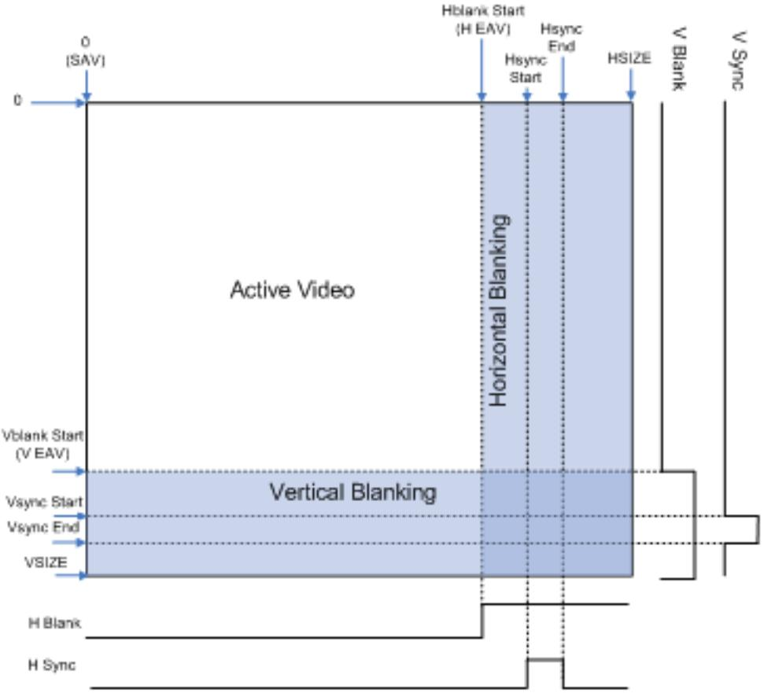

*Figure 1‐1:* **Example Video Frame and Timing Signals**

<span id="page-5-0"/>A video frame can be completely described in terms of timing by only a few definitions. A video frame comprises active video and blanking periods. The vertical and horizontal synchronization signals describe the video frame timing, which includes active and blanking data. In addition, the frame synchronization signals can be used to synchronize video data from one component to another within a video system. There are additional signals that can also be used to control the video system, such as a signal to differentiate valid chroma samples.

Video systems may utilize different combinations of blank, synchronization or active signals with various polarities to synchronize processing and control video data. The Video Timing Controller simplifies working with video timing signals by providing a highly programmable and flexible core that allows detection and generation of the various timing signals within a video system.

# <span id="page-6-0"/>**Feature Summary**

The Video Timing Controller core supports the AXI4-Lite interface and a constant-mode interface. The AXI4-Lite interface allows the core to be easily incorporated into a Vivado project. The Constant interface utilizes core parameters configurable by the Graphical User Interface (GUI) to setup the core for fixed-mode operation. These configurable options allow the Video Timing Controller core to be easily integrated with AXI4 based processor systems, with non-AXI4-compliant processors systems with some additional logic, and in systems without a processor.

The Video Timing Controller core supports detecting video frame sizes up to 8192 clocks by 8192 lines (including horizontal and vertical blanking). The detection typically requires three to five input video frames to detect and lock. The Video Timing Controller core automatically detects the timing involved with horizontal/vertical blanks and syncs. The timing of the active_video and the active_chroma signals are also detected. This allows the user to easily determine the video frame size via the core register (AXI4-Lite) interface. The minimum set of signals used for detection is either vertical blank, horizontal blank and active video or vertical sync, horizontal sync and active video. The polarities of each input signal is also detected and reported via the register interface to allow easy use of each signal once the polarity is known.

The core also supports generating and regenerating (matching the detected input) video frame sizes up to 8192 clocks by 8192 lines (including blanking time). The output can be the same format or a different format as the detected input. This allows detecting one format and generating a different format. The output can also be synchronized to the detected input and has separate signal polarity settings as well. This allows regenerating the input with different signal polarities or with slight timing adjustments (such as delayed or shorted active video).

The Video Timing Controller core supports up to 16 frame sync output signals. These are toggled high for one clock cycle during each frame. These frame syncs allow triggering timing critical hardware processes at different times during a frame.

# <span id="page-6-1"/>**Applications**

- Video Surveillance
- Industrial Imaging
- Video Conferencing
- Machine Vision
- Video Systems requiring timing detection or timing generation

# <span id="page-7-0"/>**Licensing and Ordering**

This Xilinx LogiCORE IP module is provided at no cost under the terms of the [Xilinx Core](https://www.xilinx.com/cgi-bin/docs/ipdoc?t=core+license)  [License Agreement.](https://www.xilinx.com/cgi-bin/docs/ipdoc?t=core+license) The module is shipped as part of the Vivado Design Suite. For full access to all core functionalities in simulation and in hardware, you must purchase a license for the core. Contact your [local Xilinx sales representative](https://www.xilinx.com/about/contact.html) for information about pricing and availability.

For more information, visit the Video Timing Controller product web page.

Information about other Xilinx LogiCORE IP modules is available at the [Xilinx Intellectual](https://www.xilinx.com/products/intellectual-property.html)  [Property](https://www.xilinx.com/products/intellectual-property.html) page. For information on pricing and availability of other Xilinx LogiCORE IP modules and tools, contact your [local Xilinx sales representative.](https://www.xilinx.com/about/contact.html)


# <span id="page-8-0"/>Product Specification

# <span id="page-8-1"/>**Standards**

The Video Timing Controller core is compliant with the AXI4-Lite interconnect standards. Refer to the *Video IP: AXI Feature Adoption* section of the *Vivado AXI Reference Guide* (UG1037) [\[Ref](#page-88-2) [1\](#page-88-2) for additional information.

# <span id="page-8-2"/>**Performance**

The following sections detail the performance characteristics of the Video Timing Controller core.

### **Maximum Frequencies**

This section contains typical clock frequencies for the target devices. The maximum achievable clock frequency can vary. The maximum achievable clock frequency and all resource counts can be affected by other tool options, additional logic in the FPGA device, using a different version of Xilinx tools and other factors. Refer to in [Table](#page-9-2) [2-1](#page-9-2) through [Table](#page-13-1) [2-4](#page-13-1) for device-specific information.

- Virtex-7, Kintex-7, Zynq-7000 (XC7Z030, XC7Z045) Devices: 225MHz
- Artix-7, Zynq-7000 (XC7Z010, XC7Z020) Devices: 150MHz

### **Latency**

The Video Timing Controller core does not read or generate data, and therefore, does not have a specific data latency.

The Video Timing Controller core monitors and generates control signals. The output control signals can be configured to be the same as the input with no latency, or the output signals can be configured to incur a multi-clock or multi-line delay.

### **Throughput**

The Video Timing Controller core does not read or generate data, and does not have a specific throughput.

# <span id="page-9-0"/>**Resource Utilization**

For an accurate measure of the usage of primitives, slices, and CLBs for a particular instance, check the **Display Core Viewer after Generation** check box in the interface.

The information presented in [Table](#page-9-2) [2-1](#page-9-2) through [Table](#page-13-1) [2-4](#page-13-1) is a guide to the resource utilization and maximum clock frequency of the Video Timing Controller core for all input/ output width combinations for Virtex-7, Kintex-7, Artix-7, and Zynq-7000 families. UltraScale™ results are expected to be similar to 7 series results. The design was tested using Vivado with default tool options for characterization data.

| AXI4-Lite<br>Interface | Maximum<br>Lines | Detection<br>Enable | Generation<br>Enable | H/V<br>Blanks | H/V<br>Syncs | Active<br>Video | Active<br>Chroma | LUTs | FFs  |
|------------------------|------------------|---------------------|----------------------|---------------|--------------|-----------------|------------------|------|------|
| Yes                    | 256              | No                  | Yes                  | No            | Yes          | Yes             | No               | 1350 | 1233 |
| Yes                    | 256              | No                  | Yes                  | Yes           | No           | Yes             | No               | 1332 | 1168 |
| Yes                    | 256              | Yes                 | No                   | No            | Yes          | Yes             | No               | 1555 | 1341 |
| Yes                    | 256              | Yes                 | No                   | Yes           | No           | Yes             | No               | 1519 | 1301 |
| Yes                    | 512              | No                  | Yes                  | No            | Yes          | No              | No               | 1398 | 1263 |
| Yes                    | 512              | No                  | Yes                  | No            | Yes          | Yes             | No               | 1425 | 1290 |
| Yes                    | 512              | No                  | Yes                  | Yes           | No           | Yes             | No               | 1405 | 1217 |
| Yes                    | 512              | Yes                 | No                   | No            | Yes          | Yes             | No               | 1638 | 1409 |
| Yes                    | 512              | Yes                 | No                   | Yes           | No           | Yes             | No               | 1600 | 1364 |
| Yes                    | 1024             | No                  | Yes                  | No            | Yes          | No              | No               | 1445 | 1318 |
| Yes                    | 1024             | No                  | Yes                  | No            | Yes          | Yes             | No               | 1475 | 1347 |
| Yes                    | 1024             | No                  | Yes                  | Yes           | No           | Yes             | No               | 1457 | 1266 |
| Yes                    | 1024             | Yes                 | No                   | No            | Yes          | Yes             | No               | 1725 | 1477 |
| Yes                    | 1024             | Yes                 | No                   | Yes           | No           | Yes             | No               | 1674 | 1427 |
| Yes                    | 2048             | No                  | Yes                  | No            | Yes          | No              | No               | 1516 | 1373 |
| Yes                    | 2048             | No                  | Yes                  | No            | Yes          | Yes             | No               | 1543 | 1404 |
| Yes                    | 2048             | No                  | Yes                  | Yes           | No           | Yes             | No               | 1521 | 1315 |
| Yes                    | 2048             | Yes                 | No                   | No            | Yes          | Yes             | No               | 1813 | 1545 |
| Yes                    | 2048             | Yes                 | No                   | Yes           | No           | Yes             | No               | 1765 | 1490 |
| Yes                    | 4096             | No                  | Yes                  | No            | Yes          | No              | No               | 1550 | 1428 |

<span id="page-9-2"/><span id="page-9-1"/>*Table 2‐1:* **Virtex-7 FPGA Performance**

| AXI4-Lite<br>Interface | Maximum<br>Lines | Detection<br>Enable | Generation<br>Enable | H/V<br>Blanks | H/V<br>Syncs | Active<br>Video | Active<br>Chroma | LUTs | FFs  |
|------------------------|------------------|---------------------|----------------------|---------------|--------------|-----------------|------------------|------|------|
| Yes                    | 4096             | No                  | Yes                  | No            | Yes          | Yes             | No               | 1578 | 1461 |
| Yes                    | 4096             | No                  | Yes                  | Yes           | No           | Yes             | No               | 1556 | 1364 |
| Yes                    | 4096             | Yes                 | No                   | No            | Yes          | Yes             | No               | 1855 | 1613 |
| Yes                    | 4096             | Yes                 | No                   | Yes           | No           | Yes             | No               | 1795 | 1553 |
| Yes                    | 8192             | No                  | Yes                  | No            | Yes          | No              | No               | 1587 | 1483 |
| Yes                    | 8192             | No                  | Yes                  | No            | Yes          | Yes             | No               | 1618 | 1518 |
| Yes                    | 8192             | No                  | Yes                  | Yes           | No           | Yes             | No               | 1592 | 1413 |
| Yes                    | 8192             | Yes                 | No                   | No            | Yes          | Yes             | No               | 1957 | 1681 |
| Yes                    | 8192             | Yes                 | No                   | Yes           | No           | Yes             | No               | 1875 | 1616 |
| No                     | 256              | No                  | Yes                  | No            | Yes          | No              | No               | 97   | 77   |
| No                     | 256              | No                  | Yes                  | No            | Yes          | Yes             | No               | 115  | 89   |
| No                     | 256              | No                  | Yes                  | Yes           | No           | Yes             | No               | 106  | 84   |
| No                     | 512              | No                  | Yes                  | No            | Yes          | No              | No               | 103  | 82   |
| No                     | 512              | No                  | Yes                  | No            | Yes          | Yes             | No               | 124  | 96   |
| No                     | 512              | No                  | Yes                  | Yes           | No           | Yes             | No               | 110  | 91   |
| No                     | 1024             | No                  | Yes                  | No            | Yes          | No              | No               | 109  | 87   |
| No                     | 1024             | No                  | Yes                  | No            | Yes          | Yes             | No               | 128  | 103  |
| No                     | 1024             | No                  | Yes                  | Yes           | No           | Yes             | No               | 117  | 98   |
| No                     | 2048             | No                  | Yes                  | No            | Yes          | No              | No               | 123  | 92   |
| No                     | 2048             | No                  | Yes                  | No            | Yes          | Yes             | No               | 138  | 110  |
| No                     | 2048             | No                  | Yes                  | Yes           | No           | Yes             | No               | 120  | 105  |
| No                     | 4096             | No                  | Yes                  | No            | Yes          | No              | No               | 93   | 97   |
| No                     | 4096             | No                  | Yes                  | No            | Yes          | Yes             | No               | 115  | 117  |
| No                     | 4096             | No                  | Yes                  | Yes           | No           | Yes             | No               | 100  | 112  |
| No                     | 8192             | No                  | Yes                  | No            | Yes          | No              | No               | 98   | 102  |
| No                     | 8192             | No                  | Yes                  | No            | Yes          | Yes             | No               | 126  | 124  |
| No                     | 8192             | No                  | Yes                  | Yes           | No           | Yes             | No               | 107  | 119  |

*Table 2‐1:* **Virtex-7 FPGA Performance** *(Cont'd)*

*Table 2‐2:* **Kintex-7 FPGA and Zynq-7000 Devices with Kintex Based Programmable Logic Performance**

| AXI4-Lite<br>Interface | Maximum<br>Lines | Detection<br>Enable | Generation<br>Enable | H/V<br>Blanks | H/V<br>Syncs | Active<br>Video | Active<br>Chroma | LUTs | FFs  |
|------------------------|------------------|---------------------|----------------------|---------------|--------------|-----------------|------------------|------|------|
| Yes                    | 256              | No                  | Yes                  | No            | Yes          | No              | No               | 1325 | 1208 |
| Yes                    | 256              | No                  | Yes                  | No            | Yes          | Yes             | No               | 1351 | 1233 |
| Yes                    | 256              | No                  | Yes                  | Yes           | No           | Yes             | No               | 1334 | 1168 |
| Yes                    | 256              | Yes                 | No                   | No            | Yes          | Yes             | No               | 1554 | 1341 |

| AXI4-Lite<br>Interface | Maximum<br>Lines | Detection<br>Enable | Generation<br>Enable | H/V<br>Blanks | H/V<br>Syncs | Active<br>Video | Active<br>Chroma | LUTs | FFs  |
|------------------------|------------------|---------------------|----------------------|---------------|--------------|-----------------|------------------|------|------|
| Yes                    | 256              | Yes                 | No                   | Yes           | No           | Yes             | No               | 1518 | 1301 |
| Yes                    | 512              | No                  | Yes                  | No            | Yes          | No              | No               | 1397 | 1263 |
| Yes                    | 512              | No                  | Yes                  | No            | Yes          | Yes             | No               | 1425 | 1290 |
| Yes                    | 512              | No                  | Yes                  | Yes           | No           | Yes             | No               | 1403 | 1217 |
| Yes                    | 512              | Yes                 | No                   | No            | Yes          | Yes             | No               | 1637 | 1409 |
| Yes                    | 512              | Yes                 | No                   | Yes           | No           | Yes             | No               | 1600 | 1364 |
| Yes                    | 1024             | No                  | Yes                  | No            | Yes          | No              | No               | 1448 | 1318 |
| Yes                    | 1024             | No                  | Yes                  | No            | Yes          | Yes             | No               | 1476 | 1347 |
| Yes                    | 1024             | No                  | Yes                  | Yes           | No           | Yes             | No               | 1457 | 1266 |
| Yes                    | 1024             | Yes                 | No                   | No            | Yes          | Yes             | No               | 1730 | 1477 |
| Yes                    | 1024             | Yes                 | No                   | Yes           | No           | Yes             | No               | 1675 | 1427 |
| Yes                    | 2048             | No                  | Yes                  | No            | Yes          | No              | No               | 1515 | 1373 |
| Yes                    | 2048             | No                  | Yes                  | No            | Yes          | Yes             | No               | 1543 | 1404 |
| Yes                    | 2048             | No                  | Yes                  | Yes           | No           | Yes             | No               | 1519 | 1315 |
| Yes                    | 2048             | Yes                 | No                   | No            | Yes          | Yes             | No               | 1814 | 1545 |
| Yes                    | 2048             | Yes                 | No                   | Yes           | No           | Yes             | No               | 1770 | 1490 |
| Yes                    | 4096             | No                  | Yes                  | No            | Yes          | No              | No               | 1549 | 1428 |
| Yes                    | 4096             | No                  | Yes                  | No            | Yes          | Yes             | No               | 1578 | 1461 |
| Yes                    | 4096             | No                  | Yes                  | Yes           | No           | Yes             | No               | 1555 | 1364 |
| Yes                    | 4096             | Yes                 | No                   | No            | Yes          | Yes             | No               | 1854 | 1613 |
| Yes                    | 4096             | Yes                 | No                   | Yes           | No           | Yes             | No               | 1794 | 1553 |
| Yes                    | 8192             | No                  | Yes                  | No            | Yes          | No              | No               | 1588 | 1483 |
| Yes                    | 8192             | No                  | Yes                  | No            | Yes          | Yes             | No               | 1618 | 1518 |
| Yes                    | 8192             | No                  | Yes                  | Yes           | No           | Yes             | No               | 1592 | 1413 |
| Yes                    | 8192             | Yes                 | No                   | No            | Yes          | Yes             | No               | 1957 | 1681 |
| Yes                    | 8192             | Yes                 | No                   | Yes           | No           | Yes             | No               | 1879 | 1616 |
| No                     | 256              | No                  | Yes                  | No            | Yes          | No              | No               | 96   | 77   |
| No                     | 256              | No                  | Yes                  | No            | Yes          | Yes             | No               | 115  | 89   |
| No                     | 256              | No                  | Yes                  | Yes           | No           | Yes             | No               | 104  | 84   |
| No                     | 512              | No                  | Yes                  | No            | Yes          | No              | No               | 102  | 82   |
| No                     | 512              | No                  | Yes                  | No            | Yes          | Yes             | No               | 123  | 96   |
| No                     | 512              | No                  | Yes                  | Yes           | No           | Yes             | No               | 110  | 91   |
| No                     | 1024             | No                  | Yes                  | No            | Yes          | No              | No               | 109  | 87   |
| No                     | 1024             | No                  | Yes                  | No            | Yes          | Yes             | No               | 128  | 103  |

*Table 2‐2:* **Kintex-7 FPGA and Zynq-7000 Devices with Kintex Based Programmable Logic Performance** *(Cont'd)*

| AXI4-Lite<br>Interface | Maximum<br>Lines | Detection<br>Enable | Generation<br>Enable | H/V<br>Blanks | H/V<br>Syncs | Active<br>Video | Active<br>Chroma | LUTs | FFs |
|------------------------|------------------|---------------------|----------------------|---------------|--------------|-----------------|------------------|------|-----|
| No                     | 1024             | No                  | Yes                  | Yes           | No           | Yes             | No               | 116  | 98  |
| No                     | 2048             | No                  | Yes                  | No            | Yes          | No              | No               | 123  | 92  |
| No                     | 2048             | No                  | Yes                  | No            | Yes          | Yes             | No               | 138  | 110 |
| No                     | 2048             | No                  | Yes                  | Yes           | No           | Yes             | No               | 118  | 105 |
| No                     | 4096             | No                  | Yes                  | No            | Yes          | No              | No               | 92   | 97  |
| No                     | 4096             | No                  | Yes                  | No            | Yes          | Yes             | No               | 117  | 117 |
| No                     | 4096             | No                  | Yes                  | Yes           | No           | Yes             | No               | 105  | 112 |
| No                     | 8192             | No                  | Yes                  | No            | Yes          | No              | No               | 99   | 102 |
| No                     | 8192             | No                  | Yes                  | No            | Yes          | Yes             | No               | 125  | 124 |
| No                     | 8192             | No                  | Yes                  | Yes           | No           | Yes             | No               | 107  | 119 |

*Table 2‐2:* **Kintex-7 FPGA and Zynq-7000 Devices with Kintex Based Programmable Logic Performance** *(Cont'd)*

| Table 2‐3:  | Artix-7 FPGA and Zynq-7000 Device with Artix Based Programmable Logic |
|-------------|-----------------------------------------------------------------------|
| Performance |                                                                       |

| AXI4-Lite<br>Interface | Maximum<br>Lines | Detection<br>Enable | Generation<br>Enable | H/V<br>Blanks | H/V<br>Syncs | Active<br>Video | Active<br>Chroma | LUTs | FFs  |
|------------------------|------------------|---------------------|----------------------|---------------|--------------|-----------------|------------------|------|------|
| Yes                    | 256              | No                  | Yes                  | No            | Yes          | No              | No               | 1326 | 1208 |
| Yes                    | 256              | No                  | Yes                  | No            | Yes          | Yes             | No               | 1349 | 1233 |
| Yes                    | 256              | No                  | Yes                  | Yes           | No           | Yes             | No               | 1334 | 1168 |
| Yes                    | 256              | Yes                 | No                   | No            | Yes          | Yes             | No               | 1556 | 1341 |
| Yes                    | 256              | Yes                 | No                   | Yes           | No           | Yes             | No               | 1516 | 1301 |
| Yes                    | 512              | No                  | Yes                  | No            | Yes          | No              | No               | 1400 | 1263 |
| Yes                    | 512              | No                  | Yes                  | No            | Yes          | Yes             | No               | 1423 | 1290 |
| Yes                    | 512              | No                  | Yes                  | Yes           | No           | Yes             | No               | 1402 | 1217 |
| Yes                    | 512              | Yes                 | No                   | No            | Yes          | Yes             | No               | 1634 | 1409 |
| Yes                    | 512              | Yes                 | No                   | Yes           | No           | Yes             | No               | 1594 | 1364 |
| Yes                    | 1024             | No                  | Yes                  | No            | Yes          | No              | No               | 1449 | 1318 |
| Yes                    | 1024             | No                  | Yes                  | No            | Yes          | Yes             | No               | 1475 | 1347 |
| Yes                    | 1024             | No                  | Yes                  | Yes           | No           | Yes             | No               | 1455 | 1266 |
| Yes                    | 1024             | Yes                 | No                   | No            | Yes          | Yes             | No               | 1721 | 1477 |
| Yes                    | 1024             | Yes                 | No                   | Yes           | No           | Yes             | No               | 1670 | 1427 |
| Yes                    | 2048             | No                  | Yes                  | No            | Yes          | No              | No               | 1516 | 1373 |
| Yes                    | 2048             | No                  | Yes                  | No            | Yes          | Yes             | No               | 1543 | 1404 |
| Yes                    | 2048             | No                  | Yes                  | Yes           | No           | Yes             | No               | 1522 | 1315 |
| Yes                    | 2048             | Yes                 | No                   | No            | Yes          | Yes             | No               | 1811 | 1545 |
| Yes                    | 2048             | Yes                 | No                   | Yes           | No           | Yes             | No               | 1769 | 1490 |

| AXI4-Lite<br>Interface | Maximum<br>Lines | Detection<br>Enable | Generation<br>Enable | H/V<br>Blanks | H/V<br>Syncs | Active<br>Video | Active<br>Chroma | LUTs | FFs  |
|------------------------|------------------|---------------------|----------------------|---------------|--------------|-----------------|------------------|------|------|
| Yes                    | 4096             | No                  | Yes                  | No            | Yes          | No              | No               | 1550 | 1428 |
| Yes                    | 4096             | No                  | Yes                  | No            | Yes          | Yes             | No               | 1577 | 1461 |
| Yes                    | 4096             | No                  | Yes                  | Yes           | No           | Yes             | No               | 1557 | 1364 |
| Yes                    | 4096             | Yes                 | No                   | No            | Yes          | Yes             | No               | 1855 | 1613 |
| Yes                    | 4096             | Yes                 | No                   | Yes           | No           | Yes             | No               | 1793 | 1553 |
| Yes                    | 8192             | No                  | Yes                  | No            | Yes          | No              | No               | 1589 | 1483 |
| Yes                    | 8192             | No                  | Yes                  | No            | Yes          | Yes             | No               | 1620 | 1518 |
| Yes                    | 8192             | No                  | Yes                  | Yes           | No           | Yes             | No               | 1592 | 1413 |
| Yes                    | 8192             | Yes                 | No                   | No            | Yes          | Yes             | No               | 1956 | 1681 |
| Yes                    | 8192             | Yes                 | No                   | Yes           | No           | Yes             | No               | 1878 | 1616 |
| No                     | 256              | No                  | Yes                  | No            | Yes          | No              | No               | 96   | 77   |
| No                     | 256              | No                  | Yes                  | No            | Yes          | Yes             | No               | 115  | 89   |
| No                     | 256              | No                  | Yes                  | Yes           | No           | Yes             | No               | 106  | 84   |
| No                     | 512              | No                  | Yes                  | No            | Yes          | No              | No               | 102  | 82   |
| No                     | 512              | No                  | Yes                  | No            | Yes          | Yes             | No               | 123  | 96   |
| No                     | 512              | No                  | Yes                  | Yes           | No           | Yes             | No               | 110  | 91   |
| No                     | 1024             | No                  | Yes                  | No            | Yes          | No              | No               | 109  | 87   |
| No                     | 1024             | No                  | Yes                  | No            | Yes          | Yes             | No               | 127  | 103  |
| No                     | 1024             | No                  | Yes                  | Yes           | No           | Yes             | No               | 116  | 98   |
| No                     | 2048             | No                  | Yes                  | No            | Yes          | No              | No               | 121  | 92   |
| No                     | 2048             | No                  | Yes                  | No            | Yes          | Yes             | No               | 138  | 110  |
| No                     | 2048             | No                  | Yes                  | Yes           | No           | Yes             | No               | 121  | 105  |
| No                     | 4096             | No                  | Yes                  | No            | Yes          | No              | No               | 93   | 97   |
| No                     | 4096             | No                  | Yes                  | No            | Yes          | Yes             | No               | 118  | 117  |
| No                     | 4096             | No                  | Yes                  | Yes           | No           | Yes             | No               | 99   | 112  |
| No                     | 8192             | No                  | Yes                  | No            | Yes          | No              | No               | 99   | 102  |
| No                     | 8192             | No                  | Yes                  | No            | Yes          | Yes             | No               | 121  | 124  |
| No                     | 8192             | No                  | Yes                  | Yes           | No           | Yes             | No               | 104  | 119  |

*Table 2‐3:* **Artix-7 FPGA and Zynq-7000 Device with Artix Based Programmable Logic Performance** *(Cont'd)*

<span id="page-13-1"/><span id="page-13-0"/>

| Table 2‐4: |  |  | Zynq-7000 Device Performance |
|------------|--|--|------------------------------|
|------------|--|--|------------------------------|

| AXI4-Lite<br>Interface | Maximum<br>Lines | Detection<br>Enable | Generation<br>Enable | H/V<br>Blanks | H/V<br>Syncs | Active<br>Video | Active<br>Chroma | LUTs | FFs  |
|------------------------|------------------|---------------------|----------------------|---------------|--------------|-----------------|------------------|------|------|
| Yes                    | 256              | No                  | Yes                  | No            | Yes          | No              | No               | 1327 | 1208 |
| Yes                    | 256              | No                  | Yes                  | No            | Yes          | Yes             | No               | 1350 | 1233 |
| Yes                    | 256              | No                  | Yes                  | Yes           | No           | Yes             | No               | 1331 | 1168 |

| AXI4-Lite<br>Interface | Maximum<br>Lines | Detection<br>Enable | Generation<br>Enable | H/V<br>Blanks | H/V<br>Syncs | Active<br>Video | Active<br>Chroma | LUTs | FFs  |
|------------------------|------------------|---------------------|----------------------|---------------|--------------|-----------------|------------------|------|------|
| Yes                    | 256              | Yes                 | No                   | No            | Yes          | Yes             | No               | 1563 | 1341 |
| Yes                    | 256              | Yes                 | No                   | Yes           | No           | Yes             | No               | 1517 | 1301 |
| Yes                    | 512              | No                  | Yes                  | No            | Yes          | No              | No               | 1396 | 1263 |
| Yes                    | 512              | No                  | Yes                  | No            | Yes          | Yes             | No               | 1424 | 1290 |
| Yes                    | 512              | No                  | Yes                  | Yes           | No           | Yes             | No               | 1405 | 1217 |
| Yes                    | 512              | Yes                 | No                   | No            | Yes          | Yes             | No               | 1640 | 1409 |
| Yes                    | 512              | Yes                 | No                   | Yes           | No           | Yes             | No               | 1600 | 1364 |
| Yes                    | 1024             | No                  | Yes                  | No            | Yes          | No              | No               | 1450 | 1318 |
| Yes                    | 1024             | No                  | Yes                  | No            | Yes          | Yes             | No               | 1476 | 1347 |
| Yes                    | 1024             | No                  | Yes                  | Yes           | No           | Yes             | No               | 1453 | 1266 |
| Yes                    | 1024             | Yes                 | No                   | No            | Yes          | Yes             | No               | 1731 | 1477 |
| Yes                    | 1024             | Yes                 | No                   | Yes           | No           | Yes             | No               | 1679 | 1427 |
| Yes                    | 2048             | No                  | Yes                  | No            | Yes          | No              | No               | 1514 | 1373 |
| Yes                    | 2048             | No                  | Yes                  | No            | Yes          | Yes             | No               | 1544 | 1404 |
| Yes                    | 2048             | No                  | Yes                  | Yes           | No           | Yes             | No               | 1523 | 1315 |
| Yes                    | 2048             | Yes                 | No                   | No            | Yes          | Yes             | No               | 1811 | 1545 |
| Yes                    | 2048             | Yes                 | No                   | Yes           | No           | Yes             | No               | 1764 | 1490 |
| Yes                    | 4096             | No                  | Yes                  | No            | Yes          | No              | No               | 1549 | 1428 |
| Yes                    | 4096             | No                  | Yes                  | No            | Yes          | Yes             | No               | 1579 | 1461 |
| Yes                    | 4096             | No                  | Yes                  | Yes           | No           | Yes             | No               | 1557 | 1364 |
| Yes                    | 4096             | Yes                 | No                   | No            | Yes          | Yes             | No               | 1856 | 1613 |
| Yes                    | 4096             | Yes                 | No                   | Yes           | No           | Yes             | No               | 1790 | 1553 |
| Yes                    | 8192             | No                  | Yes                  | No            | Yes          | No              | No               | 1589 | 1483 |
| Yes                    | 8192             | No                  | Yes                  | No            | Yes          | Yes             | No               | 1620 | 1518 |
| Yes                    | 8192             | No                  | Yes                  | Yes           | No           | Yes             | No               | 1590 | 1413 |
| Yes                    | 8192             | Yes                 | No                   | No            | Yes          | Yes             | No               | 1953 | 1681 |
| Yes                    | 8192             | Yes                 | No                   | Yes           | No           | Yes             | No               | 1879 | 1616 |
| No                     | 256              | No                  | Yes                  | No            | Yes          | No              | No               | 97   | 77   |
| No                     | 256              | No                  | Yes                  | No            | Yes          | Yes             | No               | 115  | 89   |
| No                     | 256              | No                  | Yes                  | Yes           | No           | Yes             | No               | 106  | 84   |
| No                     | 512              | No                  | Yes                  | No            | Yes          | No              | No               | 103  | 82   |
| No                     | 512              | No                  | Yes                  | No            | Yes          | Yes             | No               | 124  | 96   |
| No                     | 512              | No                  | Yes                  | Yes           | No           | Yes             | No               | 110  | 91   |
| No                     | 1024             | No                  | Yes                  | No            | Yes          | No              | No               | 108  | 87   |
| No                     | 1024             | No                  | Yes                  | No            | Yes          | Yes             | No               | 128  | 103  |

*Table 2‐4:* **Zynq-7000 Device Performance** *(Cont'd)*

| AXI4-Lite<br>Interface | Maximum<br>Lines | Detection<br>Enable | Generation<br>Enable | H/V<br>Blanks | H/V<br>Syncs | Active<br>Video | Active<br>Chroma | LUTs | FFs |
|------------------------|------------------|---------------------|----------------------|---------------|--------------|-----------------|------------------|------|-----|
| No                     | 1024             | No                  | Yes                  | Yes           | No           | Yes             | No               | 117  | 98  |
| No                     | 2048             | No                  | Yes                  | No            | Yes          | No              | No               | 123  | 92  |
| No                     | 2048             | No                  | Yes                  | No            | Yes          | Yes             | No               | 134  | 110 |
| No                     | 2048             | No                  | Yes                  | Yes           | No           | Yes             | No               | 120  | 105 |
| No                     | 4096             | No                  | Yes                  | No            | Yes          | No              | No               | 93   | 97  |
| No                     | 4096             | No                  | Yes                  | No            | Yes          | Yes             | No               | 118  | 117 |
| No                     | 4096             | No                  | Yes                  | Yes           | No           | Yes             | No               | 99   | 112 |
| No                     | 8192             | No                  | Yes                  | No            | Yes          | No              | No               | 98   | 102 |
| No                     | 8192             | No                  | Yes                  | No            | Yes          | Yes             | No               | 123  | 124 |
| No                     | 8192             | No                  | Yes                  | Yes           | No           | Yes             | No               | 104  | 119 |

*Table 2‐4:* **Zynq-7000 Device Performance** *(Cont'd)*

## <span id="page-15-0"/>**Core Interfaces and Register Space**

This chapter provides detailed descriptions for each interface. In addition, detailed information about configuration and control registers is included.

### **Port Descriptions**

The Video Timing Controller (VTC) core uses the AXI4-Lite industry standard control interface to connect to other system components. The following sections describe the various interfaces available with the core. Some signals are optional and not present for all configurations of the core. The AXI4-Lite interface and the IRQ pin are present only when the core is configured via the GUI with an AXI4-Lite control interface. The INTC_IF interface is present only when the core is configured via the GUI with the INTC interface enabled. [Figure](#page-16-0) [2-1](#page-16-0) illustrates an I/O diagram of the VTC core.

X-Ref Target - Figure 2-1

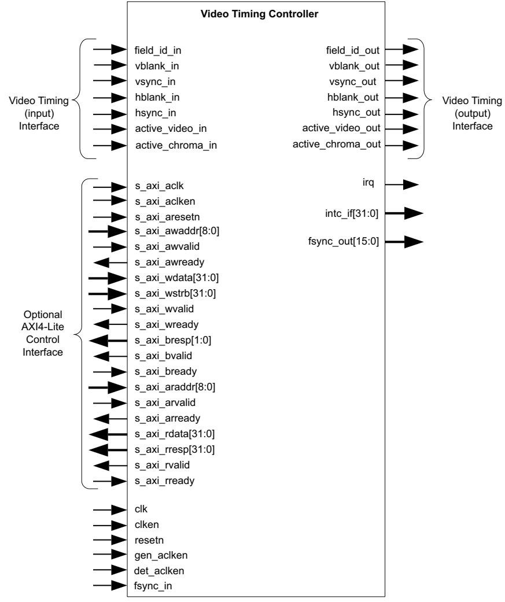

*Figure 2‐1:* **TC Core Top-Level Signaling Interface**

#### <span id="page-16-0"/>**Core Interfaces**

#### **Control Interface**

Video systems commonly use an integrated processor system to dynamically control the parameters within the system. This is especially important when several independent image processing cores are integrated into a single FPGA. The Video Timing Controller core can be configured with an AXI4-Lite interface.

#### **Common I/O Signals**

The signals not included in the AXI4-Lite interface are specified in [Table](#page-17-0) [2-5.](#page-17-0)

#### <span id="page-17-0"/>*Table 2‐5:* **Common Port Descriptions**

| Name        | Direction | Width | Description                                                                                                                                                                                                                                                                                                                                                             |  |
|-------------|-----------|-------|-------------------------------------------------------------------------------------------------------------------------------------------------------------------------------------------------------------------------------------------------------------------------------------------------------------------------------------------------------------------------|--|
| clk         | In        | 1     | Video Core Clock                                                                                                                                                                                                                                                                                                                                                        |  |
| clken       | In        | 1     | Video Core Active High Clock Enable                                                                                                                                                                                                                                                                                                                                     |  |
| det_clken   | In        | 1     | Video Timing Detection Core Active High Clock Enable                                                                                                                                                                                                                                                                                                                    |  |
| gen_clken   | In        | 1     | Video Timing Generator Core Active High Clock Enable                                                                                                                                                                                                                                                                                                                    |  |
| resetn      | In        | 1     | Video Core Active Low Synchronous Reset                                                                                                                                                                                                                                                                                                                                 |  |
| irq         | Output    | 1     | Interrupt request output, active high edge                                                                                                                                                                                                                                                                                                                              |  |
| intc_if     | Output    | 32    | OPTIONAL EXTERNAL INTERRUPT CONTROLLER INTERFACE<br>Available when the "Include INTC Interface" or C_HAS_INTC_IF has<br>been selected.<br>Bits [31:8] are the same as the bits [31:8] in the status register<br>(0x0004).<br>Bits [5:0] are the same as bits [21:16] of the error register (0x0008).<br>Bits [7:6] are reserved and are always 0.                       |  |
|             |           |       | Detector Interface (Video Timing Input Interface)                                                                                                                                                                                                                                                                                                                       |  |
| field_id_in | Input     | 1     | INPUT FIELD ID<br>Used to set the field_id polarity in the Detector Polarity Register<br>(Address Offset 0x002C).<br>Optional. Only valid when interlace support and field id are enabled.                                                                                                                                                                              |  |
| hsync_in    | Input     | 1     | INPUT HORIZONTAL SYNCHRONIZATION<br>Used to set the DETECTOR HSYNC register.<br>Polarity is auto-detected.<br>Optional. Either horizontal blank or horizontal synchronization<br>signal inputs must be present. Both do not have to be present.<br>If the hsync_in input is not connected, then the "Horizontal Sync<br>Detection" option must be deselected.           |  |
| hblank_in   | Input     | 1     | INPUT HORIZONTAL BLANK<br>Used to set the DETECTOR HSIZE register.<br>Polarity is auto-detected.<br>Optional. Either horizontal blank or horizontal synchronization<br>signal inputs must be present. Both do not have to be present.<br>If the hblank_in input is not connected, then the "Horizontal Blank<br>Detection" option must be deselected.                   |  |
| vsync_in    | Input     | 1     | INPUT VERTICAL SYNCHRONIZATION<br>Used to set the DETECTOR F0_VSYNC_V and the F0_VSYNC_H<br>registers.<br>Polarity is auto-detected.<br>Optional. One of the following inputs must be present: active video,<br>vertical blank or vertical synchronization.<br>If the vsync_in input is not connected, then the "Vertical Sync<br>Detection" option must be deselected. |  |

*Table 2‐5:* **Common Port Descriptions** *(Cont'd)*

| Name             | Direction                                           | Width | Description                                                                                                                                                                                                                                                                                                                                              |  |  |  |  |
|------------------|-----------------------------------------------------|-------|----------------------------------------------------------------------------------------------------------------------------------------------------------------------------------------------------------------------------------------------------------------------------------------------------------------------------------------------------------|--|--|--|--|
| vblank_in        | Input                                               | 1     | INPUT VERTICAL BLANK<br>Used to set the DETECTOR_VSIZE and the F0_VBLANK_H registers.<br>Polarity is auto-detected.<br>Optional. One of the following inputs must be present: active video,<br>vertical blank or vertical synchronization.<br>If the vblank_in input is not connected, then the "Vertical Blank<br>Detection" option must be deselected. |  |  |  |  |
| active_video_in  | Input                                               | 1     | INPUT ACTIVE VIDEO<br>Used to set the DETECTOR ACTIVE_SIZE register.<br>Polarity is auto-detected.<br>Optional. One of the following inputs must be present: active video,<br>vertical blank or vertical synchronization.<br>If the active_video_in input is not connected, then the "Active Video<br>Detection" option must be deselected.              |  |  |  |  |
| active_chroma_in | Input                                               | 1     | INPUT ACTIVE CHROMA<br>Used to set the VIDEO_FORMAT and the CHROMA_PARITY bits in the<br>Detector Encoding Register.<br>Polarity is auto-detected.<br>Optional.<br>If the active_chroma_in input is not connected, then the "Active<br>Chroma Detection" option must be deselected.                                                                      |  |  |  |  |
|                  | Generator Interface (Video Timing Output Interface) |       |                                                                                                                                                                                                                                                                                                                                                          |  |  |  |  |
| field_id_out     | Output                                              | 1     | OUTPUT FIELD ID<br>Generated field id signal. Polarity configured by the Generator<br>Polarity Register (Address Offset 0x006C)<br>Optional. Only enabled when interlaced support and field id<br>generation is enabled.                                                                                                                                 |  |  |  |  |
| hsync_out        | Output                                              | 1     | OUTPUT HORIZONTAL SYNCHRONIZATION<br>Generated horizontal synchronization signal. Polarity configured by<br>the control register. Asserted active during the cycle set by the<br>HSYNC_START bits and deasserted during the cycle set by the<br>HSYNC_END bits in the GENERATOR HSYNC register.                                                          |  |  |  |  |
| hblank_out       | Output                                              | 1     | OUTPUT HORIZONTAL BLANK<br>Generated horizontal blank signal. Polarity configured by the control<br>register. Asserted active during the cycle set by ACTIVE_HSIZE and<br>deasserted during the cycle set by the FRAME_HSIZE bits in the<br>GENERATOR HSIZE register.                                                                                    |  |  |  |  |
| vsync_out        | Output                                              | 1     | OUTPUT VERTICAL SYNCHRONIZATION<br>Generated vertical synchronization signal. Polarity configured by the<br>control register. Asserted active during the line set by the<br>F#_VSYNC_VSTART bits and deasserted during the line set by the<br>F#_VSYNC_VEND bits in the GENERATOR F#_VSYNC_V registers.                                                  |  |  |  |  |

| Table 2‐5: | Common Port Descriptions (Cont'd) |
|------------|-----------------------------------|
|------------|-----------------------------------|

| Name                            | Direction | Width                     | Description                                                                                                                                                                                                                                                                                                                           |  |  |
|---------------------------------|-----------|---------------------------|---------------------------------------------------------------------------------------------------------------------------------------------------------------------------------------------------------------------------------------------------------------------------------------------------------------------------------------|--|--|
| vblank_out                      | Output    | 1                         | OUTPUT VERTICAL BLANK<br>Generated vertical blank signal. Polarity configured by the control<br>register. Asserted active during the line set by the ACTIVE_VSIZE bits<br>and deasserted during the line set by the GENERATOR VSIZE<br>register.                                                                                      |  |  |
| active_video_out                | Output    | 1                         | OUTPUT ACTIVE VIDEO<br>Generated active video signal. Polarity configured by the control<br>register. Active for non blanking lines. Asserted active during the<br>first cycle of the field/frame and deasserted during the cycle set by<br>the GENERATOR ACTIVE_SIZE register                                                        |  |  |
| active_chroma_out               | Output    | 1                         | OUTPUT ACTIVE CHROMA<br>Generated active chroma signal. Denotes which lines contain valid<br>chroma samples (used for YUV 4:2:0). Polarity configured by the<br>GENERATOR POLARITY register. Active for non-blanking lines<br>configured y the VIDEO_FORMAT and the CHROMA_PARITY bits in<br>the GENERATOR Encoding Register.         |  |  |
| Frame Synchronization Interface |           |                           |                                                                                                                                                                                                                                                                                                                                       |  |  |
| fsync_out                       | Output    | [Frame<br>Syncs -<br>1:0] | FRAME SYNCHRONIZATION OUTPUT<br>Each Frame Synchronization bit toggles for only one clock cycle<br>during each frame. The number of bits is configured with the Frame<br>Syncs GUI parameter.<br>Each bit is independently configured for horizontal and vertical<br>clock cycle position with the Frame Sync 0-15 Config registers). |  |  |
| fsync_in<br>Input               |           | 1                         | FRAME SYNCHRONIZATION INPUT<br>This is a one clock cycle pulse (active high) input. The video timing<br>generator will be synchronized to the input if used.                                                                                                                                                                          |  |  |

#### **Notes:**

1. All ports are little-endian.

The clk, clken and resetn, det_clken, and gen_clken signals are shared between the core and the Video Timing interfaces. The AXI4-Lite control interface has its own set of clock, clock enable and reset pins: S_AXI_ACLK, S_AXI_ACLKEN and S_AXI_ARESETn.

### **The clk Pin**

The Video Timing interfaces must be synchronous to the core clock signal clk. All Video Timing interface input signals are sampled on the rising edge of clk. All Video Timing output signal changes occur after the rising edge of clk. If the clk signal is not running, the AXI4-Lite interface asserts the slave error response (0x2) for all addresses. The clken Pin

The clken pin is an active-high, synchronous clock-enable input pertaining to Video Timing interfaces. Setting clken low (de-asserted) halts the operation of the core despite rising edges on the clk pin. Internal states are maintained, and output signal levels are held until clken is asserted again. When clken is de-asserted, core inputs are not sampled, except resetn, which supersedes clken. This clock must be running for AXI4-Lite

X-Ref Target - Figure 2-2

<span id="page-20-0"/>X-Ref Target - Figure 2-3

registers to be read and/or written, since all core registers reside within the core clock domain. This clock enable must be asserted high for AXI4-Lite registers to be read and/or written, since all core registers reside within the core clock domain. If the clock enable is deasserted, the AXI4-Lite interface asserts the slave error response (0x2) for all addresses.

#### **The det_clken Pin**

The det_clken pin is an Active-High, synchronous clock-enable pertaining to the Video Timing Controller detector (input) interface. This clock enable allows halting the detector independently from the generator. The internal detector clock enable is a logical "AND" between the clken and det_clken inputs. The internal logic that controls the detector sub-core clock enable is shown in [Figure](#page-20-1) [2-2](#page-20-1).

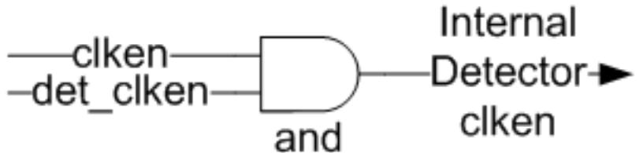

*Figure 2‐2:* **Detector Internal Clock Enable Logic**

#### <span id="page-20-1"/>**The gen_clken Pin**

The gen_clken pin is an Active-High, synchronous clock-enable pertaining to the Video Timing Controller generator (output) interface. This clock enable allows halting the generator independently from the detector. The internal generator clock enable is a logical "AND" between the clken and get_clken inputs. For example, to enable the detector while halting the generator, drive clken to '1', det_clken to '1' and gen_clken to '0'. The internal logic that controls the generator sub-core clock enable is shown in [Figure](#page-20-0) [2-3.](#page-20-0)

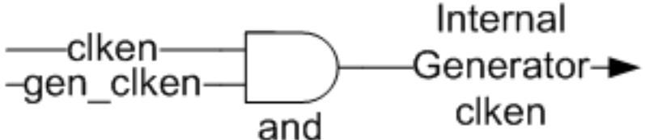

*Figure 2‐3:* **Generator Internal Clock Enable Logic**

X-Ref Target - Figure 2-4

#### **The resetn Pin**

The resetn pin is an active-low, synchronous reset input pertaining to only Video Timing interfaces. resetn supersedes clken, and when set to 0, the core resets at the next rising edge of clk even if clken is de-asserted. The resetn signal must be synchronous to the clk and must be held low for a minimum of 32 clock cycles of the slowest clock. This reset must be asserted high for AXI4-Lite registers to be read and/or written, since all core registers reside within the core clock domain. If the reset is asserted low, the AXI4-Lite interface asserts the slave error response (0x2) for all addresses.

#### **The fsync_in Pin**

The fsync_in pin is an Active-High input. The video timing generator is synchronized to the fsync_in input if used. The fsync_in should be driven high for only one clock cycle per frame. This resets all internal generator counters and starts the generated frame timing synchronized to this input. Internally, the fsync_in pin is logically "OR" combined with the internal frame sync det_fsync, produced by the detector. The internal frame sync det_fsync is generated by the video timing detector and can be used to synchronize the generator timing to the detector timing. The internal logic for this is show in [Figure](#page-21-0) [2-4.](#page-21-0) If the fsync_in input is used, then the detector must be disabled. Likewise, if the detector is used, then the fsync_in pin must be driven to '0'. The use of the external fsync_in pin and the detector can be changed at run-time but it is important that fsync_in and det_fsync are never asserted simultaneously.

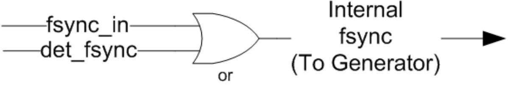

*Figure 2‐4:* **Video Timing Controller Internal fsync Logic**

#### <span id="page-21-0"/>**AXI4-Lite Interface**

The AXI4-Lite interface creates a core that can be easily added to an Vivado Project as a processor peripheral. This section describes the I/O signals associated with the Video Timing Controller AXI4-Lite interface.

| Pin Name                             | Dir | Width | Description                        |  |  |  |
|--------------------------------------|-----|-------|------------------------------------|--|--|--|
| AXI Write Address Channel Signals(1) |     |       |                                    |  |  |  |
| s_axi_aclk                           | I   | 1     | AXI4-Lite Clock                    |  |  |  |
| s_axi_aclken                         | I   | 1     | AXI4-Lite Active High Clock Enable |  |  |  |

#### *Table 2‐6:* **AXI4-Lite Signals**

#### *Table 2‐6:* **AXI4-Lite Signals** *(Cont'd)*

| s_axi_aresetn                       | I | 1                          | AXI4-Lite Active Low Synchronous Reset                                                                                                                                                                                      |  |  |
|-------------------------------------|---|----------------------------|-----------------------------------------------------------------------------------------------------------------------------------------------------------------------------------------------------------------------------|--|--|
| s_axi_awaddr                        | I | [(c_s_axi_addr_width-1):0] | AXI4-Lite Write Address Bus. The write address bus gives<br>the address of the write transaction.                                                                                                                           |  |  |
| s_axi_awvalid                       | I | 1                          | AXI4-Lite Write Address Channel Write Address Valid. This<br>signal indicates that valid write address is available.<br>1 = Write address is valid.<br>0 = Write address is not valid.                                      |  |  |
| s_axi_awready                       | O | 1                          | AXI4-Lite Write Address Channel Write Address Ready.<br>Indicates core is ready to accept the write address.<br>1 = Ready to accept address.<br>0 = Not ready to accept address.                                            |  |  |
|                                     |   |                            | AXI Write Data Channel Signals(1)                                                                                                                                                                                           |  |  |
| s_axi_wdata                         | I | [(c_s_axi_data_width-1):0] | AXI4-Lite Write Data Bus.                                                                                                                                                                                                   |  |  |
| s_axi_wstrb                         | I | [c_s_axi_data_width/8-1:0] | AXI4-Lite Write Strobes. This signal indicates which byte<br>lanes to update in memory.                                                                                                                                     |  |  |
| s_axi_wvalid                        | I | 1                          | AXI4-Lite Write Data Channel Write Data Valid. This signal<br>indicates that valid write data and strobes are available.<br>1 = Write data/strobes are valid.<br>0 = Write data/strobes are not valid.                      |  |  |
| s_axi_wready                        | O | 1                          | AXI4-Lite Write Data Channel Write Data Ready. Indicates<br>core is ready to accept the write data.<br>1 = Ready to accept data.<br>0 = Not ready to accept data.                                                           |  |  |
| s_axi_wready                        | O | 1                          | AXI4-Lite Write Data Channel Write Data Ready. Indicates<br>core is ready to accept the write data.<br>1 = Ready to accept data.<br>0 = Not ready to accept data.                                                           |  |  |
|                                     |   |                            | AXI Write Response Channel Signals(1)                                                                                                                                                                                       |  |  |
| s_axi_bresp(2)                      | O | [1:0]                      | AXI4-Lite Write Response Channel. Indicates results of the<br>write transfer.<br>00b = OKAY - Normal access has been successful.<br>01b = EXOKAY - Not supported.<br>10b = SLVERR - Error.<br>11b = DECERR - Not supported. |  |  |
| s_axi_bvalid                        | O | 1                          | AXI4-Lite Write Response Channel Response Valid.<br>Indicates response is valid.<br>1 = Response is valid.<br>0 = Response is not valid.                                                                                    |  |  |
| s_axi_bready                        | I | 1                          | AXI4-Lite Write Response Channel Ready. Indicates Master<br>is ready to receive response.<br>1 = Ready to receive response.<br>0 = Not ready to receive response.                                                           |  |  |
| AXI Read Address Channel Signals(1) |   |                            |                                                                                                                                                                                                                             |  |  |

#### *Table 2‐6:* **AXI4-Lite Signals** *(Cont'd)*

| s_axi_araddr                     | I | [(C_S_AXI_ADDR_WIDTH-1):0<br>] | AXI4-Lite Read Address Bus. The read address bus gives the<br>address of a read transaction.                                                                                                                                       |  |  |
|----------------------------------|---|--------------------------------|------------------------------------------------------------------------------------------------------------------------------------------------------------------------------------------------------------------------------------|--|--|
| s_axi_arvalid                    | I | 1                              | AXI4-Lite Read Address Channel Read Address Valid.<br>1 = Read address is valid.<br>0 = Read address is not valid.                                                                                                                 |  |  |
| s_axi_arready                    | O | 1                              | AXI4-Lite Read Address Channel Read Address Ready.<br>Indicates core is ready to accept the read address.<br>1 = Ready to accept address.<br>0 = Not ready to accept address.                                                      |  |  |
| AXI Read Data Channel Signals(1) |   |                                |                                                                                                                                                                                                                                    |  |  |
| s_axi_rdata                      | O | [(C_S_AXI_DATA_WIDTH-1):0]     | AXI4-Lite Read Data Bus.                                                                                                                                                                                                           |  |  |
| s_axi_rresp(2)                   | O | [1:0]                          | AXI4-Lite Read Response Channel Response. Indicates<br>results of the read transfer.<br>00b = OKAY - Normal access has been successful.<br>01b = EXOKAY - Not supported.<br>10b = SLVERR - Error.<br>11b = DECERR - Not supported. |  |  |
| s_axi_rvalid                     | O | 1                              | AXI4-Lite Read Data Channel Read Data Valid. This signal<br>indicates that the required read data is available and the<br>read transfer can complete.<br>1 = Read data is valid.<br>0 = Read data is not valid.                    |  |  |
| s_axi_rready                     | I | 1                              | AXI4-Lite Read Data Channel Read Data Ready. Indicates<br>master is ready to accept the read data.<br>1 = Ready to accept data.<br>0 = Not ready to accept data.                                                                   |  |  |

1. The function and timing of these signals are defined in the AMBA AXI Protocol Version: 2.0 Specification.

2. For signals S_AXI_RRESP[1:0] and S_AXI_BRESP[1:0], the core does not generate the Decode Error ('11') response. Other responses such as '00' (OKAY) and '10' (SLVERR) are generated by the core based upon certain conditions.

### **AXI4-Lite Register Set**

<span id="page-23-0"/>The AXI4-Lite Interface provides a memory mapped interface for all programmable registers within the core. All registers default to the values specified in Page 2 of the core GUI. All other bits default to 0x00000000 on Power-on/Reset unless otherwise noted.

| Address<br>Offset | Name                   | Access<br>Type | Double<br>Buffered | Default<br>Value | Description                                                      |
|-------------------|------------------------|----------------|--------------------|------------------|------------------------------------------------------------------|
| 0x0000            | CONTROL<br>(XVTC_CTL)  | R/W            | Yes                | 0                | General Control                                                  |
| 0x0004            | STATUS<br>(XVTC_STATS) | R/W            | No                 | 0                | Core/Interrupt Status<br>All Status bits are<br>write-1-to-clear |

*Table 2‐7:* **AXI4-Lite Address Map**

*Table 2‐7:* **AXI4-Lite Address Map** *(Cont'd)*

| Address<br>Offset | Name                                         | Access<br>Type | Double<br>Buffered | Default<br>Value | Description                                                                       |
|-------------------|----------------------------------------------|----------------|--------------------|------------------|-----------------------------------------------------------------------------------|
| 0x0008            | ERROR<br>(XVTC_ERROR)                        | R/W            | No                 | 0                | Additional Status & Error<br>Conditions<br>All Error bits are<br>write-1-to-clear |
| 0x000C            | IRQ_ENABLE<br>(XVTC_IER)                     | R/W            | No                 | 0                | Interrupt Enable/Clear                                                            |
| 0x0010            | VERSION<br>(XVTC_VER)                        | R              | N/A                | 0x06010001       | Core Hardware Version                                                             |
| 0x0014<br>…       | RESERVED                                     | R              | N/A                | 0                | RESERVED                                                                          |
| 0x001C            |                                              |                |                    |                  |                                                                                   |
| 0x0020            | DETECTOR<br>ACTIVE_SIZE<br>(XVTC_DASIZE)     | R              | N/A                | 0                | Horizontal and Vertical Frame<br>Size (without blanking)                          |
| 0x0024            | DETECTOR<br>TIMING_STATUS<br>(XVTC_DTSTAT)   | R              | N/A                | 0                | Timing Measurement Status                                                         |
| 0x0028            | DETECTOR ENCODING<br>(XVTC_DFENC)            | R              | N/A                | 0                | Frame encoding                                                                    |
| 0x002C            | DETECTOR POLARITY<br>(XVTC_DPOL)             | R              | N/A                | 0                | Blank, Sync polarities                                                            |
| 0x0030            | DETECTOR HSIZE<br>(XVTC_DHSIZE)              | R              | N/A                | 0                | Horizontal Frame Size (with<br>blanking)                                          |
| 0x0034            | DETECTOR VSIZE<br>(XVTC_DVSIZE)              | R              | N/A                | 0                | Vertical Frame Size (with<br>blanking)                                            |
| 0x0038            | DETECTOR HSYNC<br>(XVTC_DHSYNC)              | R              | N/A                | 0                | Start and end cycle index of<br>HSync                                             |
| 0x003C            | DETECTOR<br>F0_VBLANK_H<br>(XVTC_DVBHOFF)    | R              | N/A                | 0                | Start and end cycle index of<br>VBlank for field 0.                               |
| 0x0040            | DETECTOR<br>F0_VSYNC_V<br>(XVTC_DVSYNC)      | R              | N/A                | 0                | Start and end line index of<br>VSync for field 0.                                 |
| 0x0044            | DETECTOR<br>F0_VSYNC_H<br>(XVTC_DVSHOFF)     | R              | N/A                | 0                | Start and end cycle index of<br>VSync for field 0.                                |
| 0x0048            | DETECTOR<br>F1_VBLANK_H<br>(XVTC_DVBHOFF_F1) | R              | N/A                | 0                | Start and end cycle index of<br>VBlank for field 1.                               |
| 0x004C            | DETECTOR<br>F1_VSYNC_V<br>(XVTC_DVSYNC_F1)   | R              | N/A                | 0                | Start and end line index of<br>VSync for field 1.                                 |

*Table 2‐7:* **AXI4-Lite Address Map** *(Cont'd)*

| Address<br>Offset | Name                                          | Access<br>Type | Double<br>Buffered | Default<br>Value     | Description                                              |
|-------------------|-----------------------------------------------|----------------|--------------------|----------------------|----------------------------------------------------------|
| 0x0050            | DETECTOR<br>F1_VSYNC_H<br>(XVTC_DVSHOFF_F1)   | R              | N/A                | 0                    | Start and end cycle index of<br>VSync for field 1.       |
| 0x0060            | GENERATOR<br>ACTIVE_SIZE<br>(XVTC_GASIZE)     | R/W            | Yes                | Specified via<br>GUI | Horizontal and Vertical Frame<br>Size (without blanking) |
| 0x0064            | GENERATOR<br>TIMING_STATUS<br>(XVTC_GTSTAT)   | R              | No                 | Specified via<br>GUI | Timing Measurement Status                                |
| 0x0068            | GENERATOR<br>ENCODING<br>(XVTC_GFENC)         | R/W            | Yes                | Specified via<br>GUI | Frame encoding                                           |
| 0x006C            | GENERATOR POLARITY<br>(XVTC_GPOL)             | R/W            | Yes                | Specified via<br>GUI | Blank, Sync polarities                                   |
| 0x0070            | GENERATOR HSIZE<br>(XVTC_GHSIZE)              | R/W            | Yes                | Specified via<br>GUI | Horizontal Frame Size (with<br>blanking)                 |
| 0x0074            | GENERATOR VSIZE<br>(XVTC_GVSIZE)              | R/W            | Yes                | Specified via<br>GUI | Vertical Frame Size (with<br>blanking)                   |
| 0x0078            | GENERATOR HSYNC<br>(XVTC_GHSYNC)              | R/W            | Yes                | Specified via<br>GUI | Start and end cycle index of<br>HSync                    |
| 0x007C            | GENERATOR<br>F0_VBLANK_H<br>(XVTC_GVBHOFF)    | R/W            | Yes                | Specified via<br>GUI | Start and end cycle index of<br>VBlank for field 0.      |
| 0x0080            | GENERATOR<br>F0_VSYNC_V<br>(XVTC_GVSYNC)      | R/W            | Yes                | Specified via<br>GUI | Start and end line index of<br>VSync for field 0.        |
| 0x0084            | GENERATOR<br>F0_VSYNC_H<br>(XVTC_GVSHOFF)     | R/W            | Yes                | Specified via<br>GUI | Start and end cycle index of<br>VSync for field 0.       |
| 0x0088            | GENERATOR<br>F1_VBLANK_H<br>(XVTC_GVBHOFF_F1) | R/W            | Yes                | Specified via<br>GUI | Start and end cycle index of<br>VBlank for field 1.      |
| 0x008C            | GENERATOR<br>F1_VSYNC_V<br>(XVTC_GVSYNC_F1)   | R/W            | Yes                | Specified via<br>GUI | Start and end line index of<br>VSync for field 1.        |
| 0x0090            | GENERATOR<br>F1_VSYNC_H<br>(XVTC_GVSHOFF_F1)  | R/W            | Yes                | Specified via<br>GUI | Start and end cycle index of<br>VSync for field 1.       |
| 0x0094            | RESERVED                                      | R              | N/A                | 0                    | RESERVED                                                 |
| …<br>0x00FC       |                                               |                |                    |                      |                                                          |

#### *Table 2‐7:* **AXI4-Lite Address Map** *(Cont'd)*

| Address<br>Offset     | Name                                                      | Access<br>Type | Double<br>Buffered | Default<br>Value | Description                                                               |
|-----------------------|-----------------------------------------------------------|----------------|--------------------|------------------|---------------------------------------------------------------------------|
| 0x0100<br>…<br>0x013c | FRAME SYNC 0 - 15<br>CONFIG<br>(XVTC_FS00 -<br>XVTC_FS15) | R/W            | Yes                | 0                | Horizontal start clock and<br>vertical start line of Frame<br>Sync 0 - 15 |
| 0x0140                | GENERATOR GLOBAL<br>DELAY<br>(XVTC_GGD)                   | R/W            | Yes                | 0                | Horizontal cycle and vertical<br>line delay of generator.                 |

| Table 2‐8: | Control Register (Address Offset 0x0000) |  |  |  |
|------------|------------------------------------------|--|--|--|
|------------|------------------------------------------|--|--|--|

| 0x0000                    | CONTROL | Read/Write                                                                                                                                                                  |
|---------------------------|---------|-----------------------------------------------------------------------------------------------------------------------------------------------------------------------------|
| Name                      | B its   | Description                                                                                                                                                                 |
| SW_RESET                  | 31      | Core reset.<br>Writing a '1' resets the core. This bit automatically clears when<br>reset complete.                                                                         |
| FSYNC_RESET               | 30      | Frame Sync Core reset.<br>Writing a '1' resets the core after the start of the next input<br>frame. This bit automatically clears when reset complete.                      |
| RESERVED                  | 29:27   | Reserved                                                                                                                                                                    |
| FIELD_ID_POL_SRC          | 26      | Field ID Polarity Source Select<br>0: selects generated polarity from detection register (0x002c)<br>1: selects generated polarity from generators register (0x006c)        |
| ACTIVE_CHROMA_POL_<br>SRC | 25      | Active Chroma Polarity Source Select<br>0: selects generated polarity from detection register (0x002c)<br>1: selects generated polarity from generator register (0x006c)    |
| ACTIVE_VIDEO_POL_SRC      | 24      | Active Video Polarity Source Select<br>0: selects generated polarity from detection register (0x002c)<br>1: selects generated polarity from generator register (0x006c)     |
| HSYNC_POL_SRC             | 23      | Horizontal Sync Polarity Source Select<br>0: selects generated polarity from detection register (0x002c)<br>1: selects generated polarity from generator register (0x006c)  |
| VSYNC_POL_SRC             | 22      | Vertical Sync Polarity Source Select<br>0: selects generated polarity from detection register (0x002c)<br>1: selects generated polarity from generator register (0x006c)    |
| HBLANK_POL_SRC            | 21      | Horizontal Blank Polarity Source Select<br>0: selects generated polarity from detection register (0x002c)<br>1: selects generated polarity from generator register (0x006c) |
| VBLANK_POL_SRC            | 20      | Vertical Blank Polarity Source Select<br>.0: selects generated polarity from detection register (0x002c)<br>1: selects generated polarity from generator register (0x006c)  |
| RESERVED                  | 19      | RESERVED                                                                                                                                                                    |

#### *Table 2‐8:* **Control Register (Address Offset 0x0000)** *(Cont'd)*

| 0x0000           | CONTROL | Read/Write                                                                                                                                                                                                                                                                                          |
|------------------|---------|-----------------------------------------------------------------------------------------------------------------------------------------------------------------------------------------------------------------------------------------------------------------------------------------------------|
| Name             | B its   | Description                                                                                                                                                                                                                                                                                         |
| CHROMA_SRC       | 18      | Generator Chroma Polarity and Encoding Source Select<br>0: selects Polarity and encoding from detection registers 0x0028<br>and 0x002C.<br>1: selects Polarity and encoding from generator registers 0x0068<br>and 0x006C.                                                                          |
| VBLANK_HOFF_SRC  | 17      | Generator Vertical Blank Offset Source Select<br>0: selects F0_VBLANK_HSTART from detection register (0x003c)<br>selects F0_VBLANK_HEND from detection register (0x003c)<br>1: selects F0_VBLANK_HSTART from generator register (0x007c)<br>selects F0_VBLANK_HEND from generator register (0x007c) |
| VSYNC_END_SRC    | 16      | Generator Vertical Sync End Source Select<br>0: selects F0_VSYNC_HEND from detection register (0x0044)<br>selects F0_VSYNC_VEND from detection register (0x0040)<br>1: selects F0_VSYNC_HEND from generator register (0x0084)<br>selects F0_VSYNC_VEND from generator register (0x0080)             |
| VSYNC_START_SRC  | 15      | Generator Vertical Sync Start Source Select<br>0: selects F0_VSYNC_HSTART from detection register (0x0044)<br>selects F0_VSYNC_VSTART from detection register (0x0040)<br>1: selects F0_VSYNC_HSTART from generator register (0x0084)<br>selects F0_VSYNC_VSTART from generator register (0x0080)   |
| ACTIVE_VSIZE_SRC | 14      | Generator Vertical Active Size Source Select<br>0: selects ACTIVE_VSIZE from detection register (0x0020)<br>1: selects ACTIVE_VSIZE from generator register (0x0060)                                                                                                                                |
| FRAME_VSIZE_SRC  | 13      | Generator Vertical Frame Size Source Select<br>0: selects FRAME_VSIZE from detection register (0x0034)<br>1: selects FRAME_VSIZE from generator register (0x0074)                                                                                                                                   |
| RESERVED         | 12      | Reserved                                                                                                                                                                                                                                                                                            |
| HSYNC_END_SRC    | 11      | Generator Horizontal Sync End Source Select<br>0: selects HSYNC_END from detection register (0x0038)<br>1: selects HSYNC_END from generator register (0x0078)                                                                                                                                       |
| HSYNC_START_SRC  | 10      | Generator Horizontal Sync Start Source Select<br>0: selects HSYNC_START from detection register (0x0038)<br>1: selects HSYNC_START from generator register (0x0078)                                                                                                                                 |
| ACTIVE_HSIZE_SRC | 9       | Generator Horizontal Active Size Source Select<br>0: selects ACTIVE_HSIZE from detection register (0x0020)<br>1: selects ACTIVE_HSIZE from generator register (0x0060)                                                                                                                              |
| FRAME_HSIZE_SRC  | 8       | Generator Horizontal Frame Size Source Select<br>0: selects FRAME_HSIZE from detection register (0x0030)<br>1: selects FRAME_HSIZE from generator register (0x0070)                                                                                                                                 |
| RESERVED         | 7:6     | Reserved                                                                                                                                                                                                                                                                                            |

| Table 2‐8: | Control Register (Address Offset 0x0000) (Cont'd) |
|------------|---------------------------------------------------|
|------------|---------------------------------------------------|

| 0x0000      | CONTROL | Read/Write                                                                                                                                                                                                                                                                                                                                                                              |
|-------------|---------|-----------------------------------------------------------------------------------------------------------------------------------------------------------------------------------------------------------------------------------------------------------------------------------------------------------------------------------------------------------------------------------------|
| Name        | B its   | Description                                                                                                                                                                                                                                                                                                                                                                             |
| SYNC_ENABLE | 5       | Generator Synchronization Enable.<br>Enables the generator to synchronize to the Detector or to the<br>fsync_in pin.<br>1: Generator synchronizes to the Detector or to fsync_in<br>0: Generator does not synchronize.                                                                                                                                                                  |
| RESERVED    | 4       | Reserved                                                                                                                                                                                                                                                                                                                                                                                |
| DET_ENABLE  | 3       | Detection Enable.<br>1: Perform timing signal detection for enabled signals.<br>0: If SW_ENABLE is '0', No detection will be performed. All<br>'locked' status bits will be driven low. SW_ENABLE must be '0' to<br>utilize the DET_ENABLE bit. If SW_ENABLE is '1', both the<br>detector and generator will be enabled.                                                                |
| GEN_ENABLE  | 2       | Generation Enable.<br>1: Enable hardware to generate output. Set this bit high only<br>after the software has configured the generator registers.<br>0: If SW_ENABLE is '0', The generation hardware will not generate<br>video timing output signals. SW_ENABLE must be '0' to utilize<br>the DET_ENABLE bit. If SW_ENABLE is '1', both the detector and<br>generator will be enabled. |
| REG_UPDATE  | 1       | Register Update. Generator and Fsync Registers are<br>double-buffered.<br>1: Update the Generator and Fsync registers at the start of next<br>frame.<br>0: Do not update the Generator and Fsync registers.                                                                                                                                                                             |
| SW_ENABLE   | 0       | Core Enable.<br>1: Enable both the Video Timing Generator and Detector.<br>0: Generator or Detector can be selectively enabled with bits 2<br>and 3 of the CONTROL register.                                                                                                                                                                                                            |

The DET_ENABLE bit allows enabling the detector independently from the generator. The internal detector enable is a logical "OR" between the DET_ENABLE and SW_ENABLE bits in the control register. The internal logic that controls the detector sub-core enable is shown in [Figure](#page-29-0) [2-5.](#page-29-0) The SW_ENABLE bit allows setting one bit to '1' to enable both the detector and the generator. To enable the detector or the generator only, the SW_ENABLE bit must be set to '0' and the detector/generator ENABLE bits (Control Register bits [3:2]) set independently.

X-Ref Target - Figure 2-5

X-Ref Target - Figure 2-6

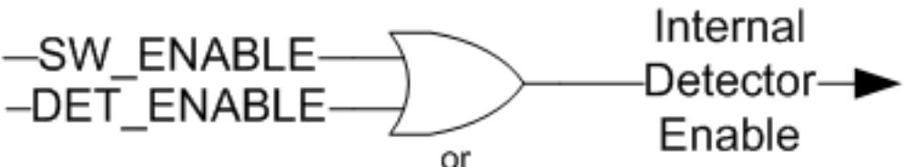

*Figure 2‐5:* **Detector Internal Enable Logic**

<span id="page-29-0"/>The internal generator enable is a logical "OR" between the GEN_ENABLE and SW_ENABLE bits in the control register. The internal logic that controls the generator sub-core enable is shown in [Figure](#page-29-1) [2-6.](#page-29-1)

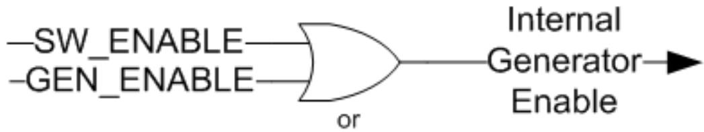

*Figure 2‐6:* **Generator Internal Enable Logic**

<span id="page-29-1"/>

| Table 2‐9: | Status Register (Address Offset 0x0004) |  |  |  |
|------------|-----------------------------------------|--|--|--|
|------------|-----------------------------------------|--|--|--|

| 0x0004           | STATUS | Read/Write                                                                                                                                                                                               |
|------------------|--------|----------------------------------------------------------------------------------------------------------------------------------------------------------------------------------------------------------|
| Name             | B its  | Description                                                                                                                                                                                              |
| FSYNC            | 31:16  | Frame Synchronization Interrupt Status. Bits 16-31 are set high<br>when frame syncs<br>0-15 are set respectively.                                                                                        |
| RESERVED         | 15:14  | Reserved                                                                                                                                                                                                 |
| GEN_ACTIVE_VIDEO | 13     | Generated Active Video Interrupt Status. Set high during the first<br>cycle the output active video is asserted.                                                                                         |
| GEN_VBLANK       | 12     | Generated Vertical Blank Interrupt Status. Set high during the first<br>cycle the output vertical blank is asserted.                                                                                     |
| DET_ACTIVE_VIDEO | 11     | Detected Active Video Interrupt Status. Set high during the first<br>cycle the input active video is asserted active after lock.                                                                         |
| DET_VBLANK       | 10     | Detected Vertical Blank Interrupt Status. Set high during the first<br>cycle the input vertical blank is asserted active after lock.                                                                     |
| LOCK_LOSS        | 9      | Loss-of-Lock Status. Set High when any detection signals have<br>lost locked. Signals that have detection disabled will not affect<br>this bit.<br>Check ERROR (0x0008) Register for signal lock status. |

#### *Table 2‐9:* **Status Register (Address Offset 0x0004)** *(Cont'd)*

| 0x0004   | STATUS | Read/Write                                                                                                                                                                                                                                                                                            |
|----------|--------|-------------------------------------------------------------------------------------------------------------------------------------------------------------------------------------------------------------------------------------------------------------------------------------------------------|
| Name     | B its  | Description                                                                                                                                                                                                                                                                                           |
| LOCK     | 8      | Lock Status. Set High when all detection signals have locked.<br>Signals that have detection disabled will not affect this bit.<br>Check ERROR (0x0008) Register for signal lock status. The<br>detector typically takes from 3 to 5 video frame periods to lock<br>onto the incoming video standard. |
| RESERVED | 7:0    | Reserved                                                                                                                                                                                                                                                                                              |

*Note:* Writing a '1' to a bit in the STATUS register will clear the corresponding interrupt when set. Writing a '1' to a bit that is cleared, will have no effect.

*Table 2‐10:* **Error Register (Address Offset 0x0008)**

| 0x0008             | ERROR | Read/Write                                                                                    |
|--------------------|-------|-----------------------------------------------------------------------------------------------|
| Name               | B its | Description                                                                                   |
| RESERVED           | 31:22 | Reserved                                                                                      |
| ACTIVE_CHROMA_LOCK | 21    | Active Chroma Lock Status. Set high when the active chroma timing<br>remains unchanged.       |
| ACTIVE_VIDEO_LOCK  | 20    | Active Video Lock Status. Set high when the active video timing remains<br>unchanged.         |
| HSYNC_LOCK         | 19    | Horizontal Sync Lock Status. Set high when the horizontal sync timing<br>remains unchanged.   |
| VSYNC_LOCK         | 18    | Vertical Sync Lock Status. Set high when the vertical sync timing remains<br>unchanged.       |
| HBLANK_LOCK        | 17    | Horizontal Blank Lock Status. Set high when the horizontal blank timing<br>remains unchanged. |
| VBLANK_LOCK        | 16    | Vertical Blank Lock Status Set high when the vertical blank timing<br>remains Unchanged.      |
| RESERVED           | 15:0  | Reserved                                                                                      |

Writing a '1' to a bit in the ERROR register will clear the corresponding bit when set. Writing a '1' to a bit that is cleared, will have no effect.

*Table 2‐11:* **IRQ Enable Register (Address Offset 0x000C)**

| 0x000C           | IRQ_ENABLE | Read/Write                                |
|------------------|------------|-------------------------------------------|
| Name             | B its      | Description                               |
| FSYNC            | 31:16      | Frame Synchronization Interrupt Enable    |
| RESERVED         | 15:14      | Reserved                                  |
| GEN_ACTIVE_VIDEO | 13         | Generated Active Video Interrupt Enable   |
| GEN_VBLANK       | 12         | Generated Vertical Blank Interrupt Enable |
| DET_ACTIVE_VIDEO | 11         | Detected Active Video Interrupt Enable    |
| DET_VBLANK       | 10         | Detected Vertical Blank Interrupt Enable  |

| 0x000C    | IRQ_ENABLE | Read/Write                    |
|-----------|------------|-------------------------------|
| Name      | B its      | Description                   |
| LOCK_LOSS | 9          | Loss-of-Lock Interrupt Enable |
| LOCK      | 8          | Lock Interrupt Enable         |
| RESERVED  | 7:0        | Reserved                      |

#### *Table 2‐11:* **IRQ Enable Register (Address Offset 0x000C)**

Setting a bit high in the IRQ_ENABLE register enables the corresponding interrupt. Bits that are low mask the corresponding interrupt from triggering.

#### *Table 2‐12:* **Version Register (Address Offset 0x0010)**

| 0x0010            | VERSION | Read                                                                                      |
|-------------------|---------|-------------------------------------------------------------------------------------------|
| Name              | B its   | Description                                                                               |
| MAJOR             | 31:24   | Major version as a hexadecimal value (0x00 - 0xFF)                                        |
| MINOR             | 23:16   | Minor version as a hexadecimal value (0x00 - 0xFF)                                        |
| REVISION          | 15:12   | Revision as a hexadecimal value (0x0 - 0xF)                                               |
| PATCH_REVISION    | 11:8    | Core Revision as a single 4-bit hexadecimal value (0x0 - 0xF) Used<br>for patch tracking. |
| INTERNAL_REVISION | 7:0     | Internal revision number. Hexadecimal value (0x00 - 0xFF)                                 |

#### *Table 2‐13:* **Detector Active Size Register (Address Offset 0x0020)**

| 0x0020       | DETECTOR<br>ACTIVE_SIZE | Read                                                                                                          |
|--------------|-------------------------|---------------------------------------------------------------------------------------------------------------|
| Name         | B its                   | Description                                                                                                   |
| RESERVED     | 31:29                   | Reserved                                                                                                      |
| ACTIVE_VSIZE | 28:16                   | Detected Vertical Active Frame Size.<br>The height of the frame without blanking in number of lines.          |
| RESERVED     | 15:13                   | Reserved                                                                                                      |
| ACTIVE_HSIZE | 12:0                    | Detected Horizontal Active Frame Size.<br>The width of the frame without blanking in number of pixels/clocks. |

#### *Table 2‐14:* **Detector Timing Status Register (Address Offset 0x0024)**

| 0x0024           | DETECTOR<br>TIMING_STATUS | Read                                                                                                                             |
|------------------|---------------------------|----------------------------------------------------------------------------------------------------------------------------------|
| Name             | B its                     | Description                                                                                                                      |
| RESERVED         | 31:3                      | Reserved                                                                                                                         |
| DET_ACTIVE_VIDEO | 2                         | Detected Active Video Interrupt Status. Set high during the<br>first cycle the input active video is asserted active after lock. |

| 0x0024     | DETECTOR<br>TIMING_STATUS | Read                                                                                                                                                                                                                                                                                                                                                                                                                                                                               |
|------------|---------------------------|------------------------------------------------------------------------------------------------------------------------------------------------------------------------------------------------------------------------------------------------------------------------------------------------------------------------------------------------------------------------------------------------------------------------------------------------------------------------------------|
| Name       | B its                     | Description                                                                                                                                                                                                                                                                                                                                                                                                                                                                        |
| DET_VBLANK | 1                         | Detected Vertical Blank Interrupt Status. Set high during the<br>first cycle the input vertical blank is asserted active after lock.                                                                                                                                                                                                                                                                                                                                               |
| LOCKED     | 0                         | Lock Status. Set High when all detection signals have locked.<br>Signals that have detection disabled will not affect this bit.<br>Check ERROR (0x0008) Register for which signal lock status.<br>The detector typically requires 3 to 5 video frame periods to<br>lock onto the incoming video standard. This bit will not latch<br>the lock status, thus, it shows the real-time status of lock as<br>opposed to the LOCKED bit in the Status Register which must<br>be cleared. |

#### *Table 2‐14:* **Detector Timing Status Register (Address Offset 0x0024)**

| Table 2‐15: | Detector Encoding Register (Address Offset 0x0028) |  |
|-------------|----------------------------------------------------|--|
|-------------|----------------------------------------------------|--|

| 0x0028          | DETECTOR<br>ENCODING | Read                                                                                                                                                                                                                                                                                                                                                                                                                                                                                                                         |
|-----------------|----------------------|------------------------------------------------------------------------------------------------------------------------------------------------------------------------------------------------------------------------------------------------------------------------------------------------------------------------------------------------------------------------------------------------------------------------------------------------------------------------------------------------------------------------------|
| Name            | B its                | Description                                                                                                                                                                                                                                                                                                                                                                                                                                                                                                                  |
| RESERVED        | 31:10                | Reserved                                                                                                                                                                                                                                                                                                                                                                                                                                                                                                                     |
| CHROMA_PARITY   | 9:8                  | Detected Chroma Parity<br>0: Chroma Active during even active-video lines of frame. Active every<br>pixel of active line<br>1: Chroma Active during odd active-video lines of frame. Active every<br>pixel of active line<br>2: Chroma Active during even active video lines of frame. Active every<br>even pixel of active line, inactive every odd pixel<br>3: Chroma Active during odd active video lines of frame. Active every<br>even pixel of active line, inactive every odd pixel                                   |
| FIELD_ID_PARITY | 7                    | Detected Field ID Parity<br>0: Field ID output is currently low<br>1: Field ID output is currently high                                                                                                                                                                                                                                                                                                                                                                                                                      |
| INTERLACED      | 6                    | Detected Progressive /Interlaced<br>0: Input video format is progressive<br>1: Input video format is interlaced                                                                                                                                                                                                                                                                                                                                                                                                              |
| RESERVED        | 5:4                  | Reserved                                                                                                                                                                                                                                                                                                                                                                                                                                                                                                                     |
| VIDEO_FORMAT    | 3:0                  | Detected Video Format Denotes when the active_chroma signal is<br>active.<br>0: YUV 4:2:2 - Active_chroma is active during the same time active_video<br>is active.<br>1: YUV 4:4:4 - Active_chroma is active during the same time active_video<br>is active.<br>2: RGB - Active_chroma is active during the same time active_video is<br>active.<br>3: YUV 4:2:0- Active_chroma is active every other line during the same<br>time active_video is active. See The CHROMA_PARITY bits to control<br>which lines and pixels. |

| 0x002C            | DETECTOR<br>POLARITY | Read                                                                                                                         |
|-------------------|----------------------|------------------------------------------------------------------------------------------------------------------------------|
| Name              | B its                | Description                                                                                                                  |
| RESERVED          | 31:7                 | Reserved                                                                                                                     |
| FIELD_ID_POL      | 6                    | Detected Field ID Polarity<br>0: Low during Field 0 and High during Field 1<br>1: High during Field 0 and Low during Field 1 |
| ACTIVE_CHROMA_POL | 5                    | Detected Active Chroma Polarity<br>0: Active Low Polarity<br>1: Active High Polarity                                         |
| ACTIVE_VIDEO_POL  | 4                    | Detected Active Video Polarity<br>0: Active Low Polarity<br>1: Active High Polarity                                          |
| HSYNC_POL         | 3                    | Detected Horizontal Sync Polarity<br>0: Active Low Polarity<br>1: Active High Polarity                                       |
| VSYNC_POL         | 2                    | Detected Vertical Sync Polarity<br>0: Active Low Polarity<br>1: Active High Polarity                                         |
| HBLANK_POL        | 1                    | Detected Horizontal Blank Polarity<br>0: Active Low Polarity<br>1: Active High Polarity                                      |
| VBLANK_POL        | 0                    | Detected Vertical Blank Polarity<br>0: Active Low Polarity<br>1: Active High Polarity                                        |

| Table 2‐16: |  | Detector Polarity Register (Address Offset 0x002C) |
|-------------|--|----------------------------------------------------|
|-------------|--|----------------------------------------------------|

| Table 2‐17: | Detector Horizontal Frame Size Register (Address Offset 0x0030) |
|-------------|-----------------------------------------------------------------|
|-------------|-----------------------------------------------------------------|

| 0x0030      | DETECTOR<br>HSIZE | Read                                                                                                |
|-------------|-------------------|-----------------------------------------------------------------------------------------------------|
| Name        | B its             | Description                                                                                         |
| RESERVED    | 31:13             | Reserved                                                                                            |
| FRAME_HSIZE | 12:0              | Detected Horizontal Frame Size. The width of the frame with<br>blanking in number of pixels/clocks. |

| Table 2‐18: |  |  | Detector Vertical Frame Size Register (Address Offset 0x0034) |
|-------------|--|--|---------------------------------------------------------------|
|-------------|--|--|---------------------------------------------------------------|

| 0x0034       | DETECTOR<br>VSIZE | Read                                                                                                  |
|--------------|-------------------|-------------------------------------------------------------------------------------------------------|
| Name         | B its             | Description                                                                                           |
| RESERVED     | 31:29             | Reserved                                                                                              |
| FIELD1_VSIZE | 28:16             | Detected Vertical Field 1 Size. The height with blanking in number<br>of lines of field 1.            |
| FRAME_VSIZE  | 12:0              | Detected Vertical Frame or Field 0 Size. The height of the frame with<br>blanking in number of lines. |

|  | 0x0038      | DETECTOR<br>HSYNC | Read                                                                                                                    |
|--|-------------|-------------------|-------------------------------------------------------------------------------------------------------------------------|
|  | Name        | B its             | Description                                                                                                             |
|  | RESERVED    | 31:29             | Reserved                                                                                                                |
|  | HSYNC_END   | 28:16             | Detected Horizontal Sync End<br>End cycle index of horizontal sync. Denotes the first cycle hsync_in<br>is de-asserted. |
|  | RESERVED    | 15:13             | Reserved                                                                                                                |
|  | HSYNC_START | 12:0              | Detected Horizontal Sync End<br>Start cycle index of horizontal sync. Denotes the first cycle hsync_in<br>is asserted.  |

#### *Table 2‐19:* **Detector Horizontal Sync Register (Address Offset 0x0038)**

#### *Table 2‐20:* **Detector Frame/Field 0 Vertical Blank Cycle Register (Address Offset 0x003C)**

| DETECTOR<br>0x003C<br>F0_VBLANK_H |       | Read                                                                                                                               |
|-----------------------------------|-------|------------------------------------------------------------------------------------------------------------------------------------|
| Name                              | B its | Description                                                                                                                        |
| RESERVED                          | 31:29 | Reserved                                                                                                                           |
| F0_VBLANK_HEND                    | 28:16 | Detected Vertical Blank Horizontal End<br>End Cycle index of vertical blank. Denotes the first cycle<br>vblank_in is de-asserted.  |
| RESERVED                          | 15:13 | Reserved                                                                                                                           |
| F0_VBLANK_HSTART                  | 12:0  | Detected Vertical Blank Horizontal Start<br>Start Cycle index of vertical blank. Denotes the first cycle<br>vblank_in is asserted. |

| Table 2‐21: | Detector Frame/Field 0 Vertical Sync Line Register (Address Offset 0x0040) |  |  |
|-------------|----------------------------------------------------------------------------|--|--|
|             |                                                                            |  |  |

| 0x0040          | DETECTOR<br>F0_VSYNC_V | Read                                                                                                                        |
|-----------------|------------------------|-----------------------------------------------------------------------------------------------------------------------------|
| Name            | B its                  | Description                                                                                                                 |
| RESERVED        | 31:29                  | Reserved                                                                                                                    |
| F0_VSYNC_VEND   | 28:16                  | Detected Vertical Sync Vertical End<br>End Line index of vertical sync. Denotes the first line vsync_in<br>is de-asserted.  |
| RESERVED        | 15:13                  | Reserved                                                                                                                    |
| F0_VSYNC_VSTART | 12:0                   | Detected Vertical Sync Vertical Start<br>Start line index of vertical sync. Denotes the first line vsync_in<br>is asserted. |

| 0x0044          | DETECTOR<br>F0_VSYNC_H | Read                                                                                                                            |
|-----------------|------------------------|---------------------------------------------------------------------------------------------------------------------------------|
| Name            | B its                  | Description                                                                                                                     |
| RESERVED        | 31:29                  | Reserved                                                                                                                        |
| F0_VSYNC_HEND   | 28:16                  | Detected Vertical Sync Horizontal End<br>End cycle index of vertical sync. Denotes the first cycle<br>vsync_in is de-asserted.  |
| RESERVED        | 15:13                  | Reserved                                                                                                                        |
| F0_VSYNC_HSTART | 12:0                   | Detected Vertical Sync Horizontal Start<br>Start cycle index of vertical sync. Denotes the first cycle<br>vsync_in is asserted. |

#### *Table 2‐22:* **Detector Frame/Field 0 Vertical Sync Cycle Register (Address Offset 0x0044)**

#### *Table 2‐23:* **Detector Field 1 Vertical Blank Cycle Register (Address Offset 0x0048)**

| 0x0048           | DETECTOR<br>F1_VBLANK_H | Read                                                                                                                                                      |
|------------------|-------------------------|-----------------------------------------------------------------------------------------------------------------------------------------------------------|
| Name             | B its                   | Description                                                                                                                                               |
| RESERVED         | 31:29                   | Reserved                                                                                                                                                  |
| F1_VBLANK_HEND   | 28:16                   | Detected Field 1 Vertical Blank Horizontal End<br>End Cycle index of vertical blank for field 1.<br>Denotes the first cycle<br>vblank_in is de-asserted.  |
| RESERVED         | 15:13                   | Reserved                                                                                                                                                  |
| F1_VBLANK_HSTART | 12:0                    | Detected Field 1 Vertical Blank Horizontal Start<br>Start Cycle index of vertical blank for field 1.<br>Denotes the first cycle<br>vblank_in is asserted. |

#### *Table 2‐24:* **Detector Field 1 Vertical Sync Line Register (Address Offset 0x004C)**

| 0x004C          | DETECTOR<br>F1_VSYNC_V | Read                                                                                                                                               |
|-----------------|------------------------|----------------------------------------------------------------------------------------------------------------------------------------------------|
| Name            | B its                  | Description                                                                                                                                        |
| RESERVED        | 31:29                  | Reserved                                                                                                                                           |
| F1_VSYNC_VEND   | 28:16                  | Detected Field 1 Vertical Sync Vertical End<br>End Line index of vertical sync for field 1.<br>Denotes the first line vsync_in<br>is de-asserted.  |
| RESERVED        | 15:13                  | Reserved                                                                                                                                           |
| F1_VSYNC_VSTART | 12:0                   | Detected Field 1 Vertical Sync Vertical Start<br>Start line index of vertical sync for field 1.<br>Denotes the first line vsync_in<br>is asserted. |

| 0x0050          | DETECTOR<br>F1_VSYNC_H | Read                                                                                                                                                   |
|-----------------|------------------------|--------------------------------------------------------------------------------------------------------------------------------------------------------|
| Name            | B its                  | Description                                                                                                                                            |
| RESERVED        | 31:29                  | Reserved                                                                                                                                               |
| F1_VSYNC_HEND   | 28:16                  | Detected Field 1 Vertical Sync Horizontal End<br>End cycle index of vertical sync for field 1.<br>Denotes the first cycle<br>vsync_in is de-asserted.  |
| RESERVED        | 15:13                  | Reserved                                                                                                                                               |
| F1_VSYNC_HSTART | 12:0                   | Detected Field 1 Vertical Sync Horizontal Start<br>Start cycle index of vertical sync for field 1.<br>Denotes the first cycle<br>vsync_in is asserted. |

#### *Table 2‐25:* **Detector Field 1 Vertical Sync Cycle Register (Address Offset 0x0050)**

|  | Table 2‐26: | Generator Active Size Register (Address Offset 0x0060) |
|--|-------------|--------------------------------------------------------|
|--|-------------|--------------------------------------------------------|

| 0x0060       | GENERATOR<br>ACTIVE_SIZE | Read/Write                                                                                                     |
|--------------|--------------------------|----------------------------------------------------------------------------------------------------------------|
| Name         | B its                    | Description                                                                                                    |
| RESERVED     | 31:29                    | Reserved                                                                                                       |
| ACTIVE_VSIZE | 28:16                    | Generated Vertical Active Frame Size. The height of the frame<br>without blanking in number of lines.          |
| RESERVED     | 15:13                    | Reserved                                                                                                       |
| ACTIVE_HSIZE | 12:0                     | Generated Horizontal Active Frame Size. The width of the frame<br>without blanking in number of pixels/clocks. |

#### *Table 2‐27:* **Generator Timing Status Register (Address Offset 0x0064)**

| 0x0064           | GENERATOR<br>TIMING_STATUS | Read                                                                                                                 |
|------------------|----------------------------|----------------------------------------------------------------------------------------------------------------------|
| Name             | B its                      | Description                                                                                                          |
| RESERVED         | 31:3                       | Reserved                                                                                                             |
| GEN_ACTIVE_VIDEO | 2                          | Generated Active Video Interrupt Status. Set high during the<br>first cycle the output active video is asserted.     |
| GEN_VBLANK       | 1                          | Generated Vertical Blank Interrupt Status. Set high during the<br>first cycle the output vertical blank is asserted. |
| RESERVED         | 0                          | Reserved                                                                                                             |

| 0x0068          | GENERATOR<br>ENCODING | Read/Write                                                                                                                                                                                                                                                                                                                                                                                                                                                                                                                    |
|-----------------|-----------------------|-------------------------------------------------------------------------------------------------------------------------------------------------------------------------------------------------------------------------------------------------------------------------------------------------------------------------------------------------------------------------------------------------------------------------------------------------------------------------------------------------------------------------------|
| Name            | B its                 | Description                                                                                                                                                                                                                                                                                                                                                                                                                                                                                                                   |
| RESERVED        | 31:10                 | Reserved                                                                                                                                                                                                                                                                                                                                                                                                                                                                                                                      |
| CHROMA_PARITY   | 9:8                   | Generated Chroma Parity<br>0: Chroma Active during even active-video lines of frame. Active<br>every pixel of active line<br>1: Chroma Active during odd active-video lines of frame. Active<br>every pixel of active line<br>2: Chroma Active during even active video lines of frame. Active<br>every even pixel of active line, inactive every odd pixel<br>3: Chroma Active during odd active video lines of frame. Active<br>every even pixel of active line, inactive every odd pixel                                   |
| FIELD_ID_PARITY | 7                     | Generated Field ID Parity<br>0: Field ID input is currently low<br>1: Field ID input is currently high                                                                                                                                                                                                                                                                                                                                                                                                                        |
| INTERLACED      | 6                     | Generated Progressive/Interlaced<br>0: Generated video format is progressive<br>1: Generated video format is interlaced                                                                                                                                                                                                                                                                                                                                                                                                       |
| RESERVED        | 5:4                   | Reserved                                                                                                                                                                                                                                                                                                                                                                                                                                                                                                                      |
| VIDEO_FORMAT    | 3:0                   | Generated Video Format Denotes when the active_chroma signal<br>is active.<br>0: YUV 4:2:2 - Active_chroma is active during the same time<br>active_video is active.<br>1: YUV 4:4:4 - Active_chroma is active during the same time<br>active_video is active.<br>2: RGB - Active_chroma is active during the same time<br>active_video is active.<br>3: YUV 4:2:0- Active_chroma is active every other line during the<br>same time active_video is active. See The CHROMA_PARITY bits to<br>control which lines and pixels. |

| Table 2‐28: | Generator Encoding Register (Address Offset 0x0068) |
|-------------|-----------------------------------------------------|
|-------------|-----------------------------------------------------|

#### *Table 2‐29:* **Generator Polarity Register (Address Offset 0x006C)**

| 0x006C            | GENERATOR<br>POLARITY | Read/Write                                                                                                                    |
|-------------------|-----------------------|-------------------------------------------------------------------------------------------------------------------------------|
| Name              | B its                 | Description                                                                                                                   |
| RESERVED          | 31:7                  | Reserved                                                                                                                      |
| FIELD_ID_POL      | 6                     | Generated Field ID Polarity<br>0: Low during Field 0 and High during Field 1<br>1: High during Field 0 and Low during Field 1 |
| ACTIVE_CHROMA_POL | 5                     | Generated Active Chroma Polarity<br>0: Active Low Polarity<br>1: Active High Polarity                                         |

| 0x006C           | GENERATOR<br>POLARITY | Read/Write                                                                               |
|------------------|-----------------------|------------------------------------------------------------------------------------------|
| Name             | B its                 | Description                                                                              |
| ACTIVE_VIDEO_POL | 4                     | Generated Active Video Polarity<br>0: Active Low Polarity<br>1: Active High Polarity     |
| HSYNC_POL        | 3                     | Generated Horizontal Sync Polarity<br>0: Active Low Polarity<br>1: Active High Polarity  |
| VSYNC_POL        | 2                     | Generated Vertical Sync Polarity<br>0: Active Low Polarity<br>1: Active High Polarity    |
| HBLANK_POL       | 1                     | Generated Horizontal Blank Polarity<br>0: Active Low Polarity<br>1: Active High Polarity |
| VBLANK_POL       | 0                     | Generated Vertical Blank Polarity<br>0: Active Low Polarity<br>1: Active High Polarity   |

*Table 2‐29:* **Generator Polarity Register (Address Offset 0x006C)**

#### *Table 2‐30:* **Generator Horizontal Frame Size Register (Address Offset 0x0070)**

| 0x0070      | GENERATOR<br>HSIZE | Read/Write                                                                                           |
|-------------|--------------------|------------------------------------------------------------------------------------------------------|
| Name        | B its              | Description                                                                                          |
| RESERVED    | 31:13              | Reserved                                                                                             |
| FRAME_HSIZE | 12:0               | Generated Horizontal Frame Size. The width of the frame with<br>blanking in number of pixels/clocks. |

#### *Table 2‐31:* **Generator Vertical Frame Size Register (Address Offset 0x0074)**

| 0x0074       | GENERATOR<br>VSIZE | Read/Write                                                                                  |
|--------------|--------------------|---------------------------------------------------------------------------------------------|
| Name         | B its              | Description                                                                                 |
| RESERVED     | 31:29              | Reserved                                                                                    |
| FIELD1_VSIZE | 28:16              | Generated Vertical Field 1 Size. The height with blanking in number<br>of lines of field 1. |
| FRAME_VSIZE  | 12:0               | Generated Vertical Frame Size. The height of the frame with<br>blanking in number of lines. |

| 0x0078      | GENERATOR<br>HSYNC | Read/Write                                                                                                               |
|-------------|--------------------|--------------------------------------------------------------------------------------------------------------------------|
| Name        | B its              | Description                                                                                                              |
| RESERVED    | 31:29              | Reserved                                                                                                                 |
| HSYNC_END   | 28:16              | Generated Horizontal Sync End<br>End cycle index of horizontal sync. Denotes the first cycle hsync_in<br>is de-asserted. |
| RESERVED    | 15:13              | Reserved                                                                                                                 |
| HSYNC_START | 12:0               | Generated Horizontal Sync End<br>Start cycle index of horizontal sync. Denotes the first cycle<br>hsync_in is asserted.  |

#### *Table 2‐32:* **Generator Horizontal Sync Register (Address Offset 0x0078)**

#### *Table 2‐33:* **Generator Frame/Field 0 Vertical Blank Cycle Register (Address Offset 0x007C)**

| 0x007C           | GENERATOR<br>F0_VBLANK_H | Read/Write                                                                                                                          |
|------------------|--------------------------|-------------------------------------------------------------------------------------------------------------------------------------|
| Name             | B its                    | Description                                                                                                                         |
| RESERVED         | 31:29                    | Reserved                                                                                                                            |
| F0_VBLANK_HEND   | 28:16                    | Generated Vertical Blank Horizontal End<br>End Cycle index of vertical blank. Denotes the first cycle<br>vblank_in is de-asserted.  |
| RESERVED         | 15:13                    | Reserved                                                                                                                            |
| F0_VBLANK_HSTART | 12:0                     | Generated Vertical Blank Horizontal Start<br>Start Cycle index of vertical blank. Denotes the first cycle<br>vblank_in is asserted. |

| Table 2‐34: | Generator Frame/Field 0 Vertical Sync Line Register (Address Offset 0x0080) |  |
|-------------|-----------------------------------------------------------------------------|--|
|             |                                                                             |  |

| 0x0080          | GENERATOR<br>F0_VSYNC_V | Read/Write                                                                                                                   |
|-----------------|-------------------------|------------------------------------------------------------------------------------------------------------------------------|
| Name            | B its                   | Description                                                                                                                  |
| RESERVED        | 31:29                   | Reserved                                                                                                                     |
| F0_VSYNC_VEND   | 28:16                   | Generated Vertical Sync Vertical End<br>End Line index of vertical sync. Denotes the first line<br>vsync_in is de-asserted.  |
| RESERVED        | 15:13                   | Reserved                                                                                                                     |
| F0_VSYNC_VSTART | 12:0                    | Generated Vertical Sync Vertical Start<br>Start line index of vertical sync. Denotes the first line<br>vsync_in is asserted. |

|  | GENERATOR<br>0x0084<br>F0_VSYNC_H |       | Read/Write                                                                                                                       |
|--|-----------------------------------|-------|----------------------------------------------------------------------------------------------------------------------------------|
|  | Name                              | B its | Description                                                                                                                      |
|  | RESERVED                          | 31:29 | Reserved                                                                                                                         |
|  | F0_VSYNC_HEND                     | 28:16 | Generated Vertical Sync Horizontal End<br>End cycle index of vertical sync. Denotes the first cycle vsync_in<br>is de-asserted.  |
|  | RESERVED                          | 15:13 | Reserved                                                                                                                         |
|  | F0_VSYNC_HSTART                   | 12:0  | Generated Vertical Sync Horizontal Start<br>Start cycle index of vertical sync. Denotes the first cycle vsync_in<br>is asserted. |

#### *Table 2‐35:* **Generator Frame/Field 0 Vertical Sync Cycle Register (Address Offset 0x0084)**

#### *Table 2‐36:* **Generator Field 1 Vertical Blank Cycle Register (Address Offset 0x0088)**

| 0x0088           | GENERATOR<br>F1_VBLANK_H | Read                                                                                                                                                       |
|------------------|--------------------------|------------------------------------------------------------------------------------------------------------------------------------------------------------|
| Name             | Bits                     | Description                                                                                                                                                |
| RESERVED         | 31:29                    | Reserved                                                                                                                                                   |
| F1_VBLANK_HEND   | 28:16                    | Generated Field 1 Vertical Blank Horizontal End<br>End Cycle index of vertical blank for field 1.<br>Denotes the first cycle<br>vblank_in is de-asserted.  |
| RESERVED         | 15:13                    | Reserved                                                                                                                                                   |
| F1_VBLANK_HSTART | 12:0                     | Generated Field 1 Vertical Blank Horizontal Start<br>Start Cycle index of vertical blank for field 1.<br>Denotes the first cycle<br>vblank_in is asserted. |

#### *Table 2‐37:* **Generator Field 1 Vertical Sync Line Register (Address Offset 0x008C)**

| 0x008C          | GENERATOR<br>F1_VSYNC_V | Read                                                                                                                                                |
|-----------------|-------------------------|-----------------------------------------------------------------------------------------------------------------------------------------------------|
| Name            | Bits                    | Description                                                                                                                                         |
| RESERVED        | 31:29                   | Reserved                                                                                                                                            |
| F1_VSYNC_VEND   | 28:16                   | Generated Field 1 Vertical Sync Vertical End<br>End Line index of vertical sync for field 1.<br>Denotes the first line vsync_in<br>is de-asserted.  |
| RESERVED        | 15:13                   | Reserved                                                                                                                                            |
| F1_VSYNC_VSTART | 12:0                    | Generated Field 1 Vertical Sync Vertical Start<br>Start line index of vertical sync for field 1.<br>Denotes the first line vsync_in<br>is asserted. |

| 0x0090          | GENERATOR<br>F1_VSYNC_H | Read                                                                                                                                                    |
|-----------------|-------------------------|---------------------------------------------------------------------------------------------------------------------------------------------------------|
| Name            | Bits                    | Description                                                                                                                                             |
| RESERVED        | 31:29                   | Reserved                                                                                                                                                |
| F1_VSYNC_HEND   | 28:16                   | Generated Field 1 Vertical Sync Horizontal End<br>End cycle index of vertical sync for field 1.<br>Denotes the first cycle<br>vsync_in is de-asserted.  |
| RESERVED        | 15:13                   | Reserved                                                                                                                                                |
| F1_VSYNC_HSTART | 12:0                    | Generated Field 1 Vertical Sync Horizontal Start<br>Start cycle index of vertical sync for field 1.<br>Denotes the first cycle<br>vsync_in is asserted. |

#### *Table 2‐38:* **Generator Field 1 Vertical Sync Cycle Register (Address Offset 0x0090)**

| Table 2‐39: | Frame Sync 0-15 Configuration Registers (Address Offsets 0x0100 - 0x013C) |  |  |  |  |  |
|-------------|---------------------------------------------------------------------------|--|--|--|--|--|
|             |                                                                           |  |  |  |  |  |

| 0x0100   | FRAME SYNC 0<br>CONFIG | Read/Write                                                                                                                                                                                                                                                                        |
|----------|------------------------|-----------------------------------------------------------------------------------------------------------------------------------------------------------------------------------------------------------------------------------------------------------------------------------|
| Name     | B its                  | Description                                                                                                                                                                                                                                                                       |
| RESERVED | 31:29                  | Reserved                                                                                                                                                                                                                                                                          |
| V_START  | 28:16                  | FRAME SYNCHRONIZATION VERTICAL START<br>Vertical line during which the fsync_out[0] output port is asserted<br>active-high.<br>Note: Frame Syncs are not active during the complete line, only in<br>the cycle during which both the V_START and H_START are valid<br>each frame. |
| RESERVED | 15:13                  | Reserved                                                                                                                                                                                                                                                                          |
| H_START  | 12:0                   | FRAME SYNCHRONIZATION HORIZONTAL START<br>Horizontal Cycle during which fsync_out[0] output port is asserted<br>active-high                                                                                                                                                       |

Frame Sync 1-15 Config Registers (address offset 0x0100 - 0x013c) have the same format as the Frame Sync 0 Config Register.

| Table 2‐40: | Generator Global Delay Register (Address Offset 0x140) |  |
|-------------|--------------------------------------------------------|--|
|-------------|--------------------------------------------------------|--|

| 0x140    | Generator<br>Global Delay | Read/Write                                                                                                                                                                                                                                                                                         |
|----------|---------------------------|----------------------------------------------------------------------------------------------------------------------------------------------------------------------------------------------------------------------------------------------------------------------------------------------------|
| Name     | Bits                      | Description                                                                                                                                                                                                                                                                                        |
| Reserved | 31:29                     | Reserved                                                                                                                                                                                                                                                                                           |
| V_DELAY  | 28:16                     | GENERATOR VERTICAL DELAY<br>Vertical line offset. This is the number of lines that the generated output<br>will be shifted relative to the detector (input timing). The vertical delay<br>is only available when both the detector and generator are enabled. Can<br>be combined with the H_DELAY. |

| 0x140    | Generator<br>Global Delay | Read/Write                                                                                                                                                                                                                                                                                                       |
|----------|---------------------------|------------------------------------------------------------------------------------------------------------------------------------------------------------------------------------------------------------------------------------------------------------------------------------------------------------------|
| Reserved | 15:13                     | Reserved                                                                                                                                                                                                                                                                                                         |
| H_DELAY  | 12:0                      | GENERATOR HORIZONTAL DELAY<br>Horizontal cycle offset. This is the number of clock cycles that the<br>generated output will be shifted relative to the detector (input timing).<br>The horizontal delay is only available when both the detector and<br>generator are enabled. Can be combined with the V_DELAY. |

*Table 2‐40:* **Generator Global Delay Register (Address Offset 0x140)** *(Cont'd)*


<span id="page-43-2"/>X-Ref Target - Figure 3-1

# <span id="page-43-0"/>Designing with the Core

# <span id="page-43-1"/>**Basic Architecture**

The Video Timing Controller core contains three modules: the video timing detector, the video timing generator and the interrupt controller. See [Figure](#page-43-2) [3-1](#page-43-2).

Either the detector or the generator module can be disabled at instantiation with the GUI to save resources.

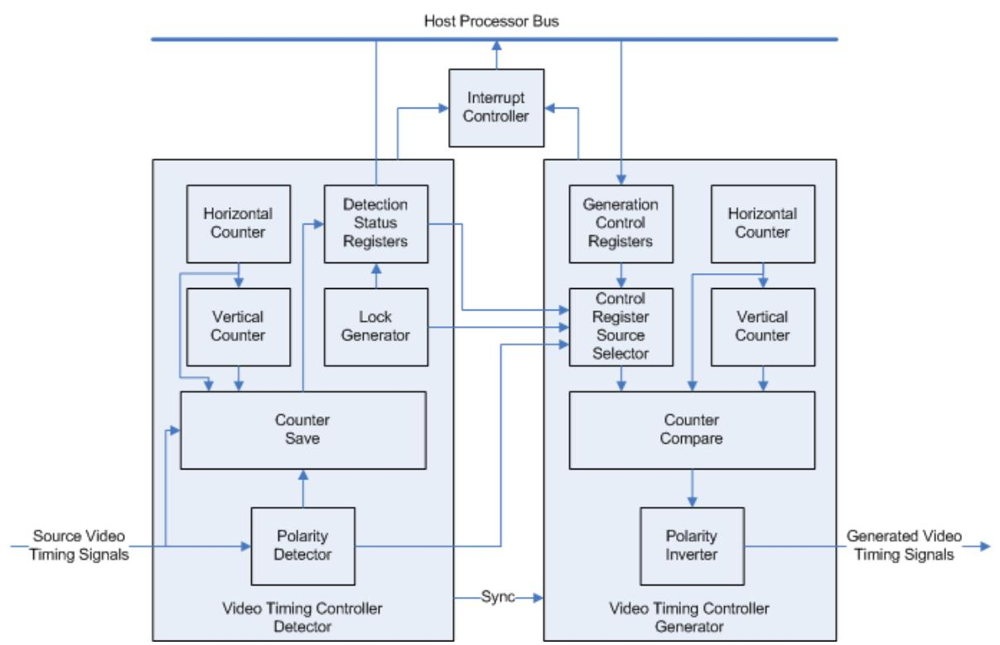

*Figure 3‐1:* **Video Timing Controller Block Diagram**

X-Ref Target - Figure 3-2

# <span id="page-44-0"/>**Control Signals and Timing**

The Video Timing Controller Inputs and Outputs are discussed and shown with timing diagrams in the following sections.

The blanking and active period definitions were discussed in [Chapter](#page-4-1) [1, Overview](#page-4-1). In addition to these definitions, the period from the start of blanking (or end of active video) to the start of synchronization is called the front porch. The period from the end of synchronization to the end of blanking (or start of active video) is called the back porch. The total horizontal period (including blanking and active video) can also be defined, and similarly the total vertical period.

[Figure](#page-44-1) [3-2](#page-44-1) shows the start of the horizontal front porch (Hblank Start), synchronization (Hsync Start), back porch (Hsync End) and active video (SAV). It also shows the start of the vertical front porch (Vblank Start), synchronization (Vsync Start), back porch (Vsync End) and active video (SAV). The total number of horizontal clock cycles is HSIZE and the total number of lines is the VSIZE.


#### <span id="page-44-1"/>*Figure 3‐2:* **Example Video Frame and Timing Signals with Front and Back Porch**

These definitions of video frame periods are used for both [Video Timing Detection](#page-45-0) and [Video Timing Generation.](#page-45-1)

**IMPORTANT:** *Note that pixels-per-clock for video data and timing is non-existent in the Video Timing Controller. There is only a single set of timing signals for the video data bus. This means that horizontal timing settings can be detected and generated only for a multiple of the pixels-per-clock configured in the system. For example, given a video format where the active line is 1920, the system configured with a video data bus operating at 4 pixels-per-clock, the detected and generated timing for the active line would be (1920 pixels / 4 pixels-per-clock) = 480 clocks. Similarly, all other horizontal components (i.e. hsync, hblank) would be effected, while the vertical components do not change.*

### <span id="page-45-0"/>**Video Timing Detection**

The Video Timing Controller has six optional inputs for detecting the timing of the input video signal: vertical blank, vertical synchronization, horizontal blank, horizontal synchronization, active video and active chroma. The minimum set of inputs required to detect is either vertical blank, horizontal blank and active video or vertical sync, horizontal sync and active video. To enable detection, the *Enable Detection* GUI parameter must be set, and the control register bit 1 must also be set. The GUI parameter allows saving FPGA resources. The *Control Register* allows run-time flexibility. Other GUI parameters can be set to selectively disable detection of one or more input video timing signals.

The detected polarity of each input signal is shown by bits 0-5 of the Detection Polarity Register (address offset 0x2C). High denotes active high polarity, and low denotes active low polarity. Bits 8 and 9 of the Detection Encoding Register shows the number of lines skipped between each active chroma line. Bit 8 High denotes that every other line is skipped (4:2:0), and low denotes that no lines are skipped (4:4:4 or 4:2:2). Bit 9 High denotes that every other pixel is skipped, and low denotes that no pixels are skipped.

If any input (vblank_in, vsync_in, hblank_in, hsync_in, active_video_in, active_chroma_in) is not driven or is not connected, then detection for that input must be disabled. To disable detection for an input, deselect the appropriate option in the GUI ("Vertical Blank Detection", "Vertical Sync Detection", etc.).

### <span id="page-45-1"/>**Video Timing Generation**

The Video Timing Controller can generate up to six output video signals: vertical blank, vertical synchronization, horizontal blank, horizontal synchronization, active video and active chroma. To enable generation of these signals, the *Enable Generation* GUI parameter must be set, and the control register bit 0 or bit 2 must also be set. Other GUI parameters can be set to selectively disable generation of one or more video timing signals.

The polarity of each output signal can be set by bits 0-5 of the Generator Polarity Register (Address Offset 0x006C). High denotes active high polarity, and low denotes active low polarity. Bits 8 and 9 of the Control Register also sets the number of lines skipped between each active chroma line. Bit 8 High denotes that every other line is skipped (4:2:0), and low denotes that no lines are skipped (4:4:4 or 4:2:2). Bit 9 High denotes that every other pixel is skipped, and low denotes that no pixels are skipped.

The Video Timing Controller has bits in the *Control Register* called *Source Selects* to select the internal detection registers or the external input generation registers. These bits allow the detected timing (if enabled) to control the generated outputs or allow the host processor to override each value independently via the generation registers at address offset 0x0060 - 0x0084, as described in [Table](#page-23-0) [2-7.](#page-23-0)

[Table](#page-46-0) [3-1](#page-46-0) through [Table](#page-54-0) [3-6](#page-54-0) show example settings of the input control busses and the resultant video timing output signals.

#### **Horizontal Generation Configuration Example**

Programming the horizontal generation registers to the values shown in [Table](#page-46-0) [3-1](#page-46-0) will result in the video timing signal outputs shown in [Figure](#page-46-1) [3-3.](#page-46-1)

Notice that in [Table](#page-46-0) [3-1](#page-46-0) the Control Register bit 2 is set to enable generation, that all source selects are set to 1 to select the Generation Registers and that the polarity bits are all set to 1 to configure the outputs for active high polarity.

| Register Address | Register Name         | Value       |
|------------------|-----------------------|-------------|
| 0x0060           | Generator Active Size | 0x0003_0003 |
| 0x0070           | Generator HSize       | 0x0000_0007 |
| 0x0078           | Generator HSync       | 0x0005_0004 |
| 0x0068           | Generator Encoding    | 0x0000_0000 |
| 0x006C           | Generator Polarity    | 0x0000_003f |
| 0x0000           | Control               | 0x01ff_ff07 |

<span id="page-46-0"/>*Table 3‐1:* **Example Horizontal Generation Register Inputs**

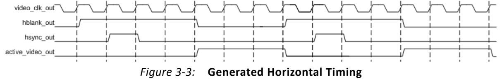

**IMPORTANT:** *All signals are shown active high. The polarities of the output signals can be changed at any time via the GENERATOR POLARITY REGISTER (0x006C).* 

The following C code shows how to configure the register values in [Table](#page-46-0) [3-1](#page-46-0) using the Video Timing Controller driver.

```
 XVtc Vtc; /* Device driver instance */
XVtc_Signal SignalCfg; /* VTC Signal configuration */
XVtc_Polarity Polarity; /* Polarity configuration */
XVtc_SourceSelect SourceSelect;/* Source Selection configuration */
```
<span id="page-46-1"/>X-Ref Target - Figure 3-3

```
 XVtc_Config *VtcCfgPtr;
VtcCfgPtr = XVtc_LookupConfig(VTC_DEVICE_ID);
XVtc_CfgInitialize(&Vtc, VtcCfgPtr, VtcCfgPtr->BaseAddress);
/* Setup the VTC Source Select config structure. */
/* 1=Generator registers are source */
/* 0=Detector registers are source */
memset((void *)&SourceSelect, 0, sizeof(SourceSelect));
SourceSelect.VBlankPolSrc = 1;
SourceSelect.VSyncPolSrc = 1;
SourceSelect.HBlankPolSrc = 1;
SourceSelect.HSyncPolSrc = 1;
SourceSelect.ActiveVideoPolSrc = 1;
SourceSelect.ActiveChromaPolSrc= 1;
SourceSelect.VChromaSrc = 1;
SourceSelect.VActiveSrc = 1;
SourceSelect.VBackPorchSrc = 1;
SourceSelect.VSyncSrc = 1;
SourceSelect.VFrontPorchSrc = 1;
SourceSelect.VTotalSrc = 1;
SourceSelect.HActiveSrc = 1;
SourceSelect.HBackPorchSrc = 1;
SourceSelect.HSyncSrc = 1;
SourceSelect.HFrontPorchSrc = 1;
SourceSelect.HTotalSrc = 1;

/* Setup the VTC Polarity config structure. */
memset((void *)&Polarity, 0, sizeof(Polarity));
Polarity.ActiveChromaPol = 1;
Polarity.ActiveVideoPol = 1;
Polarity.VBlankPol = 1;
Polarity.VSyncPol = 1;
Polarity.HBlankPol = 1;
Polarity.HSyncPol = 1;

/* Setup the VTC Signal config structure. */
memset((void *)&SignalCfg, 0, sizeof(XVtc_Signal));
SignalCfg.OriginMode = 1;//Set Frame Origin to Start of Active Video
SignalCfg.HTotal = 7;
SignalCfg.HActiveStart = 0;
SignalCfg.HFrontPorchStart = 3;// Active Video Width
SignalCfg.HSyncStart = 4;// Active Video Width + FP Width
SignalCfg.HBackPorchStart = 5;// Active Video Width + FP Width + Sync Width

SignalCfg.V0Total = 7;
SignalCfg.V0ChromaStart = 0;
SignalCfg.V0ActiveStart = 0;
SignalCfg.V0FrontPorchStart = 3;// Active Video Height
SignalCfg.V0SyncStart = 4;// Active Video Height + FP_Width
SignalCfg.V0BackPorchStart = 5;// Active Video Height + FP Width + Sync Width
/* Write VTC config to HW */ 
XVtc_RegUpdate(&VTC);
XVtc_SetPolarity(&Vtc, &Polarity);
XVtc_SetGenerator(&Vtc, &SignalCfg);
XVtc_SetSource(&Vtc, &SourceSelect);
```

```
 /* Enable VTC Generator */ 
XVtc_Enable Generator(&Vtc);
```
### **Vertical Generation Configuration Example**

Programming the generation registers to the values shown in [Table](#page-48-0) [3-2](#page-48-0) will result in the video timing signal outputs shown in [Figure](#page-48-1) [3-4.](#page-48-1)

Notice that in [Table](#page-48-0) [3-2](#page-48-0) the Generator Encoding Register bits [3:0] are set to 0 to configure the number of lines skipped between each active chroma line to be 0. This configures the Active Chroma output signal for 4:4:4 or 4:2:2 mode in which every line contains valid chroma samples.

| Register Address | Register Name           | Value       |
|------------------|-------------------------|-------------|
| 0x0060           | Generator Active Size   | 0x0004_0003 |
| 0x0070           | Generator HSize         | 0x0000_0007 |
| 0x0074           | Generator VSize         | 0x0000_0008 |
| 0x0078           | Generator HSync         | 0x0005_0004 |
| 0x0080           | Generator Frame 0 Vsync | 0x0006_0005 |
| 0x0068           | Generator Encoding      | 0x0000_0000 |
| 0x006C           | Generator Polarity      | 0x0000_003f |
| 0x0000           | Control                 | 0x01ff_ff07 |

<span id="page-48-0"/>*Table 3‐2:* **Example Vertical Generation Register Inputs**

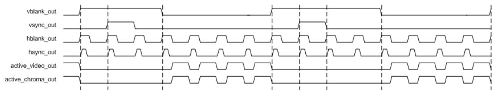

*Figure 3‐4:* **Generated Vertical Timing (4:4:4 Chroma)**

The following C code shows how to configure the register values in [Table](#page-48-0) [3-2](#page-48-0) using the Video Timing Controller driver.

```
 XVtc Vtc; /* Device driver instance */
XVtc_Signal SignalCfg; /* VTC Signal configuration */
XVtc_Polarity Polarity; /* Polarity configuration */
XVtc_SourceSelect SourceSelect;/* Source Selection configuration */
XVtc_Config *VtcCfgPtr;
VtcCfgPtr = XVtc_LookupConfig(VTC_DEVICE_ID);
```
<span id="page-48-1"/>X-Ref Target - Figure 3-4

```
 XVtc_CfgInitialize(&Vtc, VtcCfgPtr, VtcCfgPtr->BaseAddress);
/* Setup the VTC Source Select config structure. */
/* 1=Generator registers are source */
/* 0=Detector registers are source */
memset((void *)&SourceSelect, 0, sizeof(SourceSelect));
SourceSelect.VBlankPolSrc = 1;
SourceSelect.VSyncPolSrc = 1;
SourceSelect.HBlankPolSrc = 1;
SourceSelect.HSyncPolSrc = 1;
SourceSelect.ActiveVideoPolSrc = 1;
SourceSelect.ActiveChromaPolSrc= 1;
SourceSelect.VChromaSrc = 1;
SourceSelect.VActiveSrc = 1;
SourceSelect.VBackPorchSrc = 1;
SourceSelect.VSyncSrc = 1;
SourceSelect.VFrontPorchSrc = 1;
SourceSelect.VTotalSrc = 1;
SourceSelect.HActiveSrc = 1;
SourceSelect.HBackPorchSrc = 1;
SourceSelect.HSyncSrc = 1;
SourceSelect.HFrontPorchSrc = 1;
SourceSelect.HTotalSrc = 1;
/* Setup the VTC Polarity config structure. */
memset((void *)&Polarity, 0, sizeof(Polarity));
Polarity.ActiveChromaPol = 1;
Polarity.ActiveVideoPol = 1;
Polarity.VBlankPol = 1;
Polarity.VSyncPol = 1;
Polarity.HBlankPol = 1;
Polarity.HSyncPol = 1;
/* Setup the VTC Signal config structure. */
memset((void *)&SignalCfg, 0, sizeof(XVtc_Signal));
SignalCfg.OriginMode = 1;//Set Frame Origin to Start of Active Video
SignalCfg.HTotal = 7;
SignalCfg.HActiveStart = 0;
SignalCfg.HFrontPorchStart = 3;// Active Video Width
SignalCfg.HSyncStart = 4;// Active Video Width + FP Width
SignalCfg.HBackPorchStart = 5;// Active Video Width + FP Width + Sync Width
SignalCfg.V0Total = 8;
SignalCfg.V0ChromaStart = 0;
SignalCfg.V0ActiveStart = 0;
SignalCfg.V0FrontPorchStart = 4;// Active Video Height
SignalCfg.V0SyncStart = 5;// Active Video Height + FP_Width
SignalCfg.V0BackPorchStart = 6;// Active Video Height + FP Width + Sync Width
/* Write VTC config to HW */ 
XVtc_RegUpdate(&VTC);
XVtc_SetPolarity(&Vtc, &Polarity);
XVtc_SetGenerator(&Vtc, &SignalCfg);
XVtc_SetSource(&Vtc, &SourceSelect);
/* Enable VTC Generator */ 
XVtc_Enable Generator(&Vtc);
```
#### **Vertical Generation Configuration Example with Active Chroma for YUV 4:2:0 Active for Even Lines**

Programming the vertical generation registers to the values shown in [Table](#page-50-0) [3-3](#page-50-0) will result in the video timing signal outputs shown in [Figure](#page-50-1) [3-5.](#page-50-1)

Notice that in [Table](#page-50-0) [3-3](#page-50-0) the Generator Encoding Register bits [3:0] are set to 0b0011 to configure the number of lines skipped between each active chroma line to be one line. This configures the Active Chroma output signal for 4:2:0 mode in which only every other line contains valid chroma samples.

| Register Address | Register Name           | Value       |
|------------------|-------------------------|-------------|
| 0x0060           | Generator Active Size   | 0x0004_0003 |
| 0x0070           | Generator HSize         | 0x0000_0007 |
| 0x0074           | Generator VSize         | 0x0000_0008 |
| 0x0078           | Generator HSync         | 0x0005_0004 |
| 0x0080           | Generator Frame 0 Vsync | 0x0006_0005 |
| 0x0068           | Generator Encoding      | 0x0000_0003 |
| 0x006C           | Generator Polarity      | 0x0000_003f |
| 0x0000           | Control                 | 0x01ff_ff07 |

<span id="page-50-0"/>*Table 3‐3:* **Example Vertical Generation Register Inputs (4:2:0 Chroma)**

<span id="page-50-1"/>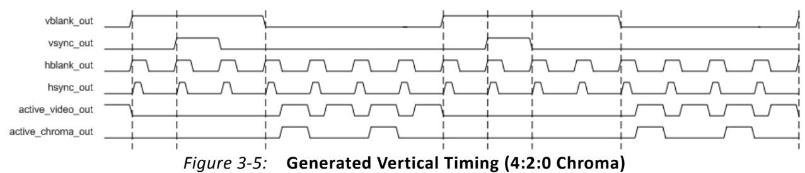

The following C code shows how to configure the register values in [Table](#page-50-0) [3-3](#page-50-0) using the Video Timing Controller driver.

```
 XVtc Vtc; /* Device driver instance */
XVtc_Signal SignalCfg; /* VTC Signal configuration */
XVtc_Polarity Polarity; /* Polarity configuration */
XVtc_SourceSelect SourceSelect;/* Source Selection configuration */
XVtc_Config *VtcCfgPtr;
VtcCfgPtr = XVtc_LookupConfig(VTC_DEVICE_ID);
XVtc_CfgInitialize(&Vtc, VtcCfgPtr, VtcCfgPtr->BaseAddress);
/* Setup the VTC Source Select config structure. */
```

```
 /* 1=Generator registers are source */
/* 0=Detector registers are source */
memset((void *)&SourceSelect, 0, sizeof(SourceSelect));
SourceSelect.VBlankPolSrc = 1;
SourceSelect.VSyncPolSrc = 1;
SourceSelect.HBlankPolSrc = 1;
SourceSelect.HSyncPolSrc = 1;
SourceSelect.ActiveVideoPolSrc = 1;
SourceSelect.ActiveChromaPolSrc= 1;
SourceSelect.VChromaSrc = 1;
SourceSelect.VActiveSrc = 1;
SourceSelect.VBackPorchSrc = 1;
SourceSelect.VSyncSrc = 1;
SourceSelect.VFrontPorchSrc = 1;
SourceSelect.VTotalSrc = 1;
SourceSelect.HActiveSrc = 1;
SourceSelect.HBackPorchSrc = 1;
SourceSelect.HSyncSrc = 1;
SourceSelect.HFrontPorchSrc = 1;
SourceSelect.HTotalSrc = 1;
/* Setup the VTC Polarity config structure. */
memset((void *)&Polarity, 0, sizeof(Polarity));
Polarity.ActiveChromaPol = 1;
Polarity.ActiveVideoPol = 1;
Polarity.VBlankPol = 1;
Polarity.VSyncPol = 1;
Polarity.HBlankPol = 1;
Polarity.HSyncPol = 1;
/* Setup the VTC Signal config structure. */
memset((void *)&SignalCfg, 0, sizeof(XVtc_Signal));
SignalCfg.OriginMode = 1;//Set Frame Origin to Start of Active Video
SignalCfg.HTotal = 7;
SignalCfg.HActiveStart = 0;
SignalCfg.HFrontPorchStart = 3;// Active Video Width
SignalCfg.HSyncStart = 4;// Active Video Width + FP Width
SignalCfg.HBackPorchStart = 5;// Active Video Width + FP Width + Sync Width
SignalCfg.V0Total = 8;
SignalCfg.V0ChromaStart = 0;
SignalCfg.V0ActiveStart = 0;
SignalCfg.V0FrontPorchStart = 4;// Active Video Height
SignalCfg.V0SyncStart = 5;// Active Video Height + FP_Width
SignalCfg.V0BackPorchStart = 6;// Active Video Height + FP Width + Sync Width
/* Write VTC config to HW */ 
XVtc_RegUpdate(&VTC);
XVtc_SetPolarity(&Vtc, &Polarity);
XVtc_SetGenerator(&Vtc, &SignalCfg);
XVtc_SetSource(&Vtc, &SourceSelect);
XVtc_SetSkipLine(&Vtc, 1);
/* Enable VTC Generator */ 
XVtc_Enable Generator(&Vtc)
```
#### **Vertical Generation Configuration Example with Active Chroma for YUV 4:2:0 Active for Odd Lines**

Programming the vertical generation registers to the values shown in [Table](#page-52-0) [3-4](#page-52-0) will result in the video timing signal outputs shown in [Figure](#page-52-1) [3-6.](#page-52-1)

Notice that the Generator Encoding Register bits [3:0] are set to 0b0011, as in the previous example. Bits [9:8] of the Generator Encoding Register is set to 1 instead of 0. This configures the Active Chroma output signal for 4:2:0 mode, but with the opposite line set.

| Register Address | Register Name           | Value       |
|------------------|-------------------------|-------------|
| 0x0060           | Generator Active Size   | 0x0004_0003 |
| 0x0070           | Generator HSize         | 0x0000_0007 |
| 0x0074           | Generator VSize         | 0x0000_0008 |
| 0x0078           | Generator HSync         | 0x0005_0004 |
| 0x0080           | Generator Frame 0 Vsync | 0x0006_0005 |
| 0x0068           | Generator Encoding      | 0x0000_0103 |
| 0x006C           | Generator Polarity      | 0x0000_003f |
| 0x0000           | Control                 | 0x01ff_ff07 |

<span id="page-52-0"/>*Table 3‐4:* **Example Vertical Generation Register Inputs (Alternate 4:2:0 Chroma)**

<span id="page-52-1"/>

*Figure 3‐6:* **Generated Vertical Timing (Alternate 4:2:0 Chroma)**

The following C code shows how to configure the register values in [Table](#page-52-0) [3-4](#page-52-0) using the Video Timing Controller driver.

```
 XVtc Vtc; /* Device driver instance */
XVtc_Signal SignalCfg; /* VTC Signal configuration */
XVtc_Polarity Polarity; /* Polarity configuration */
XVtc_SourceSelect SourceSelect;/* Source Selection configuration */
XVtc_Config *VtcCfgPtr;
VtcCfgPtr = XVtc_LookupConfig(VTC_DEVICE_ID);
XVtc_CfgInitialize(&Vtc, VtcCfgPtr, VtcCfgPtr->BaseAddress);
/* Setup the VTC Source Select config structure. */
/* 1=Generator registers are source */
/* 0=Detector registers are source */
```

```
 memset((void *)&SourceSelect, 0, sizeof(SourceSelect));
SourceSelect.VBlankPolSrc = 1;
SourceSelect.VSyncPolSrc = 1;
SourceSelect.HBlankPolSrc = 1;
SourceSelect.HSyncPolSrc = 1;
SourceSelect.ActiveVideoPolSrc = 1;
SourceSelect.ActiveChromaPolSrc= 1;
SourceSelect.VChromaSrc = 1;
SourceSelect.VActiveSrc = 1;
SourceSelect.VBackPorchSrc = 1;
SourceSelect.VSyncSrc = 1;
SourceSelect.VFrontPorchSrc = 1;
SourceSelect.VTotalSrc = 1;
SourceSelect.HActiveSrc = 1;
SourceSelect.HBackPorchSrc = 1;
SourceSelect.HSyncSrc = 1;
SourceSelect.HFrontPorchSrc = 1;
SourceSelect.HTotalSrc = 1;
/* Setup the VTC Polarity config structure. */
memset((void *)&Polarity, 0, sizeof(Polarity));
Polarity.ActiveChromaPol = 1;
Polarity.ActiveVideoPol = 1;
Polarity.VBlankPol = 1;
Polarity.VSyncPol = 1;
Polarity.HBlankPol = 1;
Polarity.HSyncPol = 1;
/* Setup the VTC Signal config structure. */
memset((void *)&SignalCfg, 0, sizeof(XVtc_Signal));
SignalCfg.OriginMode = 1;//Set Frame Origin to Start of Active Video
SignalCfg.HTotal = 7;
SignalCfg.HActiveStart = 0;
SignalCfg.HFrontPorchStart = 3;// Active Video Width
SignalCfg.HSyncStart = 4;// Active Video Width + FP Width
SignalCfg.HBackPorchStart = 5;// Active Video Width + FP Width + Sync Width
SignalCfg.V0Total = 8;
SignalCfg.V0ChromaStart = 0;
SignalCfg.V0ActiveStart = 1;
SignalCfg.V0FrontPorchStart = 4;// Active Video Height
SignalCfg.V0SyncStart = 5;// Active Video Height + FP_Width
SignalCfg.V0BackPorchStart = 6;// Active Video Height + FP Width + Sync Width
/* Write VTC config to HW */ 
XVtc_RegUpdate(&VTC);
XVtc_SetPolarity(&Vtc, &Polarity);
XVtc_SetGenerator(&Vtc, &SignalCfg);
XVtc_SetSource(&Vtc, &SourceSelect);
XVtc_SetSkipLine(&Vtc, 1);
/* Enable VTC Generator */ 
XVtc_Enable Generator(&Vtc);
```
### **Timing Regeneration Example with Selective Signals Overridden**

[Table](#page-54-1) [3-5](#page-54-1) shows the detection register values for the source video timing in [Figure](#page-55-0) [3-7.](#page-55-0) Programming the horizontal generation registers to the values shown in [Table](#page-54-0) [3-6](#page-54-0) will result in the video timing signal outputs shown in [Figure](#page-55-0) [3-7.](#page-55-0)

<span id="page-54-1"/>

| Table 3‐5: | Example Horizontal Detection Register Outputs |  |  |  |
|------------|-----------------------------------------------|--|--|--|
|            |                                               |  |  |  |

| Register Address | Register Name        | Value       |
|------------------|----------------------|-------------|
| 0x0020           | Detector Active Size | 0x0004_0003 |
| 0x0030           | Detector HSize       | 0x0000_0007 |
| 0x0038           | Detector HSync       | 0x0005_0004 |
| 0x0028           | Detector Encoding    | 0x0000_0000 |
| 0x002C           | Detector Polarity    | 0x0000_003f |

Notice that all polarities bits are high in the Detection Polarity Register, signifying that all inputs are detected to have an active high polarity.

<span id="page-54-0"/>

| Example Horizontal Generation Register Inputs | Table 3‐6: |  |  |  |  |
|-----------------------------------------------|------------|--|--|--|--|
|-----------------------------------------------|------------|--|--|--|--|

| Register AddExample<br>Horizontal Generation Register<br>Inputsress | Register Name         | Value       |
|---------------------------------------------------------------------|-----------------------|-------------|
| 0x0060                                                              | Generator Active Size | 0x0004_0001 |
| 0x0070                                                              | Generator HSize       | 0x0000_0007 |
| 0x0078                                                              | Generator HSync       | 0x0004_0003 |
| 0x0068                                                              | Generator Encoding    | 0x0000_0000 |
| 0x006C                                                              | Generator Polarity    | 0x0000_0037 |
| 0x0000                                                              | Control               | 0x0080_062f |

Notice, in the Control Register, that bit 2 is set to enable generation, bit 3 is set to enable detection and bit 5 is set to enable synchronizing the generated output to the detected inputs.

The Horizontal Size (ACTIVE_HSIZE_SRC) Source Select (bit 9 of the Control Register) is set to 1. All other source selects are low, signifying that all other detection registers should be used.

Also notice that the polarity of the output horizontal synchronization has been changed to active low by clearing bit 3 of the Generator Polarity Register.

<span id="page-55-0"/>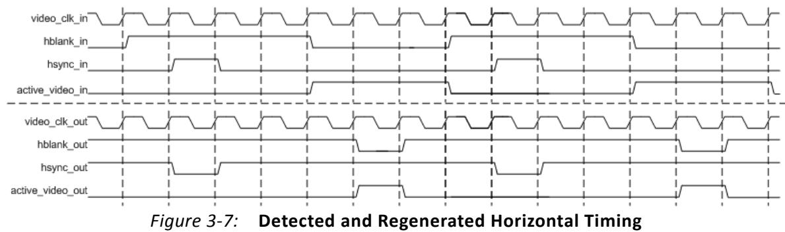

**IMPORTANT:** All generated outputs remain synchronized to the inputs. The only changes made to the output are to the horizontal synchronization polarity and to the active video start and stop times.

The following C code shows how to configure the register values in [Table](#page-54-0) [3-6](#page-54-0) using the Video Timing Controller driver.

```
 XVtc Vtc; /* Device driver instance */
XVtc_Signal SignalCfg; /* VTC Signal configuration */
XVtc_Polarity Polarity; /* Polarity configuration */
XVtc_SourceSelect SourceSelect;/* Source Selection configuration */
XVtc_Config *VtcCfgPtr;
VtcCfgPtr = XVtc_LookupConfig(VTC_DEVICE_ID);
XVtc_CfgInitialize(&Vtc, VtcCfgPtr, VtcCfgPtr->BaseAddress);
/* Setup the VTC Source Select config structure. */
/* 1=Generator registers are source */
/* 0=Detector registers are source */
memset((void *)&SourceSelect, 0, sizeof(SourceSelect));
SourceSelect.VBlankPolSrc = 0;
SourceSelect.VSyncPolSrc = 0;
SourceSelect.HBlankPolSrc = 0;
SourceSelect.HSyncPolSrc = 1;
SourceSelect.ActiveVideoPolSrc = 0;
SourceSelect.ActiveChromaPolSrc= 0;
SourceSelect.VChromaSrc = 0;
SourceSelect.VActiveSrc = 1;
SourceSelect.VBackPorchSrc = 0;
SourceSelect.VSyncSrc = 0;
SourceSelect.VFrontPorchSrc = 0;
SourceSelect.VTotalSrc = 0;
SourceSelect.HActiveSrc = 0;
SourceSelect.HBackPorchSrc = 0;
SourceSelect.HSyncSrc = 0;
SourceSelect.HFrontPorchSrc = 0;
SourceSelect.HTotalSrc = 0;
```

```
 /* Setup the VTC Polarity config structure. */
memset((void *)&Polarity, 0, sizeof(Polarity));
Polarity.ActiveChromaPol = 1;
Polarity.ActiveVideoPol = 1;
Polarity.VBlankPol = 1;
Polarity.VSyncPol = 1;
Polarity.HBlankPol = 1;
Polarity.HSyncPol = 0;
/* Setup the VTC Signal config structure. */
memset((void *)&SignalCfg, 0, sizeof(XVtc_Signal));
SignalCfg.OriginMode = 1;//Set Frame Origin to Start of Active Video
SignalCfg.HTotal = 7;
SignalCfg.HActiveStart = 0;
SignalCfg.HFrontPorchStart = 1;// Active Video Width
SignalCfg.HSyncStart = 3;// Active Video Width + FP Width
SignalCfg.HBackPorchStart = 4;// Active Video Width + FP Width + Sync Width
SignalCfg.V0Total = 8;
SignalCfg.V0ChromaStart = 0;
SignalCfg.V0ActiveStart = 0;
SignalCfg.V0FrontPorchStart = 4;// Active Video Height
SignalCfg.V0SyncStart = 5;// Active Video Height + FP_Width
SignalCfg.V0BackPorchStart = 6;// Active Video Height + FP Width + Sync Width
/* Write VTC config to HW */ 
XVtc_RegUpdate(&VTC);
XVtc_SetPolarity(&Vtc, &Polarity);
XVtc_SetGenerator(&Vtc, &SignalCfg);
XVtc_SetSource(&Vtc, &SourceSelect);
XVtc_EnableSync&Vtc);// Synchronize the Generator to the Detector
/* Enable VTC Generator and Detector*/ 
XVtc_Enable(&Vtc);
```
## **Synchronization**

Generation of the video timing output signals can be synchronized to the detected video timing input signals or generated independently by setting the SYNC_ENABLE field in the control register or selecting the GUI option to synchronize the generator to detector or fsync_in. Synchronization allows the generator to follow the phase of the detector timing. Synchronization of the output to the input allows the developer to override each individual timing signal with different settings such as signal polarity or start time. For example, the active video signal could be regenerated shifted one cycle earlier or later. This provides a flexible method for regenerating video timing output signals with different settings while remaining synchronized to the input timing.

The Video Timing Controller also has a GUI parameter, called Auto Generation Mode, to control the behavior of the generated outputs based on the detected inputs. When the Auto Generation Mode parameter is set, the generated video timing outputs will change based on the detected inputs. If this parameter is not set, then the video timing outputs will be generated based on only the first detected input format. (If the detector loses lock, the generated outputs will continue to be generated.) To change output timing while Auto

Generation Mode is set, timing detection must first be disabled by clearing bit 1 in the Control Register and then re-enabling, if any of the Source Select bits are low.

### **Frame Syncs**

The Video Timing Controller has a frame synchronization output bus. Each bit can be configured to toggle high for any one clock cycle during each video frame. Each bit is independently configured for horizontal and vertical clock cycle position with the Frame Sync Configuration Registers (address offsets 0x0100 - 0x013c).

### **Interrupts**

The Video Timing Controller has an active high interrupt output port named "irq". This output is set high when an interrupt occurs and set low when the interrupt event has been cleared. The Video Timing Controller also contains three 32-bit registers for configuring and reporting status of interrupts: the Interrupt Status/Clear, the Interrupt Enable and the Interrupt Clear Registers. A logical AND is performed on the Interrupt Enable Register and the Interrupt Status Register to set the interrupt output high. The Interrupt Clear Register is used to clear the Interrupt Status Register. Writing a '1' to a bit in the Interrupt Status Register clears the corresponding interrupt when set. Writing a '1' to a bit that is cleared, will have no effect.

# <span id="page-57-0"/>**Use Model**

This section illustrates likely usage scenarios for the Xilinx Video Timing Controller core.

<span id="page-58-0"/>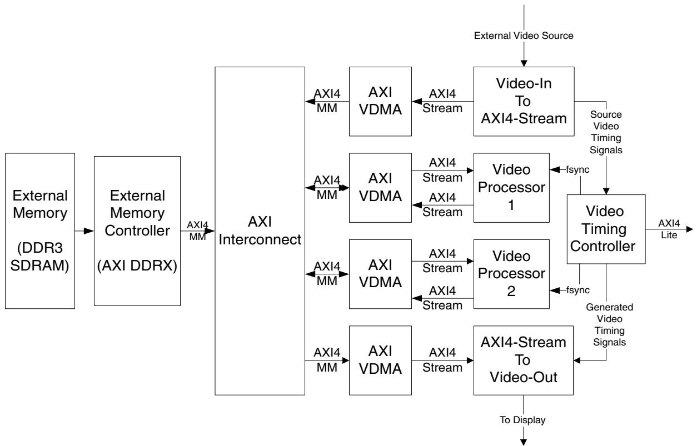

*Figure 3‐8:* **Example Video Timing Controller Use Model**

[Figure](#page-58-0) [3-8](#page-58-0) shows four features of the Video Timing Controller being utilized in a video system:

- Detection of the source video frame timing
- Generation of video timing signals
- Generation of two Frame Syncs to control the Video Processors
- Connection to a Host Processor via the AXI4-Lite interface

To detect the timing of the source video, the timing signals are connected to the Video Timing Controller Detection Module. Both the timing and the signal polarity of the timing signals are captured and easily read by the host processor.

Video timing signals are generated to control a AXI4-Stream to Video-Out module and an external display. The timing of these output signals is controlled by the host processor. The Video Timing Controller can be configured in real-time to replicate the source video format or to slightly change the format on the output, for example, in cases where the input signals are positive polarity yet the display requires negative polarity synchronization signals. The Video Timing Controller can also be reconfigured in real-time to output a completely different format from the input source.

Two Frame Sync outputs are generated to control Video Processor 1 and Video Processor 2. These outputs could be used to control when Video Processor 2 starts processing relative to <span id="page-59-0"/>X-Ref Target - Figure 3-9

when Video Processor 1 starts processing. These Frame Syncs can be reconfigured in real-time as well.

The Video Timing Controller is connected to a Host Processor in this example. The AXI4-Lite Interface allows for easy connection between status/control registers and the host processor. In addition, the Video Timing Controller interrupt output can also be used to synchronize the software with hardware events.

If the video system requires that only complete video frames are sent from the Video-In To AXI4-Stream core, then the Video Timing Controller must be configured to drive the axis_enable input with bit 8 of the INTC_IF bus. This bus must be enabled with the "Include INTC Interface".

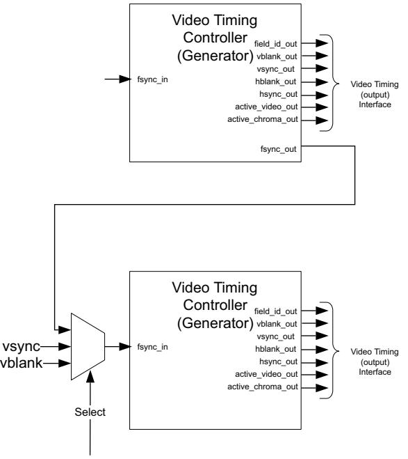

*Figure 3‐9:* **Video Timing Controller Generator Synchronization Use Model**

[Figure](#page-59-0) [3-9](#page-59-0) shows the ability of the Video Timing Controller to synchronize the timing generator to an incoming frame sync, vertical sync or vertical blank signal. This is useful to generate timing signals that are not present. For example, if blank signals can be generated from sync signals. Also, this allows the timing generator to synchronize to a separate timing generator

In this example, the bottom timing generator can be synchronized to the top timing controller, a separate vsync or separate vblank signal. This is controlled by the mux "Select" signal.


**IMPORTANT:** *The timing generator can be offset from the input by configuring the Generator Global Delay Register (Address Offset 0x140)]*

Once the fsync_in input is selected, the pixel or line offset delay of the synchronized generator can be configured with the Generator Global Delay Register.

# <span id="page-60-0"/>**Clocking**

The Video Timing Controller core has two clock sources, CLK and S_AXI_ACLK, one for each clock domain. The Video Timing Controller core also has four clock enable sources: CLK, DET_CLKEN, GEN_CLKEN and S_AXI_ACLKEN.

## **CLK**

The input and output video timing interfaces use the CLK clock signal as their shared clock reference.

## **S_AXI_ACLK**

The AXI4-Lite interface uses the S_AXI_ACLK pin as its clock source. The CLK pin is not shared between the AXI4-Lite and video timing interfaces. The Video Timing Controller core contains clock-domain crossing logic between the CLK (video timing) and S_AXI_ACLK (AXI4-Lite) clock domains. The core automatically ensures that the AXI4-Lite transactions completes even if the video processing is stalled with RESETn, CLKEN or with the video clock not running.

### **CLKEN**

The Video Timing Controller core has multiple enable options: the CLKEN pin (hardware clock enable), and the software enable option provided via the AXI4-Lite control interface (when present).

The CLKEN pin cannot ensure synchronization internally to video timing processing therefore de-asserting CLKEN for extended periods of time may lead to generating incomplete frames or lengthening the period needed to detect incoming video frame timing.

The CLKEN pin facilitates:

- Multi-cycle path designs (high speed clock division without clock gating),
- Standby operation of subsystems to save on power
- Hardware controlled bring-up of system components

## **DET_CLKEN**

The Video Timing Controller core also has a separate clock enable input pin to control the detector. This clock enable allows halting the detector independently from the generator.

## **GEN_CLKEN**

The Video Timing Controller core also has a separate clock enable input pin to control the generator. This clock enable allows halting the generator independently from the detector.

## **S_AXI_ACLKEN**

The S_AXI_ACLKEN is the clock enable signal for the AXI4-Lite interface only. Driving this signal low only affects the AXI4-Lite interface and does not halt the video timing processing in the CLK clock domain.

# <span id="page-61-0"/>**Resets**

The Video Timing Controller core has two reset pins, RESETn and S_AXI_ARESETn, one for each clock domain. Both resets are active low.

### **RESETn**

The Video Timing Controller core has two reset sources: the RESETn pin (hardware reset), and the software reset provided via the AXI4-Lite control interface (when present). The software reset is available via the control register at address offset 0x0000, bit 31.

**IMPORTANT:** *RESETn is not synchronized internally to the video timing processing. De-asserting RESETn while frame timing is being process can lead to incomplete frames (from the generator).*

The external reset pulse needs to be held for at least 32 CLK cycles to reset the core. The RESETn signal only resets the video timing interfaces and processing of the core. The AXI4-Lite interface is unaffected by the RESETn signal to allow the video timing processing core to be reset without halting the AXI4-Lite interface. However, if the RESETn is asserted low during an AXI4-Lite register read or write, the AXI4-Lite interface asserts the slave error response (0x2) for all addresses.


**IMPORTANT:** *When a system with multiple-clocks and corresponding reset signals are being reset, the reset generator has to ensure all signals are asserted/de-asserted long enough so that all interfaces and clock-domains are correctly reinitialized.*

### **S_AXI_ARESETn**

The S_AXI_ARESETn signal is synchronous to the S_AXI_ACLK clock domain, but is internally synchronized to the CLK clock domain. The S_AXI_ARESETn signal resets the entire core including the AXI4-Lite and video timing interfaces.

# <span id="page-62-0"/>**Protocol Description**

The Video Timing Controller core register interface is compliant with the AXI4-Lite interface.


# <span id="page-63-0"/>Customizing and Generating the Core

This chapter includes information about using Xilinx tools to customize and generate the core in the Vivado® Design Suite environment.

# <span id="page-63-1"/>**Vivado Integrated Design Environment (IDE)**

You can customize the IP for use in your design by specifying values for the various parameters associated with the IP core using the following steps:

- 1. Select the IP from the IP catalog.
- 2. Double-click on the selected IP or select the Customize IP command from the toolbar or popup menu.

For details, see the sections, "Working with IP" and "Customizing IP for the Design" in the *Vivado Design Suite User Guide: Designing with IP* ([UG896](https://www.xilinx.com/cgi-bin/docs/rdoc?v=latest;d=ug896-vivado-ip.pdf)) []([UG910)](https://www.xilinx.com/support/documentation/sw_manuals_j/v=latest/ug910-vivado-getting-started.pdf|[#page-88-3|%5C[Ref) [\[Ref](#page-88-4) [5\](#page-88-4).

If you are customizing and generating the core in the Vivado IP Integrator, see the *Vivado Design Suite User Guide: Designing IP Subsystems Using IP Integrator* (UG994) [\[Ref](#page-88-5) [7\](#page-88-5) for detailed information. IP Integrator might auto-compute certain configuration values when validating or generating the design. To check whether the values do change, see the description of the parameter in this chapter. To view the parameter value you can run the validate_bd_design command in the Tcl console.

*Note:* Figures in this chapter are illustrations of the Vivado IDE. This layout might vary from the current version.

## <span id="page-63-2"/>**Graphical User Interface**

The Xilinx Video Timing Controller core is easily configured to meet the developer's specific needs through the Vivado tools graphical user interface ([Figure](#page-64-0) [4-1,](#page-64-0) [Figure](#page-65-0) [4-2)](#page-65-0). This section provides a quick reference to parameters that can be configured at generation time. <span id="page-64-0"/>X-Ref Target - Figure 4-1

*Figure 4‐1:* **Vivado IP Catalog GUI - Main Window**

<span id="page-65-0"/>X-Ref Target - Figure 4-2

*Figure 4‐2:* **Vivado IP Catalog GUI - Default/Constant Mode Options Tab**

*Figure 4‐3:* **Vivado IP GUI - Frame Sync Position Tab**

The GUI displays a representation of the IP symbol on the left side and the parameter assignments on the right side, described as follows:

- **Component Name:** The component name is used as the base name of output files generated for the module. Names must begin with a letter and must be composed from characters: a to z, 0 to 9 and "_".
*Note:* The name **v_tc_v6_1** is not allowed.

- **Optional Features**:
	- ° **Include AXI4-Lite Interface**: When selected, the core is generated with an AXI4-Lite interface, which gives access to dynamically program and change processing parameters. For more information, refer to Chapter 2, Core Interfaces.
	- ° **Include INTC Interface**: When selected, the core generates the optional INTC_IF port, which gives parallel access to signals indicating frame processing status and error conditions. For more information, refer to Interrupts in Chapter 2.
		- **Interlaced Video Support**: When selected, the core is generated with interlaced video detection and/or generation enabled.
		- **Synchronize Generator to Detector or to fsync_in**: When selected, the timing generator automatically synchronizes to the detector or to the fsync_in input port. Otherwise, the generator runs in free-run mode.

- **Options**:
	- ° **Maximum Clocks per Line**: This parameter sets the maximum number of clock cycles per video line that the Video Timing Controller can generate or detect. Values of 128, 256, 512, 1024, 2048, 4096 and 8192 are valid.
	- ° **Maximum Lines per Frame**: This parameter sets the maximum number of lines per video frame that the Video Timing Controller can generate or detect. Values of 128, 256, 512, 1024, 2048, 4096 and 8192 are valid.
	- ° **Frame Syncs**: This parameter sets the number of frame synchronization outputs to generate and supports up to 16 independent outputs.
	- ° **Enable Generation**: This parameter enables or disables the video timing outputs.
	- ° **Enable Detection**: This parameter enables or disables the detecting the timing of the video inputs.
	- ° **Generation Options**:
		- **Field ID Generation**: This parameter enables or disables generating the field ID output.
		- **Vertical Blank Generation**: This parameter enables or disables generating the vertical blank output.
		- **Horizontal Blank Generation**: This parameter enables or disables generating the horizontal blank output.
		- **Vertical Sync Generation**: This parameter enables or disables generating the vertical synchronization output.
		- **Horizontal Sync Generation**: This parameter enables or disables generating the horizontal synchronization output.
		- **Active Video Generation**: This parameter enables or disables generating the active video output.
		- **Active Chroma Generation**: This parameter enables or disables generating the active chroma output.
		- **Auto Generation Mode**: When enabled, this parameter will cause the generated video timing outputs to change based on the detected inputs. If this parameter is disabled, the video timing outputs will be generated based on only the first detected input format. The output for the generated synchronization signals will continue even if the detection block loses lock. This parameter is available only if both the **Enable Generation** and **Enable Detection** parameters are enabled. Note: This parameter has an effect only if one or more of the source select control register bits are set to low.
	- ° **Detection Options**:
		- **Field ID Detection**: This parameter enables or disables detecting the field id input.
- **Vertical Blank Detection**: This parameter enables or disables detecting the vertical blank input. If the vblank_in input will not be connected, then the **Vertical Blank Detection** option must be deselected.
- **Horizontal Blank Detection**: This parameter enables or disables detecting the horizontal blank input. If the hblank_in input will not be connected, then the **Horizontal Blank Detection** option must be deselected.
- **Vertical Sync Detection**: This parameter enables or disables detecting the vertical synchronization input. If the vsync_in input will not be connected, then the **Vertical Sync Detection** option must be deselected.
- **Horizontal Sync Detection**: This parameter enables or disables detecting the horizontal synchronization input. If the hsync_in input will not be connected, then the **Horizontal Sync Detection** option must be deselected.
- **Active Video Detection**: This parameter enables or disables detecting the active video input. If the active_video_in input will not be connected, then the **Active Video Detection** option must be deselected.
- **Active Chroma Detection**: This parameter enables or disables detecting the active chroma input. If the active_chroma_in input will not be connected, then the **Active Chroma Detection** option must be deselected.
- **Constant/Default Timing Generation Options**:
	- ° **Video Format**:
		- **Video Mode**: This parameter sets the default video format and controls the Horizontal, Vertical and Horizontal Fine Adjustment settings below. Values of 720p, 480p, 576p, 1080p, 352x288p, 352x576p, 480x576p, 544x575p, 704x576p, 704x480p, 640x480p, 800x600p, 1024x768p, 1280x1024p, 1600x1200p or Custom are valid. The interlaced video modes of 1080i, 480i and 576i are also available when the **Interlaced Support** parameter is checked. Video Modes are removed or added to this list based upon the sizes selected in the **Max Clocks per Line** and **Max Lines per Frame** parameters.
		- **Chroma Format**: This parameter sets the default value of the video format in the GENERATOR ENCODING register at address offset 0x68. This controls the behavior of the active_chroma_out output port.
		- **Chroma Parity**: This parameter sets the default value of the chroma parity in the GENERATOR ENCODING register at address offset 0x68. This controls the behavior of the active_chroma_out output port.
	- ° **Horizontal Settings**:
		- **Active Size**: This parameter sets the default number of clock cycles per frame (without blanking) in the GENERATOR ACTIVE_SIZE register at address offset 0x060.
		- **Frame Size**: This parameter sets the default number of clock cycles per frame (with blanking) in the GENERATOR HSIZE register at address offset 0x70.
- **Sync Start**: This parameter sets the default value of the clock cycle count during which the horizontal sync starts in the GENERATOR HSYNC register at address offset 0x78.
- **Sync End**: This parameter sets the default value of the clock cycle count during which the horizontal sync ends in the GENERATOR HSYNC register at address offset 0x78.
- ° **Frame/Field 0 Vertical Settings**:
	- **Active Size**: This parameter sets the default number of lines per frame (without blanking) in the GENERATOR ACTIVE_SIZE register at address offset 0x060.
	- **Frame Size**: This parameter sets the frame/field 0 default number of lines per frame size (with blanking) in the GENERATOR VSIZE register at address offset 0x74, bits 12:0.
	- **Sync Start**: This parameter sets the default value of the line count during which the vertical sync starts in the GENERATOR F0_VSYNC_V register at address offset 0x80.
	- **Sync End**: This parameter sets the default value of the line count during which the vertical sync ends in the GENERATOR F0_VSYNC_V register at address offset 0x80.
- **° Frame/Field 0 Horizontal Fine Adjustment:**
	- **Vblank Start**: This parameter sets the default value of the clock cycle count during which the vertical blank starts in the GENERATOR F0_VBLANK_H register at address offset 0x7C.
	- **Vblank End**: This parameter sets the default value of the clock cycle count during which the vertical blank ends in the GENERATOR F0_VBLANK_H register at address offset 0x7C.
	- **VSync Start**: This parameter sets the default value of the clock cycle count during which the vertical sync starts in the GENERATOR F0_VSYNC_H register at address offset 0x84.
	- **Vsync End**: This parameter sets the default value of the clock cycle count during which the vertical sync ends in the GENERATOR F0_VSYNC_H register at address offset 0x84.
- ° **Field 1 Vertical Settings:**
	- **Interlaced**: This parameter enables generating interlaced video and sets the Interlaced bit (6) in the GENERATOR ENCODING register to 1. This parameter is only available when the **Interlaced Video Support** parameter is enabled.
	- **Frame Size**: This parameter sets the Field 1 default number of lines per frame size (with blanking) in the GENERATOR VSIZE register at address offset 0x74, bits 28:16.
- **Sync Start**: This parameter sets the Field 1 default value of the line count during which the vertical sync starts in the GENERATOR F1_VSYNC_V register at address offset 0x8C.
- **Sync End:** This parameter sets the Field 1 default value of the line count during which the vertical sync ends in the GENERATOR F1_VSYNC_V register at address offset 0x8C.

#### **° Field 1 Horizontal Fine Adjustment:**

- **Vblank Start**: This parameter sets the Field 1 default value of the clock cycle count during which the vertical blank starts in the GENERATOR F1_VBLANK_H register at address offset 0x88.
- **Vblank End**: This parameter sets the Field 1 default value of the clock cycle count during which the vertical blank ends in the GENERATOR F1_VBLANK_H register at address offset 0x88.
- **VSync Start**: This parameter sets the Field 1 default value of the clock cycle count during which the vertical sync starts in the GENERATOR F1_VSYNC_H register at address offset 0x90.
- **Vsync End**: This parameter sets the Field 1 default value of the clock cycle count during which the vertical sync ends in the GENERATOR F1_VSYNC_H register at address offset 0x90.
- ° **Active Polarity**:
	- **Field ID**: This parameter sets the polarity of the field_id_out signal. Values of **Active High** or **Active Low** are valid. This parameter is enabled when the **Interlaced Video Support** and **Interlaced** parameters are enabled.
	- **Vblank**: This parameter sets the polarity of the vblank_out signal. Values of **Active High** or **Active Low** are valid.
	- **Hblank**: This parameter sets the polarity of the hblank_out signal. Values of **Active High** or **Active Low** are valid.
	- **Vsync**: This parameter sets the polarity of the vsync_out signal. Values of **Active High** or **Active Low** are valid.
	- **Hsync**: This parameter sets the polarity of the hsync_out signal. Values of **Active High** or **Active Low** are valid.
	- **Active Video**: This parameter sets the polarity of the active_video_out signal. Values of **Active High** or **Active Low** are valid.
	- **Active Chroma**: This parameter sets the polarity of the active_chroma_out signal. Values of **Active High** or **Active Low** are valid.
- ° **Frame Sync Position**:
- **Frame Sync # Horizontal Position**: These parameters set the default value of the clock cycle count during which Frame Sync # is active in the FRAME SYNC 0-15 CONFIG registers at address offset 0x100-0x13c.
- **Frame Sync # Vertical Position**: These parameters set the default value of the line count during which Frame Sync # is active in the FRAME SYNC 0-15 CONFIG registers at address offset 0x100-0x13c.

*Note:* The parameter values within the **Constant/Default Timing Generation Options** will also be the values used during timing generation when the Include AXI4-Lite Register Interface parameter is disabled. These parameter values will be used when the core is in constant mode when it does not have an AXI4-Lite interface.

# <span id="page-71-0"/>**Output Generation**

Vivado generates the files necessary to build the core and place those files in the <project>/<project>.srcs/sources_1/ip/<core> directory.

### **File Details**

The Vivado tools output consists of some or all the following files.

*Table 4‐1:* **Vivado Software Output** 

| Name          | Description                                                                                                                                                            |
|---------------|------------------------------------------------------------------------------------------------------------------------------------------------------------------------|
| v_tc_v6_1     | Library directory for the v_tc_v6_1 core IP-XACT XML file describes which<br>options were used to generate the core. An XCI file can also be used as a<br>source file. |
| v_tc_v6_1.veo | Verilog instantiation template                                                                                                                                         |
| v_tc_v6_1.vho | VHDL instantiation template                                                                                                                                            |
| v_tc_v6_1.xci | IP-XACT XML file describes which options were used to generate the core. An<br>XCI file can also be used as a source file.                                             |
| v_tc_v6_1.xml | IP-XACT XML file describes how the core is constructed to build the core.                                                                                              |


# <span id="page-72-0"/>Constraining the Core

# <span id="page-72-1"/>**Required Constraints**

The only constraints required are clock frequency constraints for the video clock, clk, and the AXI4-Lite clock, s_axi_aclk. Paths between the two clock domains should be constrained with a max_delay constraint and use the datapathonly flag, causing setup and hold checks to be ignored for signals that cross clock domains. These constraints are provided in the XDC constraints file included with the core.


# <span id="page-73-0"/>Simulation

This chapter contains information about simulating IP in the Vivado® Design Suite environment. For comprehensive information about Vivado simulation components, as well as information about using supported third party tools, see the *Vivado Design Suite User Guide: Logic Simulation* (UG900) [\[Ref](#page-88-6) [6\](#page-88-6)


# <span id="page-74-0"/>Synthesis and Implementation

For details about synthesis and implementation, see "Synthesizing IP" and "Implementing IP" in the *Vivado Design Suite User Guide: Designing with IP* ([UG896](https://www.xilinx.com/cgi-bin/docs/rdoc?v=latest;d=ug896-vivado-ip.pdf)) [\[Ref](#page-88-3) [3\](#page-88-3)


# <span id="page-75-0"/>Detailed Example Design

No example design is available at the time for the Video Timing Controller v6.1 core.


# <span id="page-76-0"/>Test Bench

This chapter contains information about the provided test bench in the Vivado® Design Suite environment.

## <span id="page-76-1"/>**Demonstration Test Bench**

A demonstration test bench is provided with the core which enables you to observe core behavior in a typical scenario. This test bench is generated together with the core in Vivado Design Suite. You are encouraged to make simple modifications to the configurations and observe the changes in the waveform.

### **Directory and File Contents**

The following files are expected to be generated in the in the demonstration test bench output directory:

- axi4lite_mst.v
- axi4s_video_mst.v
- axi4s_video_slv.v
- ce_generator.v
- tb_<IP_instance_name>.v

### **Test Bench Structure**

The top-level entity is **tb_<IP_instance_name>**.

It instantiates the following modules:

- DUT
The <IP> core instance under test.

- axi4lite_mst
The AXI4-Lite master module, which initiates AXI4-Lite transactions to program core registers.

- axi4s_video_mst
The AXI4-Stream master module, which generates ramp data and initiates AXI4-Stream transactions to provide video stimuli for the core and can also be used to open stimuli files and convert them into corresponding AXI4-Stream transactions.

To do this, edit tb_<IP_instance_name>.v:

- a. Add define macro for the stimuli file name and directory path define STIMULI_FILE_NAME<path><filename>.
- b. Comment-out/remove the following line: MST.is_ramp_gen(`C_ACTIVE_ROWS, `C_ACTIVE_COLS, 2); and replace with the following line: MST.use_file(`STIMULI_FILE_NAME);
- axi4s_video_slv

The AXI4-Stream slave module, which acts as a passive slave to provide handshake signals for the AXI4-Stream transactions from the core output, can be used to open the data files and verify the output from the core.

To do this, edit tb_<IP_instance_name>.v:

- a. Add define macro for the golden file name and directory path define GOLDEN_FILE_NAME "<path><filename>".
- b. Comment out the following line: SLV.is_passive; and replace with the following line: SLV.use_file(`GOLDEN_FILE_NAME);
- ce_gen

Programmable Clock Enable (ACLKEN) generator.


# <span id="page-78-0"/>Verification, Compliance, and Interoperability

## <span id="page-78-1"/>**Simulation**

A highly parameterizable test bench was used to test the Video Timing Controller core. Testing included the following:

- Register accesses
- Processing of multiple frames of data
- Testing of various frame sizes including 1080p, 720p, and 480p
- Varying instantiations of the core
- Varying the polarity of input and output signals
- Varying the horizontal offset of the vertical timing signals
- Regenerating the input on the output
- Testing of various interrupts

# <span id="page-78-2"/>**Hardware Testing**

The Video Timing Controller core has been tested in a variety of hardware platforms at Xilinx to represent a variety of parameterizations, including the following:

- A test design was developed for the core that incorporated a MicroBlaze™ processor, AXI4 Interconnect and various other peripherals. The software for the test system included live video input for the Video Timing Controller core. The Video Timing Controller, in addition to live video, was also connected in loopback allow the generator to feed the detector for a robust loopback test. Various tests could be supported by varying the configuration of the Timing Controller core or by loading a different software executable. The MicroBlaze processor was responsible for:
	- ° Initializing the appropriate input and output buffers in external memory.
- ° Initializing the Video Timing Controller core.
- ° Initializing the HDMI/DVI input and output cores for live video.
- ° Launching the test.
- ° Configuring the Video Timing Controller for various input frame sizes and checking the detection/generation loopback connection for correct video detection
- ° Controlling the peripherals including the UART and AXI VDMAs.


# <span id="page-80-0"/>Upgrading

This appendix contains information about migrating from an ISE design to the Vivado Design Suite, and for upgrading to a more recent version of the IP core. For customers upgrading their IP core, important details (where applicable) about any port changes and other impact to user logic are included.

# <span id="page-80-1"/>**Migrating to the Vivado Design Suite**

For information about migration to Vivado Design Suite, see *ISE to Vivado Design Suite Migration Guide* (UG911) [\[Ref](#page-88-7) [2\](#page-88-7).

# <span id="page-80-2"/>**Upgrading in Vivado Design Suite**

This section provides information about any changes to the user logic or port designations that take place when you upgrade to a more current version of this IP core in the Vivado Design Suite.

### **Parameter Changes**

The Video Timing Controller v5.00.a added parameters for configuring the core in constant mode, thus the core can be initialized to generate timing after reset without a processor or software.

### **Port Changes**

The Video Timing Controller v5.00.a removed all GPP interface ports. The Video Timing Controller v4.00.a.0 added the ability to operate on video frame sizes up to 8192 x 8192. Previous versions supported 4096 x 4096 maximum. If the maximum sizes of 8192 are selected, some GPP ports will be 13 bits wide where on previous versions of the core, these ports were 12 bits.

The Video Timing Controller v4.00.a also added the ability to detect and generate vertical signals with a horizontal offset. In order to report the horizontal start cycle of these vertical signals, the Video Timing Controller v4.00.a added the following new ports:

- gen_v0blank_hstart
- gen_v0blank_hend
- gen_v0sync_hstart
- gen_v0sync_hend
- det_v0blank_hstart
- det_v0blank_hend
- det_v0sync_hstart
- det_v0sync_hend

### **Other Changes**

### **Migrating to the AXI4-Lite Interface**

The Video Timing Controller v4.00.a changed from the PLB processor interface to the AXI4-Lite interface. As a result, all of the PLB-related connections have been replaced with an AXI4-Lite interface. For more information, see the *AXI Reference Guide* [\[Ref](#page-88-2) [1\](#page-88-2).

### **Functionality Changes**

The Video Timing Controller v5.00.a AXI4-Lite register definitions changed from the previous version, simplifying the address map. The Video Timing Controller v5.00.a also added parameters for configuring the core in constant mode, thus the core can be initialized to generate timing after reset without a processor or software. The Video Timing Controller v3.0 added the ability to operate on video frame sizes up to 8192 x 8192. Previous versions supported 4096 x 4096 maximum.

The Video Timing Controller v3.0 also added the ability to detect and generate vertical signals with a horizontal delay offset.

### **Special Considerations when Migrating to AXI**

The Video Timing Controller v3.0 added the support for the AXI4-Lite interface with this version. When using the Video Timing Controller v3.0, note that the core name changed from "timebase" to "axi_vtc". All software driver functions, data structures and filenames also changed from a "xtimebase" prefix to "xvtc" prefix.


*Appendix C*

# <span id="page-82-0"/>Debugging

This appendix includes details about resources available on the Xilinx Support website and debugging tools.

## <span id="page-82-1"/>**Finding Help on Xilinx.com**

To help in the design and debug process when using the Video Timing Controller, the [Xilinx](https://www.xilinx.com/support)  [Support web page](https://www.xilinx.com/support) contains key resources such as product documentation, release notes, answer records, information about known issues, and links for opening a Technical Support Web Case.

### **Documentation**

This product guide is the main document associated with the Video Timing Controller. This guide, along with documentation related to all products that aid in the design process, can be found on the [Xilinx Support web page](https://www.xilinx.com/support) or by using the Xilinx Documentation Navigator.

Download the Xilinx Documentation Navigator from the [Downloads page](https://www.xilinx.com/support/download.html). For more information about this tool and the features available, open the online help after installation.

### **Answer Records**

Answer Records include information about commonly encountered problems, helpful information on how to resolve these problems, and any known issues with a Xilinx product. Answer Records are created and maintained daily ensuring that users have access to the most accurate information available.

Answer Records for this core are listed below, and can also be located by using the Search Support box on the main [Xilinx support web page.](https://www.xilinx.com/support) To maximize your search results, use proper keywords such as

- Product name
- Tool message(s)
- Summary of the issue encountered

A filter search is available after results are returned to further target the results.

#### **Answer Records for the Video Timing Controller Core**

AR 54541 [http://Xilinx Support web page/answers/54541.htm](https://www.xilinx.com/support/answers/54541.htm)

### **Technical Support**

Xilinx provides technical support in the [Xilinx Support web page](https://www.xilinx.com/support) for this LogiCORE™ IP product when used as described in the product documentation. Xilinx cannot guarantee timing, functionality, or support if you do any of the following:

- Implement the solution in devices that are not defined in the documentation.
- Customize the solution beyond that allowed in the product documentation.
- Change any section of the design labeled DO NOT MODIFY.

Xilinx provides premier technical support for customers encountering issues that require additional assistance.

To contact Xilinx Technical Support, navigate to the [Xilinx Support web page.](https://www.xilinx.com/support)

- 1. [Open a WebCase by selecting the](https://www.xilinx.com/support/clearexpress/websupport.htm) WebCase link located under Support Quick Links.
- A block diagram of the video system that explains the video source, destination and IP (custom and Xilinx) used.

*Note:* Access to WebCase is not available in all cases. Please login to the WebCase tool to see your specific support options.

# <span id="page-83-0"/>**Debug Tools**

There are many tools available to address Video Timing Controller design issues. It is important to know which tools are useful for debugging various situations.

### **Example Design**

The Video Timing Controller is delivered with an example test bench. Information about the example test bench can be found in *Chapter 6, Example Design for the Vivado Design Suite*.

### **Vivado Design Suite Debug Feature**

Vivado inserts logic analyzer and virtual I/O cores directly into your design. Vivado Lab Tools allows you to set trigger conditions to capture application and integrated block port signals in hardware. Captured signals can then be analyzed. This feature represents the

functionality in the Vivado IDE that is used for logic debugging and validation of a design running in Xilinx FPGA devices in hardware.

The Vivado logic analyzer is used to interact with the logic debug LogiCORE IP cores, including:

- ILA 2.0 (and later versions)
- VIO 2.0 (and later versions)

### **Reference Boards**

Various Xilinx development boards support Video Timing Controller. These boards can be used to prototype designs and establish that the core can communicate with the system.

- 7 series evaluation boards
	- ° KC705
	- ° ZC702

### **License Checkers**

If the IP requires a license key, the key must be verified. The Vivado tool flows have a number of license check points for gating licensed IP through the flow. If the license check succeeds, the IP may continue generation. Otherwise, generation halts with error. License checkpoints are enforced by the following tools:

- RDS
- RDI
- Bitgen


**IMPORTANT:** *IP license level is ignored at checkpoints. The test confirms a valid license exists. It does not check IP license level.*

# <span id="page-84-0"/>**Hardware Debug**

Hardware issues can range from link bring-up to problems seen after hours of testing. This section provides debug steps for common issues. The ChipScope tool is a valuable resource to use in hardware debug. The signal names mentioned in the following individual sections can be probed using the ChipScope tool for debugging the specific problems.

Many of these common issues can also be applied to debugging design simulations. Details are provided on General Checks

### **General Checks**

Ensure that all the timing constraints for the core were properly incorporated from the example design and that all constraints were met during implementation.

- Does it work in post-place and route timing simulation? If problems are seen in hardware but not in timing simulation, this could indicate a PCB issue. Ensure that all clock sources are active and clean.
- If using MMCMs in the design, ensure that all MMCMs have obtained lock by monitoring the LOCKED port.
- If your outputs go to 0, check your licensing. The evaluation version of the core will time out after running for 8 hours at 75 MHz.

### **Evaluation Core Timeout**

The Video Timing Controller hardware evaluation core times out after approximately eight hours of operation. The output is driven to zero. This results in a dark-green screen for YUV color systems and possibly loss of lock on output monitors.

# <span id="page-85-0"/>**Interface Debug**

### **AXI4-Lite Interfaces**

[Table](#page-85-1) [C-1](#page-85-1) describes how to troubleshoot the AXI4-Lite interface.

| Symptom                                                                                                                                                           | Solution                                                                                                                                                      |
|-------------------------------------------------------------------------------------------------------------------------------------------------------------------|---------------------------------------------------------------------------------------------------------------------------------------------------------------|
| Readback from the Version<br>Register through the AXI4-Lite<br>interface times out, or a core<br>instance without an AXI4-Lite<br>interface seems non-responsive. | Are the S_AXI_ACLK and ACLK pins connected?<br>The VERSION_REGISTER readout issue may be indicative of the<br>core not receiving the AXI4-Lite interface.     |
| Readback from the Version<br>Register through the AXI4-Lite<br>interface times out, or a core<br>instance without an AXI4-Lite<br>interface seems non-responsive. | Is the core enabled? Is s_axi_aclken connected to vcc?<br>Verify that signal ACLKEN is connected to either net_vcc or to a<br>designated clock enable signal. |

<span id="page-85-1"/>

| Symptom                         | Solution                                                          |
|---------------------------------|-------------------------------------------------------------------|
| Readback from the Version       | Is the core in reset?                                             |
| Register through the AXI4-Lite  | S_AXI_ARESETn and ARESETn should be connected to vcc for          |
| interface times out, or a core  | the core not to be in reset. Verify that the S_AXI_ARESETn and    |
| instance without an AXI4-Lite   | ARESETn signals are connected to either net_vcc or to a           |
| interface seems non-responsive. | designated reset signal.                                          |
| Readback value for the          | The core and/or the driver in a legacy project has not been       |
| VERSION_REGISTER is different   | updated. Ensure that old core versions, implementation files, and |
| from expected default values    | implementation caches have been cleared.                          |

#### *Table C‐1:* **Troubleshooting the AXI4-Lite Interface** *(Cont'd)*

Assuming the AXI4-Lite interface works, the second step is to bring up the AXI4-Stream interfaces.

### **Other Interfaces**

[Table](#page-86-0) [C-2](#page-86-0) describes how to troubleshoot third-party interfaces.

| Symptom                                                                                                                           | Solution                                                                                                                                                                                                                                                                                                           |
|-----------------------------------------------------------------------------------------------------------------------------------|--------------------------------------------------------------------------------------------------------------------------------------------------------------------------------------------------------------------------------------------------------------------------------------------------------------------|
| Severe color<br>distortion or<br>color-swap when<br>interfacing to<br>third-party video IP.                                       | Verify that the color component logical addressing on the AXI4-Stream TDATA<br>signal is in according to Data Interface in Chapter 2. If misaligned:<br>In HDL, break up the TDATA vector to constituent components and manually<br>connect the slave and master interface sides.                                  |
| Severe color<br>distortion or<br>color-swap when<br>processing video<br>written to external<br>memory using the<br>AXI-VDMA core. | Unless the particular software driver was developed with the AXI4-Stream TDATA<br>signal color component assignments described in Data Interface in Chapter 2 in<br>mind, there are no guarantees that the software correctly identifies bits<br>corresponding to color components.                                |
|                                                                                                                                   | Verify that the color component logical addressing TDATA is in alignment with<br>the data format expected by the software drivers reading/writing external<br>memory. If misaligned:<br>In HDL, break up the TDATA vector to constituent components, and manually<br>connect the slave and master interface sides. |

<span id="page-86-0"/>*Table C‐2:* **Troubleshooting Third-Party Interfaces**


# *Appendix D*

# <span id="page-87-0"/>Additional Resources

# <span id="page-87-1"/>**Xilinx Resources**

For support resources such as Answers, Documentation, Downloads, and Forums, see the Xilinx Support website at:

[http://X](https://www.xilinx.com/support)ilinx Support web page.

For a glossary of technical terms used in Xilinx documentation, see:

[https://www.xilinx.com/support/documentation/sw_manuals/glossary.pdf.](https://www.xilinx.com/support/documentation/sw_manuals/glossary.pdf)

For a comprehensive listing of Video and Imaging application notes, white papers, reference designs and related IP cores, see the Video and Imaging Resources page at:

[](https://www.xilinx.com/esp/video/refdes_listing.htm#ref_des.](https://www.xilinx.com/esp/video/refdes_listing.htm#ref_des.](https://www.xilinx.com/esp/video/refdes_listing.htm#ref_des)

## <span id="page-87-2"/>**Documentation Navigator and Design Hubs**

Xilinx Documentation Navigator provides access to Xilinx documents, videos, and support resources, which you can filter and search to find information. To open the Xilinx Documentation Navigator (DocNav):

- From the Vivado IDE, select **Help > Documentation and Tutorials**.
- On Windows, select **Start > All Programs > Xilinx Design Tools > DocNav**.
- At the Linux command prompt, enter docnav.

Xilinx Design Hubs provide links to documentation organized by design tasks and other topics, which you can use to learn key concepts and address frequently asked questions. To access the Design Hubs:

- In the Xilinx Documentation Navigator, click the **Design Hubs View** tab.
- On the Xilinx website, see the [Design Hubs](https://www.xilinx.com/cgi-bin/docs/ndoc?t=design+hubs) page.

*Note:* For more information on Documentation Navigator, see the [Documentation Navigator](https://www.xilinx.com/cgi-bin/docs/rdoc?t=docnav) page on the Xilinx website.

# <span id="page-88-0"/>**References**

These documents provide supplemental material useful with this user guide:

- <span id="page-88-2"/>1. *Vivado AXI Reference Guide* ([UG1037)](https://www.xilinx.com/cgi-bin/docs/ipdoc?c=axi_ref_guide;v=latest;d=ug1037-vivado-axi-reference-guide.pdf)
- <span id="page-88-7"/>2. *ISE to Vivado Design Suite Migration Guide* ([UG911)](https://www.xilinx.com/cgi-bin/docs/rdoc?v=latest;d=ug911-vivado-migration.pdf)
- <span id="page-88-3"/>3. *Vivado Design Suite User Guide: Designing with IP* ([UG896)](https://www.xilinx.com/cgi-bin/docs/rdoc?v=latest;d=ug896-vivado-ip.pdf)
- 4. *Vivado Design Suite User Guide: Programming and Debugging* ([UG908)](https://www.xilinx.com/cgi-bin/docs/rdoc?v=latest;d=ug908-vivado-programming-debugging.pdf)
- <span id="page-88-4"/>5. *Vivado Design Suite User Guide: Getting Started* ([UG910)](https://www.xilinx.com/cgi-bin/docs/rdoc?v=latest;d=ug910-vivado-getting-started.pdf)
- <span id="page-88-6"/>6. *Vivado Design Suite User Guide: Logic Simulation* ([UG900)](https://www.xilinx.com/cgi-bin/docs/rdoc?v=latest;d=ug900-vivado-logic-simulation.pdf)
- <span id="page-88-5"/>7. *Vivado Design Suite User Guide: Designing IP Subsystems Using IP Integrator* ([UG994)](https://www.xilinx.com/cgi-bin/docs/rdoc?v=latest;d=ug994-vivado-ip-subsystems.pdf)

# <span id="page-88-1"/>**Revision History**

The following table shows the revision history for this document.

| Date       | Version | Revision                                                                                                                                                                                      |
|------------|---------|-----------------------------------------------------------------------------------------------------------------------------------------------------------------------------------------------|
| 10/04/2017 | 6.1     | Updated The fsync_in Pin section. Updated Control Signals and Timing<br>section to describe dual/quad pixel mode.                                                                             |
| 11/18/2015 | 6.1     | Added UltraScale+ support.                                                                                                                                                                    |
| 10/01/2014 | 6.1     | Removed Application Software Development appendix.                                                                                                                                            |
| 12/18/2013 | 6.1     | Added UltraScale Architecture support. Added interlaced video support                                                                                                                         |
| 10/02/2013 | 6.0     | Synch document version with core version. Updated Constraints.                                                                                                                                |
| 03/20/2013 | 4.0     | Updated for core version to v6.0. Updated Debugging appendix. Removed<br>ISE chapters. Added new det_clken, and gen_clken pins, new<br>Clocking pins, Resets, DET_ENABLE and GEN_ENABLE bits. |
| 10/16/2012 | 3.1     | Updated for core version and ISE v14.3 and Vivado v2012.3. Added Vivado<br>test bench and constraints.                                                                                        |
| 07/25/2012 | 3.0     | Updated for core version. Added Vivado information.                                                                                                                                           |
| 4/24/2012  | 2.0     | Updated for core version. Added Zynq-7000 devices, deprecated GPP<br>interface.                                                                                                               |
| 10/19/2011 | 1.0     | Initial Xilinx release of Product Guide, replacing DS857.                                                                                                                                     |

# <span id="page-89-0"/>**Notice of Disclaimer**

The information disclosed to you hereunder (the "Materials") is provided solely for the selection and use of Xilinx products. To the maximum extent permitted by applicable law: (1) Materials are made available "AS IS" and with all faults, Xilinx hereby DISCLAIMS ALL WARRANTIES AND CONDITIONS, EXPRESS, IMPLIED, OR STATUTORY, INCLUDING BUT NOT LIMITED TO WARRANTIES OF MERCHANTABILITY, NON-INFRINGEMENT, OR FITNESS FOR ANY PARTICULAR PURPOSE; and (2) Xilinx shall not be liable (whether in contract or tort, including negligence, or under any other theory of liability) for any loss or damage of any kind or nature related to, arising under, or in connection with, the Materials (including your use of the Materials), including for any direct, indirect, special, incidental, or consequential loss or damage (including loss of data, profits, goodwill, or any type of loss or damage suffered as a result of any action brought by a third party) even if such damage or loss was reasonably foreseeable or Xilinx had been advised of the possibility of the same. Xilinx assumes no obligation to correct any errors contained in the Materials or to notify you of updates to the Materials or to product specifications. You may not reproduce, modify, distribute, or publicly display the Materials without prior written consent. Certain products are subject to the terms and conditions of the Limited Warranties which can be viewed at<https://www.xilinx.com/warranty.htm>; IP cores may be subject to warranty and support terms contained in a license issued to you by Xilinx. Xilinx products are not designed or intended to be fail-safe or for use in any application requiring fail-safe performance; you assume sole risk and liability for use of Xilinx products in Critical Applications: [](https://www.xilinx.com/warranty.htm#critapps) [](https://www.xilinx.com/warranty.htm#critapps](https://www.xilinx.com/warranty.htm#critapps](https://www.xilinx.com/warranty.htm#critapps).

#### **AUTOMOTIVE APPLICATIONS DISCLAIMER**

AUTOMOTIVE PRODUCTS (IDENTIFIED AS "XA" IN THE PART NUMBER) ARE NOT WARRANTED FOR USE IN THE DEPLOYMENT OF AIRBAGS OR FOR USE IN APPLICATIONS THAT AFFECT CONTROL OF A VEHICLE ("SAFETY APPLICATION") UNLESS THERE IS A SAFETY CONCEPT OR REDUNDANCY FEATURE CONSISTENT WITH THE ISO 26262 AUTOMOTIVE SAFETY STANDARD ("SAFETY DESIGN"). CUSTOMER SHALL, PRIOR TO USING OR DISTRIBUTING ANY SYSTEMS THAT INCORPORATE PRODUCTS, THOROUGHLY TEST SUCH SYSTEMS FOR SAFETY PURPOSES. USE OF PRODUCTS IN A SAFETY APPLICATION WITHOUT A SAFETY DESIGN IS FULLY AT THE RISK OF CUSTOMER, SUBJECT ONLY TO APPLICABLE LAWS AND REGULATIONS GOVERNING LIMITATIONS ON PRODUCT LIABILITY.

© Copyright 2011-2017 Xilinx, Inc. Xilinx, the Xilinx logo, Artix, ISE, Kintex, Spartan, Virtex, Zynq, and other designated brands included herein are trademarks of Xilinx in the United States and other countries. All other trademarks are the property of their respective owners.