# **AXI Video Direct Memory Access v6.3**

# *LogiCORE IP Product Guide*

**Vivado Design Suite** 

 **PG020 October 4, 2017**


# Table of Contents

#### **[IP Facts](#page-3-0)**

#### **[Chapter](#page-4-0) [1:](#page-4-0) [Overview](#page-4-0)**

| Feature Summary. 6       |  |
|--------------------------|--|
| Applications 7           |  |
| Unsupported Features. 8  |  |
| Licensing and Ordering 8 |  |

#### **[Chapter](#page-8-0) [2:](#page-8-0) [Product Specification](#page-8-0)**

| Performance. 9             |  |
|----------------------------|--|
| Resource Utilization. 10   |  |
| Port Descriptions 11       |  |
| Timing Diagrams 13         |  |
| Register Space 15          |  |
| Genlock Synchronization 38 |  |

### **[Chapter](#page-45-0) [3:](#page-45-0) [Designing with the Core](#page-45-0)**

| General Design Guidelines 46 |  |
|------------------------------|--|
| Clocking. 47                 |  |
| Resets 48                    |  |
| Programming Sequence. 49     |  |
| Interrupts 49                |  |

### **[Chapter](#page-49-0) [4:](#page-49-0) [Design Flow Steps](#page-49-0)**

| Customizing and Generating the Core 50 |  |
|----------------------------------------|--|
| Constraining the Core 65               |  |
| Simulation 66                          |  |
| Synthesis and Implementation 66        |  |

#### **[Chapter](#page-66-0) [5:](#page-66-0) [Example Design](#page-66-0)**

| Implementing the Example Design. 69  |  |
|--------------------------------------|--|
| Test Bench for the Example Design 70 |  |
| Simulating the Example Design. 71    |  |


#### **[Chapter](#page-71-0) [6:](#page-71-0) [General Use Cases](#page-71-0)**

#### **[Appendix](#page-73-0) [A:](#page-73-0) [Updating](#page-73-0)**

| Migrating to the Vivado Design Suite. 74 |  |
|------------------------------------------|--|
| Upgrading in the Vivado Design Suite 74  |  |

#### **[Appendix](#page-75-0) [B:](#page-75-0) [Debugging](#page-75-0)**

| Finding Help on Xilinx.com 76        |  |
|--------------------------------------|--|
| Vivado Design Suite Debug Feature 77 |  |
| Hardware Debug 78                    |  |

#### **[Appendix](#page-79-0) [C:](#page-79-0) [Frame Pointers Gray Code Outputs](#page-79-0)**

#### **[Appendix](#page-84-0) [D:](#page-84-0) [Additional Resources and Legal Notices](#page-84-0)**

| Xilinx Resources 85                        |  |
|--------------------------------------------|--|
| Documentation Navigator and Design Hubs 85 |  |
| References 86                              |  |
| Revision History 87                        |  |
| Please Read: Important Legal Notices 90    |  |

## **IP Facts**


## **Introduction**

The Xilinx® LogiCORE™ IP AXI VDMA core is a soft IP core. It provides high-bandwidth direct memory access between memory and AXI4-Stream video type target peripherals including peripherals which support the AXI4-Stream Video protocol as described in the Video IP: AXI Feature Adoption section of the *Vivado AXI Reference Guide* (UG1037) [\[Ref](#page-85-1) [1\](#page-85-1).

## **Features**

- AXI4 Compliant
- Primary AXI4 data width support of 32, 64, 128, 256, 512, and 1,024 bits
- Primary AXI4-Stream data width support of multiples of 8 up to 1,024 bits
- Optional Data Realignment Engine
- Optional Genlock Synchronization
- Independent, asynchronous channel operation
- Dynamic clock frequency change of AXI4-Stream interface clocks
- Optional frame advance or repeat on error
- Supports up to 32 frame buffers
- Supports up to 64-bit address space
- Supports Vertical Flip

<span id="page-3-0"/>

| LogiCORE IP Facts Table                           |                                                                                |  |  |  |
|---------------------------------------------------|--------------------------------------------------------------------------------|--|--|--|
| Core Specifics                                    |                                                                                |  |  |  |
| Supported                                         | UltraScale+™                                                                   |  |  |  |
| Device                                            | UltraScale™                                                                    |  |  |  |
| Family(1)                                         | Zynq®-7000, 7 Series                                                           |  |  |  |
| Supported<br>User Interfaces                      | AXI4, AXI4-Lite, AXI4-Stream                                                   |  |  |  |
| Resources                                         | Performance and Resource Utilization web<br>page                               |  |  |  |
| Provided with Core                                |                                                                                |  |  |  |
| Design Files(2)                                   | VHDL                                                                           |  |  |  |
| Example<br>Design                                 | Provided                                                                       |  |  |  |
| Test Bench                                        | Provided                                                                       |  |  |  |
| Constraints<br>File                               | Provided                                                                       |  |  |  |
| Simulation<br>Model                               | Not Provided                                                                   |  |  |  |
| Supported<br>S/W Drivers(3)                       | Standalone and Linux                                                           |  |  |  |
| Tested Design Flows(4)                            |                                                                                |  |  |  |
| Design Entry                                      | Vivado® Design Suite                                                           |  |  |  |
| Simulation                                        | For supported simulators, see the<br>Xilinx Design Tools: Release Notes Guide. |  |  |  |
| Synthesis                                         | Vivado Synthesis                                                               |  |  |  |
|                                                   | Support                                                                        |  |  |  |
| Provided by Xilinx at the Xilinx Support web page |                                                                                |  |  |  |
|                                                   |                                                                                |  |  |  |

#### **Notes:**

- <span id="page-3-1"/>1. For a complete list of supported devices, see the Vivado IP catalog.
- <span id="page-3-2"/>2. Contains a few Verilog files. Top level is VHDL.
- <span id="page-3-3"/>3. Standalone driver information can be found in the Software Developers Kit (SDK) installation directory. See xilinx_drivers.htm in <install_directory>/SDK/<release>/data/embeddedsw/
	- doc/xilinx_drivers.htm. Linux OS and driver support information is available from the [Xilinx Wiki page.](http://www.wiki.xilinx.com/)
- <span id="page-3-4"/>4. For the supported versions of the tools, see the [Xilinx Design Tools: Release Notes Guide.](https://www.xilinx.com/cgi-bin/docs/rdoc?v=2017.3;t=vivado+release+notes)

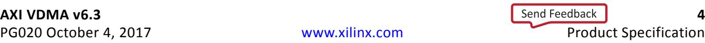

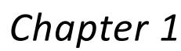


# <span id="page-4-0"/>Overview

<span id="page-4-1"/>X-Ref Target - Figure 1-1

Many video applications require frame buffers to handle frame rate changes or changes to the image dimensions (scaling or cropping). The AXI VDMA is designed to allow for efficient high-bandwidth access between the AXI4-Stream video interface and the AXI4 interface.

[Figure](#page-4-1) [1-1](#page-4-1) illustrates the AXI VDMA Block Diagram.

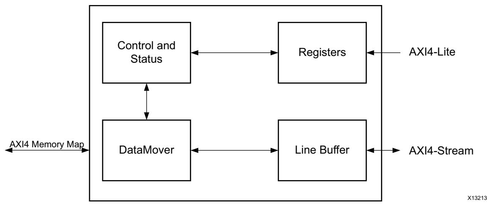

*Figure 1‐1:* **AXI VDMA Block Diagram** 

After registers are programmed through the AXI4-Lite interface, the Control/ Status logic block generates appropriate commands to the DataMover to initiate Write and Read commands on the AXI4 Master interface.

A configurable asynchronous line buffer is used to temporarily hold the pixel data prior to writing it out to the AXI4-Memory Map interface or the AXI4-Stream interface.

In the Write path, the AXI VDMA accepts frames on the AXI4-Stream Slave interface and writes it to system memory using the AXI4 Master interface.

In the Read path, the AXI VDMA uses the AXI4 Master interface for reading frames from system memory and outputs it on the AXI4-Stream Master interface.

Both write and read paths operate independently. The AXI VDMA also provides an option to synchronize the incoming/outgoing frames with an external synchronization signal.


## <span id="page-5-0"/>**Feature Summary**

### **AXI4 Compliant**

The AXI VDMA core is fully compliant with the AXI4 interface, AXI4-Stream interface and AXI4-Lite interface. The AXI4-Stream also supports the Video Protocol as described in the "Video IP: AXI Feature Adoption" section of the *Vivado AXI Reference Guide* (UG1037)[\[Ref](#page-85-1) [1\](#page-85-1).

### **AXI4 Data Width**

The AXI VDMA core supports the primary AXI4 data bus width of 32, 64, 128, 256, 512, and 1,024 bits.

### **AXI4-Stream Data Width**

The AXI VDMA core supports the primary AXI4-Stream data bus width of multiples of 8 bits up to 1,024 bits. The AXI4-Stream data width must be less than or equal to the AXI4 data width for the respective channel.

### **32 Frame Buffers**

The AXI VDMA core supports addressing up to 32 frame buffers for a 32-bit address space and up to 8 frame buffers for more than a 32-bit address space.

### **Data Realignment Engine**

The AXI VDMA core supports the optional Data Realignment Engine (DRE). The DRE lets unaligned access to memory, allowing the frame buffer to start at any address in memory. There is no restriction on the hsize and stride as well. This feature is supported for the AXI4-Stream interface width up to 64 bits.

### **Genlock Synchronization**

The AXI VDMA supports a mechanism to synchronize writing and reading of frames in the frame buffer through Genlock synchronization. Each channel of the AXI VDMA can be designed to operate as either a Genlock Master/Slave or Dynamic Genlock Master/Slave. By using this feature, the master and slave are kept in sync by not allowing both to use the same buffer at the same time.

The AXI VDMA core supports internal Genlock bus by default when both read and write channels are selected. This eliminates the need for an external connection between the write and read channels. See [Genlock Synchronization in Chapter](#page-37-1) [2](#page-37-1) for more details.


### **Asynchronous Channels**

The AXI VDMA core supports asynchronous clock domains for AXI4-Lite, S2MM AXI4-Stream interface, Memory Map to Stream (MM2S) AXI4-Stream interface, Stream to Memory Map (S2MM) AXI4 interface and MM2S AXI4 interface.

### **Frame Sync Options**

The AXI VDMA core supports the following three sources for frame synchronization.

- AXI4-Stream based frame synchronization using the tuser(0) port
	- ° Drives the start-of-frame on the m_axis_mm2s_tuser(0) output for read path
	- ° Synchronizes the incoming frame with the start-of-frame on the s_axis_s2mm_tuser(0) input for write path
- Streaming to Memory Mapped frame sync port (s2mm_fsync)
- Memory Mapped to Streaming frame sync port (mm2s_fsync)

### **Dynamic Clock Frequency Change on AXI4-Stream Interface**

The AXI VDMA core allows changing the AXI4-Stream interface clock dynamically to support different video frame resolution and frame rates.

### **Frame Advance or Repeat on Error**

When any frame or line error is detected in a particular frame, this optional feature allows you to let the frame number advance on the next frame sync or not advance and reuse the errored frame number. It is controlled by VDMACR bit 15.

## **Vertical Flip**

The AXI VDMA core supports Vertical Flip with S2MM as the path and **Enable Vertical Flip** (Advanced tab) is selected.

## <span id="page-6-0"/>**Applications**

The AXI VDMA core provides high-speed data movement between system memory and the AXI4-Stream Video Protocol Video IP. See [General Use Cases in Chapter](#page-71-1) [6](#page-71-1) for information and instructions for a quick bring-up of AXI VDMA.


## <span id="page-7-0"/>**Unsupported Features**

The following AXI4 features are not supported by the AXI VDMA design.

- User signals on the AXI4 Interface
- Locked transfers
- Exclusive transfers
- FIXED and WRAP Burst transfers

## <span id="page-7-1"/>**Licensing and Ordering**

This Xilinx® LogiCORE™ IP module is provided at no additional cost with the Xilinx Vivado® Design Suite under the terms of the [Xilinx End User License](https://www.xilinx.com/cgi-bin/docs/rdoc?t=eula). Information about this and other Xilinx LogiCORE IP modules is available at the [Xilinx Intellectual Property](https://www.xilinx.com/products/intellectual-property.html) page. For information about pricing and availability of other Xilinx LogiCORE IP modules and tools, contact your [local Xilinx sales representative.](https://www.xilinx.com/about/contact.html)

*Chapter 2*


# <span id="page-8-0"/>Product Specification

## <span id="page-8-1"/>**Performance**

The AXI VDMA is characterized as per the benchmarking methodology described in the appendix in the *Vivado Design Suite User Guide: Designing with IP* (UG896) [\[Ref](#page-85-2) [2\](#page-85-2) [Table](#page-8-2) [2-1](#page-8-2) shows the results of the characterization runs.

*Note:* Maximum frequencies for Zynq®-7000 All Programmable SoCs and UltraScale™ devices are expected to be similar to 7 series devices.

| Family    | Speed Grade |      | Fmax (MHz)  |           |
|-----------|-------------|------|-------------|-----------|
|           |             | AXI4 | AXI4-Stream | AXI4-Lite |
| Virtex®-7 |             | 200  | 200         | 180       |
| Kintex®-7 | –1          | 200  | 200         | 180       |
| Artix®-7  |             | 150  | 150         | 120       |
|           |             |      |             |           |
| Virtex-7  |             | 240  | 240         | 200       |
| Kintex-7  | –2          | 240  | 240         | 200       |
| Artix-7   |             | 180  | 180         | 140       |
|           |             |      |             |           |
| Virtex-7  |             | 280  | 280         | 220       |
| Kintex-7  | –3          | 280  | 280         | 220       |
| Artix-7   |             | 200  | 200         | 160       |

<span id="page-8-2"/>*Table 2‐1:* **Maximum Frequencies** 


### **Latency**

[Table](#page-9-1) [2-2](#page-9-1) shows the AXI VDMA core latency cycles measured on write (s2mm) and read (mm2s) paths. It does not include system dependent latency or throttling.

<span id="page-9-1"/>*Table 2‐2:* **AXI VDMA Latency**

| Description                                                       | Clocks |
|-------------------------------------------------------------------|--------|
| Read (MM2S) Channel                                               |        |
| Frame Sync out to AXI4 Address Valid                              | 14     |
| AXI4 Read Valid to AXI4-Stream Data Valid                         | 4      |
| Current Frame AXI4-Stream TLAST to Next Frame Sync out            | 8      |
| Write (S2MM) Channel                                              |        |
| AXI4-Stream Data Valid to AXI4 Write Address Valid                | 14     |
| m_axi_s2mm_awvalild and m_axi_s2mm_awready=1 to m_axi_s2mm_wvalid | 2      |
| Current AXI4 Write Last to next Frame Sync out                    | 11     |

## **Throughput**

[Table](#page-9-2) [2-3](#page-9-2) shows the AXI VDMA throughput measured for different data widths. It was measured using standard High Definition (HD) frames on hardware.

<span id="page-9-2"/>*Table 2‐3:* **AXI VDMA Throughput**

| Memory Map and Streaming Data Widths<br>(in bits) | Throughput (frames/sec) |
|---------------------------------------------------|-------------------------|
| 32                                                | 96                      |
| 64                                                | 192                     |
| 128                                               | 384                     |
| 256                                               | 500                     |
| 512                                               | 680                     |

## <span id="page-9-0"/>**Resource Utilization**

For full details about performance and resource utilization, visit the [Performance and Resource Utilization web page.](https://www.xilinx.com/cgi-bin/docs/ndoc?t=ip+ru;d=axi-vdma.html)


## <span id="page-10-0"/>**Port Descriptions**

This section describes the details for each interface. In addition, detailed information about configuration and control registers is included.

The AXI VDMA signals are described in [Table](#page-10-1) [2-4.](#page-10-1)

| Signal Name                                  | Interface   | Signal<br>Type | Init<br>Status              | Description                                                                                                                                                                           |  |  |  |  |
|----------------------------------------------|-------------|----------------|-----------------------------|---------------------------------------------------------------------------------------------------------------------------------------------------------------------------------------|--|--|--|--|
| Clock, Reset and Interrupt Interface Signals |             |                |                             |                                                                                                                                                                                       |  |  |  |  |
| s_axi_lite_aclk                              | Clock       | I              |                             | AXI VDMA AXI4-Lite interface clock                                                                                                                                                    |  |  |  |  |
| m_axi_mm2s_aclk                              | Clock       | I              |                             | AXI VDMA MM2S clock                                                                                                                                                                   |  |  |  |  |
| m_axi_s2mm_aclk                              | Clock       | I              |                             | AXI VDMA S2MM clock                                                                                                                                                                   |  |  |  |  |
| m_axis_mm2s_aclk                             | Clock       | I              |                             | AXI VDMA MM2S AXIS clock                                                                                                                                                              |  |  |  |  |
| s_axis_s2mm_aclk                             | Clock       | I              |                             | AXI VDMA S2MM AXIS clock                                                                                                                                                              |  |  |  |  |
| axi_resetn                                   | Reset       | I              |                             | AXI VDMA Reset. Active-Low reset. When<br>asserted Low, resets entire AXI VDMA core.<br>Must be synchronous to s_axi_lite_aclk and<br>asserted for a minimum of sixteen clock cycles. |  |  |  |  |
| mm2s_introut                                 | Interrupt   | O              | 0                           | Interrupt Out for Memory Map to Stream<br>Channel                                                                                                                                     |  |  |  |  |
| s2mm_introut                                 | Interrupt   | O              | 0                           | Interrupt Out for Stream to Memory Map<br>Channel                                                                                                                                     |  |  |  |  |
|                                              |             |                | AXI4-Lite Interface Signals |                                                                                                                                                                                       |  |  |  |  |
| s_axi_lite*                                  | S_AXI_LITE  | -              | -                           | See Appendix A of the Vivado AXI Reference<br>Guide (UG1037)[Ref 1] for the description of<br>AXI4 Signals.                                                                           |  |  |  |  |
|                                              |             |                | AXI4 Read Interface Signals |                                                                                                                                                                                       |  |  |  |  |
| m_axi_mm2s*<br>M_AXI_MM2S                    |             | -              | -                           | See Appendix A of the AXI Reference Guide<br>(UG1037) [Ref 1] for the description of AXI4<br>Signals.                                                                                 |  |  |  |  |
| AXI4 Write Interface Signals                 |             |                |                             |                                                                                                                                                                                       |  |  |  |  |
| m_axi_s2mm*                                  | M_AXI_S2MM  | -              | -                           | See Appendix A of the AXI Reference Guide<br>(UG1037) [Ref 1] for the description of AXI4<br>Signals.                                                                                 |  |  |  |  |
| AXI4-Stream Master Interface Signals         |             |                |                             |                                                                                                                                                                                       |  |  |  |  |
| m_axis_mm2s*                                 | M_AXIS_MM2S | -              | -                           | See Appendix A of the AXI Reference Guide<br>(UG1037) [Ref 1] for the description of AXI4<br>Signals.                                                                                 |  |  |  |  |

<span id="page-10-1"/>*Table 2‐4:* **AXI VDMA I/O Signal Description**


#### *Table 2‐4:* **AXI VDMA I/O Signal Description** *(Cont'd)*

| Signal Name                         | Interface                               | Signal<br>Type | Init<br>Status            | Description                                                                                                                                                                    |  |  |  |  |
|-------------------------------------|-----------------------------------------|----------------|---------------------------|--------------------------------------------------------------------------------------------------------------------------------------------------------------------------------|--|--|--|--|
| AXI4-Stream Slave Interface Signals |                                         |                |                           |                                                                                                                                                                                |  |  |  |  |
| s_axis_s2mm*                        | S_AXIS_S2MM                             | -              | -                         | See Appendix A of the AXI Reference Guide<br>(UG1037) [Ref 1] for the description of AXI4<br>signals.                                                                          |  |  |  |  |
|                                     | Video Synchronization Interface Signals |                |                           |                                                                                                                                                                                |  |  |  |  |
| mm2s_fsync                          | Frame Sync                              | I              |                           | MM2S Frame Sync Input. When enabled,<br>VDMA operations begin on each falling edge<br>of fsync. AXI VDMA expects this signal to be<br>asserted for one m_axis_mm2s_aclk cycle. |  |  |  |  |
| s2mm_fsync                          | Frame Sync                              | I              |                           | S2MM Frame Sync Input. When enabled,<br>VDMA operations begin on each falling edge<br>of fsync. AXI VDMA expects this signal to be<br>asserted for one s_axis_s2mm_aclk cycle. |  |  |  |  |
|                                     |                                         |                | Genlock Interface Signals |                                                                                                                                                                                |  |  |  |  |
|                                     | Genlock                                 | I              |                           | Read (MM2S) Channel Frame Pointer Input.                                                                                                                                       |  |  |  |  |
| mm2s_frame_ptr_in(5:0)              |                                         |                |                           | See Genlock Synchronization for more details<br>on different Genlock modes.                                                                                                    |  |  |  |  |
|                                     | Genlock                                 | O              | 0                         | Read (MM2S) Channel Frame Pointer Output.                                                                                                                                      |  |  |  |  |
| mm2s_frame_ptr_out(5:0)             |                                         |                |                           | See Genlock Synchronization for more details<br>on different Genlock modes.                                                                                                    |  |  |  |  |
|                                     | Genlock                                 | I              |                           | Write (S2MM) Channel Frame Pointer Input.                                                                                                                                      |  |  |  |  |
| s2mm_frame_ptr_in(5:0)              |                                         |                |                           | See Genlock Synchronization for more details<br>on different Genlock modes.                                                                                                    |  |  |  |  |
|                                     |                                         |                |                           | Write (S2MM) Channel Frame Pointer Output.                                                                                                                                     |  |  |  |  |
| s2mm_frame_ptr_out(5:0)             | Genlock                                 | O              | 0                         | See Genlock Synchronization for more details<br>on different Genlock modes.                                                                                                    |  |  |  |  |


<span id="page-12-1"/>X-Ref Target - Figure 2-1

## <span id="page-12-0"/>**Timing Diagrams**

### **Example Read (MM2S) Path Timing**

[Figure](#page-12-1) [2-1](#page-12-1) illustrates example timing on the MM2S channel for Vertical Size = 5 lines, Horizontal Size = 16, bytes, and Stride = 32 bytes. The figure shows the m_axi_mm2s and m_axis_mm2s interfaces.

Dataflow: After the reception of mm2s_fsync, AXI VDMA asserts m_axi_mm2s_arvalid with the start address on m_axi_mm2s_araddr. The signal m_axi_mm2s_arvalid is asserted five times to fetch five (vsize) lines of a frame. Read data from the mm side is stored in the line buffer and delivered on the streaming side by asserting m_axis_mm2s_tvalid. The signal m_axis_mm2s_tlast is asserted at the end of each line.

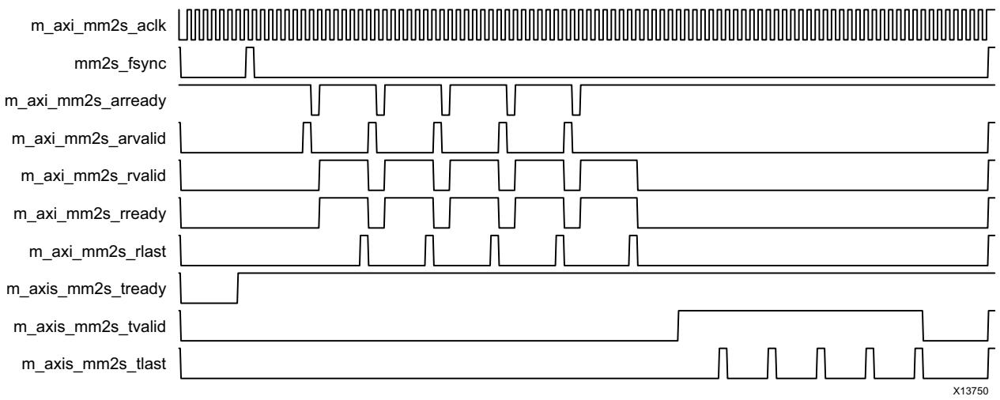

*Figure 2‐1:* **Example MM2S Interface Timing**


## **Example Write (S2MM) Path Timing**

[Figure](#page-13-0) [2-2](#page-13-0) illustrates example timing on the S2MM channel for Vertical Size = 5 lines, Horizontal Size = 16, bytes, and Stride = 32 bytes. The figure shows the m_axi_s2mm and s_axis_s2mm interfaces.

Dataflow: After the reception of s2mm_fsync, AXI VDMA drives s2mm_fsync_out and s_axis_s2mm_tready to indicate its readiness to receive a frame on the streaming interface. Incoming streaming data is stored in the line buffer and driven onto the mm side by asserting m_axi_s2mm_awvalid and subsequently driving data on m_axi_s2mm_wdata along with m_axi_s2mm_wvalid.

<span id="page-13-0"/>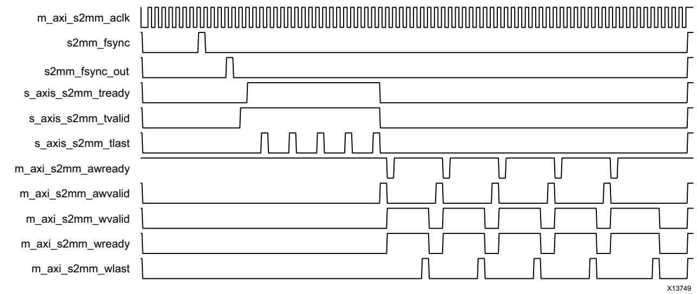

*Figure 2‐2:* **Example S2MM Interface Timing** 


## <span id="page-14-0"/>**Register Space**

The AXI VDMA core register space is shown in [Table](#page-14-1) [2-5.](#page-14-1) The AXI VDMA registers are memory-mapped into non-cacheable memory space. This memory space must be aligned on an AXI word (32-bit) boundary.

*Note:* The AXI4-Lite write access register is updated by the 32-bit AXI Write Data (*_wdata) signal, and is not impacted by the AXI Write Data Strobe (*_wstrb) signal. For a Write, both the AXI Write Address Valid (*_awvalid) and AXI Write Data Valid (*_wvalid) signals should be asserted together.

### **Endianess**

<span id="page-14-2"/>X-Ref Target - Figure 2-3

All registers are in little endian format, as shown in [Figure](#page-14-2) [2-3.](#page-14-2)

| MSB |                  |    |    |                  |    |    |                  |   |   |                  | LSB    |
|-----|------------------|----|----|------------------|----|----|------------------|---|---|------------------|--------|
|     | Addr Offset 0x03 |    |    | Addr Offset 0x02 |    |    | Addr Offset 0x01 |   |   | Addr Offset 0x00 |        |
| 31  | BYTE3            | 24 | 23 | BYTE2            | 16 | 15 | BYTE1            | 8 | 7 | BYTE0            | 0      |
|     |                  |    |    |                  |    |    |                  |   |   |                  | X13752 |


### <span id="page-14-3"/>**AXI VDMA Register Address Map**

| Address Space Offset | Name               | Description                                                             |
|----------------------|--------------------|-------------------------------------------------------------------------|
| 00h                  | MM2S_VDMACR        | MM2S VDMA Control Register                                              |
| 04h                  | MM2S_VDMASR        | MM2S VDMA Status Register                                               |
| 08h to 10h           | Reserved           | N/A                                                                     |
| 14h                  | MM2S_REG_INDEX     | MM2S Register Index                                                     |
| 18h to 24h           | Reserved           | See Additional Design Information in<br>Chapter 4 for more information. |
| 28h                  | PARK_PTR_REG       | MM2S and S2MM Park Pointer Register                                     |
| 2Ch                  | VDMA_VERSION       | Video DMA Version Register                                              |
| 30h                  | S2MM_VDMACR        | S2MM VDMA Control Register                                              |
| 34h                  | S2MM_VDMASR        | S2MM VDMA Status Register                                               |
| 38h                  | Reserved           | N/A                                                                     |
| 3Ch                  | S2MM_VDMA_IRQ_MASK | S2MM Error Interrupt Mask Register                                      |
| 40h                  | Reserved           | N/A                                                                     |
| 44h                  | S2MM_REG_INDEX     | S2MM Register Index                                                     |

#### <span id="page-14-1"/>*Table 2‐5:* **Register Address Map**


| Address Space Offset | Name                                   | Description                          |  |  |
|----------------------|----------------------------------------|--------------------------------------|--|--|
| 48h to 4Ch           | Reserved                               | N/A                                  |  |  |
| 50h                  | MM2S_VSIZE                             | MM2S Vertical Size Register          |  |  |
| 54h                  | MM2S_HSIZE                             | MM2S Horizontal Size Register        |  |  |
| 58h                  | MM2S_FRMDLY_STRIDE                     | MM2S Frame Delay and Stride Register |  |  |
| 5Ch to 98h           | MM2S_START_ADDRESS<br>(1 to 16) (1)(2) | MM2S Start Address (1 to 16)         |  |  |
| 9Ch                  | Reserved                               | N/A                                  |  |  |
| A0h                  | S2MM_VSIZE                             | S2MM Vertical Size Register          |  |  |
| A4h                  | S2MM_HSIZE                             | S2MM Horizontal Size Register        |  |  |
| A8h                  | S2MM_FRMDLY_STRIDE                     | S2MM Frame Delay and Stride Register |  |  |
| ACh to E8h           | S2MM_START_ADDRESS (1 to 16)(2)        | S2MM Start Address (1 to 16)         |  |  |
| ECh                  | ENABLE VERTICAL FLIP(3)                | Vertical Flip Register               |  |  |
| F0h to F4h           | Reserved                               | N/A                                  |  |  |

#### *Table 2‐5:* **Register Address Map** *(Cont'd)*

#### **Notes:**

<span id="page-15-0"/>1. Start Addresses 2 to 32 for MM2S and S2MM depend on the Frame Buffers parameter. Start address registers greater than the Frame Buffers setting are reserved. See the [MM2S_REG_INDEX (MM2S Register Index – Offset 14h|[MM2S Register Index – Offset 14h)](#page-21-0)]] and [S2MM_REG_INDEX](#page-30-0)  [](S2MM%20Register%20Index%20–%20Offset%2044h)](#page-30-0|S2MM_REG_INDEX)]] register definitions for accessing 32 start address registers.

- <span id="page-15-1"/>2. When AXI VDMA is configured for an address space greater than 32, each start address is specified by a combination of two registers. The first register specifies the LSB 32 bits of address, while the next register specifies the MSB 32 bits of address. For example, 5Ch will specify the LSB bits while 60h will specify the MSB bits of the first start address.
- <span id="page-15-2"/>3. Register will be enabled only when S2MM is Enabled.

### **Memory Map to Stream Register Details**

#### *Register Access Type Description*

- RO = Read Only. Write has no effect
- R/W = Read and Write Accessible
- R/WC = Read / Write to Clear


X-Ref Target - Figure 2-4

### *MM2S_VDMACR (MM2S VDMA Control Register – Offset 00h)*

This register provides control for the Memory Map to Stream VDMA Channel.

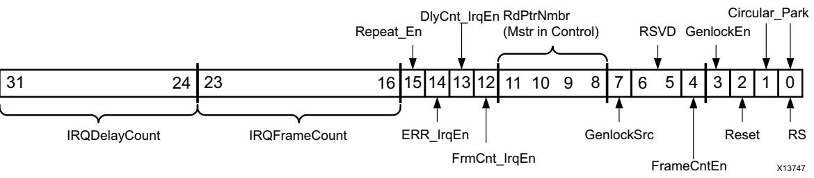

*Figure 2‐4:* **MM2S VDMACR Register** 

| Table 2‐6: |  | MM2S_VDMACR Register Details |  |  |
|------------|--|------------------------------|--|--|
|            |  |                              |  |  |

| Bits  | Field Name           | Default<br>Value | Access<br>Type                                                                                                                                                                                                                 | Description                                                                                                                                                                                                                                                                                                                                                                                                                                                                                                                                                                                                                              |  |
|-------|----------------------|------------------|--------------------------------------------------------------------------------------------------------------------------------------------------------------------------------------------------------------------------------|------------------------------------------------------------------------------------------------------------------------------------------------------------------------------------------------------------------------------------------------------------------------------------------------------------------------------------------------------------------------------------------------------------------------------------------------------------------------------------------------------------------------------------------------------------------------------------------------------------------------------------------|--|
| 31–24 | IRQDelayCount        | 00h              | R/W                                                                                                                                                                                                                            | This value is used for setting the interrupt delay count<br>value. The delay count interrupt is a mechanism for<br>causing the MM2S channel to generate an interrupt after<br>the delay period has expired. The timer begins counting<br>either upon receipt of frame sync (external fsync mode) or<br>completion of vsize lines (free run mode). It resets with a<br>subsequent start-of-packet (m_axis_mm2s_tvalid)<br>assertion. When a value different than the current<br>IRQDelayCount is written to this field, the internal delay<br>counter is reset to the new value.<br>Setting this value to zero disables the delay counter |  |
|       |                      |                  |                                                                                                                                                                                                                                | interrupt.                                                                                                                                                                                                                                                                                                                                                                                                                                                                                                                                                                                                                               |  |
| 23-16 | IRQFrameCount<br>01h |                  |                                                                                                                                                                                                                                | This value is used for setting the interrupt threshold. When<br>a frame transfer starts, an internal counter counts down<br>from the Interrupt Frame Count setting.                                                                                                                                                                                                                                                                                                                                                                                                                                                                      |  |
|       |                      | R/WC             | When the count reaches zero, an interrupt out is generated<br>by the MM2S channel. When a value different than the<br>current IRQFrameCount is written to this field, the internal<br>frame counter is reset to the new value. |                                                                                                                                                                                                                                                                                                                                                                                                                                                                                                                                                                                                                                          |  |
|       |                      |                  |                                                                                                                                                                                                                                | The minimum setting for the count is 0x01. A write of<br>0x00 to this register sets the count to 0x01. When<br>DMACR.FrameCntEn = 1, this value determines the number<br>of frame buffers to process.                                                                                                                                                                                                                                                                                                                                                                                                                                    |  |


#### *Table 2‐6:* **MM2S_VDMACR Register Details** *(Cont'd)*

| Bits                 | Field Name   | Default<br>Value | Access<br>Type | Description                                                                                                                                                                                                                                                                          |  |
|----------------------|--------------|------------------|----------------|--------------------------------------------------------------------------------------------------------------------------------------------------------------------------------------------------------------------------------------------------------------------------------------|--|
| 15<br>14<br>13<br>12 | Repeat_En    | 0h               | R/W            | Enables repeat or advance frame when AXI VDMA<br>encounters a frame error. This is applicable when AXI<br>VDMA is configured in Genlock Master or Dynamic Genlock<br>Master.                                                                                                         |  |
|                      |              |                  |                | 0 – Advance to next frame on frame errors                                                                                                                                                                                                                                            |  |
|                      |              |                  |                | 1 – Repeat previous frame on frame errors                                                                                                                                                                                                                                            |  |
|                      | Err_IrqEn    | 0h               | R/W<br>R/W     | Interrupt on Error Interrupt Enable. When set to 1, allows<br>VDMASR.Err_Irq to generate an interrupt out.                                                                                                                                                                           |  |
|                      |              |                  |                | 0 = Error Interrupt disabled                                                                                                                                                                                                                                                         |  |
|                      |              |                  |                | 1 = Error Interrupt enabled                                                                                                                                                                                                                                                          |  |
|                      | DlyCnt_IrqEn | 0h               |                | Interrupt on Delay Count Interrupt Enable. When set to 1,<br>allows DMASR.DlyCnt_Irq to generate an interrupt out.                                                                                                                                                                   |  |
|                      |              |                  |                | 0 = Delay Count Interrupt disabled                                                                                                                                                                                                                                                   |  |
|                      |              |                  |                | 1 = Delay Count Interrupt enabled                                                                                                                                                                                                                                                    |  |
|                      | FrmCnt_IrqEn | 0h               | R/WC           | Frame Count Complete Interrupt Enable. When set to 1,<br>allows DMASR.FrmCnt_Irq to generate an interrupt out<br>when IRQFrameCount value reaches zero.                                                                                                                              |  |
|                      |              |                  |                | 0 = Frame Count Interrupt disabled                                                                                                                                                                                                                                                   |  |
|                      |              |                  |                | 1 = Frame Count Interrupt enabled                                                                                                                                                                                                                                                    |  |
| 11–8                 | RdPntrNum    | 0h               | R/W            | Indicates the master in control when MM2S channel is<br>configured for Genlock slave/Dynamic Genlock<br>Master/Dynamic Genlock Slave or reserved otherwise.                                                                                                                          |  |
|                      |              |                  |                | 0000b = Controlling entity is Entity 1                                                                                                                                                                                                                                               |  |
|                      |              |                  |                | 0001b = Controller entity is Entity 2                                                                                                                                                                                                                                                |  |
|                      |              |                  |                | 0010b = Controller entity is Entity 3                                                                                                                                                                                                                                                |  |
|                      |              |                  |                | and so on.                                                                                                                                                                                                                                                                           |  |
| 7                    | GenlockSrc   | 1h               | R/W            | Selects internal or external genlock bus. This bit is set by<br>default when both channels are enabled and are<br>configured as a valid Genlock pair.                                                                                                                                |  |
|                      |              |                  |                | 0 = External Genlock                                                                                                                                                                                                                                                                 |  |
|                      |              |                  |                | 1 = Internal Genlock                                                                                                                                                                                                                                                                 |  |
| 6–5                  | Reserved     | 0h               | R/W            | Write has no effect on AXI VDMA.                                                                                                                                                                                                                                                     |  |
| 4                    | FrameCntEn   | 0h               | R/W            | Configures the MM2S channel to allow only a<br>IRQFrameCount number of transfers to occur. After<br>IRQFrameCount frames have been transferred, the MM2S<br>channel halts, DMACR.RS bit is cleared to 0, and<br>DMASR.Halted asserts to 1 when the channel has<br>completely halted. |  |


#### *Table 2‐6:* **MM2S_VDMACR Register Details** *(Cont'd)*

| Bits | Field Name    | Default<br>Value | Access<br>Type | Description                                                                                                                                                                                                                                                                                                                                                                                                                                                      |  |
|------|---------------|------------------|----------------|------------------------------------------------------------------------------------------------------------------------------------------------------------------------------------------------------------------------------------------------------------------------------------------------------------------------------------------------------------------------------------------------------------------------------------------------------------------|--|
|      | GenlockEn     | 0h               | R/W            | Enables Genlock or Dynamic Genlock Synchronization.                                                                                                                                                                                                                                                                                                                                                                                                              |  |
| 3    |               |                  |                | •<br>0 = Genlock or Dynamic Genlock Synchronization<br>disabled. Genlock input is ignored by MM2S.                                                                                                                                                                                                                                                                                                                                                               |  |
|      |               |                  |                | •<br>1 = Genlock or Dynamic Genlock Synchronization<br>enabled. MM2S synchronized to Genlock frame input.                                                                                                                                                                                                                                                                                                                                                        |  |
|      |               |                  |                | Note: This value is valid only when the channel is configured as<br>Genlock Slave or Dynamic Genlock Master or Dynamic Genlock<br>Slave. If configured for Genlock Master mode, this bit is reserved<br>and always reads as zero.                                                                                                                                                                                                                                |  |
|      |               |                  |                | See Genlock Synchronization for more details on different<br>Genlock modes.                                                                                                                                                                                                                                                                                                                                                                                      |  |
| 2    | Reset         | 0h               | R/W            | Soft reset for AXI VDMA MM2S channel. Setting this bit to<br>a 1 causes the AXI VDMA MM2S channel to be reset. Reset<br>is accomplished gracefully. Pending commands/transfers<br>are flushed or completed. AXI4-Stream reset output is<br>asserted. Setting VDMACR.Reset = 1 only resets the MM2S<br>channel. After completion of a soft reset all MM2S<br>registers and bits are in the default state. This bit will be<br>zero at the end of the reset cycle. |  |
|      |               |                  |                | 0 = Normal operation                                                                                                                                                                                                                                                                                                                                                                                                                                             |  |
|      |               |                  |                | 1 = Reset in progress                                                                                                                                                                                                                                                                                                                                                                                                                                            |  |
| 1    | Circular_Park | 1h               | R/W            | Indicates frame buffer Circular mode or frame buffer Park<br>mode.                                                                                                                                                                                                                                                                                                                                                                                               |  |
|      |               |                  |                | 0 = Park Mode– Engine will park on frame buffer<br>•<br>referenced by PARK_PTR_REG.RdFrmPntrRef.                                                                                                                                                                                                                                                                                                                                                                 |  |
|      |               |                  |                | 1 = Circular Mode – Engine continuously circles through<br>•<br>frame buffers.                                                                                                                                                                                                                                                                                                                                                                                   |  |
| 0    | RS            | 0h               | R/W            | Run / Stop controls the running and stopping of the VDMA<br>channel. For any VDMA operations to commence, the AXI<br>VDMA engine must be running (VDMACR.RS=1).                                                                                                                                                                                                                                                                                                  |  |
|      |               |                  |                | 0 = Stop – VDMA stops when current (if any) VDMA<br>•<br>operations are complete. The halted bit in the VDMA<br>Status register asserts to 1 when the VDMA engine is<br>halted. This bit gets cleared by the AXI VDMA hardware<br>when an AXI4 Slave response error occurs. The CPU can<br>also choose to clear this bit to stop VDMA operations.                                                                                                                |  |
|      |               |                  |                | 1 = Run – Start VDMA operations. The halted bit in the<br>•<br>VDMA Status register deasserts to 0 when the VDMA<br>engine begins operations.                                                                                                                                                                                                                                                                                                                    |  |
|      |               |                  |                | Note: On Run/Stop clear, in-progress stream transfers might<br>terminate early.                                                                                                                                                                                                                                                                                                                                                                                  |  |


X-Ref Target - Figure 2-5

### *MM2S_VDMASR (MM2S VDMA Status Register – Offset 04h)*

This register provides the status for the Memory Map to Stream VDMA Channel.

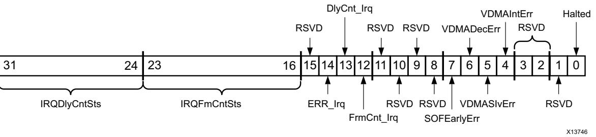

*Figure 2‐5:* **MM2S VDMASR Register**

#### *Table 2‐7:* **MM2S_VDMASR Register Details**

| Bits  | Field Name     | Default<br>Value | Access<br>Type | Description                                                                                                                 |
|-------|----------------|------------------|----------------|-----------------------------------------------------------------------------------------------------------------------------|
| 31–24 | IRQDelayCntSts | 00h              | RO             | Interrupt Delay Count Status. Indicates current<br>interrupt delay time value.                                              |
| 23-16 | IRQFrameCntSts | 01h              | RO             | Interrupt Frame Count Status. Indicates current<br>interrupt frame count value.                                             |
| 15    | Reserved       | 0h               | RO             | Always read as zero.                                                                                                        |
|       | Err_Irq        | 0h               | R/WC           | Interrupt on Error.                                                                                                         |
|       |                |                  |                | 0 = No error Interrupt.                                                                                                     |
| 14    |                |                  |                | 1 = Error interrupt detected.                                                                                               |
|       |                |                  |                | If enabled (VDMACR.Err_IrqEn = 1), an interrupt<br>out is generated when an error is detected.                              |
|       | DlyCnt_Irq     | 0h               | R/WC           | Interrupt on Delay.                                                                                                         |
| 13    |                |                  |                | 0 = No Delay Interrupt.                                                                                                     |
|       |                |                  |                | 1 = Delay Interrupt detected.                                                                                               |
|       |                |                  |                | If enabled (DMACR.DlyCnt_IrqEn = 1), an<br>interrupt out is generated when the delay count<br>reaches its programmed value. |
| 12    | FrmCnt_Irq     | 0h               | R/WC           | Frame Count Interrupt.                                                                                                      |
|       |                |                  |                | 0 = No Frame Count Interrupt.                                                                                               |
|       |                |                  |                | 1 = Frame Count Interrupt detected.                                                                                         |
|       |                |                  |                | If enabled (DMACR.FrmCnt_IrqEn = 1) and if the<br>interrupt threshold has been met, an interrupt<br>out is generated.       |
| 11–8  | Reserved       | 0h               | RO             | Write has no effect and read as zero.                                                                                       |


#### *Table 2‐7:* **MM2S_VDMASR Register Details** *(Cont'd)*

| Bits | Field Name  | Default<br>Value | Access<br>Type | Description                                                                                                                                                                  |
|------|-------------|------------------|----------------|------------------------------------------------------------------------------------------------------------------------------------------------------------------------------|
|      | SOFEarlyErr | 0h               | R/WC           | Start of Frame Early Error                                                                                                                                                   |
|      |             |                  |                | 0 = No start-of-frame Error                                                                                                                                                  |
| 7    |             |                  |                | 1 = Start of Frame Early Error detected                                                                                                                                      |
|      |             |                  |                | This error occurs if mm2s_fsync is received<br>before the completion of the frame on the<br>streaming interface.                                                             |
| 6    | VDMADecErr  | 0h               | RO             | VDMA Decode Error. This error occurs if the<br>address request is to an invalid address.                                                                                     |
|      |             |                  |                | •<br>0 = No VDMA Decode Errors.                                                                                                                                              |
|      |             |                  |                | •<br>1 = VDMA Decode Error detected. VDMA<br>channel halts.                                                                                                                  |
| 5    | VDMASlvErr  | 0h               |                | VDMA Slave Error.                                                                                                                                                            |
|      |             |                  |                | •<br>0 = No VDMA Slave Errors.                                                                                                                                               |
|      |             |                  | RO             | •<br>1 = VDMA Slave Error detected. VDMA Engine<br>halts.                                                                                                                    |
|      |             |                  |                | This error occurs if the slave read from the<br>Memory Map interface issues a Slave Error.                                                                                   |
|      | VDMAIntErr  | 0h               | R/WC           | VDMA Internal Error.                                                                                                                                                         |
|      |             |                  |                | 0 = No VDMA Internal Errors.                                                                                                                                                 |
|      |             |                  |                | 1 = VDMA Internal Error detected.                                                                                                                                            |
|      |             |                  |                | This error occurs during one of the following<br>conditions.                                                                                                                 |
|      |             |                  |                | (a) HSIZE or VSIZE register were written zeros or                                                                                                                            |
| 4    |             |                  |                | (b) Internal error received from helper core<br>axi_datamover or                                                                                                             |
|      |             |                  |                | (c) Transferred frame size is lesser than<br>programmed vsize (SOFEarlyErr).                                                                                                 |
|      |             |                  |                | In case (a) and/or (b) the channel stops (that is,<br>the VDMACR.RS bit is set to 0 and remains<br>cleared).<br>To restart the channel, a soft or hard reset is<br>required. |
|      |             |                  |                | In case (c), the channel does not stop or halt.                                                                                                                              |
| 3–2  | Reserved    | 0h               | RO             | Writing to these bits has no effect, and they are<br>always read as zeros.                                                                                                   |

X13745


X-Ref Target - Figure 2-6

| Table 2‐7: | MM2S_VDMASR Register Details (Cont'd) |  |
|------------|---------------------------------------|--|
|------------|---------------------------------------|--|

| Bits | Field Name | Default<br>Value | Access<br>Type | Description                                                                                                                                               |
|------|------------|------------------|----------------|-----------------------------------------------------------------------------------------------------------------------------------------------------------|
| 1    | Reserved   | 0h               | RO             | Write has no effect and read as zero.                                                                                                                     |
|      |            |                  |                | VDMA Channel Halted.                                                                                                                                      |
|      |            |                  |                | Indicates the run/stop state of the VDMA<br>channel.                                                                                                      |
| 0    | Halted     | 1h               | RO             | 0 = VDMA channel running                                                                                                                                  |
|      |            |                  |                | 1 = VDMA channel halted. This bit gets set when<br>VDMACR.RS = 0. There can be a lag of time<br>between when VDMACR.RS = 0 and when<br>VDMASR.Halted = 1. |

### <span id="page-21-0"/>*MM2S_REG_INDEX (MM2S Register Index – Offset 14h)*

This register is reserved if Frame Buffers selected in the Vivado® Integrated Design Environment (IDE) is less than 17 or when the address space is more than 32 (Write has no effect, read returns 0).


*Figure 2‐6:* **MM2S Register Index** 

| Table 2‐8: | MM2S Register Index (MM2S_REG_INDEX – Offset 0x14) |
|------------|----------------------------------------------------|
|------------|----------------------------------------------------|

| Bits | Field Name     | Default/<br>Reset State | Access |                                                                                                                                 |
|------|----------------|-------------------------|--------|---------------------------------------------------------------------------------------------------------------------------------|
| 31–1 | Reserved       | 0h                      | RO     | Always read as zero                                                                                                             |
| 0    | MM2S Reg Index | 0h                      | R/W    | When Frame Buffers is greater than 16 = Any write or<br>read access between 0x5C to 0x98 accesses the<br>Start Address 1 to 16. |
|      |                |                         |        | 1 = Any write or read access between 0x5C to 0x98<br>accesses the Start Address 17 to 32.                                       |


X-Ref Target - Figure 2-7

### *PARK_PTR_REG (Park Pointer Register – Offset 28h)*

This register provides Park Pointer registers for the Memory Map to Stream and Stream to Memory Map VDMA transfer Management.

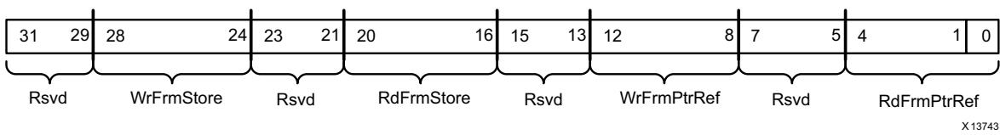

*Figure 2‐7:* **PARK_PTR_REG Register**

| Bits  | Field Name  | Default<br>Value | Access<br>Type | Description                                                                                                                                                                                                                                                                                                                                                                                           |
|-------|-------------|------------------|----------------|-------------------------------------------------------------------------------------------------------------------------------------------------------------------------------------------------------------------------------------------------------------------------------------------------------------------------------------------------------------------------------------------------------|
| 31–29 | Reserved    | 0h               | RO             | Writing to these bits has no effect, and they are always read<br>as zeros.                                                                                                                                                                                                                                                                                                                            |
| 28–24 | WrFrmStore  | 0h               | RO             | Write Frame Store number. Indicates current frame number<br>being operated on by the S2MM channel. During VDMA<br>operations this value continually updates as each frame is<br>processed. During error conditions, the value is updated<br>with the frame number being operated on when the error<br>occurred. It will again start tracking the current frame<br>number when all errors are cleared. |
| 23–21 | Reserved    | 0h               | RO             | Writing to these bits has no effect, and they are always read<br>as zeros.                                                                                                                                                                                                                                                                                                                            |
| 20–16 | RdFrmStore  | 0h               | RO             | Read Frame Store number. Indicates the frame number<br>being operated on by the MM2S channel. During VDMA<br>operations this value continually updates as each frame is<br>processed. During error conditions, the value is updated<br>with the frame number being operated on when the error<br>occurred. It will again start tracking the current frame<br>number when all errors are cleared.      |
| 15–13 | Reserved    | 0h               | RO             | Writing to these bits has no effect, and they are always read<br>as zeros.                                                                                                                                                                                                                                                                                                                            |
| 12–8  | WrFrmPtrRef | 0h               | R/W            | Write Frame Pointer Reference. When Parked<br>(S2MM_VDMACR.Circular_Park = 0), S2MM channel parks<br>on the buffer referenced by this frame number.                                                                                                                                                                                                                                                   |
| 7–5   | Reserved    | 0h               | RO             | Writing to these bits has no effect, and they are always read<br>as zeros.                                                                                                                                                                                                                                                                                                                            |
| 4–0   | RdFrmPtrRef | 0h               | R/W            | Read Frame Pointer Reference. When Parked<br>(MM2S_VDMACR.Circular_Park = 0) the MM2S channel<br>parks on the buffer referenced by this frame number.                                                                                                                                                                                                                                                 |

#### *Table 2‐9:* **PARK_PTR_REG Register Details**


X-Ref Target - Figure 2-8

X-Ref Target - Figure 2-9

### *VDMA_VERSION (AXI VDMA Version Register – Offset 2Ch)*

This register provides the AXI VDMA version.


*Figure 2‐8:* **VDMA_VERSION Register**

#### *Table 2‐10:* **VDMA_VERSION Register Details**

| Bits  | Field Name      | Default<br>Value | Access<br>Type | Description                                                              |
|-------|-----------------|------------------|----------------|--------------------------------------------------------------------------|
| 31–28 | Major Version   | 6h               | RO             | Single 4-bit hexadecimal value. v1 = 1h, v2=2h, v3=3h, and<br>so on.     |
| 27–20 | Minor Version   | 20h              | RO             | Two separate 4-bit hexadecimal values. 00 = 00h, 01 = 01h,<br>and so on. |
| 19–16 | Revision        | 0h               | RO             | Revision Number                                                          |
| 15–0  | Xilinx Internal | various          | RO             | Reserved for Internal Use Only. Integer value from 0 to<br>9,999.        |

### **Stream to Memory Map Register Detail**

### *S2MM_VDMACR (S2MM VDMA Control Register – Offset 30h)*

This register provides control for the Stream to Memory Map VDMA Channel.

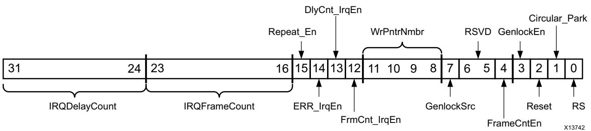

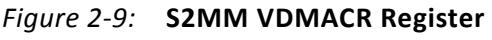


| Table 2‐11:<br>S2MM_VDMACR Register Details |
|---------------------------------------------|
|---------------------------------------------|

| Bits  | Field Name    | Default<br>Value | Access<br>Type | Description                                                                                                                                                                                                                                                                                                                                                                                                                                                                                                                                                                                                                                              |  |
|-------|---------------|------------------|----------------|----------------------------------------------------------------------------------------------------------------------------------------------------------------------------------------------------------------------------------------------------------------------------------------------------------------------------------------------------------------------------------------------------------------------------------------------------------------------------------------------------------------------------------------------------------------------------------------------------------------------------------------------------------|--|
| 31–24 | IRQDelayCount | 00h              | R/W            | This value is used for setting the interrupt delay count<br>value. The delay count interrupt is a mechanism for<br>causing the S2MM channel to generate an interrupt after<br>the delay period has expired. The timer begins counting<br>either upon receipt of frame sync (external fsync mode) or<br>completion of vsize lines (free run mode). It resets with<br>the subsequent start-of-packet (s_axis_s2mm_tvalid)<br>assertion. When a value different than the current<br>IRQDelayCount is written to this field, the internal delay<br>counter is reset to the new value.<br>Setting this value to zero disables the delay counter<br>interrupt. |  |
| 23-16 | IRQFrameCount | 01h              | R/W            | This value is used for setting the interrupt threshold.<br>When a frame transfer starts, an internal counter counts<br>down from the Interrupt Frame Count setting.<br>When the count reaches zero, an interrupt out is<br>generated by the S2MM channel. When a value different<br>than the current IRQFrameCount is written to this field,<br>the internal frame counter is reset to the new value.<br>The minimum setting for the count is 0x01. A write of<br>0x00 to this register sets the count to 0x01.<br>When DMACR.FrameCntEn = 1, this value determines the<br>number of frame buffers to process.                                           |  |
| 15    | Repeat_En     | 0h               | RO             | Enables repeat or advance frame when AXI VDMA<br>encounters a frame error. This is applicable when AXI<br>VDMA is configured in Genlock Master or Dynamic<br>Genlock Master.<br>0 – Advance to next frame on frame errors<br>1 – Repeat previous frame on frame errors                                                                                                                                                                                                                                                                                                                                                                                   |  |
| 14    | Err_IrqEn     | 0h               | R/W            | Interrupt on Error Interrupt Enable. When set to 1, allows<br>VDMASR.Err_Irq to generate an interrupt out.<br>0 = Error Interrupt disabled<br>1 = Error Interrupt enabled                                                                                                                                                                                                                                                                                                                                                                                                                                                                                |  |
| 13    | DlyCnt_IrqEn  | 0h               | R/W            | Delay Count Interrupt Enable. When set to 1, allows<br>DMASR.DlyCnt_Irq to generate an interrupt out.<br>0 = Delay Count Interrupt disabled<br>1 = Delay Count Interrupt enabled                                                                                                                                                                                                                                                                                                                                                                                                                                                                         |  |
| 12    | FrmCnt_IrqEn  | 0h               | R/W            | Frame Count Complete Interrupt Enable. When set to 1,<br>allows DMASR.FrmCnt_Irq to generate an interrupt out<br>when the IRQFrameCount value reaches zero.<br>0 = Frame Count Interrupt disabled<br>1 = Frame Count Interrupt enabled                                                                                                                                                                                                                                                                                                                                                                                                                   |  |


#### *Table 2‐11:* **S2MM_VDMACR Register Details** *(Cont'd)*

| Bits | Field Name | Default<br>Value | Access<br>Type | Description                                                                                                                                                                                                                                                                                                                                                                                                                                                                                                    |  |
|------|------------|------------------|----------------|----------------------------------------------------------------------------------------------------------------------------------------------------------------------------------------------------------------------------------------------------------------------------------------------------------------------------------------------------------------------------------------------------------------------------------------------------------------------------------------------------------------|--|
| 11–8 | WrPntrNum  | 0h               | R/W            | Indicates the master in control when the S2MM channel<br>is configured for Genlock slave/Dynamic Genlock<br>Master/Dynamic Genlock Slave.                                                                                                                                                                                                                                                                                                                                                                      |  |
|      |            |                  |                | 0000b = Controlling entity is Entity 1                                                                                                                                                                                                                                                                                                                                                                                                                                                                         |  |
|      |            |                  |                | 0001b = Controller entity is Entity 2                                                                                                                                                                                                                                                                                                                                                                                                                                                                          |  |
|      |            |                  |                | 0010b = Controller entity is Entity 3                                                                                                                                                                                                                                                                                                                                                                                                                                                                          |  |
|      |            |                  |                | and so on                                                                                                                                                                                                                                                                                                                                                                                                                                                                                                      |  |
| 7    | GenlockSrc | 1h               | R/W            | Sets the Genlock source for Genlock slaves. This bit is set<br>by default when both channels are enabled and are<br>configured as a valid Genlock pair.                                                                                                                                                                                                                                                                                                                                                        |  |
|      |            |                  |                | 0 = External Genlock                                                                                                                                                                                                                                                                                                                                                                                                                                                                                           |  |
|      |            |                  |                | 1 = Internal Genlock                                                                                                                                                                                                                                                                                                                                                                                                                                                                                           |  |
| 6–5  | Reserved   | 0h               | R/W            | Write has no effect on AXI VDMA.                                                                                                                                                                                                                                                                                                                                                                                                                                                                               |  |
| 4    | FrameCntEn | 0h               | R/W            | Configures the S2MM channel to allow only<br>IRQFrameCount number of transfers to occur. After the<br>IRQFrameCount frames are completely transferred, the<br>S2MM channel halts, DMACR.RS bit is deasserted, and the<br>DMASR.Halted asserts when the channel has completely<br>halted.                                                                                                                                                                                                                       |  |
|      | GenlockEn  | 0h               |                | Enables Genlock or Dynamic Genlock Synchronization.                                                                                                                                                                                                                                                                                                                                                                                                                                                            |  |
|      |            |                  | R/W            | •<br>0 = Genlock or Dynamic Genlock Synchronization<br>disabled. Genlock input is ignored by S2MM.                                                                                                                                                                                                                                                                                                                                                                                                             |  |
|      |            |                  |                | •<br>1 = Genlock or Dynamic Genlock Synchronization<br>enabled. S2MM synchronized to Genlock frame input.                                                                                                                                                                                                                                                                                                                                                                                                      |  |
| 3    |            |                  |                | Note: This value is only valid when the channel is configured as<br>Genlock Slave or Dynamic Genlock Master or Dynamic Genlock<br>Slave. If configured for Genlock Master mode, this bit is reserved<br>and always reads as zero.                                                                                                                                                                                                                                                                              |  |
|      |            |                  |                | See Genlock Synchronization for more details on different<br>Genlock modes.                                                                                                                                                                                                                                                                                                                                                                                                                                    |  |
| 2    | Reset      | 0h               | R/W            | Soft reset for AXI VDMA S2MM channel. Setting this bit<br>to a 1 causes the AXI VDMA S2MM channel to be reset.<br>Reset is accomplished gracefully. Pending<br>commands/transfers are flushed or completed.<br>AXI4-Stream reset output is asserted. Setting<br>VDMACR.Reset = 1 only resets the S2MM channel. After<br>completion of a soft reset, all S2MM registers and bits are<br>in the default state. This bit will be 0 at the end of reset<br>cycle.<br>0 = Normal operation<br>1 = Reset in progress |  |


| Bits | Field Name    | Default<br>Value | Access<br>Type | Description                                                                                                                                                                                                                                                                                                                   |  |
|------|---------------|------------------|----------------|-------------------------------------------------------------------------------------------------------------------------------------------------------------------------------------------------------------------------------------------------------------------------------------------------------------------------------|--|
|      | Circular_Park | 1h               | R/W            | Indicates frame buffer Circular mode or frame buffer Park<br>mode.                                                                                                                                                                                                                                                            |  |
| 1    |               |                  |                | 0 = Park Mode – Engine will park on the frame buffer<br>referenced by PARK_PTR_REG.WrFrmPntrRef.                                                                                                                                                                                                                              |  |
|      |               |                  |                | 1 = Circular Mode – Engine continuously circles through<br>frame buffers.                                                                                                                                                                                                                                                     |  |
| 0    | RS            | 0h               | R/W            | Run / Stop. Controls running and stopping of the VDMA<br>channel. For any VDMA operations to commence the AXI<br>VDMA engine must be running (VDMACR.RS=1).                                                                                                                                                                   |  |
|      |               |                  |                | •<br>0 = Stop – VDMA stops when current (if any) VDMA<br>operations are complete. The halted bit in the VDMA<br>Status Register asserts to 1 when the VDMA engine is<br>halted. This bit gets cleared by the AXI VDMA hardware<br>when an error occurs. The CPU can also choose to clear<br>this bit to stop VDMA operations. |  |
|      |               |                  |                | •<br>1 = Run – Start VDMA operations. The halted bit in the<br>VDMA Status Register deasserts to 0 when the VDMA<br>engine begins operations.                                                                                                                                                                                 |  |
|      |               |                  |                | Note: If Run/Stop is cleared, in-progress stream transfers might<br>terminate early.                                                                                                                                                                                                                                          |  |

#### *Table 2‐11:* **S2MM_VDMACR Register Details** *(Cont'd)*

### *S2MM_VDMASR (S2MM VDMA Status Register – Offset 34h)*

This register provides the status for the Stream to Memory Map VDMA Channel.

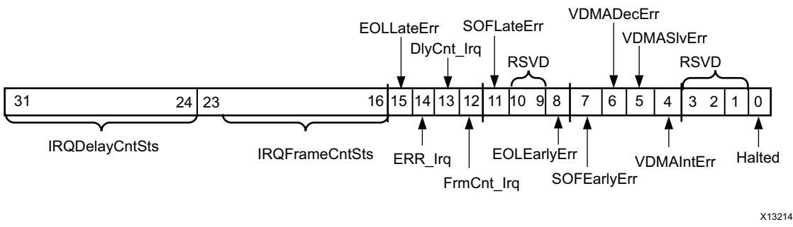

*Figure 2‐10:* **S2MM VDMASR Register**

X-Ref Target - Figure 2-10


#### *Table 2‐12:* **S2MM_VDMASR Register Details**

| Bits  | Field Name     | Default<br>Value | Access<br>Type | Description                                                                                                                                                                          |
|-------|----------------|------------------|----------------|--------------------------------------------------------------------------------------------------------------------------------------------------------------------------------------|
| 31–24 | IRQDelayCntSts | 00h              | RO             | Interrupt Delay Count Status. Indicates current<br>interrupt delay time value.                                                                                                       |
|       |                |                  |                | End of Line Late Error.                                                                                                                                                              |
|       |                | 0h               | R/WC           | •<br>0 = No End of Line Late Error                                                                                                                                                   |
| 15    | EOLLateErr     |                  |                | •<br>1 = End of Line Late Error detected. VDMA<br>does not halt                                                                                                                      |
|       |                |                  |                | This error occurs if the incoming line size is<br>greater than the programmed hsize value. Write<br>1 to clear.                                                                      |
| 14    | Err_Irq        | 0h               | R/WC           | Interrupt on Error. When set to 1, indicates an<br>interrupt event was generated on error. If<br>enabled (VDMACR.Err_IrqEn = 1), an interrupt<br>out is generated from the AXI VDMA. |
|       |                |                  |                | 0 = No error Interrupt.                                                                                                                                                              |
|       |                |                  |                | 1 = Error interrupt detected.                                                                                                                                                        |
|       | DlyCnt_Irq     |                  |                | Interrupt on Delay.                                                                                                                                                                  |
| 13    |                | 0h               | R/WC           | 0 = No Delay Interrupt.                                                                                                                                                              |
|       |                |                  |                | 1 = Delay Interrupt detected.                                                                                                                                                        |
|       |                |                  |                | If enabled (DMACR.DlyCnt_IrqEn = 1), an<br>interrupt out is generated when the delay count<br>reaches its programmed value.                                                          |
|       | FrmCnt_Irq     | 0h               | R/WC           | Frame Count Interrupt.                                                                                                                                                               |
|       |                |                  |                | • 0 = No Frame Count Interrupt.                                                                                                                                                      |
| 12    |                |                  |                | • 1 = Frame Count Interrupt detected.                                                                                                                                                |
|       |                |                  |                | If enabled (DMACR.FrmCnt_IrqEn = 1) and if the<br>interrupt threshold has been met, an interrupt<br>out is generated.                                                                |
|       | SOFLateErr     | 0h               | R/WC           | Start of Frame Late Error.                                                                                                                                                           |
|       |                |                  |                | •<br>0 = No start-of-frame Late Error                                                                                                                                                |
| 11    |                |                  |                | •<br>1 = Start of Frame Late Error detected. VDMA<br>does not halt                                                                                                                   |
|       |                |                  |                | This error occurs if the incoming frame size is<br>greater than the programmed vsize value. Write<br>1 to Clear in flush on fsync mode.                                              |
| 10–9  | Reserved       | 0h               | RO             | Write has no effect and read as zero.                                                                                                                                                |
| 8     | EOLEarlyErr    | 0h               |                | End of Line Early Error.                                                                                                                                                             |
|       |                |                  | R/WC           | •<br>0 = No End of Line Early Error                                                                                                                                                  |
|       |                |                  |                | •<br>1 = End of Line Early Error detected. VDMA<br>does not halt.                                                                                                                    |
|       |                |                  |                | This error occurs if the incoming line size is<br>lesser than the programmed hsize value. Write a<br>1 to clear.                                                                     |


| Table 2‐12: |  | S2MM_VDMASR Register Details (Cont'd) |  |  |  |
|-------------|--|---------------------------------------|--|--|--|
|-------------|--|---------------------------------------|--|--|--|

| Bits | Field Name  | Default<br>Value | Access<br>Type | Description                                                                                                                                                             |
|------|-------------|------------------|----------------|-------------------------------------------------------------------------------------------------------------------------------------------------------------------------|
| 7    | SOFEarlyErr | 0h               | R/WC           | Start of Frame Early Error.                                                                                                                                             |
|      |             |                  |                | •<br>0 = No start-of-frame Early Error                                                                                                                                  |
|      |             |                  |                | •<br>1 = Start of Frame Early Error detected. VDMA<br>does not halt.                                                                                                    |
|      |             |                  |                | This error occurs if incoming frame size is lesser<br>than programmed vsize value. Write 1 to Clear in<br>flush on fsync mode and Read Only otherwise.                  |
|      |             | 0h               | RO             | VDMA Decode Error.                                                                                                                                                      |
|      |             |                  |                | •<br>0 = No VDMA Decode Errors.                                                                                                                                         |
| 6    | VDMADecErr  |                  |                | •<br>1 = VDMA Decode Error detected. VDMA<br>channel halts.                                                                                                             |
|      |             |                  |                | This error occurs if the address request is to an<br>invalid address.                                                                                                   |
|      | VDMASlvErr  | 0h               |                | VDMA Slave Error.                                                                                                                                                       |
|      |             |                  |                | •<br>0 = No VDMA Slave Errors.                                                                                                                                          |
| 5    |             |                  | RO             | •<br>1 = VDMA Slave Error detected. VDMA Engine<br>halts.                                                                                                               |
|      |             |                  |                | This error occurs if the slave read from the<br>Memory Map interface issues a Slave Error.                                                                              |
|      | VDMAIntErr  | 0h               | R/WC           | VDMA Internal Error.                                                                                                                                                    |
|      |             |                  |                | 0 = No VDMA Internal Errors.                                                                                                                                            |
|      |             |                  |                | 1 = VDMA Internal Error detected.                                                                                                                                       |
|      |             |                  |                | This error occurs during one of the following<br>conditions:                                                                                                            |
|      |             |                  |                | (a) HSIZE or VSIZE register were written zeros or                                                                                                                       |
| 4    |             |                  |                | (b) Internal error received from the helper core<br>axi_datamover or                                                                                                    |
|      |             |                  |                | (c) Received frame size is greater or less than<br>programmed vsize (SOFLateErr or<br>SOFEarlyErr)                                                                      |
|      |             |                  |                | In case (a) and/or (b) the channel stops (that is,<br>the VDMACR.RS bit is set to 0 and remains<br>cleared). To restart the channel, soft or hard reset<br>is required. |
|      |             |                  |                | In case (c), the channel does not stop or halt.                                                                                                                         |
| 3–2  | Reserved    | 0h               | RO             | Writing to these bits has no effect and they are<br>always read as zeros.                                                                                               |


X-Ref Target - Figure 2-11

| Bits | Field Name | Default<br>Value | Access<br>Type | Description                                                                                                                                                    |
|------|------------|------------------|----------------|----------------------------------------------------------------------------------------------------------------------------------------------------------------|
| 1    | Reserved   | 0h               | RO             | Write has no effect and read as zero.                                                                                                                          |
| 0    | Halted     | 1h               | RO             | VDMA Channel Halted.                                                                                                                                           |
|      |            |                  |                | Indicates the run/stop state of the VDMA<br>channel.                                                                                                           |
|      |            |                  |                | •<br>0 = VDMA channel running                                                                                                                                  |
|      |            |                  |                | •<br>1 = VDMA channel halted. This bit gets set<br>when VDMACR.RS = 0. There can be a lag of<br>time between when VDMACR.RS = 0 and when<br>VDMASR.Halted = 1. |

#### *Table 2‐12:* **S2MM_VDMASR Register Details** *(Cont'd)*

### *S2MM_VDMA_IRQ_MASK (S2MM Error Interrupt Mask – Offset 3Ch)*

This register can mask an interrupt out originating due to SOF Early, End of Line (EOL) Early, SOF Late or EOL Late errors. This register should be used in following way.

- 1. First, clear all error bits in the S2MM_VDMASR register (bit 4 to bit 14).
- 2. Then, set/change the S2MM_VDMA_IRQ_MASK register.

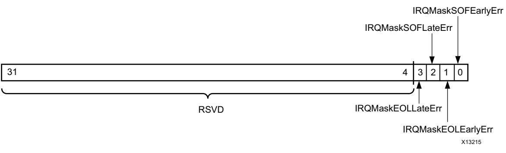

*Figure 2‐11:* **S2MM_VDMA_IRQ_MASK Register** 

| Table 2‐13: |  |  | S2MM_VDMA_IRQ_MASK (S2MM Error Interrupt Mask - Offset 3Ch) |
|-------------|--|--|-------------------------------------------------------------|
|-------------|--|--|-------------------------------------------------------------|

| Bits | Field Name         | Default<br>Value | Access<br>Type | Description                                                                                |
|------|--------------------|------------------|----------------|--------------------------------------------------------------------------------------------|
| 31–4 | Reserved           |                  | RO             | Always read as zero                                                                        |
| 3    | IRQMaskEOLLateErr  | 0h               | R/W            | 1 = Masks interrupt due to EOLLateErr.<br>0 = Does not mask interrupt due to EOLLateErr.   |
| 2    | IRQMaskSOFLateErr  | 0h               | R/W            | 1 = Masks interrupt due to SOFLateErr.<br>0 = Does not mask interrupt due to SOFLateErr.   |
| 1    | IRQMaskEOLEarlyErr | 0h               | R/W            | 1 = Masks interrupt due to EOLEarlyErr.<br>0 = Does not mask interrupt due to EOLEarlyErr. |
| 0    | IRQMaskSOFEarlyErr | 0h               | R/W            | 1 = Masks interrupt due to SOFEarlyErr.<br>0 = Does not mask interrupt due to SOFEarlyErr. |

X13740


X-Ref Target - Figure 2-12

### <span id="page-30-0"/>*S2MM_REG_INDEX (S2MM Register Index – Offset 44h)*

This register is reserved if Frame Buffers selected in the Vivado Integrated Design Environment (IDE) is less than 17 or when the address space is more than 32 (Write has no effect, read returns 0).

| 31 |      | 0              |
|----|------|----------------|
|    |      |                |
|    | RSVD | S2MM_REG_INDEX |

*Figure 2‐12:* **S2MM Register Index** 

| Table 2‐14:<br>S2MM Register Index (S2MM_REG_INDEX - Offset 0x44) |  |  |
|-------------------------------------------------------------------|--|--|
|-------------------------------------------------------------------|--|--|

| Bits | Name              | Default/Reset<br>State | Access | Description                                                                                                                                                                                                                                                     |
|------|-------------------|------------------------|--------|-----------------------------------------------------------------------------------------------------------------------------------------------------------------------------------------------------------------------------------------------------------------|
| 31–1 | Reserved          | 0h                     | RO     | Always read as zero                                                                                                                                                                                                                                             |
| 0    | S2MM Reg<br>Index | 0h                     | R/W    | When Frame Buffers is greater than 16<br>•<br>0 = Any write or read access between 0xAC to<br>0xE8 accesses the Start Address 1 to 16 registers.<br>•<br>1 = Any write or read access between 0xAC to<br>0xE8 accesses the Start Address 17 to 32<br>registers. |

### *MM2S Vertical Size (MM2S_VSIZE – Offset 0x50)*

The vertical size register has a dual purpose: first to hold the number of vertical lines, and second to be the mechanism for starting an MM2S transfer. If MM2S_VDMACR.RS = 1, a write to this register transfers the video parameters and start addresses to an internal register block for VDMA controller use. This register must be written last for a particular channel.

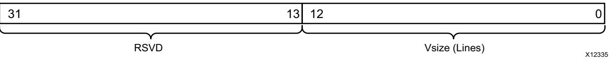

*Figure 2‐13:* **MM2S VSIZE Register** 

X-Ref Target - Figure 2-13


X-Ref Target - Figure 2-14

#### *Table 2‐15:* **MM2S VSIZE Register Details**

| Bits  | Field Name               | Default<br>Value | Access<br>Type | Description                                                                                                                                 |
|-------|--------------------------|------------------|----------------|---------------------------------------------------------------------------------------------------------------------------------------------|
| 31–13 | Reserved                 | 0h               | RO             | Writing to these bits has no effect, and they are always read<br>as zeros.                                                                  |
| 12–0  | Vertical Size<br>(Lines) | 0h               | R/W            | Indicates the vertical size in lines of the video data to<br>transfer.                                                                      |
|       |                          |                  |                | Note: Writing a value of zero in this field causes a VDMAIntErr to<br>be flagged in the MM2S_VDMASR register on the next frame<br>boundary. |

#### *MM2S Horizontal Size (MM2S_HSIZE – Offset 0x54)*

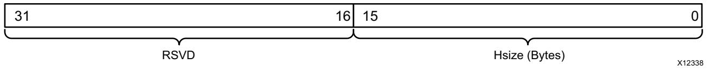

| Figure 2‐14: | MM2S HSIZE Register |
|--------------|---------------------|
|--------------|---------------------|

| Table 2‐16: | MM2S HSIZE Register Details |
|-------------|-----------------------------|
|-------------|-----------------------------|

| Bits  | Field Name                 | Default<br>Value | Access<br>Type | Description                                                                                                                                                                                                                                |
|-------|----------------------------|------------------|----------------|--------------------------------------------------------------------------------------------------------------------------------------------------------------------------------------------------------------------------------------------|
| 31–16 | Reserved                   | 0h               | RO             | Writing to these bits has no effect, and they are always read<br>as zeros.                                                                                                                                                                 |
| 15–0  | Horizontal Size<br>(Bytes) | 0h               | R/W            | Indicates the horizontal size in bytes of the video data to<br>transfer.<br>Note: A value of zero in this field when MM2S_VSIZE is written<br>causes a VDMAIntErr to be flagged in the MM2S_VDMASR register<br>on the next frame boundary. |


X-Ref Target - Figure 2-15

### *MM2S Frame Delay and Stride (MM2S_FRMDLY_STRIDE – Offset 0x58)*

| 31 | 29<br>28 | 24     | 23   | 15 |                | 0 |
|----|----------|--------|------|----|----------------|---|
|    |          |        |      |    |                |   |
|    | RSVD     | FrmDly | RSVD |    | Stride (Bytes) |   |

#### *Figure 2‐15:* **MM2S Frame Delay and Stride Register**

| Bits  | Field Name        | Default<br>Value | Access<br>Type | Description                                                                                                                                                                                                                                                                                                                                         |
|-------|-------------------|------------------|----------------|-----------------------------------------------------------------------------------------------------------------------------------------------------------------------------------------------------------------------------------------------------------------------------------------------------------------------------------------------------|
| 31–29 | Reserved          | 0h               | RO             | Writing to these bits has no effect, and they are always<br>read as zeros.                                                                                                                                                                                                                                                                          |
| 28–24 | Frame Delay       | 1h               | R/W            | Indicates the minimum number of frame buffers the<br>Genlock slave is to be behind the locked master. This field<br>is only used if the channel is enabled for Genlock Slave<br>operations. This field has no meaning in other Genlock<br>modes.<br>Note: Frame Delay must be less than or equal to Frame Buffers<br>or an undefined results occur. |
| 23–16 | Reserved          | 0h               | RO             | Writing to these bits has no effect, and they are always<br>read as zeros.                                                                                                                                                                                                                                                                          |
| 15–0  | Stride<br>(Bytes) | 0h               | R/W            | Indicates the number of address bytes between the first<br>pixels of each video line.                                                                                                                                                                                                                                                               |
|       |                   |                  |                | Note: A stride value less than MM2S_HSIZE causes data to be<br>corrupted.                                                                                                                                                                                                                                                                           |


### *MM2S Start Addresses (Offsets 0x5C to Maximum Offset 0x98)*

There is a maximum of 32 start registers available that are divided in two register banks, Bank0 and Bank1, each of 16 registers. Both the banks have the same initial offset (that is, 0x5C) and are accessed depending upon the MM2S_REG_INDEX value. If you want to access the 17th start address, it can be done by setting MM2S_REG_INDEX to 1 and accessing offset 0x5C.

When AXI VDMA is configured for an address space greater than 32, a maximum of 16 registers are available. Two registers are used to specify an address that is more than 32 bits. The first register is used to specify LSB 32 bits while the next register is used to specify the MSB 32 bits of any start address. Therefore with an address space greater than 32 you can specify a maximum of 8 frame buffers, each 64 bits wide.

| 31 | Start Address 1    | 0 |
|----|--------------------|---|
| 31 |                    | 0 |
| 31 | Start Address N(1) | 0 |
|    |                    |   |

X-Ref Target - Figure 2-16

#### *Figure 2‐16:* **MM2S Start Address Register/s 1 to N**

#### *Table 2‐18:* **MM2S Start Address Register Details**

| Bits                                     | Field Name              | Default<br>Value | Access<br>Type | Description                                          |
|------------------------------------------|-------------------------|------------------|----------------|------------------------------------------------------|
| 31–0<br>(Offset 0x5C<br>to 0x98<br>max.) | Start Address 1<br>to N | 0h               | R/W            | Indicates the Start Address for video buffer 1 to N. |

X13744

X12335


X-Ref Target - Figure 2-17

X-Ref Target - Figure 2-18

### *S2MM Vertical Size (S2MM_VSIZE – Offset 0xA0)*

The vertical size register has a dual purpose: first to hold the number of vertical lines, and second to be the mechanism for starting an S2MM transfer. If S2MM_DMACR.RS = 1, a write to this register transfers the video parameters and start addresses to an internal register block for VDMA controller use. This register must be written last for a particular channel.

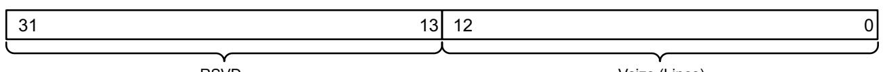

RSVD

Vsize (Lines)

*Figure 2‐17:* **S2MM VSIZE Register** 

*Table 2‐19:* **S2MM VSIZE Register Details**

| Bits  | Field Name               | Default<br>Value | Access<br>Type | Description                                                                                                                                                                                                    |
|-------|--------------------------|------------------|----------------|----------------------------------------------------------------------------------------------------------------------------------------------------------------------------------------------------------------|
| 31–13 | Reserved                 | 0h               | RO             | Writing to these bits has no effect, and they are always<br>read as zeros.                                                                                                                                     |
| 12–0  | Vertical Size<br>(Lines) | 0h               | R/W            | Indicates vertical size in lines of the video data to transfer.<br>Note: Writing a value of zero in this field causes a VDMAIntErr<br>to be flagged in the S2MM_VDMASR register on the next frame<br>boundary. |

#### *S2MM Horizontal Size (S2MM_HSIZE – Offset 0xA4)*

| 31   | 16<br>15 | 0                       |
|------|----------|-------------------------|
|      |          |                         |
| RSVD |          | Hsize (Bytes)<br>X12338 |

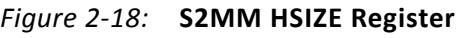

| Bits  | Field Name                 | Default<br>Value | Access<br>Type | Description                                                                                                                                                                                                                                |
|-------|----------------------------|------------------|----------------|--------------------------------------------------------------------------------------------------------------------------------------------------------------------------------------------------------------------------------------------|
| 31–16 | Reserved                   | 0h               | RO             | Writing to these bits has no effect, and they are always read<br>as zeros.                                                                                                                                                                 |
| 15–0  | Horizontal Size<br>(Bytes) | 0h               | R/W            | Indicates the horizontal size in bytes of the video data to<br>transfer.<br>Note: A value of zero in this field when S2MM_VSIZE is written<br>causes a VDMAIntErr to be flagged in the S2MM_VDMASR<br>register on the next frame boundary. |


X-Ref Target - Figure 2-19

### *S2MM Frame Delay and Stride (S2MM_FRMDLY_STRIDE – Offset 0xA8)*

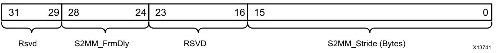

*Figure 2‐19:* **S2MM Frame Delay and Stride Register** 

| Table 2‐21: | S2MM FRMDELAY_STRIDE Register Details |  |  |
|-------------|---------------------------------------|--|--|
|-------------|---------------------------------------|--|--|

| Bits  | Field Name        | Default<br>Value | Access<br>Type                                                                    | Description                                                                                                                                                                                                                                                                              |
|-------|-------------------|------------------|-----------------------------------------------------------------------------------|------------------------------------------------------------------------------------------------------------------------------------------------------------------------------------------------------------------------------------------------------------------------------------------|
| 31–29 | Reserved          | 0h               | RO                                                                                | Writing to these bits has no effect, and they are always<br>read as zeros.                                                                                                                                                                                                               |
| 28–24 | Frame Delay       | 1h               | R/W                                                                               | Indicates the minimum number of frame stores the<br>Genlock slave is to be behind the locked master. This field<br>is only used if channel is enabled for Genlock Slave<br>Operations<br>Note: Frame Delay must be less than or equal to Frame Buffers<br>or an undefined results occur. |
| 23–16 | Reserved          | 0h               | Writing to these bits has no effect, and they are always<br>R/W<br>read as zeros. |                                                                                                                                                                                                                                                                                          |
| 15–0  | Stride<br>(Bytes) | 0h               | R/W                                                                               | Indicates the number of address bytes between the first<br>pixels of each video line.<br>Note: A stride value less than S2MM_HSIZE causes data to be<br>corrupted.                                                                                                                       |


### *S2MM Start Addresses (Offsets 0xAC to Maximum Offset 0xE8)*

There is a maximum of 32 start registers available that are divided in two register banks, Bank0 and Bank1, each of 16 registers. Both the banks have the same initial offset (that is, 0xAC) and are accessed depending upon the S2MM_REG_INDEX value. If you want to access the 17th start address, it can be done by setting S2MM_REG_INDEX to 1 and accessing offset 0xAC.

When AXI VDMA is configured for an address space greater than 32, a maximum of 16 registers are available. Two registers are used to specify an address that is more than 32 bits. The first register is used to specify LSB 32 bits while the next register is used to specify the MSB 32 bits of any start address.

Therefore with an address space greater than 32 you can specify a maximum of 8 frame buffers, each 64 bits wide.

| 31 | Start Address 1    | 0 |
|----|--------------------|---|
| 31 |                    | 0 |
| 31 | Start Address N(1) | 0 |

X-Ref Target - Figure 2-20

#### *Figure 2‐20:* **S2MM Start Address Register/s 1 to N**

| Bits                                     | Field Name              | Default<br>Value | Access<br>Type | Description                                          |
|------------------------------------------|-------------------------|------------------|----------------|------------------------------------------------------|
| 31–0<br>(Offset 0xAC<br>to 0xE8<br>max.) | Start Address 1<br>to N | 0h               | R/W            | Indicates the Start Address for video buffer 1 to N. |

#### *Table 2‐22:* **S2MM Start Address Register Details**


### *ENABLE VERTICAL FLIP (Enable Vertical Flip Register - Offset ECh)*

The Vertical Flip register flips the image vertically when the S2MM is enabled.

| Bits | Field Name                 | Default<br>Value | Access<br>Type | Description                                                                |
|------|----------------------------|------------------|----------------|----------------------------------------------------------------------------|
| 31–1 | Reserved                   | 0h               | NA             | Writing to these bits has no effect, and they are<br>always read as zeros. |
| 0(3) | Enable Vertical<br>Flip(1) | 1h               | R/W            | 1 - Enable Vertical Flip(2)<br>0 - Disable Vertical Flip                   |

*Table 2‐23:* **Enable Vertical Flip Register Details**

**Notes:** 

<span id="page-37-2"/>1. The writes and reads to this register are allowed only when S2MM is enabled and **Enable Vertical Flip** is selected from the Advanced tab. See [Figure](#page-51-0) [4-2](#page-51-0).

<span id="page-37-3"/>2. When **Enable Vertical Flip** is selected then by default the image is flipped and later the flip can be controlled using the **Enable Vertical Flip** register.

<span id="page-37-4"/>3. It is recommended to change this bit when the VDMA is in IDLE or stop condition.

## <span id="page-37-1"/><span id="page-37-0"/>**Genlock Synchronization**

In many video applications, a producer of data runs at a different rate than the consumer of that data. To avoid the potential ill effects such that a rate mismatch can cause, frame buffering is often used. Frame buffering allocates multiple frames worth of memory to be used to hold the data. The data producer writes to one buffer while the consumer reads from another.

The Genlock feature of the AXI VDMA compensates for this by preventing the read and write channels from accessing the same frame simultaneously.

The AXI VDMA supports four modes of Genlock synchronization. They are Genlock Master, Genlock Slave, Dynamic Genlock Master and Dynamic Genlock Slave. [Figure](#page-38-0) [2-21](#page-38-0) and [Figure](#page-38-1) [2-22](#page-38-1) show the valid Genlock Connections.


**IMPORTANT:** *By default, the mm2s_frame_ptr_in (s2mm_frame_ptr_in) port is not exposed if the Internal Genlock connection is established inside the core and parameter C_MM2S_GENLOCK_NUM_MASTERS =1 (C_S2MM_GENLOCK_NUM_MASTERS =1).*

*An Internal Genlock connection is established inside the core when (i) Both VDMA channels are enabled and (ii) One channel is Master and the other is Slave (or one channel is Dynamic Master and other is Dynamic Slave). This means that you do not need to do the explicit external connection. If you are an advanced user and want to access the mm2s_frame_ptr_in (s2mm_frame_ptr_in) port for some specific purpose, you can do this by setting the parameter C_MM2S_GENLOCK_NUM_MASTERS > 1 (C_S2MM_GENLOCK_NUM_MASTERS > 1) using the Tcl Console command in the Vivado design tools (or IP integrator). See Appendix C, Additional Design Information for an example Tcl Console command reference and other details.*

<span id="page-38-0"/>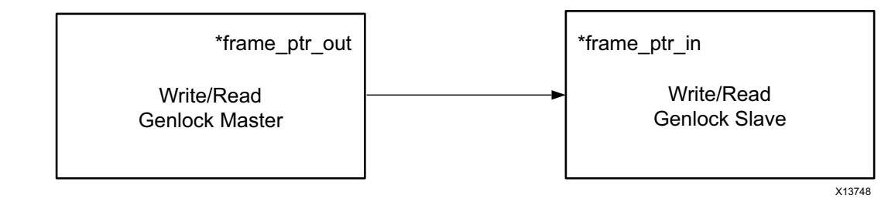

*Figure 2‐21:* **Genlock Master and Genlock Slave Connection**

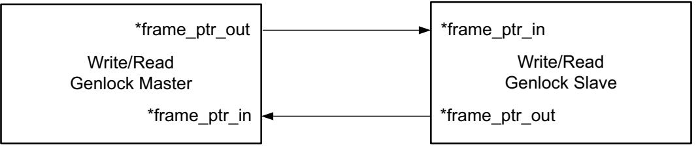

X13753


<span id="page-38-1"/>X-Ref Target - Figure 2-22


### **Genlock Master**

**Read (MM2S) channel**: When configured as Genlock Master, the channel does not skip or repeat the frames. It outputs the current frame number on mm2s_frame_ptr_out. It does not monitor the frame pointer values on mm2s_frame_ptr_in. Genlock Slave should follow the Genlock Master with a predetermined frame delay value set in its *frmdly_stride[28:24].

**Write (S2MM) channel**: When configured as Genlock Master, the channel does not skip or repeat the frames. It outputs the current frame number on s2mm_frame_ptr_out. It does not monitor the frame pointer values on s2mm_frame_ptr_in. Genlock Slave should follow the Genlock Master with a predetermined frame delay value set in its *frmdly_stride[28:24].

### **Genlock Slave**

**Read (MM2S) channel**: When configured as Genlock Slave, the channel tries to catch up with the Genlock Master either by skipping or repeating frames. It samples the Genlock Master frame number on mm2s_frame_ptr_in and operates with a predetermined frame delay value set in its mm2s_frmdly_stride[28:24]. It outputs its current frame number on mm2s_frame_ptr_out for status purpose.

To set up the channel in Genlock Slave mode, the following settings should be used:

- Set GenlockEn (MM2S_VDMACR[3]=1) to enable Genlock synchronization between master and slave.
- Set GenlockSrc (MM2S_VDMACR[7]=1) to enable Internal Genlock mode. This bit is set to 1 by default if both channels are enabled in the Vivado IDE. When it is set to 1, you do not need to connect *_frame_ptr_out and *_frame_ptr_in signals externally. They are routed internally in the core.
- Set appropriate value in mm2s_frmdly_stride[28:24] based on master and slave frame rates.

**Write (S2MM) channel**: When configured as Genlock Slave, the channel tries to catch up with the Genlock Master either by skipping or repeating frames. It samples the Genlock Master frame number on s2mm_frame_ptr_in and operates with a predetermined frame delay value set in its s2mm_frmdly_stride[28:24]. It outputs its current frame number on s2mm_frame_ptr_out for status purpose.


To set up the channel in Genlock Slave mode, the following settings should be used:

- Set GenlockEn (S2MM_VDMACR[3]=1) to enable Genlock synchronization between master and slave.
- Set GenlockSrc (S2MM_VDMACR[7]=1) to enable Internal Genlock mode. This bit is set to 1 by default if both channels are enabled in the Vivado IDE. When it is set to 1, you do not need to connect *_frame_ptr_out and *_frame_ptr_in signals externally. They are routed internally in the core.
- Set appropriate value in s2mm_frmdly_stride[28:24] based on master and slave frame rates.

### **Dynamic Genlock Master**

**Read (MM2S) channel**: When configured as Dynamic Genlock Master, the channel skips the frame buffers that Dynamic Genlock Slave is operating on. It is done by either skipping or repeating frames. It samples the Dynamic Genlock Slave frame number on mm2s_frame_ptr_in. It outputs the previously accessed frame number on mm2s_frame_ptr_out.

To set up the channel in Dynamic Genlock Master mode, the following settings should be used:

- Set GenlockEn (MM2S_VDMACR[3]=1) to enable Genlock synchronization between master and slave.
- Set GenlockSrc (MM2S_VDMACR[7]=1) to enable Internal Genlock mode. This bit is set to 1 by default if both channels are enabled in the Vivado IDE. When it is set to 1, you do not need to connect *_frame_ptr_out and *_frame_ptr_in signals externally. They are routed internally in the core.

**Example**: In case of three frame stores, the Dynamic Genlock Master will rotate around 0,1,2,0,1,2 and so on as long as it is not stepping on the Slave buffer. If it does detect that it is stepping on the Slave buffer, it skips that buffer and keeps on rotating. Thus if the Slave buffer is 1 for a long time, the Master rotates between 0,2,0,2 and so on.

**Write (S2MM) channel**: When configured as Dynamic Genlock Master, the channel skips the frame buffers that Dynamic Genlock Slave is operating on. It is done by either skipping or repeating frames. It samples the Dynamic Genlock Slave frame number on s2mm_frame_ptr_in. It outputs the previously accessed frame number on s2mm_frame_ptr_out.


To set up the channel in Dynamic Genlock Master mode, the following settings should be used:

- Set GenlockEn (S2MM_VDMACR[3]=1) to enable Genlock synchronization between master and slave.
- Set GenlockSrc (S2MM_VDMACR[7]=1) to enable Internal Genlock mode. This bit is set to 1 by default if both channels are enabled in the Vivado IDE. When it is set to 1, you do not need to connect *_frame_ptr_out and *_frame_ptr_in signals externally. They are routed internally in the core.

### **Dynamic Genlock Slave**

**Read (MM2S) channel**: When configured as the Dynamic Genlock Slave, the channel accesses the previous frame that the Dynamic Genlock Master operated on. It samples the Dynamic Genlock Master frame number on mm2s_frame_ptr_in. It outputs the current accessed frame number on mm2s_frame_ptr_out.

To set up the channel in Dynamic Genlock Slave mode, the following settings should be used:

- Set GenlockEn (MM2S_VDMACR[3]=1) to enable Genlock synchronization between master and slave.
- Set GenlockSrc (MM2S_VDMACR[7]=1) to enable Internal Genlock mode. This bit is set to 1 by default if both channels are enabled in the Vivado IDE. When it is set to 1, you do not need to connect *_frame_ptr_out and *_frame_ptr_in signals externally. They are routed internally in the core.

**Write (S2MM) channel**: When configured as a Dynamic Genlock Slave, the channel accesses the previous frame that the Dynamic Genlock Master operated on. It samples the Dynamic Genlock Master frame number on s2mm_frame_ptr_in. It outputs the current accessed frame number on s2mm_frame_ptr_out.

To set up the AXI VDMA in Dynamic Genlock Slave mode, the following settings should be used:

- Set GenlockEn (S2MM_VDMACR[3]=1) to enable Genlock synchronization between master and slave.
- Set GenlockSrc (S2MM_VDMACR[7]=1) to enable Internal Genlock mode. This bit is set to 1 by default if both channels are enabled in the Vivado IDE. When it is set to 1, you do not need to connect *_frame_ptr_out and *_frame_ptr_in signals externally. They are routed internally in the core.

[Figure](#page-42-0) [2-23](#page-42-0) illustrates the simple timing of the Genlock operation. In this example, Write(S2MM) channel has been configured as the Genlock Master and Read(MM2S) channel has been configured as the Genlock Slave and Write channel frame rate is faster than that of Read channel.


As seen in [Figure](#page-42-0) [2-23](#page-42-0), in the time the Write channel cycles through frame 0, 1, 2 and back to 0, the Read channel has only cycled through two frame.

Due to the slow frame rate of the Read channel compared to the Write channel, the Read channel processes frame 2 then frame 0 then frame 2 again, skipping frame 1.

<span id="page-42-0"/>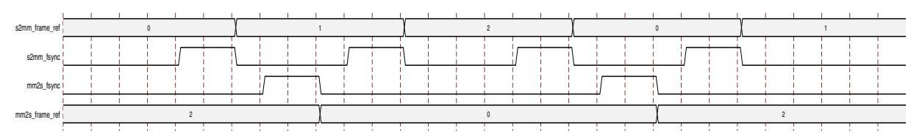

*Figure 2‐23:* **Example Genlock Timing**

The Genlock Master uses the index of the Start Address register to specify which Start Address register the Genlock Slave should use. This Start Address register index is encoded as a Gray code value and appears on mm2s_frame_ptr_out and s2mm_frame_ptr_out for the MM2S and S2MM channels respectively.

[Figure](#page-42-1) [2-24](#page-42-1) illustrates the simple timing of the Dynamic Genlock operation. In this example, the Write (S2MM) channel has been configured as the Dynamic Genlock Master and Read (MM2S) channel has been configured as the Dynamic Genlock Slave and Write channel frame rate is faster than that of Read channel.

In Dynamic Genlock operation

- Master does not step onto the Slave current working frame.
- Slave works on the last completed frame by Master.

In [Figure](#page-42-1) [2-24,](#page-42-1) after cycling through frame 0, 1, 2, the Write channel finds the Read channel on frame 0, and therefore skips this frame and moves to frame 1. The Read channel processes the last completed frame by the Write channel.

<span id="page-42-1"/>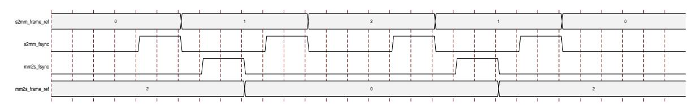

*Figure 2‐24:* **Example Dynamic Genlock Timing**


### **Errors**

Any detected error on the primary datapath (that is, VDMAIntErr, VDMASlvErr, and VDMADecErr) results in the associated channel (MM2S or S2MM) to halt gracefully. To resume operations, a reset must be issued, either soft or hard. A soft reset can be issued to the channel that logged the error. Hard reset will reset the whole VDMA engine. The following sections describe the possible errors and their causes.

### *VDMAIntErr*

This error occurs if the VSIZE and/or HSIZE register for the respective channel = 0 when the VSIZE register was written. This error also occurs when there is a frame size mismatch between the programmed vsize and the received(S2MM path)/transmitted(MM2S path) lines.

### *VDMASlvErr*

VDMA Slave Error occurs when the slave to/from which data are transferred responds with a SLVERR on the memory map interface.

### *VDMADecErr*

A VDMA Decode Error occurs when the address request is targeted to an address that does not exist. As an example, the valid base address offset for DDR might be assigned in IP integrator, generally defaulting to 0x80000000. If START_ADDRESS (1 to n) is set to values outside of the range of addresses for the DDR (or other connected slave), this error will occur because the AXI Interconnect will not be able to decode the address to a valid slave.

### *Line and Frame Errors*

Line and Frame errors are flagged if the line and frame sizes do not match with the configured values in the AXI VDMA. AXI VDMA does not halt when these errors occur. It logs the error in status register and continues processing the frames. [Table](#page-43-0) [2-24](#page-43-0) lists errors in the Read(MM2S) path and [Table](#page-44-0) [2-25](#page-44-0) lists errors in the Write(S2MM) path.

<span id="page-43-0"/>

| Table 2‐24: | Line and Frame Errors in Read Path |  |  |  |  |  |
|-------------|------------------------------------|--|--|--|--|--|
|             |                                    |  |  |  |  |  |

| Cause                                                           | MM2S Errors                            | Operating Mode |                                                                                                                                                  |  |
|-----------------------------------------------------------------|----------------------------------------|----------------|--------------------------------------------------------------------------------------------------------------------------------------------------|--|
|                                                                 | Register setting                       | Free run       | Fsync mode                                                                                                                                       |  |
| VDMA configured<br>for too many lines<br>w.r.t. Streaming Slave | SOFEarlyErr<br>(bit7 of offset 0x04h). | N/A            | Channel does not HALT.<br>Channel goes out-of-sync until<br>next fsync, asserts tvalid Low<br>and does not provide any data<br>until next fsync. |  |


#### <span id="page-44-0"/>*Table 2‐25:* **Line and Frame Errors in Write Path**

| Cause                                                                        | S2MM Errors                             |                                                                                                                                                                                         | Operating Mode                                                                                                                                                                              |
|------------------------------------------------------------------------------|-----------------------------------------|-----------------------------------------------------------------------------------------------------------------------------------------------------------------------------------------|---------------------------------------------------------------------------------------------------------------------------------------------------------------------------------------------|
|                                                                              | Register setting                        | Free run                                                                                                                                                                                | Fsync mode                                                                                                                                                                                  |
| VDMA configured<br>for too many lines<br>w.r.t. Streaming<br>Master          | SOFEarlyErr (bit 7 of offset<br>0x34h). | In free run mode, the<br>channel ignores external<br>frame syncs<br>(s2mm_fsync/s2mm_tuser);<br>therefore this error is not<br>possible. Channel waits<br>infinitely for pending lines. | Channel does not HALT. Channel<br>goes out-of-sync until next<br>fsync, asserts tready High but<br>does not transfer data till next<br>fsync.                                               |
| VDMA configured<br>for too few lines w.r.t.<br>Streaming Master              | SOFLateErr (bit 11 of<br>offset 0x34h). | In free run mode, after<br>receiving programmed<br>VSIZE number of lines, the<br>channel starts writing to<br>the next frame buffer;<br>therefore this error is not<br>possible.        | After receiving the VSIZE<br>number of video lines, the<br>channel continues to assert<br>tready High. If Streaming Master<br>drives more data, it is dropped<br>and this error bit is set. |
| VDMA configured<br>for too many bytes<br>per line w.r.t.<br>Streaming Master | EOLEarlyErr (bit 8 of offset<br>0x34h). | Channel does not HALT.                                                                                                                                                                  | Channel does not HALT.                                                                                                                                                                      |
| VDMA configured<br>for too few bytes per<br>line w.r.t. Streaming<br>Master  | EOLLateErr (bit 15 of<br>offset 0x34h). | Channel does not HALT.<br>Extra bytes received in the<br>line are dropped.                                                                                                              | Channel does not HALT.<br>Extra bytes received in the line<br>are dropped.                                                                                                                  |

*Chapter 3*


# <span id="page-45-0"/>Designing with the Core

## <span id="page-45-1"/>**General Design Guidelines**

AXI VDMA is compliant to AXI4 on both the memory and streaming side. Any AXI compliant IP can be connected to the core.

Generate the core using the Vivado® Design Suite. See [Chapter](#page-49-2) [4, Customizing and](#page-49-2)  [Generating the Core.](#page-49-2)

The core is delivered through the Vivado Design Suite with an HDL example design built around the core, allowing the functionality of the core to be demonstrated using either a simulation package or in hardware, if placed on a suitable board. For details about the Vivado Design Suite example design, see [Chapter](#page-66-1) [5, Example Design.](#page-66-1)

Also see *Designing High-Performance Video Systems in 7 Series FPGAs with the AXI Interconnect* (XAPP741) [\[Ref](#page-85-3) [3\](#page-85-3) *AXI VDMA Reference Design* (XAPP742) [\[Ref](#page-85-4) [4\](#page-85-4) *AXI Multi-Ported Memory Controller* (XAPP739) [\[Ref](#page-85-5) [9\](#page-85-5), and *Designing High-Performance Video Systems with the AXI Interconnect* (XAPP740) [\[Ref](#page-85-6) [10\](#page-85-6) for various system configuration using AXI VDMA.


## <span id="page-46-0"/>**Clocking**

AXI VDMA provides two clocking modes of operation: asynchronous and synchronous. In async mode VDMA control, MM2S and S2MM Primary datapaths can all run asynchronously from each other. Checking **Enable Asynchronous Mode** in the Vivado IDE enables this mode and creates five clock domains.

- AXI4-Lite clock domain clocked by s_axi_lite_aclk
- mm2s clock domain on the memory map side clocked by m_axi_mm2s_aclk
- s2mm clock domain on the memory map side clocked by m_axi_s2mm_aclk
- s2mm clock domain on the streaming side clocked by s_axis_s2mm_aclk
- mm2s clock domain on the streaming side clocked by m_axis_mm2s_aclk

In asynchronous mode, s_axi_lite_aclk clock must have a lower frequency than both m_axi_mm2s_aclk and m_axi_s2mm_aclk clocks.


**IMPORTANT:** *Make sure the memory map side clock frequency is equal to or greater than the streaming side clock frequency to achieve required performance.*

In synchronous mode, all logic runs in a single clock domain. The signals m_axi_mm2s_aclk, m_axi_s2mm_aclk, m_axis_mm2s_aclk, and s_axis_s2mm_aclk must be tied to the same source otherwise undefined results occur. The s_axi_lite_aclk can be connected to a slower clock.

#### *Frequency*

Changing clock frequencies dynamically is supported on the AXI4-Stream. This allows you to dynamically change the AXI4-Stream clocks (m_axis_mm2s_aclk and s_axis_s2mm_clk). Dynamic frequency changes of m_axi_mm2s_aclk, m_axi_s2mm_aclk and s_axi_lite_aclk are not supported.

#### *Dynamic Resolution*

This feature allows you to dynamically change both the streaming clock and frame format without going through the reset cycle. For example, you will be able to switch between HD1080 to National Television System Committee/Phase Alternating Line (NTSC/PAL) without going through the reset cycle.


[Table](#page-47-1) [3-1](#page-47-1) illustrates signal sets and their corresponding clocks in asynchronous mode.

| Clocks           | Ports                     |  |  |  |
|------------------|---------------------------|--|--|--|
| s_axi_lite_aclk  | All s_axi_lite_* Signals  |  |  |  |
|                  | mm2s_introut              |  |  |  |
|                  | s2mm_introut              |  |  |  |
|                  | axi_resetn                |  |  |  |
| m_axi_mm2s_aclk  | All m_axi_mm2s_* Signals  |  |  |  |
| m_axi_s2mm_aclk  | All m_axi_s2mm_* Signals  |  |  |  |
| m_axis_mm2s_aclk | All m_axis_mm2s_* Signals |  |  |  |
|                  | mm2s_fsync                |  |  |  |
|                  | mm2s_frame_ptr_in         |  |  |  |
|                  | mm2s_frame_ptr_out        |  |  |  |
| s_axis_s2mm_aclk | All s_axis_s2mm_* Signals |  |  |  |
|                  | s2mm_prmtr_update         |  |  |  |
|                  | s2mm_frame_ptr_in         |  |  |  |
|                  | s2mm_frame_ptr_out        |  |  |  |

<span id="page-47-1"/>*Table 3‐1:* **Asynchronous Mode Clock Distribution** 

## <span id="page-47-0"/>**Resets**

The AXI VDMA uses an active-Low reset input axi_resetn. The reset signal must be synchronous to the s_axi_lite_aclk signal. Each time this reset is asserted, it should be asserted for a minimum of sixteen clock cycles of the slowest clock. All registers are reset to power-on conditions; all queues are flushed; all internal logic is returned to power-on conditions.

AXI VDMA also provides Soft Reset with the VDMA Control Register for each channel. Issuing a Soft Reset by setting the MM2S VDMA Control Register Reset bit to 1 or the S2MM VDMA Control Register Reset bit to 1 causes the respective channel to reset gracefully. All pending transactions on the AXI interface will be completed. Resetting one channel with the VDMA Control Register does *not* reset the other channel.


## <span id="page-48-2"/><span id="page-48-0"/>**Programming Sequence**

AXI VDMA operations begin with the setup of the video parameter and start address registers and the VDMA control registers. The following lists the minimum steps, in order, required to start AXI VDMA operations:

- 1. Write control information to the channel VDMACR register (Offset 0x00 for MM2S and 0x30 for S2MM) to set interrupt enables if desired, and set VDMACR.RS=1 to start the AXI VDMA channel running.
- 2. Write a valid video frame buffer start address to the channel START_ADDRESS register 1 to N where N equals Frame Buffers (Offset 0x5C up to 0x98 for MM2S and 0xAC up to 0xE8 for S2MM). Set the REG_INDEX register if required.

When AXI VDMA is configured for an address space greater than 32, each start address is to be programmed as a combination of two registers where the first register is used to specify LSB 32 bits of address while the next register is used to specify MSB 32 bits.

- 3. Write a valid Frame Delay (valid only for Genlock Slave) and Stride to the channel FRMDLY_STRIDE register (Offset 0x58 for MM2S and 0xA8 for S2MM).
- 4. Write a valid Horizontal Size to the channel HSIZE register (Offset 0x54 for MM2S and 0xA4 for S2MM).
- 5. Write a valid Vertical Size to the channel VSIZE register (Offset 0x50 for MM2S and 0xA0 for S2MM). This starts the channel transferring video data.

You should be able to update video parameter settings at any time while the engine is running by writing new video parameters and a video start address through the AXI4-Lite control interface. The newly written video transfer values take effect on the next frame boundary after you write the vertical size register for the respective channel.

To update video parameters dynamically while AXI VDMA operations are ongoing, a similar process to the start steps is needed.

- 1. Write the Frame Delay, Stride, and Horizontal Size in any order for the associated channel.
- 2. Write the Vertical Size. When VSize is written, the video register values are transferred to an internal register block. On the next frame boundary the VDMA controller for the associated channel starts transfers using the newly updated values.

## <span id="page-48-1"/>**Interrupts**

An interrupt output is provided for each channel (MM2S and S2MM). This output drives High when there is an error if the error interrupt is enabled.


# <span id="page-49-0"/>Design Flow Steps

This chapter describes customizing and generating the core, constraining the core, and the simulation, synthesis and implementation steps that are specific to the AXI VDMA IP core. More detailed information about the standard Vivado® design flows and the IP integrator can be found in the following Vivado Design Suite user guides:

- *Vivado Design Suite User Guide: Designing with IP* (UG896) [\[Ref](#page-85-2) [2\](#page-85-2)
- *Vivado Design Suite User Guide: Getting Started* (UG910) [\[Ref](#page-85-7) [6\](#page-85-7)
- *Vivado Design Suite User Guide: Logic Simulation* (UG900) [\[Ref](#page-85-8) [7\](#page-85-8)
- *Vivado Design Suite User Guide: Designing IP Subsystems using IP Integrator* (UG994) [\[Ref](#page-85-9) [8\](#page-85-9)

## <span id="page-49-2"/><span id="page-49-1"/>**Customizing and Generating the Core**

This section includes information on using Xilinx tools to customize and generate the core using the Vivado IP catalog.

To access the AXI VDMA, do the following:

- 1. Open a project by selecting **File > Open Project** or create a new project by selecting **File > New Project**.
- 2. Open **IP Catalog** and choose **AXI Infrastructure/Video & Image Processing** in the **View by Function** pane.
- 3. Double-click **AXI Video Direct Memory Access** to display the AXI VDMA Vivado Integrated Design Environment (IDE).

For details, see the *Vivado Design Suite User Guide: Designing with IP* (UG896) [\[Ref](#page-85-2) [2\](#page-85-2) and the *Vivado Design Suite User Guide: Getting Started* (UG910) [\[Ref](#page-85-7) [6\](#page-85-7).

*Note:* Figures in this chapter are illustrations of the Vivado IDE. This layout might vary from the current version.


If you are customizing and generating the core in the IP integrator, see the *Vivado Design Suite User Guide: Designing IP Subsystems using IP Integrator* (UG994) [\[Ref](#page-85-9) [8\](#page-85-9) for detailed information. Vivado IDE might auto-compute certain configuration values when validating or generating the design, as noted in this section. You can view the parameter value after successful completion of the validate_bd_design command.

<span id="page-50-0"/>

*Figure 4‐1:* **AXI VDMA Basic Options (Vivado IDE)** 


<span id="page-51-0"/>

*Figure 4‐2:* **IP Integrator – Basic Options** 

### **Basic Options**

The following describes the basic options that affect both channels of the AXI VDMA core.

#### *Address Width (32-64)*

You can specify the Address Space in this field ([Figure](#page-50-0) [4-1)](#page-50-0). Any value between 32 and 64 can be specified.

#### *Frame Buffers*

This option enables selection of the number of frame buffer storage locations to be processed by AXI VDMA. For an address space greater than 32 bits a maximum of 8 frame buffers are allowed.

#### *Enable Write Channel*

Checking this option enables S2MM Channel.


### *Memory Map Data Width*

This option enables selection of the desired AXI4 data width for the S2MM channel. Valid values are 32, 64, 128, 256, 512 and 1,024.


**IMPORTANT:** *When using this IP in IP integrator, this parameter is auto computed and set based on the stream data width. You can override the automatic settings. In that case, you should ensure that the manual set value for this parameter is either equal to or greater than the stream data width.*

#### **Write Burst Size**

This option specifies the maximum size of the burst cycles on the AXI S2MM memory map Write interface. For example, if the burst length is set to 16, the maximum burst on the memory map interface is 16 data beats.

#### **Stream Data Width**

This option enables selection of the AXI4-Stream data width for the S2MM channel. Valid values are multiples of 8 up to 1,024 bits. This value must be less than or equal to the Memory Map Data Width.


**IMPORTANT:** *When using this IP in IP integrator, this parameter is auto computed and set based on the connected master stream data width.*

#### **Line Buffer Depth**

This option enables selection of the line buffer depth for the S2MM channel (line buffer is stream data wide).

#### *Enable Read Channel*

Checking this option enables the MM2S channel.

#### **Memory Map Data Width**

This option enables selection of the desired AXI4 data width for the MM2S channel. Valid values are 32, 64, 128, 256, 512 and 1,024.

#### **Read Burst Size**

This option specifies the maximum size of the burst cycles on the AXI MM2S memory map Read interface. For example, if the burst length is set to 16, the maximum burst on the memory map interface is 16 data beats.


#### **Stream Data Width**

This option enables selection of the AXI4-Stream data width for the MM2S channel. Valid values are multiples of 8 up to 1,024 bits. This value must be less than or equal to the Memory Map Data Width.

#### **Line Buffer Depth**

This option enables selection of the line buffer depth for the MM2S channel (line buffer is stream data wide).

*Figure 4‐3:* **AXI VDMA Advanced Options (Vivado IDE)** 


*Figure 4‐4:* **IP Integrator – Advanced Options**

### **Advanced Options**

The following describes advanced options that affect both channels of the AXI VDMA core.

#### *Enable Asynchronous Mode*

This setting allows m_axi_mm2s_aclk, m_axi_s2mm_aclk, s_axi_lite_aclk, m_axis_mm2s_aclk, and s_axis_s2mm_aclk to be asynchronous from each other. When Asynchronous Clocks are disabled, all clocks must be at the same frequency and from the same source.


**IMPORTANT:** *When using this IP in IP integrator, this parameter is auto computed and set based on the clock ports connection of the core.*

#### *Enable Vertical Flip*

When selected, flip the Image vertically when the S2MM is enabled.


### *Write Channel Options*

It provides advanced options for the S2MM path.

#### **Fsync Options**

This option is used to set various frame synchronization modes of AXI VDMA.

- None
Selecting this option enables AXI VDMA in free run mode. In free run mode, video data are transferred as quickly as possible without waiting for any external trigger.

- s2mm fsync
When selected, the AXI VDMA starts processing each frame on the falling edge of the s2mm_fsync input.

- s2mm tuser
When selected, the AXI VDMA expects the start-of-frame (SOF) over the AXI4-Stream s_axis_s2mm_tuser(0) signal. The SOF pulse is 1 *valid* transfer wide, and must coincide with the first pixel of the frame.

It can be asserted an arbitrary number of s_axis_s2mm_aclk cycles before the first pixel value is presented on s_axis_s2mm_tdata, as long as s_axis_s2mm_tvalid is not asserted.

- Genlock Mode
There are four genlock options:

- Master
When selected, outputs current frame number on the s2mm_frame_ptr_out port.

- Slave
When selected, Slave follows the Master by the frames set in the Frame Delay register either by skipping or repeating frames. The GenlockEn (S2MM_VDMACR[3]=1) register should be set to enable genlock synchronization between the Master and Slave. It outputs the current frame number on the mm2s_frame_ptr_out port.

- Dynamic Master
When selected, AXI VDMA skips the frame buffers that the Dynamic Slave is working on. It outputs the completed frame number on the s2mm_frame_ptr_out port.

GenlockEn (S2MM_VDMACR[3]=1) register should be set to enable genlock synchronization between Dynamic Master and Dynamic Slave.


#### • Dynamic Slave

When selected, AXI VDMA follows the Dynamic Master either by skipping or repeating frames. It outputs the current frame number on the s2mm_frame_ptr_out port.

GenlockEn (S2MM_VDMACR[3]=1) register should be set to enable genlock synchronization between Dynamic Master and Dynamic Slave.

See [Genlock Synchronization in Chapter](#page-37-1) [2](#page-37-1) for more details.

#### **Allow Unaligned Transfers**

Enables or disables the S2MM Data Realignment Engine. When checked, the data realignment engine is enabled and allows data realignment to the byte (8 bits) level on the S2MM Memory Map datapath. When unchecked, the Start Address must be aligned to multiples of the write memory map data width bytes. Also Horizontal Size and Stride must be specified in multiples of write memory map data width bytes. For example, if read memory map data width = 32, data is aligned if the Start Address at word offsets(32-bit offset), that is, 0x0, 0x4, 0x8, 0xC, and so on. Horizontal Size is 0x4, 0x8, 0xC and so on. Stride is 0x4, 0x8, 0xC, and so on.


**IMPORTANT:** *Having an unaligned Start Address, HSize, and/or Stride when Allow Unaligned Transfers is unchecked will result in undefined behavior.*

*Note:* The Data Realignment Engine only supports AXI4-Stream data width settings of 64-bits and less.

#### **Read Channel Options**

It provides advanced options for the MM2S path.

- Fsync Options
This option is used to set various frame synchronization modes of AXI VDMA.

- None
Selecting this option enables AXI VDMA in free run mode. In free run mode, video data are transferred as quickly as possible without waiting for any external trigger.

*Note:* The channel provides a start-of-frame pulse on m_axis_mm2s_tuser(0) and can be used by downstream cores.

- mm2s fsync
When selected the AXI VDMA starts processing each frame on the falling edge of the mm2s_fsync input.


#### **GenLock Mode**

There are four Genlock options:

- Master
When selected, outputs the current frame number on the mm2s_frame_ptr_out port.

- Slave
When selected, Slave follows the Master by the frames set in the Frame Delay register either by skipping or repeating frames. GenlockEn (MM2S_VDMACR[3]=1) register should be set to enable genlock synchronization between Master and Slave. It outputs the current frame number on the s2mm_frame_ptr_out port.

- Dynamic Master
When selected, AXI VDMA skips the frame buffers that the Dynamic Slave is working on. It outputs the completed frame number on the mm2s_frame_ptr_out port.

GenlockEn (MM2S_VDMACR[3]=1) register should be set to enable genlock synchronization between Dynamic Master and Dynamic Slave.

- Dynamic Slave
When selected, AXI VDMA follows the Dynamic Master either by skipping or repeating frames. It outputs the current frame number on the mm2s_frame_ptr_out port.

GenlockEn (MM2S_VDMACR[3]=1) register should be set to enable genlock synchronization between Dynamic Master and Dynamic Slave.

See [Genlock Synchronization in Chapter](#page-37-1) [2](#page-37-1) for more details.

#### **Allow Unaligned Transfers**

Enables or disables the MM2S Data Realignment Engine. When checked, the Data Realignment Engine is enabled and allows data realignment to the byte (8 bits) level on the MM2S Memory Map datapath.

When disabled, the Start Address must be aligned to multiples of the read memory map data width bytes. Also Horizontal Size and Stride must be specified in multiples of read memory map data width bytes. For example, if read memory map data width = 32, data is aligned if the Start Address at word offsets(32-bit offset), that is, 0x0, 0x4, 0x8, 0xC, and so on. Horizontal Size is 0x4, 0x8, 0xC and so on. Stride is 0x4, 0x8, 0xC, and so on.


**IMPORTANT:** *Having an unaligned Start Address, HSize, and/or Stride when Allow Unaligned Transfers is unchecked will result in undefined behavior.*


*Note:* The Data Realignment Engine only supports AXI4-Stream data width settings of 64-bits and less.

### **User Parameters**

[Table](#page-58-0) [4-1](#page-58-0) shows the relationship between the fields in the Vivado IDE and the User Parameters (which can be viewed in the Tcl Console).

| Vivado Parameter          | User Parameter            | Default Value |
|---------------------------|---------------------------|---------------|
| Address Width             | c_addr_width              | 32            |
| Frame Buffers             | c_num_stores              | 3             |
| Enable Write Channel      | c_include_s2mm            | 1             |
| Memory Map Data Width     | c_m_axi_s2mm_data_width   | 64            |
| Write Burst Size          | c_s2mm_max_burst_length   | 8             |
| Stream Data Width         | c_s_axis_s2mm_tdata_width | 32            |
| Line Buffer Depth         | c_s2mm_linebuffer_depth   | 512           |
| Enable Read Channel       | c_include_mm2s            | 1             |
| Memory Map Data Width     | c_m_axi_mm2s_data_width   | 64            |
| Read Burst Size           | c_mm2s_max_burst_length   | 8             |
| Stream Data Width         | c_m_axis_mm2s_tdata_width | 32            |
| Line Buffer Depth         | c_mm2s_linebuffer_depth   | 512           |
| Enable Asynchronous Clock | c_prmry_is_aclk_async     | 1             |
| Fsync Option              | c_use_s2mm_fsync          | 2             |
| GenLock Mode              | c_s2mm_genlock_mode       | 2             |
| Allow Unaligned Transfer  | c_include_s2mm_dre        | 0             |
| Fsync Option              | c_use_mm2s_fsync          | 0             |
| GenLock Mode              | c_mm2s_genlock_mode       | 3             |
| Allow Unaligned Transfer  | c_include_mm2s_dre        | 0             |
| Enable Vertical Flip      | c_enable_vert_flip        | 0             |

<span id="page-58-1"/><span id="page-58-0"/>*Table 4‐1:* **Vivado IDE Parameter to User Parameter Relationship**


### <span id="page-59-0"/>**Additional Design Information**

The following parameters, registers, and ports are hidden as it is not required for most use cases. However, these parameters and associated features can be enabled by entering the following mentioned command in the Tcl Console in the Vivado Integrated Design Environment (IDE).

Any hidden parameter mentioned in [Table](#page-59-1) [4-2](#page-59-1) can be enabled in the Vivado design tools using the following command.

**set_property -dict [list CONFIG.param_name {1}] [get_ips** *axi_vdma_xyz***]**

Where *axi_vdma_xyz* is the component name in the Vivado design tools.

To enable all debug options and ports, use the following command.

```
set_property -dict [list CONFIG.c_enable_all {1}] [get_ips axi_vdma_xyz]
```
Where *axi_vdma_xyz* is the component name the Vivado design tools.

To enable the any hidden parameter mentioned in [Table](#page-59-1) [4-2](#page-59-1) in the IP integrator, use the following command.

```
set_property -dict [list CONFIG.param_name {1}] [get_bd_cells axi_vdma_xyz]
```
Where *axi_vdma_xyz* is the component name in the IP integrator.

<span id="page-59-2"/>*Note:* You need to regenerate output products for the core after setting the parameter using the Tcl Console command in the Vivado design tools.

|                            | Default           |                                                                                                                                                                                                                                                                                                                 |
|----------------------------|-------------------|-----------------------------------------------------------------------------------------------------------------------------------------------------------------------------------------------------------------------------------------------------------------------------------------------------------------|
| Parameter                  | Value             | Description                                                                                                                                                                                                                                                                                                     |
| C_MM2S_GENLOCK_NUM_MASTERS | 1 (Range 1 to 16) | Specifies the number of Genlock Masters that<br>Genlock Slave can synchronize in the Read channel.<br>MM2S_DMACR[11:8] in Genlock Slave should be<br>programmed to the Genlock Master number to<br>which Genlock Slave should get synchronized to.<br>mm2s_frame_ptr_in<br>([C_MM2S_GENLOCK_NUM_MASTERS*6]–1:0) |
| C_S2MM_GENLOCK_NUM_MASTERS | 1 (Range 1 to 16) | Specifies the number of Genlock Masters that<br>Genlock Slave can synchronize in the Read channel.<br>S2MM_DMACR[11:8] in Genlock Slave should be<br>programmed to the Genlock Master number to<br>which Genlock Slave should get synchronized to<br>s2mm_frame_ptr_in<br>([C_S2MM_GENLOCK_NUM_MASTERS*6]–1:0)  |

#### <span id="page-59-1"/>*Table 4‐2:* **Parameters**


#### *Table 4‐2:* **Parameters** *(Cont'd)*

|                             | Default |                                                                                                                                                                                                                                                                                                                                                                                                                                                           |
|-----------------------------|---------|-----------------------------------------------------------------------------------------------------------------------------------------------------------------------------------------------------------------------------------------------------------------------------------------------------------------------------------------------------------------------------------------------------------------------------------------------------------|
| Parameter                   | Value   | Description                                                                                                                                                                                                                                                                                                                                                                                                                                               |
|                             |         | 1 – Allows programming of Frame Counter<br>(S2MM_VDMACR[23:16]), Frame Count Interrupt<br>Enable (S2MM_VDMACR[12]), and Frame Count<br>Enable(S2MM_VDMACR[4]).                                                                                                                                                                                                                                                                                            |
| C_ENABLE_S2MM_FRM_COUNTER   | 1       | Channel counts incoming frames and reports the<br>frame counter status in S2MM_VDMASR[23:16].<br>Interrupt can be enabled by setting<br>S2MM_VDMACR[12].                                                                                                                                                                                                                                                                                                  |
|                             |         | If S2MM_VDMACR[4] is also set, the channel halts<br>after transferring the S2MM_VDMACR[23:16]<br>number of frames.                                                                                                                                                                                                                                                                                                                                        |
| C_ENABLE_S2MM_DELAY_COUNTER | 1       | 1 – Allows programming of Delay Counter<br>(S2MM_VDMACR[31:24]) and Delay Count<br>Interrupt Enable (S2MM_VDMACR[13]). When<br>S2MM_VDMACR[13] is set to 1, the AXI VDMA<br>timer starts incrementing after receiving fsync and<br>compares it with values programmed in<br>S2MM_VDMACR[31:24] and generates an interrupt<br>when it matches. Timer resets with the subsequent<br>start of packet. The Timer status is reported in<br>S2MM_VDMASR[31:24]. |
| C_ENABLE_S2MM_FRMSTR_REG    | 0       | 1 – Enables S2MM_FRMSTORE (0x48) register. This<br>allows the frame buffers numbers to be modified<br>for the write channel.                                                                                                                                                                                                                                                                                                                              |
| C_ENABLE_S2MM_STS_REG       | 0       | 1 – Enables FRMPTR_STS (24h),<br>S2MM_VSIZE_STATUS (F0h), and<br>S2MM_HSIZE_STATUS (F4h). These registers can be<br>used for debugging purposes.                                                                                                                                                                                                                                                                                                          |
| C_ENABLE_S2MM_FSYNC_OUT     | 0       | 1 – Enables the s2mm_fsync_out output port.<br>This signal asserts High for one s_axis_s2mm_aclk<br>cycle with each frame boundary.                                                                                                                                                                                                                                                                                                                       |
| C_ENABLE_S2MM_PARAM_UPDT    | 0       | 1 – Enables the s2mm_prmtr_update output port.<br>This signal indicates that new programmed video<br>parameters (start address, stride, hsize, vsize) take<br>effect on next frame. This signal is asserted for one<br>s_axis_s2mm_aclk cycle coincident with<br>s2mm_fsync_out.                                                                                                                                                                          |
| C_ENABLE_S2MM_BUF_FULL      | 0       | 1 – Enables s2mm_buffer_full,<br>s2mm_buffer_almost_full output ports and enables<br>S2MM_THRESHOLD (0x4C) register.                                                                                                                                                                                                                                                                                                                                      |
| C_ENABLE_S2MM_RST_OUT       | 0       | 1 – Enables s2mm_prmry_reset_out_n output port<br>(Active-Low Primary S2MM Reset Out)                                                                                                                                                                                                                                                                                                                                                                     |


#### *Table 4‐2:* **Parameters** *(Cont'd)*

|                             | Default |                                                                                                                                                                                                                                                                                                                                                                                                                                                   |
|-----------------------------|---------|---------------------------------------------------------------------------------------------------------------------------------------------------------------------------------------------------------------------------------------------------------------------------------------------------------------------------------------------------------------------------------------------------------------------------------------------------|
| Parameter                   | Value   | Description                                                                                                                                                                                                                                                                                                                                                                                                                                       |
| C_ENABLE_MM2S_FRM_COUNTER   | 1       | 1 – Allows programming of Frame Counter<br>(MM2S_VDMACR[23:16]), Frame Count Interrupt<br>Enable (MM2S_VDMACR[12]) and Frame Count<br>Enable (MM2S_VDMACR[4]). The channel counts<br>outgoing frames and reports the frame counter<br>status in MM2S_VDMASR[23:16]. Interrupt can be<br>enabled by setting MM2S_VDMACR[12].<br>If MM2S_VDMACR[4] is also set, the channel halts                                                                   |
|                             |         | after transferring MM2S_VDMACR[23:16] number<br>of frames.                                                                                                                                                                                                                                                                                                                                                                                        |
| C_ENABLE_MM2S_DELAY_COUNTER | 1       | 1 – Allows programming of Delay Counter<br>(MM2S_VDMACR[31:24]) and Delay Count<br>Interrupt Enable (MM2S_VDMACR[13]). When<br>MM2S_VDMACR[13] is set to 1, the AXI VDMA<br>timer starts incrementing after receiving fsync and<br>compares it with values programmed in<br>MM2S_VDMACR[31:24] and generates an interrupt<br>when it matches. Timer resets with subsequent<br>start of packet. Timer status is reported in<br>MM2S_VDMASR[31:24]. |
| C_ENABLE_MM2S_FRMSTR_REG    | 0       | 1 – Enables MM2S_FRMSTORE (0x18) register. This<br>allows frame buffers numbers to be modified for<br>read channel.                                                                                                                                                                                                                                                                                                                               |
| C_ENABLE_TSTVEC             | 0       | 1 – Enables axi_vdma_tstvec(63:0) output debug<br>port. This is reserved for Xilinx internal debug<br>purposes.                                                                                                                                                                                                                                                                                                                                   |
| c_enable_mm2s_fsync_out     | 0       | 1 – Enables mm2s_fsync_out output port. This<br>signal asserts High for one m_axis_mm2s_aclk cycle<br>with each frame boundary.                                                                                                                                                                                                                                                                                                                   |
| C_ENABLE_MM2S_PARAM_UPDT    | 0       | 1 – Enables mm2s_prmtr_update output port. This<br>signal indicates that new programmed video<br>parameters (start address, stride, hsize, vsize) take<br>effect on the next frame. This signal is asserted for<br>one m_axis_mm2s_aclk cycle coincident with<br>mm2s_fsync_out.                                                                                                                                                                  |
| C_ENABLE_MM2S_BUF_EMPTY     | 0       | 1 – Enables mm2s_buffer_empty,<br>mm2s_buffer_almost_empty output ports and<br>enables the MM2S_Threshold (0x1C) register.                                                                                                                                                                                                                                                                                                                        |
| C_ENABLE_MM2S_RST_OUT       | 0       | 1 – Enables mm2s_prmry_reset_out_n output port<br>(Active-Low Primary MM2S Reset Out).                                                                                                                                                                                                                                                                                                                                                            |
| C_ENABLE_ALL                | 0       | 1 – Enables all the debug options mentioned in this<br>table.                                                                                                                                                                                                                                                                                                                                                                                     |


### *FRMPTR_STS (MM2S and S2MM Current Frame Pointer Status – Offset 24h)*

This register provides the current operating frame pointer status of both MM2S and S2MM channels. This helps in tracking frame pointers when they are operating in different Genlock modes.

| Bits         | Field Name    | Default Value | Access Type | Description                                                                                           |
|--------------|---------------|---------------|-------------|-------------------------------------------------------------------------------------------------------|
| 31 downto 29 | Reserved      | 0             | RO          | Writing to these bits has no effect, and they<br>are always read as zeros.                            |
|              | S2MMFrmPtrIn  | 0             | RO          | S2MM Frame Pointer Input                                                                              |
|              |               |               |             | • Reserved if S2MM channel is Genlock<br>Master                                                       |
|              |               |               |             | • Indicates Genlock Master frame pointer<br>value if S2MM channel is Genlock Slave                    |
| 28 downto 24 |               |               |             | • Indicates Dynamic Genlock Slave frame<br>pointer value if S2MM channel is<br>Dynamic Genlock Master |
|              |               |               |             | • Indicates Dynamic Genlock Master frame<br>pointer value if S2MM channel is<br>Dynamic Genlock Slave |
| 23 downto 21 | Reserved      | 0             | RO          | Writing to these bits has no effect, and they<br>are always read as zeros.                            |
| 20 downto 16 | S2MMFrmPtrOut | 0             | RO          | Indicates current working frame of S2MM<br>channel.                                                   |
| 15 downto 13 | Reserved      | 0             | RO          | Writing to these bits has no effect, and they<br>are always read as zeros.                            |
| 12 downto 8  | MM2SFrmPtrIn  | 0             | RO          | MM2S Frame Pointer Input                                                                              |
|              |               |               |             | • Reserved if MM2S channel is Genlock<br>Master                                                       |
|              |               |               |             | • Indicates Genlock Master frame pointer<br>value if MM2S channel is Genlock Slave                    |
|              |               |               |             | • Indicates Dynamic Genlock Slave frame<br>pointer value if MM2S channel is<br>Dynamic Genlock Master |
|              |               |               |             | • Indicates Dynamic Genlock Master frame<br>pointer value if MM2S channel is<br>Dynamic Genlock Slave |
| 7 downto 5   | Reserved      | 0             | RO          | Writing to these bits has no effect, and they<br>are always read as zeros.                            |
| 4 downto 0   | MM2SFrmPtrOut | 0             | RO          | Indicates current working frame of MM2S<br>channel.                                                   |

#### *Table 4‐3:* **FRMPTR_STS Register Details**


### *S2MM HSIZE Status Register S2MM_HSIZE_STATUS (offset 0xF0h)*

This provides hsize count captured when first EOLEarlyErr occurs from the incoming stream of the S2MM channel. This register gets cleared automatically when S2MM_DMASR[8] is cleared.

| Table 4‐4: |  |  |  | S2MM HSIZE Status Register Details |  |
|------------|--|--|--|------------------------------------|--|
|            |  |  |  |                                    |  |

| Bits         | Field Name   | Default<br>Value | Access<br>Type | Description                                                                    |
|--------------|--------------|------------------|----------------|--------------------------------------------------------------------------------|
| 31 downto 16 | Reserved     | 0                | RO             | Writing to these bits has no effect, and they are always<br>read as zeros.     |
| 15 downto 0  | S2MMHsizeSts | 0                | RO             | Indicates HSIZE count captured at first EOLEarlyErr error<br>for S2MM channel. |

### *S2MM VSIZE Status Register S2MM_VSIZE_STATUS (offset 0xF4h)*

This provides vsize count captured when first SOFEarlyErr occurs from the incoming stream of the S2MM channel. This register gets cleared automatically when S2MM_DMASR[7] is cleared.

*Table 4‐5:* **S2MM VSIZE Status Register Details**

| Bits         | Field Name   | Default<br>Value | Access<br>Type | Description                                                                    |
|--------------|--------------|------------------|----------------|--------------------------------------------------------------------------------|
| 31 downto 13 | Reserved     | 0                | RO             | Writing to these bits has no effect, and they are always<br>read as zeros.     |
| 12 downto 0  | S2MMVsizeSts | 0                | RO             | Indicates VSIZE count captured at first SOFEarlyErr error<br>for S2MM channel. |

### **Output Generation**

For details, see the *Vivado Design Suite User Guide: Designing with IP* (UG896) [\[Ref](#page-85-2) [2\](#page-85-2).


## <span id="page-64-0"/>**Constraining the Core**

This section contains information about constraining the core in the Vivado Design Suite.

### **Required Constraints**

This section is not applicable for this IP core.

### **Device, Package, and Speed Grade Selections**

This section is not applicable for this IP core.

## **Clock Frequencies**

In synchronous mode, all clocks run at the same frequency and are derived from the same source. There are no multicycle or false paths in this design.

In asynchronous mode, all clocks are treated asynchronously to each other and the core will write out appropriate clock domain crossing constraints.

[Table](#page-64-1) [4-6](#page-64-1) lists the files delivered for the core constraints.

<span id="page-64-1"/>*Table 4‐6:* **Core Constraints Files**

| Name                                         | Description      |
|----------------------------------------------|------------------|
| <component_name>.xdc</component_name>        | Core constraints |
| <component_name>_clocks.xdc</component_name> | Core constraints |

The core also delivers constraints for out-of-context (OOC) mode.

[Table](#page-64-2) [4-7](#page-64-2) lists the OOC constraint file for the core.

<span id="page-64-2"/>*Table 4‐7:* **OOC Constraints File**

| Name                                      | Description                           |  |  |
|-------------------------------------------|---------------------------------------|--|--|
| <component_name>_ooc.xdc</component_name> | Out-of-context (OOC) mode constraints |  |  |

### **Clock Management**

This section is not applicable for this IP core.

## **Clock Placement**

This section is not applicable for this IP core.


### **Banking**

This section is not applicable for this IP core.

### **Transceiver Placement**

This section is not applicable for this IP core.

### **I/O Standard and Placement**

This section is not applicable for this IP core.

## <span id="page-65-0"/>**Simulation**

For comprehensive information about Vivado simulation components, as well as information about using supported third-party tools, see the *Vivado Design Suite User Guide: Logic Simulation* (UG900) [\[Ref](#page-85-8) [7\](#page-85-8)


**IMPORTANT:** *For cores targeting 7 series or Zynq®-7000 devices, UNIFAST libraries are not supported. Xilinx IP is tested and qualified with UNISIM libraries only.*

## <span id="page-65-1"/>**Synthesis and Implementation**

For details about synthesis and implementation, see the *Vivado Design Suite User Guide: Designing with IP* (UG896) [\[Ref](#page-85-2) [2\](#page-85-2)


# <span id="page-66-1"/><span id="page-66-0"/>Example Design

This chapter contains information about the provided example design in the Vivado® Design Suite. One of the most common use cases, the triple frame buffer, is discussed as an example in detail.

For detailed information about available example designs for the VDMA core, see *AXI Multi-Ported Memory Controller* (XAPP739) [\[Ref](#page-85-5) [9\](#page-85-5), *Designing High-Performance Video Systems with the AXI Interconnect* (XAPP740) [\[Ref](#page-85-6) [10\](#page-85-6), *Designing High-Performance Video Systems in 7 Series FPGAs with the AXI Interconnect* (XAPP741) [\[Ref](#page-85-3) [3\](#page-85-3), *AXI VDMA Reference Design* (XAPP742) [\[Ref](#page-85-4) [4\](#page-85-4), and *AXI VDMA Reference Design for the Kintex KC705 Evaluation Board* (XAPP1218) [\[Ref](#page-85-10) [5\](#page-85-10).

The top module instantiates all components of the core and the example designs that are needed to implement the design in hardware, as shown in [Figure](#page-67-0) [5-1](#page-67-0). This includes the clock generator (MMCM), register configuration, data generator, and data checker modules.


<span id="page-67-0"/>X-Ref Target - Figure 5-1


*Figure 5‐1:* **Block Diagram of Example Design**

This example design demonstrates transactions on the AXI4-Lite, AXI4, and AXI4-Stream interfaces of the device under test (DUT).

**Clock generator**: The mixed-mode clock manager (MMCM) is used to generate the clocks for the example design. When the DUT is in synchronous mode, MMCM generates a 50 MHz clock for all the AXI interfaces in the example design. When the DUT is in asynchronous mode, the MMCM generates a 50 MHz clock for the AXI4-Lite interface and a 75 MHz clock for the AXI4 and AXI4-Stream interfaces. The DUT and other modules of the example design are kept under reset until the MMCM is locked.

**Register configuration**: The AXI Traffic Generator core is used to configure the DUT registers in sequence as mentioned in [Programming Sequence in Chapter](#page-48-2) [3](#page-48-2). For the Read channel, the run/stop and circular_park bits are enabled in the DMACR register. The HSIZE register is configured as (MMAP_DATA_WIDTH/8)*32 bytes. The VSIZE register is configured as 1.

For the Write channel, the run/stop and circular_park bits are enabled in the DMACR register. The HSIZE register is configured as (STRM_DATA_WIDTH/8)*256 bytes. The VSIZE register is configured as 1.

**Read path generator:** This uses an AXI block RAM which is filled (with a fixed amount of transfers) after MMCM is locked. The MM2S channel reads this AXI block RAM and transfers data to the AXI4-Stream interface.


**Read path checker**: This module checks that the data is transferred on the AXI4-Stream interface.

**Write path generator**: When the Write (S2MM) channel is configured, this module drives the transactions (with a fixed amount of transfers) on the AXI4-Stream interface.

**Write path checker:** This module checks that the data is transferred on the AXI4-Stream interface. Data received on the AXI4 interface is also written into an AXI block RAM.

## <span id="page-68-0"/>**Implementing the Example Design**

After following the steps described in [Chapter](#page-49-2) [4, Customizing and Generating the Core,](#page-49-2) implement the example design as follows:

- 1. Right-click the core in the Hierarchy window, and select **Open IP Example Design**.
- 2. A new window pops up, asking you to specify a directory for the example design. Select a new directory, or keep the default directory.

A new project is automatically created in the selected directory and it is opened in a new Vivado IDE window.

- 3. In the Flow Navigator (left-side pane), click **Run Implementation** and follow the directions.
The following tables describe the example files.

[Table](#page-68-1) [5-1](#page-68-1) lists the HDL files delivered with the example design.

| Name                                        | Description                                          |  |  |  |  |  |  |
|---------------------------------------------|------------------------------------------------------|--|--|--|--|--|--|
| axi_vdma_example_top.xdc                    | Top-level constraints file for the example design.   |  |  |  |  |  |  |
| <component_name>_exdes.vhd</component_name> | Top-level HDL file for the example design.           |  |  |  |  |  |  |
| clock_gen.vhd                               | Clock generation module for example design.          |  |  |  |  |  |  |
| fsync_gen_logic.vhd                         | Frame sync generation module for example design.     |  |  |  |  |  |  |
| axi4_write_master.vhd                       | Read path data generator module for example design.  |  |  |  |  |  |  |
| axis_data_read.vhd                          | Read path data checker module for example design.    |  |  |  |  |  |  |
| axis_write_master.vhd                       | Write path data generator module for example design. |  |  |  |  |  |  |
| axi_s2mm_read.vhd                           | Write path data checker module for example design.   |  |  |  |  |  |  |

<span id="page-68-1"/>


[Table](#page-69-1) [5-2](#page-69-1) lists the example demonstration test bench file delivered with the example design.

<span id="page-69-1"/>

| Table 5‐2: | Example Demonstration Test Bench File |  |
|------------|---------------------------------------|--|
|            |                                       |  |

| Name                                           | Description                       |  |  |  |  |  |  |
|------------------------------------------------|-----------------------------------|--|--|--|--|--|--|
| <component_name>_exdes_tb.vhd</component_name> | Test bench for the example design |  |  |  |  |  |  |

[Table](#page-69-2) [5-3](#page-69-2) lists the example design constraint file delivered with the example design.

<span id="page-69-2"/>*Table 5‐3:* **Example Design Constraints File**

| Name                                        | Description                                        |  |  |  |  |  |  |
|---------------------------------------------|----------------------------------------------------|--|--|--|--|--|--|
| <component_name>_exdes.xdc</component_name> | Top level constraints file for the example design. |  |  |  |  |  |  |

The XDC delivered with the example design is configured for the KC705 board. The I/O constraints are commented by default. Uncomment them before implementing the example design on the KC705 board.

## <span id="page-69-0"/>**Test Bench for the Example Design**

This section contains information about the provided test bench in the Vivado Design Suite.

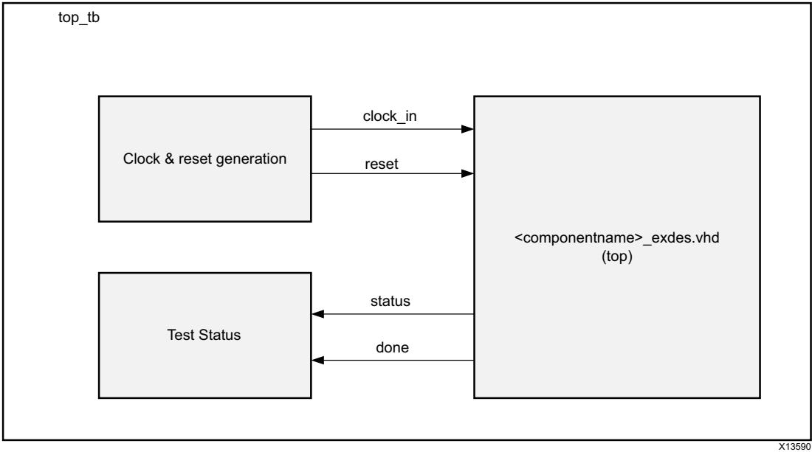

*Figure 5‐2:* **AXI VDMA Example Design Test Bench**

<span id="page-69-3"/>X-Ref Target - Figure 5-2


[Figure](#page-69-3) [5-2](#page-69-3) shows the test bench for the AXI VDMA example design. The top-level test bench generates a 200 MHz clock and drives an initial reset to the example design. The test completes when both status and done bits are driven High.

## <span id="page-70-0"/>**Simulating the Example Design**

Using the AXI VDMA example design (delivered as part of the AXI VDMA), you can quickly simulate and observe the behavior of the AXI VDMA.

### **Setting up the Simulation**

The Xilinx simulation libraries must be mapped into the simulator. If the libraries are not set in the environment, see the *Synthesis and Simulation Design Guide* (UG626) [\[Ref](#page-85-11) [11\](#page-85-11) for assistance compiling Xilinx simulation models and setting up the simulator environment. To switch simulators, click **Simulation Settings** in the Flow Navigator (left pane). In the **Simulation** options list, change **Target Simulator**.

This section contains instructions for running a functional simulation of the AXI VDMA example design. The example design supports functional (behavioral) and post-synthesis simulations.

- 1. To run a functional simulation, click **Run Simulation** in the Flow Navigator (left pane) and then click **Run Behavioral Simulation**. See Master AR [56989.](https://www.xilinx.com/support/answers/56989.htm)
- 2. To run a post-synthesis simulation, click **Run Simulation** in the Flow Navigator (left pane) and then click **Run Post-Synthesis Functional Simulation**.

### **Simulation Results**

The simulation script compiles the AXI VDMA example design and supporting simulation files. It then runs the simulation and checks to ensure that it completed successfully.

If the test fails, the following message displays: Test Failed!!!

If the test passes, the following message displays: Test Completed Successfully

If the test hangs, the following message displays: Test Failed!! Test Timed Out

## *Chapter 6*


# <span id="page-71-1"/><span id="page-71-0"/>General Use Cases

Triple buffers or skip/repeat frame synchronizers are a common use for the AXI VDMA. Triple buffers can be used to pass image frames between two distinct clock domains without shear. Shear occurs when a frame is read from memory but that frame is made up of two different write frames. When the read and write clocks are asynchronous, the read and write memory pointers will cross each other at some point in time resulting in shear. To avoid shear, read and write pointers are not allowed to cross each other which results in frames being repeated or skipped.

The AXI VDMA Vivado® Integrated Design Environment (IDE) parameters are configured for Triple Buffer Mode by default. You can generate the core by clicking **OK** in the Vivado IDE if the Write and Read channel data widths, Burst size, and Line buffer depth changes are not required.

- 1. Configure the Write channel registers as follows.
	- a. Set S2MM_VDMACR (30h) to 8Bh. This enables run/stop, Circular_Park, GenlockEn, and GenlockSrc. In this case, external connections of frame pointers are not required. If Repeat Enable and Interrupt on error is required, set bit 15 and bit 14 of this register.
	- b. Set S2MM_Start_Address 1 (ACh) through S2MM_Start_Address 3 (B4h) to their required locations. These locations can be static (based on maximum frame size) or dynamic (based on actual frame size).
	- c. Set S2MM_FRMDLY_STRIDE (A8h) to the appropriate value. FRMDLY is not applicable for the Dynamic Genlock Master. STRIDE is the number of bytes per line.
	- d. Set S2MM_HSIZE (A4h) to the number of bytes per line.
	- e. Set S2MM_VSIZE (A0h) to the number of lines per frame. VSIZE must be set last and starts the S2MM VDMA transactions.
- 2. Configure the Read channel registers as follows.
	- a. Set MM2S_VDMACR (00h) to 8Bh. This enables run/stop, Circular_Park, GenlockEn, and GenlockSrc. In this case, external connections of frame pointers are not required. If Interrupt on error is required, then set bit 14 of this register.
	- b. Set MM2S_Start_Address1 (5Ch) through MM2S_Start_Address 3 (64h) to their required locations. These locations should match their S2MM_Start_Address counterparts.


- c. Set MM2S_FRMDLY_STRIDE (58h) to the appropriate value. FRMDLY is not applicable for the Dynamic Genlock Slave. STRIDE is the number of bytes per line.
- d. Set MM2S_HSIZE (54h) to the number of bytes per line.
- e. Set MM2S_VSIZE (50h) to the number of lines per frame. VSIZE must be set last and starts the MM2S VDMA transactions.

When changing frame sizes, the incoming frame size might not match the S2MM HSIZE and VSIZE registers and an error is noted on S2MM VDMASR register VDMAIntErr. The preceding example enables S2MM Frame Repeat on Error and the next frame is written to the same frame store location invalidating the bad frame. If the start addresses are based on maximum frame sizes, no changes are necessary to their registers. However, the S2MM HSIZE and VSIZE registers must be updated with the new frame size. VSIZE should be written last. After a full frame is written into memory, the MM2S HSIZE and VSIZE registers can be updated and are used with the new frame after Frame Sync occurs.


# <span id="page-73-0"/>Updating

This appendix contains information about migrating a design from ISE® to the Vivado® Design Suite, and for upgrading to a more recent version of the IP core. For customers upgrading in the Vivado Design Suite, important details (where applicable) about any port changes and other impact to user logic are included.

## <span id="page-73-1"/>**Migrating to the Vivado Design Suite**

For information about migrating to the Vivado Design Suite, see the *ISE to Vivado Design Suite Migration Guide* (UG911) [\[Ref](#page-85-12) [12\](#page-85-12).

## <span id="page-73-2"/>**Upgrading in the Vivado Design Suite**

This section provides information about any changes to the user logic, port designations or parameter changes between core versions.

## **Changes from v6.3 (04/05/2017) to v6.3 (10/04/2017)**

- Added Enable Vertical Flip register to [Table](#page-14-3) [2-5.](#page-14-3)
- Added Reserved row in [Table](#page-14-3) [2-5](#page-14-3) for F0h to F4h Address Space Offset.
- Added Enable Vertical Flip user parameter to [Table](#page-58-1) [4-1.](#page-58-1)

### **Changes from v6.2 to v6.3**

The following parameters have been renamed in v6.3. Also see [Table](#page-59-2) [4-2.](#page-59-2)

- C_ENABLE_DEBUG_ALL to C_ENABLE_ALL
- C_ENABLE_DEBUG_INFO_0 to C_ENABLE_MM2S_RST_OUT
- C_ENABLE_DEBUG_INFO_1 to C_ENABLE_MM2S_BUF_EMPTY
- C_ENABLE_DEBUG_INFO_2 to C_ENABLE_MM2S_PARAM_UPDT


- C_ENABLE_DEBUG_INFO_3 to C_ENABLE_MM2S_FSYNC_OUT
- C_ENABLE_DEBUG_INFO_4 to C_ENABLE_TSTVEC
- C_ENABLE_DEBUG_INFO_5 to C_ENABLE_MM2S_FRMSTR_REG
- C_ENABLE_DEBUG_INFO_6 to C_ENABLE_MM2S_DELAY_COUNTER
- C_ENABLE_DEBUG_INFO_7 to C_ENABLE_MM2S_FRM_COUNTER
- C_ENABLE_DEBUG_INFO_8 to C_ENABLE_S2MM_RST_OUT
- C_ENABLE_DEBUG_INFO_9 to C_ENABLE_S2MM_BUF_FULL
- C_ENABLE_DEBUG_INFO_10 to C_ENABLE_S2MM_PARAM_UPDT
- C_ENABLE_DEBUG_INFO_11 to C_ENABLE_S2MM_FSYNC_OUT
- C_ENABLE_DEBUG_INFO_12 to C_ENABLE_S2MM_STS_REG
- C_ENABLE_DEBUG_INFO_13 to C_ENABLE_S2MM_FRMSTR_REG
- C_ENABLE_DEBUG_INFO_14 to C_ENABLE_S2MM_DELAY_COUNTER
- C_ENABLE_DEBUG_INFO_15 to C_ENABLE_S2MM_FRM_COUNTER

*Appendix B*


# <span id="page-75-0"/>Debugging

This appendix includes details about resources available on the Xilinx Support website and debugging tools.

## <span id="page-75-1"/>**Finding Help on Xilinx.com**

To help in the design and debug process when using the AXI VDMA core, the [Xilinx Support](https://www.xilinx.com/support)  [web page](https://www.xilinx.com/support) contains key resources such as product documentation, release notes, answer records, information about known issues, and links for obtaining further product support.

### **Documentation**

This product guide is the main document associated with the AXI VDMA core. This guide, along with documentation related to all products that aid in the design process, can be found on the [Xilinx Support web page](https://www.xilinx.com/support) or by using the Xilinx® Documentation Navigator.

Download the Xilinx® Documentation Navigator from the [Downloads page](https://www.xilinx.com/support/download.html). For more information about this tool and the features available, open the online help after installation.

### **Answer Records**

Answer Records include information about commonly encountered problems, helpful information on how to resolve these problems, and any known issues with a Xilinx product. Answer Records are created and maintained daily ensuring that users have access to the most accurate information available.

Answer Records can also be located by using the Search Support box on the main [Xilinx](https://www.xilinx.com/support)  [support web page.](https://www.xilinx.com/support) To maximize your search results, use proper keywords such as

- Product name
- Tool message(s)
- Summary of the issue encountered

A filter search is available after results are returned to further target the results.


#### **Master Answer Record for the AXI VDMA Core**

AR: [54448](https://www.xilinx.com/support/answers/54448.htm)

### **Technical Support**

Xilinx provides technical support at the [Xilinx Support web page](https://www.xilinx.com/support) for this LogiCORE™ IP product when used as described in the product documentation. Xilinx cannot guarantee timing, functionality, or support if you do any of the following:

- Implement the solution in devices that are not defined in the documentation.
- Customize the solution beyond that allowed in the product documentation.
- Change any section of the design labeled DO NOT MODIFY.

To contact Xilinx Technical Support, navigate to the [Xilinx Support web page.](https://www.xilinx.com/support)

## <span id="page-76-0"/>**Vivado Design Suite Debug Feature**

The Vivado® Design Suite debug feature inserts logic analyzer and virtual I/O cores directly into your design. The debug feature also allows you to set trigger conditions to capture application and integrated block port signals in hardware. Captured signals can then be analyzed. This feature represents the functionality in the Vivado Integrated Design Environment (IDE) that is used for logic debugging and validation of a design running in Xilinx devices in hardware.

The Vivado logic analyzer is used to interact with the logic debug LogiCORE IP cores including:

- ILA 2.0 (and later versions)
- VIO 2.0 (and later versions)

See the *Vivado Design Suite User Guide: Programming and Debugging* (UG908) [\[Ref](#page-85-13) [13\](#page-85-13)


## <span id="page-77-0"/>**Hardware Debug**

Following are common issues that you can encounter:

- 1. AXI VDMA works, but the bottom few lines are not proper.
Answer: Most of these issues are attributed to the wrong hsize and vsize programming in AXI VDMA. Double-check programmed values and check if fsync signals are connected and fsync period is maintained properly.

- 2. AXI VDMA locks up.
Answer: The following registers are implemented to help debug the failures:

Bits 7(SOFEarlyErr), 8(EOLEarlyErr), 11(SOFLateErr) and 15(EOLLateErr) of offset 0x34h to identify error occurrence in S2MM path

- 3. Per VDMA park pointer register read, VDMA channel is not moving to the next frame buffer.
Answer: VDMA park ptr register latches the frame_number value when any (line/frame) error happens. After the error bits are cleared, this register continuously updates the working frame numbers.

- 4. When the VDMA system is re-initialized through software (or after a soft reset), horizontal shift is observed onscreen.
Answer: This could be related to the system reset release sequence and programming issues. You need to make sure all FIFOs in the datapath are flushed and the VDMA trigger (vsize) is programmed at the end of the initialization sequence.

- 5. Channel does not come out from reset.
Answer: Check that all clocks related to the VDMA channel have proper connectivity and are running.

- 6. The AXI VDMA core does not give expected performance.
Answer: Make sure the Memory Map side clock is equal or greater than the Streaming side Clock.

- 7. Core violates AXI4 protocol (example: ARVALID/AWVALID/WVALID toggles without receiving ARREADY/AWREADY/WREADY from interconnect.)
Answer: Ensure that the system clock connectivity is correct for the VDMA and AXI4 interconnect, that is, the VDMA datapath memory map clock and the corresponding AXI4 Interconnect port clock are tied to the same source.


- 8. S2MM channel does not transfer any data on the memory side and after a few stream transactions s_axis_s2mm_tready goes Low.
Answer: Ensure that s_axis_s2mm_tkeep is tied to 1 when the Streaming Master IP does not support it.

- 9. TREADY remains Low.
Answer: This can happen if you are not meeting alignment constraints when **Allow Unaligned Transfers** is disabled while generating the core. In this case, the start address must be aligned to multiples of the memory map data width bytes. HSize and Stride must be specified in multiples of the memory map data width bytes. For example, if memory map data width = 32, data is aligned if the Start Address at word offsets (32-bit offset), that is, 0x0, 0x4, 0x8, 0xC, and so on. Horizontal Size is 0x4, 0x8, 0xC and so on. Stride is 0x4, 0x8, 0xC, and so on.

- 10. When you bring up the core and read the status registers for the first time, you are seeing several errors that do not go away.
Answer: Frame size errors are very common at startup because partial frames can be sent to the VDMA at power-up. The VDMA will not halt in this situation, but errors in the status registers will persist until explicitly cleared (R/WC). Before reading the status register for the first time, clear it by writing 0xffffffff. If the errors persist, refer to the other sections of the documentation to continue debugging specific errors.

- 11. See Appendix C, Additional Design Information to enable vsize and hsize counters for debugging purposes.
## *Appendix C*


# <span id="page-79-0"/>Frame Pointers Gray Code Outputs

[Table](#page-79-1) [C-1,](#page-79-1) [Table](#page-80-0) [C-2,](#page-80-0) and [Table](#page-82-0) [C-3](#page-82-0) list the Gray Codes that are used for each of the 32 possible Frame Store sizes. The Gray Code cycles through all of the codes on the first line first and then cycles through all of the codes on the second line before repeating the first line. Number of Gray codes is double the number of frame buffers to allow for non-power-of-two frame buffer values to be cycled through and still maintain Gray code coherency with minimal FPGA resources required.


**IMPORTANT:** *AXI VDMA does not support intra-frame mode. Genlock synchronization cannot be provided for writing and reading the same frame with a predetermined delay between write and read operations.*

|          | Gray Code    |    |    |    |    |    |    |    |    |   |    |    |    |    |    |    |
|----------|--------------|----|----|----|----|----|----|----|----|---|----|----|----|----|----|----|
|          | Frame Number |    |    |    |    |    |    |    |    |   |    |    |    |    |    |    |
| FRMSTORE | 0            | 1  | 2  | 3  | 4  | 5  | 6  | 7  | 8  | 9 | 10 | 11 | 12 | 13 | 14 | 15 |
| 1        | 0            |    |    |    |    |    |    |    |    |   |    |    |    |    |    |    |
|          | 1            |    |    |    |    |    |    |    |    |   |    |    |    |    |    |    |
| 2        | 0            | 1  |    |    |    |    |    |    |    |   |    |    |    |    |    |    |
|          | 3            | 2  |    |    |    |    |    |    |    |   |    |    |    |    |    |    |
| 3        | 1            | 3  | 2  |    |    |    |    |    |    |   |    |    |    |    |    |    |
|          | 6            | 7  | 5  |    |    |    |    |    |    |   |    |    |    |    |    |    |
| 4        | 0            | 1  | 3  | 2  |    |    |    |    |    |   |    |    |    |    |    |    |
|          | 6            | 7  | 5  | 4  |    |    |    |    |    |   |    |    |    |    |    |    |
| 5        | 2            | 6  | 7  | 5  | 4  |    |    |    |    |   |    |    |    |    |    |    |
|          | 12           | 13 | 15 | 14 | 10 |    |    |    |    |   |    |    |    |    |    |    |
| 6        | 3            | 2  | 6  | 7  | 5  | 4  |    |    |    |   |    |    |    |    |    |    |
|          | 12           | 13 | 15 | 14 | 10 | 11 |    |    |    |   |    |    |    |    |    |    |
| 7        | 1            | 3  | 2  | 6  | 7  | 5  | 4  |    |    |   |    |    |    |    |    |    |
|          | 12           | 13 | 15 | 14 | 10 | 11 | 9  |    |    |   |    |    |    |    |    |    |
| 8        | 0            | 1  | 3  | 2  | 6  | 7  | 5  | 4  |    |   |    |    |    |    |    |    |
|          | 12           | 13 | 15 | 14 | 10 | 11 | 9  | 8  |    |   |    |    |    |    |    |    |
| 9        | 4            | 12 | 13 | 15 | 14 | 10 | 11 | 9  | 8  |   |    |    |    |    |    |    |
|          | 24           | 25 | 27 | 26 | 30 | 31 | 29 | 28 | 20 |   |    |    |    |    |    |    |

#### <span id="page-79-1"/>*Table C‐1:* **Genlock Gray Code**


|          | Gray Code |    |    |    |    |    |    |              |    |    |    |    |    |    |    |    |
|----------|-----------|----|----|----|----|----|----|--------------|----|----|----|----|----|----|----|----|
|          |           |    |    |    |    |    |    | Frame Number |    |    |    |    |    |    |    |    |
| FRMSTORE | 0         | 1  | 2  | 3  | 4  | 5  | 6  | 7            | 8  | 9  | 10 | 11 | 12 | 13 | 14 | 15 |
| 10       | 5         | 4  | 12 | 13 | 15 | 14 | 10 | 11           | 9  | 8  |    |    |    |    |    |    |
|          | 24        | 25 | 27 | 26 | 30 | 31 | 29 | 28           | 20 | 21 |    |    |    |    |    |    |
| 11       | 7         | 5  | 4  | 12 | 13 | 15 | 14 | 10           | 11 | 9  | 8  |    |    |    |    |    |
|          | 24        | 25 | 27 | 26 | 30 | 31 | 29 | 28           | 20 | 21 | 23 |    |    |    |    |    |
| 12       | 6         | 7  | 5  | 4  | 12 | 13 | 15 | 14           | 10 | 11 | 9  | 8  |    |    |    |    |
|          | 24        | 25 | 27 | 26 | 30 | 31 | 29 | 28           | 20 | 21 | 23 | 22 |    |    |    |    |
| 13       | 2         | 6  | 7  | 5  | 4  | 12 | 13 | 15           | 14 | 10 | 11 | 9  | 8  |    |    |    |
|          | 24        | 25 | 27 | 26 | 30 | 31 | 29 | 28           | 20 | 21 | 23 | 22 | 18 |    |    |    |
| 14       | 3         | 2  | 6  | 7  | 5  | 4  | 12 | 13           | 15 | 14 | 10 | 11 | 9  | 8  |    |    |
|          | 24        | 25 | 27 | 26 | 30 | 31 | 29 | 28           | 20 | 21 | 23 | 22 | 18 | 19 |    |    |
| 15       | 1         | 3  | 2  | 6  | 7  | 5  | 4  | 12           | 13 | 15 | 14 | 10 | 11 | 9  | 8  |    |
|          | 24        | 25 | 27 | 26 | 30 | 31 | 29 | 28           | 20 | 21 | 23 | 22 | 18 | 19 | 17 |    |
| 16       | 0         | 1  | 3  | 2  | 6  | 7  | 5  | 4            | 12 | 13 | 15 | 14 | 10 | 11 | 9  | 8  |
|          | 24        | 25 | 27 | 26 | 30 | 31 | 29 | 28           | 20 | 21 | 23 | 22 | 18 | 19 | 17 | 16 |

#### *Table C‐1:* **Genlock Gray Code** *(Cont'd)*

<span id="page-80-0"/>*Table C‐2:* **Gen-Lock Gray Codes (Frame Store 17 to 32)** 

|          | Gray Code    |    |    |    |    |    |    |    |    |    |    |    |    |    |    |    |
|----------|--------------|----|----|----|----|----|----|----|----|----|----|----|----|----|----|----|
|          | Frame Number |    |    |    |    |    |    |    |    |    |    |    |    |    |    |    |
| FRMSTORE | 0            | 1  | 2  | 3  | 4  | 5  | 6  | 7  | 8  | 9  | 10 | 11 | 12 | 13 | 14 | 15 |
| 17       | 8            | 24 | 25 | 27 | 26 | 30 | 31 | 29 | 28 | 20 | 21 | 23 | 22 | 18 | 19 | 17 |
|          | 48           | 49 | 51 | 50 | 54 | 55 | 53 | 52 | 60 | 61 | 63 | 62 | 58 | 59 | 57 | 56 |
| 18       | 9            | 8  | 24 | 25 | 27 | 26 | 30 | 31 | 29 | 28 | 20 | 21 | 23 | 22 | 18 | 19 |
|          | 48           | 49 | 51 | 50 | 54 | 55 | 53 | 52 | 60 | 61 | 63 | 62 | 58 | 59 | 57 | 56 |
| 19       | 11           | 9  | 8  | 24 | 25 | 27 | 26 | 30 | 31 | 29 | 28 | 20 | 21 | 23 | 22 | 18 |
|          | 48           | 49 | 51 | 50 | 54 | 55 | 53 | 52 | 60 | 61 | 63 | 62 | 58 | 59 | 57 | 56 |
| 20       | 10           | 11 | 9  | 8  | 24 | 25 | 27 | 26 | 30 | 31 | 29 | 28 | 20 | 21 | 23 | 22 |
|          | 48           | 49 | 51 | 50 | 54 | 55 | 53 | 52 | 60 | 61 | 63 | 62 | 58 | 59 | 57 | 56 |
| 21       | 14           | 10 | 11 | 9  | 8  | 24 | 25 | 27 | 26 | 30 | 31 | 29 | 28 | 20 | 21 | 23 |
|          | 48           | 49 | 51 | 50 | 54 | 55 | 53 | 52 | 60 | 61 | 63 | 62 | 58 | 59 | 57 | 56 |
| 22       | 15           | 14 | 10 | 11 | 9  | 8  | 24 | 25 | 27 | 26 | 30 | 31 | 29 | 28 | 20 | 21 |
|          | 48           | 49 | 51 | 50 | 54 | 55 | 53 | 52 | 60 | 61 | 63 | 62 | 58 | 59 | 57 | 56 |


|          | Gray Code |    |    |    |    |    |    |    |              |    |    |    |    |    |    |    |
|----------|-----------|----|----|----|----|----|----|----|--------------|----|----|----|----|----|----|----|
|          |           |    |    |    |    |    |    |    | Frame Number |    |    |    |    |    |    |    |
| FRMSTORE | 0         | 1  | 2  | 3  | 4  | 5  | 6  | 7  | 8            | 9  | 10 | 11 | 12 | 13 | 14 | 15 |
| 23       | 13        | 15 | 14 | 10 | 11 | 9  | 8  | 24 | 25           | 27 | 26 | 30 | 31 | 29 | 28 | 20 |
|          | 48        | 49 | 51 | 50 | 54 | 55 | 53 | 52 | 60           | 61 | 63 | 62 | 58 | 59 | 57 | 56 |
| 24       | 12        | 13 | 15 | 14 | 10 | 11 | 9  | 8  | 24           | 25 | 27 | 26 | 30 | 31 | 29 | 28 |
|          | 48        | 49 | 51 | 50 | 54 | 55 | 53 | 52 | 60           | 61 | 63 | 62 | 58 | 59 | 57 | 56 |
| 25       | 4         | 12 | 13 | 15 | 14 | 10 | 11 | 9  | 8            | 24 | 25 | 27 | 26 | 30 | 31 | 29 |
|          | 48        | 49 | 51 | 50 | 54 | 55 | 53 | 52 | 60           | 61 | 63 | 62 | 58 | 59 | 57 | 56 |
| 26       | 5         | 4  | 12 | 13 | 15 | 14 | 10 | 11 | 9            | 8  | 24 | 25 | 27 | 26 | 30 | 31 |
|          | 48        | 49 | 51 | 50 | 54 | 55 | 53 | 52 | 60           | 61 | 63 | 62 | 58 | 59 | 57 | 56 |
| 27       | 7         | 5  | 4  | 12 | 13 | 15 | 14 | 10 | 11           | 9  | 8  | 24 | 25 | 27 | 26 | 30 |
|          | 48        | 49 | 51 | 50 | 54 | 55 | 53 | 52 | 60           | 61 | 63 | 62 | 58 | 59 | 57 | 56 |
| 28       | 6         | 7  | 5  | 4  | 12 | 13 | 15 | 14 | 10           | 11 | 9  | 8  | 24 | 25 | 27 | 26 |
|          | 48        | 49 | 51 | 50 | 54 | 55 | 53 | 52 | 60           | 61 | 63 | 62 | 58 | 59 | 57 | 56 |
| 29       | 2         | 6  | 7  | 5  | 4  | 12 | 13 | 15 | 14           | 10 | 11 | 9  | 8  | 24 | 25 | 27 |
|          | 48        | 49 | 51 | 50 | 54 | 55 | 53 | 52 | 60           | 61 | 63 | 62 | 58 | 59 | 57 | 56 |
| 30       | 3         | 2  | 6  | 7  | 5  | 4  | 12 | 13 | 15           | 14 | 10 | 11 | 9  | 8  | 24 | 25 |
|          | 48        | 49 | 51 | 50 | 54 | 55 | 53 | 52 | 60           | 61 | 63 | 62 | 58 | 59 | 57 | 56 |
| 31       | 1         | 3  | 2  | 6  | 7  | 5  | 4  | 12 | 13           | 15 | 14 | 10 | 11 | 9  | 8  | 24 |
|          | 48        | 49 | 51 | 50 | 54 | 55 | 53 | 52 | 60           | 61 | 63 | 62 | 58 | 59 | 57 | 56 |
| 32       | 0         | 1  | 3  | 2  | 6  | 7  | 5  | 4  | 12           | 13 | 15 | 14 | 10 | 11 | 9  | 8  |
|          | 48        | 49 | 51 | 50 | 54 | 55 | 53 | 52 | 60           | 61 | 63 | 62 | 58 | 59 | 57 | 56 |

#### *Table C‐2:* **Gen-Lock Gray Codes (Frame Store 17 to 32)** *(Cont'd)*


|          | Gray Code |    |    |    |    |    |    |    |              |    |    |    |    |    |    |    |
|----------|-----------|----|----|----|----|----|----|----|--------------|----|----|----|----|----|----|----|
|          |           |    |    |    |    |    |    |    | Frame Number |    |    |    |    |    |    |    |
| FRMSTORE | 0         | 1  | 2  | 3  | 4  | 5  | 6  | 7  | 8            | 9  | 10 | 11 | 12 | 13 | 14 | 15 |
| 17       | 16        |    |    |    |    |    |    |    |              |    |    |    |    |    |    |    |
|          | 40        |    |    |    |    |    |    |    |              |    |    |    |    |    |    |    |
| 18       | 17        | 16 |    |    |    |    |    |    |              |    |    |    |    |    |    |    |
|          | 40        | 41 |    |    |    |    |    |    |              |    |    |    |    |    |    |    |
| 19       | 19        | 17 | 16 |    |    |    |    |    |              |    |    |    |    |    |    |    |
|          | 40        | 41 | 43 |    |    |    |    |    |              |    |    |    |    |    |    |    |
| 20       | 18        | 19 | 17 | 16 |    |    |    |    |              |    |    |    |    |    |    |    |
|          | 40        | 41 | 43 | 42 |    |    |    |    |              |    |    |    |    |    |    |    |
| 21       | 22        | 18 | 19 | 17 | 16 |    |    |    |              |    |    |    |    |    |    |    |
|          | 40        | 41 | 43 | 42 | 46 |    |    |    |              |    |    |    |    |    |    |    |
| 22       | 23        | 22 | 18 | 19 | 17 | 16 |    |    |              |    |    |    |    |    |    |    |
|          | 40        | 41 | 43 | 42 | 46 | 47 |    |    |              |    |    |    |    |    |    |    |
| 23       | 21        | 23 | 22 | 18 | 19 | 17 | 16 |    |              |    |    |    |    |    |    |    |
|          | 40        | 41 | 43 | 42 | 46 | 47 | 45 |    |              |    |    |    |    |    |    |    |
| 24       | 20        | 21 | 23 | 22 | 18 | 19 | 17 | 16 |              |    |    |    |    |    |    |    |
|          | 40        | 41 | 43 | 42 | 46 | 47 | 45 | 44 |              |    |    |    |    |    |    |    |
| 25       | 28        | 20 | 21 | 23 | 22 | 18 | 19 | 17 | 16           |    |    |    |    |    |    |    |
|          | 40        | 41 | 43 | 42 | 46 | 47 | 45 | 44 | 36           |    |    |    |    |    |    |    |
| 26       | 29        | 28 | 20 | 21 | 23 | 22 | 18 | 19 | 17           | 16 |    |    |    |    |    |    |
|          | 40        | 41 | 43 | 42 | 46 | 47 | 45 | 44 | 36           | 37 |    |    |    |    |    |    |
| 27       | 31        | 29 | 28 | 20 | 21 | 23 | 22 | 18 | 19           | 17 | 16 |    |    |    |    |    |
|          | 40        | 41 | 43 | 42 | 46 | 47 | 45 | 44 | 36           | 37 | 39 |    |    |    |    |    |
| 28       | 30        | 31 | 29 | 28 | 20 | 21 | 23 | 22 | 18           | 19 | 17 | 16 |    |    |    |    |
|          | 40        | 41 | 43 | 42 | 46 | 47 | 45 | 44 | 36           | 37 | 39 | 38 |    |    |    |    |
| 29       | 26        | 30 | 31 | 29 | 28 | 20 | 21 | 23 | 22           | 18 | 19 | 17 | 16 |    |    |    |
|          | 40        | 41 | 43 | 42 | 46 | 47 | 45 | 44 | 36           | 37 | 39 | 38 | 34 |    |    |    |
| 30       | 27        | 26 | 30 | 31 | 29 | 28 | 20 | 21 | 23           | 22 | 18 | 19 | 17 | 16 |    |    |
|          | 40        | 41 | 43 | 42 | 46 | 47 | 45 | 44 | 36           | 37 | 39 | 39 | 34 | 35 |    |    |
| 31       | 25        | 27 | 26 | 30 | 31 | 29 | 28 | 20 | 21           | 23 | 22 | 18 | 19 | 17 | 16 |    |
|          | 40        | 41 | 43 | 42 | 46 | 47 | 45 | 44 | 36           | 37 | 39 | 36 | 34 | 35 | 33 |    |
| 32       | 24        | 25 | 27 | 26 | 30 | 31 | 29 | 28 | 20           | 21 | 23 | 22 | 18 | 19 | 17 | 16 |
|          | 40        | 41 | 43 | 42 | 46 | 47 | 45 | 44 | 36           | 37 | 39 | 38 | 34 | 35 | 33 | 32 |

#### <span id="page-82-0"/>*Table C‐3:* **Gen-Lock Gray Codes (Frame Store 17 to 32)**


The Gray codes received by the Genlock slave are then converted to a frame reference to tell the Genlock slave which frame to work on. The slave modifies the Genlock frame reference received by the frame delay such that the Genlock slaves remain a Frame Delay behind the Genlock Master. [Table](#page-83-0) [C-4](#page-83-0) illustrates an example conversion from Genlock Gray Code to Frame Reference used by the Genlock Slave.

<span id="page-83-0"/>

| Table C‐4: | Example Gray Code Conversion for Frame Buffers= 5 |
|------------|---------------------------------------------------|
|            |                                                   |

| Gray To Frame<br>Conversion | Gray Code Progressions for Frame Buffers = 5 |   |   |   |   |    |    |    |    |    |
|-----------------------------|----------------------------------------------|---|---|---|---|----|----|----|----|----|
| Gray Code                   | 2                                            | 6 | 7 | 5 | 4 | 12 | 13 | 15 | 14 | 10 |
| Decoded Frame<br>Reference  | 0                                            | 1 | 2 | 3 | 4 | 0  | 1  | 2  | 3  | 4  |

*Note:* In some situations (like when the channel is halted or the input frame pointer reference reaches a terminal point in the row), the frame pointer out from MM2S/S2MM channel toggles in the column between two values for the same frame number.


*Appendix D*

# <span id="page-84-0"/>Additional Resources and Legal Notices

## <span id="page-84-1"/>**Xilinx Resources**

For support resources such as Answers, Documentation, Downloads, and Forums, see [Xilinx](https://www.xilinx.com/support)  [Support](https://www.xilinx.com/support).

## <span id="page-84-2"/>**Documentation Navigator and Design Hubs**

Xilinx® Documentation Navigator provides access to Xilinx documents, videos, and support resources, which you can filter and search to find information. To open the Xilinx Documentation Navigator (DocNav):

- From the Vivado® IDE, select **Help > Documentation and Tutorials**.
- On Windows, select **Start > All Programs > Xilinx Design Tools > DocNav**.
- At the Linux command prompt, enter docnav.

Xilinx Design Hubs provide links to documentation organized by design tasks and other topics, which you can use to learn key concepts and address frequently asked questions. To access the Design Hubs:

- In the Xilinx Documentation Navigator, click the **Design Hubs View** tab.
- On the Xilinx website, see the [Design Hubs](https://www.xilinx.com/cgi-bin/docs/ndoc?t=design+hubs) page.

*Note:* For more information on Documentation Navigator, see the [Documentation Navigator](https://www.xilinx.com/cgi-bin/docs/rdoc?t=docnav) page on the Xilinx website.


## <span id="page-85-0"/>**References**

- <span id="page-85-1"/>1. *Vivado AXI Reference Guide* ([UG1037)](https://www.xilinx.com/support/documentation/ip_documentation/axi_ref_guide/latest/ug1037-vivado-axi-reference-guide.pdf)
- <span id="page-85-2"/>2. *Vivado Design Suite User Guide: Designing with IP* ([UG896)](https://www.xilinx.com/cgi-bin/docs/rdoc?v=latest;d=ug896-vivado-ip.pdf)
- <span id="page-85-3"/>3. *Designing High-Performance Video Systems in 7 Series FPGAs with the AXI Interconnect*  ([XAPP741)](https://www.xilinx.com/support/documentation/application_notes/xapp741-high-performance-video-AXI-interconnect.pdf)
- <span id="page-85-4"/>4. *AXI VDMA Reference Design* ([XAPP742)](https://www.xilinx.com/support/documentation/application_notes/xapp742-axi-vdma-reference-design.pdf)
- <span id="page-85-10"/>5. *AXI VDMA Reference Design for the Kintex KC705 Evaluation Board* ([XAPP1218)](https://www.xilinx.com/support/documentation/application_notes/xapp1218-axi-vdma-for-kc705.pdf)
- <span id="page-85-7"/>6. *Vivado Design Suite User Guide: Getting Started* ([UG910)](https://www.xilinx.com/cgi-bin/docs/rdoc?v=latest;d=ug910-vivado-getting-started.pdf)
- <span id="page-85-8"/>7. *Vivado Design Suite User Guide: Logic Simulation* ([UG900)](https://www.xilinx.com/cgi-bin/docs/rdoc?v=latest;d=ug900-vivado-logic-simulation.pdf)
- <span id="page-85-9"/>8. *Vivado Design Suite User Guide: Designing IP Subsystems using IP Integrator* ([UG994)](https://www.xilinx.com/cgi-bin/docs/rdoc?v=latest;d=ug994-vivado-ip-subsystems.pdf)
- <span id="page-85-5"/>9. *AXI Multi-Ported Memory Controller* ([XAPP739)](https://www.xilinx.com/support/documentation/application_notes/xapp739_axi_mpmc.pdf)
- <span id="page-85-6"/>10. *Designing High-Performance Video Systems with the AXI Interconnect* ([XAPP740)](https://www.xilinx.com/support/documentation/application_notes/xapp740_axi_video.pdf)
- <span id="page-85-11"/>11. *Synthesis and Simulation Design Guide* ([UG626)](https://www.xilinx.com/cgi-bin/docs/rdoc?v=latest+ise;d=sim.pdf)
- <span id="page-85-12"/>12. *ISE to Vivado Design Suite Migration Guide* ([UG911)](https://www.xilinx.com/cgi-bin/docs/rdoc?v=latest;d=ug911-vivado-migration.pdf)
- <span id="page-85-13"/>13. *Vivado Design Suite User Guide: Programming and Debugging* ([UG908)](https://www.xilinx.com/cgi-bin/docs/rdoc?v=latest;d=ug908-vivado-programming-debugging.pdf)
- 14. *AXI Interconnect LogiCORE IP Product Guide* ([PG059)](https://www.xilinx.com/cgi-bin/docs/ipdoc?c=axi_interconnect;v=latest;d=pg059-axi-interconnect.pdf)
- 15. *[A](http://infocenter.arm.com/help/index.jsp?topic=/com.arm.doc.ihi0051a/index.html)MBA AXI4-Stream Protocol Specification* ([com.arm.doc.ihi0051a)](http://infocenter.arm.com/help/index.jsp?topic=/com.arm.doc.ihi0051a/index.html)
- 16. *AXI4-Stream Video IP and System Design Guide* ([UG934)](https://www.xilinx.com/cgi-bin/docs/ipdoc?c=axi_videoIP;v=latest;d=ug934_axi_videoIP.pdf)


## <span id="page-86-0"/>**[Revision History](https://www.xilinx.com/esp/video/refdes_listing.htm)**

The following table shows the revision history for this document.

| Date       | Version | Revision                                                                                                       |
|------------|---------|----------------------------------------------------------------------------------------------------------------|
| 10/04/2017 | 6.3     | •<br>Added Spartan-7 support. (Spartan-7 is considered 7 series.)                                              |
|            |         | •<br>Added support for Vertical Flip throughout:                                                               |
|            |         | Features in IP Facts page<br>°                                                                                 |
|            |         | New Vertical Flip section in Chapter 1, Overview<br>°                                                          |
|            |         | Address Space Offset in Table 2-5<br>°                                                                         |
|            |         | ENABLE VERTICAL FLIP section in Chapter 2, Product Specification<br>°                                          |
|            |         | Enable Vertical Flip user parameter in Table 4-1<br>°                                                          |
|            |         | •<br>Updated Figure 4-3 showing new Enable Vertical Flip option.                                               |
|            |         | •<br>Added Documentation Navigator and Design Hubs to this appendix.                                           |
| 04/05/2017 | 6.3     | Changed names of several parameters in Table 4-2. See Appendix A,<br>Migrating and Updating.                   |
| 11/30/2016 | 6.2     | •<br>Updated description for 18h to 24h address space offset in Table 2-7.                                     |
|            |         | •<br>Modified Err_Irq and DlyCnt_Irq Access Type to R/WC.                                                      |
|            |         | •<br>Moved Additional Design Information from Appendix C to Chapter 4.<br>Design Flow Steps.                   |
| 10/05/2016 | 6.2     | •<br>Added a note about the AXI4-Lite write access register to the<br>beginning of the Register Space section. |
|            |         | •<br>Added the Added User Parameters section to Chapter 4.                                                     |
| 11/18/2015 | 6.2     | Added support for UltraScale+ families.                                                                        |
| 04/01/2015 | 6.2     | •<br>Added support for 64-bit addressing.                                                                      |
| 04/02/2014 | 6.2     | •<br>Enabled frame counter and delay counter function by default.                                              |
|            |         | •<br>Added FRMPTR_STS, S2MM HSIZE Status, and S2MM VSIZE Status<br>register tables                             |
|            |         | •<br>Updated Figure 2-23 and added Figure 2-24.                                                                |
| 12/18/2013 | 6.1     | Added UltraScale™ architecture support.                                                                        |


| Date       | Version | Revision                                                                                                                                 |
|------------|---------|------------------------------------------------------------------------------------------------------------------------------------------|
| 10/02/2013 | 6.1     | •<br>Revision number advanced to 6.1 to align with core version number.                                                                  |
|            |         | •<br>Added two registers to Table 2-8, Register Address Map.                                                                             |
|            |         | •<br>Updated Figure 2-8, S2MM VDMASR Register.                                                                                           |
|            |         | •<br>Added new register, S2MM_VDMA_IRQ_MASK.                                                                                             |
|            |         | •<br>Changed all occurrences of frm_ptr to frame_ptr.                                                                                    |
|            |         | •<br>Modified Steps 1a and 2a. for Triple Frame Buffer Example section.                                                                  |
|            |         | •<br>Modified Step 9 in Hardware Debug section.                                                                                          |
|            |         | •<br>Added Note after Table D-4.                                                                                                         |
|            |         | •<br>Added example design.                                                                                                               |
|            |         | •<br>Added Table 6-2 and Table 6-3 and associated text.                                                                                  |
|            |         | •<br>Added two figures for IP integrator in Chapter 4 and updated existing<br>figures.                                                   |
|            |         | •<br>Added Important notes to the Memory Map Data Width, Enable<br>Asynchronous Mode, and Stream Data Width descriptions in Chapter 4.   |
|            |         | •<br>Added new Chapter 7, General Use Case.                                                                                              |
|            |         | •<br>Added Table 5-1 and Table 5-2.                                                                                                      |
|            |         | •<br>Updated Migrating and Upgrading appendix.                                                                                           |
| 03/20/2013 | 1.6     | •<br>Updated to core version 6.0 and Vivado Design Suite                                                                                 |
|            |         | •<br>Removed all information related to Virtex®-6 and Spartan®-6 FPGAs,<br>ISE Design Suite, CORE Generator™, and UCF.                   |
|            |         | •<br>Added Additional Information Design appendix and removed HBlank<br>and VBlank Period for Standard Frames appendix.                  |
| 12/18/2012 | 1.5     | •<br>Updated to core version 5.04a, Vivado Design Suite 2012.4, ISE Design<br>Suite, Embedded Edition v14.4, and ISE Design Suite v14.4. |
|            |         | •<br>Replaced Figure 1-1 and Figure 1-2 with a single new figure.                                                                        |
|            |         | •<br>Removed Scatter Gather Mode section and replaced with new<br>paragraph.                                                             |
|            |         | •<br>Updated devices in Table 2-1, Maximum Frequencies                                                                                   |
|            |         | •<br>Updated Table 2-4 and 2-5, resource tables                                                                                          |
|            |         | •<br>Removed Figure 3-1, Figure 3-3, Figure 3-13, Figure 3-14, and Figure<br>3-15                                                        |
|            |         | •<br>Removed C_S_AXIS_S2MM_TUSER_BITS parameter                                                                                          |
|            |         | •<br>Added C_DYNAMIC_RESOLUTION parameter                                                                                                |
|            |         | •<br>Removed Dynamic Line Buffer Threshold section.                                                                                      |
|            |         | •<br>Updated GUI screen captures.                                                                                                        |
|            |         | •<br>Added material about Genlock synchronization.                                                                                       |
|            |         | •<br>Updated output hierarchy.                                                                                                           |
|            |         | •<br>Updated Debugging appendix                                                                                                          |
| 10/16/2012 | 1.4     | Updated to core version 5.03a and 14.3 ISE tools.                                                                                        |
|            |         | Updated debugging appendix.                                                                                                              |


| Date       | Version | Revision                                                                                                   |
|------------|---------|------------------------------------------------------------------------------------------------------------|
| 07/25/2012 | 1.3     | Updated to core version 5.02.a and 14.2 ISE tools.                                                         |
|            |         | Added Vivado tools and Zynq®-7000 support.                                                                 |
|            |         | Updated Error section.                                                                                     |
|            |         | Updated many items in the IP Facts table.                                                                  |
|            |         | Added Additional Design section.                                                                           |
| 04/24/2012 | 1.2     | Summary of Major Core Changes                                                                              |
|            |         | Added independent fsync control for both MM2S and S2MM channels                                            |
|            |         | Added Dynamic Genlock support                                                                              |
| 01/18/2012 | 1.1     | Summary of Major Core Changes                                                                              |
|            |         | Added 32 Frame Stores support                                                                              |
|            |         | Added Internal Genlock support                                                                             |
|            |         | Added Frame Sync on TUSER0 support                                                                         |
|            |         | Added additional stream data width support                                                                 |
|            |         | Summary of Major Documentation Changes                                                                     |
|            |         | Removed List of Acronym from Appendix. For the first occurrence of each<br>acronym, spelled out full text. |
|            |         | Added supported software drivers to IP Facts table.                                                        |
|            |         | Created new section Scatter Gather Mode.                                                                   |
|            |         | Reordered the hierarchy of the Register Space section.                                                     |
|            |         | Reordered the hierarchy of the Designing with the Core section.                                            |
|            |         | Added the new section, Triple Frame Buffer Example.                                                        |
|            |         | Added new Appendix, HBlank and VBlank Periods for Standard Frames                                          |
| 10/19/2011 | 1.0     | Initial Xilinx release.                                                                                    |


## <span id="page-89-0"/>**Please Read: Important Legal Notices**

The information disclosed to you hereunder (the "Materials") is provided solely for the selection and use of Xilinx products. To the maximum extent permitted by applicable law: (1) Materials are made available "AS IS" and with all faults, Xilinx hereby DISCLAIMS ALL WARRANTIES AND CONDITIONS, EXPRESS, IMPLIED, OR STATUTORY, INCLUDING BUT NOT LIMITED TO WARRANTIES OF MERCHANTABILITY, NON-INFRINGEMENT, OR FITNESS FOR ANY PARTICULAR PURPOSE; and (2) Xilinx shall not be liable (whether in contract or tort, including negligence, or under any other theory of liability) for any loss or damage of any kind or nature related to, arising under, or in connection with, the Materials (including your use of the Materials), including for any direct, indirect, special, incidental, or consequential loss or damage (including loss of data, profits, goodwill, or any type of loss or damage suffered as a result of any action brought by a third party) even if such damage or loss was reasonably foreseeable or Xilinx had been advised of the possibility of the same. Xilinx assumes no obligation to correct any errors contained in the Materials or to notify you of updates to the Materials or to product specifications. You may not reproduce, modify, distribute, or publicly display the Materials without prior written consent. Certain products are subject to the terms and conditions of Xilinx's limited warranty, please refer to Xilinx's Terms of Sale which can be viewed at <https://www.xilinx.com/legal.htm#tos>; IP cores may be subject to warranty and support terms contained in a license issued to you by Xilinx. Xilinx products are not designed or intended to be fail-safe or for use in any application requiring fail-safe performance; you assume sole risk and liability for use of Xilinx products in such critical applications, please refer to Xilinx's Terms of Sale which can be viewed at<https://www.xilinx.com/legal.htm#tos>.

#### **AUTOMOTIVE APPLICATIONS DISCLAIMER**

AUTOMOTIVE PRODUCTS (IDENTIFIED AS "XA" IN THE PART NUMBER) ARE NOT WARRANTED FOR USE IN THE DEPLOYMENT OF AIRBAGS OR FOR USE IN APPLICATIONS THAT AFFECT CONTROL OF A VEHICLE ("SAFETY APPLICATION") UNLESS THERE IS A SAFETY CONCEPT OR REDUNDANCY FEATURE CONSISTENT WITH THE ISO 26262 AUTOMOTIVE SAFETY STANDARD ("SAFETY DESIGN"). CUSTOMER SHALL, PRIOR TO USING OR DISTRIBUTING ANY SYSTEMS THAT INCORPORATE PRODUCTS, THOROUGHLY TEST SUCH SYSTEMS FOR SAFETY PURPOSES. USE OF PRODUCTS IN A SAFETY APPLICATION WITHOUT A SAFETY DESIGN IS FULLY AT THE RISK OF CUSTOMER, SUBJECT ONLY TO APPLICABLE LAWS AND REGULATIONS GOVERNING LIMITATIONS ON PRODUCT LIABILITY.

© Copyright 2010–2017 Xilinx, Inc. Xilinx, the Xilinx logo, Artix, ISE, Kintex, Spartan, Virtex, Vivado, Zynq, and other designated brands included herein are trademarks of Xilinx in the United States and other countries. AMBA is a registered trademark of ARM in the EU and other countries. All other trademarks are the property of their respective owners.