# **AXI4-Stream to Video Out v4.0**

# *LogiCORE IP Product Guide*

**Vivado Design Suite**

**PG044 October 4, 2017**

# Table of Contents

#### **[IP Facts](#page-3-0)**

#### **[Chapter](#page-4-0) [1:](#page-4-0) [Overview](#page-4-0)**

| Feature Summary. 7                   |  |
|--------------------------------------|--|
| Applications 7                       |  |
| Licensing and Ordering Information 7 |  |

#### **[Chapter](#page-7-0) [2:](#page-7-0) [Product Specification](#page-7-0)**

| Standards 8             |  |
|-------------------------|--|
| Performance. 8          |  |
| Resource Utilization. 9 |  |
| Core Interfaces 9       |  |

#### **[Chapter](#page-16-0) [3:](#page-16-0) [Designing with the Core](#page-16-0)**

| General Design Guidelines 17 |  |
|------------------------------|--|
| System Considerations 19     |  |
| Timing Modes. 20             |  |
| Interlaced Operation 24      |  |
| Module Descriptions 27       |  |

#### **[Chapter](#page-35-0) [4:](#page-35-0) [Design Flow Steps](#page-35-0)**

| Customizing and Generating the Core 36 |  |
|----------------------------------------|--|
| Required Constraints 38                |  |
| Simulation 39                          |  |
| Synthesis and Implementation 39        |  |

#### **[Chapter](#page-39-0) [5:](#page-39-0) [Detailed Example Design](#page-39-0)**

|  | Example Design 40 |
|--|-------------------|
|--|-------------------|

#### **[Chapter](#page-40-0) [6:](#page-40-0) [Test Bench](#page-40-0)**

| Demonstration Test Bench 41 |  |
|-----------------------------|--|
|-----------------------------|--|

| Appendix A: Verification, Compliance, and Interoperability |  |  |  |
|------------------------------------------------------------------|--|--|--|
| Simulation 44                                                    |  |  |  |
| Hardware Testing. 44                                             |  |  |  |
| Interoperability 44                                              |  |  |  |
|                                                                  |  |  |  |

#### **[Appendix](#page-45-0) [B:](#page-45-0) [Upgrading](#page-45-0)**

| Migrating to the Vivado Design Suite. 46 |  |
|------------------------------------------|--|
| Upgrading in Vivado Design Suite. 46     |  |

#### **[Appendix](#page-47-0) [C:](#page-47-0) [Debugging](#page-47-0)**

| Finding Help on Xilinx.com 48 |  |
|-------------------------------|--|
| Debug Tools 49                |  |
| Hardware Debug 50             |  |
| Interface Debug 50            |  |

#### **[Appendix](#page-51-0) [D:](#page-51-0) [Additional Resources and Legal Notices](#page-51-0)**

| Xilinx Resources 52                        |  |
|--------------------------------------------|--|
| Documentation Navigator and Design Hubs 52 |  |
| References 53                              |  |
| Revision History 53                        |  |
| Please Read: Important Legal Notices 54    |  |

## **IP Facts**

# **Introduction**

The Xilinx LogiCORE™ IP AXI4-Stream to Video Out core is designed to interface from the AXI4-Stream interface implementing a Video Protocol to a video source (parallel video data, video syncs, and blanks).This core works with the Xilinx Video Timing Controller (VTC) core. This core provides a bridge between video processing cores with AXI4-Stream interfaces and a video output.

# **Features**

- Video output (clocked parallel video data with synchronization signals - active video with either syncs, blanks or both)
- AXI4 Stream slave interface for input
- Selectable timing synchronization mode allowing the VTC generator to either free-run (Master Mode) or be controlled (Slave Mode) using a lagging mechanism
- Automatically synchronizes video timing to AXI4-Stream video
- Support for common or independent clock modes between AXI4-Stream and video clock domains
- Selectable FIFO depth from 32–8192 locations
- Selectable input data width of 8–256 bits
- Support for interlaced operation
- Component width conversion for 8, 10, 12, and 16 bits

| LogiCORE IP Facts Table          |                                                                                |  |  |  |  |
|----------------------------------|--------------------------------------------------------------------------------|--|--|--|--|
| Core Specifics                   |                                                                                |  |  |  |  |
| Supported                        | UltraScale+™ Families,                                                         |  |  |  |  |
| Device                           | UltraScale™ Architecture, Zynq®-7000, 7                                        |  |  |  |  |
| Family(1)                        | Series                                                                         |  |  |  |  |
| Supported User Interfaces  | AXI4-Stream(2)                                                                 |  |  |  |  |
| Resources                        | Performance and Resource Utilization web page                                  |  |  |  |  |
| Provided with Core               |                                                                                |  |  |  |  |
| Documentati on                | Product Guide                                                                  |  |  |  |  |
| Design Files                     | Verilog Source Code                                                            |  |  |  |  |
| Example                          | Provided Separately (3)                                                        |  |  |  |  |
| Design                           | See XAPP521 [Ref 3]                                                            |  |  |  |  |
| Test Bench                       | Verilog                                                                        |  |  |  |  |
| Constraints File              | XDC                                                                            |  |  |  |  |
| Simulation Models             | Verilog Source Code                                                            |  |  |  |  |
| Supported Software Drivers | N/A                                                                            |  |  |  |  |
| Tested Design Flows              |                                                                                |  |  |  |  |
| Design Entry Tools            | Vivado® Design Suite                                                           |  |  |  |  |
| Simulation(4)                    | For supported simulators, see the Xilinx Design Tools: Release Notes Guide. |  |  |  |  |
| Synthesis Tools               | Vivado Synthesis                                                               |  |  |  |  |
| Support                          |                                                                                |  |  |  |  |
|                                  |                                                                                |  |  |  |  |

- 1. For a complete listing of supported devices, see the Vivado IP Catalog.
- 2. Video protocol as defined in the *Video IP: AXI Feature Adoption* section of (UG761) *AXI Reference Guide* [\[Ref](#page-52-2) [4\](#page-52-2).
- 3. Example designs are provided in FPGA device-specific application notes
- 4. For the supported versions of the tools, see the [Xilinx Design Tools: Release Notes Guide](https://www.xilinx.com/cgi-bin/docs/rdoc?v=2017.3;t=vivado+release+notes).

# *Chapter 1*

# Overview

Many Xilinx video processing cores utilize the AXI4-Stream Interface implementing a Video Protocol (as defined in the *Video IP: AXI Feature Adoption* section of the *Vivado AXI Reference Guide* (UG1037) [\[Ref](#page-52-2) [4\](#page-52-2)) to transfer video between IP cores. Conversely, between systems, video is commonly transmitted with explicit blanking and sync signals for horizontal and vertical timing, and a data valid signal. DVI is an example of such a transmission mode. The AXI4-Stream to Video Out core converts AXI4-Stream Video protocol from Xilinx video processing cores that use this protocol to video output with explicit sync and timing to interface with common video systems that use timing information.

The AXI4-Stream to Video Out core input is an AXI4-Stream slave interface. This interface consists of parallel video data, tdata, handshaking signals tvalid and tready, and two flags, tlast and tuser which serve to identify certain pixels in the video stream. The tlast signal designates the last valid pixel of each line, and is also known as the end of line (EOL). The tuser signal designates the first valid pixel of a frame, and is known as start of frame (SOF). These two flags are necessary to identify pixel locations on the AXI4 stream interface because there are no sync or blank signals. Only actives pixel are carried on the bus.

The AXI4-Stream to Video Out core outputs video. For the purposes of this document, video is defined as the following signals:

- Parallel video data
- Pixel clock
- Vsync
- Hsync
- Vbank
- Hblank
- Data Valid
- Field ID

The core is designed to be used in parallel with the generator functionality of the VTC. The VTC produces video timing signals based on video timing parameters such as the number of active pixels per line and the number of active lines through an AXI4-Lite interface. The Output Synchronizer section of the core synchronizes timing from the VTC to the video data

from the AXI4-Stream Bus. A diagram of an AXI4Stream to Video Out core with a video timing generator is shown in [Figure](#page-5-0) [1-1.](#page-5-0)

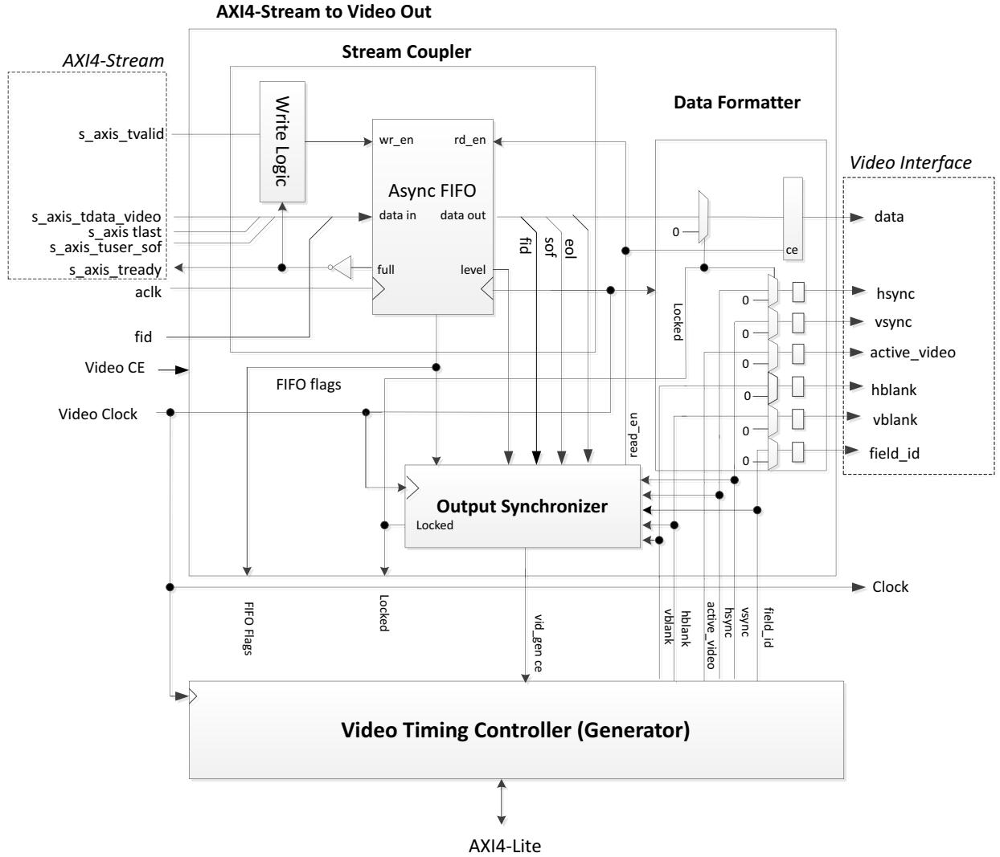

*Figure 1‐1:* **AXI4-Stream to Video Out Core with the Video Timing Controller**

There are two timing modes supported: slave and master timing mode. Changing the timing mode effects the algorithm used by the synchronizer to lock onto the incoming stream. Slave timing mode has the ability to control the phase difference between the AXI4-Stream input and the VTC through the VTC generator clock enable for low latency applications. In master timing mode the VTC free runs and the phase difference depends on startup conditions. In general, it is recommended to use the slave timing mode to minimize buffering and latency requirements.

## **Feature Summary**

The AXI4-Stream to Video Out core converts an AXI4-Stream Slave interface that conforms with the AXI4-Stream Video protocol to a video output, consisting of parallel video data, video syncs, blanks, and data valid. The core interfaces to the Xilinx VTC, which provides timing signals.

The AXI4-Stream to Video Out core instantiates the FIFO Generator IP core, which can be configured in either synchronous or asynchronous clocking mode between the AXI4-Stream and video clock domains. When synchronous clocking mode is selected, the core's logic footprint is reduced by eliminating clock domain crossing logic. The FIFO depth is selectable from 32 to 8192 words.

The video data width is dynamically adjusted from 8 to 256 bits depending upon the video format, component width, and pixel rate settings. In addition, the core can perform component width conversion from say 8 bits to 10 bits by padding LSB's and 10 bits to 8 bits by trimming LSB's on the video bus.

# **Applications**

- Video input to AXI4-Stream Video Protocol interface for parallel, clocked video sources:
	- ° DVI
	- ° HDMI
	- ° Other clocked, parallel video sources

# **Licensing and Ordering Information**

This Xilinx LogiCORE IP module is provided at no additional cost with the Xilinx Vivado Design Suite under the terms of the [Xilinx End User License](https://www.xilinx.com/cgi-bin/docs/rdoc?t=eula). Information about this and other Xilinx LogiCORE IP modules is available at the [Xilinx Intellectual Property](https://www.xilinx.com/products/intellectual-property.html) page. For information about pricing and availability of other Xilinx LogiCORE IP modules and tools, contact your [local Xilinx sales representative](https://www.xilinx.com/about/contact.html).

*Chapter 2*

# Product Specification

# **Standards**

The AXI4-Stream to Video Out core is compliant with the AXI4-Stream Video Protocol. Refer to the *Video IP: AXI Feature Adoption* section of the *Vivado AXI Reference Guide* (UG1037) [\[Ref](#page-52-2) [4\](#page-52-2) for additional information.

# **Performance**

The following sections detail the performance characteristics of the AXI4-Stream to Video Out core.

### **Maximum Frequencies**

This section contains typical clock frequencies for the target devices. The maximum achievable clock frequency can vary. The maximum achievable clock frequency and all resource counts can be affected by other tool options, additional logic in the FPGA device, using a different version of Xilinx tools and other factors.

### **Latency**

#### *Slave Timing Mode*

When the upstream processing block on the AXI4-Stream bus can source data at the pixel rate or faster, the typical latency through the AXI4-Stream to Video Out core is 9 cycles of vid_io_out_clk + 3 cycles of aclk.

If the upstream block sources pixels at a slower rate, the FIFO is used to balance the mismatch in the input and output rates over the course of lines and frames. This storage of pixels in the FIFO adds to the latency and varies according to the data flow in and out of the core.

#### *Master Timing Mode*

In master timing mode, the latency is generally a function of the FIFO size, if pixels are supplied on the AXI4-Stream bus at the output video rate or higher. The latency is relatively steady at approximately FIFO Size - 10 video clocks.

If the upstream block sources pixels at a slower rate, the FIFO is used to balance out the mismatch in the input and output rates over the course of lines and frames. This emptying of the FIFO reduces the latency of the core at the end of lines and or frames, and varies according to the data flow in and out of the core.

## **Throughput**

The average data rates of active pixels on the Video output bus matches the average rate of active pixels in on the AXI4-Stream bus. The data throughput is dictated by the video line standard and clock rate. However, the clock rates of the input need not match the output. Furthermore, since the AXI4-Stream bus does not carry blank pixels, the clock rate can be lower than the video clock rate and still have sufficient bandwidth to meet the average rate requirement. Additional FIFO depth is required in order to smooth the mismatch in instantaneous rates. Both the AXI4-Stream Clock (Faclk) and the rate of the AXI4-Stream Clock (Faclk) is limited by the overall Fmax.

## **Resource Utilization**

For details about resource utilization, visit [Performance and Resource Utilization .](https://www.xilinx.com/cgi-bin/docs/ndoc?t=ip+ru;d=v-axi4s-vid-out.html )

# **Core Interfaces**

## **Port Descriptions**

The AXI4-Stream to Video Out core uses industry-standard control and data interfaces to connect to other system components. The following sections describe the various interfaces available with the core. [Figure](#page-9-0) [2-1](#page-9-0) illustrates an I/O diagram of the AXI4-Stream to Video Out core.

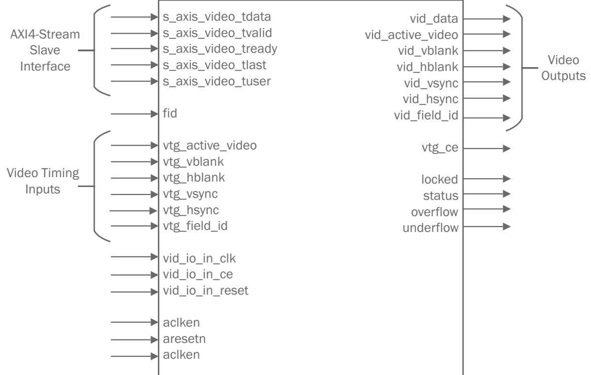

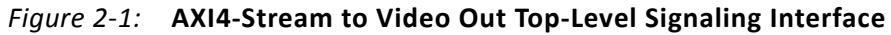

#### **Common Interface**

| Table 2‐1: |  |  | Port Name I/O Width Description |
|------------|--|--|---------------------------------|
|------------|--|--|---------------------------------|

| Signal Name      | Direction | Width | Description                                                                                                                                                                                                                                                                                                                                             |  |
|------------------|-----------|-------|---------------------------------------------------------------------------------------------------------------------------------------------------------------------------------------------------------------------------------------------------------------------------------------------------------------------------------------------------------|--|
| aclk             | Input     | 1     | AXI4-Stream ACLK.                                                                                                                                                                                                                                                                                                                                       |  |
| aclken           | Input     | 1     | AXI4-Stream ACLKEN. Active High.                                                                                                                                                                                                                                                                                                                        |  |
| aresetn          | Input     | 1     | AXI4-Stream ARESETN. Active Low. Synchronous to ACLK.                                                                                                                                                                                                                                                                                                |  |
| fid              | Input     | 1     | Field-ID for AXI4-Stream bus. Used only for interlaced video: 0=even field, 1=odd field. This bit changes coincident with SOF on the AXI4-Stream bus. It should be connected to the field-ID bit of the next device downstream that is field-aware, otherwise it should be left unconnected or driven to ground. Synchronous to aclk. |  |
| vid_io_out_ce    | Input     | 1     | Native video clock enable                                                                                                                                                                                                                                                                                                                               |  |
| vid_io_out_reset | Input     | 1     | Native video clock domain reset. Synchronous to vid_io_out_clk. Only available in independent clock mode. Active High.                                                                                                                                                                                                                            |  |
| vtg_ce           | Output    | 1     | VTC clock enable. Used to halt the timing generator for synchronization purposes.                                                                                                                                                                                                                                                                    |  |

| Signal Name | Direction | Width | Description                                                                                                                                                                                                                                                                                                                                                                                                                                                                                                                                                                                                                                                                                                                                                                                                                                                                                                                                                                                        |
|-------------|-----------|-------|----------------------------------------------------------------------------------------------------------------------------------------------------------------------------------------------------------------------------------------------------------------------------------------------------------------------------------------------------------------------------------------------------------------------------------------------------------------------------------------------------------------------------------------------------------------------------------------------------------------------------------------------------------------------------------------------------------------------------------------------------------------------------------------------------------------------------------------------------------------------------------------------------------------------------------------------------------------------------------------------------|
| locked      | Output    | 1     | Flag indicating whether the VTC is locked to the input timing. 1=locked. Synchronous to vid_io_out_clk.                                                                                                                                                                                                                                                                                                                                                                                                                                                                                                                                                                                                                                                                                                                                                                                                                                                                                         |
| overflow    | Output    | 1     | Flag indicating that the FIFO has over-flowed. Synchronous to vid_io_in_clk.                                                                                                                                                                                                                                                                                                                                                                                                                                                                                                                                                                                                                                                                                                                                                                                                                                                                                                                    |
| underflow   | Output    | 1     | Flag indicating that the FIFO has under-flowed. This should never occur under normal operation. Synchronous to aclk.                                                                                                                                                                                                                                                                                                                                                                                                                                                                                                                                                                                                                                                                                                                                                                                                                                                                         |
| status      | Output    | 32    | Status flag used to monitor synchronizer state machine transitions and VTG lag. Anytime the synchronizer state changes the state transition is captured in the status flag. The state transition bits are sticky and cleared on reset. The VTG lag is a count of the number of clocks that the VTG was lagged as a result of stalls in the stream. VTG lag is updated on every vid_io_out_clk. status[0] – Idle state status[1] – Course Align, Wait for VTG SOF status[2] – Course Align, Wait for FIFO SOF status[3] – Fine Align, VTG EOL Leading status[4] – Fine Align, VTG EOL Lagging status[5] – Fine Align, VTG SOF Leading status[6] – Fine Align, VTG SOF Lagging status[7] – Fine Align Active status[8] – Fine Align Locked status[9] – Lost Align, VTG EOL Leading status[10] – Lost Align, VTG EOL Lagging status[11] – Lost Align, VTG SOF Leading status[12] – Lost Align, VTG SOF Lagging status[31:16] – VTG Lag |

#### *Table 2‐1:* **Port Name I/O Width Description** *(Cont'd)*

#### *ACLK*

The AXI4-Stream interface must be synchronous to the clock signal ACLK. AXI4-Stream signals are sampled on the rising edge of ACLK. AXI4-Stream output signal changes occur after the rising edge of ACLK.

#### *ACLKEN*

The ACLKEN pin is an active-High, synchronous clock-enable input pertaining to the AXI4-Stream interface. Setting ACLKEN Low (deasserted) halts the operation of the AXI4-Stream Bus despite rising edges on the ACLK pin. Internal states are maintained, and output signal levels are held until ACLKEN is asserted again. When ACLKEN is deasserted, core AXI4-Stream inputs are not sampled, except ARESETn, which supersedes ACLKEN.

#### *ARESETn*

The ARESETN pin is an active Low reset, which is synchronous to the ACLK domain. When the bridge is in independent clock mode, this reset is used to reset the AXI4-Stream input side of the video bridge including the internal FIFO. Asserting either this reset causes the internal FIFO to be reset. In common clock mode this reset is used to reset the entire bridge.

#### *Video Clock*

The video output interface and video timing interface must be synchronous to vid_io_out_clk.

#### *Video Clock Enable*

The output signal vid_io_out_ce controls the clock enable of all registers in the video clock domain. This signal is typically used when the video clock domain is clocked at a higher rate then the video timing standard. Driving this signal Low also causes the vtg_ce signal to go Low.

#### *Video Reset*

The video reset signal vid_io_out_reset signal is only available when the core is configured in independent clock mode. This active High signal is synchronous to vid_io_out_clk and is used to reset the output side of the bridge. Asserting either this reset or aresetn causes the internal FIFO to be reset.

### **Video Timing Interface**

| Signal Name  | Direction | Width | Description                                                                                                 |  |
|--------------|-----------|-------|-------------------------------------------------------------------------------------------------------------|--|
| vtg_vsync    | In        | 1     | VTC vertical sync. Active High                                                                              |  |
| vtg_hsync    | In        | 1     | VTC horizontal sync. Active High                                                                            |  |
| vtg_vblank   | In        | 1     | VTC vertical blank. Active High                                                                             |  |
| vtg_hblank   | In        | 1     | VTC horizontal blank. Active High                                                                           |  |
| vtg_act_vid  | In        | 1     | VTC active video signal. 1 = active video, 0 = blanked video                                             |  |
| vtg_field_id | In        | 1     | VTC field ID. Used only for interlace. 0= even field, 1= odd field. Tie LOW for non-interlace operation. |  |

*Table 2‐2:* **Port Name I/O Width Description**

**IMPORTANT:** *All timing control signals are required for the proper operation of the AXI4-Stream to Video Out core. The only exception is vtg_field_id which is not required for non-interlace operation. Although all syncs and blanks may not be required at the video output, they are all required for the correct internal operation of the AXI4-Stream to Video Out core.*

## **Video Output Interface**

The AXI4-Stream to Video Out core receives video through the AXI4-Stream slave interface defined in the *Video IP: AXI Feature Adoption* section of the (UG761) *AXI Reference Guide* [\[Ref](#page-52-2) [4\](#page-52-2). This video is output as parallel video data along with timing signals from a VTC.

| Signal Name      | Direction | Width Description |                                                                             |  |  |
|------------------|-----------|----------------------|-----------------------------------------------------------------------------|--|--|
| vid_active_video | Out       | 1                    | Video output data valid. 1 = active video, 0 = blanked video             |  |  |
| vid_vsync        | Out       | 1                    | Video output vertical sync. Active HIGH                                     |  |  |
| vid_hsync        | Out       | 1                    | Video output horizontal sync. Active HIGH                                   |  |  |
| vid_vblank       | Out       | 1                    | Video output vertical blank. Active HIGH                                    |  |  |
| vid_hblank       | Out       | 1                    | Video output horizontal blank. Active HIGH                                  |  |  |
| vid_data         | Out       | 8-256                | Parallel video output data. Active HIGH                                     |  |  |
| vid_field_id     | Out       | 1                    | Video field. 0= even field, 1= odd field. Synchronous to vid_out_in_clk. |  |  |

*Table 2‐3:* **Video Output Interface**

### **AXI4-Stream Interface**

[Table](#page-12-0) [2-4](#page-12-0) describes the AXI4-Stream signal names and descriptions. See *AXI4-Stream Video IP and System Design Guide* (UG934) [\[Ref](#page-52-4) [12\](#page-52-4) for more information.

*Table 2‐4:* **AXI4-Stream Data Interface Signal Descriptions**

| Signal Name         | Direction | Width | Description                                  |  |
|---------------------|-----------|-------|----------------------------------------------|--|
| s_axis_video_tvalid | Input     | 1     | AXI4-Stream TVALID. Active video data enable |  |
| s_axis_video_tuser  | Input     | 1     | AXI4-Stream TUSER. Start of Frame            |  |
| s_axis_video_tlast  | Input     | 1     | AXI4-Stream TLAST. End of Line               |  |
| s_axis_video_tready | Output    | 1     | AXI4-Stream TREADY. Inverted FIFO full       |  |

#### *Video Data*

The AXI4-Stream interface specification restricts TDATA widths to integer multiples of 8 bits. Therefore, for some input video data widths, data must be padded with zeros on the MSB to form an N*8-bit wide vector before connecting to s_axis_video_tdata.

Data on the AXI4-Stream input s_axis_video_tdata is packed and padded to multiples of 8 bits as necessary. [Figure](#page-13-0) [2-2](#page-13-0) shows an example for 12-bit RGB data with one pixel per clock. For multiple pixels per clock, the pixels are packed together, and padded to multiples of 8 bits as necessary. [Figure](#page-13-1) [2-3](#page-13-1) shows an example of three pixels per clock with 12-bit per component RGB data. Although this is the expected packing, the core itself does not parse

X-Ref Target - Figure 2-3

112

108

the data. In other words, the video output data will be the AXI4-Stream Input data with zero padding truncated. The size of the core is affected by the width of the video data and by the amount of padding required.

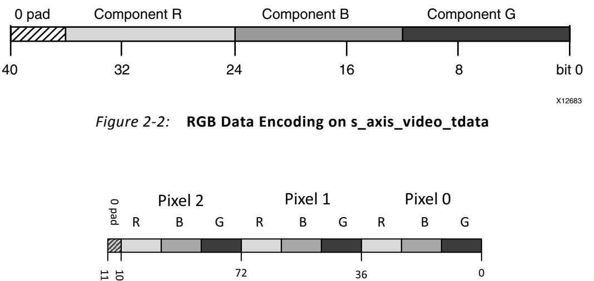

*Figure 2‐3:* **Three Pixels per Clock Format on s_axis_video_tdata.**

The bridge is also able to perform component width conversion from the input to output for any combination of width including: 8, 10, 12, and 16 bit. The example shown in [Figure](#page-13-2) [2-4](#page-13-2) illustrates trimming the component width from 12 bits on AXI4-Stream input to 8 bits on the Video output. The four LSB's of each component are trimmed and the remaining data is packed onto the output video bus.

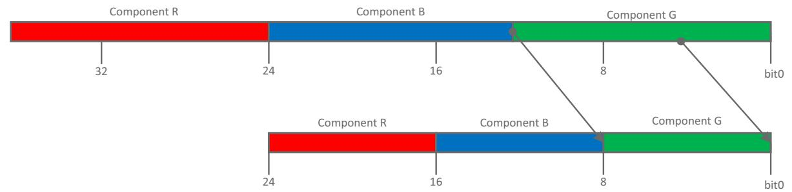

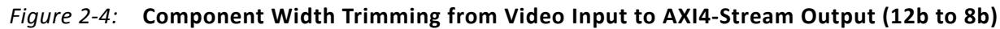

The example shown in [Figure](#page-14-0) [2-5](#page-14-0) illustrates padding the component width from 8 bits on AXI4-Stream to 12 bits on the Video output. The four LSB's on the output of each component are padded to zeros and the upper MSB's are mapped onto the bus from the AXI4-Stream input.

X-Ref Target - Figure 2-4

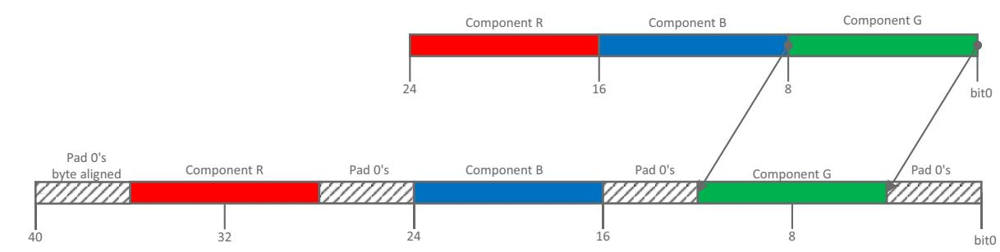

*Figure 2‐5:* **Component Width Padding from Video Input to AXI4-Stream Output (8b to 12b)**

#### *READY/VALID Handshake*

A valid transfer occurs whenever READY, VALID, ACLKEN, and ARESETn are high at the rising edge of ACLK. During valid transfers, DATA only carries active video data. Blank periods and ancillary data packets are not transferred via the AXI4-Stream Video protocol.

#### *Guidelines on Driving s_axis_video_tvalid*

Once s_axis_video_tvalid is asserted, no interface signals (except s_axis_video_tready) may change value until the transaction completes (s_axis_video_tready, s_axis_video_tvalid ACLKEN high on the rising edge of ACLK). Once asserted, s_axis_video_tvalid may only be de-asserted after a transaction has completed. Transactions may not be retracted or aborted. In any cycle following a transaction, s_axis_video_tvalid can either be de-asserted or remain asserted to initiate a new transfer.

*Figure 2‐6:* **Example of READY/VALID Handshake, Start of a New Frame**

#### *SOF - s_axis_video_tuser*

The SOF signal, physically transmitted over the AXI4-Stream tuser signal, marks the first pixel of a video frame. The SOF pulse is 1 valid transaction wide, and must coincide with the first pixel of the frame. SOF serves as a frame synchronization signal, which allows downstream cores to re-initialize, and detect the first pixel of a frame. The SOF signal may

be asserted an arbitrary number of aclk cycles before the first pixel value is presented on tdata, as long as a tvalid is not asserted.

#### *EOL Signal - s_axis_video_tlast*

The EOL signal, physically transmitted over the AXI4-Stream tlast signal, marks the last pixel of a line. The EOL pulse is 1 valid transaction wide, and must coincide with the last pixel of a scanline, as seen in [Figure](#page-15-0) [2-7.](#page-15-0)

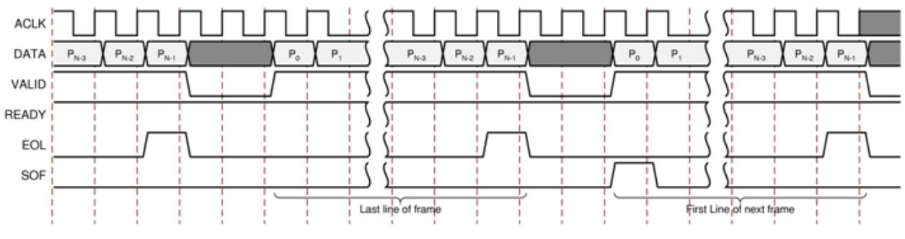

*Figure 2‐7:* **Use of EOL and SOF Signals**

# *Chapter 3*

X-Ref Target - Figure 3-1

# Designing with the Core

# **General Design Guidelines**

The video outputs of the AXI4 Stream to Video Out core should be connected to the output video sink; for example, a DVI interface chip that accepts parallel video data and timing signals. Not all of the timing signals supplied by the Video Timing Controller core are required internally by this core. However it also passes these signals out to the Video output. Therefore all timing signals are present. The data valid signal and vertical sync input are required. It is recommended that the Xilinx Video Timing Controller be configured to output all syncs and blanks (horizontal sync, horizontal blank, vertical sync, vertical blank, and active video).

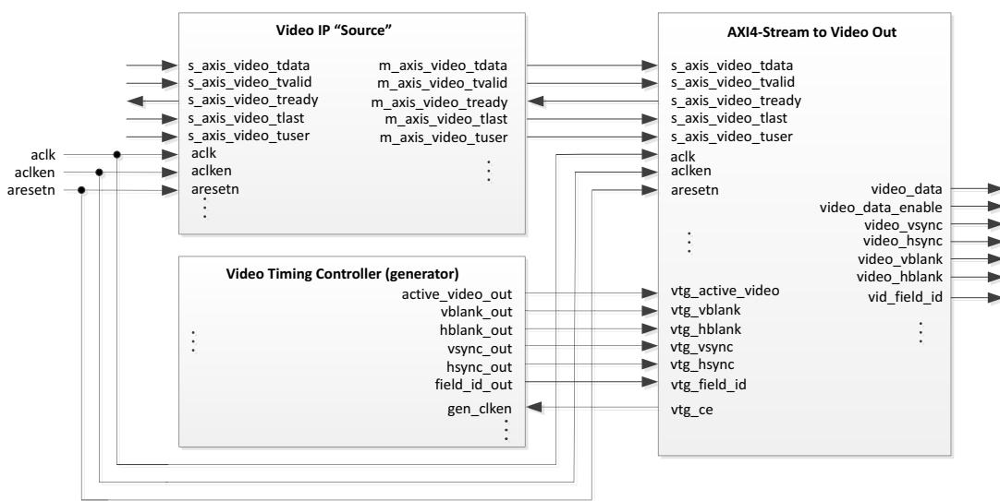

*Figure 3‐1:* **AXI4-Stream to Video Out Connectivity**

The video data input of the core is a slave AXI4-Stream Video Protocol interface that connects to upstream video processing blocks as shown in [Figure](#page-16-2) [3-1.](#page-16-2) The master and slave interfaces share a common clock, reset and clock enable.

[Figure](#page-16-2) [3-1](#page-16-2) shows that the AXI4-Stream to Video Out core is used in conjunction with the Video Timing Controller, which generates the video timing used for the video output. The

timing parameters for the Video Timing Controller must match the video line standard (active pixels per line and active lines per frame) of the video data on the AXI4-Stream interface. Otherwise, it is impossible for the output_sync section to lock the VTC timing to the incoming video. Also, the video clock must be synchronous with the original source of the video on the AXI4-Stream bus. That is, both the AXI4-Stream video and the video timing controller must be roughly isochronous such that the frame rates are identical, with no long term drift.

# **Clocking**

There are two clocking modes used by the AXI4-Stream to Video Out bridge, either common (synchronous) or independent (asynchronous). The common clocking mode is used when the native and AXI4-Stream sides of the bridge are running from a common synchronous clock. The common clocking mode disables the clock domain crossing logic in the internal FIFO, therefore saving resources. The independent clocking mode is used when the bridge requires asynchronous and independent clocks for the native and AXI4-Stream sides of the bridge.

The video output clock corresponds to the video line standard used on the input. It is part of the video line standard and is used by both the AXI4-Stream to Video Out core and by the corresponding Video Timing Controller core that is used to detect video timing.

The AXI4-Stream clock (aclk) is part of the AXI4-Stream bus. To minimize buffering requirements, this clock should be of equal or higher frequency than the video input clock. This clock can be slower than the video input clock, in which case, additional buffering is required to store pixels so that lines can be input at the burst rate of the video clock. This is discussed in the [Buffer Requirements](#page-18-1) section. At a minimum, the aclk frequency must be higher than the average pixel rate.

## **ACLKEN**

The ACLKEN pin disables the AXI4-Stream side of the asynchronous FIFO, as seen in [Figure](#page-16-2) [3-1.](#page-16-2)

The ACLKEN pin facilitates:

- Multi-cycle path designs (high speed clock division without clock gating)
- Standby operation of subsystems to save on power
- Hardware controlled bring-up of system components

## **Resets ARESETn and vid_io_out_reset**

In general, the core does not need to be reset during normal operation. The core will continuously and automatically attempt to lock the video output to the incoming AXI4-video stream until successful. The state machine in the output synchronizer block

detects when the video is not locked to the AXI4-Stream. It resets the FIFO and starts an initialization sequence. Whenever it is detected that the output is not locked, the reset and initialize sequence is repeated.

When the core is in common clock mode, there is only a single reset input port aresetn that is used to reset both the AXI4-Stream output and Video input sides of the bridge. In independent clock mode, an additional reset port vid_io_in_reset is used to reset the Video output side of the bridge. To reset the entire core in independent clock mode, both resets much be asserted. In independent clock mode, both resets are OR'ed together and synchronized for the purpose of resetting the FIFO; therefore, asserting either reset causes the FIFO to be flushed. Resets must be synchronous to their respective clock domains. The bridge requires that resets be externally synchronized to the destination clock domain as necessary to avoid metastability. When asserted, the reset should be held for at least two clock periods of the lowest frequency clock.

## **System Considerations**

### **Buffer Requirements**

The FIFO depth is selectable through the GUI when the core is generated. The buffering requirement for the asynchronous FIFO depends mainly on the relative data rate between the upstream processor through the AXI4-Stream clock (aclk) and the video output clock (vid_io_out_clk) frequency, and also the line standard being used. Basically, if the upstream AXI4-Stream source cannot provide data at a sustained rate equal to or greater than the video clock rate, then additional buffering is required to store up incoming pixels ahead of when they are required such that a continuous stream of pixels can be generated at the output without emptying the FIFO prematurely. The AXI4-Stream to Video Out core will accept AXI4-Stream data as soon as it is available (i.e. it will not apply back pressure) until its FIFO is almost full.

If the sustained pixel rate available from the AXI4-Stream clock (Faclk) is equal to or greater than Video Output pixel clock (Fvclk), only the minimum buffer size (32 locations) is required when there are no stalls in the incoming AXI4-Stream data. In this scenario, the FIFO goes empty after the EOL on each line.

If Faclk is less than Fvclk, additional buffering may be required. The FIFO must store enough pixels to supply them continuously throughout the active line. Due to phasing requirements, the horizontal active period on the output could overlap the effective blanking period of pixels coming in from the AXI4-Stream bus. This means that the input FIFO must also be large enough to provide output pixels continuously during this time.

A first order approximation to the FIFO initial fill level could be calculated. Assuming that R is less than 1, then the minimum initial fill level is computed as follows:

FIFO Initial Fill Level = 32 + Nhactive * (1- R) + Nhstall * (1/R)

where Nhactive is the number of clock ticks for the line active period. Nhblank is the number of clock ticks for the horizontal blanking period. Nhstall is the number of clock ticks that the incoming stream is stalled for a horizontal active period. R is the clock ratio computed as Faclk/Fvclk.

When R is greater than or equal to 1, the second term [Nhactive * (1 - R)] can be dropped. Note, it is difficult to determine Nhstall analytically and may require empirical results.

This is an approximation of the fill level needed to keep the FIFO from running dry each line. When the bridge is configured in slave mode, the fill level is automatically established by the output synchronization mechanism, and is not dependent on the Hysteresis level of the generated core.

The total FIFO depth must be slightly larger than the initial fill level to prevent overflow of the FIFO:

FIFO depth min = 32 + FIFO initial Fill Level

In every case, this is less than a full line of data, so if a line buffer is provided, it will be sufficient. However, in many cases, a full line buffer is not required.

#### *Additional Buffering Requirements for Master Timing Mode*

In master timing mode, the FIFO must be large enough to accommodate pixels that arrive on the AXI4 Stream bus prior to their being output on the video bus. In this mode, the VTC cannot be halted. If the timing between the video source and the video output is tightly controlled then additional buffering may not be required. If, however, video data on the AXI4-Stream bus leads the video timing signals by many clock cycles, the FIFO must be sized to handle the storage of the incoming pixels until they are needed at the output, without overflowing the FIFO.

# **Timing Modes**

In video processing, two basic configurations are used for output timing: with frame buffer, and without. For Xilinx reference designs, this usually means with VDMA or without VDMA. The configuration has implications for how the AXI4-Stream to Video Out (Video Out) core is configured, how the VTC operates, and how it interacts with Video Out. The presence or absence of the VDMA determines how the Video Out core synchronizes timing between the AXI4-Stream data and the VTC, and the timing mode in which the VTC operates.

There are two timing modes supported: slave timing mode and master timing mode. In slave mode, the VTC generator is a slave to the Video Out core which controls it through clock enable. In master mode, the VTC is the timing master for the output side of the VDMA, the output processing cores, and the Video Out core. In master mode, the Video Out core

does not control the VTC generator timing; instead, it uses the VTC timing as a reference, and synchronizes the video pipeline to it.

The timing mode (master or slave) is a configuration parameter of the Video Out core. When generating this core, this parameter must be set according to the configuration in which it will be used.

### **Slave Mode**

The slave timing mode has the following characteristics:

- Automatically minimizes back-pressure to upstream masters
- Automatically minimizes latency and buffering to downstream sinks

The slave timing mode is able to achieve these desired behaviors because of its control over the VTC generator's lag (or phase) relative to the incoming stream. If you require manual control over the VTC's phase relationship to the stream, it is recommend to use the master mode, although this is not a common use case.

To minimize back-pressure through de-assertion of TREADY, the bridge insures that the internal FIFO remains empty during the initial coarse alignment phase of the synchronizer where the SOF of the incoming stream and VTC are aligned. After coarse alignment, there is zero lag between the bridge and VTC reducing the probability of the FIFO filling up during fine alignment. Minimizing the phase difference between the incoming stream and VTC input timing ensures that the bridge queues only the minimum number of samples required to achieve lock, which reduces latency. The bridge synchronizer is able to precisely lag the VTC based on the amount of stalls in the incoming stream automatically increasing the cushion in the FIFO to absorb stalls.

Based on your configuration of the FIFO hysteresis (or fill level), the synchronization behavior and latency can be effected. The hysteresis setting forces the bridge to queue up the desired number of samples before starting the synchronization process. The hysteresis level is meant to be an aid to the synchronizer in situations where it cannot automatically establish the lag or as a method to speed up lock times. Typically, the hysteresis should be set to a small value to allow the synchronizer to automatically establish the lag and reduce latency. The lag information from the synchronizer after lock is achieved can be used to optimize the FIFO depth option in the GUI for a particular input stream.

[Figure](#page-21-0) [3-2](#page-21-0) shows an example of slave timing mode.

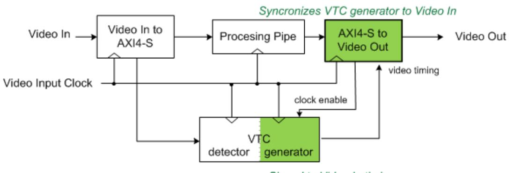

*Figure 3‐2:* **Without VDMA - Slave Timing Mode**

When designing systems with no external frame buffer, it is important to consider EOL flushing by upstream AXI4-Stream sources. Although video timing is not embedded into the AXI4-Stream signal set, it is inherently carried in the stream by way of stall periods where TVALID is Low. In an ideal AXI4-Stream scanline in slave mode, video samples arrive back-to-back with no stalls in between subsequent pixels during active periods followed by blanking period where the stream is stalled for a consecutive number of clock cycles.

In imperfect AXI4-Stream sources, the stall period can become fragmented within a scanline, requiring the Video Out bridge to absorb fragments by establishing a fill level as described earlier. Upstream AXI4-Stream sources should be designed to flush the EOL pixel as quickly as possible within the period of a scanline to avoid requiring multi-line buffering. Refer to *AXI4-Stream Video IP and System Design Guide* (UG934) [\[Ref](#page-52-4) [12\](#page-52-4) to understand active, line, and frame pixel rates. In general, when the AXI4-Stream source cannot maintain the line pixel rate, line buffering is not sufficient to handle stalls, and therefore the Video Out bridge is not able to synchronize to the stream.

### **Master Mode**

The master timing mode is used when the VTC phase relationship to the incoming stream should not be automatically adjusted by the bridge as in the slave timing mode. Instead, at the start of coarse alignment, the bridge immediately buffers incoming samples without regard to any phase relationship with the VTC. After the VTC first SOF is detected and the FIFO hysteresis level is met, the bridge starts reading samples according to the VTC timing. if necessary, you must manually adjust the phase relationship of the VTC with respect to the stream.

[Figure](#page-22-0) [3-3](#page-22-0) shows an example of Master timing mode.

X-Ref Target - Figure 3-4

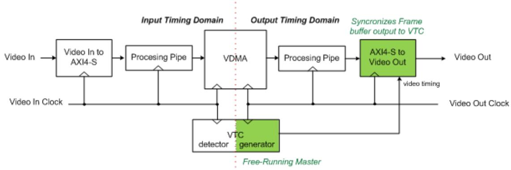

*Figure 3‐3:* **With VDMA - Master Timing Mode**

In this case, the attached VTC generator is the timing master, and the Video Out core synchronizes the data in the processing pipeline to the video timing signals by applying back pressure to the processing pipeline. This means that you can deassert the tready signal to stop the flow of pixels. This back pressure is propagated through the processing pipe in the reverse direction of the data flow until it halts the frame buffer output. In this scenario, the video output processing pipeline, from the frame buffer onward, is synchronized with the VTC generator. The VDMA provides video data as it is requested by the Video Out core through the processing pipe.

#### **Master Mode with Fsynch**

You have control over phase relationship between the incoming stream and VTC. [Figure](#page-22-1) [3-4](#page-22-1) shows an example configuration of the Video Out bridge and VTC using the external Fsync to manually adjust the phase. Pulsing the Fsync signal causes the VTC timing to be reset on demand. Refer to the *Video Timing Controller LogiCORE IP Product Guide* [\[Ref](#page-52-5) [5\](#page-52-5) for more information.

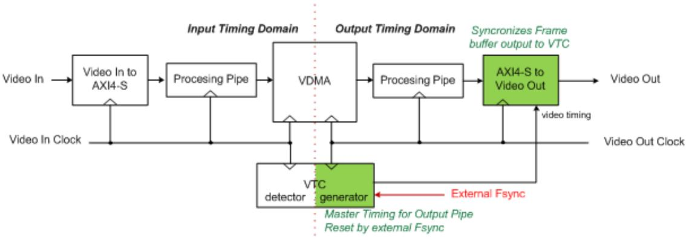

*Figure 3‐4:* **Genlock with VDMA - Master Timing Mode**

## **Interlaced Operation**

To support standard definition video input such as PAL and NTSC, the Video In to AXI4-Stream core supports interlace on the video (with timing) side, the video input has a vid_field_id bit as part of its interface and embedded vertical blanks and horizontal blanks. The VTC has a corresponding vid_field_id pin defined for this purpose.

[Figure](#page-23-1) [3-5](#page-23-1) shows the interfaces on Video In to AXI4-Stream, AXI4-Stream to Video Out, and VTC cores to support the video field ID with the interlace-related signals highlighted in red.

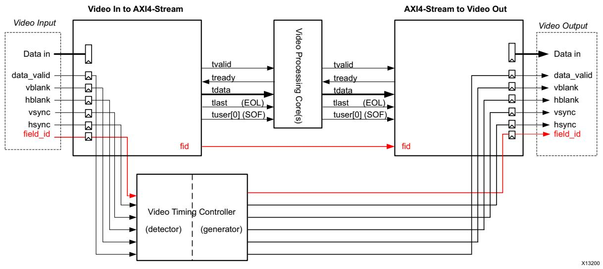

*Figure 3‐5:* **Interlace Signals on Video Cores**

Most video processing cores are field-agnostic, and not aware of whether the picture being processed is an odd or even frame, or a progressive field. Therefore, interlace has no impact on these cores. The Video In to AXI4-Stream core has a frame ID output, fid, timed to the native video bus. This signal can be used as needed in the system. The only cores that use this fid bit are the AXI4-Stream to Video Out, VDMA, and Video Deinterlacer cores.

The AXI4-Stream to Video Out core has a field ID input, fid, sampled in time with the AXI4-Stream input bus. This fid bit must be asserted by the upstream source of AXI4-Stream video. For systems without a frame buffer or de-interlacing, the field ID input originates from the Video In core, as shown in [Figure](#page-24-0) [3-6](#page-24-0).

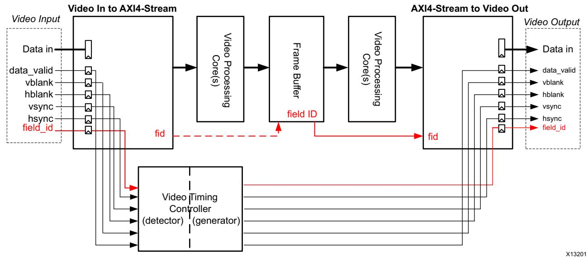

*Figure 3‐6:* **Field ID Connections with a Frame Buffer**

For systems with a frame buffer, the field ID input can come from any core containing a frame buffer. The field ID from the Video In to AXI4-Stream core can be used by the frame buffer if necessary, shown in [Figure](#page-24-0) [3-6.](#page-24-0)

*Note:* In [Figure](#page-24-0) [3-6](#page-24-0), the AXI4-Stream to Video Out core is operating in slave mode.

A deinterlacer can be used after the Video In to AXI4-Stream core to convert the video format from interlaced to progressive. In this case, the deinterlacer uses the field ID bit, fid, from the Video In to AXI4-Stream core, as shown in [Figure](#page-25-0) [3-7.](#page-25-0)

X-Ref Target - Figure 3-8

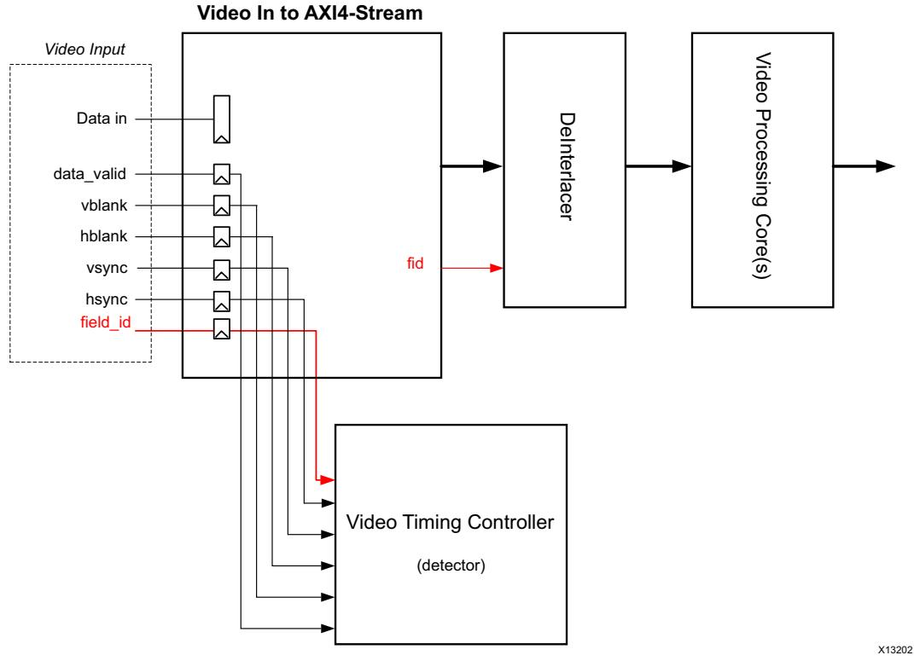

*Figure 3‐7:* **Field ID Connections with a DeInterlacer**

On the Video In to AXI4-Stream core, the fid bit changes coincident with SOF and remains constant throughout the remainder of the field. On the AXI4-Stream to Video Out core, the fid bit is sampled coincident with SOF in [Figure](#page-25-1) [3-8.](#page-25-1) Therefore, the Video In to AXI4-Stream can provide the field bit directly to the AXI4-Stream to Video Out core if no intervening frame buffer exists. When a deinterlacer or frame buffer is used, a similar scheme can be employed: generate the field ID coincident with the start of the field, and on the receiving side sample the field ID coincident with the first received pixel.

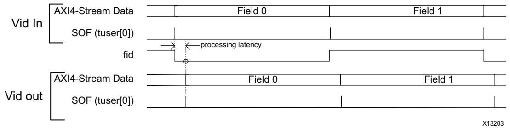

*Figure 3‐8:* **Timing of Field ID for AXI4-Stream**

# **Module Descriptions**

The AXI4-Stream to Video Output core works with the generator portion of the Video Timing Controller (VTC) core.

The timing outputs of the VTC connect as inputs to the AXI4-Stream to Video Output core. When locked, these timing signals are output along with video data from the FIFO as part of the video interface. These signals are also used by the Output Synchronizer, to compare to flags from the FIFO in order to guide the control action for locking the timing generator with FIFO data.

There are three main blocks, the stream coupler, the data formatter, and the output synchronizer. The AXI4-Stream interface is on the left, and the video connections are on the right.

### **Data Formatter**

The Data Formatter block receives data from the Stream Coupler, timing from the VTC, and control from the Output Synchronizer. It registers the video data and timing signals to form the video output interface. The locked signal from the output synchronizer is used to enable the video interface. Before lock is achieved, the video outputs are all forced low. When lock is achieved, the video outputs become active at the end of the frame in progress, noted by the rising edge of vblank.

### **Stream Coupler**

The Stream Coupler block consists mainly of an asynchronous FIFO and write logic for the input side of the FIFO. The Output Synchronizer controls the reading of the FIFO. The FIFO serves two primary purposes:

- 1. Clock domain crossing.
- 2. Buffering of data between the AXI4-Stream input and the video output.

The buffering requirements are dependent on the ratio of the AXI4-Stream data rate to the video clock rate, described in [System Considerations.](#page-18-0)

#### **Write Logic**

The function of the write logic is to control the handshaking for the AXI4-Stream bus and to accept pixels from this bus as rapidly as possible. In general, the strategy for Video Over AXI4-Stream is downstream-greedy. That is, downstream modules take pixels as soon as they are available and there is buffer space to accommodate them. Because the AXI4-Stream to Video Out core is at the end of the pipeline, it strives to fill its FIFO as fast as possible.

The Write Logic controls the tready handshaking signal based on the full flag from the FIFO. Whenever there is room in the FIFO, tready is asserted. When tvalid becomes active while tready is asserted, the FIFO is written. The tready signal is asserted except when there is almost no space available in the FIFO. Usually the FIFO will empty at the end of the active line when the downstream core is still taking pixels, but the incoming video data is in the horizontal blanking period and no pixels are entering the FIFO.

**IMPORTANT:** *In master timing mode, the phase difference between the VTC and incoming stream cannot be controlled and is dependent upon the startup conditions of the VTC relative to the input stream.* 

## **Output Synchronizer**

A major task for the AXI4-Stream to Video Out core is to synchronize the asynchronous and irregularly timed video data from AXI4-Stream interface with the periodic and repeatable timing signals from the VTC. In slave timing mode, the timing of the data in the pipeline on the AXI-Stream interface cannot be controlled. Therefore, the synchronization is done mainly by controlling the phase of the VTC. In master timing mode, synchronization is done by controlling when data exits the FIFO. When the FIFO is almost full, the core stops accepting data from the upstream source on the AXI4 Stream bus. The upstream core subsequently exerts back pressure on the core upstream from it, and so on such that the entire upstream pipe stays synchronized with the VTC at the output of the AXI4-Stream to Video Out core.

In either case, the synchronization function is performed by the Output Synchronizer block. Also, the data from the AXI4-Stream interface goes into a FIFO to be able to smooth out small and short-term latency variations that occur during the course of a frame. The phase of the VTC must have some additional lag, such that the FIFO will have a sufficient fill level to cushion the short-term variations.

The initial fill level is controlled by the Hysteresis setting parameter configured when the core is generated. This specifies the level to which the FIFO must fill initially before reads begin.

Since the video input source may be disconnected or change line standards, the Video Output Bridge must constantly compare the timing of incoming video data relative to the timing of the VTC. This makes it possible to detect timing mismatches so that it can re-synchronize after any type of interruption. It must be self monitoring and self synchronizing. [Figure](#page-31-0) [3-12](#page-31-0) shows a block diagram of the output synchronizer.

#### *Algorithm*

For either Slave or Master timing mode, the operation of the self synchronizing circuit can be broadly defined in two steps: **initialization** and **run**. In the run mode, alignment must be continually checked and if there is a discrepancy, a new initialization is required, as shown in [Figure](#page-28-0) [3-9](#page-28-0).

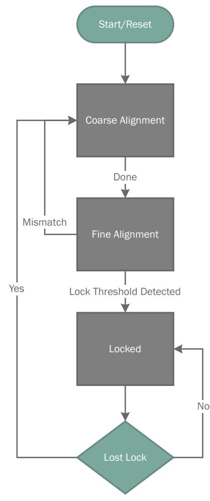

*Figure 3‐9:* **Basic Self Synchronizer Flow Chart**

The initialization phase does an alignment of the VTC to the AXI4-Stream data, provides for some cushion in the FIFO, and precisely aligns the video data from the FIFO to the VTC generated video output signals. The main difference between slave and master timing mode is how the FIFO and/or VTC is used to align the pixels with the video timing signals. In slave timing mode, the output sync section controls both the reading of the FIFO and the VTC (by halting it). In master timing mode, the VTC generator is never halted. Only the reading of the FIFO is controlled by the output synchronizer module.

#### **Coarse and Fine Alignment**

[Figure](#page-29-0) [3-10](#page-29-0) expands the self synchronizer flow chart run phase into more detailed processes. After the initial alignment and FIFO fill level are achieved, the Fine Alignment process beings. Fine alignment ensures that EOL's and SOF's are matching between consecutive lines and frames, respectively. When the bridge is configured in Slave mode, if there is a mismatch indicating that the VTC is leading the FIFO, the synchronizer automatically increases the VTC lag. In Master mode there is no such mechanism and relies solely on initial coarse alignment.

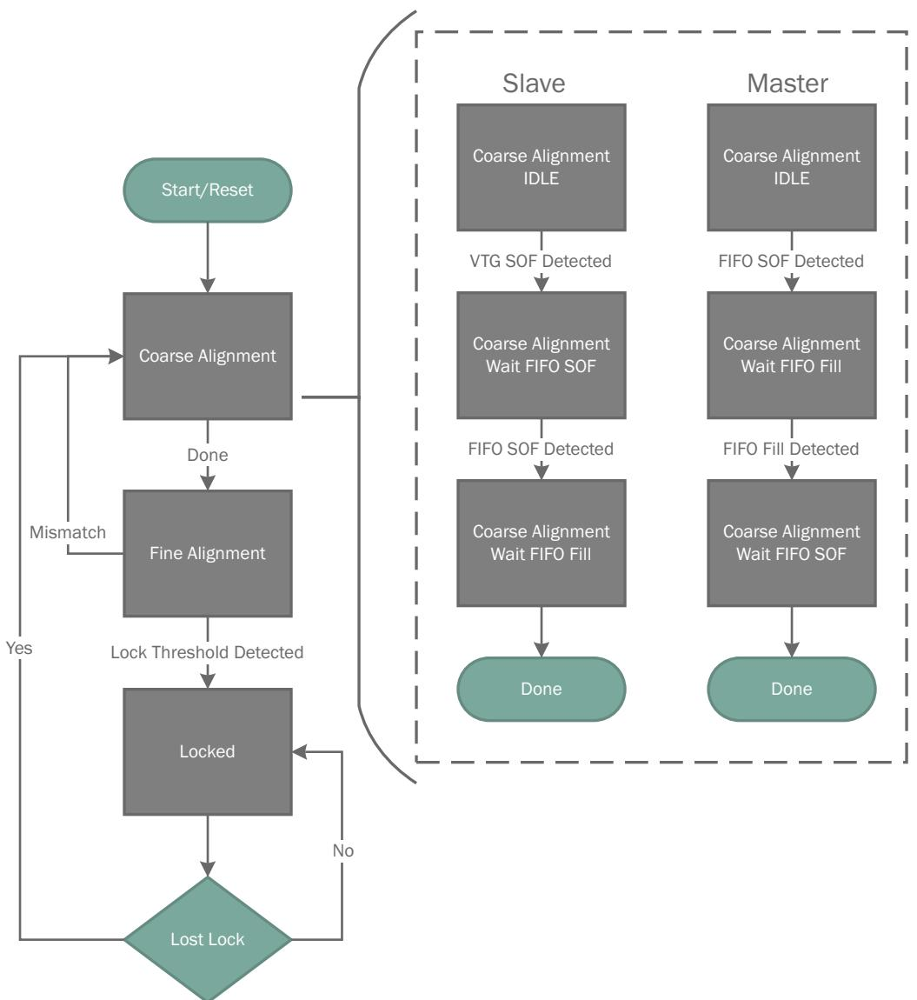

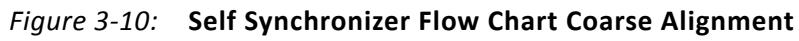

The fine tuning process is shown in more detail in [Figure](#page-30-0) [3-11.](#page-30-0)

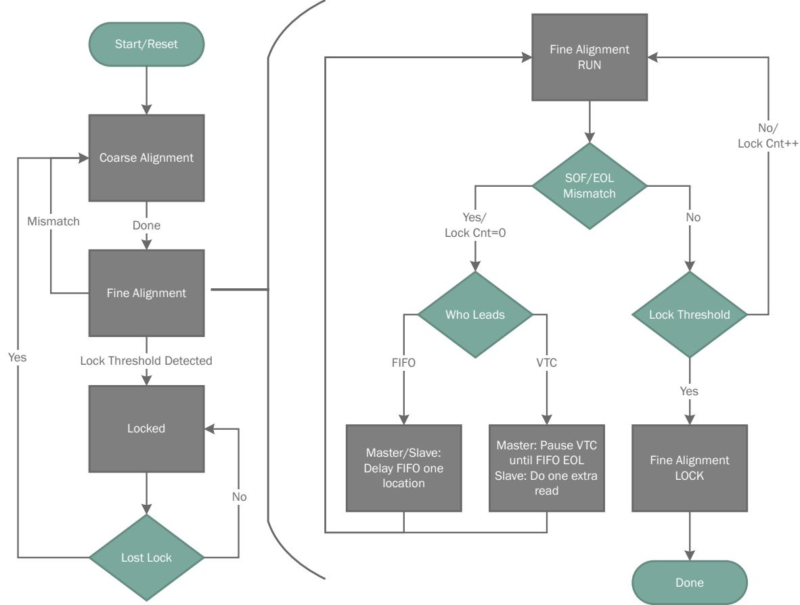

*Figure 3‐11:* **Self Synchronizer Flow Chart Fine Alignment**

During the first frame time after rough alignment, the EOLs from the FIFO and from the VTC (or rather the EOL signal derived from Data Valid) are compared every line. If the VTC is leading, it is paused until the EOL is flushed out of the FIFO. If the FIFO is leading, the reading of the FIFO is delayed by one location. The EOLs are aligned after several lines, typically a dozen or two. Delaying (or lagging) the VTC has the effect of building up a cushion in the FIFO because reading out of the FIFO is delayed for the next line.

At the end of the frame, the EOLs are aligned through the fine-tuning process, and there is a cushion of pixels in the FIFO. However, since the FIFO must empty completely at the end of each line in order to flush the EOL through to the video output, this cushion will be used up at the end of each line. The phase lag of the VTC generated video output signals ensures that the cushion is built up at the start of the next line to smooth out variations during the active line.

When the Vsync from the VTC becomes active, the EOLs from the FIFO and the VTC are aligned. If everything is stable, the SOFs and EOLs are aligned, and after the lock threshold count is reached, locked mode is entered. The default value for the lock threshold is 4 frames, which means that four consecutive frames must match all EOLs and SOFs. The video output is enabled at the next rising edge of vblank and pixel data and timing signals are output from the bridge. This is the run state and can continue indefinitely.

The EOLs and SOFs are continuously compared while the output is locked. If they do not match the system is considered unlocked and a new initialization cycle begins. In the case of a disconnected or unstable input to the system, initialization cycles are repeated until the system is stable.

X-Ref Target - Figure 3-12

**IMPORTANT:** *The lock threshold is used to control how many cycles to wait before declaring that the synchronizer is locked. The default value is four frames, but this value can be adjusted by changing the user parameter property. Increasing the lock threshold maybe useful in slave mode when the input stream contains jitter in the number of stall cycles.*

#### *Implementation*

The output synchronizer is shown in [Figure](#page-31-0) [3-12.](#page-31-0) This is essentially a state machine that implements the algorithm described in [Algorithm](#page-27-0). The control outputs are all registered, and reflect the current state. This means the control outputs are pre-decoded, rather than being decoded based on the current state.

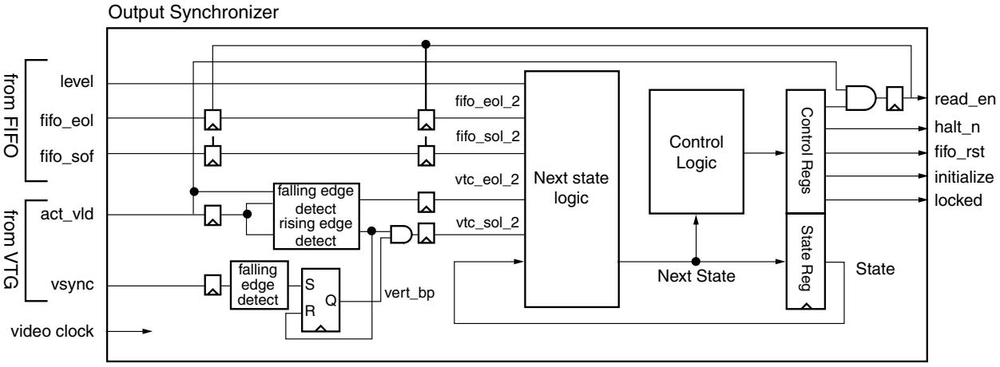

*Figure 3‐12:* **Output Synchronizer Block Diagram**

Besides the state machine, there is logic to create virtual EOL and SOF flags from the VTC generated video output signals. These flags are created based on edges of the act_vid or data_valid from the VTC. The vsync input is used to distinguish the SOF. Also there is additional logic to create the FIFO read_en signal based on the act_vid from the VTC as well as control bits from the state machine. The read_en output has a register after the state machine to ensure that all outputs of the module are registered.

[Figure](#page-33-0) [3-13](#page-33-0) is a state diagram of the state machine of the output synchronizer for slave timing mode. [Figure](#page-34-0) [3-14](#page-34-0) is a state diagram of the output synchronizer state machine for master timing mode. They both execute the initialize-run algorithm described in [Algorithm](#page-27-0). Initialization consists of a coarse alignment, setting additional lag, and fine tuning. When the EOLs are aligned, and matching SOFs occur, the state machine goes to the "EOLs Matched" state. If matching SOFs occur a second time, the "Locked" state is entered, which concludes initialization. It will remain in this state as long the system is stable.

The initialization process is done over three frame times. The first is waiting for the FIFO SOF. The second is for the fine tuning to align EOLs. The third is basically a double check that the EOLs and SOFs are aligned. If an SOF mismatch occurs during fine tuning, it means that fine tuning has failed to align within the frame time. In this case, the initialization process is re-started. Also, in the "EOLs Matched" or "Locked" states, EOL and SOF matching is continuously checked. If there is any mismatch, it means the output is unlocked, and the initialization is re-started.

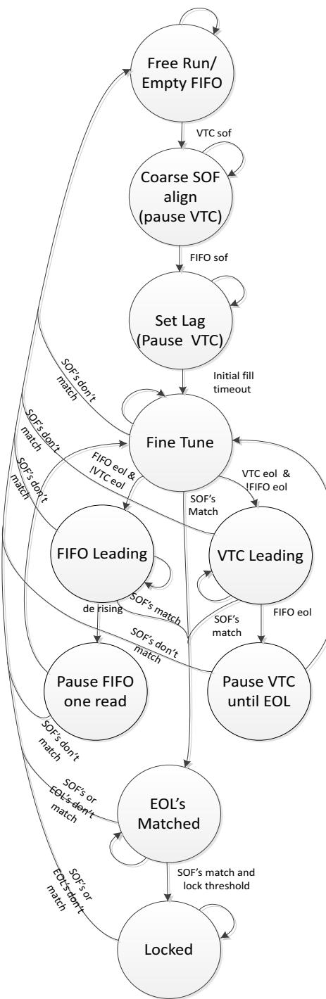

*Figure 3‐13:* **Output Synchronizer State Diagram - Slave Timing Mode**

[Figure](#page-34-0) [3-14](#page-34-0) is a state diagram of the state machine of the output synchronizer for master timing mode.

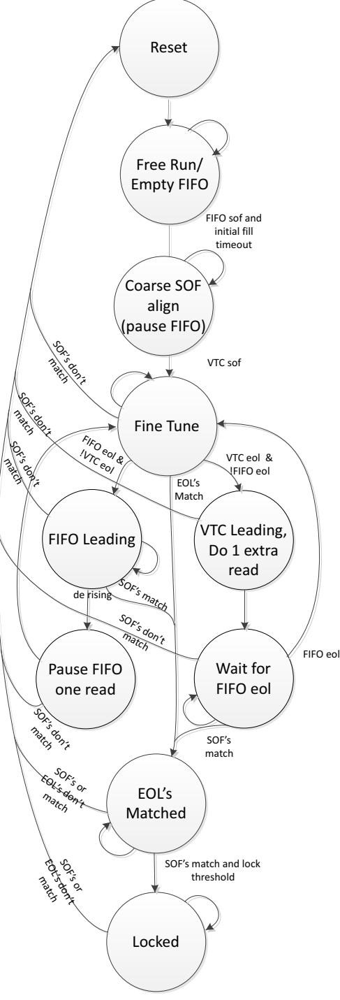

*Figure 3‐14:* **Self Synchronizer Flow Chart Showing Initialization Steps - Master Timing Mode**

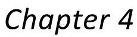

# Design Flow Steps

This chapter describes customizing and generating the core, constraining the core, and the simulation, synthesis and implementation steps that are specific to this IP core. More detailed information about the standard Vivado® design flows and the IP integrator can be found in the following Vivado Design Suite user guides:

- *Vivado Design Suite User Guide: Designing IP Subsystems using IP Integrator* (UG994) [\[Ref](#page-52-8) [13\](#page-52-8)
- *Vivado Design Suite User Guide: Designing with IP* (UG896) [\[Ref](#page-52-6) [7\](#page-52-6)
- *Vivado Design Suite User Guide: Getting Started* (UG910) [\[Ref](#page-52-7) [11\](#page-52-7)
- *Vivado Design Suite User Guide: Logic Simulation* (UG900) [\[Ref](#page-52-9) [9\](#page-52-9)

## **Customizing and Generating the Core**

This chapter includes information about using Xilinx tools to customize and generate the core in the Vivado® Design Suite environment.

You can customize the IP for use in your design by specifying values for the various parameters associated with the IP core using the following steps:

- 1. Select the IP from the IP catalog.
- 2. Double-click on the selected IP or select the Customize IP command from the toolbar or popup menu.

For details, see the sections, "Working with IP" and "Customizing IP for the Design" in the *Vivado Design Suite User Guide: Designing with IP* ([UG896](https://www.xilinx.com/cgi-bin/docs/rdoc?v=latest;d=ug896-vivado-ip.pdf)) ](https://www.xilinx.com/support/documentation/sw_manuals_j/v=latest/ug910-vivado-getting-started.pdf|[#page-52-6|%5C[Ref) [\[Ref](#page-52-7) [11\](#page-52-7).

If you are customizing and generating the core in the Vivado IP Integrator, see the *Vivado Design Suite User Guide: Designing IP Subsystems Using IP Integrator* (UG994) [\[Ref](#page-52-8) [13\](#page-52-8) for detailed information. IP Integrator might auto-compute certain configuration values when validating or generating the design. To check whether the values do change, see the description of the parameter in this chapter. To view the parameter value you can run the validate_bd_design command in the Tcl console.

*Note:* Figures in this chapter are illustrations of the Vivado IDE. This layout might vary from the current version.

#### **Vivado Integrated Design Environment**

The AXI4-Stream to Video Out core is easily configured to meet the developer's specific needs through the Vivado Design Suite. This section provides a quick reference to parameters that can be configured at generation time.

*Figure 4‐1:* **AXI4-Stream to Video Out Vivado GUI**

The GUI displays a representation of the IP symbol on the left side, and the parameter assignments on the right side, which are described as follows:

- **Component Name**: The component name is used as the base name of output files generated for the module. Names must begin with a letter and must be composed of characters: a to z, 0 to 9 and "_".
- **Pixels Per Clock**: Specifies the number of pixels to be output in parallel. This parameter affects the data bus width of the input and output. The options for pixels per clock are 1, 2, or 4.
- **Input Component Width**: Specifies the video component bit width over the input AXI4-Stream TDATA bus.
- **Output Component Width**: Specifies the video component bit width over the output video data bus.
- **Clock Mode**: The clock mode is used to specify whether the AXI4-Stream input and Video output signals are clocked using common or independent clocks.

- **Video Format**: Specifies the video format used. The video formats are specified in the *Video IP: AXI Feature Adoption* section of the *Vivado AXI Reference Guide* (UG1037) [\[Ref](#page-52-2) [4\](#page-52-2) The format selected determines the number of components used. The number of components (1-4) is multiplied by pixels per clock and the component width to determine the width of the video data bus, v_data. In turn, this width is rounded up to the nearest factor of 8 to determine the width of the AXI4-Stream data bus, m_axis_video_tdata. For example, if the component width is 14, pixels per clock is 2, and the Video Format is RGB (3 components), the vid_data is 84 bits wide and m_axis_video_tdata is 88 bits. When using IP Integrator, this parameter is automatically computed based on the Video Format of the video IP core connected to the slave AXI-Stream video interface.
- **FIFO Depth**: Specifies the number of locations in the input FIFO. The options for FIFO depth are 32, 1024, 2048, 4096, and 8192.
- **Hysteresis Level**: Defines the "Cushion" level of the frame buffer. i.e. the number of locations that are considered the minimum fill level for FIFO operation to start. Generally, this value should be between 12 and 20. It must be at least 16 less than the depth of the FIFO, and at least 16 less than the number of active video lines.

## **Output Generation**

For details, see "Generating IP Output Products" in the *Vivado Design Suite User Guide: Designing with IP* ([UG896](https://www.xilinx.com/cgi-bin/docs/rdoc?v=latest;d=ug896-vivado-ip.pdf)) [\[Ref](#page-52-6) [7\](#page-52-6)

# **Required Constraints**

The only constraints required are clock frequency constraints for the video clock, vid_io_out_clk, and the AXI4-Stream clock, aclk. Paths between the two clock domains should be constrained with a max_delay constraint and use the datapathonly flag, causing setup and hold checks to be ignored for signals that cross clock domains. These constraints are provided in the XDC constraints file included with the core.

## **Device, Package, and Speed Grade Selections**

There are no device, package, or speed grade requirements for this core. This core has not been characterized for use in low-power devices.

## **Clock Frequencies**

The pixel clock frequency is the required frequency for this core. See [Maximum Frequencies](#page-7-3)  [in Chapter](#page-7-3) [2](#page-7-3).

## **Clock Management**

There are two clock domains for this core. The clock crossing boundary is handled by the FIFO and a handshake system for passing pointers between domains.

### **Clock Placement**

There are no specific Clock placement requirements for this core.

### **Banking**

There are no specific Banking rules for this core.

#### **Transceiver Placement**

There are no Transceiver Placement requirements for this core.

## **I/O Standard and Placement**

There are no specific I/O standards and placement requirements for this core.

# **Simulation**

This chapter contains information about simulating IP in the Vivado® Design Suite environment. For comprehensive information about Vivado simulation components, as well as information about using supported third party tools, see the *Vivado Design Suite User Guide: Logic Simulation* (UG900) [\[Ref](#page-52-9) [9\](#page-52-9)

# **Synthesis and Implementation**

For details about synthesis and implementation, see "Synthesizing IP" and "Implementing IP" in the *Vivado Design Suite User Guide: Designing with IP* ([UG896](https://www.xilinx.com/cgi-bin/docs/rdoc?v=latest;d=ug896-vivado-ip.pdf)) [\[Ref](#page-52-6) [7\](#page-52-6)

# *Chapter 5*

# Detailed Example Design

This chapter contains information about the provided example design in the Vivado® Design Suite environment.

# **Example Design**

The Video In to AXI4-Stream core is used in several reference designs and application notes. For detailed examples of how to use this core, refer to the following:

- *Creating a Video Design From Scratch Tutorial from Avnet Electronics* Reference Design [\[Ref](#page-52-10) [2\](#page-52-10)
For a comprehensive listing of Video and Imaging application notes, white papers, reference designs and related IP cores, see the Video and Imaging Resources page at:

<https://www.xilinx.com/esp/video/refdes_listing.htm#ref_des>

*Chapter 6*

# Test Bench

This chapter contains information about the provided test bench in the Vivado® Design Suite environment.

For a comprehensive listing of Video and Imaging application notes, white papers, reference designs and related IP cores, see the Video and Imaging Resources page at:

<https://www.xilinx.com/esp/video/refdes_listing.htm#ref_des>.

# **Demonstration Test Bench**

A demonstration test bench is provided which enables you to observe core behavior in a typical use scenario. You can observe various signals to within the design to gain detailed insight into its operation. There are no stimulus or results files, but the test bench module generates both input and expected data, and performs the comparison of output data to the expected data. Several small frames of parallel video are generated with different timing parameters and applied to the core. The core processes the parallel data through to the video output. The resulting AXI4-Stream output bus is interfaced to an AXI4-Stream slave emulator. The data extracted by the emulator are compared to the expected parallel video data.

## **Directory and File Contents**

The following file is expected to be generated in the in the demonstration test bench output directory:

- tb_<IP_instance_name>.v
Included in this file are the following modules:

- tb_<IP_instance_name>
- timing_gen
- axis_gen
- test_vid_out
- phy_emulation

## **Test Bench Structure**

[Figure](#page-41-0) [6-1](#page-41-0) shows the test bench structure.

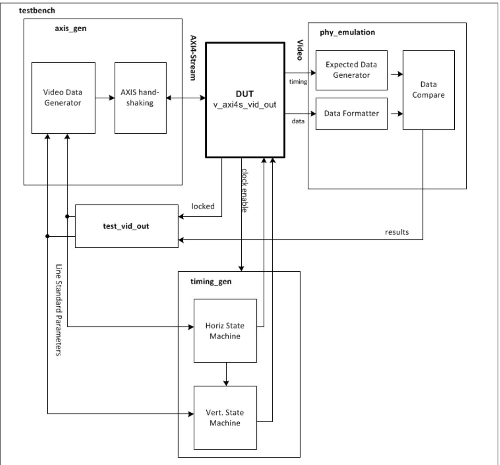

*Figure 6‐1:* **Test Bench Structure**

The top-level entity test bench module instantiates the following modules:

- DUT
The AXI4-Stream to Video Out core instance under test.

- timing_gen
The timing generator module generates video timing based on the parameters specified by the test program. It also generates the video data that is input to the DUT.

- axis_gen
AXI4-Stream generator. This module generates the video timing based on the parameters specified by the test program. It also emulates the AXI4-Stream master bus which interfaces to the DUT.

- test_vid_out
The test program. This program controls the operation of the test bench

- phy_emulation
The video PHY emulator simulates the video PHY interface driven by the DUT. It generates handshaking, and receives data from the core. It also generates expected values and compares these to incoming video data. Based on the syncs and blanks from the DUT, it creates an expected data value, and compares this to the incoming video.

*Appendix A*

# Verification, Compliance, and Interoperability

## **Simulation**

A test bench incorporating randomization of timing parameters was used to test the AXI4-Stream to Data out Core. Testing included the following:

- Testing with multiple frames of data with many different timing parameters and frame sizes.
- Testing for locking in both slave and master timing modes.
- Testing of locking, and re-locking after input interruption and line standard changes.

In addition to stand alone simulation, simulation was done on a pass-through video system consisting of the AXI4-Stream to Video out core in a system with the Video to AXI4-Stream Core and the VTC.

## **Hardware Testing**

The AXI4-Stream to Video Out core has been validated in hardware using a complete pass through design with an external HDMI video source as an input, and an HDMI video display to verify the output. Output re-synchronization was tested by removing and re-applying the video source multiple times.

## **Interoperability**

The AXI4-Stream input interface is compatible with any video processing block that implements the Video Over AXI4-Stream protocol.

The video output is compatible with digital video PHYs such as DVI that accept data in the format provided: Component video data, syncs, blanks, and data valid. With the addition of

additional sync embed logic external to the core, it can also interface with many other digital standards such as HDMI and SDI.

*Appendix B*

# Upgrading

This appendix contains information about migrating from an ISE design to the Vivado Design Suite, and for upgrading to a more recent version of the IP core. For customers upgrading their IP core, important details (where applicable) about any port changes and other impact to user logic are included.

# **Migrating to the Vivado Design Suite**

For information about migration to Vivado Design Suite, see *ISE to Vivado Design Suite Migration Guide* (UG911) [\[Ref](#page-52-11) [6\](#page-52-11).

# **Upgrading in Vivado Design Suite**

This section provides information about any changes to the user logic or port designations that take place when you upgrade to a more current version of this IP core in the Vivado Design Suite.

Version 4.0 supports IP upgrade from version 3.0. It has the following changes from version 3.0:

### **Parameter Changes**

The Clock Mode parameter has been added to allow for common or independent clocks. The default clock mode is set to independent.

The Video Component Width parameter has been replaced by Input Video Component Width and Output Video Component Width parameters to allow for component width conversion.

Added the Lock Threshold parameter not visible in the GUI. The default value is set to 4, but can be changed by updating the property through the TCL console.

## **Port Changes**

Removed the following ports:

- rst
- wr_error
- empty

Added the following ports:

- vid_io_out_reset
- overflow
- underflow
- status

*Appendix C*

# Debugging

This appendix includes details about resources available on the Xilinx Support website and debugging tools.

# **Finding Help on Xilinx.com**

To help in the design and debug process when using the Video In to AXI4-Stream, the [Xilinx](https://www.xilinx.com/support)  [Support web page](https://www.xilinx.com/support) contains key resources such as product documentation, release notes, answer records, information about known issues, and links for opening a Technical Support Web Case.

### **Documentation**

This product guide is the main document associated with the Video In to AXI4-Stream. This guide, along with documentation related to all products that aid in the design process, can be found on the [Xilinx Support web page](https://www.xilinx.com/support) or by using the Xilinx Documentation Navigator.

Download the Xilinx Documentation Navigator from the [Downloads page](https://www.xilinx.com/support/download.html). For more information about this tool and the features available, open the online help after installation.

## **Answer Records**

Answer Records include information about commonly encountered problems, helpful information on how to resolve these problems, and any known issues with a Xilinx product. Answer Records are created and maintained daily ensuring that users have access to the most accurate information available.

Answer Records for this core are listed below, and can also be located by using the Search Support box on the main [Xilinx support web page](https://www.xilinx.com/support). To maximize your search results, use proper keywords such as

- Product name
- Tool message(s)
- Summary of the issue encountered

A filter search is available after results are returned to further target the results.

#### **Answer Records for the AXI4-Stream to Video Out Core**

[AR 54517](https://www.xilinx.com/support/answers/54517.htm)

## **Technical Support**

Xilinx provides technical support in the [Xilinx Support web page](https://www.xilinx.com/support) for this LogiCORE™ IP product when used as described in the product documentation. Xilinx cannot guarantee timing, functionality, or support if you do any of the following:

- Implement the solution in devices that are not defined in the documentation.
- Customize the solution beyond that allowed in the product documentation.
- Change any section of the design labeled DO NOT MODIFY.

Xilinx provides premier technical support for customers encountering issues that require additional assistance.

[To contact Xilinx Technical Support, Open a WebCase by selecting the W](https://www.xilinx.com/support/clearexpress/websupport.htm)ebCase link located under Support Quick Links.

- A block diagram of the video system that explains the video source, destination and IP (custom and Xilinx) used.
*Note:* Access to WebCase is not available in all cases. Please login to the WebCase tool to see your specific support options.

# **Debug Tools**

There are many tools available to address AXI4-Stream to Video Out design issues. It is important to know which tools are useful for debugging various situations.

## **Example Design**

The AXI4-Stream to Video Out core is used in several reference designs and application notes. Information about the example designs can be found in *Chapter 6, Example Design for the Vivado™ Design Suite.*

## **Vivado Design Suite Debug Feature**

The Vivado® Design Suite debug feature inserts logic analyzer and virtual I/O cores directly into your design. The debug feature also allows you to set trigger conditions to capture application and integrated block port signals in hardware. Captured signals can then be

analyzed. This feature in the Vivado IDE is used for logic debugging and validation of a design running in Xilinx.

The Vivado logic analyzer is used to interact with the logic debug LogiCORE IP cores, including:

- ILA 2.0 (and later versions)
- VIO 2.0 (and later versions)

# **Hardware Debug**

Hardware issues can range from link bring-up to problems seen after hours of testing. This section provides debug steps for common issues. The Vivado Lab Tools is a valuable resource to use in hardware debug. The signal names mentioned in the following individual sections can be probed using the Vivado Lab Tools for debugging the specific problems.

Many of these common issues can also be applied to debugging design simulations. Details are provided on:

General Checks

### **General Checks**

Ensure that all the timing constraints for the core were properly incorporated from the example design and that all constraints were met during implementation.

- Does it work in post-place and route timing simulation? If problems are seen in hardware but not in timing simulation, this could indicate a PCB issue. Ensure that all clock sources are active and clean.
- If using MMCMs in the design, ensure that all MMCMs have obtained lock by monitoring the LOCKED port.
- If your outputs go to 0, check your licensing.

## **Interface Debug**

#### **AXI4-Stream Interfaces**

[Table](#page-50-0) [C-1](#page-50-0) describes how to troubleshoot the AXI4-Stream interface.

| Symptom                                                                  | Solution                                                                                                                                                                                                                                                                                                                                                                                                                                                                                                                                                                                                                                    |
|--------------------------------------------------------------------------|---------------------------------------------------------------------------------------------------------------------------------------------------------------------------------------------------------------------------------------------------------------------------------------------------------------------------------------------------------------------------------------------------------------------------------------------------------------------------------------------------------------------------------------------------------------------------------------------------------------------------------------------|
| s_axis_video_tready                                                      | The tready signal is only de-asserted when the FIFO is almost full. This means it                                                                                                                                                                                                                                                                                                                                                                                                                                                                                                                                                           |
| stuck low, the                                                           | is not being read, or not read fast enough.                                                                                                                                                                                                                                                                                                                                                                                                                                                                                                                                                                                                 |
| upstream core cannot                                                     | In master mode, is the core receiving Active-High vsync, vblank, hsync, hblank                                                                                                                                                                                                                                                                                                                                                                                                                                                                                                                                                              |
| send data.                                                               | and active_video signals from the VTC                                                                                                                                                                                                                                                                                                                                                                                                                                                                                                                                                                                                       |
| No video is coming out. All of the video outputs are stuck LOW. | Video data and timing signal output is disabled until the output synchronization section is locked, as indicated by the locked signal. Outputs will become valid following the start of the field after locked asserts HIGH. Check that all video signals are present and active high from the VTC: vtg_vsync, vtg_hsync, vtg_vbalnk, vtg_hblank, vtg_active_video. In master timing mode, these will free run. In slave timing mode, they may be irregular due to the locking action during initialization. The output vtg_ce can be checked to see if the VTC is being stalled by the AXI4-Stream to Video out core. |

If the AXI4-Stream communication is healthy, but the data seems corrupted, the next step is to find the correct configuration for this core.

## **Other Interfaces**

[Table](#page-50-1) [C-2](#page-50-1) describes how to troubleshoot third-party interfaces.

*Table C‐2:* **Troubleshooting Third-Party Interfaces**

| Symptom                                                                                                                           | Solution                                                                                                                                                                                                                                                                                                           |
|-----------------------------------------------------------------------------------------------------------------------------------|--------------------------------------------------------------------------------------------------------------------------------------------------------------------------------------------------------------------------------------------------------------------------------------------------------------------|
| Severe color distortion or color-swap when interfacing to third-party video IP.                                       | Verify that the color component logical addressing on the AXI4-Stream TDATA signal is in according to Video Output Interface in Chapter 2. If misaligned: In HDL, break up the TDATA vector to constituent components and manually connect the slave and master interface sides.                          |
| Severe color distortion or color-swap when processing video written to external memory using the AXI-VDMA core. | Unless the particular software driver was developed with the AXI4-Stream TDATA signal color component assignments described in Video Output Interface in Chapter 2 in mind, there are no guarantees that the software correctly identifies bits corresponding to color components.                        |
|                                                                                                                                   | Verify that the color component logical addressing TDATA is in alignment with the data format expected by the software drivers reading/writing external memory. If misaligned: In HDL, break up the TDATA vector to constituent components, and manually connect the slave and master interface sides. |

*Appendix D*

# Additional Resources and Legal Notices

# **Xilinx Resources**

For support resources such as Answers, Documentation, Downloads, and Forums, see [Xilinx](https://www.xilinx.com/support)  [Support](https://www.xilinx.com/support).

[http://](https://www.xilinx.com/company/terms.htm)For a comprehensive listing of Video and Imaging application notes, white papers, reference designs and related IP cores, see the Video and Imaging Resources page at:

<https://www.xilinx.com/esp/video/refdes_listing.htm#ref_des>.

# **Documentation Navigator and Design Hubs**

Xilinx Documentation Navigator provides access to Xilinx documents, videos, and support resources, which you can filter and search to find information. To open the Xilinx Documentation Navigator (DocNav):

- From the Vivado IDE, select **Help > Documentation and Tutorials**.
- On Windows, select **Start > All Programs > Xilinx Design Tools > DocNav**.
- At the Linux command prompt, enter docnav.

Xilinx Design Hubs provide links to documentation organized by design tasks and other topics, which you can use to learn key concepts and address frequently asked questions. To access the Design Hubs:

- In the Xilinx Documentation Navigator, click the **Design Hubs View** tab.
- On the Xilinx website, see the [Design Hubs](https://www.xilinx.com/cgi-bin/docs/ndoc?t=design+hubs) page.

For more information on Documentation Navigator, see the [Documentation Navigator](https://www.xilinx.com/cgi-bin/docs/rdoc?t=docnav) page on the Xilinx website.

# **References**

These documents provide supplemental material useful with this user guide:

- 1. *[S](https://www.xilinx.com/support/documentation/sw_manuals/xilinx14_2/sim.pdf)ynthesis and Simulation Design Guide* ([UG626](https://www.xilinx.com/support/documentation/sw_manuals/xilinx11/sim.pdf))
- 2. *Creating a Video Design From Scratch Tutorial from Avnet Electronics*. https://www.em.avnet.com/Support%20And%20Downloads/ [FMC_IMAGEON_Building_Video_Design_Tutorial_14_4_20130110.zip](https://www.em.avnet.com/Support%20And%20Downloads/FMC_IMAGEON_Building_Video_Design_Tutorial_14_4_20130110.zip)
- 3. *Bridging Xilinx Streaming Video Interface with AXI4-Stream Protocol* ([XAPP521](https://www.xilinx.com/support/documentation/application_notes/xapp521_XSVI_AXI4.pdf))
- 4. *AXI Reference Guide* ([UG1037](https://www.xilinx.com/cgi-bin/docs/ipdoc?c=axi_ref_guide;v=latest;d=ug1037-vivado-axi-reference-guide.pdf))
- 5. *Video Timing Controller LogiCORE IP Product Guide* (PG016)
- 6. *ISE to Vivado Design Suite Migration Guide* ([UG911](https://www.xilinx.com/cgi-bin/docs/rdoc?v=latest;d=ug911-vivado-migration.pdf))
- 7. *Vivado Design Suite User Guide: Designing with IP* ([UG896](https://www.xilinx.com/cgi-bin/docs/rdoc?v=latest;d=ug896-vivado-ip.pdf))
- 8. *Video Timing Controller Product Guide* ([PG016](https://www.xilinx.com/cgi-bin/docs/ipdoc?c=v_tc;v=latest;d=pg016_v_tc.pdf))
- 9. *Vivado Design Suite User Guide: Logic Simulation* ([UG900](https://www.xilinx.com/cgi-bin/docs/rdoc?v=latest;d=ug900-vivado-logic-simulation.pdf))
- 10. *Vivado Design Suite User Guide: Programming and Debugging* ([UG908](https://www.xilinx.com/cgi-bin/docs/rdoc?v=latest;d=ug908-vivado-programming-debugging.pdf))
- 11. *Vivado Design Suite User Guide: Getting Started* ([UG910](https://www.xilinx.com/cgi-bin/docs/rdoc?v=latest;d=ug910-vivado-getting-started.pdf))
- 12. *AXI4-Stream Video IP and System Design Guide* ([UG934](https://www.xilinx.com/support/documentation/ip_documentation/axi_videoip/v1_0/ug934_axi_videoIP.pdf))
- 13. *Vivado Design Suite User Guide: Designing IP Subsystems Using IP Integrator* ([UG994)](https://www.xilinx.com/cgi-bin/docs/rdoc?v=latest;d=ug994-vivado-ip-subsystems.pdf)

## **Revision History**

The following table shows the revision history for this document.

| Date       | Version | Revision                                                                                |
|------------|---------|-----------------------------------------------------------------------------------------|
| 10/04/2017 | 4.0     | Added clock domain for field-id signals Update to approximate FIFO fill level.       |
| 11/18/2015 | 4.0     | Added UltraScale+ support.                                                              |
| 09/30/2015 | 4.0     | Updated System Clocking and Resets.                                                     |
| 04/01/2014 | 3.0     | Added support for multiple pixels per clock.                                            |
| 12/18/2013 | 3.0     | Added UltraScale Architecture support.                                                  |
| 10/02/2013 | 3.0     | Sync document version with core version. Updated Constraints and Migration chapters. |

| Date       | Version | Revision                                                                                                                                            |
|------------|---------|-----------------------------------------------------------------------------------------------------------------------------------------------------|
| 03/20/2013 | 4.0     | Updated for core version. Removed ISE chapters. Updated Debugging appendix. Updated Core Interfaces. Updated Designing with the Core chapter. |
| 10/16/2012 | 3.0     | Updated for core version. Updated for ISE v14.3 and Vivado v2012.3. Added Vivado test bench.                                                     |
| 07/25/2012 | 2.0     | Updated for core version. Added Vivado information.                                                                                                 |
| 04/24/2012 | 1.0     | Initial Xilinx release of core.                                                                                                                     |

## **Please Read: Important Legal Notices**

The information disclosed to you hereunder (the "Materials") is provided solely for the selection and use of Xilinx products. To the maximum extent permitted by applicable law: (1) Materials are made available "AS IS" and with all faults, Xilinx hereby DISCLAIMS ALL WARRANTIES AND CONDITIONS, EXPRESS, IMPLIED, OR STATUTORY, INCLUDING BUT NOT LIMITED TO WARRANTIES OF MERCHANTABILITY, NON-INFRINGEMENT, OR FITNESS FOR ANY PARTICULAR PURPOSE; and (2) Xilinx shall not be liable (whether in contract or tort, including negligence, or under any other theory of liability) for any loss or damage of any kind or nature related to, arising under, or in connection with, the Materials (including your use of the Materials), including for any direct, indirect, special, incidental, or consequential loss or damage (including loss of data, profits, goodwill, or any type of loss or damage suffered as a result of any action brought by a third party) even if such damage or loss was reasonably foreseeable or Xilinx had been advised of the possibility of the same. Xilinx assumes no obligation to correct any errors contained in the Materials or to notify you of updates to the Materials or to product specifications. You may not reproduce, modify, distribute, or publicly display the Materials without prior written consent. Certain products are subject to the terms and conditions of Xilinx's limited warranty, please refer to Xilinx's Terms of Sale which can be viewed at <https://www.xilinx.com/legal.htm#tos>; IP cores may be subject to warranty and support terms contained in a license issued to you by Xilinx. Xilinx products are not designed or intended to be fail-safe or for use in any application requiring fail-safe performance; you assume sole risk and liability for use of Xilinx products in such critical applications, please refer to Xilinx's Terms of Sale which can be viewed at<https://www.xilinx.com/legal.htm#tos>.

#### **AUTOMOTIVE APPLICATIONS DISCLAIMER**

AUTOMOTIVE PRODUCTS (IDENTIFIED AS "XA" IN THE PART NUMBER) ARE NOT WARRANTED FOR USE IN THE DEPLOYMENT OF AIRBAGS OR FOR USE IN APPLICATIONS THAT AFFECT CONTROL OF A VEHICLE ("SAFETY APPLICATION") UNLESS THERE IS A SAFETY CONCEPT OR REDUNDANCY FEATURE CONSISTENT WITH THE ISO 26262 AUTOMOTIVE SAFETY STANDARD ("SAFETY DESIGN"). CUSTOMER SHALL, PRIOR TO USING OR DISTRIBUTING ANY SYSTEMS THAT INCORPORATE PRODUCTS, THOROUGHLY TEST SUCH SYSTEMS FOR SAFETY PURPOSES. USE OF PRODUCTS IN A SAFETY APPLICATION WITHOUT A SAFETY DESIGN IS FULLY AT THE RISK OF CUSTOMER, SUBJECT ONLY TO APPLICABLE LAWS AND REGULATIONS GOVERNING LIMITATIONS ON PRODUCT LIABILITY.

© Copyright 2012-2017 Xilinx, Inc. Xilinx, the Xilinx logo, Artix, ISE, Kintex, Spartan, Virtex, Vivado, Zynq, and other designated brands included herein are trademarks of Xilinx in the United States and other countries. All other trademarks are the property of their respective owners.