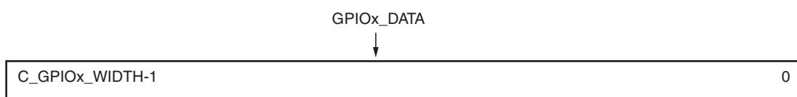
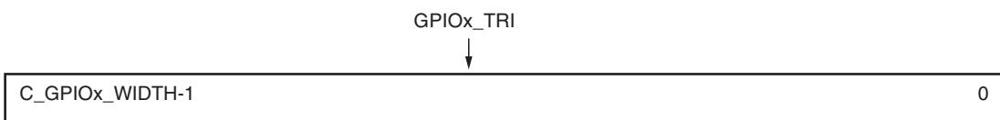
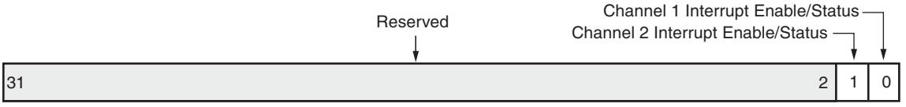
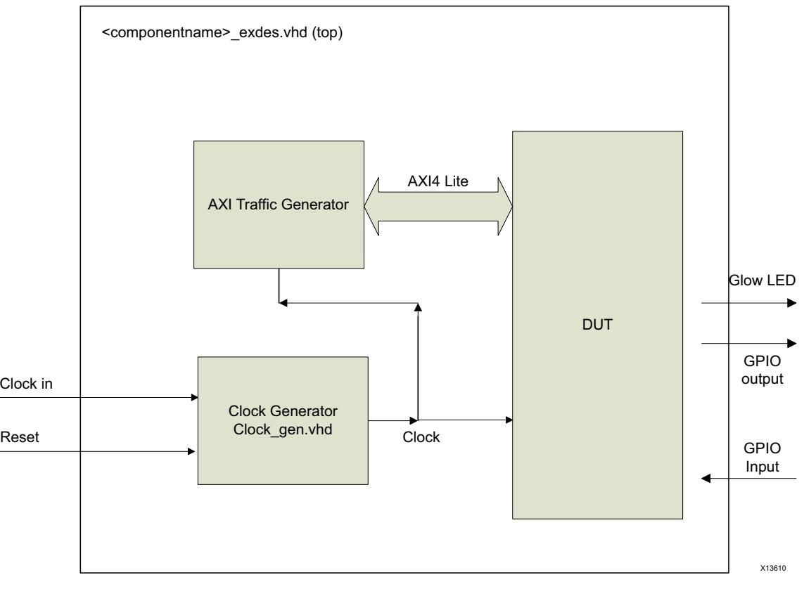
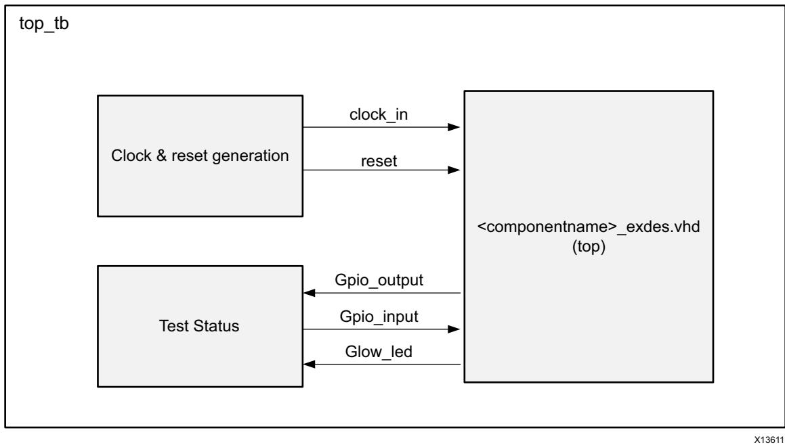

# **AXI GPIO v2.0**

# *LogiCORE IP Product Guide*

**Vivado Design Suite**

**PG144 October 5, 2016**


# Table of Contents

#### **[IP Facts](#page-3-0)**

#### **[Chapter](#page-4-0) [1:](#page-4-0) [Overview](#page-4-0)**

| Functional Description. 5            |  |
|--------------------------------------|--|
| Applications 6                       |  |
| Licensing and Ordering Information 6 |  |

#### **[Chapter](#page-6-0) [2:](#page-6-0) [Product Specification](#page-6-0)**

| Port Descriptions 9 |  |
|---------------------|--|
| Register Space 10   |  |
| Interrupts 12       |  |

#### **[Chapter](#page-14-0) [3:](#page-14-0) [Designing with the Core](#page-14-0)**

| Operation 15             |  |
|--------------------------|--|
| Programming Sequence. 16 |  |
| Clocking. 16             |  |
| Resets 16                |  |

#### **[Chapter](#page-16-0) [4:](#page-16-0) [Design Flow Steps](#page-16-0)**

| Customizing and Generating the Core 17 |  |
|----------------------------------------|--|
| Constraining the Core 21               |  |
| Simulation 22                          |  |
| Synthesis and Implementation 22        |  |

#### **[Chapter](#page-22-0) [5:](#page-22-0) [Example Design](#page-22-0)**

| Overview 23                         |  |
|-------------------------------------|--|
| Implementing the Example Design. 25 |  |
| Example Design Files 25             |  |
| Test Bench 26                       |  |
| Simulating the Example Design. 27   |  |

#### **[Appendix](#page-27-0) [A:](#page-27-0) [Migrating and Upgrading](#page-27-0)**

| Migrating to the Vivado Design Suite. 28 |  |
|------------------------------------------|--|
| Upgrading in the Vivado Design Suite 28  |  |


#### **[Appendix](#page-28-0) [B:](#page-28-0) [Debugging](#page-28-0)**

| Finding Help on Xilinx.com 29        |  |
|--------------------------------------|--|
| Vivado Design Suite Debug Feature 30 |  |
| Hardware Debug 31                    |  |
| AXI4-Lite Interface Debug 31         |  |

#### **[Appendix](#page-31-0) [C:](#page-31-0) [Additional Resources and Legal Notices](#page-31-0)**

| Xilinx Resources 32                     |  |
|-----------------------------------------|--|
| References 32                           |  |
| Revision History 33                     |  |
| Please Read: Important Legal Notices 34 |  |


# **Introduction**

The Xilinx® LogiCORE™ IP AXI General Purpose Input/Output (GPIO) core provides a general purpose input/output interface to the AXI interface. This 32-bit soft Intellectual Property (IP) core is designed to interface with the AXI4-Lite interface.

# **Features**

- Supports the AXI4-Lite interface specification
- Supports configurable single or dual GPIO channel(s)
- Supports configurable channel width for GPIO pins from 1 to 32 bits
- Supports dynamic programming of each GPIO bit as input or output
- Supports individual configuration of each channel
- Supports independent reset values for each bit of all registers
- Supports optional interrupt request generation

<span id="page-3-0"/>

| LogiCORE IP Facts Table                           |                                                                                         |  |  |  |  |
|---------------------------------------------------|-----------------------------------------------------------------------------------------|--|--|--|--|
| Core Specifics                                    |                                                                                         |  |  |  |  |
| Supported<br>Device Family(1)                     | UltraScale+™<br>UltraScale™<br>Zynq®-7000 All Programmable SoC,<br>7 Series FPGAs       |  |  |  |  |
| Supported User<br>Interfaces                      | AXI4-Lite                                                                               |  |  |  |  |
| Resources                                         | See Table 2-2                                                                           |  |  |  |  |
| Provided with Core                                |                                                                                         |  |  |  |  |
| Design Files                                      | VHDL                                                                                    |  |  |  |  |
| Example Design                                    | VHDL                                                                                    |  |  |  |  |
| Test Bench                                        | VHDL                                                                                    |  |  |  |  |
| Constraints File                                  | Xilinx Design Constraints (XDC)                                                         |  |  |  |  |
| Simulation<br>Model                               | Not Provided                                                                            |  |  |  |  |
| Supported<br>S/W Driver(2)                        | Standalone and Linux                                                                    |  |  |  |  |
|                                                   | Tested Design Flows(3)                                                                  |  |  |  |  |
| Design Entry                                      | Vivado® Design Suite                                                                    |  |  |  |  |
| Simulation                                        | For a list of supported simulators, see the<br>Xilinx Design Tools: Release Notes Guide |  |  |  |  |
| Synthesis                                         | Vivado Synthesis                                                                        |  |  |  |  |
| Support                                           |                                                                                         |  |  |  |  |
| Provided by Xilinx at the Xilinx Support web page |                                                                                         |  |  |  |  |
|                                                   |                                                                                         |  |  |  |  |

#### **Notes:**

- <span id="page-3-1"/>1. For a complete list of supported devices, see the Vivado IP catalog.
- <span id="page-3-2"/>2. Standalone driver details can be found in the software development kit (SDK) directory

<install_directory>/SDK/<release>/data/embeddedsw/doc/x ilinx_drivers.htm)

Linux OS and driver support information is available from the [Linux GPIO Driver page](http://www.wiki.xilinx.com/Linux+GPIO+Driver)[.](http://wiki.xilinx.com)

- <span id="page-3-3"/>3. For the supported versions of the tools, see the [Xilinx Design Tools: Release Notes Guide](http://www.xilinx.com/cgi-bin/docs/rdoc?v=2016.3;t=vivado+release+notes).


*Chapter 1*


# <span id="page-4-0"/>Overview

<span id="page-4-2"/>X-Ref Target - Figure 1-1

## <span id="page-4-1"/>**Functional Description**

The AXI GPIO design provides a general purpose input/output interface to an AXI4-Lite interface. The AXI GPIO can be configured as either a single or a dual-channel device. The width of each channel is independently configurable.

The ports are configured dynamically for input or output by enabling or disabling the 3-state buffer. The channels can be configured to generate an interrupt when a transition on any of their inputs occurs.

The top-level block diagram of AXI GPIO core is shown in [Figure](#page-4-2) [1-1.](#page-4-2)


*Figure 1-1:* **AXI GPIO Block Diagram**


### **AXI4-Lite Interface**

The AXI4-Lite Interface module implements a 32-bit AXI4-Lite slave interface for accessing GPIO channel registers. For additional details about the AXI4-Lite slave interface, see the specification usage section of the *AXI4-Lite IPIF LogiCORE IP Product Guide* (PG155) [\[Ref](#page-31-3) [1\](#page-31-3).

### **Interrupt Control**

Interrupt control gets the interrupt status from GPIO channels and generates an interrupt to host. It is enabled when the **Enable Interrupt** option is set in the Vivado® Integrated Design Environment (IDE).

### **GPIO Core**

The GPIO core consists of registers and multiplexers for reading and writing the AXI GPIO channel registers. It also includes the necessary logic to identify an interrupt event when the channel input changes.

The 3-state buffers in the figure are not actually part of the core. The 3-state buffers are automatically added in top level design wrapper file, when you generate the output product in the Vivado Design Suite.

## <span id="page-5-0"/>**Applications**

The General Purpose Input/output (GPIO) core is an interface that provides an ease of access to the internal properties of the device. Similarly this core can be used to control the behavior of external devices.

## <span id="page-5-1"/>**Licensing and Ordering Information**

This Xilinx® LogiCORE™ IP module is provided at no additional cost with the Xilinx Vivado Design Suite under the terms of the [Xilinx End User License](http://www.xilinx.com/cgi-bin/docs/rdoc?d=end-user-license-agreement.txt).

Information about this and other Xilinx LogiCORE IP modules is available at the [Xilinx](http://www.xilinx.com/products/intellectual-property.html)  [Intellectual Property](http://www.xilinx.com/products/intellectual-property.html) page. For information on pricing and availability of other Xilinx LogiCORE IP modules and tools, contact your [local Xilinx sales representative](http://www.xilinx.com/about/contact.html).

## *Chapter 2*


# <span id="page-6-0"/>Product Specification

Performance characterization of the AXI GPIO core has been done using the margin system methodology. The details of the margin system characterization are described in the "Vivado IP Optimization (Fmax Characterization)" appendix in the *Vivado Design Suite User Guide: Designing with IP* (UG896) [\[Ref](#page-31-4) [2\](#page-31-4).

The summary of performance FMAX is shown in [Table](#page-6-1) [2-1.](#page-6-1)

*Note:* Performance numbers for Zynq®-7000 and UltraScale™ devices are expected to be similar to 7 series device numbers.

| Family    | Speed Grade | Fmax (MHz)<br>AXI4-Lite |  |  |
|-----------|-------------|-------------------------|--|--|
| Virtex®-7 |             | 180                     |  |  |
| Kintex®-7 | -1          | 180                     |  |  |
| Artix®-7  |             | 120                     |  |  |
| Virtex-7  | -2          | 200                     |  |  |
| Kintex-7  |             | 200                     |  |  |
| Artix-7   |             | 140                     |  |  |
| Virtex-7  |             | 220                     |  |  |
| Kintex-7  | -3          | 220                     |  |  |
| Artix-7   |             | 160                     |  |  |

<span id="page-6-1"/>

| Table 2-1:<br>7 Series Performance Characterizations |
|------------------------------------------------------|
|------------------------------------------------------|


[Table](#page-7-1) [2-2](#page-7-1) shows the resource utilization for AXI GPIO for 7 series FPGAs. These values were generated using the Vivado® Design Suite.

*Note:* Resource utilization numbers for Zynq-7000 devices and UltraScale architecture are expected to be similar to 7 series FPGAs.

| Parameter Values (Other Parameters at Default Value) |                  |            | Device Resources    |        |            |      |
|------------------------------------------------------|------------------|------------|---------------------|--------|------------|------|
| Enable Dual<br>Channel                               | Enable Interrupt | GPIO Width | GPIO2 GPIO<br>Width | Slices | Flip-Flops | LUTs |
| 0                                                    | 0                | 32         | 32                  | 34     | 174        | 124  |
| 0                                                    | 0                | 16         | 32                  | 21     | 94         | 72   |
| 0                                                    | 1                | 32         | 16                  | 40     | 179        | 135  |
| 0                                                    | 1                | 32         | 32                  | 36     | 179        | 135  |
| 0                                                    | 1                | 1          | 1                   | 9      | 24         | 28   |
| 1                                                    | 0                | 32         | 32                  | 66     | 302        | 230  |
| 1                                                    | 0                | 1          | 1                   | 8      | 23         | 25   |
| 1                                                    | 0                | 5          | 28                  | 40     | 174        | 134  |
| 1                                                    | 0                | 28         | 5                   | 41     | 174        | 131  |
| 1                                                    | 1                | 32         | 32                  | 65     | 307        | 249  |
| 1                                                    | 1                | 15         | 28                  | 52     | 219        | 171  |
| 1                                                    | 1                | 1          | 1                   | 12     | 28         | 33   |

<span id="page-7-1"/><span id="page-7-0"/>*Table 2-2:* **Resource Utilization for 7 Series FPGAs**


## <span id="page-8-0"/>**Port Descriptions**

The AXI GPIO I/O signals are listed and described in [Table](#page-8-4) [2-3.](#page-8-4)

| Signal Name          | Interface | I/O | Initial<br>State | Description                                                                                                                                           |
|----------------------|-----------|-----|------------------|-------------------------------------------------------------------------------------------------------------------------------------------------------|
| s_axi_aclk           | Clock     | I   |                  | AXI Clock.                                                                                                                                            |
| s_axi_aresetn        | Reset     | I   |                  | AXI Reset, active-Low.                                                                                                                                |
| s_axi_*              | S_AXI     | NA  | -                | AXI4-Lite Slave Interface signals.<br>See Appendix A of the Vivado AXI Reference Guide (UG1037)<br>[Ref 3] for AXI4, AXI4-Lite and AXI Stream Signals |
| ip2intc_irpt         | System    | O   | 0                | AXI GPIO Interrupt. active-High, level sensitive signal.                                                                                              |
| gpio_io_i (1)(3)     | GPIO      | I   |                  | Channel 1 general purpose input pins.                                                                                                                 |
|                      |           |     |                  | Width of this port is configurable based on GPIO Width.                                                                                               |
| gpio_io_o(2)(3)(4)   | GPIO      | O   | 0                | Channel 1 general purpose output pins.                                                                                                                |
|                      |           |     |                  | Width of this port is configurable based on GPIO Width.                                                                                               |
| gpio_io_t(4)<br>GPIO |           | O   | 1                | Channel 1 general purpose 3-state pins.                                                                                                               |
|                      |           |     |                  | Width of this port is configurable based on GPIO Width.                                                                                               |
| gpio2_io_i(1)(3)     | GPIO      | I   |                  | Channel 2 general purpose input pins.                                                                                                                 |
|                      |           |     |                  | Width of this port is configurable based on GPIO2 Width.                                                                                              |
| gpio2_io_o(2)(3)(4)  | GPIO      | O   | 0                | Channel 2 general purpose output pins.                                                                                                                |
|                      |           |     |                  | Width of this port is configurable based on GPIO2 Width.                                                                                              |
| gpio2_io_t(4)        | GPIO      | O   | 1                | Channel 2 general purpose 3-state pins                                                                                                                |
|                      |           |     |                  | Width of this port is configurable based on GPIO2 Width.                                                                                              |

<span id="page-8-4"/>*Table 2-3:* **AXI GPIO Signal Description** 

#### **Notes:**

<span id="page-8-1"/>1. If only input ports are needed, you can edit the ports in the block diagram, and declare at port interface level.

<span id="page-8-3"/>2. If only output ports are needed, you can get these ports to port interface.

- <span id="page-8-2"/>3. By default, the Vivado Design Suite (IP integrator) auto inserts a 3-state buffer which is available in the top of the HDL file after you generate the wrapper file.
- <span id="page-8-5"/>4. You can choose the default value of the general purpose outputs (*io_o, *io_t) while customizing the core.


# <span id="page-9-0"/>**Register Space**

*Note:* The AXI4-Lite write access register is updated by the 32-bit AXI Write Data (*_wdata) signal, and is not impacted by the AXI Write Data Strobe (*_wstrb) signal. For a Write, both the AXI Write Address Valid (*_awvalid) and AXI Write Data Valid (*_wvalid) signals should be asserted together. Also see Answer Record [4127](http://www.xilinx.com/support/answers/64127.html).

[Table](#page-9-1) [2-4](#page-9-1) shows the AXI GPIO registers and their addresses.

| Address Space | Register   | Access   | Default | Description                                     |
|---------------|------------|----------|---------|-------------------------------------------------|
| Offset(3)     | Name       | Type     | Value   |                                                 |
| 0x0000        | GPIO_DATA  | R/W      | 0x0     | Channel 1 AXI GPIO Data Register.               |
| 0x0004        | GPIO_TRI   | R/W      | 0x0     | Channel 1 AXI GPIO 3-state Control<br>Register. |
| 0x0008        | GPIO2_DATA | R/W      | 0x0     | Channel 2 AXI GPIO Data Register.               |
| 0x000C        | GPIO2_TRI  | R/W      | 0x0     | Channel 2 AXI GPIO 3-state Control.             |
| 0x011C        | GIER(1)    | R/W      | 0x0     | Global Interrupt Enable Register.               |
| 0x0128        | IP IER(1)  | R/W      | 0x0     | IP Interrupt Enable Register (IP IER).          |
| 0x0120        | IP ISR(1)  | R/TOW(2) | 0x0     | IP Interrupt Status Register.                   |

#### <span id="page-9-1"/>*Table 2-4:* **Registers**

#### **Notes:**

<span id="page-9-2"/>1. Interrupt registers are available only if AXI GPIO is compiled using the **Enable Interrupt** parameter.

<span id="page-9-3"/>2. Toggle-On-Write (TOW) access toggles the status of the bit when a value of 1 is written to the corresponding bit.

<span id="page-9-5"/>3. Address Space Offset is relative to C_BASEADDR assignment.

Depending on the value of certain configuration parameters, some of these registers are removed. A write to an unimplemented register has no effect. An attempt to read the unimplemented register returns an "all zero" value. The register dependencies of these parameters are described in [Table](#page-9-4) [2-5.](#page-9-4)

<span id="page-9-4"/>*Table 2-5:* **AXI Parameter-Register Dependency**

|                 | Register Retainability |           |          |            |           |                            |
|-----------------|------------------------|-----------|----------|------------|-----------|----------------------------|
|                 | Parameters             | GPIO_DATA | GPIO_TRI | GPIO2_DATA | GPIO2_TRI | GIER,<br>IP IER,<br>IP ISR |
| Enable          | 0                      | Yes       | Yes      | No         | No        | NA                         |
| Dual<br>Channel | 1                      | Yes       | Yes      | Yes        | Yes       | NA                         |
| Enable          | 0                      |           | No       |            |           |                            |
| Interrupt       | 1                      | NA        |          |            |           | Yes                        |


<span id="page-10-0"/>X-Ref Target - Figure 2-1

### **AXI GPIO Data Register (GPIOx_DATA)**

The AXI GPIO data register is used to read the general purpose input ports and write to the general purpose output ports. When a port is configured as input, writing to the AXI GPIO data register has no effect.

There are two GPIO data registers (GPIO_DATA and GPIO2_DATA), one corresponding to each channel. The channel 1 data register (GPIO_DATA) is always present; the channel 2 data register (GPIO2_DATA) is present only if the core is configured for dual channel (**Enable Dual Channel = 1**).

The AXI GPIO Data Register is shown in [Figure](#page-10-0) [2-1,](#page-10-0) and [Table](#page-10-1) [2-6](#page-10-1) details the functionality of this register.



*Figure 2-1:* **AXI GPIO Data Register**

<span id="page-10-1"/>

| Table 2-6: |  |  |  | AXI GPIO Data Register Description |
|------------|--|--|--|------------------------------------|
|            |  |  |  |                                    |

| Bits               | Field Name | Access<br>Type | Reset Value                                               | Description                                                                                                                                                                                                                                                                                       |
|--------------------|------------|----------------|-----------------------------------------------------------|---------------------------------------------------------------------------------------------------------------------------------------------------------------------------------------------------------------------------------------------------------------------------------------------------|
| [GPIOx_Width-1 :0] | GPIOx_DATA | Read/Write     | GPIO: Default Output Value<br>GPIO2: Default Output Value | AXI GPIO Data Register.<br>For each I/O bit programmed<br>as input:<br>•<br>R: Reads value on the input<br>pin.<br>•<br>W: No effect.<br>For each I/O bit programmed<br>as output:<br>•<br>R: Reads to these bits<br>always return zeros<br>•<br>W: Writes value to the<br>corresponding AXI GPIO |
|                    |            |                |                                                           | data register bit and output<br>pin.                                                                                                                                                                                                                                                              |


<span id="page-11-1"/>X-Ref Target - Figure 2-2

### **AXI GPIO 3-State Control Register (GPIOx_TRI)**

The AXI GPIO 3-state control register is used to configure the ports dynamically as input or output. When a bit within this register is set, the corresponding I/O port is configured as an input port. When a bit is cleared, the corresponding I/O port is configured as an output port.

There are two AXI GPIO 3-state control registers (GPIO_TRI and GPIO2_TRI), one corresponding to each channel. The channel 2 3-state control register (GPIO2_TRI) is present only if the core is configured for dual channel **Enable Dual Channel = 1**.

The AXI GPIO 3-state control register is shown in [Figure](#page-11-1) [2-2;](#page-11-1) the register function is described in [Table](#page-11-2) [2-7.](#page-11-2)



*Figure 2-2:* **AXI GPIO Three-State Register**

<span id="page-11-2"/>

|  | Table 2-7: | AXI GPIO Three-State Register Description |
|--|------------|-------------------------------------------|
|--|------------|-------------------------------------------|

| Bits               | Field<br>Name | Access<br>Type | Reset Value                                                           | Description                                                                         |
|--------------------|---------------|----------------|-----------------------------------------------------------------------|-------------------------------------------------------------------------------------|
|                    |               |                |                                                                       | AXI GPIO 3-State Control Register.                                                  |
| [GPIOx_Width-1 :0] | GPIOx_TRI     | Read/<br>Write | GPIO: Default Tri State<br>Value<br>GPIO2: Default Tri<br>State Value | Each I/O pin of the AXI GPIO is individually<br>programmable as an input or output. |
|                    |               |                |                                                                       | For each of the bits:                                                               |
|                    |               |                |                                                                       | 0 = I/O pin configured as output.                                                   |
|                    |               |                |                                                                       | 1 = I/O pin configured as input.                                                    |

### <span id="page-11-0"/>**Interrupts**

The AXI GPIO core can be configured under the control of the Enable Interrupt parameter to generate a level interrupt when a transition occurs in any of the channel inputs. The GPIO interface module includes interrupt detection logic to identify any transition on channel inputs. When a transition is detected, it is indicated to the Interrupt Controller module. The Interrupt Controller module implements the necessary registers to enable and maintain the status of the interrupts.


To support interrupt capability for channels, the Interrupt Controller module implements the following registers:

- Global Interrupt Enable Register (GIER) Provides the master enable/disable for the interrupt output to the processor or Interrupt Controller. See [Global Interrupt Enable](#page-12-0)  [](GIER)](#page-12-0|Global%20Interrupt%20Enable)]] for more details.
- IP Interrupt Enable Register (IPIER) Implements the independent interrupt enable bit for each channel. See [](IPISR)](#page-13-0|IP%20Interrupt%20Enable%20(IPIER|[IPIER)%20and%20IP%20Status%20Registers%20(IPISR)) and IP Status Registers (IPISR)]] for more details.
- IP Interrupt Status Register (IPISR) Implements the independent interrupt status bit for each channel. The IP ISR provides Read and Toggle-On-Write access. The Toggle-On-Write mechanism allows interrupt service routines to clear one or more ISR bits using a single write transaction. The IP ISR can also be manually set to generate an interrupt for testing purposes. See [IP Interrupt Enable (IPIER|[IPIER) and IP Status Registers](#page-13-0) and IP Status Registers]]  [(IPISR|[IPISR)](#page-13-0)]] for more details.

### <span id="page-12-0"/>**Global Interrupt Enable Register (GIER)**

The Global Interrupt Enable register provides the master enable/disable for the interrupt output to the processor. This is a single-bit read/write register as shown in [Figure](#page-12-1) [2-3](#page-12-1). This register is valid only if the Enable Interrupt parameter is set.

*Note:* Because this is the master bit to control interrupt generation, it must be set to generate interrupts, even if the interrupts are enabled in the IP Interrupt Enable Register (IP IER). The bit definition for Global Interrupt Enable Register is given in [Table](#page-12-2) [2-8](#page-12-2).


*Figure 2-3:* **Global Interrupt Enable Register**

<span id="page-12-2"/>*Table 2-8:* **Global Interrupt Enable Register Description**

| Bits   | Name                       | Core Access | Reset Value | Description                                                                                                         |
|--------|----------------------------|-------------|-------------|---------------------------------------------------------------------------------------------------------------------|
| 31     | Global Interrupt<br>Enable | Read/Write  | 0           | Master enable for the device interrupt output to<br>the system interrupt controller:<br>0 = Disabled<br>1 = Enabled |
| 30 – 0 | Reserved                   | N/A         | 0           | Reserved. Set to zeros on a read.                                                                                   |

<span id="page-12-1"/>X-Ref Target - Figure 2-3


<span id="page-13-1"/>X-Ref Target - Figure 2-4

### <span id="page-13-0"/>**IP Interrupt Enable (IPIER) and IP Status Registers (IPISR)**

The IP Interrupt Enable Register (IPIER) and IP Interrupt Status Register (IPISR), shown in [Figure](#page-13-1) [2-4,](#page-13-1) provide a bit for each of the interrupts. These registers are valid only if the Enable Interrupt parameter is set.


**IMPORTANT:** *The interrupt enable bits in the IP Interrupt Enable Register have a one-to-one correspondence with the status bits in the IP Interrupt Status Register. The interrupt events are registered in the IP Interrupt Status Register by the AXI4-Lite clock, and therefore the change in the input port must be stable for at least one clock period to guarantee interrupt capture. Each IPISR register bit can be set or cleared through software by the Toggle-On-Write behavior.*

The bit definitions for IP Interrupt Enable Register and IP Interrupt Status Register are given in [Table](#page-13-2) [2-9](#page-13-2) and [Table](#page-13-3) [2-10](#page-13-3) respectively.



*Figure 2-4:* **IP Interrupt Enable and IP Interrupt Status Register**

<span id="page-13-2"/>*Table 2-9:* **IP Interrupt Enable Register Description**

| Bits | Name                       | Core Access | Reset Value | Description                                                         |
|------|----------------------------|-------------|-------------|---------------------------------------------------------------------|
| 31–2 | Reserved                   | N/A         | 0           | Reserved. Set to zeros on a read.                                   |
| 1    | Channel 2 Interrupt Enable | Read/Write  | 0           | Enable Channel 2 Interrupt.<br>0 = Disabled (masked)<br>1 = Enabled |
| 0    | Channel 1 Interrupt Enable | Read/Write  | 0           | Enable Channel 1 Interrupt.<br>0 = Disabled (masked)<br>1 = Enabled |

<span id="page-13-3"/>

| Bits | Name                          | Core Access | Reset<br>Value | Description                                                                                     |
|------|-------------------------------|-------------|----------------|-------------------------------------------------------------------------------------------------|
| 31–2 | Reserved                      | N/A         | 0              | Reserved. Set to zeros on a read.                                                               |
| 1    | Channel 2 Interrupt<br>Status | Read/TOW(1) | 0              | Channel 2 Interrupt Status<br>0 = No Channel 2 input interrupt<br>1 = Channel 2 input interrupt |
| 0    | Channel 1 Interrupt<br>Status | Read/TOW(1) | 0              | Channel 1 Interrupt Status<br>0 = No Channel 1 input interrupt<br>1 = Channel 1 input interrupt |

**Notes:** 

<span id="page-13-4"/>1. Toggle-On-Write (TOW) access toggles the status of the bit when a value of 1 is written to the corresponding bit.

*Chapter 3*


# <span id="page-14-0"/>Designing with the Core

## <span id="page-14-1"/>**Operation**

The AXI GPIO can be configured as either a single or a dual–channel device. When both channels are enabled (**Enable Dual Channel = 1**), the width of each channel can be different, as defined by the **GPIO Width** and **GPIO2 GPIO Width** Vivado® Integrated Design Environment (IDE) parameters. GPIOx_IO is the bidirectional bus formed with GPIOx_IO_I, GPIOx_IO_O, and GPIOx_IO_T pins.

The AXI GPIO has a 3-state I/O capability. The GPIOx_TRI register is used to enable the 3-state buffers which enable 3-state outputs on the GPIOx_IO pins. The GPIOx_TRI register is also driven out of the dedicated GPIOx_IO_T output pins. Each of the GPIOx_IO pins has a corresponding bit in the GPIOx_TRI register.

To configure a port as output, the corresponding bit in the GPIOx_TRI register is written as 0. A subsequent write to the GPIOx_DATA register causes the data written to appear on the GPIOx_IO pins for I/Os that are configured as outputs.

To configure a port as input, the corresponding bit in the GPIOx_TRI register is written as 1, thereby disabling the 3-state buffers. An input port takes input from the GPIOx_IO_I signal of the bidirectional (GPIOx_IO) pins.

The GPIOx_DATA and the GPIOx_TRI registers are reset to the values set on the Vivado IDE parameters **GPIO: Default Tri State Value** and **GPIO2: Default Tri State Value** at configuration time.

If the interrupt is enabled, a transition on any input causes a level interrupt. There are independent interrupt enable and interrupt status bits for each channel if dual channel operation is used.


### <span id="page-15-0"/>**Programming Sequence**

The following steps are helpful in accessing the AXI GPIO core.

For input ports when the Interrupt is enabled, follow these steps:

- 1. Configure the port as input by writing the corresponding bit in GPIOx_TRI register with the value of 1.
- 2. Enable the channel interrupt by setting the corresponding bit in the IP Interrupt Enable Register; also enable the global interrupt, by setting bit 31 of the Global Interrupt Register to 1.
- 3. When an interrupt is received, read the corresponding bit in the GPIOx_DATA register. Clear the status in the IP Interrupt Status Register by writing the corresponding bit with the value of 1.

For input ports when the Interrupt is not enabled, use the following steps:

- 1. Configure the port as input by writing the corresponding bit in GPIOx_TRI register with the value of 1.
- 2. Read the corresponding bit in GPIOx_DATA register.

For output ports, use the following steps:

- 1. Configure the port as output by writing the corresponding bit in GPIOx_TRI register with a value of 0.
- 2. Write the corresponding bit in GPIOx_DATA register.

# <span id="page-15-1"/>**Clocking**

The AXI GPIO operates on the s_axi_aclk.

## <span id="page-15-2"/>**Resets**

The AXI GPIO is reset when s_axi_aresetn is asserted. This is an active-Low reset synchronous to s_axi_aclk clock.


# <span id="page-16-2"/><span id="page-16-0"/>Design Flow Steps

This chapter describes customizing and generating the core, constraining the core, and the simulation, synthesis and implementation steps that are specific to this IP core. More detailed information about the standard design flows and the IP integrator can be found in the following Vivado® Design Suite user guides:

- *Vivado Design Suite User Guide: Designing with IP* (UG896) [\[Ref](#page-31-4) [2\](#page-31-4)
- *Vivado Design Suite User Guide: Designing IP Subsystems using IP Integrator* (UG994) [\[Ref](#page-31-6) [4\](#page-31-6)
- *Vivado Design Suite User Guide: Getting Started* (UG910) [\[Ref](#page-31-7) [5\](#page-31-7)
- *Vivado Design Suite User Guide: Logic Simulation* (UG900) [\[Ref](#page-31-8) [6\](#page-31-8)

### <span id="page-16-1"/>**Customizing and Generating the Core**

This section includes information about using the tools in the Xilinx® Vivado Design Suite to customize and generate the core.

If you are customizing and generating the core using the IP integrator, see the *Vivado Design Suite User Guide: Designing IP Subsystems using IP Integrator* (UG994) [\[Ref](#page-31-6) [4\](#page-31-6) for detailed information. IP integrator might auto-compute certain configuration values when validating or generating the design. To check whether the values do change, see the description of the parameter in this chapter. To view the parameter value you can run the validate_bd_design command in the Tcl console.

You can customize the IP for use in your design by specifying values for the various parameters associated with the IP core using the following steps:

- 1. Open a project or create a new project.
- 2. Open **Vivado IP Catalog**.
- 3. In the View by Function pane, expand **Embedded Processing/AXI Peripheral & Low Speed Peripheral** and select **AXI GPIO**.
- 4. Double-click the IP, or select the **Customize IP** command from the toolbar or right-click menu.


For details, see:

- *Vivado Design Suite User Guide: Designing with IP* (UG896) [\[Ref](#page-31-4) [2\](#page-31-4)
- *Vivado Design Suite User Guide: Getting Started* (UG910) [\[Ref](#page-31-7) [5\](#page-31-7).

*Note:* Figures in this chapter are illustrations of the Vivado Integrated Design Environment (IDE). This layout might vary from the current version.

*Figure 4-1:* **AXI GPIO**

The AXI GPIO Customize IP window includes these options:

#### *GPIO*

#### **All Inputs**

This option sets this GPIO channel bits in input mode only. By default, the option is unchecked.

#### **All Outputs**

This option sets this GPIO channel bits in output mode only. By default, the option is unchecked.


#### **GPIO Width**

The value defines the bit width of the GPIO channel. Its value can be from 1 to 32, and default value is 32.

#### **Default Output Value**

Sets the default value of all the enabled bits of this channel. By default, this parameter is set to 0x0.

#### **Default Tri State Value**

This value configures the input or output mode of each bit of GPIO channel. By default, this field has 0xFFFFFFFF, configuring all GPIO bits in input mode.

#### *Enable Dual Channel*

This parameter enables a second GPIO channel (GPIO2). By default, this parameter is unchecked, configuring AXI GPIO in Single channel mode. when this parameter is enabled, GPIO2 options are activated, and also configures Channel-2 (GPIO2) registers.

#### *GPIO2*

These fields get activated only when **Enable Dual Channel** is checked. All the fields in this parameter group are similar to the GPIO option group.

#### *Enable Interrupt*

This parameter enables interrupt control logic and interrupt registers in GPIO module. By default, the option is unchecked, that is, interrupts are not enabled.


### **User Parameters**

[Table](#page-19-0) [4-1](#page-19-0) shows the relationship between the fields in the Vivado Integrated Design Environment (IDE) and the User Parameters (which can be viewed in the Tcl Console).

<span id="page-19-0"/>*Table 4-1:* **Vivado IDE Parameter to User Parameter Relationship**

| Vivado IDE Parameter/Value           | User Parameter/Value | Default Value |  |
|--------------------------------------|----------------------|---------------|--|
| GPIO                                 |                      |               |  |
| All Inputs                           | C_ALL_INPUTS         | 0             |  |
| 0                                    |                      |               |  |
| 1                                    |                      |               |  |
| All Outputs                          | C_ALL_OUTPUTS        | 0             |  |
| 0                                    |                      |               |  |
| 1                                    |                      |               |  |
| GPIO Width                           | C_GPIO_WIDTH         | 32            |  |
| Ranges from 1 to 32                  |                      |               |  |
| Default Output Value                 | C_DOUT_DEFAULT       | 0x00000000    |  |
| Ranges from 0x00000000 to 0xFFFFFFFF |                      |               |  |
| Default Tri-State Value              | C_TRI_DEFAULT        | 0xFFFFFFFF    |  |
| Ranges from 0x00000000 to 0xFFFFFFFF |                      |               |  |
| Enable Dual Channel                  | C_IS_DUAL            | 0             |  |
| 0                                    |                      |               |  |
| 1                                    |                      |               |  |
| GPIO-2                               |                      |               |  |
| All Inputs                           | C_ALL_INPUTS_2       | 0             |  |
| 0                                    |                      |               |  |
| 1                                    |                      |               |  |
| All Outputs                          | C_ALL_OUTPUTS_2      | 0             |  |
| 0                                    |                      |               |  |
| 1                                    |                      |               |  |
| GPIO Width                           | C_GPIO2_WIDTH        | 32            |  |
| Ranges from 1 to 32                  |                      |               |  |
| Default Output Value                 | C_DOUT_DEFAULT_2     | 0x00000000    |  |
| Ranges from 0x00000000 to 0xFFFFFFFF |                      |               |  |
| Default Tri-State Value              | C_TRI_DEFAULT_2      | 0xFFFFFFFF    |  |
| Ranges from 0x00000000 to 0xFFFFFFFF |                      |               |  |
| Enable Interrupt                     | C_INTERRUPT_PRESENT  | 0             |  |
| 0                                    |                      |               |  |
| 1                                    |                      |               |  |


### **Output Generation**

For details, see the *Vivado Design Suite User Guide: Designing with IP* (UG896) [\[Ref](#page-31-4) [2\](#page-31-4).

# <span id="page-20-0"/>**Constraining the Core**

Constraints are delivered when the IP is generated.

### **Required Constraints**

This section is not applicable for this IP core.

### **Device, Package, and Speed Grade Selections**

This section is not applicable for this IP core.

### **Clock Frequencies**

This section is not applicable for this IP core.

### **Clock Management**

This section is not applicable for this IP core.

### **Clock Placement**

This section is not applicable for this IP core.

### **Banking**

This section is not applicable for this IP core.

### **Transceiver Placement**

This section is not applicable for this IP core.

### **I/O Standard and Placement**

This section is not applicable for this IP core.


# <span id="page-21-0"/>**Simulation**

For comprehensive information about Vivado simulation components, as well as information about using supported third-party tools, see the *Vivado Design Suite User Guide: Logic Simulation* (UG900) [\[Ref](#page-31-8) [6\](#page-31-8).


**IMPORTANT:** *For cores targeting 7 series or Zynq®-7000 devices, UNIFAST libraries are not supported. Xilinx IP is tested and qualified with UNISIM libraries only.*

# <span id="page-21-1"/>**Synthesis and Implementation**

For details about synthesis and implementation, see the *Vivado Design Suite User Guide: Designing with IP* (UG896) [\[Ref](#page-31-4) [2\](#page-31-4)


# <span id="page-22-0"/>Example Design

This chapter contains information about the example design provided in the Vivado® Design Suite.

## <span id="page-22-1"/>**Overview**

<span id="page-22-2"/>X-Ref Target - Figure 5-1

The top module instantiates all components of the core and example design that are needed to implement the design in hardware, as shown in [Figure](#page-22-2) [5-1](#page-22-2). This includes the clock generator (clocking wizard), register configuration, data generator, and data checker modules.



*Figure 5-1:* **Block Diagram of Example Design**


- **Clock generator:** Clocking wizard is used to generate the clocks for the example design. MMCME2 is used to generate 100 MHz clock for s_axi_aclk. Device Under Test (DUT) and other modules of the example design are kept under reset until MMCME2 is locked.
- **AXI Traffic Generator (ATG):** This module (IP) is configured in System Test Mode. All the AXI_GPIO related AXI4-Lite transactions are stored in the Coefficient file extension (COE) or Memory Initialization File (MIF) file. For more information, see the *AXI Traffic Generator LogiCORE IP Product Guide* (PG125) [\[Ref](#page-31-9) [7\](#page-31-9) The ATG automatically starts the AXI4-Lite transaction after coming out of reset.

For Tri and output mode, the example design demonstrates the GPIO register programming sequence and subsequent core behavior. In this case, ATG writes value 0xAAAAAAAA to 0x00 register. The gpio_output pins are connected to onboard LEDs of the KC705 board as follows. Because the KC705 board has only eight LEDs onboard, only seven GPIO output pins are connected to LEDs.

- ° gpio_output(0) = GPIO_LED_0
- ° gpio_output(1) = GPIO_LED_1
- ° gpio_output(2) = GPIO_LED_2
- ° gpio_output(3) = GPIO_LED_3
- ° gpio_output(4) = GPIO_LED_4
- ° gpio_output(5) = GPIO_LED_5
- ° gpio_output(6) = GPIO_LED_6
- ° glow_led = GPIO_LED_7
- On successful completion of ATG write transactions to GPIO registers, alternate LEDs glow.
- In case of any failure, the LEDs would not glow.

For input mode, gpio_input pins are connected to DIP switches of KC705 as follows.

- ° gpio_input(0) = GPIO_DIP_SW0
- ° gpio_input(1) = GPIO_DIP_SW1
- ° gpio_input(2) = GPIO_DIP_SW2
- ° gpio_input(3) = GPIO_DIP_SW3

You must provide stimulus as 0xA to these input pins, such as:

- ° gpio_input(0) = 0
- ° gpio_input(1) = 1
- ° gpio_input(2) = 0


- ° gpio_input(3) = 1
- On completion of a successful transaction, the GPIO_LED_7 glows.
- In case of a failure, the GPIO_LED_7 does not glow.

## <span id="page-24-0"/>**Implementing the Example Design**

After following the steps described in [Chapter](#page-16-2) [4, Design Flow Steps](#page-16-2) to generate the core, implement the example design as follows:

- 1. Right-click the core in the Hierarchy window, and select **Open IP Example Design**.
- 2. When a new window pops up, asking you to specify a directory for the example design. select a new directory or keep the default directory.

A new project is automatically created in the selected directory and it is opened in a new Vivado window.

- 3. Provide the location constraints as per the board.
- 4. In the Flow Navigator (left-side pane), click **Run Implementation** and follow the directions.

## <span id="page-24-1"/>**Example Design Files**

[Table](#page-24-2) [5-1](#page-24-2) shows the files delivered as part of the example design.

<span id="page-24-2"/>*Table 5-1:* **Example Design Files**

| Name                                        | Description                                                                                      |
|---------------------------------------------|--------------------------------------------------------------------------------------------------|
| <component_name>_exdes.vhd</component_name> | Top-level HDL file for the example design.                                                       |
| clock_gen.vhd                               | Clock generation module for example design.                                                      |
| atg_addr.coe                                | COE file of address. This file contains the axi_gpio<br>register address.                        |
| atg_data.coe                                | COE file of data. This file contains the data to be<br>written/read from the axi_gpio registers. |
| atg_mask.coe                                | COE file to mask certain reads.                                                                  |
| atg_ctrl.coe                                | COE file that contains control information of ATG.                                               |

[Table](#page-25-1) [5-2](#page-25-1) lists the example demonstration test bench file delivered with the example design.


#### <span id="page-25-1"/>*Table 5-2:* **Example Demonstration Test Bench File**

| Name                                           | Description          |
|------------------------------------------------|----------------------|
| <component_name>_exdes_tb.vhd</component_name> | Test Bench for Exdes |

[Table](#page-25-2) [5-3](#page-25-2) lists the example design constraint file delivered with the example design.

#### <span id="page-25-2"/>*Table 5-3:* **Example Design Constraints File**

| Name                                        | Description                                        |
|---------------------------------------------|----------------------------------------------------|
| <component_name>_exdes.xdc</component_name> | Top level constraints file for the example design. |

The XDC has all the necessary constraints needed to run the example design on the KC705 board. All the I/O constraints are commented in the XDC file.


**TIP:** *Uncomment all I/O constraints in the XDC file before implementing the design for a KC705 board.*

# <span id="page-25-0"/>**Test Bench**

<span id="page-25-3"/>X-Ref Target - Figure 5-2

This section contains information about the test bench provided in the Vivado Design Suite.

[Figure](#page-25-3) [5-2](#page-25-3) shows test bench for AXI GPIO example design. The top-level test bench generates a 200 MHz differential and drives initial reset to the example design.



*Figure 5-2:* **AXI GPIO Example Design Test Bench**


# <span id="page-26-0"/>**Simulating the Example Design**

Using the AXI GPIO example design (delivered as part of the AXI GPIO), you can quickly simulate and observe the behavior of the AXI GPIO.

### **Setting up the Simulation**

The Xilinx simulation libraries must be mapped into the simulator. To set up the Xilinx simulation models, see the *Vivado Design Suite User Guide: Logic Simulation* (UG900) [\[Ref](#page-31-8) [6\](#page-31-8) To switch simulators, click Simulation Settings in the Flow Navigator (left pane). In the Simulation options list, change Target Simulator.

The example design supports functional (behavioral) and post-synthesis simulations. For how to run simulation, see the *Vivado Design Suite User Guide: Logic Simulation* (UG900) [\[Ref](#page-31-8) [6\](#page-31-8).

### **Simulation Results**

The simulation script compiles the AXI GPIO example design, and supporting simulation files. It then runs the simulation and checks that it completed successfully.

If the test passes, the following message is displayed:

```
Test Completed Successfully
```
If the test fails or hangs, the following message is displayed:

Test Failed ! Test Timed Out !

# *Appendix A*


# <span id="page-27-0"/>Migrating and Upgrading

This appendix contains information about migrating a design from ISE® Design Suite to the Vivado® Design Suite, and for upgrading to a more recent version of the IP core. For customers upgrading in the Vivado Design Suite, important details (where applicable) about any port changes and other impact to user logic are included.

## <span id="page-27-1"/>**Migrating to the Vivado Design Suite**

For information on migrating to the Vivado Design Suite, see *ISE to Vivado Design Suite Migration Methodology Guide* (UG911) [\[Ref](#page-31-10) [8\](#page-31-10)

# <span id="page-27-2"/>**Upgrading in the Vivado Design Suite**

There are no port or parameter changes.


*Appendix B*


# <span id="page-28-0"/>Debugging

This appendix includes details about resources available on the Xilinx Support website and debugging tools.

# <span id="page-28-1"/>**Finding Help on Xilinx.com**

To help in the design and debug process when using the AXI GPIO core, the [Xilinx Support](http://www.xilinx.com/support)  [web page](http://www.xilinx.com/support) contains key resources such as product documentation, release notes, answer records, information about known issues, and links for obtaining further product support.

### **Documentation**

This product guide is the main document associated with the AXI GPIO core. This guide, along with documentation related to all products that aid in the design process, can be found on the [Xilinx Support web page](http://www.xilinx.com/support) or by using the Xilinx Documentation Navigator.

Download the Xilinx Documentation Navigator from the [Downloads page](http://www.xilinx.com/support/download.html). For more information about this tool and the features available, open the online help after installation.

### **Answer Records**

Answer Records include information about commonly encountered problems, helpful information on how to resolve these problems, and any known issues with a Xilinx product. Answer Records are created and maintained daily ensuring that users have access to the most accurate information available.

Answer Records for this core can be located by using the Search Support box on the main [Xilinx support web page](http://www.xilinx.com/support). To maximize your search results, use proper keywords such as

- Product name
- Tool message(s)
- Summary of the issue encountered

A filter search is available after results are returned to further target the results.


#### **Master Answer Record for the AXI GPIO**

AR: [54451](http://www.xilinx.com/support/answers/54451.htm)

### **Technical Support**

Xilinx provides technical support at the [Xilinx Support web page](http://www.xilinx.com/support) for this LogiCORE™ IP product when used as described in the product documentation. Xilinx cannot guarantee timing, functionality, or support if you do any of the following:

- Implement the solution in devices that are not defined in the documentation.
- Customize the solution beyond that allowed in the product documentation.
- Change any section of the design labeled DO NOT MODIFY.

To contact Xilinx Technical Support, navigate to the [Xilinx Support web page](http://www.xilinx.com/support).

## <span id="page-29-0"/>**Vivado Design Suite Debug Feature**

The Vivado® Design Suite debug feature inserts logic analyzer and virtual I/O cores directly into your design. The debug feature also allows you to set trigger conditions to capture application and integrated block port signals in hardware. Captured signals can then be analyzed. This feature in the Vivado IDE is used for logic debugging and validation of a design running in Xilinx devices.

The Vivado logic analyzer is used with the logic debug IP cores, including:

- ILA 2.0 (and later versions)
- VIO 2.0 (and later versions)

Several internal signal are marked as debug signals. These can be easily added to the logic analyzer.

See the *Vivado Design Suite User Guide: Programming and Debugging* (UG908) [Ref 9].


# <span id="page-30-0"/>**Hardware Debug**

Hardware issues can range from link bring-up to problems seen after hours of testing. This section provides debug steps for common issues. The debug feature is a valuable resource to use in hardware debug. The signal names mentioned in the following individual sections can be probed using the debug feature for debugging the specific problems.

Ensure that all the timing constraints for the core were properly incorporated from the example design and that all constraints were met during implementation.

If using mixed-mode clock managers (MMCMs) in the design, ensure that all MMCMs have obtained lock by monitoring the locked port.

# <span id="page-30-1"/>**AXI4-Lite Interface Debug**

Read from a register that does not have all 0s as a default to verify that the interface is functional. Output s_axi_arready asserts when the read address is valid, and output s_axi_rvalid asserts when the read data/response is valid. If the interface is unresponsive, ensure that the following conditions are met:

- The s_axi_aclk is connected and toggling.
- The interface is not being held in reset, and s_axi_areset is an active-Low reset.
- If the simulation has been run, verify in simulation and/or a debug feature capture that the waveform is correct for accessing the AXI4-Lite interface.


*Appendix C*

# <span id="page-31-0"/>Additional Resources and Legal Notices

### <span id="page-31-1"/>**Xilinx Resources**

For support resources such as Answers, Documentation, Downloads, and Forums, see [Xilinx](http://www.xilinx.com/support)  [Support](http://www.xilinx.com/support).

## <span id="page-31-2"/>**References**

<span id="page-31-3"/>These documents provide supplemental material useful with this product guide:

- 1. *AXI4-Lite IPIF LogiCORE IP Product Guide* ([PG155](http://www.xilinx.com/cgi-bin/docs/ipdoc?c=axi_lite_ipif;v=latest;d=pg155-axi-lite-ipif.pdf))
- <span id="page-31-4"/>2. *Vivado Design Suite User Guide: Designing with IP* ([UG896](http://www.xilinx.com/cgi-bin/docs/rdoc?v=latest;d=ug896-vivado-ip.pdf))
- <span id="page-31-5"/>3. *Vivado AXI Reference Guide* ([UG1037](http://www.xilinx.com/cgi-bin/docs/ipdoc?c=axi_ref_guide;v=latest;d=ug1037-vivado-axi-reference-guide.pdf))
- <span id="page-31-6"/>4. *Vivado Design Suite User Guide: Designing IP Subsystems using IP Integrator* ([UG994](http://www.xilinx.com/cgi-bin/docs/rdoc?v=latest;d=ug994-vivado-ip-subsystems.pdf))
- <span id="page-31-7"/>5. *Vivado Design Suite User Guide: Getting Started* ([UG910](http://www.xilinx.com/cgi-bin/docs/rdoc?v=latest;d=ug910-vivado-getting-started.pdf))
- <span id="page-31-8"/>6. *Vivado Design Suite User Guide: Logic Simulation* ([UG900](http://www.xilinx.com/cgi-bin/docs/rdoc?v=latest;d=ug900-vivado-logic-simulation.pdf))
- <span id="page-31-9"/>7. *AXI Traffic Generator LogiCORE IP Product Guide* ([PG125](http://www.xilinx.com/cgi-bin/docs/ipdoc?c=axi_traffic_gen;v=latest;d=pg125-axi-traffic-gen.pdf))
- <span id="page-31-10"/>8. *ISE to Vivado Design Suite Migration Methodology Guide* ([UG911](http://www.xilinx.com/cgi-bin/docs/rdoc?v=latest;d=ug911-vivado-migration.pdf))
- 9. *Vivado Design Suite User Guide: Programming and Debugging* ([UG908](http://www.xilinx.com/cgi-bin/docs/rdoc?v=latest;d=ug908-vivado-programming-debugging.pdf))
- 10. *LogiCORE IP Interrupt Control Product Guide* ([PG166](http://www.xilinx.com/cgi-bin/docs/ipdoc?c=interrupt_control;v=latest;d=pg166-interrupt-control.pdf))
- 11. *AXI Interconnect LogiCORE IP Product Guide* ([PG059](http://www.xilinx.com/cgi-bin/docs/ipdoc?c=axi_interconnect;v=latest;d=pg059-axi-interconnect.pdf))
- 12. [ARM AMBA AXI4 Protocol Version: 2.0 Specification](http://www.arm.com/products/system-ip/amba/amba-open-specifications.php)


## <span id="page-32-0"/>**Revision History**

The following table shows the revision history for this document.

| Date       | Version | Revision                                                                                           |
|------------|---------|----------------------------------------------------------------------------------------------------|
| 10/05/2015 | 2.0     | •<br>Added Automotive Applications Disclaimer.                                                     |
|            |         | •<br>Added AXI4-Lite write access register note to the beginning of the<br>Register Space section. |
| 11/18/2015 | 2.0     | Added support for UltraScale+ families.                                                            |
| 09/30/2015 | 2.0     | •<br>Added User Parameters section to the Design Flow Steps chapter.                               |
|            |         | •<br>Updated the description in Table 2-6: AXI GPIO Data Register<br>Description.                  |
|            |         | •<br>Changed "Vivado lab tools" to "Vivado Design Suite debug feature."                            |
| 04/02/2014 | 2.0     | •<br>Updated GPIO Width name and description.                                                      |
|            |         | •<br>Updated Figure 5-1.                                                                           |
|            |         | •<br>Deleted Example Design Directory Structure section.                                           |
|            |         | •<br>Added Implementing the Example Design section.                                                |
| 12/18/2013 | 2.0     | Added UltraScale™ architecture support.                                                            |
| 10/02/2013 | 2.0     | Re-release of document for core version 2.0, with the following changes:                           |
|            |         | •<br>Combined Resource Utilization numbers for 7 series devices.                                   |
|            |         | •<br>Added example design and test bench information.                                              |
|            |         | •<br>Added support for Vivado IP integrator.                                                       |
| 03/20/2013 | 1.0     | Initial Xilinx release of this product guide. It replaces ds744.                                   |


### <span id="page-33-0"/>**Please Read: Important Legal Notices**

The information disclosed to you hereunder (the "Materials") is provided solely for the selection and use of Xilinx products. To the maximum extent permitted by applicable law: (1) Materials are made available "AS IS" and with all faults, Xilinx hereby DISCLAIMS ALL WARRANTIES AND CONDITIONS, EXPRESS, IMPLIED, OR STATUTORY, INCLUDING BUT NOT LIMITED TO WARRANTIES OF MERCHANTABILITY, NON-INFRINGEMENT, OR FITNESS FOR ANY PARTICULAR PURPOSE; and (2) Xilinx shall not be liable (whether in contract or tort, including negligence, or under any other theory of liability) for any loss or damage of any kind or nature related to, arising under, or in connection with, the Materials (including your use of the Materials), including for any direct, indirect, special, incidental, or consequential loss or damage (including loss of data, profits, goodwill, or any type of loss or damage suffered as a result of any action brought by a third party) even if such damage or loss was reasonably foreseeable or Xilinx had been advised of the possibility of the same. Xilinx assumes no obligation to correct any errors contained in the Materials or to notify you of updates to the Materials or to product specifications. You may not reproduce, modify, distribute, or publicly display the Materials without prior written consent. Certain products are subject to the terms and conditions of Xilinx's limited warranty, please refer to Xilinx's Terms of Sale which can be viewed at <http://www.xilinx.com/legal.htm#tos>; IP cores may be subject to warranty and support terms contained in a license issued to you by Xilinx. Xilinx products are not designed or intended to be fail-safe or for use in any application requiring fail-safe performance; you assume sole risk and liability for use of Xilinx products in such critical applications, please refer to Xilinx's Terms of Sale which can be viewed at [](http://www.xilinx.com/legal.htm#tos.](http://www.xilinx.com/legal.htm#tos.](http://www.xilinx.com/legal.htm#tos) AUTOMOTIVE APPLICATIONS DISCLAIMER

AUTOMOTIVE PRODUCTS (IDENTIFIED AS "XA" IN THE PART NUMBER) ARE NOT WARRANTED FOR USE IN THE DEPLOYMENT OF AIRBAGS OR FOR USE IN APPLICATIONS THAT AFFECT CONTROL OF A VEHICLE ("SAFETY APPLICATION") UNLESS THERE IS A SAFETY CONCEPT OR REDUNDANCY FEATURE CONSISTENT WITH THE ISO 26262 AUTOMOTIVE SAFETY STANDARD ("SAFETY DESIGN"). CUSTOMER SHALL, PRIOR TO USING OR DISTRIBUTING ANY SYSTEMS THAT INCORPORATE PRODUCTS, THOROUGHLY TEST SUCH SYSTEMS FOR SAFETY PURPOSES. USE OF PRODUCTS IN A SAFETY APPLICATION WITHOUT A SAFETY DESIGN IS FULLY AT THE RISK OF CUSTOMER, SUBJECT ONLY TO APPLICABLE LAWS AND REGULATIONS GOVERNING LIMITATIONS ON PRODUCT LIABILITY.

© Copyright 2013–2016 Xilinx, Inc. Xilinx, the Xilinx logo, Artix, ISE, Kintex, Spartan, Virtex, Vivado, Zynq, and other designated brands included herein are trademarks of Xilinx in the United States and other countries. AMBA, AMBA Designer, ARM, ARM1176JZ-S, CoreSight, Cortex, PrimeCell, and MPCore are trademarks of ARM in the EU and other countries. All other trademarks are the property of their respective owners.