# Revision History

The following table shows the revision history for this document.

| Section                                                                                         | Revision Summary                                                                          |  |  |
|-------------------------------------------------------------------------------------------------|-------------------------------------------------------------------------------------------|--|--|
| 06/10/2020 Version 2020.1                                                                       |                                                                                           |  |  |
| Whole document.                                                                                 | Updated GUI screenshots.                                                                  |  |  |
| Creating a Platform Project in the Vitis Software Platform<br>with an XSA from Vivado           | Updated New Application Project settings.                                                 |  |  |
| Running the Standalone CDMA Application Using the Vitis<br>Software Platform                    | Updated New Application Project settings.                                                 |  |  |
| Building an Application and Running it on the Target Board<br>Using the Vitis Software Platform | Updated New Application Project settings.                                                 |  |  |
| Example Design: Debugging the Linux Application Using the<br>Vitis Software Platform            | Updated New Application Project settings.                                                 |  |  |
| Create the First Stage Boot Loader Executable File                                              | Updated New Application Project settings.                                                 |  |  |
| Loading Modules and Executing Applications                                                      | Updated New Application Project settings.                                                 |  |  |
| Creating the Hello World Linux Application to Exercise the<br>OS Aware Debugging Feature        | Updated New Application Project settings.                                                 |  |  |
| 12/05/2019 Version 2019.2                                                                       |                                                                                           |  |  |
| General updates                                                                                 | Added support for the Vitis™ software platform.                                           |  |  |
| 06/06/2018 Version 2017.3                                                                       |                                                                                           |  |  |
| General updates                                                                                 | Verified for 2017.3 version of Vivado® Design Suite, Xilinx®<br>SDK, and PetaLinux Tools. |  |  |


Revision History


# Table of Contents

| Revision History2                                                                    |
|--------------------------------------------------------------------------------------|
| Chapter 1: Introduction 5                                                            |
| About This Guide 5                                                                   |
| How Zynq Devices Simplify Embedded Processor Design 7                                |
| How the Vivado Tools Expedite the Design Process 8                                   |
| What You Need to Set Up Before Starting 8                                            |
| Chapter 2: Using the Zynq SoC Processing System12                                    |
| Embedded System Configuration 12                                                     |
| Example Project: Creating a New Embedded Project with Zynq SoC 12                    |
| Synthesizing the Design, Running Implementation, and Generating the Bitstream 19     |
| Exporting a Hardware Platform 20                                                     |
| Creating a Platform Project in the Vitis Software Platform with an XSA from Vivado21 |
| Example Project: Running the "Hello World" Application 25                            |
| Additional Information 28                                                            |
| Chapter 3: Using the GP Port in Zynq Devices29                                       |
| Adding IP in PL to the Zynq SoC Processing System 29                                 |
| Standalone Application Software for the Design 43                                    |
|                                                                                      |
| Chapter 4: Debugging with the Vitis Software Platform 45                             |
| Xilinx System Debugger 45                                                            |
| Debugging Software Using the Vitis Software Platform 47                              |
|                                                                                      |
| Chapter 5: Using the HP Slave Port with AXI CDMA IP 50                               |
| Integrating AXI CDMA with the Zynq SoC PS HP Slave Port 50                           |
| Standalone Application Software for the Design 55                                    |
| Linux OS Based Application Software for the CDMA System58                            |
| Running Linux CDMA Application Using the Vitis Software Platform60                   |
| Chapter 6: Linux Booting and Debug in the Vitis Software                             |

| Platform72 |  |
|------------|--|


| Requirements 72                                                                  |  |  |
|----------------------------------------------------------------------------------|--|--|
| Booting Linux on a Zynq SoC Board 73                                             |  |  |
| Chapter 7: Creating Custom IP and Device Driver for Linux91                      |  |  |
| Requirements 91                                                                  |  |  |
| Creating Peripheral IP 92                                                        |  |  |
| Integrating Peripheral IP with PS GP Master Port 97                              |  |  |
| Linux-Based Device Driver Development100                                         |  |  |
| Loading Module into Running Kernel and Application Execution 101                 |  |  |
| Chapter 8: Software Profiling Using the Vitis Software Platform 106              |  |  |
| Profiling an Application in the Vitis Software Platform with System Debugger 106 |  |  |
| Additional Design Support Options 108                                            |  |  |
| Chapter 9: Linux OS Aware Debugging Using the Vitis Software                     |  |  |
|                                                                                  |  |  |
| Platform109                                                                      |  |  |
| Setting Up Linux OS Aware Debugging 109                                          |  |  |
| Debugging Linux Processes and Threads Using OS Aware Debug  112                  |  |  |
| Appendix A: Additional Resources and Legal Notices 120                           |  |  |
| Xilinx Resources120                                                              |  |  |
| Solution Centers 120                                                             |  |  |
| Documentation Navigator and Design Hubs 120                                      |  |  |
| Design Files for This Tutorial 121                                               |  |  |
| References121                                                                    |  |  |
| Training Resources122                                                            |  |  |

<span id="page-4-0"/>

# *Chapter 1*

*Chapter 1:* Introduction

# Introduction

# **About This Guide**

This document provides an introduction to using the Xilinx® Vivado® Design Suite flow for using the Zynq®-7000 SoC device. The examples are targeted for the Xilinx ZC702 Rev 1.0 evaluation board and the tools used are the Vivado® Design Suite and the Vitis™ unified software platform.

The examples in this document were created using the Xilinx tools running on Windows 7, 64-bit operating system, and PetaLinux on Linux 64-bit operating system. Other versions of the tools running on other Window installs might provide varied results. These examples focus on introducing you to the following aspects of embedded design.

*Note***:** The sequence mentioned in the tutorial steps for booting Linux on the hardware is specific to the PetaLinux tools released for 2020.1, which must be installed on the Linux host machine for exercising the Linux portions of this document.

### **Document Audience and Scope**

The purpose of this guide is to empower software application developers, system software designers, and system hardware designers by providing the following:

- Tutorials for creating a system with the Zynq-7000 SoC processing system (PS) and the programmable logic (PL)
- Tutorials on booting the Linux OS on the Zynq SoC board and application development with PetaLinux tools
- Tutorials on debugging in the Vitis integrated design environment (IDE)
- System design examples

## **Example Project**

The best way to learn a tool is to use it. So, this guide provides opportunities for you to work with the tools under discussion. Specifications for sample projects are given in the example sections, along with an explanation of what is happening behind the scenes. Each chapter and examples are meant to showcase different aspects of embedded design. The example takes you through the entire flow to complete the learning and then moves on to another topic.


### **Additional Documentation**

### *Vivado Design Suite, System Edition*

Xilinx offers a broad range of development system tools, collectively called the Vivado Design Suite. Various Vivado Design Suite editions can be used for embedded system development. In this guide, you will use the System Edition. The Vivado Design Suite editions are shown in the following figure.

#### *Figure 1:* **Vivado Design Suite Editions**

### *Other Vivado Components*

Other Vivado components include:

- Embedded/Soft IP for the Xilinx embedded processors
- Documentation

<span id="page-6-0"/>

- Sample projects
### *Vitis Unified Software Platform*

The Vitis software platform includes the Vivado Design Suite, and works with hardware designs created in Vivado. The Vitis unified software platform is an integrated development environment (IDE) for the development of embedded software applications targeted towards Xilinx embedded processors. The Vitis software platform is based on the Eclipse open source. For more information about the Eclipse development environment, see<http://www.eclipse.org>.

### *PetaLinux Tools*

The PetaLinux Tools offer everything necessary to customize, build, and deploy embedded Linux solutions on Xilinx processing systems. For more information, see the [Embedded Design Tools](https://www.xilinx.com/support/download/index.html/content/xilinx/en/downloadNav/embedded-design-tools.html) web page.

The PetaLinux Tools design hub provides information and links to documentation specific to the PetaLinux Tools. For more information, see [Embedded Design Hub - PetaLinux Tools.](https://www.xilinx.com/cgi-bin/docs/ndoc?t=design+hubs;d=dh0016-petalinux-tools-hub.html)

# **How Zynq Devices Simplify Embedded Processor Design**

Embedded systems are complex. Hardware and software portions of an embedded design are projects in themselves. Merging the two design components so that they function as one system creates additional challenges. Add an FPGA design project to the mix, and your design has the potential to become complicated.

The Zynq SoC solution reduces this complexity by offering an Arm® Cortex™-A9 dual core, along with programmable logic, all within a single SoC.

To simplify the design process, Xilinx offers the Vivado Design Suite and the Vitis software platform. This set of tools provides you with everything you need to simplify embedded system design for a device that merges an SoC with an FPGA. This combination of tools offers hardware and software application design, debugging capability, code execution, and transfer of the design onto actual boards for verification and validation.


<span id="page-7-0"/>

# **How the Vivado Tools Expedite the Design Process**

You can use the Vivado Design Suite tools to add design sources to your hardware. These include the IP integrator, which simplifies the process of adding IP to your existing project and creating connections for ports (such as clock and reset).

You can accomplish all your hardware system development using the Vivado tools along with IP integrator. This includes specification of the microprocessor, peripherals, and the interconnection of these components, along with their respective detailed configuration.

The Vitis software platform is used for software development, and can be installed and used without any other Xilinx tools installed on the machine on which it is loaded. The Vitis software platform can also be used to debug software applications.

The Zynq SoC Processing System (PS) can be booted and made to run without programming the FPGA (programmable logic or PL). However, in order to use any soft IP in the fabric, or to bond out PS peripherals using EMIO, programming of the PL is required. You can program the PL in the Vitis software platform.

For more information on the embedded design process, see the *Vivado Design Suite Tutorial: Embedded Processor Hardware Design* ([UG940)](https://www.xilinx.com/cgi-bin/docs/rdoc?v=2020.1;d=ug940-vivado-tutorial-embedded-design.pdf) .

# **What You Need to Set Up Before Starting**

Before discussing the tools in depth, you should make sure they are installed properly and your environments match those required for the "Example Project" sections of this guide.

## **Hardware Requirements for this Guide**

This tutorial targets the Zynq ZC702 Rev 1.0 evaluation board, and can also be used for Rev 1.0 boards. To use this guide, you need the following hardware items, which are included with the evaluation board:

- The ZC702 evaluation board
- AC power adapter (12 VDC)
- USB Type-A to USB Mini-B cable (for UART communications)
- USB Type-A to USB Micro cable for programming and debugging via USB-Micro JTAG connection


- SD-MMC flash card for Linux booting
- Ethernet cable to connect target board with host machine

### **Installation Requirements**

### *Vitis Software Platform and Vivado Design Suite*

Ensure that you have both the Vitis software platform and the Vivado Design Suite installed. Visit the [Xilinx Support Page](https://www.xilinx.com/support/download.html) to ensure that you download the latest software version. To install the Vitis software platform, follow the instructions in the Installation section of the *Vitis Unified Software Platform Documentation: Embedded Software Development* ([UG1400)](https://www.xilinx.com/cgi-bin/docs/rdoc?v=2020.1;d=ug1400-vitis-embedded.pdf). When you install the Vitis software platform, the Vivado Design Suite is installed automatically.

To install Vivado by itself, see the *Vivado Design Suite User Guide: Release Notes, Installation, and Licensing* [(UG973](UG973)).

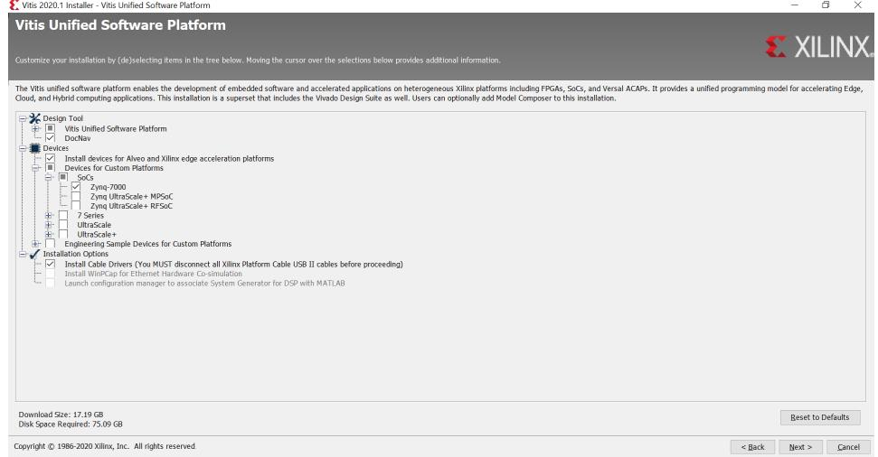

### *Figure 2:* **Vitis Software Platform Installer - Select Development Environment**

### *PetaLinux Tools*

The PetaLinux tool offers a full Linux distribution building system which includes the Linux OS as well as a complete configuration, build, and deploy environment for Xilinx silicon.

Install the PetaLinux Tools to run through the Linux portion of this tutorial. PetaLinux tools run under the Linux host system running one of the following:

- Red Hat Enterprise Workstation/Server 7.4, 7.5, 7.6 (64-bit)
- CentOS Workstation/Server 7.4, 7.5, 7.6 (64-bit)
- Ubuntu Linux Workstation/Server 16.04.5, 16.04.6, 18.04.1, 18.04.02 (64-bit)


This can use either a dedicated Linux host system or a virtual machine running one of these Linux operating systems on your Windows development platform.

When you install PetaLinux Tools on your system of choice, you must do the following:

- Download PetaLinux software (version 2020.1) from the Xilinx Website.
- Install the PetaLinux (version 2020.1) release package.
- Add common system packages and libraries to the workstation or virtual machine. For more details, see the Installation Requirements from the *PetaLinux Tools Documentation: Reference Guide* ([UG1144)](https://www.xilinx.com/cgi-bin/docs/rdoc?v=2020.1;d=ug1144-petalinux-tools-reference-guide.pdf) .

#### **Prerequisites**

- 8 GB RAM (recommended minimum for Xilinx tools)
- 2 GHz CPU clock or equivalent (minimum of 8 cores)
- 100 GB free HDD space

#### **Extract the PetaLinux Package**

By default, the installer installs the package as a subdirectory within the current directory. Alternatively, you can specify an installation path. Run the downloaded PetaLinux installer.

*Note***:** Ensure that the PetaLinux installation path is kept short. The PetaLinux build will fail if the path exceeds 255 characters.

bash> ./petalinux-v2020.1-final-installer.run

PetaLinux is installed in the petalinux-v2020.1-final directory, directly underneath the working directory of this command. If the installer is placed in the home directory /home/user, PetaLinux is installed in /home/user/petalinux-v2020.1-final.

Refer to [Chapter 6: Linux Booting and Debug in the Vitis](#page-71-0) Software Platform for additional information about the PetaLinux environment setup, project creation, and project usage examples. A detailed guide on PetaLinux Installation and usage can be found in the *PetaLinux Tools Documentation: Reference Guide* [(UG1144](UG1144)).

### *Software Licensing*

Xilinx software uses FLEXnet licensing. When the software is first run, it performs a license verification process. If the license verification does not find a valid license, the license wizard guides you through the process of obtaining a license and ensuring that the license can be used with the tools installed. If you do not need the full version of the software, you can use an evaluation license.For installation instructions and information, see the *Vivado Design Suite User Guide: Release Notes, Installation, and Licensing* [(UG973](UG973)).


*Chapter 1:* Introduction


### *Tutorial Design Files*

See [Design Files for This Tutorial](#page-120-0) for information about downloading the design files for this tutorial.


<span id="page-11-0"/>

# *Chapter 2*

*Chapter 2:* Using the Zynq SoC Processing System

# Using the Zynq SoC Processing System

Now that you have been introduced to the Xilinx® Vivado® Design Suite, you will begin looking at how to use it to develop an embedded system using the Zynq®-7000 SoC processing system (PS).

The Zynq SoC consists of Arm® Cortex™-A9 cores, many hard intellectual property components (IPs), and programmable logic (PL). This offering can be used in two ways:

- The Zynq SoC PS can be used in a standalone mode, without attaching any additional fabric IP.
- IP cores can be instantiated in fabric and attached to the Zynq PS as a PS+PL combination.

# **Embedded System Configuration**

Creation of a Zynq device system design involves configuring the PS to select the appropriate boot devices and peripherals. To start with, as long as the PS peripherals and available MIO connections meet the design requirements, no bitstream is required. This chapter guides you through creating a simple PS-based design that does not require a bitstream.

# **Example Project: Creating a New Embedded Project with Zynq SoC**

For this example, you will launch the Vivado Design Suite and create a project with an embedded processor system as the top level.

## **Starting Your Design**

- 1. Start the 2020.1 Vivado Design Suite.
- 2. In the Vivado Quick Start page, click **Create Project** to open the New Project wizard.
- 3. Use the information in the table below to make selections in each of the wizard screens.

<span id="page-12-0"/>

| Wizard Screen       | System Property                                                                                  | Setting or Command to Use     |  |  |
|---------------------|--------------------------------------------------------------------------------------------------|-------------------------------|--|--|
| Project Name        | Project name                                                                                     | edt_tutorial                  |  |  |
|                     | Project Location                                                                                 | C:/designs                    |  |  |
|                     | Create Project Subdirectory                                                                      | Leave this checked            |  |  |
| Project Type        | Specify the type of sources for your<br>design. You can start with RTL or a<br>synthesized EDIF. | RTL Project                   |  |  |
|                     | Do not specify sources at this time<br>check box                                                 | Leave this unchecked.         |  |  |
| Add Sources         | Do not make any changes to this screen.                                                          |                               |  |  |
| Add Constraints     | Do not make any changes to this screen.                                                          |                               |  |  |
| Default Part        | Select                                                                                           | Boards                        |  |  |
|                     | Board                                                                                            | ZYNQ-7 ZC702 Evaluation Board |  |  |
| New Project Summary | Project Summary                                                                                  | Review the project summary.   |  |  |

- 4. Click **Finish**. The New Project wizard closes and the project you just created opens in the Vivado design tool.
### **Creating an Embedded Processor Project**

Perform the following steps to create an embedded processor project.

- 1. In the Flow Navigator, under **IP Integrator**, click **Create Block Design**.

The Create Block Design wizard opens.

- 2. Use the following information to make selections in the Create Block Design wizard.

| Wizard Screen       | System Property    | Setting or Command to Use        |  |  |  |  |  |
|---------------------|--------------------|----------------------------------|--|--|--|--|--|
|                     | Design Name        | tutorial_bd                      |  |  |  |  |  |
| Create Block Design | Directory          | <local project="" to=""></local> |  |  |  |  |  |
|                     | Specify Source Set | Design Sources                   |  |  |  |  |  |

- 3. Click **OK**.
The Diagram window view opens with a message that states that this design is empty. To get started, you will next add some IP from the catalog.

- 4. Click the **Add IP** button .
- 5. In the search box, type zynq to find the Zynq device IP options.
- 6. Double-click the **ZYNQ7 Processing System** IP to add it to the block design.


The Zynq SoC processing system IP block appears in the Diagram view, as shown in the following figure.

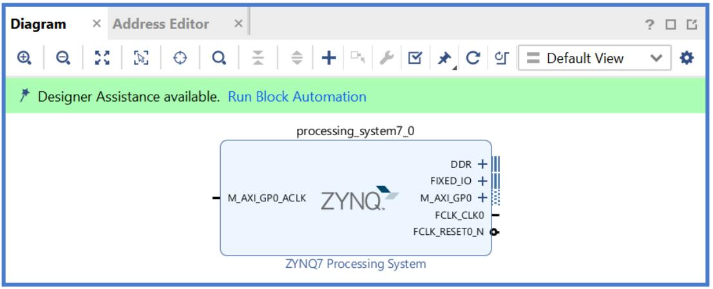

### **Managing the Zynq7 Processing System in Vivado**

Now that you have added the processor system for the Zynq SoC to the design, you can begin managing the available options.

- 1. Double-click the **ZYNQ7 Processing System** block in the Block Diagram window.
The Re-customize IP dialog box opens, as shown in the following figure. Notice that by default, the processor system does not have any peripherals connected.


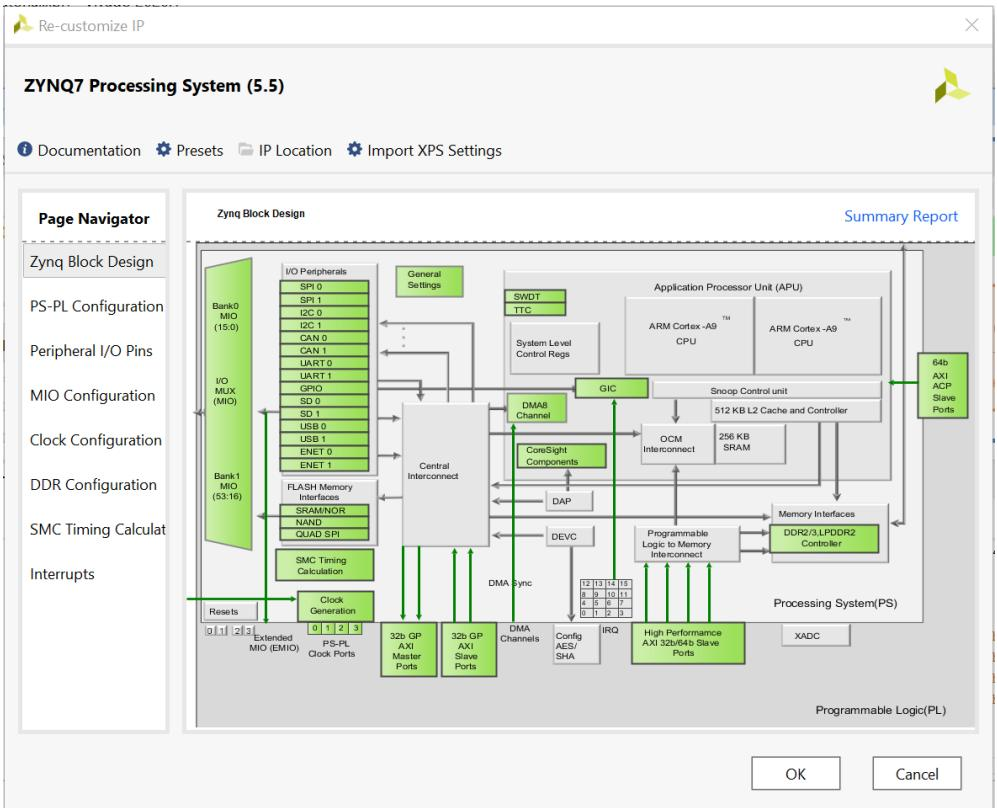

- 2. You will use a preset template created for the ZC702 board. In the Re-customize IP window, click the **Presets** button and select **ZC702**.
This configuration wizard enables many peripherals in the processing system with some multiplexed I/O (MIO) pins assigned to them as per the board layout of the ZC702 board. For example, UART1 is enabled and UART0 is disabled. This is because UART1 is connected to the USB-UART connector through UART to the USB converter chip on the ZC702 board.

Note the check marks that appear next to each peripheral name in the Zynq device block diagram that signify the **I/O Peripherals** that are active.

- 3. In the block diagram, click one of the green I/O Peripherals. The MIO Configuration window opens for the selected peripheral.


- 4. Click **OK** to close the Re-customize IP wizard. Vivado implements the changes that you made to apply the ZC702 board presets.
In the Block Diagram window, notice the message stating that Designer assistance is available, as shown in the following figure.

- 5. Click the **Run Block Automation** link.
The Run Block Automation dialog box opens.

Note that Cross Trigger In and Cross Trigger Out are disabled. For a detailed tutorial with information about cross trigger set-up, refer to the *Vivado Design Suite Tutorial: Embedded Processor Hardware Design* [(UG940](UG940)).

- 6. Click **OK** to accept the default processor system options and make default pin connections.
### **Validating the Design and Connecting Ports**

Now, validate the design.

- 1. Right-click in the white space of the Block Diagram view and select **Validate Design**. Alternatively, you can press the F6 key.
- 2. A critical error message appears, indicating that the M_AXI_GP0_ACLK must be connected.


- 3. Click **OK** to clear the message.
- 4. In the Block Diagram view of the ZYNQ7 Processing System, locate the M_AXI_GP0_ACLK port. Hover your mouse over the connector port until the pencil icon appears.
- 5. Click the **M_AXI_GP0_ACLK** port and drag to the **FCLK_CLK0** input port to make a connection between the two ports.

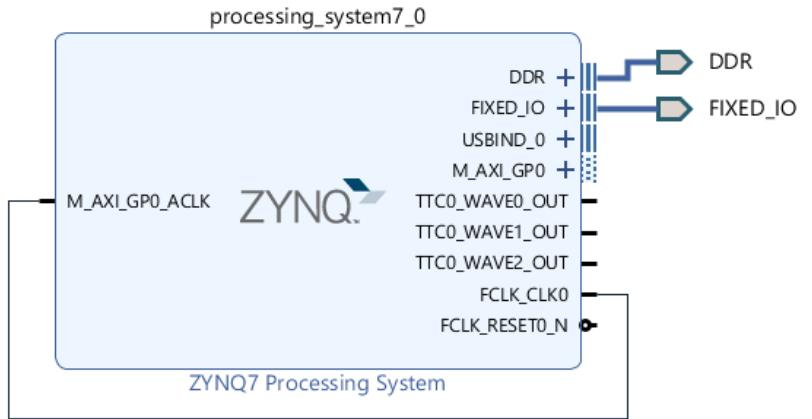

- 6. Validate the design again to ensure there are no other errors. To do this, right-click in the white space of the Block Diagram view and select **Validate Design**.
A message dialog box opens and states "Validation successful. There are no errors or critical warnings in this design".

- 7. Click **OK** to close the message.
- 8. In the Block Design view, click the **Sources** tab.
- 9. Click **Hierarchy**.
- 10. Under **Design Sources**, right-click **tutorial_bd** and select **Create HDL Wrapper**.

The Create HDL Wrapper dialog box opens. You will use this dialog box to create an HDL wrapper file for the processor subsystem.


- **TIP:** *The HDL wrapper is a top-level entity required by the design tools.*
- 11. Select **Let Vivado manage wrapper and auto-update** and click **OK**.
- 12. In the Block Diagram, Sources window, under Design Sources, expand **tutorial_bd_wrapper**.
- 13. Right-click the top-level block diagram, titled **tutorial_bd_i : tutorial_bd (tutorial_bd.bd)** and select **Generate Output Products**.

The Generate Output Products dialog box opens, as shown in the following figure.

If you are running the Vivado Design Suite on a Linux host machine, you might see additional options under Run Settings. In this case, continue with the default settings.

- 14. Click **Generate**.
This step builds all required output products for the selected source. For example, constraints do not need to be manually created for the IP processor system. The Vivado tools automatically generate the XDC file for the processor subsystem when **Generate Output Products** is selected.

- 15. When the Generate Output Products process completes, click **OK**.
- 16. In the Block Diagram Sources window, click the **IP Sources** tab. Here you can see the output products that you just generated, as shown in the following figure.


<span id="page-18-0"/>

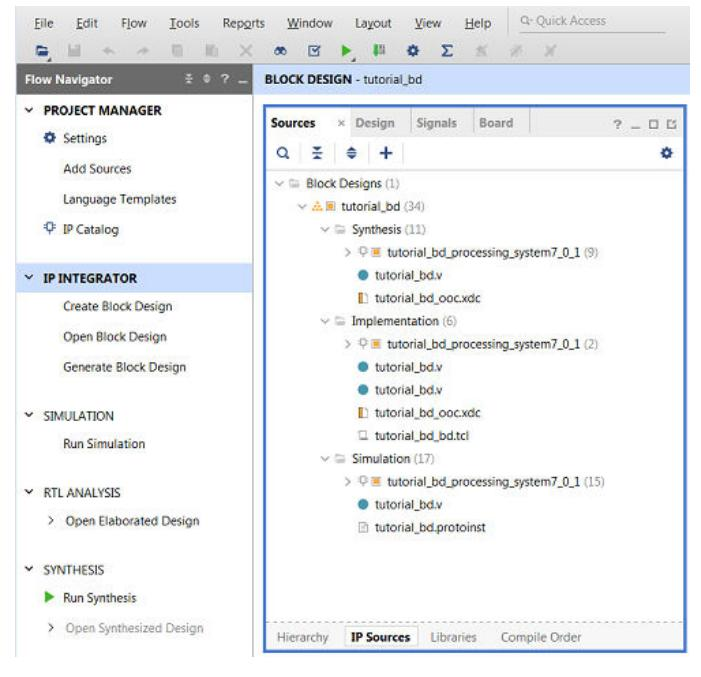

# **Synthesizing the Design, Running Implementation, and Generating the Bitstream**

- 1. You can now synthesize the design. In the Flow Navigator pane, under **Synthesis**, click **Run Synthesis**.
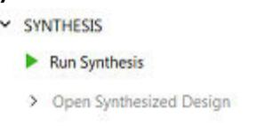

- 2. If Vivado prompts you to save your project before launching synthesis, click **Save**.
While synthesis is running, a status circle displays in the upper right-hand window. This status circle spools for various reasons throughout the design process. The status circle signifies that a process is working in the background.

When synthesis completes, the Synthesis Completed dialog box opens.

- 3. Select **Run Implementation** and click **OK**.
<span id="page-19-0"/>

Again, notice that the status bar describes the process running in the background. When implementation completes, the Implementation Completed dialog box opens.

- 4. Select **Generate Bitstream** and click **OK**.
When Bitstream Generation completes, the Bitstream Generation Completed dialog box opens.

- 5. Click **Cancel** to close the window.
- 6. After the Bitstream generation completes, export the hardware and launch the Vitis unified software platform.

## **Exporting a Hardware Platform**

- 1. From the Vivado main menu, select **File → Export → Export Hardware**. The Export Hardware Platform dialog box opens.
- 2. Use the information in the following table to make selections in each of the wizard screens. Click **Next** wherever necessary.

| Wizard Screen            | System Property | Setting or Command to Use                                                                          |
|--------------------------|-----------------|----------------------------------------------------------------------------------------------------|
|                          | Platform type   | Fixed                                                                                              |
|                          | Output          | Pre-synthesis                                                                                      |
| Export Hardware Platform | Files           | Leave XSA file name as<br>tutorial_bd_wrapper and Export<br>to path as C:/designs/<br>edt_tutorial |

- 3. Click **Finish** as shown in the following figure.

- 
<span id="page-20-0"/>

## **What Just Happened?**

Vivado has exported the hardware design to the hardware specification file (XSA).

### **What's Next?**

Now you can start developing the software for your project using the Vitis software platform. The next sections help you create a software application for your hardware platform.

# **Creating a Platform Project in the Vitis Software Platform with an XSA from Vivado**

- 1. Launch the Vitis IDE by using the desktop shortcut or by double-clicking the C:\Xilinx \Vitis\2020.1\bin\vitis.bat file. The Eclipse Launcher dialog box opens.
- 2. Select the workspace location as C:\designs\workspace or any given location path. The tool creates the workspace folder if it is not already created.

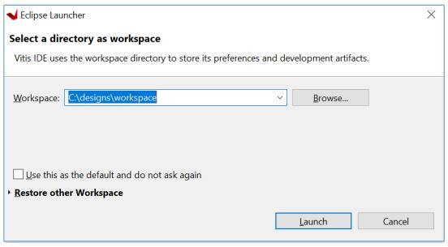

- 3. Click **Launch**. The Vitis integrated design environment (IDE) opens. Click **File → New →  Platform Project** to create platform project from the output of Vivado Xilinx Shell Archive (XSA).
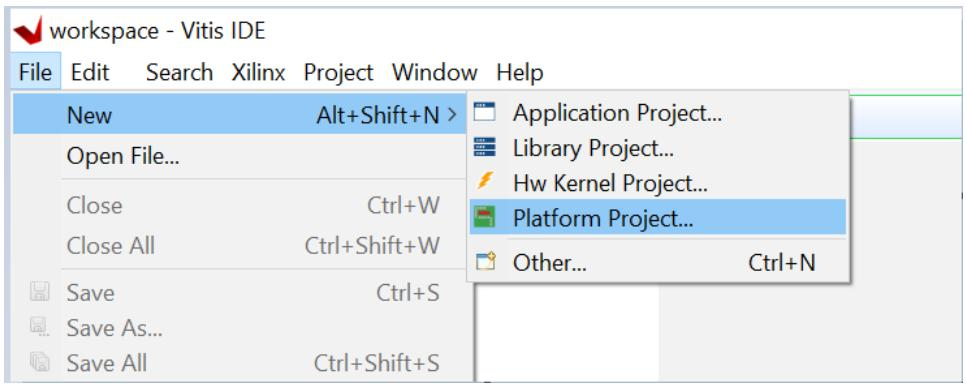

- 4. When the New Platform Project wizard opens, enter the platform project name as hw_platform, as shown in following figure. Click **Next**.


- 5. In **New Platform Project → Platform → Create a new platform from hardware (XSA) →  Hardware Specification**, browse to the hardware specification file and select the XSA file C:\designs\edt_tutorial\tutorial_bd_wrapper.xsa. When the XSA file is selected, the Software Specification fields (Operating system and Processor) are updated to standalone and ps7_cortexa9_0 respectively. Keep the **Generate boot components** option selected, as shown in the following figure. Click **Finish**.

- 6. The platform project is created. Double-click **Project Explorer → hw_platform → platform.spr** to view the platform view as shown in the following figure.


- 7. Expand **Export → hw_platform** to find the exported Hardware Specification file, tutorial_bd_wrapper.xsa, and the top-level platform XML file, hw_platform.xpfm. Double-click on the XSA file to see the address map for the entire processing system, as shown in the following figure.

- 8. Build the platform project either by clicking the hammer icon or by right-clicking on the platform project and selecting **Build Project** as shown in following figure.

- 9. As the project builds, you can see the output in the console window. When the build completes, the Build Finished log appears in the console window as shown in the following figure. The standalone BSP is built and the hw_platform.xpfm file is updated with this build.

- 10. Close the Vitis IDE using the **File → Exit** option.
## **What Just Happened?**

Using the Vitis IDE, you have created a platform project and exported the XSA file to the workspace in C:\designs\workspace. The export operation generated a standalone domain with a ps7_cortexa9_0 processor and an FSBL application project. You have built a platform project, and the generated Xilinx platform definition file (hw_platform.xpfm) can be used as a platform for the applications that you create in the Vitis IDE.

<span id="page-24-0"/>

# **Example Project: Running the "Hello World" Application**

In this example, you will learn how to manage the board settings, make cable connections, connect to the board through your PC, and run a simple "Hello World" software application in JTAG mode using System Debugger in the Vitis IDE.

*Note***:** If you already set up the board, skip to step 5.

- 1. Connect the power cable to the board.
- 2. Connect a USB Micro cable between the Windows Host machine and the Target board with the following SW10 switch settings:
	- Bit-1 is 0
	- Bit-2 is 1

*Note***:** 0 = switch is open. 1 = switch is closed.

- 3. Connect a USB cable to connector **J17** on the target board with the Windows Host machine. This is used for USB to serial transfer.
- 4. Power on the ZC702 board using the switch indicated in the figure below.

**IMPORTANT!** *Ensure that jumpers J27 and J28 are placed on the side farther from the SD card slot and change the SW16 switch setting as shown in the following figure.*


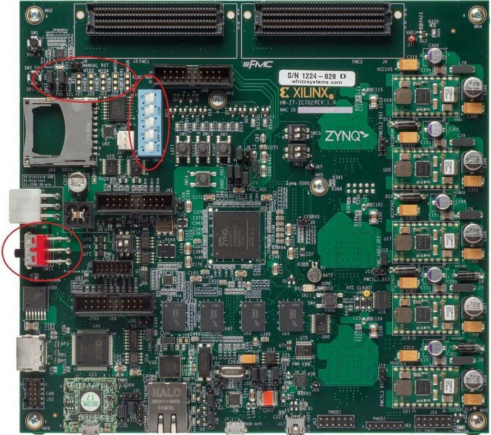

- 5. Open the Vitis software platform and set the workspace path to your project file, which in this example is C:\designs\workspace.
Alternatively, you can open the Vitis software platform with a default workspace and later switch it to the correct workspace by selecting **File → Switch Workspace** and then selecting the workspace.

- 6. Open a serial communication utility for the COM port assigned on your system. The Vitis software platform provides a serial terminal utility, which will be used throughout the tutorial; select **Window → Show View → Terminal** to open it.

- 
7. Click the **Launch Terminal** button to open the Launch Terminal dialog box.

Select **Serial Terminal** for Choose Terminal, add terminal settings, and click **OK**. The following figure shows the standard configuration for the Zynq SoC processing system.


- 8. Select **File → New → Application Project**.
The New Application Project wizard opens. Enable the option **Skip welcome page next time** and click **Next**.

- 9. Use the information in the following table to make your selections in the wizard screens.

| Wizard Screen                  | System Properties                 | Setting or Command to Use                                                                                                  |
|--------------------------------|-----------------------------------|----------------------------------------------------------------------------------------------------------------------------|
| Platform                       | Select a platform from repository | Click hw_platform [custom]. The path should<br>be C:\designs\workspace\hw_platform<br>\export\hw_platform\hw_platform.xpfm |
| Application Project<br>Details | Application project name          | Enter hello_world                                                                                                          |
| Domain                         | Select a domain                   | Click standalone on ps7_cortex9_0.                                                                                         |
| Templates                      | Available Templates               | Hello World                                                                                                                |

The Vitis software platform creates the hello_world application project under the Project Explorer. Right-click on the **hello_world** standalone application and select **Build Project** to generate the hello_world.elf binary file.

- 10. Right-click **hello_world** and select **Run as → Run Configurations**.
- 11. Right-click **Single Application Debug** and click **New Configuration**.

The Vitis software platform creates the new run configuration, named Debugger_hello_world-Default.

The configurations associated with the application are pre-populated in the Main tab of the launch configurations.

- 12. Click the **Target Setup** tab and review the settings. The default choice is the Tcl script.
- 13. Click **Run**.

"Hello World" appears on the serial communication utility in the Terminal, as shown in the following figure.

<span id="page-27-0"/>

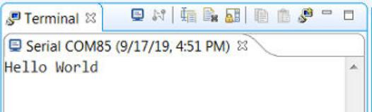

*Note***:** There was no bitstream download required for the above software application to be executed on the Zynq SoC evaluation board. The Arm Cortex-A9 dual core is already present on the board. Basic initialization of this system to run a simple application is done by the device initialization Tcl script.

### **What Just Happened?**

The application software sent the "Hello World" string to the UART1 peripheral of the PS section.

From UART1, the "Hello World" string goes byte-by-byte to the serial terminal application running on the host machine, which displays it as a string.

## **Additional Information**

### **Domain or Board Support Package**

A domain or board support package (BSP) is a collection of software drivers and, optionally, the operating system on which to build your application. It is the support code for a given hardware platform or board that helps in basic initialization at power up and helps software applications to be run on top of it. You can create multiple applications to run on the domain. A domain is tied to a single processor in the platform.

### **Standalone OS**

Standalone is a simple, low-level software layer. It provides access to basic processor features such as caches, interrupts, and exceptions, as well as the basic processor features of a hosted environment. These basic features include standard input/output, profiling, abort, and exit. It is a single threaded semi-hosted environment.


**IMPORTANT!** *The application you ran in this chapter was created on top of the standalone OS. The domain/BSP that your software application targets is selected during the New Platform Project creation process.*

<span id="page-28-0"/>

# *Chapter 3*

*Chapter 3:* Using the GP Port in Zynq Devices

# Using the GP Port in Zynq Devices

One of the unique features of using the Xilinx® Zynq®-7000 SoC as an embedded design platform is in using the Zynq SoC processing system (PS) for its Arm Cortex-A9 dual core processing system as well as the programmable logic (PL) available on it.

In this chapter, you will create a design with:

- AXI GPIO and AXI Timer in fabric (PL) with interrupt from fabric to PS section
- Zynq SoC PS GPIO pin connected to the fabric (PL) side pin using the EMIO interface

The flow of this chapter is similar to that in [Chapter 2: Using the Zynq SoC Processing System](#page-11-0) and uses the Zynq device as a base hardware design. It is assumed that you understand the concepts discussed in [Chapter 2: Using the Zynq SoC Processing System](#page-11-0) regarding adding the Zynq device into a Vivado IP integrator block diagram design. If you skipped that chapter, you might want to look at it because we will continually refer to the material in [Chapter 2: Using the](#page-11-0) [Zynq SoC Processing System](#page-11-0) throughout this chapter.

## **Adding IP in PL to the Zynq SoC Processing System**

There is no restriction on the complexity of an intellectual property (IP) that can be added in fabric to be tightly coupled with the Zynq® SoC PS. This section covers a simple example with the AXI GPIO, AXI Timer with interrupt, and the PS section GPIO pin connected to PL side pin using the EMIO interface.

In this section, you will create a design to check the functionality of the AXI GPIO, AXI Timer with interrupt instantiated in fabric, and PS section GPIO with EMIO interface. The block diagram for the system is as shown in the following figure.


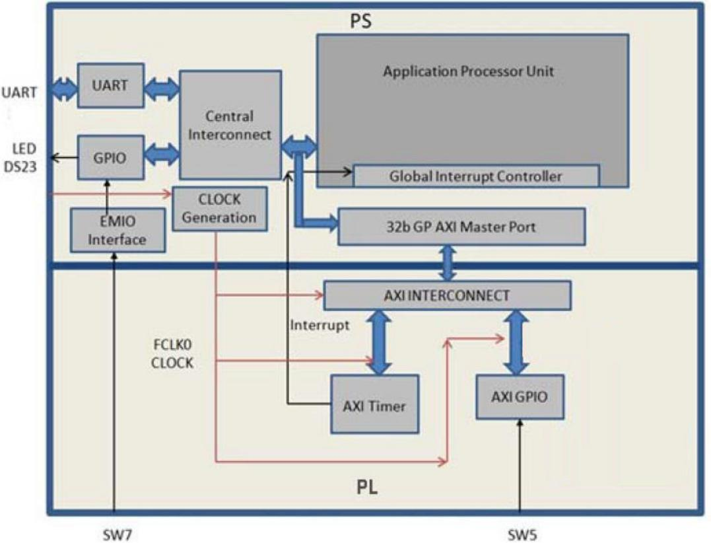

*Figure 3:* **Block Diagram**

You can use the system created in [Chapter 2: Using the Zynq SoC Processing System](#page-11-0) and continue after [Creating an Embedded Processor Project.](#page-12-0)

In the examples in this chapter, we will expand on the design in [Chapter 2: Using the Zynq SoC](#page-11-0) [Processing System.](#page-11-0) You will make the following design changes:

- The fabric-side AXI GPIO is assigned a 1-bit channel width and is connected to the SW5 pushbutton switch on the ZC702 board.
- The PS GPIO ports are modified to include a 1-bit interface that routes a fabric pin (via the EMIO interface) to the SW7 push-button switch on the board.
- In the PS section, another 1-bit GPIO is connected to the DS23 LED on the board, which is on the MIO port.
- The AXI timer interrupt is connected from fabric to the PS section interrupt controller. The timer starts when you press any of the selected push buttons on the board. After the timer expires, the timer interrupt is triggered.

<span id="page-30-0"/>

- Along with making the above hardware changes, you will write the application software code. The code will function as follows:
	- A message appears in the serial terminal and asks you to select the push button switch to use on the board (either SW7 or SW5).
	- When the appropriate button is pressed, the timer automatically starts, switches LED DS23 OFF, and waits for the timer interrupt to happen.
	- After the timer interrupt, LED DS23 switches ON and execution starts again and waits for you to select the push button switch in the serial terminal again.

### **Example Project: Validate Instantiated Fabric IP Functionality**

In this example, you will add the AXI GPIO, AXI Timer, the interrupt instantiated in fabric, and the EMIO interface. You will then validate the fabric additions.

- 1. Open the Vivado® Design Suite.
- 2. Under the Recent Projects column, click the **edt_tutorial** design that you created in [Chapter](#page-11-0) [2: Using the Zynq SoC Processing System](#page-11-0).
- 3. Under **IP Integrator**, click **Open Block Design**.
- 4. In the Diagram window, right-click in the blank space and select **Add IP**.
- 5. In the search box, type AXI GPIO and double-click the **AXI GPIO** IP to add it to the block design. The AXI GPIO IP block appears in the Diagram view.
- 6. In the Diagram window, right-click in the blank space and select **Add IP**.
- 7. In the search box, type AXI Timer and double-click the **AXI Timer** IP to add it to the block design. The AXI Timer IP block appears in the Diagram view.
- 8. You must also edit the EMIO configuration of the Zynq7 SoC processing system and enable interrupts. Right-click the **ZYNQ7 Processing System** IP block and select **Customize Block**.

*Note***:** You can also double-click the IP block to customize.

The Re-customize IP dialog box opens, as shown in the following figure.


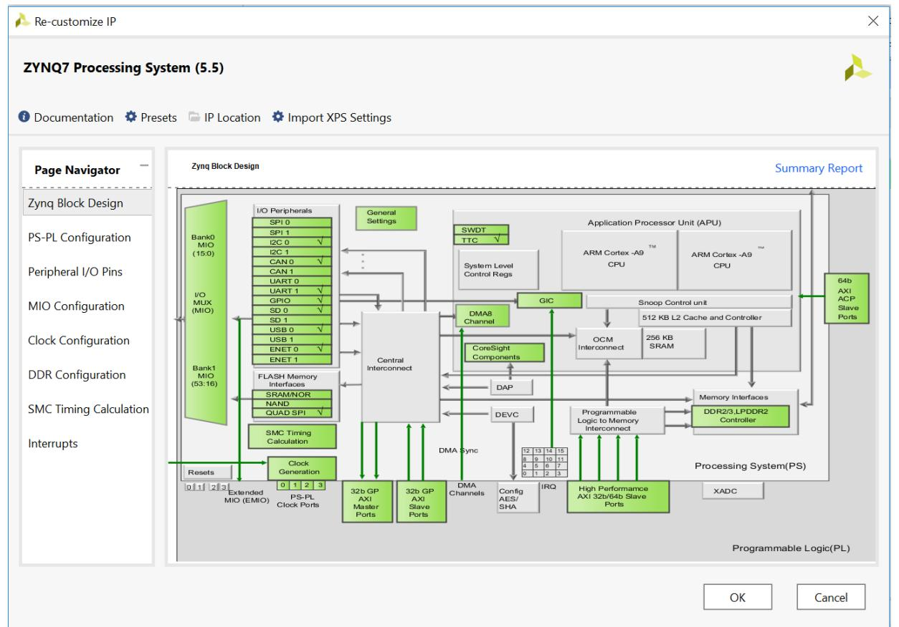

- 9. Click **MIO Configuration**.
- 10. Expand **I/O Peripherals → GPIO** and select the **EMIO GPIO (Width)** check box.
- 11. Change the EMIO GPIO (Width) to **1**.
- 12. With the ZYNQ7 Processing System configuration options still open, navigate to **Interrupts  → Fabric Interrupts → PL-PS Interrupt Ports**.
- 13. Check the **Fabric Interrupts** box and also check **IRQ_F2P[15:0]** to enable PL-PS interrupts in the IP core.
- 14. Click **OK** to accept the changes to the ZYNQ7 Processing System IP. The diagram looks like the following figure.


- 15. Click the **Run Connection Automation** link at the top of the page to automate the connection process for the newly added IP blocks.
- 16. In the Run Connection Automation dialog box, select the check box next to **All Automation**, as shown in the following figure.

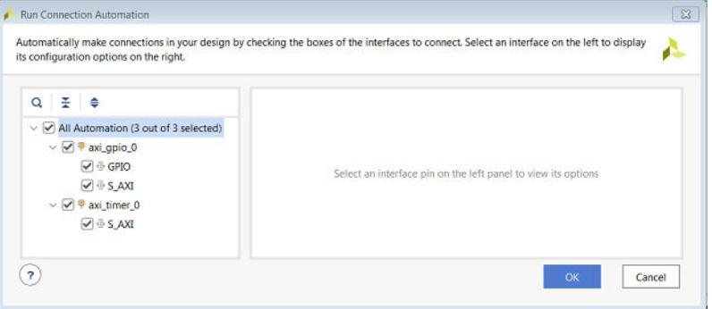

#### 17. Click **OK**.

Upon completion, the updated diagram looks like the following figure.


- 18. Right-click the **AXI GPIO** IP block and select **Customize Block**.
*Note***:** You can also double-click the IP block to make customizations.

- 19. Under the **Board** tab, make sure that both **GPIO** and **GPIO2** are set to **Custom**.
- 20. Select the **IP Configuration** tab. In the GPIO section, change the **GPIO Width** to **1** because you only need one GPIO port. Also ensure that **All Inputs** and **All Outputs** are both unchecked.
- 21. Click **OK** to accept the changes.
- 22. Notice that the Interrupt port is not automatically connected to the AXI Timer IP Core. In the Block Diagram view, locate the IRQ_F2P[0:0] port on the ZYNQ7 Processing System.
- 23. Scroll your mouse over the connector port until the pencil icon appears, then click the **IRQ_F2P[0:0]** port and drag to the **interrupt** output port on the AXI Timer IP core to make a connection between the two ports.
- 24. Notice that the ZYNQ7 Processing System GPIO_0 port is not connected. Right-click the **GPIO_0** output port on the **ZYNQ7 Processing System** and select **Make External**.

The pins are external but do not have the needed constraints for our board. To constrain your hardware pins to specific device locations, follow the steps below. These steps can be used for any manual pin placements.

- 25. Click **Open Elaborated Design** under RTL Analysis in the Flow Navigator view.


- 26. When the Elaborate Design message box opens, as shown in the following figure, click **OK**.

**TIP:** *The design might take a few minutes to elaborate. If you want to do something else in Vivado while the design elaborates, you can click the Background button to have Vivado continue running the process in the background.*

- 27. Select **I/O Planning** from the drop-down menu, as shown in the following figure, to display the **I/O Ports** window.

- 28. Under the I/O Ports tab view at the bottom of the Vivado window (as seen in the following figure), expand the **GPIO_0_0_18048** and **gpio_sw_18048** ports to check the site (pin) map.
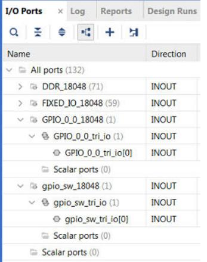

- 29. Find **GPIO_0_0_tri_io[0]** and set the following properties, shown in the following figure:


- **Package Pin = F19**
- **I/O Std = LVCMOS25**

30. Find **gpio_sw_tri_io[0]** and set the following properties, shown in the following figure:

- **Package Pin = G19**
- **I/O Std = LVCMOS25**

*Note***:** For additional information about creating other design constraints, refer to the *Vivado Design Suite User Guide: Using Constraints* [(UG903](UG903)).

- 31. In the Flow Navigator, under **Program and Debug**, select **Generate Bitstream**.
The Save Project dialog box opens. Make sure the **Elaborated Design - constrs_1** check box is selected and click **Save**.

A message might appear that states that synthesis is out of date. If this happens, click **Yes**.

- 32. The **Save Constraints** dialog box appears (shown in the following figure). Provide a file name (GPIO_Constraints) and click **OK**. If the Synthesis is Out-of-date dialog box opens, click **Yes** to rerun synthesis. The Launch Runs dialog box opens. Click **OK** to launch synthesis.


A constraints file is created and saved under **Sources → Hierarchy → Constraints**, as shown in the following figure.


- 33. After bitstream generation completes, export the hardware using **File → Export → Export Hardware**. Use the information in the table below to make selections in each of the wizard screens. Click **Next** where necessary.


| Wizard Screen            | System Property | Setting or Command to Use                                                                                         |
|--------------------------|-----------------|-------------------------------------------------------------------------------------------------------------------|
| Export Hardware Platform | Platform type   | Fixed                                                                                                             |
|                          | Output          | Include bitstream                                                                                                 |
|                          | Files           | Keep the XSA file name as<br>tutorial_bd_wrapper and Export<br>to the following path: C:/designs/<br>edt_tutorial |

*Note***:** If a pop-up appears saying the module is already exported, click **Yes**.

- 34. Click **Finish** as shown in the following figure.

### **Working with the Vitis Software Platform**

Open the Vitis IDE and manually update the exported hardware from Vivado.

- 1. In Project Explorer, right-click on the **hw_platform** platform project and click on the **Update Hardware Specification** option as shown in the following figure.


- 2. In the Update Hardware Specification dialog box, browse for the exported XSA file (C:/ designs/edt_tutorial/tutorial_bd_wrapper.xsa) from Vitis and click **OK**. A dialog box opens stating that the hardware specification for the platform project has been updated, as shown in the following figure. Click **OK**.
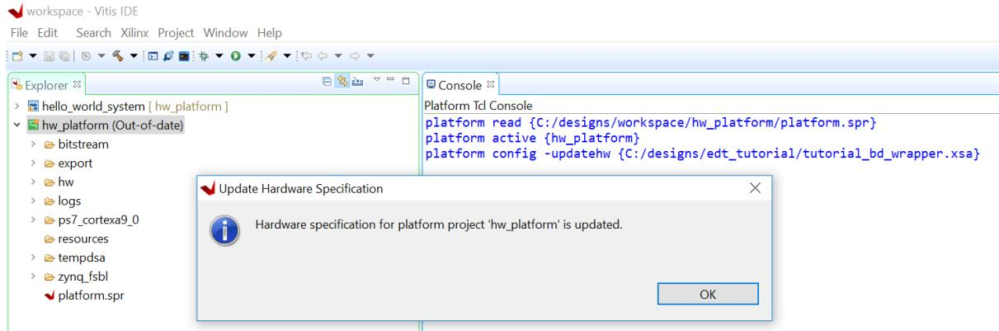

- 3. Rebuild the out-of-date platform project. Right-click on the **hw_platform** project. Select **Clean Project** followed by **Build Project**.
- 4. After the hw_platform project build completes, the hw_platform.xpfm file is generated, as shown in the following figure.


- 5. Open the helloworld.c file from the hello_world project created with standalone PS in [Chapter 2: Using the Zynq SoC Processing System](#page-11-0) and modify the application software code as described in Standalone Application [Software for the Design](#page-42-0).
- 6. Save the file and re-build the project.
- 7. Open the serial communication utility with baud rate set to **115200**.

*Note***:** This is the baud rate that the UART is programmed to on Zynq devices.

- 8. Connect to the board.
Because you have a bitstream for the PL fabric, you must download the bitstream.

- 9. Select **Xilinx → Program FPGA**. The Program FPGA dialog box opens. Browse for the bitstream exported from Vivado.


- 10. Click **Program** to download the bitstream and program the PL fabric. When the FPGA programming is done, progress information pop up opens and shows the status as **FPGA configuration complete**.
- 11. Run the project similar to the steps in [Creating a Platform Project in the Vitis](#page-20-0) Software [Platform with an XSA from Vivado](#page-20-0). If steps 9 and 10 fail, open the **Run Configurations** dialog box, browse for the bitstream file exported by Vivado, and then click the **Run** button as shown in following figure. With this step, the FPGA is programmed and the application runs.

- 12. In the system, the AXI GPIO pin is connected to push button **SW5** on the board, and the PS section GPIO pin is connected to push button **SW7** on the board via an EMIO interface.
- 13. Follow the instructions printed on the serial terminal to run the application. See the following figure for serial output logs.


<span id="page-42-0"/>

# **Standalone Application Software for the Design**

The system you designed in this chapter requires application software for the execution on the board. This section describes the details about the application software.

The main() function in the application software is the entry point for the execution. This function includes initialization and the required settings for all peripherals connected in the system. It also has a selection procedure for the execution of the different use cases, such as AXI GPIO and PS GPIO using EMIO interface. You can select different use cases by following the instruction on the serial terminal.

## **Application Software Steps**

Application Software is composed of the following steps:

- 1. Initialize the AXI GPIO module.
- 2. Set a direction control for the AXI GPIO pin as an input pin, which is connected with the **SW5** push button on the board. The location is fixed via LOC constraint in the user constraint file (XDC) during system creation.
- 3. Initialize the AXI TIMER module with device ID 0.
- 4. Associate a timer callback function with AXI timer ISR.

This function is called every time the timer interrupt happens. This callback switches on the LED **DS23** on the board and sets the interrupt flag.

The main() function uses the interrupt flag to halt execution, waits for timer interrupt to happen, and then restarts the execution.

- 5. Set the reset value of the timer, which is loaded to the timer during reset and timer starts.
- 6. Set timer options such as Interrupt mode and Auto Reload mode.
- 7. Initialize the PS section GPIO.
- 8. Set the PS section GPIO, channel 0, pin number 10 to the output pin, which is mapped to the MIO pin and physically connected to the LED **DS23** on the board.
- 9. Set PS Section GPIO channel number 2, pin number 0, to an input pin, which is mapped to PL side pin via the EMIO interface and physically connected to the **SW7** push button switch.
- 10. Initialize Snoop control unit Global Interrupt controller. Also, register Timer interrupt routine to interrupt ID '91', register the exceptional handler, and enable the interrupt.
- 11. Execute a sequence in the loop to select between AXI GPIO or PS GPIO use case via serial terminal.


The software accepts your selection from the serial terminal and executes the procedure accordingly. After the selection of the use case via the serial terminal, you must press a push button on the board as per the instruction on terminal. This action switches off the LED DS23, starts the timer, and tells the function to wait infinitely for the Timer interrupt to happen. After the Timer interrupt happens, LED DS23 switches ON and restarts execution.

### **Application Software Code**

The Application software for the system is included in helloworld.c, which is available in the ZIP file that accompanies this guide. For more details, see [Design Files for This Tutorial](#page-120-0).


*Chapter 4*

*Chapter 4:* Debugging with the Vitis Software Platform

<span id="page-44-0"/>

# Debugging with the Vitis Software Platform

This chapter describes debug possibilities with the design flow you have already been working with. The first option is debugging with software using the Xilinx® Vitis™ unified software platform.

The Vitis software platform debugger provides the following debug capabilities:

- Supports debugging of programs on MicroBlaze™ and Arm Cortex™-A9 processor architectures (heterogeneous multi-processor hardware system debugging)
- Supports debugging of programs on hardware boards
- Supports debugging on remote hardware systems
- Provides a feature-rich integrated design environment (IDE) to debug programs
- Provides a Tool Command Language (Tcl) interface for running test scripts and automation

The Vitis debugger enables you to see what is happening to a program while it executes. You can set breakpoints or watchpoints to stop the processor, step through program execution, view the program variables and stack, and view the contents of the memory in the system.

The Vitis software platform supports debugging through Xilinx System Debugger and GNU Debugger (GDB).

*Note***:** The GDB flow is deprecated and will not be available for future devices.

# **Xilinx System Debugger**

The Xilinx System Debugger uses the Xilinx hw_server as the underlying debug engine. The Vitis software platform translates each user interface action into a sequence of Target Communication Framework (TCF) commands. It then processes the output from System Debugger to display the current state of the program being debugged. It communicates to the processor on the hardware using Xilinx hw_server.

The debug workflow is described in the following figure.


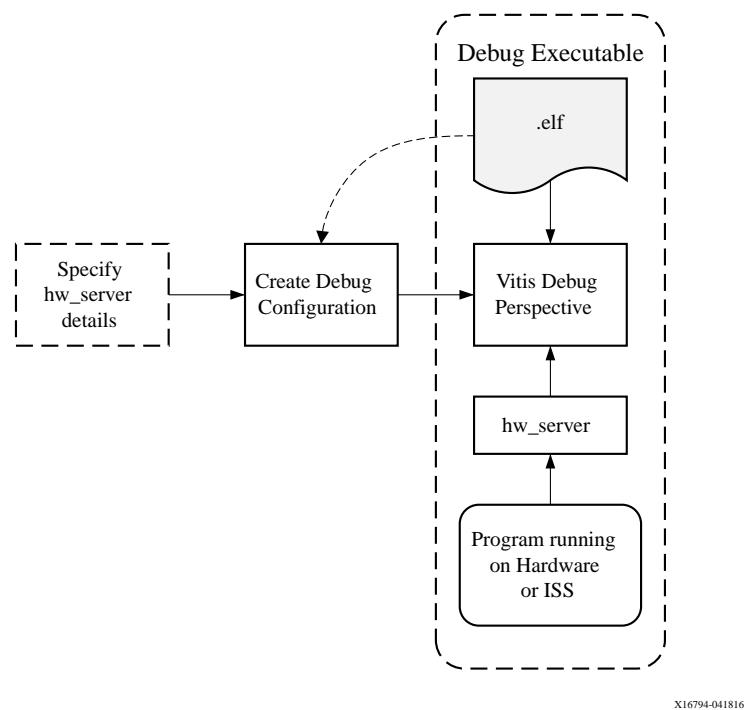

#### *Figure 4:* **System Debugger Flow**

The workflow is made up of the following components:

- **Executable ELF File:** To debug your application, you must use an Executable and Linkable Format (ELF) file compiled for debugging. The debug ELF file contains additional debug information for the debugger to make direct associations between the source code and the binaries generated from that original source. To manage the build configurations, right-click the software application and select **Build Configurations → Manage**.
- **Debug Configuration:** To launch the debug session, you must create a debug configuration in the Vitis software platform. This configuration captures options required to start a debug session, including the executable name, processor target to debug, and other information. To create a debug configuration, right-click your software application and select **Debug As →  Debug Configurations**.
- **Debug Perspective:** Using the Debug perspective, you can manage the debugging or running of a program in the Workbench. You can control the execution of your program by setting breakpoints, suspending launched programs, stepping through your code, and examining the contents of variables. To view the Debug Perspective, select **Window → Open Perspective →  Debug**.

You can repeat the cycle of modifying the code, building the executable, and debugging the program in the Vitis software platform.

*Note***:** If you edit the source after compiling, the line numbering will be out of step because the debug information is tied directly to the source. Similarly, debugging optimized binaries can also cause unexpected jumps in the execution trace.

<span id="page-46-0"/>

## **Debugging Software Using the Vitis Software Platform**

In this example, you will walk through debugging a Hello World application.

If you modified the Hello World application in the prior chapter, you will need to create a new Hello World application prior to debugging. Follow the steps in [Creating a Platform Project in the](#page-20-0) Vitis Software [Platform with an XSA from Vivado](#page-20-0) to create a new Hello World application.

After you create the Hello World Application, work through below example to debug the software using the Vitis software platform.

- 1. In the C/C++ Perspective, right-click the Hello_world Project and select **Debug As →  Debug Configurations**.
In Target Setup tab, fill the Hardware Platform field with the one exported by the Vivado® Design Suite, and click the **Debug** button.

The Debug Perspective opens.

*Note***:** If the Debug Perspective window does not automatically open, select **Window → Open perspective** and select **Debug** in the Open Perspective wizard.


*Note***:** The addresses shown on this page might slightly differ from the addresses shown on your system.

The processor is currently sitting at the beginning of main() with program execution suspended at line 0x0010058c. You can confirm this information in the Disassembly view, which shows the assembly-level program execution also suspended at 0x0010058c.

*Note***:** If the Disassembly view is not visible, select **Window → Show View → Debug → Disassembly**.

- 2. The helloworld.c window also shows execution suspended at the first executable line of C code. Select the Registers view to confirm that the program counter, pc register, contains 0x0010058c.
*Note***:** If the Registers window is not visible, select **Window → Show View → Debug → Registers**.

- 3. Double-click in the margin of the helloworld.c window next to the line of code that reads init_platform() and print(). This sets the breakpoints at init_platform() and print(). To confirm the breakpoints, review the Breakpoints window.
*Note***:** If the Breakpoints window is not visible, select **Window → Show View → Debug → Breakpoints**.

- 4. Select **Run → Step Into** to step into the init_platform() routine.
Program execution suspends at location 0x001005fc. The call stack is now two levels deep.

- 5. Select **Run → Resume** to continue running the program to the breakpoint.
Program execution stops at the line of code that includes the print command. The Disassembly and Debug windows both show program execution stopped at 0x00100590.

*Note***:** The execution address in your debugging window might differ if you modified the hello world source code in any way.


- 6. Select **Run → Resume** to run the program to conclusion.
When the program completes, the Terminal window shows the Hello World print and the Debug window shows that the program is suspended in a routine called exit. This happens when you are running under control of the debugger.

- 7. Rerun your code several times. Experiment with single-stepping, examining memory, breakpoints, modifying code, and adding print statements. Try adding and moving views.
**TIP:** *You can use Vitis tool debugging shortcuts for step-into (F5), step-return (F7), step-over (F6), and resume (F8).*

- 8. Exit the Vitis software platform.


<span id="page-49-0"/>

*Chapter 5*

*Chapter 5:* Using the HP Slave Port with AXI CDMA IP

# Using the HP Slave Port with AXI CDMA IP

In this chapter, you will instantiate AXI CDMA IP in fabric and integrate it with the processing system high performance (HP) 64-bit slave port. In this system, AXI CDMA acts as master device to copy an array of the data from the source buffer location to the destination buffer location in DDR system memory. The AXI CDMA uses the processing system HP slave port to get read/ write access of DDR system memory.

You will write standalone application software and Linux OS based application software using mmap() for the data transfer using AXI CDMA block. You will also execute both standalone and Linux-based application software separately on the ZC702 board.

# **Integrating AXI CDMA with the Zynq SoC PS HP Slave Port**

Xilinx® Zynq®-7000 SoC devices internally provide four high performance (HP) AXI slave interface ports that connect the programmable logic (PL) to asynchronous FIFO interface (AFI) blocks in the processing system (PS). The HP Ports enable a high throughput data path between AXI masters in programmable logic and the processing system's memory system (DDR and onchip memory). HP slave ports are configurable to 64 bit or 32 bit interfaces.

In this section, you will create a design using AXI CDMA intellectual property (IP) as master in fabric and integrate it with the PS HP 64 bit slave port. The block diagram for the system is as shown in the following figure.


*Figure 5:* **Block Diagram**

This system covers the following connections:

- AXI CDMA Slave Port is connected to the PS General Purpose master port 1 (M_AXI_GP1). It is used by the PS CPU to configure the AXI CDMA register set for the data transfer and also to check the status.
- AXI CDMA Master Port is connected to the PS High performance Slave Port 0 (S_AXI_HP0). It is used by the AXI CDMA to read from the DDR system memory. It acts as the source buffer location for the CDMA during data transfer.
- AXI CDMA Master Port is connected to the PS High performance Slave Port 2 (S_AXI_HP2). It is used by the AXI CDMA to write the data to the DDR system memory. It acts as a destination buffer location for the CDMA during the Data transfer.
- AXI CDMA interrupt is connected from fabric to the PS section interrupt controller. After Data Transfer or Error during Data transaction, the AXI CDMA interrupt is triggered.

In this system, you will configure the HP slave port 0 to access a DDR memory location range from 0x20000000 to 0x2fffffff. This DDR system memory location acts as the source buffer location to CDMA for reading the data.

You will also configure HP slave Port 2 to access a DDR memory Location range from 0x30000000 to 0x3fffffff. This DDR system memory location acts as a destination location to CDMA for writing the data.


You will also configure the AXI CDMA IP data width of the Data Transfer channel to 1024 bits with Maximum Burst length set to 32. With this setting, CDMA Maximum transfer size is set to 1024x32 bits in one transaction.

You will write the application software code for the above system. When you execute the code, it first initializes the source buffer memory with the specified data pattern and also clears the destination buffer memory by writing all zeroes to the memory location. Then, it starts configuring the CDMA register for the DMA transfer. It writes the source buffer location, destination buffer location, and number of bytes to be transferred to the CDMA registers and waits for the CDMA interrupt. When the interrupt occurs, it checks the status of the DMA transfers.

If the data transfer status is successful, it compares the source buffer data with the destination buffer data and displays the comparison result on the serial terminal.

If the data transfer status is an error, it displays the error status on the serial terminal and stops execution.

### **Example Project: Integrating AXI CDMA with the PS HP Slave Port**

- 1. Start with one of the following:
	- Use the system you created in [Example Project: Validate Instantiated Fabric IP](#page-30-0) [Functionality.](#page-30-0)
	- Create a new project as described in [Creating an Embedded Processor Project](#page-12-0).
- 2. Open the Vivado® design from [Chapter 3: Using the GP Port in Zynq Devices](#page-28-0) called **edt_tutorial** and from the IP integrator click **Open Block Design**.
- 3. In the Diagram window, right-click in the blank space and select **Add IP**.
- 4. In the search box, type **CDMA** and double-click the **AXI Central Direct Memory Access** IP to add it to the Block Design. The AXI Central Direct Memory Access IP block appears in the Diagram view.
- 5. In the Diagram window, right-click in the blank space and select **Add IP**.
- 6. In the search box type **concat** and double-click the **Concat** IP to add it to the Block Design. The Concat IP block appears in the Diagram view. This block is used to concatenate the two interrupt signals if you are using the prior design with the AXI Timer.
- 7. Right-click the **interrupt → IRQ_F2P[0:0]** net and select delete.
- 8. Click the **IRQ_F2P[0:0]** port and drag to the **dout[1:0]** output port on the Concat IP core to make a connection between the two ports.
- 9. Click the **interrupt** port on the AXI Timer IP core and drag to the **In0[0:0]** input port on the Concat IP core to make a connection between the two ports.


- 10. Click the **cdma_introut** port on the AXI CDMA IP core and drag to the **In1[0:0]** input port on the Concat IP core to make a connection between the two ports.
- 11. Right-click the **ZYNQ7 Processing System** core and select **Customize Block**.
- 12. Select **PS-PL Configuration** and expand the **HP Slave AXI Interface**.
- 13. Select the check box for **S AXI HP0 interface** and for **S AXI HP2 interface**.
- 14. Click **OK** to accept the changes.
- 15. Right-click the **AXI CDMA IP** core and select **Customize Block**.
- 16. Set the block settings in the Re-customize IP wizard screen as follows:

| System Property                 | Setting or Command to Use |
|---------------------------------|---------------------------|
| Enable Scatter Gather           | Unchecked                 |
| Disable 4K Boundary Checks      | Unchecked                 |
| Allow Unaligned Transfers       | Unchecked                 |
| Write/Read Data Width           | 1024                      |
| Write/Read Burst Size           | 32                        |
| Enable Asynchronous Mode (Auto) | Unchecked                 |
| Enable CDMA Store and Forward   | Unchecked                 |
| Address Width                   | 32                        |

- 17. Click **OK** to accept the changes.
- 18. Click the **Run Connection Automation** link in the Diagram window to automate the remaining connections.
- 19. In the Run Connection Automation dialog box make sure the **All Automation** box is checked, then, click **OK** to accept the default connections. The finished diagram should look like the following figure.

*Note***:** You might receive a Critical Warning Message regarding forcibly mapping a net into a conflicting address. Address the error by manually updating the memory mapped address in the next steps. Click **OK** if you see the error message.


#### 20. Select the **Address Editor** tab.

- 21. In the Address Editor view, expand**axi_cdma_0 → axi_cdma_0/Data**. Right-click on **HP2_DDR_LOWOCM** and select **Unassign**.
- 22. In the Range column for **S_AXI_HP0**, select **256M**.
- 23. Under Offset Address for **S_AXI_HP0**, set a value of **0x2000_0000**.
- 24. In the Address Editor view, expand **axi_cdma_0 → axi_cdma_0/Data → Unassigned**. Rightclick on **HP2_DDR_LOWOCM** and select **Assign**.
- 25. In the Range column for **S_AXI_HP2**, select **256M**.
- 26. Under Offset Address for **S_AXI_HP2**, set a value of **0x3000_0000**.

<span id="page-54-0"/>

- 27. In the Flow Navigator, select **Generate Bitstream** under PROGRAM AND DEBUG.
The Save Project dialog box opens.

- 28. Ensure that the **Block Design tutorial_bd** check box is selected, then click **Save**.
- 29. A message might appear that states Synthesis is out of date. If it does, click **Yes**.
- 30. After the Bitstream generation completes, export the hardware and launch the Vitis unified software platform as described in [Exporting a Hardware Platform.](#page-19-0)

*Note***:** Make sure to select **Include bitstream** instead of the **Pre-synthesis for Export Hardware Platform → Output** option.

# **Standalone Application Software for the Design**

The CDMA-based system that you designed in this chapter requires application software to execute on the board. This section describes the details about the CDMA-based Standalone application software.

The main() function in the application software is the entry point for the execution. It initializes the source memory buffer with the specified test pattern and clears the destination memory buffer by writing all zeroes.

The application software then configures the CDMA registers sets by providing information such as source buffer and destination buffer starting locations. To initiate DMA transfer, it writes the number of bytes to be transferred in the CDMA register and waits for the CDMA interrupt to happen. After the interrupt, it checks the status of the DMA transfer and compares the source buffer with the destination buffer. Finally, it prints the comparison result in the serial terminal and stops running.

### **Application Software Flow**

The application software does the following:

<span id="page-55-0"/>

- 1. Initializes the source buffer with the specified test pattern. The source buffer location ranges from 0x20000000 to 0x2fffffff.
Clears the destination buffer by writing all zeroes into the destination address range. The destination buffer location ranges from 0x30000000 to 0x3fffffff.

- 2. Initializes AXI CDMA IP and does the following:
	- a. Associates a CDMA callback function with AXI CDMA ISR and Enable the Interrupt.

This Callback function executes during the CDMA interrupt. It sets the interrupt Done and/or Error flags depending on the DMA transfer status.

Application software waits for the Callback function to populate these flags and executes the software according to the status flag.

- b. Configures the CDMA in Simple mode.
- c. Checks the Status register of the CDMA IP to verify the CDMA idle status.
- d. Sets the source buffer starting location, 0x20000000, to the CDMA register.
- e. Sets the destination buffer starting location, 0x30000000, to the CDMA register.
- f. Sets the number of bytes to transfer to the CDMA register. The application software starts the DMA transfer.
- 3. After the CDMA interrupt is triggered, checks the DMA transfer status.

If the transfer status is successful, the application software compares the source buffer location with the destination buffer location and displays the comparison result on the serial terminal, and then exits from the execution.

If the transfer status displays an error, the software prints the error status in the serial terminal and stops running.

### **Running the Standalone CDMA Application Using the Vitis Software Platform**

- 1. Open the Vitis software platform.
- 2. Check that the Target Communication Frame (TCF) (hw_server.exe) agent is running on your Windows machine. If it is not running in the Vitis software platform, select **Xilinx →  XSCT Console**.
- 3. In the XSCT Console window, type **Connect**. A message appears, stating that the hw_server application started, or if it has started and is running, you see tcfchan#, as shown in the following figure.


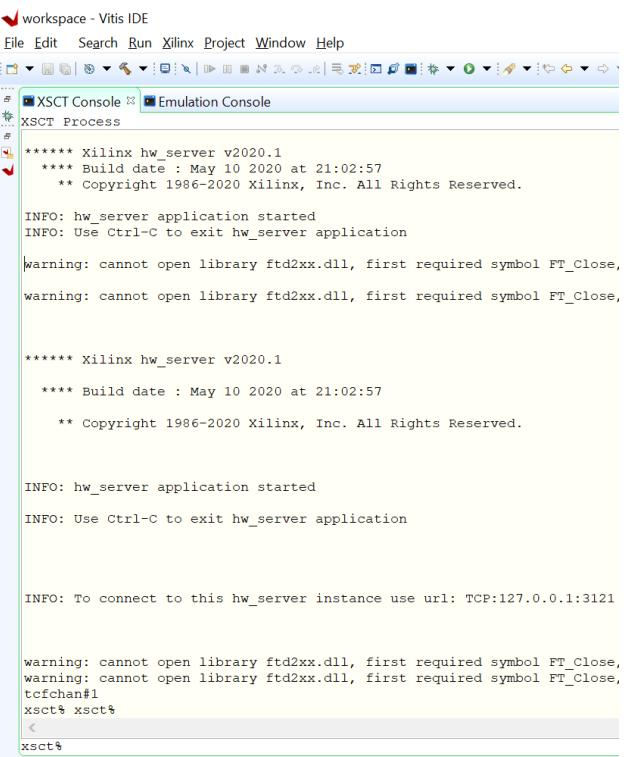

- 4. In the Vitis software platform, select **File → New → Application Project**.
- 5. The New Application Project wizard opens.

Use the information in the table below to make your selections in the wizard screens.

| Wizard Screen                  | System Property                   | Setting or Command to Use                                                                                               |
|--------------------------------|-----------------------------------|-------------------------------------------------------------------------------------------------------------------------|
| Platform                       | Select a platform from repository | Click hw_platform [custom] with the path as<br>C:\designs\workspace\hw_platform\export<br>\hw_platform\hw_platform.xpfm |
| Application Project<br>Details | Application project name          | Enter cdma_app                                                                                                          |
| Domain                         | Select a domain                   | Click standalone on ps7_cortex9_0.                                                                                      |
| Templates                      | Available Templates               | Empty Application                                                                                                       |

- 6. Click **Finish**.
The New Project wizard closes and the Vitis software platform creates the cdma_app application project under the Project Explorer.

- 7. In the Project Explorer tab, expand the **cdma_app** project, right-click the **src** directory, and select **Import Sources** to open the Import Sources dialog box.
- 8. In **Import Sources → File system → From directory**, click the **browse** button and browse for the design files folder you saved earlier (see [Design Files for This Tutorial)](#page-120-0).
- 9. Select the cdma_app.c file and click **Finish**.

<span id="page-57-0"/>

- 10. Build the cdma application project either by clicking the hammer icon or by right-clicking on the **cdma_app project** and selecting **Build Project**.
- 11. Open the serial communication utility with baud rate set to **115200**.

*Note***:** This is the baud rate that the UART is programmed to on Zynq devices.

- 12. Make sure that the hardware board is set up and turned on.
*Note***:** Refer to [Creating a Platform Project in the Vitis](#page-20-0) Software Platform with an XSA from Vivado for information about setting up the board.

- 13. Select **Xilinx Tools → Program FPGA** to open the Program FPGA dialog box. The dialog box shows the bitstream path.
- 14. Click **Program** to download the bitstream and program the PL fabric.
- 15. Run the project similar to the steps in [Creating a Platform Project in the Vitis](#page-20-0) Software [Platform with an XSA from Vivado](#page-20-0).
- 16. Check the status of the CDMA transfer in the Serial terminal. If the transfer is successful, the message "DMA Transfer is Successful" displays. Otherwise, the serial terminal displays an error message.

# **Linux OS Based Application Software for the CDMA System**

In this section, you will create a Linux-based application software for CDMA using the mmap() system call provided by Linux and run it on the hardware to check the functionality of the CDMA IP.

The mmap() system call is used to map specified kernel memory area to the User layer, so that you can read or write on it depending on the attribute provided during the memory mapping.

*Note***:** Details about the mmap() system call is beyond the scope of this guide.

**CAUTION!** *Use of the* mmap() *call might crash the kernel if it accesses, by mistake, some restricted area or shared resources of the kernel.*

The main() function in the application software is the entry point for the execution. It initializes the source array with the specified test pattern and clears the destination array. Then it copies the source array contents to the DDR memory starting at location 0x20000000 and makes the DMA register setting to initiate DMA transfer to the destination. After the DMA transfer, the application reads the status of the transfer and displays the result on the serial terminal.


## **Application Software Creation Steps**

Application software creation is composed of the following steps:

- 1. Initialize the whole source array, which is in the User layer with value 0xa5a5a5a5.
- 2. Clear the whole destination buffer, which is in the User layer, by writing all zeroes.
- 3. Map the kernel memory location starting from 0x20000000 to the User layer with writing permission using mmap() system calls.

By doing so, you can write to the specified kernel memory.

- 4. Copy the source array contents to the mapped kernel memory.
- 5. Un-map the kernel memory from the User layer.
- 6. Map the AXI CDMA register memory location to the User layer with reading and writing permission using the mmap() system call. Make the following CDMA register settings from the User layer:
	- a. Reset DMA to stop any previous communication.
	- b. Enable interrupt to get the status of the DMA transfer.
	- c. Set the CDMA in simple mode.
	- d. Verify that the CDMA is idle.
	- e. Set the source buffer starting location, 0x20000000, to the CDMA register.
	- f. Set the destination buffer starting location, 0x30000000, to the CDMA register.
	- g. Set the number of bytes to be transferred in the CDMA register. Writing to this register starts the DMA transfer.
- 7. Continuously read the DMA transfer status until the transfer finishes.
- 8. After CDMA transfer finishes, un-map the CDMA register memory for editing from the User layer using the mmap() system call.
- 9. Map the kernel memory location starting from 0x30000000 to the User layer with reading and writing permissions.
- 10. Copy the kernel memory contents starting from 0x30000000 to the User layer destination array.
- 11. Un-map the kernel memory from the User layer.
- 12. Compare the source array with the destination array.
- 13. Display the comparison result in the serial terminal. If the comparison is successful, the message "DATA Transfer is Successful" displays. Otherwise, the serial terminal displays an error message.

<span id="page-59-0"/>

# **Running Linux CDMA Application Using the Vitis Software Platform**

Detailed steps on running Linux on the target board are outlined in [Chapter 6: Linux Booting and](#page-71-0) [Debug in the Vitis](#page-71-0) Software Platform. If you are not comfortable running Linux, run through the [Chapter 6: Linux Booting and Debug in the Vitis](#page-71-0) Software Platform examples prior to running this example. Running a Linux OS based application is composed of the following steps:

- 1. Booting Linux on the Target Board
- 2. [Linux Domain Creation for Linux Applications](#page-66-0)
- 3. [Building an Application and Running it on the Target Board Using the Vitis](#page-68-0) Software Platform

### **Booting Linux on the Target Board**

You will now boot Linux on the Zynq-7000 SoC ZC702 target board using JTAG mode.

*Note***:** Additional boot options will be explained in [Chapter 6: Linux Booting and Debug in the Vitis](#page-71-0) [Software](#page-71-0) Platform.

- 1. Check the following Board Connection and Setting for Linux booting using JTAG mode:
	- a. Ensure that the settings of Jumpers J27 and J28 are set as described in [Creating a](#page-20-0) Platform Project in the Vitis Software [Platform with an XSA from Vivado.](#page-20-0)
	- b. Ensure that the SW16 switch is set as shown in the following figure.
	- c. Connect an Ethernet cable from the Zynq SoC board to your network.
	- d. Connect the Windows Host machine to your network.
	- e. Connect the power cable to the board.


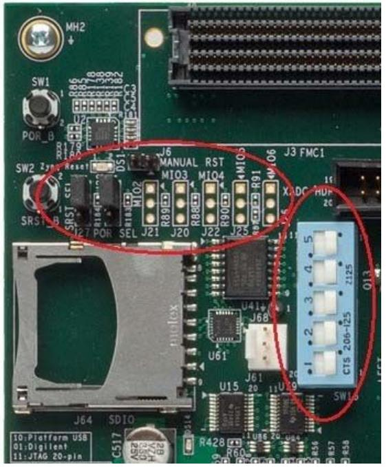

- 2. Connect a USB Micro cable between the Windows host machine and the target board with the following SW10 switch settings, as shown in [Booting Linux on the Target Board](#page-59-0).
	- Bit-1 is 0
	- Bit-2 is 1

*Note***:** 0 = switch is open. 1 = switch is closed. The correct JTAG mode has to be selected, according to the user interface. The JTAG mode is controlled by switch SW10 on the ZC702 and SW4 on the ZC706.

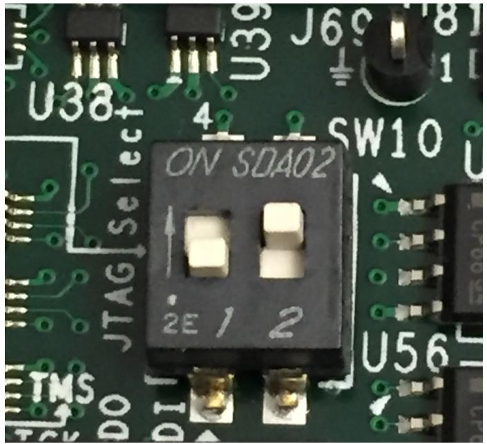


- 3. Connect a USB cable to connector J17 on the target board with the Windows Host machine. This is used for USB to serial transfer.
- 4. Change Ethernet Jumper J30 and J43 as shown in the following figure.


- 5. Power on the target board.
- 6. Launch the Vitis software platform and open the same workspace you used in [Chapter 2:](#page-11-0) [Using the Zynq SoC Processing System](#page-11-0) and [Chapter 3: Using the GP Port in Zynq Devices](#page-28-0).
- 7. If the serial terminal is not open, connect the serial communication utility with the baud rate set to **115200**.

*Note***:** This is the baud rate that the UART is programmed to on Zynq devices.

- 8. Select **Xilinx Tools → Program FPGA**, then click **Program** to download the bitstream.
- 9. Open the Xilinx System Debugger (XSCT) tool by selecting **Xilinx Tools → XSCT Console**.
- 10. At the XSCT prompt, do the following:
	- a. Type connect to connect with the PS section.
	- b. Type targets to get the list of target processors.


- c. Type targets 2 to select the processor CPU1.

```
xsct% targets
1 APU
2 Arm Cortex-A9 MPCore #0 (Running)
3 Arm Cortex-A9 MPCore #1 (Running)
4 xc7z020
xsct% targets 2
xsct% targets
1 APU
2* Arm Cortex-A9 MPCore #0 (Running)
3 Arm Cortex-A9 MPCore #1 (Running)
4 xc7z020
```
- d. Type dow <tutorial_download_path>/zynq_fsbl.elf to download PetaLinux FSBL.
- e. Type con to start execution of FSBL and then type stop to stop it.


- f. Type dow <tutorial_download_path>/u-boot.elf to download PetaLinux U-Boot.elf.
- g. Type con to start execution of U-Boot.

On the serial terminal, the autoboot countdown message appears: Hit any key to stop autoboot: 3

- h. Press Enter.
Automatic booting from U-Boot stops and a command prompt appears on the serial terminal.


- i. At the XSCT Prompt, type stop.
The U-Boot execution stops.

- j. Type dow -data <tutorial_download_path>/image.ub 0x30000000 to download the Linux Kernel image at location 0x3000000.
- k. Type con to start executing U-Boot.
- 11. At the command prompt of the serial terminal, type bootm 0x30000000.

The Linux OS boots.

- 12. If required, provide the Zynq login as **root** and the password as **root** on the serial terminal to complete booting the processor.
After booting completes, # prompt appears on the serial terminal.

- 13. At the root@Xilinx-ZC702-2020.1:~# prompt, make sure that the board Ethernet connection is configured:


- a. Check the IP address of the board by typing the following command at the Zynq> prompt: ifconfig eth0.
This command displays all the details of the currently active interface. In the message that displays, the inet addr value denotes the IP address that is assigned to the Zynq SoC board.

- b. If inet addr and netmask values do not exist, you can assign them using the following commands:

```
root@Xilinx-ZC702-2020.1:~# ifconfig eth0 inet 192.168.1.10
root@Xilinx-ZC702-2020.1:~# ifconfig eth0 netmask 255.255.255.0
```
- 14. Confirm that the IP address settings on the Windows machine are set up to match the board settings. Adjust the local area connection properties by opening your network connections.
	- a. Right-click the local area connection that is linked to the XC702 board and select **Properties**.
	- b. In the Local Area Connection Properties dialog box, select **Internet Protocol Version 4 (TCP/IPv4)** from the item list and select **Properties**.
	- c. Select **Use the following IP address** and set the following values:

IP address: 192.168.1.11 Subnet mask: 255.255.255.0

- d. Click **OK** to accept the values.
- 15. In the Windows machine command prompt, check the connection with the board by typing **ping** followed by the board IP address. The ping response displays in a loop.

This response means that the connection between the Windows host machine and the target board is established.

- 16. Press **Ctrl+C** to stop displaying the ping response on the Windows host machine command prompt.


<span id="page-66-0"/>

Linux booting completes on the target board and the connection between the host machine and the target board is complete.

### **Linux Domain Creation for Linux Applications**

Now that Linux is running on the board, you can create a Linux domain followed by a Linux application. The steps to create a Linux domain are given below:

- 1. Go to the Explorer in the Vitis software platform and expand the **hw_platform** platform project.
- 2. Open the hardware by double clicking **platform.spr**.
- 3. The platform view opens. Click the **+** button in the right corner to add a domain, as shown in the following figure.


- 4. When the New Domain dialog box opens, enter the details as given below:
	- **Name:** linux_domain
	- **Display Name:** linux_application_domain
	- **OS:** Linux
	- **Processor:** ps7_cortexa9
	- **Supported Runtimes:** C/C++

Select **Use pre-built software components**, then under this:

- a. Create one boot directory in the C:\designs folder, then copy the boot components into it (FSBL, PMUFW from the Vitis software platform, ATF, u-boot.elf and image.ub from PetaLinux).
- b. Create one BIF file as below.

<span id="page-68-0"/>

- 5. Click **OK** to finish and observe that the Linux domain has been added to the hw_platform as shown below.

Now you are ready with Linux domain to create Linux applications.

### **Building an Application and Running it on the Target Board Using the Vitis Software Platform**

- 1. Now that Linux is running on the board, create a Linux application to use the CDMA. Select **File → New → Application Project**.

| Wizard Screen               | System Property                                        | Setting or Command to Use                                                                                 |
|-----------------------------|--------------------------------------------------------|-----------------------------------------------------------------------------------------------------------|
| Templates                   | Available Templates                                    | Linux Empty Application                                                                                   |
| Platform                    | Select a platform from repository                      | Click hw_platform [custom].                                                                               |
| Application Project Details | Application project name                               | Enter linux_cdma_app                                                                                      |
|                             | Select target processor for the<br>Application project | Select ps7_cortexa9 SMP.                                                                                  |
| Domain                      | Select a domain                                        | Click linux_application_domain                                                                            |
| Domain                      | Application settings                                   | If known, enter the sysroot, root FS, and<br>kernal image paths. Otherwise, leave these<br>options blank. |

- 2. Use the information in the table below to make your selections in the wizard screens.
### 3. Click **Finish**.

The New Project wizard closes and the Vitis software platform creates the linux_cdma_app project under the Project Explorer.

- 4. In the Project Explorer tab, expand linux_cdma_app project, right-click the **src** directory, and select **Import Sources** to open the Import Sources dialog box.
- 5. In **Import Sources → File system → From directory**, click the **Browse** button and browse for the design files directory already downloaded. Select the **linux_cdma_app.c** example application file and click **Finish**.

*Note***:** The example application software file is available in the ZIP file that accompanies this guide. See [Design Files for This Tutorial](#page-120-0).


- 6. Build the application project either by clicking the hammer icon or by right-clicking on the linux_cdma_app project and selecting **Build Project**. The binary file linux_cdma_app.elf is generated.
- 7. Right-click linux_cdma_app and select **Run As → Run Configurations** to open the Run Configurations wizard, shown in the following figure.
- 8. Right-click **Xilinx C/C++ application (Application Debugger)** and select **New**.

- 9. In the **Connection** tab, click **New** to open the New Connection wizard.
10. In the **New Target Connection** screen, apply the settings below:

- a. Specify a name in the **Target Name** field. For the purposes of this exercise, use CDMALinux.
- b. In the **Host** field, enter the target board IP address.

To determine the target board IP address, type ifconfig eth0 at the Zynq> prompt in the serial terminal. The terminal displays the target IP address that is assigned to the board.

- c. In the **Port** field, type 1534.
- 11. Click **OK** to create the connection.
- 12. As shown in the following figure, from the **Application** tab, enter application data settings for the following:
	- a. Project Name: linux_cdma_app
	- b. Local File Path: Debug/linux_cdma_app.elf
	- c. Remote File Path: /tmp/cdma.elf


- 13. Click **Run**. The application executes, and the message **DATA Transfer is Successful** appears in the console window, as shown in the following figure.
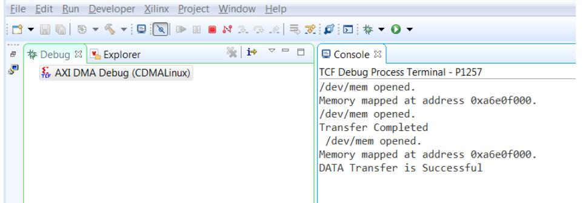


<span id="page-71-0"/>

# *Chapter 6*

*Chapter 6:* Linux Booting and Debug in the Vitis Software Platform

# Linux Booting and Debug in the Vitis Software Platform

This chapter describes the steps to configure and build the Linux OS for a Zynq®-7000 SoC board with PetaLinux Tools. It also provides information about downloading images precompiled by Linux on the target memory using a JTAG interface.

The later part of this chapter covers programming the following non-volatile memory with the precompiled images, which are used for automatic Linux booting after switching on the board:

- On-board QSPI Flash
- SD card

This chapter also describes using the remote debugging feature in the Xilinx® Vitis unified software platform to debug Linux applications running on the target board. The Vitis software platform runs on the Windows host machine. For application debugging, the platform establishes an Ethernet connection to the target board that is already running the Linux OS.

For more information, see the Embedded Design Tools web page [Support Resources.](#page-121-0)

## **Requirements**

In this chapter, the target platform refers to a Zynq SoC board. The host platform refers to a Windows machine that is running the Vivado® tools and PetaLinux installed on a Linux machine (either physical or virtual).

*Note***:** The Das U-Boot universal bootloader is required for the tutorials in this chapter. It is included in the precompiled images that you will download next.

From the Xilinx documentation website, download the ZIP file that accompanies this guide. See [Design Files for This Tutorial](#page-120-0). It includes the following files:

- BOOT.bin**:** Binary image containing the FSBL and U-Boot images produced by bootgen.
- cdma_app.c**:** Standalone Application software for the system you will create in this chapter.
- helloworld.c**:** Standalone Application software for the system you created in [Chapter 3:](#page-28-0) [Using the GP Port in Zynq Devices.](#page-28-0)

<span id="page-72-0"/>

- linux_cdma_app**:** Linux OS based Application software for the system you will create in this chapter.
- README.txt**:** Copyright and release information pertaining to the ZIP file.
- u-boot.elf**:** U-Boot file used to create the BOOT.BIN image.
- Image.ub**:** PetaLinux build Image (which have kernel image, ramdisk and dtb)
- fsbl.elf**:** FSBL image used to create BOOT.BIN image.

# **Booting Linux on a Zynq SoC Board**

This section covers the flow for booting Linux on the target board using the precompiled images that you downloaded in [Requirements](#page-71-0).

*Note***:** The compilations of the different images like Kernel image, U-Boot, Device tree, and root file system is beyond the scope of this guide.

### **Boot Methods**

The following boot methods are available:

- Master Boot Method
- Slave Boot Method

### *Master Boot Method*

In the master boot method, different kinds of non-volatile memories such as QSPI, NAND, NOR flash, and SD cards are used to store boot images. In this method, the CPU loads and executes the external boot images from non-volatile memory into the Processor System (PS). The master boot method is further divided into Secure and Non Secure modes. Refer to the *Zynq-7000 SoC Technical Reference Manual* ([UG585)](https://www.xilinx.com/cgi-bin/docs/ndoc?t=user_guides;d=ug585-Zynq-7000-TRM.pdf) for more detail.

The boot process is initiated by one of the Arm® Cortex™-A9 CPUs in the processing system (PS) and it executes on-chip ROM code. The on-chip ROM code is responsible for loading the first stage boot loader (FSBL). The FSBL does the following:

- Configures the FPGA with the hardware bitstream (if it exists)
- Configures the MIO interface
- Initializes the DDR controller
- Initializes the clock PLL
- Loads and executes the Linux U-Boot image from non-volatile memory to DDR


The U-Boot loads and starts the execution of the kernel image, the root file system, and the device tree from non-volatile RAM to DDR. It finishes booting Linux on the target platform.

### *Slave Boot Method*

JTAG can only be used in slave boot mode. An external host computer acts as the master to load the boot image into the OCM using a JTAG connection.

*Note***:** The PS CPU remains in idle mode while the boot image loads. The slave boot method is always a non-secure mode of booting.

In JTAG boot mode, the CPU enters halt mode immediately after it disables access to all security related items and enables the JTAG port. You must download the boot images into the DDR memory before restarting the CPU for execution.

### **Booting Linux from JTAG**

The flow chart in the following figure describes the process used to boot Linux on the target platform.

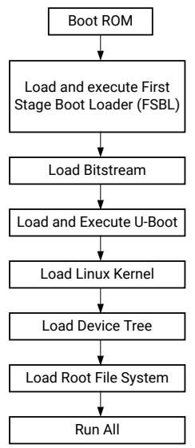

### *Figure 6:* **Linux Boot Process on the Target Platform**

### **Preparing the PetaLinux Build for Debugging**

To debug Linux applications (using tcf-agent), you must manually enable tcf-agent in PetaLinux RootFS.

X24074-060220

Ensure that dropbear-openssh-sftp server is disabled in PetaLinux RootFS.

<span id="page-74-0"/>

*Note***:** The Vitis debugger supports Linux Application Debug using tcf-agent (TCF - Target Communication Framework). TCF agent is provided as a part of PetaLinux roofts packages, but needs to be enabled when required.

Detailed information on enabling these components in the *PetaLinux Tools Documentation: Reference Guide* ([UG1144)](https://www.xilinx.com/cgi-bin/docs/rdoc?v=2020.1;d=ug1144-petalinux-tools-reference-guide.pdf), section "Debugging Applications with TCF Agent."

## **Booting Linux Using JTAG Mode**

- 1. Check the following board connections and settings for Linux booting using JTAG mode:
	- a. Ensure that the settings of Jumpers J27 and J28 are set as described in [Creating a](#page-20-0) Platform Project in the Vitis Software [Platform with an XSA from Vivado](#page-20-0).
	- b. Ensure that the SW16 switch is set as shown in the following figure.
	- c. Connect an Ethernet cable from the Zynq-7000 SoC board to your network or directly to your host machine.
	- d. Connect the Windows Host machine to your network.
	- e. Connect the power cable to the board.

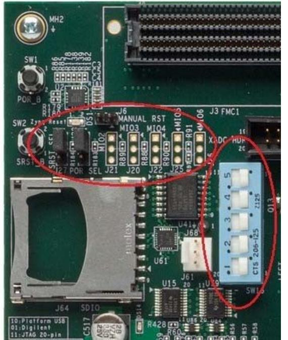

- 2. Connect a USB Micro cable between the Windows host machine and the target board with the following SW10 switch settings, as shown in the following figure.
	- Bit-1 is 0
	- Bit-2 is 1

*Note***:** 0 = switch is open. 1 = switch is closed. The correct JTAG mode has to be selected, according to the user interface. The JTAG mode is controlled by switch SW10 on the zc702 and SW4 on the zc706.


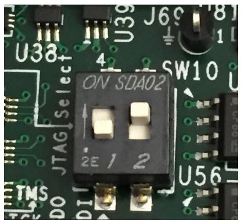

- 3. Connect a USB cable to connector J17 on the target board with the Windows Host machine. This is used for USB to serial transfer.
- 4. Change Ethernet Jumper J30 and J43 as shown in the following figure.


- 5. Power on the target board.
- 6. Launch the Vitis software platform and open same workspace you used in [Chapter 2: Using](#page-11-0) [the Zynq SoC Processing System](#page-11-0) and [Chapter 3: Using the GP Port in Zynq Devices.](#page-28-0)
- 7. If the serial terminal is not open, connect the serial communication utility with the baud rate set to **115200**.

*Note***:** This is the baud rate that the UART is programmed to on Zynq devices.


- 8. Download the bitstream by selecting **Xilinx Tools → Program FPGA**, then clicking **Program**.
- 9. Open the Xilinx System Debugger (XSCT) tool by selecting **Xilinx Tools → XSCT Console**.
- 10. At the XSCT prompt, do the following:
	- a. Type connect to connect with the PS section.
	- b. Type targets to get the list of target processors.
	- c. Type ta 2 to select the processor CPU1.

```
xsct% targets
1 APU
2 Arm Cortex-A9 MPCore #0 (Running)
3 Arm Cortex-A9 MPCore #1 (Running)
4 xc7z020
xsct% ta 2
xsct% targets
1 APU
2* Arm Cortex-A9 MPCore #0 (Running)
3 Arm Cortex-A9 MPCore #1 (Running)
4 xc7z020
```
- d. Type dow <tutorial_download_path>zynq_fsbl.elf to download Petalinux FSBL.
- e. Type con to start execution of FSBL and then type stop to stop it.
- f. Type dow <tutorial_download_path>/u-boot.elf to download PetaLinux U-Boot.elf.
- g. Type con to start execution of U-Boot.

On the serial terminal, the autoboot countdown message appears:

Hit any key to stop autoboot: 3

- h. Press Enter.
Automatic booting from U-Boot stops and a command prompt appears on the serial terminal.

- i. At the XSCT Prompt, type stop.
The U-Boot execution stops.

- j. Type dow -data image.ub 0x30000000 to download the Linux Kernel image at location <tutorial_download_path>/image.ub.
- k. Type con to start executing U-Boot.
- 11. At the command prompt of the serial terminal, type bootm 0x30000000.

The Linux OS boots.

- 12. If required, provide the Zynq login as root and the password as root on the serial terminal to complete booting the processor.


After booting completes, # prompt appears on the serial terminal.

- 13. At the root@xilinx-zc702-2020.1:~# prompt, make sure that the board Ethernet connection is configured:
	- a. Check the IP address of the board by typing the following command at the Zynq> prompt: ifconfig eth0.

This command displays all the details of the currently active interface. In the message that displays, the inet addr value denotes the IP address that is assigned to the Zynq SoC board.

- b. If inetaddr and netmask values do not exist, you can assign them using the following commands:

```
root@xilinx-zc702-2020.1:~# ifconfig eth0 inet 192.168.1.10 
root@xilinx-zc702-2020.1:~# ifconfig eth0 netmask 255.255.255.0
```
**IMPORTANT!** *If the target and host are connected back-to-back, you must set up the IP address. If the target and host are connected over a LAN , DHCP will get the IP address for the target; use the* ifconfig eth0 *to display the IP address.*

> Next, confirm that the IP address settings on the Windows machine match the board settings. Adjust the local area connection properties by opening your network connections.

- i. Right-click the local area connection that is linked to the XC702 board and select **Properties**.
- ii. With the Local Area Connection properties window open, select **Internet Protocol Version 4 (TCP/IPv4)** from the item list and select **Properties**.
- iii. Select **Use the following IP address** and set the values as follows (also shown in the following figure):
	- IP address: 192.168.1.11 (target and host must be in the same subnet if connected back- to-back)
	- Subnet mask : 255.255.255.0


<span id="page-78-0"/>

- c. Click **OK** to accept the values and close the window.
- 14. In the Windows machine command prompt, check the connection with the board by typing ping followed by the board IP address. The ping response displays in a loop.

This response means that the connection between the Windows host machine and the target board is established.

- 15. Press **Ctrl+C** to stop displaying the ping response on windows host machine command prompt.
Linux booting completes on the target board and the connection between the host machine and the target board is complete. The next Example Design describes using the Vitis software platform to debug the Linux application.

### **Example Design: Debugging the Linux Application Using the Vitis Software Platform**

In this section, you will create a default Linux Hello World application and practice the steps for debugging the Linux application from the Windows host machine.

- 1. Open the Vitis software platform.
- 2. Select **File → New → Application Project**.

The New Application Project wizard opens.


- 3. Use the information in the following table to make your selections in the wizard screens.

| Wizard Screen               | System Property                                        | Setting or Command to Use                                                                                 |
|-----------------------------|--------------------------------------------------------|-----------------------------------------------------------------------------------------------------------|
| Platform                    | Select a platform from repository                      | Click hw_platform [custom].                                                                               |
|                             | Application project name                               | Enter HelloLinux                                                                                          |
| Application Project Details | Select target processor for the<br>Application project | Select ps7_cort exa9 SMP.                                                                                 |
| Domain                      | Select a domain                                        | Click linux_application_domain.                                                                           |
| Domain                      | Application settings                                   | If known, enter the sysroot, root FS, and kernel<br>image paths. Otherwise, leave these options<br>blank. |
| Templates                   | Available Templates                                    | Linux Hello World                                                                                         |

- 4. Click **Finish**.
The New Application Project wizard closes and the Vitis software platform creates the HelloLinux project under the Project Explorer. Build the application project either by clicking the hammer icon or by right-clicking on the linux_cdma_app project and selecting Build Project. Binary file linux_cdma_app.elf gets generated.

- 5. Right-click **HelloLinux** and select **Debug as → Debug Configurations** to open the Debug Configurations wizard.
- 6. Select **Linux Application Debug** as the **Debug Type**, as shown in the following figure.

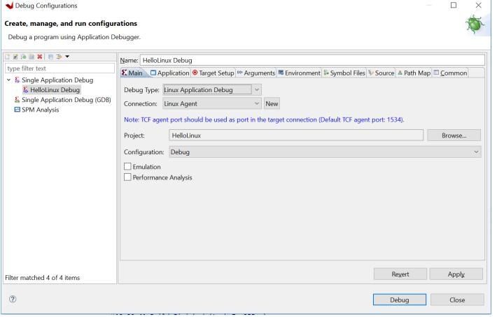

- 7. In the Main tab, Connection field, click **New**.
- 8. In the Target Connection Details dialog box (shown in the following figure):
	- a. Specify the of your choice.
	- b. In the **Host** field, use the target IP address.
	- c. In the **Port** field, specify 1534.


- 9. Set the Application configuration details, as described below (and shown in the following figure).
	- a. Select the **Application** tab.
	- b. Set the **Remote File** path, for example Target Name/tmp/hellolinux.elf and click **Apply**.

10. Click **Debug**.


The Debug Perspective opens (see [Example Design: Debugging the Linux Application Using](#page-78-0) the Vitis [Software](#page-78-0) Platform). From this screen you can:

- Observe that execution stopped at the main() function.
- See disassembly points to the address.
- Setup break points by right clicking the function on the left side of the editor pane (showing the helloworld.c).
- Once a breakpoint is set, it appears in the break point list. You can observe and modify register contents. Notice that the PC register address in the **Registers**Target tab and the address shown in the **Disassembly** tab are the same (see the following figure).
- Use **step-into** (F5), **step-return** (F7), **step-over** (F6), **Resume** (F8) and **continue debugging** outlined in green in the following figure.

**TIP:** *The Linux application output displays in the Vitis software platform console, not the Terminal window used for running Linux.*

11. After you finish debugging the Linux application, close the Vitis IDE.

<span id="page-82-0"/>

## **Example Project: Booting Linux from QSPI Flash**

This Example Project covers the following steps:

- 1. Create the First Stage Boot Loader Executable File.
- 2. Make a Linux-bootable image for QSPI flash.

PetaLinux must be configured for QSPI flash boot mode and rebuilt. By default, the Boot option is SD boot.

**TIP:** *The ZIP file that accompanies this document contains the prebuilt images. If you prefer, you can use these and skip to either [Booting Linux from QSPI Flash](#page-87-0) or [Booting Linux from the SD Card,](#page-87-0) as appropriate to your design.*

- 3. Run the following steps on a Linux machine to change the boot mode to QSPI flash.
	- a. Change to the root directory of your PetaLinux project: $ cd <plnx-proj-root>
	- b. Launch the top-level system configuration menu: $ petalinux-config
	- c. Select **Subsystem AUTO Hardware Settings**.
	- d. Select **Advanced Bootable Images Storage Settings**.
		- i. Select **boot image settings**.
		- ii. Select **Image Storage Media**.
		- iii. Select boot device as **primary flash**.
	- e. Under the **Advanced Bootable Images Storage Settings** sub-menu:
		- i. Select **kernel image settings**.
		- ii. Select **Image Storage Media**.
		- iii. Select the storage device as **primary flash**.
	- f. Save the configuration settings and exit the configuration wizard.
	- g. Rebuild using the petalinux-build command.

*Note***:** For more information, refer to the *PetaLinux Tools Documentation: Reference Guide* [(UG1144](UG1144)).

- 4. Program QSPI flash with the Boot Image Using JTAG and U-Boot Command.
- 5. Boot Linux from QSPI flash.

### *Create the First Stage Boot Loader Executable File*

- 1. Open the Vitis software platform.
- 2. Check that the Target Communication Frame (TCF) (hw_server.exe) agent is running on your Windows machine. If it is not, in the Vitis software platform, select **Xilinx Tools → XSCT Console**.


- 3. In the XSCT Console window, type Connect. A message appears, stating that the hw_server application started, or, if it is already running, you will see tcfchan#, as shown in the following figure.
- 4. In the Vitis software platform, select **File → New → Application Project**. The New Application Project wizard opens.
- 5. Use the information the following table to make your selections in the wizard screens.

| Wizard Screen               | System Property                                        | Setting or Command to Use           |
|-----------------------------|--------------------------------------------------------|-------------------------------------|
| Platform                    | Select a platform from repository                      | Click hw_platform [custom].         |
|                             | Application project name                               | Enter fsbl                          |
| Application Project Details | Select target processor for the<br>Application project | Select ps7_cortexa9_0.              |
| Domain                      | Select a domain                                        | Click standalone on ps7_cortexa9_0. |
| Templates                   | Available Templates                                    | Zynq FSBL                           |


- 6. Click **Finish**. If a pop up message comes up that "This application required xilffs library in Board Support Package", add the xilffs library to the BSP and then and repeat the above steps to create an FSBL standalone application.
The New Project wizard closes. The Vitis software platform creates the fsbl application project under the project explorer. For generating fsbl.elf build the project by rightclicking on the FSBL project and selecting **Build Project**.

### *Make a Linux Bootable Image for QSPI Flash*

- 1. In the Vitis software platform, select **Xilinx → Create Boot Image** to open the Create Boot Image wizard.

- 2. From the **Architecture** drop-down list, select **Zynq**.
- 3. Click **Browse** next to the **Output BIF file path** field, and navigate to your output.bif file.
- 4. Click **Browse** next to the **Output path** field, and navigate to your BOOT.bin file.

*Note***:** The QSPI Boot file, BOOT.bin, is available in the ZIP file that accompanies this guide. See [Design Files for This Tutorial.](#page-120-0)

- 5. Click **Add** to add the following boot image partitions:
	- fsbl.elf (bootloader).

*Note***:** You can find fsbl.elf in <project dir>/fsbl/Debug. Alternatively, you can use fsbl.elf from the file you downloaded in [Requirements.](#page-71-0)

- Add Bitstream file tutorial_bd_wrapper.bit.
- Add U-Boot image u-boot.elf.
- Add the PetaLinux output image, image.ub, and provide the offset 0x520000 (image.ub: PetaLinux image consists of kernel image, device tree blob and minimal rootfs).
- 6. Click **Create Image** to create the BOOT.bin file in the specified output path folder.


### *Program QSPI Flash with the Boot Image Using JTAG*

You can program QSPI Flash with the boot image using JTAG.

- 1. Power on the ZC702 Board.
- 2. If a serial terminal is not already open, connect the serial terminal with the baud rate set to 115200.

*Note***:** This is the baud rate that the UART is programmed to on Zynq devices.

- 3. Select **Xilinx → XSCT Console** to open the XSCT tool.
- 4. From the XSCT prompt, do the following:
	- a. Type connect to connect with the PS section.
	- b. Type targets to get the list of target processors.
	- c. Type ta 2 to select the processor CPU1.
	- d. Type dow fsbl.elf to download the FSBL image.
	- e. Type con and then stop**.**
	- f. Type dow u-boot.elf to download the Linux U-Boot.
	- g. Type dow -data BOOT.bin 0x08000000 to download the Linux bootable image to the target memory at location 0x08000000.

You just downloaded the binary executable to DDR memory. You can download the binary executable to any address in DDR memory.

- h. Type con to start execution of U-Boot.
U-Boot begins booting. On the serial terminal, the autoboot countdown message appears:

Hit any key to stop autoboot: 3

- 5. Press Enter.
Automatic booting from U-Boot stops and the U-Boot command prompt appears on the serial terminal.

- 6. Do the following steps to program U-Boot with the bootable image:
	- a. At the prompt, type sf probe 0 0 0 to select the QSPI Flash.
	- b. Type sf erase 0 0x01000000 to erase the Flash data.

This command completely erases 16 MB of on-board QSPI Flash memory.

- c. Type sf write 0x08000000 0 0xffffff to write the boot image on the QSPI Flash.


Note that you already copied the bootable image at DDR location 0x08000000. This command copied the data, of the size equivalent to the bootable image size, from DDR to QSPI location 0x0.

For this example, because you have 16 MB of Flash memory, you copied 16 MB of data. You can change the argument to adjust the bootable image size.

- 7. Power off the board and follow the booting steps described in the following section.
### *Program QSPI Flash with the Flash Programming Tool*

Following the steps below, you can program QSPI Flash with the flash programming tool in the Vitis software platform:

- 1. Power on the ZC702 Board.
- 2. If a serial terminal is not open, connect the serial terminal with the baud rate set to 115200.

*Note***:** This is the baud rate to which the UART is programmed on Zynq devices.

- 3. Select **Xilinx → Program Flash**.
- 4. Select the BOOT.bin file to flash and select **Program** (see the following figure).

On successful programming, a message appears in the console window saying Flash Operation Successful.

- 5. Power off the board and follow the booting steps in [Booting Linux from QSPI Flash](#page-87-0) or [Booting Linux from the SD Card](#page-87-0), as appropriate to your design.
<span id="page-87-0"/>

### *Booting Linux from QSPI Flash*

- 1. After you program the QSPI Flash, set the SW16 switch on your board as shown in the following figure.
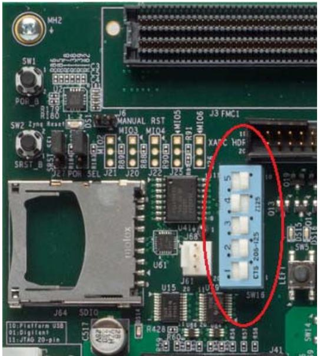

- 2. Connect the Serial terminal using an 115200 baud rate setting.
*Note***:** This is the baud rate that the UART is programmed to on Zynq devices.

- 3. Switch on the board power.
A Linux booting message appears on the serial terminal. After booting finishes, the root@xilinx-zc702-2020_1:~# prompt appears. Enter the login and password as root when prompted.

- 4. Check the Board IP address connectivity as described in [Booting Linux Using JTAG Mode.](#page-74-0)
For Linux Application creation and debugging, refer to [Example Design: Debugging the Linux](#page-78-0) [Application Using the Vitis](#page-78-0) Software Platform.

### *Booting Linux from the SD Card*

- 1. Change the SW16 switch setting as shown in the following figure.


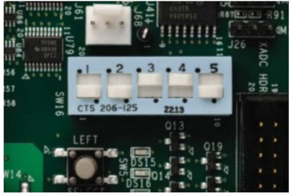

- 2. Make the board settings as described in [Booting Linux Using JTAG Mode](#page-74-0).
- 3. Create a first stage bootloader (FSBL) for your design as described in [Create the First Stage](#page-82-0) [Boot Loader Executable File](#page-82-0).

*Note***:** If you do not need to change the default FSBL image, you can use the fsbl.elf file that you downloaded as part of the ZIP file for this guide. See [Design Files for This Tutorial](#page-120-0).

- 4. In the Vitis IDE, select **Xilinx → Create Boot Image** to open the Create Boot Image wizard.
- 5. Add fsbl.elf, bit file (if any), and u-boot.elf.
- 6. Provide the output folder path in the Output folder field.
- 7. Click **Create Image**. The Vitis software platform generates the BOOT.bin file in the specified folder.


- 8. Copy BOOT.bin and image.ub to the SD card.
- **IMPORTANT!** *Do not change the file names. U-Boot searches for these file names in the SD card while booting the system.*
	- 9. Turn on the power to the board and check the messages on the Serial terminal. The root@plnx_arm:~# prompt appears after Linux booting is complete on the target board.
	- 10. Set the board IP address and check the connectivity as described in [Booting Linux Using](#page-74-0) [JTAG Mode](#page-74-0).

For Linux application creation and debugging, see [Example Design: Debugging the Linux](#page-78-0) [Application Using the Vitis](#page-78-0) Software Platform.


<span id="page-90-0"/>

# *Chapter 7*

*Chapter 7:* Creating Custom IP and Device Driver for Linux

# Creating Custom IP and Device Driver for Linux

In this chapter, you will create an intellectual property (IP) using the Create and Package New IP wizard. You will also design a system to include the new IP created for the Xilinx® Zynq®-7000 SoC device.

For the IP, you will develop a Linux-based device driver as a module that can be dynamically loaded onto the running kernel.

You will also develop Linux-based application software for the system to execute on the Zynq SoC ZC702 board.

# **Requirements**

In this chapter, the target platform points to a ZC702 board. The host platform points a Windows machine that is running the Vivado® Design Suite tools.

The requirements for Linux-based device driver development and kernel compilation are as follows:

- Linux-based workstation. The workstation is used to build the kernel and the device driver for the IP.
- An Eclipse-based integrated development environment (IDE) that incorporates the GNU Toolchain for cross development for target architectures. For Tool related information and installation, refer to the Xilinx Zynq Tools Wiki Page [Support Resources.](#page-121-0)
- Kernel source code and build environment. Refer to the Xilinx Zynq Linux Wiki Page [Support](#page-121-0) [Resources,](#page-121-0) which provides details about the Linux kernel specific to Zynq SoC FPGAs. You can download the Kernel Source files and also get the information for building a Linux kernel for the Zynq SoC FPGA.

*Note***:** You can download kernel source files and u-boot source files from the Xilinx GitHub website [Additional Resources.](#page-121-0)

- Device driver software file (blink.c) and the corresponding header file (blink.h). These files are available in the ZIP file that accompanies this guide. See [Design Files for This Tutorial.](#page-120-0)
<span id="page-91-0"/>

- Application software (linux_blinkled_apps.c) and corresponding header file (blink.h). These files are available in the ZIP file that accompanies this guide. See [Design Files for This](#page-120-0) [Tutorial](#page-120-0).
- If you want to skip the kernel and device driver compilation, use the already compiled images that are required for this section. These images are available in the ZIP file that accompanies this guide. See [Design Files for This Tutorial.](#page-120-0)
- **CAUTION!** *You must build Peripheral IP loadable kernel module (LKM) as part of the same kernel build process that generates the base kernel image. If you want to skip kernel or LKM Build process, use the precompiled images for both kernel and LKM module for this section provided in the ZIP file that accompanies this guide. See [Design Files for This Tutorial.](#page-120-0)*

# **Creating Peripheral IP**

In this section, you will create an AXI4-Lite compliant slave peripheral IP framework using the Create and Package New IP wizard. You will also add functionality and port assignments to the peripheral IP framework.

The Peripheral IP you will create is an AXI4-Lite compliant slave IP. It includes a 28-bit counter. The 4 MSB bits of the counter drive the 4 output ports of the peripheral IP. The block diagram is shown in the following figure.

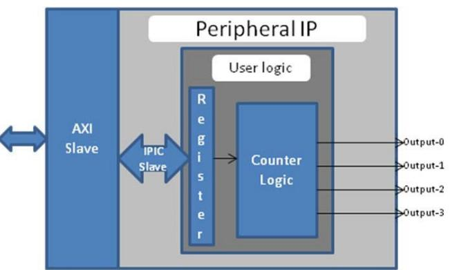

### *Figure 7:* **Block Diagram for Peripheral IP**

The block diagram includes the following configuration register:

| Register Name    | Control Register       |
|------------------|------------------------|
| Relative Address | 0x0000_0000            |
| Width            | 1 bit                  |
| Access Type      | Read/Write             |
| Description      | Start/Stop the Counter |


<span id="page-92-0"/>

| Field Name  | Bits | Type | Reset Value | Description                           |
|-------------|------|------|-------------|---------------------------------------|
| Control Bit | 0    | R/W  | 0x0         | 1 : Start Counter<br>2 : Stop Counter |

### **Example Project: Creating Peripheral IP**

In this section, you will create an AXI4-Lite compliant slave peripheral IP.

- 1. Create a new project as described in [Example Project: Creating a New Embedded Project](#page-11-0) [with Zynq SoC](#page-11-0).
- 2. With the Vivado design open, select **Tools → Create and Package New IP**. Click **Next** to continue.
- 3. Select **Create a new AXI4 peripheral** and then click **Next**.
- 4. Fill in the peripheral details as follows:

| Wizard Screen                | System Property    | Setting or Comment to Use |
|------------------------------|--------------------|---------------------------|
| Peripheral Details           | Name               | Blink                     |
|                              | Version            | 1.0                       |
|                              | Display Name       | Blink_v1.0                |
| Description<br>My new AXI IP |                    |                           |
|                              | IP Location        | C:/designs/ip_repro       |
|                              | Overwrite existing | unchecked                 |

#### 5. Click **Next**.

- 6. In the Add Interfaces page, accept the default settings and click **Next**.
- 7. In the Create Peripheral page, select **Edit IP** and then click **Finish**. Upon completion of the new IP generation process, the Package IP window opens (see the following figure).


- 8. In the Hierarchy tab of the **Sources** window, right-click **blink_v1_0** under the Design Sources folder and select **Open File**. We will need to add Verilog code that creates output ports to map to the external LEDs on the ZC702 board. Navigate to the line //Users to add ports here and add output wire [3:0] leds below this line, as shown in the following example:

```
//Users to add ports here
output wire [3:0] leds,
//User ports ends
```
- 9. Find the instance instantiation to the AXI bus interface and add .leds(leds) as shown in the following example to map the port connections:

```
.S_AXI_RREADY(s00_axi_rready),
.leds(leds)
);
```
- 10. Save and close blink_v1_0.v.
- 11. Under **Sources → Hierarchy → Design Sources → blink_v1_0**, right-click **blink_v1_0_S00_AXI_inst - blink_v1_0_S00_AXI** and select **Open File**.

Next, you will need to add Verilog code that creates output ports to map to the external LEDs on the ZC702 board and also create the logic code to blink the LEDs when Register 0 is written to.

- 12. Navigate to the line //Users to add ports here and add output wire [3:0] leds below this line, as shown in the example below:

```
//Users to add ports here
output wire [3:0] leds,
//User ports ends
```
13. Find the AXI4-Lite signals section:

```
// AXI4LITE signals
 reg [C_S_AXI_ADDR_WIDTH-1 : 0] axi_awaddr;
 reg axi_awready;
 reg axi_wready;
 reg [1 : 0] axi_bresp;
 reg axi_bvalid;
 reg [C_S_AXI_ADDR_WIDTH-1 : 0] axi_araddr;
 reg axi_arready;
 reg [C_S_AXI_DATA_WIDTH-1 : 0] axi_rdata;
 reg [1 : 0] axi_rresp;
 reg axi_rvalid;
```
After this section , you will now add a custom register, which you will use as a counter. Add the following code:

```
// add 28-bit register to use as counter
reg [27:0] count;
```


- 14. Find the I/O connections assignments section:

```
// I/O Connections assignments
assign S_AXI_AWREADY = axi_awready;
 assign S_AXI_WREADY = axi_wready;
 assign S_AXI_BRESP = axi_bresp;
 assign S_AXI_BVALID = axi_bvalid;
 assign S_AXI_ARREADY = axi_arready;
 assign S_AXI_RDATA = axi_rdata;
 assign S_AXI_RRESP = axi_rresp;
 assign S_AXI_RVALID = axi_rvalid;
```
Add the following code at the bottom:

// assign MSB of count to LEDs assign leds = count[27:24];

- 15. Toward the bottom of the file, find the section that states add user logic here. Add the following code, which will increment count while the slv_reg0 is set to 0x1. If the register is not set, the counter does not increment.

```
// Add user logic here
// on positive edge of input clock
always @( posedge S_AXI_ACLK )
begin
//if reset is set, set count = 0x0
if ( S_AXI_ARESETN == 1'b0 )
begin
count <= 28'b0;
end
else
begin
//when slv_reg_0 is set to 0x1, increment count
if (slv_reg0 == 2'h01)
begin
count <= count+1;
end
else
begin
count <= count;
end
end
end
// User logic ends
```
- 16. Save and close blink_v1_0_S00_AXI.v.
- 17. Open the **Package IP blink** tab. Under **Packaging Steps**, select **Ports and Interfaces**.
- 18. Click the **Merge Changes from Ports and Interfaces Wizard** link.


- 19. Make sure that the window is updated and includes the LEDs output ports.

- 20. Under Packaging Steps, select **Review and Package**. At the bottom of the Review and Package window, click **Re-Package IP**.
The dialog box that opens states that packaging is complete and asks if you would like to close the project.

- 21. Click **Yes**.
*Note***:** The custom core creation process that we have worked through is very simple with the example Verilog included in the IP creation process. For more information, refer to the GitHub Zynq Cookbook: How to Run BFM Simulation web page [Additional Resources](#page-121-0).

<span id="page-96-0"/>

# **Integrating Peripheral IP with PS GP Master Port**

Now, you will create a system for the ZC702 board by instantiating the peripheral IP as a slave in the Zynq SoC processing logic (PL) section. You will then connect it with the PS processor through the processing system (PS) general purpose (GP) master port. The block diagram for the system is shown in the following figure.

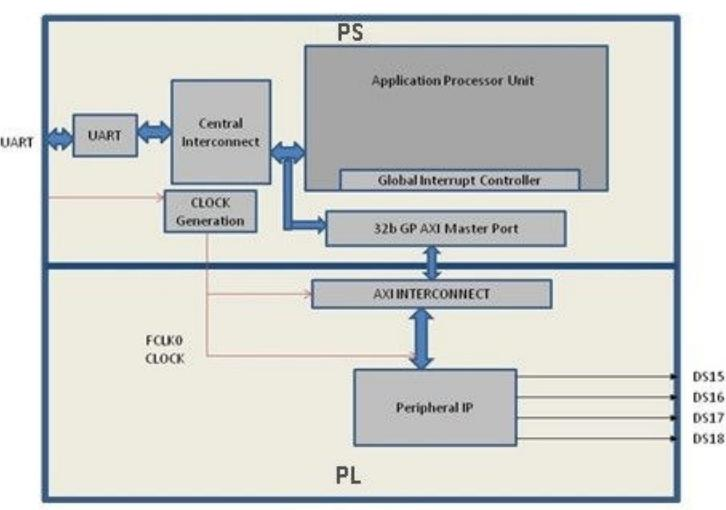


This system covers the following connections:

- Peripheral IP connected to PS General Purpose master port 0 (M_AXI_GP0). This connection is used by the PS CPU to configure Peripheral IP register configurations.
- Four output ports of Peripheral IP connected to DS15, DS16, DS17, and DS18 on-board LEDs.

In this system, when you run application code, a message appears on the serial terminal and asks you to choose the option to make the LEDs start or stop blinking.

- When you select the start option on the serial terminal, all four LEDs start blinking.
- When you select the stop option, all four LEDs stop blinking and retain the previous state.

## **Connecting an AXI4-Lite Compliant Custom Slave IP**

In this section, you will connect an AXI4-Lite compliant custom slave peripheral IP that you created in [Example Project: Creating Peripheral IP.](#page-92-0)


- 1. Open the Vivado project you previously created in [Example Project: Creating a New](#page-11-0) [Embedded Project with Zynq SoC.](#page-11-0)
- 2. Add the custom IP to the existing design. Right-click the Diagram view and select **Add IP**.
- 3. Type blink into the search view. Blink_v1.0 appears. Double-click the IP to add it to the design.
- 4. Click **Run Connection Automation** to make automatic port connections.
- 5. With the **All Automation** box checked by default, click **OK** to make the connections. Your new IP is automatically connected but the leds output port is unconnected.
- 6. Right-click the **leds** port and select **Make External**.

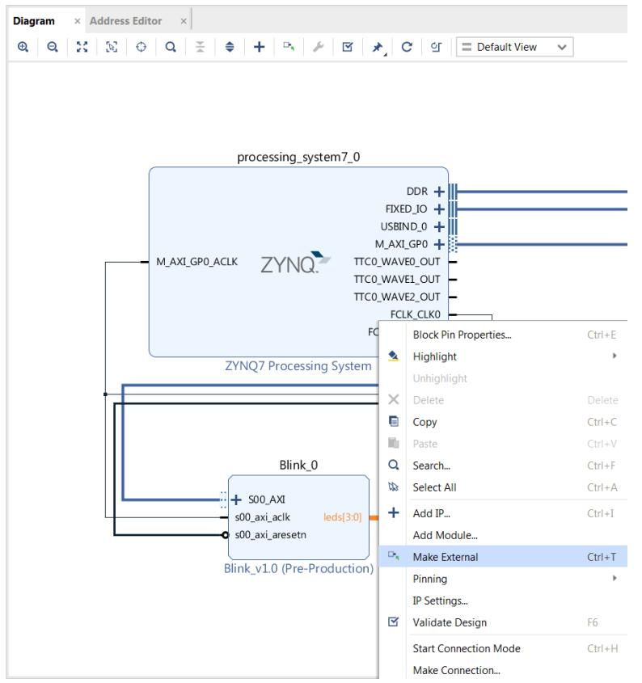

- 7. In the Flow Navigator view, navigate to **RTL Analysis** and select **Open Elaborated Design**.
- 8. Click **OK**.
- 9. After the elaborated design opens, click the **I/O Ports** window and expand **All ports → led_0**.


### *Figure 9:* **I/O Ports**

10. Edit the led port settings as follows:

| Port Name | I/O Std  | Package Pin |
|-----------|----------|-------------|
| Leds[3]   | LVCMOS25 | P17         |
| Leds[2]   | LVCMOS25 | P18         |
| Leds[1]   | LVCMOS25 | W10         |
| Leds[0]   | LVCMOS25 | V7          |

The following figure shows the completed led port settings in the I/O Ports window.

#### *Figure 10:* **LED Port Settings**

#### 11. Select **Generate Bitstream**.

- 12. The Save Project dialog box opens. Ensure that the check box is selected and then click **Save**.
- 13. If a message appears stating that Synthesis is Out-of-date, click **Yes**.
- 14. After the Bitstream generation completes, export the hardware and launch the Vitis unified software platform as described in [Exporting a Hardware Platform.](#page-19-0)

*Note***:** Make sure to select **Include bitstream** instead of **Pre-synthesis** for the **Export Hardware Platform → Output** option.

<span id="page-99-0"/>

# **Linux-Based Device Driver Development**

Modules in Linux are pieces of code that can be loaded and unloaded into the kernel on demand. A piece of code that you add in this way is called a loadable kernel module (LKM). These modules extend the functionality of the kernel without the need to reboot the system. Without modules, you would need to build monolithic kernels and add new functionality directly into the kernel image. Besides having larger kernels, this has the disadvantage of requiring you to rebuild and reboot the kernel every time you want new functionality.

LKMs typically are one of the following things:

- **Device drivers:** A device driver is designed for a specific piece of hardware. The kernel uses it to communicate with that piece of hardware without having to know any details of how the hardware works.
- **Filesystem drivers:** A filesystem driver interprets the contents of a file system as files and directories.
- **System calls:** User space programs use system calls to get services from the kernel.

On Linux, each piece of hardware is represented by a file named as a device file, which provides the means to communicate with the hardware. Most hardware devices are used for output as well as input, so device files provide input/output control (ioctl) to send and receive data to and from hardware. Each device can have its own ioctl commands, which can be of the following types:

- read ioctl. These send information from a process to the kernel.
- write ioctl. These return information to a process.
- Both read and write ioctl.
- Neither read nor write ioctl.

For more details about LKM, refer to the Linux Kernel Module Programming Guide in [Additional](#page-121-0) [Resources.](#page-121-0)

In this section you are going to develop a peripheral IP Device driver as a LKM, which is dynamically loadable onto the running Kernel. You must build peripheral IP LKM as part of the same kernel build process that generates the base kernel image.

*Note***:** If you do not want to compile the device driver, you can skip the example of this section and jump to [Loading Module into Running Kernel and Application](#page-100-0) Execution. In that section, you can use the kernel image, which contains blink.ko (image.ub in the shared ZIP files). See [Design Files for This Tutorial.](#page-120-0)

For kernel compilation and device driver development, you must use the Linux workstation. Before you start developing the device driver, the following steps are required:

- 1. Set the toolchain path in your Linux Workstation.
<span id="page-100-0"/>

- 2. Download kernel source code and compile it. For downloading and compilation, refer to the steps mentioned in Xilinx Zynq Linux Wiki Page [Support Resources](#page-121-0).
### **Example Project: Device Driver Development**

You will use a Linux workstation for this example project. The device driver software is provided in the LKM folder of the ZIP file that accompanies this guide. See [Design Files for This Tutorial.](#page-120-0)

- 1. Under the PetaLinux project directory, use the command below to create your module:
petalinux-create -t modules --name mymodule --enable

```
PetaLinux creates the module under <plnx-project>/project-spec/meta-user/
recipes-modules/.
```
For this exercise, create the "blink" module:

petalinux-create -t modules --name blink --enable

The default driver creation includes a Makefile, C-file, and readme files. In our exercise, PetaLinux creates blink.c, Makefile, and README files. It also contains bit bake recipe blink.bb.

- 2. Change the C-file (driver file) and the make file as per your driver.
- 3. Take the LKM folder (reference files) and copy blink.c and blink.h into this directory.
- 4. Open blink.bb recipe and add blink.h entry in SRC_URI.
- 5. Run the command:

petalinux-build

After successful compilation the .ko file is created in the following location:

```
<petalinux-build_directory>/build/tmp/sysroots-components/zc702_zynq7/
blink/lib/mod
ules/5.4.0-xilinx-v2020.1/extra/blink.ko
```
- 6. You can install the driver using the modprobe command, which will be explained in further detail in the next section.
# **Loading Module into Running Kernel and Application Execution**

In this section you will boot Linux onto the Zynq SoC Board and load the peripheral IP as a LKM onto it. You will develop the application for the system and execute it onto the hardware


<span id="page-101-0"/>

### **Loading Module into Kernel Memory**

The basic programs for inserting LKMs are modprobe. The modprobe command makes an init_module system call to load the LKM into kernel memory. The init_module system call invokes the LKM initialization routine immediately after it loads the LKM. As part of its initialization routine, insmod passes to the address of the subroutine to init_module.

In the peripheral IP device driver, you already set up init_module to call a kernel function that registers the subroutines. It calls the kernel's register_chrdev subroutine, passing the major and minor number of the devices it intends to drive and the address of its own "open" routine among the arguments. The subroutine register_chrdev specifies in base kernel tables that when the kernel wants to open that particular device, it should call the open routine in your LKM.

## **Application Software**

The main() function in the application software is the entry point for the execution. It opens the device file for the peripheral IP and then waits for the user selection on the serial terminal.

If you select the start option on the serial terminal, all four LEDs start blinking. If you select the stop option, all four LEDs stop blinking and retain the previous state.

### **Example Project: Loading a Module into Kernel and Executing the Application**

### *Booting Linux on the Target Board*

Boot Linux on the Zynq SoC ZC702 target board, as described in [Booting Linux on a Zynq SoC](#page-72-0) [Board.](#page-72-0)

### *Loading Modules and Executing Applications*

In this section, you will use the Vitis software platform installed on a Windows machine.

- 1. Open the Vitis software platform.
You must run the Target Communication Frame (TCF) agent on the host machine.

- 2. Select XSCT and then **connect** to connect to the Xilinx Software Command-Line Tool (XSCT).
- 3. In the Vitis software platform, select **File → New → Application Project** to open the New Application Project wizard.
- 4. Use the information in the table below to make your selections in the wizard screens.


| Wizard Screen               | System Property                                        | Setting or Command to Use                                                                                 |
|-----------------------------|--------------------------------------------------------|-----------------------------------------------------------------------------------------------------------|
| Platform                    | Select a platform from repository                      | Click hw_platform [custom].                                                                               |
|                             | Application project name                               | Enter linux_blinkled_app                                                                                  |
| Application Project Details | Select target processor for the<br>Application project | Select ps7_cortexa9 SMP.                                                                                  |
| Domain                      | Select a domain                                        | Click linux_application_domain.                                                                           |
| Domain                      | Application settings                                   | If known, enter the sysroot, root FS, and<br>kernel image paths. Otherwise, leave these<br>options blank. |
| Templates                   | Available Templates                                    | Linux Empty Application                                                                                   |

- 5. Click **Finish**.
The New Project wizard closes and the Vitis software platform creates the linux_blinkled_app project under the project explorer.

- 6. In the Project Explorer tab, expand the **linux_blinkled_app** project, right-click the **src** directory, and select **Import**.
The Import Sources dialog box opens.

- 7. Browse for LKM_App folder and select linux_blinkled_app.c and blink.h files.
*Note***:** The Application software file name for the system is linux_blinkled_app.c and the header file name is blink.h. These files are available in the LKM folder of the ZIP file that accompanies this guide. See [Design Files for This Tutorial.](#page-120-0) Add the linux_blinkled_app.c and blink.h files.

- 8. Click **Finish**.
Right-click on linux_blinkled_app project and select Build Project to generate linux_blinkled_app.elf file in binary folders. Check the console window for the status of this action.

- 9. Connect the board.
- 10. Because you have a bitstream for the PL fabric, you must download the bitstream. Select **Xilinx Tools → Program FPGA**.

The Program FPGA dialog box opens. It displays the bitstream exported from Vivado.

- 11. Click **Program** to download the bitstream and program the PL fabric.
- 12. Follow the steps described in [Chapter 6: Linux Booting and Debug in the Vitis](#page-71-0) Software [Platform](#page-71-0) to load the Linux image and start it.

After the kernel boots successfully, in a serial terminal, navigate to /lib/modules/ <kernel-version>/extra and run the command:

modprobe blink.ko


You will see the following message:

```
<1>Hello module world.
<1>Module parameters were (0xdeadbeef) and "default"
blink_init: Registers mapped to mmio = 0xf09f4000
Registration is a success the major device number is 244.
```
If you want to talk to the device driver, create a device file by running the following command:

mknod /dev/blink_Dev c 244 0

The device file name is important, because the ioctl program assumes that is the file you will use

- 13. Create a device node. Run the mknod command and select the the string from the printed message.
For example, the command **mknod /dev/blink_Dev c 244 0** creates the /dev/blink_Dev node.

- 14. Select **Window → Open Perspective → Remote System Explorer** and click **Open**.
The Vitis software platform opens the Remote Systems Explorer.

- 15. In the Remote Systems Explorer, do the following:
	- a. Right-click and select **New → Connection** to open the New Connection wizard.
	- b. Click the **SSH only** tab and click **Next**.
	- c. In the Host Name tab, type the target board IP.

To determine the target IP, type **ifconfig eth0** at the Zynq> prompt in the serial terminal. The target IP assigned to the board displays.

- d. Set the connection name as **blink** and type a description.
- e. Click **Finish** to create the connection.
- f. Expand **blink → sftp Files → Root**. The Enter Password wizard opens.
- g. Provide the user ID and Password (**root/root**); select the **Save ID** and **Save Password** options.
- h. Click **OK**.

The window displays the root directory content, because you previously established the connection between the Windows host machine and the target board.

- i. Right-click the **/** in the path name and create a new directory; name it Apps.
- j. Using the Remote Systems Perspective explorer, copy the linux_blinkled_app.elf file from the <project-dir> linux_blinkled_app/Debug folder and paste it into the /Apps directory under **blink connection**.
- 16. In the serial terminal, type cd Apps at the Zynq> prompt to open the /Apps directory.


- 17. Go to the Apps directory at the root@xilinx-zc702-2020_1: Linux prompt, and type chmod 777 linux_blinkled_app.elf to change the linux_blinkled_app.elf file mode to executable mode.
- 18. At the root@xilinx-zc702-2020_1: prompt, type ./linux_blinkled_app.elf to execute the application.
- 19. Follow the instruction printed on the serial terminal to run the application. The application asks you to enter 1 or 0 as input.
	- Type 1, and observe the LEDs DS15, DS16, DS17, and DS18. They start glowing.
	- Type 0, and observe that the LEDs stop at their state. No more blinking changes.

Repeat your inputs and observe the LEDs.

20. After you finish debugging the Linux application, close the Vitis software platform.


<span id="page-105-0"/>

*Chapter 8*

*Chapter 8:* Software Profiling Using the Vitis Software Platform

# Software Profiling Using the Vitis Software Platform

In this chapter, you will enable profiling features for the standalone domain or board support package (BSP) and the application related to AXI CDMA, which you created in [Chapter 6: Linux](#page-71-0) [Booting and Debug in the Vitis](#page-71-0) Software Platform.

# **Profiling an Application in the Vitis Software Platform with System Debugger**

Profiling is a method by which the software execution time of each routine is determined. You can use this information to determine critical pieces of code and optimal code placement in a design. Routines that are frequently called are best suited for placement in fast memories, such as cache memory. You can also use profiling information to determine whether a piece of code can be placed in hardware, thereby improving overall performance.

You can use the system debugger in the Vitis unified software platform to profile your application.

- 1. Select the application you want to profile.
- 2. Right click on the application and **Select → Debug As → Launch on Hardware (Application Debugger)**.

If the Confirm Perspective Switch popup window appears, click **Yes**.

The Debug Perspective opens.

- 3. When the application stops at main, open the Target Communication Frame (TCF) profiler view by selecting **Window → Show View → Debug → TCF Profiler**.


- 4. Click the **Start** button to begin profiling. Alternatively, you can select the **Aggregate Per Function** option in the Profiler Configuration dialog box. Adjust the **View Update Interval** according to your required profile sample time. The minimum time is 100 ms.

- 5. Click the **Resume** button to continue running the application.
To view the profile data in the TCF Profiler tab (shown in the following figure), you must add an exit breakpoint for the application to stop.

<span id="page-107-0"/>

## **Additional Design Support Options**

To assist in your design goals, you might want to learn about the System Performance Analysis (SPA) toolbox.

## **The System Performance Analysis (SPA) Toolbox**

To address the need for performance analysis and benchmarking, the Vitis software platform has a System Performance Analysis (SPA) toolbox to provide early exploration of hardware and software systems. You can use this common toolbox for performance validation to ensure consistent and expected performance throughout the design process.

For more information on exploring and exercising the SPA toolbox using the Vitis software platform, refer to the following documentation:

- *Vitis Unified Software Platform Documentation: Embedded Software Development* [(UG1400](UG1400))
- *System Performance Analysis of an SoC* [(XAPP1219](XAPP1219))


<span id="page-108-0"/>

*Chapter 9*

# Linux OS Aware Debugging Using the Vitis Software Platform

OS-aware debugging helps you to visualize OS-specific information such as task lists, processes/ threads that are currently running, process/thread-specific stack trace, registers, and variables view.

*Chapter 9:* Linux OS Aware Debugging Using the Vitis Software Platform

To support this, the debugger needs to be aware of the operating system used on the target and know about the intrinsic nature of the OS.

With OS-aware debugging, you can debug the OS running on the processor cores and the processes/threads running on the OS simultaneously.

The Vitis unified software platform supports the OS-aware debug feature for Linux OS running on Zynq®-7000 SoC devices.

# **Setting Up Linux OS Aware Debugging**

This section describes setting up OS aware debug for a Zynq board running Linux OS.

### **Configure the Linux Kernel**

To be able to read the process list or to allow process or module debugging, the Linux awareness accesses the internal kernel structures using the kernel symbols. Therefore the kernel symbols must be available; otherwise Linux aware debugging is not possible. The vmlinux file must be compiled with debugging information enabled as shown in Configure the Linux Kernel.

*Note***:** The vmlinux file is a statically linked executable file that contains the Linux kernel along with corresponding debug information.

In PetaLinux, enable the below configuration options before compiling the Linux Kernel using the PetaLinux Tools build configuration command.

```
CONFIG_DEBUG_KERNEL=y
CONFIG_DEBUG_INFO=y
```
Follow the below steps to configure the Linux kernel to build with the debug information.


- 1. In the Linux machine terminal window, go to the directory of your PetaLinux project.
$ cd <plnx-proj-root>

- 2. Launch the configuration menu to configure the Linux kernel..
$ petalinux-config -c kernel

- 3. Select **Kernel hacking**.
	- Select **Compile-time checks and compiler options**.
	- Select **Compile the kernel with debug info**.

- 4. Save configuration. This sets the Linux Kernel configuration file options to the following settings. You can verify that these options are enabled by looking in the configuration file:

```
CONFIG_DEBUG_KERNEL=y
CONFIG_DEBUG_INFO=y
```
- 5. Launch the configuration menu to configure the system-level options:
$ petalinux-config

- a. Select **Image Packaging Configuration**.
- b. Select INITRD for **Root filesystem type**.
- c. Save configuration.
- 6. Build the PetaLinux using the PetaLinux build command petalinux-build.
- 7. After PetaLinux builds successfully, copy the vmlinux file to your host machine. This file is needed for the debugger to refer all Linux kernel symbols. Vmlinux generates under <petalinux project file>/images/linux/vmlinux.
- 8. Copy Vmlinux to the host machine to use with the Vitis software platform for debugging the Linux Kernel.


<span id="page-110-0"/>

- 9. Copy the Linux kernel source code to the host machine for debugging. The Linux kernel is present in <petalinux-project>/build/tmp/work-shared/zc702-zynq7/ kernel-source.
*Note***:** This document is composed and exercised using the Windows host machine, so it needs to copy the Linux source code to a location that is accessible for the Vitis tool running locally on Windows host machine.

### **Creating the Hello World Linux Application to Exercise the OS Aware Debugging Feature**

- 1. Open the Vitis software platform.
- 2. Select **File → New → Application Project**.

The New Project wizard opens.

- 3. Use the information below to make your selections in the wizard screens.

| Wizard Screen               | System Property                                        | Setting or Command to Use                                                                                 |  |  |
|-----------------------------|--------------------------------------------------------|-----------------------------------------------------------------------------------------------------------|--|--|
| Platform                    | Select a platform from repository                      | Click hw_platform [custom].                                                                               |  |  |
| Application Project Details | Application project name                               | Enter linux_hello                                                                                         |  |  |
|                             | Select target processor for the<br>Application project | Select ps7_cortexa9 SMP.                                                                                  |  |  |
| Domain                      | Select a domain                                        | Click linux_application_domain.                                                                           |  |  |
| Domain                      | Application settings                                   | If known, enter the sysroot, root FS, and<br>kernel image paths. Otherwise, leave these<br>options blank. |  |  |
| Templates                   | Available Templates                                    | Linux Empty Application                                                                                   |  |  |

- 4. Click **Finish**.
- 5. In the Project Explorer view, expand the linux_hello project, right-click the src directory, and select **Import** to open the Import dialog box.
- 6. Expand **General** in the Import dialog box and select **File System**.
- 7. Click **Next**.
- 8. Select **Browse**.
- 9. Navigate to your design files folder and select the OSA folder and click **OK**.

*Note***:** For more information about downloading the design files for this tutorial, see [Design Files for](#page-120-0) [This Tutorial](#page-120-0).

- 10. Add the linux_hello.c file and click **Finish**.
The Vitis software platform automatically builds the application and displays the status in the console window.

- 11. Copy linux_hello.elf to an SD card.
<span id="page-111-0"/>

# **Debugging Linux Processes and Threads Using OS Aware Debug**

- 1. Boot Linux as described in [Booting Linux from the SD Card](#page-87-0).
- 2. Create a Debug configuration.
- 3. Right-click **linux_hello** and select **Debug as → Debug Configurations**.

The Debug Configurations wizard opens, as shown in the following figure.

- 4. In Main window, from the **Debug Type** drop-down list, select **Attach to running target**.
- 5. From the **Connection** drop-down list, select **Local**.
- 6. Click **Debug**.
- 7. If the Confirm Perspective Switch dialog box appears, click **Yes**.

Debugger_linux_hello-Default opens in the Debug view, as shown in the following figure.

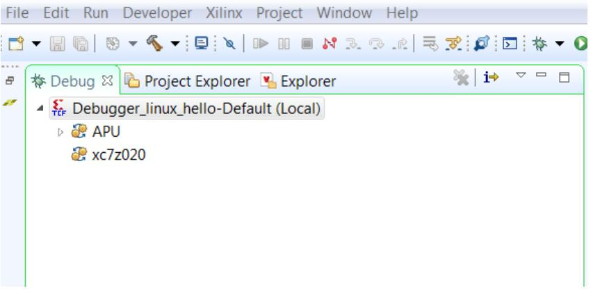

- 8. Set up the Linux kernel symbol file and enable the Linux OS awareness in the debug configuration.


There are multiple options provided by the Vitis software platform to enable Linux OS awareness feature enablement and debugging the applications. The following options are listed in the Symbol File dialog box.

- **Enable Linux OS Awareness:** This option enables the OS awareness.
- **Auto refresh on exec:**

When this option is selected, all running processes are refreshed and displayed in the Debug view.

When this option is disabled, the new processes are not displayed in the Debug view.

- **Auto refresh on suspend:**
When this option is selected, all processes will be re-synced whenever the processor suspends.

When this option is disabled, only the current process will be re-synced.

- 9. In the Debug view, right-click **Debugger_linux_hello-Debug (Local)** and select **Edit Debugger_linux_hello-Default (Local)**.
- 10. Click the **Symbol Files** tab.
- 11. Select **/APU/Arm_Cortex_A9MPCore #0** from the Debug Context drop-down menu and click **Add**.

The Symbol File dialog box opens.

- 12. Click the **Browse** button .
- 13. Provide the path of the vmlinux file that you saved locally on the Windows host machine in the previous section, and check the box for **Enable OS awareness- the file is an OS kernel**, **Auto refresh on exec** , and **Auto refresh on suspend** as shown in the following figure.


- 14. You can also enable the **Auto refresh on exec** and **Auto refresh on suspend** options to get the refreshed process data while debugging the current application.
- 15. Click **OK**.

The Symbol File window closes.

- 16. Click **Continue** and then click **Save** for saving the configuration changes.
The Debug view opens, as shown in the following figure.


You can see the Linux Kernel and list of processes running on the target.

*Note***:** Because the Linux Kernel is built on a different system (Linux Machine) than the host machine (Windows Machine) on which we are exercising the Linux OS aware application debug, symbol files path mapping information should be added.

Path mapping will enable you to get source-level debugging and see stack trace, variables, setting up source level breakpoints, and so on.

The debugger uses the Path Map setting to search and load symbols files for all executable files and shared libraries in the system.


- 17. Set up the Path Map.
	- a. Click the **Path Map** tab.
	- b. Click **Add**.
	- c. The source path for the kernel is the compilation directory path from the Linux machine as shown in the previous figure. For example, <petalinux-project>/build/tmp/ work-shared/zc702-zynq7/kernel-source.

The destination path is the host location where you copied kernel in the earlier step. For example, <local directory>/linux-xlnx.

- d. Click **Apply** to apply the changes.
- e. Click **Continue** to debug.


#### 18. Debug a Linux Process or thread.

As shown in [Debugging Linux Processes and Threads Using OS Aware Debug ,](#page-111-0) the list of processes running on the target is displayed. You can right-click any process and click **Suspend**. Using this method, you can exercise debugging features such as watch stack trace, registers, adding break points, and so on.

In the following figure, the suspended process is named 1 init.

*Note***:** The addresses shown on this page might differ slightly from the addresses shown on your system.


### **Debugging the linux_hello Application with OS Aware Debug**

- 1. Mount an SD card using mount /dev/mmcblk0p1 /mnt.
- 2. Run the /mnt/linux_hello.elf application from the terminal as shown in the following figure.

- 3. To debug the linux_hello application you created in the previous section using OS aware debug, follow the steps described in [Debugging Linux Processes and Threads Using OS](#page-111-0) [Aware Debug ,](#page-111-0) and in addition, add the path mappings for the linux_hello application as given in the following figure.
The source path is /linux_hello.elf. The destination path is <vitisworkspace>linux_hello/Debug/linux_hello.elf.

- 4. In the Debug view, right-click on **Debugger_linux_hello-Default (Local)** and select **Relaunch**.
- 5. In the Vitis debugger, do the following:
	- a. Observe the running application as one of the processes/threads in kernel.
	- b. Right-click on the linux_hello.elf thread and click **Suspend** to suspend application.
	- c. Add a breakpoint.

These actions are shown in the following figure.


When the control hits the breakpoint, the Debug view updates with the information of the linux_hello.elf process.

The Debug View also shows the file, function, and the line information of the breakpoint hit. A thread label includes the name of a CPU core, if the thread is currently running on a core.

You can perform source-level debugging, such as stepping in, stepping out, watching variables, stack trace, and registers.

You can perform process/thread level debugging, including insert breakpoints, step in, step out, watch variables, stack trace, and so on.

*Note***:** One limitation with this process is that the target side path for a binary file does not include a mount point path. For example, when the linux_hello process is located on an SD card, which is mounted at / mnt, the debugger shows the file as /linux_hello.elf instead of /mnt/linux_hello.elf

*Note***:** There is an additional way to Enable Linux OS Awareness in the Vitis software platform using an XSCT command line command. For information about this command, refer to the osa command help in *Xilinx Software Command-Line Tool (XSCT) Reference Guide* [(UG1208](UG1208)).


<span id="page-119-0"/>

# *Appendix A*

*Appendix A:* Additional Resources and Legal Notices

# Additional Resources and Legal Notices

## **Xilinx Resources**

For support resources such as Answers, Documentation, Downloads, and Forums, see [Xilinx](https://www.xilinx.com/support) [Support](https://www.xilinx.com/support).

## **Solution Centers**

See the [Xilinx Solution Centers](https://www.xilinx.com/support/solcenters.htm) for support on devices, software tools, and intellectual property at all stages of the design cycle. Topics include design assistance, advisories, and troubleshooting tips.

# **Documentation Navigator and Design Hubs**

Xilinx® Documentation Navigator (DocNav) provides access to Xilinx documents, videos, and support resources, which you can filter and search to find information. To open DocNav:

- From the Vivado® IDE, select **Help → Documentation and Tutorials**.
- On Windows, select **Start → All Programs → Xilinx Design Tools → DocNav**.
- At the Linux command prompt, enter docnav.

Xilinx Design Hubs provide links to documentation organized by design tasks and other topics, which you can use to learn key concepts and address frequently asked questions. To access the Design Hubs:

- In DocNav, click the **Design Hubs View** tab.
- On the Xilinx website, see the [Design Hubs](https://www.xilinx.com/cgi-bin/docs/ndoc?t=design+hubs) page.


<span id="page-120-0"/>

*Note***:** For more information on DocNav, see the [Documentation Navigator](https://www.xilinx.com/cgi-bin/docs/rdoc?t=docnav) page on the Xilinx website.

## **Related Design Hubs**

The following design hubs are applicable to embedded development and the methods described in this guide:

- [PetaLinux Tools Design Hub](https://www.xilinx.com/cgi-bin/docs/ndoc?t=design+hubs;d=dh0016-petalinux-tools-hub.html)
# **Design Files for This Tutorial**

The ZIP file associated with this document contains the design files for the tutorial. You can download this file from [this link.](https://www.xilinx.com/cgi-bin/docs/ctdoc?cid=584abf8e-7c05-471e-ab16-6135205cfbd9;d=ug1165-zynq-embedded-design-tutorial.zip)

Design files contain the HDF files for each section, and the source code and pre-built images for all the sections.

# **References**

These documents provide supplemental material useful with this guide:

- 1. *Zynq-7000 SoC Technical Reference Manual* [(UG585](UG585))
- 2. *Vivado Design Suite User Guide: Design Flows Overview* ([UG892)](https://www.xilinx.com/cgi-bin/docs/rdoc?v=2020.1;d=ug892-vivado-design-flows-overview.pdf)
- 3. *Zynq-7000 SoC Software Developers Guide* ([UG821)](https://www.xilinx.com/cgi-bin/docs/ndoc?t=user_guides;d=ug821-zynq-7000-swdev.pdf)
- 4. *Vivado Design Suite User Guide: Using Constraints* [(UG903](UG903))
- 5. *Vivado Design Suite User Guide: Getting Started* [(UG910](UG910))
- 6. *Vivado Design Suite Tutorial: Embedded Processor Hardware Design* [(UG940](UG940))
- 7. *Vivado Design Suite User Guide: Release Notes, Installation, and Licensing* ([UG973)](https://www.xilinx.com/cgi-bin/docs/rdoc?v=2020.1;t=vivado+install+guide)
- 8. *UltraFast Embedded Design Methodology Guide* [(UG1046](UG1046))
- 9. *PetaLinux Tools Documentation: Reference Guide* [(UG1144](UG1144))
- 10. *System Performance Analysis of an SoC* ([XAPP1219)](https://www.xilinx.com/support/documentation/application_notes/xapp1219-system-performance-modeling.pdf)
- 11. *Vitis Unified Software Platform Documentation: Embedded Software Development* ([UG1400)](https://www.xilinx.com/cgi-bin/docs/rdoc?v=2020.1;d=ug1400-vitis-embedded.pdf)
- 12. *Xilinx Software Command-Line Tool (XSCT) Reference Guide* ([UG1208)](https://www.xilinx.com/cgi-bin/docs/rdoc?v=2020.1;d=ug1208-xsct-reference-guide.pdf)

<span id="page-121-0"/>

### **Support Resources**

- [Embedded Design Tools Web page](https://www.xilinx.com/support/download/index.html/content/xilinx/en/downloadNav/embedded-design-tools.html)
- Xilinx Zynq® [Tools Wiki Page](http://www.wiki.xilinx.com/zynq-tools)
- • [Xilinx Zynq Linux Wiki page](http://wiki.xilinx.com/zynq-linux)
- [](https://www.xilinx.com/products/design-tools/software-zone/sdsoc.html#docsdownload)

## **Additional Resources**

- The Effect and Technique of System Coherence in Arm® Multicore Technology by John Goodacre, Senior Program Manager, Arm® Processor Division [(http://www.mpsoc-forum.org/](http://www.mpsoc-forum.org/previous/2008/slides/8-6%20Goodacre.pdf) [previous/2008/slides/8-6%20Goodacre.pdf)](http://www.mpsoc-forum.org/previous/2008/slides/8-6%20Goodacre.pdf)
- Arm Cortex™-A9 MPCore Technical Reference Manual, section 2.4, Accelerator Coherency Port [(http://infocenter.arm.com/help/index.jsp?topic=/com.arm.doc.ddi0407e/](http://infocenter.arm.com/help/index.jsp?topic=/com.arm.doc.ddi0407e/CACGGBCF.html) [CACGGBCF.html](http://infocenter.arm.com/help/index.jsp?topic=/com.arm.doc.ddi0407e/CACGGBCF.html))
- Xilinx GitHub website:<https://github.com/xilinx>
- GitHub ZYNQ Cookbook: How to Run BFM Simulation: [https://github.com/imrickysu/ZYNQ-](https://github.com/imrickysu/ZYNQ-Cookbook/wiki/How-to-run-BFM-simulation)[Cookbook/wiki/How-to-run-BFM-simulation](https://github.com/imrickysu/ZYNQ-Cookbook/wiki/How-to-run-BFM-simulation)
- The Linux Kernel Module Programming Guide:<http://tldp.org/LDP/lkmpg/2.6/html/index.html>

# **Training Resources**

Xilinx provides a variety of training courses and QuickTake videos to help you learn more about the concepts presented in this document. Use these links to explore related training resources:

- 1. [Designing FPGAs Using the Vivado Design Suite 1 Training Course](https://www.xilinx.com/cgi-bin/docs/ndoc?t=training;d=designing-fpgas-vivado-design-suite-1.html)
- 2. [Designing FPGAs Using the Vivado Design Suite 2 Training Course](https://www.xilinx.com/cgi-bin/docs/ndoc?t=training;d=designing-fpgas-vivado-design-suite-2.html)
- 3. [Designing FPGAs Using the Vivado Design Suite 3 Training Course](https://www.xilinx.com/cgi-bin/docs/ndoc?t=training;d=designing-fpgas-vivado-design-suite-3.html)
- 4. [Designing FPGAs Using the Vivado Design Suite 4 Training Course](https://www.xilinx.com/cgi-bin/docs/ndoc?t=training;d=designing-fpgas-vivado-design-suite-4.html)
- 5. [Vivado Design Suite QuickTake Video: Using Vivado Design Suite with Revision Control](https://www.xilinx.com/cgi-bin/docs/ndoc?t=video;d=hardware/vivado-design-suite-revision-control.html)
- 6. [Vivado Design Suite QuickTake Video: Using the Vivado Timing Constraint Wizard](https://www.xilinx.com/cgi-bin/docs/ndoc?t=video;d=hardware/using-vivado-timing-constraint-wizard.html)
- 7. [Vivado Design Suite QuickTake Video Tutorials](https://www.xilinx.com/cgi-bin/docs/ndoc?t=vivado+videos)

<span id="page-122-0"/>

## **Please Read: Important Legal Notices**

The information disclosed to you hereunder (the "Materials") is provided solely for the selection and use of Xilinx products. To the maximum extent permitted by applicable law: (1) Materials are made available "AS IS" and with all faults, Xilinx hereby DISCLAIMS ALL WARRANTIES AND CONDITIONS, EXPRESS, IMPLIED, OR STATUTORY, INCLUDING BUT NOT LIMITED TO WARRANTIES OF MERCHANTABILITY, NON-INFRINGEMENT, OR FITNESS FOR ANY PARTICULAR PURPOSE; and (2) Xilinx shall not be liable (whether in contract or tort, including negligence, or under any other theory of liability) for any loss or damage of any kind or nature related to, arising under, or in connection with, the Materials (including your use of the Materials), including for any direct, indirect, special, incidental, or consequential loss or damage (including loss of data, profits, goodwill, or any type of loss or damage suffered as a result of any action brought by a third party) even if such damage or loss was reasonably foreseeable or Xilinx had been advised of the possibility of the same. Xilinx assumes no obligation to correct any errors contained in the Materials or to notify you of updates to the Materials or to product specifications. You may not reproduce, modify, distribute, or publicly display the Materials without prior written consent. Certain products are subject to the terms and conditions of Xilinx's limited warranty, please refer to Xilinx's Terms of Sale which can be viewed at [](https://www.xilinx.com/legal.htm#tos) [](https://www.xilinx.com/legal.htm#tos;](https://www.xilinx.com/legal.htm#tos;](https://www.xilinx.com/legal.htm#tos) IP cores may be subject to warranty and support terms contained in a license issued to you by Xilinx. Xilinx products are not designed or intended to be fail-safe or for use in any application requiring fail-safe performance; you assume sole risk and liability for use of Xilinx products in such critical applications, please refer to Xilinx's Terms of Sale which can be viewed at [](https://www.xilinx.com/legal.htm#tos.](https://www.xilinx.com/legal.htm#tos.](https://www.xilinx.com/legal.htm#tos)

#### **AUTOMOTIVE APPLICATIONS DISCLAIMER**

AUTOMOTIVE PRODUCTS (IDENTIFIED AS "XA" IN THE PART NUMBER) ARE NOT WARRANTED FOR USE IN THE DEPLOYMENT OF AIRBAGS OR FOR USE IN APPLICATIONS THAT AFFECT CONTROL OF A VEHICLE ("SAFETY APPLICATION") UNLESS THERE IS A SAFETY CONCEPT OR REDUNDANCY FEATURE CONSISTENT WITH THE ISO 26262 AUTOMOTIVE SAFETY STANDARD ("SAFETY DESIGN"). CUSTOMER SHALL, PRIOR TO USING OR DISTRIBUTING ANY SYSTEMS THAT INCORPORATE PRODUCTS, THOROUGHLY TEST SUCH SYSTEMS FOR SAFETY PURPOSES. USE OF PRODUCTS IN A SAFETY APPLICATION WITHOUT A SAFETY DESIGN IS FULLY AT THE RISK OF CUSTOMER, SUBJECT ONLY TO APPLICABLE LAWS AND REGULATIONS GOVERNING LIMITATIONS ON PRODUCT LIABILITY.


#### **Copyright**

© Copyright 2015–2020 Xilinx, Inc. Xilinx, the Xilinx logo, Alveo, Artix, Kintex, Spartan, Versal, Virtex, Vivado, Zynq, and other designated brands included herein are trademarks of Xilinx in the United States and other countries. PCI, PCIe, and PCI Express are trademarks of PCI-SIG and used under license. AMBA, AMBA Designer, Arm, ARM1176JZ-S, CoreSight, Cortex, PrimeCell, Mali, and MPCore are trademarks of Arm Limited in the EU and other countries. All other trademarks are the property of their respective owners.

