# **Zynq-7000 All Programmable SoC Software Developers Guide**

**UG821 (v12.0) September 30, 2015**


# **Revision History**

The following table shows the revision history for this document.

| Date       | Version | Revision                                                                                                                                                                                                                                                                                                    |
|------------|---------|-------------------------------------------------------------------------------------------------------------------------------------------------------------------------------------------------------------------------------------------------------------------------------------------------------------|
| 09/30/2015 | 12.0    | Removed LibXil SKey and LibXil RSA. Added references to the library locations.                                                                                                                                                                                                                              |
| 06/24/2015 | 11.0    | Updated Appendix B, LibXil SKey for Zynq-7000 AP SoC Devices (v2.1).<br>Changed Vivado Device Programmer to Vivado hardware manager.<br>Changed Platform Reference Manual reference to Generating Software Platforms<br>(UG1138)<br>Updated Bootgen options to match -h in Vivado Tcl Console in Table A-3. |
| 04/01/2015 | 10.1    | Added miscellaneous references throughout the document.<br>Updated BIF File Attributes.<br>Added Bootgen Command Options.<br>Updated Partition Attribute Bits.                                                                                                                                              |
| 06/04/2014 | 9.0     | Updated Bootgen to remove the -i option in Bootgen Command Options.<br>Throughout document, added cross-references and updated links in Appendix D,<br>Additional Resources and Legal Notices.<br>Added definitions for RSA and SHA-2.<br>Removed reference to UG652.<br>Changed AP to PS on page 23.       |
| 04/02/2014 | 8.0     | Initial release for 2014.1.                                                                                                                                                                                                                                                                                 |


# [Table of Contents](#page-4-0)

#### **Chapter 1: [Introduction to Programming with Zynq-7000 AP SoC Devices](#page-4-0)**

| Overview. 5                            |  |
|----------------------------------------|--|
| Introduction 5                         |  |
| Architectural Decisions 6              |  |
| Operating System (OS) Considerations 7 |  |

#### **Chapter 2: [Software Application Development Flows](#page-8-0)**

| Introduction 9                           |  |
|------------------------------------------|--|
| Software Tools Overview 10               |  |
| Bare-Metal Device Driver Architecture 14 |  |
| Bare-Metal Application Development 17    |  |
| Linux Application Development 21         |  |
| Additional Information 26                |  |

#### **Chapter 3: [Boot and Configuration](#page-26-0)**

| Overview. 27             |  |
|--------------------------|--|
| Boot Modes 28            |  |
| Boot Stages. 28          |  |
| Boot Image Creation 48   |  |
| BootROM Header Format 51 |  |

#### **[Chapter](#page-51-0) 4: Linux**

| Introduction 52                 |  |
|---------------------------------|--|
| Git Server and Gitk Command. 52 |  |
| Linux BSP Contents 53           |  |
| U-Boot. 54                      |  |

#### **Appendix A: [Using Bootgen](#page-54-0)**

| Introduction 55                                     |  |
|-----------------------------------------------------|--|
| BIF File Syntax 55                                  |  |
| Initialization Pairs and the INT File Attribute. 58 |  |
| Encryption Overview 59                              |  |
| Authentication Overview 60                          |  |


| Bootgen Command Options 61  |  |
|-----------------------------|--|
| Image Header Table 63       |  |
| Partition Header Table. 64  |  |
| Partition Attribute Bits 65 |  |
| Image Header 66             |  |

#### **Appendix B: [Additional Resources and Legal Notices](#page-66-0)**

| Xilinx Resources 67                     |  |
|-----------------------------------------|--|
| Solution Centers. 67                    |  |
| References 67                           |  |
| Please Read: Important Legal Notices 68 |  |

# *Chapter 1*


# <span id="page-4-0"/>Introduction to Programming with Zynq-7000 AP SoC Devices

# <span id="page-4-1"/>**Overview**

This document summarizes the software-centric information required for designing with Xilinx® Zynq®-7000 All Programmable SoC devices. It assumes that you are:

- Experienced with embedded software design
- Familiar with ARM® development tools
- Familiar with Xilinx FPGA devices, intellectual property (IP cores), development tools, and tool environments.

# <span id="page-4-2"/>**Introduction**

The addition of extensibility of the SoC for both hardware and software programmability imposes new requirements on design flows for both hardware and software.

Certain hardware features are unique to Xilinx, such as hardware co-simulation and co-debug functionality that make it possible to verify custom logic implemented on Zynq-7000 AP SoC devices or in a logic simulation environment while applications execute on a Zynq-7000 AP SoC processor on a physical board or an emulator.

For a step-by-step explanation on designing a Zynq-based embedded system, see the following documents:

- *Vivado Design Suite Tutorial: Embedded Processor Hardware Design* (UG940*)* [\[Ref](#page-67-1) 6]
- *Vivado Design Suite User Guide: Embedded Processor Hardware Design* (UG898) [\[Ref](#page-67-2) 5]
- *Vivado Design Suite Tutorial: Zynq-7000 All Programmable SoC Embedded Design*  (UG1165) [\[Ref](#page-67-3) 16]


**VIDEO:** *See* [Enabling Smarter Systems](http://www.xilinx.com/products/silicon-devices/soc/zynq-7000/smarter-system.html) *for quick-take videos on the Zynq-7000 AP SoC devices.*


# <span id="page-5-0"/>**Architectural Decisions**

You must make several architectural decisions before beginning embedded development on applications to run on the Zynq-7000 AP SoC.

Because the Zynq-7000 AP SoC devices have dual-core ARM Cortex™-A9 processors, you must determine whether to use Asymmetric Multiprocessing (AMP) or Symmetric Multiprocessing (SMP).

The same decision must be made for all embedded software projects: which operating system(s) to use (if any). This introduction defines both AMP and SMP, and provides an assessment of the trade-offs and concerns with each method.

### **Multiprocessing Considerations**

The following subsections describe the two multiprocessing considerations.

#### *Asymmetric Multiprocessing*

Asymmetric multiprocessing (AMP) is a processing model in which each processor in a multiple-processor system executes a different operating system image while sharing the same physical memory. Each image can be of the same operating system, but more typically, each image is a different operating system, complementing the other OS with different characteristics:

- A full-featured operating system, such as Linux, lets you connect to the outside world through networking and user interfaces.
- A smaller, light-weight operating system can be more efficient with respect to memory and real-time operations.

A typical example is running Linux as the primary operating system along with a smaller, light-weight operating system, such as FreeRTOS or a bare-metal system, which is described in [Chapter](#page-51-3) 4, Linux, as the secondary operating system.

The division of system devices (such as the UART, timer-counter, and Ethernet) between the processors is a critical element in system design. In general:

- Most devices must be dedicated to their assigned processor.
- The interrupt controller is designed to be shared with multiple processors.
- One processor is designated as the interrupt controller master because it initializes the interrupt controller.

Communication between processors is a key element that allows both operating systems to be effective. It can be achieved in many different ways, including inter-processor interrupts, shared memory, and message passing.


#### *Symmetric Multiprocessing*

Symmetric multiprocessing (SMP) is a processing model in which each processor in a multiple-processor system executes a single operating system image. The scheduler of the operating system is responsible for scheduling processes on each processor.

This is an efficient processing model when the selected single operating system meets the system requirements. The operating system uses the processing power of multiple processors automatically and is consequently transparent to the end user. Programmers can:

- Specify a specific processor to execute a process
- Handle interrupts with any available processor
- Designate one processor as the master for system initialization and booting other processors

# <span id="page-6-0"/>**Operating System (OS) Considerations**

### **Bare-Metal System**

*Bare-metal* refers to a software system without an operating system. This software system typically does not need many features (such as networking) that are provided by an operating system. An operating system consumes some small amount of processor throughput and tends to be less deterministic than simple software systems. Some system designs might not allow the overhead and lack of determinism of an operating system. As processing speed has continued to increase for embedded processing, the overhead of an operating system has become mostly negligible in many system designs. Some designers choose not to use an operating system due to system complexity.

### **Operating System: Linux**

Linux is an open-source operating system used in many embedded designs. It is available from many vendors as a distribution, or it can be built from the open-source repositories. Linux is not inherently a real-time operating system, but it has taken on more real-time characteristics.

It is a full-featured operating system that takes advantage of the memory management unit (MMU) in the processor, and is consequently regarded as a protected operating system. Linux also provides SMP capabilities to take advantage of multiple processors.


### **Real-Time Operating System**

Some system designers use a *real-time operating system* (RTOS) from Xilinx third-party partners.

An RTOS offers the deterministic and predictable responsiveness required by timing sensitive applications and systems. For information on the latest third party tools, contact your nearest Xilinx office.

### **Zynq-7000 Operating Systems From Partners**

You can choose you own favorite embedded solutions based on past experience, new standards, unique requirements, and legacy designs, as well as corporate agreements.

For a detailed list of operating systems supported on Zynq-7000 devices from Xilinx partners, see the [Zynq-7000 Ecosystem page](http://www.xilinx.com/products/silicon-devices/soc/zynq-7000/ecosystem/index.htm).

*Chapter 2*


# <span id="page-8-0"/>Software Application Development Flows

# <span id="page-8-1"/>**Introduction**

The Zynq®-7000 All Programmable (AP) SoC software application development flows let you create software applications using a unified set of Xilinx® tools, and leverage a broad range of tools offered by third-party vendors for the ARM® Cortex™-A9 processors.

This chapter focuses on Xilinx tools and flows; however, the concepts are generally applicable to third party tools, and the Zynq-7000 AP SoC device solutions incorporate familiar components such as an Eclipse-based integrated development environment (IDE) and the GNU compiler toolchain.

This chapter also provides an overview of bare-metal and Linux software application development flows using Xilinx tools, which mirror support available for other Xilinx embedded processors, with differences as noted. This chapter also references boot, device configuration, and OS usage within the context of application development flows. Those topics are covered in-depth in other chapters and references to other material.


The following figure shows a block diagram of the Zynq-7000 AP SoC device processor.

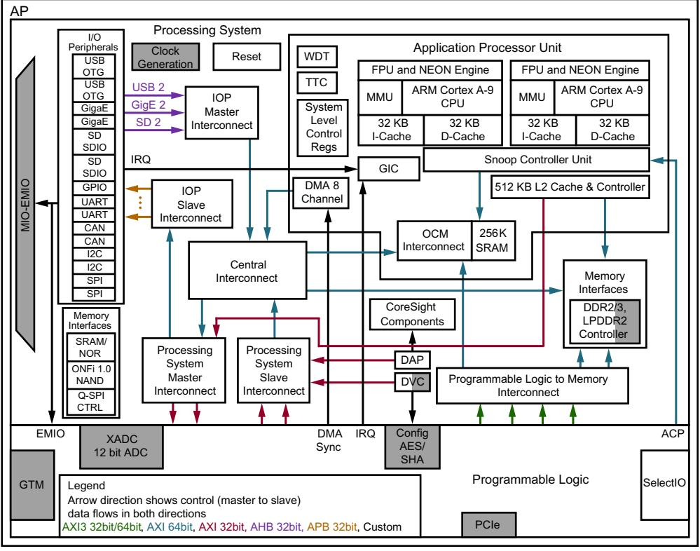

*Figure 2-1:* **Zynq-7000 AP SoC Processing System High-Level Diagram**

# <span id="page-9-0"/>**Software Tools Overview**

The coupling of ARM-based Processing System (PS) and Programmable Logic (PL) creates unique opportunities to add custom peripherals and co-processors. Custom logic implemented in the PL can be used to accelerate time-critical software functions, reduce application latency, reduce system power, or provide solution-specific hardware features.

The addition of hardware programmability to the hardware and software interface imposes new requirements on design flows. Certain hardware features are unique to Xilinx, such as hardware co-simulation and co-debug functionality that make it possible to verify custom logic implemented on Zynq-7000 AP SoC devices or in a logic simulation environment while applications execute on a Zynq-7000 AP SoC device processor on a physical board or an emulator.

;


Xilinx provides design tools for developing and debugging software applications for Zynq-7000 AP SoC devices, that include:

- Software IDE
- GNU-based compiler toolchain
- JTAG debugger
- Associated utilities

These tools let you develop both:

- Bare-metal applications that do not require an OS
- Applications for the open source Linux OS

Custom logic and user software can run various combinations of physical hardware or simulation, with the ability to monitor hardware events. For example:

- Custom logic running in hardware or in a simulation tool
- User software running on the target or in a software emulator
- PL and processor cross-triggering on events

Software solutions are also available from third-party sources that support Cortex-A9 processors, including, but not limited, to:

- Software IDEs
- Compiler toolchains
- Debug and trace tools
- Embedded OS and software libraries
- Simulators
- Models and virtual prototyping tools

Third party tool solutions vary in the level of integration and direct support for Zynq-7000 AP SoC devices. Xilinx does not provide tools that target Kernel development and debug, but those tools can be obtained from third party vendors.

The following subsections provide a summary of the available Xilinx development tools. Tools are available on 32- and 64-bit Windows and x86 Linux host computing platforms.


### **Hardware Configuration Tool**

Xilinx provides the Vivado IP integrator which lets you use a block diagram to configure IP that is related to the PL and the Zynq-7000 AP SoC device processor.

The Vivado Design Suite IP integrator provides a block diagram for the Zynq-7000 AP SoC wherein you can set Programmable Logic (PL) information in an XML file, INIT files (.h,.c, and .tcl), which are then used by software design tools to create and configure Board Support Package (BSP) libraries, infer compiler options, define JTAG settings, and automate other operations that require information about the hardware.

For more information, see the following documents:

- *Vivado Design User Guide: Embedded Processor Hardware Design* (UG898*)* [\[Ref](#page-67-2) 5]
- *Vivado Design Suite Tutorial: Embedded Processor Hardware Design* (UG940) [\[Ref](#page-67-1) 6]
- *Vivado Design Suite User Guide: Using the Vivado IDE* (UG893) [\[Ref](#page-67-4) 7]
- *Vivado Design Suite User Guide: Designing IP Subsystems Using IP Integrator* (UG994) [\[Ref](#page-67-5) 8]

### **Software Development Kit**

The Xilinx Software Development Kit (SDK) provides a complete environment for creating software applications targeted for Xilinx embedded processors. It includes a GNU-based compiler toolchain (GCC compiler, GDB debugger, utilities, and libraries), JTAG debugger, flash programmer, drivers for Xilinx IPs and bare-metal board support packages, middleware libraries for application-specific functions, and an IDE for C/C++ bare-metal and Linux application development and debugging. Based upon the open source Eclipse platform, SDK incorporates the C/C++ Development Toolkit (CDT). Features include:

- C/C++ code editor and compilation environment
- Project management
- Application build configuration and automatic makefile generation
- Error navigation
- Integrated environment for debugging and profiling embedded targets
- Additional functionality available using third-party plug-ins, including source code version control

#### *SDK Availability*

SDK is available as a download with the Vivado Design Suite, and as a standalone application. SDK also includes an application template for creating a First Stage Bootloader (FSBL), as well as a graphical interface for building a boot image.


SDK contains a complete help system that describes concepts, tasks, and reference information. See the Xilinx Software Development Kit Help (UG782) [\[Ref](#page-67-6) 14], for more information.

You can launch SDK from Vivado when you export a hardware definition, as shown in [Figure](#page-12-0) 2-2.

*Figure 2-2:* **Export Hardware for SDK Dialog Box**

#### <span id="page-12-0"/>*System Performance Analysis*

The Xilinx Software Debugger (XSDB) uses a System Performance Monitor (SPM) for debugging.

See the following links for more information regarding SPM [\[Ref](#page-67-7) 15]:

- "[Chapter 3](http://www.xilinx.com/cgi-bin/docs/rdoc?v=latest;d=ug1145-sdk-system-performance.pdf;a=SystemPerformanceModelingProject)" in the *Xilinx Software Development Kit (SDK): System Performance* (UG1145)
- "[Chapter 5](ttp://www.xilinx.com/cgi-bin/docs/rdoc?v=latest;d=ug1145-sdk-system-performance.pdf;a=MonitorFramework)" in the *Xilinx Software Development Kit (SDK): System Performance* (UG1145)

Also, see *System Performance Analysis of an All Programmable SoC* (XAPP1219) [\[Ref](#page-67-8) 17].

#### *Sourcery CodeBench Lite Edition for Xilinx Cortex-A9 Compiler Toolchain*

SDK includes the Sourcery CodeBench Lite Edition for Xilinx Cortex-A9 compiler toolchain for bare-metal Embedded Application Binary Interface (EABI) and Linux application development.


The Xilinx Sourcery CodeBench Lite toolchain in SDK contains the same GNU tools, libraries and documentation as the standard Sourcery CodeBench Lite Edition EABI and Linux compiler toolchains, but adds the following enhancements:

- Default toolchain settings for the Xilinx Cortex-A9 processors
- Bare-metal (EABI) start up support and default linker scripts for the Xilinx Cortex-A9 processors
- Vector Floating Point (VFP) and NEON™ optimized libraries

### **Analysis Tools**

#### *Vivado Lab Tool*

The Vivado IDE has integrated debugging capability. See *Vivado Design Suite User Guide: Programming and Debugging* (UG908) [\[Ref](#page-67-9) 11] for more information.

#### *System Generator for DSP*

The System Generator™ for DSP tool can be used to develop DSP and data flow-centric, hardware-based coprocessors, working within the MATLAB®/Simulink® environment.

System Generator supports rapid simulation of the DSP hardware, reducing overall development time, and automates the generation of co-processors that can be connected to the PS. The SDK co-debug feature lets you run and debug programs running on the processor in SDK, while retaining visibility and control over the hardware under development in System Generator.

# <span id="page-13-0"/>**Bare-Metal Device Driver Architecture**

The bare-metal device drivers are designed with a layered architecture as shown in Figure [2-3, page](#page-14-0) 15. The layered architecture accommodates the many use cases of device drivers while at the same time providing portability across operating systems, toolsets, and processors.

The layered architecture provides seamless integration with:

- A [Layer 2 (RTOS Adapter|[RTOS Adapter)](#page-15-0)]] an abstract device driver interface that is full-featured and portable across operating systems
- Processors [Layer 1 (Device Driver|[Device Driver)](#page-15-1)]]
- A direct hardware interface for simple use cases or those wishing to develop a custom device driver

The following subsections describe the layers.


**IMPORTANT:** The direct hardware interface does not add additional overhead to the device driver function call overhead, as it is typically implemented as a set of manifest constants and macros.

<span id="page-14-0"/>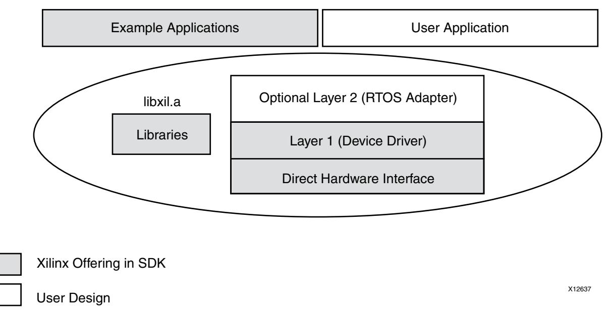

*Figure 2-3:* **Bare-Metal Drivers Architecture** 


## <span id="page-15-0"/>**Layer 2 (RTOS Adapter)**

Layer 2 is an adapter between an RTOS and a device driver. It converts a Layer 1 device driver to an interface that matches the requirements of the driver model for an RTOS. Unique adapters might be necessary for each RTOS.

Adapters typically:

- Communicate directly to the RTOS as well as the Layer 1 interface of the device driver
- Reference functions and identifiers specific to the RTOS. This layer is therefore not portable across operating systems
- Can use memory management
- Can use RTOS services such as threading and inter-task communication
- Can be simple or complex depending upon the RTOS interface and requirements for the device driver

## <span id="page-15-1"/>**Layer 1 (Device Driver)**

Layer 1 is an abstract device driver interface that shields you from potential changes to the underlying hardware. It is implemented with macros and functions and designed to allow you to use all features of a device. The device driver is independent of operating systems and processors, making it highly portable.

This interface typically has:

- Consistent API that gives you an "out-of-the-box" solution. The abstract API helps isolate the your project from hardware changes.
- Lack of RTOS or processor dependencies makes the device driver highly portable
- Run-time error checking such as assertion of input arguments that provides the ability to compile away asserts
- Device feature support
- Support for device configuration parameters to handle FPGA-based parameterization of hardware devices
- Support for multiple instances of a device while managing unique characteristics on a per instance basis
- Polled and interrupt-driven I/O
- Non-blocking function calls to aid complex applications
- A potentially large memory footprint
- Buffer interfaces for data transfers as opposed to byte interfaces. This makes the API easier to use for complex applications.
- No direct communication to Layer 2 adapters or application software, by using asynchronous callbacks for upward communication


### **Direct Hardware Interface**

The interface that is contained within the Layer 1 device driver is a direct hardware interface. It is typically implemented as macros and manifest constants, and is designed so you can create a small applications or create a custom device driver. This interface typically has:

- Constants that define the device register offsets and bit fields
- Simple macros that provide access to the hardware registers
- A small memory footprint
- Little to no error checking
- Minimal abstraction so the API typically matches the device registers. The API is therefore less isolated from hardware device changes.
- No support of device configuration parameters
- Support of multiple instances of a device with base address input to the API
- No, or minimal state
- Polled I/O only
- Blocking functions for simple use cases
- Byte interfaces typically provided

# <span id="page-16-0"/>**Bare-Metal Application Development**

Xilinx software design tools facilitate the development of embedded software applications for many runtime environments.

Xilinx embedded design tools create a set of hardware platform data files that include:

- An XML-based hardware description file describing processors, peripherals, memory maps, and additional system data
- A bitstream file containing optional programmable logic (PL) programming data
- A block RAM memory map (BMM) file
- PS configuration data used by the Zynq-7000 AP SoC first stage bootloader (FSBL).

The bare-metal Board Support Package (BSP) is a collection of libraries and drivers that form the lowest layer of your application.

The runtime environment is a simple, semi-hosted and single-threaded environment that provides basic features, including boot code, cache functions, exception handling, basic file I/O, C library support for memory allocation and other calls, processor hardware access macros, timer functions, and other functions required to support bare-metal applications.


Using the hardware platform data and bare-metal BSP, you can develop, debug, and deploy bare-metal applications using SDK.

[Figure](#page-17-0) 2-4 is an overview flowchart for bare-metal application development.

<span id="page-17-0"/>

*Figure 2-4:* **Bare-Metal Application Development Overview**

To develop bare-metal applications using SDK, typical steps include:

- 1. [Importing Hardware Platform Information](#page-18-0)
- 2. [Creating Bare-Metal BSP](#page-18-1)
- 3. [Creating Bare-Metal Application](#page-18-2)
- 4. [Building the Application Project](#page-19-0)
- 5. [Programming the Device and Running the Application](#page-19-1)
- 6. [Debugging the Application](#page-19-2)
- 7. [Adding Custom IP Driver Support](#page-19-3)
- 8. [Deploying the Application](#page-20-1)

The following subsections summarize these SDK development flow steps. See the SDK online help, for more details and examples of SDK tool usage.


### <span id="page-18-0"/>**Importing Hardware Platform Information**

Xilinx hardware configuration tools create hardware platform data you can export to SDK to create a hardware platform project. In SDK, the project stores information about the hardware system that includes, but is not limited to, the following:

- Processor and peripheral information for BSP generation
- Memory map information used to generate linker scripts
- Bitstream data used to program the PL with custom logic
- PS configuration data used in the FSBL and the debugger

### <span id="page-18-1"/>**Creating Bare-Metal BSP**

After you create the hardware platform project, you can use SDK to create a bare-metal BSP project. Source files for drivers and libraries are staged, parameterized based on the hardware platform (processor, IP feature set, hardware configuration settings) to create header file parameter definitions, and compiled. The BSP reflects IP enabled in the PS, including Multiplexed I/O (MIO) configuration, and custom logic in the PL. You can modify and re-generate BSP settings. See the *Standalone BSP*, which is included in the *OS and Libraries Document Collection* (UG643) [\[Ref](#page-67-10) 3]*.* 

### **Creating Bare-Metal BSP Using Third-Party Tools**

SDK supports BSP generation for other embedded OS environments and tools by specifying the path to a software repository containing source and meta data files that enable it to configure and build the associated drivers and libraries.

### <span id="page-18-2"/>**Creating Bare-Metal Application**

SDK provides a template-based application generator for included sample programs, from a basic "Hello World" or Dhrystone benchmark application to a FSBL or TCP/IP echo server. A default linker script is created for these applications.

The application generator is invoked by the Xilinx C or C++ Application wizard. You can either create an empty application or import existing applications to port to the bare-metal BSP. Each application project is associated with a BSP project.

Code development tools include editors, search, refactoring, and features available in the base Eclipse platform and CDT plug-in.


### <span id="page-19-0"/>**Building the Application Project**

SDK application projects can be user-managed (user-created makefiles) or automatically managed (SDK-created makefiles). For user-managed projects, you must maintain the makefile and initiate the application builds.

For automatically managed projects, SDK updates the makefile as needed when source files are added or removed, source files are compiled when changes are saved and the ELF is built automatically; in Eclipse CDT terminology, the application project is a managed make project.

Where possible, SDK infers or sets default build options based on the hardware platform and BSP used, including compiler, linker, and library path options.

### <span id="page-19-1"/>**Programming the Device and Running the Application**

After building the bare-metal application, SDK can be used to configure the PS, program the PL and run the application. SDK configures the PS using the system-level configuration registers (SLCR) with configuration data also used in the FSBL.

Bitstream (BIT) and block memory map (BMM) data are downloaded to the Zynq-7000 AP SoC to load any custom design logic into the PL, but this step can be omitted when running applications that require only the PS.

Create an SDK configuration run to download and run the application ELF file. A terminal view is available to interact with the application using STDIN and STDOUT.

### <span id="page-19-2"/>**Debugging the Application**

When you use SDK to debug applications, the steps are similar to those for running an application, except you create a debug configuration instead of a run configuration. A collection of windows (views) provides a complete debugging environment. This debug perspective should be familiar to those who have used Eclipse-based IDEs with the CDT plug-in, and includes a debug window showing the state of the session with a call stack, source viewers, disassembly, memory, register, other views, and console. You can set breakpoints and control execution with familiar debugger commands.

### <span id="page-19-3"/>**Adding Custom IP Driver Support**

The hardware platform data created by Xilinx hardware configuration tools captures the Xilinx IP blocks used in the PL area, and the bare-metal BSP automatically includes driver support for these blocks. Custom IP blocks that include hardware description metadata files can also be captured as part of the hardware platform passed to SDK.

By specifying the path to a software repository containing custom drivers and metadata, SDK can also include them in the bare-metal BSP.


You can also create library projects to manage and build custom driver source files, and build their applications using library projects together with the bare-metal BSP.

As the Hardware platform changes you might want to configure the custom IP driver. To customize the software drivers, a Microprocessor Driver Definition (MDD) file along with a Tcl file is used.

The driver parameters to be configured are specified in the MDD file. The procedure to generate the .h or .c files is present in the Tcl file. For more information, see the *Generating Software Platforms Reference Guide,* (UG1138) [\[Ref](#page-67-11) 4].

### <span id="page-20-1"/>**Deploying the Application**

After developing and debugging the bare-metal application within SDK, you can create a boot image for the application to be deployed on the board. SDK includes an application template for the FSBL that can be modified to create and build the final FSBL. The FSBL, bare-metal application, and bitstream for programming the PL (optional) are combined to generate a boot image that can be programmed to supported devices using the SDK Flash Writer.

For more information about boot image format, see Chapter [3, Boot and Configuration](#page-26-2).

# <span id="page-20-0"/>**Linux Application Development**

In addition to bare-metal applications, Xilinx software design tools facilitate the development of Linux user applications. This section provides an overview of the development flow for Linux application development.

Xilinx embedded design tools create a set of hardware platform data files that include:

- An XML-based hardware description file describing processors, peripherals, memory maps and additional system data
- A bitstream file containing PL programming data (optional)
- A block RAM Memory file (BMM)
- PS configuration data used by the Zynq-7000 AP SoC first stage bootloader (FSBL).

Linux is an open-source operating system. The Xilinx open source solution includes support for a single processor and Symmetric Multiprocessing (SMP). XIlinx provides drivers for the peripherals in the Processor System (PS). (You can add drivers for custom logic in the PL.)

See the *Standalone BSP* (UG652) that is included in the *OS and Libraries Document Collection* (UG643) [\[Ref](#page-67-10) 3]. See this document for information about the Bare-Metal BSP.


See [Chapter](#page-51-3) 4, Linux for a description of the Linux the U-Boot bootloader, and see the links [\[Ref](#page-66-4) ] to the Xilinx Open Source Wiki that provide more information.

Using the hardware platform data and Linux Kernel, programmers can develop, debug and deploy Linux user applications with the Xilinx Software Development Kit (SDK). SDK does not support Linux Kernel debug. Linux Kernel configuration and build processes are not discussed in this section.

To develop Linux user applications using SDK, typical steps include:

- 1. [Booting Linux](#page-22-0)
- 2. [Creating an Application Project](#page-23-0)
- 3. [Building the Application Project](#page-19-0)
- 4. [Running the Application](#page-23-1)
- 5. [Debugging the Application](#page-19-2)
- 6. [Adding Driver Support for Custom IP in the PL](#page-24-0)
- 7. [Profiling the Application](#page-24-1)
- 8. [Adding Application to Linux File System](#page-25-1)
- 9. [Modifying the Linux BSP (Kernel or File System|[Kernel or File System)](#page-25-2)]]


The flowchart in [Figure](#page-22-1) 2-5 provides an overview of the flow for Linux application development.

<span id="page-22-1"/>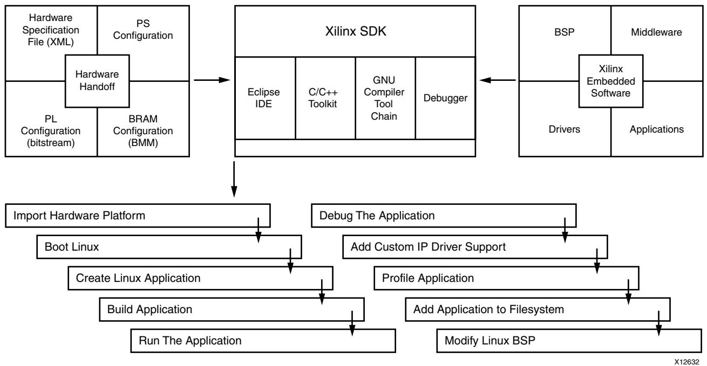

*Figure 2-5:* **Linux Application Development**

The following subsections describe the steps in this flow. See the SDK Help [\[Ref](#page-67-6) 14], for more details and examples of SDK tool usage.

### <span id="page-22-0"/>**Booting Linux**

You can boot Linux in multiple ways, depending on your preferred work flow:

- Program the boot image into flash and power up or reset the board
- Download and run the FSBL, followed by the U-Boot and then the Linux Kernel
- Use U-Boot to load and run images

With Linux running on the Zynq-7000 AP SoC, SDK can treat the PS platform as a remote Linux host, with functionality that varies depending on the components included in the file system.

Flash memory offsets differ for NAND, NOR, and Quad-SPI. Partitions can include FSBL, U-boot, linux kernel, device tree, RAMdisk, and user application.


During the boot process, FSBL is run to set up the PS, followed by U-Boot, which can be used to load the Linux Kernel image and boot Linux. The actual boot sequence and flash image creation process vary depending on the type of flash and other requirements. For example, the FSBL can be used to configure the PL containing custom logic and it is possible for a U-Boot image to include the FSBL.

### <span id="page-23-0"/>**Creating an Application Project**

SDK provides a template-based application generator for included sample programs, from a basic "Hello World" or Dhrystone bootloader, or an FSBL application to a benchmarking application. The application generator is invoked by the Xilinx C or C++ Application wizard.

Users can also create an empty application or import existing Linux applications for porting. Code development tools include editors, search, refactoring and features available in the base Eclipse platform and CDT plug-in.

SDK provides a Bootgen utility to generate bootable images (.bin and .mcs). You need to provide all the images and the load addresses to the bootgen tool to create the boot image.

SDK also provides a utility to flash images onto the flash device.

### **Building the Application**

SDK application projects can be user-managed (user-created makefiles) or automatically managed (SDK created makefiles). For user-managed projects, the user maintains the makefile and initiates application builds. For automatically managed projects, SDK updates the makefile as needed when source files are added or removed, source files are compiled when changes are saved and the ELF is built automatically; in Eclipse CDT terminology, the application project is a managed make project. Where possible, SDK infers or sets default build options based on the hardware platform and BSP used, including compiler, linker, and library path options.

### <span id="page-23-1"/>**Running the Application**

You can create an SDK run configuration to copy the compiled application to the file system and run the application. With Linux running on the Zynq-7000 AP SoC, the run configuration copies the executable to the file system using sftp if the Linux environment includes SSH. A terminal view is available to interact with the application using STDIN and STDOUT.

You can also run the application using a command line shell. Use:

- sftp to copy the executable
- ssh in Linux to run the executable


## **Debugging the Application**

You can use SDK to debug applications; SDK creates a debug configuration that defines options for the debugger session. A gdbserver runs the application on Linux, and the SDK debugger communicates with it using a TCP connection. A collection of windows (views) provides a complete debugging environment.

This debug perspective should be familiar if you have used Eclipse-based IDEs with the CDT plug-in, and it includes a debug window showing the state of the session with a call stack, source viewers, disassembly, memory, register and other views, and the console. You can set breakpoints and control execution with standard debugger commands.

### <span id="page-24-0"/>**Adding Driver Support for Custom IP in the PL**

SDK supports Linux BSP generation for peripherals in the PS as well as custom IP in the PL. When generating a Linux BSP, SDK produces a device tree, which is a data structure describing the hardware system that is passed to the Kernel at boot time. Device drivers are available as part of the Kernel or as separate modules, and the device tree defines the set of hardware functions available and features enabled.

Additionally, you can add dynamic, loadable drivers. The Linux driver supports these drivers. See the *OS and Libraries Document Collection* (UG643) [\[Ref](#page-67-10) 3].

Custom IP in the PL are highly configurable, and the device tree parameters define both the set of IP available in the system and the hardware features enabled in each IP.

See [Chapter](#page-51-3) 4, Linux for additional details on the Linux Kernel and boot sequence.

### <span id="page-24-1"/>**Profiling the Application**

To profile Linux user applications, use the -pg profiling option when building the application. User application profiling is based on the gprof utility and an accompanying viewer to display the call graph and other data.

For profiling all running code in the user application, the Kernel, interrupt handlers, and other modules, SDK includes an OProfile plug-in that supports visualization of its call profiling capabilities. OProfile is an open source system-wide profiler for Linux; it requires a Kernel driver and daemon to collect sample data.


## <span id="page-25-1"/>**Adding Application to Linux File System**

The compiled user application and required shared libraries can be added to the Linux file system, as follows:

- While Linux is running on the Zynq-7000 AP SoC, you can copy the files using sftp if the Linux environment includes SSH.
- In SDK, a remote system explorer (RSE) plug-in lets you copy files using drag-and-drop.
- In workflows outside of SDK, add the application and libraries to the file system folder before creating the file system image and programming it to flash.

### <span id="page-25-2"/>**Modifying the Linux BSP (Kernel or File System)**

See [Chapter](#page-51-3) 4, Linux, for a description of the Linux U-Boot bootloader.

Also, see the [Xilinx Forums and Wiki Links, page](#page-66-4) 67 that provide more information.

# <span id="page-25-0"/>**Additional Information**

For additional information related to topics mentioned in this chapter, consult the references listed in the introduction. For further reading, review the following in the *Zynq-7000 All Programmable SoC Technical Reference Manual* (UG585) [\[Ref](#page-67-12) 13].

- "Embedded System Design Using the Zynq Processing System"
- "Adding IPs in Fabric to Zynq PS"

*Chapter 3*


# <span id="page-26-2"/><span id="page-26-0"/>Boot and Configuration

# <span id="page-26-1"/>**Overview**

You can boot or configure Zynq®-7000 All Programmable SoC devices in secure mode using static memories only (JTAG disabled) or in non-secure mode using either JTAG or static memories.

- JTAG mode is primarily used for development and debug.
- NAND, parallel NOR, Serial NOR (Quad-SPI), and Secure Digital (SD) flash memories are used for booting the device. *The Zynq-7000 AP SoC Technical Reference Manual*  (UG585*)* [\[Ref](#page-67-12) 13] provides the details of these boot modes.

The processor system boot is a two-stage process:

- An internal BootROM stores the stage-0 boot code, which configures one of the ARM® processors and the necessary peripherals to start fetching the First Stage Bootloader (FSBL) boot code from one of the boot devices. The programmable logic (PL) is not configured by the BootROM. The BootROM is not writable.
- The FSBL boot code is typically stored in one of the flash memories, or can be downloaded through JTAG. BootROM code copies the FSBL boot code from the chosen flash memory to on-chip memory (OCM). The size of the FSBL loaded into OCM is limited to 192 kilobyte. The full 256 kilobyte is available after the FSBL begins executing.
- Another boot mode supported through FSBL is eMMC boot mode. This boot mode is possible only when the primary boot mode (set through the boot mode pins) is QSPI. This is used when you have a small QSPI flash and would like to store all the other partitions on a larger flash memory like eMMC. In this case, place the FSBL on the QSPI flash, and all the other partitions on eMMC flash.
- The FSBL source code is available from the git server; the link to the git server is listed in Appendix [B. Additional Resources and Legal Notices](#page-66-5). You can build the FSBL from a command line after you have downloaded the source files.

The FSBL boot code is completely under user control and is referred to as *user boot code*. This provides you with the flexibility to implement whatever boot code is required for your system. Xilinx® provides sample FSBL boot code that you can tailor to your own needs.


The FSBL boot code includes initialization code for the peripherals in the processing system (PS), see the FSBL code provided with SDK for details on the FSBL initialization sequence of the FSBL. The boot image can contain a bitstream for the programmable logic (PL).

The PL is not required to be configured at this stage, because the PS is fully operational when the PL is not configured. You can customize the FSBL boot code to use other PS peripherals such as Ethernet, USB, or STDIO to boot and/or configure the PL.

*Note:* DDR and SCU are not enabled by the BootROM. See the *Zynq-7000 AP SoC Technical Reference Manual* (UG585) [\[Ref](#page-67-12) 13] for details.

# <span id="page-27-0"/>**Boot Modes**

The following boot modes are available:

- PS Master Non-secure Boot
- PS Master Secure Boot
- JTAG/PJTAG Boot

For details on these boot modes, see "Boot and Configuration" in the *Zynq-7000 AP SoC Technical Reference Manual* (UG585) [\[Ref](#page-67-12) 13].

# <span id="page-27-1"/>**Boot Stages**

Zynq-7000 AP SoC devices support secure and non-secure boot processes, as follows:

- [Stage-0 Boot (BootROM|[BootROM)](#page-27-2)]]
- [First Stage Bootloader](#page-28-0)
- [Second Stage Bootloader (Optional|[Optional)](#page-46-0)]]

## <span id="page-27-2"/>**Stage-0 Boot (BootROM)**

See the section on "BootROM" in the *Zynq-7000 AP SoC Technical Reference Manual*  (UG585) [\[Ref](#page-67-12) 13].

Figure [3-1, page](#page-28-1) 29 shows the flow of FSBL loading in OCM by the BootROM code.

<span id="page-28-1"/>

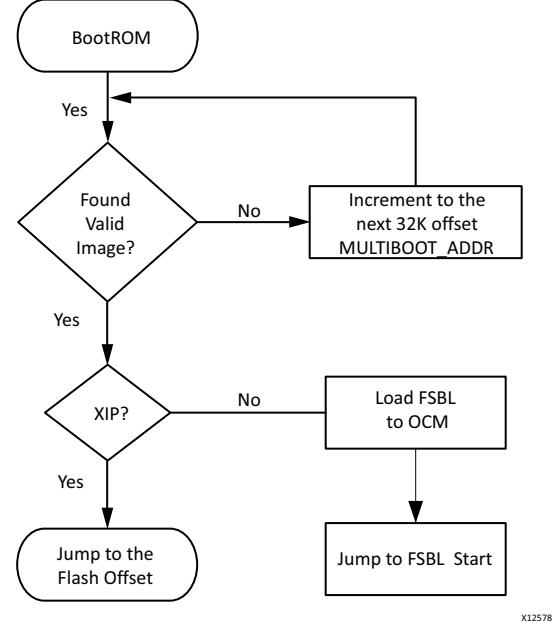

*Figure 3-1:* **Boot Flow in Non-Secure Mode**

[FSBL Fallback Feature, page](#page-33-0) 34 contains more information on the BootROM flow when a valid image is not found.

### <span id="page-28-0"/>**First Stage Bootloader**

The First Stage Bootloader (FSBL) starts after the boot. The BootROM loads FSBL into the OCM. The FSBL is responsible for:

- Initializing with the PS configuration data that Xilinx hardware configuration tools provide (see [Zynq PS Configuration, page](#page-46-1) 47).
- Programming the PL using a bitstream (if provided).
- Loading second stage bootloader or bare-metal application code into DDR memory.
- Handoff to the second stage bootloader or bare-metal application.

*Note:* Before handoff to the second stage bootloader or bare-metal application, the FSBL invalidates the instruction cache and disables the cache and MMU, because U-Boot assumes it is disabled upon start. See the FSBL code provided with SDK for details on the initialization sequence of the FSBL.

Figure [3-2, page](#page-29-0) 30 shows an example FSBL flow.

<span id="page-29-0"/>


*Figure 3-2:* **Example FSBL Flow**


The bitstream for the PL and the second stage bootloader or bare-metal application data, as well as other code and data used by the second stage bootloader, Linux (or other operating system), or bare-metal application are grouped into partitions in the flash image. See section [Boot Image Format, page](#page-47-1) 48, for a description of how they are organized.

The FSBL traverses the partition header table to find the bitstream and second stage bootloader or bare-metal application partition. See [Appendix A. Using Bootgen](#page-54-3), for details. See [Boot Image Creation, page](#page-47-0) 48, for details on how the boot image containing these partitions is constructed.

You *stitch* the FSBL with the bitstream and an application using the Bootgen program. SDK has a Create Boot Image wizard option, shown in the following figure, to add the partition images and create a bootable image that you can then flash.

*Figure 3-3:* **Create Zynq-7000 AP SoC Boot Image Wizard**


The rules are:

- The first partition must be the FSBL ELF followed by the bitstream partition and then the application ELF.
- Bitstream is optional. FSBL does a handoff to the first application in the BIF order.


**IMPORTANT:** *The order within the BIF file is important. Bitstream must be the partition after FSBL. Bitstream is not mandatory. The bitstream is required only if the PL must be programmed.*

FSBL does not remap the DDR; consequently, DDR that is lower than 1Mb cannot be used.

**IMPORTANT:** *The application ELF must have an execution address of greater than 1Mb.*

The following figure shows a simple FSBL flow diagram:

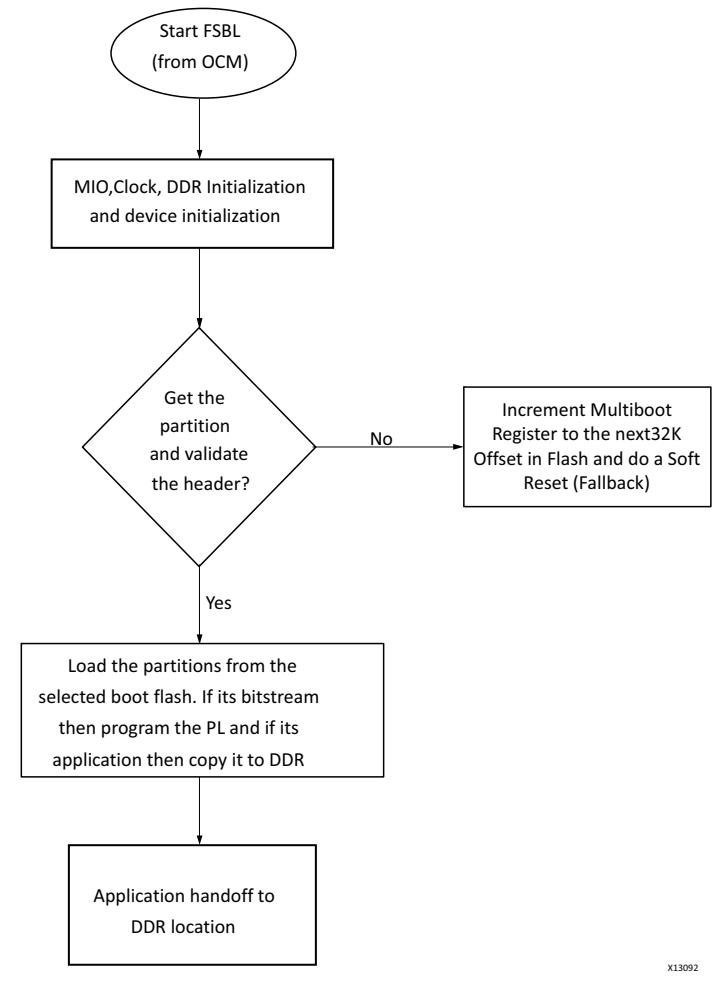

*Figure 3-4:* **FSBL Flow Diagram** 


#### *eMMC Flash Devices*

Zynq-7000 AP SoC devices support eMMC flash devices in MLC and SLC configuration as a secondary boot source. FSBL supports loading the partitions from eMMC. This is possible only when the primary boot mode (set through the boot mode pins) is QSPI.

Use this option when there is a small QSPI flash and you would like to store all the other partitions on a larger flash memory like eMMC. In this case, place the FSBL on the QSPI flash and all the other partitions are on eMMC flash.

To enable and use this boot mode:

- 1. Create a BSP with the library and set **enable_mmc** in the SDK options. For more details, see the library documentation.
- 2. Enable the **MMC_SUPPORT** flag through SDK and build FSBL. The FSBL image build (fsbl.elf) now has eMMC support.
- 3. Stitch the boot image with FSBL as the only partition (using Bootgen).
- 4. Place the boot image in the QSPI flash.
- 5. Stitch an image (using Bootgen) with all the other required partitions (like the bitstream or the U-Boot) and place it in the eMMC flash.
- 6. Set the boot mode to **QSPI**.
- 7. Power cycle the board.

BootROM comes up, loads the FSBL from QSPI flash to OCM and does a hand-off to FSBL. FSBL then picks all the other partitions from the eMMC device, loads them to DDR, then hands over control to the application.

In this case, FSBL ignores the configured primary boot mode (configured through the boot mode pins on the board) which is QSPI and loads the other partitions from eMMC.

To have FSBL and U-Boot on the QSPI flash, the MMC_SUPPORT flag need not be enabled in FSBL; however, the U-Boot auto-configuration file must be updated to indicate to U-Boot to load the rest of the partitions from eMMC flash.

In this case, FSBL loads U-Boot to DDR and hands over the control to U-Boot.

U-Boot handles loading the rest of the partitions from the eMMC flash. The limitation here is that the partitions present on the eMMC flash cannot be RSA authenticated because U-Boot does not support RSA authentication.

RSA is a cryptosystem, which is known as one of the first practicable public-key cryptosystems and is widely used for secure data transmission. In such a cryptosystem, the sender authenticates the image with the private key and the receiver validates and authenticates using the public key.


## **Setting FSBL Compilation Flags**

You can set compilation flags using the C/C++ settings in SDK FSBL project, as shown in the following figure.

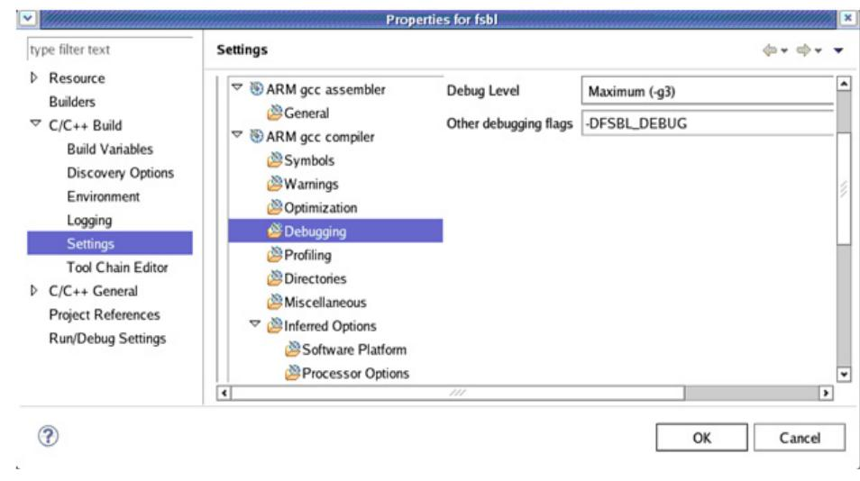

*Note:* There is no need to change any of the FSBL source files or header files to include these flags.

*Figure 3-5:* **SDK FSBL Properties Settings**

[Table](#page-33-1) 3-1 lists the FSBL compilation flags.

<span id="page-33-1"/>

| Flag               | Description                                                                                                                                                                                            |
|--------------------|--------------------------------------------------------------------------------------------------------------------------------------------------------------------------------------------------------|
| FSBL_DEBUG         | Set this flag to enable the logs and message prints.                                                                                                                                                   |
| FSBL_DEBUG_INFO    | Set this flag to obtain more detailed logs like register and partition<br>header dumps.                                                                                                                |
| FSBL_DEBUG_RSA     | Set this flag to print more detailed intermediate values used in RSA<br>functions.                                                                                                                     |
| NON_PS_INSTANTIATE | Set this flag when the bitstream does not have a PS component.                                                                                                                                         |
| D_BITSTREAM        | Then the FSBL does not enable level shifters.                                                                                                                                                          |
| RSA_SUPPORT        | Set this flag to enable authentication feature in FSBL.                                                                                                                                                |
| MMC_SUPPORT        | Set this flag to enable MMC support in FSBL. When this flag is set,<br>FSBL reads all the partitions from the eMMC device, instead of the<br>primary boot device (which is set by the boot mode pins). |

#### <span id="page-33-0"/>*FSBL Fallback Feature*

To recover from an error condition, FSBL does a *Fallback* and enables BootROM to load another bootable image (the *golden* image that was originally present and in a known good state) if that image is present in the flash memory. FSBL updates a multiboot register and does a soft reset so that BootROM executes and loads the next present, valid image.


*Note:* In the case of a PL configuration error, FSBL does Fallback.

In the secure boot scenario, with the AES key stored in eFUSE, the Fallback scenario is handled by FSBL without going through a soft reset. See [Secure Fallback Flow with BBRAM,](#page-38-0)  [page](#page-38-0) 39 and [Secure Fallback Flow with eFUSE, page](#page-40-0) 41, and [Secure Boot Support, page](#page-45-0) 46.

The following subsections describe the details.

For more information about eFUSE, see the *LibXil SKey for Zynq-7000 AP SoC Devices* in the *SDK Help* [\[Ref](#page-67-6) 14] and in

<Installation_Directory>\SDK\<version>\data\embeddedsw\lib\sw_servi ces\<library_name><version>\doc.

#### **Fallback in Non-Secure Cases**

In a FSBL non-secure flow, the following actions occur:

- After power on reset (POR), BootROM executes and validates the Image 1 Boot header.
	- ° If there is no corruption, BootROM hands over control to the FSBL, which then loads the other partitions in the image.
	- ° If there is corruption in the boot header, BootROM does a fallback search to find the next valid image. In the example shown in Figure [3-6, page](#page-35-0) 36, BootROM validates the Image 2 boot header, and, if no corruption, hands over the Image 2 to FSBL, which processes the rest of the partitions in Image 2.
	- ° In non-secure images, corruption in FSBL and other images is not recognized.


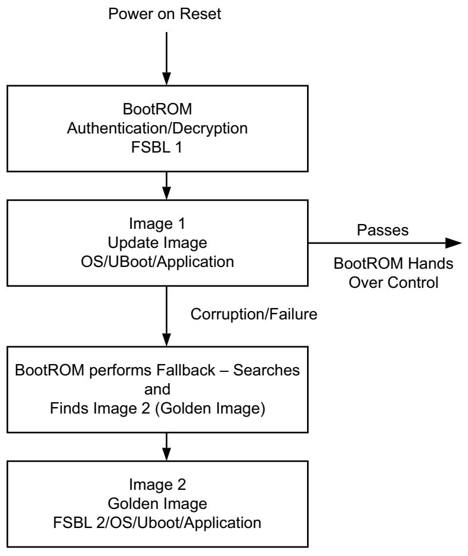

<span id="page-35-0"/>*Figure 3-6:* **Power on Reset Fallback** 


The following figure represents the Flash image format for non-secure cases.

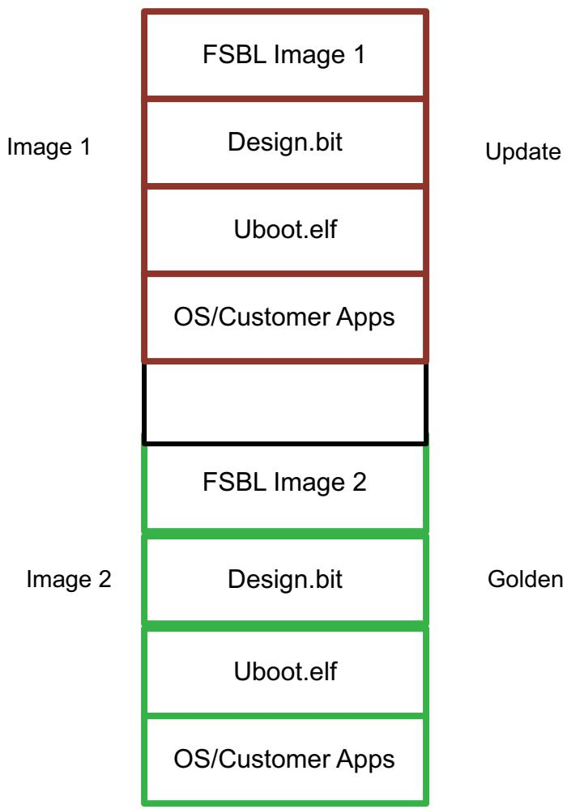

*Figure 3-7:* **Non-Secure Fallback Image Format**


#### **Fallback Flow for RSA Only**

In the case of non-secure Fallback with RSA authentication enabled, the following actions occur:

- After POR, BootROM executes and validates the Boot Header in Image 1.
- If there is no corruption in the Boot Header, BootROM hand over control to the FSBL, which then authenticates the rest of the partitions and loads those partitions.
- If there is corruption in the Boot Header or the FSBL image, BootROM does a fallback search to find the next valid image. In this example, in Image 2, the BootROM validates the Image 2 boot header. If the boot header validation is successful, then BootROM authenticates the FSBL in Image 2 and hands control over to FSBL.
- In this case, when there is corruption in the bitstream, U-Boot, or the OS, FSBL authentication fails and does fallback by a soft reset of the system and BootROM locates the golden image.

The following figure shows the Fallback flow for RSA only.

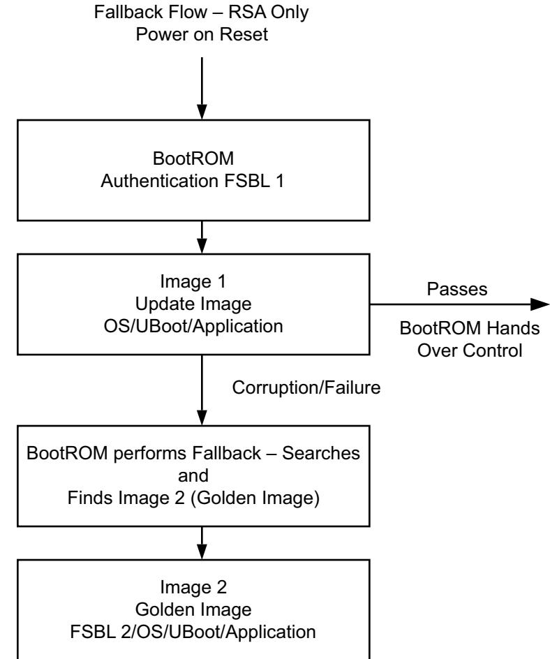

*Figure 3-8:* **RSA-Only Fallback Flow** 

;


The following figure represents the Flash image format for non-secure cases.

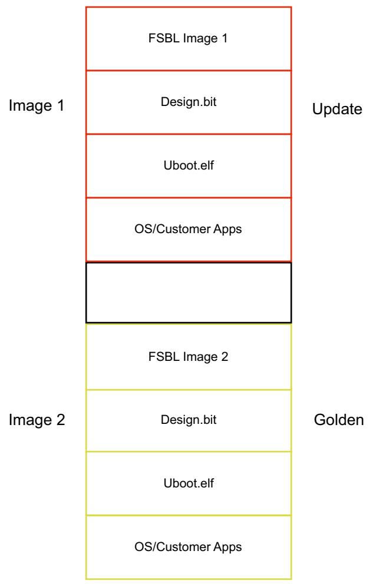

*Figure 3-9:* **Fallback Partitions for RSA Only**

#### <span id="page-38-0"/>**Secure Fallback Flow with BBRAM**

In the secure Fallback flow using BBRAM, the following actions occur:

- BootROM executes and decrypts the FSBL1 and authenticates if RSA is enabled.
	- ° If the validation is successful, the BootROM hands over the control to FSBL, which then loads, decrypts, and authenticates (if enabled) the other partitions, then hands the control to the OS, U-Boot, and/or application.
	- ° If the boot header of Image1 is corrupted, BootROM searches for the Image2, decrypts the FSBL, and hands off the decryption to FSBL in Image2. Then the FSBL does any required decryption and authentication (if enabled) of the rest of the partitions and hands over to the U-Boot, OS, or Standalone application. In this process, if FSBL finds any image to be corrupted, then it initiates a Fallback.


The following figure shows the secure Fallback flow with BBRAM.

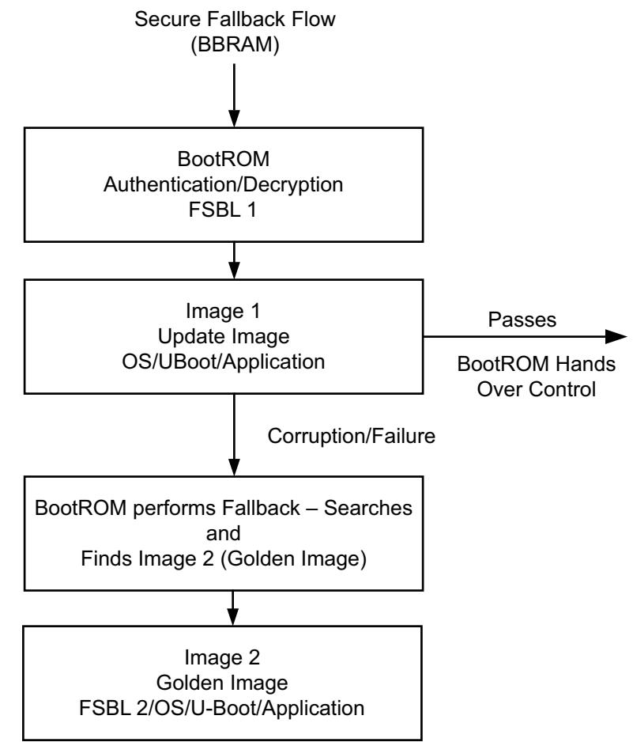

*Figure 3-10:* **BBRAM Secure Fallback**


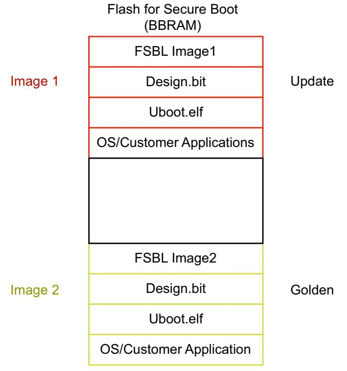

The following figure shows the Flash partitions for secure boot in BBRAM.

*Figure 3-11:* **Flash BBRAM Partitions**

#### <span id="page-40-0"/>**Secure Fallback Flow with eFUSE**

The secure Fallback flow with eFUSE during power on reset (POR) is as follows: In this case FSBL handles the Fallback without going through a soft reset.

- BootROM executes, decrypts the FSBL* (where *=FSBL Prime), authenticates (if enabled), and passes control back to the FSBL*.
*Note:* (FSBL Prime) must be used for Fallback with Authentication.

- The FSBL* then:
	- ° Handles the Encrypted Fallback scenario
	- ° Finds no other partitions; consequently, does a Fallback, searching for the next valid image.
		- Finds Image 2, and validates the boot header of the Image 2.
		- If valid, skips over the FSBL in Image2 and processes all the other partitions in Image 2, then hands over control to the application in Image 2.


If there is header corruption in Image 2:

- FSBL* to error out with a message to indicate that the Image 2 is corrupt. (FSBL in Image 1 still controls the files and performs Fallback to search for the next Image.)
- FSBL* searches for loads Image 3, then:
	- ° Validates the boot header
	- ° Authenticates any files if RSA is enabled
	- ° Skips over the FSBL in Image 3 and processes the rest of the partitions in Image 3.

**RECOMMENDED:** *Use Authentication for secure images.*

The following figure shows the secure Fallback flow with eFUSE.

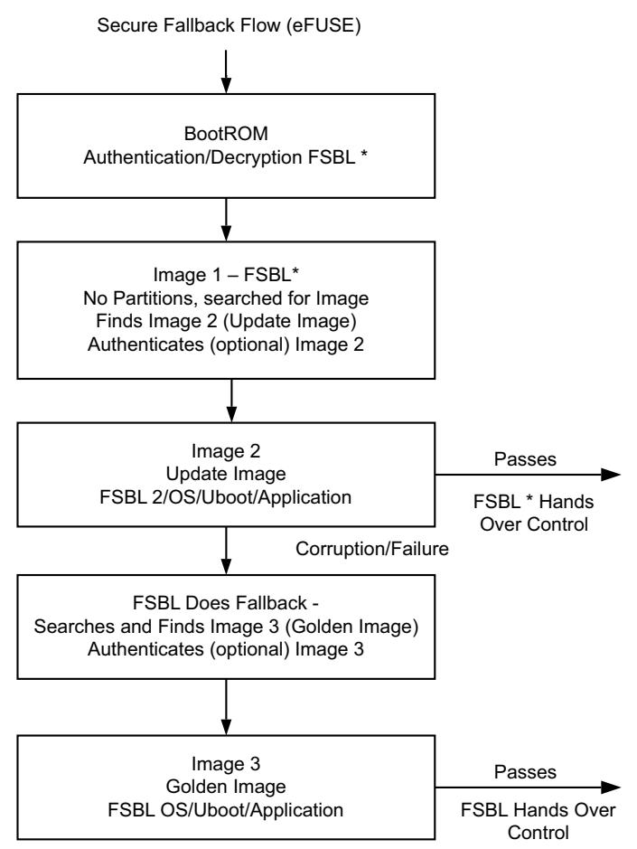

*Figure 3-12:* **Secure Fallback Flow with eFUSE**

*Note:* The Secure flow for Fallback when the AES keys are stored in the PL eFUSE is different than the other flows. RSA authentication in optional.


- If the FSBL* (FSBL in Image 1) fails authentication, the BootROM goes into a secure lockdown; consequently, you must ensure that Image 1 is not corrupted.
- If the boot header of Image 1 is not valid, the BootROM jumps to Image 2 and the FSBL in Image 2 executes.

**RECOMMENDED:** *It is recommended in secure mode that you configure Watchdog timers for Interrupt and not SRST. You can route the Watchdog Interrupt to do POR through a GPIO.*

X-Ref Target - Figure 3-13

**RECOMMENDED:** *In secure fallback with efuse as key source, it is recommended to have same FSBL in all the images.*

The following figure shows the FSBL* partitions for Secure Boot with eFUSE.


*Figure 3-13:* **Flash Partitions for Secure Boot with eFUSE**


#### **FSBL Multiboot**

Multiboot is the scenario where you want to load some other version of FSBL, other than the one currently executing. For example, you might want to execute a version of FSBL; any image that performs self test and diagnostics, and then jump to the actual application.

In this scenario, after executing the image which performs the diagnostics you can update the multiboot register with the sequence number of the load file which contains the actual application and issue a soft reset.

In the Multiboot scenerio:

- Several images can be used to setup the functionality of a part
- The images are user-selectable, based on what the function the part is supposed to perform at certain times

While the system boots up through the soft reset, the BootROM reads the multiboot register and jumps to that loadable image instead of the first loadable image.

In the secure boot scenario, with the AES key stored in eFUSE, the Multiboot scenario must be handled by the user (without going through a soft reset).

#### *NAND Boot Mode*

In NAND boot mode, to use Multiboot, the user needs to implement the calculate_multiboot() routine using the following steps. This API calculates the MultiBoot address.

The sequence is:

- 1. Set the Boot mode to NAND using bootstrap pins.
- 2. Implement the calculate_multiboot() function in the user application (FSBL/any other application).
- 3. From the application that is invoking MultiBoot, call the calculate_multiboot() API to calculate the MultiBoot address.
- 4. Update the MultiBoot address to the MultiBoot address register, (which is described in the *Zynq-7000 AP SoC Technical Reference Manual,* (UG585) [\[Ref](#page-67-12) 13] and trigger a soft reset.

#### **Calculate_multiboot API**

- 1. Calculate the page size for the NAND part being used.
- 2. Calculate the bytes per page for the NAND.
- 3. Based upon the start address of the boot image, calculate the source block number which is SourceAddress BytesPerBlock.


- 4. Calculate the number of bad blocks preceding the source block by checking if each of the blocks is a good block or a bad block.

```
LOOP till SourceBlock
 Check if the current block is BAD: 
 IF "Block is BAD" THEN
   Increment the bad block count
 ENDIF
LOOP END
```
- 5. Calculate the Multiboot_Address using the following equation:
Multiboot_Address = (SourceAddress - (BadBlocks * BytesPerBlock))/(32 * 1024);

### *QSPI Boot Mode*

This QSPI boot mode is for x4 mode. The BootROM searches the first 256 Mb in x8 mode. In QSPI boot mode (where the QSPI device is >128Mb), to use MultiBoot, place the multiple images in such a way that they fit in memory locations less than 128Mb.

To effect this mode, the images should have only (FSBL+U-Boot) to fit in the <128Mb memory. Then, the rest of the partitions, possibly residing in a portion of memory that is >128Mb, must be handled by U-Boot. In this case, update the zynq_common.h file to add the commands to load the required partitions. You can find further details on the usage, along with an example, in the *Xilinx Zynq-7000 AP SoC Solution Center* [\[Ref](#page-67-13) 1].

#### *FSBL Hooks*

FSBL hooks provide an easy way to plug-in used defined functions, (for example, initializing PL IPs after loading a bitstream). The FSBL hook functions are located in the fsbl_hook.c file.

The fsbl_hook.c file contains the following functions:

- FsblHookBeforeBitstreamDload: This function is called before the PL bitstream download. Any customized code. You can add customized code before the bitstream download in this function.
- FsblHookAfterBitstreamDload: This function is called before the handoff to the application. You can add any customized operations you want to perform before handoff to the application to this function.
- FsblHookBeforeHandoff: This function is the hook to call before the FSBL does a handoff to the application. You can add customized code to be executed before the handoff to this routine.
- FsblHookFallback: This function is called when the FSBL does a Fallback. You can add customized code, either to print a message, log an error, or do any other intended operation, when Fallback occurs.


By using these hook functions you can plug-in any application-specific customized code into the flow sequence of the FSBL.

#### **DDR ECC Enable**

This feature enables ECC support for the DDR.

- Enable the feature in the IP integrator.
- In the Vivado IP integrator Zynq-7000 AP SoC processor Block Diagram, use the DDR configuration page.

After the feature is enabled, FSBL does the DDR initialization required to enable the ECC.

FSBL does not provide support for error handling for the ECC errors; you must account for error handling within your program.

DDR starts from 1Mb because FSBL does not remap DDR; consequently, the application program must consider using the DDR from 1Mb. If you need to use a DDR smaller than 1Mb, you must handle the DDR initialization required for supporting ECC.

#### <span id="page-45-0"/>**Secure Boot Support**

FSBL provides support for the following secure boot features:

- Advanced Encryption Standard
	- ° AES-CBC with 256-bit key
	- ° Encryption key stored on-chip in either eFuse or Battery-backed RAM (BBRAM)
- Keyed-hashed message authentication code (HMAC)
	- ° SHA-256 authentication engine (FIPS180-2)
- RSA public key authentication
	- ° 2048-bit public key

FSBL operates in the secure mode, based upon what secure features you enable.

If RSA authentication is enabled, the FSBL uses the public key to authenticate the FSBL before it is decrypted or executed. You can enable the RSA authentication by providing this as an option to Bootgen while generating the bootable image. Based upon the configuration provided in the partition header (Authentication/Encryption/Both), the FSBL performs the required authentication of the image and then the decryption.

SHA-2 is a set of cryptographic hash functions (SHA-224, SHA-256, SHA-384, SHA-512, SHA-512/224, SHA-512/256) designed by the U.S. National Security Agency (NSA) and published in 2001 by the NIST as a U.S. Federal Information Processing Standard (FIPS). SHA stands for *Secure Hash Algorithm*. SHA-2 includes a significant number of changes from its


predecessor, SHA-1. SHA-2 currently consists of a set of six hash functions with digests that are 224, 256, 384 or 512 bits.

For more details about RSA authentication, see the *Zynq-7000 AP SoC Technical Reference Manual* (UG585) [\[Ref](#page-67-12) 13].

#### <span id="page-46-1"/>*Zynq PS Configuration*

Using the Zynq-7000 AP SoC configuration interface, the Xilinx hardware configuration tool generates code for initialization of the DDR, MIO, and SLCR registers. See the [SDK Help](http://www.xilinx.com/support/documentation/sw_manuals/xilinx14_7/SDK_Doc/index.html) for more information regarding the creation of ps7* files.

In the project directory, the files of interest are:

- ps7_init.c and ps7_init.h, which can be used to initialize CLK, DDR, and MIO. The initialization performed by the ps7_init.tcl is the same as by the code in ps7_init.c.
- ps7_init.tcl file, which can be used to initialize CLK, DDR, and MIO. The initialization performed in the ps7_init.tcl is the same as the initialization performed by the code in ps7_init.c.

*Note:* The Tcl file is helpful while debugging an application using XMD. For example, you can run the ps7_init.tcl file and then can load your application to DDR and debug. There is no need to run the FSBL in this case.

- ps7_init.html, which describes the initialization data.
When the PCFG_POR_CNT_4K (override) bit in the devcfg is set it cuts down the TPoR for PL. This bit is set by FSBL when the corresponding checkbox is selected in Vivado PS-PL configuration. For more details see the *Vivado Design Suite User Guide: Embedded Processor Hardware Design* (UG898) [\[Ref](#page-67-2) 5].

*Note:* The Xilinx hardware configuration tools maintain synchronization between the PL bitstream and this initialization data. It is not advisable to change these settings manually.

## <span id="page-46-0"/>**Second Stage Bootloader (Optional)**

The second stage bootloader is optional and user-designed. [U-Boot, page](#page-53-1) 54, is an example of the second stage bootloader.


# <span id="page-47-0"/>**Boot Image Creation**

A utility program called *Bootgen* is provided to create a single boot image file suitable for ROM or flash memory programming. It creates the image by building the required boot header, appending tables that describe the following partitions, and processing the input data files (ELF files, FPGA bitstreams, and other binary files) to partitions. It has features for assigning specific destination memory addresses or imposing alignment requirements for each partition. It also supports the encryption, authentication, or performing checksums on each partition.

The utility is driven by a configuration file known as the Boot Image Format (BIF) file with a file extension of *.bif.

For advanced authentication flows, Bootgen can be used to output intermediate hash files that can be signed offline. Otherwise, Bootgen uses the provided private keys to sign the authentication certificates included in the boot image.

The format of the boot image conforms to a hybrid of hardware and software requirements. The boot image header is required by the Zynq-7000 AP SoC BootROM loader which loads a single partition, typically the FSBL. The remainder of the boot image is loaded and processed by the FSBL.

See [Appendix A. Using Bootgen](#page-54-3), for more information about the utility.

### **Bootgen Command Example**

The following is a simple command line example:

bootgen –image myDesign.bif –o i myDesignImage.bin

In this example, Bootgen produces the file myDesignImage.bin that contains the boot header followed by the data partitions created from the data files described in myDesign.bif.

## <span id="page-47-1"/>**Boot Image Format**

The boot image format consists of the following:

- BootROM header
- FSBL image
- One or more partition images
- Unused space, if available


Figure [3-14, page](#page-48-0) 49 shows the layout of the boot image format.

<span id="page-48-0"/>*Note:* Encryption is optional in the FSBL.

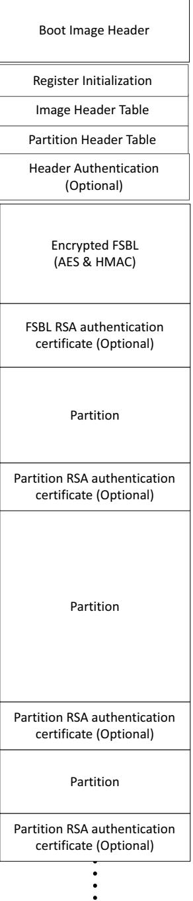

*Figure 3-14:* **Zynq-7000 AP SoC Device Processor Secure Boot Image Format**


## **Authentication Certificate**

The Authentication Certificate is appended to the end of each authenticated partition. An optional header Authentication Certificate can appear after all of the Image header and Partition Headers, which authenticates the contents of these headers.

All integers are stored in little-endian order, including the 2048 bit modulus.

[Table](#page-49-1) 3-2 lists the Offset, Size, Field, and Description for Authentication Certificate.

| Offset | Field                 | Description                            |
|--------|-----------------------|----------------------------------------|
| 0x00   | Authentication header | 0x01010000 – See Table 3-3.            |
| 0x04   | Certificate size      | 0x6C0                                  |
| 0x08   | User defined field    | 56 bytes                               |
| 0x040  | PPK modulus           | 256 bytes                              |
| 0x140  | PPK modulus extension | 256 bytes                              |
| 0x240  | PPK exponent          | 4 bytes (Recommended to be 0x00010001) |
| 0x244  | Zero padding          | 60 bytes - (0x00000000)                |
| 0x280  | SPK modulus           | 256 bytes                              |
| 0x380  | SPK modulus extension | 256 bytes                              |
| 0x480  | SPK exponent          | 4 bytes (Recommended to be 0x00010001) |
| 0x484  | Zero padding          | 60 bytes - (0x00000000)                |
| 0x4C0  | SPK signature         | 256 bytes                              |
| 0x5C0  | Partition signature   | 256 bytes                              |

<span id="page-49-1"/>*Table 3-2:* **Authentication Certificate**

To reduce overhead on the FSBL, Bootgen precalculates the modulus extenstion which is used in the Montgomery reduction for modular exponentiation. These values are stored in the certificate after the modulus fields. [Table](#page-49-0) 3-3 shows the authentication certificate bits, field, and values.

| Bits  | Field                              | Value            |
|-------|------------------------------------|------------------|
| 31:16 | Reserved                           | 0s               |
| 15:14 | Authentication Certificate Format  | 00: PKCS #1 v1.5 |
| 13:12 | Authentication Certificate Version | 00: Current AC   |
| 11    | PPK Key Type                       | 0: Hash Key      |
| 10:9  | PPK Key Source                     | 0: eFUSE         |
| 8     | SPK Enable                         | 1: SPK Enable    |
| 7:4   | Public Strength                    | 0: 2048          |
| 3:2   | Hash Algorithm                     | 0: SHA256        |
| 1:0   | Public Algorithm                   | 1: RSA           |

<span id="page-49-0"/>*Table 3-3:* **Bit Authenticating Certificate Header**


The following figure shows an example of the Zynq-7000 AP SoC Linux boot image partitions.

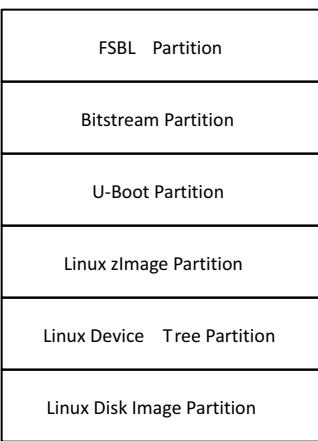

*Figure 3-15:* **Zynq-7000 AP SoC Example Linux Boot Image Partitions**

# <span id="page-50-0"/>**BootROM Header Format**

See the "Boot and Configuration" chapter of the *Zynq-7000 AP SoC Technical Reference Manual,* (UG585) [\[Ref](#page-67-12) 13] for the BootROM header format.


# <span id="page-51-3"/><span id="page-51-0"/>Linux

# <span id="page-51-1"/>**Introduction**

Xilinx® Zynq®-7000 AP SoC Linux is based upon open source software (the Kernel from kernel.org). Xilinx provides support for Xilinx-specific parts of the Linux Kernel (drivers and board support packages (BSPs).

Xilinx also supports Linux through the Embedded Linux forum. As with many open source projects, Xilinx also expects customers to use the open source mailing lists for Linux in areas that are not specific to Xilinx Zynq-7000 AP SoC.

More information about Xilinx Zynq-7000 AP SoC Linux and other Xilinx open source projects is available on the Xilinx *Zynq-7000 AP SoC Solution Center* [\[Ref](#page-67-13) 1] or the most current Linux information.

Xilinx provides a public git server that contains a Linux Kernel, a BSP for Xilinx boards, and drivers for selected IP, which allows third parties to build embedded Linux distributions for Xilinx hardware. In essence, the git server also allows companies who have Linux expertise to develop their own Linux rather than buying a distribution.

*Note:* Not all Xilinx IP are supported.

# <span id="page-51-2"/>**Git Server and Gitk Command**

Xilinx uses Git to allow easier interaction with the Linux open source community. For example, patches can be pushed out to the Kernel mainline or patches can be received back from users against the Git tree. Moreover, Git provides some configuration management where the you can see each change to the Kernel.

- The public Git tree is located at <http://git.xilinx.com>, along with the directions for how to snapshot the repository. You can browse the code from the website.
The main branch of the public repository is the master branch. This is considered the most stable and tested code from Xilinx.

- General information on Git is available at <http://git-scm.com>


- Git basics are documented at: <http://git-scm.com/documentation>
- Git can be downloaded from: <http://git-scm.com/download>

The gitk tool provides a graphical display of a git tree. It can be helpful for exploring the branches in a tree. It is installed with git, and can be run using gitk from the command line.

# <span id="page-52-0"/>**Linux BSP Contents**

### **Kernel**

X-Ref Target - Figure 4-1

The Linux Kernel is the Kernel itself together with the Board Support Package (BSP) for boards and the drivers for the system. The Kernel requires a file system, and you must provide a file system to boot the Kernel.

*Note:* The directory containing the Kernel is referred to as a "Kernel tree." It is assumed that the reader is familiar with the Linux Kernel directory structure.

The following figure shows a high order Linux Kernel diagram to help visualize how the different functions relate to the different layers.

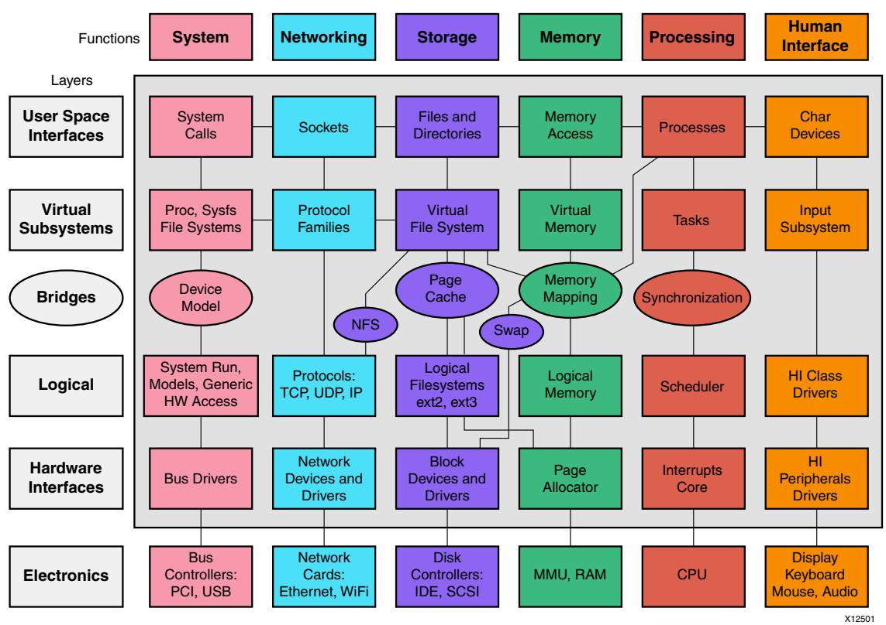

*Figure 4-1:* **Linux Kernel**


### **Drivers**

See Xilinx SDK online driver documentation.

# <span id="page-53-1"/><span id="page-53-0"/>**U-Boot**

Microprocessors can execute code that reside in memory, while operating systems normally reside in large-capacity devices such as hard disks, CD-ROMs, USB disks, network servers, and other permanent storage media. When the processor is powered on, the memory does not contain an operating system, so special software is needed to bring the OS into memory from the media on which it resides. This software is normally a small piece of code called the *bootloader*.

U-Boot is an open source bootloader that is frequently used in the Linux community, and used by Xilinx for the MicroBlaze™ processor and the Zynq-7000 AP SoC processor for Linux.

A bootloader initializes hardware that the Linux Kernel does not necessarily initialize (such as the serial port and DDR). System providers often put U-Boot into flash memory. U-Boot is an example of a Second Stage Bootloader.

This gives it many useful features, including the ability to load and execute images from Ethernet, flash memory, SD/MMC, and USB the ability to start a Kernel image from memory, and the availability of a command interpreter with many commands such as: reading and writing to/from memory, and network operations, such as the ping command.

See the following for the most current information:

- [Zynq U-boot](http://wiki.xilinx.com/zynq-uboot )
- [Zynq Release Notes](http://www.wiki.xilinx.com/Zynq+Releases  )


# *Appendix A*

# <span id="page-54-3"/><span id="page-54-0"/>Using Bootgen

# <span id="page-54-1"/>**Introduction**

Bootgen is a standalone tool for creating a bootable image suitable for the Zynq®-7000 AP SoC processor. The program assembles the boot image by prefixing a header block to a list of partitions. Optionally, you can encrypt the bitstream, each partition and authenticate it with Bootgen. The output is a single file that can be directly programmed into the boot flash memory of the system. Other peripheral files can be generated by the tool to support authentication and encryption as well.

The tool can be integrated into SDK for automatic image generation, or can be used in a command-line oriented script.

# <span id="page-54-2"/>**BIF File Syntax**

The BIF file specifies each component of the boot image, in order of boot, and allows optional attributes to be applied to each image component. Each image component is usually mapped to a partition, but in some cases an image component can be mapped to more than one partition if the image component is not contiguous in memory.

BIF file syntax takes the following form:

```
name ":" "{" "["attributes"]" datafile... "}"
```
- The name and the {...} grouping brackets the files that are to be made into partitions in the ROM image. One or more data files are listed in the {...} brackets.
- The type of image data (ELF, BIT, RBT, or INT data files with the [init] attribute) is inferred from the file extension, and any special preparations needed are applied based on the file type.
- Data files can have an optional set of attributes preceding the data file name with the syntax ["attributes"].
- Attributes apply some quality to the data file.


- Multiple attributes can be listed separated with a "," as a separator. The order of multiple attributes is not important. Some attributes are one keyword, some are keyword equates.
- You can also add a filepath to the file name if the file is not in the current directory. How you list the files is free form; either all on one line (separated by any white space, and at least one space), or on separate lines.
- White space is ignored, and can be added for readability.
- You can use C-style block comments of /*...*/, or C++ line comments of //...

## **BIF File Examples**

The following code snippet is an example of a simple BIF file:

```
// A simple BIF file example.
the_ROM_image:
 {
 [init]init_data.int
 [bootloader]myDesign.elf
 Partition1.bit
 Partition1.rbt
 Partition2.elf
  }
```
The following example is of a BIF file where partitions are encrypted and authenticated:

```
image { 
[aeskeyfile]secretkey.nky /* this is the key file used for AES */ 
[pskfile]primarykey.pem /* primary secret key file for authen.*/ 
[sskfile]secondarykey.pem /* secondary secret key file for authen.*/ 
[bootloader,authentication=rsa] fsbl.elf /*first stage bootloader */ 
[authentication=rsa]uboot.elf /* second stage bootloader */ 
linux.gz /* OS image (compressed)*/ 
}
```
## **BIF File Attributes**

The BIF has two attribute types:

- bootloader: Identifies an ELF data file as the FSBL.
	- ° Only ELF files can have these attributes
	- ° Only one file can be designated as the FSBL
- init: Identifies an INT a data file with the [init] attribute, as a register initialization file.


The following table lists BIF file attributes and attribute types.

|  | :<br>Table A-1: | BIF File Attributes |
|--|-----------------|---------------------|
|--|-----------------|---------------------|

| Identifier                                    | Description                                                                                                                              |
|-----------------------------------------------|------------------------------------------------------------------------------------------------------------------------------------------|
| aeskeyfile                                    | AES key file.                                                                                                                            |
| alignment = <value></value>                   | Sets byte alignment of the package. Cannot be used with<br>offset. The partition is padded to be aligned to a multiple<br>of this value. |
| authentication = <value></value>              | Specifies the authentication for the partition.<br>The <value> can be none or RSA.</value>                                               |
| bootimage                                     | Loads the partition data from a previously generated boot<br>image.                                                                      |
| bootloader                                    | Partition that contains FSBL.                                                                                                            |
| checksum = <value></value>                    | Specify checksum as md5.                                                                                                                 |
| headersignature = <filename></filename>       | Imports header signature into header authentication<br>certificate.                                                                      |
| load = <value></value>                        | Sets the load address for the partition to where it is written.                                                                          |
| offset = <value></value>                      | Sets absolute offset.                                                                                                                    |
| partition_owner = <fsbl uboot=""  =""></fsbl> | Specifies whether the partitions is loaded by FSBL or<br>U-Boot.                                                                         |
| ppkfile                                       | Primary Public Key (PPK) file used to authenticate a<br>partition.                                                                       |
| presign = <filename></filename>               | Imports partition signature into authentication certificate.                                                                             |
| pskfile                                       | Primary secret key (PSK) used to sign the partition.                                                                                     |
| psksignature                                  | SPK signature created using the PSK.                                                                                                     |
| reserve = <value></value>                     | Reserves a total amount of memory for the partition. The<br>partition is padded to this amount.                                          |
| spkfile                                       | Secondary Public Key (SPK) used to authenticate a<br>partition.                                                                          |
| sskfile                                       | Secondary Secret Key (SSK) file using to sign partitions.                                                                                |
| startup = <value></value>                     | Sets the entry address for the partition, after it is loaded.<br>This is ignored for partitions that do not execute.                     |
| udf_data = <filename></filename>              | Imports a file containing up to 56 bytes of data to be<br>copied to the User Defined Field record of the<br>authentication certificate.  |
| xip_mode                                      | Indicates the "eXecute In Place" mode is to be used.                                                                                     |


The following table lists the Bootgen supported files.

| Extension      | Description   | Notes                       |
|----------------|---------------|-----------------------------|
| .bin           | binary        | Raw binary file             |
| .bit/.rbt      | bitstream     | Strips the BIT file header  |
| .dtb           | binary        | Raw binary file             |
| image.gz       | binary        | Raw binary file             |
| .elf           | ELF           | Symbols and headers removed |
| .int           | Register init |                             |
| .nky           | AES key       |                             |
| .pk1/.pub/.pem | RSA key       |                             |

| Table A-2: | Bootgen Supported Files |
|------------|-------------------------|
|------------|-------------------------|

# <span id="page-57-0"/>**Initialization Pairs and the INT File Attribute**

There are 256 initialization pairs at the end of the fixed portion of the boot image header. Initialization pairs are designated as such because a pair consists of a 32-bit address value and a 32-bit data value. When no initialization is to take place, all of the address values contain 0xFFFFFFFF, and the data values contain 0x00000000.

Set initialization pairs with a text file that has a.int file extension by default, but can have any file extension.

The [init] file attribute precedes the file name to identify it as the INIT file in the BIF file.

The data format consists of an operation directive followed by:

- an address value
- an = character
- a data value

The line is terminated with a semicolon (;). This is one .set. operation directive; for example:

.set. 0xE0000018 = 0x00000411; // This is the 9600 uart setting.

Bootgen fills the boot header initialization from the INT file up to the 256 pair limit. When the BootROM runs, it looks at the address value. If it is not 0xFFFFFFFF, the BootROM uses the next 32-bit value following the address value to write the value of address. The BootROM loops through the initialization pairs, setting values, until it encounters a 0xFFFFFFFF address, or it reaches the 256th initialization pair.


Bootgen provides a full expression evaluator (including nested parenthesis to enforce precedence) with the following operators:

- * = multiply
- / = divide
- % = modulo divide
- + = addition
- = subtraction
- ~ = negation
- >> = shift right << = shift left
- & = binary and
- | = binary or
- ^ = binary nor

The numbers can be hex (0x), octal (0o), or decimal digits. Number expressions are maintained as 128-bit fixed-point integers. You can add white space around any of the expression operators for readability.

The preprocessor allows parameterization of BIF and INT files, or BIF and INT files that contain multiple configurations to be selectable from the command line. It would be convenient to use an include file with INT files that would allow for symbolic usage instead of naked values.

For example:

```
#include "register_defs.h"
.set. kBAUD_RATE_REG = ( k9600BAUD | kDOUBLE_RATE ) << BAUD_BITS;
```
Values can also be passed in to be used in BIT or INT files with #if-like directives to select different configurations.

# <span id="page-58-0"/>**Encryption Overview**

The encryption private key is stored in the eFUSE or block BRAM memory.

This key can be written to the eFUSE/Block RAM memory using the Standalone driver provided along with SDK. For further details, see the *Secure Boot of Zynq-7000 All Programmable SoC* (XAPP1175) [\[Ref](#page-67-14) 12].

The BootROM uses the encryption private key to decode the first FSBL partition boot image. The actual decryption is done by the AES/HMAC engine of the Zynq-7000 AP SoC device hardware.

To encrypt a partition:

- 1. Give the –encrypt option on the command line with either efuse or bbram arguments.


- 2. List the key file with the [aeskeyfile] attribute in the BIF file.
- 3. Ensure that the [encryption=aes] attribute is present for each image file listed in the BIF file that should be encrypted.

The following is an example command line:

```
Bootgen …. –encrypt efuse
Example BIF file:
image: {
 [aeskeyfile]secretkey.nky
 [bootloader,encryption=aes] fsbl.elf
 [encryption=aes]uboot.elf
 linux.gz
}
```
# <span id="page-59-0"/>**Authentication Overview**

Zynq-7000 AP SoC device processor RSA authentication uses primary and secondary keys. the primary keys authenticate the secondary keys. The secondary keys authenticate partitions.

The first letter of the acronyms used to describe the keys is either P for primary or S for secondary. The second letter of the acronym used to describe the keys is either P for public or S for secret. There are four possible keys:

- PPK = Primary Public Key
- PSK = Primary Secret Key
- SPK = Secondary Public Key
- SSK = Secondary Secret Key

Bootgen can create a authentication certificate in two ways.

- Supply the PSK and SSK. The SPK signature is calculated on-the-fly using these two inputs.
- Supply the PPK and SSK and the SPK signature as inputs. This is used in cases where the PSK is not known.

The primary key is hashed and stored in the eFUSE. This hash is compared against the hash of the primary key stored in the boot image by the FSBL. This hash can be written to the PS eFUSE memory using standalone driver provided along with SDK. See the *Secure Boot of Zynq-7000 All Programmable SoC* (XAPP1175) [\[Ref](#page-67-14) 12] for more details.


#### The following is an example BIF file:

```
image {
 [aeskeyfile]secretkey.nky
 [pskfile]primarykey.pem
 [sskfile]secondarykey.pem
 [bootloader,authentication=rsa] fsbl.elf
 [authentication=rsa]uboot.elf
 linux.gz
}
```
### **Using Bootgen on the Command Line Example**

bootgen -image bootimage.bif -o my.mcs -efuseppkbits efuseppkbits.txt -encrypt bbram developer.nky -p xc7z020clg484 -w on

# <span id="page-60-0"/>**Bootgen Command Options**

The following table describes the Bootgen command line options.

| Argument                                                 | Description                                                                                                                                                                                                                                                                                                                                                                                                                                                                                                                                                                                                                                                                         |
|----------------------------------------------------------|-------------------------------------------------------------------------------------------------------------------------------------------------------------------------------------------------------------------------------------------------------------------------------------------------------------------------------------------------------------------------------------------------------------------------------------------------------------------------------------------------------------------------------------------------------------------------------------------------------------------------------------------------------------------------------------|
| -arch [ zynq   zynqmp  <br>fpga]                         | Xilinx architecture.                                                                                                                                                                                                                                                                                                                                                                                                                                                                                                                                                                                                                                                                |
| -bif_help                                                | Help on the BIF file options.                                                                                                                                                                                                                                                                                                                                                                                                                                                                                                                                                                                                                                                       |
| -debug                                                   | Information messages.                                                                                                                                                                                                                                                                                                                                                                                                                                                                                                                                                                                                                                                               |
| -dual_qspi_mode<br>[parallel   stacked<br><size>]</size> | Generates two output files for dual QSPI configurations.<br>In the case of stacked configuration, size (in MB) of the flash needs to be<br>mentioned (16 or 32 or 64 or 128)<br>For example:<br>-dual_qspi_mode parallel generates two output files for independently<br>programming to both flashes in QSPI dual parallel configuration.<br>-dual_qspi_mode stacked 64 generates two output files for<br>independently programming to both flashes in QSPI dual stacked<br>configuration. The first 64 MB of the actual image is written to first file and<br>the remainder to the second file. In case the actual image itself is less than 64<br>MB, only one file is generated. |
| -efuseppkbits <filename></filename>                      | Specifies the name of the eFuse file to be written to contain the PPK hash. This<br>option generates a direct 32-byte hash without any padding.                                                                                                                                                                                                                                                                                                                                                                                                                                                                                                                                     |

#### *Table A-3:* **Bootgen Command Line Options**


#### *Table A-3:* **Bootgen Command Line Options** *(Cont'd)*

| Argument                                                                                                                                                                      | Description                                                                                                                                                                                                                                                                                                                                                                                                                                                                                                                                                                                                                            |           |         |           |        |        |
|-------------------------------------------------------------------------------------------------------------------------------------------------------------------------------|----------------------------------------------------------------------------------------------------------------------------------------------------------------------------------------------------------------------------------------------------------------------------------------------------------------------------------------------------------------------------------------------------------------------------------------------------------------------------------------------------------------------------------------------------------------------------------------------------------------------------------------|-----------|---------|-----------|--------|--------|
| -encrypt [bbram   efuse]<br>[StartCBC= <hex_string>]<br/>[Key0=<hex_string>]<br/>[HMAC=<hex_string>]<br/>[<filename>[.nky]]</filename></hex_string></hex_string></hex_string> | Specifies how to do encryption. Arguments in italics are not recommended for<br>new designs, as the key information is now specified in the BIF file, as follows:<br>Key0: Is a Hexidecimal string that allows AES key to be specified. Allowed<br>°<br>characters are: 1-9, A, a, B, b, C, c, D, d, E, e, F, f.<br>StartCBC: Is a hexidecimal string that allows the initial vector to be<br>°<br>specified. Allowed characters are: 1-9, A, a, B, b, C,c, D, d, E, e, F, f.<br>HMAC: Is a hexidecimal string that allows the specification of the HMAC<br>°<br>key. Allowed characters are: 1-9, A, a, B, b, C, c, D, d, E, e, F, f. |           |         |           |        |        |
| -fill [ <hex_byte>]</hex_byte>                                                                                                                                                | Specifies the byte to use for fill.                                                                                                                                                                                                                                                                                                                                                                                                                                                                                                                                                                                                    |           |         |           |        |        |
| -generate_keys auth [rsa<br>  pem]                                                                                                                                            | Generates the Authentication keys in RSA or PEM format.<br>The BIF file must contain the path(s) for the individual keys.<br>Example: all.bif<br>the_ROM_image:<br>{<br>[ppkfile] <path ppk.txt=""><br/>[pskfile] <path psk.txt=""><br/>[spkfile] <path psk.txt=""><br/>[sskfile] <path psk.txt=""><br/>}<br/>bootgen -image all.bif -generate_keys auth rsa</path></path></path></path>                                                                                                                                                                                                                                               |           |         |           |        |        |
| -generate_hashes                                                                                                                                                              | Specifies to outputting SHA256 hash files with padding in PKCS#1v1.5 format.<br>The format of these hash files: (256 bytes)                                                                                                                                                                                                                                                                                                                                                                                                                                                                                                            |           |         |           |        |        |
|                                                                                                                                                                               | SHA256 Hash                                                                                                                                                                                                                                                                                                                                                                                                                                                                                                                                                                                                                            | T-Padding | 0x00    | 0xFF      | 0x01   | 0x00   |
|                                                                                                                                                                               | 32 Bytes (reversed)                                                                                                                                                                                                                                                                                                                                                                                                                                                                                                                                                                                                                    | 19 Bytes  | 1 bytes | 202 bytes | 1 byte | 1 byte |
| -h                                                                                                                                                                            | Prints out a help summary.                                                                                                                                                                                                                                                                                                                                                                                                                                                                                                                                                                                                             |           |         |           |        |        |
| -image <filename>[.bif]</filename>                                                                                                                                            | Names the input Boot Image File (*bif).                                                                                                                                                                                                                                                                                                                                                                                                                                                                                                                                                                                                |           |         |           |        |        |
| -interface [smapx8 <br>smapx16  smapx32  spi <br>bpix8  bpix16 ]                                                                                                              | Interface to program flash (FPGA only).                                                                                                                                                                                                                                                                                                                                                                                                                                                                                                                                                                                                |           |         |           |        |        |
| -legacy                                                                                                                                                                       | For legacy operations.                                                                                                                                                                                                                                                                                                                                                                                                                                                                                                                                                                                                                 |           |         |           |        |        |
| -log [error  warning  <br>info  debug  trace]                                                                                                                                 | Log is generated in a<br>bootgen_log.txt file in the current working directory<br>with the specified level of log information.                                                                                                                                                                                                                                                                                                                                                                                                                                                                                                         |           |         |           |        |        |
| -o <filename></filename>                                                                                                                                                      | Specifies the output file.<br>The support output extensions are:<br>•<br>bin<br>• mcs<br>If no extension is given, then bin is appended.                                                                                                                                                                                                                                                                                                                                                                                                                                                                                               |           |         |           |        |        |
| -p <partname></partname>                                                                                                                                                      | Specifies the Xilinx part name. This is needed when generating a encryption<br>key, and the name is copied verbatim to the NKY file in the "Device" line. It is<br>otherwise not used by Bootgen.                                                                                                                                                                                                                                                                                                                                                                                                                                      |           |         |           |        |        |
| -packagename <partname></partname>                                                                                                                                            | Part name from BIT file (FPGA only)                                                                                                                                                                                                                                                                                                                                                                                                                                                                                                                                                                                                    |           |         |           |        |        |
| -padheadertable=[0 1]                                                                                                                                                         | Pads the Image Header table and the Partition Header table to 14 entries each,<br>to force alignment of following partitions. This feature is set to 1 (on) by<br>default. Specifying a 0 disables the feature.                                                                                                                                                                                                                                                                                                                                                                                                                        |           |         |           |        |        |


| Table A-3: | Bootgen Command Line Options (Cont'd) |  |
|------------|---------------------------------------|--|
|------------|---------------------------------------|--|

| Argument                            | Description                                                                                                                                                                                     |
|-------------------------------------|-------------------------------------------------------------------------------------------------------------------------------------------------------------------------------------------------|
| -process_bitstream<br>[mcs bin]     | Specifies that the bitstream is processed and output as an MCS or a BIN file.<br>For example: If encryption is selected for bitstream in the BIF file, the output<br>is an encrypted bitstream. |
| -spksignature <filename></filename> | Specifies the name of the spk signature file to write. Must be specified with<br>the pskfile and spkfile options in the BIF file.                                                               |
| -split [mcs bin]                    | This option outputs each data partition with headers as a new file in MCS or<br>BIN format.                                                                                                     |
|                                     | Example:                                                                                                                                                                                        |
|                                     | the_ROM_image:                                                                                                                                                                                  |
|                                     | {                                                                                                                                                                                               |
|                                     | [bootloader]myFSBL.elf                                                                                                                                                                          |
|                                     | myDesign.bit<br>myDesign.elf                                                                                                                                                                    |
|                                     | }                                                                                                                                                                                               |
|                                     | Three data files are output:                                                                                                                                                                    |
|                                     | mybifile.mcs, containing the boot image header, the partition Header<br>Table, and the Partition data of myFSBL.elf.                                                                            |
|                                     | myDesign.bit.mcs, contains the partition data of myDesign.bit.                                                                                                                                  |
|                                     | myDesign.elf.mcs, contains the partition data of myDesign.elf.                                                                                                                                  |
| -w                                  | Overwrite mode.                                                                                                                                                                                 |

# <span id="page-62-0"/>**Image Header Table**

Typically the Image Header Table appears immediately after the fixed size Boot Header and Register Initialization Table, so it appears at address 0x000008A0. The Image Header Table consists of a header, followed by a linked list of Image Headers.

The image header table does not need to be contiguous, but it is generated contiguously by bootgen. Each Image header is linked to the next Image header through NextEntryOffset.

*Note:* Offsets are specified in word, *not byte* offsets. To convert, multiply the word offset by 4 to get the byte offset.

| Offset | Name                                | Notes      |
|--------|-------------------------------------|------------|
| 0x0    | Version                             | 0x01020000 |
| 0x4    | Count of Image Headers              |            |
| 0x8    | Word Offset to the Partition Header |            |
| 0xC    | Word Offset to first Image Header   |            |

*Table A-4:* **Image Header Table Header**


*Table A-4:* **Image Header Table Header** *(Cont'd)*

| Offset | Name                                 | Notes                                      |
|--------|--------------------------------------|--------------------------------------------|
| 0x10   | Word Offset to header authentication |                                            |
| 0x1C   | Padding                              | Filled with 0xFFFFFFFF to 64 byte boundary |

The Image Header Table Header is followed by a sequential list of Image Headers when generated by Bootgen, although the specification of the boot image can allow the Image Headers to be scattered throughout the boot image.

# <span id="page-63-0"/>**Partition Header Table**

*Note:* The partition header table is an array of structures containing the data described in the following table. There is one structure for each partition, including the FSBL partition. The last structure in the table is marked by all NULL values (except the checksum).

| Offset | Name                                                                 | Notes                                                                          |
|--------|----------------------------------------------------------------------|--------------------------------------------------------------------------------|
| 0x0    | Partition Data Word Length                                           | Encrypted partition data length.                                               |
| 0x4    | Extracted Data Word Length                                           | Unencrypted data length.                                                       |
| 0x8    | Total Partition Word Length (Includes<br>Authentication Certificate) | The total encrypted + padding + expansion<br>+authentication length.           |
| 0x0C   | Destination Load Address                                             | The RAM address into which this partition is<br>to be loaded.                  |
| 0x10   | Destination Execution Address                                        | The executable address of this partition<br>after loading.                     |
| 0x14   | Data Word Offset in Image                                            | The position of the partition data relative to<br>the start of the boot image. |
| 0x18   | Attribute Bits                                                       | See Table A-6.                                                                 |
| 0x1C   | Section Count                                                        | The number of sections in a single partition.                                  |
| 0x20   | Checksum Word Offset                                                 | The location of the checksum word in the<br>boot image.                        |
| 0x24   | Image Header Word Offset                                             | The location of the Image Header in the<br>boot image                          |
| 0x28   | Authentication Certification Word Offset                             | The location of the Authentication<br>Certification in the boot image.         |
| 0x2C   | unused                                                               | Must be 0x00000000                                                             |
| 0x30   | unused                                                               | Must be 0x00000000                                                             |

*Table A-5:* **Partition Header Table**


| Table A-5: | Partition Header Table (Cont'd) |
|------------|---------------------------------|
|------------|---------------------------------|

| Offset | Name            | Notes                                                             |
|--------|-----------------|-------------------------------------------------------------------|
| 0x34   | unused          | Must be 0x00000000                                                |
| 0x38   | unused          | Must be 0x00000000                                                |
| 0x3C   | Header Checksum | An INVERTED sum of the previous words in<br>the Partition Header. |

# <span id="page-64-0"/>**Partition Attribute Bits**

<span id="page-64-1"/>

| Bit Field | Description           | Notes                                                                                                                                                                          |
|-----------|-----------------------|--------------------------------------------------------------------------------------------------------------------------------------------------------------------------------|
| 31:18     | Data attributes       | Not implemented                                                                                                                                                                |
| 17:16     | Partition owner       | 0 - FSBL<br>1 - UBOOT<br>2 and 3 - reserved                                                                                                                                    |
| 15        | RSA signature present | 0 – no RSA authentication certificate<br>1 – RSA authentication certificate                                                                                                    |
| 14:12     | Checksum type         | b000 = 0 = No checksum<br>b001 = 1 = RFU (reserved for future use)<br>b010 = 2 = RFU<br>b011 = 3 = RFU<br>b100 = 4 = RFU<br>b101 = 5 = RFU<br>b110 = 6 = RFU<br>b111 = 7 = RFU |
| 11:8      | Destination instance  | Not implemented                                                                                                                                                                |
| 7:4       | Destination device    | 0 - None<br>1 - PS<br>2 - PL<br>3 - INT<br>4 -15 – reserved                                                                                                                    |
| 3:2       | Head alignment        | Not Implemented                                                                                                                                                                |
| 1:0       | Tail alignment        | Not Implemented                                                                                                                                                                |


# <span id="page-65-0"/>**Image Header**

| Table A-7: | Image Header |
|------------|--------------|
|------------|--------------|

| Offset    | Name                                  | Notes                                                                                                                                                                                                                                                                                                                    |
|-----------|---------------------------------------|--------------------------------------------------------------------------------------------------------------------------------------------------------------------------------------------------------------------------------------------------------------------------------------------------------------------------|
| 0x0       | Word Offset to Next Image Header      | Link to next Image Header. 0 if last Image<br>Header.                                                                                                                                                                                                                                                                    |
| 0x4       | Word Offset to First Partition Header | Link to first associated PartitionHeader.                                                                                                                                                                                                                                                                                |
| 0x8       | Partition Count                       | Always 0                                                                                                                                                                                                                                                                                                                 |
| 0xC       | Image Name Length                     | Value of the actual partition count.                                                                                                                                                                                                                                                                                     |
| 0x10 to N | Image name                            | Packed in big-endian order. To reconstruct<br>the string, unpack 4 bytes at a time, reverse<br>the order, and concatenated.<br>For example, the string "FSBL10.ELF" is<br>packed as<br>0x10: 'L','B','S','F',<br>0x14: 'E','.','0','1',<br>0x18: '\0','\0','F','L'<br>The packed image name is a multiple of 4<br>bytes. |
| varies    | 0x00000000                            | String terminator.                                                                                                                                                                                                                                                                                                       |
| varies    | 0xFFFFFFFFF                           | Repeated padding to 64 byte boundary.                                                                                                                                                                                                                                                                                    |


*Appendix B*

# <span id="page-66-5"/><span id="page-66-0"/>Additional Resources and Legal Notices

# <span id="page-66-1"/>**Xilinx Resources**

For support resources such as Answers, Documentation, Downloads, and Forums, see [Xilinx](http://www.xilinx.com/support)  [Support](http://www.xilinx.com/support).

# <span id="page-66-2"/>**Solution Centers**

See the [Xilinx Solution Centers](http://www.xilinx.com/support/solcenters.htm) for support on devices, software tools, and intellectual property at all stages of the design cycle. Topics include design assistance, advisories, and troubleshooting tips.

# <span id="page-66-3"/>**References**

[Zynq-7000 AP SoC Product Page](http://www.xilinx.com/products/silicon-devices/soc/zynq-7000/index.htm)

### <span id="page-66-4"/>**Xilinx Forums and Wiki Links**

- <http://forums.xilinx.com>
- <http://wiki.xilinx.com>
- <http://wiki.xilinx.com/zynq-linux>
- <http://wiki.xilinx.com/zynq-uboot>
- [Embedded Linux Forum](http://forums.xilinx.com/)

## **Xilinx git Websites**

<https://github.com/xilinx>


## **Vivado Documentation**

- <span id="page-67-13"/>1. [Xilinx Zynq-7000 AP SoC Solution Center](http://www.xilinx.com/support/answers/52512.htm)
- 2. *Vivado Design Suite User Guide: Release Notes, Installation, and Licensing* ([UG973](http://www.xilinx.com/cgi-bin/docs/rdoc?v=2015.3;t=vivado+release+notes))
- <span id="page-67-10"/>3. OS and Libraries Document Collection ([UG643](http://www.xilinx.com/cgi-bin/docs/rdoc?v=2015.3;d=oslib_rm.pdf))
- <span id="page-67-11"/>4. *Generating Basic Software Platforms* ([UG1138](http://www.xilinx.com/cgi-bin/docs/rdoc?v=latest;d=ug1138-generating-basic-software-platforms.pdf))
- <span id="page-67-2"/>5. *Vivado Design Suite User Guide: Embedded Hardware Design* ([UG898](http://www.xilinx.com/cgi-bin/docs/rdoc?v=2015.3;d=ug898-vivado-embedded-design.pdf))
- <span id="page-67-1"/>6. *Vivado Design Suite Tutorial: Embedded Hardware Design* ([UG940](http://www.xilinx.com/cgi-bin/docs/rdoc?v=2015.3;d=ug940-vivado-tutorial-embedded-design.pdf))
- <span id="page-67-4"/>7. *Vivado Design Suite User Guide: Using the Vivado IDE* ([UG893](http://www.xilinx.com/cgi-bin/docs/rdoc?v=2015.3;d=ug893-vivado-ide.pdf))
- <span id="page-67-5"/>8. *Vivado Design Suite Tutorial: Designing IP Subsystems Using IP Integrator* ([UG995)](http://www.xilinx.com/cgi-bin/docs/rdoc?v=2015.3;d=ug995-vivado-ip-subsystems-tutorial.pdf)
- 9. *Vivado Design Suite User Guide: Designing IP Subsystems Using IP Integrator* ([UG994)](http://www.xilinx.com/cgi-bin/docs/rdoc?v=2015.3;d=ug994-vivado-ip-subsystems.pdf)
- 10. *Embedded System Tools Reference Manual* ([UG1043](http://www.xilinx.com/cgi-bin/docs/rdoc?v=2015.3;d=ug1043-sdk-embedded-system-tools.pdf))
- <span id="page-67-9"/>11. *Vivado Design Suite User Guide: Programming and Debugging* ([UG908](http://www.xilinx.com/cgi-bin/docs/rdoc?v=2015.3;d=ug908-vivado-programming-debugging.pdf))
- <span id="page-67-14"/>12. *Secure Boot of Zynq-7000 All Programmable SoC* ([XAPP1175](http://www.xilinx.com/support/documentation/application_notes/xapp1175_zynq_secure_boot.pdf))
- <span id="page-67-12"/>13. *Zynq-7000 All Programmable SoC Technical Reference Manual* ([UG585](http://www.xilinx.com/support/documentation/user_guides/ug585-Zynq-7000-TRM.pdf))
- <span id="page-67-6"/>14. *Xilinx Software Development Kit Help* ([UG782](http://www.xilinx.com/support/documentation/sw_manuals/xilinx2015_3/SDK_Doc/index.html))
- <span id="page-67-7"/>15. *Xilinx Software Development Kit (SDK) User Guide: System Performance* ([UG1145](http://www.xilinx.com/cgi-bin/docs/rdoc?v=latest;d=ug1145-sdk-system-performance.pdf))
- <span id="page-67-3"/>16. *Zynq-7000 All Programmable SoC: Embedded Design Tutorial* ([UG1165](http://www.xilinx.com/cgi-bin/docs/rdoc?v=2015.3;d=ug1145-sdk-system-performance.pdf))
- <span id="page-67-8"/>17. *System Performance Analysis of an All Programmable SoC* ([XAPP1219](http://www.xilinx.com/support/documentation/application_notes/xapp1219-system-performance-modeling.pdf))

[Vivado Design Suite QuickTake Video Tutorials](http://www.xilinx.com/cgi-bin/docs/ndoc?t=training;d=vivado/index.htm)

[Vivado Design Suite Documentation](http://www.xilinx.com/cgi-bin/docs/rdoc?v=2015.3;t=vivado+docs)

# <span id="page-67-0"/>**Please Read: Important Legal Notices**

The information disclosed to you hereunder (the "Materials") is provided solely for the selection and use of Xilinx products. To the maximum extent permitted by applicable law: (1) Materials are made available "AS IS" and with all faults, Xilinx hereby DISCLAIMS ALL WARRANTIES AND CONDITIONS, EXPRESS, IMPLIED, OR STATUTORY, INCLUDING BUT NOT LIMITED TO WARRANTIES OF MERCHANTABILITY, NON-INFRINGEMENT, OR FITNESS FOR ANY PARTICULAR PURPOSE; and (2) Xilinx shall not be liable (whether in contract or tort, including negligence, or under any other theory of liability) for any loss or damage of any kind or nature related to, arising under, or in connection with, the Materials (including your use of the Materials), including for any direct, indirect, special, incidental, or consequential loss or damage (including loss of data, profits, goodwill, or any type of loss or damage suffered as a result of any action brought by a third party) even if such damage or loss was reasonably foreseeable or Xilinx had been advised of the possibility of the same. Xilinx assumes no obligation to correct any errors contained in the Materials or to notify you of updates to the Materials or to product specifications. You may not reproduce, modify, distribute, or publicly display the Materials without prior written consent.

Certain products are subject to the terms and conditions of Xilinx's limited warranty, please refer to Xilinx's Terms of Sale which can be viewed at <http://www.xilinx.com/legal.htm#tos>; IP cores may be subject to warranty and support terms contained in a license issued to you by Xilinx.

Xilinx products are not designed or intended to be fail-safe or for use in any application requiring fail-safe performance; you assume sole risk and liability for use of Xilinx products in such critical applications, please refer to Xilinx's Terms of Sale which can be viewed at <http://www.xilinx.com/legal.htm#tos>.

© Copyright 2012-2015 Xilinx, Inc. Xilinx, the Xilinx logo, Artix, ISE, Kintex, Spartan, Virtex, Vivado, Zynq, UltraScale, and other designated brands included herein are trademarks of Xilinx in the United States and other countries. AMBA, AMBA Designer, ARM, ARM1176JZ-S, CoreSight, Cortex, and PrimeCell are trademarks of ARM in the EU and other countries. All other trademarks are the property of their respective owners.