# **Vivado Design Suite User Guide**

# *Embedded Processor Hardware Design*

**UG898 (v2020.1) June 10, 2020**


<span id="page-1-0"/>

# Revision History

The following table shows the revision history for this document.

| Section                               | Revision Summary                 |  |  |
|---------------------------------------|----------------------------------|--|--|
| 06/10/2020 Version Early Access Draft |                                  |  |  |
| General Updates                       | Updated for 2020.1 tools release |  |  |


Revision History


## Table of Contents

| Revision History2                                                       |  |
|-------------------------------------------------------------------------|--|
| Chapter 1: Introduction 5                                               |  |
| Device Tools Flow Overview 5                                            |  |
| General Steps for Creating an Embedded Processor Design 7               |  |
| Completing Connections Using Designer Assistance9                       |  |
| Making Manual Connections in a Design15                                 |  |
| Manually Creating and Connecting to I/O Ports16                         |  |
| Enhanced Designer Assistance17                                          |  |
| Platform Board Flow in IP Integrator 18                                 |  |
| Memory-Mapping in the Address Editor19                                  |  |
| Adding RTL to Block Design 20                                           |  |
| Running Design Rule Checks 24                                           |  |
| Integrating a Block Design in the Top-Level Design24                    |  |
| Vivado Pin Planner View of PS I/O26                                     |  |
| Vivado IDE Generated Embedded Files  26                                 |  |
| Using the Vitis software platform  27                                   |  |
| Chapter 2: Using a Zynq UltraScale+ MPSoC Device in an                  |  |
| Embedded Design 30                                                      |  |
| Designing Zynq UltraScale+ MPSoC Devices 30                             |  |
| Overview of Zynq UltraScale+ MPSoc Configurations 33                    |  |
| Validation IP 56                                                        |  |
| Finishing the Design 56                                                 |  |
| Additional Resources for Zynq Ultrascale+ MPSoC Embedded Design flow 57 |  |
| Chapter 3: Using a Zynq-7000 Processor in an Embedded Design 58         |  |
| Designing with Zynq-7000 Processors58                                   |  |

| Designing with Zynq-7000 Processors58                             |  |
|-------------------------------------------------------------------|--|
| Overview of the Zynq-7000 Block Design and Configuration Window62 |  |
| Using the Programmable Logic (PL)80                               |  |
| Additional Resources for Zynq-7000 SoC Embedded Design Flow 83    |  |
|                                                                   |  |


| Chapter 4: Using a MicroBlaze Processor in an Embedded Design 84           |  |
|----------------------------------------------------------------------------|--|
| Creating a MicroBlaze Processor Design 85                                  |  |
| Using the MicroBlaze Configuration Window87                                |  |
| Cross-Trigger Feature of MicroBlaze Processors 112                         |  |
| Custom Logic 116                                                           |  |
| Embedded IP Catalog 117                                                    |  |
| Completing Connections118                                                  |  |
| Multiple MicroBlaze Processor Designs 125                                  |  |
| Chapter 5: Designing with the Memory IP Core133<br>Adding the Memory IP133 |  |
| Chapter 6: Reset and Clock Topologies in IP Integrator144                  |  |
| MicroBlaze Design without a Memory IP Core144                              |  |
| MicroBlaze Design with a Memory IP Core148                                 |  |
| Zynq Design without PL Logic 151                                           |  |
| Zynq-7000 Design with PL Logic153                                          |  |
| Zynq Design with a Memory IP Core in the PL 159                            |  |
| Designs with Memory IP and the Clocking Wizard 161                         |  |
| Chapter 7: Using UpdateMEM to Update BIT files with MMI and                |  |
| ELF Data 162                                                               |  |
| Using UpdateMEM 163                                                        |  |

| Memory (MEM) Files 165                                 |  |
|--------------------------------------------------------|--|
| BRAM Memory Map Info (MMI) File 166                    |  |
| Xilinx Parameterized Macros (XPM) Memories 174         |  |
| Appendix A: Additional Resources and Legal Notices 180 |  |
| Xilinx Resources180                                    |  |
| Solution Centers 180                                   |  |
| Documentation Navigator and Design Hubs 180            |  |
| References181                                          |  |
|                                                        |  |

<span id="page-4-0"/>

## *Chapter 1*

*Chapter 1:* Introduction

# Introduction

This chapter provides an introduction to using the Xilinx® Vivado® Design Suite flow for programming an embedded design using the Zynq® UltraScale+™ MPSoC device, the Zynq®-7000 SoC device, or the MicroBlaze™ processor.

Embedded systems are complex. Hardware and software portions of an embedded design are projects in themselves. Merging the two design components so that they function as one system creates additional challenges. Add an FPGA design project, and the situation can become very complicated.

To simplify the design process, Xilinx provides several sets of tools with which you need to become acquainted. The following describes a few of the basic tool names and acronyms for these tools.

The Vivado Integrated Design Environment (IDE) includes the IP integrator tool, which you can use to *stitch* together a processor-based design. This tool, combined with the Xilinx Vitis™ software platform, provide an integrated environment to design and debug microprocessor-based systems and embedded software applications.

For an example of working with embedded processors, hardware and software cross-triggering, and debugging designs, see the *Vivado Design Suite Tutorial: Embedded Processor Hardware Design* [(UG940](UG940)). In this tutorial, you use the Vivado IP integrator tool to build embedded processor designs, and then debug the design with the Vitis software development platform and the Vivado Integrated Logic Analyzer (ILA).

The following section provides an overview of the general hardware and software flow and the related information for generating an embedded design with a Xilinx processor. These sections apply to all Xilinx processor development.

## **Device Tools Flow Overview**

The Vivado tools provide specific flows for programming, based on the processor. The Vivado IDE uses the IP integrator with graphic connectivity screens to specify the device, select peripherals, and configure hardware settings.


You can use the Vivado IP integrator to capture hardware platform information in XML format applications, along with other data files to develop designs for Xilinx processors. Software design tools use the XML to do the following:

- Create and configure board support package (BSP) libraries
- Infer compiler options
- Program the processor logic (PL)
- Define JTAG settings
- Automate other operations that require information about the hardware

The Zynq UltraScale+ MPSoC solution includes the Arm®v8-based Cortex-A53, highperformance, energy-efficient, 64-bit application processor that contains the Arm Cortex-R5 MPCore real-time processor. Use [Chapter 2: Using a Zynq UltraScale+ MPSoC Device in an](#page-29-0) [Embedded Design](#page-29-0) to understand how to use IP integrator and other Xilinx tools to create an embedded Zynq MPSoC processor design. For hardware and software specifics, see the following:

- *Zynq UltraScale+ Device Technical Reference Manual* [(UG1085](UG1085))
- *Zynq UltraScale+ MPSoC: Software Developers Guide* [(UG1137](UG1137))

The Zynq®-7000 SoC solution reduces the complexity of an embedded design by offering an Arm Cortex-A9 dual core as an embedded block, along with programmable logic on a single SoC. Use [Chapter 3: Using a Zynq-7000 Processor in an Embedded Design](#page-57-0) to understand how to use IP integrator and other Xilinx tools to create an embedded Zynq-7000 processor design. For hardware and software specifics, see the following:

- *Zynq-7000 SoC Technical Reference Manual* ([UG585)](https://www.xilinx.com/cgi-bin/docs/ndoc?t=user_guides;d=ug585-Zynq-7000-TRM.pdf)
- *Zynq-7000 SoC Software Developers Guide* [(UG821](UG821))

The MicroBlaze™ embedded processor is a Reduced Instruction Set Computer (RISC) core, optimized for implementation in Xilinx field programmable gate arrays (FPGAs). Use [Chapter 4:](#page-83-0) [Using a MicroBlaze Processor in an Embedded Design](#page-83-0) to understand how to use IP integrator and other Xilinx tools to create an embedded MicroBlaze processor design. See the *MicroBlaze Processor Reference Guide* [(UG984](UG984)) for more processor information.

Xilinx provides design tools for developing and debugging software applications for Xilinx processors, including, but not limited to, the following:

- Software IDE
- GNU-based compiler tool-chain
- Debugging tools

<span id="page-6-0"/>

These tools let you develop both bare-metal applications that do not require an operating system, and applications for an open-source Linux-based operating system. For Zynq devices, the Vivado IP integrator captures information about the processing system (PS) and peripherals, including configuration settings, register memory-map, and associated logic in the programming logic (PL) fabric. You can then generate a bitstream for PL initialization.

Third-party sources also provide software solutions that support Cortex processors, including, but not limited to: software IDEs, compiler tool-chains, debug and trace tools, embedded OS and software libraries, simulators, and modeling/virtual prototyping tools. Third-party tool solutions vary in the level of integration and direct support for Zynq-7000 devices.

Xilinx provides integration between a hardware design and the software development with an integrated flow down to Vitis software platform: a standalone product that is available for download from the Xilinx website [www.xilinx.com.](https://www.xilinx.com) See the *Vitis Unified Software Platform Documentation* [(UG1416](UG1416)) for more information about how to use the tool.

The following figure illustrates the tools flow for the embedded hardware of a Zynq device:

### *Figure 1:* **Hardware Design Tool Handoff to Software Tools**

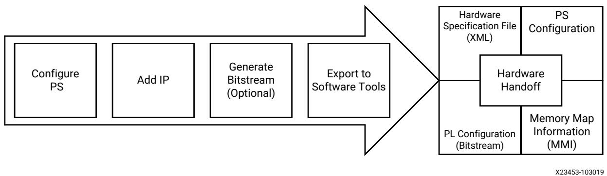

## **General Steps for Creating an Embedded Processor Design**

To complete an embedded processor design, you typically go through the following steps:

- 1. Create a new Vivado Design Suite project.
- 2. Create a block design in the IP integrator tool and instantiate a Xilinx processor, along with any other Xilinx IP or your custom IP.
- 3. Generate Output Products of the IP in the block design with the correct synthesis mode option.
- 4. Create a top-level wrapper and instantiate the block design into a top-level RTL design.


- 5. Run the top-level design through synthesis and implementation, and then export the hardware to the Vitis software platform.
- 6. Create your software application. In the Vitis software platform, associate the Executable Linkable File (ELF) file with the hardware design.
- 7. (For MicroBlaze processors only). Use the Xilinx updatemem utility to merge the ELF and Memory Map Information (MMI) for the block Rams with the hardware device bitstream. See [Chapter 7: Using UpdateMEM to Update BIT files with MMI and ELF Data](#page-161-0) for information about this utility.
- 8. Program into the target board.

## **Embedded IP Catalog**

The Vivado Design Suite IP catalog is a unified repository that lets you search, review detailed information, and view associated documentation for the IP.

After you add the third-party or customer IP to the Vivado Design Suite IP catalog, you can access the IP through the Vivado Design Suite flows. The following figure shows a portion of the Vivado IDE IP integrator IP catalog.

### *Figure 2:* **IP Integrator IP Catalog**

<span id="page-8-0"/>

## **Completing Connections Using Designer Assistance**

In Zynq processors, after you have configured the processor system (PS) for a Xilinx processor device, you can instantiate other IP that go in the programmer logic (PL) portion of the device.

In the IP integrator diagram area, right-click and select **Add IP**.

The Vivado IP integrator provides two built-in features to assist you in completing the rest of your IP subsystem design: *Block Automation* and *Connection Automation*. These features help you put together a basic microprocessor system in the IP integrator tool and connect ports to external I/O ports.


**IMPORTANT!** *The following section uses a ZYNQ7 processor for illustration. The features are the same regardless of the processor you use.*

## **Block Automation**

Block Automation is available when a Xilinx processor has subsystem IP instantiated in the block design of the IP integrator tool.

Click **Run Block Automation** to get assistance with putting together a simple ZYNQ Processing System, as shown in the following figure.


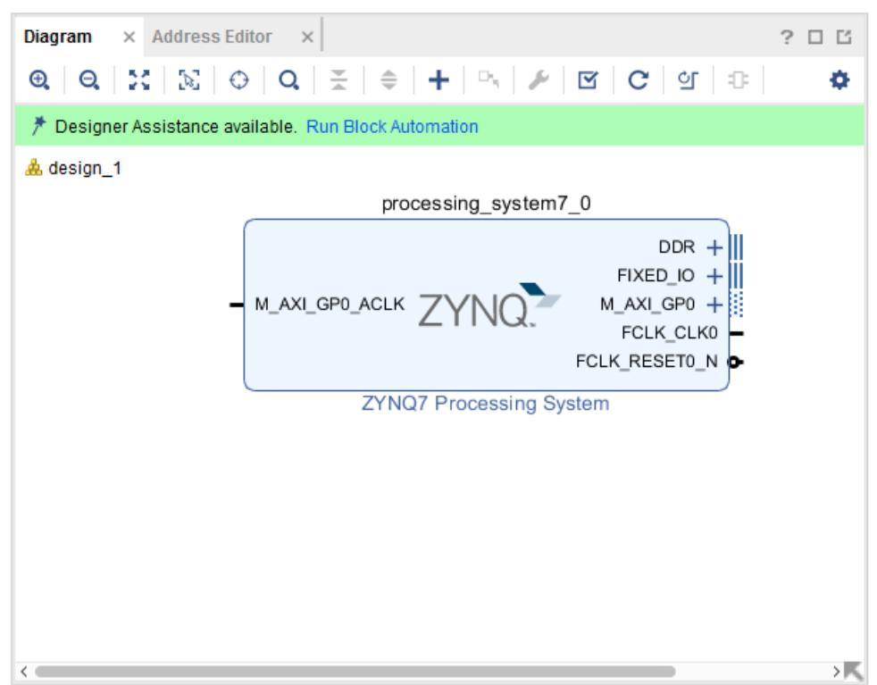

### *Figure 3:* **Run Block Automation Feature**

The Run Block Automation dialog box in the following figure shows the options available for automation, as shown in the following figure. If you are working with a targeted reference board, you can enable the board presets by checking the Apply Board Preset check box.


<span id="page-10-0"/>

### *Figure 4:* **Run Block Automation for ZYNQ7 Dialog Box**

When you click OK, the Block Automation feature creates the basic system, as shown in the following figure.

### *Figure 5:* **IP Integrator Canvas after Running Block Automation**


You can also enable the cross-trigger feature by selecting the appropriate function using the Cross Trigger In and Cross Trigger Out fields of the Block Automation dialog box.

### *Figure 6:* **Using Run Block Automation Dialog Box to Enable Cross Trigger Feature**

The default value for the Cross Trigger In and Cross Trigger Out fields is Disable; however, you can use the cross-trigger by selecting the Enable and New ILA options.

Selecting Enable for Cross Trigger In and Cross Trigger Out exposes only one of the available cross-trigger pins in ZYNQ7. The connectivity to these pins is left for you to complete.


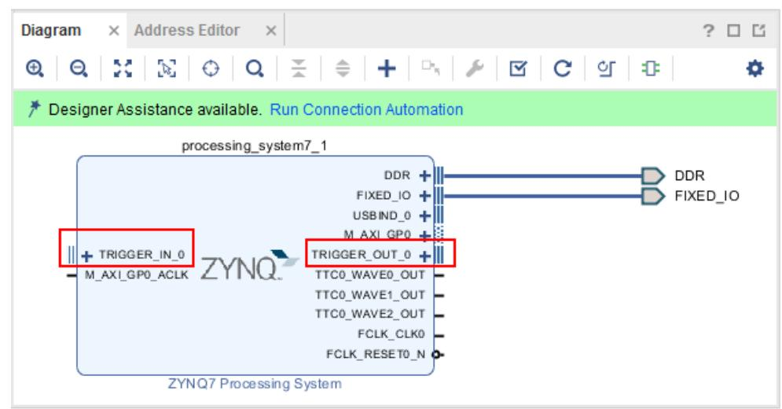

### *Figure 7:* **Cross Trigger Pins in ZYNQ7**

When you select the New ILA option, it not only enables the cross-trigger pins, it also connects them to an Integrated Logic Analyzer (ILA) core.

*Figure 8:* **Cross Trigger Pins Connected to an ILA Using Block Automation**

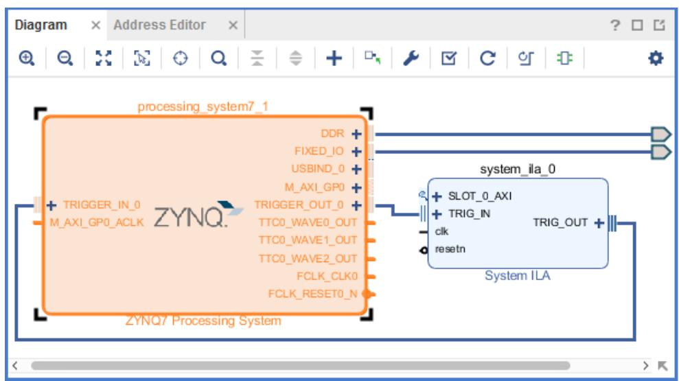

The Vivado IP integrator tool also provides a Board Automation feature when using a Xilinx Target Reference Platform, such as the ZC702. See [Platform Board Flow in IP Integrator](#page-17-0) for more information.

This feature provides connectivity of the ports of an IP to the FPGA pins on the target board. The IP configures accordingly, and based on your selections, connects the I/O ports. Board Automation automatically generates the physical constraints for those IP that require physical constraints.


In [Figure 5: IP Integrator Canvas after Running Block Automation,](#page-10-0) observe that the external DDR and FIXED_IO interfaces connect to external ports.

## **Using Connection Automation**

If the IP integrator tool determines that a potential connection exists among the instantiated IP in the canvas, it opens the Connection Automation feature.

In the following figure, the AXI BRAM Controller and the Block Memory Generator IP are instantiated along with the ZYNQ7 Processing System IP.

The IP integrator tool determines that a potential connection exists between the AXI BRAM Controller and the ZYNQ7 IP; consequently, Connection Automation is available, as shown in the following figure.

*Figure 9:* **Using Run Connection Automation Feature to Complete Connectivity**

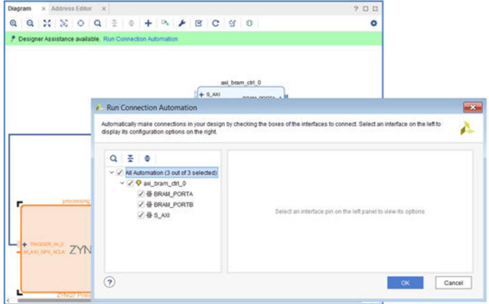

In this example, clicking **Run Connection Automation** instantiates an AXI Interconnect, a Block Memory Generator, and a Proc Sys Reset IP, connects the AXI BRAM Controller to the ZYNQ PS IP using AXI SmartConnect, and appropriately connects the Proc Sys Reset IP.

See this [link](https://www.xilinx.com/cgi-bin/docs/rdoc?v=2020.1;d=ug994-vivado-ip-subsystems.pdf;a=xInterConnectVsSmartConnect) to *Vivado Design Suite User Guide: Designing IP Subsystems using IP Integrator* [(UG994](UG994)) for a description of the differences between AXI Interconnect and AXI SmartConnect.

The following figure shows the final result.

<span id="page-14-0"/>

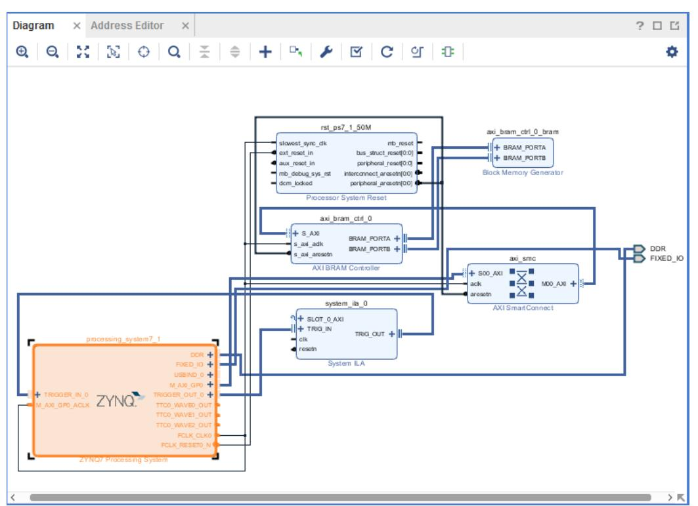

*Figure 10:* **Block Design After Using Connection Automation**

## **Making Manual Connections in a Design**

The following figure shows how you can connect the ILA SLOT_0_AXI or the clk pin to the clock and the AXI interface that needs to be monitored in the design. You can do this manually.

As you move the cursor near an interface or pin connector on an IP block, the cursor changes to a pencil. Click an interface or pin connector on an IP block, and drag the connection to the destination block.

The following figure illustrates the use of manual connections.

<span id="page-15-0"/>

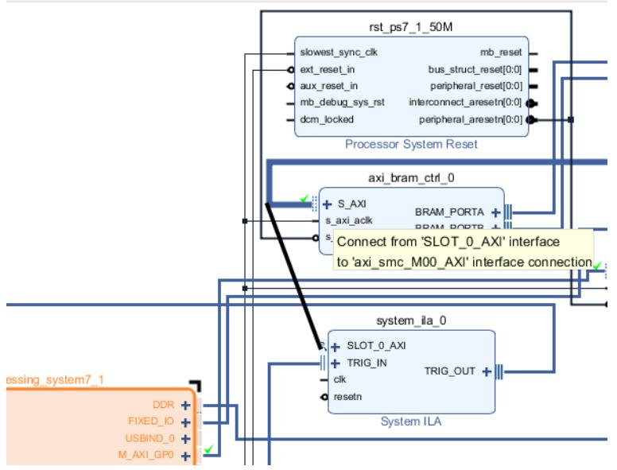

### *Figure 11:* **Manually Connecting Ports**

## **Manually Creating and Connecting to I/O Ports**

You can manually create external I/O ports in the Vivado IP integrator by connecting signals or interfaces to external I/O ports then selecting a pin, a bus, or an interface connection.

To manually create/connect to an I/O port, right-click the port in the block diagram, and then select one of the following from the right-click menu:

- **Make External:** Use the Ctrl+Click keyboard combination to select multiple pins and invoke the Make External connection. This command ties a pin on an IP to an I/O port on the block design.
- **Create Port:** Creates non-interface signals, such as a clock, reset, or uart_txd. The Create Port option gives more control in terms of specifying the input and output, the bitwidth and the type (clk, reset, or data). In case of a clock, you can even specify the input frequency.
- **Create Interface Port:** Creates ports on the interface for groupings of signals that share a common function. For example, the S_AXI is an interface port on several Xilinx IP. The command gives more control in terms of specifying the interface type and the mode (master or slave).

<span id="page-16-0"/>

## **Enhanced Designer Assistance**

The IP integrator tool offers enhanced designer assistance when an AXI4-Stream interface is to be connected to an AXI4 memory-mapped interface. As an example, the following figure shows a FIR Compiler IP with a streaming interface is to be connected to the slave ACP port of the processing_system7_0.

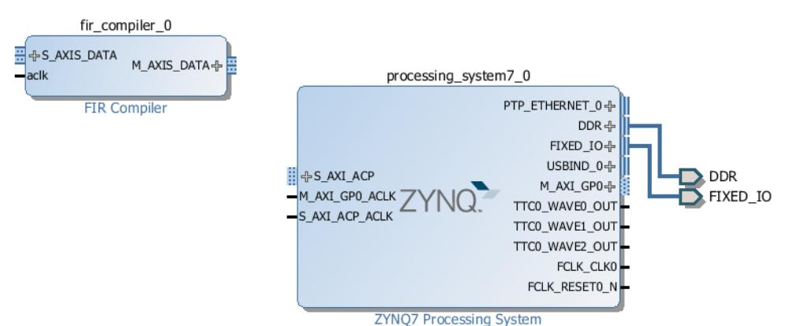

*Figure 12:* **Connecting Streaming Interface to a Memory-Mapped Interface**

To use the enhanced designer assistance you must make a direct connection between the M_AXIS_DATA interface pin of the FIR Compiler and the S_AXI_ACP port of the ZYNQ7 processing system as shown in the following figure.

### *Figure 13:* **Invoking Enhanced Designer Assistance**

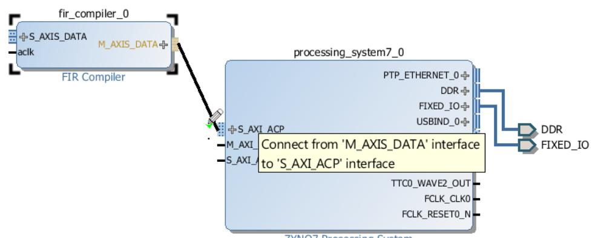

The Make Connection dialog box, shown in the following figure, informs you that the Stream Bus Interface /fir_compiler_0/M_AXIS_DATA will be connected to the memory-mapped businterface /processing_system7_0/S_AXI_ACP. It also offers the user different options for clocking on the streaming memory-mapped interface. The default is Auto.

<span id="page-17-0"/>

### *Figure 14:* **Make Connection Dialog Box for Enhanced Designer Assistance**

The enhanced designer assistance instantiates a DMA core configured to do High/Medium frequency transfers and makes the appropriate connection when you choose to click OK after selecting the proper settings, as shown in the following figure.

### *Figure 15:* **Connections Made after Using Enhanced Designer Assistance**


The enhanced designer assistance instantiates an AXI Subset Converter, an AXI Direct Memory Access and an AXI Interconnect to make the connection between the streaming interface of the FIR Compiler and the ACP port of PS7. The AXI4-Stream Subset Converter provides a solution for connecting slightly incompatible AXI4-Stream signal sets together. The IP has configurable AXI4-Stream signals for each interface that allows one to convert one signal set to another in a consistent manner.

## **Platform Board Flow in IP Integrator**

The Vivado® Design Suite is *board-aware*. The tools know the various components present on the target board and can customize an IP to be instantiated and configured to connect to the components of a particular board.


<span id="page-18-0"/>

The IP integrator shows all the components present on the board in a separate tab called the Board tab.

When you use this tab to select components and the designer assistance offered by IP integrator, you can easily connect your design to the components of your choice. I/O constraints are automatically generated as a part of using this flow.

See this [link](https://www.xilinx.com/cgi-bin/docs/rdoc?v=2020.1;d=ug994-vivado-ip-subsystems.pdf;a=UsingtheBoardFlowinIPIntegrator) in the *Vivado Design Suite User Guide: Designing IP Subsystems using IP Integrator* [(UG994](UG994)) for more information.

## **Memory-Mapping in the Address Editor**

While memory-mapping of the peripherals (slaves) instantiated in the block design are automatically assigned, you can a manually assign the addresses also. To generate the address map for this design, do the following:

- 1. Click the Address Editor tab above the diagram.
- 2. Click the **Auto Assign Address** button (bottom on the left side).

You can manually set addresses by entering values in the Offset Address and Range columns. See this [link](https://www.xilinx.com/cgi-bin/docs/rdoc?v=2020.1;d=ug994-vivado-ip-subsystems.pdf;a=xCreatingaMemoryMap) in the *Vivado Design Suite User Guide: Designing IP Subsystems using IP Integrator* ([UG994)](https://www.xilinx.com/cgi-bin/docs/rdoc?v=latest;d=ug994-vivado-ip-subsystems.pdf) for more information.


**TIP:** *The Address Editor tab only opens if the diagram contains an IP such as the Zynq-7000 SoC or Zynq UltraScale+ MPSoC device that functions as a bus master in the design.*

<span id="page-19-0"/>

## **Adding RTL to Block Design**

The Module Reference feature of the Vivado IP integrator lets you quickly add a module or entity definition from a Verilog or VHDL source file directly into your block design. While this feature does have limitations, it provides a means of quickly adding RTL modules without having to go through the process of packaging the RTL as an IP to be added through theVivado IP catalog. Both flows have their benefits and costs:

- The Package IP flow is rigorous and time consuming, but it offers a well-defined IP that can managed through the IP catalog, used in multiple designs, and upgraded as new revisions become available.
- The Module Reference flow is quick, but does not offer the benefits of working through the IP catalog.

To add an RTL module, the source file must already be loaded into the project, as described at this link in the *Vivado Design Suite User Guide: System-Level Design Entry* ([UG895)](https://www.xilinx.com/cgi-bin/docs/rdoc?v=latest;d=ug895-vivado-system-level-design-entry.pdf). From within the BD select the Add Module command from the right-click or context menu of the design canvas. The Add Module dialog box displays a list of all valid modules defined in the RTL source files that you have previously added to the project. Select one from the list to instantiate it into the BD. The Vivado tools add the module to the BD, and you can make connections to it just as you would with any other IP in the design. The added RTL module displays in the BD with special markings that identify it as an RTL referenced module, as shown in the following figure.

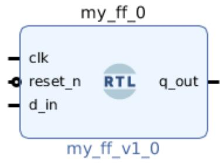


An AI Engine supports AXI4-Stream interface to interface with an IP in the PL. The following paragraphs describe the steps needed to ensure that an AXI4-Stream interface, included as a part of user RTL, is inferred properly by the tools. There are two use cases to consider. If standard AXI naming convention is used, then Vivado will infer the AXI4-Stream interface without any changes required to the code. However, often times RTL designers have custom names for interface pins. In this case, you need to insert some pragmas in the RTL code for proper port mapping of user names with standard AXI4 names. An example of a standard naming convention is shown in the following snippet code.

```
module myip_v1_0 #
 (
 // Parameters of Axi Slave Bus Interface S00_AXIS
 parameter integer C_S00_AXIS_TDATA_WIDTH = 32
 )
 (
 // Ports of Streaming AXI Slave Bus Interface S00_AXIS
 input wire s00_axis_aclk,
 input wire s00_axis_aresetn,
 output wire s00_axis_tready,
 input wire [C_S00_AXIS_TDATA_WIDTH-1 : 0] s00_axis_tdata,
 input wire [(C_S00_AXIS_TDATA_WIDTH/8)-1 : 0] s00_axis_tstrb,
 input wire s00_axis_tlast,
 input wire s00_axis_tvalid
 );
```
Because a standard naming convention is used in the snippet, the Vivado tools will properly infer the slave AXI4-Stream interface. When this module is instantiated on the block design canvas, it appears as follows.

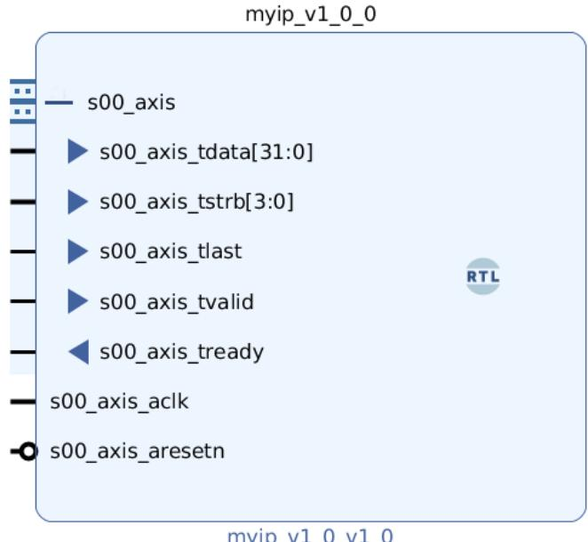


Following is a code snippet of the case where all the AXI4-Stream interface pin names are custom. Even the AXI4-Stream interface is called my_s00_axis.

```
library ieee;
use ieee.std_logic_1164.all;
use ieee.numeric_std.all;
entity my_module is
 port (
 my_tdata : in std_logic_vector(31 downto 0); -- Transfer Data (optional)
 my_tstrb : in std_logic_vector(3 downto 0); -- Transfer Data Byte Strobes 
(optional
 my_tlast : in std_logic; -- Packet Boundary Indicator (optional)
 my_tvalid : in std_logic; -- Transfer valid (required)
 my_tready : out std_logic; -- Transfer ready (optional)
 my_axis_aclk : in std_logic; -- AXIS Clock
 my_axis_aresetn : in std_logic -- AXIS Reset
 );
end my_module;
architecture arch_impl of my_module is
 ATTRIBUTE X_INTERFACE_INFO : STRING;
 ATTRIBUTE X_INTERFACE_INFO of my_tdata: SIGNAL is 
"xilinx.com:interface:axis:1.0 my_s00_axis TDATA";
 ATTRIBUTE X_INTERFACE_INFO of my_tstrb: SIGNAL is 
"xilinx.com:interface:axis:1.0 my_s00_axis TSTRB";
 ATTRIBUTE X_INTERFACE_INFO of my_tlast: SIGNAL is 
"xilinx.com:interface:axis:1.0 my_s00_axis TLAST";
 ATTRIBUTE X_INTERFACE_INFO of my_tvalid: SIGNAL is 
"xilinx.com:interface:axis:1.0 my_s00_axis TVALID";
 ATTRIBUTE X_INTERFACE_INFO of my_tready: SIGNAL is 
"xilinx.com:interface:axis:1.0 my_s00_axis TREADY";

 ATTRIBUTE X_INTERFACE_INFO : STRING;
 ATTRIBUTE X_INTERFACE_INFO of my_axis_aclk: SIGNAL is 
"xilinx.com:signal:clock:1.0 my_axis_aclk CLK";
 ATTRIBUTE X_INTERFACE_PARAMETER : STRING;
 ATTRIBUTE X_INTERFACE_PARAMETER of my_axis_aclk: SIGNAL is 
"ASSOCIATED_BUSIF my_s00_axis, ASSOCIATED_RESET my_axis_areset_n, FREQ_HZ 
100000000";

begin
-- user logic here
```
end arch_impl;

When this RTL is instantiated on the block design, you will see that all interface signals are bundled properly in the interface and the clock and reset are associated properly to that interface.


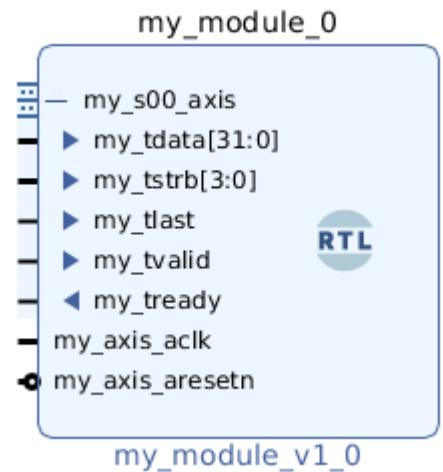

In general these pragmas are defined in the Language Templates provided by the Vivado tools. To access the Language Template, click **Language Templates** under PROJECT MANAGER in the Flow Navigator.

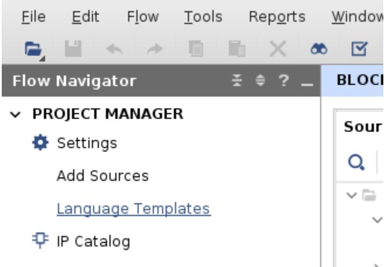

In the Language Templates dialog box, navigate to the interface definition desired. As an example, the following figure shows attributes needed for the AXI4-Stream interface. It is under VHDL (or Verilog) → IP Integrator HDL → AXI4 Interfaces → AXI4-Stream. You can copy and paste the template into your RTL code and make modifications to it as shown in the previous snippet code.

<span id="page-23-0"/>

RTL can also be packaged as a custom IP. For more information on this flow refer to *Vivado Design Suite User Guide: Creating and Packaging Custom IP* [(UG1118](UG1118)).

## **Running Design Rule Checks**

The Vivado IP integrator runs basic DRCs in real time as you put the design together. However, errors can occur during design creation. For example, the frequency on a clock pin might not be set correctly.

To run a comprehensive DRC, click the **Validate Design** button .

If no warnings or errors occur in the design, a validation dialog box displays to confirm that there are no errors or critical warnings in your design.

## **Integrating a Block Design in the Top-Level Design**

After you complete the block design and validate the design, there are two more steps required to complete the design:


- Generate the output products
- Create a HDL wrapper

Generating output products makes the source files and the appropriate constraints for the IP available in the Vivado IDE Sources window.

Depending upon what you selected as the target language during project creation, the IP integrator tool generates the appropriate files. If the Vivado IDE cannot generate the source files for a particular IP in the specified target language, a message displays in the console.

## **Generating Output Products**

To generate output products, do one of the following:

- In the Block Design panel, expand the Design Sources hierarchy and select **Generate Output Products**.
- In the Flow Navigator panel, under IP Integrator, click **Generate Block Design**.

The Vivado Design Suite generates the HDL source files and the appropriate constraints for all the IP used in the block design. The source files are generated based upon the Target Language that you select during project creation, or in the Settings dialog box. See this [link](https://www.xilinx.com/cgi-bin/docs/rdoc?v=2020.1;d=ug994-vivado-ip-subsystems.pdf;a=xGeneratingOutputProducts) to the *Vivado Design Suite User Guide: Designing IP Subsystems using IP Integrator* ([UG994)](https://www.xilinx.com/cgi-bin/docs/rdoc?v=latest;d=ug994-vivado-ip-subsystems.pdf), for more information on generating output products.

## **Creating an HDL Wrapper**

You can integrate an IP integrator block design into a higher-level design. To do so, instantiate the design in a higher-level HDL file.

To instantiate at a higher level, in the Design Sources hierarchy of the Block Design panel, rightclick the design and select **Create HDL Wrapper**, as shown in the following figure.

### *Figure 17:* **Creating an HDL Wrapper**

<span id="page-25-0"/>

Vivado offers two choices for creating an HDL wrapper, as shown in the following figure:

- Let Vivado create and automatically update the wrapper, which is the default option.
- Create a user-modifiable script, which you can edit and maintain. Choosing this option requires that you update the wrapper every time you make port-level changes in the block design.

*Figure 18:* **Create HDL Wrapper Dialog Box**

This generates a top-level HDL file for the IP integrator subsystem. You can now take your design through the other design flows: elaboration, synthesis, and implementation.

## **Vivado Pin Planner View of PS I/O**

See the *Zynq-7000 SoC PCB Design Guide* [(UG933](UG933)) for a detailed description of guidelines for PCB pin-planning and design for these devices.

## **Vivado IDE Generated Embedded Files**

When you export a processor hardware design from the Vivado IP integrator tool to the Vitis software platform, the IP integrator generates a Xilinx Software Archive (XSA) file with a .xsa extension. The archive contains the files listed in the following table for ZYNQ7 designs.

|  |  | Table 1: Files Generated by IP Integrator |
|--|--|-------------------------------------------|
|--|--|-------------------------------------------|

| File                         | Description                                                                                                                                                                                                                                                                                                                                                                                           |  |
|------------------------------|-------------------------------------------------------------------------------------------------------------------------------------------------------------------------------------------------------------------------------------------------------------------------------------------------------------------------------------------------------------------------------------------------------|--|
| ps<#>_init.c<br>ps<#>_init.h | These files contain the initialization code for the Zynq Processing System and initialization<br>settings for DDR, clocks, PLLs, and MIOs. The Vitis software platform uses these settings<br>when initializing the processing system so that applications can run on top of the<br>processing system. Some settings in the processing system are in a fixed state for the<br>ZC702 evaluation board. |  |

<span id="page-26-0"/>

### *Table 1:* **Files Generated by IP Integrator** *(cont'd)*

| File            | Description                        |  |
|-----------------|------------------------------------|--|
| ps<#>_init.tcl  | The Tcl version of the INIT file.  |  |
| ps<#>_init.html | Describes the initialization data. |  |

See the relevant Software Developers User Guide for the processor in question to obtain more information about generated files.

## **Using the Vitis software platform**

The Vitis software platform IDE provides a complete environment for creating software applications targeted for Xilinx embedded processors. It includes:

- A GNU-based compiler toolchain (GCC compiler, TCF System debugger, utilities, and libraries)
- A JTAG debugger
- A flash programmer
- Drivers for Xilinx IP and bare-metal board support packages
- Middleware libraries for application-specific functions
- An IDE for C/C++ bare-metal and Linux application development and debugging

Based upon the open source Eclipse platform, the Vitis software platform incorporates the C/C+ + Development Toolkit (CDT).

Features of the Vitis software platform include:

- C/C++ code editor and compilation environment
- Project management
- Application build configuration and automatic make file generation
- Error navigation
- Integrated environment for debugging and profiling embedded targets
- Additional functionality available using third-party plug-ins, including source code version control


## **Exporting a Hardware Description**

Once a design has been implemented and the bitstream generated, you can export the design to the Vitis™ software platform for software application development. In rare cases where the Processing Logic does not contain any logic at all, you can also export the design without implementing or generating the bitstream.

To export your design, do the following:

- 1. In the main Vivado IDE, select **File → Export → Export Hardware**.
The Export Hardware dialog box opens, as shown in the following figure.

- 2. In the Export Hardware dialog box, check the **Include bitstream** check box if the bitstream has already been generated.
*Note***:** In a project-based flow, typically the **Export to** field is set to the local project directory, but it can be changed as required.

- 3. After the hardware definition has been exported, select **Tools → Launch Vitis** to launch the Vitis software platform from Vivado.
The Eclipse Launcher dialog box opens, as shown in the following figure.

The Workspace field should be populated with the name of the directory where the software application project is to be created.


After you export the hardware definition to the Vitis software platform, and launch, you can start writing your software application.

You can perform further debug and software download from the Vitis software platform.

Alternatively, you can import the ELF file for the software back into the Vivado tools, and integrate it with the FPGA bitstream for further download and testing.


<span id="page-29-0"/>

*Chapter 2*

# Using a Zynq UltraScale+ MPSoC Device in an Embedded Design

This chapter describes the Xilinx® Vivado® Design Suite flow for working with the Zynq UltraScale+ MPSoC device.

The examples target the Xilinx ZCU102 Rev 1.0 evaluation board and the tool versions in the 2020.x Vivado Design Suite release.

See the [Chapter 1: Introduction](#page-4-0) for programming information that applies to all processors.

## **Designing Zynq UltraScale+ MPSoC Devices**

The software interface for the Xilinx Zynq UltraScale+ MPSoC processing system IP core is named zynq ps8. The Zynq UltraScale+ MPSoC family consists of a system-on-chip (SoC) with an integrated processor system (PS) and a programmer logic (PL) unit, providing an extensible and flexible SoC solution on a single die.

## **Creating a Design with the Zynq UltraScale+ Processing System**

From within a design project that targets the Zynq UltraScale+ MPSoC device, click the **Create Block Design** button to create an empty block design.

- 1. Click the IP integrator **Create Block Design** option to open the Create Block Design dialog box, where you can enter the **Design Name**, as shown in the following figure.


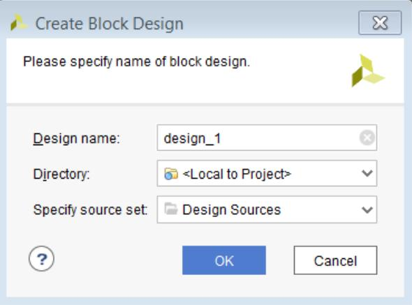

- 2. Use this dialog box for the additional entries:
	- Create the Block Design as a part of a project, or in a different location that you can specify in the Directory field.
	- Specify the source type by setting the field Specify source set from the pull-down menu.

The Block Design window opens, as shown in the following figure.

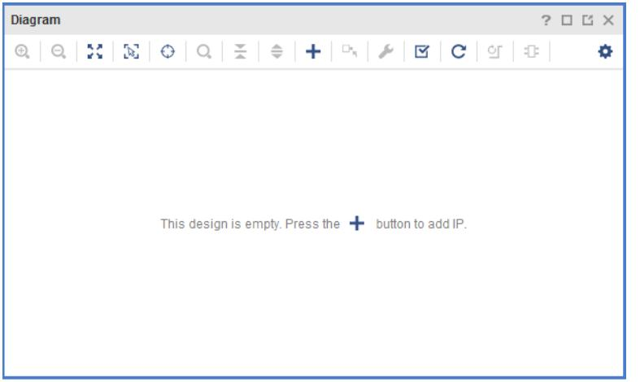

- 3. Select the **Add IP** option, and a Search box opens where you can search for, and select the **ZYNQ UltraScale+ MPSoc**, shown in the following figure.


When you select the Zynq UltraScale+ MPSoC IP, the Vivado IP integrator adds the IP to the design, and a graphical representation of the processing system displays, as shown in the following figure.

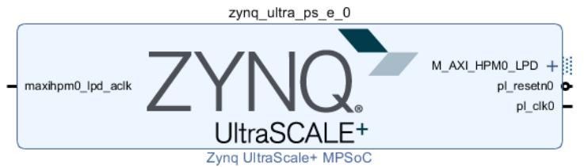

The corresponding Tcl command is create_bd_cell; the syntax is, as follows:

```
create_bd_cell -type ip -vlnv xilinx.com:ip:zynq_ultra_ps_e:2.0 
zynq_ultra_ps_e_0
```
- 4. Double-click the processing system graphic to invoke the Re-customize IP process, which displays the Re-customize IP for the Zynq UltraScale+ MPSoC dialog box as shown in the following figure.
- 5. Review the contents of the block design. The green colored blocks in the Zynq UltraScale+ MPSoC are configurable items. You can click a green block to open the coordinating configuration options.

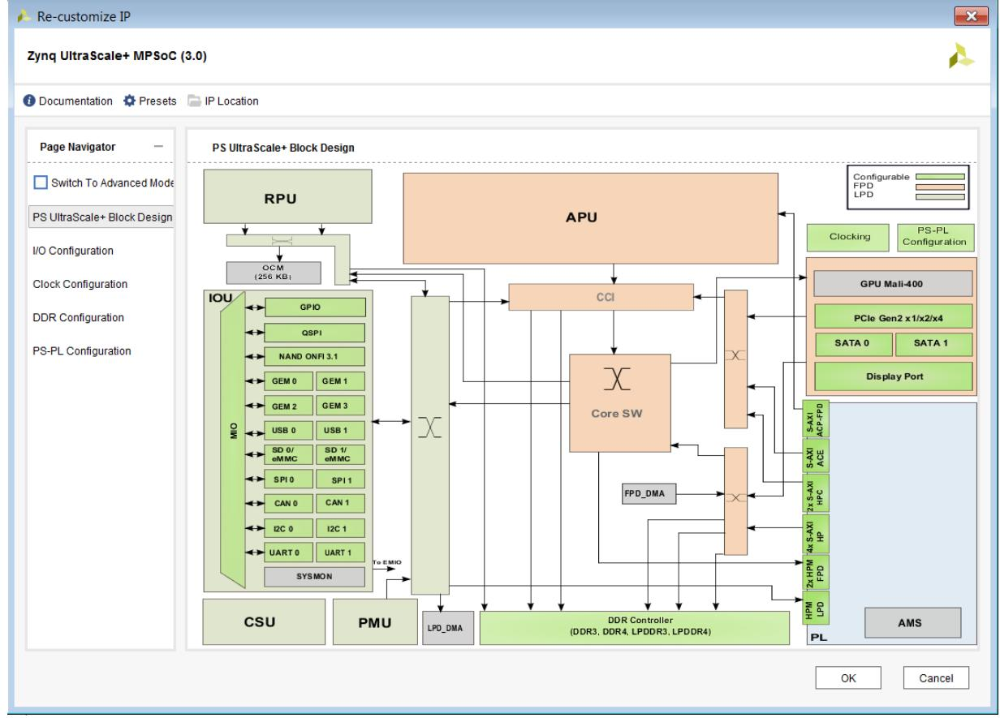

<span id="page-32-0"/>

Alternatively, you can select the options from the Page Navigator on the left, as shown in the figure above.

You can also enable the Advanced Configuration Mode by checking the Switch to Advanced Mode check box, shown in the following figure. When this option is enabled, the Advanced Configuration, PCIe Configuration, and Isolation Configuration options become available.

*Figure 19:* **ZYNQ UltraScale+ Advanced Mode**

## **Overview of Zynq UltraScale+ MPSoc Configurations**

The *Zynq UltraScale+ Device Technical Reference Manual* [(UG1085](UG1085)) provides details on the options available in the Page Navigator of the Zynq UltraScale+ MPSoC Configuration dialog box. The *Zynq UltraScale+ MPSoC: Software Developers Guide* [(UG1137](UG1137)) describes programming the device.

The following sections briefly describes these options.

## **Zynq UltraScale+ MPSoc Recustomization Window Information**

The following figure shows the documentation options in the Re-customize IP window.


### *Figure 20:* **Zynq UltraScale+ MPSoc Information**

- **Documentation:** Opens the documentation menu and provides access to the Product Guide, Change Log for the IP, and access the Xilinx website where you can find documentation pertaining to Zynq UltraScale+ MPSoC.
- **Presets:** Lets you view information about the available preset options. You can save the current configuration of PS8 to a file or apply a pre-existing configuration to configure the current instance of the processors. Presets can also be applied to a target board. The available options are Default, ZC702, ZC706, and Zedboard.
- **IP Location:** Shows the location of the source files created for the IP.

## **Configuring I/O Peripherals**

The ZYNQ UltraScale+ MPSoc has over 20 peripherals available that you can customize. You can route these peripherals directly to the dedicated Multiplexed I/Os (MIO), EMIOs, or GT Lanes as applicable. Peripherals are divided into two categories: Low Speed and High Speed Peripherals.

### *Low Speed Peripherals: Memory Interfaces*

### **QSPI**

The generic Quad-SPI controller meets the requirements for generic low-level access by the software. The controller supports generic and future command sequences and future NOR/ NAND flash devices. Due to the generic nature of the Quad-SPI controller, software can generate any command sequence in any mode.

The Quad-SPI controller supports all features in SPI, dual-SPI, and Quad-SPI modes. The Quad-SPI controller also supports the dual parallel mode, with separate buses, and stacked mode with a shared bus, for two flash devices. The choices for Quad-SPI are **Single**, **Dual Stacked**, and **Dual Parallel**.

The QSPI I/O can be set with the appropriate slew, drive strength, and pull-up/pull-down options. You can generate an optional Feedback Clk also.

The following figure shows the Quad SPI Configuration options.


### *Figure 21:* **Configuring QSPI I/O Pins**

### **NAND**

The NAND flash controller has an advanced eXtensible interface (AXI) interface, which allows the Arm® processor to configure the operational registers sitting inside the NAND flash controller. The block supports the open NAND flash interface working group (ONFI) standards 1.0, 2.0, 2.1, 2.2, 2.3, 3.0, and 3.1.

The NAND flash controller handles all the command, address, and data sequences, manages all the hardware protocols, and allows the users to access NAND flash memory simply by reading or writing into the operational registers. All available options can be set through the Configuration wizard as shown in the following figure.

*Figure 22:* **Configuring NAND I/O Pins**


### **SD**

The SD 3.0/SDIO 3.0 host controller with an AXI processor interface conforms to the secure digital (SD) host controller standard specification version 3.00. The host controller handles the SDIO/SD protocol at the transmission level, packing data, adding cyclic redundancy check (CRC), start/end bits, and checking for transaction format correctness. The host controller provides for the programmed I/O method and the DMA data transfer method.

In the programmed I/O method, the host processor transfers data using the buffer data port register. The DMA support for the host controller is determined by checking the DMA support in the capabilities register. DMA allows a peripheral to read or write memory without intervention from the CPU. The host controller system address register points to the first data address, and data is accessed sequentially from that address, as shown in the following figure.

### *Figure 23:* **Configuring SD I/O Pins**

## *I/O Peripherals*

### **CAN**

There are two nearly identical CAN controllers in the PS that are independently operable. The features of the CAN Controller are, as follows:

- Conforms to the ISO 11898-1, CAN 2.0A, and CAN 2.0B standards.
- Standard (11-bit identifier) and extended (29-bit identifier) frames.
- Transmit message FIFO (TXFIFO) with a depth of 64 messages.
- Transmit prioritization through one high-priority transmit buffer (TXHPB).
- Watermark interrupts for TXFIFO and RXFIFO.


- Automatic re-transmission on errors or arbitration loss in normal mode.
- Receive message FIFO (RXFIFO) with a depth of 64 messages.
- Four RX acceptance filters with enables, masks, and IDs.
- Loopback and snoop modes for diagnostic applications.
- Sleep mode with automatic wake-up.
- Maskable error and status interrupts.
- 16-bit time stamping for receive messages.
- Readable RX/TX error counters.

The following figure shows the CAN configuration options.

### *Figure 24:* **Configuring CAN I/O Pins**

### **I2C**

The I2C module is a bus controller that can function as a master or a slave in a multi-master design. It supports a wide clock frequency range from DC, approaching up to 400 Kb/s.

In master mode, a transfer can only be initiated by the processor writing the slave address into the I2C address register. The processor is notified of any available received data by a data interrupt or a transfer complete interrupt. If the hold bit is set, the I2C interface holds the clock line (SCL) low after the data is transmitted to support slow processor service. The master can be programmed to use both normal (7-bit) addressing and extended (10-bit) addressing modes. 10 bit addressing is only supported in master mode.

In slave monitor mode, the I2C interface is set up as a master and continues to attempt a transfer to a particular slave until the slave device responds with an ACK. The hold bit can be set to prevent the master from continuing with the transfer, preventing an overflow condition in the slave.


A common feature between master mode and slave mode is the timeout (TO) interrupt flag. If at any point the SCL line is held low by the master or the accessed slave for more than the period specified in the timeout register, a TO interrupt is generated to avoid stall conditions.

Select the appropriate MIO pins for the two I2C controllers from the drop-down menu. An optional interrupt can be generated from the two I2C controllers.

The following figure shows the I2C configuration page.

### *Figure 25:* **Configuring I2C I/O Pins**

### **PJTAG**

An alternate option for communication with the Arm DAP is through the PJTAG signals. There are six PJTAG interfaces specified in the MIO. Using the MIO SLCR, you can select one of the PJTAG0-5 MIO interfaces to be the PJTAG interface. The PJTAG interface enters the JTAG security gate circuit, which routes the JTAG interfaces around the device.

To use the PJTAG interface, the following conditions must be met:

- The JTAG security gate is disabled by writing to the correct register in the CSU.
- The Arm DAP is not on the JTAG chain.

To prevent security holes, the PJTAG is multiplexed into the JTAG signaling before the security gate. The following figure shows the PJTAG configuration options.

### *Figure 26:* **Configuring PJTAG I/O Pins**


### **PMU**

The platform management unit (PMU) controls the power-up, reset, and monitoring of resources within the entire system. The Zynq UltraScale+ MPSoC PMU performs the following set of tasks.

- Initialization of the system during boot.
- Management of power gating.

When the system is in the off mode, it becomes alive upon an indication from external or internal events. Therefore, a subset of the system logic is active to detect such an event. The PMU also provides power management, error management, safety functions, and a software test library.

The PMU can obtain status information, and issue requests to other system elements without using the application processors, monitor system temperature sensors, and control system elements such as fans and power supplies.

#### *Figure 27:* **Configuring PMU I/O Pins**

### **CSU**

The boot process is managed and carried out by the Platform Management Unit and Configuration Security Unit. The CSU can be enabled by selecting the CSU check box.


### **SPI**

The SPI bus controller enables communications with a variety of peripherals such as memories, temperature sensors, pressure sensors, analog converters, real-time clocks, displays, and any SD card with serial mode support. The SPI controller can function in master mode, slave mode, or multi-master mode.

The Zynq UltraScale+ MPSoC includes two instances of an SPI controller: SPI0 and SPI1. Both controllers are identical and independently controlled by software drivers. They can be operated simultaneously.

*Figure 28:* **Configuring SD I/O Pins**

### **UART**

The UART controller is a full-duplex asynchronous receiver and transmitter that supports a wide range of programmable baud rates and I/O signal formats. The controller can accommodate automatic parity generation and multi-master detection mode.

The UART operations are controlled by the configuration and mode registers. The state of the FIFOs, modem signals, and other controller functions are read using the status, interrupt status, and modem status registers.

The controller is structured with separate RX and TX data paths. Each path includes a 64-byte FIFO. The controller serializes and de-serializes data in the TX and RX FIFOs, and includes a mode switch to support various loop-back configurations for the RxD and TxD signals. The FIFO interrupt status bits support polling or an interrupt driven handler. Software reads and writes data bytes using the RX and TX data port registers.


When using the UART in a modem-like application, the modem control module detects and generates the modem handshake signals and also controls the receiver and transmitter paths according to the handshaking protocol. The following figure shows the UART configurations options.

### *Figure 29:* **Configuring UART I/O Pins**

### **GPIO**

The general purpose I/O (GPIO) peripheral provides software with observation and control of up to 78 device pins through the MIO module. The GPIO also provides access to 96 inputs from the programmable logic (PL) and 192 outputs to the PL through the EMIO interface.

The GPIO is organized into six banks of registers that group related interface signals. Each GPIO is independently and dynamically programmed as input, output, or interrupt sensing. Software can read all GPIO values within a bank using a single load instruction, or write data to one or more GPIOs (within a range of GPIOs) using a single store instruction. The following figure shows the GPIO configuration options.


### *Figure 30:* **Configuring GPIO Pins**

### **Processing Unit**

The processing unit (PU) for the Zynq UltraScale+ MPSoC device comprises four Cortex-A53 MPCore processors, L2 cache, and related functionality. The Cortex-A53 MPCore processor is the most power-efficient Arm v8 processor capable of seamless support for 32-bit and 64-bit code. It makes use of a highly efficient 8-stage in-order pipeline balanced with advanced fetch and data access techniques for performance. It fits in a power and area footprint suitable for entry-level devices, and is at the same time capable of delivering high-aggregate performance in scalable enterprise systems using high core density.

### **SWDT**

Zynq UltraScale+ MPSoC devices have two system watchdog timers (SWDT), one each for the RPU and APU subsystem.

- The RPU SWDT is in the low-power domain (LPD)
- The PU SWDT is in the full-power domain (FPD).

Each SWDT provides error condition information to the error manager.

The PU SWDT can be used to reset the APU or the FPD. The RPU SWDT can be used to reset the RPU or the processing system (PS). These timers can be enabled, as shown in the following figure.


### *Figure 31:* **Configuring Processing Unit SWDT Pins**

### **Trace**

The Cortex-A53 MPCore embedded trace macrocell (ETM) is a module that performs real-time instruction flow tracing for the Cortex-A53 MPCore, based on the program flow trace (PFT) architecture. The Cortex-A53 MPCore ETM generates information used by the trace tools to reconstruct the execution of all or part of a program. The PFT architecture assumes that the trace tools can access a copy of the code being traced. For this reason, the ETM generates traces only at certain points in program execution, called *waypoints*. This reduces the amount of trace data generated by the ETM. Waypoints are changes in the program flow or events, such as an exception. The trace tools use waypoints to follow the flow of program execution. To simplify implementation, each Cortex-A53 MPCore has one embedded ETM to capture its running trace in real time.

### **TTC**

The triple-time counter (TTC) module provides three independent timer/counter modules that can each be clocked using either the system clock or an externally derived clock. All three counters must have the same security status because they share a single APB bus.

When the TTC is in secure mode, applications running as user mode do not access its register. Two TTC modules are instantiated in the device with one reserved for TrustZone software while the other is shared by both TrustZone software and user software. When TrustZone technology is not used, both TTCs are available to user software. Additionally, the TTC has the option to support external reference clock inputs and pulse-width-modulated (PWM) outputs with these features. The TTC configuration options are shown in the following figure.


| Figure 32: Configuring Triple-timer Counter (TTC) Pins |  |  |  |
|--------------------------------------------------------|--|--|--|
|--------------------------------------------------------|--|--|--|

### *High Speed Peripherals*

### **Gigabit Ethernet Controller (GEM)**

The gigabit Ethernet controller (GEM) implements a 10/100/1000 Mb/s Ethernet MAC compatible with IEEE Standard for Ethernet (IEEE Std 802.3-2008) and capable of operating in either half or full-duplex mode in 10/100 mode and full-duplex in 1000 mode. The processing system (PS) is equipped with four gigabit Ethernet controllers. Each controller can be configured independently. Each controller uses a reduced gigabit media independent interface (RGMII), v2.0 to save pins.

Access to the programmable logic (PL) is through the EMIO which provides the gigabit media independent interface (GMII). Other Ethernet communications interfaces can be created in the PL using the GMII available on the EMIO interface. GEM supports SGMII using the PS-GTR interface.


Registers are used to configure the features of the MAC, select different modes of operation, and enable and monitor network management statistics. The DMA controller connects to memory through the advanced eXtensible interface (AXI). It is attached to the controller's FIFO interface of the MAC to provide a scatter-gather type capability for packet data storage in an embedded processing system. Each GEM controller provides management data input/output (MDIO) interfaces for PHY management.

The time stamp unit (TSU) can also be enabled by checking the GEM TSU check box in the configuration wizard as shown in the following figure. The TSU consists of a timer and registers to capture the time at which PTP event frames cross the message timestamp point. These are accessible through the APB interface. An interrupt is issued when a capture register is updated. The following figure shows the GEM configuration options.

### *Figure 33:* **Configuring Gigabit Ethernet Controller Pins**

### **USB**

The USB 3.0 controller in the Zynq UltraScale+ MPSoC device consists of two independent dualrole device (DRD) controllers. Both can be individually configured to work as host or device at any given time. The USB 3.0 DRD controller provides an extensible host controller interface (xHCI) to the system software through the advanced extensible interface (AXI) slave interface.

An internal DMA engine is present in the controller and it utilizes the AXI master interface to transfer data. The three dual-port RAM configurations implement the following:

- RX data FIFO
- TX data FIFO
- Descriptor/register cache.

The AXI master port and the protocol Layers access the different RAMs through the buffer management unit. The following figure shows the USB configuration options.


### *Figure 34:* **Configuring USB Controller Pins**

### **PCIe**

The Zynq UltraScale+ MPSoC device provides a controller for the integrated block for PCI Express® v2.1 compliant, AXI-PCIe bridge, and DMA modules. The AXI-PCIe bridge provides high-performance bridging between PCIe and AXI.

The controller for PCIe supports both endpoint and root port modes of operations. The controller comprises two sub-modules.

- The AXI-PCIe bridge provides AXI to PCIe protocol translation and vice-versa, ingress/egress address translation, DMA, and root port/endpoint (RP/EP) mode specific services.
- The integrated block for PCIe interfaces to the AXI-PCIe bridge on one side and the PS-GTR transceivers on the other. It performs link negotiation, error detection and recovery, and many other PCIe protocol specific functions. This block cannot be directly accessed.

The block can be enabled by selecting the PCIe option in the Configuration wizard, as shown below.

### *Figure 35:* **Configuring PCIe Controller Pins**


### **Display Port**

The Display Port controller is based on the VESA Display Port 1.2 standard specification, and is a source-only controller. The main link supports up to two lanes at data rates of 1.62, 2.70, or 5.40 Gb/s. The video data is grabbed by the video clock and is independent of the main link lanes clocking system. The data is packetized before being sent across the main link lanes.

The Display Port controller supports both audio and video streams. In addition to a main link, the controller supports auxiliary channel in a half-duplex mode, which is used for source/sink communication. The auxiliary channel uses LVDS signaling using Manchester 2 level encoding as per the DisplayPort standard and works at a 1 Mb/s data rate.

A hot plugs detect (HPD) signal is used for hot plug detection and to generate an IRQ from the sink to source.

The Display Port controller has a configuration interface that is advanced peripheral bus (APB) compliant. A number of AXI streaming interfaces exist for video and audio interfaces. The Display Port controller supports live audio/video channels from the programmable logic (PL). It also supports mixing audio channels and alpha blending, and chroma keying of video channels, from the PL.

The **Lane Selectio**n field can be set using the pull-down menu in the Configuration Wizard as shown in the following figure. The choices are: **Dual Higher**, **Dual Lower**, **Single Higher**, and **Single Lower**. Based on the selection either one lane or two lanes are enabled. The following figure shows the DisplayPort Controller options.

### *Figure 36:* **Configuring DisplayPort Controller Pins**

### **SATA**

The serial ATA (SATA) protocol was designed to replace the old parallel ATA (or IDE) interface used mainly for storage devices. SATA uses the ATA/ATAPI command-set, but uses serial communication over the differential wire pairs at rates of 1.5, 3.0, or 6.0 Gb/sec corresponding to SATA generation 1, generation 2 or generation 3. The serial data is 8B/10B encoded which ensures sufficient transition in the data pattern to ensure DC balancing and enables the clock data recovery circuit to extract the clock from the incoming data pattern. The following figure shows the SATA configuration options.


### *Figure 37:* **Configuring SATA Controller Pins**

The SATA block of the processing system (PS) is a high-performance dual-port SATA host controller with an AHCI-compliant command layer which supports advanced features such as native command queuing and frame information structure (FIS) based switching for systems employing port multipliers.

### *Reference Clocks*

- **Video Reference Clock:** See the Clock Configuration section for details.
- **PSS Alt Reference Clock:** See the Clock Configuration section for details.

## **Clock Configuration**

The Zynq UltraScale+ MPSoC processor has a programmable clock generator that takes a definite input frequency clock and derives multiple clocks using the phase-locked loop (PLL) blocks in the processing system (PS). The output clock from each of the PLLs is used as a reference clock to the different PS peripherals.

The Zynq UltraScale+ MPSoC processor has five PLLs that generate various clocks used in the PS subsystem.

- DDR PLL (DPLL): Mainly used to generate clocks for the DDR controller.
- APU PLL (APLL): Mainly used to generate clocks for the APU.
- RPU PLL (RPLL): Mainly used to generate clocks for the RPU.
- I/O PLL (IOPLL): Mainly used to generate clocks the peripheral I/Os.
- Video PLL (VPLL): Generates clocks for the video blocks used in the PS subsystem.

The PLLs are grouped based on the associated power domain.

- Low power domain PLL:
	- I/O PLL (IOPLL): Provides clocks for all low speed peripherals and part of the interconnect.
	- RPU PLL (RPLL): Provides clocks for the Cortex-R5 CPU and part of the interconnect.


- Full-power domain PLL:
	- APU PLL (APLL): Provides clocks for the Cortex-A53 CPU clock and part of the interconnect.
	- Video PLL (VPLL): Provides clocks for the video I/O.
	- DDR PLL (DPLL): Provides clocks for the DDR controller and part of the interconnect.
	- DDR PHY: Provides its own PHY PLL (PPLL) to provide clocks for the DDR PHY.

You can configure clocks using one of the following methods:

- In the Zynq block design, click the **Clocking** block.
- From the Page Navigator, click **Clock Configuration**.

Input clocks can be configured by selecting the Input Clocks tab, as shown in the following figure.

### *Figure 38:* **Clock Configuration Page - Input Clocks**

Configure Output clocks by selecting the Output Clocks tab in the Clock Configuration page.

The following figure shows the Clock Configuration Output Clock options.


*Figure 39:* **Clock Configuration Page - Output Clocks**

## **DDR**

The DDR subsystem connects to rest of the processor device through six AXI interfaces. One of the data paths is connected to the real-time processing unit (RPU) and two to the cache coherent interconnect (CCI-400). Others are multiplexed across the DisplayPort controller, full-power domain DMA controller (FPD-DMA) and the programming logic (PL). Of the six interfaces, five are 128-bits wide and the sixth interface (tied to the RPU) is 64-bits wide.

The DDR subsystem supports DDR3, DDR3L, LPDDR3, DDR4, and LPDDR4. It can accept read and write requests from six application host ports that are connected to the controller using AXI bus interfaces. These requests are queued internally and scheduled for access to SDRAM.

The memory controller issues commands on the DDR PHY interface (DFI) interface to the PHY module that reads and writes data from SDRAM.


You can configure DDR using one of two methods:

- From the Page Navigator, select the **DDR Configuration**.
- In the Zynq block design, click the **DDR Controller** block.

The following figure shows the DDR Configuration page.

### *Figure 40:* **DDR Controller Configurations Page**

## **PS - PL Configuration**

The Zynq UltraScale+ MPSoC device integrates a feature-rich, quad-core Arm Cortex-A53 MPCore based processing system (PS) and the Xilinx® programmable logic (PL) block in a single device. Each Zynq UltraScale+ MPSoC contains the same PS while the PL and I/O resources vary between the devices.

The following figure shows the PS-PL Configuration page.


*Figure 41:* **PS-PL Configurations Page**

The PS and PL can be tightly or loosely coupled using multiple interfaces and other signals. This enables the designer to effectively integrate user-created hardware accelerators and other functions in the PL logic that are accessible to the processors and can also access memory resources in the PS. Using a Zynq UltraScale+ MPSoC processor in your design allows endproduct differentiation through customized applications in the PL.

The processors in the PS always boot first, allowing a software-centric approach for PL configuration. The PL can be configured as part of the boot process or configured at some point.

Additionally, the PL can be completely reconfigured or used with dynamic partial reconfiguration. Partial reconfiguration (PR) allows configuration of a portion of the programmable logic. This enables optional design changes such as updating coefficients or time-multiplex the PL resources by swapping in new algorithms. This latter capability is analogous to the dynamic loading and unloading of software modules. The PL configuration data is referred to as a bitstream. See the *Vivado Design Suite User Guide: Dynamic Function eXchange* [(UG909](UG909)) for more information.


The PL can be on a separate power domain from the PS. This allows your design to save power by completely shutting down the PL. In this mode, the PL consumes no static or dynamic power, thus significantly reducing the power consumption of the device. The PL must be reconfigured when coming out of this mode. You must account for the re-configuration time of the PL in your particular application because this varies depending on the size of the bitstream.

The PS communicates with the PL using general-purpose interconnect blocks. They support a variety of interfaces between the PL and PS and for data transfer between the PL and PS; interrupt, clock, and reset; while also connecting PS peripherals to the PL for routing to PL I/Os. Additionally, the debug cross-trigger and trace interface supports integrated hardware and software code debugging.

- AXI interfaces provide:
	- High-performance AXI4 interface with FIFO support in the PS.
		- Variable native PL data bus width support (32/64/128).
		- Support for independent read and write clocks.
		- Path through the system memory management unit (SMMU) for address translation (that is, the PL can work with virtual addresses).
		- Three interfaces support I/O coherency through the cache-coherent interconnect (CCI).
	- Dedicated low-latency path between the low-power domain (LPD) and PL.
	- Accelerator coherency port (ACP) interface for coherency and direct allocation into the L2 cache of the APU.
	- AXI coherency extensions (ACE) interface for full coherency. Usable as ACE-Lite for I/O coherency.
- 32 bits for general-purpose input and 32 bits for output from the platform management unit (PMU) for communication with the PL.
- 16 shared interrupts and four inter-processor interrupts.
- Dedicated interfaces from the gigabit Ethernet controller (GEM) and the DisplayPort protocol.

## **Advanced Configuration**

The Advanced Configuration page, shown in the following figure, is only available when the **Switch to Advanced Mode** check box is enabled. It can be accessed by selected the **Advanced Configuration** option in the Page Navigator.


*Figure 42:* **Advanced Configurations Page**

Various advanced options can be enabled from this page.

## **PCIe Configuration**

In the Advanced Configuration Mode, the PCIe Configuration option is available in the Page Navigator. When the PCIe interface is enabled under **I/O Configuration → High Speed → PCIe**, then advanced parameters for the PCIe interface can be entered in this page, shown in the following figure.

*Figure 43:* **PCIe Configurations Page**

*Chapter 2:* Using a Zynq UltraScale+ MPSoC Device in an Embedded Design


## **Isolation Configuration**

The Zynq UltraScale+ MPSoC processor can simultaneously run multiple processors. You can physically and logically isolate these subsystems from one another, and at times allow them to exchange/communicate information in a controlled manner. The Zynq UltraScale+ MPSoC device IP lets you capture these subsystems in several ways to suite your needs. You can partition your application using AXI transaction based inhibitors as well as physically isolated ones by not sharing any logic (such as utilizing the fabric to create truly isolated systems at signal level to ensure there are no signal connections between two or more subsystems).

The Isolation Configuration tab of PCW focuses on letting you define these subsystems using AXI transaction inhibitors and Arm® Trustzone infrastructure. For the Zynq UltraScale+ MPSoC processor, these AXI transaction inhibitors take the form of the Xilinx® Memory Protection Unit (XMPU) and the Xilinx Peripheral Protection Unit (XPPU) to block transactions between AXI Masters and Slaves. These two physical blocks are interspersed throughout the Zynq UltraScale+ MPSoC processor to allow you finer control of your access policy needs between subsystems.

The following figure shows the Isolation Configuration page.

### *Figure 44:* **Isolation Configurations Page**

*Note***:** More details about Isolation methods and using Isolation Configuration are available in *Isolation Methods in Zynq UltraScalee+ MPSoCs Application Note* ([XAPP1320)](https://www.xilinx.com/support/documentation/application_notes/xapp1320-isolation-methods.pdf).


<span id="page-55-0"/>

## **Validation IP**

The Zynq UltraScale+ MPSoC Verification Intellectual Property (VIP) supports the functional simulation of Zynq UltraScale+ MPSoC based applications. It is targeted to enable the functional verification of Programmable Logic (PL) by mimicking the Processor System (PS)-PL interfaces and OCM/DDR memories of PS logic. This VIP is delivered as a package of System Verilog modules.

VIP operation is controlled by using a sequence of System Verilog tasks contained in a System Verilog-syntax file. The following is a brief list of features. See *Zynq-7000 SoC Verification IP Data Sheet* [(DS941](DS941)) for more detail.

## **Features**

- Pin compatible and Verilog-based simulation model.
- Supports all AXI interfaces.
- AXI 4.0 compliant.
- 32, 64, and 128-bit Data-width for AXI_HP, 128-bit for AXI_ACP.
- Sparse memory model (for DDR) and a RAM model (for OCM).
- System Verilog task-based API.
- Delivered in the Vivado Design Suite.
- Blocking and non-blocking interrupt support.
- ID width support as per the Zynq UltraScale+ MPSoC specification.
- Support for all Zynq UltraScale+ MPSoC supported burst lengths and burst sizes.
- Support for FIXED, INCR and WRAP transaction types. Protocol checking provided by the AXI VIP models.
- Read/Write request capabilities.

## **Finishing the Design**

Review the following topics in [Chapter 1: Introduction,](#page-4-0) for information related to completing your design:

- Completing [Connections Using Designer Assistance](#page-8-0)
- [Making Manual Connections in a Design](#page-14-0)
- [Manually Creating and Connecting to I/O Ports](#page-15-0)


- <span id="page-56-0"/>• [Enhanced Designer Assistance](#page-16-0)
- [Platform Board Flow in IP Integrator](#page-17-0)
- [Memory-Mapping in the Address Editor](#page-18-0)
- [Running Design Rule Checks](#page-23-0)
- [Integrating a Block Design in the Top-Level Design](#page-23-0)

## **Additional Resources for Zynq Ultrascale+ MPSoC Embedded Design flow**

The *Zynq UltraScale+ MPSoC: Embedded Design Tutorial* ([UG1209)](https://www.xilinx.com/cgi-bin/docs/rdoc?v=latest;d=ug1209-embedded-design-tutorial.pdf) provides additional information on using the Vivado® Design Suite flow for Zynq UltraScale+ MPSoC devices. The examples are targeted for the Xilinx ZCU102 Rev 1.0 and Rev 1.1 evaluation boards. The tool used is the Vitis™ unified software platform.

The *Zynq UltraScale+ MPSoC: Embedded Design Tutorial* ([UG1209)](https://www.xilinx.com/cgi-bin/docs/rdoc?v=latest;d=ug1209-embedded-design-tutorial.pdf) describes the creation of a hardware and software platform for Zynq UltraScale+ MPSoCs using Vivado, Vitis and Petalinux Tools. The tutorial also describes the steps to debug software using the debug features of the Vitis unified software platform IDE and provides information on creating boot images for Zynq UltraScale+ MPSoC systems.


*Chapter 3:* Using a Zynq-7000 Processor in an Embedded Design

# <span id="page-57-0"/>Using a Zynq-7000 Processor in an Embedded Design

This chapter describes how to use the Xilinx® Vivado® Design Suite flow for using the Zynq-7000 SoC device.

The examples target the Xilinx ZC702 Rev 1.0 evaluation board and the tool versions in the 2020.x Vivado Design Suite release.


**IMPORTANT!** *The Vivado IP integrator is the replacement for Xilinx Platform Studio (XPS) for embedded processor designs, including designs targeting Zynq devices and MicroBlaze processors. XPS only supports designs targeting MicroBlaze processors. Both IP integrator and XPS are available from the Vivado integrated design environment (IDE).*

## **Designing with Zynq-7000 Processors**

The Vivado IDE uses the IP integrator tool for embedded development. The IP integrator is a GUI-based interface that lets you stitch together complex IP subsystems.

A variety of IP are available in the Vivado IDE IP catalog to accommodate complex designs. You can also add custom IP to the IP catalog. See the *Vivado Design Suite User Guide: Designing IP Subsystems using IP Integrator* [(UG994](UG994)) for more information.

Additionally, you can *package* IP using the Vivado IP packager tool. See *Vivado Design Suite User Guide: Creating and Packaging Custom IP* [(UG1118](UG1118)).

## **Creating an IP Integrator Design with the Zynq-7000 Processor**

To create an IP integrator design with the Zynq-7000 processor, do the following steps:

- 1. Click the IP integrator **Create Block Design** option to open the Create Block Design dialog box, where you can enter the **Design Name**, as shown in the following figure.


- 2. Use this dialog box for the additional entries:
	- Create the Block Design as a part of a project, or in a different location that you can specify in the **Directory** field.
	- Specify the source type by setting the field **Specify source set** from the pull-down menu.

The Block Design window opens, as shown in the following figure.

- 3. In the empty block design canvas, you are prompted to Add IP from the IP catalog.
You can also right-click in the canvas and select **Add IP**, as shown below.

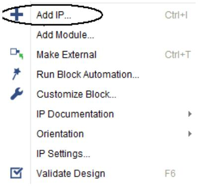

- 4. Using the Search box opened, search for and select the **ZYNQ7 Processing System**, shown in the following figure.

When you select the Zynq IP, the Vivado IP integrator adds the IP to the design, and a graphical representation of the processing system displays, as shown in the following figure.

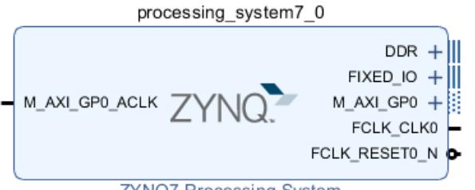

The corresponding Tcl command is [create_bd_cell](https://www.xilinx.com/cgi-bin/docs/rdoc?v=2020.1;d=ug835-vivado-tcl-commands.pdf;a=xcreate_bd_cell); the syntax is, as follows:

```
create_bd_cell -type ip -vlnv xilinx.com:ip:processing_system7:5.5 
processing_system7_0
```
- 5. Double-click the processing system graphic to invoke the Re-customize IP process, which displays the Re-customize IP for the ZYNQ7 Processing System dialog box as shown in the following figure.


- 6. Review the contents of the block design.
- 7. The green colored blocks in the ZYNQ7 processing system (PS) are configurable items. You can click a green block to open the coordinating configuration options. Alternatively, you can select the options from the Page Navigator on the left, as shown in the previous figure.

Note the four buttons at the top of the dialog box shown in [Processing System (PS|[PS)-](#page-61-0)-]] [Programmable Logic (PL|[PL) Configuration](#page-61-0) Configuration]] Options:

- **Documentation**: Opens the documentation page of the Xilinx website, where you can find documentation pertaining to Zynq.
- **Presets**: Lets you view information about the available preset options. You can save the current configuration of PS7 to a file or apply a pre-existing configuration to configure the current instance of the processors.
- Presets can also be applied to a target board. The available options are **Default**, **ZC702**, **ZC706**, and **Zedboard** as seen in the following figure.

<span id="page-61-0"/>

- **IP Location**: Lets you create IP either locally to the project or at a remote location.
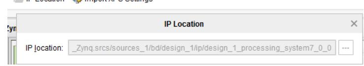

- **Import XPS Settings**: If you have an XML file describing the configuration of a Zynq processor from a XPS-based project, you can use this button to import that settings file to configure the Zynq processor.
## **Overview of the Zynq-7000 Block Design and Configuration Window**

The *Zynq-7000 SoC Technical Reference Manual* [(UG585](UG585)) provides details on the default options available in the Page Navigator. The following subsections describe in brief the Page Navigator selection options.

## **Processing System (PS)-Programmable Logic (PL) Configuration Options**

The PS-PL Configuration option tree displays with the collapsed options as shown in the following figure.


*Figure 45:* **PL-PS Configuration Pane**

## **General Options**

When you expand General Options, the selections, shown in the following figure are available.


*Figure 46:* **General Options (First Tier)**

## **MIO and EMIO Configuration**

From the Page Navigator, you can view and configure I/O pins by either clicking the Peripheral I/O Pins option or MIO Configuration option.


### *Figure 47:* **Configuring Peripheral I/O Pins Using Peripheral I/O Pins Menu**

The Zynq-7000 device PS has over 20 peripherals available. You can route these peripherals directly to the dedicated Multiplexed I/Os (MIO) on the device, or through the extended multiplexed I/Os (EMIOs) routing to the fabric.

The configuration interface also lets you select I/O standards and slew settings for the MIO. When you enable a peripheral, a check mark appears next to the I/O peripheral block. The block design depicts the status of enabled and disabled peripherals.

From the MIO Configuration option, you can do the same as shown in the following figure.


*Figure 48:* **Configuring Peripheral I/O Pins Using MIO Configuration Menu**

Chapter 2, "Signals, Interfaces, and Pins" of the *Zynq-7000 SoC Technical Reference Manual* [(UG585](UG585)) describes the MIOs and EMIOs for the 7z010 CLG225 device.

## **Pin Limitations**

The 32 MIO pins available in the 7z010 CLG225 device restrict the functionality of the PS as follows:

- Either one USB or one Ethernet controller is available using MIO.
- Cannot boot from SDIO.
- No NOR/SRAM interfacing.
- The width of NAND flash is limited to 8 bits.

## **Bank Settings**

After you select peripherals, the individual I/O signals for the peripheral appear in the respective MIO locations. Use this section primarily for selecting I/O standards for the various peripherals. The PS MIO I/O buffers split into two voltage domains. Within each domain, each MIO is independently programmable.

There are two I/O voltage banks:

- Bank 0 consists of pins 0:15


- Bank 1 consists of pins 16:53
Each MIO pin is individually programmed for voltage signaling:

- 1.8 and 2.5/3.3 volts
- CMOS single-ended or HSTL differential receiver mode

**IMPORTANT!** *The entire bank must have the same voltage, but the pins can have different I/O standards.*

When you configure MIOs in the MIO Configuration dialog box on the Zynq tab, you can view a read-only image of the peripheral and respective MIO selections. The left side of the window lists the available peripherals. A check mark on the peripheral indicates that a peripheral is selected.

## **Flash Memory Interfaces**

Select one of the following in the configuration wizard:

- Quad-SPI Flash
- [SRAM/NOR Flash](#page-67-0)
- [NAND Flash](#page-68-0)

### *Quad-SPI Flash*

The following figure shows the available options for Quad SPI Flash.

### *Figure 49:* **Quad SPI Flash Options**

Key features of the linear Quad-SPI Flash controller are:

- Single or dual 1x and 2x read support
- 32-bit APB 3.0 interface for I/O mode that allows full device operations including program, read, and configuration

<span id="page-67-0"/>

- 32-bit AXI linear address mapping interface for read operations
- Single chip select line support
- Write protection signal support
- Four-bit bidirectional I/O signals
- Read speeds of x1, x2, and x4
- Write speeds of x1 and x4
- 100 MHz maximum Quad-SPI clock at master mode
- 252-byte entry FIFO depth to improve Quad-SPI read efficiency
- Support for Quad-SPI device up to 128 Mb density
- Support for dual Quad-SPI with two Quad-SPI devices in parallel

Additionally, the linear address mapping mode features include:

- Regular read-only memory access through the AXI interface
- Up to two SPI flash memories
- Up to 16 MB addressing space for one memory and 32 MB for two memories
- AXI read acceptance capability of four
- Both AXI incrementing and wrapping-address burst read
- Automatically converts normal memory read operation to SPI protocol, and vice versa
- Serial, Dual, and Quad-SPI modes

### *SRAM/NOR Flash*

The following figure shows the options for SRAM/NOR flash devices.

### *Figure 50:* **SRAM/NOR Flash Configuration Options**

<span id="page-68-0"/>

The SRAM/NOR controller has the following features:

- 8-bit data bus width
- One chip select with up to 26 address signals (64 MB)
- Two chip selects with up to 25 address signals (32 MB + 32 MB)
- 16-word read and 16-word write data FIFOs
- 8-word command FIFO
- Programmable I/O cycle timing on a per-chip select basis
- Asynchronous memory operating mode

### *NAND Flash*

The following figure shows the NAND flash options.

### *Figure 51:* **NAND Controller Options**

The NAND controller has the following features:

- 8/16-bit I/O width with one chip select signal
- ONFI specification 1.0
- 16-word read and 16-word write data FIFOs
- 8-word command FIFO


- Programmable I/O cycle timing
- ECC assist
- Asynchronous memory operating mode

## **Clock Configuration**

### *Figure 52:* **Clock Configuration**


You can configure clocks in the Zynq-7000 device using one of the following methods:

- From the Page Navigator, click **Clock Configuration**.
- In the Zynq block design, click the **Clock Configuration** block.

The following figure shows a collapsed view of the Clock Configuration page.

### *Figure 53:* **Clock Configuration Page (Collapsed)**

The following figure shows an expanded view of the Clock Configuration page.


*Figure 54:* **Processor and Memory Clock Configurations Page (Expanded)**

The *Zynq-7000 SoC Technical Reference Manual* [(UG585](UG585)) describes the clocking of the PS in detail. The Zynq clocking dialog box lets you set the peripheral clocks. The peripherals on the PS typically allow clock source selection from internal PLLs or from an external clock source. Most of the clocks can select the PLL to generate the clock.

Because the same PLL generates multiple frequencies, it might not be possible to get the exact frequency entered in the Requested Frequency (MHz) column. The achievable frequency is in the Actual Frequency (MHz) column.

*Note***:** The frequency for a specific peripheral depends on many factors, such as input frequency, frequency for other peripherals driven from the same PLL, and restrictions from the architecture. Details of the M & D values chosen by the tool are available in the log file.

## **DDR Configuration**

### *Figure 55:* **DDR Controller**

To configure DDR, in the Zynq-7000 block design, click the **DDR2/3, LPDDR2 Controller** block.


The DDR memory controller supports DDR2, DDR3, DDR3L, and LPDDR2 devices and consists of three major blocks: an AXI memory port interface - DDR interface (DDRI), a core controller with transaction scheduler (DDRC), and a controller with digital PHY (DDRP).

The DDRI block interfaces with four 64-bit synchronous AXI interfaces to serve multiple AXI masters simultaneously. Each AXI interface has a dedicated transaction FIFO. The DDRC contains two 32-entry content addressable memories (CAMs) to perform DDR data service scheduling to maximize DDR memory efficiency. It also contains a "fly-by" channel for a lowlatency channel to allow access to DDR memory without going through the CAM.

The PHY processes read and write requests from the controller and translates them into specific signals within the timing constraints of the target DDR memory. The PHY uses signals from the controller to produce internal signals that connect to the pins using the digital PHYs. The DDR pins connect directly to the DDR device(s) using the PCB signal traces.

The system accesses the DDR using the DDRI through its four 64-bit AXI memory ports:

- One AXI port is dedicated to the L2-cache for the CPUs and ACP
- Two ports are dedicated to the AXI_HP interfaces
- The other masters on the AXI interconnect share the fourth port

The DDRI arbitrates the requests from the eight ports (four reads and four writes). The arbiter selects a request and passes it to the DDR controller and transaction scheduler (DDRC).

The arbitration is based on a combination of how long the request has been waiting, the urgency of the request, and if the request is within the same page as the previous request.

The DDRC receives requests from the DDRI through a single interface for both read and write flows. Read requests include a tag field that the DDR returns with the data. The DDR controller PHY (DDRP) drives the DDR transactions.

*Note***:** 8-bit interfaces are not supported; however, 8-bit parts can be used to create 16/32-bit interfaces.

The following figure shows the DDR controller Configurations page.


|  |  |  | Figure 56: DDR Controller Configurations Page |  |
|--|--|--|-----------------------------------------------|--|
|--|--|--|-----------------------------------------------|--|

## **GIC - Interrupt Controller**

You can configure the Generic Interrupt Controller (GIC) in one of two methods:

- In the Page Navigator, click **Interrupts**.
- In the Zynq block design, click the GIC block, shown in the following figure.

### *Figure 57:* **Generic Interrupt Controller**


The following figure shows the Interrupt Port Configuration page.


### *Figure 58:* **GIC Interrupts**

GIC is a centralized resource for managing interrupts sent to the CPUs from the PS and PL. The controller enables, disables, masks, and prioritizes the interrupt sources and sends them to the selected CPU (or CPUs) in a programmed manner as the CPU interface accepts the next interrupt. In addition, the controller supports security extension for implementing a securityaware system.

- The controller is based on the Arm® Generic Interrupt Controller architecture version 1.0 (GIC v1), non-vectored.
- The private bus on the CPU accesses the registers for fast read/write response by avoiding temporary blockage or other bottlenecks in the Interconnect.
- The interrupt distributor centralizes all interrupt sources before dispatching the one with the highest priority to the individual CPUs.

The GIC ensures that, when you target an interrupt to several CPUs, only one CPU takes the interrupt at a time. All interrupt sources contain a unique interrupt ID number. All interrupt sources have their own configurable priority and list of targeted CPUs.


Both the *Zynq-7000 SoC Technical Reference Manual* [(UG585](UG585)) and the *Zynq-7000 SoC Software Developers Guide* [(UG821](UG821)) contain information regarding the logic blocks in the Zynq-7000 device.

## **Interconnect between PS and PL**

### *AXI_HP Interfaces*

*Figure 59:* **AXI_HP Interfaces**

The four AXI_HP interfaces provide PL bus masters with high-bandwidth data paths to the DDR and OCM memories. Each interface includes two FIFO buffers for read and write traffic. The PL to the memory Interconnect routes the high-speed AXI_HP ports either to two DDR memory ports or to the OCM. The AXI_HP interfaces are also referenced as AXI FIFO interfaces (AFI), to emphasize their buffering capabilities.

**IMPORTANT!** *You must enable the PL level shifters using LVL_SHFTR_EN before PL logic communication can occur.*

Enable these interfaces by selecting **PS-PL Configuration** from the Page Navigator and expanding the **HP Slave AXI Interface** option as shown in the following figure.


*Figure 60:* **Enabling AXI HP Interfaces**

The interfaces provide a high-throughput data path between PL masters and PS memories including the DDR and on-chip RAM. The main features include:

- 32- or 64-bit data wide master interfaces (independently programmed per port)
- Efficient dynamic upsizing to 64 bits for aligned transfers in 32-bit interface mode, controllable using AxCACHE
- Automatic expansion to 64-bits for unaligned 32-bit transfers in 32-bit interface mode
- Programmable release threshold of write commands
- Asynchronous clock frequency domain crossing for all AXI interfaces between the PL and PS
- Smoothing out of "long-latency" transfers using 1 KB (128 by 64 bit) data FIFOs for both reads and writes
- QoS signaling available from PL ports
- Command and Data FIFO fill-level counts available to the PL
- Standard AXI 3.0 interfaces support
- Programmable command issuance to the interconnect, separately for read and write commands
- Large slave interface read acceptance capability in the range of 14 to 70 commands (burst length dependent)


- Large slave interface write acceptance capability in the range of 8 to 32 commands (burst length dependent)
## **AXI ACP Interface**

The Accelerator Coherency Port (ACP) provides low-latency access to programmable logic masters, with optional coherency and L1 and L2 cache.

From a system perspective, the ACP interface has similar connectivity as the APU CPUs. Due to this close connectivity, the ACP directly competes for resource access outside of the APU block.


**IMPORTANT!** *You must enable the PL level shifters using LVL_SHFTR_EN before PL logic communication can occur.*

In the ZYNQ7 block design, click the **64b AXI ACP Slave Ports** block to configure the AXI_ACP.

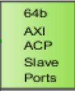

*Figure 61:* **AXI ACP Configuration**

Alternatively, select the **PS-PL Configuration** and expand **ACP Slave AXI Interface**.

The following figure shows the ACP AXI Slave Configuration page.

### *Figure 62:* **ACP Slave AXI Interface Page**


## **AXI GP Interfaces**

AXI_GP features include:

- Standard AXI protocol
- Data bus width: 32
- Master port ID width: 12
- Master port issuing capability: 8 reads, 8 writes
- Slave port ID width: 6
- Slave port acceptance capability: 8 reads, 8 writes

These interfaces are connected directly to the ports of the master interconnect and the slave interconnect without additional FIFO buffering, unlike the AXI_HP interfaces, which have elaborate FIFO buffering to increase performance and throughput. Therefore, the performance is constrained by the ports of the master interconnect and the slave interconnect. These interfaces are for general-purpose use only; they are not intended to achieve high performance.

**IMPORTANT!** *You must enable the PL level shifters using LVL_SHFTR_EN before PL logic communication can occur.*

In the ZYNQ7 block design, click the following block to configure the AXI_GP interface.

### *Figure 63:* **AXI GP Configuration**

Alternatively, in the Page Navigator, select the **PS-PL Configuration** and expand the **GP Master AXI Interface** and **GP Slave AXI Interface** options.

The following figure shows the GP AXI Master and Slave Configuration page.


### *Figure 64:* **GP Master and Slave AXI Interfaces**

## **PS-PL Cross Trigger Interface**

An embedded cross trigger (ECT) is the cross-triggering mechanism. Through ECT, a CoreSight technology component can interact with other components by sending and receiving triggers. ECT is implemented with two components:

- Cross trigger matrix (CTM)
- Cross trigger interface (CTI)

One or more CTMs form an event broadcasting network with multiple channels. A CTI listens to one or more channels for an event, maps a received event into a trigger, and sends the trigger to one or more CoreSight components connected to the CTI. A CTI also combines and maps the triggers from the connected CoreSight technology components and broadcasts them as events on one or more channels. Both CTM and CTI are CoreSight technology components of the control and access class.

ECT is configured with:

- Four broadcast channels
- Four CTIs

*Note***:** Power-down is not supported.

<span id="page-79-0"/>

You can enable cross-triggering by selecting the PS-PL Cross Trigger Interface in the ZYNQ7 Processing System configuration dialog box, shown in the following figure.

### *Figure 65:* **PS-PL Cross Trigger Interface**

## **Using the Programmable Logic (PL)**

The PL provides a rich architecture of user-configurable capabilities, as follows:

- Configurable logic blocks (CLB)
	- 6-input look-up tables (LUTs) with memory capability within the LUT
	- Register and shift register functionality
	- Adders that can be cascaded
- 36 Kb block RAM
- Dual ports, up to 72 bits wide
- Configurable as dual 18 Kb
- Programmable FIFO logic
- Built-in error correction circuitry
- Digital signal processing DSP48E1 Slice
	- 25 × 18 two's complement multiplier/accumulator high-resolution (48 bit) signal processor


- Power-saving 25-bit pre-adder to optimize symmetrical filter applications
- Advanced features: optional pipelining, optional ALU, and dedicated buses for cascading
- Clock management:
	- UHigh-speed buffers and routing for low-skew clock distribution
	- Frequency synthesis and phase shifting
	- Low-jitter clock generation and jitter filtering
- Configurable I/Os
	- High-performance SelectIO technology
	- High-frequency decoupling capacitors within the package for enhanced signal integrity
	- Digitally controlled impedance that can be tri-state for lowest power, high-speed I/O operation
	- High range (HR) I/Os support 1.2 V to 3.3 V
	- High performance (HP) I/Os support 1.2 V to 1.8 V (7z030, 7z045, and 7z100 devices)
- Low-power gigabit transceivers
	- (7z030, 7z045, and 7z100 devices)
	- High-performance transceivers capable of up to 12.5 Gb/s (GTX)
	- Low-power mode optimized for chip-to-chip interfaces
	- Advanced transmit pre- and post-emphasis, and receiver linear (CTLE) and decision feedback equalization (DFE), including adaptive equalization for additional margin
- Analog-to-digital converter (XADC)
	- Dual 12-bit 1 MSPS analog-to-digital converters (ADCs)
	- Up to 17 flexible and user-configurable analog inputs
	- On-chip or external reference option
	- On-chip temperature (±4°C max error) and power supply (±1% max error) sensors
	- Continuous JTAG access to ADC measurements
- Integrated interface blocks for PCI Express designs (7z030, 7z045, and 7z100 devices)
	- Compatible to the PCI Express base specification 2.1 with Endpoint and Root Port capability
	- Supports Gen1 (2.5 Gb/s) and Gen2 (5.0 Gb/s) speeds
- Advanced configuration options, advanced error reporting (AER), end-to-end CRC (ECRC)


## **Creating Custom Logic**

The Vivado® IP packager lets you and third-party IP developers use the Vivado IDE to prepare an intellectual property (IP) design for use in the Vivado IP catalog. The IP user can then instantiate this third-party IP into a design in the Vivado Design Suite.

When IP developers use the Vivado Design Suite IP packaging flow, the IP user has a consistent experience whether using Xilinx® IP, third-party IP, or customer-developed IP within the Vivado Design Suite.

IP developers can use the IP packager feature to package IP files and associated data into a ZIP file. The IP user receives this generated ZIP file and installs the IP into the Vivado Design Suite IP catalog. The IP user then customizes the IP through parameter selections and generates an instance of the IP.

See the *Vivado Design Suite User Guide: Designing IP Subsystems using IP Integrator* ([UG994)](https://www.xilinx.com/cgi-bin/docs/rdoc?v=latest;d=ug994-vivado-ip-subsystems.pdf) and the *Vivado Design Suite Tutorial: Designing IP Subsystems Using IP Integrator* ([UG995)](https://www.xilinx.com/cgi-bin/docs/rdoc?v=latest;d=ug995-vivado-ip-subsystems-tutorial.pdf) for more information.

To verify the proper packaging of the IP before handing it off to the IP user, Xilinx recommends that the IP developer run each IP module completely through the IP user flow to validate that the IP is ready for use.

## **Zynq-7000 Processing System Verification**

The Zynq7000 SoC Verification IP (VIP) is developed for customers designing Zynq-based applications. It enables the functional verification of PL logic by mimicking the PS-PL interfaces in PS logic. This VIP is delivered as a package of encrypted Verilog modules. VIP operation is controlled by using a sequence of Verilog tasks contained in a Verilog-syntax file. For more information on the Zynq VIP, see the *Zynq UltraScale+ MPSoC Verification IP Data Sheet* ([DS940)](https://www.xilinx.com/cgi-bin/docs/ipdoc?c=processing_system7_vip;v=latest;d=ds940-zynq-vip.pdf).

### *Features*

- Pin compatible and Verilog-based simulation model
- Supports all AXI interfaces
	- AXI 3.0 compliant
- 32/64–bit data-width for AXI_HP, 32-bit for AXI_GP and 64-bit for AXI_ACP
- Sparse memory model (for DDR) and a RAM model (for OCM)
- SystemVerilog task-based API
- Delivered in Vivado Design Suite
- Blocking and non-blocking interrupt support
- ID width support as per the Zynq-7000 specification


<span id="page-82-0"/>

- Support for FIXED, INCR, and WRAP transaction types
- Support for all Zynq-7000 supported burst lengths and burst sizes
- Protocol checking, provided by the AXI VIP models
- Read/Write request capabilities
- System address decode for OCM/DDR transactions

### *Additional Features*

- System address decode for register map read transactions (only default value of the registers can be read)
- Support for static remap of AXI_GP0 and AXI_GP1
- Configurable latency for read/write responses
- First-level arbitration scheme based on the priority indicated by the AXI QoS signals
- Datapath connectivity between any AXI master in PL and the PS memories and register map
- Parameters to enable and configure AXI master and slave ports
- APIs to set the traffic profile and latencies for different AXI master and slave ports
- Support for FPGA logic clock generation
- Soft reset control for the PL
- API support to pre-load the memories, read/wait for the interrupts from PL, and checks for certain data patterns to be updated at certain memory location
- All unused interface signals that output to the PL are tied to a valid value
- Semantic checks on all other unused interface signals

## **Additional Resources for Zynq-7000 SoC Embedded Design Flow**

The *Zynq-7000 SoC: Embedded Design Tutorial* [(UG1165](UG1165)) provides additional information on using Zynq-7000 SoC devices. The examples are targeted for the Xilinx ZC702 Rev 1.0 evaluation board and the tools used are the Vivado® Design Suite and the Vitis™ unified software platform.

The *Zynq-7000 SoC: Embedded Design Tutorial* ([UG1165)](https://www.xilinx.com/cgi-bin/docs/rdoc?v=2020.1;d=ug1165-zynq-embedded-design-tutorial.pdf) describes the creation of a hardware and software platform for Zynq-7000 SoCs using Vivado, Vitis software development platform, and Petalinux Tools. The tutorial also describes the steps to debug software using the debug features of the Vitis software platform IDE and provides information on creating boot images for Zynq-7000 SoC systems.

<span id="page-83-0"/>

## *Chapter 4*

*Chapter 4:* Using a MicroBlaze Processor in an Embedded Design

## Using a MicroBlaze Processor in an Embedded Design

The Vivado® IDE IP integrator is a powerful tool that lets you stitch together a processor-based system.

The MicroBlaze™ embedded processor is a reduced instruction set computer (RISC) core, optimized for implementation in Xilinx® Field Programmable Gate Arrays (FPGAs).

The following figure shows a functional block design of the MicroBlaze core.

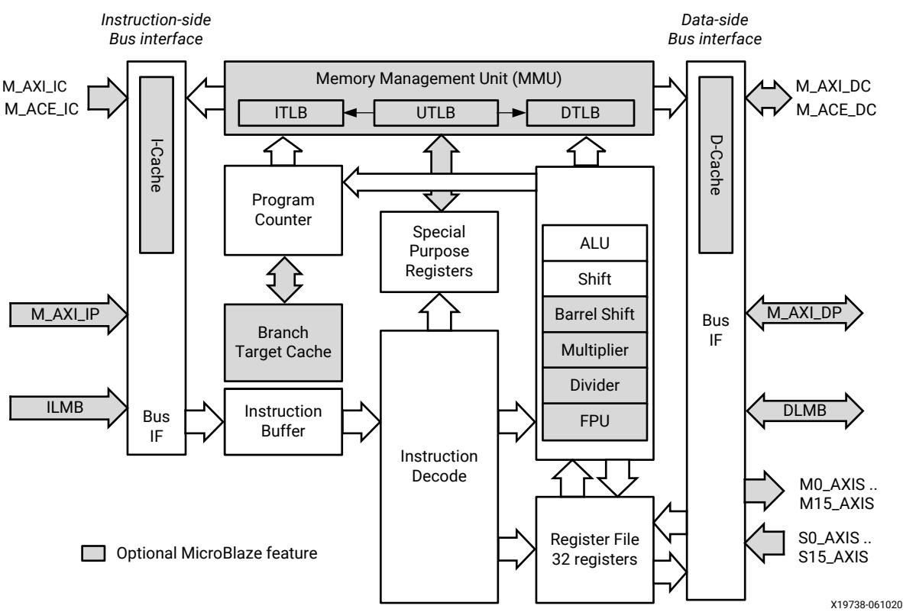

*Figure 66:* **Block Design of MicroBlaze Core**

The MicroBlaze processor is highly configurable: you can select a specific set of features required by your design. The fixed feature set of the processor includes:

- Thirty-two 32-bit or 64-bit general purpose registers
<span id="page-84-0"/>

- 32-bit instruction word with three operands and two addressing modes
- 32-bit address bus, extensible to 64-bits
- Single issue pipeline

In addition to these fixed features, the MicroBlaze processor has parameterized values that allow selective enabling of additional functionality.

**RECOMMENDED:** *Older (deprecated) versions of MicroBlaze support a subset of the optional features described in this manual. Only the latest (preferred) version of MicroBlaze (v11.0) supports all options. Xilinx recommends that new designs use the latest preferred version of the MicroBlaze processor.*

See the *MicroBlaze Processor Reference Guide* ([UG984)](https://www.xilinx.com/cgi-bin/docs/rdoc?v=latest;d=ug984-vivado-microblaze-ref.pdf) for more information.

MicroBlaze can be implemented either as a 32-bit processor or a 64-bit processor, depending on user requirements. In general, Xilinx recommends that you select the 32-bit processor implementation unless specific requirements cannot be met. The 64-bit processor extends general-purpose registers to 64 bits, provides additional instructions to handle 64-bit data, and can transparently address instructions and data using up to a 64-bit address. In addition, the floating point unit (FPU) is extended to support double precision.

Another useful document reference is the *Triple Modular Redundancy (TMR) LogiCORE IP Product Guide* [(PG268](PG268)), which provides soft error detection, correction and recovery for Xilinx devices. The guide describes the IP cores that are part of the solution, and explains typical use cases.

## **Creating a MicroBlaze Processor Design**

Designing with a MicroBlaze processor in the Xilinx Vivado IP integrator is different than it was in the legacy ISE® Design Suite and the Embedded Development Kit (EDK).

The Vivado IDE uses the IP integrator tool for embedded development. The IP integrator is a GUI-based interface that lets you stitch together complex IP subsystems.

A variety of IP are available in the Vivado IDE IP catalog to meet the needs of complex designs. You can also add custom IP to the IP catalog.

## **Designing with the MicroBlaze Processor**

- 1. In the Flow navigator panel, under IP integrator, click the **Create Block Design** button to open the Create Block Design dialog box.
- 2. Type the Design Name, as shown in the following figure.


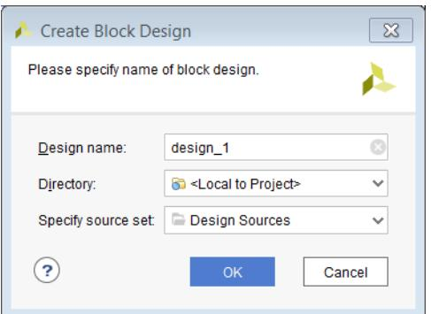

The Block Design window opens, as shown in the following figure.

- 3. Within the empty design, use either the **Add IP** button on the design canvas, or rightclick in the canvas, and select **Add IP**.
A Search box opens to let you search for and select the MicroBlaze processor, as shown in the following figure.

<span id="page-86-0"/>

When you select the MicroBlaze IP, the Vivado IP integrator adds the IP to the design, and a graphical representation of the processing system displays, as shown in the following figure.

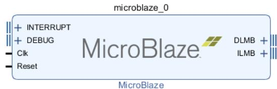

*Note***:** The Tcl command is as follows:

create_bd_cell -type ip -vlnv xilinx.com:ip:microblaze:11.0 microblaze_0

- 4. Double-click the MicroBlaze IP in the canvas to invoke the Re-customize IP process, which displays the Re-customize IP configuration page for the MicroBlaze processor, shown in the following figure.
## **Using the MicroBlaze Configuration Window**

The following figure shows the Welcome page of the MicroBlaze configuration wizard.


The MicroBlaze Configuration wizard provides the following:

- Predefined configuration templates for one-click configuration.
- Estimates of MicroBlaze relative frequency, area, and performance, giving immediate feedback based on selected configuration options.
- Page by page guidance through the configuration process.
- Tool tips for all configuration options to understand the effect of each option.
- An **Advanced** button that provides a tabbed interface for direct access to all of the configuration options, see [MicroBlaze Configuration Wizard: Advanced Mode.](#page-107-0)

**IMPORTANT!** *Interrupt & Reset and PVR options are only accessible through the Advanced mode.*

The MicroBlaze Configuration wizard includes the following pages which are shown depending on the options selected on the Welcome page:


- **Welcome Page**: Shows the **Predefined Configurations and General Settings**. See the [MicroBlaze Configuration Wizard: Welcome Page](#page-89-0) for more information.
- **General**: Shows the selection of execution units and optimization settings (this General information is persistent). See the [MicroBlaze Configuration Wizard: General Page](#page-92-0) for more information.
- **Exceptions**: Shows the Exceptions page when you select **Enable Selections** that option on the Welcome Page. See the [MicroBlaze Configuration Wizard: MMU Page](#page-99-0) for more information.
- **Cache**: Cache settings page is shown when you select **Use Instructions and Data Caches**. See the [MicroBlaze Configuration Wizard: Cache Page](#page-96-0) for more information.
- **MMU**: Shows the MMU settings page when you select **Use Memory Management** on the Welcome Page. See the [MicroBlaze Configuration Wizard: MMU Page](#page-99-0) for more information.
- **Debug**: Shows the number of breakpoints and watchpoints when you select **Enable MicroBlaze Debug Module Interface**. See the [MicroBlaze Configuration Wizard: Debug Page](#page-101-0) for more information.
- **Buses**: Shows the Bus settings, which are persistent, as the last page of the configuration wizard. See the [MicroBlaze Configuration Wizard: Buses Page](#page-103-0) for more information.

The left portion of the dialog box shows the relative values of the frequency, area, and performance for the current settings, BRAM, and DSP numbers:

- **Frequency**: Estimated frequency percentage relative to the maximum achievable frequency with this architecture and speed grade, which gives an indication of the relative frequency that can be achieved with the current settings.
*Note***:** This is an estimate based on a set of predefined benchmarks, which can deviate up to 30% from the actual value. Do not take this estimation as a guarantee that the system can reach a corresponding frequency.

- **Area**: Estimated area percentage in LUTs relative to the maximum area using this architecture, which gives an indication of the relative MicroBlaze area achievable with the current settings.
*Note***:** This is an estimate, which can deviate up to 5% from the actual value. Do not take this estimation as a guarantee that the implemented area matches this value.

- **Performance**: Indicates the relative MicroBlaze processor performance achievable with the current settings, relative to the maximum possible performance.
*Note***:** This is an estimate based on a set of benchmarks, and actual performance can vary significantly depending on the user application.

- **BRAMs**: Total number of block RAMs used by the MicroBlaze processor. The instruction and data caches, and the branch target cache use block RAMs, as well as the memory management unit (MMU), which uses one block RAM in virtual or protected mode with 32-bit mode, and two with 64-bit mode.
- **DSP48**: Total number of DSP48 used by the MicroBlaze processor. The integer multiplier, and the floating point unit (FPU) use this total value to implement float multiplication.

<span id="page-89-0"/>

## **MicroBlaze Configuration Wizard: Welcome Page**

The simplest way to use the MicroBlaze Configuration wizard is to select one of the ten predefined templates, each defining a complete MicroBlaze configuration. You can use a predefined template as a starting point for a specific application, using the wizard to refine the configuration, by adapting performance, frequency, or area.

When you modify an option, you received direct feedback that shows the estimated relative change in performance, frequency, and area in the information display.

The three presets are:

- **Microcontroller preset**: Microcontroller preset suitable for microcontroller designs. Area optimized, with no caches and debug enabled.
- **Real-time preset**: Real-time preset geared towards real-time control. Performance optimized, small caches and debug enabled, most execution units.
- **Application preset**: Application preset design for high performance applications. Performance optimized, large caches and debug enabled, and all execution units including floating-point.

The other options are:

- **Minimum Area**: The smallest possible MicroBlaze core. No caches or debug.
- **Maximum Performance**: Maximum possible performance. Large caches and debug, as well as all execution units.
- **Maximum Frequency**: Maximum achievable frequency. Small caches and no debug, with few execution units.
- **Linux with MMU**: Settings suitable to get high performance when running Linux with MMU. Memory Management enabled, large caches and debug, and all execution units.
- **Low-end Linux with MMU**: Settings corresponding to the MicroBlaze Embedded Reference System. Provides suitable settings for Linux development on low-end systems. Memory Management enabled, small caches and debug.
- **Typical**: Settings giving a reasonable compromise between performance, area, and frequency. Suitable for standalone programs, and low-overhead kernels. Caches and debug enabled.
- **Frequency Optimized**: Designed to provide all MicroBlaze features, including MMU, while still achieving high frequency by utilizing the frequency optimized 8-stage pipeline.

The following figure shows the **Predefined Configurations** in the Configuration wizard.


### *Figure 68:* **MicroBlaze Predefined Configuration Settings**

### *Select Processor Implementation*

Select 32-bit or 64-bit processor implementation. The 64-bit processor extends all registers to 64 bits, provides additional instructions to handle 64-bit data, and can address up to 4 EB instructions and data using up to a 64-bit address. The extended addressing is selected on the General tab.

The compiler automatically generates a 64-bit executable when 64-bit mode is selected.


### *General Settings*

If a pre-defined template is not used, you can select the options from the pages, which are available for fine-tuning the MicroBlaze processor, based on your design needs. As you position the mouse over these different options, a tooltip informs you what the particular option means. The following bullets detail these options.

- **Select implementation optimization**: When set to:
	- **PERFORMANCE**: Implementation is selected to optimize computational performance, using a five-stage pipeline.
	- **AREA**: Implementation is selected to optimize area, using a three-stage pipeline with lower instruction throughput.
	- **FREQUENCY**: Implementation is selected to optimize MicroBlaze frequency, using an eight-stage pipeline.
- **RECOMMENDED:** *It is recommended to select AREA optimization on architectures with limited resources such as Artix 7 or Spartan 7 devices. Selecting FREQUENCY optimization is recommended in order to reach system frequency targets, particularly with cache-based external memory, MMU, and/or large LMB memory. However, if performance is critical, AREA or FREQUENCY optimization should not be selected, because some instructions require additional clock cycles to execute.*

*Note***:** You cannot use the Memory Management Unit (MMU), Branch Target Cache, Instruction Cache Streams, Instruction Cache Victims, Data Cache Victims, and AXI Coherency Extension (ACE) with area optimization.

- **Enable MicroBlaze Debug Module Interface**: Enable debug to be able to download and debug programs using Xilinx System Debugger (XSDB).
**RECOMMENDED:** *Unless area resources are very critical, it is recommended that debugging be always enabled.*

- **Use Instruction and Data Caches**: You can use MicroBlaze with an optional instruction cache for improved performance when executing code that resides outside the LMB address range.
The instruction cache has the following features:

- Direct mapped (1-way associative)
- User selectable cacheable memory address range
- Configurable cache and tag size
- Caching over AXI4 interface (M_AXI_IC) or CacheLink (XCL) interface
- Option to use 4 or 8 word cache line
- Cache on and off controlled using a bit in the MSR
- Optional WIC instruction to invalidate instruction cache lines
- Optional stream buffers to improve performance by speculatively pre-fetching instructions

<span id="page-92-0"/>

- Optional victim cache to improve performance by saving evicted cache lines
- Optional parity protection; invalidates cache lines if Block RAM bit error is detected
- Optional data width selection to either use 32 bits, an entire cache line, or 512 bits

Activating caches significantly improves performance when using external memory, even if you must select small cache sizes to reduce resource usage.

- **Enable Exceptions**: Enables exceptions when using an operating system with exception support, or when explicitly adding exception handlers in a standalone program.
- **Use Memory Management**: Enables Memory Management if planning to use an operating system - such as Linux -with support for virtual memory of memory protection.

*Note***:** When you enable area optimized MicroBlaze or stack protection, the Memory Management Unit is not available.

- **Enable Discrete Ports**: Enables discrete ports on the MicroBlaze instance, which is useful for:
	- Generating software breaks (Ext_BRK, Ext_NM_BRK)
	- Managing processor sleep and wakeup (Sleep, Hibernate, Suspend, Wakeup, Dbg_Wakeup)
	- Handling debug events (Debug_Stop, MB_Halted)
	- Signaling error when using fault tolerance (MB_Error)
	- Pausing the processor (Pause, Pause_Ack, Dbg_Continue)
	- Setting reset mode (Reset_Mode)

## **MicroBlaze Configuration Wizard: General Page**

The following figure shows the General page of the MicroBlaze Configuration wizard.


### *Figure 69:* **General Page of the MicroBlaze Configuration Wizard**

### *Instructions*

- **Enable Barrel Shifter**: Enables a hardware barrel shifter in MicroBlaze. This parameter enables the instructions bsrl, bsra, bsll, bsrli, bsrai, bslli, bsifi, and bsefi. With the 64 bit processor implementation the corresponding long instructions are also enabled. Enabling the barrel shifter can dramatically improve the performance of an application, but increases the size of the processor. The compiler uses the barrel shift instructions automatically if this parameter is enabled.
- **Enable Floating Point Unit**: Enables a floating point unit (FPU) based on the IEEE-754 standard. Single-precision is available with the 32-bit processor implementation, and doubleprecision is added with the 64-bit implementation. Using the FPU significantly improves the floating point performance of the application and significantly increases the size of MicroBlaze.

Setting this parameter to BASIC enables add, subtract, multiply, divide and compare instructions. Setting it to EXTENDED also enables convert and square-root instructions. The compiler automatically uses the FPU instructions corresponding to setting of this parameter.

- **Enable Integer Multiplier**: Enables a hardware integer multiplier in MicroBlaze. This parameter enables the instructions mul and muli when set to MUL32.


When set to MUL64, this enables the additional instructions: mulh, mulhu, and mulhsu for 64-bit multiplication. This parameter can be set to NONE to free up DSP48 primitives in the device for other uses. Setting this parameter to NONE has a minor effect on the area of the MicroBlaze processor. When this parameter is enabled, the compiler uses the mul instructions automatically.

- **Enable Integer Divider**: Enables a hardware integer divider in MicroBlaze. This parameter enables the instructions, idiv and idivu. Enabling this parameter can improve the performance of an application that performs integer division, but increases the size of the processor. When this parameter is enabled, the compiler uses the idiv instructions automatically.
- **Enable Additional Machine Status Register Instructions**: Enables additional machine status register (MSR) instructions for setting and clearing bits in the MSR. This parameter enables the instructions msrset and msrclr. Enabling this parameter improves the performance of changing bits in the MSR.
- **Enable Pattern Comparator**: Enables pattern compare instructions pcmpbf, pcmpeq, and pcmpne.

The pattern compare bytes find (pcmpbf) instructions return the position of the first byte that matches between two words and improves the performance of string and pattern matching operations. The Vitis™ libraries use the pcmpbf instructions automatically when this parameter is enabled.

The pcmpeq and pcmpne instructions return 1 or 0 based on the equality of the two words. These instructions improve the performance of setting flags and the compiler uses them automatically. With the 64-bit processor implementation, the corresponding long instructions are also enabled.

Selecting this option also enables count leading zeroes instruction, clz. The clz instruction can improve performance of priority decoding, and normalization.

- **Enable Reversed Load/Store and Swap Instructions**: Enables reversed load/store and swap instructions lbur, lhur, lwr, sbr, shr, swr, swapb, and swaph. With the 64-bit processor implementation, the long reversed load/store instructions llr and slr are also enabled. The reversed load/store instructions read or write data with opposite endianness, and the swap instructions allow swapping bytes or half-words in registers. These instructions are mainly useful to improve performance when dealing with big-endian network access with a littleendian MicroBlaze.
- **Enable Additional Stream Instructions**: Provides additional functionality when using AXI4- Stream links, including dynamic access instruction getd and putd that use registers to select the interface.

The instructions are also extended with variants that provide:

- Atomic get, getd, put, and putd instructions
- Test-only get and getd instructions


- get and getd instructions that generate a stream exception if the control bit is not set


**IMPORTANT!** *The extended stream instructions must be enabled to use these additional instructions, and at least one stream link must be selected. The stream exception must be enabled to use instructions that generate stream exceptions.*

- **Select Extended Addressing**: Set the memory addressing capability. With the 32-bit processor implementation, this enables additional load/store instructions to be able to access a larger address space than 4GB (32-bit address). With the 64-bit processor implementation, the extended address is handled by normal load/store instructions. The data side LMB and AXI bus addresses are extended to the number of address bits corresponding to the selected memory size. The available choices are:
	- **NONE** (32-bit address, no additional instructions)
	- **64GB** (36-bit address)
	- **1TB** (40-bit address)
	- **16TB** (44-bit address)
	- **256TB** (48-bit address)
	- **16EB** (64-bit address)
	- **4PB** (52-bit address)

For more information, including software usage and limitations, see the *MicroBlaze Processor Reference Guide* [(UG984](UG984)).

### *Optimization*

- **Select implementation optimization**: This option is the same as in the General Settings options.
- **Enable Branch Target Cache**: When set, implements the branch target, which improves branch performance by predicting conditional branches and caching branch targets.

**TIP:** *The Enable Branch Target Cache option is not enabled when Select implementation optimization is set to AREA on the [MicroBlaze Configuration Wizard: Welcome Page .](#page-89-0) Conversely, enabling Branch Target Cache disables the Area option in Select implementation optimization.*

- **Branch Target Cache Size**: Specify the size of the cache for branch targets.
### *Fault Tolerance*

- **Auto/Manual**: Determines if the Vivado tool will automatically enable fault tolerance, or if you will specify it manually.
<span id="page-96-0"/>

- **Enable Fault Tolerance Support**: When enabled, MicroBlaze protects internal block RAM with parity, and supports error correcting codes (ECC) in LMB block RAM, including exception handling of ECC errors. This prevents a bit flip in block RAM from affecting the processor function.
	- If this value is auto-computed (by not overriding it), fault tolerance is automatically enabled in MicroBlaze when ECC is enabled in connected LMB BRAM controllers.
	- If fault tolerance is explicitly enabled, the IP integrator tool enables ECC automatically in connected LMB BRAM Controllers.
	- If fault tolerance is explicitly disabled, ECC in connected LMB BRAM controllers is not affected.

## **MicroBlaze Configuration Wizard: Cache Page**

The following figure shows the Cache options page for the MicroBlaze configuration.

### *Figure 70:* **Cache Options Page of the MicroBlaze Configuration Wizard**

- **Enable Instruction Cache**: Uses this cache only when it is also enabled in software by setting the instruction cache enable (ICE) bit in the machine status register (MSR).
The Instruction Cache configurable options are:

- **Size in Bytes**: Specifies the size of the instruction cache if C_USE_ICACHE is enabled. Not all architectures permit all sizes.
- **Line Length**: Select between 4, 8, or 16 word cache line length for cache miss-transfers from external instruction memory.
- **Base Address**: Specifies the base address of the instruction cache. This parameter is used only if C_USE_ICACHE is enabled.


- **High Address**: Specifies the high address of the instruction cache. This parameter is used only if C_USE_ICACHE is enabled.
- **Enable Writes**: When enabled, one can invalidate instruction cache lines with the wic instruction. This parameter is used only if C_USE_ICACHE is enabled.
- **Use Cache for All Memory Accesses**: When enabled, uses the dedicated cache interface on MicroBlaze is for all accesses within the cacheable range to external instruction memory, even when the instruction cache is disabled.

Otherwise, the instruction cache uses the peripheral AXI for these accesses when the instruction cache is disabled.

When enabled, an external memory controller must provide only a cache interface MicroBlaze instruction memory. Enable this parameter when using AXI Coherency Extension (ACE).

- **Use Distributed RAM for Tags**: Uses the instruction cache tags to hold the address and a valid bit for each cache line. When enabled, the instruction cache tags are stored in Distributed RAM instead of block RAM. This saves block RAM, and can increase the maximum frequency.
- **Data Width**: Specifies the instruction cache bus width when using AXI Interconnect. The width can be set to:
- **32-bit**: Bursts are used to transfer cache lines for 32-bit words depending on the cache line length,
- **Full Cache line**: A single transfer is performed for each cache line, with data width 128, 256, or 512 bits depending on cache line length
- **512-bit**: Performs a single transfer, but uses only 128 or 256 bits, with 4 or 8 word cache line lengths.

The two wide settings require that the cache size is at least 8 KB, 16KB, or 32KB depending upon cache line length. To reduce the AXI interconnect size, this setting must match the interconnect data width. In most cases, you can obtain the best performance with the wide settings.

This setting is not available with area optimization, AXI Coherency Extension (ACE), or when you enable fault tolerance.

- **Number of Streams**: Specifies the number of stream buffers used by the instruction cache. A stream buffer is used to speculatively pre-fetch instructions, before the processor requests them. This often improves performance, because the processor spends less time waiting for instruction to be fetched from memory.
To be able to use instruction cache streams, do not enable area optimization or AXI Coherency Extension (ACE).


- **Number of Victims**: Specifies the number of instruction cache victims to save. A victim is a cache line that is evicted from the cache. If no victims are saved, all evicted lines must be read from memory again, when they are needed. By saving the most recent lines, they can be fetched much faster, thus improving performance.
**RECOMMENDED:** *It is possible to save 2, 4, or 8 cache lines. The more cache lines that are saved, the better performance becomes. The recommended value is 8 lines.*

> *Note***:** To be able to use instruction cache victims, do not enable area optimization or AXI Coherency Extension (ACE).

- **Enable Data Cache**: Uses this cache only when it is also enabled in software by setting the data cache enable (DCE) bit in the machine status register (MSR).
Data Cache Features:

- **Size in Bytes**: Specifies the size of the data cache if **C_USE_DCACHE** is enabled. Not all architectures permit all sizes.
- **Line Length**: Select between **4**, **8**, or **16** word cache line length for cache miss-transfers from external memory.
- **Base Address**: Specifies the base address of the data cache. This parameter is used only if **C_USE_DCACHE** is enabled.
- **High Address**: Specifies the high address of the data cache. This parameter is used only if **C_USE_DCACHE** is enabled.
- **Enable Writes**: When enabled, one can invalidate data cache lines with the wdc instruction. This parameter is used only if **C_USE_DCACHE** is enabled.
- **Use Cache for All Memory Accesses**: When enabled, uses the dedicated cache interface on MicroBlaze is for all accesses within the cacheable range to external memory, even when the data cache is disabled.

Otherwise, the data cache uses the peripheral AXI for these accesses when the data cache is disabled.

When enabled, an external memory controller must provide only a cache interface MicroBlaze data memory. Enable this parameter when using AXI Coherency Extension (ACE).

- **Use Distributed RAM for Tags**: Uses the data cache tags to hold the address and a valid bit for each cache line. When enabled, the data cache tags are stored in Distributed RAM instead of block RAM. This saves block RAM, and can increase the maximum frequency.
- **Data Width**: Specifies the data cache bus width when using AXI Interconnect. The width can be set to:
	- **32-bit**: Bursts are used to transfer cache lines for 32-bit words depending on the cache line length
	- **Full Cache line**: A single transfer is performed for each cache line, with data width 128, 256, or 512 bits depending on cache line length

<span id="page-99-0"/>

- **512-bit**: Performs a single transfer, but uses only 128 or 256 bits, with 4 or 8 word cache line lengths
The two wide settings require that the cache size is at least 8 KB, 16KB, or 32KB depending upon cache line length. To reduce the AXI Interconnect size, this setting must match the interconnect data width. In most cases, you can obtain the best performance with the wide settings.

*Note***:** This setting is not available with area optimization, AXI Coherency Extension (ACE), or when you enable fault tolerance.

- **Number of Streams**: Specifies the number of stream buffers used by the instruction cache. A stream buffer is used to speculatively pre-fetch instructions, before the processor requests them. This often improves performance, because the processor spends less time waiting for instuctions to be fetched from memory.
To be able to use instruction cache streams, do not enable area optimization for AXI Coherency Extension (ACE).

- **Enable Write-back Storage Policy**: This parameter enables use of a write-back data storage policy. When this policy is in effect, the data cache only writes data to memory when necessary, which improves performance in most cases. With write-back enabled, data is stored by writing an entire cache line. Using write-back also requires that the cache is flushed by software when appropriate, to ensure that data is available in memory; for example, when using direct memory access (DMA). When not enabled, a write-through policy is used, which always writes data to memory immediately.
**TIP:** *When the MMU is enabled, setting this parameter allows individual selection of storage policy for each TLB entry.*

- **Number of Victims**: Specifies the number of data cache victims to save. A victim is a cache line that is evicted from the cache. If no victims are saved, all evicted lines must be read from memory again, when they are needed. By saving the most recent lines, they can be fetched much faster, thus improving performance.
- **RECOMMENDED:** *It is possible to save 2, 4, or 8 cache lines. The more cache lines that are saved, the better performance becomes. The recommended value is 8 lines.*

*Note***:** To be able to use data cache victims, do not enable area optimization or AXI Coherency Extension (ACE).

## **MicroBlaze Configuration Wizard: MMU Page**

The following figure shows the MMU page of the MicroBlaze Configuration.


### *Figure 71:* **MicroBlaze Configuration Wizard MMU Page**

### *Memory Management*

The Memory Management field specifies the implementation of the memory management unit (MMU).

- To disable the MMU, set this parameter to None (0), which is the default.
- To enable only the User Mode and Privileged Mode instructions, set this parameter to USERMODE (1). To enable Memory Protection, set the parameter to PROTECTION (2).
- To enable full MMU functionality, including virtual memory address translation, set this parameter to VIRTUAL (3).

When USERMODE is set, it enables the Privileged Instruction exception. When PROTECTION or VIRTUAL is set, it enables the Privileged Instruction exception and the four MMU exceptions (Data Storage, Instruction Storage, Data TLB Miss, and Instruction TLB Miss).

### **Memory Management Features**

- **Data Shadow Translation Look-Aside Buffer Size**: Defines the size of the instruction shadow translation look-aside buffer (TLB). This TLB caches data address translation information, to improve performance of the translation. The selection is a trade-off between smaller size and better performance: the default value is 4.
- **Instruction Shadow Translation Look-Aside Buffer Size**: Defines the size of the instruction shadow translation look-aside buffer (TLB). This TLB caches instruction address translation information to improve performance of the translation. The selection is a trade-off between smaller size and better performance: the default value is 2.
- **Enable Access to Memory Management Special Registers**: Enables access to the memory management special register using the MFS and MTS instructions:
	- Minimal (0) only allows writing TLBLO, TLBHI, and TLBX.
	- Read (1) adds reading to TLBLO, TLBHI, TLBX, PID, and ZPR.
	- Write (2) allows writing all registers, and reading TLBX.

<span id="page-101-0"/>

- Full (3) adds reading of TLBLO, TLBHI, TLBX, PID, and ZPR.
In many cases, it is not necessary for the software to have full read access. For example, this is the case for Linux memory management code. It is then safe to set access to **Write**, to save area. When using static memory protection, access can be set to **Minimal**, because the software then has no need to use TLBSX, PID, and ZPR.

- **Number of Memory Protection Zones**: Specifies the number of memory protection zones to implement. In many cases memory management software does not use all available zones. For example, the Linux memory management code only uses two zones. In this case, it is safe to reduce the number of implemented zones, to save area.
- **Privileged Instructions**: Specifies which instructions to allow in **User Mode**.
	- **Full Protection** (0): Ensures full protection between processes.
	- **Allow Stream Instructions** (1): Makes it possible to use AXI4-Stream instructions in **User Mode**.
	- **Allow Extended Address Instruction** (2): Makes it possible to use extended load/store instructions when available.
	- **Allow Both** (3): Allows both types of instructions.

**CAUTION!** *It is strongly discouraged to change this setting from Full Protection, unless it is necessary for performance reasons.*

## **MicroBlaze Configuration Wizard: Debug Page**

### *Figure 72:* **MicroBlaze Configuration Wizard Debug Page**


### *Debug Options*

### **MicroBlaze Debug Module Interface**

- **BASIC**: Enables the MicroBlaze Debug Module (MDM) interface to MicroBlaze processor for debugging. With this option, you can use Xilinx System Debugger (XSDB) to debug the processor over the Joint Test Action Group (JTAG) boundary-scan interface.
- **EXTENDED**: Enables enhanced debug features of MicroBlaze such as Cross-Trigger, Trace, and Profiling.
- **NONE**: Disables this option after you finish debugging to reduce the size of the MicroBlaze processor.

### **Hardware Breakpoints**

**IMPORTANT!** *The following options are only applied if C_DEBUG_ENABLED is on. The MicroBlaze processor takes a noticeable frequency hit as the numbers are increased.*

- **Number of PC Breakpoints:** Specifies the number of program counter (PC) hardware breakpoints Xilinx System Debugger (XSDB) can set.
- **Number of Write Address Watchpoints:** Specifies the number of write address watchpoints XSDB can set.
- **Number of Read Address Watchpoints:** Specifies the number of read address watchpoints XSDB can set.

**Number of PC BreakpointsNumber of Read Address Watchpoints**

- **RECOMMENDED:** *It is recommended that these two options be set to 0 if you are not using watchpoints for debugging.*
### **Interface**

This option is only available when using Advanced Mode.

- **MicroBlaze Debug Connection**: Select the type of interface for connecting the MicroBlaze Debug Module (MDM).
	- **SERIAL** is the default JTAG interface, which is generally recommended and uses the least amount of resources.
	- **PARALLEL** provides synchronous parallel access to MicroBlaze debug registers, with better performance and timing.
	- **AXI** is a subset of PARALLEL, providing an AXI4-Lite interface that can be connected through AXI register slices or AXI clock converters to further improve timing.

<span id="page-103-0"/>

### *Performance Monitoring*

With extended debugging, MicroBlaze provides the following performance monitoring counters to count various events and to measure latency during program execution:

- C_DEBUG_EVENT_COUNTERS: Configures the event counters.
- C_DEBUG_LATENCY_COUNTERS: Configures the latency counters.
- C_DEBUG_COUNTER_WIDTH: Sets the counter width to 32, 48, or 64 bits.

With the default configuration, the counter width is set to 32 bits and there are five event counters and one latency counter.

### *Trace and Profiling*

With extended debugging, MicroBlaze provides program trace, storing information in the embedded trace buffer (ETB) to enable program execution tracing. Users can also toggle the **Auto** switch and select the **External Trace** check box, if desired.

Use the parameter C_DEBUG_TRACE_SIZE to configure the size of the embedded trace buffer from 8KB to 128KB, or the external trace buffer from 32B to 8 KB.

**RECOMMENDED:** *It is recommended to always keep the external trace buffer set to 8KB, to avoid buffer overflow.*

By setting C_DEBUG_TRACE_SIZE to 0 (None), program trace is disabled.

Extended debugging also provides non-intrusive profiling, storing program execution statistics in a profiling buffer. The buffer is divided into a number of bins, each counting the number of executed instructions or clock cycles within a certain address range.

Use the parameter C_DEBUG_PROFILE_SIZE to configure the size of the profiling buffer from 4K to 128K. By setting the parameter to 0 (None), profiling is disabled.

## **MicroBlaze Configuration Wizard: Buses Page**

### *Local Memory Bus Interfaces*

- **Enable Local Memory Bus Instruction Interface**: Enables LMB instruction interface. When this instruction is set as shown in [Other Interfaces,](#page-104-0) the Local Memory Bus (LMB) instruction interface is available.
A typical MicroBlaze system uses this interface to provide fast local memory for instructions. Normally, it connects to an LMB bus using an LMB Bus Interface Controller to access a common block RAM.

<span id="page-104-0"/>

- **Enable Local Memory Bus Data Interface**: Enables LMB data interface. When this parameter is set, the local memory bus (LMB) data interface is available. A typical MicroBlaze system uses this interface to provide fast local memory for data and vectors. Normally, it connects to an LMB bus using an LMB Bus Interface Controller to access a common block RAM.
## *AXI and ACE Interfaces*

- **Select Bus Interface**: When this parameter is set to **AXI**, then AXI is selected for both peripheral and cache access. When this parameter is set to **ACE**, then AXI is selected for peripheral access and ACE is selected for cache access, providing cache coherency support.
*Note***:** To be able to use ACE, area optimization, write-back data cache, instruction cache streams, or victims cache data widths other than 32-bit must not be set. You must set **Use Cache for All Memory Accesses** for both caches.

- **Enable Peripheral AXI Interface Instruction Interface**: When this parameter is set, the peripheral AXI4-Lite instruction interface is available. In many cases, this interface is not needed, in particular if the Instruction Cache is enabled and C_ICACHE_ALWAYS_USED is set.
- **Enable Peripheral AXI Data Interface**: When this parameter is set, the peripheral AXI data interface is available. This interface usually connects to peripheral I/O using AXI4-Lite, but it can be connected to memory also. If you enable exclusive access, the AXI4 protocol is used.

## *Stream Interfaces*

- **Number of Stream Links**: Specifies the number of pairs of AXI4-Stream link interfaces. Each pair contains a master and a slave interface. The interface provides a unidirectional, point-topoint communication channel between MicroBlaze and a hardware accelerator or coprocessor. This is a low-latency interface, which provides access between the MicroBlaze register file and the FPGA fabric.
### *Other Interfaces*

- **Enable Trace Bus Interface**: When this parameter is set, the Trace bus interface is available. This interface is useful for debugging, execution statistics and performance analysis. In particular, connecting interface to a ChipScope Logic Analyzer (ILA) allows tracing program execution with clock cycle accuracy.
The MicroBlaze Trace interface can be used to view the processor software execution in simulation and in hardware. It is sufficient to enable the interface without actually connecting it, to get access to the signals in simulation, and to add them to an ILA in hardware.

The waveform can be related to the assembler and source code by looking at the executable object dump. In the Vitis software platform this can be viewed by double-clicking on the generated ELF file. It is also possible to generate an object dump from the ELF file with interspersed source code using the mb-objdump command. The Trace_PC and Trace_Instruction signals correspond to the address and instruction in the object dump. Note that these, and most other signals, are only valid when Trace_Valid_Instr is set.


Memory access addresses are shown using the Trace_Data_Address signal, which is valid when either Trace_Data_Read or Trace_Data_Write is set. Instruction results are written to a MicroBlaze destination register indicated by Trace_Reg_Addr when the Trace_Reg_Write signal is set, with the value shown by the Trace_New_Reg_Value signal.

The Trace_Exception_Kind signal, valid when Trace_Exception_Taken is set, indicates interrupts, breaks and exceptions. This can be useful to find error conditions or interrupt related issues.

For a complete description of all the Trace bus interface signals, see Chapter 3, "Trace Interface Description" in *MicroBlaze Processor Reference Guide* [(UG984](UG984)).

- **Lockstep Interface**: When you enable lockstep support, two MicroBlaze cores run the same program in lockstep, and you can compare their outputs to detect errors.
	- When set to NONE, no lockstep interfaces are enabled.
	- When set to LOCKSTEP_MASTER, it enables the Lockstep_Master_Out and Lockstep_Out output ports.
	- When set to LOCKSTEP_SLAVE, it does the following:
		- Enables the Lockstep_Slave_In input port and Lockstep_Out output ports.
		- Sets the C_LOCSTEP_SLAVE parameter to 1.

The slave processor is visible as a CPU, and can have private LMB memory.

- **LOCKSTEP_HIDDEN_SLAVE** behaves the same way as LOCKSTEP_SLAVE, except that the slave processor is not visible as a CPU. This setting is recommended, *except* when using private LMB memory. When this option is enabled, additional options become available under the Local Memory Bus Interfaces and AXI and ACE Interfaces section as shown in [Other](#page-104-0) [Interfaces.](#page-104-0) These options are explained below.


### *Figure 73:* **MicroBlaze Configuration Wizard Buses Page**

- **Use Monitor Interface for Local Memory Bus Instruction Interface**: Select Monitor Interface for LMB instruction interface. This can be used to simplify connection of LMB for a lockstep slave processor when private LMB memory is not used.
- **Use Monitor Interface for Local Memory Bus Data Interface**: Select Monitor Interface for LMB data interface. This can be used to simplify connection of LMB for a lockstep slave processor when private LMB memory is not used.
- **Use Monitor Interface for Peripheral AXI Instruction Interface**: Select Monitor Interface for AXI peripheral data interface. This can be used to simplify connection of AXI for a lockstep slave processor.
- **Use Monitor Interface for Peripheral AXI Data Interface**: Select Monitor Interface for AXI peripheral data interface. This can be used to simplify connection of AXI for a lockstep slave processor.
- **Use Monitor Interface for Cache AXI Instruction Interface**: Select Monitor Interface for AXI cache instruction interface. This can be used to simplify connection of AXI for a lockstep slave processor.
- **Use Monitor Interface for Cache AXI Data Interface**: Select Monitor Interface for AXI cache data interface. This can be used to simplify connection of AXI for a lockstep slave processor.

There is also a monitor option for interrupt on the **Interrupt & Reset** tab:

- **Use Monitor Interface for Interrupt:** Select Monitor Interface for the interrupt interface. This can be used to simplify connection of interrupt for a lockstep slave processor when a common interrupt source is used.
<span id="page-107-0"/>

## **MicroBlaze Configuration Wizard: Advanced Mode**

Accessible through the Advanced button on the Welcome page of the MicroBlaze Configuration wizard, the Advanced mode provides a tabbed interface that lets you interact directly with the various configuration options. The following figure shows the Advance Mode Interrupt and Reset options.


The tabbed interface of the Advanced mode provides access to each of the pages of the MicroBlaze Configuration wizard as follows:

- [MicroBlaze Configuration Wizard: General Page](#page-92-0)
- [MicroBlaze Configuration Wizard: Cache Page](#page-96-0)
- [MicroBlaze Configuration Wizard: MMU Page](#page-99-0)
- [MicroBlaze Configuration Wizard: Debug Page](#page-101-0)
- [MicroBlaze Configuration Wizard: Buses Page](#page-103-0)

In addition, the **Exception**, **Interrupt & Reset** and **PVR** tabs are only available through the Advanced mode interface.

### *MicroBlaze Advanced Mode Exception Tab*

The following figure shows the MicroBlaze Exception options page.


*Figure 75:* **Exception Options in the MicroBlaze Configuration Wizard**

**IMPORTANT!** *You must provide your own exception handler.*

### *Math Exceptions*

- **Enable Floating Point Unit Exceptions**: Enables exceptions generated by the floating point unit (FPU). The FPU throws exceptions for all of the IEEE standard conditions: underflow, overflow, divide-by-zero, and illegal operations. In addition, the MicroBlaze FPU throws a denormalized operand exception.
- **Enable Integer Divide Exception**: Causes an exception if the divisor (rA) provided to the idiv or idivu instruction is zero, or if an overflow occurs for idiv.

### *Bus Exceptions*

- **Enable Instruction-side AXI Exception**: Causes an exception if there is an error on the instruction-side AXI bus.
- **Enable Data-side AXI Exception**: Causes an exception if there is an error on the data-side AXI bus.

### *Other Exceptions*

- **Enable Illegal Instruction Exception**: Causes an exception if the major opcode is invalid.


- **Enable Unaligned Data Exception**: When enabled, the tools automatically insert software to handle unaligned accesses.
- **Generated Illegal Instruction Exception for NULL Instructions**: MicroBlaze compiler does not generate, nor do Vitis libraries use the NULL instruction code (0x00000000). This code can only exist legally if it is hand-assembled. Executing a NULL instruction normally means that the processor has jumped outside the initialized instruction memory.

If C_OPCODE_0x0_ILLEGAL is set, MicroBlaze traps this condition; otherwise, it treats the command as a NOP. This setting is only available if you have enabled Illegal Instruction Exception.

- **Enable Stream Exception**: Enables stream exception handling for Advanced eXtensible Interface (AXI) read accesses.


**IMPORTANT!** *You must enable additional stream instructions to use stream exception handling.*

- **Enable Stack Protection**: Ensures that memory accesses using the stack pointer (R1) to ensure they are within the limits set by the stack low register (SLR) and stack high register (SHR). If the check fails with exceptions enabled, a stack protection violation exception occurs. The Xilinx System Debugger (XSDB) also reports if the check fails.
### *MicroBlaze Advanced Mode Interrupt & Reset Tab*

[MicroBlaze Configuration Wizard: Advanced Mode](#page-107-0) shows the Interrupt & Reset tab of the MicroBlaze Configuration wizard.

### **Interrupt**

- **Sense Interrupt on Edge vs. Level (Auto)**: Specifies whether the MicroBlaze processor senses interrupts on edge or level.
	- If this parameter is enabled, then MicroBlaze only detects an interrupt on the edge specified by C_EDGE_IS_POSITIVE.
	- If this parameter is disabled, whenever the interrupt is high an interrupt will be triggered.

If an interrupt is generated and handled while the interrupt input remains high, another interrupt will be generated.

- **Sense Interrupt on Rising vs. Falling Edge (Auto)**: Specifies whether the MicroBlaze processor detects interrupts on the rising or falling edges if C_INTERRUPT_IS_EDGE is set to 1.
- **Use Interrupt**: Specifies whether the MicroBlaze processor interrupt input is enabled. Selecting **NORMAL** enables interrupts. Selecting **FAST** also enables low-latency interrupt handling.

### **Reset**

- **Specify MSR Reset Value**: Specify reset value for select MSR bits.
	- Setting ICE (=0x0020) enables instruction cache at reset.


- Setting DCE (=0x0080) enables data cache at reset.
- Setting EIP (=0x0200) sets exception in progress at reset.
- Setting EE (=0x0100) enables exceptions at reset.
- Setting BIP (=0x0008) sets break in progress at reset.
- Setting IE (=0x0002) enables interrupts at reset.

**TIP:** *Enabling caches at reset will allow execution to start immediately from external memory and can thus be used to reduce or eliminate the need for LMB memory.*

#### **Vectors**

- **Vector Base Address**: Change the base address used for MicroBlaze vectors. This affects the vectors for Reset, User Vector, Interrupt, Break, and Hardware Exception. See the *MicroBlaze Processor Reference Guide* [(UG984](UG984)) for more information. Normally the base address is 0x00000000 in Local Memory, but if this address is used for other purposes, this parameter allows the vectors to be moved to another address. The 7 least significant bits (LSBs) in the address must be zero.
### *MicroBlaze Advanced Mode PVR Tab*

The following figure shows the PVR tab of the MicroBlaze Configuration wizard. See the *MicroBlaze Processor Reference Guide* ([UG984)](https://www.xilinx.com/cgi-bin/docs/rdoc?v=latest;d=ug984-vivado-microblaze-ref.pdf) for more information on Processor Version Register (PVR).

*Figure 76:* **MicroBlaze Configuration Wizard PVR Page**

### **Processor Version Registers**

- **Specifies Processor Version Register**: PVR options are, as follows:
	- **None** (0): The default, disables the PVR.
	- **Basic** (1): Enables only the first PVR.
	- **Full** (2): Enables all PVRs.

<span id="page-111-0"/>

- **Specifies USER1 Bits in Processor Version Register**: This parameter specifies the USER1 bits, 24 through 31, in the PVR. This parameter is only used if **C_PVR** is set to **Basic** (1) or **Full** (2).
- **Specifies USER2 Bits in Processor Version Register**: This parameter specifies the value of the second processor version register (USER2). This parameter is only used if **C_PVR** is set to **Full** (2).

## **Cross-Trigger Feature of MicroBlaze Processors**

With basic debugging, cross trigger support is provided by two signals: DBG_STOP and MB_Halted.

- When the DBG_STOP input is set to 1, MicroBlaze halts after a few instructions. XSDB detects that MicroBlaze has halted, and indicates where the halt occurred. The signal can be used to halt MicroBlaze processors at any external event, such as when an Integrated Logic Analyzer (ILA) is triggered.
- The MB_Halted output signal is set to 1 whenever the MicroBlaze processor is halted, such as after a breakpoint or watchpoint is hit, after a stop XSDB command, or when the DBG_STOP input is set.

The output is cleared when MicroBlaze execution is resumed by an XSDB command.

**IMPORTANT!** *The* DBG_STOP *and* MB_Halted *pins are hidden. To see those pins, you must enable the Enable Discrete Ports option on the Welcome page of the MicroBlaze Configuration dialog box, as shown in the following figure.*

You can use the MB_Halted signal to trigger an Integrated Logic Analyzer (ILA), or halt other MicroBlaze cores in a multiprocessor system by connecting the signal to their DBG_STOP inputs. The following figure shows the discrete port and the Enable Discrete Ports check box.


*Figure 77:* **Enable Discrete Ports Option**

With extended debugging, cross trigger support is available in conjunction with the MDM. The MDM provides programmable cross triggering between all connected processors, as well as external trigger inputs and outputs. For details, see the *MicroBlaze Debug Module (MDM) LogiCORE IP Product Guide* [(PG115](PG115)).

To enable extended debug, set the MicroBlaze Debug Module Interface to EXTENDED in the Debug Page of the MicroBlaze Configuration Wizard as shown in the following figure.

MicroBlaze can handle up to eight cross trigger actions. Cross trigger actions are generated by the corresponding MDM cross trigger outputs, connected using the Debug bus, shown in the following figure.

*Figure 78:* **Enable EXTENDED Debug for MicroBlaze**


You can also set the Extended Debug option when running Block Automation for the MicroBlaze processor, as shown in the following figure.

#### *Figure 79:* **Extended Debug Option**

Next, in the MicroBlaze Debug Module (MDM) configuration dialog box, the Enable Cross Trigger check box is enabled, as highlighted in the following figure.


### *Figure 80:* **Enable Cross Trigger Check Box in MDM**

You can also select up to four external trigger inputs and external trigger outputs. When enabled, the block design updates to show the MDM details, as shown in the following figure.

### *Figure 81:* **MDM in Block Design After Enabling Cross Trigger**

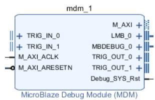

Next, run Connection Automation, shown in the following figure, to connect the cross trigger signals to an ILA.

<span id="page-115-0"/>

*Figure 82:* **Connecting the TRIG_IN_0 Interface Pin to an ILA**

Leaving the settings of **Auto**, as shown in the following figure, on both TRIG_IN_0/ TRIG_OUT_0 in the Run Connection Automation dialog box, instantiates a new ILA and connects the TRIG_IN_0/TRIG_OUT_0 signal of the MDM to the corresponding pin of the System ILA.


The following figure show the resulting block design.


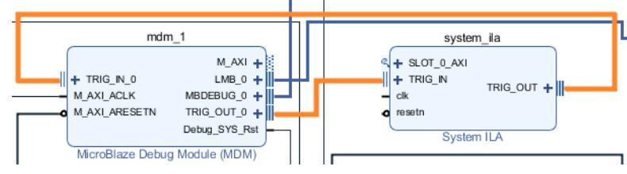

## **Custom Logic**

The Vivado IP packager lets you and third party IP developers use the Vivado IDE to prepare an Intellectual Property (IP) design for use in the Vivado IP catalog. The IP user can then instantiate this third party IP into a design in the Vivado Design Suite.

<span id="page-116-0"/>

When IP developers use the Vivado® Design Suite IP packaging flow, the IP user has a consistent experience whether using Xilinx IP, third-party IP, or customer-developed IP within the Vivado Design Suite.

IP developers can use the IP packager feature to package IP files and associated data into a ZIP file. The IP user receives this generated ZIP file, installs the IP into the Vivado Design Suite IP catalog. The IP user then customizes the IP through parameter selections and generates an instance of the IP. See *Vivado Design Suite User Guide: Creating and Packaging Custom IP* ([UG1118)](https://www.xilinx.com/cgi-bin/docs/rdoc?v=latest;d=ug1118-vivado-creating-packaging-custom-ip.pdf) for more information.

**RECOMMENDED:** *To verify the proper packaging of the IP before handing it off to the IP user, Xilinx recommends that the IP developer run each IP module completely through the IP user flow to verify that the IP is ready for use.*

## **Embedded IP Catalog**

The Vivado IDE IP catalog is a unified repository that lets you search, review detailed information, and view associated documentation for the IP. After you add the third-party or customer IP to the Vivado Design Suite IP catalog, you can access the IP through the Vivado Design Suite flows. The following figure shows a portion of the Vivado IDE IP catalog.

### *Figure 85:* **IP Catalog**

<span id="page-117-0"/>

## **Completing Connections**

After you have configured the MicroBlaze processor, you can start to instantiate other IP that constitutes your design.

In the IP integrator canvas, right-click and select **Add IP**. You can use two built-in features of the IP integrator to complete the rest of the IP subsystem design: the Block Automation and Connection Automation features assist you with putting together a basic microprocessor system in the IP integrator tool and/or connecting ports to external I/O ports.

## **Block Automation**

The Block Automation feature is available when you instantiate a microprocessor in the block design of the IP integrator tool.

*Note***:** The block design must specify a part or board that uses a specific processor to make that processor accessible through the IP catalog.

- 1. Click **Run Block Automation** to get assistance with putting together a simple MicroBlaze System.

The Run Block Automation dialog box lets you provide input about basic features that the microprocessor system requires. The following figure shows the Block Automation dialog box.


The MicroBlaze Preset option provides a convenient way of configuring the processor settings according to the particular use case: microcontroller, real-time, or application. If necessary, further configuration can be done in the MicroBlaze Configuration wizard.

- 2. Select the required options and click **OK**.
The Run Block Automation creates the following MicroBlaze system.

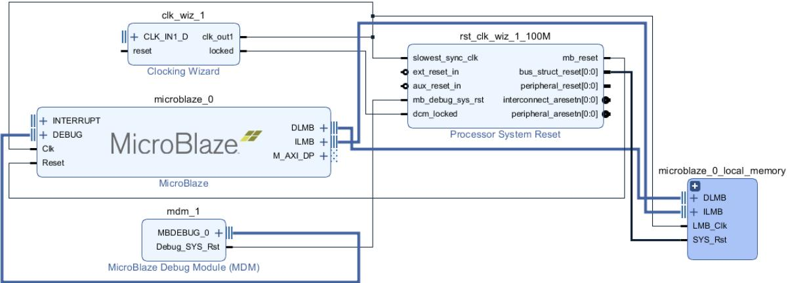


## **Using Connection Automation**

When the IP integrator tool determines that a potential connection exists among the instantiated IP in the canvas, it opens the Connection Automation feature.

In the following figure, two IP, the GPIO and the UARTLite, are instantiated along with the MicroBlaze processor subsystem.

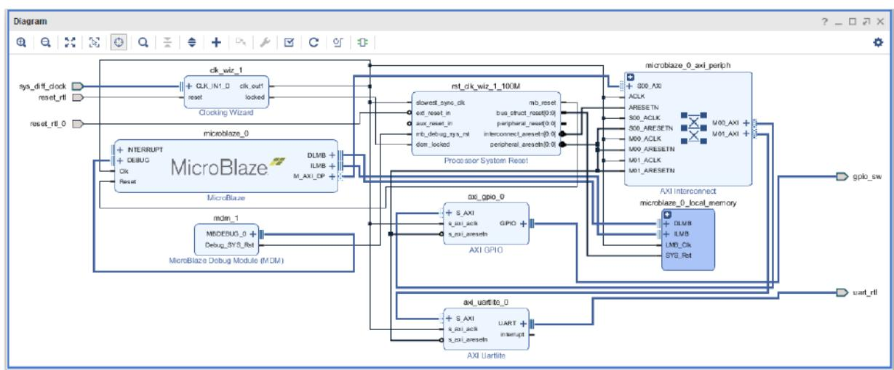

*Figure 86:* **Using Connection Automation Feature of IP Integrator**

When you click the **Run Connection Automation** link, the following dialog box, shown in the following figure, opens.


The IP integrator determines that there is a potential connection for the following objects:

- The Proc Sys Rst IP ext_reset_in pin must connect to a reset source, which can be either an internal reset source or an external input port.
- The Clocking Wizard CLK_IN_1_D pin must connect to either an internal clock source or an external input port.
- The AXI GPIO s_axi interface must connect to a master AXI interface.
- The AXI GPIO core gpio interface must connect to external I/Os.
- The Uartlite IP s_axi interface must connect to a master AXI interface.
- The Uartlite IP uart interface must connect to external I/Os.

When you run connection automation on each of those available options, the block design looks as shown in the following figure.


*Figure 88:* **Running Connection Automation for a Sample MicroBlaze Design**

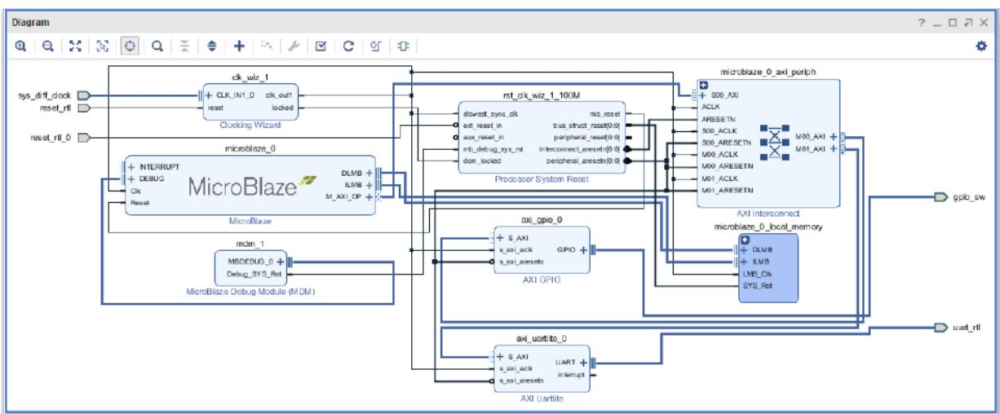

## **Completing the Design**

See the following sections in [Chapter 1: Introduction](#page-4-0) for common considerations in an embedded design:

- [Platform Board Flow in IP Integrator](#page-17-0)
- [Making Manual Connections in a Design](#page-14-0)
- [Manually Creating and Connecting to I/O Ports](#page-15-0)
- [Memory-Mapping in the Address Editor](#page-18-0)
- [Running Design Rule Checks](#page-23-0)
- [Integrating a Block Design in the Top-Level Design](#page-23-0)

## **MicroBlaze Processor Constraints**

The IP integrator generates constraints for IP generated within the tool during output products generation; however, you must generate constraints for any custom IP or higher-level code.

A constraint set is a set of XDC files that contain design constraints, which you can apply to your design. There are two types of design constraints:

- Physical constraints define pin placement, and absolute, or relative placement of cells such as: BRAMs, LUTs, Flip-Flops, and device configuration settings.
- Timing constraints, written in industry standard SDC, define the frequency requirements for the design. Without timing constraints, the Vivado Design Suite optimizes the design solely for wire length and routing congestion.


*Note***:** Without timing constraints, Vivado implementation makes no effort to assess or improve the performance of the design.

**IMPORTANT!** *The Vivado Design Suite does not support UCF format. For information on migrating UCF constraints to XDC commands see the ISE to Vivado Design Suite Migration Guide [(UG911)](UG911)) for more information.*

The options on how to use constraint sets, are, as follows:

- Multiple constraints files within a constraint set.
- Constraint sets with separate physical and timing constraint files.
- A master constraints file, and direct design changes to a new constraints file.
- Multiple constraint sets for a project, and make different constraint sets active for different implementation runs to test different approaches.
- Separate constraint sets for synthesis and for implementation.
- Different constraint files to apply during synthesis, simulation, and implementation to help meet your design objectives.

Separating constraints by function into different constraint files can make your overall constraint strategy more clear, and facilitate being able to target timing and implementation changes.

Organizing design constraints into multiple constraint sets can help you do the following:

- Target different Xilinx FPGAs for the same project. Different physical and timing constraints could be necessary for different target parts.
- Perform "what-if" design exploration. Using constraint sets to explore different scenarios for floorplanning and over-constraining the design.
- Manage constraint changes. Override master constraints with local changes in a separate constraint file.
- 

**TIP:** *A good way to validate the timing constraints is to run the* report_timing_summary *command on the synthesized design. Problematic constraints must be addressed before implementation.*

For more information on defining and working with constraints that affect placement and routing, see the *Vivado Design Suite User Guide: Using Constraints* ([UG903)](https://www.xilinx.com/cgi-bin/docs/rdoc?v=latest;d=ug903-vivado-using-constraints.pdf).

## **Taking the Design through Synthesis, Implementation, and Bitstream Generation**

After you complete the design and constrain it appropriately, you can run synthesis and implementation, and then you can generate a bitstream.


## **Exporting Hardware to the Vitis Integrated Design Environment**

See [Using the Vitis](#page-26-0) software platform for more information. In general, after you generate the bitstream for your design, you are ready to export your hardware definition to the Vitis software platform.

This action exports the necessary files needed for the Vitis software platform to understand the IP used in the design and also the memory mapping from the perspective of the processor. After a bitstream is generated and the design is exported, you can then download the device and run the software on the processor.

**TIP:** *If you want to start software development before a bitstream is created, you can export the hardware definition after generating the design.*

### 1. Select **File → Export → Export Hardware**.

This launches the Export Hardware dialog box, where you can choose the available export options, as shown in the following figure.

- 2. After the hardware is exported, select **Tools → Launch Vitis** to launch the Vitis software platform.
After you export the hardware definition and launch the Vitis software platform, you can start writing your software application. You can also perform debugging .

Alternatively, you can import the software ELF file back into a Vivado IDE project, and integrate that file with an FPGA bitstream for further download and testing.

<span id="page-124-0"/>

## **Multiple MicroBlaze Processor Designs**

Multiple MicroBlaze processors can be included in a block design. The configurations of these multiple MicroBlaze designs may vary based on design needs. A simple dual MicroBlaze design is discussed in the following sections.

## **Instantiate MicroBlaze IP Cores**

Create a block design and instantiate two instances of MicroBlaze IP as shown. Note that the Run Block Automation link becomes active in the banner.

### *Figure 89:* **Multiple MicroBlaze Instances in a Block Design**

Click the **Run Block Automation** link to run block automation on both the MicroBlaze instances. Again, the options here varies on the design requirements.

For example:

- Both the MicroBlaze processors might run from a single system clock or they could be totally independent.
- They could share the Clocking Wizard IP or they could have independent Clocking Wizard IP.

This topology shows two independent Clocking Wizard IP for each MicroBlaze processor as in the following figure.


### *Figure 90:* **Block Automation Dialog Box for Dual MicroBlaze Design**

The block design looks as shown in the following figure:


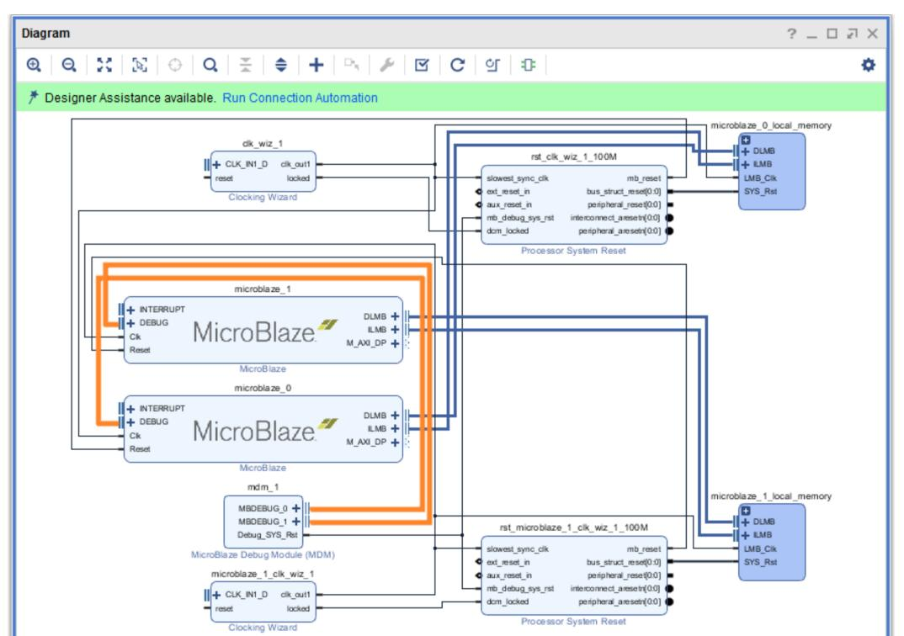

*Figure 91:* **Block Design After Running Block Automation**

*Note***:** Both the MicroBlaze processors share the same MicroBlaze Debug Module that is automatically configured to support two debug interfaces.

At this point you can add peripherals to your design as needed. In this case, two instances of Uartlite, one GPIO and a AXI BRAM Controller were added.

- The Uartlite IP is connected to each of the MicroBlaze processor instances.
- The GPIO is connected to one instance of the MicroBlaze IP.
- Finally, the AXI BRAM Controller controlling the Block Memory Generator is shared by both MicroBlaze processors.
- The input clock to one of the Clocking Wizard IP is the on-board System Differential Clock while the other Clocking Wizard is tied to the on-board PCIe Clock.

## **Run Connection Automation**

*Note***:** The Run Connection Automation link is active at the top of the block design banner. Click **Run Connection Automation**. Check the **All Automation** check-box (15 out of 15 selected), as shown in the following figure.


*Figure 92:* **Connection Automation Dialog Box**

Make the selections listed in the following table for each automation.

|  |  | Table 2: Connection Automation Options |  |
|--|--|----------------------------------------|--|
|--|--|----------------------------------------|--|

| Connection                         | More Information                                                                                                                                                    | Setting                                                       |
|------------------------------------|---------------------------------------------------------------------------------------------------------------------------------------------------------------------|---------------------------------------------------------------|
| axi_bram_ctrl_0<br>•<br>BRAM_PORTA | The only option for this automation is to<br>instantiate a new Block Memory<br>Generator as shown under options.                                                    | Leave the Blk_Mme_Gen to its default option<br>of Auto.       |
| axi_bram_ctrl_0                    | The Run Connection Automation dialog<br>box gives you two choices:                                                                                                  | Leave the Blk_Mem_Gen option to its default<br>value of Auto. |
| •<br>BRAM_PORTB                    | Instantiate a new BMG and connect the<br>PORTB of the AXI BRAM Controller to the<br>BMG IP.                                                                         |                                                               |
|                                    | Use the previously instantiated BMG core<br>and automatically configure it to be a true<br>dual-ported memory and connected to<br>PORTB of the AXI BRAM Controller. |                                                               |
| axi_bram_ctrl_0                    | The Master Field can be set to either /                                                                                                                             | Leave it to the default value of /                            |
| •<br>S_AXI                         | microblaze_0 or /microblaze_1.                                                                                                                                      | microblaze_0.                                                 |


### *Table 2:* **Connection Automation Options** *(cont'd)*

| Connection                      | More Information                                                                     | Setting                                                                                       |  |  |  |  |
|---------------------------------|--------------------------------------------------------------------------------------|-----------------------------------------------------------------------------------------------|--|--|--|--|
| axi_gpio_0<br>•<br>GPIO         | The GPIO interface can be tied to several<br>on-board interfaces.                    | Set the Selected Board Part Interface to<br>led_8bits (LED).                                  |  |  |  |  |
|                                 |                                                                                      |                                                                                               |  |  |  |  |
| axi_gpio_0                      | The Master field is set to its default value<br>of /microblaze_0 (Periph).           | Keep the default settings.                                                                    |  |  |  |  |
| •<br>S_AXI                      | All other fields is set to its default value of<br>Auto.                             |                                                                                               |  |  |  |  |
| axi_uartlite_0                  | The Master field is set to its default value<br>of /microblaze_0 (Periph).           | Keep the default settings.                                                                    |  |  |  |  |
| •<br>S_AXI                      | All other fields is set to its default value of<br>Auto.                             |                                                                                               |  |  |  |  |
| axi_uartlite_0                  | Set the Select Board Part Interface to the<br>rs232_uart interface present on-board  | Keep the default setting of rs232_uart<br>(UART).                                             |  |  |  |  |
| •<br>UART                       | or tie it to a custom interface.                                                     |                                                                                               |  |  |  |  |
| axi_uartlite_1                  | The Master field is set to its default value<br>of /microblaze_1 (Periph).           | Keep the default settings.                                                                    |  |  |  |  |
| •<br>S_AXI                      | All other fields is set to its default value of<br>Auto.                             |                                                                                               |  |  |  |  |
| axi_uartlite_0                  | The Select Board Part Interface can be set<br>to the rs232_uart interface present on | Because you already used the rs232_uart<br>(UART) interface on the board to connect to        |  |  |  |  |
| •                               | board or can be tied to a custom                                                     | the /uartlite_0 instance, set the Select                                                      |  |  |  |  |
| UART                            | interface.                                                                           | Board Part Interface option to Custom.                                                        |  |  |  |  |
| clk_wiz_1                       | The input clock source of the Clocking<br>Wizard can be tied to the several on       | Leave the Select Board Part Interface field to<br>sys_diff_clock (System differential clock). |  |  |  |  |
| •<br>CLK_IN1_D                  | board clock sources or it can be tied to a<br>Custom input clock.                    |                                                                                               |  |  |  |  |
| clk_wiz_1                       | The reset pin of the Clocking Wizard can<br>be tied to either the on-board reset     | Leave the Select Board Part Interface to its<br>default value of reset (FPGA Reset).          |  |  |  |  |
| •<br>reset                      | source or to a custom input pin.                                                     |                                                                                               |  |  |  |  |
| microblaze_1_clk_wiz_1          | The input clock source of the Clocking<br>Wizard can be tied to the several on       | Leave the Select Board Part Interface field to<br>New External Port (100 MHz).                |  |  |  |  |
| •<br>CLK_IN1_D                  | board clock sources or it can be tied to a<br>Custom input clock.                    |                                                                                               |  |  |  |  |
| microblaze_1_clk_wiz_1          | The reset pin of the Clocking Wizard can<br>be tied to either the on-board reset     | Leave the Select Board Part Interface to its<br>default value of reset (FPGA Reset).          |  |  |  |  |
| •<br>reset                      | source or to a custom input pin.                                                     |                                                                                               |  |  |  |  |
| rst_clk_wiz_1_100M              | The reset pin of the Processor System<br>Reset IP can be tied to either the on       | Leave the Select Board Part Interface to its<br>default value of reset (FPGA Reset).          |  |  |  |  |
| •<br>ext_reset_in               | board reset source or to a custom input<br>pin.                                      |                                                                                               |  |  |  |  |
| rst_microblaze_1_clk_wiz_1_100M | The reset pin of the Processor System<br>Reset IP can be tied to either the on       | Leave the Select Board Part Interface to its<br>default value of reset (FPGA Reset).          |  |  |  |  |
| •<br>ext_reset_in               | board reset source or to a custom input<br>pin.                                      |                                                                                               |  |  |  |  |


After running connection automation, one instance of the Microblaze (microblaze_0) is connected to three slaves AXI block RAM Controller (axi_bram_ctrl_0), AXI Uartlite (axi_uartlite_0) and AXI GPIO (axi_gpio_0). The other instance of MicroBlaze (microblaze_1) is connected to the AXI Uartlite (axi_uartlite_1).

## **Re-Customizing AXI Interconnects**

If you want the microblaze_1 instance of MicroBlaze to access the AXI BRAM Controller (axi_bram_ctrl_0), then the two interconnects instances must be reconfigured.

- 1. Double-click the AXI Interconnect (microblaze_1_axi_periph).
The Re-customize IP dialog box opens.

- 2. From the drop-down menu, set the **Number of Master Interfaces** field to **2**, as shown in the following figure.

Similarly, re-customize the microblaze_axi_periph instance such that the Number of Slave Interfaces field is set to 2.

- 3. After that, you can connect the Master Interface M01_AXI of microblaze_1_axi_periph to the S01_AXI slave interface of microblaze_0_axi_periph.
- 4. Connect the clocks and resets accordingly as well, as shown in the following figure.


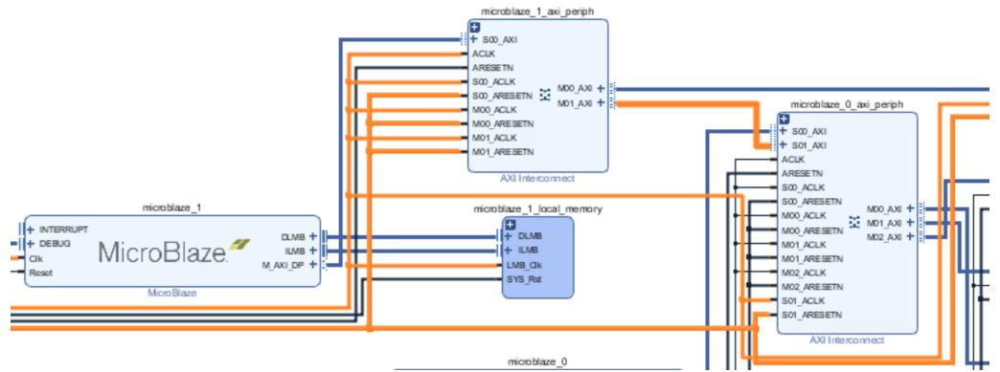

By doing this, you made the microblaze_1 access all the slaves accessible by microblaze_0. This is an optional decision.

## **Mapping and Excluding Unwanted Slaves**

If you want to access the AXI BRAM Controller from microblaze_1, you can exclude the other slaves from the microblaze_1 memory space. This can be done in the address editor. As can be seen in the following figure, the microblaze_1 memory space has three unmapped slaves.

*Figure 93:* **microblaze_1 Memory Map**

- 1. First, assign addresses to all the unmapped slaves by selecting them, right-clicking, and selecting **Assign Address** from the context menu.


- 2. Next, "exclude" the unwanted slaves from the memory map of microblaze_1 by selecting them in the address editor, right-clicking, and selecting **Exclude Segment**, as shown in the following figure.

### The address editor now looks as follows.

After you complete the design in this way, the rest of the design flow is the same as any other Block design flow.

<span id="page-132-0"/>

## *Chapter 5*

*Chapter 5:* Designing with the Memory IP Core

# Designing with the Memory IP Core

The Xilinx® memory IP is a combined pre-engineered controller and physical layer (PHY) for interfacing UltraScale architecture and 7 series FPGA user designs with AMBA® advanced extensible interface (AXI4) slave interfaces to DDR2, DDR3, or DDR4 SDRAM, QDRII+ SRAM, or RLDRAM 3 devices.

For more information, see the following:

- *UltraScale Architecture-Based FPGAs Memory IP LogiCORE IP Product Guide* [(PG150](PG150))
- *Zynq-7000 SoC and 7 series Devices Memory Interface Solutions* [(UG586](UG586))

This chapter provides information about using, customizing, and simulating a LogiCORE IP DDR4, DDR3, or DDR2 SDRAM memory interface core in the Vivado IP integrator tool. This chapter describes the core architecture and provides details on customizing and interfacing to the core.

**TIP:** *Although the information in this chapter is tailored for the KC705, Kintex®-7 board, the differences for UltraScale devices, and the KCU105 board, are highlighted throughout this text. These guidelines can also be applied to Xilinx devices on custom boards.*

## **Adding the Memory IP**

To add the Memory IP core to a block design, right-click in the IP integrator design canvas and select **Add IP**. A searchable IP catalog opens. When you type the first few letters of an IP name, in this case Memory IP, only the IP cores matching the name are listed.

Alternatively, you can click the **Add IP** button on the toolbar at the top of the canvas .

Double-click to select the Memory Interface Generator IP and add it to your block design.


### *Figure 94:* **Add the Memory IP by Searching in the IP Catalog**

This places the Memory IP core into the IP integrator block design.

- 1. To make changes to the Memory IP configuration, right-click the block to open the menu, and click **Customize Block**. You can also double-click the Memory IP block to open the Xilinx Memory Interface Generator dialog box.
The following figure shows both the Memory IP and the 7 series IP core in the upper-left, and the DDR4 Memory IP core for UltraScale devices in the lower-right. The Memory IP that is available in the IP catalog depends on the target part or platform board selected for your project. There are separate IP cores to support DDR3 and DDR4 memory controllers for UltraScale devices.

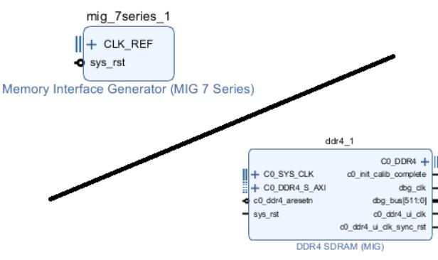


This example targets the KC705 board for the project. As shown in the following figure, the Board tab of the platform board flow is available to let you select components to interface to your design.

- 2. From the Board tab, drag and drop the DDR3 SDRAM component into the block design canvas.
*Note***:** In the case of the UltraScale KCU105 board, you can also use the DDR4 SDRAM component.


To connect the memory controller to the memory components on the target platform board, the Vivado® IP integrator connects the SYS_CLK and DDR interfaces of the Memory IP to external interface ports, as seen in the following figure.

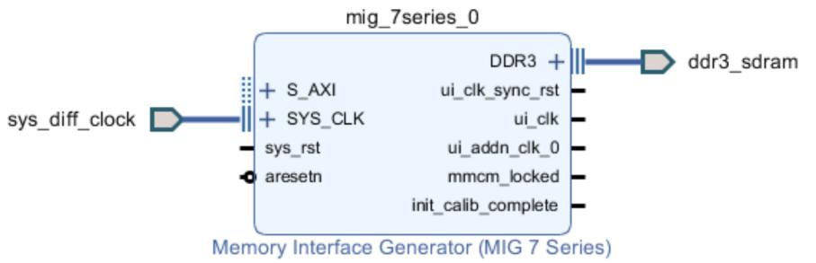

**TIP:** *You can also begin by simply dragging and dropping the DDR SDRAM component from the Board tab into an empty block design. In this case, the Vivado IP integrator instantiates the Memory IP onto the canvas and connects the SYS_CLK and DDR interfaces of the Memory IP to the components on the platform board.*

- 3. Select the **Run Connection Automation** link at the top of the design canvas, as seen in the following figure. This connects the Memory IP to the system FPGA reset on the platform board.


*Note***:** For the KCU105 board, the Run Connection Automation dialog box includes both the CO_SYS_CLK and the sys_rst interfaces for the Memory IP.

## **Making Connections with Block Automation**

As an alternative to dragging and dropping the DDR SDRAM component from the Board tab, you could use the Block Automation feature of IP integrator to configure the Memory IP and tie its SYS_CLK and DDR3 interfaces to the board interfaces.

- 1. Because the Memory IP core provides the clocking for the entire KC705 board, you should **Run Block Automation**, shown in the following figure, for the Memory IP core prior to adding a clock controller.
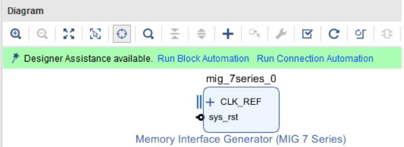

This opens the Run Block Automation dialog box as shown in the following figure.


The Run Block Automation dialog box shows the available IP. In this case, the block design only has the Memory IP you previously added.

- 2. Ensure the Memory IP is selected, and click **OK**.
The SYS_CLK and DDR interfaces of the Memory IP are connected to the DDR memory components on the platform board. The Memory IP core is configured for 400 MHz operation with the correct pins selected to interface to the KC705 board. The following figure shows the Memory IP core after running Block Automation.

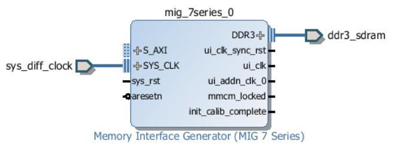

## **Adding a Clocking Wizard**

If the design requires clocking in addition to the clock generated by the Memory IP core, you need to add a Clocking wizard IP into the block design.

- 1. Select the **Add IP** command, type **Clock** into the search field, and select the **Clocking Wizard** IP. The following figure shows a Clock Wizard IP with a Memory IP core within a design.


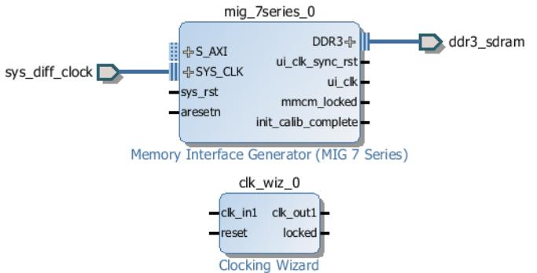

Follow these steps to connect the Clocking Wizard to the Memory IP core:

- 2. Connect the ui_clk or ui_addn_clk_0 output of the Memory IP, as well as any other clocks generated, to the clk_in1 input of the Clocking wizard, as shown in the following figure.


- 3. For the UltraScale Memory IP, connect the c0_ddr4_ui_clk pin to the Clocking Wizard, as shown in the following figure.
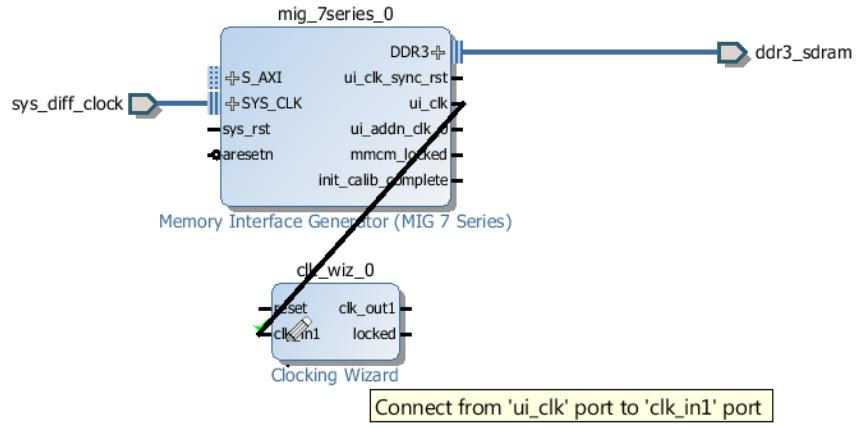

- 4. Connect the ui_clk_sync_rst pin of the Memory IP core to the reset pin of the Clocking wizard, as shown below.
- 5. For the UltraScale Memory IP, connect the c0_ddr4_ui_clk_sync_rst pin to the Clocking wizard, shown in the following figure.


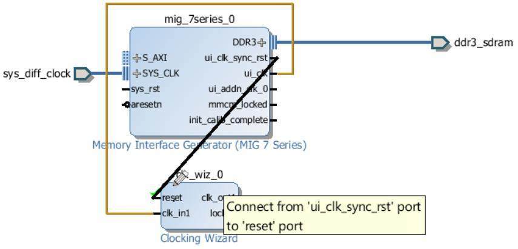

- 6. Configure the Clocking wizard to generate any required clocks for the design, by doubleclicking the IP.
## **Adding an AXI Master**

To complete the Memory IP design, an AXI master such as a Zynq processor or a MicroBlaze embedded processor, or an external processor is required. The following procedure lists the steps to instantiate a MicroBlaze processor into the block design.

- 1. Select the **Add IP** command, type Micro into the search field, and select the MicroBlaze processor to add it to the design.
- 2. Click **Run Block Automation** to construct a basic MicroBlaze system, and configure the settings in the dialog box as follows:
	- **Preset: None (or the one that is desired)**
	- **Local Memory**: Select the required amount of local memory from pull-down menu.
	- **Local Memory ECC**: Turn on ECC if desired.
	- **Cache Configuration**: Select the required amount of Cache memory.
	- **Debug Module**: Specify the type of debug module from the pull-down menu.
	- **Peripheral AXI Interconnect**: This option must be enabled.
	- **Interrupt Controller**: Optional.
	- **Clock Connection**: Select the clock source from the pull-down menu.

The following figure shows the Run Block Automation page.


- 3. Click **OK**.
The Run Block Automation adds and connects IP needed to support the MicroBlaze processor into the block design. The block design should look similar to the following figure; however, notice that the Memory IP core is not yet connected to the MicroBlaze processor.

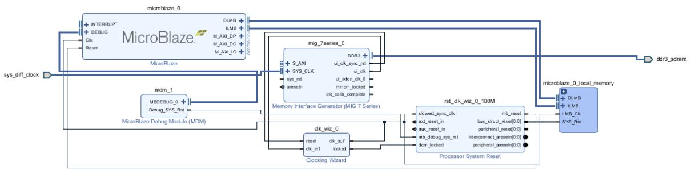

- 4. At the top of the design canvas, click **Run Connection Automation** to connect the Memory IP core to the MicroBlaze processor. The Run Connection Automation dialog box opens, as shown in the following figure.


- 5. Select the S_AXI interface of the mig_7series_0.
*Note***:** For the UltraScale Memory IP, select the C0_DDR4_S_AXI interface of the mig_0.

The /microblaze_0 (Cached) option should be selected by default.

- 6. You have a choice to select either the AXI Interconnect or the AXI SmartConnect for the Interconnect IP. For high bandwidth application (such as the Memory IP), the Auto option selects the AXI SmartConnect IP.
- 7. Leave the rest of the options to their default values.
- 8. Click **OK**.

This instantiates an AXI Interconnect and makes the required connection between the Memory IP core and the MicroBlaze processor, as shown in the following figure.


From here you can complete any remaining connections to the design, such as connecting to an external reset source, or connecting any interrupt sources through a concat IP to the MicroBlaze processor.

## **Creating a Memory Map**

To generate the address map for this design, click the Address Editor tab above the diagram. The memory map is automatically created as IP, and added to the design. You can set the addresses manually by entering values in the Offset Address and Range columns. See this [link](https://www.xilinx.com/cgi-bin/docs/rdoc?v=2020.1;d=ug994-vivado-ip-subsystems.pdf;a=xCreatingaMemoryMap) in the *Vivado Design Suite User Guide: Designing IP Subsystems using IP Integrator* ([UG994)](https://www.xilinx.com/cgi-bin/docs/rdoc?v=latest;d=ug994-vivado-ip-subsystems.pdf) for more information. The following figure shows the Address Editor.

| Figure 95: Address Editor |  |  |
|---------------------------|--|--|
|---------------------------|--|--|

**TIP:** *The Address Editor tab only appears if the diagram contains an IP block that functions as a bus master, such as the MicroBlaze processor in the following diagram.*


## **Running Design Rule Checks**

The Vivado IP integrator runs basic design rule checks in real time as you create the design. However, problems can occur during design creation. For example, the frequency on a clock pin might not be set correctly. To run a comprehensive design check, click the **Validate Design** button


.

If the design is free of warnings and errors, a successful validation dialog box displays.

## **Implementing the Design**

Now you can implement the design, generate the bitstream, and create the software application in the Vitis™ software platform.


*Chapter 6:* Reset and Clock Topologies in IP Integrator

# <span id="page-143-0"/>Reset and Clock Topologies in IP Integrator

To create designs with IP integrator that function correctly on the target hardware, you must understand reset and clocking considerations. This chapter provides information about clock and reset connectivity at the system level. In the Vivado® IP integrator, you can use the Xilinx® platform board flow, which enables you to configure IP in your design to connect to board components using signal interfaces in an automated manner. You can also make all the connections manually. The examples and overall flow described in this chapter use the platform board flow, but the considerations are valid for all block designs.

For designs using the Memory IP core, the core provides the clock source, and the primary clock from the board oscillator must be connected directly to the Memory IP core. For more information, see [Chapter 5: Designing with the Memory IP Core](#page-132-0).

The Memory IP core can generate up to five additional clocks (Memory IP core for UltraScale devices can generate only four additional clocks), which you can use for resetting the design as needed. For designs that contain a Memory IP core, ensure that the primary onboard clock is connected to memory controller, and then use the user clock (ui_clock or the ui_addn_clk_x) as additional clock sources for the rest of the design.

For IP integrator designs with platform board flow, specific IP (for example, Memory IP and Clocking Wizard) support board-level clock configuration. For the rest of the system, clocking can be derived from the supported IP. Similarly, for driving reset signals, board-level reset configuration is supported by a specific reset IP (for example, proc_sys_reset). You can use other IP that also require external reset but are not currently supported by the platform board flow.

The following sections describe the reset topologies for different types of designs.

## **MicroBlaze Design without a Memory IP Core**

For any design that uses a MicroBlaze processor without a Memory IP core, you can instantiate a Clocking Wizard IP to generate the clocks required. For the platform board flow, you can configure the connection as follows:


- 1. After instantiating a MicroBlaze processor in the design, click the **Run Block Automation** link. This creates the MicroBlaze subsystem, as shown in the following figure.
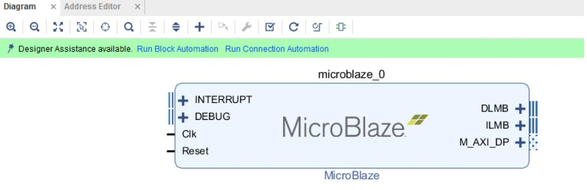

- 2. In the Run Block Automation dialog box, select the **New Clocking Wizard** option to instantiate the Clocking Wizard IP, and click **OK**, as shown in the following figure.

Running Block Automation also instantiates and connects the Proc Sys Reset IP to the various blocks in the design.

The IP integrator canvas looks like the following figure.


- 3. Click **Run Connection Automation** and select **/clk_wiz_1/CLK_IN1_D** to connect the onboard clock to the input of the Clocking Wizard IP, according to the board definition.
*Note***:** You can customize the Clocking Wizard to generate the various clocks required by the design.


- 4. In the Run Connection Automation dialog box, select **sys_diff_clock** to select the board interface for the target board, or select **Custom** to tie a different input clock source to the Clocking Wizard IP, then click **OK**.


- 5. For the reset pin of the Clocking Wizard, select the dedicated reset interface on the target board or a Custom reset input source.

*Note***:** Steps 4 and 5 above can also be done by dragging and dropping the System Differential Clock under the Clock Sources folder and FPGA Reset from the Reset folder in the Board tab.

- 6. For the ext_reset_in pin for the Processor System Reset block choose the same reset source as chosen for the Clocking Wizard in the step above or a Custom reset source.
After you make your choice and click **OK**, the IP integrator canvas looks like the following figure.

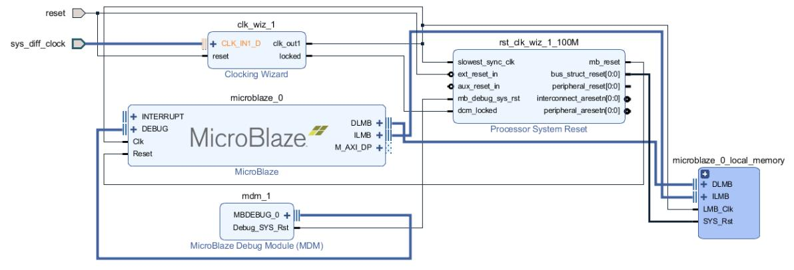

**CAUTION!** *If the platform board flow is not used, ensure that the "locked" output of the Clocking Wizard is connected to the "dcm_locked" input of Proc_Sys_Reset.*

<span id="page-147-0"/>

## **MicroBlaze Design with a Memory IP Core**

**RECOMMENDED:** *As mentioned in the introduction, the Memory IP is a clock source, and Xilinx recommends that you connect the on-board clock directly to the Memory IP core.*

The Memory IP core provides a user clock (ui_clock) and up to five additional clocks (four in case of UltraScale Memory IP) that can be used in the rest of the design. You can configure the connection, as follows:

- 1. When using the platform board flow automation in a design that contains the Memory IP, add the Memory IP first (or drag and drop the DDR3 SDRAM/DDR4 SDRAM interface from the Board window which instantiates the Memory IP core and configures it for the board), and then run Block Automation. This connects the on-board clock to the Memory IP core.
You can then customize Memory IP to generate additional clocks, as shown in the following figure.

- 2. After configuring the MIG to generate additional clocks, click the **Run Connection Automation** link at the top of the banner.


The Run Connection Automation dialog box states that the ddr3_sdram interface is available, as shown in the following figure.

#### 3. Click **OK**.

This connects the interface ports to the Memory IP, as shown in the following figure.

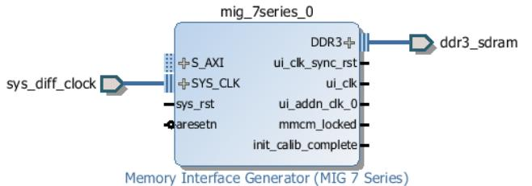

- 4. Add the MicroBlaze processor to the design and run Block Automation, as shown in the following figure.
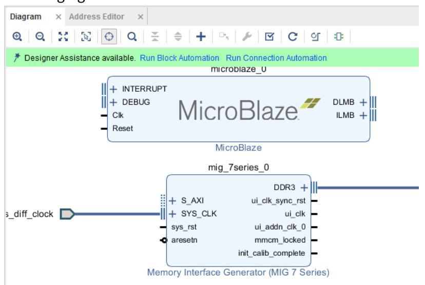


- 5. In the **Clock Connection** field of the Run Block Automation dialog box, select the Memory IP ui_clk (**/mig_7series_0/ui_clk** or **mig_7series/u_addn_clk_0**) as the clock source for the MicroBlaze processor, as shown in the following figure, and click **OK**.

|  |  | TIP: The mig_7series_0/ui_addn_clk_0 is selected by default. |
|--|--|--------------------------------------------------------------|
|--|--|--------------------------------------------------------------|

This creates a MicroBlaze subsystem and connects the ui_addn_clk_0 as the input source clock to the subsystem, as shown by the highlighted net in the following figure.

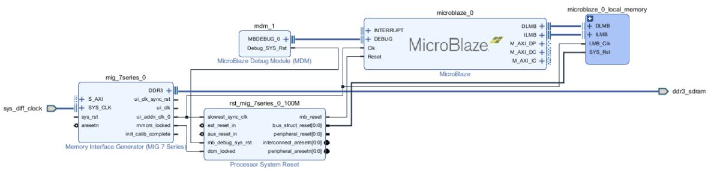

- 6. Make the following additional connections:
	- a. Click **Connection Automation** and select /mig_7series/S_AXI to connect the Memory IP to MicroBlaze.
	- b. In the Run Connection Automation dialog box select /microblaze_0 (Cached) option for the S_AXI interface.
	- c. Leave all other settings for S_AXI to their default value of **Auto**.

<span id="page-150-0"/>

- d. Connect the on-board reset to the sys_rst input of the Memory IP.
- e. Connect the ext_reset_in of the rst_mig_7_series_0_100M Processor System Reset block to reset (FPGA Reset).
- f. Click **OK**.

The following figure shows the completed connection for MB-Memory IP with Designer Assistance.

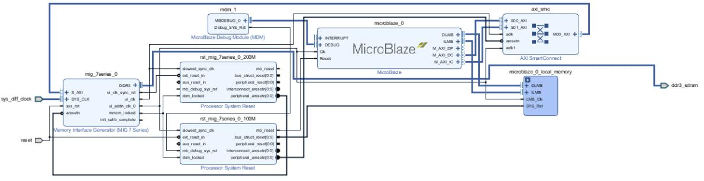

## **Zynq Design without PL Logic**

For Zynq designs without programmable logic (PL), all the clocks are contained in the ZYNQ7 Processing System IP. Use the following steps to add a Zynq design without PL.

- 1. After adding the ZYNQ7 Processing System IP, click **Run Block Automation** and select **/ processing_system7_0**, as shown in the following figure.


- 2. The Run Block Automation states that the FIXED_IO and the DDR interfaces will be connected to external ports, as shown in the following figure.
- 3. Click **OK**.

- 4. Double-click the **ZYNQ7 Processing System** to re-customize the IP.
- 5. Set the specific clocks in the Re-Customize IP dialog box Clocking Configuration page, shown below.

<span id="page-152-0"/>

## **Zynq-7000 Design with PL Logic**

**RECOMMENDED:** *For designs with a Zynq-7000 processor that contain custom logic in the PL fabric (but without Memory IP), source the clocking and reset for the PL portion of the design from the PS. You can use any of the PL Fabric Clocks: FCLK_CLK0, FCLK_CLK1, FCLK_CLK2, and FCLK_CLK3: for the clock source. You can use the associated resets these clocks: FCLK_RESET0_N, FCLK_RESET1_N, FCLK_RESET2_N, and FCLK_RESET3_N: for resetting the PL.*

Use the following steps to add a Zynq-7000 processor design with PL.


- 1. After adding the ZYNQ7 Processing System IP, click **Run Block Automation** and select **/ processing_system7_0**.
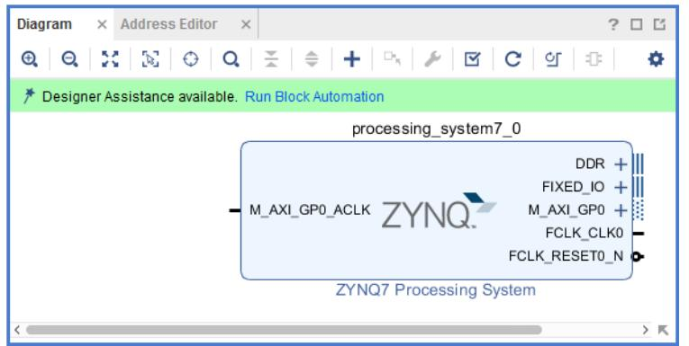

The Run Block Automation dialog box states that the FIXED_IO and the DDR interfaces will be connected to external ports, as shown in the following figure.

- 2. Click **OK**.
- 3. Double-click the ZYNQ7 Processing System to re-customize the IP.

The following figure shows the re-customization page.


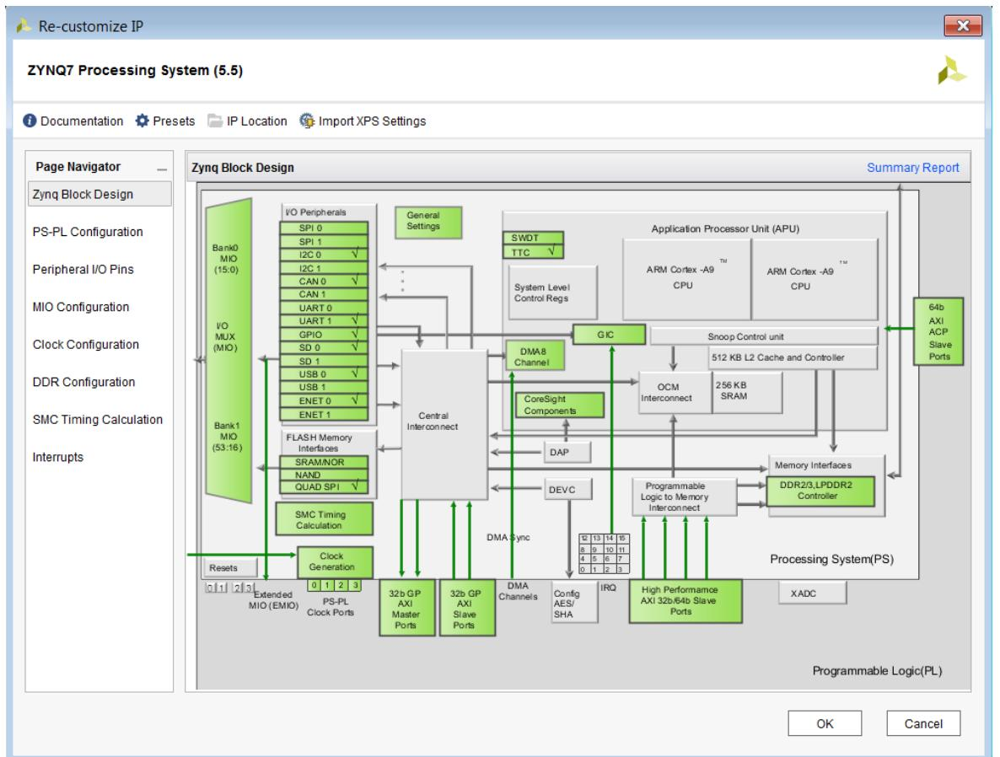

- 4. In the Re-customize IP dialog box, click **Clock Configuration** in the Page Navigator and then expand **PL Fabric Clocks**, as shown in the following figure.


- 5. Click **PS-PL Configuration** in the Page Navigator and expand **General**.
- 6. Expand **Enable Clock Resets** and select the appropriate resets for the PL fabric, as shown in the following figure.


- 7. Instantiate an IP such as AXI GPIO in the PL fabric. Then, click **Run Connection Automation**.
The Run Connection Automation dialog box states that the S_AXI port of the GPIO will be connected to the ZYNQ7 Processing System master interface M_AXI_GP0, as shown in the following figure.

- 8. Click **OK**.


The clock and resets in the IP integrator design should look as shown in the following figure.

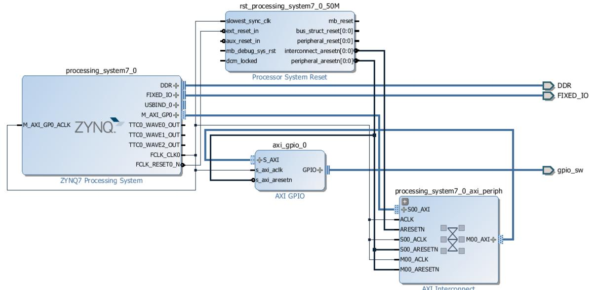

<span id="page-158-0"/>

## **Zynq Design with a Memory IP Core in the PL**

- **RECOMMENDED:** *For Zynq designs that include a Memory IP core in the PL, it is recommended that the input clock to the Memory IP core use an external clock source instead of the PS Fabric clock. The external clock from an on-board oscillator would be cleaner in terms of jitter when compared to clocks from the PS. You can use PS Fabric clocks for other portions of the PL design if required.*
	- 1. Add the Memory IP and configure according to design requirements.
	- 2. Then, connect the input clock source to the SYS_CLK input of the Memory IP core by rightclicking SYS_CLK in the block design and selecting **Make External**.
	- 3. If the design uses a MicroBlaze processor, add it to the design and run **Block Automation**. The Run Block Automation dialog box opens.
	- 4. Specify **/mig_7series_0/ui_clk** or the **/mig_7_series_0/ui_addn_clk_0** (if the Memory IP core has been configured to have ui_addn_clk_x pins) as the input clock.

- 
**TIP:** *mig_7series_0/ui_addn_clk_0 (100 MHz) is selected by default.*

### 5. Click **OK**.

The block design looks like the following figure.


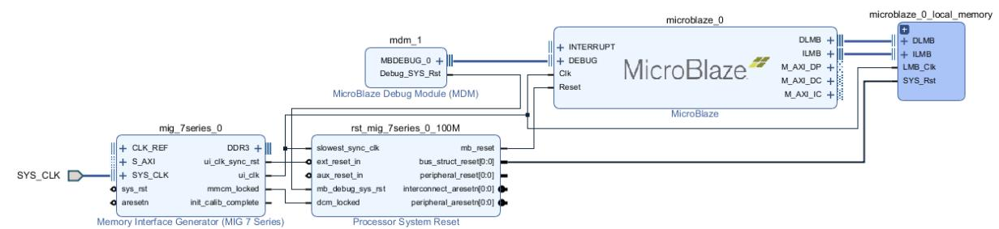

- 6. Click **Run Connection Automation** link to complete rest of the connections. The Run Connection Automation dialog box opens.
- 7. Select all available connections with their default values, as shown in the following figure.

- 8. The connected design should look like the following figure.
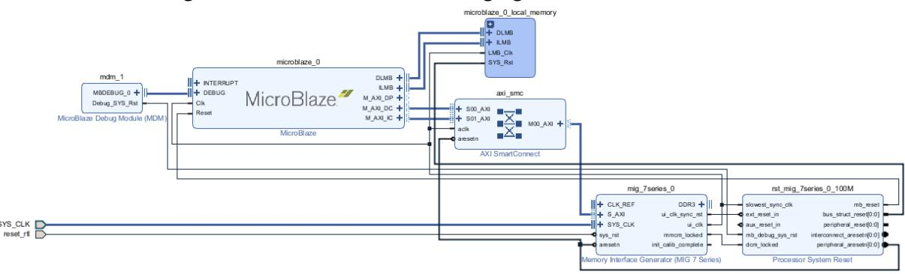

<span id="page-160-0"/>

## **Designs with Memory IP and the Clocking Wizard**

For designs that require specific clock frequencies not generated by the Memory IP core, you can instantiate a Clocking Wizard IP and use the ui_clock output of the Memory IP as the clock input for the IP Clocking wizard.

You also need to make the following additional connections:

- 1. Connect the onboard reset to the Clocking wizard reset input in addition to the Memory IP.
- 2. Connect the mmcm_locked pin of the Memory IP and locked pin of Clocking wizard to the Util_Vector_Logic IP configured to the AND operation. Then, connect the output of the Util_Vector_Logic to the dcm_locked input of Proc_Sys_Reset.


## <span id="page-161-0"/>Using UpdateMEM to Update BIT files with MMI and ELF Data

A single device, with one or more embedded processors as well as programmable logic, needs a single boot image, which must contain the merged CPU software and FPGA bitstream images. The UpdateMEM utility (updatemem) is a data translation tool to map contiguous blocks of data across multiple block RAMs that constitute a contiguous logical address space.

*Chapter 7:* Using UpdateMEM to Update BIT files with MMI and ELF Data

With the combination of Zynq®-7000 SoC devices or Microblaze embedded processors, on the UltraScale architecture or 7 series devices, UpdateMEM merges the CPU software image of an executable and linkable format (ELF) file into the FPGA bitstream created by the Vivado® Design Suite and the [write_bitstream](https://www.xilinx.com/cgi-bin/docs/rdoc?v=2020.1;d=ug835-vivado-tcl-commands.pdf;a=xwrite_bitstream) command, by mapping the ELF data onto the memory map information (MMI) for the block RAMs in the design. As a result, the software for an embedded processor can be initialized from block RAM-built address spaces within an FPGA bitstream. This provides a powerful and flexible means of merging parts of CPU software and FPGA design tool flows.

The Vivado Design Suite automatically merges an associated ELF file for an embedded processor design when generating the device bitstream. If you have associated the ELF file using the Tools > Associate ELF Files command from the Vivado IDE, then the Vivado Design Suite merges the data as needed.

Use the Associate ELF Files command to add the SCOPED_TO_REF and SCOPED_TO_CELLS properties to the associated ELF files, as follows:

- The SCOPED_TO_REF property associates the ELF file with all instances of the specified hierarchical module, or block design.
- The SCOPED_TO_CELLS associates the ELF file with specified instances of the specified embedded processor cells.

You can also run the UpdateMEM command at any time to manually associate the ELF file and MMI file with the BIT file of the implemented design.

- 
**IMPORTANT!** *UpdateMEM can only be used to update unencrypted bitstream files.*


<span id="page-162-0"/>

## **Using UpdateMEM**

For embedded processor based designs, the UpdateMEM (updatemem) command merges CPU software images into bitstream files, to initialize the block RAM memory within the target Xilinx device. The UpdateMEM command can also take an ELF file or CPU Software Image as an input and write out MEM files for simulation purposes. The UpdateMEM command takes the following inputs:

- A bitstream (BIT) file, which is initially generated by the Vivado Design Suite implementation tools. You can create a bitstream file from an implemented design using the write_bitstream Tcl command. A bitstream (BIT) file is a binary data file that contains a bit image of the design, to be downloaded to a Xilinx device. The UpdateMEM command reads a BIT file as an input, and writes a BIT file as its output.
- The memory-map information (MMI) file is a text file that describes how individual block RAMs on the Xilinx device are grouped together to form a contiguous address space called an *address block*.

The Vivado Design Suite writes the MMI file automatically and places that file into the <project>.runs/impl_1 folder when generating the bitstream, or you can manually write that information using the write_mem_info command. The UpdateMEM command uses the MMI file to identify the physical BRAM resources that map to a specific address range. For more information on the MMI file, see [BRAM Memory Map Info (MMI|[MMI) File.](#page-165-0) File.]]

- The Vivado Design Suite writes the SMI file (memory-map information file for simulation) automatically and places that file into the <project>.sim/sim_x/behav folder when simulation is run on the design.
- An executable and linkable format (ELF) file, which is a product of the Vitis™ integrated design environment, is a binary data file that contains an executable program image ready for running on an embedded processor. The ELF file contains the data to be mapped by UpdateMEM into the address ranges of the block RAMs.
- Optionally, a memory (MEM) file is a manually created text file that describes contiguous blocks of data to initialize or populate a specified address space. The UpdateMEM command can use the MEM file in place of an ELF file. See [Memory (MEM|[MEM) Files](#page-164-0) Files]] for more information.
- An instance ID of the embedded processor in the design, to associate the ELF or MEM file with the processor.

The UpdateMEM command populates contiguous blocks of data defined in ELF or MEM files, across multiple block RAMs of a Xilinx device mapped by the MMI file. The UpdateMEM command merges the memory information into a bitstream file for configuring and programming the target Xilinx device.


The UpdateMEM command also lets you merge multiple data files for multiple processors in designs that have more than one embedded processor. In this case, the -data and -proc options must be specified in pairs, with the first -data file providing the software image or memory content for the first -proc specified. The second -data applies to the second -proc, and so on.

This command returns the name of the bitstream file created from the inputs, or returns an error if it fails.

## **Arguments for updatemem**

- -meminfo <arg>: (Required) Name of the memory mapping information (MMI) file for the implemented design or memory mapping information for simulation (SMI) file. This file can be generated using the write_mem_info Tcl command.
- -data <arg>: (Required) Name of the Executable and Linkable Format (ELF) file, or a MEM file to map into BRAM addresses.
- -writememfile: Output.mem file. Translates the ELF file and writes the information to the specified.mem file, which can be used in simulation flows. This option is applicable only to processor based designs. This argument is still supported but not recommended to be used.
- -bit <arg>: (Required) Name of the bit input bitstream (BIT) file. If the file extension is missing, an extension of .bit is assumed.

*Note***:** The UpdateMEM command can only be used with unencrypted bitstream files.

- -proc <arg>: (Required) Instance path of the embedded processor.
- **TIP:** *You can specify multiple processors for the UpdateMEM command in cases where a design has multiple embedded processors. In this case the* -data *and* -proc *options must be specified in pairs, with the first* - data *argument applying to the first* -proc *argument. However, the UpdateMEM command can take either an ELF file or a MEM file in a single run, but cannot use both* -data *formats at the same time even when specifying multiple processors.*
	- -out <arg>: (Required) Specify the name of output file, without suffix. The file has a suffix of .bit applied automatically.
	- -force: (Optional) Overwrite the specified output file if it already exists.
	- -debug: Hidden debug flag to output initialization strings in the block memory.

## **Examples**

The following example reads the specified MEM info file, ELF file, and bitstream file, and generates the merged bitstream file:

```
updatemem -meminfo top.mmi -data hello_world.elf -bit top.bit \
-proc design_1_i/microblaze_1 -out top_meminfo.bit
```
<span id="page-164-0"/>

The following example shows the use of UpdateMEM in a block design that has two embedded microblaze processors, one with an associated ELF file, and the other using a MEM file. Notice this requires two passes of the updatemem command, with the output bitstream of the first acting as the input bitstream of the second:

```
updatemem -bit top.bit -meminfo top.mmi -data top1.elf \
-proc system_i/microblaze_1 -out first_out.bit
updatemem -bit first_out.bit -meminfo top.mmi -data top2.mem \
-proc system_i/microblaze_2 -out top_out.bit
```
To convert an ELF file into a MEM file for simulation flows, use the following command:

updatemem -data top1.elf -meminfo top1.smi -proc design_1_i/microblaze_0

## **Memory (MEM) Files**

A Memory (MEM) file is a manually edited text file that describes contiguous blocks of data. that can be used in place of the ELF file. The format of MEM files is an industry standard, consisting of two basic elements:

- Hexadecimal address specifier: An address specifier is indicated by an @ character followed by the hexadecimal address value. There are no spaces between the @ character and the first hexadecimal character.
- Hexadecimal data values: Hexadecimal data values follow the hexadecimal address value, separated by spaces, tabs, or carriage-return characters.

Because the MEM file is in hexadecimal format, each character represents four bits, or a nibble, in the memory.

Hexadecimal data values can consist of as many hexadecimal characters as desired. However, when a value has an odd number of hexadecimal characters, the first hexadecimal character is assumed to be a zero. For example, hexadecimal values A, C74, and 84F21 are interpreted as the values 0A, 0C74, and 084F21 respectively.


**IMPORTANT!** *The common 0x hexadecimal prefix is not allowed. Using this prefix on MEM file hexadecimal values is flagged as a syntax error.*

There must be at least one data value following an address, up to as many data values that belong to the previous address value. Following is an example of the most common MEM file format:

```
@0000 3A @0001 7B @0002 C4 @0003 56 @0004 02
@0005 6F @0006 89...
```
<span id="page-165-0"/>

UpdateMEM requires a less redundant format. An address specifier is used only once at the beginning of a contiguous block of data. The previous example is rewritten as:

@0000 3A 7B C4 56 02 6F 89...

The address for each successive data value is derived according to its distance from the previous address specifier. A MEM file can have as many contiguous data blocks as required. While the gap of address ranges between data blocks can be any size, no two data blocks can overlap an address range.

**TIP:** *UpdateMEM allows the free-form use of both // and /*...*/ commenting styles in the MEM file.*

The Vivado Design Suite also supports a MEM File format for memory initialization as described at this [link](https://www.xilinx.com/cgi-bin/docs/rdoc?v=2020.1;d=ug901-vivado-synthesis.pdf;a=xInitializingRAMContents) in the *Vivado Design Suite User Guide: Synthesis* ([UG901)](https://www.xilinx.com/cgi-bin/docs/rdoc?v=latest;d=ug901-vivado-synthesis.pdf). The MEM File format supported by the Vivado Design Suite is different from the file format supported by UpdateMEM.

You should define the MEM file structure for Vivado tools to match the synthesis view of the memory as an array, which adheres to the Verilog language specification. The MEM file used for UpdateMEM should include spaces to match the <Datawidth> tag as defined in the memory map info (MMI) file. For more information, see [MMI File Syntax](#page-169-0).

According to the Verilog language specification, the memory is treated as an array, so for Vivado synthesis the MEM file for a 64k memory (256x256 array) should look as follows:

```
@00000000 
aaaaaaaaaaaaaaaaaaaaaaaaaaaaaaaaaaaaaaaaaaaaaaaaaaaaaaaaaaaaaaaa 
bbbbbbbbbbbbbbbbbbbbbbbbbbbbbbbbbbbbbbbbbbbbbbbbbbbbbbbbbbbbbbbb
```
*Note***:** White space and/or comments are used to separate the numbers.

For the UpdateMem command, which has a post implementation physical view of the memory, the MEM file should look as follows:

@00000000 aaaaaaaaaaaaaaaa aaaaaaaaaaaaaaaa aaaaaaaaaaaaaaaa aaaaaaaaaaaaaaaa bbbbbbbbbbbbbbbb bbbbbbbbbbbbbbbb bbbbbbbbbbbbbbbb bbbbbbbbbbbbbbbb

*Note***:** For UpdateMEM, the spaces that separate the words are determined by the MSB and LSB attributes of the <Datawidth> tag defined in the MMI file.

## **BRAM Memory Map Info (MMI) File**

The following are design considerations for block RAM-implemented address spaces, and the definition of memory map info files:


- The block RAMs come in fixed-size widths and depths, where CPU address spaces might need to be much larger in width and depth than a single block RAM. Consequently, multiple block RAMs must be logically grouped together to form a single CPU address space as seen in the following figure.
- A single CPU bus access is often multiple bytes wide of data, for example, 32 or 64 bits (4 or 8 bytes) at a time.
- CPU bus accesses of multiple data bytes might also access multiple block RAMs to obtain that data. Therefore, byte-linear CPU data must be interleaved by the bit width of each block RAM and by the number of block RAMs in a single bus access. However, the relationship of CPU addresses to block RAM locations must be regular and easily calculable.
- CPU data must be located in a block RAM-constructed memory space relative to the CPU linear addressing scheme, and not to the logical grouping of multiple block RAMs.
- Address space must be contiguous, and in whole multiples of the CPU bus width. Bus bit lane interleaving is allowed only in the sizes supported by the Virtex® device block RAM port sizes.
- Addressing must account for the differences in instruction and data memory space. Because instruction space is not writable, there are no address width restrictions. However, data space is writable and usually requires the ability to write individual bytes. For this reason, each bus bit lane must be addressable.
- The size of the memory map and the location of the individual block RAMs affect the access time. Evaluate the access time after implementation to verify that it meets the design specifications.


*Figure 96:* **Block RAM Address Space**

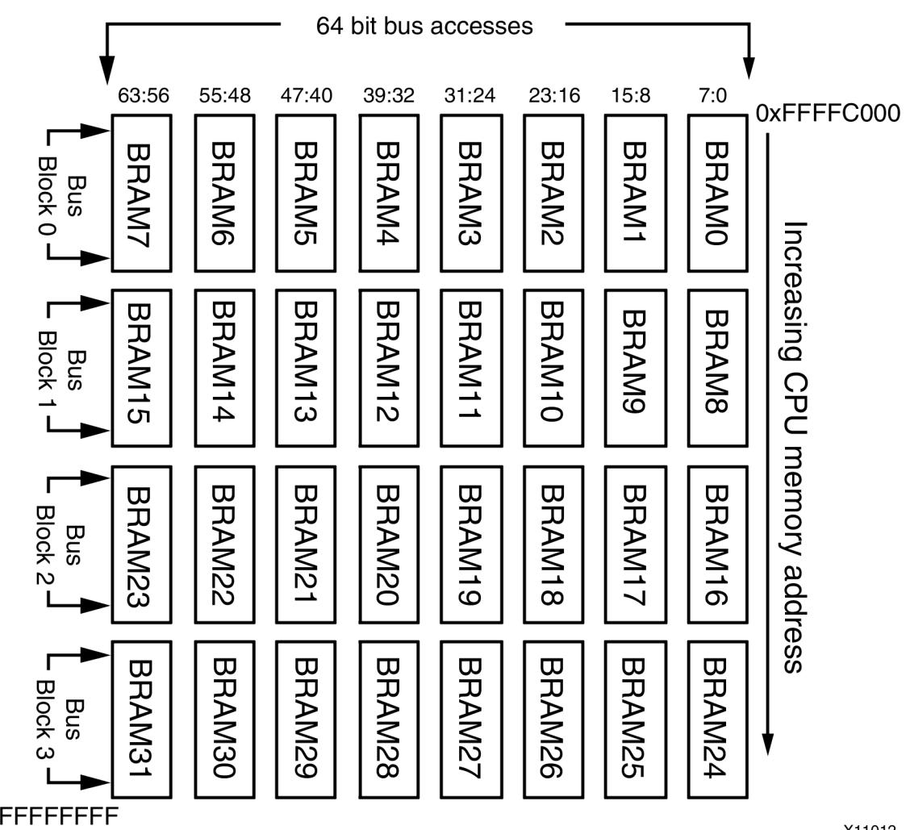

The address space in the figure above consists of four bus blocks: Bus Block 0 through 3.

- CPU bus accesses are 8 block RAMs (64 bits) wide, with each column of block RAMs occupying an 8-bit wide slice of a CPU bus access called a Bit Lane.
- Each row of 8 block RAMs in a bus access are grouped together in a Bus Block. Hence, each Bus Block is 64 bits wide and 4096 bytes in size.
- The entire collection of block RAMs is grouped together into a contiguous address space called an Address Block.

The upper right corner address is 0xFFFFC000, and the lower left corner address is 0xFFFFFFFF. Because a bus access obtains 8 data bytes across 8 block RAMs, byte-linear CPU data must be interleaved by 8 bytes in the block RAMs.

In this example using a 64-bit data word indexed by bytes from left to right as [0:7], [8:15]:


- Byte 0 goes into the first byte location of bit lane block RAM7, byte 1 goes into the first byte location of Bit Lane block RAM6; and so forth, to byte 7.
- CPU data byte 8 goes into the second byte location of Bit Lane block RAM7, byte 9 goes into the second byte location of Bit Lane block RAM6 and so forth, repeating until CPU data byte 15.
- This interleave pattern repeats until every block RAM in the first bus block is filled.
- This process repeats for each successive bus block until the entire memory space is filled, or the input data is exhausted.

As described in [MMI File Syntax,](#page-169-0) the order in which bit lanes and bus blocks are defined controls the filling order. For the sake of this example, assume that bit lanes are defined from left to right, and bus blocks are defined from top to bottom.

This process is called *bit lane mapping*, because these formulas are not restricted to byte-wide data. This is similar, but not identical, to the process embedded software programmers use when programmed CPU code is placed into the banks of fixed-size EPROM devices.

The important distinctions to note between the two processes are, as follows:

- Embedded system developers generally use a custom software tool for byte-lane mapping for a fixed number and organization of byte-wide storage devices. Because the number and organization of the devices cannot change, these tools assume a specific device arrangement. Consequently, little or no configuration options are provided.
By contrast, the number and organization of FPGA block RAMs are completely configurable (within FPGA limits). Any tool for byte-lane mapping for block RAMs must support a large set of device arrangements.

- Existing byte-lane mapping tools assume an ascending order of the physical addressing of byte-wide devices because that is how board-level hardware is built. By contrast, FPGA block RAMs have no fixed usage constraints and can be grouped together with block RAMs anywhere within the FPGA fabric. Although this example displays block RAMs in ascending order, block RAMs can be configured in any order.
## **Memory Map Information File (MMI) Features**

A memory map information (MMI) file is an XML file designed for computer parsing. It is similar to high-level computer programming languages in using the following features:

- Block structures by XML keyword tags or directives. MMI maintains similar structures in groups or blocks of data. MMI creates blocks to delineate address space, bus access groupings, and comments.
- Symbolic name usage: MMI uses names and keywords to refer to groups or entities (improving readability), and uses names to refer to address space groupings and Block RAMs.

MMI observes the following conventions:

<span id="page-169-0"/>

- Keywords are case-sensitive
- Indenting is for clarity only.
- White space is ignored except where it delineates items or keywords.
- Line endings are ignored. You can have as many items as you want on a single line.
- Numbers can be entered as decimal or hexadecimal. Hexadecimal numbers use the 0xXXX notation form.

**CAUTION!** *MMI file does not get generated if a design does not contain a processor or XPM Memories.*

## **MMI File Syntax**

The memory map info (MMI) file is an XML file that syntactically describes how individual block RAMs make up a contiguous logical data space. You can create an MMI file from an open implemented design in the Vivado Design Suite using the write_mem_info Tcl command. The implemented design provides the needed placement information of the block RAM resources.

UpdateMEM uses the MMI file as input to direct the translation of data into the proper initialization form. The Example MMI file below shows the XML-based syntax used to describe the organization of block RAM usage.

```
<?xml version="1.0" encoding="UTF-8"?>
<MemInfo Version="1" Minor="0">
 <Processor Endianness="Little" InstPath="design_1_i/microblaze_0">
 <AddressSpace 
Name="design_1_i_microblaze_0.design_1_i_microblaze_0_local_memory_dlmb_bram
_if_cntlr" Begin="0" End="8191">
 <BusBlock>
 <BitLane MemType="RAMB32" Placement="X2Y17">
 <DataWidth MSB="15" LSB="0"/>
 <AddressRange Begin="0" End="2047"/>
 <Parity ON="false" NumBits="0"/>
 </BitLane>
 <BitLane MemType="RAMB32" Placement="X3Y17">
 <DataWidth MSB="31" LSB="16"/>
 <AddressRange Begin="0" End="2047"/>
 <Parity ON="false" NumBits="0"/>
 </BitLane>
 </BusBlock>
 </AddressSpace>
 </Processor>
 <Processor Endianness="Little" InstPath="design_1_i/microblaze_1">
 <AddressSpace 
Name="design_1_i_microblaze_1.design_1_i_microblaze_1_local_memory_dlmb_bram
_if_cntlr" Begin="0" End="8191">
 <BusBlock>
 <BitLane MemType="RAMB32" Placement="X4Y13">
 <DataWidth MSB="15" LSB="0"/>
 <AddressRange Begin="0" End="2047"/>
 <Parity ON="false" NumBits="0"/>
 </BitLane>
 <BitLane MemType="RAMB32" Placement="X4Y14">
 <DataWidth MSB="31" LSB="16"/>
 <AddressRange Begin="0" End="2047"/>
```


```
 <Parity ON="false" NumBits="0"/>
 </BitLane>
 </BusBlock>
 </AddressSpace>
 </Processor>
 <Processor Endianness="Little" InstPath="design_1_i/processing_system7_0">
 <AddressSpace 
Name="design_1_i_processing_system7_0.design_1_i_axi_bram_ctrl_0" 
Begin="1073741824" End="1073750015">
 <BusBlock>
 <BitLane MemType="RAMB32" Placement="X2Y18">
 <DataWidth MSB="15" LSB="0"/>
 <AddressRange Begin="0" End="2047"/>
 <Parity ON="false" NumBits="0"/>
 </BitLane>
 <BitLane MemType="RAMB32" Placement="X2Y19">
 <DataWidth MSB="31" LSB="16"/>
 <AddressRange Begin="0" End="2047"/>
 <Parity ON="false" NumBits="0"/>
 </BitLane>
 </BusBlock>
 </AddressSpace>
 </Processor>
 <Config>
 <Option Name="Part" Val="xc7z020clg484-1"/>
 </Config>
</MemInfo>
```
### *Address Map Definitions (Multiple Processor Support)*

UpdateMEM supports multiple processors using the following XML tags:

```
<Processor Endianness="Little" InstPath="design_1_i/processing_system7_0">
</Processor>
```
**IMPORTANT!** *Although Processor Endianness is defined in the MMI file, it is not supported by UpdateMEM.*

### *Address Space Definitions*

The outermost definition of an address space comprises the following components:

```
<AddressSpace 
Name="design_1_i_processing_system7_0.design_1_i_axi_bram_ctrl_0" 
Begin="1073741824" End="1073750015">
</AddressSpace>
```
The ADDRESS_SPACE and /ADDRESS_SPACE tags define a single contiguous address space. The mandatory Name= following the ADDRESS_SPACE tag provides a symbolic name for the entire address space. Referring to the address space name is the same as referring to the entire contents of the address space.

An MMI file can contain multiple ADDRESS_SPACE definitions, even for the same address space, as long as each ADDRESS_SPACE name is unique.


Next is the beginning and ending address values that the Address Space occupies by using the Begin= and End= pair.

### *BusBlock Definitions (Bus Accesses)*

Inside an ADDRESS_SPACE definition are a variable number of sub-block definitions called *BusBlocks*, as shown in the following example:

<BusBlock> </BusBlock>

Each Bus Block contains block RAM Bit Lane definitions that are accessed by a parallel CPU bus access.

The order in which the bus blocks are specified defines which part of the address space a Bus Block occupies. The lowest addressed Bus Block is defined first, and the highest addressed Bus Block is defined last. The top-to-bottom order in which Bus Blocks are defined also controls the order in which UpdateMEM fills those Bus Blocks with data.

### *Bit-Lane Definitions (Memory Device Usage)*

A bit-lane definition determines which bits in a CPU bus access are assigned to particular block RAMs. Each definition takes the form of MemType with Placement data, followed by the bit numbers and AddressRange the bit lane occupies. The syntax is, as follows:

```
<BitLane MemType="RAMB32" Placement="X2Y19">
 <DataWidth MSB="31" LSB="16"/>
 <AddressRange Begin="0" End="2047"/>
 <Parity ON="false" NumBits="0"/>
 </BitLane>
```
**IMPORTANT!** *Although bit-lane parity is defined in the MMI file, it is not supported by UpdateMEM.*

Typically, the bit numbers are given in the following order:

<DataWidth MSB=bit_num LSB=bit_num>

If the order is reversed to have the least significant bit (LSB) first and the most significant bit (MSB) second, UpdateMEM bit-reverses the bit-lane value before placing it into the block RAM.

As with BusBlocks, the order in which bit-lanes are defined is important. But in the case of bitlanes, the order infers which part of BusBlock CPU access a bit-lane occupies. The first bit-lane defined is inferred to be the most significant bit-lane value, and the last defined is the least significant bit-lane value. In the following figure, the most significant bit-lane is BRAM7, and the least significant bit-lane is BRAM0. As seen in Example Block RAM Address Space Layout, this corresponds with the order in which the Bit Lanes are defined.


When UpdateMEM inputs data, it takes data from data input files in Bit Lane sized chunks, from the most right value first to the left most. For example, if the first 64 bits of input data are 0xB47DDE02826A8419 then the value 0xB4 is the first value to be set into a Block RAM.

Given the Bit Lane order, BRAM7 is set to 0xB4, BRAM6 to 0x7D, and so on until BRAM0 is set to 0x19. This process repeats for each successive Bus Block access BRAM set until the memory space is filled or until the input data is exhausted. The figure below expands the first Bus Block to illustrate this process.

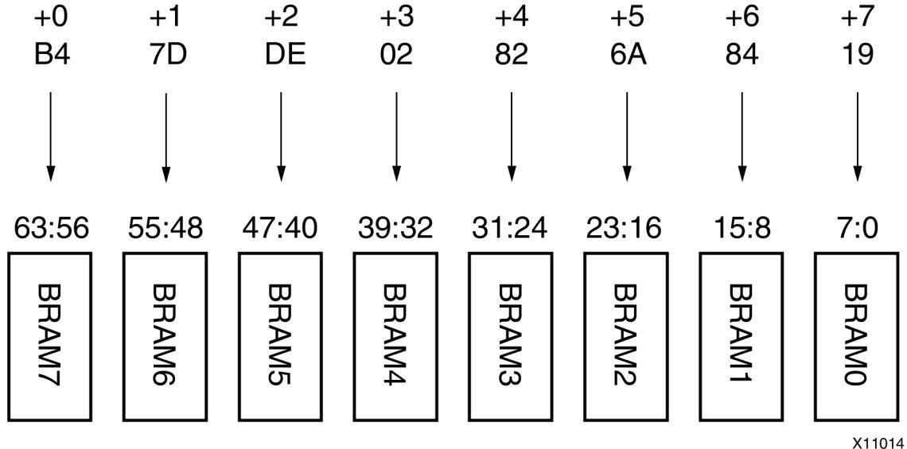

*Figure 97:* **Bit Lane Fill Order**

The Bit Lane definitions must match the hardware configuration. If the MMI is defined differently from the way the hardware actually works, the data retrieved from the memory components will be incorrect.

Bit Lane definitions also have some optional syntax, depending on what device type keyword is used in the Address Block definition.

When specifying block RAM cells, the physical row and column location within the FPGA device can be indicated. Following are examples of the physical row and column location:

Placement="X3Y5"

Use the Placement= keyword to assign the corresponding block RAM to a specific resource location in the FPGA device. In this case the block RAM is placed at column 3 and row 5 in the FPGA device.

In addition to using correct syntax for bit-lane and BusBlock definitions, you must take into account the following limitations:

<span id="page-173-0"/>

- While the examples in this document use only byte-wide data widths for clarity, the same principles apply to any data width for which a block RAM is configured.
- There cannot be any gaps or overlaps in bit-lane numbering. All bit-lanes in an Address Block must be the same number of bits wide.
- The bit-lane widths are valid for the memory device specified by the device type keyword.
- The amount of byte storage occupied by the Bit Lane block RAMs in a BusBlock must equal the range of addresses inferred by the start and end addresses for a BusBlock.
	- All BusBlocks must be the same number of bytes in size.
	- A block RAM instance name can be specified only once.
	- A BusBlock must contain one or more valid bit-lane definitions.
	- An address Block must contain one or more valid BusBlock definitions.

UpdateMEM checks for all these conditions and transmits an error message if it detects a violation.

## **Xilinx Parameterized Macros (XPM) Memories**

XPM is a tool for creating RAM and ROM structures according to user-specified requirements. Within the XPM code, you specify a number of generics including memory size, clocking mode, ECC mode, and so forth. These requirements are then converted by the Vivado synthesis tool into the appropriate size and style of memory array.

XPMs are simple, lightweight, in-line customizable, solutions for common HDL flow use cases. They can also be considered as simple parameterizable IP. XPMs are synthesizable SystemVerilogbased HDL delivered with the Vivado Design Suite.

For details on XPMs, see the *Vivado Design Suite User Guide: System-Level Design Entry* [(UG895](UG895)).

For details on the various XPMs and their parameterization options, see the *UltraScale Architecture Libraries Guide* ([UG974)](https://www.xilinx.com/cgi-bin/docs/rdoc?v=latest;d=ug974-vivado-ultrascale-libraries.pdf).

*Note***:** In the 2018.1 Vivado release and beyond, XPMs are enabled automatically in project mode, and in non-project mode are used automatically during synthesis/implementation.

Because XPMs are used in RTL flows (or non-processor based designs), the UpdateMEM command needs a MEM (.mem) file as an argument; it cannot take an ELF file as an argument.

The limitations to using UpdateMEM with XPM memories are, as follows:

- ROM configurations need a MEM file prior to synthesis.
- ECC is not supported.


## **Using XPM Memory in Vivado**

To use XPM Memory in Vivado you need to create design sources for the XPM memory. Follow the following steps to create XPM memory.

- 1. Launch Vivado and create a Project.
- 2. In the Sources window, right-click **Design Sources**, and select **Add Sources** from the context menu.

- 3. In the Add or Create Design Sources page, click **Create File**.


- 4. In the Create Source File dialog box, specify the HDL language of your choice from the File type drop-down menu, and type a name for the memory block being created in the File name field.
- 5. Keep the File location to its default value <Local to Project>.
- 6. Click **OK**, as shown in the following figure.

- 7. In the Add or Create Design Sources page, click **Finish**.

- 8. The Define Module dialog box opens. Click **Cancel** to dismiss the dialog box.
- 9. The Define Module dialog box asks to confirm that you indeed do not want to create the template for the HDL file.
- 10. Click **Yes**.

This example copies a pre-existing XPRM template in the next steps into the HDL file.


- 11. Now you can see the newly created Verilog file in the Sources window.
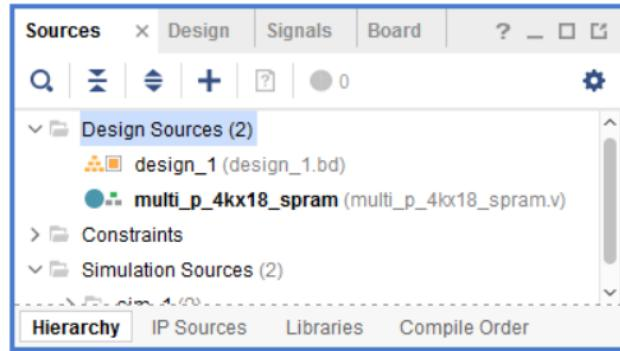

- 12. In the Flow Navigator, under Project Manager, click **Language Templates**.
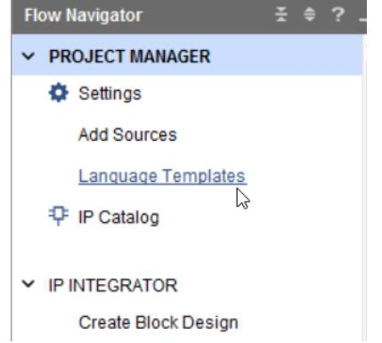

- 13. The Language Template dialog box opens. In the Search field type xpm and select the template for the appropriate HDL code (VHDL/Verilog), shown in the following figure.


- 14. Cut and paste the template for the Single Port RAM memory and add the instantiation template to the HDL file. Complete the definition of the HDL file by adding the appropriate entity and/or module definition.
- 15. Integrate your XPM memory block with the rest of the design. You can use the IP Integrator tool to integrate the XPM memory as a RTL module.

- 16. Set the appropriate depth of the memory instantiated in the Address Editor.


- 17. Generate output products, synthesize, implement, and create the bitstream for the design.
- 18. If you have a mem file, you can use that to populate the initialization strings of the XPM memory using the following updatemem command as an example:

```
updatemem -meminfo <mmi_file_name>.mmi -data <mem_file_name>.mem -bit 
<bit file 
name>.bit -proc <path to xpm memory instance> -out <output bit file 
name>.bit
```
- 19. You can also use the -debug switch to see the init_strings of the XPM memory. Below is an example of using the -debug switch.

```
updatemem -debug -meminfo <mmi_file_name>.mmi -data <mem_file_name>.mem -
bit <bit 
file name>.bit -proc <path to xpm memory instance> -out <output bit file 
name>.bit > 
dmp.txt<
```


<span id="page-179-0"/>

## *Appendix A*

*Appendix A:* Additional Resources and Legal Notices

## Additional Resources and Legal Notices

## **Xilinx Resources**

For support resources such as Answers, Documentation, Downloads, and Forums, see [Xilinx](https://www.xilinx.com/support) [Support](https://www.xilinx.com/support).

## **Solution Centers**

See the [Xilinx Solution Centers](https://www.xilinx.com/support/solcenters.htm) for support on devices, software tools, and intellectual property at all stages of the design cycle. Topics include design assistance, advisories, and troubleshooting tips.

See the Xilinx [Memory Interface Solution Center](https://www.xilinx.com/support/answers/34243.html) for information regarding the Memory IP.

## **Documentation Navigator and Design Hubs**

Xilinx Documentation Navigator provides access to Xilinx documents, videos, and support resources, which you can filter and search to find information. To open the Xilinx Documentation Navigator (DocNav):

- From the Vivado IDE, select **Help → Documentation and Tutorials**.
- On Windows, select **Start → All Programs → Xilinx Design Tools → DocNav**.
- At the Linux command prompt, enter docnav.

Xilinx Design Hubs provide links to documentation organized by design tasks and other topics, which you can use to learn key concepts and address frequently asked questions. To access the Design Hubs:

- In the Xilinx Documentation Navigator, click the **Design Hubs View** tab.
<span id="page-180-0"/>

- On the Xilinx website, see the [Design Hubs](https://www.xilinx.com/cgi-bin/docs/ndoc?t=design+hubs) page. *Note***:** For more information on Documentation Navigator, see the [Documentation Navigator](https://www.xilinx.com/cgi-bin/docs/rdoc?t=docnav) page.
## **References**

- 1. Zynq-7000 SoC Verification IP Data Sheet ([DS940)](https://www.xilinx.com/cgi-bin/docs/ipdoc?c=processing_system7_vip;v=latest;d=ds940-zynq-vip.pdf)
- 2. Zynq UltraScale+ MPSoC Verification IP [(DS941](DS941))
- 3. *Zynq UltraScale+ MPSoC: Embedded Design Tutorial* ([UG1209)](https://www.xilinx.com/cgi-bin/docs/rdoc?v=latest;d=ug1209-embedded-design-tutorial.pdf)
- 4. *Zynq-7000 SoC: Embedded Design Tutorial* [(UG1165](UG1165))
- 5. *Triple Modular Redundancy (TMR) LogiCORE IP Product Guide* ([PG268)](https://www.xilinx.com/cgi-bin/docs/ipdoc?c=tmr;v=latest;d=pg268-tmr.pdf)
- 6. *MicroBlaze Debug Module (MDM) LogiCORE IP Product Guide* [(PG115](PG115))
- 7. *UltraScale Architecture-Based FPGAs Memory IP LogiCORE IP Product Guide* ([PG150)](https://www.xilinx.com/cgi-bin/docs/ipdoc?c=ultrascale_memory_ip;v=latest;d=pg150-ultrascale-memory-ip.pdf)
- 8. *Zynq-7000 SoC Technical Reference Manual* [(UG585](UG585))
- 9. *Zynq-7000 SoC and 7 series Devices Memory Interface Solutions* ([UG586)](https://www.xilinx.com/cgi-bin/docs/ipdoc?c=mig_7series;v=v4_2;d=ug586_7Series_MIS.pdf)
- 10. *Vitis Unified Software Platform Documentation* [(UG1416](UG1416))
- 11. *Zynq-7000 SoC Software Developers Guide* ([UG821)](https://www.xilinx.com/cgi-bin/docs/ndoc?t=user_guides;d=ug821-zynq-7000-swdev.pdf)
- 12. *Vivado Design Suite Tcl Command Reference Guide* [(UG835](UG835))
- 13. *Zynq-7000 SoC Packaging and Pinout Product Specifications* [(UG865](UG865))
- 14. *Vivado Design Suite User Guide: Design Flows Overview* ([UG892)](https://www.xilinx.com/cgi-bin/docs/rdoc?v=latest;d=ug892-vivado-design-flows-overview.pdf)
- 15. *Vivado Design Suite User Guide: Using the Vivado IDE* ([UG893)](https://www.xilinx.com/cgi-bin/docs/rdoc?v=latest;d=ug893-vivado-ide.pdf)
- 16. *Vivado Design Suite User Guide: System-Level Design Entry* ([UG895)](https://www.xilinx.com/cgi-bin/docs/rdoc?v=latest;d=ug895-vivado-system-level-design-entry.pdf)
- 17. *Vivado Design Suite User Guide: Synthesis* [(UG901](UG901))
- 18. *Vivado Design Suite User Guide: Using Constraints* [(UG903](UG903))
- 19. *Vivado Design Suite User Guide: Dynamic Function eXchange* [(UG909](UG909))
- 20. *ISE to Vivado Design Suite Migration Guide* [(UG911](UG911))
- 21. *Zynq-7000 SoC PCB Design Guide* [(UG933](UG933))
- 22. *Vivado Design Suite Tutorial: Embedded Processor Hardware Design* [(UG940](UG940))
- 23. *UltraScale Architecture Libraries Guide* ([UG974)](https://www.xilinx.com/cgi-bin/docs/rdoc?v=latest;d=ug974-vivado-ultrascale-libraries.pdf)
- 24. *MicroBlaze Processor Reference Guide* ([UG984)](https://www.xilinx.com/cgi-bin/docs/rdoc?v=latest;d=ug984-vivado-microblaze-ref.pdf)
- 25. *Vivado Design Suite User Guide: Designing IP Subsystems using IP Integrator* [(UG994](UG994))
- 26. *Vivado Design Suite Tutorial: Designing IP Subsystems Using IP Integrator* ([UG995)](https://www.xilinx.com/cgi-bin/docs/rdoc?v=latest;d=ug995-vivado-ip-subsystems-tutorial.pdf)

<span id="page-181-0"/>

- 27. *Zynq UltraScale+ Device Packaging and Pinouts Product Specification User Guide* [(UG1075](UG1075))
- 28. *Zynq UltraScale+ Device Technical Reference Manual* [(UG1085](UG1085))
- 29. *Vivado Design Suite User Guide: Creating and Packaging Custom IP* ([UG1118)](https://www.xilinx.com/cgi-bin/docs/rdoc?v=latest;d=ug1118-vivado-creating-packaging-custom-ip.pdf)
- 30. *Zynq UltraScale+ MPSoC: Software Developers Guide* [(UG1137](UG1137))

## **Please Read: Important Legal Notices**

The information disclosed to you hereunder (the "Materials") is provided solely for the selection and use of Xilinx products. To the maximum extent permitted by applicable law: (1) Materials are made available "AS IS" and with all faults, Xilinx hereby DISCLAIMS ALL WARRANTIES AND CONDITIONS, EXPRESS, IMPLIED, OR STATUTORY, INCLUDING BUT NOT LIMITED TO WARRANTIES OF MERCHANTABILITY, NON-INFRINGEMENT, OR FITNESS FOR ANY PARTICULAR PURPOSE; and (2) Xilinx shall not be liable (whether in contract or tort, including negligence, or under any other theory of liability) for any loss or damage of any kind or nature related to, arising under, or in connection with, the Materials (including your use of the Materials), including for any direct, indirect, special, incidental, or consequential loss or damage (including loss of data, profits, goodwill, or any type of loss or damage suffered as a result of any action brought by a third party) even if such damage or loss was reasonably foreseeable or Xilinx had been advised of the possibility of the same. Xilinx assumes no obligation to correct any errors contained in the Materials or to notify you of updates to the Materials or to product specifications. You may not reproduce, modify, distribute, or publicly display the Materials without prior written consent. Certain products are subject to the terms and conditions of Xilinx's limited warranty, please refer to Xilinx's Terms of Sale which can be viewed at [](https://www.xilinx.com/legal.htm#tos) [](https://www.xilinx.com/legal.htm#tos](https://www.xilinx.com/legal.htm#tos](https://www.xilinx.com/legal.htm#tos); IP cores may be subject to warranty and support terms contained in a license issued to you by Xilinx. Xilinx products are not designed or intended to be fail-safe or for use in any application requiring fail-safe performance; you assume sole risk and liability for use of Xilinx products in such critical applications, please refer to Xilinx's Terms of Sale which can be viewed at<https://www.xilinx.com/legal.htm#tos>.

### **AUTOMOTIVE APPLICATIONS DISCLAIMER**

AUTOMOTIVE PRODUCTS (IDENTIFIED AS "XA" IN THE PART NUMBER) ARE NOT WARRANTED FOR USE IN THE DEPLOYMENT OF AIRBAGS OR FOR USE IN APPLICATIONS THAT AFFECT CONTROL OF A VEHICLE ("SAFETY APPLICATION") UNLESS THERE IS A SAFETY CONCEPT OR REDUNDANCY FEATURE CONSISTENT WITH THE ISO 26262 AUTOMOTIVE SAFETY STANDARD ("SAFETY DESIGN"). CUSTOMER SHALL, PRIOR TO USING OR DISTRIBUTING ANY SYSTEMS THAT INCORPORATE PRODUCTS, THOROUGHLY TEST SUCH SYSTEMS FOR SAFETY PURPOSES. USE OF PRODUCTS IN A SAFETY APPLICATION WITHOUT A SAFETY DESIGN IS FULLY AT THE RISK OF CUSTOMER, SUBJECT ONLY TO APPLICABLE LAWS AND REGULATIONS GOVERNING LIMITATIONS ON PRODUCT LIABILITY.


© Copyright 2013-2020 Xilinx, Inc. Xilinx, the Xilinx logo, Artix, ISE, Kintex, Spartan, Virtex, Vivado, Zynq, and other designated brands included herein are trademarks of Xilinx in the United States and other countries. AMBA, AMBA Designer, Arm, ARM1176JZ-S, CoreSight, Cortex, PrimeCell, Mali, and MPCore are trademarks of Arm Limited in the EU and other countries.. PCI, PCIe, and PCI Express are trademarks of PCI-SIG and used under license. All other trademarks are the property of their respective owners.

