# **Vivado Design Suite Tutorial**

## *Embedded Processor Hardware Design*

**UG940 (v2020.1) July 16, 2020**


<span id="page-1-0"/>

## Revision History

The following table shows the revision history for this document.

| Section         | Revision Summary             |  |  |
|-----------------|------------------------------|--|--|
|                 | 07/16/2020 Version 2020.1    |  |  |
| General Updates | Validated for release 2020.1 |  |  |


Revision History


| Revision History2                                                |  |
|------------------------------------------------------------------|--|
| Programming and Debugging Embedded Processors5                   |  |
| Introduction 5                                                   |  |
| Hardware and Software Requirements 5                             |  |
| Tutorial Design Descriptions6                                    |  |
| Locating Tutorial Design Files7                                  |  |
| Lab 1: Building a Zynq-7000 SoC Processor Design 8               |  |
| Introduction 8                                                   |  |
| Step 1: Start the Vivado IDE and Create a Project8               |  |
| Step 2: Create an IP Integrator Design10                         |  |
| Step 3: Debugging the Block Design 16                            |  |
| Step 4: Generate HDL Design Files18                              |  |
| Step 5: Implement Design and Generate Bitstream21                |  |
| Step 6: Export Hardware to the Vitis software platform 22        |  |
| Step 7: Create a Software Application 25                         |  |
| Step 8: Run the Software Application 31                          |  |
| Step 9: Connect to the Vivado Logic Analyzer 35                  |  |
| Conclusion39                                                     |  |
| Lab Files 40                                                     |  |
| Lab 2: Zynq-7000 SoC Cross-Trigger Design41                      |  |
| Introduction 41                                                  |  |
| Step 1: Start the Vivado IDE and Create a Project41              |  |
| Step 2: Create an IP Integrator Design42                         |  |
| Step 3: Implement Design and Generate Bitstream49                |  |
| Step 4: Export Hardware to the Vitis software platform 50        |  |
| Step 5: Build Application Code in the Vitis Software Platform 53 |  |
| Step 6: Connect to Vivado Logic Analyzer 65                      |  |
| Step 7: Set the Processor to Fabric Cross Trigger 68             |  |
| Step 8: Set the Fabric to Processor Cross-Trigger70              |  |
| Conclusion71                                                     |  |


| Lab Files 71                                                  |  |
|---------------------------------------------------------------|--|
| Lab 3: Programming an Embedded MicroBlaze Processor72         |  |
| Introduction 72                                               |  |
| Step 1: Start the Vivado IDE and Create a Project73           |  |
| Step 2: Create an IP Integrator Design74                      |  |
| Step 3: Memory-Mapping the Peripherals in IP Integrator 87    |  |
| Step 4: Validate Block Design88                               |  |
| Step 5: Generate Output Products89                            |  |
| Step 6: Create a Top-Level Wrapper90                          |  |
| Step 7: Take the Design through Implementation91              |  |
| Step 8: Export the Design to the Vitis software platform91    |  |
| Step 9: Create a "Peripheral Test" Application94              |  |
| Step 10: Execute the Software Application on a KC705 Board101 |  |
| Step 11: Connect to Vivado Logic Analyzer 104                 |  |
| Step 12: Set the MicroBlaze to Logic Cross Trigger 106        |  |
| Step 13: Set the Logic to Processor Cross-Trigger 108         |  |
| Conclusion109                                                 |  |
| Lab Files110                                                  |  |
|                                                               |  |
| Appendix A: Additional Resources and Legal Notices 111        |  |
| Xilinx Resources111                                           |  |
| Documentation Navigator and Design Hubs 111                   |  |

[References................................................................................................................................111](#page-110-0) [Please Read: Important Legal Notices.................................................................................](#page-111-0) [112](#page-111-0)

<span id="page-4-0"/>

## Programming and Debugging Embedded Processors

### **Introduction**

This tutorial shows how to build a basic Zynq®-7000 SoC processor and a MicroBlaze™ processor design using the Vivado® Integrated Development Environment (IDE).

In this tutorial, you use the Vivado IP integrator to build a processor design, and then debug the design with the Vitis™ unified software platform and the Vivado Integrated Logic Analyzer.

**IMPORTANT!** *The Vivado IP integrator is the replacement for Xilinx Platform Studio (XPS) for embedded processor designs, including designs targeting Zynq-7000 SoC devices and MicroBlaze processors. XPS only supports designs targeting MicroBlaze processors, not Zynq-7000 SoC devices.*

### **Hardware and Software Requirements**

This tutorial requires that Vivado Design Suite (System Edition) release is installed. See the *Vivado Design Suite User Guide: Release Notes, Installation, and Licensing* ([UG973)](https://www.xilinx.com/cgi-bin/docs/rdoc?v=2020.1;t=vivado+install+guide) for a complete list and description of the system and software requirements.

The following platform boards and cables are also needed:

- Xilinx Zynq-7000 SoC ZC702 board for Lab 1 and Lab 2
- Xilinx Kintex®-7 KC705 board for Lab 3
- One USB (Type A to Type B)
- JTAG platform USB Cable or Digilent Cable
- Power cable to the board

<span id="page-5-0"/>

### **Tutorial Design Descriptions**

No design files are required for these labs, if step-by-step instructions are followed as outlined; however, for subsequent iterations of the design or to build the design quickly, Tcl command files for these labs are provided. For cross-probing hardware and software, manual interaction with Vivado and Platform boards is necessary. No Tcl files are provided for that purpose.

### **Lab 1: Building a Zynq-7000 SoC Processor**

Lab 1 uses the Zynq-7000 SoC Processing Subsystem (PS) IP, and two peripherals that are instantiated in the Programmable Logic (PL) and connected using the AXI Interconnect. The Lab uses the following IP in the PL:

- A General Purpose IO (GPIO)
- A Block Memory
- An AXI block RAM Controller

Lab 1 shows how to graphically build a design in the Vivado IP integrator and use the Designer Assistance feature to connect the IP to the Zynq-7000 SoC PS.

After you construct the design, you mark nets for debugging the logic. Then you generate the Hardware Design Language (HDL) for the design as well as for the IP. Finally, you implement the design and generate a bitstream, then export the hardware description of the design to the Vitis™ software platform. You will use the Vitis software platform to build and debug the software design, and learn how to connect to the hardware server (hw_server) application used to communicate with the Zynq-7000 SoC processors. Then you will perform logic analysis on the design with a connected board.

#### **Design Files**

The following design files are included in the zip file for this guide:

- lab1.tcl
#### **Related Information** [Locating Tutorial Design Files](#page-6-0) [Building a Zynq-7000 SoC Processor Design](#page-7-0)

### **Lab 2: Zynq-7000 SoC Cross Trigger Design**

Lab 2 requires that you have the Vitis™ software platform installed on your machine.

<span id="page-6-0"/>

In Lab 2, you use the Vitis software platform to build and debug the software design, and learn how to connect to the hardware server (hw_server) application used to communicate with the Zynq-7000 SoC processors. Then, you use the cross-trigger feature of the Zynq-7000 SoC processor to perform logic analysis on the design on the target hardware.

#### **Design Files**

The following design files are included in the ZIP file for this guide:

- lab2.tcl
#### **Related Information**

Locating Tutorial Design Files [Zynq-7000 SoC Cross-Trigger Design](#page-40-0)

### **Lab 3: Programming a MicroBlaze Processor**

Lab 3 uses the Xilinx MicroBlaze processor in the Vivado IP integrator to create a design and export to the Vitis™ software platform, software design, and logic analysis as in Lab 2.

### **Design Files**

The following design files are included in the ZIP file for this guide:

- lab3.tcl
**Related Information** Locating Tutorial Design Files [Programming an Embedded MicroBlaze Processor](#page-71-0)

### **Locating Tutorial Design Files**

Design data is in the associated [Reference Design File](https://www.xilinx.com/cgi-bin/docs/ctdoc?cid=a23b8768-e860-41bb-b5d9-e564f916aa0d;d=ug940-vivado-tutorial-embedded-design.zip).

This document refers to the design data as <Design_Files>.

<span id="page-7-0"/>

*Lab 1*

## Building a Zynq-7000 SoC Processor Design

### **Introduction**

In this lab you create a Zynq®-7000 SoC processor based design and instantiate IP in the processing logic fabric (PL) to complete your design. Then you mark signals to debug in the Vivado® Logic Analyzer. Finally, you take the design through implementation, generate a bitstream, and export the hardware to the Vitis™ unified software platform. You then create a Software Application that can be run on the target hardware. Breakpoints are added to the code to cross-probe between hardware and software.

If you are not familiar with the Vivado Integrated Development Environment Vivado® (IDE), see the *Vivado Design Suite User Guide: Using the Vivado IDE* [(UG893](UG893)).

### **Step 1: Start the Vivado IDE and Create a Project**

- 1. Start the Vivado IDE by double-clicking the Vivado desktop icon or by typing vivado at a terminal command line.
- 2. From the Quick Start section, click **Create Project**, as shown in the following figure:


The New Project Wizard opens.

- 3. Click **Next**.
The Project Name dialog box opens.

- 4. In the Project Name page, type a project name and select a location for the project files. Ensure that the **Create project subdirectory** check box is selected, and then click **Next**.
- 5. In the Project Type page, select **RTL Project**, and then click **Next**.
- 6. In the Add Sources page, set the Target language to your desired language, Simulator language to **Mixed** and then click **Next**.
- 7. In the Add Constraints page, click **Next**.
- 8. In the Default Part page, do the following:
	- a. Select **Boards**.
	- b. From the Board Rev drop-down list, select **All** to view all versions of the supported boards.
	- c. Choose the version of the ZYNQ-7 ZC702 Evaluation Board that you are using.
	- d. Click **Next**.

<span id="page-9-0"/>

**CAUTION!** *Multiple versions of boards are supported in Vivado. Ensure that you are targeting the design to the right hardware.*

- 9. Review the project summary in the New Project Summary page, and then click **Finish** to create the project.
### **Step 2: Create an IP Integrator Design**

- 1. In the **Flow Navigator → IP Integrator**, select **Create Block Design**.
- 2. In the Create Block Design dialog box, specify a name for your IP subsystem design such as zynq_design_1. Leave the Directory field set to the default value of <Local to Project>, and leave the Specify source set field to its default value of Design Sources.


- 3. Click **OK**.
- 4. In the block design canvas right-click, and select **Add IP**.

Alternatively, you can click the **Add IP** button in the IP integrator canvas.

The IP catalog opens.

- 5. In the search field, type zynq to find the ZYNQ7 Processing System IP.
- 6. In the IP catalog, select the **ZYNQ7 Processing System**, and press **Enter** on the keyboard to add it to your design.

In the Tcl Console, you see the following message:

```
create_bd_cell -type ip -vlnv xilinx.com:ip:processing_system7:5.5
processing_system7_0
```
There is a corresponding Tcl command for most actions performed in the IP integrator block design. Those commands are not shown in this document; instead, the tutorial provides Tcl scripts to run each lab.

*Note***:** Tcl commands are documented in the *Vivado Design Suite Tcl Command Reference Guide* [(UG835](UG835)).

- 7. In the IP integrator window, click the **Run Block Automation** link.
The Run Block Automation dialog box opens, stating that the FIXED_IO and DDR interfaces will be created for the Zynq-7000 SoC IP core. Also, note that the Apply Board Preset check box is checked. This is because the selected target board is ZC702.

- 8. Ensure that both Cross Trigger In and Cross Trigger Out are disabled.


#### 9. Click **OK**.

After running block automation on the Zynq-7000 SoC processor, the IP integrator diagram looks as follows.


Now you can add peripherals to the processing logic (PL).

- 10. Right-click in the IP integrator diagram, and select **Add IP**.
- 11. In the search field, type gpi to find the **AXI GPIO**, and then press **Enter** to add it to the design.
- 12. Similarly, add the **AXI BRAM Controller**.


Your Block Design window will look like the following figure. The relative positions of the IP might vary.

- 
**TIP:** *You can zoom in and out in the Diagram Panel using the Zoom In ( or Ctrl + =) and Zoom Out ( or Ctrl + -) tools.*

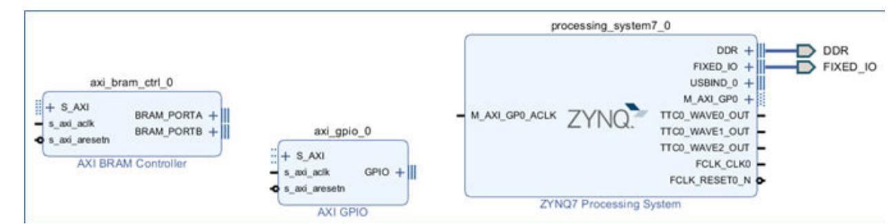

### **Use Designer Assistance**

Designer Assistance helps connect the AXI GPIO and AXI block RAM Controller to the Zynq-7000 SoC PS.

- 1. Click **Run Connection Automation** as shown in the following figure.
The Run Connection Automation dialog box opens.

- 2. Select the **All Automation (5 out of 5 selected)** check box, as shown in the following figure.
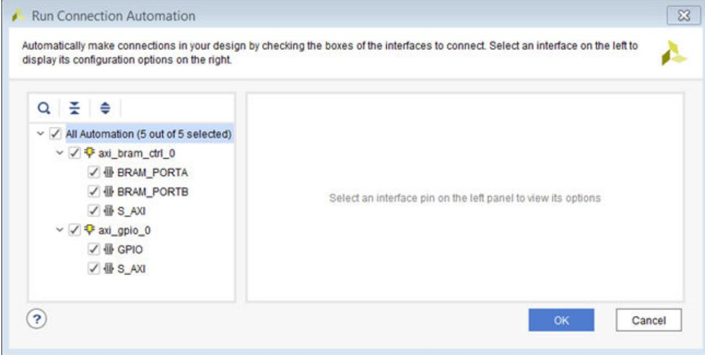


As you select each interface for which connection automation is to be run, the description and options available for that interface appear in the right pane.

- 3. Click the S_AXI interface of the axi_bram_ctrl_0, and ensure that its Clock Connection (for unconnected clks) field is set to the default value of Auto.
This value selects the default clock, FCLK_CLK0, generated by the PS7 for this interface.

- 4. For the GPIO interface of the axi_gpio_0 instance, select **leds_4bits** from the Select Board part Interface drop down list.

- 5. For the S_AXI interface of axi_gpio_0 instance, leave the Clock Connection (for unconnected clks) field to Auto.

- 6. Click **OK**.


The IP integrator subsystem looks like the following figure. The relative positions of the IP might differ slightly.

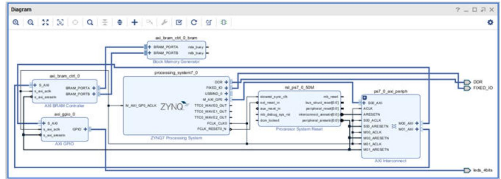

- 7. Click the Address Editor window and expand the processing_system7_0 hierarchy to show the memory-map of the IP in the design.
In this case, there are two IPs: the AXI GPIO and the AXI block RAM Controller. The IP integrator assigns the memory maps for these IP automatically. You can change them if necessary.

- 8. Change the range of the axi_bram_ctrl_0 to 64K, as shown in the following figure.

- 9. Click the Diagram window to go back to the block design.
- 10. Click the Regenerate Layout button to regenerate an optimal layout of the block design.

<span id="page-15-0"/>

### **Step 3: Debugging the Block Design**

You now add hooks in the design to debug nets of interest.

- 1. To debug the master/slave interface between the AXI Interconnect IP (ps7_0_axi_periph) and the GPIO core (axi_gpio_0), in the Diagram view, select the interface, then right-click and select **Debug**.
In the Block Design canvas on the net that you selected in the previous step, a small bug icon

 appears, indicating that the net has been marked for debug. You can also see this in the Design Hierarchy view, as displayed in the following figure, on the interface that you chose to mark for debug.

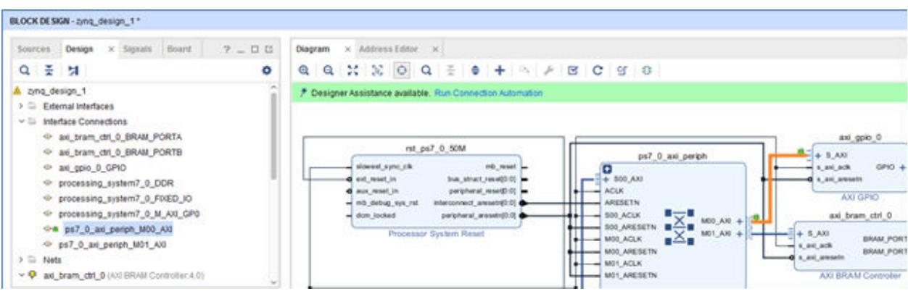

When a net is marked for debug, the Designer Assistance link in the banner of the block design canvas becomes active.

#### 2. Click **Run Connection Automation**.

The All Automation is selected by default with the various options for AXI Read/Write signals set, as shown in the following figure.


#### 3. Click **OK**.

A System ILA IP is instantiated on the block design which is appropriately configured to debug the AXI Interface marked for debug. The net marked for debug is connected to this System ILA IP and an appropriate clock source is connected to the clk pin of the System ILA IP. The clock source is the same clock domain to which the interface signal belongs.

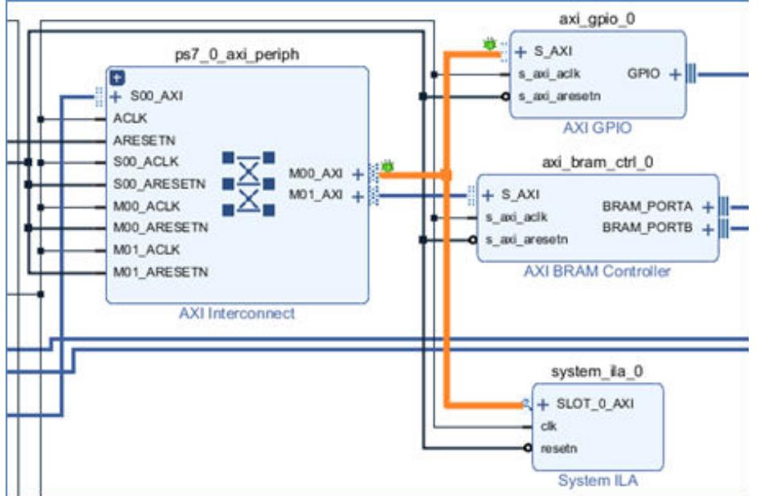

- 4. From the toolbar, to run Design-Rules-Check (DRC), click the Validate Design button . Alternatively, you can do the same from the menu by:
<span id="page-17-0"/>

- Selecting **Tools → Validate Design** from the menu.
- Right-clicking in the Diagram window and selecting **Validate Design**.

The Validate Design dialog box opens to notify you that there are no errors or critical warnings in the design.

The Tcl Console shows the following warning.

```
WARNING: [BD 41-1781] Updates have been made to one or more nets/
interface connections marked for debug. Debug nets, which are already 
connected to System ILA IP core in the block-design, will be 
automatically available for debug in Hardware Manager. For unconnected 
Debug nets, please open synthesized design and use 'Set Up Debug' wizard 
to insert, modify or delete Debug Cores. Failure to do so could result 
in critical warnings and errors in the implementation flow.
```
Block designs can use the instantiation flow, where a System ILA or ILA IP is instantiated in the block design, or they can use the netlist insertion flow, where nets are only marked for debug but the debug core is inserted post-synthesis. This warning message can be ignored if the instantiation flow is being used (as in this lab).

- 5. Click **OK**.
- 6. From the Vivado menu, select **File → Save Block Design**

Alternatively, you can press **Ctrl + S** to save your block design or click the **Save** button in the Vivado toolbar.

### **Step 4: Generate HDL Design Files**

You now generate the HDL files for the design.

- 1. In the Sources window, right-click the top-level subsystem design and select **Generate Output Products**. This generates the source files for the IP used in the block design and the relevant constraints file.
You can also click **Generate Block Design** in the Flow Navigator to generate the output products.

The Generate Output Products dialog box opens, as shown in the following figure.


- 2. Leave all the settings to their default values. Click **Generate**.
- 3. The Generate Output Products dialog box opens informing that Out-of-context runs were launched.
- 4. Click **OK**.

Out-of-context runs can take a few minutes to finish. You can see the status of the runs by clicking on the Design Runs window at the bottom of the Vivado IDE.

- 5. After the out-of-context runs are finished, in the Sources window, right-click the top-level subsystem, **zynq_design_1**, and select **Create HDL Wrapper** to create an top level HDL file that instantiates the block design.
The Create HDL Wrapper dialog box opens, as shown in the following figure, and presents you with two options:

- The first option is to copy the wrapper to allow edits to the generated HDL file.
- The second option is to create a read-only wrapper file, which will be automatically generated and updated by Vivado.


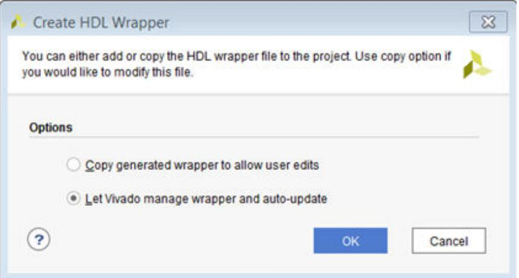

- 6. Select the default option of **Let Vivado manage wrapper and auto-update**.
- 7. Click **OK**.

After the wrapper has been created, the Sources window looks as follows.

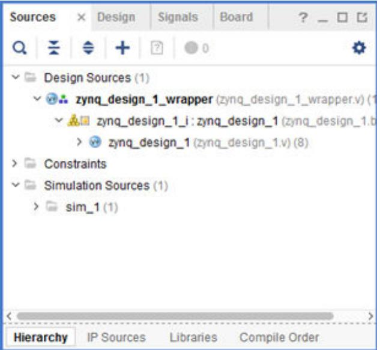


<span id="page-20-0"/>

### **Step 5: Implement Design and Generate Bitstream**

- 1. In **Flow Navigator → Program and Debug**, click **Generate Bitstream** to implement the design and generate a BIT file.
The No Implementation Results Available dialog box opens.

- 2. Click **Yes**.
The Launch Runs dialog box opens. Here you can select various options such as the Number of Jobs, the host where the Runs are launched etc.

- 3. Click **OK**.
This will launch synthesis, implementation ,and generate the bitstream which could take a few minutes.

After the bitstream generates, the Bitstream Generation Completed dialog box opens, as shown in the following figure. **Open Implemented Design** should be checked by default.

- 4. Click **OK**.
- 5. When the implemented design opens, look at the **Design Timing Summary** window to ensure that all timing constraints are met.

<span id="page-21-0"/>

### **Step 6: Export Hardware to the Vitis software platform**

**IMPORTANT!** *For the Digilent driver to install, you must power on and connect the board to the host PC before launching the Vitis software platform.*

- 1. From the Vivado File menu, select **File → Export → Export Hardware**.
The Export Hardware dialog box opens.

- 2. Check the Platform type **Fixed** radio button and click **Next**.

- 3. Select the **Include bitstream** option using the radio button in the Output view and click **Next**.


- 4. Leave the XSA file name field at its default value and click **Next**.

- 5. Click **Finish**. This will export the hardware XSA File in the lab1 project directory.


- 6. To launch the Vitis software platform, select **Tools → Launch Vitis IDE**.
The Eclipse Launcher dialog box opens.

- 7. Specify the desired Workspace location such as C:\UG940\lab1_vitis and click **Launch**.


<span id="page-24-0"/>

### **Step 7: Create a Software Application**

The Vitis software platform launches in a separate window.

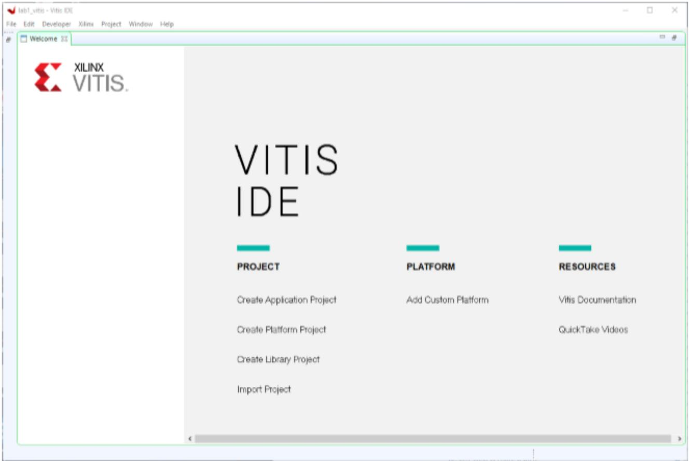

- 1. Close the Welcome screen if it appears.
- 2. Select **File → New → Application Project** or under **Project** click **Create Application Project**. The New Application Project dialog box opens.


- 3. Select the **Skip welcome page next time** check box if you do not want the welcome to appear when the Vitis software platform is launched again.
- 4. Click **Next**.
- 5. In the Platform page, select the **Create a new platform from hardware (XSA)** tab.


- 6. Click **Browse** to open The Create Platform from XSA window. Navigate to the directory where the XSA file was created in Vivado and click **Open**.

- 7. Ensure the **Generate boot Components** option is selected in the Platform page.


- 8. Click **Next**.
- 9. In the Application project name field, type the name desired, such as Zynq_Design. Leave all other fields to their default values, and click **Next**.

10. In the Domain page leave all the fields at their default values and click **Next**.


- 11. In the Templates page, select **Peripheral Tests**.


#### 12. Click **Finish**.

- 13. The application project is created in the Vitis software platform. Click the hammer icon to build the application.
When the application project finishes compiling, you will see the following in the Console window.


<span id="page-30-0"/>

### **Step 8: Run the Software Application**

Now, run the peripheral test application on the ZC702 board. To do so, you need to configure the JTAG port.

- 1. Ensure that your hardware is powered on and a Digilent Cable or the USB Platform Cable is connected to the host PC. Also, ensure that you have a USB cable connected to the UART port of the ZC702 board.
- 2. Download the bitstream into the FPGA by selecting **Xilinx → Program FPGA**.

The Program FPGA dialog box opens and points to the bitstream

zynq_design_1_wrapper.bit which was included as a part of the XSA.

- 3. Ensure that the Bitstream field shows the bitstream file that you created in Step 5, and then click **Program**.
*Note***:** The DONE LED on the board turns green if the programming is successful. You should also see an INFO message suggesting that the FPGA was configured successfully in the Vitis software platform Log window.

- 4. In the Explorer, select and right-click the **Zynq_Design** application.


- 5. Select **Debug As → Debug Configurations**.
- 6. In the **Debug Configurations** dialog box, right-click **Single Application Debug**, and select **New Configuration** as shown.

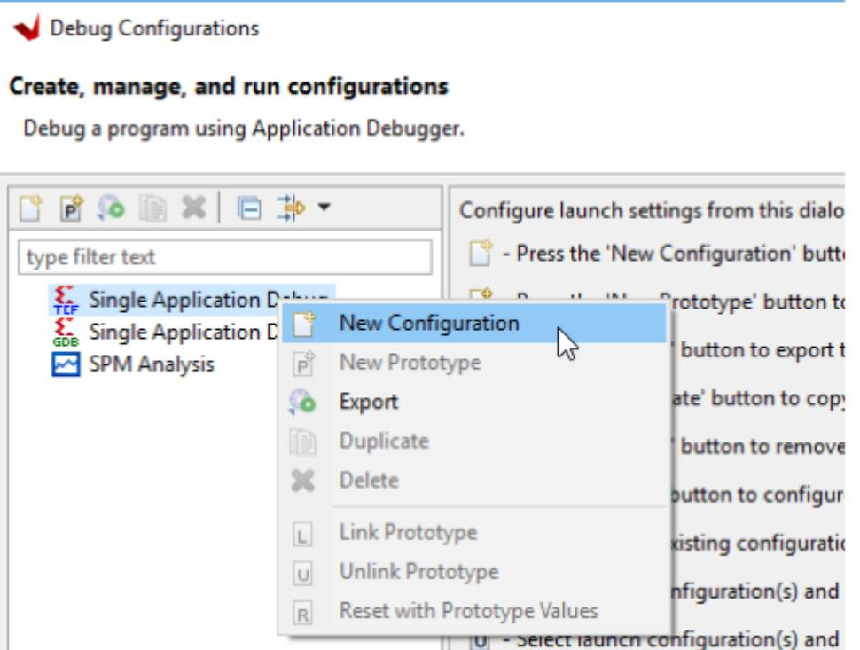

- 7. The Create, manage and run configurations page opens. Click **Debug**, as shown in the following figure.

- 8. The Debug perspective window opens.


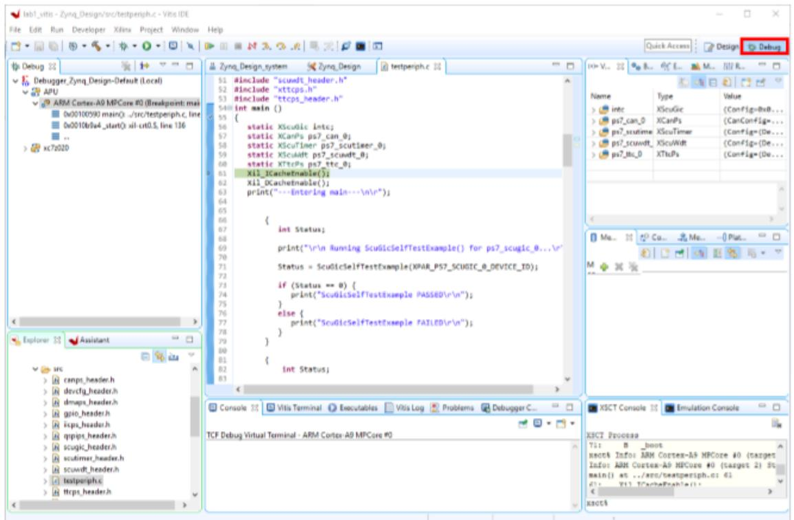

- 9. Set the terminal by selecting the **Vitis Terminal** tab and clicking the **+** button.
- 10. Use the settings shown in the following figure or the ZC702 board. The as shown in the following figure.COM Port might be different on your machine.Use the settings shown in the following figure or the ZC702 board. The


#### 11. Click **OK**.

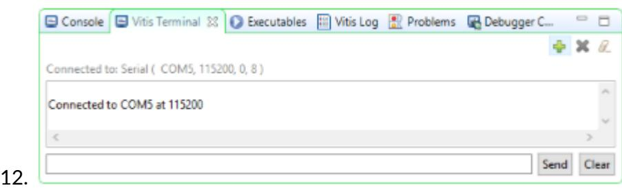

- 13. Verify the terminal connection by checking the status at the top of the tabIn the Debug tab, expand the tree to see the processor core on which the program is running, as shown in the following figure.
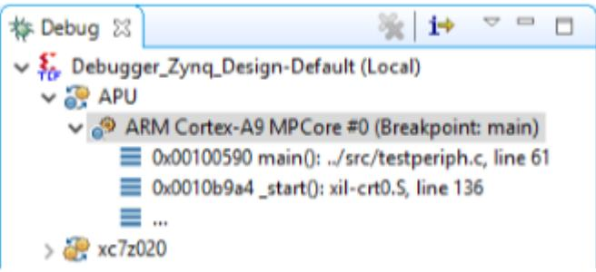

<span id="page-34-0"/>

- 14. If testperiph.c is not already open, select ../src/testperiph.c, double-click it to open that location.
### **Add a Breakpoint**

Next, add a breakpoint after the "if" statement.

- 1. Double-click in the blue bar to the left of line 103 to add a breakpoint on that line of source code, as shown in the following figure:
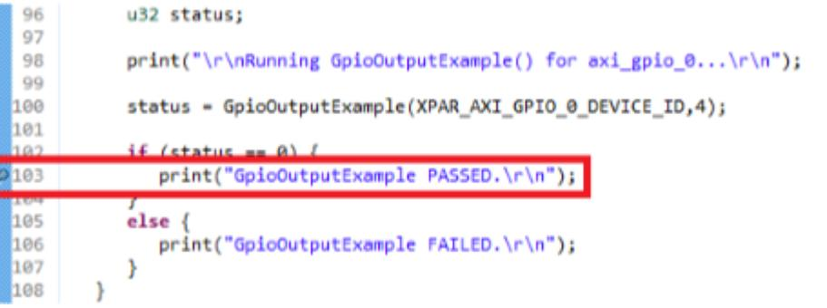

*Note***:** Sometimes the line number varies, so enter the breakpoint where appropriate.

### **Step 9: Connect to the Vivado Logic Analyzer**

- 1. Go back to the Vivado session and from the Program and Debug drop-down list in the **Flow Navigator → Program and Debug**, click **Open Hardware Manager**.
- 2. In the Hardware Manager window, click **Open target**, and select **Open New Target** to open a connection to the Digilent JTAG cable for ZC702, as shown in the following figure.

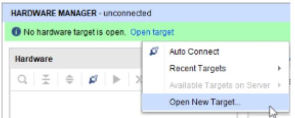

The Open New Hardware Target dialog box opens.

- 3. Click **Next**.
- 4. Select the appropriate options from the drop down menu for Connect to option. Click **Next** on the Hardware Server Settings page.
- 5. The hardware server should be able to identify the hardware target. Click **Next** on the Select Hardware Target page.
- 6. Click **Finish** in the Open Hardware Target Summary page.


When the Vivado hardware session successfully connects to the ZC702 board, the Hardware window shows the following information.

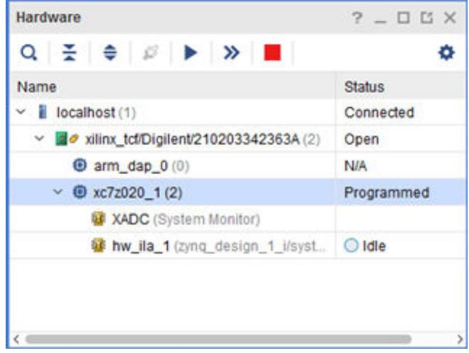

- 7. First, ensure that the ILA core is active and capturing data. To do this, select the Status tab of the hw_ila_1 in the Hardware Manager.
- 8. Click the **Run Trigger Immediate** button on the hw_ila_1 window.

Expand some of the Signal Groups by clicking the drop-down to see Static data from the System ILA core in the waveform window as shown in the following figure.


- 9. Set up a condition that triggers when the application code writes to the GPIO peripheral. To do this:
	- a. From the menu select **Window → Debug Probes**.
	- b. Select, drag, and drop the slot_0:axi_smc_M01_AXI:AWVALID signal from the Debug Probes window into the Trigger Setup window.

- c. Click the **Value** column of the *WVALID row, as shown in the following figure.


- d. Change the value from **X** to a **1**, from the drop down menu.
10. In the Waveform window or the Status window, arm the ILA core by clicking the Run Trigger

button .

- 11. Notice that the Status window of the hw_ila_1 ILA core changes from:
	- Idle to Waiting for Trigger.
	- The Hardware window shows the Core Status as Waiting for Trigger, as shown in the following figure.

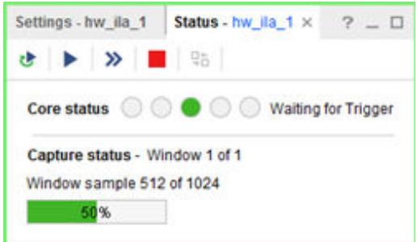

- 12. Go back to the Vitis software platform and continue to execute code. To do so, click the **Resume** button on the toolbar.
Alternatively, you can press **F8** to resume code execution.

The code execution stops at the breakpoint you set. By this time, at least one write operation has been done to the GPIO peripheral. These write operations cause the AWVALID signal to go from 0 to 1, thereby triggering the ILA core.

*Note***:** The trigger mark occurs at the first occurrence of the AWVALID signal going to a 1, as shown in the following figure.

<span id="page-38-0"/>

13. If you are proceeding to Lab 2, close your project by selecting **File → Close Project**.

You can also close the Vitis software platform window by selecting **File → Exit**.

### **Conclusion**

This lab introduced you to creating a Zynq-based design in IP integrator, working with the System ILA IP to debug nets of interest, software development in the Vitis software platform and executing the code on the Zynq-7000 SoC processor.

This lab also introduced you to the Vivado Logic Analyzer and analyzing the nets that were marked for debug and cross-probing between hardware and software.

In this lab, you:

- Created a Vivado project that includes a Zynq-7000 SoC processor design using the IP integrator.
- Instantiated IP in the IP integrator and made the necessary connections using the Designer Assistance feature.
- Marked and connected nets for debug using the System ILA IP, to analyze them in the Vivado Integrated Logic Analyzer.
- Synthesized, implemented, and generated the bitstream before exporting the hardware definition (XSA) to the Vitis software platform.
- Created a software application in the Vitis software platform and ran it on the target hardware, ZC702. By setting breakpoint in the application code, triggered the ILA in Vivado, thereby, demonstrating the hardware/software cross-probing ability.

<span id="page-39-0"/>

### **Lab Files**

You can use the Tcl file lab1.tcl that is included with this tutorial design files to perform all the steps in this lab. This Tcl file only covers the Vivado portion of the design creation through bitstream generation. Subsequent steps from Step 7 and beyond must be performed manually as the intent is to demonstrate the cross-probing between hardware and software.

To use the Tcl script, launch Vivado and type source lab1.tcl in the Tcl console.

Alternatively, you can also run the script in the batch mode by typing Vivado -mode batch source lab1.tcl at the command prompt.

*Note***:** You must modify the project path in thelab1.tcl file to source the Tcl files correctly.


<span id="page-40-0"/>

*Lab 2*

## Zynq-7000 SoC Cross-Trigger Design

### **Introduction**

In this lab, you use the cross-trigger functionality between the Zynq®-7000 SoC processor and the fabric logic. Cross-triggering is a powerful feature that you can use to simultaneously debug software in the Vitis software platform that is running in real time on the target hardware. This tutorial guides you from design creation in IP integrator, to marking the nets for debug and manipulating the design to stitch up the cross-trigger functionality.

### **Step 1: Start the Vivado IDE and Create a Project**

- 1. Start the Vivado IDE by double-clicking the Vivado desktop icon or by typing vivado at a command prompt.
- 2. From the Quick Start page, select **Create Project**.
- 3. In the New Project wizard, use the following settings:
	- a. In the Project Name page, type the project name and location.
	- b. Make sure that the **Create project subdirectory** check box is checked. Click **Next**.
	- c. In the Project Type page, select **RTL project**. Ensure that the **Do not specify sources at this time** check box is cleared. Click **Next**.
	- d. In the Add Sources page, set the Target language to either **VHDL** or **Verilog**. You can leave the Simulator language selection to **Mixed**. Click **Next**.
	- e. In Add Constraints page, click **Next**.
	- f. In the Default Part page, select **Boards** and choose **ZYNQ-7 ZC702 Evaluation Board** that matches the version of hardware that you have. Click **Next**.

<span id="page-41-0"/>

- g. Review the project summary in the New Project Summary page and click **Finish** to create the project.
### **Step 2: Create an IP Integrator Design**

- 1. In Vivado Flow Navigator, click **Create Block Design**.
- 2. In the Create Block Design dialog box, specify zynq_processor_system as the name of the block design.
- 3. Leave the **Directory** field set to its default value of <Local to Project> and the Specify source set field to Design Sources.
- 4. Click **OK**.

The IP integrator diagram window opens.

- 5. Click the Add IP icon in the block design canvas, as shown in the following figure.
The IP catalog opens.

- 6. In the Search field, type Zynq, select the **ZYNQ7 Processing System IP**, and press Enter.
Alternatively, double-click the **ZYNQ7 Processing System IP** to instantiate it as shown in the following figure.

- 7. In the block design banner, click **Run Block Automation** as shown in the following figure.
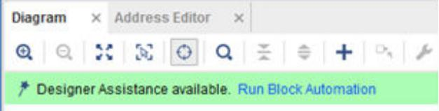


The Run Block Automation dialog box states that the FIXED_IO and the DDR pins on the ZYNQ7 Processing System 7 IP will be connected to external interface ports. Also, because you chose the ZC702 board as your target board, the **Apply Board Preset** check box is selected by default.

- 8. Enable the Cross Trigger In and Cross Trigger Out functionality by setting those fields to **Enable**, then click **OK**, as shown in the following figure.

This enables the TRIGGER_IN_0 and TRIGGER_OUT_0 interfaces in the ZYNQ7 Processing System as show in the following figure.

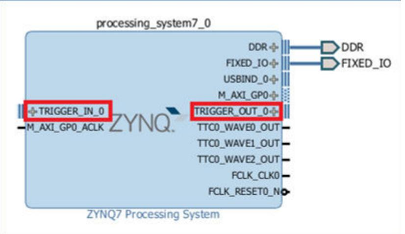


- 9. Add the AXI GPIO and AXI block RAM Controller to the design by right-clicking anywhere in the diagram and selecting **Add IP**.
The diagram area looks like the following figure.

- 10. Click the **Run Connection Automation** link at the top of the Diagram window.
The Run Connection Automation dialog box opens.

- 11. Select the **All Automation (7 out of 7 selected)** check box. This selects connection automation for all the interfaces in the design. Select each automation to see the available options for that automation in the right pane.
- 12. Make each of the following connections using the Run Connection Automation function.

| Connection                         | More Information                                                                                                                                                                                                                                                                                                                                                                                                                                                                     | Setting                                                                                  |
|------------------------------------|--------------------------------------------------------------------------------------------------------------------------------------------------------------------------------------------------------------------------------------------------------------------------------------------------------------------------------------------------------------------------------------------------------------------------------------------------------------------------------------|------------------------------------------------------------------------------------------|
| axi_bram_ctrl_0<br>•<br>BRAM_PORTA | The Run Connection Automation<br>dialog box informs you that a new<br>Block Memory Generator IP will be<br>instantiated and connected to the AXI<br>block RAM Controller PORTA                                                                                                                                                                                                                                                                                                       | No options.                                                                              |
| axi_bram_ctrl_0<br>•<br>BRAM_PORTB | Note that the Run Connection<br>Automation dialog box offers two<br>choices now. The first one is to use<br>the existing Block Memory Generator<br>from the previous step or you can<br>chose to instantiate a new Block<br>Memory Generator if desired.<br>In this case, use the existing BMG.                                                                                                                                                                                      | Leave the Blk_Mem_Gen field set to<br>its default value of Blk_Mem_Gen of<br>BRAM_PORTA. |
| axi_bram_ctrl_0<br>•<br>S_AXI      | The Run Connection Automation<br>dialog box states that the S_AXI port<br>of the AXI block RAM Controller will<br>be connected to the M_AXI_GP0 port<br>of the ZYNQ7 Processing System IP.<br>The AXI block RAM Controller needs<br>to be connected to a Block Memory<br>Generator block. The connection<br>automation feature offers this<br>automation by instantiating the Block<br>Memory Generator IP and making<br>appropriate connections to the AXI<br>block RAM Controller. | Leave the Clock Connection (for<br>unconnected clks) field set to Auto.                  |


| Connection                                                      | More Information                                                                                                                                                                                                                                                     | Setting                                                                                                 |  |
|-----------------------------------------------------------------|----------------------------------------------------------------------------------------------------------------------------------------------------------------------------------------------------------------------------------------------------------------------|---------------------------------------------------------------------------------------------------------|--|
| axi_gpio_0<br>•<br>GPIO                                         | The Run Connection Automation<br>dialog box shows the interfaces that<br>are available on the ZC702 board to<br>connect to the GPIO.                                                                                                                                 | Select LEDs_4Bits.                                                                                      |  |
| axi_gpio_0<br>•<br>S_AXI                                        | The Run Connection Automation<br>dialog box states that the S_AXI pin<br>of the GPIO IP will be connected to<br>the M_AXI_GP0 pin of the ZYNQ7<br>Processing System. It also offers a<br>choice for different clock sources that<br>might be relevant to the design. | Leave the Clock Connection (for<br>unconnected clks) field set to Auto.                                 |  |
| processing_system7_0<br>•<br>TRIGGER_IN_0<br>•<br>TRIGGER_OUT_0 | The Run Connection Automation<br>dialog box states that the<br>TRIGGER_IN_0 and TRIGGER_OUT_0<br>pins will be connected to the<br>respective cross-trigger pins on the<br>System ILA IP.                                                                             | Leave the ILA option to its default<br>value of Auto for both TRIGGER_IN_0<br>and TRIGGER_OUT_0 option. |  |

Click **OK**. When these connections are complete, the IP integrator design looks like the following figure.

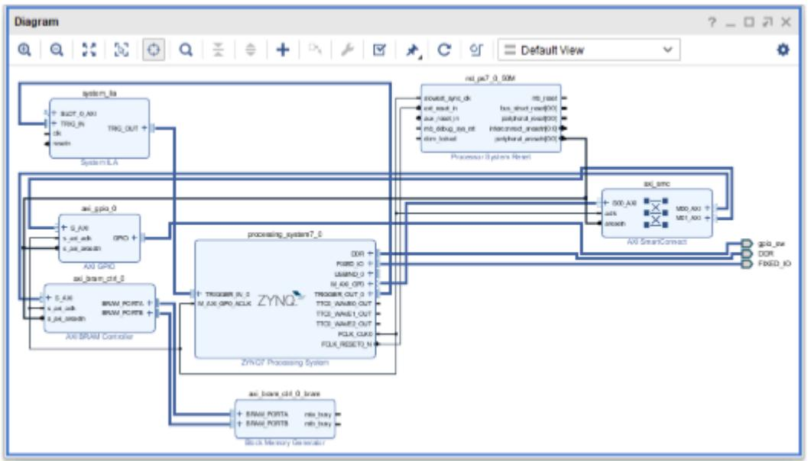

- 13. Click the Address Editor window of the design to ensure that addresses for the memorymapped slaves have been assigned properly. Expand **Data**. Change the range of the AXI block RAM Controller to **64K**, as shown below.


### **Mark Nets for Debugging**

Next, you mark some nets for debugging.

- 1. Click the Diagram window again, and select the net connecting the GPIO pin of the AXI GPIO IP to the LEDs_4Bits port.
- 2. Right-click in the block diagram area, and select **Debug**. This marks the net for debug.

Notice that a bug symbol appears on the net to be debugged. You can also see this bug symbol in the Design Hierarchy window on the selected net.

- 3. Similarly, select the net connecting the interface pin S_AXI of axi_gpio_0 and the M00_AXI interface pin of axi_smc instance.
- 4. Right-click in the block design and select **Debug** from the context menu.

*Note***:** When you mark a net for debugging, the Designer Assistance link at the top of the block design canvas banner becomes active.

- 5. Click **Run Connection Automation**.
- 6. In the Run Connection Automation dialog box, click the **All Automation (2 out of 2 selected)** check box.

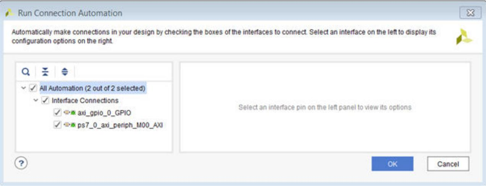


#### 7. Click **OK**.

- 8. Click the Regenerate Layout button to generate an optimal layout of the design. The design should look like the following figure.


- 9. Click the **Validate Design** button to run Design Rule Checks on the design.
After design validation is complete, the Validate Design dialog box opens to verify that there are no errors or critical warnings in the design.

- 10. Click **OK**.
- 11. To save the IP integrator design, select **File → Save Block Design**.

Alternatively, press **Ctrl + S** to save the design.

- 12. In the Sources window, right-click the block design, **zynq_processor_system**, and select **Generate Output Products**.
The Generate Output Products dialog box opens.


#### 13. Click **Generate**.

The Generate Output Products dialog box informs you that out-of-context (OOC) module runs were launched.

- 14. Click **OK** on the Generate Output Products dialog box.
- 15. Wait until all OOC Module runs have finished running. This could take a few minutes.

<span id="page-48-0"/>

- 16. In the Sources window, right-click **zynq_processor_system**, and select **Create HDL Wrapper**.
The Create HDL Wrapper dialog box offers two choices:

- The first choice is to generate a wrapper file that you can edit.
- The second choice is let Vivado generate and manage the wrapper file, meaning it is a read-only file.
- 17. Keep the default setting, shown in the following figure, and click **OK**.

### **Step 3: Implement Design and Generate Bitstream**

Now that the cross-trigger signals have been connected to the ILA for monitoring, you can complete the rest of the flow.

- 1. Click **Generate Bitstream** to generate the bitstream for the design.
The No Implementation Results Available dialog box opens with a message asking whether it is okay to launch synthesis and implementation.

- 2. Click **Yes**.
The Launch Runs dialog box opens.

- 3. Make the appropriate selections and click **OK**.
When the bitstream generation completes, the Bitstream Generation Completed dialog box opens, with the option, Open Implemented Design option checked by default.

- 4. Click **OK** to open the implemented design.
- 5. Ensure that all timing constraints are met by looking at the Design Timing Summary tab, as shown in the following figure.

<span id="page-49-0"/>

*Note***:** The timing could be slightly different in your case.

### **Step 4: Export Hardware to the Vitis software platform**


**IMPORTANT!** *For the Digilent driver to install, you must power on and connect the board to the host PC before launching the Vitis software platform.*

After you generate the bitstream, you must export the hardware to the Vitis software platform and generate your software application.

- 1. From the Vivado File menu, select **File → Export → Export Hardware**.
The Export Hardware dialog box opens.

- 2. Check the Platform type **Fixed** radio button and click **Next**


- 3. Select the **Include bitstream** option using the radio button in the Output view and click **Next**.

- 4. Leave the XSA file name field at its default value and click **Next**.


- 5. Click **Finish**. This will export the hardware XSA File in the lab1 project directory.
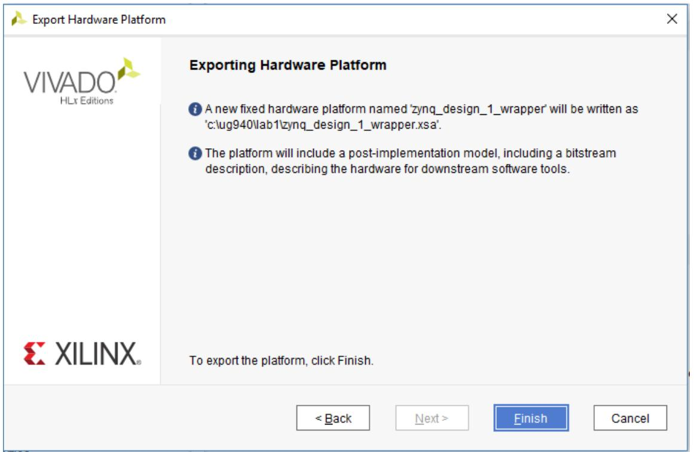

- 6. To launch the Vitis software platform, select **Tools → Launch Vitis IDE**.
- 7. Specify the desired Workspace location such as C:\UG940\lab2_vitis and click **Launch**.

<span id="page-52-0"/>

### **Step 5: Build Application Code in the Vitis Software Platform**

The Vitis software platform launches in a separate window.

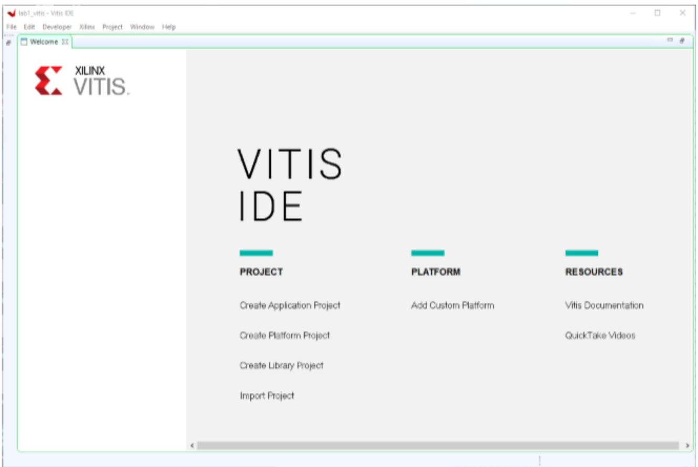

- 1. Close the Welcome screen if it appears.
- 2. Select **File → New → Application Project** or under **Project** click **Create Application Project**. The New Application Project dialog box opens.


- 3. Select the **Skip welcome page next time** check box if you do not want the welcome to appear when the Vitis software platform is launched again.
- 4. Click **Next**.
- 5. In the Platform page, select the **Create a new platform from hardware (XSA)** tab.


- 6. Click **Browse** to open The Create Platform from XSA window. Navigate to the directory where the XSA file was created in Vivado and click **Open**.

- 7. Ensure the **Generate boot Components** option is selected in the Platform page.


#### 8. Click **Next**.

- 9. In the Domain page leave all the fields at their default values and click **Next**.
- 10. In the Application project name field, type the name desired, such as peri_test. Leave all other fields to their default values, and click **Next**.


- 11. In the Domain page leave all the fields at their default values and click **Next**.


- 12. In the Templates page, select **Peripheral Tests**.


#### 13. Click **Finish**.

- 14. The application project is created in the Vitis software platform. Click the hammer icon to build the application.
When the application project finishes compiling, you see the following in the Console window.

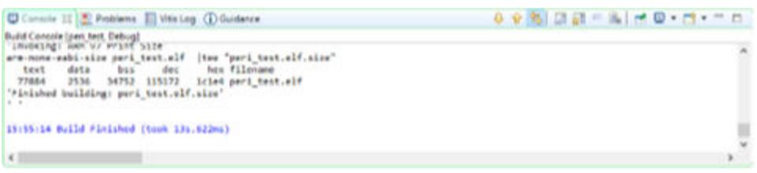

- 15. Ensure that you have connected the target board to the host computer and it is turned on.
- 16. Select and right-click the peri_test application in the Project Explorer, and select **Debug As →  Debug Configurations**.

The Debug Configurations dialog box opens.

- 17. Right-click **Single Application Debug**, and select **New Configuration**.


- 18. In the **Create, manage, and run configurations** page, select the **Target Setup** tab, and select the **Enable Cross triggering** check box.

- 19. Click the **Browse** button for Enable Cross-Triggering option.
The Cross Trigger Breakpoints dialog box opens.

- 20. Click **Create**.
- 21. In the Create Cross Trigger Breakpoint page, select the options as shown in the following figure.


- 22. Click **OK**. This sets up the cross trigger condition for Processor to Fabric.
- 23. In the Cross Trigger Breakpoints dialog box, click **Create**, as shown in the following figure.

- 24. In the Create Cross Trigger Breakpoint page, select the options as shown in the following figure.


- 25. Click **OK**. This sets up the cross trigger condition for Fabric to Processor.
26. In the Cross Trigger Breakpoints Dialog box, click **OK**.

- 27. In the Debug Configurations dialog box, click **Debug**, as shown at the bottom of the following figure.


#### 28. The Debug Perspective Window opens.

- 29. Set the terminal by selecting the **Vitis Terminal** tab, and then click the (+) icon.


- 30. Select following settings in the following figure for the ZC70 board, and click **OK**.

- 31. Verify the terminal connection by checking the status at the top of the Vitis Terminal tab as shown in the following figure.
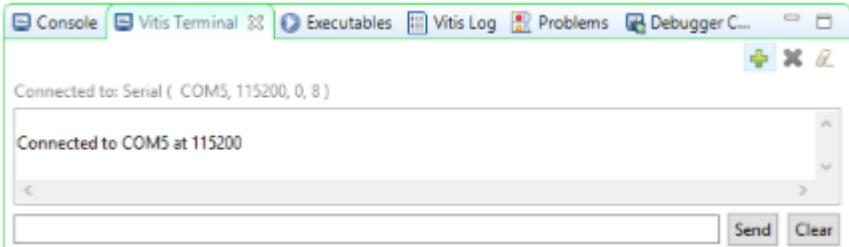

- 32. If it is not already open, select **../src/testperiph.c**, and double click to open the source file.
	- a. Modify the source file by inserting a while statement at approximately line 94.
	- b. After the else statement, add while(1) above in front of the curly brace as shown in the following figure.

<span id="page-64-0"/>

- 33. Add a breakpoint in the code so that the processor stops code execution when the breakpoint is encountered.
	- a. Scroll down to the line after the "while" statement starts, and double-click the left pane on line 103, which adds a breakpoint on that line of code, as it appears in the following figure.

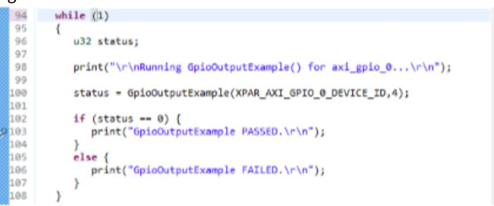

- b. Click **Ctrl + S** to save the file. Alternatively, you can select **File → Save**.
- 34. Click on the hammer icon again to rebuild the application with the changes made to the code.

Now you are ready to execute the code from the Vitis software platform.

### **Step 6: Connect to Vivado Logic Analyzer**

Connect to the ZC702 board using the Vivado Logic Analyzer.

- 1. In the Vivado IDE session, from the Program and Debug drop-down list of the Vivado Flow Navigator, select **Open Hardware Manager**.
- 2. In the Hardware Manager window, click **Open target → Open New Target**.


*Note***:** You can also use the Auto Connect option to connect to the target hardware.

The Open New Hardware Target wizard opens, shown in the following figure.

- 3. Click **Next**.

- 4. On the Hardware Server Settings page, ensure that the Connect to field is set to **Local server (target is on local machine)** as shown in the following figure, and click **Next**.


- 5. On the Select Hardware Target page, click **Next**.

- 6. Ensure that all the settings are correct on the Open Hardware Target Summary page, as shown in the following figure, and click **Finish**.
<span id="page-67-0"/>

### **Step 7: Set the Processor to Fabric Cross Trigger**

When the Vivado Hardware Session successfully connects to the ZC702 board, you see the information shown in the following figure.

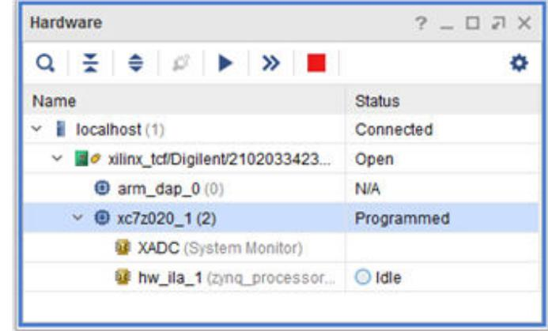

- 1. Select the **ILA hw_ila_1** tab, and set the Trigger Mode Settings as follows:
	- Set Trigger mode to TRIG_IN_ONLY
	- Set TRIG_OUT mode to TRIG_IN_ONLY
	- Under Capture Mode Settings, ensure Trigger position in window is set to **512**.


- 2. Arm the ILA core by clicking the **Run Trigger** button .
This arms the ILA and you should see the status "Waiting for Trigger" as shown in the following figure.

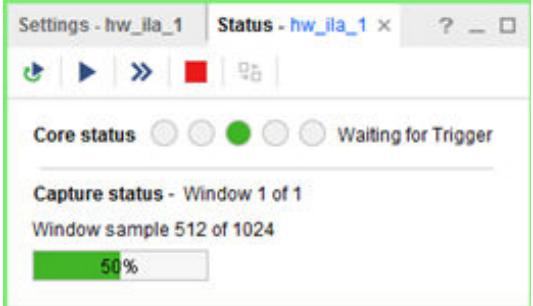

- 3. In the Vitis software platform Debug window, click the **Resume** button in the toolbar, until the code execution reaches the breakpoint set on line 103 in the testperiph.c file.
- 4. As the code hits the breakpoint, the processor sends a trigger to the ILA. The ILA has been set to trigger when it sees the trigger event from the processor. The waveform window displays the state of various signals as seen in the following figure.

<span id="page-69-0"/>

This demonstrates that when the breakpoint is encountered during code execution, the PS7 triggers the ILA that is set up to trigger. The state of a particular signal when the breakpoint is encountered can be monitored in this fashion.

### **Step 8: Set the Fabric to Processor Cross-Trigger**

Now try the fabric to processor side of the cross-trigger mechanism. To do this remove the breakpoint that you set earlier on line 103 to have the ILA trigger the processor and stop code execution.

- 1. In the Vitis software platform, select the Breakpoints tab towards the top right corner of the window, right-click it, and clear the **testperiph.c [line: 103]** check box. This removes the breakpoint that you set up earlier.
*Note***:** Alternatively, you can select the breakpoint in line 103 of the testperiph.c file, right click and select **Disable Breakpoint**.

- 2. In the Debug window, click the **Resume**
You can see the code executing in the Terminal Window. icon on the toolbar. The code runs continuously because it has an infinite loop.

- 3. In Vivado, select the **Settings hw_ila_1** tab. Change the Trigger Mode to **BASIC_OR_TRIG_IN** and the TRIG_OUT mode to **TRIGGER_OR_TRIG_IN**.
- 4. Click on the + sign in the Trigger Setup window to add the slot_0:axi_smc_M01_AXI:AWVALID signal from the Add Probes window.
- 5. In the Basic Trigger Setup window, ensure that the Radix is set to [B] Binary, and change the Value for the slot_0:ps7_0_axi_periph_M00_AXI:AWVALID signal to 1. This essentially sets up the ILA to trigger when the awvalid transitions to a value of 1.
- 6. Click the Run Trigger button to "arm" the ILA. It triggers immediately as the Vitis code is running AXI transactions which causes the awvalid signal to toggle. This causes the trigger_out of the ILA to toggle which eventually will halt the processor from executing the code.

<span id="page-70-0"/>

This is seen in the Vitis software platform in the highlighted area of the debug window.

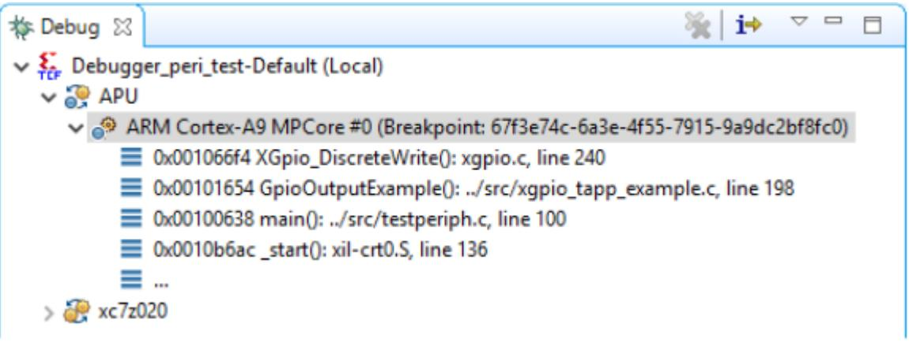

### **Conclusion**

This lab demonstrated how cross triggering works in a Zynq-7000 SoC processor based design. You can use cross triggering to co-debug hardware and software in an integrated environment.

### **Lab Files**

This tutorial demonstrates the cross-trigger feature of the Zynq-7000 SoC processor, which you perform in the GUI environment. Therefore, the only Tcl file provided is lab2.tcl.

The lab2.tcl file helps you run all the steps all the way to exporting hardware for the Vitis software platform.

The debug portion of the lab must be carried out in the GUI; no Tcl files are provided for that purpose.

<span id="page-71-0"/>

*Lab 3*

## Programming an Embedded MicroBlaze Processor

### **Introduction**

In this tutorial, you create a simple MicroBlaze™ system for a Kintex®-7 FPGA using Vivado® IP integrator.

The MicroBlaze system includes native Xilinx® IP including:

- MicroBlaze processor
- AXI block RAM
- Double Data Rate 3 (DDR3) memory
- UARTLite
- GPIO
- Debug Module (MDM)
- Proc Sys Reset
- Local memory bus (LMB)

Parts of the block design are constructed using the Platform Board Flow feature.

This lab also shows the cross-trigger capability of the MicroBlaze processor.

The feature is demonstrated using a software application code developed in the Vitis software platform in a stand-alone application mode.

This lab targets the Xilinx KC705 FPGA Evaluation Board.

<span id="page-72-0"/>

### **Step 1: Start the Vivado IDE and Create a Project**

- 1. Start the Vivado IDE by clicking the Vivado desktop icon or by typing vivado at a command prompt.
- 2. From the Quick Start page, select **Create Project**.
- 3. In the New Project dialog box, use the following settings:
	- a. In the Project Name dialog box, type the project name and location.
	- b. Make sure that the **Create project subdirectory** check box is selected. Click **Next**.
	- c. In the Project Type dialog box, select **RTL project**. Ensure that the **Do not specify sources at this time** check box is cleared. Click **Next**.
	- d. In the Add Sources dialog box, set the Target language to either **VHDL** or **Verilog**. You can leave the Simulator language selection to **Mixed**.
	- e. Click **Next**
	- f. In Add Constraints dialog box, click **Next**.
	- g. In the Default Part dialog box, select **Boards** and choose **Kintex-7 KC705 Platform** along with the current version. Click **Next**.
	- h. Review the project summary in the New Project Summary dialog box and click **Finish** to create the project.

Because you selected the KC705 board when you created the Vivado IDE project, you see the following message in the Tcl Console:

```
set_property board part xilinx.com:kc705:part0:1.6
[current_project]
```
Although Tcl commands are available for many of the actions performed in the Vivado IDE, they are not explained in this tutorial. Instead, a Tcl script is provided that can be used to recreate this entire project. See the Tcl Console for more information. You can also refer to the *Vivado Design Suite Tcl Command Reference Guide* [(UG835](UG835)) for information about the write_bd_tcl commands.

<span id="page-73-0"/>

### **Step 2: Create an IP Integrator Design**

- 1. From Flow Navigator, under IP integrator, select **Create Block Design**.
- 2. Specify the IP subsystem design name. For this step, you can use mb_subsystem as the Design name. Leave the Directory field set to its default value of <Local to Project>. Leave the Specify source set drop-down list set to its default value of Design Sources.
- 3. Click **OK** in the Create Block Design dialog box, shown in the following figure.

- 4. In the IP integrator diagram area, right-click and select **Add IP**.
The IP integrator Catalog opens. Alternatively, you can also select the Add IP icon in the middle of the canvas.

- 5. Type mig in the Search field to find the MIG core, then select **Memory Interface Generator (MIG 7 Series)**, and press **Enter**.


The Designer Assistance link becomes active in the block design banner.

- 6. Click **Run Block Automation**.
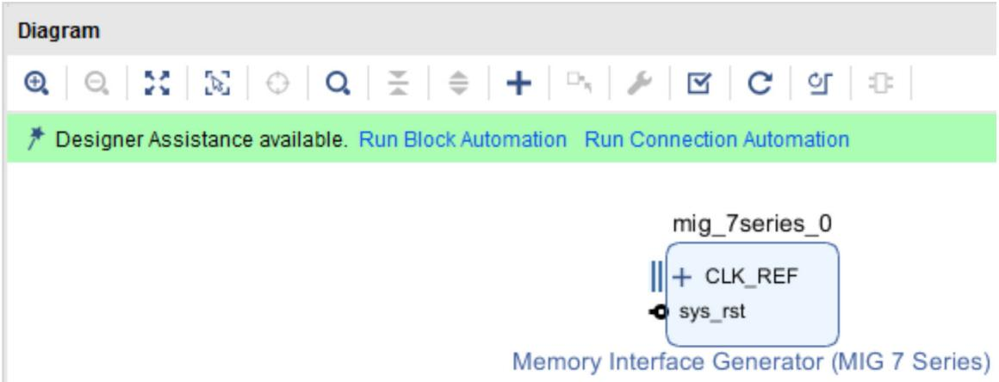

The Run Block Automation dialog box opens.

- 7. Click **OK**. This instantiates the MIG core and connects the I/O interfaces to the I/O interfaces for the DDR memory on the KC705 board.
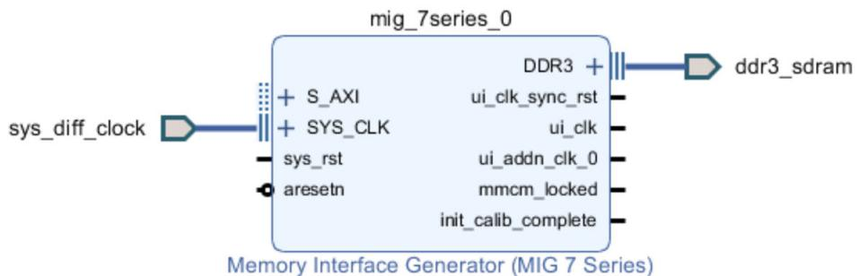

- 8. Right-click anywhere in the block design canvas, and select **Add IP**.
The IP catalog opens.

- 9. In the Search field, type micr to find the MicroBlaze IP, then select **MicroBlaze**, and press **Enter**.
*Note***:** The IP Details window can be displayed by clicking **CTRL+Q** on the keyboard.


### **Use the Board Window to Connect to Board Interfaces**

There are several ways to use an existing interface in IP integrator. Use the Board window to instantiate some of the interfaces that are present on the KC705 board.

- 1. Select the **Board** window to see the interfaces present on the KC705 board.


In the Board window, notice that the DDR3 SDRAM interface is connected as shown by the circle in the following figure. This is because you used the Block Automation feature in the previous steps to connect the MIG core to the board interfaces for DDR3 SDRAM memory.


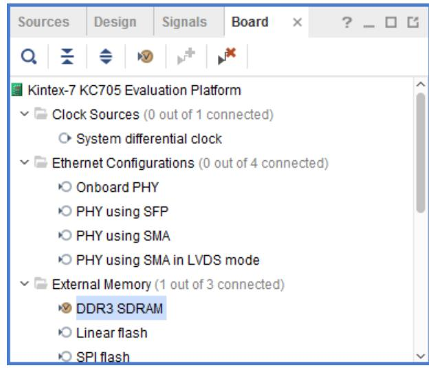

- 2. From the Board window, select **UART** under the miscellaneous folder, and drag and drop it into the block design canvas.
This instantiates the AXI Uartlite IP on the block design.

- 3. Click **OK** in the Auto Connect dialog box.
- 4. Likewise, from the Board window, select **LED** under the General Purpose Input or Output folder, and drag and drop it into the block design canvas.
- 5. Click **OK** in the Auto Connect dialog box.

This instantiates the GPIO IP on the block design and connects it to the on-board LEDs.

The block design now should look like the following figure.


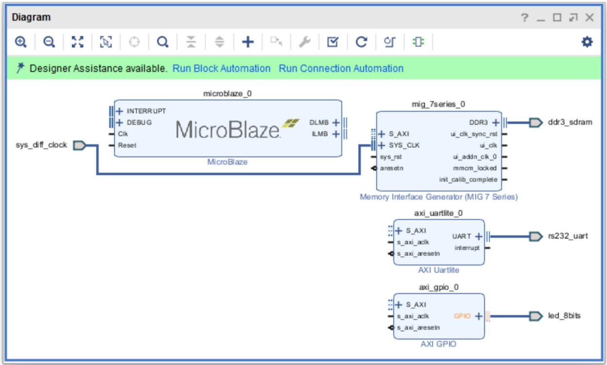

### **Add Peripheral: AXI block RAM Controller**

- 1. Add the AXI block RAM Controller, shown in the following figure, by right-clicking the IP integrator canvas and selecting **Add IP**.

### **Run Block Automation**

- 1. Click Run Block Automation, as shown below.


The Run Block Automation dialog box opens.

- 2. On the Run Block Automation dialog box:
	- a. Leave Preset as the default value, **None**.
	- b. Set Local Memory to **64 KB**.
	- c. Leave the Local Memory ECC as the default value, **None**.
	- d. Set Cache Configuration to **32 KB**.
	- e. Set Debug Module to **Extended Debug**.
	- f. Leave the Peripheral AXI Port option as the default value, **Enabled**.
	- g. Leave the Clock Connection option set to **/mig_7series_0/ui_addn_clk_0 (100 MHz)**.


#### 3. Click **OK**.

This generates a basic MicroBlaze system in the IP integrator diagram area, as shown in the following figure.


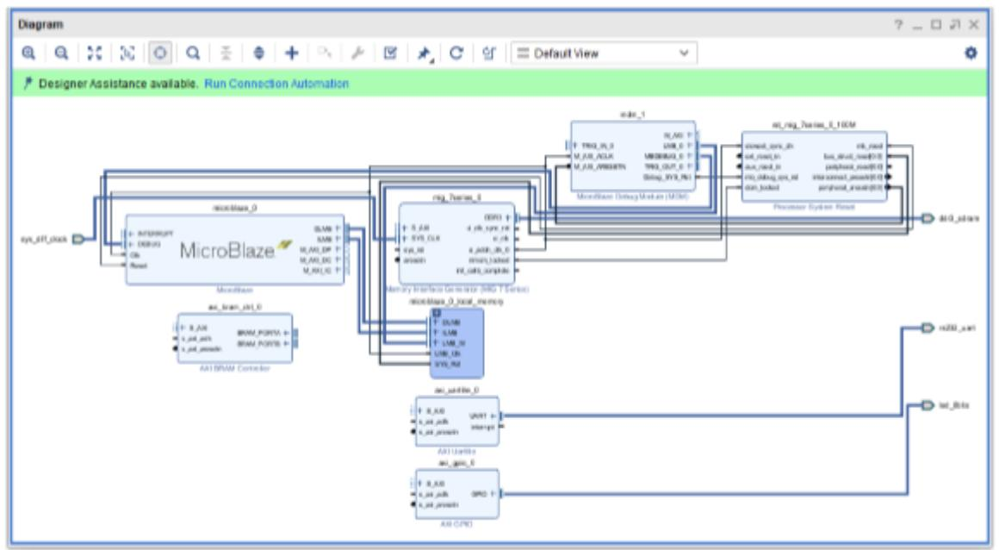

### **Use Connection Automation**

Run Connection Automation provides several options that you can select to make connections. This section will walk you through the first connection, and then you will use the same procedure to make the rest of the required connections for this tutorial.

- 1. Click **Run Connection Automation** as shown in the following figure.
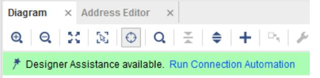

The Run Connection Automation dialog box opens.

- 2. Check the interfaces in the left pane of the dialog box as shown in the following figure.


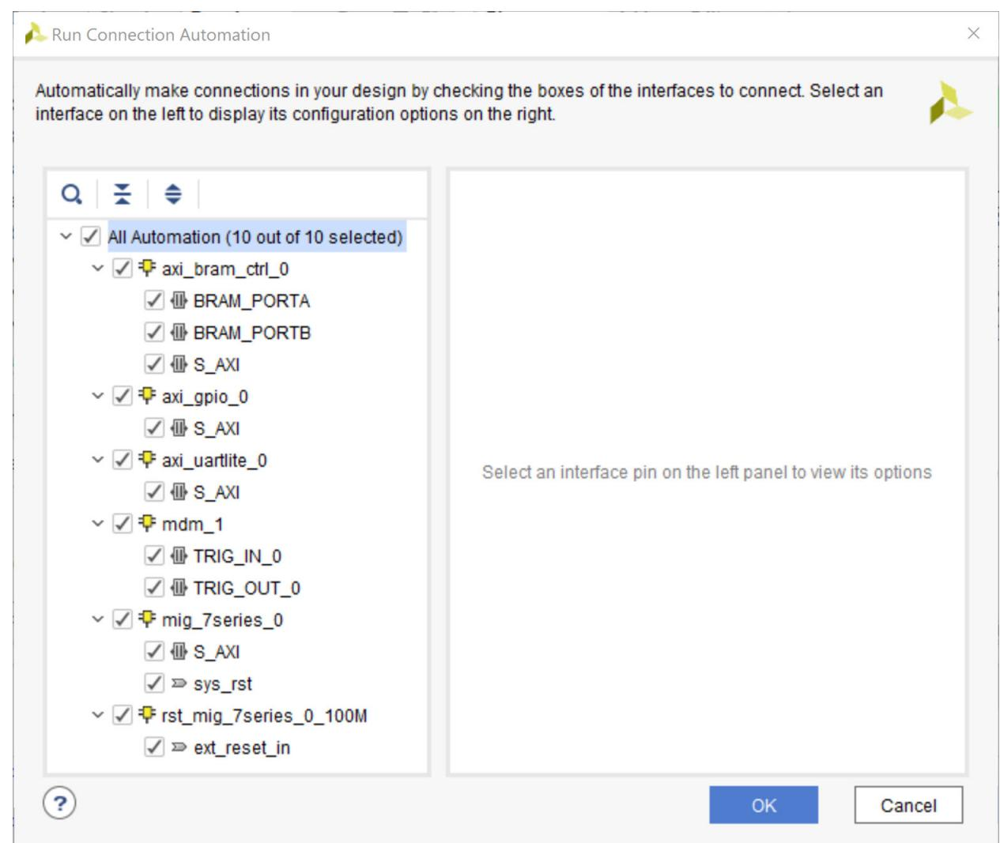

- 3. Use the following table to set options in the Run Connection Automation dialog box.
#### *Table 1:* **Run Connection Automation Options**

| Connection      | More Information                                                            | Setting                                                 |
|-----------------|-----------------------------------------------------------------------------|---------------------------------------------------------|
| axi_bram_ctrl_0 | The only option for this automation is<br>to instantiate a new Block Memory | Leave the Blk_Mem_Gen to its default<br>option of Auto. |
| •<br>BRAM_PORTA | Generator as shown under options.                                           |                                                         |


| Connection                                   | More Information                                                                                                                                                                                                                       | Setting                                                                                                                                                                                                                                                                                                                                   |
|----------------------------------------------|----------------------------------------------------------------------------------------------------------------------------------------------------------------------------------------------------------------------------------------|-------------------------------------------------------------------------------------------------------------------------------------------------------------------------------------------------------------------------------------------------------------------------------------------------------------------------------------------|
| axi_bram_ctrl_0<br>•<br>BRAM_PORTB           | The Run Connection Automation<br>dialog box opens and gives you two<br>choices:<br>•<br>Instantiate a new BMG and<br>connect the PORTB of the AXI<br>block RAM Controller to the new<br>BMG IP<br>•<br>Use the previously instantiated | Leave the Blk_Mem_Gen option to its<br>default value of Auto.                                                                                                                                                                                                                                                                             |
|                                              | BMG core and automatically<br>configure it to be a true dual<br>ported memory and connected to<br>PORTB of the AXI block RAM<br>Controller.                                                                                            |                                                                                                                                                                                                                                                                                                                                           |
| axi_bram_ctrl_0<br>•<br>S_AXI                | Two options are presented in this<br>case. The Master field can be set for<br>either cached or non-cached<br>accesses.                                                                                                                 | The Run Connection Automation<br>dialog box offers to connect this to<br>the /microblaze_0 (Cached). Leave it<br>to its default value. In case, cached<br>accesses are not desired this could be<br>changed to /microblaze_0 (Periph).<br>Leave the Clock Connection (for<br>unconnected clks) field set to its<br>default value of Auto. |
| axi_gpio_0<br>•<br>S_AXI                     | The Master field is set to /<br>microblaze_0 (Periph).<br>The Clock Connection (for<br>unconnected clks) field is set to its<br>default value of Auto.                                                                                 | Keep these default settings.                                                                                                                                                                                                                                                                                                              |
| axi_uartlite_0<br>•<br>S_AXI                 | The Master field is set to its default<br>value of /microblaze_0 (Periph).<br>The Clock Connection (for<br>unconnected clks) field is set to its<br>default value of Auto.                                                             | Keep these default settings.                                                                                                                                                                                                                                                                                                              |
| mdm_1<br>•<br>TRIG_IN_0                      | This will be connected to a new<br>System ILA core's TRIG_OUT pin.                                                                                                                                                                     | Leave the ILA Connection settings to<br>its default value of Auto.                                                                                                                                                                                                                                                                        |
| mdm_1<br>•<br>TRIG_OUT_0                     | This will be connected to the System<br>ILA core'sTRIG_IN pin.                                                                                                                                                                         | Leave the ILA Connections settings to<br>its default value of Auto.                                                                                                                                                                                                                                                                       |
| mig_7series_0<br>•<br>S_AXI                  | The Master field is set to /<br>microblaze_0 (Cached). Leave it to<br>this value so the accesses to the<br>DDR3 memory are cached accesses.<br>The Clock Connection (for                                                               | Keep these default settings.                                                                                                                                                                                                                                                                                                              |
|                                              | unconnected clks) field is set to its<br>default value of Auto.                                                                                                                                                                        |                                                                                                                                                                                                                                                                                                                                           |
| mig_7series_0<br>•<br>sys_rst                | The board interface reset will be<br>connected to the reset pin of the<br>Memory IP.                                                                                                                                                   | Keep the default setting.                                                                                                                                                                                                                                                                                                                 |
| Rst_mig_7_series_0_100M<br>•<br>ext_reset_in | The reset pin of the Processor Sys<br>Rreset IP will be connected to the<br>board reset pin.                                                                                                                                           | Keep the default setting.                                                                                                                                                                                                                                                                                                                 |

#### *Table 1:* **Run Connection Automation Options** *(cont'd)*

- 4. After setting the appropriate options, as shown in the table above, click **OK**.
At this point, your IP integrator diagram area should look like the following figure.


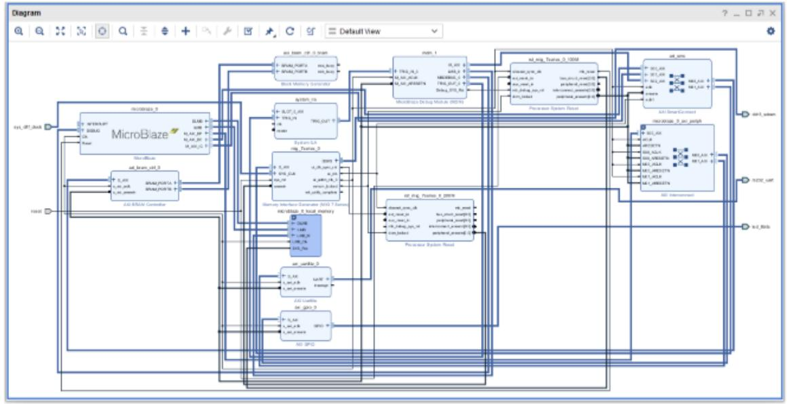

*Note***:** The relative placement of your IP might be slightly different.

### **Mark Nets for Debugging**

- 1. To monitor the AXI transactions taking place between the MicroBlaze and the GPIO, select the interface net connecting M00_AXI interface pin of the microblaze_0_axi_periph instance and the S_AXI interface pin of the axi_gpio_0 instance.
- 2. Right-click and select **Debug** from the context menu.

*Note***:** The Designer Assistance is available as indicated by the Run Connection Automation link in the banner of the block design.

- 3. Click **Run Connection Automation**.


- 4. In the Run Connection Automation dialog box, go with the default setting as shown in the following figure.

#### 5. Click **OK**.

The cross-trigger pins of the MDM and the AXI Interface net connecting the microblaze_0_axi_periph Interconnect and axi_gpio_0 are connected to the System ILA IP as shown in the following figure.

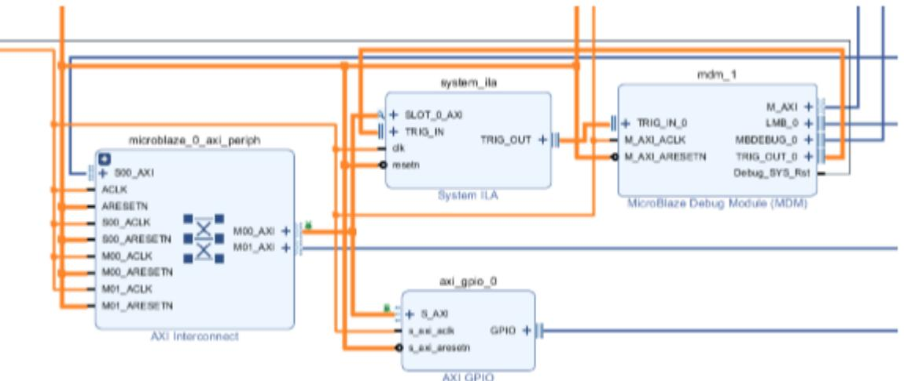

- 6. Click the Regenerate Layout button in the IP integrator toolbar to generate an optimum layout for the block design. The block diagram looks like the following figure.
<span id="page-86-0"/>

### **Step 3: Memory-Mapping the Peripherals in IP Integrator**

- 1. Click the **Address Editor** window.
- 2. In the Address Editor, do the following:
	- a. Expand the microblaze_0 instance by clicking on the Expand All icon in the toolbar to the top of the Address Editor window.

<span id="page-87-0"/>

- b. Change the range of microblaze_0/mig_7_series_0 IP in both the Data and the Instruction section to **512 MB**, and mdm_1/mig_7_series_0 also to 512 MB, as shown in the following figure.

You must also ensure that the memory in which you are going to run and store your software is within the cacheable address range. This occurs when you enable Instruction Cache and Data Cache, while running the Block Automation for the MicroBlaze processor.

To use either Memory IP DDR or AXI block RAM, those IP must be in the cacheable area; otherwise, the MicroBlaze processor cannot read from or write to them.

Validating the design will automatically re-configure the MicroBlaze processor's cacheable address range.

### **Step 4: Validate Block Design**

To run design rule checks on the design:

- 1. Click the Validate Design button on the toolbar, or select **Tools → Validate Design**.
The Validate Design dialog box informs you that there are no critical warnings or errors in the design.

- 2. Click **OK**.
<span id="page-88-0"/>

- 3. Save your design by pressing **Ctrl+S**, or select **File → Save Block Design**.
### **Step 5: Generate Output Products**

- 1. In the Sources window, select the block design, then right-click it and select **Generate Output Products**. Alternatively, you can click **Generate Block Design in the Flow Navigator**.
The Generate Output Products dialog box opens.

- 2. Click **Generate**.

The Generate Output Products dialog box informs you that Out-of-context module runs were launched.

- 3. Click **OK**.
<span id="page-89-0"/>

- 4. Wait a few minutes for all the Out-of-Context module runs to finish as shown in the Design Runs windows.

### **Step 6: Create a Top-Level Wrapper**

- 1. Under Design Sources, right-click the block design mb_subsystem and click **Create HDL Wrapper**.
In the Create HDL Wrapper dialog box, Let Vivado manage wrapper and auto-update is selected by default.

- 2. Click **OK**.
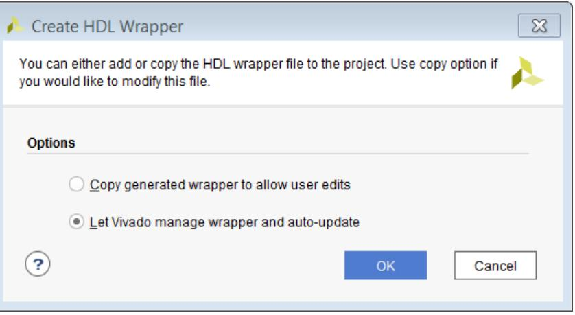

<span id="page-90-0"/>

### **Step 7: Take the Design through Implementation**

- 1. In the Flow Navigator, click **Generate Bitstream**.
The No implementation Results Available dialog box opens.

- 2. Click **Yes**.
The Launch Runs dialog box opens.

- 3. Make the appropriate choices and click **OK**.
Bitstream generation can take several minutes to complete. Once it finishes, the Bitstream Generation Completed dialog box asks you to select what to do next.

- 4. Keep the default selection of Open Implemented Design and click **OK**.
- 5. Verify that all timing constraints have been met by looking at the Timing Design Timing Summary window, as shown in the following figure.

### **Step 8: Export the Design to the Vitis software platform**

**IMPORTANT!** *For the Digilent driver to install, you must power on and connect the board to the host PC before launching the Vitis software platform.*

Next, open the design and export to the Vitis software platform.

- 1. From the Vivado File menu, select **File → Export → Export Hardware**.
The Export Hardware dialog box opens.

- 2. Check the Platform type **Fixed** radio button and click **Next**


- 3. Select the **Include bitstream** option using the radio button in the Output view and click **Next**.

- 4. Leave the XSA file name field at its default value and click **Next**.


- 5. Click **Finish**. This will export the hardware XSA File in the lab1 project directory.


<span id="page-93-0"/>

- 6. To launch the Vitis software platform, select **Tools → Launch Vitis IDE**. The Eclipse Launcher dialog box opens.
- 7. Specify the desired Workspace location such as C:\UG940\lab3_vitis.
- 8. Click **Launch**.

### **Step 9: Create a "Peripheral Test" Application**

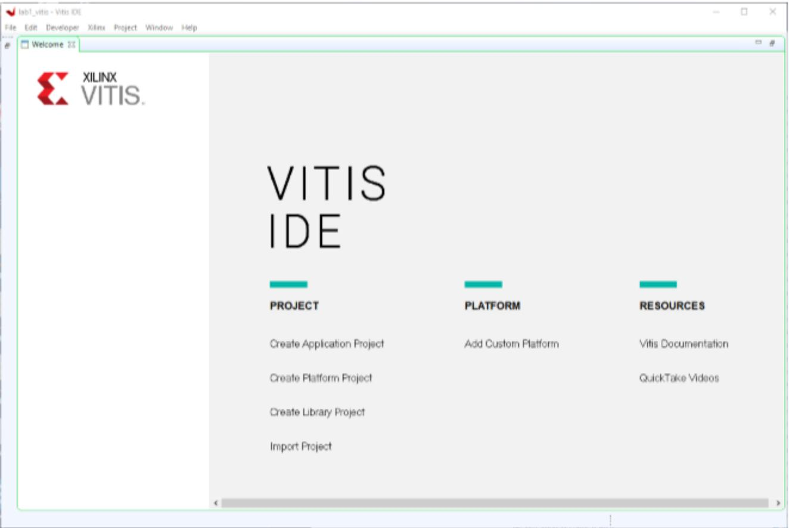

The Vitis software platform launches in a separate window.

- 1. Close the Welcome screen if it appears.
- 2. Select **File → New → Application Project** or under **Project** click **Create Application Project**.


- 3. Select the **Skip welcome page next time** check box if you do not want the welcome to appear when the Vitis software platform is launched again.
- 4. Click **Next**.
- 5. In the Platform page, select the **Create a new platform from hardware (XSA)** tab.


- 6. Click **Browse** to open The Create Platform from XSA window. Navigate to the directory where the XSA file was created in Vivado and click **Open**.

- 7. Ensure the **Generate boot Components** option is selected in the Platform page.


- 8. Click **Next**.
- 9. In the **Domain** page leave all the fields at their default values and click **Next**.
- 10. In the Application project name field, type the name desired, such as peri_test. Leave all other fields to their default values, and click **Next**.


11. In the Domain page leave all the fields at their default values and click **Next**.


A new peri_test application is created. To build the application click the hammer icon in the toolbar.

- 12. 16. In the Templates page, select **Peripheral Tests**.


- 13. Click **Finish**.
- 14. A new peri_test application is created. To build the application click the hammer icon in the toolbar.
- 15. Wait for the application to finish compiling.
- 16. Right-click the peri_test application in the Project Explorer, and select **Generate Linker Script**.

The Generate Linker Script dialog box opens.

- 17. Select the **Basic** tab, and change the Assigned Memory for Heap and Stack to **mig_7series_0**.
<span id="page-100-0"/>

Setting these values to **mig_7series_0** ensures that the compiled code executes from the Memory IP.

- 18. Click **Generate**.
- 19. Click **Yes** to overwrite it in the **Linker Already Exists!** dialog box.
- 20. Click the hammer icon in the toolbar again to rebuild the application with the modified linker script.

### **Step 10: Execute the Software Application on a KC705 Board**


**IMPORTANT!** *Make sure that you have connected the target board to the host computer and it is turned on.*

- 1. Select and right-click the peri_test application in the Project Explorer, and select **Debug As →  Debug Configurations**.
The Debug Configurations dialog box opens, as shown in the following figure.

- 2. Right-click **Single Application Debug**, and select **New Configuration**.


- 3. The Create, manage and run configurations page opens. Click **Debug**.

The Debug perspective window opens.

- 4. Set the terminal by selecting the Vitis Terminal tab and clicking the button.


- 5. Use the settings shown in the following figure for the KC705 board and click **OK**.

- 6. Verify the terminal connection by checking the status at the top of the Vitis software platform Terminal tab, as shown in the following figure.
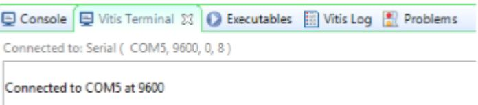

- 7. If the testperiph.c file is not already open, select **../src/testperiph.c**, and double-click to open the source file.
- 8. Modify the source file by inserting a while statement at approximately line 41.
	- a. Click the blue bar on the left side of the testperiph.c window as shown in the figure, and select **Show Line Numbers**.
	- b. In line 41, add while(1) above in front of the curly brace as shown in the following figure:

<span id="page-103-0"/>

- 9. Add a breakpoint in the code so that the processor stops code execution when the breakpoint is encountered. To do so, scroll down to line 50 and double-click on the left pane, which adds a breakpoint on that line of code, as shown in the following figure.
- 10. Press **Ctrl + S** to save the file. Alternatively, you can select **File → Save**.

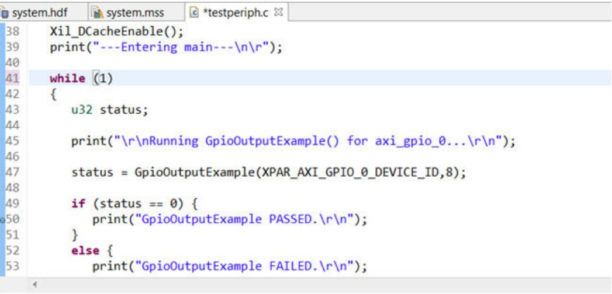

- 11. Click the hammer icon to rebuild the file with the modified code.
Now you are ready to execute the code from the Vitis software platform.

### **Step 11: Connect to Vivado Logic Analyzer**

Connect to the KC705 board using the Vivado Logic Analyzer.

- 1. In the Vivado IDE session, from the Program and Debug drop-down list of the Vivado Flow Navigator, select **Open Hardware Manager**.
- 2. In the Hardware Manager window, click **Open target → Open New Target**.


*Note***:** You can also use the Auto Connect option to connect to the target hardware.

The Open New Hardware Target dialog box opens, shown in the following figure.

- 3. Click **Next**.
- 4. On the Hardware Server Settings page, ensure that the Connect to field is set to **Local server (target is on local machine)** as shown in the following figure, and click **Next**.

- 5. On the Select Hardware Target page, click **Next**.
- 6. Ensure that all the settings are correct on the Open Hardware Target Summary dialog box, as shown in the following figure, and click **Finish**.

<span id="page-105-0"/>

### **Step 12: Set the MicroBlaze to Logic Cross Trigger**

When the Vivado Hardware Session successfully connects to the ZC702 board, you see the information shown in the following figure:

#### *Figure 1:* **Vivado Hardware Window**

- 1. Select the settings **hw_ila_1 tab** and set the Trigger Mode Settings as follows:
	- a. Set Trigger mode to **TRIG_IN_ONLY**.
	- b. Set TRIG_OUT mode to **TRIG_IN_ONLY**.
	- c. Under Capture Mode Settings, ensure that Trigger position in window is set to **512**.


- 2. Arm the ILA core by clicking the Run Trigger button.
This arms the ILA. You should see the status "Waiting for Trigger" as shown in the following figure.

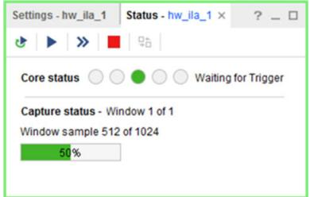

- 3. In the Vitis software platform Debug window, click **MicroBlaze #0** and then click the **Resume** button.
The code will execute until the breakpoint set on line 50 in testperiph.c file is reached. As the breakpoint is reached, this triggers the ILA, as shown in the following figure.

<span id="page-107-0"/>

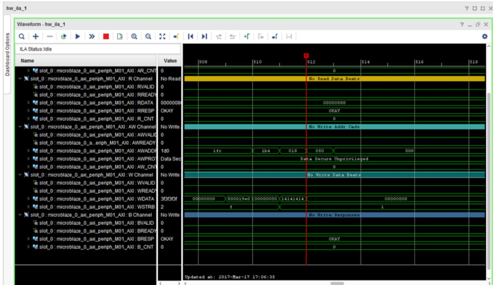

This demonstrates that when the breakpoint is encountered during code execution, the MicroBlaze triggers the ILA that is set up to trigger. This way you can monitor the state of the hardware at a certain point of code execution.

### **Step 13: Set the Logic to Processor Cross-Trigger**

Now try the logic to processor side of the cross-trigger mechanism. In other words, remove the breakpoint that you set earlier on line 50 to have the ILA trigger the processor and stop code execution.

- 1. Select the **Breakpoints** tab towards the top right corner of the window, and clear the **testperiph.c [line: 50]** check box. This removes the breakpoint that you set up earlier.
Alternatively, you can also click on the breakpoint in the testperiph.c file, and select **Disable Breakpoint**.

- 2. In the Debug window, right-click the **MicroBlaze #0 target** and select **Resume**.
The code runs continuously because it has an infinite loop.

You can see the code executing in the Terminal Window in the Vitis software platform.

<span id="page-108-0"/>

- 3. In Vivado, select the **Settings hw_ila_1** tab. Change the Trigger Mode to **BASIC_OR_TRIG_IN** and the TRIG_OUT mode to **TRIGGER_OR_TRIG_IN**.
- 4. Click on the (+) sign in the Trigger Setup window to add the slot_0:microblaze_0_axi_periph_M01:AWVALID signal from the Add Probes window.
- 5. In the Basic Trigger Setup window, for slot_0:microblaze_0_axi_periph_M00:AWVALID signal, ensure that the Radix field is set to **[B] (Binary)** and set the Value field to **1**.

This essentially sets up the ILA to trigger when the awvalid transitions to a value of 1.

- 6. Click the Run Trigger button to "arm" the ILA in the Status hw_ila_1 window.
The ILA immediately triggers as the application software is continuously performing a write to the GPIO thereby toggling the net_slot_0_axi_awvalid signal, which causes the ILA to trigger. The ILA in turn, toggles the TRIG_OUT signal, which signals the processor to stop code execution.

This is seen in Vitis in the highlighted area of the debug window.

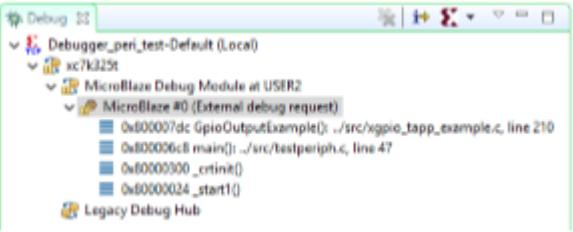

### **Conclusion**

In this tutorial, you:

- Stitched together a design in the Vivado IP integrator
- Took the design through implementation and bitstream generation
- Exported the hardware to Vitis
- Created and modified application code that runs on a Standalone Operating System
- Modified the linker script so that the code executes from the DDR3
- Verified cross-trigger functionality between the MicroBlaze processor executing code and the design logic

<span id="page-109-0"/>

### **Lab Files**

The Tcl script lab3.tcl is included with the design files to perform all the tasks in Vivado. The Vitis software platform operations must be done in the Vitis GUI. You might need to modify the Tcl script to match the project path and project name on your machine.


<span id="page-110-0"/>

### *Appendix A*

*Appendix A:* Additional Resources and Legal Notices

## Additional Resources and Legal Notices

### **Xilinx Resources**

For support resources such as Answers, Documentation, Downloads, and Forums, see [Xilinx](https://www.xilinx.com/support) [Support](https://www.xilinx.com/support).

### **Documentation Navigator and Design Hubs**

Xilinx® Documentation Navigator (DocNav) provides access to Xilinx documents, videos, and support resources, which you can filter and search to find information. To open DocNav:

- From the Vivado® IDE, select **Help → Documentation and Tutorials**.
- On Windows, select **Start → All Programs → Xilinx Design Tools → DocNav**.
- At the Linux command prompt, enter docnav.

Xilinx Design Hubs provide links to documentation organized by design tasks and other topics, which you can use to learn key concepts and address frequently asked questions. To access the Design Hubs:

- In DocNav, click the **Design Hubs View** tab.
- On the Xilinx website, see the [Design Hubs](https://www.xilinx.com/cgi-bin/docs/ndoc?t=design+hubs) page.

*Note***:** For more information on DocNav, see the [Documentation Navigator](https://www.xilinx.com/cgi-bin/docs/rdoc?t=docnav) page on the Xilinx website.

### **References**

These documents provide supplemental material useful with this guide:

<span id="page-111-0"/>

- 1. *Vivado Design Suite User Guide: Release Notes, Installation, and Licensing* [(UG973](UG973))
- 2. *Vivado Design Suite User Guide: Using the Vivado IDE* [(UG893](UG893))
- 3. *Vivado Design Suite User Guide: Designing with IP* ([UG896)](https://www.xilinx.com/cgi-bin/docs/rdoc?v=latest;d=ug896-vivado-ip.pdf)
- 4. *Vivado Design Suite Tcl Command Reference Guide* ([UG835)](https://www.xilinx.com/cgi-bin/docs/rdoc?v=latest;d=ug835-vivado-tcl-commands.pdf)
- 5. *Vivado Design Suite User Guide: Design Flows Overview* [(UG892](UG892))
- 6. *Vivado Design Suite User Guide: Logic Simulation* ([UG900)](https://www.xilinx.com/cgi-bin/docs/rdoc?v=latest;d=ug900-vivado-logic-simulation.pdf)
- 7. *Vivado Design Suite User Guide: Using Tcl Scripting* ([UG894)](https://www.xilinx.com/cgi-bin/docs/rdoc?v=latest;d=ug894-vivado-tcl-scripting.pdf)
- 8. *Vivado Design Suite User Guide: Implementation* ([UG904)](https://www.xilinx.com/cgi-bin/docs/rdoc?v=latest;d=ug904-vivado-implementation.pdf)
- 9. *Vivado Design Suite User Guide: Using Tcl Scripting* ([UG894)](https://www.xilinx.com/cgi-bin/docs/rdoc?v=latest;d=ug894-vivado-tcl-scripting.pdf)
- 10. *Zynq-7000 SoC Technical Reference Manual* ([UG585)](https://www.xilinx.com/cgi-bin/docs/ndoc?t=user_guides;d=ug585-Zynq-7000-TRM.pdf)
- 11. *Vitis Unified Software Platform Documentation* ([UG1416)](https://www.xilinx.com/html_docs/xilinx2020_1/vitis_doc/index.html)

### **Please Read: Important Legal Notices**

The information disclosed to you hereunder (the "Materials") is provided solely for the selection and use of Xilinx products. To the maximum extent permitted by applicable law: (1) Materials are made available "AS IS" and with all faults, Xilinx hereby DISCLAIMS ALL WARRANTIES AND CONDITIONS, EXPRESS, IMPLIED, OR STATUTORY, INCLUDING BUT NOT LIMITED TO WARRANTIES OF MERCHANTABILITY, NON-INFRINGEMENT, OR FITNESS FOR ANY PARTICULAR PURPOSE; and (2) Xilinx shall not be liable (whether in contract or tort, including negligence, or under any other theory of liability) for any loss or damage of any kind or nature related to, arising under, or in connection with, the Materials (including your use of the Materials), including for any direct, indirect, special, incidental, or consequential loss or damage (including loss of data, profits, goodwill, or any type of loss or damage suffered as a result of any action brought by a third party) even if such damage or loss was reasonably foreseeable or Xilinx had been advised of the possibility of the same. Xilinx assumes no obligation to correct any errors contained in the Materials or to notify you of updates to the Materials or to product specifications. You may not reproduce, modify, distribute, or publicly display the Materials without prior written consent. Certain products are subject to the terms and conditions of Xilinx's limited warranty, please refer to Xilinx's Terms of Sale which can be viewed at [](https://www.xilinx.com/legal.htm#tos) [](https://www.xilinx.com/legal.htm#tos](https://www.xilinx.com/legal.htm#tos](https://www.xilinx.com/legal.htm#tos); IP cores may be subject to warranty and support terms contained in a license issued to you by Xilinx. Xilinx products are not designed or intended to be fail-safe or for use in any application requiring fail-safe performance; you assume sole risk and liability for use of Xilinx products in such critical applications, please refer to Xilinx's Terms of Sale which can be viewed at<https://www.xilinx.com/legal.htm#tos>.


#### **AUTOMOTIVE APPLICATIONS DISCLAIMER**

AUTOMOTIVE PRODUCTS (IDENTIFIED AS "XA" IN THE PART NUMBER) ARE NOT WARRANTED FOR USE IN THE DEPLOYMENT OF AIRBAGS OR FOR USE IN APPLICATIONS THAT AFFECT CONTROL OF A VEHICLE ("SAFETY APPLICATION") UNLESS THERE IS A SAFETY CONCEPT OR REDUNDANCY FEATURE CONSISTENT WITH THE ISO 26262 AUTOMOTIVE SAFETY STANDARD ("SAFETY DESIGN"). CUSTOMER SHALL, PRIOR TO USING OR DISTRIBUTING ANY SYSTEMS THAT INCORPORATE PRODUCTS, THOROUGHLY TEST SUCH SYSTEMS FOR SAFETY PURPOSES. USE OF PRODUCTS IN A SAFETY APPLICATION WITHOUT A SAFETY DESIGN IS FULLY AT THE RISK OF CUSTOMER, SUBJECT ONLY TO APPLICABLE LAWS AND REGULATIONS GOVERNING LIMITATIONS ON PRODUCT LIABILITY.

#### **Copyright**

© Copyright 2013-2020 Xilinx, Inc. Xilinx, the Xilinx logo, Alveo, Artix, Kintex, Spartan, Versal, Virtex, Vivado, Zynq, and other designated brands included herein are trademarks of Xilinx in the United States and other countries. All other trademarks are the property of their respective owners.

