# **ZedBoard: Zynq-7000 AP SoC Concepts, Tools, and Techniques**

# *A Hands-On Guide to Effective Embedded System Design*

**ZedBoard (v14.4)** 


#### **Notice of Disclaimer**

The information disclosed to you hereunder (the "Materials") is provided solely for the selection and use of Xilinx products. To the maximum extent permitted by applicable law: (1) Materials are made available "AS IS" and with all faults, Xilinx hereby DISCLAIMS ALL WARRANTIES AND CONDITIONS, EXPRESS, IMPLIED, OR STATUTORY, INCLUDING BUT NOT LIMITED TO WARRANTIES OF MERCHANTABILITY, NON-INFRINGEMENT, OR FITNESS FOR ANY PARTICULAR PURPOSE; and (2) Xilinx shall not be liable (whether in contract or tort, including negligence, or under any other theory of liability) for any loss or damage of any kind or nature related to, arising under, or in connection with, the Materials (including your use of the Materials), including for any direct, indirect, special, incidental, or consequential loss or damage (including loss of data, profits, goodwill, or any type of loss or damage suffered as a result of any action brought by a third party) even if such damage or loss was reasonably foreseeable or Xilinx had been advised of the possibility of the same. Xilinx assumes no obligation to correct any errors contained in the Materials or to notify you of updates to the Materials or to product specifications. You may not reproduce, modify, distribute, or publicly display the Materials without prior written consent. Certain products are subject to the terms and conditions of the Limited Warranties which can be viewed at [http://www.xilinx.com/warranty.htm;](http://www.xilinx.com/warranty.htm) IP cores may be subject to warranty and support terms contained in a license issued to you by Xilinx. Xilinx products are not designed or intended to be failsafe or for use in any application requiring fail-safe performance; you assume sole risk and liability for use of Xilinx products in Critical Applications: [](http://www.xilinx.com/warranty.htm#critapps.](http://www.xilinx.com/warranty.htm#critapps.](http://www.xilinx.com/warranty.htm#critapps)

© Copyright 2013 Xilinx Page 1 Zynq ZedBoard Concepts, Tools, and Techniques 3/22/2013


© Copyright 2012 Xilinx, Inc. Xilinx, the Xilinx logo, Artix, ISE, Kintex, Spartan, Virtex, Vivado, Zynq, and other designated brands included herein are trademarks of Xilinx in the United States and other countries. All other trademarks are the property of their respective owners.

# **Revision History**

The following table shows the revision history for this document.

| Date       | Version | Revision                                                                                                                                                                                                                                                                                  |
|------------|---------|-------------------------------------------------------------------------------------------------------------------------------------------------------------------------------------------------------------------------------------------------------------------------------------------|
| 08/20/2012 | 14.1    | First version.                                                                                                                                                                                                                                                                            |
| 10/15/2012 | 14.3    | Update for Xilinx ISE 14.3.                                                                                                                                                                                                                                                               |
| 01/10/2013 | 14.3    | Links to examples added in Chapter 6.                                                                                                                                                                                                                                                     |
| 03/22/2013 | 14.4    | Updated for Xilinx ISE 14.4 with revisions to the text and figures, adjusted formatting, fixed typos<br>and unified font sizes. Also made recommendations for an external serial terminal emulator to run<br>certain exercises. Added more examples and documentation links in Chapter 6. |


#### **Table of Contents**

| Chapter 1<br>1.1                                                            | Introduction<br><br>About this Guide<br>                                                                                                                                                                                                                                                                                                                                                               | 6<br>6                |
|-----------------------------------------------------------------------------|--------------------------------------------------------------------------------------------------------------------------------------------------------------------------------------------------------------------------------------------------------------------------------------------------------------------------------------------------------------------------------------------------------|-----------------------|
| 1.1.1<br>1.1.2<br>1.1.3<br>1.2<br>1.3<br>1.3.1<br>1.3.2<br>Chapter 2<br>2.1 | Take a Test Drive!<br>Additional Documentation<br><br>Training Labs<br><br>How Zynq AP SoC and Xilinx software Simplify Embedded Processor Design<br><br>What You Need to Set Up Before Starting<br><br>Software Installation Requirements:<br>10<br>Hardware Requirements for this Guide<br>11<br>Embedded System Design Using the Zynq Processing System<br>12<br>Embedded System Construction<br>14 | 7<br>7<br>7<br>7<br>9 |
| 2.1.1<br>System                                                             | Take a Test Drive! Creating a New Embedded Project With a Zynq Processing<br>14                                                                                                                                                                                                                                                                                                                        |                       |
| 2.1.2                                                                       | Take a Test Drive! Exporting to SDK<br>23                                                                                                                                                                                                                                                                                                                                                              |                       |
| 2.1.3<br>2.1.4<br>Chapter 3<br>3.1                                          | Take a Test Drive! Running the "Hello World" Application<br>25<br>Additional Information30<br>Embedded System Design Using the Zynq Processing System and Programmable Logic<br>.32<br>Adding soft IP in the PL to interface with the Zynq PS32                                                                                                                                                        |                       |
| 3.1.1                                                                       | Take a Test Drive! Check Functionality of IP instantiated in the PL<br>34                                                                                                                                                                                                                                                                                                                              |                       |
| 3.1.2<br>Chapter 4                                                          | Take a Test Drive! Working with SDK<br>41<br>Debugging with SDK and ChipScope Pro<br>42                                                                                                                                                                                                                                                                                                                |                       |
| 4.1                                                                         | Take a Test Drive! Debugging with Software, Using SDK<br>42                                                                                                                                                                                                                                                                                                                                            |                       |
| 4.2<br>Chapter 5<br>5.1                                                     | Take a Test Drive! Debugging Hardware Using ChipScope Software<br>44<br>Booting Linux and Application Debugging Using SDK48<br>Requirements<br>48                                                                                                                                                                                                                                                      |                       |
| 5.2                                                                         | Booting Linux on a ZedBoard<br>49                                                                                                                                                                                                                                                                                                                                                                      |                       |
| 5.2.1<br>5.2.2                                                              | Boot Methods49<br>Booting Linux from JTAG50                                                                                                                                                                                                                                                                                                                                                            |                       |
| 5.2.3<br>5.2.4                                                              | Take a Test Drive! Booting Linux in JTAG Mode51<br>Booting Linux from QSPI Flash<br>53                                                                                                                                                                                                                                                                                                                 |                       |
| 5.2.5<br>5.2.6                                                              | Take a Test Drive! Booting Linux from QSPI Flash<br>53<br>Booting Linux from the SD Card<br>58                                                                                                                                                                                                                                                                                                         |                       |
| 5.2.7<br>5.3                                                                | Take a Test Drive! Booting Linux from the SD Card58<br>Hello World Example<br>59                                                                                                                                                                                                                                                                                                                       |                       |
| 5.3.1<br>5.4                                                                | Take a Test Drive! Running a "Hello World" Application59<br>Controlling LEDs and Switches in Linux Example<br>66                                                                                                                                                                                                                                                                                       |                       |
| 5.4.1<br>Appendix A                                                         | Take a Test Drive! Controlling LEDs and Switches in a Linux Application<br>66<br>Chapter 6 Further "How-to's" and Examples77<br>79                                                                                                                                                                                                                                                                     |                       |


| Figure 2-1: Design Flow for Zynq13                                                 |  |
|------------------------------------------------------------------------------------|--|
| Figure 2-2: New Project Wizard Part Selection15                                    |  |
| Figure 2-3: PlanAhead GUI16                                                        |  |
| Figure 2-4: Platform Studio dialog box<br>17                                       |  |
| Figure 2-5: Create New Project BSB Wizard18                                        |  |
| Figure 2-6: Peripheral Configuration Wizard19                                      |  |
| Figure 2-7:Processing System 7 in the Bus Interface tab<br>20                      |  |
| Figure 2-8: System Assembly View of the Zynq Processing System Block Diagram<br>21 |  |
| Figure 2-9: Selecting ZedBoard Template<br>22                                      |  |
| Figure 2-10: Updated Zynq Block Diagram23                                          |  |
| Figure 2-11: Address Map in SDK system.xml Tab<br>24                               |  |
| Figure 2-12: ZedBoard Power switch and Jumper settings25                           |  |
| Figure 2-13:Serial Terminal Settings26                                             |  |
| Figure 2-14:Application Project Wizard<br>27                                       |  |
| Figure 2-15:Hello World from Available Templates<br>28                             |  |
| Figure 2-16: Successful Build<br>29                                                |  |
| Figure 2-17:"Hello World" on the Serial Terminal<br>30                             |  |
| Figure 3-1: Block Diagram33                                                        |  |
| Figure 3-2:Completed Port Connections<br>36                                        |  |
| Figure 3-3:Processing_system7_0 Expanded and M_AXI_GPO_ACLK Connected<br>37        |  |
| Figure 3-4:Interrupt Connection Dialog Box<br>38                                   |  |
| Figure 3-5:Timer Interrupt Connected on the PL side38                              |  |
| Figure 3-6:Connected chipscope_axi_monitor38                                       |  |
| Figure 3-7: GPIO Port Not Connected to External Ports39                            |  |
| Figure 3-8: Design Rule Check Warnings39                                           |  |
| Figure 3-9: system.ucf File Added<br>40                                            |  |
| Figure 3-10:Program FPGA Dialog Box42                                              |  |
| Figure 4-1: Debug Perspective Suspended<br>43                                      |  |
| Figure 4-2: Trigger Setup Window, MON_AXI_ARVALID Setting<br>45                    |  |
| Figure 4-3: Trigger Condition Dialog Box46                                         |  |
| Figure 4-4:Waveform captured in Chipscope47                                        |  |
| Figure 5-1: Linux Boot Process on the ZedBoard<br>50                               |  |
| Figure 5-2:Jumper Settings to boot in JTAG mode<br>51                              |  |
| Figure 5-3:Creating a Zynq QSPI Boot Image<br>55                                   |  |
| Figure 5-4: Serial Terminal Window showing QSPI programming<br>57                  |  |
| Figure 5-5:Serial Terminal Window showing Linux Booting58                          |  |
| Figure 5-6:Jumper Settings to boot from SD Card<br>58                              |  |
| Figure 5-7: New Project Selection60                                                |  |
| Figure 5-8: Application Project<br>61                                              |  |
| Figure 5-9:Add An Empty Application<br>62                                          |  |
| Figure 5-10:Import .c file<br>63                                                   |  |
| Figure 5-11: Select hello_world_linux.c<br>64                                      |  |
| Figure 5-12:Serial Teriminal Window showing Linux Booting65                        |  |
| Figure 5-13: Serial Terminal Window showing hello_world_linux running66            |  |
| Figure 5-14: New Project Wizard Part Selection67                                   |  |
| Figure 5-15: PlanAhead GUI68                                                       |  |
| Figure 5-16: Platform Studio dialog box<br>69                                      |  |
| Figure 5-17:Create New Project BSB Wizard70                                        |  |
| Figure 5-18: Peripheral Configuration Wizard71                                     |  |
| Figure 5-19: New Project Selection73                                               |  |
| Figure 5-20:Add An Empty Application<br>74                                         |  |
| Figure 5-21:Import .c file<br>75                                                   |  |


# <span id="page-5-0"/>**Chapter 1 Introduction**

# <span id="page-5-1"/>1.1 **About this Guide**

This document provides an introduction to using the Xilinx® ISE® WebPACK software to build a Zynq™-7000 All Programmable SoC (AP SoC) design. The examples target the ZedBoard [(http://www.zedboard.org)](http://www.zedboard.org/) using ISE Design Suite 14.4.

*Note:* The Test Drives in this document were created using Microsoft Windows 7 64-bit operating system. Other versions of Windows might provide varied results.

The Zynq-7000 family is the world's first All Programmable SoC. This innovative class of product combines an industry-standard ARM® dual-core Cortex™-A9 MPCore™ processing system with Xilinx 28 nm unified programmable logic architecture. This processor-centric architecture delivers a complete embedded processing platform that offers developers ASIC levels of performance and power consumption, the flexibility of an FPGA, and the ease of programmability of a microprocessor.

This guide describes the design flow for developing a custom Zynq-7000 AP SoC based embedded processing system using the Xilinx ISE WebPACK software tools. It contains the following five chapters:

- **Chapter 1,** (this chapter) provides a general overview.
- **Chapter 2**, "Embedded System Design Using the Zynq Processing System" describes the tool flow for the Zynq Processing System (PS) to create a simple standalone "Hello World" application.
- **Chapter 3**, "Embedded System Design Using the Zynq Processing System and Programmable Logic" describes how to create a system utilizing both the Zynq PS as well as the Programmable Logic (PL).
- **Chapter 4**, "Debugging with SDK and ChipScope Pro" provides debugging debugging techniques via software (using SDK Debug) and hardware (using the ChipScope™ software)debugging tools.
- **Chapter 5, "Booting Linux and Application Debugging using SDK"** covers programming of the non-volatile memories such as QSPI Flash and SD Card with the Linux precompiled images, which are used for automatic Linux booting after switching on the board.


- **Chapter 6, "Further "How-to's" and Examples"** links the reader to online resources available to the ZedBoard designer including design projects and further documentation.
- **Appendix A**, **"Application Software"** describes details of the application needed for the example design used in this guide.

# <span id="page-6-0"/>1.1.1 **Take a Test Drive!**

The best way to learn a software tool is to use it, so this guide provides opportunities for you to work with the tools under discussion. Procedures for sample projects are given in the Test Drive sections, along with an explanation of what is happening behind the scenes and why you need to do it.

Test Drives are indicated by the car icon, as shown beside the heading above.

#### <span id="page-6-1"/>1.1.2 **Additional Documentation**

For further information, refer to:

- **Xilinx Zynq-7000 Documentation:** <http://www.xilinx.com/support/documentation/zynq-7000.htm>
- **Xilinx Design Tools: Installation and Licensing Guide (UG798):** <http://www.xilinx.com/support/documentation/sw_manuals/xilinx14_4/iil.pdf>
- **Xilinx Design Tools: Release Notes Guide (UG631):** <http://www.xilinx.com/support/documentation/sw_manuals/xilinx2012_4/irn.pdf>
- **Xilinx Glossary:** <http://www.xilinx.com/company/terms.htm>
- **Xilinx Support:** <http://www.xilinx.com/support/>
- **ZedBoard.org:** [http://www.zedboard.org](http://www.zedboard.org/)

## <span id="page-6-2"/>1.1.3 **Training Labs**

Some Test Drives have associated training labs that you can use for further practice with the given tasks. When applicable, a description of the lab is provided at the end of the Test Drive.

# <span id="page-6-3"/>1.2 **How Zynq AP SoC and Xilinx software Simplify Embedded Processor Design**

© Copyright 2013 Xilinx The Zynq-7000 All Programmable SoC reduces system complexity by offering a dual core ARM Cortex-A9 processing system and hard peripherals coupled with Xilinx 7-Series 28 nm programmable logic all integrated on a single SoC. It is the


first of its kind in the market and has tremendous potential as a tightly integrated system.

To simplify the design process, Xilinx offers several sets of tools. The ZedBoard kit includes the [ISE WebPACK](http://www.xilinx.com/products/design-tools/ise-design-suite/ise-webpack.htm) software, and the appropriate device-locked ChipScope Pro tools. ISE WebPACK includes the PlanAhead Design and Analysis tools, Embedded Development Kit (EDK) for the Zynq XC7Z020 AP SoC, as well as a limited version of the built-in simulator, ISim. The embedded processing component of the ISE WebPACK tools includes Xilinx Platform Studio (XPS) as well as the Software Development Kit (SDK). The Zynq Processing System (PS) may be used without anything programmed in the Programmable Logic (PL). However, in order to use any soft IP in the PL, or to route PS dedicated peripherals to device pins for the PL, you have to program the PL.

With ISE Webpack you have all the Xilinx tools required to work with your ZedBoard. It is a good idea to get to know the basic tool names, project file names, and acronyms for these tools. You can find Xilinx software-specific terms in the Xilinx Glossary:

<http://www.xilinx.com/company/terms.htm>

## **Xilinx ISE WebPACK**

ISE WebPACK design software is the free, downloadable, fully featured front-to-back FPGA design solution running under Linux, Windows XP, and Windows 7, supporting the ZedBoard. As part of the ISE Design Suite version 14.4 – WebPACK supports embedded processing design for the Zynq-7000 AP SoC.

The ISE WebPACK tools include PlanAhead, Xilinx Platform Studio and the Software Development Kit, amongst others. The WebPACK DVD that is included with the kit may have a different version, please use the corresponding CTT for that version or install ISE 14.4 via a web download. A complete description of ISE WebPACK is available via this hyperlink:<http://www.xilinx.com/products/design-tools/ise-design-suite/ise-webpack.htm>

### PlanAhead Design and Analysis Tools

PlanAhead software provides a central cockpit for design entry in RTL, synthesis and verification. PlanAhead offers integration with XPS for embedded processor design (including access to the Xilinx IP catalog), and SDK to complete the embedded processor software design. Implementation is achieved through integration with the ISE tool flow. The implementation flow of your design may be centrally launched from the PlanAhead GUI.

- For more information on the embedded design process as it relates to XPS, see the "Design Process Overview" in the *Embedded System Tools*


*Reference Manual (UG111)***:** <http://www.xilinx.com/support/documentation/xilinx14_4/est_rm.pdf>

*Note:* For this version of the Zynq development tools, direct simulation of the Processing System is not available.

# Xilinx Platform Studio

XPS is the development environment used for designing the hardware portion of your embedded processor system. You can specify in XPS the microprocessor, peripherals, and the interconnection of these components along with their respective detailed configuration.. You can run XPS in batch mode or using the GUI, which is demonstrated in this guide.

# Software Development Kit

The SDK is an integrated development environment, complementary to XPS, that is used for C/C++ embedded software application creation and verification. SDK is built on the Eclipse open-source framework. For more information about the Eclipse development environment, please refer to [http://www.eclipse.org.](http://www.eclipse.org/)

# Other Components of ISE WebPACK

Other components include:

- Hardware IP for the Xilinx embedded processors
- Drivers and libraries for the embedded software development
- GNU compiler and debugger for C/C++ software development targeting the ARM Cortex-A9 MPCore in the Zynq Processing System
- Documentation
- Sample projects

# <span id="page-8-0"/>1.3 **What You Need to Set Up Before Starting**

Before discussing the tools in depth, it would be a good idea to make sure they are installed properly and that the environments you set up match those required for the "Test Drive" sections of this guide.


#### <span id="page-9-0"/>1.3.1 **Software Installation Requirements:**

#### **1. Xilinx ISE WebPACK software tools**

This lab requires version 14.4 of the PlanAhead design tool, and Embedded software tools (including XPS and SDK) as well as ISim (limited). It is recommended that you download the single file ISE installation package via the Download Center on the Xilinx website and choose the System Edition installation option during setup. The ZedBoard license for the WebPACK edition is discussed and explained later. Apply the Device Pack update.

#### **2. Xilinx ChipScope Pro Tools**

A version of the Xilinx ChipScope Pro tools that supports the ZedBoard is made available with the kit. ChipScope Pro allows you to probe the internal signals of your design much as you would with a logic analyzer. This document also covers insertion of debug cores.

#### **3. Software Licensing**

Xilinx software uses FLEXnet licensing. A license is required for ISE WebPACK. A general WebPACK license does not require a host ID and, therefore, can work on any computer. However, the ChipScope Pro tools do require a Host ID.

The ZedBoard comes with a voucher entitling you to a special WebPACK license configuration to run the exercises in this document. If you do not have the voucher, it is highly recommended for you to generate the 30-Day evaluation license that entitles you to full software functionalities and device support. Please keep in mind that the 30-Day license is node locked and will expire after 30 days.

To obtain the special WebPACK license, run the Xilinx License Configuration Manager (XLCM), which is automatically launched when the installation process concludes. When XLCM starts, it prompts you to register via the Xilinx Licensing Center online through a web browser. In the licensing center, enter the ZedBoard voucher's alphanumeric code to generate the special node locked license. The generated license will be e-mailed to you. Save the e-mailed license to a convenient location on your hard drive. With XLCM open, specify the location of the license file, XLCM then automatically places the WebPACK license in the proper directory.

#### **4. Serial Terminal Emulation**

Certain test drives require the use of a serial terminal emulator external to the SDK. The exercises have been tested with PuTTY and Tera Term although other terminal utilities can be used as well. The settings for setting up a session can be found in Figure 2-13.


#### <span id="page-10-0"/>1.3.2 **Hardware Requirements for this Guide**

The ZedBoard is required to complete the tutorial. A second micro USB cable is required to connect both the USB-JTAG and USB-UART on-board. Alternatively, you can use the micro USB Type B adapter for a standard Type A connector cable that is included with the ZedBoard.


# <span id="page-11-0"/>**Chapter 2 Embedded System Design Using the Zynq Processing System**

Now that you've been introduced to the Xilinx software tools, you'll begin looking at how to use it to develop an embedded system using the Zynq PS.

The Zynq AP SoC consists of an ARM Cortex A9 MPCore PS which includes various dedicated peripherals as well as a configurable PL. This offering can be used in three ways:

- 1. The Zynq PS can be used independently of the PL.
- 2. Soft IP may be added in the PL and connected to extend the functionality of the PS. You can use this PS + PL combination to achieve complex and efficient design on the SoC.
- 3. Logic in the PL can be designed to operate independently of the PS. However the PS or JTAG must be used to program the PL.

The design flow is described in [Figure 2-1: Design Flow for Zynq](#page-12-0).


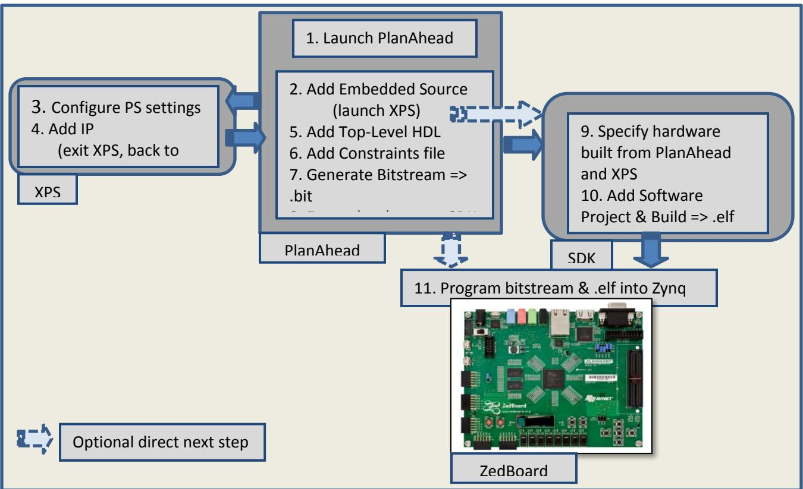

**Figure 2-1: Design Flow for Zynq**

- <span id="page-12-0"/>1. The recommended design and implementation process begins with launching the PlanAhead tools, which is the central cockpit from which design entry through bitstream generation is completed.
- 2. From PlanAhead, select Add an Embedded Source to include the ARM Cortex-A9 PS in the project. XPS is then automatically launched from PlanAhead. Selection of the PS and optional addition of PL peripherals occur within XPS.
- 3. In XPS, configure settings to make the appropriate design decisions such as selection/de-selection of dedicated PS I/O peripherals, memory configurations, clock speeds, etc.
- 4. At this point, you may also optionally add soft IP from the IP catalog or create your own customized IP. When finished, close XPS to return to PlanAhead.
- 5. Back in the PlanAhead environment, generate a top-level HDL wrapper for the processing system.
- 6. Ensure that the appropriate PL related design constraints are defined as required by the tools. If any signal coming to I/O pin is not defined then the tools will generate an error during the bitstream generation. Also, do not include pin constraints which are connected to the dedicated pins as the tools will generate the error. These constraints would typically be useful to ensure that signals to general purpose I/O such as the switches, LEDs, and Push Buttons on the ZedBoard are

© Copyright 2013 Xilinx


routed appropriately. This is done via the creation/addition of a .ucf constraints file in the PlanAhead project.

- 7. Generate the bitstream for configuring the logic in the PL if soft peripherals or other HDL are included in the design, or if hard peripheral IO was routed through the PL. At this stage, the hardware has been defined in <system.xml>, and if necessary a bitstream <system.bit> has been generated. At this point, the bitstream could be programmed into the FPGA; or it could be done from within SDK.
- 8. Now that the hardware portion of the embedded system design has been built, export it to SDK to create the software design. (A convenient method to ensure that the hardware for this design is automatically integrated with the software portion is achieved by Exporting the Hardware from PlanAhead to SDK.)
- 9. In SDK, add a software project to associate with the hardware design exported from PlanAhead.
- 10. Within SDK, for a standalone application (no operating system) create a Board Support Package (BSP) based on the hardware platform and then develop your user application. Once compiled, a <designname.elf> is generated.
- 11. The combination of the optional bitstream and the .elf file together programs the hardware and the software functionality into the Zynq device on your ZedBoard.

# <span id="page-13-0"/>2.1 **Embedded System Construction**

Creation of a Zynq system design involves configuring the PS to select appropriate peripherals. As long as the selected PS hard peripherals use Multiplexed IO (MIO) connections , and no additional logic or IP is built or routed through the PL, no bitstream is required. This chapter guides you through creating one such design, where only the PS is used.

### <span id="page-13-1"/>2.1.1 **Take a Test Drive! Creating a New Embedded Project With a Zynq Processing System**

For this test drive, you start the ISE PlanAhead design and analysis tool and create a project with an embedded processor system as the top level.

Start the PlanAhead tool,

- 1. Select **Create New Project** to open the New Project wizard.
- 2. Use the information in the table below to make your selections in the wizard screens.


| Wizard Screen       | System Property                                                                                 | Setting or Command to Use                                                   |  |  |
|---------------------|-------------------------------------------------------------------------------------------------|-----------------------------------------------------------------------------|--|--|
| Project Name        | Project name                                                                                    | Specify the project name.                                                   |  |  |
|                     | Project location                                                                                | Specify the directory in which to store<br>the project files.               |  |  |
|                     | Create Project Subdirectory                                                                     | Leave this checked.                                                         |  |  |
| Project Type        | Specify the type of sources for<br>your design. You can start with<br>RTL or a synthesized EDIF | Use the default selection, RTL Project.                                     |  |  |
| Add Sources         | Do not make any changes on this screen.                                                         |                                                                             |  |  |
| Add Existing IP     | Do not make any changes on this screen.                                                         |                                                                             |  |  |
| Add Constraints     | Do not make any changes on this screen.                                                         |                                                                             |  |  |
| Default Part        | Specify                                                                                         | Select Boards.                                                              |  |  |
|                     | Board                                                                                           | Select ZedBoard Zynq Evaluation and<br>Development Kit                      |  |  |
| New Project Summary | Project summary                                                                                 | Review the project summary before<br>clicking Finish to create the project. |  |  |

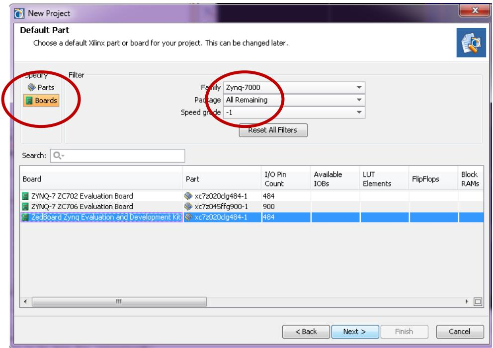


<span id="page-14-0"/>

| © Copyright 2013 Xilinx |                                               |           |  |  |
|-------------------------|-----------------------------------------------|-----------|--|--|
| Page 15                 | Zynq ZedBoard Concepts, Tools, and Techniques | 3/22/2013 |  |  |


When you click **Finish**, the New Project wizard closes and the project you just created opens in the PlanAhead design tool.

#### **Figure 2-3: PlanAhead GUI**

<span id="page-15-0"/>You'll now use the Add Sources wizard to create an embedded processor project.

- 1. Click **Add Sources** in the Project Manager.
The Add Sources wizard opens.

- 2. Select the **Add or Create Embedded Sources** option and click **Next**.
- 3. In the Add or Create Embedded Source window, click **Create Sub-Design**.
- 4. Type a name for the module and click **OK**. For this example, use the name: **system**.
- 5. Click **Finish**.
- 6. The module you created displays in the sources list.

The PlanAhead design tool creates your embedded design source project. It recognizes that you have an embedded processor system and starts XPS.


### **Continuing Your Design in XPS**

You can design a new embedded system in XPS using either of two methods:

- Using the Base System Builder (BSB) Wizard
In the BSB Wizard, you can select and configure and add default peripherals to the fabric. Xilinx recommends using the BSB wizard to create the foundation for any new embedded design project.

- Creating a Blank Project
With this option, you must manually add Processing System 7 to your design and configure the I/O interface.

#### **2.1.1.1 Designing a New Embedded System Using the BSB Wizard**

- 1. The dialog box opens, and asks if you want to create a Base System using the BSB Wizard. Select **Yes.**
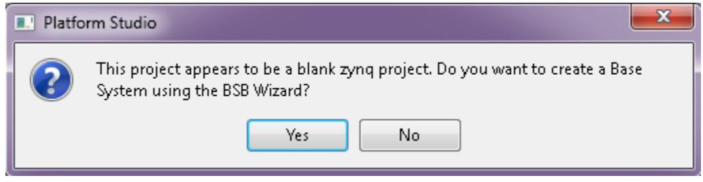

**Figure 2-4: Platform Studio dialog box**

<span id="page-16-0"/>The first window of the BSB asks you to elect whether to create an AXI-based or PLB-based system.


**Figure 2-5: Create New Project BSB Wizard**

- <span id="page-17-0"/>7. Select **AXI System** and click **OK**.
- 8. In the Base System Builder wizard, create a project using the settings described in the table. Where a setting or command has not been specified, accept the default values.


| Wizard Screen                 | System Property                  | Setting or Command to Use                                                                                                                                         |
|-------------------------------|----------------------------------|-------------------------------------------------------------------------------------------------------------------------------------------------------------------|
| Board and System<br>Selection | Board                            | Use the default option to create a system<br>for ZedBoard Zynq Evaluation and<br>Development Kit.                                                                 |
|                               |                                  | Note: This is pre-populated because you<br>selected this board in the PlanAhead tool.                                                                             |
|                               | Board Configuration              | This information is pre-populated based<br>on your board selection                                                                                                |
|                               | Select a System                  | Zynq Procesing System 7                                                                                                                                           |
| Peripheral<br>Configuration   | Select and Configure Peripherals | Remove all peripherals from the list by<br>selecting each one and clicking Remove<br>or clicking the Select All button followed<br>by clicking the Remove button. |

### **Figure 2-6: Peripheral Configuration Wizard**

<span id="page-18-0"/>

|         | © Copyright 2013 Xilinx                       |           |
|---------|-----------------------------------------------|-----------|
| Page 19 | Zynq ZedBoard Concepts, Tools, and Techniques | 3/22/2013 |


- 9. Click **Finish.**
- 10. Close the XPS window since we do not want to update, remove or add peripherals. The active PlanAhead tool session updates itself with the project settings.

#### **2.1.1.2 Designing a New Embedded System Using a Blank Project**

If you have already created a default embedded system using the BSB wizard, skip this section and move on to the following section, Exporting to SDK.

- 1. In the dialog box that opens to ask if you want to create a Base System using the BSB wizard, click **No**.
A dialog box opens, asking if you want to add one processing_system7 4.0.2.a instance to your design.

- 2. Click **Yes** to add the processor instance.
- 3. Click the **Bus Interfaces** tab. Notice that processing_system7 was added.

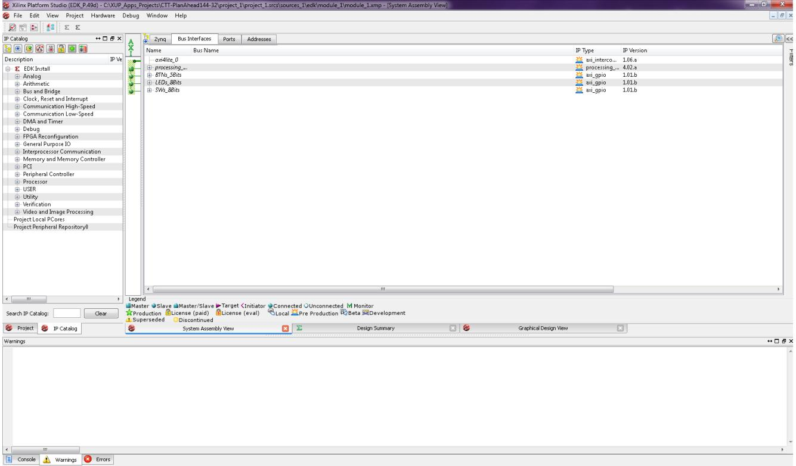

#### **Figure 2-7:Processing System 7 in the Bus Interface tab**

- <span id="page-19-0"/>4. Click the Zynq tab in the System Assembly View to open the Zynq Processing System block diagram.


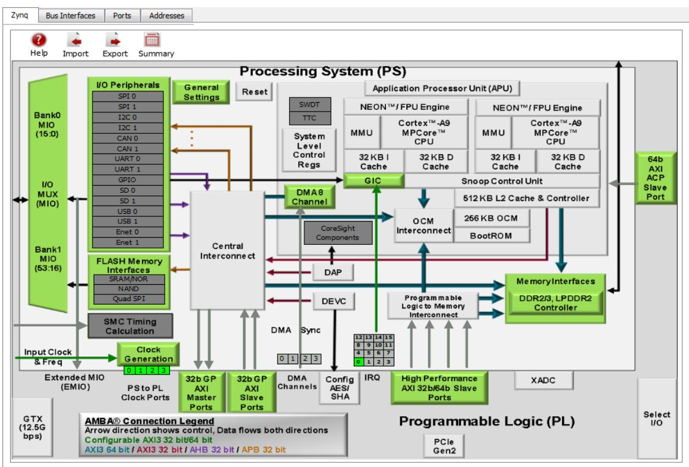

#### <span id="page-20-0"/>**Figure 2-8: System Assembly View of the Zynq Processing System Block Diagram**

Review the contents of the block diagram. The green colored blocks in the Zynq Processing System diagram are items that are configurable. You can click a green block to open the coordinating configuration window.

#### 5. Click the **Import Zynq Configurations** button .

The Import Zynq Configurations dialog box opens.

- 6. Select a configuration template file for ZedBoard. The template selected by default is the one in the installation path on your local machine that corresponds to the ZedBoard.


**Figure 2-9: Selecting ZedBoard Template**

- <span id="page-21-0"/>7. Click **OK**.
- 8. In the confirmation window that opens to verify that the Zynq MIO Configuration and Design will be updated, click **Yes**.
- 9. Note the change to the Zynq block diagram. The I/O Peripherals become active.


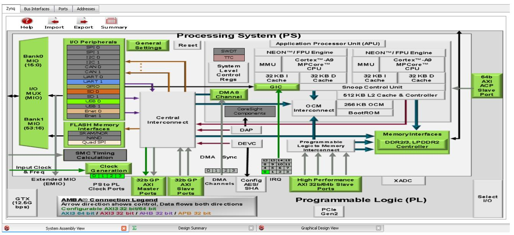

**Figure 2-10: Updated Zynq Block Diagram**

- <span id="page-22-1"/>10. In the block diagram, click the green **I/O Peripherals** box.
Many peripherals are now enabled in the Processing System with some MIO pins assigned to them per the ZedBoard layout. For example, UART1 is enabled and UART0 is disabled. This is because UART1 is connected to the USB - UART connector through UART to the USB converter chip on the ZedBoard.

- 11. Close the Zynq PS MIO Configurations window.
- 12. Close the XPS window. The active PlanAhead tool session updates with the project settings.

# <span id="page-22-0"/>2.1.2 **Take a Test Drive! Exporting to SDK**

In this test drive, you will launch SDK from the PlanAhead tool.

- 1. Under **Design Sources** in the Sources pane, select and right-click **system (system.xmp)** and select **Create Top HDL**.PlanAhead defaults to Verilog. One can choose VHDL if desired. For this test drive, the default setting will be kept.
PlanAhead generates the system_stub.v top-level module for the design.

- 2. In the PlanAhead tool, Select **File > Export > Export Hardware for SDK**.
The Export Hardware dialog box opens. By default, the Export Hardware check box is checked.

- 3. Check the **Launch SDK** check box. Leave everything else as default.
- 4. Click **OK**; SDK opens.


Notice that when SDK launches, the hardware description file is automatically read in. The system.xml tab shows the address map for the entire Processing System.

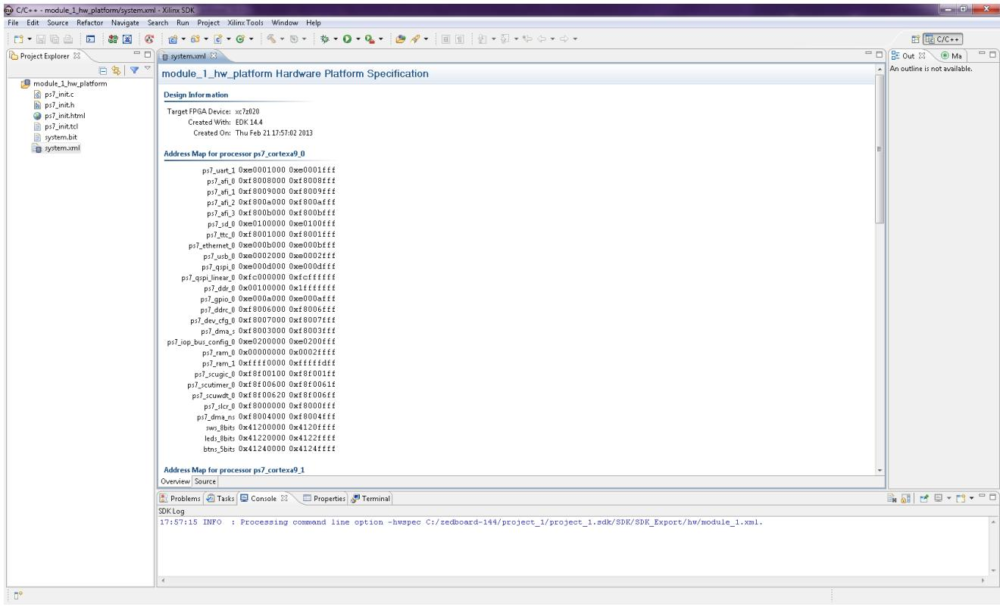

**Figure 2-11: Address Map in SDK system.xml Tab**

# <span id="page-23-0"/>**What Just Happened?**

The PlanAhead design tool exported the Hardware Platform Specification for your design (system.xml in this example) to SDK. In addition to system.xml, there are four more files relevant to SDK. They are **ps7_init.c**, **ps7_init.h**, **ps7_init.tcl**, and **ps7_init.html**.

The system.xml file opens by default when SDK is launched. The address map of your system read from this file is shown by default in the SDK window.

The **ps7_init.c** and **ps7_init.h** files contain the initialization code for the Zynq Processing System and initialization settings for DDR, clocks, plls, and MIOs. SDK uses these settings when initializing the processing system so that applications can be run on top of the processing system.

# **What's Next?**

Now you can start developing the software for your project using SDK. The next sections help you create a software application for your hardware platform.


### <span id="page-24-0"/>2.1.3 **Take a Test Drive! Running the "Hello World" Application**

- 1. Connect the 12V AC/DC converter power cable to the ZedBoard barrel jack.
- 2. Connect a USB micro cable between the Windows Host machine and the ZedBoard JTAG (J17).
- 3. Connect a USB micro cable to the USB UART connector (J14) on the ZedBoard with the Windows Host machine. This is used for USB to serial transfer.
- 4. Power on the board using the switch indicated in [Figure 2-12: ZedBoard Power](#page-24-1)  [switch and Jumper settings.](#page-24-1)

If this is your first time starting up the ZedBoard with the USB UART connected to your Windows PC, you may need to install the Cypress USB-to-UART device drivers. Please refer to the Cypress USB-to-UART Setup Guide on ZedBoard.org for more information:

<http://www.zedboard.org/documentation>

**IMPORTANT:** *Ensure that jumpers JP7 to JP11 are set as shown in the figure for the JTAG configuration mode.* 

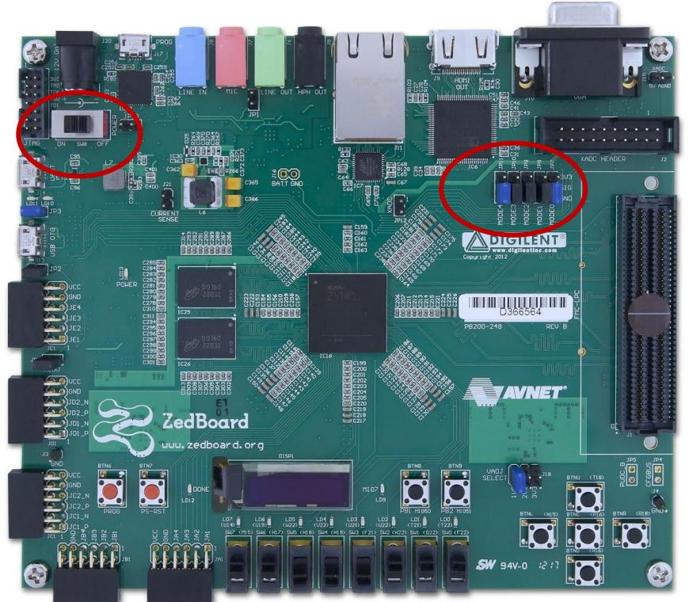

#### **Figure 2-12: ZedBoard Power switch and Jumper settings**

- <span id="page-24-1"/>5. Open SDK in case it is not already open.


- 6. Open a serial communication utility for the COM port assigned on your system.
*Note:* The default configuration for Zynq Processing System is: Baud rate 115200; 8 bit; Parity: none; Stop: 1 bit; Flow control: none. As mentioned in the Software Requirements section, third party serial terminal emulators can be used in place of the SDK terminal and is required for certain test drives.

To open a serial communication terminal in SDK:

Select **Window > Show view > Terminal** and click in the console view area**.**  Configure it with the parameters as shown below (replacing COM7 with the appropriate COM port number, verify using Control Panel > Device Manager).

**Figure 2-13:Serial Terminal Settings**

- <span id="page-25-0"/>7. In SDK, select **File > New > Application Project**.
This will open the New Project Wizard.

- 8. Use the information in the table below to make your selections on the wizard screens.


| Wizard Screen       | System Property       | Setting or Command to USe       |  |  |  |
|---------------------|-----------------------|---------------------------------|--|--|--|
| Application Project | Project name          | Hello_world                     |  |  |  |
|                     | Use default location  | Check this option               |  |  |  |
|                     | Hardware Platform     | system_hw_platform              |  |  |  |
|                     | Processor             | ps7_cortexa9_0                  |  |  |  |
|                     | OS platform           | Standalone                      |  |  |  |
|                     | Language              | C                               |  |  |  |
|                     | Board Support Package | Create New<br>: Hello_world_bsp |  |  |  |
| Click Next          |                       |                                 |  |  |  |
| Templates           | Available Templates   | Hello World                     |  |  |  |

<span id="page-26-0"/>**Figure 2-14:Application Project Wizard**


**Figure 2-15:Hello World from Available Templates**

- <span id="page-27-0"/>9. When you click **Finish**, the New Project wizard closes.
By doing so, the Hello_world application project and Hello_world_bsp BSP project get created under the project explorer. Both the Hello_world application, and its BSP are compiled automatically and the .elf file is generated. You can open the newly generated *helloworld.c* file to view the C code in the Hello_World application under the *src* folder. Notice it looks like every other Hello World program.

- 10. Watch the messages in the Console window. When the project is successfully built, you will see **Finished building: Hello_world.elf.size**.


**Figure 2-16: Successful Build**

- <span id="page-28-0"/>11. The application and its BSP are both compiled and the .elf file is generated.
- 12. Right-click **Hello_world** and select **Run as > Run Configurations**.
- 13. Right-click **Xilinx C/C++ ELF** and click **New**.
- 14. The new run configuration is created named **Hello_world Debug**.

The configurations associated with the application are pre-populated in the Main tab of the launch configurations.

- 15. Click the **Device Initialization** tab in the launch configurations and check the settings here.
Notice that there is a configuration path to the initialization TCL file ( ps7_init.tcl). This is the file that was generated when you imported your design into SDK; it contains the initialization information for the processing system when using JTAG.

- 16. The STDIO Connection tab is available in the launch configurations settings. You can use this to have your STDIO connected to the console. Note that both STDIO and Terminal connections are not permitted to use the same COM port. We will not use this now because we have already launched a serial communication utility. There are more options in launch configurations but we will focus on them later.


- 17. Click **Run**.
- 18. "Hello World" appears on the serial communication terminal.

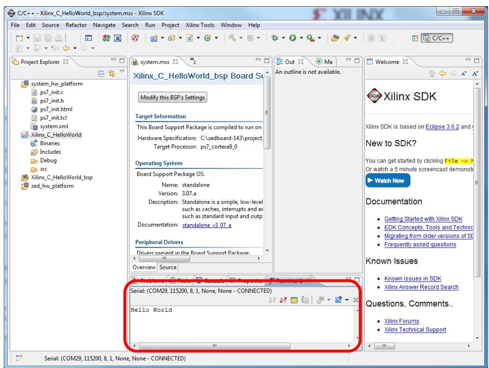

**Figure 2-17:"Hello World" on the Serial Terminal**

#### <span id="page-29-1"/>19. Close SDK.

*Note:* There was no bitstream download required for the above software application on the ZedBoard. The ARM Cortex-A9 dual core is already present on the board. Basic initialization of this system to run a simple application is done by the device initialization TCL script.

### <span id="page-29-0"/>2.1.4 **Additional Information**

## **Board Support Package**

The Board Support Package (BSP) is the support code for a given hardware platform or board that initializes the board at power up for software applications to execute on the platform. It can be specific to some operating systems with bootloader and device drivers.

# **Standalone OS**

Standalone applications do not utilize an Operating System (OS). They are sometimes also referred to as bare-metal applications. Standalone applications have access to basic processor features such as caches, interrupts, exceptions as well as


other simple features specific to the processor. These basic features include standard input/output, profiling, abort, and exit. It is a single threaded semi-hosted environment.

The application you ran in this chapter was created on top of a BSP built for the ZedBoard.


# <span id="page-31-0"/>**Chapter 3 Embedded System Design Using the Zynq Processing System and Programmable Logic**

One of the unique features of using the Zynq AP SoC as an embedded design platform is in using the available PL in addition to the Zynq PS for its ARM Cortex-A9 MPCore processing system.

In this chapter we will be creating a design with:

- PL-based AXI GPIO and AXI Timer with interrupt from the PL to PS section
- ChipScope IP instantiated in the PL
- Zynq PS GPIO pin connected through the PL pins routed via the Extended MIO (EMIO) interface

The flow of this chapter is similar to that in **Chapter 2**. If you have skipped that chapter, you might want to look at it because we will refer to it many times in this chapter.

# <span id="page-31-1"/>3.1 **Adding soft IP in the PL to interface with the Zynq PS**

Complex soft peripherals can be added into the PL to be tightly coupled with the Zynq PS. This section covers a simple example with AXI GPIO, AXI Timer with interrupt, PS section GPIO pin connected to a PL side pin via the EMIO interface, and ChipScope instantiation for proof of concept.

The block diagram for the system is as shown in [Figure 3-1: Block Diagram.](#page-32-0)


<span id="page-32-0"/>X-Ref Target - Figure 3‑1

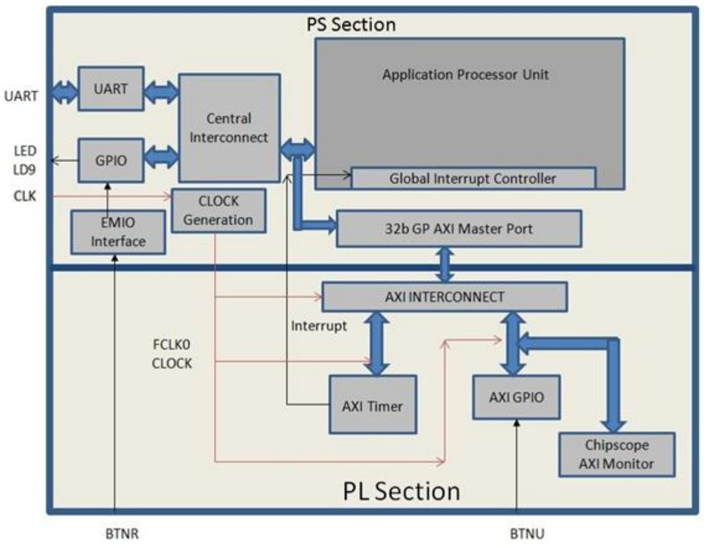

**Figure 3-1: Block Diagram**

This system covers the following connections:

- The PL-side AXI GPIO has only a 1 bit channel and it is connected to the pushbutton 'BTNU' on the ZedBoard
- The PS section GPIO also has a 1 bit interface routed to PL pin via the EMIO interface and connected to the push-button 'BTNR' on the board
- In the PS section another 1 bit GPIO is connected to the LED 'LD9' on board which is on the MIO port
- An AXI timer interrupt is connected from PL to PS section interrupt controller. The timer starts when the user presses any of the selected push buttons on board and toggles the LED 'LD9' on board

You will write application software, which takes input from the user to select the push button on the board and waits for the user to press that particular push button. When the push button is pressed, the timer starts automatically, turns OFF the LED and waits for the timer interrupt to happen. After the Timer Interrupts, the LED switches ON and execution starts again, and it waits for a valid selection from the user.


You will add the ChipScope Integrated Controller (ICON) and AXI Monitor IPs to the design so that in a later section you can learn how to debug hardware using the AXI monitor.

The sections of **Chapter 2** are valid for this design flow also. You'll use the system created in that chapter and pick up the procedure following **2.1.1 Take a Test Drive! Creating a New Embedded Project With a Zynq Processing System.**

### <span id="page-33-0"/>3.1.1 **Take a Test Drive! Check Functionality of IP instantiated in the PL**

In this test drive, you'll check the functionality of the AXI GPIO, AXI Timer with interrupt instantiated in PL and EMIO interface.

- 1. In the PlanAhead tool Sources pane, invoke XPS by double-clicking system_isystem(system.xmp).
This is the embedded source you created in section 2.1.1.

- 2. In the XPS System Assembly View, click the **Bus Interfaces** tab.
- 3. From the IP catalog, expand **General Purpose IO** and double-click **AXI General Purpose IO** to add it.

A message appears asking if you want to add the axi_gpio 1.01.b IP instance to your design.

- 4. Click **Yes**.
The configuration window for GPIO opens.

- 5. Expand Channel 1 to view configuration parameters for channel 1.
- 6. Notice GPIO Data Channel Width with value 32. Change it to 1 as your design needs only one bit of input to work. Leave all other parameters as they are.
- 7. Click **OK**.

A message window opens with the message "axi_gpio IP with version number 1.01.b is instantiated with name axi_gpio_0". It will ask you to determine to which processor to connect. Remember you are designing with a dual core ARM processor. The message also says XPS will make the Bus Interface Connection, assign the address, and make IO ports external.

The default choice of processor is "processing_system7_0". Do not change this.

- 8. Click **OK**.
There are a few connections that are not done automatically and must be done manually.


**Note:** The AXI interconnect automatically gets instantiated between the PL IPs and the PS Section's Interconnect. In this example, AXI GPIO is connected to PS through AXI interconnect.

#### 9. In the IP Catalog, expand **DMA and Timer** and double-click the **AXI Timer/Counter** IP to add it.

A dialog box appears asking if you want to add the axi_timer_1.03.a IP instance to your design.

10. Click **Yes**.

The configuration window for axi_timer_1.03.a opens. Leave all parameters as they are.

- 11. Click **OK**.
A message window opens with the message "axi_timer IP with version number 1.03.a is instantiated with name axi_timer_0." It will ask you to determine to which processor to connect. Remember you are designing with a dual core ARM processor. The message also says XPS will make the Bus Interface Connection, assign the address, and make IO ports external.

The default choice of processor is "processing_system7_0". Do not change this.

12. Click **OK**.

You'll connect the AXI timer's Interrupt port to the PS section's interrupt manually in this section.

- 13. In the IP Catalog, expand **Debug** and add two IPs to the design: **ChipScope AXI Monitor** and **ChipScope Integrated Controller**. Do not make changes to the configuration of either IP.
- 14. Click the **Ports** tab, which lists the IPs and their ports. Expand axi_interconnect_1, axi_gpio_0, axi_timer_0, chipscope_axi_monitor_0, and chipscope_icon_0.
- 15. Review the following IP connections. If any of these aren't already connected, connect them now.


| IP                      | Port                               | Connection                                         |  |
|-------------------------|------------------------------------|----------------------------------------------------|--|
| axi_interconnect_1      | INTERCONNECT_ACLK                  | processing_system7_0 : FCLK_CLK0                   |  |
|                         | INTERCONNECT_ARESETN               | processing_system7_0::FCLK_RESET0_N                |  |
| axi_gpio_0              | (BUS_IF) S_AXI::S_AXI_ACLK         | processing_system7_0 : FCLK_CLK0                   |  |
|                         | (IO_IF) gpio_0::GPIO_IO            | External Ports<br>::axi_gpio_0_GPIO_IO_pin         |  |
| axi_timer_0             | (BUS_IF)<br>S_AXI_::S_AXI_ACLK     | processing_system7_0: FCLK_CLK0                    |  |
| Chipscope_axi_monitor_0 | CHIPSCOPE_ICON_CONTROL             | chipscope_icon_0 ::control0                        |  |
|                         | (BUS_IF) MON_AXI::<br>MON_AXI_ACLK | processing_system7_0: FCLK_CLK0                    |  |
| Chipscope_icon_0        | Control0                           | Chipscope_axi_monitor0::CHIPSCOPE_I<br>CON_CONTROL |  |

Your Ports tab should be similar to Figure 3-2: Completed Port Connections.

#### <span id="page-35-0"/>**Figure 3-2:Completed Port Connections**


- 16. Collapse all IPs and expand processing_system7_0. If the following port connection is not made, do it now. It should look like Figure 3- 3:Processing_system7_0 Expanded and M_AXI_GPO_ACLK Connected.

| IP                   | Port                                   | Connection                        |
|----------------------|----------------------------------------|-----------------------------------|
| Processing_system7_0 | (BUS_IF) M_AXI_GP0::<br>M_AXI_GPO_ACLK | processing_system7_0 :: FCLK_CLK0 |

#### <span id="page-36-0"/>**Figure 3-3:Processing_system7_0 Expanded and M_AXI_GPO_ACLK Connected**

- 17. Connect the Timer interrupt on the PL side to the PS side interrupt controller by doing the following:
	- a. In the Connected Port column, click **L to H:No Connection** of the IRQ_F2P port of the Processing_system_7_0 instance.

The Interrupt Connection dialog box opens.

© Copyright 2013 Xilinx


- b. In the Unconnected Interrupts list, select axi_timer_0 and click the right arrow button to move it to the Connected Interrupts list. The figure displays the axi_timer_0 interrupt instance connected with Interrupt ID 91.

**Figure 3-4:Interrupt Connection Dialog Box**

- <span id="page-37-0"/>c. Click **OK**.
XPS connects the timer interrupt on the Programmable Logic side to the PS section interrupt controller.

### <span id="page-37-1"/>**Figure 3-5:Timer Interrupt Connected on the PL side**

- 18. Click the **Bus Interfaces** tab and expand chipscope_axi_monitor_0.
- 19. In the **Bus Name** column, click **No Connection**. Using the drop-down list that appears, connect chipscope_axi_monitor to axi_gpio_0.S_AXI.

By making this connection, you can monitor any type of AXI-related transactions on the axi_gpio_0 slave AXI bus using the ChipScope Analyzer tool.

### **Figure 3-6:Connected chipscope_axi_monitor**

<span id="page-37-2"/>

|         | © Copyright 2013 Xilinx                       |           |
|---------|-----------------------------------------------|-----------|
| Page 38 | Zynq ZedBoard Concepts, Tools, and Techniques | 3/22/2013 |


- 20. Route the PS section GPIO to the PL side I/O pad using the EMIO interface by doing the following:
	- a. In the XPS System Assembly View, click the **Zynq** tab.
	- b. Click **I/O Peripherals** box to open the **Zynq PS Configuration** dialog box.
	- c. In the **Zynq PS Configuration** tab, expand the **GPIO** item.
	- d. Click on the checkbox to select the **EMIO GPIO (Width)** option box.

The **Width of GPIO on EMIO interface** setting is enabled on the next row. The default setting is 64.

- e. Change the GPIO width to **1** in the drop-down menu. Click the Close button to close the window and return to the System Assembly View.
- f. In the System Assembly View, click the Ports tab and expand processing_system7_0. You can see that the GPIO port is not connected to an external port.

#### **Figure 3-7: GPIO Port Not Connected to External Ports**

- <span id="page-38-0"/>21. Expand (IO_IF)GPIO_0 and select **GPIO**
- 22. Click the drop-down arrow in the **Connected Port** column and select **External Ports**. Make a connection to **processing_system7_0_GPIO_pin**.

Making this connection allows you to assign the PL section pin location to the PS GPIO in the user constraint file (UCF) later in this chapter.

#### 23. Run **Project > Design Rule Check**.

#### **Figure 3-8: Design Rule Check Warnings**

- <span id="page-38-1"/>24. Close XPS. The PlanAhead design tool window becomes active again.
- 25. In Design Sources, click on your XMP file, then right-click it and select **Create Top HDL**. The PlanAhead tool updates the system_stub.v file.
- 26. In the Project Manager list of the Flow Navigator, click **Add Sources**.
- 27. In the dialog box that opens, select **Add or Create Constraints**, then click **Next**.

© Copyright 2013 Xilinx


- 28. Click **Create File**. In the Create Constraints File dialog box that opens, name the file **system** and click **OK**.
- 29. Click **Finish**.
- 30. Expand the **Constraints** folder in the Sources window. Notice that the blank file system.ucf was added inside constrs_1.Double-click system.ucf to open it in the editor.

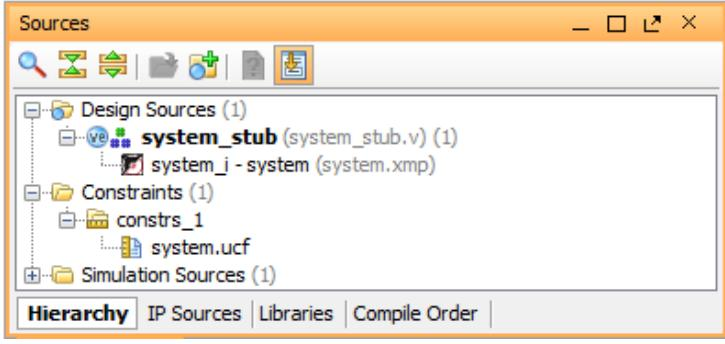

**Figure 3-9: system.ucf File Added**

- <span id="page-39-0"/>31. Type the following text in the UCF file:
#### **# Connect to Push Button "BTNU"**

#### **NET axi_gpio_0_GPIO_IO_pin IOSTANDARD=LVCMOS25 | LOC=T18;**

#### **# Connect to Push Button "BTNR"**

#### **NET processing_system7_0_GPIO_pin IOSTANDARD=LVCMOS25 | LOC=R18;**

The following settings are made:

- The LOC constraint for NET "axi_gpio_0_IO_pin" connects the AXI GPIO pin to the T18 pin of the PL section and physically connects it to the BTNU push button on the board.
- The LOC constraint for NET "processing_system7_0 GPIO pin" connects the PS section GPIO to the R18 pin of the PL section and physically connects it to the BTNR push button on the board.
- The IOSTANDARD=LVCMOS25 constraint sets both pins to LVCMOS 2.5V I/O standard.
- 32. Save all modified files.
- 33. In the Program and Debug list in the Flow Navigator, click **Generate Bitstream**.

Note that a dialog box will appear to warn you that synthesis is not run on the updated files, click Yes to run synthesis. Generating the bitstream may invoke the entire implementation process after synthesis, click yes to run

© Copyright 2013 Xilinx


implementation as well when prompted. This may take a while. During this time, you should pay attention to the console messages.

- 34. After the Bitstream generation completes select **Open Implemented Design**  in the dialog box and click **OK.** This allows you to get a graphical overview of the PL resource usage and routing. Ignore any critical warnings that appear. Export the hardware (make sure that you enable the "Include Bitstream" option) and Launch SDK as described in **Chapter 2**. For this design, since there is a bitstream generated for the PL, this will also be exported to SDK.
# <span id="page-40-0"/>3.1.2 **Take a Test Drive! Working with SDK**

SDK launches with the "Hello World" project you created with the Standalone PS in **Chapter 2**.

**Note:** You should use an external terminal emulator program (PuTTY or Tera Term) in place of the SDK Terminal utility due to a compatibility issue between the ZedBoard and the SDK terminal. Please make sure that the terminal emulator program uses the recommended connection settings from Figure 2-13.

- 1. Select **Project > Clean** to clean and build the project again.
- 2. Open the helloworld.c file and modify the application software code. Refer to **Appendix A, Application Software** for the application software details.
- 3. Connect and power-on the board.
- 4. Open the serial communication utility with baud rate set to **115200**.
- 5. Because you have a bitstream for the PL, you must download the bitstream. To do this, select **Xilinx Tools > Program FPGA**. The Program FPGA dialog box, shown below, opens. It displays the bitstream exported from PlanAhead. Please make sure the bitstream path points to your current project.


#### **Figure 3-10:Program FPGA Dialog Box**

- <span id="page-41-2"/>6. Click **Program** to configure the PL with the bitstream. The Blue DONE LED (LD12) will light up.
- **7.** Run the application similar to the steps in **Take a Test Drive! Running the "Hello World" Application.**
- 8. In the system, the AXI GPIO pin is connected to push button BTNU on the board, and the PS section GPIO pin is connected to push button BTNR on the board via an EMIO interface.
- 9. Follow the instructions shown on the serial terminal to run the application.

# <span id="page-41-0"/>**Chapter 4 Debugging with SDK and ChipScope Pro**

This chapter describes two types of debug possibilities with the design flow you've already been working with. The first option is debugging with software using SDK. The second option is hardware debug supported by the ChipScope software.

# <span id="page-41-1"/>4.1 **Take a Test Drive! Debugging with Software, Using SDK**

First you will try debugging with software using SDK. This step assumes the PL is still configured from the previous chapter.

- 1. In the C/C++ Perspective, right-click on the Hello_world Project and select **Debug As > Debug Configurations**. Check that settings are correct for your debug operation.
- 2. Click **Debug**.


- 3. A dialog box appears with a question about the reset properties of your system.
- **4.** Click **OK.**

Another dialog box appears to notify you that this kind of launch is configured to open the Debug perspective when it suspends.

- 5. Click **Yes**. The Debug Perspective opens.
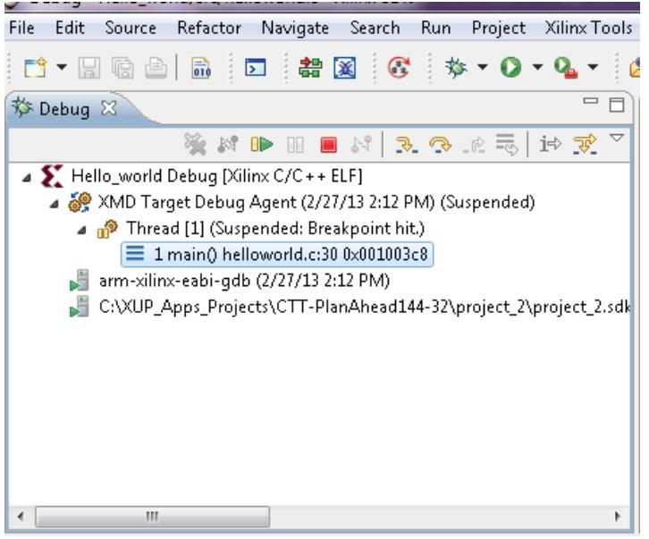

**Figure 4-1: Debug Perspective Suspended**

<span id="page-42-0"/>**Note:** The address shown on this page might be different from the addresses shown on your system.

The processor is currently sitting at the beginning of main() with program execution suspended at line 0x001003c8. You can confirm this information with the Disassembly view, which shows the assembly-level program execution also suspended at 0x001003c8.

*Note:* If the disassembly view is not visible, select **Window > Show view > Disassembly**.

The helloworld.c window also shows execution suspended at the first executable line of C code. Select the Registers view to confirm that the program counter, pc register, contains 0x00100608.

*Note:* If the Registers window is not visible, select **Window > Show View > Registers**.

- 6. Double-click in the margin of the helloworld.c window next to the line of code that reads init_platform (). This sets a breakpoint at init_platform (). To confirm the breakpoint, review the Breakpoints window.
© Copyright 2013 Xilinx


If the Breakpoints window is not visible, select **Window > Show View > Breakpoints**.

- 7. Select **Run > Resume** to resume running the program to the breakpoint.
Program execution stops at the line of code that includes init_platform (). The Disassembly and Debug windows both show program execution stopped at 0x001014c0.

- 8. Select **Run > Step Into** to step into the init_platform () routine.
Program execution suspends at location 0x00101810. The call stack is now two levels deep.

- 9. Select **Run > Resume** again to run the program to conclusion by hitting any key to end the application in the terminal window.
When the program completes running, the Debug window shows that the program is suspended in a routine called exit. This happens when you are running under control of the debugger.

- 10. Re-run your code several times. Experiment with single-stepping, examining memory, changing breakpoints, modifying code, and adding print statements. Try adding and moving views.
- 11. Close SDK.

# <span id="page-43-0"/>4.2 **Take a Test Drive! Debugging Hardware Using ChipScope Software**

Next you will try debugging hardware using the ChipScope Analyzer software using the same application you created in **3.1.2 Take a Test Drive! Working with SDK**.

- 1. Re-download the bitstream and application on the ZedBoard.
**Note:** You will need an external terminal emulator of your choice with the serial connection set to the aforementioned settings in this document before running the C/C++ application. This exercise will not be using the built in terminal emulator in SDK but will require user inputs via the keyboard.

- 2. Run the application and close the SDK.
- 3. Open ChipScope Pro Analyzer. It is preferred that you launch from within PlanAhead, although it is also launchable as an independent program from the Windows Start Menu.
- 4. Click the **Open/Search JTAG Cable** button .


- 5. Click **OK** after ChipScope Pro Analyzer identifies the JTAG chain. You should see two devices identified the **ARM_DAP (MyDevice0)** and the **XC7Z020 (MyDevice1)**.


- 6. Import a *.cdc file in ChipScope and by doing the following:
	- a. Select **Dev 1 Mydevice1(XC7Z020)**.
	- b. Select **File > Import**.
	- c. Click **Select New File** and select the chipscope_axi_monitor_0.cdc file from **<project_path>\<project_name>.srcs\sources_1\edk\system\implementati on\chipscope_axi_monitor_0_wrapper**.
	- d. Click **OK**.
- 7. Set a trigger at the "ARVALID" signal by doing the following.
	- a. Expand the Trigger Setup window.
	- b. Double-click M1:MON_AXI_ARADDRCONTROL. For the M1:MON_AXI_ARADDRCONTROL unit, change the value of axi_gpio_0.S_AXI/MON_AXI_ARVALID from the default of **X** to **1**. With this setting, any positive transaction on this signal triggers the analyzer and waveform will be displayed.

**Figure 4-2: Trigger Setup Window, MON_AXI_ARVALID Setting**

- <span id="page-44-0"/>c. In the Trig section of the Trigger Setup window, click **M0** in the **Trigger Condition Equation** column.
The Trigger Condition dialog box opens.

- d. In the **Enable** column, unselect **M0** and select **M1**.


The trigger channel changes from M0 to M1; the ARVALID signal is on the M1 channel.

**Figure 4-3: Trigger Condition Dialog Box**

<span id="page-45-0"/>Click **OK**.

- 8. In the Capture section of the Trigger Setup window, change the **Position** setting from **0** to **512**.
The Trigger Point moves to the middle of the waveform as the sample depth changes to 1024.

- 9. Click the **Run** button .
ChipScope Analyzer waits for the trigger event.

- 10. Follow the instructions on the serial terminal to select the AXI GPIO use case. This triggers the waveform.


**Figure 4-4:Waveform captured in Chipscope**

- <span id="page-46-0"/>11. Exit the program, close the ChipScope Analyzer without saving the project, and close the SDK.


# <span id="page-47-0"/>**Chapter 5 Booting Linux and Application Debugging Using SDK**

This chapter describes the steps to boot the Linux OS on the Zynq-7000 AP SoC ZedBoard. It covers programming of the following non-volatile memories with the Linux precompiled images, which are used for automatic Linux booting after switching on the board:

- On-board QSPI Flash
- SD card

This chapter also describes using the SDK remote debugging feature to debug Linux applications running on the ZedBoard. The SDK tool software runs on the Windows host machine. For application debugging, SDK establishes an Ethernet connection to the target board that is already running the Linux OS.

# <span id="page-47-1"/>5.1 **Requirements**

The target hardware platform is the ZedBoard. The host platform is a Windows machine running the ISE Design Suite Tools 14.4 WebPACK.

*Note:* The U-Boot universal bootloader is required for the tutorials in this chapter. This is included in the precompiled images supplied with this document.

The zipfile includes these files (in addition to others used in other sections):

- BOOT.bin: Binary image containing the FSBL and U-Boot images produced by bootgen
- bootimage.bif: The file to control bootgen during the creation of BOOT.BIN
- devicetree.dtb: Device tree binary large object (blob) used by Linux, loaded into memory by U-Boot. Note, the devicetree.dtb will not work if the hardware design has different peripherals specified
- ramdisk8M.image.gz: Ramdisk image used by Linux, loaded into memory by U-Boot
- README.txt: Description of the release
- u-boot.elf: U-Boot file used to create the BOOT.BIN image
- zImage: Linux kernel image, loaded into memory by U-Boot
- zynq_fsbl_0.elf: FSBL image used to create BOOT.BIN image

#### © Copyright 2013 Xilinx


- hello_world_linux.c: sample 'hello world' c file used
- stub.tcl: script file specific to the ZedBoard rev C

# <span id="page-48-0"/>5.2 **Booting Linux on a ZedBoard**

This section covers the flow for booting Linux on the target board using the provided precompiled images.

#### <span id="page-48-1"/>5.2.1 **Boot Methods**

The following boot methods are available:

- Master Boot Method
- Slave Boot Method

#### **Master Boot Method**

In the master boot method, different kinds of non-volatile memories like QSPI, NAND, NOR flash, and SD cards are used to store boot images. In this method, the CPU loads and executes the external boot images from non-volatile memory into the Processor System (PS). The master boot method is further divided into Secure and Non Secure modes. Refer to the Zynq-7000 All Programmable SoC Technical Reference Manual (UG585) for more detail.

The boot process is initiated by the ARM Cortex-A9 CPU0 in the PS and it executes onchip ROM code. The on-chip ROM code is responsible for loading the first stage boot loader (FSBL). The FSBL does the following:

- Configures the FPGA with the hardware bitstream (if it exists)
- Configures the MIO interface
- Initializes the DDR controller
- Initializes the clock PLL
- Loads and executes the Linux U-Boot image from non-volatile memory to DDR

The U-Boot loads and starts the execution of the Kernel image, the root file system, and the device tree from non-volatile memory to DDR. It finishes booting Linux on the target platform.


#### **Slave Boot Method**

JTAG can only be used in slave boot mode. An external host computer acts as the master to load the boot image into the OCM using a JTAG connection.

The PS CPU remains in idle mode while the boot image loads. The slave boot method is always a non-secure mode of booting.

In JTAG boot mode, the CPU enters the halt mode immediately after it disables access to all security related items and enables the JTAG port. You must download the boot images into the DDR memory before restarting the CPU for execution.

#### <span id="page-49-0"/>5.2.2 **Booting Linux from JTAG**

The flowchart illustrates the process used to boot Linux on the ZedBoard.

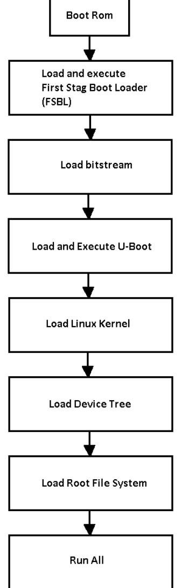

**Figure 5-1: Linux Boot Process on the ZedBoard**

<span id="page-49-1"/>© Copyright 2013 Xilinx Page 50 Zynq ZedBoard Concepts, Tools, and Techniques 3/22/2013


### <span id="page-50-0"/>5.2.3 **Take a Test Drive! Booting Linux in JTAG Mode**

- 1. Check the board connections and settings:
	- a. Ensure that the jumpers JP7-JP11 are set as shown in [Figure 5-2:Jumper](#page-50-1)  [Settings to boot in JTAG mode.](#page-50-1)

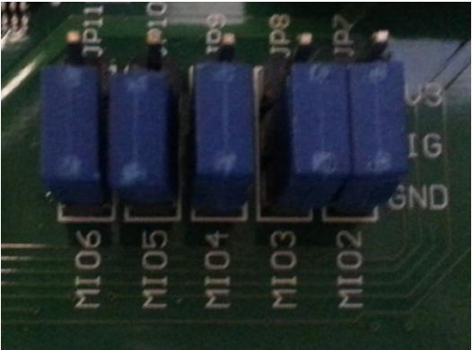

#### **Figure 5-2:Jumper Settings to boot in JTAG mode**

- <span id="page-50-1"/>b. Connect an Ethernet cable from the Zynq board to your Windows host machine.
- c. Connect the power cable to the board.
- d. Connect the USB programming micro cable between the Windows Host machine and Prog USB port on the Target board.
- e. Connect a USB micro cable to the USB UART connector on the ZedBoard with the Windows Host machine. This is used for USB to serial transfer.
- 2. Power on the ZedBoard.
- 3. Launch the SDK standalone and open the same workspace that you used in [Chapter 2](#page-11-0) and [Chapter 3.](#page-31-0) The workspace directory is found at the following location: **<path to project>/project_1.sdk/SDK/SDK_Export/**
- 4. If the serial terminal is not open, connect the serial communication utility with the baud rate set to 115200.
- 5. Open the XMD tool by selecting **Xilinx Tools > XMD console**
- 6. At the XMD prompt, do following:
	- a. Type **connect arm hw** to connect with the PS section CPU.


- b. Type **source <path to project>/project_1.sdk/SDK/SDK_Export/hw/ ps7_init.tcl** and then type **ps7_init** at the command prompt to initialize the PS section (such as Clock PLL, MIO, and DDR initialization).
**-----------------------------------------------------------------------------------**

**IMPORTANT!** If you are using a rev C Zedboard, follow steps c and d. Otherwise, skip to step e.

**-**----------------------------------------------------------------------------------

- c. At the command prompt type source <directory>/stub.tcl
**Note:** Where stub.tcl is located in the location where you unzipped the contents of the downloaded zip file.

- d. Type **target 64** to provide execution control to CPU0.
- e. Type **dow <directory>/u-boot.elf** to download Linux U-Boot.
- f. Type **con** to start execution of U-Boot. Immediately switch to the serial terminal.

On the serial terminal, the autoboot countdown message appears:

Hit any key to stop autoboot: 3

- g. Press any key.
Automatic booting from U-Boot stops and a command prompt appears on the serial terminal.

- h. At the XMD Prompt, type **stop**.
The U-Boot execution is stopped.

- i. Type **dow -data <directory>/zImage.bin 0x8000** to download the Linux Kernel image (zImage) at location 0x8000.
- j. Type **dow -data <directory>/ramdisk8M.image.gz 0x800000** to download the Linux root file system image at location 0x800000.
- k. Type **dow -data <directory>/devicetree.dtb 0x1000000** to download the Linux device tree at location 0x1000000.
- l. Type **con** to start executing U-Boot.
- 7. At the command prompt of the serial terminal, type **go 0x8000**.


The Linux OS boots. After booting completes, the **zynq>** prompt appears on the serial terminal

- 8. At the **zynq>** prompt, do the following:
	- a. Set the IP address of the board by typing the following command at the **zynq>** prompt: **ifconfig eth0 192.168.1.10 netmask 255.255.255.0**

This command sets the board IP address to 192.168.1.10.

- b. Check the connection with the board by typing **ping 192.168.1.10**. The following ping response displays in a continuous loop:
64 bytes from 192.168.1.10: seq=0 ttl=64 time=0.185 ms

This response means that the connection between the Windows host machine and the target board is established.

- c. Press **Ctrl+C** to stop displaying the ping response.
Linux booting completes on the target board and the connection between the host machine and the target board is done.

#### <span id="page-52-0"/>5.2.4 **Booting Linux from QSPI Flash**

### <span id="page-52-1"/>5.2.5 **Take a Test Drive! Booting Linux from QSPI Flash**

This Test Drive covers the following steps:

- 1. Create the First Stage Boot Loader Executable File.
- 2. Make a Linux Bootable Image for QSPI Flash.
- 3. Program QSPI Flash with the Boot Image using JTAG.
- 4. Booting Linux from QSPI Flash.

#### **1. Step 1: Create the First Stage Boot Loader Executable File**

*Note:* You can skip this step by using the zynq_fsbl_0.elf provided.

- 1. In SDK, select **File > New > Application Project**.
The New Project wizard opens; for **Project Name**, type in **zynq_fsbl_0** and click **Next**.

- 2. Select **Zynq FSBL** in the Template list and keep the remaining default options. The Location of your project, the hardware platform used, and the processor are visible in this window. The processor is ps7_cortexa9_0.


- 3. Click **Finish** to generate the FSBL.
The Zynq FSBL compiles and .elf file is generated.

#### **2. Step 2: Make a Linux Bootable Image for QSPI Flash**

#### 1. In SDK, select **Xilinx Tools > Create Zynq Boot Image**.

The 'Create Zynq Boot Image' wizard opens.

- 2. Provide the path to zynq_fsbl_0.elf in the FSBL ELF field.
- 3. Add the provided U-Boot image.
- 4. Add the Linux Kernel image, zImage.bin, and provide the offset **0x100000**.

**IMPORTANT:** *There is a Known Issue with the Bootgen command: it does not accept a file without a file extension. To work around this issue, change the zImage downloaded file to zImage.bin.*

- 5. Add the device tree image (devicetree.dtb) and provide offset **0x3c0000.**
- 6. Add the root file system image (ramdisk8M.image.gz) and provide offset **0x400000**.

The provided offsets are predefined in the U-Boot. U-Boot expects those addresses when booting from QSPI, therefore you must not change the offset without modifying and re-building the U-Boot image.

- 7. Provide the absolute path to the output folder name in the Output older tab. In this example, we have used "qspi-boot" as the folder to store the output files.


**Figure 5-3:Creating a Zynq QSPI Boot Image**

#### <span id="page-54-0"/>8. Click **Create Image.**

The Create Zynq Boot Image window creates following files in the specified output folder:

bootimage.bif

u-boot.bin

u-boot.mcs

#### **3. Step 3: Program QSPI Flash with Boot Image using JTAG & UBoot**

- 1. Power on the ZedBoard.
- 2. Set the Jumpers JP7-11 to the JTAG boot mode:

MI06: 0 MI05: 0 MI04: 0

- MI03: 0
- 

MI02: 0


- 3. If a serial terminal is not open, connect the serial terminal with the baud rate set to 115200.
- 4. Select **Xilinx Tools > XMD Console** to open the XMD tool.
- 5. From the XMD prompt, do the following:
	- a. Type **connect arm hw** to connect with the PS section CPU.
	- b. Type **source ps7_init.tcl** and then **ps7_init** to initialize the PS section (such as Clock PLL, MIO, and DDR initialization).
	- c. Type **dow <directory>/u-boot.elf** to download the Linux U-Boot to the QSPI Flash.

**Note:** The <directory> is the output directory you previously provided.

- d. Type **dow -data <boot_directory>/u-boot.bin 0x08000000** to download the Linux bootable image to the target memory at location 0x08000000.
You just downloaded the binary executable to DDR memory. You can download the binary executable to any address in DDR memory, but make sure that you do not change the U-Boot executable, which is loaded at 0x04000000. You run this file after loading the u-boot.bin data file.

- e. Type **con** to start execution of U-Boot.
On the serial terminal, the autoboot countdown message appears:

```
Hit any key to stop autoboot: 3
```
- 6. Press Enter.
Automatic booting from U-Boot stops and the **zed-boot>** command prompt appears on the serial terminal.

- 7. Do the following steps to program U-Boot with the bootable image:
	- a. At the prompt, type **sf probe 0 0 0** to select the QSPI flash.
	- b. Type sf erase **0 0x01000000** to erase the Flash data. (Note that this step can take about 8 minutes to complete.)
	- c. Type **sf write 0x08000000 0 0xFFFFFF** to write the boot image on the QSPI Flash.

Note that you already copied the bootable image at DDR location 0x08000000. This command copied the data, of the size equivalent to the bootable image siz e, from DDR to QSPI location 0x0.

You can change the argument to adjust the bootable image size.


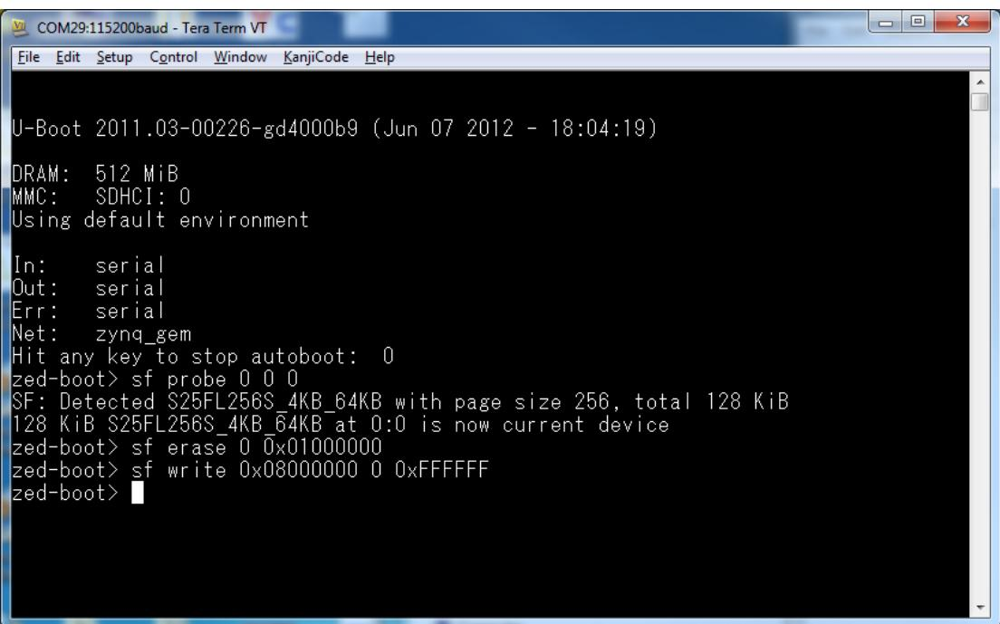


- <span id="page-56-0"/>8. Power off the board.
#### **4. Booting Linux from the QSPI Flash**

- 1. After you program the QSPI Flash, set the jumper settings (JP7-11) on the ZedBoard. Jumper settings for QSPI:
MI06: 0 MI05: 1 MI04: 0

MI03: 0

MI02: 0

- 2. Connect the Serial terminal with a 115200 baud rate setting.
- 3. Switch on the board power.

A Linux booting message appears on the serial terminal. After booting finishes, the **zynq>** prompt appears.


**Figure 5-5:Serial Terminal Window showing Linux Booting**

#### <span id="page-57-2"/><span id="page-57-0"/>5.2.6 **Booting Linux from the SD Card**

### <span id="page-57-1"/>5.2.7 **Take a Test Drive! Booting Linux from the SD Card**

Ensure that the jumper settings (JP7-11) are set to boot from SD card as shown in the figure.

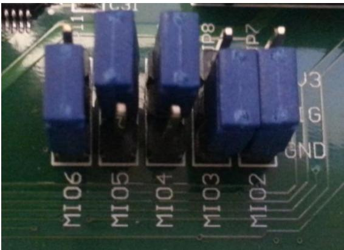

### **Figure 5-6:Jumper Settings to boot from SD Card**

- <span id="page-57-3"/>1. Create an FSBL for your design as described in "Step 1: Create the First Stage Boot Loader Executable File" . Alternatively, you can use the zync_fsbl_0.elf file that you downloaded previously.


- 2. In SDK, select **Xilinx Tools > Create Zynq Boot Image** to open the "Create Zynq Boot Image" wizard. Alternatively, you can use the u-boot.bin file that you downloaded previously, and skip to step 6.
- 3. Add zynq_fsbl_0.elf and u-boot.elf.
- 4. Provide the location to store all generated files in the Output Folder field. Make sure to rename
- 5. Click **Create Image**. SDK generates the u-boot.bin file in the specified output folder.
- 6. Rename u-boot.bin to BOOT.bin. Copy BOOT.bin, zImage, devicetree.dtb and ramdisk8M.image.gz to the SD card. Make sure the SD card is FAT32 formatted before copying the files into it.
- 7. Turn on the power to the board and check the messages on the Serial terminal. The **zynq>** prompt appears after Linux booting is complete on the target board.

# <span id="page-58-0"/>5.3 **Hello World Example**

This example shows you how to create a simple Linux application that prints "Hello World" on a serial terminal window.

# <span id="page-58-1"/>5.3.1 **Take a Test Drive! Running a "Hello World" Application**

- 1. Setup your ZedBoard connections
	- a. Connect the power cable to the ZedBoard.
	- b. Connect a USB micro cable to the USB UART connector on the ZedBoard with the Windows Host machine. This is used for USB to serial transfer.
	- c. Make sure the SD card with the Linux image is inserted into the ZedBoard.
- 2. Launch SDK, and navigate to the same project directory that you used earlier in this chapter to create an FSBL. In this section, the directory used for illustration is: C:\zedboard-143\project_1\project_1.sdk\SDK\SDK_Export.
- 3. In SDK, select **File > New > Application Project.**


**Figure 5-7: New Project Selection**

- <span id="page-59-0"/>4. Enter **hello_world_ap** in the **Project nam**e field
- 5. Select **Linux** as the OS Platform in the Target Software and select **Finish.**
- 6. Select **C** as the Language.
- 7. Click **Next**.


**Figure 5-8: Application Project**

- <span id="page-60-0"/>8. Select **Linux Empty Application** and click **Finish.**


**Figure 5-9:Add An Empty Application**

- <span id="page-61-0"/>9. Add a Software Application. At this point, you will create a software platform and an empty software project for the hardware. You will then import the hello_world_linux.c into the project, and SDK will automatically build and produce an elf (Executable and Load Format) file.
- 10. Right Click **hello_world_ap** and select **Import.**
- 11. In the Import dialog box, select General File System and select Next.


#### **Figure 5-10:Import .c file**

- <span id="page-62-0"/>12. Browse to the directory in which you saved the files that you downloaded. Select **hello_world_linux.c** and select **Finish** . In this example, the directory is C:\zedboard-143\files.


**Figure 5-11: Select hello_world_linux.c**

<span id="page-63-0"/>Check that the application is built without errors. Check the message log in the Console window. You will see text similar to:

```
© Copyright 2013 Xilinx
Invoking: ARM Linux Print Size
arm-xilinx-linux-gnueabi-size hello_world_ap.elf |tee 
"hello_world_ap.elf.size"
 text data bss dec hex filename
 1440 292 4 1736 6c8
     hello_world_ap.elf
Finished building: hello_world_ap.elf.size
   ' '
  1. In your project directory, you will see that the compiled file, hello_world_ap.elf 
     has been created. In this example, hello_world_ap.elf is located in the directory:
  C:\zedboard-143\project_1\project_1.sdk\SDK\SDK_Export\hello_world_ap\Debug
```

```
Page 64 Zynq ZedBoard Concepts, Tools, and Techniques 3/22/2013
```


- 2. Copy hello_world_ap.elf to the SD card containing the Linux boot files.
- 3. Insert the SD card back into the ZedBoard.
- 4. Ensure that the Jumpers JP7-11 are set in SD card boot mode.
- 5. Power on the ZedBoard, and open a serial terminal window.
- 6. Boot Linux on the ZedBoard from the SD card with the pre-built image.
- 7. You will know that Linux has been successfully booted when you see the **zynq>**  prompt in your serial teriminal window.

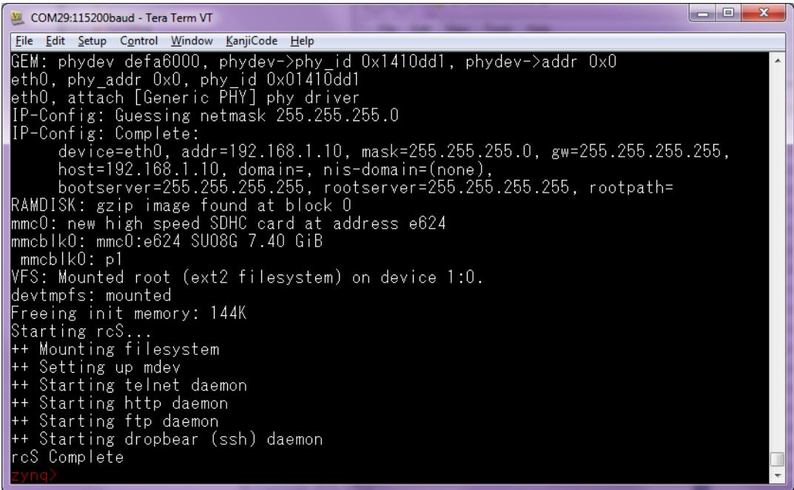

**Figure 5-12:Serial Teriminal Window showing Linux Booting**

- <span id="page-64-0"/>8. In the serial terminal window, at the **zynq>** prompt type:
zynq> mount /dev/mmcblk0p1 /mnt

zynq> /mnt/hello_world_ap.elf

This executes the hello_world_ap program and you see the display on the terminal.


# <span id="page-65-2"/><span id="page-65-0"/>5.4 **Controlling LEDs and Switches in Linux Example**

This example shows you how to create a simple Linux application that controls the status of the LEDs and prints the value of the switch settings, then prints "Hello World" on a serial terminal window. In this example, the default ZedBoard settings in PlanAhead as well as XPS are used; a bitstream is generated in PlanAhead and then the entire design is exported to SDK.

#### <span id="page-65-1"/>5.4.1 **Take a Test Drive! Controlling LEDs and Switches in a Linux Application**

For this test drive, just as you did in Chapter 2, you start the ISE PlanAhead design and analysis tool and create a project with an embedded processor system as the top level.

Start the PlanAhead tool.

- 3. Select **Create New Project** to open the New Project wizard.
- 4. Use the information in the table below to make your selections in the wizard screens.


| Wizard Screen       | System Property                                                                                 | Setting or Command to Use                                                   |  |  |
|---------------------|-------------------------------------------------------------------------------------------------|-----------------------------------------------------------------------------|--|--|
| Project Name        | Project name                                                                                    | Specify the project name.                                                   |  |  |
|                     | Project location                                                                                | Specify the directory in which to store<br>the project files.               |  |  |
|                     | Create Project Subdirectory                                                                     | Leave this checked.                                                         |  |  |
| Project Type        | Specify the type of sources for<br>your design. You can start with<br>RTL or a synthesized EDIF | Use the default selection, RTL Project.                                     |  |  |
| Add Sources         | Do not make any changes on this screen.                                                         |                                                                             |  |  |
| Add Existing IP     | Do not make any changes on this screen.                                                         |                                                                             |  |  |
| Add Constraints     | Do not make any changes on this screen.                                                         |                                                                             |  |  |
| Default Part        | Specify                                                                                         | Select Boards.                                                              |  |  |
|                     | Board                                                                                           | Select ZedBoard Zynq Evaluation and<br>Development Kit                      |  |  |
| New Project Summary | Project summary                                                                                 | Review the project summary before<br>clicking Finish to create the project. |  |  |

<span id="page-66-0"/>


When you click **Finish**, the New Project wizard closes and the project you just created opens in the PlanAhead design tool.

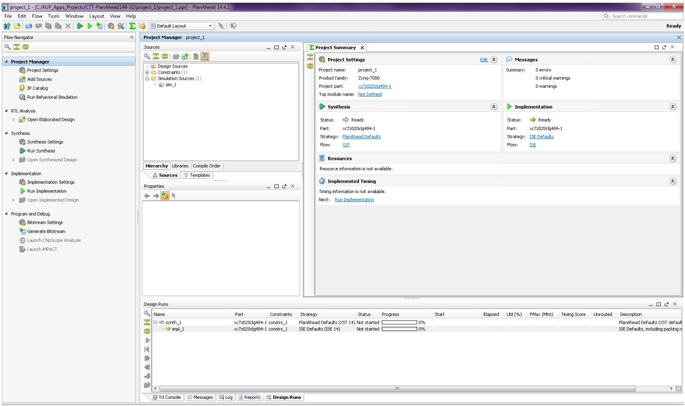

**Figure 5-15: PlanAhead GUI**

<span id="page-67-0"/>You'll now use the Add Sources wizard to create an embedded processor project.

- 11. Click **Add Sources** in the Project Manager.
The Add Sources wizard opens.

- 12. Select the **Add or Create Embedded Sources** option and click **Next**.
- 13. In the Add or Create Embedded Source window, click **Create Sub-Design**.
- 14. Type a name for the module and click **OK**. For this example, use the name **system**.

The module you created displays in the sources list.

- 15. Click **Finish**.
The PlanAhead design tool creates your embedded design source project. It recognizes that you have an embedded processor system and starts XPS.


#### **Continuing Your Design in XPS**

Create a new embedded system in XPS using the Base System Builder (BSB) Wizard.

In the BSB Wizard, you can select and configure the processing system I/O interface and add default peripherals to the fabric.

#### **Designing a New Embedded System Using the BSB Wizard**

- 1. The dialog box opens, and asks if you want to create a Base System using the BSB Wizard. Select **Yes.**
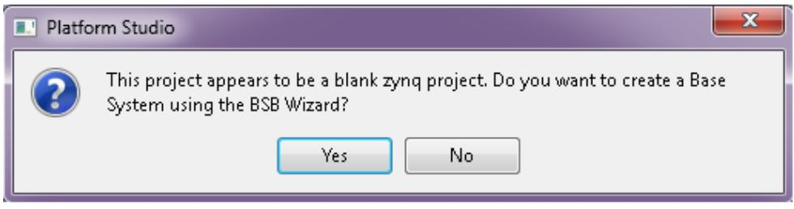

#### **Figure 5-16: Platform Studio dialog box**

<span id="page-68-0"/>The first window of the BSB asks you to elect whether to create an AXI-based or PLB-based system.


**Figure 5-17:Create New Project BSB Wizard**

- <span id="page-69-0"/>2. Select **AXI System** and click **OK**.
- 3. In the Base System Builder wizard, create a project using the settings described in the table. Where a setting or command has not been specified, accept the default values.

| Wizard Screen                 | System Property                  | Setting or Command to Use                                                                         |
|-------------------------------|----------------------------------|---------------------------------------------------------------------------------------------------|
| Board and System<br>Selection | Board                            | Use the default option to create a system<br>for ZedBoard Zynq Evaluation and<br>Development Kit. |
|                               |                                  | Note: This is pre-populated because you<br>selected this board in the PlanAhead tool.             |
|                               | Board Configuration              | This information is pre-populated based<br>on your board selection                                |
|                               | Select a System                  | Zynq Procesing System 7                                                                           |
| Peripheral<br>Configuration   | Select and Configure Peripherals | Leave the default peripheral<br>Configuration as-is.                                              |


**Figure 5-18: Peripheral Configuration Wizard**

- <span id="page-70-0"/>4. Click **Finish.**
- 5. Close the XPS window. The active PlanAhead tool session updates itself with the project settings.
- 5. Back in PlanAhead, under **Design Sources** in the Sources pane, select and rightclick **system (system.xmp)** and select **Create Top HDL**.

PlanAhead generates the system_stub.v top-level module for the design.

- 6. Generate a Bitstream: Under **Program and Debug**, select **Generate Bitstream**
- 7. Select **File > Export > Export Hardware for SDK**.

The Export Hardware dialog box opens.

- 8. Check the **Include Bitstream** check-box By default, the Export Hardware check-box is checked.
- 9. Check the **Launch SDK** check-box.
- 10. Click **OK**; SDK opens.


#### **Continuing Your Design in SDK**

- 1. Connect the12V AC/DC converter power cable to the ZedBoard barrel jack.
- 2. Connect a USB micro cable between the Windows Host machine and the ZedBoard JTAG (J17).
- 3. Connect a USB micro cable to the USB UART connector (J14) on the ZedBoard with the Windows Host machine. This is used for USB to serial transfer.
- 4. Connect an Ethernet cable between the ZedBoard and the Windows Host machine.
- 5. Power on the board using the jumper settings to boot from SD card.

MIO6: 0 MI05: 1 MIO4: 1 MIO3: 0 MIO2: 0

- 6. Open a serial communication utility for the COM port assigned on your system.
The default configuration for Zynq Processing System is: Baud rate 115200; 8 bit; Parity: none; Stop: 1 bit; Flow control: none

- 7. Linux boots up, and you will see the promt **zynq>** in the serial terminal window.
Next, program the FPGA with the bitstream created in PlanAhead.

- 8. In SDK, select Xilinx Tools Program FPGA. Select the bitstream generated in PlanAhead, and click **Program**.
- 9. When the FPGA is programmed, you will see the DONE LED LD12 light up in blue.

It may be necessary to double check the IP address of the ZedBoard for the subsequent steps. With the serial terminal open, at the **zynq>** prompt, type **ifconfig eth0** to verify that the address is set for 192.168.1.10. This should be the default IP address of the ZedBoard. If the IP address is not the same as above, then type: **ifconfig eth0 192.168.1.10 netmask 255.255.255.0** to set the correct board IP address.

Add the software application.

10. In SDK, select **File > New > Application Project**


**Figure 5-19: New Project Selection**

- <span id="page-72-0"/>11. Enter **leds_switches** in the **Project nam**e field
- 12. Select **Linux** as the OS Platform in the Target Software and select **Finish.**
- 13. Select **C** as the Language.
- 14. Click **Next**.
- 15. Select **Linux Empty Application** and click **Finish.**


#### **Figure 5-20:Add An Empty Application**

- <span id="page-73-0"/>16. Add a Software Application. At this point, you will create a software platform and an empty software project for the hardware. You will then import the hello_world_linux.c into the project, and SDK will automatically build and produce an elf (Executable and Load Format) file.
- 17. Right Click **leds_switches** and select **Import.**
- 18. In the Import dialog box, select **General File System** and select **Next.**


#### **Figure 5-21:Import .c file**

- <span id="page-74-0"/>19. Browse to the directory in which you saved the files that you downloaded. Select **leds_switches.c** and select **Finish** . In this example, the directory is C:\zedboard-143\files.
Check that the application is built without errors. Check the message log in the Console window.

#### **Debugging the Linux Application: Using SDK Remote Debugging**

- 1. Right-click leds_switches and select **Debug as > Debug Configurations**..
The Debug Configuration wizard opens.

- 2. In the Debug Configuration wizard, right-click **Remote ARM Linux Application** and click **New**.
- 3. In the Connection drop-down list, click **New**.
- 4. The New Connection wizard opens.
- 5. Click the **SSH Only** tab and click **Next**.
- 6. In the **Host Name** tab, type the target board IP ( it should be 192.168.1.10)
- 7. Set the connection name and description in the respective tabs.

© Copyright 2013 Xilinx


- 8. Click **Finish** to create the connection.
- 9. In the Debug Configuration wizard, under Remote "Absolute File Path for

C/C++ Application," click the **Browse** button . The Select Remote C/C++ Application File wizard opens.

#### 10. Do the following:

- a. Expand the root directory. It opens the Enter Password wizard.
- b. Provide the user ID and Password (**root**/**root**); select the **Save ID** and **Save Password** options.
- c. Click **OK**.

The window displays the root directory contents, because you previously established the connection between the Windows host machine and the target board.

- d. Right-click on the "/" in the path name and create a new directory; name it Apps.
- e. In the Apps directory, create a new file titled leds_switches_0.elf.
- f. Provide an application absolute path, such as /Apps/leds_switches_0.elf.

### 11. Click **Apply**.

- 12. Click **Debug**.
The Debug Perspective opens.

- 13. Turn off the Verbose console mode in the console window.
- 14. Step through the code or run the code, and watch the messages in the console window. AT the same time, you will notice the values of the Variables in the window on the top left hand side, show the status of the switches and LEDs.
- 15. The Console window displays the values of the LEDs and Switches, and Prints 'Hello World'.
- 16. Change the switch settings, and re-run the application to see the appropriately different values reported.

#### 17. Exit SDK


# <span id="page-76-0"/>**Chapter 6 Further "How-to's" and Examples**

Further examples on a variety of ZedBoard topics are explored and explained on ZedBoard.org. In particular, Zynqgeek Blog [(http://zedboard.org/zynqgeek)](http://zedboard.org/zynqgeek) contains helpful step-by-step instructions on several topics in particular:

- 1. [Creating a Custom Peripheral](http://www.zedboard.org/content/creating-custom-peripheral)
This webpage describes how to create a custom peripheral in the Programmable Logic portion of the Zynq-7000 device on the ZedBoard, and to communicate with it via the ARM Processing Subsystem. This design example follows the same steps as described in Chapter 2, starting with creating a PlanAhead project and exporting it to SDK.

#### 2. Talking to a [Custom Peripheral](http://www.zedboard.org/content/talking-custom-peripheral-bare-metal)

Once you've created a Custom Peripheral, this webpage explains how to use the Software Template created via the same custom peripheral wizard.

In addition to Zynqgeek's Blog, there are other useful links for the registered ZedBoard user on ZedBoard.org. Here is a sampling of the resources available to the registered members of the website:

#### 3. [Building a Zynq Video Design from Scratch](http://www.zedboard.org/sites/default/files/design/FMC_IMAGEON_Building_Video_Design_Tutorial_14_4_20130110.zip)

Leverage the processing and hardware acceleration capabilities of the Zynq SoC in building a HDMI pass-through video design. The latest version is linked above and may require additional mezzanine based hardware to the ZedBoard.

#### 4. [Community Projects](http://www.zedboard.org/projects)

Follow the latest ZedBoard community projects on ZedBoard.org. These projects range from software defined radios to further tutorials to widen your knowledge of Zynq, the Zedboard and Xilinx design tools.

#### 5. [Support and Troubleshooting](http://www.zedboard.org/forums/zedboard-english-forum)

There is a very active and vibrant Zynq and ZedBoard community on ZedBoard.org. For help in using the ZedBoard, the Support Forums provide an invaluable community based resource that can be leveraged.

Also helpful are Zynq specific documentation published on the Xilinx website. In particular, these two user guides expand on concepts covered in this document:

- 6. [Zynq-7000 All Programmable SoC Software Developers Guide](http://www.xilinx.com/support/documentation/user_guides/ug821-zynq-7000-swdev.pdf) Summarizes the software-centric information required for designing with the Xilinx Zynq-7000 Extensible Processing Platform (EPP) devices.


- 7. [Zynq-7000 All Programmable SoC Technical Reference Manual](http://www.xilinx.com/support/documentation/user_guides/ug585-Zynq-7000-TRM.pdf)
This user guide serves as a technical reference manual for the Zynq-7000 All Programmable SoC (AP SoC).


# <span id="page-78-0"/>**Appendix A**

# Application Software

# **A.1 About the Application Software**

The system you designed in this guide requires application software for the execution on the board. This appendix describes the details about the application software.

The main() function in the application software is the entry point for the execution. This function includes initialization and the required settings for all peripherals connected in the system. It also has a selection procedure for the execution of the different use cases, such as AXI GPIO and PS GPIO using EMIO interface. You can select different use cases by following the instruction on the serial terminal.

# **A.2 Application Software Steps**

Application Software comprises the following steps:

Initialize the AXI GPIO module.

- 1. Set a direction control for the AXI GPIO pin as an input pin, which is connected with BTNU push button on the board. The location is fixed via LOC constraint in the user constraint file (UCF) during system creation.
- 2. Initialize the AXI TIMER module with device ID 0.
- 3. Associate a timer callback function with AXI timer ISR.
- 4. This function is called every time the timer interrupt happens. This callback switches on the LED 'LD9' on the board and sets the interrupt flag.
- 5. The main() function uses the interrupt flag to halt execution, wait for timer interrupt to happen, and then restarts the execution.
- 6. Set the reset value of the timer, which is loaded to the timer during reset and timer starts.
- 7. Set timer options such as Interrupt mode and Auto Reload mode.
- 8. Initialize the PS section GPIO.


- 9. Set the PS section GPIO, channel 0, pin number 10 to the output pin, which is mapped to the MIO pin and physically connected to the LED 'LD9' on the board.
- 10. Set PS Section GPIO channel number 2 pin number 0 to input pin, which is mapped to PL side pin via the EMIO interface and physically connected to the BTNR push button switch.
- 11. Initialize Snoop control unit Global Interrupt controller. Also, register Timer interrupt routine to interrupt ID '91', register the exceptional handler, and enable the interrupt.
- 12. Execute a sequence in the loop to select between AXI GPIO or PS GPIO use case via serial terminal.

The software accepts your selection from the serial terminal and executes the procedure accordingly.

After the selection of the use case via the serial terminal, you must press a push button on the board as per the instruction on terminal. This action switches off the LED 'LD9', starts the timer, and tells the function to wait for the Timer interrupt to happen. After the Timer interrupt happens, LED 'LD9'' switches ON and restarts execution.

For more details about the API related to device drivers, refer to the **Zynq-7000 Software Developers Guide** (UG821) linked to in the previous chapter.

# **A.3 Application Software Code**

Below is the Application software for the system:

```
/*
 * Copyright (c) 2009 Xilinx, Inc. All rights reserved.
 *
 * Xilinx, Inc.
 * XILINX IS PROVIDING THIS DESIGN, CODE, OR INFORMATION "AS IS" AS A
 * COURTESY TO YOU. BY PROVIDING THIS DESIGN, CODE, OR INFORMATION AS
 * ONE POSSIBLE IMPLEMENTATION OF THIS FEATURE, APPLICATION OR
 * STANDARD, XILINX IS MAKING NO REPRESENTATION THAT THIS IMPLEMENTATION
 * IS FREE FROM ANY CLAIMS OF INFRINGEMENT, AND YOU ARE RESPONSIBLE
 * FOR OBTAINING ANY RIGHTS YOU MAY REQUIRE FOR YOUR IMPLEMENTATION.
 * XILINX EXPRESSLY DISCLAIMS ANY WARRANTY WHATSOEVER WITH RESPECT TO
 * THE ADEQUACY OF THE IMPLEMENTATION, INCLUDING BUT NOT LIMITED TO
 * ANY WARRANTIES OR REPRESENTATIONS THAT THIS IMPLEMENTATION IS FREE
 * FROM CLAIMS OF INFRINGEMENT, IMPLIED WARRANTIES OF MERCHANTABILITY
 * AND FITNESS FOR A PARTICULAR PURPOSE.
 *
 * helloworld.c: simple test application
 */
#include <stdio.h>
#include "platform.h"
#include "xil_types.h"
#include "xgpio.h"
#include "xtmrctr.h"
#include "xparameters.h"
#include "xgpiops.h"
```
© Copyright 2013 Xilinx Page 80 Zynq ZedBoard Concepts, Tools, and Techniques 3/22/2013


```
© Copyright 2013 Xilinx
Page 81 Zynq ZedBoard Concepts, Tools, and Techniques 3/22/2013
#include "xil_io.h"
#include "xil_exception.h"
#include "xscugic.h"
static XGpioPs psGpioInstancePtr;
extern XGpioPs_Config XGpioPs_ConfigTable[XPAR_XGPIOPS_NUM_INSTANCES];
static int iPinNumber = 7; /*Led LD9 is connected to MIO pin 7*/
XScuGic InterruptController; /* Instance of the Interrupt Controller */
static XScuGic_Config *GicConfig;/* The configuration parameters of the
 controller */
static int InterruptFlag;
extern char inbyte(void);
void Timer_InterruptHandler(void *data, u8 TmrCtrNumber)
{
 print("\r\n");
 print("\r\n");
 print("@@@@@@@@@@@@@@@@@@@@@@@@@@@@@\r\n");
 print(" Inside Timer ISR \n \r ");
 XTmrCtr_Stop(data,TmrCtrNumber);
 // PS GPIO Writing
 print("LED 'LD9' Turned ON \r\n");
 XGpioPs_WritePin(&psGpioInstancePtr,iPinNumber,1);
 XTmrCtr_Reset(data,TmrCtrNumber);
 print(" Timer ISR Exit\n \n \r");
 print("@@@@@@@@@@@@@@@@@@@@@@@@@@@@@\r\n");
 print("\r\n");
 print("\r\n");
 InterruptFlag = 1;
}
int SetUpInterruptSystem(XScuGic *XScuGicInstancePtr)
{
 /*
 * Connect the interrupt controller interrupt handler to the hardware
 * interrupt handling logic in the ARM processor.
 */
 Xil_ExceptionRegisterHandler(XIL_EXCEPTION_ID_INT,
 (Xil_ExceptionHandler) XScuGic_InterruptHandler,
 XScuGicInstancePtr);
 /*
 * Enable interrupts in the ARM
 */
 Xil_ExceptionEnable();
 return XST_SUCCESS;
}
int ScuGicInterrupt_Init(u16 DeviceId,XTmrCtr *TimerInstancePtr)
{
 int Status;
 /*
 * Initialize the interrupt controller driver so that it is ready to
 * use.
 */
 GicConfig = XScuGic_LookupConfig(DeviceId);
 if (NULL == GicConfig) {
 return XST_FAILURE;
 }
 Status = XScuGic_CfgInitialize(&InterruptController, GicConfig,
 GicConfig->CpuBaseAddress);
 if (Status != XST_SUCCESS) {
 return XST_FAILURE;
 }
 /*
 * Setup the Interrupt System
 */
 Status = SetUpInterruptSystem(&InterruptController);
 if (Status != XST_SUCCESS) {
 return XST_FAILURE;
 }
 /*
 * Connect a device driver handler that will be called when an
```


```
 * interrupt for the device occurs, the device driver handler performs
 * the specific interrupt processing for the device
 */
 Status = XScuGic_Connect(&InterruptController,
 XPAR_FABRIC_AXI_TIMER_0_INTERRUPT_INTR,
 (Xil_ExceptionHandler)XTmrCtr_InterruptHandler,
 (void *)TimerInstancePtr);
 if (Status != XST_SUCCESS) {
 return XST_FAILURE;
 }
 /*
 * Enable the interrupt for the device and then cause (simulate) an
 * interrupt so the handlers will be called
 */
 XScuGic_Enable(&InterruptController, XPAR_FABRIC_AXI_TIMER_0_INTERRUPT_INTR);
 return XST_SUCCESS;
}
int main()
{
 static XGpio GPIOInstance_Ptr;
 XGpioPs_Config*GpioConfigPtr;
 XTmrCtr TimerInstancePtr;
 int xStatus;
 u32 Readstatus=0,OldReadStatus=0;
 //u32 EffectiveAdress = 0xE000A000;
 int iPinNumberEMIO = 54;
 u32 uPinDirectionEMIO = 0x0;
 // Input Pin
 // Pin direction
 u32 uPinDirection = 0x1;
 int exit_flag,choice,internal_choice;
 init_platform();
 /* data = *(u32 *)(0x42800004);
 print("OK \n");
 data = *(u32 *)(0x41200004);
 print("OK-1 \n");
 */
 print("##### Application Starts #####\n\r");
 print("\r\n");
 //~~~~~~~~~~~~~~~~~~~~~~~~~~~~~~~~~~~~~~~~~~~~~~~~~~~~~~~~~~~~~~~~~~~~~~~~~~~
 //Step-1 :AXI GPIO Initialization
 //~~~~~~~~~~~~~~~~~~~~~~~~~~~~~~~~~~~~~~~~~~~~~~~~~~~~~~~~~~~~~~~~~~~~~~~~~~~
 xStatus = XGpio_Initialize(&GPIOInstance_Ptr,XPAR_AXI_GPIO_0_DEVICE_ID);
 if(XST_SUCCESS != xStatus)
 print("GPIO INIT FAILED\n\r");
 //~~~~~~~~~~~~~~~~~~~~~~~~~~~~~~~~~~~~~~~~~~~~~~~~~~~~~~~~~~~~~~~~~~~~~~~~~~~
 //Step-2 :AXI GPIO Set the Direction
 //~~~~~~~~~~~~~~~~~~~~~~~~~~~~~~~~~~~~~~~~~~~~~~~~~~~~~~~~~~~~~~~~~~~~~~~~~~~
 XGpio_SetDataDirection(&GPIOInstance_Ptr, 1,1);
 //~~~~~~~~~~~~~~~~~~~~~~~~~~~~~~~~~~~~~~~~~~~~~~~~~~~~~~~~~~~~~~~~~~~~~~~~~~~
 //Step-3 :AXI Timer Initialization
 //~~~~~~~~~~~~~~~~~~~~~~~~~~~~~~~~~~~~~~~~~~~~~~~~~~~~~~~~~~~~~~~~~~~~~~~~~~~
 xStatus = XTmrCtr_Initialize(&TimerInstancePtr,XPAR_AXI_TIMER_0_DEVICE_ID);
 if(XST_SUCCESS != xStatus)
 print("TIMER INIT FAILED \n\r");
 //~~~~~~~~~~~~~~~~~~~~~~~~~~~~~~~~~~~~~~~~~~~~~~~~~~~~~~~~~~~~~~~~~~~~~~~~~~~
 //Step-4 :Set Timer Handler
 //~~~~~~~~~~~~~~~~~~~~~~~~~~~~~~~~~~~~~~~~~~~~~~~~~~~~~~~~~~~~~~~~~~~~~~~~~~~
 XTmrCtr_SetHandler(&TimerInstancePtr,
 Timer_InterruptHandler,
 &TimerInstancePtr);
 //~~~~~~~~~~~~~~~~~~~~~~~~~~~~~~~~~~~~~~~~~~~~~~~~~~~~~~~~~~~~~~~~~~~~~~~~~~~
 //Step-5 :Setting timer Reset Value
 //~~~~~~~~~~~~~~~~~~~~~~~~~~~~~~~~~~~~~~~~~~~~~~~~~~~~~~~~~~~~~~~~~~~~~~~~~~~
 XTmrCtr_SetResetValue(&TimerInstancePtr,
 0, //Change with generic value
 0xf0000000);
 //~~~~~~~~~~~~~~~~~~~~~~~~~~~~~~~~~~~~~~~~~~~~~~~~~~~~~~~~~~~~~~~~~~~~~~~~~~~
 //Step-6 :Setting timer Option (Interrupt Mode And Auto Reload )
 //~~~~~~~~~~~~~~~~~~~~~~~~~~~~~~~~~~~~~~~~~~~~~~~~~~~~~~~~~~~~~~~~~~~~~~~~~~~
```
© Copyright 2013 Xilinx Page 82 Zynq ZedBoard Concepts, Tools, and Techniques 3/22/2013


```
© Copyright 2013 Xilinx
 XTmrCtr_SetOptions(&TimerInstancePtr,
 XPAR_AXI_TIMER_0_DEVICE_ID,
 (XTC_INT_MODE_OPTION | XTC_AUTO_RELOAD_OPTION ));
 //~~~~~~~~~~~~~~~~~~~~~~~~~~~~~~~~~~~~~~~~~~~~~~~~~~~~~~~~~~~~~~~~~~~~~~~~~~~
 //Step-7 :PS GPIO Intialization
 //~~~~~~~~~~~~~~~~~~~~~~~~~~~~~~~~~~~~~~~~~~~~~~~~~~~~~~~~~~~~~~~~~~~~~~~~~~~
 GpioConfigPtr = XGpioPs_LookupConfig(XPAR_PS7_GPIO_0_DEVICE_ID);
 if(GpioConfigPtr == NULL)
 return XST_FAILURE;
 xStatus = XGpioPs_CfgInitialize(&psGpioInstancePtr,
 GpioConfigPtr,
 GpioConfigPtr->BaseAddr);
 if(XST_SUCCESS != xStatus)
 print(" PS GPIO INIT FAILED \n\r");
 //~~~~~~~~~~~~~~~~~~~~~~~~~~~~~~~~~~~~~~~~~~~~~~~~~~~~~~~~~~~~~~~~~~~~~~~~~~~
 //Step-8 :PS GPIO pin setting to Output
 //~~~~~~~~~~~~~~~~~~~~~~~~~~~~~~~~~~~~~~~~~~~~~~~~~~~~~~~~~~~~~~~~~~~~~~~~~~~
 XGpioPs_SetDirectionPin(&psGpioInstancePtr, iPinNumber,uPinDirection);
 XGpioPs_SetOutputEnablePin(&psGpioInstancePtr, iPinNumber,1);
 //~~~~~~~~~~~~~~~~~~~~~~~~~~~~~~~~~~~~~~~~~~~~~~~~~~~~~~~~~~~~~~~~~~~~~~~~~~~
 //Step-9 :EMIO PIN Setting to Input port
 //~~~~~~~~~~~~~~~~~~~~~~~~~~~~~~~~~~~~~~~~~~~~~~~~~~~~~~~~~~~~~~~~~~~~~~~~~~~
 XGpioPs_SetDirectionPin(&psGpioInstancePtr,
 iPinNumberEMIO,uPinDirectionEMIO);
 XGpioPs_SetOutputEnablePin(&psGpioInstancePtr, iPinNumberEMIO,0);
 //~~~~~~~~~~~~~~~~~~~~~~~~~~~~~~~~~~~~~~~~~~~~~~~~~~~~~~~~~~~~~~~~~~~~~~~~~~~
 //Step-10 : SCUGIC interrupt controller Initialization
 //Registration of the Timer ISR
 //~~~~~~~~~~~~~~~~~~~~~~~~~~~~~~~~~~~~~~~~~~~~~~~~~~~~~~~~~~~~~~~~~~~~~~~~~~~
 xStatus=
 ScuGicInterrupt_Init(XPAR_PS7_SCUGIC_0_DEVICE_ID,&TimerInstancePtr);
 if(XST_SUCCESS != xStatus)
 print(" :( SCUGIC INIT FAILED \n\r");
 //~~~~~~~~~~~~~~~~~~~~~~~~~~~~~~~~~~~~~~~~~~~~~~~~~~~~~~~~~~~~~~~~~~~~~~~~~~~
 //Step-11 :User selection procedure to select and execute tests
 //~~~~~~~~~~~~~~~~~~~~~~~~~~~~~~~~~~~~~~~~~~~~~~~~~~~~~~~~~~~~~~~~~~~~~~~~~~~
 exit_flag = 0;
 while(exit_flag != 1)
 {
 print(" SELECT the Operation from the Below Menu \r\n");
 print("###################### Menu Starts ########################\r\n");
 print("Press '1' to use NORMAL GPIO as an input (BTNU switch)\r\n");
 print("Press '2' to use EMIO as an input (BTNR switch)\r\n");
 print("Press any other key to Exit\r\n");
 print(" ##################### Menu Ends #########################\r\n");
 choice = inbyte();
 printf("Selection : %c \r\n",choice);
 internal_choice = 1;
 switch(choice)
 {
 //~~~~~~~~~~~~~~~~~~~~~~~
 // Use case for AXI GPIO
 //~~~~~~~~~~~~~~~~~~~~~~~~
 case '1':
 exit_flag = 0;
 print("Press Switch 'BTNU' push button on board \r\n");
 print(" \r\n");
 while(internal_choice != '0')
 {
 Readstatus = XGpio_DiscreteRead(&GPIOInstance_Ptr, 1);
 if(1== Readstatus && 0 == OldReadStatus )
 {
 print("$$$$$$$$$$$$$$$$$$$$$$$$$$$$$$$$$$$$$$$$$$$$$\r\n");
 print("BTNU PUSH Button pressed \n\r");
 print("LED 'LD9' Turned OFF \r\n");
 XGpioPs_WritePin(&psGpioInstancePtr,iPinNumber,0);
 //Start Timer
 XTmrCtr_Start(&TimerInstancePtr,0);
 print("timer start \n\r");
 //Wait For interrupt;
 print("Wait for the Timer interrupt to tigger \r\n");
```


```
 print("$$$$$$$$$$$$$$$$$$$$$$$$$$$$$$$$$$$$$$$$$$$$$\r\n");
 print(" \r\n");
 while(InterruptFlag != 1);
 InterruptFlag = 0;
 print(" ###########################################\r\n ");
 print("Press '0' to go to Main Menu \n\r ");
 print("Press any other key to remain in AXI GPIO Test \n\r ");
 print(" ###########################################\r\n ");
 internal_choice = inbyte();
 printf("Select = %c \r\n",internal_choice);
 if(internal_choice != '0')
 {
 print("Press Switch 'BTNU' push button on board \r\n");
 }
 }
 OldReadStatus = Readstatus;
 }
 print(" \r\n");
 print(" \r\n");
 break;
 case '2' :
 //~~~~~~~~~~~~~~~~~~~~~~~
 //Usecase for PS GPIO
 //~~~~~~~~~~~~~~~~~~~~~~~~
 exit_flag = 0;
 print("Press Switch 'BTNR' push button on board \r\n");
 print(" \r\n");
 while(internal_choice != '0')
 {
 Readstatus = XGpioPs_ReadPin(&psGpioInstancePtr,
 iPinNumberEMIO);
 if(1== Readstatus && 0 == OldReadStatus )
 {
 print("$$$$$$$$$$$$$$$$$$$$$$$$$$$$$$$$$$$$$$$$$$$$$\r\n");
 print("BTNR PUSH Button pressed \n\r");
 print("LED 'LD9' Turned OFF \r\n");
 XGpioPs_WritePin(&psGpioInstancePtr,iPinNumber,0);
 //Start Timer
 XTmrCtr_Start(&TimerInstancePtr,0);
 print("timer start \n\r");
 //Wait For interrupt;
 print("Wait for the Timer interrupt to tigger \r\n");
 print("$$$$$$$$$$$$$$$$$$$$$$$$$$$$$$$$$$$$$$$$$$$$$$$$$$$\r\n");
 print(" \r\n");
 while(InterruptFlag != 1);
 InterruptFlag = 0;
 print(" ###########################################\r\n ");
 print("Press '0' to go to Main Menu \n\r ");
 print("Press any other key to remain in EMIO Test \n\r ");
 print(" ###########################################\r\n ");
 internal_choice = inbyte();
 printf("Select = %c \r\n",internal_choice);
 if(internal_choice != '0')
 {
 print("Press Switch 'BTNR' push button on board \r\n");
 }
 }
 OldReadStatus = Readstatus;
 }
 print(" \r\n");
 print(" \r\n");
 break;
 default :
 exit_flag = 1;
 break;
 }
 print("\r\n");
 print("***********\r\n");
 print("BYE \r\n");
 print("***********\r\n");
```
}


 cleanup_platform(); return 0; }